**Thank you for choosing keyestudio!**

**We will endeavour to provide you with better products and services!**

------

**About keyestudio**

Keyestudio is the best-selling brand owned by KEYES Corporation. Our product contains Arduino development and expansion boards, sensors and modules, Raspberry Pi, micro:bit expansion boards as well as smart cars and learning kits, which can help customers at any level to learn about Arduino.

Notably, all of our products are in line with international quality standards and are greatly appreciated in a broad menu of different markets across the world.

Welcome to check out more contents from our official website: [http://www.keyestudio.com](http://www.keyestudio.com)

------

**Obtain Information and After-sales Service**

1. If something is found missing or broken, or you have some difficulty learning the kit, please feel free to contact us. Welcome to send email to us: [service@keyestudio.com](http://m.138.gz.cn/webadmin/~CAmsnCrrNXhTAySKCerrIfWjjZuuWVfI/~/usr/mod_edituser.jsp?;uid=service@keyestudio.com;;clearCache=)

2. We will endeavour to update projects and products continuously from your sincere advice! Thanks!

------

**Warning**

1. This product contains tiny pin headers, so please keep out of reach of children under 7 to prevent from lacerations. 
2. This product also contains conductive parts(control board and electronic modules). Please operate according to the requirements of tutorials. Otherwise, improper operation may damage parts due to overheating. In this case, do not touch it and immediately disconnect the circuit power.

------

**Copyright**

The Keyestudio trademark and logo are the copyright of **KEYES DIY ROBOT co.,LTD**. All products under Keyestudio brand can’t be copied, sold or resold without authorization by anyone or any company. If you are interested in our products, please contact to our sales representatives: [fennie@keyestudio.com](http://m.138.gz.cn/webadmin/~CAmsnCrrNXhTAySKCerrIfWjjZuuWVfI/~/usr/mod_edituser.jsp?;uid=fennie@keyestudio.com;;clearCache=)

------

**Keyestudio IOT Learning Kit for ESP32**

---

# Introduction

Welcome to Keyestudio ESP-32 IOT Learning Kit! This kit is designed for beginners and developers with an insight into the versatile world of ESP-32 microcontrollers. With ESP-32 WROOM 32 at its core, it includes components such as leds, sensors, and motor. Thus, users can explore a wide variety of DIY and IoT projects.

Whether you're keen on basic electronics or IoT integration, this kit covers what you want. It not only provides IDE setup and basic syntax of MicroPython, but also covers those of Arduino with a dedicated section on fun DIY and projects.

In this kit, each project is carefully outlined to ensure you understand the objectives, circuit assembly, programming and code interpretation. Beyond that, actual application programs and troubleshooting FAQs are contained to provide a rich learning experience for all. Let's start the games and IoT projects with ESP-32!

In addition, if you have any difficulties or questions about this tutorial and kit, please contact us at any time.

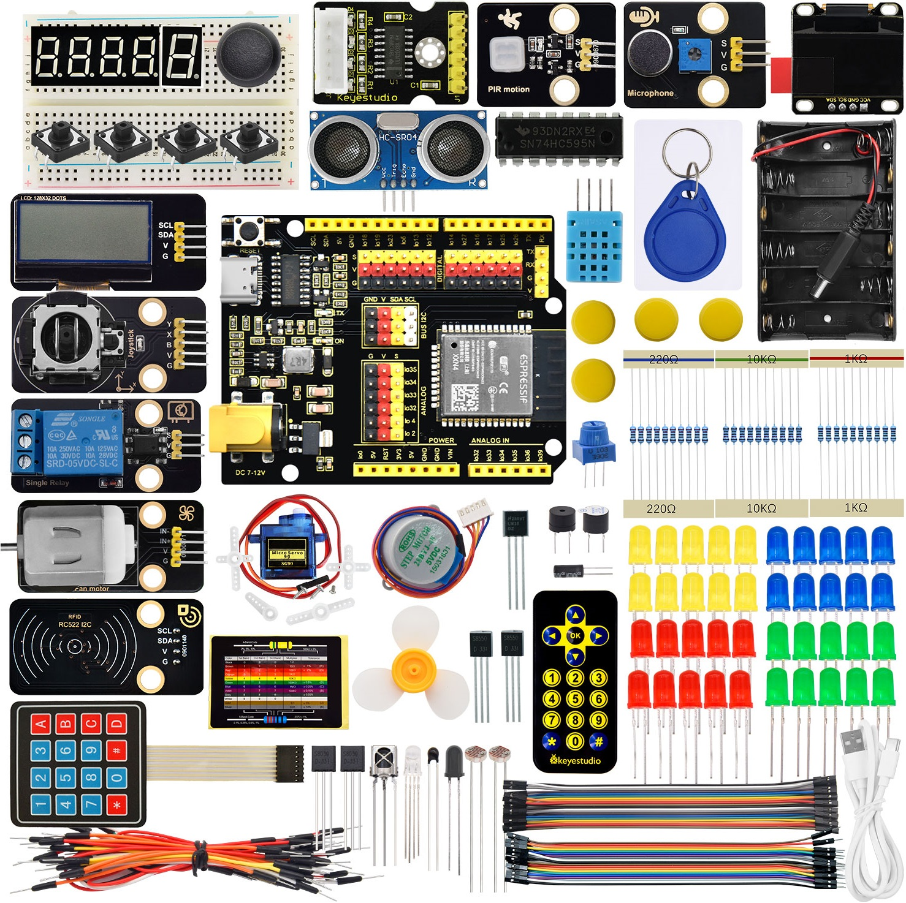

---

# Kit List

Please check the list to ensure that all parts are intact. If you find missing ones, please contact our sales staff immediately.

|  #   |                   PIC                   |                             NAME                             | QTY  |
| :--: | :--: | :--: | :--: |
| 1 |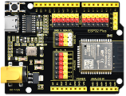| ESP32 PLUS main control board |1|
| 2 |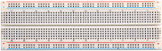| breadboard | 1 |
| 3 | 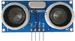 | ultrasonic sensor | 1 |
| 4 | 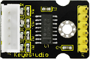 | stepper motor drive board | 1 |
| 5 | 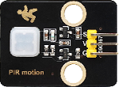| PIR motion sensor | 1 |
| 6 | 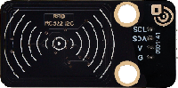 | RFID module | 1 |
| 7 | 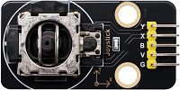 | joystick module | 1 |
| 8 | 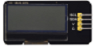 | LCD_128X32_DOT module | 1 |
| 9|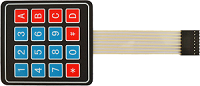 | thin film 4*4 key pad | 1 |
| 10| 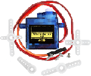 | servo | 1 |
| 11 | 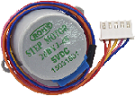 | stepper motor | 1 |
| 12 | 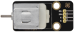| DC motor | 1 |
| 13 |  | 1-bit digital tube | 1 |
| 14 |  | 4-bit digital tube | 1 |
| 15 | 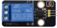 | relay module | 1 |
| 16 | 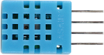| DHT11 temperature and humidity sensor | 1 |
| 17 | | LM35 temperature sensor | 1 |
| 18 | 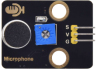| sound sensor | 1 |
| 19 | 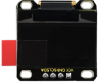|OLED module|1|
| 20| 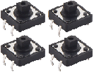| button | 4 |
| 21 | 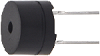 | passive buzzer | 1 |
| 22 | 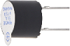 | active buzzer | 1 |
| 23 | 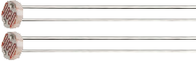 | photoresistor | 2 |
| 24 | 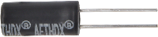 | tilt switch | 1 |
| 25 |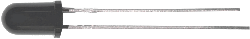 | flame sensor | 1 |
| 26 |  |thermistor| 1 |
| 27 |  | IR receiver | 1 |
| 28 | 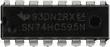 | 74HC595 chip | 1 |
| 29 | 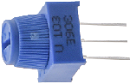 | potentiometer | 1 |
| 30 |  | NPN(S8050) transistor | 2 |
| 31 | 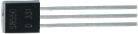| PNP(S8550) transistor | 2 |
| 32 |  | RGB LED| 1 |
| 33 | 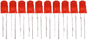 |red LED| 10 |
| 34 |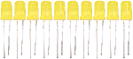 | yellow LED | 10 |
| 35 | 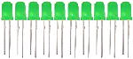 | green LED | 10 |
| 36 | 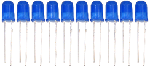 | blue LED | 10 |
| 37 | 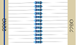 | 220Ω resistor | 10 |
| 38| 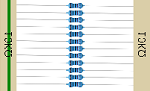 | 10KΩ resistor | 10 |
| 39| 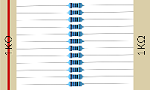 | 1KΩ resistor | 10 |
| 40 |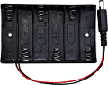 | battery holder | 1 |
| 41 |  | IC card | 1|
| 42| | ID card | 1 |
| 43 |  |joystick cap| 1 |
| 44 | | fan | 1 |
| 45 |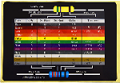|resistance card| 1 |
| 46| |remote control | 1 |
| 47 |  | yellow button cap | 4|
| 48 |  |Micro USB cable | 1 |
| 49 |  | jumper wire | 1 |
| 50 |  | F-F DuPont wire | 1 |
| 51 |  | M-F DuPont wire | 1 |
| 52 | 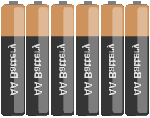 | 1.5V AA battery (**self-provided**) | 6 |

---

# Resource Download

Click to download to all resources such as project codes and libraries.

- [Codes](Codes.zip)

- [Library](Library.zip)

---

# ESP32 Main Control Board

For details, please visit: [https://docs.keyestudio.com/projects/KS5016](https://docs.keyestudio.com/projects/KS5016)

---

# Troubleshooting Guide

1. Q: Error occurs during burning code on ESP32 main board?

	A: Please check whether the ESP32 board model and the USB serial port number is correct.

2. Q: The serial port is not displayed after ESP32 connects to computer via Micro USB cable?

	A: Please check whether the ESP32 board is properly connected to the computer. Click “Device Manager” to check whether the corresponding serial port is displayed. If the port number is correct, the connection is intact, if not, there may be a problem with the USB chip on ESP32 board. 

3. Q: After burning code, sensors/modules do not work or the serial monitor shows nothing?

	A: Please ensure the connected pin is in accordance with the code. If it is not, codes prevail.

4. Q: Servo works out of order?

	A: The power voltage may be insufficient. Try to connect to an external power supply. 

5. Q: The distance detected by the ultrasonic sensor is inaccurate?

	A: The distance is detected from the emitter. This module is not a high-precision one, so differences exist.

6. Q: Fan(motor) works out of order to burn the main board?

	A: When the fan is working, the required current is larger than that of other sensors, which may cause voltage and current fluctuations in the circuit. Especially when the fan is rotating forward to backward, the fluctuations are so large that the voltage and current of the ESP32 board is very low, thus being reset. An external power supply is required for the ESP32 board to ensure that the fans can work properly.

7. Q: The tone played by the passive buzzer is not conform with actual intonation pitch?

	A: The common passive buzzer can not meet the requirements of professional tones. If you need very accurate pitch, a more professional buzzer should be adopted.

8. Q: False alarm happens on the PIR motion sensor?

	A: To avoid false alarm, requirements are as follows:

	- Away the detection range from blowing objects caused by the wind, such as curtains, clothing and flowers.
	- Away the detection range from interference of strong light irradiation, including sunlight, car light and spotlight.


9. Q: Is the temperature and humidity sensor waterproof?

	A: The sensor detects the temperature and humidity in the air, rather than water. It is not waterproof so please do not directly put it into water.

10. Q: OLED module does not light up after powering on?

	A: OLED does not include a backlight and is self-lighting mode. OLED will not light when only connecting to VCC and GND. It must be programmed to light up.

11. Q: WiFi connection always fails?

	A: Please put the ESP32 WiFi board around the router, press the on-board reset button, and wait for the connection. If it still can’t connect, please check whether the WiFi name and passwords are correct.

12. Q: The response is slow when remote-controlling sensors through web page?

	A: Causes of slow transmission on router network:

	- If multiple users are connected and the CPU resources of the router are insufficient, restart the router and reconnect to the network.

	- If the router is used for a long time, restart it.

	- There is wireless interference. Wireless signals are unstable, so please do not use through walls.
	- For more router related knowledge, please **Google**.

---

# 1. Arduino_C Tutorial

## 1-1 About Arduino IDE

### 1-1-1 Install Arduino IDE(<span style="color: rgb(255, 76, 65);">Important</span>)

Arduino IDE provides all the software needed to complete Arduino projects, which allows us to write programs and upload them to the Arduino board.

Arduino IDE 2.3.3 is published as an open source tool and is improved based on Arduino IDE 1.x. It comes with improved user interfaces, boards and library managers, debuggers, auto-complete capabilities, etc.

In this tutorial, we will demonstrate how to download and install Arduino IDE 2.3.3 on a Windows, MacOS, or Linux computer.

**⚠️ATTENTION**: In this tutorial, we use Arduino IDE 2.3.3. Other versions may not be compatible.


**<span style="font-size: 20px;">Requirement</span>**

- Windows - Win 10 or later versions, 64 bit
- Linux - 64 bit
- MacOS - 64 bit

**<span style="font-size: 20px;">Download</span>**

1\. access [Arduino IDE 2.3.3](https://www.arduino.cc/en/software#future-version-of-the-arduino-ide)

2\. download the IDE version that is compatible with your computer.

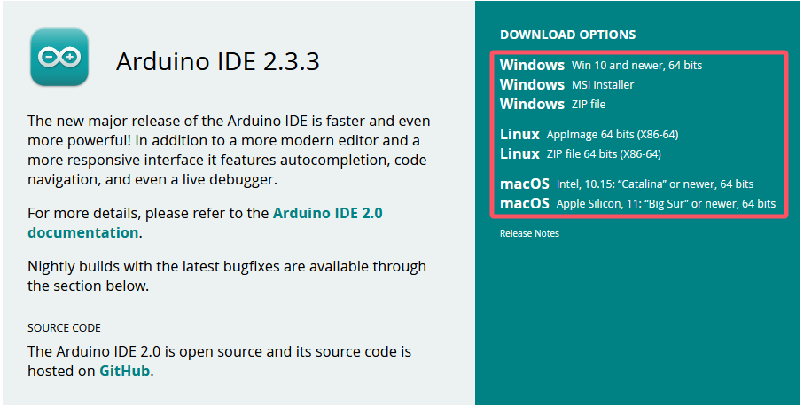

**⚠️NOTE:** Arduino IDE version updates fast and advanced versions may fail to compile codes. Therefore, we provide the Arduino IDE 2.3.3 package.

[Arduino IDE 2.3.3](https://downloads.arduino.cc/arduino-ide/arduino-ide_2.3.3_Windows_64bit.exe)

**<span style="font-size: 20px;">Installation</span>**

**Windows**

1\. Click **arduino-ide_xxxx.exe** file to execute the file.

2\. Read license agreement and click “**I Agree**”.

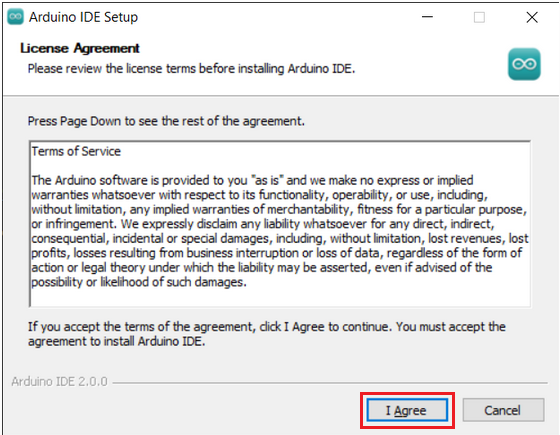

3\. Tick “**Anyone who uses this conputer(all users)**”, and “**Next**”.

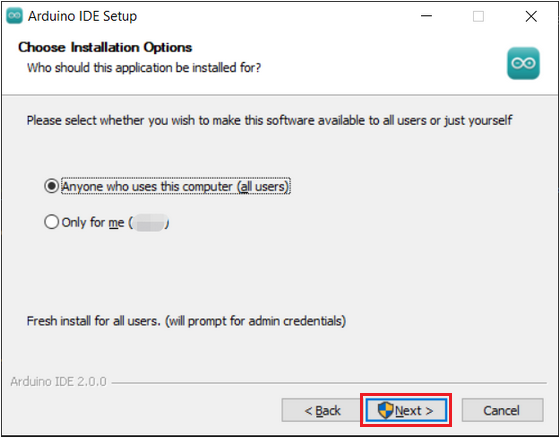

4\. Choose an installation path and click “**Install**”.

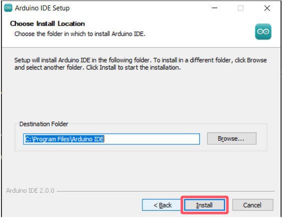

5\. “**Finish**”.

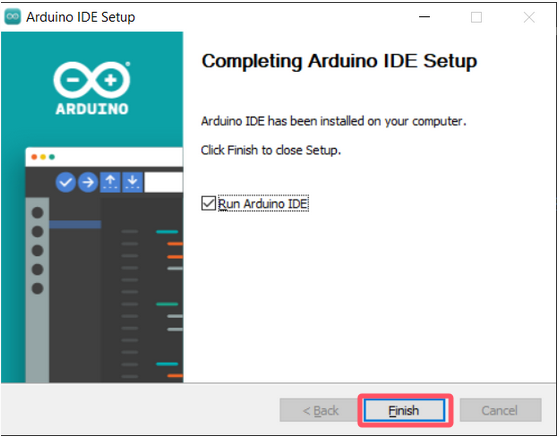

**MacOS:**

Download **arduino_ide_xxxx.dmg** , and copy **Arduino IDE.app** to **Applications** file to install the Arduino IDE.


**Linux:**

For how to install Arduino IDE 2.3.3 on Linux, please refer to： [https://docs.arduino.cc/software/ide-v2/tutorials/getting-started/ide-v2-downloading-and-installing/#linux](https://docs.arduino.cc/software/ide-v2/tutorials/getting-started/ide-v2-downloading-and-installing/#linux)

**<span style="font-size: 24px;">Enablement</span>**

1\. Open Arduino IDE 2.3.3 and it will install Arduino AVR board and built-in libraries automatically. 

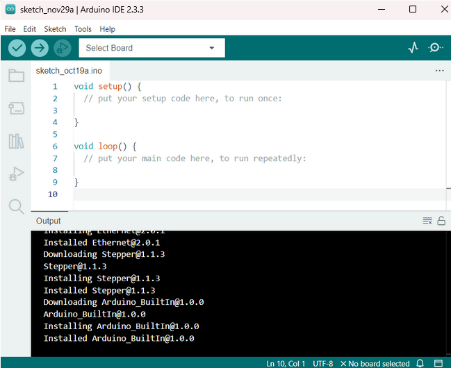

2\. The firewall or Security Centres may pop up some windows asking if you want to install drivers. Please install.

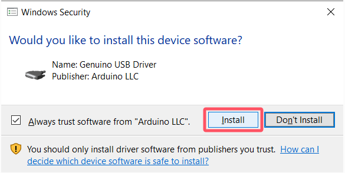

3\. Now the Arduino IDE is ready!

**⚠️ATTENTION:** If some installations don’t work due to issues like poor network, re-open Arduino IDE to complete the rest of the installation. After that, “Output” does not open automatically unless you click “Verify” or “Upload”.

### 1-1-2 Install Driver(<span style="color: rgb(255, 76, 65);">Important</span>)

A driver is required to enable the ESP32 main board. Otherwise, there will be no COM port to be connected on the computer.

How to install driver: [https://docs.keyestudio.com/projects/Arduino/en/latest/Arduino%20IDE%20Tutorial.html#install-driver](https://docs.keyestudio.com/projects/Arduino/en/latest/Arduino%20IDE%20Tutorial.html#install-driver)

Enter the corresponding guide according to ESP32 board and operating system.


### 1-1-3 Arduino IDE Toolbar

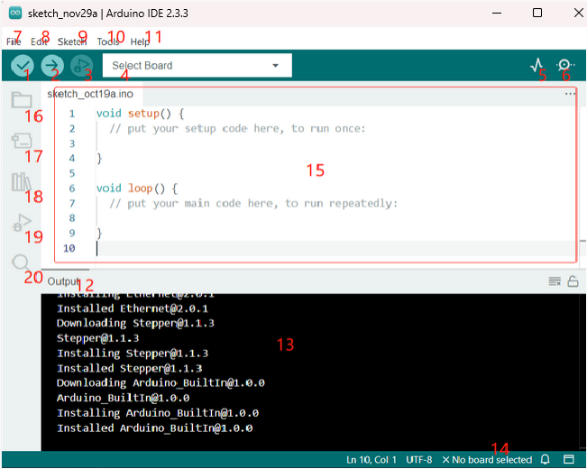

- 1\. **Verify** - compiles your code to your Arduino Board.
- 2\. **Verify / Upload** - compiles and uploads your code to your Arduino Board. The on-board RX and TX LED quickly flash until uploading finishes.
- 3\. **Debugger** - test and debug programs in real time.
- 4\. **Select Board** - choose board and port.
- 5\. **Serial Plotter** - displays serial data in a method of line graph
- 6\. **Serial Monitor** - opens the Serial Monitor tool, as a new tab in the console.
- 7\. **File** - includes new Sketch, open Sketch, open recently used code, open sample code, close the IDE, save code, preferences, advanced Settings, etc.
- 8\. **Edit** - includes copy, paste, automatic formatting, font size, etc. (shortcut keys are recommended).
- 9\. **Sketch** - includes verify\compile, upload code, import library and so on.
- 10\. **Tools** - The most important two are development board and port. They must be set before uploading code.
- 11\. **Help** - Views the IDE version and official reference documents.
- 12\. **Output Bar** - alter output.
- 13\. **IDE prompt area** -Uploading fails or succeeds & Serial monitor display area.
- 14\. **Board & Port** - preview board model and port. You may re-set in  “Tools → Board / Port”.
- 15\. **Code editing area**
- 16\. **Sketchbook** - here you will find all of your sketches locally stored on your computer.
- 17\. **Boards Manager** - install or remove Arduino Boards.
- 18\. **Library Manager** - browse through thousands of Arduino libraries or import local libraries.
- 19\. **Debugger** - test and debug programs in real time.
- 20\. **Search** - search for keywords in your code.

### 1-1-4 Install ESP32 Board(<span style="color: rgb(255, 76, 65);">Important</span>)

ESP32 board needs to be installed in Arduino IDE before using.

**Install ESP32**

1\. Click “**File → Preferences**”.

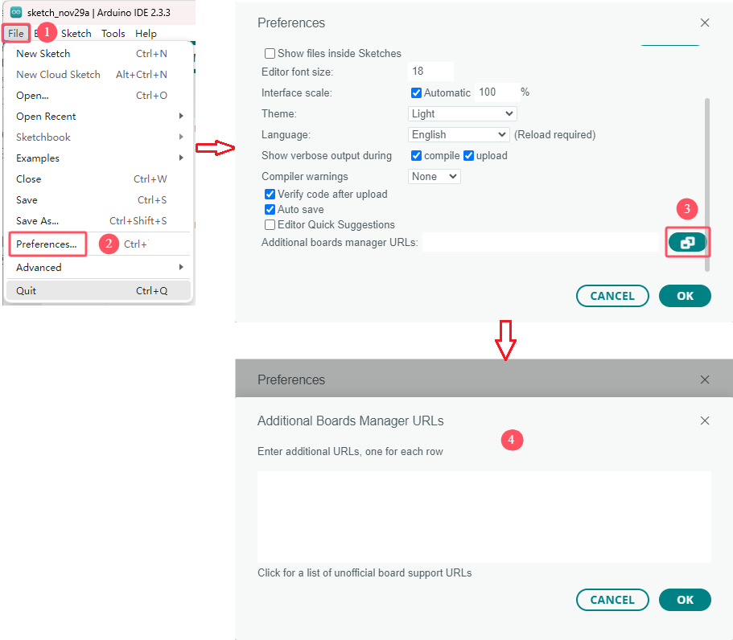

2\. Add the link：**https://espressif.github.io/arduino-esp32/package_esp32_index.json**  in Additional boards manager URLs and click **OK**.

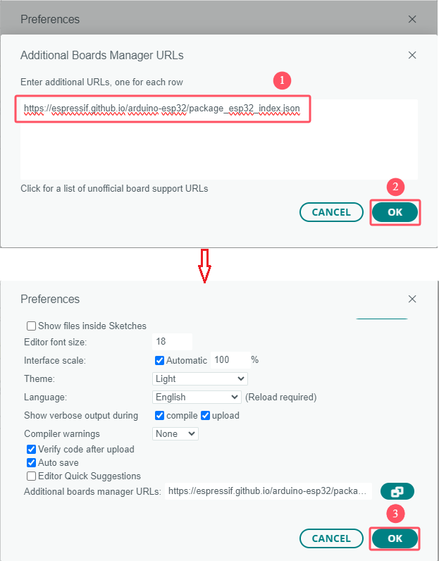

3\. Select the icon of board manager to search for “**ESP32**” and click version **<span style="color: rgb(255, 76, 65);">1.06</span>** to “**Install**”. 
(**<span style="color: rgb(255, 76, 65);">⚠️Note that here we adopt 1.06 version of the ESP32. Installation may fail if you choose later versions.</span>**)

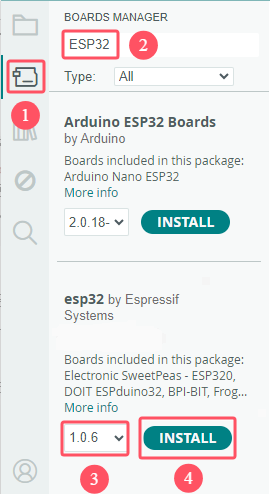

3\. Now the ESP32 is installed.

**Upload Code**

1\. Connect ESP32 WROOM 32 to your computer via Micro USB cable.

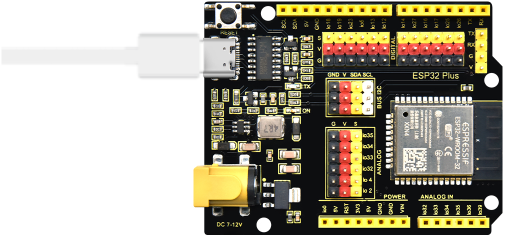

2\. Click “**Tools**” → “**Board**” → “**esp32**” to choose ESP32 Dev Module.

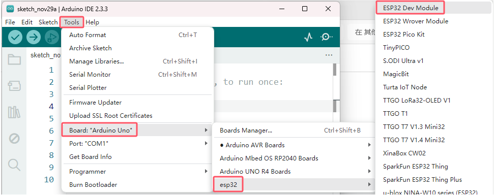

3\. After connecting, click “**Tools**” → “**Port**”.

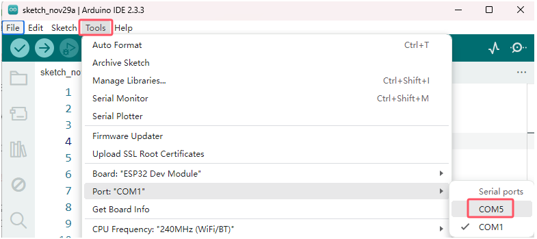

4\. For ESP32, you need to click “**Select other board and port**” to set them manually.


5\. Search “**ESP32 Dev Module**” and click “**OK**”.


6\. After that, you can choose them easily. Yet, at next time, ESP32 may be not accessed in it, so just set them again.


7\. Now its ready for uploading code to ESP32.

### 1-1-5 Import Arduino Library(<span style="color: rgb(255, 76, 65);">Important</span>)

Libraries are a collection of pre-written code or functions that extend the functionality of the Arduino IDE, so that they allow you to save time and effort to code complex functions.

**⚠️ATTENTION:** Please import the libraries we provided! Manual import is recommended!

**Method One: Manual Import**

Except for Arduino library manager, you may import your own library manually.

1\. Click **Sketch** → **Include Library** → **Add .ZIP Library...**.


2\. Locate in ..\ **Library** \ **Arduino_Library** file and choose library zips to “**Open**”.


3\. After that, you will see “Library installed”. You can use this library directly next time you need it.


4\. Import the rest libraries as well.

**Method Two: Library Manager**

There are many libraries are included in “**Arduino Library Manager**”.

1\. In Library Manager, search for the desired library by name or browse different categories. 

**⚠️ATTENTION:** Prompts are written in projects that require libraries. For example, “Herein, Adafruit_GFX library is included. Please install it in Library Manager.”


2\. Find the library and **Install**. If “**INSTALL WITHOUT DEPENDENCIES**” and “**INSTALL ALL**” appears, choose “**INSTALL ALL**”. So do the other libraries.


3\. Arduino IDE downloads the library automatically.


4\. Other libraries are the same.

**Path to Library**

If you installed the library using the above method, it is in the default library directory of the Arduino IDE: **C:\Users\xxx\Documents\Arduino\libraries**.

If not, enter “**File**” → “**Preferences**” to check the path.


For details, please visit: [Installing libraries in Arduino IDE 2](https://docs.arduino.cc/software/ide-v2/tutorials/ide-v2-installing-a-library/)

---

## 1-2 IoT Projects

The ESP32 iot Learning Kit utilizes the ESP32-S3 WiFi and Bluetooth to support a variety enjoyable IoT projects. Here we provide a tutorial to do these projects.

WiFi connectivity allows you to connect the Arduino to the Internet and cloud platforms. With WiFi, you can build projects like simple Web servers to remotely control leds, or Arduino IoT Cloud interactions to monitor sensors. 

As for Bluetooth, it supports localized(short-range) wireless communication, including Bluetooth control LED, relay, RGB and buzzer. We pair the ESP32 with your smartphone or other Bluetooth-enabled device to perform a variety of control and monitoring tasks.

---

### 1-2-01 IoT Bluetooth

---

**1. Overview**

In this experiment, we develop a simple Bluetooth Low Power (BLE) serial communication application with an ESP32 microcontroller. The ESP32 integrates Wi-Fi and Bluetooth, making it ideal for developing wireless applications. BLE is a low power wireless communication protocol designed for short distance communication. 

This project covers the steps to set up the ESP32 as a BLE server and communicate with BLE clients over a serial connection.

---

**2. Components**

|    |||
| ------------------------ | --------------------- | --------------------- |
| ESP32 main board x1 | Micro USB cable x1 |mobile device x1|

---

**3. Component Knowledge**

The ESP32 WROOM 32 integrates Wi-Fi and Bluetooth. It supports Bluetooth Low Energy (BLE) and Classic Bluetooth protocols and can be used as a Bluetooth client or server. As a Bluetooth client, it can connect to other Bluetooth devices and exchange data with them. As a Bluetooth server it provides services to other devices.

The module supports several Bluetooth profiles, including Generic Access Profile (GAP), Generic Attribute Profile (GATT), and Serial Port Profile (SPP). The SPP allows the module to emulate a serial port over Bluetooth, enabling serial communication with other Bluetooth devices.

When using the Bluetooth of the ESP32 WROOM 32, we need to program with an appropriate software development kit (SDK) or an Arduino IDE with the ESP32 BLE library that provides advanced interfaces for BLE, including an example of how to use the module as a BLE client and server.

Bluetooth is a short-distance communication system that can be divided into two types, namely low power bluetooth (BLE) and classic bluetooth. There are two modes for simple data transfer: master mode and slave mode.

**Master Mode**: In this mode, work is done on the master device and can be connected to the slave device. When the device initiates a connection request in the main mode, information such as the address and pairing password of other bluetooth devices are required. Once paired, you can connect directly to them.

**Slave Mode**: A bluetooth module in the slave mode can only accept connection requests from the host, but cannot initiate connection requests. After being connected to a host device, it can send and receive data through the host device . Bluetooth devices can interact with each other, when they interact, the bluetooth device in the main mode searches for nearby devices. While a connection is established, they can exchange data. For example, when a mobile phone exchanges data with ESP32, the mobile phone is usually in master mode and the ESP32 is in slave mode.


Overall, the Bluetooth capability of the ESP32 WROOM 32 provides a convenient and low-power way to enable wireless communication in the project.

---

**4. Wiring Diagram**


---

**5. Download and install LightBlue APP**

Take a tablet or smartphone, click [App Store](https://apps.apple.com/us/app/lightblue/id557428110) (iOS users) or [Google Play](https://play.google.com/store/apps/details?id=com.punchthrough.lightblueexplorer) (Android users) to download LightBlue. Or directly search “LightBlue” in **App Store**(iOS users) or **Google Play**(Android users) to download the APP.

**Here we take Android system as an example, and iOS users may have a reference.**


---

**6. Test Code**

```c++
/*  
 * Filename: IoT_Bluetooth
 * Function: Bluetooth data transfer
 * Compiling IDE：ARDUINO 2.3.3
 * Author: https://www.keyestudio.com/
*/
#include "BLEDevice.h"
#include "BLEServer.h"
#include "BLEUtils.h"
#include "BLE2902.h"

// Define the Bluetooth device name
const char *bleName = "ESP32_Bluetooth";

// Define the received text and the time of the last message
String receivedText = "";
unsigned long lastMessageTime = 0;

// Define the UUIDs of the service and characteristics
#define SERVICE_UUID           "6E400001-B5A3-F393-E0A9-E50E24DCCA9E" 
#define CHARACTERISTIC_UUID_RX "6E400002-B5A3-F393-E0A9-E50E24DCCA9E"
#define CHARACTERISTIC_UUID_TX "6E400003-B5A3-F393-E0A9-E50E24DCCA9E"

// Define the Bluetooth characteristic
BLECharacteristic *pCharacteristic;

void setup() {
  Serial.begin(115200);  // Initialize the serial port
  setupBLE();            // Initialize the Bluetooth BLE
}

void loop() {
  // When the received text is not empty and the time since the last message is over 1 second
  // Send a notification and print the received text
  if (receivedText.length() > 0 && millis() - lastMessageTime > 1000) {
    Serial.print("Received message: ");
    Serial.println(receivedText);
    pCharacteristic->setValue(receivedText.c_str());
    pCharacteristic->notify();
    receivedText = "";
  }

  // Read data from the serial port and send it to BLE characteristic
  if (Serial.available() > 0) {
    String str = Serial.readStringUntil('\n');
    const char *newValue = str.c_str();
    pCharacteristic->setValue(newValue);
    pCharacteristic->notify();
  }
}

// Define the BLE server callbacks
class MyServerCallbacks : public BLEServerCallbacks {
  // Print the connection message when a client is connected
  void onConnect(BLEServer *pServer) {
    Serial.println("Connected");
  }
  // Print the disconnection message when a client is disconnected
  void onDisconnect(BLEServer *pServer) {
    Serial.println("Disconnected");
  }
};

// Define the BLE characteristic callbacks
class MyCharacteristicCallbacks : public BLECharacteristicCallbacks {
  void onWrite(BLECharacteristic *pCharacteristic) {
    // When data is received, get the data and save it to receivedText, and record the time
    std::string value = std::string(pCharacteristic->getValue().c_str());
    receivedText = String(value.c_str());
    lastMessageTime = millis();
    Serial.print("Received: ");
    Serial.println(receivedText);
  }
};

// Initialize the Bluetooth BLE
void setupBLE() {
  BLEDevice::init(bleName);                        // Initialize the BLE device
  BLEServer *pServer = BLEDevice::createServer();  // Create the BLE server
  // Print the error message if the BLE server creation fails
  if (pServer == nullptr) {
    Serial.println("Error creating BLE server");
    return;
  }
  pServer->setCallbacks(new MyServerCallbacks());  // Set the BLE server callbacks

  // Create the BLE service
  BLEService *pService = pServer->createService(SERVICE_UUID);
  // Print the error message if the BLE service creation fails
  if (pService == nullptr) {
    Serial.println("Error creating BLE service");
    return;
  }
  // Create the BLE characteristic for sending notifications
  pCharacteristic = pService->createCharacteristic(CHARACTERISTIC_UUID_TX, BLECharacteristic::PROPERTY_NOTIFY);
  pCharacteristic->addDescriptor(new BLE2902());  // Add the descriptor
  // Create the BLE characteristic for receiving data
  BLECharacteristic *pCharacteristicRX = pService->createCharacteristic(CHARACTERISTIC_UUID_RX, BLECharacteristic::PROPERTY_WRITE);
  pCharacteristicRX->setCallbacks(new MyCharacteristicCallbacks());  // Set the BLE characteristic callbacks
  pService->start();                                                 // Start the BLE service
  pServer->getAdvertising()->start();                                // Start advertising
  Serial.println("Waiting for a client connection...");              // Wait for a client connection
}
```
---

**7. Test Result**

Please follow the steps below:

1\. Open the file **IoT_Bluetooth.ino** in **..\Codes\Arduino_C_Code\1-2-IoT_C_Code\1-2-01 IoT Bluetooth** , Or copy and paste the above test code into the Arduino IDE.

2\. Choose the board model(ESP32 Dev Module) and port(COMxx), and click  to upload code.


3\. After uploading code, enable Bluetooth on your mobile device (smartphone) and open **LightBlue**.


4\. In **Peripherals**, find ESP32-Bluetooth and click “**Connect**”. If you don’t see it, try refreshing the page a few times. Once “**Connected**”, the Bluetooth is connected. Scroll down to set **3 UUIDs** in the code. And Arduino IDE serial monitor shows “**Connected**”.


(**⚠️ATTENTION**: On iOS devices, if the **LightBlue** APP you downloaded and installed is an older version, find **MPY ESP32** and click “**Connect**”. If **LightBlue** is a new version, find **ESP32-Bluetooth** and click “**Connect**”. Other operations are similar to Android system.) 


5\. Tap **Receive** UUID and “**HEX**” to enter **Format Selection** , choose “**UTF-8 String**” to “**Save**”. For instance, “**HEX**” is hexadecimal; “ **UTF-8 String** ” is character; “**Binary**” is binary; and so on.


6\. Click “**Subscribe**” and it changes into “**Unsubscribe**”.


7\. Open the serial monitor and set the baud rate to “**115200**”. Enter “**welcome**” and tap “**Enter**”.


8\. And “**welcome**” will be displayed on LightBlue.


9\. To send information from a mobile device to the serial monitor, tap **Send** UUID and “**HEX**” to enter **Format Selection** and choose “**UTF-8 String**” to “**Save**”.


10\. Click “**Write New Value**” to enter “**bluetooth test**” and click “**Write**”.


11\. The “**Serial Monitor**” shows messages.


---

**8. Code Explanation**

This code is written for the ESP32 microcontroller and is set to communicate with Bluetooth Low Energy (BLE) devices. Here is a brief summary of the code:

- **Necessary libraries**: first include the libraries required to use Bluetooth Low Energy (BLE) on the ESP32. 

```c++
#include "BLEDevice.h"
#include "BLEServer.h"
#include "BLEUtils.h"
#include "BLE2902.h"
```
- **Global Variables**: define a set of global variables, including the Bluetooth device name(`bleName`), UUID of variables, services, and characteristics used to track when the text and last message were received, and `BLECharacteristic` instance( `pCharacteristic` ). 

```c++
// Define the Bluetooth device name
const char *bleName = "ESP32_Bluetooth";

// Define the received text and the time of the last message
String receivedText = "";
unsigned long lastMessageTime = 0;

// Define the UUIDs of the service and characteristics
#define SERVICE_UUID           "6E400001-B5A3-F393-E0A9-E50E24DCCA9E" 
#define CHARACTERISTIC_UUID_RX "6E400002-B5A3-F393-E0A9-E50E24DCCA9E"
#define CHARACTERISTIC_UUID_TX "6E400003-B5A3-F393-E0A9-E50E24DCCA9E"

// Define the Bluetooth characteristic
BLECharacteristic *pCharacteristic;
```
- **Initialization**: `setup()` sets baud rate to 115200; `setupBLE()` initializes BLE.

```c++
void setup() {
    Serial.begin(115200);  // Initialize the serial port
    setupBLE();            // Initialize the Bluetooth BLE
}
```
- **Main Loop**: in `loop()`, If the string is received via BLE (i.e. receivedText is not empty) and at least 1 second has passed since the last message, the code prints the received string to the serial monitor. Set `Characteristic` to the received string, and send the notification, and then clear the received string. If there is data available on the serial port, it reads the string until it encounters a newline. Set the feature value to this string and send the notification.

```c++
void loop() {
    // When the received text is not empty and the time since the last message is over 1 second
    // Send a notification and print the received text
    if (receivedText.length() > 0 && millis() - lastMessageTime > 1000) {
        Serial.print("Received message: ");
        Serial.println(receivedText);
        pCharacteristic->setValue(receivedText.c_str());
        pCharacteristic->notify();
        receivedText = "";
    }

    // Read data from the serial port and send it to BLE characteristic
    if (Serial.available() > 0) {
        String str = Serial.readStringUntil('\n');
        const char *newValue = str.c_str();
        pCharacteristic->setValue(newValue);
        pCharacteristic->notify();
    }
}
```
- **Callback**: Two callback classes( `MyServerCallbacks` and  `MyCharacteristicCallbacks` ) are used to handle events related to Bluetooth communication. `MyServerCallbacks` handles issues related to the connection status (connected or disconnected) of the BLE server, while `MyCharacteristicCallbacks` handles write issues on BLE features, i.e. when a connected device sends a string to the ESP32 via BLE, the string is captured and stored in `receivedText`, and the current time is recorded in  `lastMessageTime` .

```c++
// Define the BLE server callbacks
class MyServerCallbacks : public BLEServerCallbacks {
    // Print the connection message when a client is connected
    void onConnect(BLEServer *pServer) {
    Serial.println("Connected");
    }
    // Print the disconnection message when a client is disconnected
    void onDisconnect(BLEServer *pServer) {
    Serial.println("Disconnected");
    }
};

// Define the BLE characteristic callbacks
class MyCharacteristicCallbacks : public BLECharacteristicCallbacks {
    void onWrite(BLECharacteristic *pCharacteristic) {
        // When data is received, get the data and save it to receivedText, and record the time
        std::string value = std::string(pCharacteristic->getValue().c_str());
        receivedText = String(value.c_str());
        lastMessageTime = millis();
        Serial.print("Received: ");
        Serial.println(receivedText);
    }
};
```
- **Set BLE**: `setupBLE()` is used to initialize BLE devices and servers, set server callbacks, create BLE services with defined UUids, create features for sending notifications and receiving data and add them to services, and set feature callbacks. Finally, the service starts and the server begins broadcasting.

```c++
// Initialize the Bluetooth BLE
void setupBLE() {
    BLEDevice::init(bleName);                        // Initialize the BLE device
    BLEServer *pServer = BLEDevice::createServer();  // Create the BLE server
    // Print the error message if the BLE server creation fails
    if (pServer == nullptr) {
        Serial.println("Error creating BLE server");
        return;
    }
    pServer->setCallbacks(new MyServerCallbacks());  // Set the BLE server callbacks

    // Create the BLE service
    BLEService *pService = pServer->createService(SERVICE_UUID);
    // Print the error message if the BLE service creation fails
    if (pService == nullptr) {
        Serial.println("Error creating BLE service");
        return;
    }
    // Create the BLE characteristic for sending notifications
    pCharacteristic = pService->createCharacteristic(CHARACTERISTIC_UUID_TX, BLECharacteristic::PROPERTY_NOTIFY);
    pCharacteristic->addDecodeor(new BLE2902());  // Add the decodeor
    // Create the BLE characteristic for receiving data
    BLECharacteristic *pCharacteristicRX = pService->createCharacteristic(CHARACTERISTIC_UUID_RX, BLECharacteristic::PROPERTY_WRITE);
    pCharacteristicRX->setCallbacks(new MyCharacteristicCallbacks());  // Set the BLE characteristic callbacks
    pService->start();                                                 // Start the BLE service
    pServer->getAdvertising()->start();                                // Start advertising
    Serial.println("Waiting for a client connection...");              // Wait for a client connection
}
```

**⚠️ATTENTION: This code allows two-way communication - it can send and receive data via BLE. However, to interact with specific hardware (such as leds on and off), additional code should be added to process the received string and act accordingly.**

---

### 1-2-02 IoT Bluetooth Control LED

---

**1. Overview**

This project is an extension of the previous one, adding LED configuration and custom commands such as “led_on” and “led_off”. These commands allow you to control the on and off of the LED by sending commands from **LightBlue** APP on your mobile device.

---

**2. Component Knowledge** 

**LED**


An LED is a semiconductor known as a "light-emitting diode", which is made of semiconductor materials (silicon, selenium, germanium, etc.). It is polar. The short pin is negative that connects to GND, while the long one is positive that connects to 3.3V or 5V.


- Here is the detailed introduction for the LED: [LED - Wikipedia](https://en.wikipedia.org/wiki/Light-emitting_diode)

**Five-color-ring Resistor**

A resistor limits or regulates the flow of current in the circuit. The left picture is the appearance of the resistor and the right one is its circuit symbol. Its unit of R is ohm(Ω). 1 MΩ= 1000 kΩ, 1 kΩ = 1000Ω.


We can use resistors to protect sensitive components, like LED. The resistance(Ω) is marked on the body with an electronic color code. Each color represents a number, and you can refer to it in the resistance card.

-ring 1 – 1st Digit.
-ring 2 – 2nd Digit.
-ring 3 – 3rd Digit.
-ring 4 – Multiplier.
-ring 5 – Tolerance.


In this kit, we provide four five-color-ring resistor. Here we take three of them as examples.

220Ω resistor *10


10KΩ resistor *10


1KΩ resistor *10


- You can learn more about resistor from Wiki: [Resistor - Wikipedia](https://en.wikipedia.org/wiki/Resistor)

In the same voltage, there will be less current but more resistance. The connection between current(I), voltage(V), and resistance(R) can be expressed: I=U/R. In the figure below, for instance, if the voltage is 3V, the current through R1 equals I = U / R = 3 V / 10 KΩ= 0.0003A= 0.3mA.


- You can learn more about Ohm’s Law from Wiki: [Ohm’s Law - Wikipedia](https://en.wikipedia.org/wiki/Ohm%27s_law)

Don’t connect a low resistance directly to the two poles of the power supply, as this will cause excessive current to damage the electronic components. Resistors are nonpolar.

**Breadboard**

Breadboards are used to build and test circuits quickly before completing any circuit design. There are many holes in the breadboard so that components such as resistors can be inserted into it. 
A typical breadboard is shown below:


The breadboard comes with many metal strips that run underneath the board to connect holes together. They are laid out as shown below. Note that the top and bottom rows of holes are connected horizontally, while the remaining holes are connected vertically.


The first two rows (top) and the last two rows (bottom) are used for power positive(+) and negative(-) respectively. The conductive layout is shown below:


We should know that the up and low holes of groove in the middle are not connected. So we can connect the DIP(Dual in-line Packages) components (say, integrated circuits, microcontrollers, chips, etc.) as shown below:


If you want to know more about breadboard, refer to: [How to Use a Breadboard - Science Buddies](https://www.sciencebuddies.org/science-fair-projects/references/how-to-use-a-breadboard)

---

**3. Components**

|  ||||
| ------------------------ | ------------------------ | ---------------------------- |---------------------------- |
| ESP32 main board x1 | red LED x1 | 220Ω resistor x1 |mobile device x1|
||||   |
|breadboard x1 |jumper wires | Micro USB cable x1 |    |

---

**4. Wiring Diagram** 

We adopt digital pin IO26 in this experiment. In the circuit, we connect a 220Ω resistor in serial, which protect the LED from over-current.

**Schematic diagram:**


**Wiring diagram:**


---

**5. Download and install the LightBlue APP:**

**⚠️Note:** if you have downloaded and installed the LightBlue APP in the previous lesson 1-2-01, you can skip this step; Otherwise, follow the instructions in lesson 1-2-01 to download and install the LightBlue APP

---

**6. Test Code**

```c++
/*  
 * Filename: IoT_Bluetooth Control LED
 * Function: Bluetooth + APP control LED
 * Compiling IDE：ARDUINO 2.3.3
 * Author: https://www.keyestudio.com/
*/
#include "BLEDevice.h"
#include "BLEServer.h"
#include "BLEUtils.h"
#include "BLE2902.h"

const int ledPin = 26; // Define LED pin to IO26.

// Define the Bluetooth device name
const char *bleName = "ESP32_Bluetooth";

// Define the received text and the time of the last message
String receivedText = "";
unsigned long lastMessageTime = 0;

// Define the UUIDs of the service and characteristics
#define SERVICE_UUID           "6E400001-B5A3-F393-E0A9-E50E24DCCA9E" 
#define CHARACTERISTIC_UUID_RX "6E400002-B5A3-F393-E0A9-E50E24DCCA9E"
#define CHARACTERISTIC_UUID_TX "6E400003-B5A3-F393-E0A9-E50E24DCCA9E"

// Define the Bluetooth characteristic
BLECharacteristic *pCharacteristic;

void setup() {
  Serial.begin(115200);      // Initialize the serial port
  setupBLE();                // Initialize the Bluetooth BLE

  pinMode(ledPin, OUTPUT);  // Set LED pin to output

}

void loop() {
  // When the received text is not empty and the time since the last message is over 1 second
  // Send a notification and print the received text
  if (receivedText.length() > 0 && millis() - lastMessageTime > 1000) {
    Serial.print("Received message: ");
    Serial.println(receivedText);
    pCharacteristic->setValue(receivedText.c_str());
    pCharacteristic->notify();
    receivedText = "";
  }

  // Read data from the serial port and send it to BLE characteristic
  if (Serial.available() > 0) {
    String str = Serial.readStringUntil('\n');
    const char *newValue = str.c_str();
    pCharacteristic->setValue(newValue);
    pCharacteristic->notify();
  }
}

// Define the BLE server callbacks
class MyServerCallbacks : public BLEServerCallbacks {
  // Print the connection message when a client is connected
  void onConnect(BLEServer *pServer) {
    Serial.println("Connected");
  }
  // Print the disconnection message when a client is disconnected
  void onDisconnect(BLEServer *pServer) {
    Serial.println("Disconnected");
  }
};

// Define the BLE characteristic callbacks
class MyCharacteristicCallbacks : public BLECharacteristicCallbacks {
  void onWrite(BLECharacteristic *pCharacteristic) {
    std::string value = std::string(pCharacteristic->getValue().c_str());
    if (value == "led_on") {
      digitalWrite(ledPin, HIGH); // LED on.
      Serial.println("LED turned on");
    } else if (value == "led_off") {
      digitalWrite(ledPin, LOW); // LED off.
    }
  }
};

// Initialize the Bluetooth BLE
void setupBLE() {
  BLEDevice::init(bleName);                        // Initialize the BLE device
  BLEServer *pServer = BLEDevice::createServer();  // Create the BLE server
  // Print the error message if the BLE server creation fails
  if (pServer == nullptr) {
    Serial.println("Error creating BLE server");
    return;
  }
  pServer->setCallbacks(new MyServerCallbacks());  // Set the BLE server callbacks

  // Create the BLE service
  BLEService *pService = pServer->createService(SERVICE_UUID);
  // Print the error message if the BLE service creation fails
  if (pService == nullptr) {
    Serial.println("Error creating BLE service");
    return;
  }
  // Create the BLE characteristic for sending notifications
  pCharacteristic = pService->createCharacteristic(CHARACTERISTIC_UUID_TX, BLECharacteristic::PROPERTY_NOTIFY);
  pCharacteristic->addDescriptor(new BLE2902());  // Add the descriptor
  // Create the BLE characteristic for receiving data
  BLECharacteristic *pCharacteristicRX = pService->createCharacteristic(CHARACTERISTIC_UUID_RX, BLECharacteristic::PROPERTY_WRITE);
  pCharacteristicRX->setCallbacks(new MyCharacteristicCallbacks());  // Set the BLE characteristic callbacks
  pService->start();                                                 // Start the BLE service
  pServer->getAdvertising()->start();                                // Start advertising
  Serial.println("Waiting for a client connection...");              // Wait for a client connection
}

```
---

**7. Test Result**

Please follow the steps below:

1\. In folder **..\Codes\Arduino_C_Code\1-2-IoT_C_Code\1-2-02 IoT Bluetooth Control LED** , open file **IoT_Bluetooth_Control_LED.ino** , or copy and paste the above test code into the Arduino IDE.

2\. Choose the board model(ESP32 Dev Module) and port(COMxx), and click  to upload code.


3\. After uploading code, enable Bluetooth on your mobile device (smartphone) and open **LightBlue**.


4\. In **Peripherals**, find ESP32-Bluetooth and click “**Connect**”. If you don’t see it, try refreshing the page a few times. Once “**Connected**”, the Bluetooth is connected. Scroll down to set **3 UUIDs** in the code. And Arduino IDE serial monitor shows “**Connected**”.


(**⚠️ATTENTION:** On iOS devices, if the **LightBlue** APP you downloaded and installed is an older version, find **MPY ESP32** and click “**Connect**”. If **LightBlue** is a new version, find **ESP32-Bluetooth** and click “**Connect**”. Other operations are similar to Android system.) 


5\. Tap **Send** UUID and “**HEX**” to enter **Format Selection** , choose “**UTF-8 String**” to “**Save**”. 


6\. Click “**Write New Value**” to edit commands. Now try to send the command: “led_on” to check whether LED responses to this command. Input “**led_on**” and click “**Write**” to see whether LED lights up. At the same time, the serial monitor prints the corresponding messages.


7\. Click “**Write New Value**” to edit commands. Now try to send the command: “led_off” to check whether LED responses to this command. Input “**led_off**” and click “**Write**” to see whether LED turns off. At the same time, the serial monitor prints the corresponding messages.


---

**8. Code Explanation**

This project is an extension of the previous one, adding LED configuration and custom commands such as “led_on” and “led_off”. These commands allow you to control the on and off of the LED by sending commands from **LightBlue** APP on your mobile device.

Let's explain the code in details:

- Add a new global variable to the LED pin.

```c++
const int ledPin = 26; // Define LED pin to IO26.
```
- `setup()` set LED pin to output.

```c++
pinMode(ledPin, OUTPUT);  // Set LED pin to output
```
- Modify onWrite method in class `MyCharacteristicCallbacks`. This function listens for data coming from the Bluetooth connection and controls LED according to the received string (such as “led_on” and “led_off”).

```c++
// Define the BLE characteristic callbacks
class MyCharacteristicCallbacks : public BLECharacteristicCallbacks {
  void onWrite(BLECharacteristic *pCharacteristic) {
    std::string value = std::string(pCharacteristic->getValue().c_str());
    if (value == "led_on") {
      digitalWrite(ledPin, HIGH); // LED on.
      Serial.println("LED turned on");
    } else if (value == "led_off") {
      digitalWrite(ledPin, LOW); // LED off.
      Serial.println("LED turned off");
    }
  }
};
```
---

### 1-2-03 IoT Bluetooth Control Buzzer

---

**1. Overview**

In previous experiments, we have learned how Bluetooth transmits data and controls LED. Here we  configure buzzer to set custom commands such as “buzzer_on” and “buzzer_off”. These commands allow you to control the buzzer to emit sound by sending commands from **LightBlue** APP on your mobile device.

---

**2. Component Knowledge**

**Active buzzer**


In the active buzzer, a simple oscillator circuit is integrated to convert constant direct current into pulse signals with a certain frequency. Once it receives a high level, it will emit sound. 

However, passive buzzer is without vibration source, so it must be driven by 2k ~ 5k square waves, rather than a DC signal. 

They are very similar in appearance, but the passive one buzzer is with a green circuit board, while the active one is with black tape. Passive buzzers are not polar, yet active ones are. 


- You can learn more about buzzer from Wiki: [Buzzer - Wikipedia](https://en.wikipedia.org/wiki/Buzzer)

**Transistor**

As buzzer requires large current but GPIO of ESP32 output capability cannot meet this requirement, a NPN transistor is needed to amplify the current. 


Transistor is a semiconductor that controls current. It amplifies weak signals or works as a non-contact switch. 

According to structures, it can be divided into NPN and PNP. Both of them comes with three electrodes: base(B), collector(C) and emitter(E). The PN junction between E and B is also named “emitting junction”, and that between C and B is also called “collecting junction”. 

- You can learn more about transistor from Wiki: [P-N junction - Wikipedia](https://en.wikipedia.org/wiki/P%E2%80%93n_junction)

As shown below, the arrow points to the direction of current flow.


When there is current passing between "BE", "CE" will allow several-folded current pass (amplified by the transistor). At this point, transistor works in the amplifying area. When current between "BE" exceeds a certain value, "CE" will not allow current to increase any longer. Now the transistor works in the saturation area.

Here are the two types of transistor: PNP and NPN


**In this kit, we mark PNP transistor as 8550, and NPN as 8050.**

It is often used as a switch in digital circuits. As microcontroller's capacity to output current is very weak, transistor is a perfect choice to amplify current and drive large-current components. 

NPN transistor drives buzzer: If GPIO outputs high, current will flow through R1, the transistor will get conducted, and the buzzer will emit sound. If GPIO outputs low, no current flows through R1, so the transistor will not be conducted to enable buzzer to sound. 

PNP transistor drives buzzer: If GPIO outputs low, current will flow through R1, the transistor will get conducted, and the buzzer will emit sound. If GPIO outputs high, no current flows through R1, so the transistor will not be conducted to enable buzzer to sound. 


- [S8050 Transistor Datasheet](https://datasheet4u.com/datasheet-pdf/WeitronTechnology/S8050/pdf.php?id=576670)

- [S8550 Transistor Datasheet](https://www.mouser.com/datasheet/2/149/SS8550-118608.pdf)

---

**3. Components**

|   |||
| ------------------------ | ------------------------ | ---------------------------- |
|ESP32 main board x1 | NPN transistor (S8050) x1 | active buzzer x1 |
||||
|breadboard x1 |jumper wires | Micro USB cable x1 |
||||
|mobile device x1| 1kΩ resistor  x1 | 10kΩ resistor  x1 |

---

**4. Wiring Diagram**

**Schematic diagram:**


**Wiring diagram:**


---

**5. Download and install the LightBlue APP:**

**⚠️Note:** if you have downloaded and installed the LightBlue APP in the previous lesson 1-2-01, you can skip this step; Otherwise, follow the instructions in lesson 1-2-01 to download and install the LightBlue APP

---

**6. Test Code**

```c++
/*  
 * Filename: IoT_Bluetooth Control buzzer
 * Function: Bluetooth + APP controls the active buzzer to sound
 * Compiling IDE：ARDUINO 2.3.3
 * Author: https://www.keyestudio.com/
*/
#include "BLEDevice.h"
#include "BLEServer.h"
#include "BLEUtils.h"
#include "BLE2902.h"

const int buzzerPin = 13; // Define Active buzzer pin to IO13.

// Define the Bluetooth device name
const char *bleName = "ESP32_Bluetooth";

// Define the received text and the time of the last message
String receivedText = "";
unsigned long lastMessageTime = 0;

// Define the UUIDs of the service and characteristics
#define SERVICE_UUID           "6E400001-B5A3-F393-E0A9-E50E24DCCA9E" 
#define CHARACTERISTIC_UUID_RX "6E400002-B5A3-F393-E0A9-E50E24DCCA9E"
#define CHARACTERISTIC_UUID_TX "6E400003-B5A3-F393-E0A9-E50E24DCCA9E"

// Define the Bluetooth characteristic
BLECharacteristic *pCharacteristic;

void setup() {
  Serial.begin(115200);      // Initialize the serial port
  setupBLE();                // Initialize the Bluetooth BLE

  pinMode(buzzerPin, OUTPUT);  // Set Active buzzer pin to output

}

void loop() {
  // When the received text is not empty and the time since the last message is over 1 second
  // Send a notification and print the received text
  if (receivedText.length() > 0 && millis() - lastMessageTime > 1000) {
    Serial.print("Received message: ");
    Serial.println(receivedText);
    pCharacteristic->setValue(receivedText.c_str());
    pCharacteristic->notify();
    receivedText = "";
  }

  // Read data from the serial port and send it to BLE characteristic
  if (Serial.available() > 0) {
    String str = Serial.readStringUntil('\n');
    const char *newValue = str.c_str();
    pCharacteristic->setValue(newValue);
    pCharacteristic->notify();
  }
}

// Define the BLE server callbacks
class MyServerCallbacks : public BLEServerCallbacks {
  // Print the connection message when a client is connected
  void onConnect(BLEServer *pServer) {
    Serial.println("Connected");
  }
  // Print the disconnection message when a client is disconnected
  void onDisconnect(BLEServer *pServer) {
    Serial.println("Disconnected");
  }
};

// Define the BLE characteristic callbacks
class MyCharacteristicCallbacks : public BLECharacteristicCallbacks {
  void onWrite(BLECharacteristic *pCharacteristic) {
    std::string value = std::string(pCharacteristic->getValue().c_str());
    if (value == "buzzer_on") {
      digitalWrite(buzzerPin, HIGH); // turn on active buzzer .
      Serial.println("buzzer turned on");
    } else if (value == "buzzer_off") {
      digitalWrite(buzzerPin, LOW); // turn off active buzzer .
      Serial.println("buzzer turned off");
    }
  }
};

// Initialize the Bluetooth BLE
void setupBLE() {
  BLEDevice::init(bleName);                        // Initialize the BLE device
  BLEServer *pServer = BLEDevice::createServer();  // Create the BLE server
  // Print the error message if the BLE server creation fails
  if (pServer == nullptr) {
    Serial.println("Error creating BLE server");
    return;
  }
  pServer->setCallbacks(new MyServerCallbacks());  // Set the BLE server callbacks

  // Create the BLE service
  BLEService *pService = pServer->createService(SERVICE_UUID);
  // Print the error message if the BLE service creation fails
  if (pService == nullptr) {
    Serial.println("Error creating BLE service");
    return;
  }
  // Create the BLE characteristic for sending notifications
  pCharacteristic = pService->createCharacteristic(CHARACTERISTIC_UUID_TX, BLECharacteristic::PROPERTY_NOTIFY);
  pCharacteristic->addDescriptor(new BLE2902());  // Add the descriptor
  // Create the BLE characteristic for receiving data
  BLECharacteristic *pCharacteristicRX = pService->createCharacteristic(CHARACTERISTIC_UUID_RX, BLECharacteristic::PROPERTY_WRITE);
  pCharacteristicRX->setCallbacks(new MyCharacteristicCallbacks());  // Set the BLE characteristic callbacks
  pService->start();                                                 // Start the BLE service
  pServer->getAdvertising()->start();                                // Start advertising
  Serial.println("Waiting for a client connection...");              // Wait for a client connection
}
```
---

**7. Test Result**

Please follow the steps below:

1\. In folder **..\Codes\Arduino_C_Code\1-2-IoT_C_Code\1-2-03 IoT Bluetooth Control Buzzer** , **open file IoT_Bluetooth_Control_Buzzer.ino** , or copy and paste the above test code into the Arduino IDE.

2\. Choose the board model(ESP32 Dev Module) and port(COMxx), and click  to upload code.


3\. After uploading code, enable Bluetooth on your mobile device (smartphone) and open **LightBlue**.


4\. In **Peripherals**, find ESP32-Bluetooth and click “**Connect**”. If you don’t see it, try refreshing the page a few times. Once “**Connected**”, the Bluetooth is connected. Scroll down to set **3 UUIDs** in the code. And Arduino IDE serial monitor shows “**Connected**”.


(**⚠️ATTENTION:** On iOS devices, if the **LightBlue** APP you downloaded and installed is an older version, find **MPY ESP32** and click “**Connect**”. If **LightBlue** is a new version, find **ESP32-Bluetooth** and click “**Connect**”. Other operations are similar to Android system.) 


5\. Tap **Send** UUID and “**HEX**” to enter **Format Selection** , choose “**UTF-8 String**” to “**Save**”. 


6\. Click “**Write New Value**” to edit commands. Now try to send the command: “buzzer_on” to check whether the active buzzer responses to this command. Input “**buzzer_on**” and click “**Write**” to hear whether the active buzzer beeps. At the same time, the serial monitor prints the corresponding messages.


7\. Click “**Write New Value**” to edit commands. Now try to send the command: “buzzer_off” to check whether the active buzzer responses to this command. Input “**buzzer_off**” and click “**Write**” to hear whether the active buzzer stays quiet. At the same time, the serial monitor prints the corresponding messages.


---

**8. Code Explanation**

Please refer the [1-2-02](https://docs.keyestudio.com/projects/KS5020/en/latest/docs/1.%20Arduino_C_Tutorial.html#iot-bluetooth-control-led) to see detailed code explanations.

---

### 1-2-04 IoT Bluetooth Control Relay

---

**1. Overview**

In daily life, we generally use 220V AC to drive electrical appliances and control them with switches. However, if the switch is directly connected to the 220V AC circuit, once leakage occurs and people will be in danger. 

Therefore, in this project, we specially designed this relay module with NO(normally open) and NC(normally closed) to work with wireless data transmission of Bluetooth.

---

**2. Components**

|  |||
| ------------------------ | ------------------------ | ---------------------------- |
|ESP32 main board x1 |breadboard x1 |mobile device x1|
| | ||
|relay x1|LED x1|220Ω resistor x1|
||||
|jumper wires | Micro USB cable x1 |M-F DuPont wires|

---

**3. Wiring Diagram**

**Schematic diagram:**


**Wiring diagram:**


---

**4. Download and install the LightBlue APP:**

**⚠️Note:** if you have downloaded and installed the LightBlue APP in the previous lesson 1-2-01, you can skip this step; Otherwise, follow the instructions in lesson 1-2-01 to download and install the LightBlue APP

---

**5. Test Code**

```c++
/*  
 * Filename: IoT_Bluetooth_Control_Relay
 * Function: Bluetooth + APP controls relay to connect and disconnect
 * Compiling IDE：ARDUINO 2.3.3
 * Author: https://www.keyestudio.com/
*/
#include "BLEDevice.h"
#include "BLEServer.h"
#include "BLEUtils.h"
#include "BLE2902.h"

const int relayPin = 12;  // Define relay pin to IO12.

// Define the Bluetooth device name
const char *bleName = "ESP32_Bluetooth";

// Define the received text and the time of the last message
String receivedText = "";
unsigned long lastMessageTime = 0;

// Define the UUIDs of the service and characteristics
#define SERVICE_UUID           "6E400001-B5A3-F393-E0A9-E50E24DCCA9E" 
#define CHARACTERISTIC_UUID_RX "6E400002-B5A3-F393-E0A9-E50E24DCCA9E"
#define CHARACTERISTIC_UUID_TX "6E400003-B5A3-F393-E0A9-E50E24DCCA9E"

// Define the Bluetooth characteristic
BLECharacteristic *pCharacteristic;

void setup() {
  Serial.begin(115200);      // Initialize the serial port
  setupBLE();                // Initialize the Bluetooth BLE

  pinMode(relayPin, OUTPUT);  // Set Active buzzer pin to output

}

void loop() {
  // When the received text is not empty and the time since the last message is over 1 second
  // Send a notification and print the received text
  if (receivedText.length() > 0 && millis() - lastMessageTime > 1000) {
    Serial.print("Received message: ");
    Serial.println(receivedText);
    pCharacteristic->setValue(receivedText.c_str());
    pCharacteristic->notify();
    receivedText = "";
  }

  // Read data from the serial port and send it to BLE characteristic
  if (Serial.available() > 0) {
    String str = Serial.readStringUntil('\n');
    const char *newValue = str.c_str();
    pCharacteristic->setValue(newValue);
    pCharacteristic->notify();
  }
}

// Define the BLE server callbacks
class MyServerCallbacks : public BLEServerCallbacks {
  // Print the connection message when a client is connected
  void onConnect(BLEServer *pServer) {
    Serial.println("Connected");
  }
  // Print the disconnection message when a client is disconnected
  void onDisconnect(BLEServer *pServer) {
    Serial.println("Disconnected");
  }
};

// Define the BLE characteristic callbacks
class MyCharacteristicCallbacks : public BLECharacteristicCallbacks {
  void onWrite(BLECharacteristic *pCharacteristic) {
    std::string value = std::string(pCharacteristic->getValue().c_str());
    if (value == "relay_on") {
      digitalWrite(relayPin, HIGH); // turn on relay .
      Serial.println("relay on");
    } else if (value == "relay_off") {
      digitalWrite(relayPin, LOW); // relay off.
      Serial.println("relay off");
    }
  }
};

// Initialize the Bluetooth BLE
void setupBLE() {
  BLEDevice::init(bleName);                        // Initialize the BLE device
  BLEServer *pServer = BLEDevice::createServer();  // Create the BLE server
  // Print the error message if the BLE server creation fails
  if (pServer == nullptr) {
    Serial.println("Error creating BLE server");
    return;
  }
  pServer->setCallbacks(new MyServerCallbacks());  // Set the BLE server callbacks

  // Create the BLE service
  BLEService *pService = pServer->createService(SERVICE_UUID);
  // Print the error message if the BLE service creation fails
  if (pService == nullptr) {
    Serial.println("Error creating BLE service");
    return;
  }
  // Create the BLE characteristic for sending notifications
  pCharacteristic = pService->createCharacteristic(CHARACTERISTIC_UUID_TX, BLECharacteristic::PROPERTY_NOTIFY);
  pCharacteristic->addDescriptor(new BLE2902());  // Add the descriptor
  // Create the BLE characteristic for receiving data
  BLECharacteristic *pCharacteristicRX = pService->createCharacteristic(CHARACTERISTIC_UUID_RX, BLECharacteristic::PROPERTY_WRITE);
  pCharacteristicRX->setCallbacks(new MyCharacteristicCallbacks());  // Set the BLE characteristic callbacks
  pService->start();                                                 // Start the BLE service
  pServer->getAdvertising()->start();                                // Start advertising
  Serial.println("Waiting for a client connection...");              // Wait for a client connection
}

```
---

**6. Test Result**

Please follow the steps below:

1\. In folder **..\Codes\Arduino_C_Code\1-2-IoT_C_Code\1-2-04 IoT Bluetooth Control Relay** , open file **IoT_Bluetooth_Control_Relay.ino** , or copy and paste the above test code into the Arduino IDE.

2\. Choose the board model(ESP32 Dev Module) and port(COMxx), and click  to upload code.


3\. After uploading code, enable Bluetooth on your mobile device (smartphone) and open **LightBlue**.


4\. In **Peripherals**, find ESP32-Bluetooth and click “**Connect**”. If you don’t see it, try refreshing the page a few times. Once “**Connected**”, the Bluetooth is connected. Scroll down to set **3 UUIDs** in the code. And Arduino IDE serial monitor shows “**Connected**”.


(**⚠️ATTENTION:** On iOS devices, if the **LightBlue** APP you downloaded and installed is an older version, find **MPY ESP32** and click “**Connect**”. If **LightBlue** is a new version, find **ESP32-Bluetooth** and click “**Connect**”. Other operations are similar to Android system.) 


5\. Tap **Send** UUID and “**HEX**” to enter **Format Selection** , choose “**UTF-8 String**” to “**Save**”. 


6\. Click “**Write New Value**” to edit commands. Now try to send the command: “relay_on” to check whether the relay responses to this command. Input “**relay_on**” and click “**Write**” to see whether the LED controlled by the relay lights up. At the same time, the serial monitor prints the corresponding messages.


7\. Click “**Write New Value**” to edit commands. Now try to send the command: “relay_off” to check whether the relay responses to this command. Input “**relay_off**” and click “**Write**” to see whether the LED controlled by the relay turns off. At the same time, the serial monitor prints the corresponding messages.


---

**7. Code Explanation**

Please refer the [1-2-02](https://docs.keyestudio.com/projects/KS5020/en/latest/docs/1.%20Arduino_C_Tutorial.html#iot-bluetooth-control-led) to see detailed code explanations.

---

### 1-2-05 IoT Bluetooth Control RGB LED

---

**1. Overview**

In previous experiments, we have learned how Bluetooth transmits data and controls sensors. Here we  configure RGB LED to set custom commands such as “led_off”, “red” and “green”. These commands allow you to control the on and off of the RGB LED by sending commands from **LightBlue** APP on your mobile device.

---

**2. Components**

|  ||||
| ------------------------ | ------------------------ | ---------------------------- |---------------------------- |
| ESP32 main board x1 | RGB LED x1  | 220Ω resistor x3 |mobile device x1|
||||  |
|breadboard x1 |jumper wires | Micro USB cable x1 |   |

---

**3. Wiring Diagram**

There are 4 pins: the longest is GND; The others are red, green and blue. Place the RGB led as shown, the second from the left being the longest pin. So the pin numbers should be red, GND, green and blue.


**Schematic diagram:**


**Wiring diagram:**


---

**4. Download and install the LightBlue APP:**

**⚠️Note:** if you have downloaded and installed the LightBlue APP in the previous lesson 1-2-01, you can skip this step; Otherwise, follow the instructions in lesson 1-2-01 to download and install the LightBlue APP

---

**5. Test Code**

Here, we can choose our favorite color in the drawing software and display it with RGB LED.

```c++
/*  
 * Filename: IoT_Bluetooth Control RGB LED
 * Function: Bluetooth control RGB
 * Compiling IDE：ARDUINO 2.3.3
 * Author: https://www.keyestudio.com/
*/
#include "BLEDevice.h"
#include "BLEServer.h"
#include "BLEUtils.h"
#include "BLE2902.h"

// Define RGB LED pins
const int ledPins[] = {27, 25, 26};  // Define the red, green, and blue pins in turn
const byte chns[] = {0, 1, 2};      // Define the PWM channel
int red, green, blue;

// Define the Bluetooth device name
const char *bleName = "ESP32_Bluetooth";

// Define the received text and the time of the last message
String receivedText = "";
unsigned long lastMessageTime = 0;

// Define the UUIDs of the service and characteristics
#define SERVICE_UUID           "6E400001-B5A3-F393-E0A9-E50E24DCCA9E" 
#define CHARACTERISTIC_UUID_RX "6E400002-B5A3-F393-E0A9-E50E24DCCA9E"
#define CHARACTERISTIC_UUID_TX "6E400003-B5A3-F393-E0A9-E50E24DCCA9E"

// Define the Bluetooth characteristic
BLECharacteristic *pCharacteristic;

void setup() {
  Serial.begin(115200);      // Initialize the serial port
  setupBLE();                // Initialize the Bluetooth BLE

  // Set pwm channel,1KHz,8bit
  for (int i = 0; i < 3; i++) {   
    ledcSetup(chns[i], 1000, 8);
    ledcAttachPin(ledPins[i], chns[i]);
  }
}

void loop() {
  // When the received text is not empty and the time since the last message is over 1 second
  // Send a notification and print the received text
  if (receivedText.length() > 0 && millis() - lastMessageTime > 1000) {
    Serial.print("Received message: ");
    Serial.println(receivedText);
    pCharacteristic->setValue(receivedText.c_str());
    pCharacteristic->notify();
    receivedText = "";
  }

  // Read data from the serial port and send it to BLE characteristic
  if (Serial.available() > 0) {
    String str = Serial.readStringUntil('\n');
    const char *newValue = str.c_str();
    pCharacteristic->setValue(newValue);
    pCharacteristic->notify();
  }
}

// Define the BLE server callbacks
class MyServerCallbacks : public BLEServerCallbacks {
  // Print the connection message when a client is connected
  void onConnect(BLEServer *pServer) {
    Serial.println("Connected");
  }
  // Print the disconnection message when a client is disconnected
  void onDisconnect(BLEServer *pServer) {
    Serial.println("Disconnected");
  }
};

// Define the BLE characteristic callbacks
class MyCharacteristicCallbacks : public BLECharacteristicCallbacks {
  void onWrite(BLECharacteristic *pCharacteristic) {
    std::string value = std::string(pCharacteristic->getValue().c_str());
    if (value == "led_off") {
      setColor(0, 0, 0); // turn the RGB LED off
      Serial.println("RGB LED turned off");
    } else if (value == "red") {
      setColor(255, 0, 0); // Red
      Serial.println("red");
    }
    else if (value == "green") {
      setColor(0, 255, 0); // green
      Serial.println("green");
    }
    else if (value == "blue") {
      setColor(0, 0, 255); // blue
      Serial.println("blue");
    }
    else if (value == "yellow") {
      setColor(255, 150, 0); // yellow
      Serial.println("yellow");
    }
    else if (value == "purple") {
      setColor(80, 0, 80); // purple
      Serial.println("purple");
    }
  }
};

// Initialize the Bluetooth BLE
void setupBLE() {
  BLEDevice::init(bleName);                        // Initialize the BLE device
  BLEServer *pServer = BLEDevice::createServer();  // Create the BLE server
  // Print the error message if the BLE server creation fails
  if (pServer == nullptr) {
    Serial.println("Error creating BLE server");
    return;
  }
  pServer->setCallbacks(new MyServerCallbacks());  // Set the BLE server callbacks

  // Create the BLE service
  BLEService *pService = pServer->createService(SERVICE_UUID);
  // Print the error message if the BLE service creation fails
  if (pService == nullptr) {
    Serial.println("Error creating BLE service");
    return;
  }
  // Create the BLE characteristic for sending notifications
  pCharacteristic = pService->createCharacteristic(CHARACTERISTIC_UUID_TX, BLECharacteristic::PROPERTY_NOTIFY);
  pCharacteristic->addDescriptor(new BLE2902());  // Add the descriptor
  // Create the BLE characteristic for receiving data
  BLECharacteristic *pCharacteristicRX = pService->createCharacteristic(CHARACTERISTIC_UUID_RX, BLECharacteristic::PROPERTY_WRITE);
  pCharacteristicRX->setCallbacks(new MyCharacteristicCallbacks());  // Set the BLE characteristic callbacks
  pService->start();                                                 // Start the BLE service
  pServer->getAdvertising()->start();                                // Start advertising
  Serial.println("Waiting for a client connection...");              // Wait for a client connection
}

void setColor(int red, int green, int blue) {
  // For common-cathode RGB LEDs, use 255 minus the color value
  ledcWrite(chns[0], red); 
  ledcWrite(chns[1], green);
  ledcWrite(chns[2], blue);
}
```


Write the RGB value to setColor() and you will be able to see RGB light up the color you want.

---

**6. Test Result**

Please follow the steps below:

1\. In folder **..\Codes\Arduino_C_Code\1-2-IoT_C_Code\1-2-05 IoT Bluetooth Control RGB LED** , open file **IoT_Bluetooth_Control_RGB_LED.ino** , or copy and paste the above test code into the Arduino IDE.

2\. Choose the board model(ESP32 Dev Module) and port(COMxx), and click  to upload code.


3\. After uploading code, enable Bluetooth on your mobile device (smartphone) and open **LightBlue**.


4\. In **Peripherals**, find ESP32-Bluetooth and click “**Connect**”. If you don’t see it, try refreshing the page a few times. Once “**Connected**”, the Bluetooth is connected. Scroll down to set **3 UUIDs** in the code. And Arduino IDE serial monitor shows “**Connected**”.


(**⚠️ATTENTION:** On iOS devices, if the **LightBlue** APP you downloaded and installed is an older version, find **MPY ESP32** and click “**Connect**”. If **LightBlue** is a new version, find **ESP32-Bluetooth** and click “**Connect**”. Other operations are similar to Android system.) 


5\. Tap **Send** UUID and “**HEX**” to enter **Format Selection** , choose “**UTF-8 String**” to “**Save**”. 


6\. Click “**Write New Value**” to edit commands. Now try to send the commands: “red”, “green”, “blue”, “yellow”, “purple”, “led_off”  to check whether the RGB LED responses to these commands. Input “**red**” and click “**Write**” to see whether the LED lights up in red. At the same time, the serial monitor prints the corresponding messages. So do the others.


---

**7. Code Explanation**

This project includes RGB LED configuration and custom commands such as “led_off”, “red” and “green”. These commands allow you to control the on and off of the RGB LED by sending commands from **LightBlue** APP on your mobile device.

Let's explain the code in details:

- Add new global variables for RGB LED pins and PWM channels.

```c++
// Define RGB LED pins
const int ledPins[] = {27, 25, 26};  // Define the red, green, and blue pins in turn
const byte chns[] = {0, 1, 2};      // Define PWM channel
int red, green, blue;
```
- `setup()` initializes the PWM channel with a predefined frequency and resolution, and then connects the RGB LED pins to their respective PWM channels.

```c++
  // Set pwm channel, 1KHz, 8bit
  for (int i = 0; i < 3; i++) {   
    ledcSetup(chns[i], 1000, 8);
    ledcAttachPin(ledPins[i], chns[i]);
  }
```
- Modify onWrite method in class `MyCharacteristicCallbacks` . This function listens for data coming from the Bluetooth connection and controls RGB LED according to the received string (such as “led_off”, “red”, “green”, etc.)

```c++
// Define the BLE characteristic callbacks
class MyCharacteristicCallbacks : public BLECharacteristicCallbacks {
  void onWrite(BLECharacteristic *pCharacteristic) {
    std::string value = std::string(pCharacteristic->getValue().c_str());
    if (value == "led_off") {
      setColor(0, 0, 0); // turn the RGB LED off
      Serial.println("RGB LED turned off");
    } else if (value == "red") {
      setColor(255, 0, 0); // Red
      Serial.println("red");
    }
    else if (value == "green") {
      setColor(0, 255, 0); // green
      Serial.println("green");
    }
    else if (value == "blue") {
      setColor(0, 0, 255); // blue
      Serial.println("blue");
    }
    else if (value == "yellow") {
      setColor(255, 150, 0); // yellow
      Serial.println("yellow");
    }
    else if (value == "purple") {
      setColor(80, 0, 80); // purple
      Serial.println("purple");
    }
  }
};
```
- Finally, the ability to set RGB LED colors has been added.

```c++
void setColor(int red, int green, int blue) {
  // For common-cathode RGB LEDs, use 255 minus the color value
  ledcWrite(chns[0], red); 
  ledcWrite(chns[1], green);
  ledcWrite(chns[2], blue);
}
```

In summary, this script enables a remote control interaction where the ESP32 runs as a Bluetooth Low Power (BLE) server. A connected BLE client (such as a smartphone) can send a string command to change the color of the RGB LED. Also, the ESP32 provides feedback to the client by sending the received string so that the client knows what action has been performed.

---

### 1-2-06 IoT Bluetooth Audio Player

---

**1. Overview**

Here we provide a simple solution to play audio from Bluetooth devices by the ESP32 DAC.

The project involves ESP32-A2DP library that is used to receive audio data from Bluetooth devices. These data is then transmitted to the ESP32 internal DAC via the I2S interface. The I2S interface is configured in master mode, transfer mode, and built-in DAC mode. Then the audio data is played by the passive buzzer connected to the DAC.

When using the ESP32’s internal DAC, it is important to ensure that the audio data is in the correct format and sampling rate to prevent distortion or noise during playback.

---

**2. Components**

|  |||
| ------------------------ | ------------------------ | ---------------------------- |
|ESP32 main board x1 | NPN transistor (S8050) x1 | passive buzzer x1 |
||||
|breadboard x1 |jumper wires | Micro USB cable x1 |
||| |
|mobile device x1| 1kΩ resistor  x1 | 10kΩ resistor  x1 |

---

**3. Wiring Diagram** 

**Schematic diagram:**


**Wiring diagram:**


---

**4. Test Code**

```c++
/*
 * Filename: IoT Bluetooth Audio Player
 * Function: Bluetooth controls the passive buzzer to play music
 * Compiling IDE：ARDUINO 2.3.3
 * Author: https://www.keyestudio.com/
*/

// ==> Example to use built in DAC of ESP32

#include "BluetoothA2DPSink.h"

BluetoothA2DPSink a2dp_sink;

int LEDC_CHANNEL_0 = 0; // The LEDC timer uses channel 0

int LEDC_TIMER_13_BIT = 12; // LEDC timer uses 12-bit precision

const int BUZZER_PIN = 25; // Define tool I/O ports

// Create a music melody list
int melody[] = {330,330,330,262,330,392,196,262,196,165,220,247,233,220,196,330,392,440,349,392,330,262,294,247,262,196,165,220,247,233,220,196,330,392,440,349,392,330,262,294,247,392,370,330,311,330,208,220,262,220,262,294,392,370,330,311,330,523,523,523,392,370,330,311,330,208,220,262,220,262,294,311,294,262,262,262,262,262,294,330,262,220,196,262,262,262,262,294,330,262,262,262,262,294,330,262,220,196,330,330,330,262,330,392,196,262,196,165,220,247,233,220,196,330,392,440,349,392,330,262,294,247,262,196,165,220,247,233,220,196,330,392,440,349,392,330,262,294,247,392,370,330,311,330,208,220,262,220,262,294,392,370,330,311,330,523,523,523,392,370,330,311,330,208,220,262,220,262,294,311,294,262,262,262,262,262,294,330,262,220,196,262,262,262,262,294,330,262,262,262,262,294,330,262,220,196};

// Create a list of tone durations
int noteDurations[] = {8,4,4,8,4,2,2,3,3,3,4,4,8,4,8,8,8,4,8,4,3,8,8,3,3,3,3,4,4,8,4,8,8,8,4,8,4,3,8,8,2,8,8,8,4,4,8,8,4,8,8,3,8,8,8,4,4,4,8,2,8,8,8,4,4,8,8,4,8,8,3,3,3,1,8,4,4,8,4,8,4,8,2,8,4,4,8,4,1,8,4,4,8,4,8,4,8,2,8,4,4,8,4,2,2,3,3,3,4,4,8,4,8,8,8,4,8,4,3,8,8,3,3,3,3,4,4,8,4,8,8,8,4,8,4,3,8,8,2,8,8,8,4,4,8,8,4,8,8,3,8,8,8,4,4,4,8,2,8,8,8,4,4,8,8,4,8,8,3,3,3,1,8,4,4,8,4,8,4,8,2,8,4,4,8,4,1,8,4,4,8,4,8,4,8,2};


void setup() {
  const i2s_config_t i2s_config = {
    .mode = (i2s_mode_t)(I2S_MODE_MASTER | I2S_MODE_TX | I2S_MODE_DAC_BUILT_IN),
    .sample_rate = 44100,                          // corrected by info from bluetooth
    .bits_per_sample = (i2s_bits_per_sample_t)16,  //the DAC module will only take the 8bits from MSB
    .channel_format = I2S_CHANNEL_FMT_RIGHT_LEFT,
    .communication_format = (i2s_comm_format_t)I2S_COMM_FORMAT_STAND_MSB,
    .intr_alloc_flags = 0,  // default interrupt priority
    .dma_buf_count = 8,
    .dma_buf_len = 64,
    .use_apll = false
  };

  a2dp_sink.set_i2s_config(i2s_config);
  a2dp_sink.start("ESP32_Bluetooth");

  pinMode(BUZZER_PIN, OUTPUT);  // Set the buzzer to output mode
}

void loop() {
  int noteDuration;  // Create a variable noteDuration
  for (int i = 0; i < sizeof(noteDurations); ++i){
      noteDuration = 800/noteDurations[i];
      ledcSetup(LEDC_CHANNEL_0, melody[i]*2, LEDC_TIMER_13_BIT);
      ledcAttachPin(BUZZER_PIN, LEDC_CHANNEL_0);
      ledcWrite(LEDC_CHANNEL_0, 50);
      delay(noteDuration * 1.30);  // delay
  }
}

```
---

**5. Test Result**

Please follow the steps below:

1\. In folder **..\Codes\Arduino_C_Code\1-2-IoT_C_Code\1-2-06 IoT Bluetooth Audio Player** , open file **IoT_Bluetooth_Audio_Player.ino** , or copy and paste the above test code into the Arduino IDE.

2\. Check whether the required library **ESP32-A2DP** is installed. If not, please import library referring to **1-1-5 Import Arduino Library** or can click **[Import Arduino Library](https://docs.keyestudio.com/projects/KS5020/en/latest/docs/1.%20Arduino_C_Tutorial.html#import-arduino-library-important)** to refer to import library.

**⚠️ATTENTION:** If you are using ESP32 development board version 3.0.0 or later, you may encounter errors during compilation. Because later versions of the board no longer support **ESP32-A2DP** library. For this example to work properly, it is recommended to use the firmware version **1.06** (This tutorial is all in version **1.06**).

3\. Choose the board model(ESP32 Dev Module) and port(COMxx), and click  to upload code.


4\. After uploading the code, the passive buzzer starts playing the music. Open the Bluetooth for scaning immediately, and connect to <span style="color: rgb(255, 76, 65);">ESP32_Bluetooth</span>, the passive buzzer connected to the ESP32 plays the audio.


---

**6. Code Explanation**

1\. Include `BluetoothA2DPSink.h` library. This library is used to receive audio data from Bluetooth-enabled devices. The I2S interface Settings then create and configure `BluetoothA2DPSink` instance.

```c++
#include "BluetoothA2DPSink.h"

BluetoothA2DPSink a2dp_sink;
```
2\. `setup()` initializes the structure of i2s_config_t with the configuration required for the I2S (Inter-IC Sound) interface.

```c++
  const i2s_config_t i2s_config = {
    .mode = (i2s_mode_t)(I2S_MODE_MASTER | I2S_MODE_TX | I2S_MODE_DAC_BUILT_IN),
    .sample_rate = 44100,                          // corrected by info from bluetooth
    .bits_per_sample = (i2s_bits_per_sample_t)16,  //the DAC module will only take the 8bits from MSB
    .channel_format = I2S_CHANNEL_FMT_RIGHT_LEFT,
    .communication_format = (i2s_comm_format_t)I2S_COMM_FORMAT_STAND_MSB,
    .intr_alloc_flags = 0,  // default interrupt priority
    .dma_buf_count = 8,
    .dma_buf_len = 64,
    .use_apll = false
  };
```
- The I2S interface transfers digital audio data between devices.
- Configuration includes `I2S mode`, `sample rate`, `bits per sample`, `channel format`, `communication format`, `interrupt allocation flags`, `DMA buffer count`, `DMA buffer length`, and whether to use APLL(Audio PLL).
- Pass the `i2s_config_t struct` structure as a parameter to the function `set_i2s_config` of the object `BluetoothA2DPSink`, so that to configure the I2S interface for audio playback.
- Call `BluetoothA2DPSink` object `start` function to activate the Bluetooth audio receiver and start playing audio through the built-in DAC.

---

### 1-2-07 ESP32 Web Server of WiFi Station Mode

---

**1. Overview**

One of the most useful features of the ESP32 is that it can not only act as a Web server, but also to create its own network for other devices to connect to and access web pages. ESP32 can run in three modes: Station (STA) mode, Soft Access Point (AP) mode, and Station+AP mode.

- Station mode: Actively connect to the router as a WiFi device, also known as WiFi Client
- AP mode: As an Access Point for other WiFi devices to connect to, i.e., WiFi hotspots
- Station+AP mode: While the ESP32 connects to the router, it is also a hotspot for other WiFi devices to connect to.

All WiFi programming projects must be configured with WiFi running mode before using, otherwise the WiFi cannot be used. In this project, we are going to learn the ESP32 WiFi Station Mode.

---

**2. Component Knowledge**

**Station Mode**

In Station mode, the ESP32 connects to an existing WiFi network (a network created by a wireless router).

When setting Station mode, the ESP32 is taken as a WiFi client. It can connect to the router network and communicate with other devices on the router via a WiFi connection. As shown in the figure below, the PC and the mobile device have been connected to the router. If the ESP32 wants to communicate with the PC and the mobile device, they need to be connected to the router.


In Station mode, the ESP32 gets its IP address from the wireless router it is connected to. With this IP address, it can set up a Web server and serve web pages to all connected devices on an existing WiFi network.

---

**3. Components**

|  ||||
| ------------------------ | ------------------------ | ---------------------------- |---------------------------- |
| ESP32 main board x1 | red LED x1 |breadboard x1 |jumper wires |
|| |||
|yellow LED x1  | 220Ω resistor x2 |mobile device x1|Micro USB cable x1 |

---

**4. Wiring Diagram**

**Schematic diagram:**


**Wiring diagram:**


---

**5. Test Code**

**⚠️ATTENTION:** Before uploading code, please replace the WiFi name(**REPLACE_WITH_YOUR_SSID**) in the code and the passwords(**REPLACE_WITH_YOUR_PASSWORD**) into yours.


```c++
/*
 * Filename: ESP32 Web server of WiFi Station Mode
 * Function: Configure the ESP32 Web server in WiFi Station(STA) mode
 * Compiling IDE：ARDUINO 2.3.3
 * Author: https://www.keyestudio.com/
*/
#include <WiFi.h>
#include <WebServer.h>

/*REPLACE WITH YOUR NETWORK CREDENTIALS(Put your SSID & Password)*/
const char* ssid = "REPLACE_WITH_YOUR_SSID";  //Enter SSID here
const char* password = "REPLACE_WITH_YOUR_PASSWORD"; //Enter Password here

WebServer server(80);

uint8_t LED1pin = 17;
bool LED1status = LOW;

uint8_t LED2pin = 13;
bool LED2status = LOW;

void setup() {
  Serial.begin(115200);
  delay(100);
  pinMode(LED1pin, OUTPUT);
  pinMode(LED2pin, OUTPUT);

  Serial.println("Connecting to ");
  Serial.println(ssid);

  //connect to your local wi-fi network
  WiFi.begin(ssid, password);

  //check wi-fi is connected to wi-fi network
  while (WiFi.status() != WL_CONNECTED) {
  delay(1000);
  Serial.print(".");
  }
  Serial.println("");
  Serial.println("WiFi connected..!");
  Serial.print("Got IP: ");  Serial.println(WiFi.localIP());

  server.on("/", handle_OnConnect);
  server.on("/led1on", handle_led1on);
  server.on("/led1off", handle_led1off);
  server.on("/led2on", handle_led2on);
  server.on("/led2off", handle_led2off);
  server.onNotFound(handle_NotFound);

  server.begin();
  Serial.println("HTTP server started");
}
void loop() {
  server.handleClient();
  if(LED1status)
  {digitalWrite(LED1pin, HIGH);}
  else
  {digitalWrite(LED1pin, LOW);}
  
  if(LED2status)
  {digitalWrite(LED2pin, HIGH);}
  else
  {digitalWrite(LED2pin, LOW);}
}

void handle_OnConnect() {
  LED1status = LOW;
  LED2status = LOW;
  Serial.println("GPIO17 Status: OFF | GPIO13 Status: OFF");
  server.send(200, "text/html", SendHTML(LED1status,LED2status)); 
}

void handle_led1on() {
  LED1status = HIGH;
  Serial.println("GPIO17 Status: ON");
  server.send(200, "text/html", SendHTML(true,LED2status)); 
}

void handle_led1off() {
  LED1status = LOW;
  Serial.println("GPIO17 Status: OFF");
  server.send(200, "text/html", SendHTML(false,LED2status)); 
}

void handle_led2on() {
  LED2status = HIGH;
  Serial.println("GPIO13 Status: ON");
  server.send(200, "text/html", SendHTML(LED1status,true)); 
}

void handle_led2off() {
  LED2status = LOW;
  Serial.println("GPIO13 Status: OFF");
  server.send(200, "text/html", SendHTML(LED1status,false)); 
}

void handle_NotFound(){
  server.send(404, "text/plain", "Not found");
}

String SendHTML(uint8_t led1stat,uint8_t led2stat){
  String ptr = "<!DOCTYPE html> <html>\n";
  ptr +="<head><meta name=\"viewport\" content=\"width=device-width, initial-scale=1.0, user-scalable=no\">\n";
  ptr +="<title>LED Control</title>\n";
  ptr +="<style>html { font-family: Helvetica; display: inline-block; margin: 0px auto; text-align: center;}\n";
  ptr +="body{margin-top: 50px;} h1 {color: #444444;margin: 50px auto 30px;} h3 {color: #444444;margin-bottom: 50px;}\n";
  ptr +=".button {display: block;width: 80px;background-color: #3498db;border: none;color: white;padding: 13px 30px;text-decoration: none;font-size: 25px;margin: 0px auto 35px;cursor: pointer;border-radius: 4px;}\n";
  ptr +=".button-on {background-color: #3498db;}\n";
  ptr +=".button-on:active {background-color: #2980b9;}\n";
  ptr +=".button-off {background-color: #34495e;}\n";
  ptr +=".button-off:active {background-color: #2c3e50;}\n";
  ptr +="p {font-size: 14px;color: #888;margin-bottom: 10px;}\n";
  ptr +="</style>\n";
  ptr +="</head>\n";
  ptr +="<body>\n";
  ptr +="<h1>ESP32 Web Server</h1>\n";
  ptr +="<h3>Using Station(STA) Mode</h3>\n";
  
  if(led1stat)
  {ptr +="<p>LED1 Status: ON</p><a class=\"button button-off\" href=\"/led1off\">OFF</a>\n";}
  else
  {ptr +="<p>LED1 Status: OFF</p><a class=\"button button-on\" href=\"/led1on\">ON</a>\n";}

  if(led2stat)
  {ptr +="<p>LED2 Status: ON</p><a class=\"button button-off\" href=\"/led2off\">OFF</a>\n";}
  else
  {ptr +="<p>LED2 Status: OFF</p><a class=\"button button-on\" href=\"/led2on\">ON</a>\n";}

  ptr +="</body>\n";
  ptr +="</html>\n";
  return ptr;
}
```
---

**6. Test Result**

Please follow the steps below:

1\. In folder **..\Codes\Arduino_C_Code\1-2-IoT_C_Code\1-2-07 ESP32 Web Server of WiFi Station Mode** , open file **Web_Server_of_WiFi_Station_Mode.ino** , or copy and paste the above test code into the Arduino IDE.

2\. Before uploading code, please replace the WiFi name(**REPLACE_WITH_YOUR_SSID**) in the code and the passwords(**REPLACE_WITH_YOUR_PASSWORD**) into yours.

**⚠️ATTENTION: Make sure that the WiFi name and passwords in the code is the same as the network connected to your computer, phone/tablet, ESP32 board, and the router. They must be under the same local area network (WiFi).**

3\. Choose the board model(ESP32 Dev Module) and port(COMxx), and click  to upload code.


4\. After uploading code, open the serial monitor and set the baud rate to **115200**. The corresponding **IP** address will be displayed on the monitor.


**⚠️Note that if there is no IP address on the monitor, please press the RESET button on the ESP32 board.**


5\. Open the browser of your smartphone and enter the WIFI IP address (192.168.0.69) in the serial monitor, and then click  “**search**”.


6\. After a few seconds, enter the WiFi web page, indicating that the ESP32 module is successfully connected to WiFi. The WiFi web page shows the current status of leds and two buttons for controlling them. At the same time, you can view the serial monitor to see the status of the GPIO pins of the ESP32.


7\. Click “**ON**” to turn on LED1. Once the button is clicked, the ESP32 receives the request to <span style="color: rgb(255, 76, 65);">/led1on</span> URL. It then turns on the LED1 and provides a web page with an updated LED status. It also prints the GPIO pin status on the serial monitor.


8\. You can press the LED2 button to see if it works similarly.


---

**7. Code Explanation**

Let's explain the code in details:

- Include `WiFi.h` library. The library contains the specific methods we used to connect the ESP32 to the network; The `WebServer.h` also contains methods that will help us configure the server and process incoming HTTP requests.

```c++
#include <WiFi.h>
#include <WebServer.h>
```
- Since we configured the ESP32 Web server in Station mode, it will create its own WiFi network. Therefore, we need to set our SSID and Password.

```c++
/*REPLACE WITH YOUR NETWORK CREDENTIALS(Put your SSID & Password)*/
const char* ssid = "REPLACE_WITH_YOUR_SSID";  //Enter SSID here
const char* password = "REPLACE_WITH_YOUR_PASSWORD"; //Enter Password here
```
- Create `WebServer` library instance to access its functions that accepts the port on which the server will listen as a parameter. Since HTTP uses port 80 by default, this value will be adopted. This allows us to connect to the server without specifying a port in the URL.

```c++
// declare an object of WebServer library
WebServer server(80);
```
- Declare the GPIO pins of the ESP32 to which the leds are connected, and their initial states.

```c++
uint8_t LED1pin = 17;
bool LED1status = LOW;

uint8_t LED2pin = 13;
bool LED2status = LOW;
```
- `setup()` configures the ESP32 Web server to Station mode. We first set up a serial baud rate for debugging serial connections and configure the GPIO pin to OUTPUT.

```c++
  Serial.begin(115200);
  delay(100);
  pinMode(LED1pin, OUTPUT);
  pinMode(LED2pin, OUTPUT);
```
- `WiFi.begin()` makes it join an existing network.

```c++
  //connect to your local wi-fi network
  WiFi.begin(ssid, password);
```
- When the ESP32 tries to connect to the network, we use `WiFi.status()` to check the connection status.

```c++
  //check wi-fi is connected to wi-fi network
  while (WiFi.status() != WL_CONNECTED) {
  delay(1000);
  Serial.print(".");
  }
```

- Once connected to the network, `WiFi.localIP()` prints the IP address of the ESP32.

```c++
  Serial.println("");
  Serial.println("WiFi connected..!");
  Serial.print("Got IP: ");  Serial.println(WiFi.localIP());
```

- In order to handle incoming HTTP requests, we must specify what code should be executed when accessing a particular URL. Therefore, `.on()` is used. It takes two parameters: a relative URL path and the name of the function to execute when accessing that URL.

  For example, the first line of the following code indicates that the server will call the function `handle_OnConnect()` when it receives an HTTP request on the root (/) path. However, note that the specified URL is a relative path. 

  Similarly, we must specify four more URLs to handle the two states of the two leds.

```c++
  server.on("/", handle_OnConnect); 
  server.on("/led1on", handle_led1on);
  server.on("/led1off", handle_led1off);
  server.on("/led2on", handle_led2on);
  server.on("/led2off", handle_led2off);
```
- If the URL requested by the client is not specified by `server.on()`, and we haven't specified what service the server should provide, it should response a 404 error (Page Not Found). Therefore, `server.onNotFound()` is adopted.

```c++
  server.onNotFound(handle_NotFound);
```
- begin() of the server object starts the server.

```c++
  server.begin();
  Serial.println("HTTP server started");
```

- The actual incoming HTTP request is processed in `loop()`. Therefore, we use `handleClient()`. We also change the state of the led upon request.

```c++
void loop() {
  server.handleClient();
  if(LED1status)
  {digitalWrite(LED1pin, HIGH);}
  else
  {digitalWrite(LED1pin, LOW);}
  
  if(LED2status)
  {digitalWrite(LED2pin, HIGH);}
  else
  {digitalWrite(LED2pin, LOW);}
}
```

- `handle_OnConnect()` must be written. The `server.on` appended it to the root (/) URL before. We set the status of both leds to LOW (the initial states) and print them on the serial monitor to enable this function. 

	“send” responds to the HTTP request. Although this method can be invoked with many different parameters, it is easiest to use the HTTP response code, content type, and content. The first parameter passed to “send” is the code 200 (one of the HTTP status codes), which corresponds to the OK response. Then we set the content type to “**text/html**” and pass custom function `SendHTML()` to generate dynamic html pages with LED status.

```c++
void handle_OnConnect() {
  LED1status = LOW;
  LED2status = LOW;
  Serial.println("GPIO17 Status: OFF | GPIO13 Status: OFF");
  server.send(200, "text/html", SendHTML(LED1status,LED2status)); 
}
```
- Five functions were written to handle LED on/off requests and 404 error pages.

```c++
void handle_led1on() {
  LED1status = HIGH;
  Serial.println("GPIO17 Status: ON");
  server.send(200, "text/html", SendHTML(true,LED2status)); 
}

void handle_led1off() {
  LED1status = LOW;
  Serial.println("GPIO17 Status: OFF");
  server.send(200, "text/html", SendHTML(false,LED2status)); 
}

void handle_led2on() {
  LED2status = HIGH;
  Serial.println("GPIO13 Status: ON");
  server.send(200, "text/html", SendHTML(LED1status,true)); 
}

void handle_led2off() {
  LED2status = LOW;
  Serial.println("GPIO13 Status: OFF");
  server.send(200, "text/html", SendHTML(LED1status,false)); 
}

void handle_NotFound(){
  server.send(404, "text/plain", "Not found");
}
```
- Display HTML web pages. When the ESP32 Web server receives a request from a Web client, `SendHTML()` generates a Web page. It simply concatenates the HTML code into a long string and returns it to `server.send()`. This function uses the state of the led as a parameter to dynamically generate HTML content. The first text you should send is always **<!DOCTYPE> declaration**, meaning that HTML code is being sent.

```c++
String SendHTML(uint8_t led1stat,uint8_t led2stat){
  String ptr = "<!DOCTYPE html> <html>\n";
```
- **<meta> viewport element** makes the web page responsive, ensuring that it looks good on all devices. The title tag determines the title of the page.

```c++
  ptr +="<head><meta name=\"viewport\" content=\"width=device-width, initial-scale=1.0, user-scalable=no\">\n";
  ptr +="<title>LED Control</title>\n";
```
- Design the web page style. We use CSS to design the buttons and the overall look of the page. We selected the Helvetica font and defined the content displayed as inline blocks, centered.

```c++
  ptr +="<style>html { font-family: Helvetica; display: inline-block; margin: 0px auto; text-align: center;}\n";
```
- Set the colors around the body, H1, H3, and p tags, set the fonts and margins.

```c++
  ptr +="body{margin-top: 50px;} h1 {color: #444444;margin: 50px auto 30px;} h3 {color: #444444;margin-bottom: 50px;}\n";
```
- These buttons can also be styled by colosr, sizes, margins and so on. **:active selector** changes the appearance of the button when it is pressed.

```c++
  ptr +=".button {display: block;width: 80px;background-color: #3498db;border: none;color: white;padding: 13px 30px;text-decoration: none;font-size: 25px;margin: 0px auto 35px;cursor: pointer;border-radius: 4px;}\n";
  ptr +=".button-on {background-color: #3498db;}\n";
  ptr +=".button-on:active {background-color: #2980b9;}\n";
  ptr +=".button-off {background-color: #34495e;}\n";
  ptr +=".button-off:active {background-color: #2c3e50;}\n";
```
- Set the title of the page. You can change this text to anything that suits your application.

```c++
  ptr +="<h1>ESP32 Web Server</h1>\n";
    ptr +="<h3>Using Station(STA) Mode</h3>\n";
```
- Display buttons and their status. The if statement is used to dynamically update the status of buttons and leds.

```c++
  if(led1stat)
  {ptr +="<p>LED1 Status: ON</p><a class=\"button button-off\" href=\"/led1off\">OFF</a>\n";}
  else
  {ptr +="<p>LED1 Status: OFF</p><a class=\"button button-on\" href=\"/led1on\">ON</a>\n";}

  if(led2stat)
  {ptr +="<p>LED2 Status: ON</p><a class=\"button button-off\" href=\"/led2off\">OFF</a>\n";}
  else
  {ptr +="<p>LED2 Status: OFF</p><a class=\"button button-on\" href=\"/led2on\">ON</a>\n";}
```
---

### 1-2-08 ESP32 Web Server of WiFi Soft AP

---

**1. Overview**

We have learned that ESP32 can run in three modes:

- Station mode: Actively connect to the router as a WiFi device, also known as WiFi Client
- AP mode: As an Access Point for other WiFi devices to connect to, i.e., WiFi hotspots
- Station+AP mode: While the ESP32 connects to the router, it is also a hotspot for other WiFi devices to connect to.

All WiFi programming projects must be configured with WiFi running mode before using, otherwise the WiFi cannot be used. In this project, we are going to learn the ESP32 WiFi AP Mode.

---

**2. Component Knowledge**

**AP Mode**

In Access Point(AP) mode, ESP32 can set up its own WiFi network and act as a router, just like a WiFi router. However, unlike a WiFi router, it doesn’t have an interface to connect to a wired network. Therefore, it is called the Access Point(AP) mode and it cannot connect more than 5 sites at the same time.


In AP mode, ESP32 creates a new WiFi network and assigns it an SSID (network name) and an IP address. With this IP address, it can serve web pages to all connected devices.

---

**3. Components**

|  ||||
| ------------------------ | ------------------------ | ---------------------------- |---------------------------- |
| ESP32 main board x1 | red LED x1 |breadboard x1 |jumper wires |
|| |||
|yellow LED x1  | 220Ω resistor x2 |mobile device x1|Micro USB cable x1 |

---

**4. Wiring Diagram**

**Schematic diagram:**


**Wiring diagram:**


---

**5. Test Code**

**⚠️ATTENTION:** The WiFi name, passwords and IP address do not need to be modified, and can be directly used.


```c++
/*
 * Filename  : ESP32 Web Server of WiFi Soft AP
 * Function : Configure the ESP32 Web server in WiFi Soft Access Point(AP) mode
 * Compiling IDE：ARDUINO 2.3.3
 * Author: https://www.keyestudio.com/
*/
#include <WiFi.h>
#include <WebServer.h>

/* Put your SSID & Password */
const char* ssid = "ESP32";  //Enter SSID here
const char* password = "12345678";  //Enter Password here

/* Put IP Address details */
IPAddress local_ip(192,168,1,1);
IPAddress gateway(192,168,1,1);
IPAddress subnet(255,255,255,0);

WebServer server(80);

uint8_t LED1pin = 17;
bool LED1status = LOW;

uint8_t LED2pin = 13;
bool LED2status = LOW;

void setup() {
  Serial.begin(115200);
  pinMode(LED1pin, OUTPUT);
  pinMode(LED2pin, OUTPUT);

  WiFi.softAP(ssid, password);
  WiFi.softAPConfig(local_ip, gateway, subnet);
  delay(100);
  
  server.on("/", handle_OnConnect);
  server.on("/led1on", handle_led1on);
  server.on("/led1off", handle_led1off);
  server.on("/led2on", handle_led2on);
  server.on("/led2off", handle_led2off);
  server.onNotFound(handle_NotFound);
  
  server.begin();
  Serial.println("HTTP server started");
}
void loop() {
  server.handleClient();
  if(LED1status)
  {digitalWrite(LED1pin, HIGH);}
  else
  {digitalWrite(LED1pin, LOW);}
  
  if(LED2status)
  {digitalWrite(LED2pin, HIGH);}
  else
  {digitalWrite(LED2pin, LOW);}
}

void handle_OnConnect() {
  LED1status = LOW;
  LED2status = LOW;
  Serial.println("GPIO17 Status: OFF | GPIO13 Status: OFF");
  server.send(200, "text/html", SendHTML(LED1status,LED2status)); 
}

void handle_led1on() {
  LED1status = HIGH;
  Serial.println("GPIO17 Status: ON");
  server.send(200, "text/html", SendHTML(true,LED2status)); 
}

void handle_led1off() {
  LED1status = LOW;
  Serial.println("GPIO17 Status: OFF");
  server.send(200, "text/html", SendHTML(false,LED2status)); 
}

void handle_led2on() {
  LED2status = HIGH;
  Serial.println("GPIO13 Status: ON");
  server.send(200, "text/html", SendHTML(LED1status,true)); 
}

void handle_led2off() {
  LED2status = LOW;
  Serial.println("GPIO13 Status: OFF");
  server.send(200, "text/html", SendHTML(LED1status,false)); 
}

void handle_NotFound(){
  server.send(404, "text/plain", "Not found");
}

String SendHTML(uint8_t led1stat,uint8_t led2stat){
  String ptr = "<!DOCTYPE html> <html>\n";
  ptr +="<head><meta name=\"viewport\" content=\"width=device-width, initial-scale=1.0, user-scalable=no\">\n";
  ptr +="<title>LED Control</title>\n";
  ptr +="<style>html { font-family: Helvetica; display: inline-block; margin: 0px auto; text-align: center;}\n";
  ptr +="body{margin-top: 50px;} h1 {color: #444444;margin: 50px auto 30px;} h3 {color: #444444;margin-bottom: 50px;}\n";
  ptr +=".button {display: block;width: 80px;background-color: #3498db;border: none;color: white;padding: 13px 30px;text-decoration: none;font-size: 25px;margin: 0px auto 35px;cursor: pointer;border-radius: 4px;}\n";
  ptr +=".button-on {background-color: #3498db;}\n";
  ptr +=".button-on:active {background-color: #2980b9;}\n";
  ptr +=".button-off {background-color: #34495e;}\n";
  ptr +=".button-off:active {background-color: #2c3e50;}\n";
  ptr +="p {font-size: 14px;color: #888;margin-bottom: 10px;}\n";
  ptr +="</style>\n";
  ptr +="</head>\n";
  ptr +="<body>\n";
  ptr +="<h1>ESP32 Web Server</h1>\n";
  ptr +="<h3>Using Access Point(AP) Mode</h3>\n";
  
   if(led1stat)
  {ptr +="<p>LED1 Status: ON</p><a class=\"button button-off\" href=\"/led1off\">OFF</a>\n";}
  else
  {ptr +="<p>LED1 Status: OFF</p><a class=\"button button-on\" href=\"/led1on\">ON</a>\n";}

  if(led2stat)
  {ptr +="<p>LED2 Status: ON</p><a class=\"button button-off\" href=\"/led2off\">OFF</a>\n";}
  else
  {ptr +="<p>LED2 Status: OFF</p><a class=\"button button-on\" href=\"/led2on\">ON</a>\n";}

  ptr +="</body>\n";
  ptr +="</html>\n";
  return ptr;
}
```
---

**6. Test Result**

Please follow the steps below:

1\. In folder **..\Codes\Arduino_C_Code\1-2-IoT_C_Code\1-2-08 ESP32 Web Server of WiFi Soft AP** , open file **ESP32_Web_Server_of_WiFi_Soft_AP.ino** , or copy and paste the above test code into the Arduino IDE.

2\. Choose the board model(ESP32 Dev Module) and port(COMxx), and click  to upload code.


3\. After uploading code, open the serial monitor and set the baud rate to **115200**. The corresponding messages will be displayed on the monitor.


<span style="background: rgb(255, 127, 170);">**⚠️Note that if there is nothing on the monitor, please press the RESET button on the ESP32 board.**</span>


4\. Now, connect your phone, laptop or other device to a WiFi network called “**ESP32**”. The password is **12345678**.


5\. Once connected to the ESP32 AP network, open your browser and access **192.168.1.1**. The ESP32 should return a web page showing the current status of the leds and buttons. At the same time, you can check the status of the ESP32 GPIO pins on the serial monitor.


6\. Click “**ON**” to turn on LED1. Once the button is clicked, the ESP32 receives the request to `/led1on` URL. It then turns on the LED1 and provides a web page with an updated LED status. It also prints the GPIO pin status on the serial monitor.


7\. You can press the LED2 button to see if it works similarly.


---

**7. Code Explanation**

Let's explain the code in details:

- Include `WiFi.h` library. The library contains the specific methods we used to connect the ESP32 to the network; The `WebServer.h` also contains methods that will help us configure the server and process incoming HTTP requests.

```c++
#include <WiFi.h>
#include <WebServer.h>
```
- Since we configured the ESP32 Web server in Access Point(AP) mode, it will create its own WiFi network. Therefore, we need to set our SSID, passwords, IP address, IP subnet mask and IP gateway.

```c++
/* Put your SSID & Password */
const char* ssid = "ESP32";  // Enter SSID here
const char* password = "12345678";  //Enter Password here

/* Put IP Address details */
IPAddress local_ip(192,168,1,1);
IPAddress gateway(192,168,1,1);
IPAddress subnet(255,255,255,0);
```
- Create `WebServer` library instance to access its functions that accepts the port on which the server will listen as a parameter. Since HTTP uses port 80 by default, this value will be adopted. This allows us to connect to the server without specifying a port in the URL.

```c++
WebServer server(80);
```
- Declare the GPIO pins of the ESP32 to which the leds are connected, and their initial states.

```c++
uint8_t LED1pin = 17;
bool LED1status = LOW;

uint8_t LED2pin = 13;
bool LED2status = LOW;
```
- `setup()` configures the ESP32 Web server to Access Point(AP) mode. We first set up a serial baud rate for debugging serial connections and configure the GPIO pin to OUTPUT.

```c++
  Serial.begin(115200);
  pinMode(LED1pin, OUTPUT);
  pinMode(LED2pin, OUTPUT);
```
- We provide SSID, password, IP address, IP subnet mask, and IP gateway to configure the soft access point to create the Wi-Fi network.

```c++
  WiFi.softAP(ssid, password);
  WiFi.softAPConfig(local_ip, gateway, subnet);
  delay(100);
```
- When the ESP32 tries to connect to the network, we can use WiFi.status() to check the connection status.

```c++
  //check wi-fi is connected to wi-fi network
  while (WiFi.status() != WL_CONNECTED) {
  delay(1000);
  Serial.print(".");
  }
```

- In order to handle incoming HTTP requests, we must specify what code should be executed when accessing a particular URL. Therefore, `.on()` is used. It takes two parameters: a relative URL path and the name of the function to execute when accessing that URL.

  For example, the first line of the following code indicates that the server will call the function `handle_OnConnect()` when it receives an HTTP request on the root (/) path. However, note that the specified URL is a relative path. 

  Similarly, we must specify four more URLs to handle the two states of the two leds.

```c++
  server.on("/", handle_OnConnect);
  server.on("/led1on", handle_led1on);
  server.on("/led1off", handle_led1off);
  server.on("/led2on", handle_led2on);
  server.on("/led2off", handle_led2off);
```
- If the URL requested by the client is not specified by `server.on()`, and we haven't specified what service the server should provide, it should response a 404 error (Page Not Found). Therefore, `server.onNotFound()` is adopted.

```c++
  server.onNotFound(handle_NotFound);
```
- `begin()` of the server object starts the server.

```c++
  server.begin();
  Serial.println("HTTP server started");
```

- The actual incoming HTTP request is processed in `loop()`. Therefore, we use `handleClient()`. We also change the state of the led upon request.

```c++
void loop() {
  server.handleClient();
  if(LED1status)
  {digitalWrite(LED1pin, HIGH);}
  else
  {digitalWrite(LED1pin, LOW);}
  
  if(LED2status)
  {digitalWrite(LED2pin, HIGH);}
  else
  {digitalWrite(LED2pin, LOW);}
}
```

- `handle_OnConnect()` must be written. The `server.on` appended it to the root (/) URL before. We set the status of both leds to LOW (the initial states) and print them on the serial monitor to enable this function. 

	“send” responds to the HTTP request. Although this method can be invoked with many different parameters, it is easiest to use the HTTP response code, content type, and content. The first parameter passed to “send” is the code 200 (one of the `HTTP status codes`), which corresponds to the OK response. Then we set the content type to “**text/html**” and pass custom function `SendHTML()` to generate dynamic html pages with LED status.

```c++
void handle_OnConnect() {
  LED1status = LOW;
  LED2status = LOW;
  Serial.println("GPIO17 Status: OFF | GPIO13 Status: OFF");
  server.send(200, "text/html", SendHTML(LED1status,LED2status)); 
}
```
- Five functions were written to handle LED on/off requests and 404 error pages.

```c++
void handle_led1on() {
  LED1status = HIGH;
  Serial.println("GPIO17 Status: ON");
  server.send(200, "text/html", SendHTML(true,LED2status)); 
}

void handle_led1off() {
  LED1status = LOW;
  Serial.println("GPIO17 Status: OFF");
  server.send(200, "text/html", SendHTML(false,LED2status)); 
}

void handle_led2on() {
  LED2status = HIGH;
  Serial.println("GPIO13 Status: ON");
  server.send(200, "text/html", SendHTML(LED1status,true)); 
}

void handle_led2off() {
  LED2status = LOW;
  Serial.println("GPIO13 Status: OFF");
  server.send(200, "text/html", SendHTML(LED1status,false)); 
}

void handle_NotFound(){
  server.send(404, "text/plain", "Not found");
}
```
- Display HTML web pages. When the ESP32 Web server receives a request from a Web client, `SendHTML()` generates a Web page. It simply concatenates the HTML code into a long string and returns it to `server.send()`. This function uses the state of the led as a parameter to dynamically generate HTML content. The first text you should send is always **<!DOCTYPE> declaration**, meaning that HTML code is being sent.

```c++
String SendHTML(uint8_t led1stat,uint8_t led2stat){
  String ptr = "<!DOCTYPE html> <html>\n";
```
- **<meta> viewport element** makes the web page responsive, ensuring that it looks good on all devices. The title tag determines the title of the page.

```c++
  ptr +="<head><meta name=\"viewport\" content=\"width=device-width, initial-scale=1.0, user-scalable=no\">\n";
  ptr +="<title>LED Control</title>\n";
```
- Design the web page style. We use CSS to design the buttons and the overall look of the page. We selected the Helvetica font and defined the content displayed as inline blocks, centered.

```c++
  ptr +="<style>html { font-family: Helvetica; display: inline-block; margin: 0px auto; text-align: center;}\n";
```
- Set the colors around the body, H1, H3, and p tags, set the fonts and margins.

```c++
  ptr +="body{margin-top: 50px;} h1 {color: #444444;margin: 50px auto 30px;} h3 {color: #444444;margin-bottom: 50px;}\n";
```
- These buttons can also be styled by colosr, sizes, margins and so on. **:active selector** changes the appearance of the button when it is pressed.

```c++
  ptr +=".button {display: block;width: 80px;background-color: #3498db;border: none;color: white;padding: 13px 30px;text-decoration: none;font-size: 25px;margin: 0px auto 35px;cursor: pointer;border-radius: 4px;}\n";
  ptr +=".button-on {background-color: #3498db;}\n";
  ptr +=".button-on:active {background-color: #2980b9;}\n";
  ptr +=".button-off {background-color: #34495e;}\n";
  ptr +=".button-off:active {background-color: #2c3e50;}\n";
```
- Set the title of the page. You can change this text to anything that suits your application.

```c++
  ptr +="<h1>ESP32 Web Server</h1>\n";
  ptr +="<h3>Using Access Point(AP) Mode</h3>\n";
```
- Display buttons and their status. The if statement is used to dynamically update the status of buttons and leds.

```c++
  if(led1stat)
  {ptr +="<p>LED1 Status: ON</p><a class=\"button button-off\" href=\"/led1off\">OFF</a>\n";}
  else
  {ptr +="<p>LED1 Status: OFF</p><a class=\"button button-on\" href=\"/led1on\">ON</a>\n";}

  if(led2stat)
  {ptr +="<p>LED2 Status: ON</p><a class=\"button button-off\" href=\"/led2off\">OFF</a>\n";}
  else
  {ptr +="<p>LED2 Status: OFF</p><a class=\"button button-on\" href=\"/led2on\">ON</a>\n";}
```
---

### 1-2-09 Create ESP32 Web Server with WebSockets

---

**1. Overview**

Now let’s  build a WebSocket connected to ESP32 server to remotely control LED. We design a web page with a toggle switch to change the state of the LED that is shown on the WiFi web interface in real-time.

The ESP32 will actively listen for incoming WebSocket connections and messages on port 80. When the user toggles the LED switch on the web page, a “toggle” message is sent to the ESP32. After receiving, ESP32 will switch the LED and immediately notify all connected clients(browsers) by sending a “1”(LED on) or a “0”(LED off). Therefore, all active clients will immediately update the status of the LED on their web pages.

---

**2. Component Knowledge**

**What is WebSocket?**

WebSocket is a communication protocol that supports two-way communication between a client and a Web server. To put it simply, it allows a client and server to establish a connection which either party can send messages to the other at any time.

This is different from a regular HTTP connection, where the client initiates a request, the server sends a response, and the connection terminates. 

In fact, WebSocket is a completely different communication protocol - when a client establishes a connection with a server, both ends are able to send and receive data. In other words, not only the server is listening, so are all connected clients. As a result, the server sends data to a specific client or broadcasts it to all clients without a request. Most importantly, the connection will remain active until the client or server closes it for continuous communication between them.


Although WebSocket is great, it should not be used everywhere. It complicates project, especially on the server. Therefore, unless your project involves data broadcasting (where you want to transmit the same data to multiple clients at the same time), you should not do this; Otherwise, polling is recommended.

---

**3. Components**

|  ||||
| ------------------------ | ------------------------ | ---------------------------- |---------------------------- |
| ESP32 main board x1 | red LED x1 |breadboard x1 |jumper wires |
| |||   |
| 220Ω resistor x1 |mobile device x1|Micro USB cable x1 |    |

---

**4. Wiring Diagram**

**Schematic diagram:**


**Wiring diagram:**


---

**5. Test Code**

**⚠️ATTENTION:** Before uploading code, please replace the WiFi name(**REPLACE_WITH_YOUR_SSID**) in the code and the passwords(**REPLACE_WITH_YOUR_PASSWORD**) into yours.


```c++
/*
 * Filename: Create ESP32 Web Server with WebSockets
 * Function: Use WebSockets to create the ESP32 Web server
 * Compiling IDE：ARDUINO 2.3.3
 * Author:: https://www.keyestudio.com/
*/
// Import required libraries
#include <WiFi.h>
#include <AsyncTCP.h>
#include <ESPAsyncWebServer.h>

/*REPLACE WITH YOUR NETWORK CREDENTIALS(Put your SSID & Password)*/
const char* ssid = "REPLACE_WITH_YOUR_SSID";  //Enter SSID here
const char* password = "REPLACE_WITH_YOUR_PASSWORD"; //Enter Password here

bool ledState = 0;
const int ledPin = 26;

// Create AsyncWebServer object on port 80
AsyncWebServer server(80);
AsyncWebSocket ws("/ws");

const char index_html[] PROGMEM = R"rawliteral(
<!DOCTYPE html>
<html>
  <head>
    <meta name="viewport" content="width=device-width, initial-scale=1.0, user-scalable=no">
    <title>ESP32 WebSocket Server</title>
    <style>
    html{font-family: Helvetica; display: inline-block; margin: 0px auto; text-align: center;}
    body{margin-top: 50px;}
    h1{color: #444444;margin: 50px auto;}
    p{font-size: 19px;color: #888;}
    #state{font-weight: bold;color: #444;}
    .switch{margin:25px auto;width:80px}
    .toggle{display:none}
    .toggle+label{display:block;position:relative;cursor:pointer;outline:0;user-select:none;padding:2px;width:80px;height:40px;background-color:#ddd;border-radius:40px}
    .toggle+label:before,.toggle+label:after{display:block;position:absolute;top:1px;left:1px;bottom:1px;content:""}
    .toggle+label:before{right:1px;background-color:#f1f1f1;border-radius:40px;transition:background .4s}
    .toggle+label:after{width:40px;background-color:#fff;border-radius:20px;box-shadow:0 2px 5px rgba(0,0,0,.3);transition:margin .4s}
    .toggle:checked+label:before{background-color:#4285f4}
    .toggle:checked+label:after{margin-left:42px}
    </style>
  </head>
  <body>
    <h1>ESP32 WebSocket Server</h1>
    <div class="switch">
      <input id="toggle-btn" class="toggle" type="checkbox" %CHECK%>
      <label for="toggle-btn"></label>
    </div>
    <p>LED: <span id="state">%STATE%</span></p>

    <script>
	  window.addEventListener('load', function() {
		var websocket = new WebSocket(`ws://${window.location.hostname}/ws`);
		websocket.onopen = function(event) {
		  console.log('Connection established');
		}
		websocket.onclose = function(event) {
		  console.log('Connection died');
		}
		websocket.onerror = function(error) {
		  console.log('error');
		};
		websocket.onmessage = function(event) {
		  if (event.data == "1") {
			document.getElementById('state').innerHTML = "ON";
			document.getElementById('toggle-btn').checked = true;
		  }
		  else {
			document.getElementById('state').innerHTML = "OFF";
			document.getElementById('toggle-btn').checked = false;
		  }
		};
		
		document.getElementById('toggle-btn').addEventListener('change', function() { websocket.send('toggle'); });
	  });
	</script>
  </body>
</html>
)rawliteral";

void handleWebSocketMessage(void *arg, uint8_t *data, size_t len) {
  AwsFrameInfo *info = (AwsFrameInfo*)arg;
  if (info->final && info->index == 0 && info->len == len && info->opcode == WS_TEXT) {
    data[len] = 0;
    if (strcmp((char*)data, "toggle") == 0) {
      ledState = !ledState;
      ws.textAll(String(ledState));
    }
  }
}

void eventHandler(AsyncWebSocket *server, AsyncWebSocketClient *client, AwsEventType type, void *arg, uint8_t *data, size_t len) {
  switch (type) {
    case WS_EVT_CONNECT:
      Serial.printf("WebSocket client #%u connected from %s\n", client->id(), client->remoteIP().toString().c_str());
      break;
    case WS_EVT_DISCONNECT:
      Serial.printf("WebSocket client #%u disconnected\n", client->id());
      break;
    case WS_EVT_DATA:
      handleWebSocketMessage(arg, data, len);
      digitalWrite(ledPin, ledState);
      break;
    case WS_EVT_PONG:
    case WS_EVT_ERROR:
      break;
  }
}

String processor(const String& var){
  if(var == "STATE"){
      return ledState ? "ON" : "OFF";
  }
  if(var == "CHECK"){
    return ledState ? "checked" : "";
  }
  return String();
}

void setup(){
  // Serial port for debugging purposes
  Serial.begin(115200);

  pinMode(ledPin, OUTPUT);
  digitalWrite(ledPin, LOW);

  Serial.print("Connecting to ");
  Serial.println(ssid);
  
  // Connect to Wi-Fi
  WiFi.begin(ssid, password);
  
  while (WiFi.status() != WL_CONNECTED) {
    delay(1000);
    Serial.print(".");
  }
  
  Serial.println("");
  Serial.println("Connected..!");
  Serial.print("Got IP: ");  Serial.println(WiFi.localIP());

  ws.onEvent(eventHandler);
  server.addHandler(&ws);

  // Route for root / web page
  server.on("/", HTTP_GET, [](AsyncWebServerRequest *request){
    request->send_P(200, "text/html", index_html, processor);
  });

  // Start server
  server.begin();
}

void loop() {
  ws.cleanupClients();
}

```
---

**6. Test Result**

Please follow the steps below:

1\. In folder **..\Codes\Arduino_C_Code\1-2-IoT_C_Code\1-2-09 Create ESP32 Web Server with WebSockets** , open file **Create_Web_Server_with_WebSockets.ino** , or copy and paste the above test code into the Arduino IDE.

2\. Before uploading code, please replace the WiFi name(**REPLACE_WITH_YOUR_SSID**) in the code and the passwords(**REPLACE_WITH_YOUR_PASSWORD**) into yours.

**⚠️ATTENTION: Make sure that the WiFi name and passwords in the code is the same as the network connected to your computer, phone/tablet, ESP32 board, and the router. They must be under the same local area network (WiFi).**

3\. To build a WebSocket server, use **ESPAsyncWebServer** library. It only works with **AsyncTCP** library. If not, please import library referring to **1-1-5 Import Arduino Library** or can click **[Import Arduino Library](https://docs.keyestudio.com/projects/KS5020/en/latest/docs/1.%20Arduino_C_Tutorial.html#import-arduino-library-important)** to refer to import library.

4\. Choose the board model(ESP32 Dev Module) and port(COMxx), and click  to upload code.


5\. After uploading code, open the serial monitor and set the baud rate to **115200**. **Press the RESET button on the ESP32** and wait for a while. The corresponding **IP** address will be displayed on the monitor. 


6\. Open the browser on your phone and input the WIFI IP address in it and “**search**”. A web page displays the current status of the LED and switches. The serial monitor shows related information and the IP address changes.


7\. Toggle the switch to control LED. You will find that not only the LED turns on, but also the LED state is automatically updated in the web browser.


8\. You can keep a close eye on the serial monitor to see if the client disconnects from the ESP32.


---

**7. Code Explanation**

Let's explain the code in details:

- The code includes the following libraries:
  - `WiFi.h`: esp32 unique WiFi connection.
  - `ESPAsyncWebServer.h`: Create an HTTP server that supports WebSocket endpoints.
  - `AsyncTCP.h`: The ESPAsyncWebServer library depends on this library.

```c++
// Import required libraries
#include <WiFi.h>
#include <AsyncTCP.h>
#include <ESPAsyncWebServer.h>
```
- Specify the network name and password (SSID and password), replacing them with yours.

```c++
/*REPLACE WITH YOUR NETWORK CREDENTIALS(Put your SSID & Password)*/
const char* ssid = "REPLACE_WITH_YOUR_SSID";  //Enter SSID here
const char* password = "REPLACE_WITH_YOUR_PASSWORD"; //Enter Password here
```
- Define two variables in the same global zone: one to track the current GPIO state (ledState) and one to specify the GPIO pin connected to the LED (ledPin).

```c++
bool ledState = 0;
const int ledPin = 26;
```
- Initialize the Web server and WebSocket. Create an `AsyncWebServer` instance named “server”. This function can take as an parameter the port on which the HTTP server listens for incoming requests. Here we will use the default HTTP port 80.

```c++
AsyncWebServer server(80);
```
- `AsyncWebSocket`,`ws` sets the WebSocket endpoint whose path must be passed as an parameter to such functions. This path is defined as a string, and in our code it is set to `/ws`, so that WebSocket will listen for connections on the path `ws://[esp ip]/ws`.

```c++
AsyncWebSocket ws("/ws");
```
- Create a Web page and define `index_html` constant. It contains a raw string (which contains HTML code for displaying toggle switches on the web page, CSS and JavaScript for controlling the LED and styling the web page) to establish a WebSocket connection and monitor changes in LED status. The entire code will be executed on the client side.

	**⚠️ATTENTION:** The PROGMEM macros are used here to optimize memory, which stores content in ESP32 program memory (flash) instead of SRAM.

```c++
 const char index_html[] PROGMEM = R"rawliteral(
<!DOCTYPE html>
<html>
  <head>
    <meta name="viewport" content="width=device-width, initial-scale=1.0, user-scalable=no">
    <title>ESP32 WebSocket Server</title>
    <style>
    html{font-family: Helvetica; display: inline-block; margin: 0px auto; text-align: center;}
    body{margin-top: 50px;}
    h1{color: #444444;margin: 50px auto;}
    p{font-size: 19px;color: #888;}
    #state{font-weight: bold;color: #444;}
    .switch{margin:25px auto;width:80px}
    .toggle{display:none}
    .toggle+label{display:block;position:relative;cursor:pointer;outline:0;user-select:none;padding:2px;width:80px;height:40px;background-color:#ddd;border-radius:40px}
    .toggle+label:before,.toggle+label:after{display:block;position:absolute;top:1px;left:1px;bottom:1px;content:""}
    .toggle+label:before{right:1px;background-color:#f1f1f1;border-radius:40px;transition:background .4s}
    .toggle+label:after{width:40px;background-color:#fff;border-radius:20px;box-shadow:0 2px 5px rgba(0,0,0,.3);transition:margin .4s}
    .toggle:checked+label:before{background-color:#4285f4}
    .toggle:checked+label:after{margin-left:42px}
    </style>
  </head>
  <body>
    <h1>ESP32 WebSocket Server</h1>
    <div class="switch">
      <input id="toggle-btn" class="toggle" type="checkbox" %CHECK%>
      <label for="toggle-btn"></label>
    </div>
    <p>LED: <span id="state">%STATE%</span></p>

    <script>
	  window.addEventListener('load', function() {
		var websocket = new WebSocket(`ws://${window.location.hostname}/ws`);
		websocket.onopen = function(event) {
		  console.log('Connection established');
		}
		websocket.onclose = function(event) {
		  console.log('Connection died');
		}
		websocket.onerror = function(error) {
		  console.log('error');
		};
		websocket.onmessage = function(event) {
		  if (event.data == "1") {
			document.getElementById('state').innerHTML = "ON";
			document.getElementById('toggle-btn').checked = true;
		  }
		  else {
			document.getElementById('state').innerHTML = "OFF";
			document.getElementById('toggle-btn').checked = false;
		  }
		};
		
		document.getElementById('toggle-btn').addEventListener('change', function() { websocket.send('toggle'); });
	  });
	</script>
  </body>
</html>
)rawliteral";
```

- `setup()` makes the ESP32 attempt to connect to the WiFi network, and prints the connection progress and obtained IP address to the serial monitor.

```c++
  Serial.print("Connecting to ");
  Serial.println(ssid);
  
  // Connect to Wi-Fi
  WiFi.begin(ssid, password);
  
  while (WiFi.status() != WL_CONNECTED) {
    delay(1000);
    Serial.print(".");
  }
  
  Serial.println("");
  Serial.println("Connected..!");
  Serial.print("Got IP: ");  Serial.println(WiFi.localIP());
```
- WebSocket sets up an event listener, which means that whenever a WebSocket(`ws` object)-related event occurs, `eventHandler()` will be triggered to handle the event. 

	`eventHandler()` contains logic to determine what type of WebSocket event has occurred (such as a new client connection, received data, client disconnection, etc.) and how to respond to that event.

```c++
  ws.onEvent(eventHandler);
```
- Attach or register WebSocket( `ws` ) to a web server( `server` ). Tell `server` that a WebSocket handler, and any incoming WebSocket connections or requests should be directed to this handler. `&amp;ws` is a pointer to a WebSocket object that allows `server` to know where to send and where to receive WebSocket-related data.

```c++
  server.addHandler(&ws);
```

- The Web server has been started. Once executed, the server begins listening for incoming client requests on the previously defined path, such as the root path we set.

```c++
  // Start server
  server.begin();
```

- In `loop()`, in the case of synchronous web servers, we normally call `server.handleclient()` to check if there are any client requests to be processed. If there is, the code will process those requests and send the response before returning control to the rest.

```c++
void loop() {
  ws.cleanupClients();
}
```
- Handle web placeholders. There are two placeholders: `%CHECK%` and `%STATE%`. 

	`processor()` is responsible for searching the HTML text for such placeholders and replacing them with appropriate values before sending the web page to the browser.

```c++
String processor(const String& var){
  if(var == "STATE"){
      return ledState ? "ON" : "OFF";
  }
  if(var == "CHECK"){
    return ledState ? "checked" : "";
  }
  return String();
}

```
- Read WebSocket messages and broadcasts. `handleWebSocketMessage()` is defined to handle incoming WebSocket messages. When a valid “toggle” is received, it switches the LED, and `textAll()` notifies all connected clients of this change. AsyncWebSocket `textAll()` allows the ESP32 to send the same message to all connected clients at the same time, ensuring that the state of the LED is synchronized across all clients.

```c++
void handleWebSocketMessage(void *arg, uint8_t *data, size_t len) {
  AwsFrameInfo *info = (AwsFrameInfo*)arg;
  if (info->final && info->index == 0 && info->len == len && info->opcode == WS_TEXT) {
    data[len] = 0;
    if (strcmp((char*)data, "toggle") == 0) {
      ledState = !ledState;
      ws.textAll(String(ledState));
    }
  }
}
```
- Handle server-side WebSocket events. The `ws.onevent(eventHandler)` sets up an event listener for WebSocket. This way, whenever a WebSocket( `ws` object)-related event occurs, `eventHandler()` is triggered to handle that event.

```c++
void eventHandler(AsyncWebSocket *server, AsyncWebSocketClient *client, AwsEventType type, void *arg, uint8_t *data, size_t len) {
  switch (type) {
    case WS_EVT_CONNECT:
      Serial.printf("WebSocket client #%u connected from %s\n", client->id(), client->remoteIP().toString().c_str());
      break;
    case WS_EVT_DISCONNECT:
      Serial.printf("WebSocket client #%u disconnected\n", client->id());
      break;
    case WS_EVT_DATA:
      handleWebSocketMessage(arg, data, len);
      digitalWrite(ledPin, ledState);
      break;
    case WS_EVT_PONG:
    case WS_EVT_ERROR:
      break;
  }
}
```
---

### 1-2-10 Web Plotter


---

**1. Overview**

Here we will learn how to create a Web plotter that looks similar to a serial plotter in the Arduino IDE, so that we view live data from the ESP32 through a Web browser on your smartphone or PC. It will display the data graphically, just like a serial plotter.

---

**2. Component Knowledge**

**Web Plotter Working Principle:**

ESP32 code creates the Web server and Websocket server. When a user accesses a Web page on the ESP32  board through a browser, the Web server returns content(HTML, CSS, javascript) to the browser.

JavaScript code draws a graph on the browser. When the user clicks the “connect” button, the code creates a Websocket connecting to its server on the board. The ESP32 sends data to the browser via a Websocket in the same format as a serial plotter.

The JavaScript code on the Web browser receives the data and plots it on a graph.

---

**3. Data format that the ESP32 sends to the Web Plotter**

To draw multiple variables, we need to separate the variables from each other with the “|t” or “”. The last value must terminate with the “|r|n”.

In detail:
- First variable
```c++
  webSocket.broadcastTXT(variable_1);
```
- Intermediate variable
```c++
  webSocket.broadcastTXT(" ");  // a tab '\t' or space ' ' character is printed between the two values.
  webSocket.broadcastTXT(variable_2);
  webSocket.broadcastTXT(" ");  // a tab '\t' or space ' ' character is printed between the two values.
  webSocket.broadcastTXT(variable_3);
```
- Final variable
```c++
  webSocket.broadcastTXT(" ");  // a tab '\t' or space ' ' character is printed between the two values.
  webSocket.broadcastTXT(variable_4);
  webSocket.broadcastTXT("\r\n");  // the last value is terminated by a carriage return and a newline characters.
```
---

**4. Quick Description**

The content of the web page(HTML, CSS, JavaScript) is stored separately in the index.h file. Therefore, there are two code files on the Arduino IDE:

- The **.ino** file is Web_Plotter code that creates the Web server and Websocket server and controls servo rotation.
- The **.h** file contains the content of the web page.

---

**5. Components**

|    |||
| ------------------------ | --------------------- | --------------------- |
| ESP32 main board x1 | Micro USB cable x1 |mobile device x1|

---

**6. Wiring Diagram**


---

**7. Test Code**

**⚠️ATTENTION:** Before uploading code, please replace the WiFi name(**REPLACE_WITH_YOUR_SSID**) in the code and the passwords(**REPLACE_WITH_YOUR_PASSWORD**) into yours.


```c++
/*
 * Filename: Web Plotter
 * Function: Draw multiple line plots in the Web server
 * Compiling IDE：ARDUINO 2.3.3
 * Author: https://www.keyestudio.com/
*/
// Import required libraries
#include <WiFi.h>
#include <ESPAsyncWebServer.h>
#include <WebSocketsServer.h>
#include "index.h"

/*REPLACE WITH YOUR NETWORK CREDENTIALS(Put your SSID & Password)*/
const char* ssid = "REPLACE_WITH_YOUR_SSID";  //Enter SSID here
const char* password = "REPLACE_WITH_YOUR_PASSWORD"; //Enter Password here

AsyncWebServer server(80);
WebSocketsServer webSocket = WebSocketsServer(81);  // WebSocket server on port 81

int last_update = 0;

void setup() {
  Serial.begin(115200);
  delay(1000);

  // Connect to Wi-Fi
  WiFi.begin(ssid, password);
  while (WiFi.status() != WL_CONNECTED) {
    delay(1000);
    Serial.println("Connecting to WiFi...");
  }
  Serial.println("Connected to WiFi");

  // Initialize WebSocket server
  webSocket.begin();
  //webSocket.onEvent(webSocketEvent);

  // Serve a basic HTML page with JavaScript to create the WebSocket connection
  server.on("/", HTTP_GET, [](AsyncWebServerRequest* request) {
    Serial.println("Web Server: received a web page request");
    String html = HTML_CONTENT;  // Use the HTML content from the index.h file
    request->send(200, "text/html", html);
  });

  server.begin();
  Serial.print("ESP32 Web Server's IP address: ");
  Serial.println(WiFi.localIP());
}

void loop() {
  webSocket.loop();

  if (millis() - last_update > 500) {
    last_update = millis();
    String variable_1 = String(random(0, 100));
    String variable_2 = String(random(0, 100));
    String variable_3 = String(random(0, 100));
    String variable_4 = String(random(0, 100));

    // TO SERIAL PLOTTER
 // Serial.print(variable_1);
 // Serial.print(" ");  // a tab '\t' or space ' ' character is printed between the two values.
 // Serial.print(variable_2);
 // Serial.print(" ");  // a tab '\t' or space ' ' character is printed between the two values.
 // Serial.print(variable_3);
 // Serial.print(" ");           // a tab '\t' or space ' ' character is printed between the two values.
 // Serial.println(variable_4);  // the last value is terminated by a carriage return and a newline characters.

    // TO WEB PLOTTER
    webSocket.broadcastTXT(variable_1);
    webSocket.broadcastTXT(" ");  // a tab '\t' or space ' ' character is printed between the two values.
    webSocket.broadcastTXT(variable_2);
    webSocket.broadcastTXT(" ");  // a tab '\t' or space ' ' character is printed between the two values.
    webSocket.broadcastTXT(variable_3);
    webSocket.broadcastTXT(" ");  // a tab '\t' or space ' ' character is printed between the two values.
    webSocket.broadcastTXT(variable_4);
    webSocket.broadcastTXT("\r\n");  // the last value is terminated by a carriage return and a newline characters.
  }
}

```

---

**8. Create an index.h**

In folder **..\Codes\Arduino_C_Code\1-2-IoT_C_Code\1-2-10 Web Plotter** , open file **Web_Plotter.ino** directly, and you do not need to create an **index.h** file, as it is included in the code.


If you copy and pastes the above code into Arduino IDE, you need to create **index.h** manually:

- 1\. Click the Serial Monitor icon to choose “**New Tab**”, or press **ctrl+shift+N**.


- 2\. Input **index.h** and click “**OK**”.


- 3\. Copy and paste the following code into **index.h** .

```c++
const char *HTML_CONTENT = R"=====(
<!DOCTYPE html>
<html>
<head>
<title>ESP32 - Web Plotter</title>
<meta name="viewport" content="width=device-width, initial-scale=0.7">
<style> 
body {text-align: center; height: 750px; }
h1 {font-weight: bold; font-size: 20pt; padding-bottom: 5px; color: navy; }
h2 {font-weight: bold; font-size: 15pt; padding-bottom: 5px; }
button {font-weight: bold; font-size: 15pt; } 
#footer {width: 100%; margin: 0px;  padding: 0px 0px 10px 0px; bottom: 0px; }
.sub-footer {margin: 0 auto; position: relative; width:400px; }
.sub-footer a {position: absolute; font-size: 10pt; top: 3px; }
</style>
<script>
var COLOR_BACKGROUND  = "#FFFFFF";
var COLOR_TEXT      = "#000000";
var COLOR_BOUND      = "#000000";
var COLOR_GRIDLINE    = "#F0F0F0";
//var COLOR_LINE = ["#33FFFF", "#FF00FF", "#FF0000", "#FF8C00", "#00FF00"];
//var COLOR_LINE = ["#0000FF", "#FF0000", "#00FF00", "#FF8C00", "#00FF00"];
//var COLOR_LINE = ["#33FFFF", "#FF0000", "#00FF00", "#FF8C00", "#00FF00"];
var COLOR_LINE = ["#0000FF", "#FF0000", "#009900", "#FF9900", "#CC00CC", "#666666", "#00CCFF", "#000000"];

var LEGEND_WIDTH = 10;
var X_AXIS_TITLE_HEIGHT  = 40;
var Y_AXIS_TITLE_WIDTH  = 40;
var X_AXIS_VALUE_HEIGHT  = 40;
var Y_AXIS_VALUE_WIDTH  = 50;
var PLOT_AREA_PADDING_TOP  = 30;
var PLOT_AREA_PADDING_RIGHT  = 30;
var X_GRIDLINE_NUM = 5;
var Y_GRIDLINE_NUM = 4;

var WSP_SIZE_TYPE = 1; /* 0: Fixed size, 1: full screen */
var WSP_WIDTH  = 400;
var WSP_HEIGHT = 200;
var MAX_SAMPLE = 50; // in sample
var X_AXIS_MIN = 0;
var X_AXIS_MAX = MAX_SAMPLE;
var Y_AXIS_AUTO_SCALE = 1; /* 0: y axis fixed range, 1: y axis auto scale */
var Y_AXIS_MIN = -5;
var Y_AXIS_MAX = 5;
var X_AXIS_TITLE = "X";
var Y_AXIS_TITLE = "Y";

var plot_area_width;
var plot_area_height;
var plot_area_pivot_x;
var plot_area_pivot_y;

var sample_count = 0;

var buffer = "";
var data = [];

var ws;
var canvas;
var ctx;

function init()
{
  canvas = document.getElementById("graph");
  canvas.style.backgroundColor = COLOR_BACKGROUND;
  ctx = canvas.getContext("2d");
  canvas_resize();
  setInterval(update_view, 1000 / 60);
}
function connect_onclick()
{
  if(ws == null)
  {
    ws = new WebSocket("ws://" + window.location.host + ":81");
    document.getElementById("ws_state").innerHTML = "CONNECTING";
    ws.onopen = ws_onopen;
    ws.onclose = ws_onclose;
    ws.onmessage = ws_onmessage;
    ws.binaryType = "arraybuffer";
  }
  else
    ws.close();
}
function ws_onopen()
{
  document.getElementById("ws_state").innerHTML = "<span style='color: blue'>CONNECTED</span>";
  document.getElementById("bt_connect").innerHTML = "Disconnect";
}
function ws_onclose()
{
  document.getElementById("ws_state").innerHTML = "<span style='color: gray'>CLOSED</span>";
  document.getElementById("bt_connect").innerHTML = "Connect";

  ws.onopen = null;
  ws.onclose = null;
  ws.onmessage = null;
  ws = null;
}
function ws_onmessage(e_msg)
{
  e_msg = e_msg || window.event; // MessageEvent
  console.log(e_msg.data);

  buffer += e_msg.data;
  buffer = buffer.replace(/\r\n/g, "\n");
  buffer = buffer.replace(/\r/g, "\n");

  while(buffer.indexOf("\n") == 0)
    buffer = buffer.substr(1);

  if(buffer.indexOf("\n") <= 0)
    return;

  var pos = buffer.lastIndexOf("\n");
  var str = buffer.substr(0, pos);
  var new_sample_arr = str.split("\n");
  buffer = buffer.substr(pos + 1);

  for(var si = 0; si < new_sample_arr.length; si++) 
  {
    var str = new_sample_arr[si];
    var arr = [];

    if(str.indexOf("\t") > 0)
      arr = str.split("\t");
    else
      arr = str.split(" ");

    for(var i = 0; i < arr.length; i++)
    {
      var value = parseFloat(arr[i]);

      if(isNaN(value))
        continue;

      if(i >= data.length) 
      {
        var new_line = [value];
        data.push(new_line); // new line
      }
      else
        data[i].push(value);
    }

    sample_count++;
  }

  for(var line = 0; line < data.length; line++)
  {
    while(data[line].length > MAX_SAMPLE)
      data[line].splice(0, 1);
  }

  if(Y_AXIS_AUTO_SCALE)
    auto_scale();
}
function map(x, in_min, in_max, out_min, out_max)
{
  return (x - in_min) * (out_max - out_min) / (in_max - in_min) + out_min;
}
function get_random_color()
{
  var letters = '0123456789ABCDEF';
  var _color = '#';

  for (var i = 0; i < 6; i++)
    _color += letters[Math.floor(Math.random() * 16)];

  return _color;
}
function update_view()
{
  if(sample_count <= MAX_SAMPLE)
    X_AXIS_MAX = sample_count;
  else
    X_AXIS_MAX = 50;

  ctx.clearRect(0, 0, WSP_WIDTH, WSP_HEIGHT);
  ctx.save();
  ctx.translate(plot_area_pivot_x, plot_area_pivot_y);

  ctx.font = "bold 20px Arial";
  ctx.textBaseline = "middle";
  ctx.textAlign = "center";
  ctx.fillStyle = COLOR_TEXT;

  // draw X axis title
  if(X_AXIS_TITLE != "")
  {
    ctx.fillText(X_AXIS_TITLE, plot_area_width / 2, X_AXIS_VALUE_HEIGHT + X_AXIS_TITLE_HEIGHT / 2);
  }

  // draw Y axis title
  if(Y_AXIS_TITLE != "")
  {
    ctx.rotate(-90 * Math.PI / 180);
    ctx.fillText(Y_AXIS_TITLE, plot_area_height / 2, -Y_AXIS_VALUE_WIDTH - Y_AXIS_TITLE_WIDTH / 2);
    ctx.rotate(90 * Math.PI / 180);
  }

  ctx.font = "16px Arial";
  ctx.textAlign = "right";
  ctx.strokeStyle = COLOR_BOUND;

  for(var i = 0; i <= Y_GRIDLINE_NUM; i++)
  {
    var y_gridline_px = -map(i, 0, Y_GRIDLINE_NUM, 0, plot_area_height);
    y_gridline_px = Math.round(y_gridline_px) + 0.5;
    ctx.beginPath();
    ctx.moveTo(0, y_gridline_px);
    ctx.lineTo(plot_area_width, y_gridline_px);
    ctx.stroke();

    ctx.strokeStyle = COLOR_BOUND;
    ctx.beginPath();
    ctx.moveTo(-7 , y_gridline_px);
    ctx.lineTo(4, y_gridline_px);
    ctx.stroke();

    var y_gridline_value = map(i, 0, Y_GRIDLINE_NUM, Y_AXIS_MIN, Y_AXIS_MAX);
    y_gridline_value = y_gridline_value.toFixed(1);

    ctx.fillText(y_gridline_value + "", -15, y_gridline_px);
    ctx.strokeStyle = COLOR_GRIDLINE;
  }

  ctx.strokeStyle = COLOR_BOUND;
  ctx.textAlign = "center";

  ctx.beginPath();
  ctx.moveTo(0.5, y_gridline_px - 7);
  ctx.lineTo(0.5, y_gridline_px + 4);
  ctx.stroke();

  for(var i = 0; i <= X_GRIDLINE_NUM; i++)
  {
    var x_gridline_px = map(i, 0, X_GRIDLINE_NUM, 0, plot_area_width);
    x_gridline_px = Math.round(x_gridline_px) + 0.5;
    ctx.beginPath();
    ctx.moveTo(x_gridline_px, 0);
    ctx.lineTo(x_gridline_px, -plot_area_height);
    ctx.stroke();

    ctx.strokeStyle = COLOR_BOUND;
    ctx.beginPath();
    ctx.moveTo(x_gridline_px, 7);
    ctx.lineTo(x_gridline_px, -4);
    ctx.stroke();

    var x_gridline_value;
    if(sample_count <= MAX_SAMPLE)
      x_gridline_value = map(i, 0, X_GRIDLINE_NUM, X_AXIS_MIN, X_AXIS_MAX);
    else
      x_gridline_value = map(i, 0, X_GRIDLINE_NUM, sample_count - MAX_SAMPLE, sample_count);;

    ctx.fillText(x_gridline_value.toString(), x_gridline_px, X_AXIS_VALUE_HEIGHT / 2 + 5);
    ctx.strokeStyle = COLOR_GRIDLINE;
  }

  //ctx.lineWidth = 2;

  var line_num = data.length;

  for(var line = 0; line < line_num; line++)
  {
    // draw graph
    var sample_num = data[line].length;
    if(sample_num >= 2)
    {
      var y_value = data[line][0];

      var x_px = 0;
      var y_px = -map(y_value, Y_AXIS_MIN, Y_AXIS_MAX, 0, plot_area_height);

      if(line == COLOR_LINE.length)
        COLOR_LINE.push(get_random_color());

      ctx.strokeStyle = COLOR_LINE[line];

      ctx.beginPath();
      ctx.moveTo(x_px, y_px);
      for(var i = 0; i < sample_num; i++)
      {
        y_value = data[line][i];

        x_px = map(i, X_AXIS_MIN, X_AXIS_MAX -1, 0, plot_area_width);
        y_px = -map(y_value, Y_AXIS_MIN, Y_AXIS_MAX, 0, plot_area_height);

        ctx.lineTo(x_px, y_px);
      }

      ctx.stroke();
    }

    // draw legend
    var x = plot_area_width - (line_num - line) * LEGEND_WIDTH - (line_num - line - 1) * LEGEND_WIDTH / 2;
    var y = -plot_area_height - PLOT_AREA_PADDING_TOP / 2 - LEGEND_WIDTH / 2;
    ctx.fillStyle = COLOR_LINE[line];
    ctx.beginPath();
    ctx.rect(x, y, LEGEND_WIDTH, LEGEND_WIDTH);
    ctx.fill();
  }

  ctx.restore();
}
function canvas_resize()
{
  canvas.width = 0; // to avoid wrong screen size
  canvas.height = 0;

  if(WSP_SIZE_TYPE)
  { // full screen
    document.getElementById('footer').style.position = "fixed";

    var width = window.innerWidth - 20;
    var height = window.innerHeight - 20;

    WSP_WIDTH = width;
    WSP_HEIGHT = height - document.getElementById('header').offsetHeight - document.getElementById('footer').offsetHeight;
  }

  canvas.width = WSP_WIDTH;
  canvas.height = WSP_HEIGHT;

  ctx.font = "16px Arial";
  var y_min_text_size = ctx.measureText(Y_AXIS_MIN.toFixed(1) + "").width;
  var y_max_text_size = ctx.measureText(Y_AXIS_MAX.toFixed(1) + "").width;
  Y_AXIS_VALUE_WIDTH = Math.round(Math.max(y_min_text_size, y_max_text_size)) + 15;

  plot_area_width    = WSP_WIDTH - Y_AXIS_VALUE_WIDTH - PLOT_AREA_PADDING_RIGHT;
  plot_area_height  = WSP_HEIGHT - X_AXIS_VALUE_HEIGHT - PLOT_AREA_PADDING_TOP;
  plot_area_pivot_x  = Y_AXIS_VALUE_WIDTH;
  plot_area_pivot_y  = WSP_HEIGHT - X_AXIS_VALUE_HEIGHT;

  if(X_AXIS_TITLE != "") 
  {
    plot_area_height  -= X_AXIS_TITLE_HEIGHT;
    plot_area_pivot_y  -= X_AXIS_TITLE_HEIGHT;
  }

  if(Y_AXIS_TITLE != "") 
  {
    plot_area_width    -= Y_AXIS_TITLE_WIDTH;
    plot_area_pivot_x  += Y_AXIS_TITLE_WIDTH;
  }

  ctx.lineWidth = 1;
}
function auto_scale()
{
  if(data.length >= 1)
  {
    var max_arr = [];
    var min_arr = [];

    for(var i = 0; i < data.length; i++)
    {
      if(data[i].length >= 1)
      {
        var max = Math.max.apply(null, data[i]);
        var min = Math.min.apply(null, data[i]);

        max_arr.push(max);
        min_arr.push(min);
      }
    }

    var max = Math.max.apply(null, max_arr);
    var min = Math.min.apply(null, min_arr);
    var MIN_DELTA = 10.0;

    if((max - min) < MIN_DELTA)
    {
      var mid = (max + min) / 2;
      max = mid + MIN_DELTA / 2;
      min = mid - MIN_DELTA / 2;
    }

    var range = max - min;
    var exp;

    if (range == 0.0)
      exp = 0;
    else
      exp = Math.floor(Math.log10(range / 4));

    var scale = Math.pow(10, exp);
    var raw_step = (range / 4) / scale;
    var step;

    potential_steps =[1.0, 1.5, 2.0, 2.5, 3.0, 4.0, 5.0, 6.0, 8.0, 10.0];

    for (var i = 0; i < potential_steps.length; i++) 
    {
      if (potential_steps[i] < raw_step)
        continue;

      step = potential_steps[i] * scale;
      Y_AXIS_MIN = step * Math.floor(min / step);
      Y_AXIS_MAX = Y_AXIS_MIN + step * (4);

      if (Y_AXIS_MAX >= max)
        break;
    }

    var count = 5 - Math.floor((Y_AXIS_MAX - max) / step);
    Y_AXIS_MAX = Y_AXIS_MIN + step * (count - 1);

    ctx.font = "16px Arial";
    var y_min_text_size = ctx.measureText(Y_AXIS_MIN.toFixed(1) + "").width;
    var y_max_text_size = ctx.measureText(Y_AXIS_MAX.toFixed(1) + "").width;
    Y_AXIS_VALUE_WIDTH = Math.round(Math.max(y_min_text_size, y_max_text_size)) + 15;

    plot_area_width    = WSP_WIDTH - Y_AXIS_VALUE_WIDTH - PLOT_AREA_PADDING_RIGHT;
    plot_area_pivot_x  = Y_AXIS_VALUE_WIDTH;
  }
}

window.onload = init;

</script>
</head>
<body onresize="canvas_resize()">
  <h1 id="header">ESP32 - Web Plotter</h1>
  <canvas id="graph"></canvas>
  <br>
  <div id="footer">
    <div class="sub-footer">
      <h2>WebSocket <span id="ws_state"><span style="color: gray">CLOSED</span></span></h2>
    </div>
    <button id="bt_connect" type="button" onclick="connect_onclick();">Connect</button>
  </div>
</body>
</html>
)=====";
```

4\. There are two code files in the folder: **Web_Plotter.ino** and **index.h** .

---

**9. Test Result**

Please follow the steps below:

1\. Before uploading code, please replace the WiFi name(**REPLACE_WITH_YOUR_SSID**) in the code and the passwords(**REPLACE_WITH_YOUR_PASSWORD**) into yours.

**⚠️ATTENTION: Make sure that the WiFi name and passwords in the code is the same as the network connected to your computer, phone/tablet, ESP32 board, and the router. They must be under the same local area network (WiFi).**

2\. Check whether the required library(s) is(are) installed. If not, please import library referring to **1-1-5 Import Arduino Library** or can click **[Import Arduino Library](https://docs.keyestudio.com/projects/KS5020/en/latest/docs/1.%20Arduino_C_Tutorial.html#import-arduino-library-important)** to refer to import library.

3\. Choose the board model(ESP32 Dev Module) and port(COMxx), and click  to upload code.


4\. After uploading code, open the serial monitor and set the baud rate to **115200**. The corresponding <span style="color: rgb(255, 76, 65);">**IP**</span> address will be displayed on the monitor.


<span style="background: rgb(255, 127, 170);">**⚠️Note that if there is no IP address on the monitor, please press the RESET button on the ESP32 board.**</span>


5\. Open the browser on your phone and input the WIFI IP address in it and “**search**”.


6\. After a few seconds, enter the WiFi web page, indicating that the ESP32 module is successfully connected to WiFi. The WiFi Web page displays the coordinates of the Web plotter. Meanwhile, the related messages are printed in the serial monitor.


7\. Click “**Connect**” to connect the ESP32 to the web page via Websocket. The data drawn by the plotter is shown below.


**⚠️Cautions:**

If you modify the HTML content in **index.h** and haven’t touched anything in the file **Web_Plotter.ino** , the Arduino IDE won’t update HTML content when you compile and upload the code to ESP32.

To make the Arduino lDE update the HTML content, please make changes in **Web_Plotter.ino** (e.g. : add blank lines, add comments... And so on).

---

**10. Code Explanation**

The code contains line-by-line explanations, please read the comments in the code!

---

### 1-2-11 Enter Data on Web Server


---

**1. Overview**

In the previous project, we built a Websocket server so not only can we connect to the ESP32 Web Plotter, but we can also input data from the ESP32.

Here we will introduce how to create an Web server with three input fields to pass values to the ESP32 through an HTML form. You can then use these values as variables in your code.

---

**2. Components**

|    |||
| ------------------------ | --------------------- | --------------------- |
| ESP32 main board x1 | Micro USB cable x1 |mobile device x1|

---

**3. Wiring Diagram**


---

**4. Test Code**

**⚠️ATTENTION:** Before uploading code, please replace the WiFi name(**REPLACE_WITH_YOUR_SSID**) in the code and the passwords(**REPLACE_WITH_YOUR_PASSWORD**) into yours.


```c++
/*
 * Filename: Enter_Data_on_Web_Server
 * Function: Enter data on the HTML form on the ESP32 Web server
 * Compiling IDE：ARDUINO 2.3.3
 * Author: https://www.keyestudio.com/
*/
#include <Arduino.h>
#include <WiFi.h>
#include <AsyncTCP.h>
#include <ESPAsyncWebServer.h>

AsyncWebServer server(80);

/*REPLACE WITH YOUR NETWORK CREDENTIALS(Put your SSID & Password)*/
const char* ssid = "REPLACE_WITH_YOUR_SSID";  //Enter SSID here
const char* password = "REPLACE_WITH_YOUR_PASSWORD"; //Enter Password here

const char* PARAM_INPUT_1 = "input1";
const char* PARAM_INPUT_2 = "input2";
const char* PARAM_INPUT_3 = "input3";

// HTML web page to handle 3 input fields (input1, input2, input3)
const char index_html[] PROGMEM = R"rawliteral(
<!DOCTYPE HTML><html><head>
  <title>ESP Input Form</title>
  <meta name="viewport" content="width=device-width, initial-scale=1">
  </head><body>
  <form action="/get">
    input1: <input type="text" name="input1">
    <input type="submit" value="Submit">
  </form><br>
  <form action="/get">
    input2: <input type="text" name="input2">
    <input type="submit" value="Submit">
  </form><br>
  <form action="/get">
    input3: <input type="text" name="input3">
    <input type="submit" value="Submit">
  </form>
</body></html>)rawliteral";

void notFound(AsyncWebServerRequest *request) {
  request->send(404, "text/plain", "Not found");
}

void setup() {
  Serial.begin(115200);
  WiFi.mode(WIFI_STA);
  WiFi.begin(ssid, password);
  if (WiFi.waitForConnectResult() != WL_CONNECTED) {
    Serial.println("WiFi Failed!");
    return;
  }
  Serial.println();
  Serial.print("IP Address: ");
  Serial.println(WiFi.localIP());

  // Send web page with input fields to client
  server.on("/", HTTP_GET, [](AsyncWebServerRequest *request){
    request->send_P(200, "text/html", index_html);
  });

  // Send a GET request to <ESP_IP>/get?input1=<inputMessage>
  server.on("/get", HTTP_GET, [] (AsyncWebServerRequest *request) {
    String inputMessage;
    String inputParam;
    // GET input1 value on <ESP_IP>/get?input1=<inputMessage>
    if (request->hasParam(PARAM_INPUT_1)) {
      inputMessage = request->getParam(PARAM_INPUT_1)->value();
      inputParam = PARAM_INPUT_1;
    }
    // GET input2 value on <ESP_IP>/get?input2=<inputMessage>
    else if (request->hasParam(PARAM_INPUT_2)) {
      inputMessage = request->getParam(PARAM_INPUT_2)->value();
      inputParam = PARAM_INPUT_2;
    }
    // GET input3 value on <ESP_IP>/get?input3=<inputMessage>
    else if (request->hasParam(PARAM_INPUT_3)) {
      inputMessage = request->getParam(PARAM_INPUT_3)->value();
      inputParam = PARAM_INPUT_3;
    }
    else {
      inputMessage = "No message sent";
      inputParam = "none";
    }
    Serial.println(inputMessage);
    request->send(200, "text/html", "HTTP GET request sent to your ESP on input field (" 
                                     + inputParam + ") with value: " + inputMessage +
                                     "<br><a href=\"/\">Return to Home Page</a>");
  });
  server.onNotFound(notFound);
  server.begin();
}

void loop() {
  
}

```
---

**5. Test Result**

Please follow the steps below:

1\. In folder **..\Codes\Arduino_C_Code\1-2-IoT_C_Code\1-2-11 Enter Data on Web server** , open file **Enter_Data_on_Web_Server.ino** , or copy and paste the above test code into the Arduino IDE.

2\. Before uploading code, please replace the WiFi name(**REPLACE_WITH_YOUR_SSID**) in the code and the passwords(**REPLACE_WITH_YOUR_PASSWORD**) into yours.

**⚠️ATTENTION: Make sure that the WiFi name and passwords in the code is the same as the network connected to your computer, phone/tablet, ESP32 board, and the router. They must be under the same local area network (WiFi).**

3\. Check whether the required library(s) is(are) installed. If not, please import library referring to **1-1-5 Import Arduino Library** or can click **[Import Arduino Library](https://docs.keyestudio.com/projects/KS5020/en/latest/docs/1.%20Arduino_C_Tutorial.html#import-arduino-library-important)** to refer to import library.

4\. Choose the board model(ESP32 Dev Module) and port(COMxx), and click  to upload code.


5\. After uploading code, open the serial monitor and set the baud rate to **115200**. The corresponding **IP** address will be displayed on the monitor.


**⚠️Note that if there is no IP address on the monitor, please press the RESET button on the ESP32 board.**


6\. Open the browser on your phone and input the WIFI IP address in it and “**search**”.


7\. After a few seconds, enter the WiFi web page, indicating that the ESP32 module successfully connected to WiFi. The WiFi web page should load as follows:


8\. If we input **123456** in the input1 field and click “**Submit**”, it load a new page, meaning that **123456** is sent to your ESP32 and the serial monitor prints “**123456**”.


9\. Click  “Return to Home Page” to return to the previous page. Input **AAAA** in the input2 field(or input **ABC123** in the input3 field) and click “**Submit**”. Load a new page as shown below. And the serial monitor displays the corresponding messages.


---

**6. Code Explanation**

1\. HTML forms and input fields. In the example, we show three input fields, each with a “Submit” button. When the user inputs the data and presses the button, the value is sent to the ESP32 and the variable is updated.

```c++
// HTML web page to handle 3 input fields (input1, input2, input3)
const char index_html[] PROGMEM = R"rawliteral(
<!DOCTYPE HTML><html><head>
  <title>ESP Input Form</title>
  <meta name="viewport" content="width=device-width, initial-scale=1">
  </head><body>
  <form action="/get">
    input1: <input type="text" name="input1">
    <input type="submit" value="Submit">
  </form><br>
  <form action="/get">
    input2: <input type="text" name="input2">
    <input type="submit" value="Submit">
  </form><br>
  <form action="/get">
    input3: <input type="text" name="input3">
    <input type="submit" value="Submit">
  </form>
</body></html>)rawliteral";
```
- In HTML, `<form>` tag is used to create an HTML form for user input. Here the form should contain an input field and a “submit” button.


2\. `setup()` connects to your local network.

```c++
  Serial.begin(115200);
  WiFi.mode(WIFI_STA);
  WiFi.begin(ssid, password);
  if (WiFi.waitForConnectResult() != WL_CONNECTED) {
    Serial.println("WiFi Failed!");
    return;
  }
  Serial.println();
  Serial.print("IP Address: ");
  Serial.println(WiFi.localIP());
```
3\. Handle HTTP GET requests. When you access the routing URL, the HTML page is sent to the client. In this case, the HTML text will be saved in `index_html`.

```c++
  // Send web page with input fields to client
  server.on("/", HTTP_GET, [](AsyncWebServerRequest *request){
    request->send_P(200, "text/html", index_html);
  });
```
---

### 1-2-12 Control LED Via Web Server

---

**1. Overview**

In this project, we will learn to remotely control leds by a Web server and browser on a computer or smartphone. Specifically, the ESP32 will be programmed to work as a Web server. Assume that the lP address of the ESP32 is 192.168.XX.XX. Here’s how it works.

When you access 192.168.XX.XX in your browser, it sends a request to the ESP32 to respond to a web page with an on/off button to control the LED.

Click “Turn ON” in your web pages or input “192.168.XX.XX/1ed1/on” in the browser, the LED turns on and the ESP32 responds to the control page.

Click “Turn OFF” in your web pages or input “192.168.XX.XX/1ed1/off” in the browser, the LED turns off and the ESP32 responds to the control page.

---

**2. Components**

|  ||||
| ------------------------ | ------------------------ | ---------------------------- |---------------------------- |
| ESP32 main board x1 | red LED x1 | 220Ω resistor x1 |mobile device x1|
||||   |
|breadboard x1 |jumper wires | Micro USB cable x1 |    |

---

**3. Wiring Diagram** 

**Schematic diagram:**


**Wiring diagram:**


---

**4. Test Code**

**⚠️ATTENTION:** Before uploading code, please replace the WiFi name(**REPLACE_WITH_YOUR_SSID**) in the code and the passwords(**REPLACE_WITH_YOUR_PASSWORD**) into yours.


```c++
/*
 * Filename: Control_LED_Via_Web_Server
 * Function: Control the LED on and off through the Web Server
 * Compiling IDE：ARDUINO 2.3.3
 * Author: https://www.keyestudio.com/
*/
#include <WiFi.h>
#include <ESPAsyncWebServer.h>

#define LED_PIN 26  // ESP32 pin GPIO26 connected to LED

/*REPLACE WITH YOUR NETWORK CREDENTIALS(Put your SSID & Password)*/
const char* ssid = "REPLACE_WITH_YOUR_SSID";  //Enter SSID here
const char* password = "REPLACE_WITH_YOUR_PASSWORD"; //Enter Password here

AsyncWebServer server(80);

int LED_state = LOW;

String getHTML() {
  String html = "<!DOCTYPE HTML>";
  html += "<html>";
  html += "<head>";
  html += "<link rel='icon' href='data:,'>";
  html += "</head>";
  html += "<p>LED state: <span style='color: red;'>";

  if (LED_state == LOW)
    html += "OFF";
  else
    html += "ON";

  html += "</span></p>";
  html += "<a href='/led1/on'>Turn ON</a>";
  html += "<br><br>";
  html += "<a href='/led1/off'>Turn OFF</a>";
  html += "</html>";

  return html;
}

void setup() {
  Serial.begin(115200);
  pinMode(LED_PIN, OUTPUT);
  digitalWrite(LED_PIN, LED_state);

  // Connect to Wi-Fi
  WiFi.begin(ssid, password);
  while (WiFi.status() != WL_CONNECTED) {
    delay(1000);
    Serial.println("Connecting to WiFi...");
  }
  Serial.println("Connected to WiFi");

  // Print the ESP32's IP address
  Serial.print("ESP32 Web Server's IP address: ");
  Serial.println(WiFi.localIP());

  // home page
  server.on("/", HTTP_GET, [](AsyncWebServerRequest *request) {
    Serial.println("ESP32 Web Server: New request received:");
    Serial.println("GET /");
    request->send(200, "text/html", getHTML());
  });

  // Route to control the LED
  server.on("/led1/on", HTTP_GET, [](AsyncWebServerRequest *request) {
    Serial.println("ESP32 Web Server: New request received:");
    Serial.println("GET /led1/on");
    LED_state = HIGH;
    digitalWrite(LED_PIN, LED_state);
    request->send(200, "text/html", getHTML());
  });
  server.on("/led1/off", HTTP_GET, [](AsyncWebServerRequest *request) {
    Serial.println("ESP32 Web Server: New request received:");
    Serial.println("GET /led1/off");
    LED_state = LOW;
    digitalWrite(LED_PIN, LED_state);
    request->send(200, "text/html", getHTML());
  });

  // Start the server
  server.begin();
}

void loop() {
  // Your code here
}

```
---

**5. Test Result**

Please follow the steps below:

1\. In folder **..\Codes\Arduino_C_Code\1-2-IoT_C_Code\1-2-12 Control LED Via Web Server** , open file **Control_LED_Via_Web_Server.ino** , or copy and paste the above test code into the Arduino IDE.

2\. Before uploading code, please replace the WiFi name(**REPLACE_WITH_YOUR_SSID**) in the code and the passwords(**REPLACE_WITH_YOUR_PASSWORD**) into yours.

**⚠️ATTENTION: Make sure that the WiFi name and passwords in the code is the same as the network connected to your computer, phone/tablet, ESP32 board, and the router. They must be under the same local area network (WiFi).**

3\. Check whether the required library(s) is(are) installed. If not, please import library referring to **1-1-5 Import Arduino Library** or can click **[Import Arduino Library](https://docs.keyestudio.com/projects/KS5020/en/latest/docs/1.%20Arduino_C_Tutorial.html#import-arduino-library-important)** to refer to import library.

4\. Choose the board model(ESP32 Dev Module) and port(COMxx), and click  to upload code.


5\. After uploading code, open the serial monitor and set the baud rate to **115200**. The corresponding **IP** address will be displayed on the monitor.


**⚠️Note that if there is no IP address on the monitor, please press the RESET button on the ESP32 board.**


6\. Open the browser on your phone and input the WIFI IP address in it and “**search**”.


7\. After a few seconds, enter the WiFi web page, indicating that the ESP32 module is successfully connected to WiFi. The WiFi web page contains an on/off button for the LED and “**LED state: OFF**”. Meanwhile, the related messages are printed in the serial monitor.


8\. Click “**Turn ON**” to turn on the LED, and “LED state: OFF” becomes “LED state: ON”. At the same time, the serial monitor prints corresponding messages.


9\. Click “**Turn OFF**” to turn off the LED, and “LED state: ON” becomes “LED state: OFF”. At the same time, the serial monitor prints corresponding messages.


---

**6. Code Explanation**

The code contains line-by-line explanations, please read the comments in the code!

---

### 1-2-13 Control Relay Via Web Server

---

**1. Overview**

In this project, we will learn to remotely control the relay by a Web server and browser on a computer or smartphone. Specifically, the ESP32 will be programmed to work as a Web server. Assume that the lP address of the ESP32 is 192.168.XX.XX. Here’s how it works.

When you access 192.168.XX.XX in your browser, it sends a request to the ESP32 to respond to a web page with an on/off button to control the LED.

Click “Turn ON” in your web pages or input “192.168.XX.XX/1ed1/on” in the browser, the relay turns on and the ESP32 responds to the control page.

Click “Turn OFF” in your web pages or input “192.168.XX.XX/1ed1/off” in the browser, the relay turns off and the ESP32 responds to the control page.

---

**2. Components**

|  |||
| ------------------------ | ------------------------ | ---------------------------- |
|ESP32 main board x1 |breadboard x1 |mobile device x1|
| | ||
|relay x1|LED x1|220Ω resistor x1|
||||
|jumper wires | Micro USB cable x1 |M-F DuPont wires|

---

**3. Wiring Diagram**

**Schematic diagram:**


**Wiring diagram:**


---

**4. Test Code**

**⚠️ATTENTION:** Before uploading code, please replace the WiFi name(**REPLACE_WITH_YOUR_SSID**) in the code and the passwords(**REPLACE_WITH_YOUR_PASSWORD**) into yours.


```c++
/*
 * Filename: Control Relay Via Web Server
 * Function : Relay connecting and disconnecting are controlled through the Web server
 * Compiling IDE：ARDUINO 2.3.3
 * Author: https://www.keyestudio.com/
*/
#include <WiFi.h>
#include <ESPAsyncWebServer.h>

#define relayPin 12  // ESP32 pin GPIO12 connected to Relay

/*REPLACE WITH YOUR NETWORK CREDENTIALS(Put your SSID & Password)*/
const char* ssid = "REPLACE_WITH_YOUR_SSID";  //Enter SSID here
const char* password = "REPLACE_WITH_YOUR_PASSWORD"; //Enter Password here

AsyncWebServer server(80);

int relay_state = LOW;

String getHTML() {
  String html = "<!DOCTYPE HTML>";
  html += "<html>";
  html += "<head>";
  html += "<link rel='icon' href='data:,'>";
  html += "</head>";
  html += "<p>Relay state: <span style='color: red;'>";

  if (relay_state == LOW)
    html += "OFF";
  else
    html += "ON";

  html += "</span></p>";
  html += "<a href='/relay1/on'>Turn ON</a>";
  html += "<br><br>";
  html += "<a href='/relay1/off'>Turn OFF</a>";
  html += "</html>";

  return html;
}

void setup() {
  Serial.begin(115200);
  pinMode(relayPin, OUTPUT);
  digitalWrite(relayPin, relay_state);

  // Connect to Wi-Fi
  WiFi.begin(ssid, password);
  while (WiFi.status() != WL_CONNECTED) {
    delay(1000);
    Serial.println("Connecting to WiFi...");
  }
  Serial.println("Connected to WiFi");

  // Print the ESP32's IP address
  Serial.print("ESP32 Web Server's IP address: ");
  Serial.println(WiFi.localIP());

  // home page
  server.on("/", HTTP_GET, [](AsyncWebServerRequest *request) {
    Serial.println("ESP32 Web Server: New request received:");
    Serial.println("GET /");
    request->send(200, "text/html", getHTML());
  });

  // Route to control the Relay
  server.on("/relay1/on", HTTP_GET, [](AsyncWebServerRequest *request) {
    Serial.println("ESP32 Web Server: New request received:");
    Serial.println("GET /relay1/on");
    relay_state = HIGH;
    digitalWrite(relayPin, relay_state);
    request->send(200, "text/html", getHTML());
  });
  server.on("/relay1/off", HTTP_GET, [](AsyncWebServerRequest *request) {
    Serial.println("ESP32 Web Server: New request received:");
    Serial.println("GET /relay1/off");
    relay_state = LOW;
    digitalWrite(relayPin, relay_state);
    request->send(200, "text/html", getHTML());
  });

  // Start the server
  server.begin();
}

void loop() {
  // Your code here
}

```
---

**5. Test Result**

Please follow the steps below:

1\. In folder **..\Codes\Arduino_C_Code\1-2-IoT_C_Code\1-2-13 Control Relay Via Web Server** , open file **Control_Relay_Via_Web_Server.ino** , or copy and paste the above test code into the Arduino IDE.

2\. Before uploading code, please replace the WiFi name(**REPLACE_WITH_YOUR_SSID**) in the code and the passwords(**REPLACE_WITH_YOUR_PASSWORD**) into yours.

**⚠️ATTENTION: Make sure that the WiFi name and passwords in the code is the same as the network connected to your computer, phone/tablet, ESP32 board, and the router. They must be under the same local area network (WiFi).**

3\. Check whether the required library(s) is(are) installed. If not, please import library referring to **1-1-5 Import Arduino Library** or can click **[Import Arduino Library](https://docs.keyestudio.com/projects/KS5020/en/latest/docs/1.%20Arduino_C_Tutorial.html#import-arduino-library-important)** to refer to import library.

4\. Choose the board model(ESP32 Dev Module) and port(COMxx), and click  to upload code.


5\. After uploading code, open the serial monitor and set the baud rate to **115200**. The corresponding <span style="color: rgb(255, 76, 65);">**IP**</span> address will be displayed on the monitor.


**⚠️Note that if there is no IP address on the monitor, please press the RESET button on the ESP32 board.**


6\. Open the browser on your phone and input the WIFI IP address in it and “**search**”.


7\. After a few seconds, enter the WiFi web page, indicating that the ESP32 module is successfully connected to WiFi. The WiFi web page contains an on/off button for the relay and “**Relay state: OFF**”. Meanwhile, the related messages are printed in the serial monitor.


8\. Click “**Turn ON**” to close the relay and the LED lights up. “Relay state: OFF” becomes “Relay state: ON”. At the same time, the serial monitor prints corresponding messages.


9\. Click “**Turn OFF**” to open the relay and the LED goes off. “Relay state: ON” becomes “Relay state: OFF”. At the same time, the serial monitor prints corresponding messages.


---

**6. Code Explanation**

The code contains line-by-line explanations, please read the comments in the code!

---

### 1-2-14 Control Servo Via Web Server

---

**1. Overview**

Here we create a Web server to remotely control the servo with a Web server on a smartphone or computer. We use a programmable Web platform called Websocket to smoothly and dynamically control servo rotation.

Why a Websocket?

- Without Websockets, you have to reload the page every time you want to change servo angle. It's not convenient!

- With Websocket, a special connection is established between the web page and the ESP32. This means that we can send the angle value to the ESP32 in the background without reloading. This allows servo to move smoothly in real time. Isn’t that cool?

---

**2. Component Knowledge**

**Working principle:**

ESP32 code creates both a Web server and a Websocket server. Here’s how it works:

- When you input the IP address in your browser, it requests a web page from the ESP32 (user interface). ESP32 Web server responds by sending web content (HTML, CSS, JavaScript).
- Your Web browser will then display the web page.
- The JavaScript code in the web page establishes a connection with the Websocket server on the ESP32.
- After that, if you turn the servo axis on the web page, JavaScript code sends the angle value to the ESP32 through this connection in the background.
- The Websocket server on the ESP32 receives the Angle value and controls the servo accordingly.

In short, Websocket connections allow smooth, real-time control of servo’s angle.

---

**3. Quick Description**

The content of the web page(HTML, CSS, JavaScript) is stored separately in the index.h file. Therefore, there are two code files on the Arduino IDE:

- The **.ino** file is ESP32 code that creates the Web server and Websocket server.
- The **.h** file contains the content of the web page.

---

**4. Components**

|  |  |||
| ------------------------ | ------------------------ | --------------------- | --------------------- |
| ESP32 main board x1 | servo x1 | Micro USB cable x1 |mobile device x1|

---

**5. Wiring Diagram**

**Schematic diagram:**


**Wiring diagram:**


---

**6. Test Code**

**⚠️ATTENTION:** Before uploading code, please replace the WiFi name(**REPLACE_WITH_YOUR_SSID**) in the code and the passwords(**REPLACE_WITH_YOUR_PASSWORD**) into yours.


```c++
/*
 * Filename: Control_Servo_Via_Web_Server
 * Function: Control the servo rotation through the Web server
 * Compiling IDE：ARDUINO 2.3.3
 * Author: https://www.keyestudio.com/
*/
#include <ESP32Servo.h>
#include <WiFi.h>
#include <ESPAsyncWebServer.h>
#include <WebSocketsServer.h>
#include "index.h"

// Define the servo and the pin it is connected to
Servo myServo;
const int servoPin = 4;

// Define the minimum and maximum pulse widths for the servo
const int minPulseWidth = 500; // 0.5 ms
const int maxPulseWidth = 2500; // 2.5 ms

/*REPLACE WITH YOUR NETWORK CREDENTIALS(Put your SSID & Password)*/
const char* ssid = "REPLACE_WITH_YOUR_SSID";  //Enter SSID here
const char* password = "REPLACE_WITH_YOUR_PASSWORD"; //Enter Password here

AsyncWebServer server(80);
WebSocketsServer webSocket = WebSocketsServer(81);  // WebSocket server on port 81

void webSocketEvent(uint8_t num, WStype_t type, uint8_t* payload, size_t length) {
  switch (type) {
    case WStype_DISCONNECTED:
      Serial.printf("[%u] Disconnected!\n", num);
      break;
    case WStype_CONNECTED:
      {
        IPAddress ip = webSocket.remoteIP(num);
        Serial.printf("[%u] Connected from %d.%d.%d.%d\n", num, ip[0], ip[1], ip[2], ip[3]);
      }
      break;
    case WStype_TEXT:
      //Serial.printf("[%u] Received text: %s\n", num, payload);
      String angle = String((char*)payload);
      int angle_value = angle.toInt();
      Serial.println(angle_value);
      myServo.write(angle_value);
      break;
  }
}

void setup() {
  Serial.begin(115200);

  // Attach the servo to the specified pin and set its pulse width range
  myServo.attach(servoPin, minPulseWidth, maxPulseWidth);
  // Set the PWM frequency for the servo
  myServo.setPeriodHertz(50); // Standard 50Hz servo

  // Connect to Wi-Fi
  WiFi.begin(ssid, password);
  while (WiFi.status() != WL_CONNECTED) {
    delay(1000);
    Serial.println("Connecting to WiFi...");
  }
  Serial.println("Connected to WiFi");

  // Initialize WebSocket server
  webSocket.begin();
  webSocket.onEvent(webSocketEvent);

  // Serve a basic HTML page with JavaScript to create the WebSocket connection
  server.on("/", HTTP_GET, [](AsyncWebServerRequest* request) {
    Serial.println("Web Server: received a web page request");
    String html = HTML_CONTENT;  // Use the HTML content from the index.h file
    request->send(200, "text/html", html);
  });

  server.begin();
  Serial.print("ESP32 Web Server's IP address: ");
  Serial.println(WiFi.localIP());
}

void loop() {
  webSocket.loop();
}

```
---

**7. Create an index.h**

In folder **..\Codes\Arduino_C_Code\IoT_C_Code\14 Control Servo Via Web Server** , open file **Control_Servo_Via_Web_Server.ino** directly, and you do not need to create an **index.h** file, as it is included in the code.


If you copy and pastes the above code into Arduino IDE, you need to create **index.h** manually:

- 1\. Click the Serial Monitor icon to choose “**New Tab**”, or press **ctrl+shift+N**.


- 2\. Input **index.h** and click “**OK**”.


- 3\. Copy and paste the following code into **index.h** .

```c++
const char *HTML_CONTENT = R"=====(
<!DOCTYPE html>
<html>
<head>
<title>ESP32 Controls Servo Motor via Web</title>
<meta name="viewport" content="width=device-width, initial-scale=0.7">
<style>
body { text-align: center; }
canvas { background-color: #ffffff; }
</style>
<script>
var canvas_width = 401, canvas_height = 466;
var pivot_x = 200, pivot_y = 200;
var bracket_radius = 160, bracket_angle = 0;
var bracket_img = new Image();
var click_state = 0;
var last_angle = 0;
var mouse_xyra = {x:0, y:0, r:0.0, a:0.0};
var ws;

bracket_img.src = "https://esp32io.com/images/tutorial/servo-bracket.png";

function init()
{
  var servo = document.getElementById("servo");

  servo.width = canvas_width;
  servo.height = canvas_height;
  servo.style.backgroundImage = "url('https://esp32io.com/images/tutorial/servo-body.png')";
  servo.style.backgroundPosition = "center";
  servo.style.backgroundSize = "contain";

  servo.addEventListener("touchstart", mouse_down);
  servo.addEventListener("touchend", mouse_up);
  servo.addEventListener("touchmove", mouse_move);
  servo.addEventListener("mousedown", mouse_down);
  servo.addEventListener("mouseup", mouse_up);
  servo.addEventListener("mousemove", mouse_move);

  var ctx = servo.getContext("2d");

  ctx.translate(pivot_x, pivot_y);

  rotate_bracket(0);

  ws = new WebSocket("ws://" + window.location.host + ":81");
  document.getElementById("ws_state").innerHTML = "CONNECTING";

  ws.onopen  = function(){ document.getElementById("ws_state").innerHTML = "CONNECTED" };
  ws.onclose = function(){ document.getElementById("ws_state").innerHTML = "CLOSED"};
  ws.onerror = function(){ alert("websocket error " + this.url) };

  ws.onmessage = ws_onmessage;
}
function ws_onmessage(e_msg)
{
  e_msg = e_msg || window.event; // MessageEvent

  alert("msg : " + e_msg.data);
}
function rotate_bracket(angle)
{
  var servo = document.getElementById("servo");
  var ctx = servo.getContext("2d");

  ctx.clearRect(-pivot_x, -pivot_y, canvas_width, canvas_height);
  ctx.rotate(angle / 180 * Math.PI);

  ctx.drawImage(bracket_img, -pivot_x, -pivot_y);

  ctx.rotate(-angle / 180 * Math.PI);
}
function check_range_xyra(event, mouse_xyra)
{
  var x, y, r, a, rc_x, rc_y, radian;
  var min_r, max_r, width;

  if(event.touches)
  {
    var touches = event.touches;

    x = (touches[0].pageX - touches[0].target.offsetLeft) - pivot_x;
    y = pivot_y - (touches[0].pageY - touches[0].target.offsetTop);
    min_r = 60;
    max_r = pivot_x;
    width = 40;
  }
  else
  {
    x = event.offsetX - pivot_x;
    y = pivot_y - event.offsetY;
    min_r = 60;
    max_r = bracket_radius;
    width = 20;
  }

  /* cartesian to polar coordinate conversion */
  r = Math.sqrt(x * x + y * y);
  a = Math.atan2(y, x);

  mouse_xyra.x = x;
  mouse_xyra.y = y;
  mouse_xyra.r = r;
  mouse_xyra.a = a;

  radian = bracket_angle / 180 * Math.PI;

  /* rotate coordinate */
  rc_x = x * Math.cos(radian) - y * Math.sin(radian);
  rc_y = x * Math.sin(radian) + y * Math.cos(radian);

  if((r < min_r) || (r > max_r))
    return false;

  if((rc_y < -width) || (rc_y > width))
    return false;

  return true;
}
function mouse_down()
{
  if(event.touches && (event.touches.length > 1))
    click_state = event.touches.length;

  if(click_state > 1)
    return;

  if(check_range_xyra(event, mouse_xyra))
  {
    click_state = 1;
    last_angle = mouse_xyra.a / Math.PI * 180.0;
  }
}
function mouse_up()
{
  click_state = 0;
}
function mouse_move()
{
  var angle;

  if(event.touches && (event.touches.length > 1))
    click_state = event.touches.length;

  if(click_state > 1)
    return;

  if(!click_state)
    return;

  if(!check_range_xyra(event, mouse_xyra))
  {
    click_state = 0;
    return;
  }

  angle = mouse_xyra.a / Math.PI * 180.0;

  if((Math.abs(angle) > 90) && (angle * last_angle < 0))
  {
    if(last_angle > 0)
      last_angle = -180;
    else
      last_angle = 180;
  }

  bracket_angle += (last_angle - angle);
  last_angle = angle;

  if(bracket_angle > 90)
    bracket_angle = 90;

  if(bracket_angle < -90)
    bracket_angle = -90;

  rotate_bracket(bracket_angle);

  if(ws.readyState == 1)
    ws.send(Math.floor(90 - bracket_angle) + "\r\n");

  debug = document.getElementById("debug");
  debug.innerHTML = Math.floor(90 - bracket_angle);

  event.preventDefault();
}
window.onload = init;
</script>
</head>

<body>

<h2>
ESP32 - Servo Motor via Web<br>
<canvas id="servo"></canvas>

<p>
WebSocket : <span id="ws_state" style="color:blue">null</span><br>
Angle : <span id="debug" style="color:blue">90</span>
</p>
</h2>

<div class="sponsor">Sponsored by <a href="https://keyestudio.com/diyables">DIYables</a></div>

</body>
</html>
)=====";
```

4\. Now there are two code files in the folder: **Web_Plotter.ino** and **index.h** 。

---

**8. Test Result**

Please follow the steps below:

1\. Before uploading code, please replace the WiFi name(**REPLACE_WITH_YOUR_SSID**) in the code and the passwords(**REPLACE_WITH_YOUR_PASSWORD**) into yours.

**⚠️ATTENTION: Make sure that the WiFi name and passwords in the code is the same as the network connected to your computer, phone/tablet, ESP32 board, and the router. They must be under the same local area network (WiFi).**

2\. Check whether the required library(s) is(are) installed. If not, please import library referring to **1-1-5 Import Arduino Library** or can click **[Import Arduino Library](https://docs.keyestudio.com/projects/KS5020/en/latest/docs/1.%20Arduino_C_Tutorial.html#import-arduino-library-important)** to refer to import library.

3\. Choose the board model(ESP32 Dev Module) and port(COMxx), and click  to upload code.


4\. After uploading code, open the serial monitor and set the baud rate to **115200**. The corresponding **IP** address will be displayed on the monitor.


**⚠️Note that if there is no IP address on the monitor, please press the RESET button on the ESP32 board.**


5\. Open the browser on your phone and input the WIFI IP address in it and “**search**”.


6\. After a few seconds, enter the WiFi web page, indicating that the ESP32 module is successfully connected to WiFi. The WiFi web page displays the servo-related messages and servo initial angles. Meanwhile, the related messages are printed in the serial monitor.


7\. We control servo angle through the Web interface, that is, rotate the servo axis on the smartphone by your hand, and the servo angle value will change accordingly. At the same time, the serial monitor prints the value, and the servo will also rotate accordingly.


---

**9. Code Explanation**

The code contains line-by-line explanations, please read the comments in the code!

---

### 1-2-15 Control Stepper Motor Via Web Server

---

**1. Overview**

In the previous project, we learned how to create a Web server to remotely control servo rotation. Here we will learn how to remotely control the stepper motor. The Web server displays a web page with an HTML form that allows you to select the direction and number of steps of the stepper motor.

---

**2. Working Principle**


On the web page, you can choose whether to rotate the Stepper motor **clockwise** or **counterclockwise**. These are **radio buttons**, usually shown as small circles, which are filled or highlighted when selected. You can choose only one in a given group at a time.

There is an input field of type number where the user can enter **numbers**. Here is **steps**. Another button is called “GO!” and of type submit. It sends data to the server through an HTTP POST request.

---

**3. Components**

|  ||||
| ------------------------ | ------------------------ | ---------------------------- |---------------------------- |
|ESP32 main board x1 | ULN2003 stepper motor drive board x1 | Stepper motor x1 |battery holder x1|
||||  |
|M-F DuPont wires|AA battery (**self-provided**) x6| Micro USB cable x1 |  |

---

**4. Wiring Diagram**

**Schematic diagram:**


**Wiring diagram:**


---

**5. Test Code**

**⚠️ATTENTION:** Before uploading code, please replace the WiFi name(**REPLACE_WITH_YOUR_SSID**) in the code and the passwords(**REPLACE_WITH_YOUR_PASSWORD**) into yours.


```c++
/*
 * Filename: Control Stepper Motor Via Web Server
 * Function: The ESP32 Web server controls the stepper motor
 * Compiling IDE：ARDUINO 2.3.3
 * Author: https://www.keyestudio.com/
*/
#include <Arduino.h>
#include <WiFi.h>
#include <AsyncTCP.h>
#include <ESPAsyncWebServer.h>
#include <Stepper.h>

// Stepper Motor Settings
const int stepsPerRevolution = 2048;  // change this to fit the number of steps per revolution
#define IN1 16
#define IN2 17
#define IN3 18
#define IN4 19
Stepper myStepper(stepsPerRevolution, IN1, IN3, IN2, IN4);

/*REPLACE WITH YOUR NETWORK CREDENTIALS(Put your SSID & Password)*/
const char* ssid = "REPLACE_WITH_YOUR_SSID";  //Enter SSID here
const char* password = "REPLACE_WITH_YOUR_PASSWORD"; //Enter Password here

// Create AsyncWebServer object on port 80
AsyncWebServer server(80);

// Search for parameters in HTTP POST request
const char* PARAM_INPUT_1 = "direction";
const char* PARAM_INPUT_2 = "steps";

// Variables to save values from HTML form
String direction;
String steps;

// Variable to detect whether a new request occurred
bool newRequest = false;

// HTML to build the web page
const char index_html[] PROGMEM = R"rawliteral(
<!DOCTYPE html>
<html>
<head>
  <title>Stepper Motor</title>
  <meta name="viewport" content="width=device-width, initial-scale=1">
</head>
<body>
  <h1>Stepper Motor Control</h1>
    <form action="/" method="POST">
      <input type="radio" name="direction" value="CW" checked>
      <label for="CW">Clockwise</label>
      <input type="radio" name="direction" value="CCW">
      <label for="CW">Counterclockwise</label><br><br><br>
      <label for="steps">Number of steps:</label>
      <input type="number" name="steps">
      <input type="submit" value="GO!">
    </form>
</body>
</html>
)rawliteral";

// Initialize WiFi
void initWiFi() {
  WiFi.mode(WIFI_STA);
  WiFi.begin(ssid, password);
  Serial.print("Connecting to WiFi ..");
  while (WiFi.status() != WL_CONNECTED) {
    Serial.print('.');
    delay(1000);
  }
  Serial.println(WiFi.localIP());
}


void setup() {
  Serial.begin(115200);

  initWiFi();

  myStepper.setSpeed(5);

  // Web Server Root URL
  server.on("/", HTTP_GET, [](AsyncWebServerRequest *request){
    request->send(200, "text/html", index_html);
  });
  
  // Handle request (form)
  server.on("/", HTTP_POST, [](AsyncWebServerRequest *request) {
    int params = request->params();
    for(int i=0;i<params;i++){
      const AsyncWebParameter* p = request->getParam(i);
      if(p->isPost()){
        // HTTP POST input1 value (direction)
        if (p->name() == PARAM_INPUT_1) {
          direction = p->value().c_str();
          Serial.print("Direction set to: ");
          Serial.println(direction);
        }
        // HTTP POST input2 value (steps)
        if (p->name() == PARAM_INPUT_2) {
          steps = p->value().c_str();
          Serial.print("Number of steps set to: ");
          Serial.println(steps);
        }
      }
    }
    request->send(200, "text/html", index_html);
    newRequest = true;
  });

  server.begin();
}

void loop() {
  // Check if there was a new request and move the stepper accordingly
  if (newRequest){
    if (direction == "CW"){
      // Spin the stepper clockwise direction
      myStepper.step(-steps.toInt());
    }
    else{
      // Spin the stepper counterclockwise direction
      myStepper.step(steps.toInt());
    }
    newRequest = false;
  }
}
```

**6. Test Result**

Please follow the steps below:

1\. In folder **..\Codes\Arduino_C_Code\1-2-IoT_C_Code\1-2-15 Control Stepper Motor Via Web Server** , open file **Control_Stepper_Motor_Via_Web_Server.ino** , or copy and paste the above test code into the Arduino IDE.

2\. Before uploading code, please replace the WiFi name(**REPLACE_WITH_YOUR_SSID**) in the code and the passwords(**REPLACE_WITH_YOUR_PASSWORD**) into yours.

**⚠️ATTENTION: Make sure that the WiFi name and passwords in the code is the same as the network connected to your computer, phone/tablet, ESP32 board, and the router. They must be under the same local area network (WiFi).**

3\. Check whether the required library(s) is(are) installed. If not, please import library referring to **1-1-5 Import Arduino Library** or can click **[Import Arduino Library](https://docs.keyestudio.com/projects/KS5020/en/latest/docs/1.%20Arduino_C_Tutorial.html#import-arduino-library-important)** to refer to import library.

4\. Choose the board model(ESP32 Dev Module) and port(COMxx), and click  to upload code.


5\. After uploading code, open the serial monitor and set the baud rate to **115200**. The corresponding **IP** address will be displayed on the monitor.


**⚠️Note that if there is no IP address on the monitor, please press the RESET button on the ESP32 board.**


6\. Open the browser on your phone and input the WIFI IP address in it and “**search**”.


7\. After a few seconds, enter the WiFi web page, indicating that the ESP32 module is successfully connected to WiFi. The WiFi web page shows the following content.


8\. Tick **Clockwise** and input **2000**. Click “**GO!**” and the stepper motor rotates clockwise.


9\. Tick **Counterclockwise** and input **2000**. Click “**GO!**” and the stepper motor rotates counter-clockwise.


---

**7. Code Explanation**

1\. The clicked radio button


- Definition:

```c++
<input type="radio">
```
- Two radio buttons are required here, and only one can be selected at a time. Therefore, you can create a set of radio buttons that share the same name(here is direction).

```c++
<input type="radio" name="direction">
```
- Here value type is required too. It is a unique value specified for each radio button and is not visible to the user. Yet, click “GO!” to identify which button is selected, and it will be sent to the server. Here we create CW (clockwise rotation) and CCW (counter-clockwise rotation).

```c++
<input type="radio" name="direction" value="CW">
```
```c++
<input type="radio" name="direction" value="CCW">
```
- If you want to select a radio button by default, you can add `checked` keyword. By default, **clockwise** direction is selected here.

```c++
<input type="radio" name="direction" value="CW" checked>
```
- Radio buttons and corresponding labels look like this.

```c++
<input type="radio" name="direction" value="CW" checked>
<label for="CW">Clockwise</label>

<input type="radio" name="direction" value="CCW">
<label for="CW">Counterclockwise</label><br><br><br>
```
2\. Input field (number of steps).


- An input field is required where the user can enter the number of steps - an input field number of numeric type. The `name` determines which input field the user entered the data in.

```c++ 
<input type="number" name="steps">
```
3\. Submit button

To fill out the form, you also need a submit button. It is an input `submit`. Click it to send data to the server(ESP32 main board). The `value` specifies the text to be displayed on the button.

```c++
<input type="submit" value="GO!">
```
- If you select clockwise and enter 2000 steps, the client will make the following request to the ESP32:

```c++
POST /
Host: localhost
direction=CW&steps=2000
```
The ESP receives the request and can get the direction and number of steps from the request.


---

### 1-2-16 Temperature from LM35 on Web Server

---

**1. Overview**

In this project, we will explore the process of programming ESP32 as a web server to access temperature values. With the LM35 temperature sensor, it is easy to check the ambient temperature on the web page of your smartphone or computer.

---

**2. Component Knowledge**

**Working principle:**

- ESP32 is programmed as a Web server.
- You can enter the iP address of the ESP32 into a Web browser on your smartphone or PC.
- The ESP32 responds to a request from a Web browser to form a page where the LM35 temperature sensor reads the temperature.

---

**3. Quick Description**

The content of the web page(HTML, CSS, JavaScript) is stored separately in the index.h file. Therefore, there are two code files on the Arduino IDE:

- The **.ino** file is ESP32 code that creates the Web server and Websocket server.
- The **.h** file contains the content of the web page.

---

**4. Components**

|  |||
| ------------------------ | ------------------------ | ---------------------------- |
| ESP32 main board x1 | LM35 x1  |breadboard x1 |
||||
|jumper wires | USB cable x1 |mobile device x1|

---

**5. Wiring Diagram**

**Schematic diagram:**


**Wiring diagram:**


---

**6. Test Code**

**⚠️ATTENTION:** Before uploading code, please replace the WiFi name(**REPLACE_WITH_YOUR_SSID**) in the code and the passwords(**REPLACE_WITH_YOUR_PASSWORD**) into yours.


```c++
/*  
 * Filename: Temperature from LM35 on Web Server
 * Function: The LM35 detected temperature is displayed on the Web server
 * Compiling IDE：ARDUINO 2.3.3
 * Author: https://www.keyestudio.com/
*/
// Import required libraries
#include <WiFi.h>
#include <ESPAsyncWebServer.h>
#include <WebSocketsServer.h>
#include "index.h"

const int lm35Pin = 36;   // ESP32 pin GPIO36 connected to LM35 sensor's DATA pin

/*REPLACE WITH YOUR NETWORK CREDENTIALS(Put your SSID & Password)*/
const char* ssid = "REPLACE_WITH_YOUR_SSID";  //Enter SSID here
const char* password = "REPLACE_WITH_YOUR_PASSWORD"; //Enter Password here

AsyncWebServer server(80);

void setup() {
  Serial.begin(115200);

  pinMode(lm35Pin, INPUT);  //Set the lm35Pin to the input mode
  
  // Connect to Wi-Fi
  WiFi.begin(ssid, password);
  while (WiFi.status() != WL_CONNECTED) {
    delay(1000);
    Serial.println("Connecting to WiFi...");
  }
  Serial.println("Connected to WiFi");

  // Print the ESP32's IP address
  Serial.print("ESP32 Web Server's IP address: ");
  Serial.println(WiFi.localIP());

   // Serve the HTML page from the file
  server.on("/", HTTP_GET, [](AsyncWebServerRequest* request) {
    Serial.println("ESP32 Web Server: New request received:");  // for debugging
    Serial.println("GET /");                                    // for debugging

    request->send(200, "text/html", webpage); // webpage is from index.h file
  });                                    // for debugging


  // Define a route to get the temperature data
  server.on("/temperature", HTTP_GET, [](AsyncWebServerRequest* request) {
    Serial.println("ESP32 Web Server: New request received:");  // for debugging
    Serial.println("GET /temperature");

    long value = analogRead(lm35Pin); //Read analog input
    // get temperature from sensor
    // Voltage and Celsius conversion:
    // 0.0012210012210012 = 5.0/4095, 0~5.0V corresponds to the analog port reading 0~4095, and every 10 millivolts corresponds to 1℃
    float temperature = (value * 0.0012210012210012 * 100);
    // Format the temperature with two decimal places
    String temperatureStr = String(temperature, 2);
    request->send(200, "text/plain", temperatureStr);
  });

  // Start the server
  server.begin();
}

void loop() {
  // Your code here
}

```
---

**7. Create an index.h**

In folder **..\Codes\Arduino_C_Code\1-2-IoT_C_Code\1-2-16 Temperature from LM35 on Web Server** , open file **Temperature_from_LM35_on_Web_Server.ino** directly, and you do not need to create an **index.h** file, as it is included in the code.


If you copy and pastes the above code into Arduino IDE, you need to create **index.h** manually:

- 1\. Click the Serial Monitor icon to choose “**New Tab**”, or press **ctrl+shift+N**.


- 2\. Input **index.h** and click “**OK**”.


- 3\. Copy and paste the following code into **index.h** .

```c++
#ifndef WEBPAGE_H
#define WEBPAGE_H

const char* webpage = R"=====(
<!DOCTYPE html>
<html>
<head>
<title>ESP32 - Web Temperature</title>
<meta name="viewport" content="width=device-width, initial-scale=0.7, maximum-scale=0.7">
<meta charset="utf-8">
<link rel="icon" href="https://diyables.io/images/page/diyables.svg">
<style>
body { font-family: "Georgia"; text-align: center; font-size: width/2pt;}
h1 { font-weight: bold; font-size: width/2pt;}
h2 { font-weight: bold; font-size: width/2pt;}
button { font-weight: bold; font-size: width/2pt;}
</style>
<script>
var cvs_width = 200, cvs_height = 450;

function init() {
  var canvas = document.getElementById("cvs");
  canvas.width = cvs_width;
  canvas.height = cvs_height + 50;

  var ctx = canvas.getContext("2d");

  ctx.translate(cvs_width/2, cvs_height - 80);

  fetchTemperature();
  setInterval(fetchTemperature, 4000); // Update temperature every 4 seconds

}

function fetchTemperature() {
  fetch("/temperature")
    .then(response => response.text())
    .then(data => {update_view(data);});
}


function update_view(temp) {
  var canvas = document.getElementById("cvs");
  var ctx = canvas.getContext("2d");

  var radius = 70;
  var offset = 5;
  var width = 45;
  var height = 330;

  ctx.clearRect(-cvs_width/2, -cvs_height + 80, cvs_width, cvs_height + 50);
  ctx.strokeStyle="blue";
  ctx.fillStyle="blue";

  //5-step Degree
  var x = -width/2;
  ctx.lineWidth=2;
  for (var i = 0; i <= 100; i+=5) {
    var y = -(height - radius)*i/100 - radius - 5;
    ctx.beginPath();
    ctx.lineTo(x, y);
    ctx.lineTo(x - 20, y);
    ctx.stroke();
  }

  //20-step Degree
  ctx.lineWidth=5;
  for (var i = 0; i <= 100; i+=20) {
    var y = -(height - radius)*i/100 - radius - 5;
    ctx.beginPath();
    ctx.lineTo(x, y);
    ctx.lineTo(x - 25, y);
    ctx.stroke();

    ctx.font="20px Georgia";
    ctx.textBaseline="middle"; 
    ctx.textAlign="right";
    ctx.fillText(i.toString(), x - 35, y);
  }

  // shape
  ctx.lineWidth=16;
  ctx.beginPath();
  ctx.arc(0, 0, radius, 0, 2 * Math.PI);
  ctx.stroke();

  ctx.beginPath();
  ctx.rect(-width/2, -height, width, height); 
  ctx.stroke();

  ctx.beginPath();
  ctx.arc(0, -height, width/2, 0, 2 * Math.PI);
  ctx.stroke();

  ctx.fillStyle="#e6e6ff";
  ctx.beginPath();
  ctx.arc(0, 0, radius, 0, 2 * Math.PI);
  ctx.fill();

  ctx.beginPath();
  ctx.rect(-width/2, -height, width, height); 
  ctx.fill();

  ctx.beginPath();
  ctx.arc(0, -height, width/2, 0, 2 * Math.PI);
  ctx.fill();
  ctx.fillStyle="#ff1a1a";

  ctx.beginPath();
  ctx.arc(0, 0, radius - offset, 0, 2 * Math.PI);
  ctx.fill();

  temp = Math.round(temp * 100) / 100;
  var y = (height - radius)*temp/100.0 + radius + 5; 
  ctx.beginPath();
  ctx.rect(-width/2 + offset, -y, width - 2*offset, y); 
  ctx.fill();

  ctx.fillStyle="red";
  ctx.font="bold 34px Georgia";
  ctx.textBaseline="middle"; 
  ctx.textAlign="center";
  ctx.fillText(temp.toString() + "°C", 0, 100);
}

window.onload = init;
</script>
</head>

<body>
<h1>ESP32 - Web Temperature</h1>
<canvas id="cvs"></canvas>
</body>
</html>
)=====";

#endif
```

4\. Now there are two code files in the folder: **Web_Plotter.ino** and **index.h**.

---

**8. Test Result**

Please follow the steps below:

1\. Before uploading code, please replace the WiFi name(**REPLACE_WITH_YOUR_SSID**) in the code and the passwords(**REPLACE_WITH_YOUR_PASSWORD**) into yours.

**⚠️ATTENTION: Make sure that the WiFi name and passwords in the code is the same as the network connected to your computer, phone/tablet, ESP32 board, and the router. They must be under the same local area network (WiFi).**

2\. Check whether the required library(s) is(are) installed. If not, please import library referring to **1-1-5 Import Arduino Library** or can click **[Import Arduino Library](https://docs.keyestudio.com/projects/KS5020/en/latest/docs/1.%20Arduino_C_Tutorial.html#import-arduino-library-important)** to refer to import library.

3\. Choose the board model(ESP32 Dev Module) and port(COMxx), and click  to upload code.


4\. After uploading code, open the serial monitor and set the baud rate to **115200**. The corresponding **IP** address will be displayed on the monitor.


**⚠️Note that if there is no IP address on the monitor, please press the RESET button on the ESP32 board.**


5\. Open the browser on your phone and input the WIFI IP address in it and “**search**”.


6\. After a few seconds, enter the WiFi web page, indicating that the ESP32 module is successfully connected to WiFi. The WiFi web page shows the temperature value. Meanwhile, the related messages are printed in the serial monitor.


7\. If the ambient temperature detected by the LM35 sensor is constantly changed, the value displayed on the web page will also change. Meanwhile, the related messages are printed in the serial monitor.


---

**9. Code Explanation**

The code contains line-by-line explanations, please read the comments in the code!

---

### 1-2-17 Display XHT11 Values Using Web Server

---

**1. Overview**

Have you ever wished you could monitor the temperature and humidity in your home, cooler or wine cellar at all times by your smartphone, tablet, or computer? This IoT project might be a good place to start!

We use the ESP32 as the control device to connect to the existing WiFi network and create a Web server. When the device is connected to this server, the ESP32 will read the temperature and relative humidity from the DHT11 sensor and send it to browser of the mobile device.

---

**2. Components**

|              |    |  |
| -------------------------------------- | ---------------------------------------- | -------------------------------------- |
| ESP32 main board  x1  | DHT11 temperature and humidity sensor x1 | jumper wires  |
|  |    |  |
| breadboard x1                          | mobile device x1                         | Micro USB cable x1                     |

---

**3. Wiring Diagram**

**Schematic diagram:**


**Wiring diagram:**


---

**4. Test Code**

**⚠️ATTENTION:** Before uploading code, please replace the WiFi name(**REPLACE_WITH_YOUR_SSID**) in the code and the passwords(**REPLACE_WITH_YOUR_PASSWORD**) into yours.


```c++
/*  
 * Filename: Display Values of XHT11 Using Web Server
 * Function: Connect the DHT11 to the ESP32 and display the values using the Web server
 * Compiling IDE：ARDUINO 2.3.3
 * Author: https://www.keyestudio.com/ 
*/
#include <WiFi.h>
#include <WebServer.h>
#include "DHT.h"

// Uncomment one of the lines below for whatever DHT sensor type you're using!
#define DHTTYPE DHT11   // DHT 11

/*REPLACE WITH YOUR NETWORK CREDENTIALS(Put your SSID & Password)*/
const char* ssid = "REPLACE_WITH_YOUR_SSID";  //Enter SSID here
const char* password = "REPLACE_WITH_YOUR_PASSWORD"; //Enter Password here

WebServer server(80);

// Set the 1O13 connected to the DHT11 data pin
uint8_t DHTPin = 13;  
               
// Initialize DHT sensor.
DHT dht(DHTPin, DHTTYPE);                

float Temperature;
float Humidity;
 
void setup() {
  Serial.begin(115200);
  delay(100);
  
  pinMode(DHTPin, INPUT);

  dht.begin();              

  Serial.println("Connecting to ");
  Serial.println(ssid);

  //connect to your local wi-fi network
  WiFi.begin(ssid, password);

  //check wi-fi is connected to wi-fi network
  while (WiFi.status() != WL_CONNECTED) {
  delay(1000);
  Serial.print(".");
  }
  Serial.println("");
  Serial.println("WiFi connected..!");
  Serial.print("Got IP: ");  Serial.println(WiFi.localIP());

  server.on("/", handle_OnConnect);
  server.onNotFound(handle_NotFound);

  server.begin();
  Serial.println("HTTP server started");

}
void loop() {
  
  server.handleClient();
  
}

void handle_OnConnect() {

  Temperature = dht.readTemperature(); // Gets the values of the temperature
  Humidity = dht.readHumidity(); // Gets the values of the humidity 
  server.send(200, "text/html", SendHTML(Temperature, Humidity)); 
}

void handle_NotFound(){
  server.send(404, "text/plain", "Not found");
}

String SendHTML(float TempCstat,float Humiditystat){
  String ptr = "<!DOCTYPE html> <html>\n";
  ptr +="<head><meta name=\"viewport\" content=\"width=device-width, initial-scale=1.0, user-scalable=no\">\n";
  ptr +="<link href=\"https://fonts.googleapis.com/css?family=Open+Sans:300,400,600\" rel=\"stylesheet\">\n";
  ptr +="<title>ESP32 Weather Report</title>\n";
  ptr +="<style>html { font-family: 'Open Sans', sans-serif; display: block; margin: 0px auto; text-align: center;color: #333333;}\n";
  ptr +="body{margin-top: 50px;}\n";
  ptr +="h1 {margin: 50px auto 30px;}\n";
  ptr +=".side-by-side{display: inline-block;vertical-align: middle;position: relative;}\n";
  ptr +=".humidity-icon{background-color: #3498db;width: 30px;height: 30px;border-radius: 50%;line-height: 36px;}\n";
  ptr +=".humidity-text{font-weight: 600;padding-left: 15px;font-size: 19px;width: 160px;text-align: left;}\n";
  ptr +=".humidity{font-weight: 300;font-size: 60px;color: #3498db;}\n";
  ptr +=".temperature-icon{background-color: #f39c12;width: 30px;height: 30px;border-radius: 50%;line-height: 40px;}\n";
  ptr +=".temperature-text{font-weight: 600;padding-left: 15px;font-size: 19px;width: 160px;text-align: left;}\n";
  ptr +=".temperature{font-weight: 300;font-size: 60px;color: #f39c12;}\n";
  ptr +=".superscript{font-size: 17px;font-weight: 600;position: absolute;right: -20px;top: 15px;}\n";
  ptr +=".data{padding: 10px;}\n";
  ptr +="</style>\n";
  ptr +="</head>\n";
  ptr +="<body>\n";
  ptr +="<div id=\"webpage\">\n";
  ptr +="<h1>ESP32 Weather Report</h1>\n";
  ptr +="<div class=\"data\">\n";

  ptr +="<div class=\"side-by-side temperature-icon\">\n";
  ptr +="<svg version=\"1.1\" id=\"Layer_1\" xmlns=\"http://www.w3.org/2000/svg\" xmlns:xlink=\"http://www.w3.org/1999/xlink\" x=\"0px\" y=\"0px\"\n";
  ptr +="width=\"9.915px\" height=\"22px\" viewBox=\"0 0 9.915 22\" enable-background=\"new 0 0 9.915 22\" xml:space=\"preserve\">\n";
  ptr +="<path fill=\"#FFFFFF\" d=\"M3.498,0.53c0.377-0.331,0.877-0.501,1.374-0.527C5.697-0.04,6.522,0.421,6.924,1.142\n";
  ptr +="c0.237,0.399,0.315,0.871,0.311,1.33C7.229,5.856,7.245,9.24,7.227,12.625c1.019,0.539,1.855,1.424,2.301,2.491\n";
  ptr +="c0.491,1.163,0.518,2.514,0.062,3.693c-0.414,1.102-1.24,2.038-2.276,2.594c-1.056,0.583-2.331,0.743-3.501,0.463\n";
  ptr +="c-1.417-0.323-2.659-1.314-3.3-2.617C0.014,18.26-0.115,17.104,0.1,16.022c0.296-1.443,1.274-2.717,2.58-3.394\n";
  ptr +="c0.013-3.44,0-6.881,0.007-10.322C2.674,1.634,2.974,0.955,3.498,0.53z\"/>\n";
  ptr +="</svg>\n";
  ptr +="</div>\n";

  ptr +="<div class=\"side-by-side temperature-text\">Temperature</div>\n";
  ptr +="<div class=\"side-by-side temperature\">";
  ptr +=(int)TempCstat;
  ptr +="<span class=\"superscript\">'C</span></div>\n";
  ptr +="</div>\n";
  ptr +="<div class=\"data\">\n";
  ptr +="<div class=\"side-by-side humidity-icon\">\n";
  ptr +="<svg version=\"1.1\" id=\"Layer_2\" xmlns=\"http://www.w3.org/2000/svg\" xmlns:xlink=\"http://www.w3.org/1999/xlink\" x=\"0px\" y=\"0px\"\n\"; width=\"12px\" height=\"17.955px\" viewBox=\"0 0 13 17.955\" enable-background=\"new 0 0 13 17.955\" xml:space=\"preserve\">\n";
  ptr +="<path fill=\"#FFFFFF\" d=\"M1.819,6.217C3.139,4.064,6.5,0,6.5,0s3.363,4.064,4.681,6.217c1.793,2.926,2.133,5.05,1.571,7.057\n";
  ptr +="c-0.438,1.574-2.264,4.681-6.252,4.681c-3.988,0-5.813-3.107-6.252-4.681C-0.313,11.267,0.026,9.143,1.819,6.217\"></path>\n";
  ptr +="</svg>\n";
  ptr +="</div>\n";
  ptr +="<div class=\"side-by-side humidity-text\">Humidity</div>\n";
  ptr +="<div class=\"side-by-side humidity\">";
  ptr +=(int)Humiditystat;
  ptr +="<span class=\"superscript\"> % </span></div>\n";
  ptr +="</div>\n";

  ptr +="</div>\n";
  ptr +="</body>\n";
  ptr +="</html>\n";
  return ptr;
  }
```

**5. Test Result**

Please follow the steps below:

1\. In folder **..\Codes\Arduino_C_Code\1-2-IoT_C_Code\1-2-17 Display XHT11 Values Using Web Server** , open the file **XHT11_Values_Using_Web_Server.ino** , or copy and paste the above test code into the Arduino IDE.

2\. Before uploading code, please replace the WiFi name(**REPLACE_WITH_YOUR_SSID**) in the code and the passwords(**REPLACE_WITH_YOUR_PASSWORD**) into yours.

**⚠️ATTENTION: Make sure that the WiFi name and passwords in the code is the same as the network connected to your computer, phone/tablet, ESP32 board, and the router. They must be under the same local area network (WiFi).**

3\. Check whether the required library(s) is(are) installed. If not, please import library referring to **1-1-5 Import Arduino Library** or can click **[Import Arduino Library](https://docs.keyestudio.com/projects/KS5020/en/latest/docs/1.%20Arduino_C_Tutorial.html#import-arduino-library-important)** to refer to import library.

4\. Choose the board model(ESP32 Dev Module) and port(COMxx), and click  to upload code.


5\. After uploading code, open the serial monitor and set the baud rate to **115200**. The corresponding **IP** address will be displayed on the monitor.


**⚠️Note that if there is no IP address on the monitor, please press the RESET button on the ESP32 board.**


6\. Open the browser on your phone and input the WIFI IP address in it and “**search**”.


7\. After a few seconds, enter the WiFi web page, indicating that the ESP32 module is successfully connected to WiFi. The WiFi web page shows the following content.


8\. If the ambient temperature and humidity detected by the DHT11 sensor, click the “” and the values displayed on the web page will be updated. 


---

**6. Code Explanation**

Let's explain the code in details:

- Include `WiFi.h` library. The library contains the specific methods we used to connect the ESP32 to the network; The `WebServer.h` also contains methods that will help us configure the server and process incoming HTTP requests. 

	Finally, include the DHT.h library.

```c++
  #include <WiFi.h>
  #include <WebServer.h>
  #include "DHT.h"
```
- Specifie the type of DHT sensor.

```c++
  #define DHTTYPE DHT11   // DHT 11
```
- Since we configured the ESP32 Web server in Station mode, it will create its own WiFi network. Therefore, we need to set our SSID and Password.

```c++
/*REPLACE WITH YOUR NETWORK CREDENTIALS(Put your SSID & Password)*/
const char* ssid = "REPLACE_WITH_YOUR_SSID";  //Enter SSID here
const char* password = "REPLACE_WITH_YOUR_PASSWORD"; //Enter Password here
```
- Create `WebServer` library instance to access its functions that accepts the port on which the server will listen as a parameter. Since HTTP uses port 80 by default, this value will be adopted. This allows us to connect to the server without specifying a port in the URL.

```c++
  // declare an object of WebServer library
  WebServer server(80);
```
- On the ESP32 connected to the sensor S pin, define the GPIO pin number and create a DHT object. Therefore, we have access to the DHT functions.

```c++
  // Set the 1O13 connected to the DHT11 data pin
  uint8_t DHTPin = 13;  
               
  // Initialize DHT sensor.
  DHT dht(DHTPin, DHTTYPE); 
```
- Two floating point variables are set: Temperature and Humidity.

```c++
  float Temperature;
  float Humidity;
```
- `setup()` configures the Web server. We first set up a serial connections for debugging and configure the GPIO pin to INPUT. Initialize the DHT object.

```c++ 
  Serial.begin(115200);
  delay(100);
  
  pinMode(DHTPin, INPUT);

  dht.begin(); 
```
- When the ESP32 tries to connect to the network, we use `WiFi.status()` to check the connection status.

```c++
  //check wi-fi is connected to wi-fi network
  while (WiFi.status() != WL_CONNECTED) {
  delay(1000);
  Serial.print(".");
  }
```

- Once connected to the network, `WiFi.localIP()` prints the IP address of the ESP32.

```c++
  Serial.println("");
  Serial.println("WiFi connected..!");
  Serial.print("Got IP: ");  Serial.println(WiFi.localIP());
```

- In order to handle incoming HTTP requests, we must specify what code should be executed when accessing a particular URL. Therefore, `.on()` is used. It takes two parameters: a relative URL path and the name of the function to execute when accessing that URL.

  For example, the first line of the following code indicates that the server will call the function `handle_OnConnect()` when it receives an HTTP request on the root (/) path. However, note that the specified URL is a relative path.

  Similarly, we must specify four more URLs to handle the two states of the two leds.

```c++
  server.on("/", handle_OnConnect); 
  server.on("/led1on", handle_led1on);
  server.on("/led1off", handle_led1off);
  server.on("/led2on", handle_led2on);
  server.on("/led2off", handle_led2off);
```
- If the URL requested by the client is not specified by `server.on()`, and we haven't specified what service the server should provide, it should response a 404 error (Page Not Found). Therefore, `server.onNotFound()` is adopted.

```c++
  server.onNotFound(handle_NotFound);
```
- begin() of the server object starts the server.

```c++
  server.begin();
  Serial.println("HTTP server started");
```

- The actual incoming HTTP request is processed in `loop()`. Therefore, we use `handleClient()`. We also change the state of the led upon request.

```c++
void loop() {
  server.handleClient();
  if(LED1status)
  {digitalWrite(LED1pin, HIGH);}
  else
  {digitalWrite(LED1pin, LOW);}
  
  if(LED2status)
  {digitalWrite(LED2pin, HIGH);}
  else
  {digitalWrite(LED2pin, LOW);}
}
```

-  `handle_OnConnect()` must be written. The `server.on` appended it to the root (/) URL before. We set the status of both leds to LOW (the initial states) and print them on the serial monitor to enable this function. 

	“send” responds to the HTTP request. Although this method can be invoked with many different parameters, it is easiest to use the HTTP response code, content type, and content. The first parameter passed to “send” is the code 200 (one of the HTTP status codes), which corresponds to the OK response. Then we set the content type to “**text/html**” and pass custom function `SendHTML()` to generate dynamic html pages with LED status.

```c++
void handle_OnConnect() {
  LED1status = LOW;
  LED2status = LOW;
  Serial.println("GPIO17 Status: OFF | GPIO13 Status: OFF");
  server.send(200, "text/html", SendHTML(LED1status,LED2status)); 
}
```
- Five functions were written to handle LED on/off requests and 404 error pages.

```c++
void handle_led1on() {
  LED1status = HIGH;
  Serial.println("GPIO17 Status: ON");
  server.send(200, "text/html", SendHTML(true,LED2status)); 
}

void handle_led1off() {
  LED1status = LOW;
  Serial.println("GPIO17 Status: OFF");
  server.send(200, "text/html", SendHTML(false,LED2status)); 
}

void handle_led2on() {
  LED2status = HIGH;
  Serial.println("GPIO13 Status: ON");
  server.send(200, "text/html", SendHTML(LED1status,true)); 
}

void handle_led2off() {
  LED2status = LOW;
  Serial.println("GPIO13 Status: OFF");
  server.send(200, "text/html", SendHTML(LED1status,false)); 
}

void handle_NotFound(){
  server.send(404, "text/plain", "Not found");
}
```
- Display HTML web pages. When the ESP32 Web server receives a request from a Web client, `SendHTML()` generates a Web page. It simply concatenates the HTML code into a long string and returns it to `server.send()`. This function uses the state of the led as a parameter to dynamically generate HTML content. The first text you should send is always **<!DOCTYPE> declaration**, meaning that HTML code is being sent.

```c++
String SendHTML(uint8_t led1stat,uint8_t led2stat){
  String ptr = "<!DOCTYPE html> <html>\n";
```
- **<meta> viewport element** makes the web page responsive, ensuring that it looks good on all devices. The title tag determines the title of the page.

```c++
  ptr +="<head><meta name=\"viewport\" content=\"width=device-width, initial-scale=1.0, user-scalable=no\">\n";
  ptr +="<title>LED Control</title>\n";
```
- Design the web page style. We use CSS to design the buttons and the overall look of the page. We selected the Helvetica font and defined the content displayed as inline blocks, centered.

```c++
  ptr +="<style>html { font-family: Helvetica; display: inline-block; margin: 0px auto; text-align: center;}\n";
```
- Set the colors around the body, H1, H3, and p tags, set the fonts and margins.

```c++
  ptr +="body{margin-top: 50px;} h1 {color: #444444;margin: 50px auto 30px;} h3 {color: #444444;margin-bottom: 50px;}\n";
```
- These buttons can also be styled by colosr, sizes, margins and so on. **:active selector** changes the appearance of the button when it is pressed.

```c++
  ptr +=".button {display: block;width: 80px;background-color: #3498db;border: none;color: white;padding: 13px 30px;text-decoration: none;font-size: 25px;margin: 0px auto 35px;cursor: pointer;border-radius: 4px;}\n";
  ptr +=".button-on {background-color: #3498db;}\n";
  ptr +=".button-on:active {background-color: #2980b9;}\n";
  ptr +=".button-off {background-color: #34495e;}\n";
  ptr +=".button-off:active {background-color: #2c3e50;}\n";
```
- Set the title of the page. You can change this text to anything that suits your application.

```c++
  ptr +="<h1>ESP32 Web Server</h1>\n";
    ptr +="<h3>Using Station(STA) Mode</h3>\n";
```
- Display buttons and their status. The if statement is used to dynamically update the status of buttons and leds.

```c++
  if(led1stat)
  {ptr +="<p>LED1 Status: ON</p><a class=\"button button-off\" href=\"/led1off\">OFF</a>\n";}
  else
  {ptr +="<p>LED1 Status: OFF</p><a class=\"button button-on\" href=\"/led1on\">ON</a>\n";}

  if(led2stat)
  {ptr +="<p>LED2 Status: ON</p><a class=\"button button-off\" href=\"/led2off\">OFF</a>\n";}
  else
  {ptr +="<p>LED2 Status: OFF</p><a class=\"button button-on\" href=\"/led2on\">ON</a>\n";}
```
---

### 1-2-18 Internet Clock with ESP32 and OLED

---

**1. Overview**

In the previous experiments, we learned about the WiFi of the ESP32. The ESP32 is a Wi-Fi module that is easy to connect to the Internet, so we will use NTP (Network Time Protocol) and UDP (User Datagram Protocol) to get time from the Internet over Wi-Fi. To minimize hardware requirements, we do not adopt a clock module. This Internet clock is very useful in IoT projects.

---

**2. Component Knowledge**

**What is NTP?**

**Network time protocol(NTP)** is used to synchronize time between the system and the data network and can precisely adjust the time of day. The NTP framework relies on Internet Time servers. NTP server comes with software that sends the clock time to the client computer via [UDP](https://www.lifewire.com/list-of-tcp-ports-and-udp-ports-818133) port 123.

So, in this project, we take the time from the NTP server and display it on the OLED.


---

**3. Components**

|  ||||
| ------------------------ | ------------------------ | ---------------------------- |---------------------------- |
|ESP32 main board x1|OLED x1| F-F DuPont wires | USB cable x1 |

---

**4. Wiring Diagram**

**Schematic diagram:**


**Wiring diagram:**


---

**5. Test Code**

**⚠️ATTENTION:** Before uploading code, please replace the WiFi name(**REPLACE_WITH_YOUR_SSID**) in the code and the passwords(**REPLACE_WITH_YOUR_PASSWORD**) into yours.


**You also need to change the following three variables in the code based on your country’s time zone:**


- **NTP_OFFSET** is the time zone of your country/region. For example: it is now + 5:30 in India, so it is 19800 (5.5 × 3600) seconds.
- **NTP_INTERVAL** is the time interval used by the NTP update time, which is 60 ~ 64 seconds. Here we take **60 seconds** as an example.
- **NTP_ADDRESS** is the NTP server for your country. For instance, Indian users adopt “`in.pool.ntp.org`”.

```c++
/*
 * Filename: Internet Clock with ESP32 and OLED
 * Function: Internet clock with ESP32 and OLED display
 * Compiling IDE：ARDUINO 2.3.3
 * Author: https://www.keyestudio.com/
*/
#include <WiFi.h>
#include <SPI.h>
#include <Adafruit_GFX.h>
#include <Adafruit_SSD1306.h>
#include <NTPClient.h>
#include <WiFiUdp.h>

/*REPLACE WITH YOUR NETWORK CREDENTIALS(Put your SSID & Password)*/
const char* ssid = "REPLACE_WITH_YOUR_SSID";  //Enter SSID here
const char* password = "REPLACE_WITH_YOUR_PASSWORD"; //Enter Password here

#define NTP_OFFSET  19800        // In seconds 
#define NTP_INTERVAL 60 * 1000  // In miliseconds
#define NTP_ADDRESS  "1.asia.pool.ntp.org"
WiFiUDP ntpUDP;
NTPClient timeClient(ntpUDP, NTP_ADDRESS, NTP_OFFSET, NTP_INTERVAL);

#define SCREEN_WIDTH 128 // OLED display width, in pixels
#define SCREEN_HEIGHT 64 // OLED display height, in pixels

// Declaration for SSD1306 display connected using I2C
#define OLED_RESET -1  // Reset pin # (or -1 if sharing Arduino reset pin)
#define SCREEN_ADDRESS 0x3C
Adafruit_SSD1306 display(SCREEN_WIDTH, SCREEN_HEIGHT, &Wire, OLED_RESET);

void setup(){
  display.begin();
  Serial.begin(115200);
  Serial.println();
  Serial.println();
  Serial.print("Connecting to ");
  Serial.println(ssid);
  WiFi.begin(ssid, password);
  while (WiFi.status() != WL_CONNECTED){
  delay(500);
  Serial.print(".");
  }
  Serial.println("");
  Serial.println("WiFi connected.");
  Serial.println("IP address: ");
  Serial.println(WiFi.localIP());
  timeClient.begin();
  display.begin(SSD1306_SWITCHCAPVCC, 0x3C); // Initialization with I2C addr 0x3C (for 128x64)
  display.clearDisplay(); // clear display
  display.setTextColor(WHITE);
  //display.startscrollright(0x00, 0x0F);
  display.setTextSize(2);
  //display.setCursor(0,0);
  //display.print("  Internet ");
  //display.println("  Clock ");
  //display.display();
  //delay(3000);
}

void loop(){
  timeClient.update();
  String formattedTime = timeClient.getFormattedTime();
  // Serial.println(formattedTime);
  display.clearDisplay();
  display.setTextSize(2);
  display.setCursor(0, 0);
  display.println(formattedTime);
  display.display();   // write the buffer to the display
  delay(10);
  delay(100);
}
```
---

**6. Test Result**

Please follow the steps below:

1\. In folder **..\Codes\Arduino_C_Code\1-2-IoT_C_Code\1-2-18 Internet Clock with ESP32 and OLED** , open the file **Internet_Clock_with_ESP32_and_OLED.ino** , or copy and paste the above test code into the Arduino IDE.

2\. Before uploading code, please replace the WiFi name(**REPLACE_WITH_YOUR_SSID**) in the code and the passwords(**REPLACE_WITH_YOUR_PASSWORD**) into yours.

**⚠️ATTENTION: Make sure that the WiFi name and passwords in the code is the same as the network connected to your computer, phone/tablet, ESP32 board, and the router. They must be under the same local area network (WiFi).**

3\. Check whether the required library(s) is(are) installed. If not, please import library referring to **1-1-5 Import Arduino Library** or can click **[Import Arduino Library](https://docs.keyestudio.com/projects/KS5020/en/latest/docs/1.%20Arduino_C_Tutorial.html#import-arduino-library-important)** to refer to import library.

4\. Choose the board model(ESP32 Dev Module) and port(COMxx), and click  to upload code.


5\. After uploading code, open the serial monitor and set the baud rate to **115200**. The corresponding **IP** address will be displayed on the monitor.


**⚠️Note that if there is no IP address on the monitor, please press the RESET button on the ESP32 board.**


6\. The OLED shows your Internet clock.


---

**7. Code Explanation**

- Contain all the libraries and define variables for entering the Wi-Fi name and password.

```c++
#include <WiFi.h>
#include <SPI.h>
#include <Adafruit_GFX.h>
#include <Adafruit_SSD1306.h>
#include <NTPClient.h>
#include <WiFiUdp.h>

/*REPLACE WITH YOUR NETWORK CREDENTIALS(Put your SSID & Password)*/
const char* ssid = "REPLACE_WITH_YOUR_SSID";  //Enter SSID here
const char* password = "REPLACE_WITH_YOUR_PASSWORD"; //Enter Password here
```
-  `NTPClient.h` is used to connect to the time server and requires NTP server time to keep it synchronized. 

   `Hhre WiFiUdp.h` is used to send and receive UDP messages. UDP is a protocol for sending and receiving short messages from our system to the NTP server. Therefore, to get the time from the Internet, we must define the following three variables for NTP in the program.
   
   - `NTP_OFFSET` is the time zone of your country/region. For example, it is +5:30 in India so this time is 19800 seconds.
   - `NTP_INTERVAL` is the interval used by NTP to update the time, which is 60 ~ 64 seconds.
   - `NTP_ADDRESS` is the NTP server for your country. For instance, Indian users adopt “`in.pool.ntp.org`”.

```c++
#define NTP_OFFSET  19800 // In seconds 
#define NTP_INTERVAL 60 * 1000    // In miliseconds
#define NTP_ADDRESS  "1.asia.pool.ntp.org"
WiFiUDP ntpUDP;
NTPClient timeClient(ntpUDP, NTP_ADDRESS, NTP_OFFSET, NTP_INTERVAL);
```
- The setup() is used to initialize Wi-Fi Settings to connect to the Internet.

```c++
void setup(){
  display.begin();
  Serial.begin(115200);
  Serial.println();
  Serial.println();
  Serial.print("Connecting to ");
  Serial.println(ssid);
  WiFi.begin(ssid, password);
  while (WiFi.status() != WL_CONNECTED){
  delay(500);
  Serial.print(".");
  }
  Serial.println("");
  Serial.println("WiFi connected.");
  Serial.println("IP address: ");
  Serial.println(WiFi.localIP());
  timeClient.begin();
```
- Initialize the display to show the time on the OLED.

```c++
display.begin(SSD1306_SWITCHCAPVCC, 0x3C); 
```
- In `loop()`, `timeClient.update()` gets the updated time from NTP as a string and stores it in `formattedTime`. Then `display.println()` is adopted.

```c++
void loop(){
  timeClient.update();
  String formattedTime = timeClient.getFormattedTime();
  // Serial.println(formattedTime);
  display.clearDisplay();
  display.setTextSize(2);
  display.setCursor(0, 0);
  display.println(formattedTime);
  display.display();   // write the buffer to the display
  delay(10);
  delay(100);
}
```
---

### 1-2-19 Blynk-based Intrusion Notification System

---

**1. Overview**

In this project, we demonstrate a simple home intrusion alarm system with the PIR motion sensor. When we set it to “away mode” on the Blynk app, the PIR motion sensor monitors the motion. Any detected movement triggers a notification on the app, alerting the user to a potential intrusion.

---

**2. Components**

|   ||||
| ------------------------ | ------------------------ | ---------------------------- |---------------------------- |
|ESP32 main board x1 | NPN transistor (S8050) x1 | active buzzer x1 | 1kΩ resistor  x1 |
||| ||
| PIR motion sensor x1 |M-F DuPont wires |red LED x1|220Ω resistor x1  |
|||||
|breadboard x1 |jumper wires | Micro USB cable x1 | 10kΩ resistor  x1 |

---

**3. Wiring Diagram**

**Schematic diagram:**


**Wiring diagram:**


---

**4. Blynk Configuration**

**4.1 Blynk Initialization**

1\. Turn to webpage：[BLYNK](https://blynk.io/) and choose **Sign Up Free**(recommended) or **Enterprise Solution**. 


2\. Fill in your E-mail address to sign up an account.


3\. Check your E-mail receiving. Click **Create Password** link in it to set a password for your account. 


4\. Input your name(or nickname) in “FIRST NAME” and click  “**Done**”.


5\. Now start your Blynk tour! First you will learn some basic functions of Blynk.


6\. What’s next? You can choose “**Explore Blueprints**” or directly click “**Quick Start**” to connect to your device. But before that, please “**Have a look around first**”.


**4.2 Template**

1\. Create a new template in Blynk and set “**Intrusion Alert System**”.


2\. Name the new template and set the hardware to **ESP32** and the “**Connection Type**” to **WiFi**. Click “**Done**”.


3\. Click “**Configure template**” to upload its cover image and descriptions. The other three are similar. <span style="color: rgb(255, 76, 65);">Actually, you can skip this step without setting them.</span>


**4.3 Datastreams**

1\. Click “(**Datastreams**)” to open the newly created template and go to “**datastream setup**”.


2\. Click “**New Datastream**” to choose “**Virtual Pin**”.


3\. Name the “**Virtual Pin V0**” to “**AwayMode**”, set the “**DATA TYPE**” to “**Integer**” whose **MIN** and **MAX** values are 0 and 1 respectively. Click “**Create**”.


4\. Similarly, create a new “**Virtual Pin**” named “**Current Status**” and set the “**DATA TYPE**” to “**String**”.


**4.4 Web Dashboard**

1\. Drag “**Switch widget**” and “**Switch widget**” into “**Web Dashboard**”. 


2\. Hover over the widget to see three ICONS. Set the properties of the widget in “(**Settings**)”.


3\. Configure “**Switch widget**”; Link it to “**AwayMode(V0)**” data stream, and set “**ONLABEL**” and “**OFFLABEL**” to “**away home**” and “**at home**” respectively.


4\. In “**Label widget**”, link it to “**Current Status(V1)**”.


**4.5 Events**

1\. Click “(**Events & Notifications**)” to “**Create Event**”.


2\. Name the new event and load its code. Set the “**TYPE**” to “**Warning**” and provide a short description of the notification email. Adjust notification frequency as needed. <span style="color: rgb(255, 76, 65);">Note that&nbsp;make sure the&nbsp;“**EVENT CODE**” is set to **intrusion_detected**, because any changes here will require corresponding code adjustments</span>.


3\. In “**Notifications**”, enable notifications and set emails.


4\. In “**Settings**”, define how often events trigger notifications and set the interval according to your preferences. Click “**Create**” to save your preference.


**4.6 Save Template**

1\. Click  “**Save**”.


**4.7 Manufacturing Device**

1\. Create a new device.


2\. Click “**From template**”.


3\. Choose the template “**Intrusion Alert System**” and click “**Create**”.


4\. Record the code collection of “**Template ID**”, “**Device Name**” and “**AuthToken ESP32**” for ESP32 <span style="color: rgb(255, 76, 65);">which will be used in its code</span>.


---

**5. Test Code**

Before uploading the code, you need to complete the following operations:

1\. Replace the **BLYNK_TEMPLATE_ID**, **BLYNK_TEMPLATE_NAME** and **BLYNK_AUTH_TOKEN** in the code with your own unique ID. (You may copy the above “**Template ID**”, “**Device Name**” and “**AuthToken ESP32**”, and then replace the part circled in red below.)


2\. Before uploading code, please replace the WiFi name(**REPLACE_WITH_YOUR_SSID**) in the code and the passwords(**REPLACE_WITH_YOUR_PASSWORD**) into yours.


```c++
/*
 * Filename: Blynk-based_Intrusion_Notification_System
 * Function: Intrusion notification system based on Blynk
 * Compiling IDE：ARDUINO 2.3.3
 * Author: https://www.keyestudio.com/
*/
/* Comment this out to disable prints and save space */
#define BLYNK_PRINT Serial

#define BLYNK_TEMPLATE_ID "TMPxxxxxxx"
#define BLYNK_TEMPLATE_NAME "Intrusion Alert System"
#define BLYNK_AUTH_TOKEN "xxxxxxxxxxxxxxxx"

#include <WiFi.h>
#include <WiFiClient.h>
#include <BlynkSimpleEsp32.h>

/*REPLACE WITH YOUR NETWORK CREDENTIALS(Put your SSID & Password)*/
const char* ssid = "REPLACE_WITH_YOUR_SSID";  //Enter SSID here
const char* password = "REPLACE_WITH_YOUR_PASSWORD"; //Enter Password here

// Define the PIR sensor pin and related variables
const int sensorPin = 14;
int state = 0;
int awayHomeMode = 0;

const int ledPin = 26; // Define LED pin to IO26.
const int buzzerPin = 19; // the buzzer pin

// Create Blynk Timer object
BlynkTimer timer;

void setup() {
  Serial.begin(115200);  // Start serial communication at 115200 baud rate for debugging
  pinMode(sensorPin, INPUT);  // Set PIR sensor pin as input
  pinMode(ledPin, OUTPUT); // Set LED pin to output
  pinMode(buzzerPin, OUTPUT); // Set as output

  // Configure Blynk and connect to WiFi
  Blynk.begin(BLYNK_AUTH_TOKEN, ssid, password);

  timer.setInterval(1000L, myTimerEvent);  // Setup a function to be called every second
}

void loop() {
  Blynk.run();  // Run Blynk
  timer.run();  // Run BlynkTimer
}

// This function is called every time the device is connected to the Blynk.Cloud
BLYNK_CONNECTED() {
  Blynk.syncVirtual(V0);
}

// This function is called every time the Virtual Pin 0 state changes
BLYNK_WRITE(V0) {
  awayHomeMode = param.asInt();  // Set incoming value from pin V0 to a variable

  if (awayHomeMode == 1) {
    Serial.println("The switch on Blynk has been turned on.");
    Blynk.virtualWrite(V1, "Detecting signs of intrusion...");
  } else {
    Serial.println("The switch on Blynk has been turned off.");
    Blynk.virtualWrite(V1, "Away home mode close");
  }
}

void myTimerEvent() {
  // Please don't send more that 10 values per second.
  sendData();  // Call function to send sensor data to Blynk app
}

// Function to send sensor data to Blynk app
void sendData() {
  if (awayHomeMode == 1) {
    state = digitalRead(sensorPin);  // Read the state of the PIR sensor

    Serial.print("state:");
    Serial.println(state);

    // If the sensor detects movement, send an alert to the Blynk app
    if (state == HIGH) {
      Serial.println("Somebody here!");
      Blynk.virtualWrite(V1, "Somebody in your house! Please check!");
      Blynk.logEvent("intrusion_detected");
      digitalWrite(ledPin, HIGH); // LED on.
      digitalWrite(buzzerPin, HIGH); // Set to HIGH to make the buzzer sound
      delay(500); // Delay 1s.
      digitalWrite(ledPin, LOW); // LED off.
      digitalWrite(buzzerPin, LOW); // LOW to turn off the buzzer
      delay(500); // Delay 1s.
    }
  }
}
```
---

**6. Test Result**

Please follow the steps below:

1\. In folder **..\Codes\Arduino_C_Code\1-2-IoT_C_Code\1-2-19 Blynk-based Intrusion Notification** , open the file **Blynk-based_Intrusion_Notification.ino** , or copy and paste the above test code into the Arduino IDE.

2\. Before uploading code, please replace **BLYNK_TEMPLATE_ID**, **BLYNK_TEMPLATE_NAME**, **BLYNK_AUTH_TOKEN** into your unique ID. And replace the WiFi name(**REPLACE_WITH_YOUR_SSID**) in the code and the passwords(**REPLACE_WITH_YOUR_PASSWORD**) into yours.

**⚠️ATTENTION: Make sure that the WiFi name and passwords in the code is the same as the network connected to your computer, phone/tablet, ESP32 board, and the router. They must be under the same local area network (WiFi).**

3\. Check whether the required library(s) is(are) installed. If not, please import library referring to **1-1-5 Import Arduino Library** or can click **[Import Arduino Library](https://docs.keyestudio.com/projects/KS5020/en/latest/docs/1.%20Arduino_C_Tutorial.html#import-arduino-library-important)** to refer to import library.

4\. Choose the board model(ESP32 Dev Module) and port(COMxx), and click  to upload code.


5\. After uploading code, open the serial monitor and set the baud rate to **115200**. The corresponding **IP** address will be displayed on the monitor.


**⚠️Note that if there is no IP address on the monitor, please press the RESET button on the ESP32 board.**


6\. After connecting to WiFi, activate the Blynk to enable the PIR motion sensor. When a motion is detected (state = 1), it says “Somebody here!” and you will receive a notification email. Meanwhise, the LED flashes and the buzzer alarms.


---

**7. Code Explanation**

1\. Configuration and libraries. Here, you will set the Blynk constant and credentials. You also include the libraries required for ESP32 and Blynk.

```c++
/* Comment this out to disable prints and save space */
#define BLYNK_PRINT Serial

#define BLYNK_TEMPLATE_ID "TMPxxxxxxx"
#define BLYNK_TEMPLATE_NAME "Intrusion Alert System"
#define BLYNK_AUTH_TOKEN "xxxxxxxxxxxxxxxx"

#include <WiFi.h>
#include <WiFiClient.h>
#include <BlynkSimpleEsp32.h>
```
2\. WiFi Settings: input your WiFi name and passwords. 

```c++
/*REPLACE WITH YOUR NETWORK CREDENTIALS(Put your SSID & Password)*/
const char* ssid = "REPLACE_WITH_YOUR_SSID";  //Enter SSID here
const char* password = "REPLACE_WITH_YOUR_PASSWORD"; //Enter Password here
```
3\. set IO pins of the PIR motion sensor, LED and buzzer, and initialize the state variables.

```c++
// Define the PIR sensor pin and related variables
const int sensorPin = 14;
int state = 0;
int awayHomeMode = 0;

const int ledPin = 26; // Define LED pin to IO26.
const int buzzerPin = 19; // the buzzer pin
```
4\. setup() initializes PIR motion sensor to Input, LED and buzzer to Output. Set up serial communication, connect to WiFi and configure Blynk.

- In `setup()`, `timer.setInterval(1000L, myTimerEvent)` is used once. Here we make `myTimerEvent()` execute once every 1000ms. Or you can modify the first parameter of `setInterval(1000L, myTimerEvent)` to change the execution interval of myTimerEvent.

```c++
void setup() {
  Serial.begin(115200);  // Start serial communication at 115200 baud rate for debugging
  pinMode(sensorPin, INPUT);  // Set PIR sensor pin as input
  pinMode(ledPin, OUTPUT); // Set LED pin to output
  pinMode(buzzerPin, OUTPUT); // Set as output

  // Configure Blynk and connect to WiFi
  Blynk.begin(BLYNK_AUTH_TOKEN, ssid, password);

  timer.setInterval(1000L, myTimerEvent);  // Setup a function to be called every second
}
```
5\. `loop()` always runs Blynk and Blynk counter function. 

```c++
void loop() {
  Blynk.run();  // Run Blynk
  timer.run();  // Run BlynkTimer
}
```
6\. Blynk application interaction. These functions are called when the device is connected to Blynk and when the state of the virtual pin V0 on the Blynk application changes.

- Every time a device connects to a Blynk server, or reconnects due to poor network conditions, `BLYNK_CONNECTED()` will be called. Blynk.syncVirtual() acquires a Virtual Pin, and the specified Virtual Pin will call `BLYNK_WRITE()`.
- When the virtual pin value on the BLYNK server changes, `BLYNK_WRITE()` will be called.

```c++
BLYNK_CONNECTED() {
  Blynk.syncVirtual(V0);
}

// This function is called every time the Virtual Pin 0 state changes
BLYNK_WRITE(V0) {
  awayHomeMode = param.asInt();  // Set incoming value from pin V0 to a variable
}
```
7\. Data processing. `myTimerEvent()` calls `sendData()` per second. If Away mode is enabled on Blynk, it checks the PIR motion sensor and sends a notification to Blynk when motion is detected.

- `Blynk.virtualWrite(V1, "Somebody in your house! Please check!");` changes the text of the label.
- `Blynk.logEvent("intrusion_detected");` records the event to Blynk.

```c++
void myTimerEvent() {
  // Please don't send more that 10 values per second.
  sendData();  // Call function to send sensor data to Blynk app
}

// Function to send sensor data to Blynk app
void sendData() {
  if (awayHomeMode == 1) {
    state = digitalRead(sensorPin);  // Read the state of the PIR sensor

    Serial.print("state:");
    Serial.println(state);

    // If the sensor detects movement, send an alert to the Blynk app
    if (state == HIGH) {
      Serial.println("Somebody here!");
      Blynk.virtualWrite(V1, "Somebody in your house! Please check!");
      Blynk.logEvent("intrusion_detected");
      digitalWrite(ledPin, HIGH); // LED on.
      digitalWrite(buzzerPin, HIGH); // Set to HIGH to make the buzzer sound
      delay(500); // Delay 1s.
      digitalWrite(ledPin, LOW); // LED off.
      digitalWrite(buzzerPin, LOW); // LOW to turn off the buzzer
      delay(500); // Delay 1s.
    }
  }
}
```
---

### 1-2-20 WiFi Web Control Smart Life

---

**1. Overview**

In previous experiments, we have understood the WiFi + ESP32 Web function of the ESP32 module. Herein, we control multiple modules on a web pages through the ESP32 WiFi.

---

**2. Components**

|  ||||
| ------------------------ | ------------------------ | ---------------------------- |---------------------------- |
|ESP32 main board x1|  S8050 transistor x1  |servo ×1 |1kΩ resistor  x1|
| | |||
| DC motor x1 |breadboard x1 |jumper wires | Micro USB cable x1 |
|||||
|fan x1|battery holder x1|AA battery (**self-provided**) x6| 10kΩ resistor  x1 |
||| | |
|mobile device x1|RGB LED x1|relay x1|LED x1|
||||   |
|active buzzer ×1|220Ω resistor ×4|F-F DuPont wires|  |

---

**3. Wiring Diagram**

**Schematic diagram:**


**Wiring diagram:**


**⚠️ATTENTION:** After wiring up, mount the fan on the motor.

---

**4. Test Code**

**⚠️ATTENTION:** Before uploading code, please replace the WiFi name(**REPLACE_WITH_YOUR_SSID**) in the code and the passwords(**REPLACE_WITH_YOUR_PASSWORD**) into yours.


```c++
/*
 * Filename: WiFi_Web_Control_Smart_Life  
 * Function: WIFI web controls multiple components and modules to simulate WiFi smart life
 * Compiling IDE：ARDUINO 2.3.3
 * Author: https://www.keyestudio.com/
*/
#include <Arduino.h>
#include <WiFi.h>
#include <ESP32Servo.h>

/*REPLACE WITH YOUR NETWORK CREDENTIALS(Put your SSID & Password)*/
const char* ssid = "REPLACE_WITH_YOUR_SSID";  //Enter SSID here
const char* password = "REPLACE_WITH_YOUR_PASSWORD"; //Enter Password here

// A variable used to store HTTP requests
String header;

const int ledPins[] = {27, 16, 17};  // Define the red, green, and blue pins in order
const byte chns[] = {1, 2, 3};     // Define PWM channel
int red, green, blue;

const int buzzerPin = 18;   // set active buzzer pin to IO18
const int motoraPin = 13;   // set motor IN+ digital pin to IO13
const int motorbPin = 12;   // set motor IN- digital pin to IO12
const int relayPin = 25;  // set relay pin to IO25
const int servoPin = 4;  // set servo pin to IO4
Servo myservo;  // Create servo objects to control servo
// Define the minimum and maximum pulse widths for the servo
const int minPulseWidth = 500; // 0.5 ms
const int maxPulseWidth = 2500; // 2.5 ms

int status = WL_IDLE_STATUS;
WiFiServer server(80);

unsigned long currentTime = millis(); // Current time
unsigned long previousTime = 0;  // Previous time
const long timeoutTime = 2000; // set timeout period in milliseconds (example: 2000ms = 2s)

void setup() {
  Serial.begin(115200);  // set baud rate
  for (int i = 0; i < 3; i++) {   //set pwm channel，1KHz,8bit
    ledcSetup(chns[i], 1000, 8);
    ledcAttachPin(ledPins[i], chns[i]);
  }
  pinMode(motoraPin, OUTPUT);  // set motor 的IN+ pin to output
  pinMode(motorbPin, OUTPUT);  // set motor 的IN- pin to output
  pinMode(relayPin, OUTPUT);   // set relay pin to output
  pinMode(buzzerPin, OUTPUT);  // set active buzzer pin to output

  myservo.attach(servoPin);  //set servo pin to IO4
  myservo.write(0); //rotate to 0°
  delay(1000); //delay 1s

  // Connect to a Wi-Fi network through the SSID and password
  Serial.print("Connecting to ");
  Serial.println(ssid);
  WiFi.begin(ssid, password);
  while (WiFi.status() != WL_CONNECTED) {
    delay(500);
    Serial.print(".");
  }
  // Print the local IP address and start the Web server
  Serial.println("");
  Serial.println("WiFi connected.");
  Serial.println("IP address: ");
  Serial.println(WiFi.localIP());
  server.begin();
}

void loop() {
  WiFiClient client = server.available();   // Monitor data

  if (client) {                             // If a new client connects,
    currentTime = millis();
    previousTime = currentTime;
    Serial.println("New Client.");          // Print a message in the serial monitor
    String currentLine = "";                // Create a string to store incoming data from the client
    while (client.connected() && currentTime - previousTime <= timeoutTime) {  // Loop when the client connects
      currentTime = millis();
      if (client.available()) {             // If there are bytes to be read from the client,
        char c = client.read();             // Read a byte
        Serial.write(c);                    // Print it out to the serial monitor
        header += c;
        if (c == '\n') {                    // If the byte is a line-break
           // If the current line is empty, there are two newlines in a row.
           // This is the end of the client HTTP request, so send the response:
          if (currentLine.length() == 0) {
             // HTTP header always starts with a response code (e.g. HTTP/1.1 200 OK)
             // A content type so that the client knows what to expect next, followed by a blank line:
            client.println("HTTP/1.1 200 OK");
            client.println("Content-type:text/html");
            client.println("Connection: close");
            client.println();
            // web page title
            client.println("<body><h1>ESP32 Web Server</h1>");
            // The content of the HTTP response follows the header:
            client.print("<p style=\"font-size:7vw;\">Click <a href=\"/A\">here</a> turn on Relay<br></p>");
            client.print("<p style=\"font-size:7vw;\">Click <a href=\"/B\">here</a> turn off Relay<br></p>");
            client.print("<p style=\"font-size:7vw;\">Click <a href=\"/C\">here</a> turn on RGB<br></p>");
            client.print("<p style=\"font-size:7vw;\">Click <a href=\"/D\">here</a> turn off RGB<br></p>");
            client.print("<p style=\"font-size:7vw;\">Click <a href=\"/E\">here</a> turn on fan<br></p>");
            client.print("<p style=\"font-size:7vw;\">Click <a href=\"/F\">here</a> turn off fan<br></p>");
            client.print("<p style=\"font-size:7vw;\">Click <a href=\"/G\">here</a> turn on buzzer<br></p>");
            client.print("<p style=\"font-size:7vw;\">Click <a href=\"/H\">here</a> turn off buzzer<br></p>");
            client.print("<p style=\"font-size:7vw;\">Click <a href=\"/I\">here</a> <br>servo turn to 180</p>");
            client.print("<p style=\"font-size:7vw;\">Click <a href=\"/J\">here</a> <br>servo turn to 0</p>");
           
            // The HTTP response ends with another blank line:
            client.println();
            // exit while loop:
            break;
          } else {    // If line break, clear currentLine:
            currentLine = "";
          }
        } else if (c != '\r') {  // If there are any characters other than the carriage return,
          currentLine += c;      // And add it to the end of currentLine
        }

        // Check whether the client request exists "GET /A"or"GET /B"or"GET /C"or"GET /D"or"GET /E"or"GET /F"or"GET /G"or"GET /H"or"GET /I"or"GET /J":
        if (currentLine.endsWith("GET /A")) {    // GET /A turn off relay
          digitalWrite(relayPin, HIGH);       
        }
        if (currentLine.endsWith("GET /B")) {    // GET /B turn off relay
          digitalWrite(relayPin, LOW); 
        }
        if (currentLine.endsWith("GET /C")) {    // GET /C turn off RGB
            // Cycle through basic colors
          setColor(255, 0, 0);  // Red
          delay(1000);       // Wait for 1 second
          setColor(0, 255, 0);  // Green
          delay(1000);       // Wait for 1 second
          setColor(0, 0, 255);  // Blue
          delay(1000);       // Wait for 1 second

            // Cycle through blended colors
          setColor(255, 0, 252);  // Magenta
          delay(1000);         // Wait for 1 second
          setColor(237, 109, 0);  // Orange
          delay(1000);         // Wait for 1 second
          setColor(255, 215, 0);  // Yellow
          delay(1000);         // Wait for 1 second
          setColor(34, 139, 34);  // Forest Green
          delay(1000);         // Wait for 1 second
          setColor(0, 112, 255);  // Light Blue
          delay(1000);         // Wait for 1 second
          setColor(0, 46, 90);    // Indigo
          delay(1000);         // Wait for 1 second
          setColor(128, 0, 128);  // Purple
          delay(1000);         // Wait for 1 second       
        }
        if (currentLine.endsWith("GET /D")) {    // GET /D turn off RGB
          setColor(0, 0, 0);  // Black
        }
        if (currentLine.endsWith("GET /E")) {  // GET /E motor rotate
          digitalWrite(motoraPin, LOW);  
          digitalWrite(motorbPin, HIGH);               
        }
        if (currentLine.endsWith("GET /F")) {  // GET /F motor does not rotate
          digitalWrite(motoraPin, LOW);  
          digitalWrite(motorbPin, LOW);                 
        }
        if (currentLine.endsWith("GET /G")) {  // GET /G turn off active buzzer
          digitalWrite(buzzerPin, HIGH);                              
        }
        if (currentLine.endsWith("GET /H")) {  // GET /H turn off passive buzzer
          digitalWrite(buzzerPin, LOW);                              
        }
        if (currentLine.endsWith("GET /I")) {  // GET /J servorotates to 180°
          myservo.write(180); //rotate to 180°
          delay(1000); //delay 1s
        }
        if (currentLine.endsWith("GET /J")) {  // GET /K servorotates to 0°
          myservo.write(0); //rotate to 0°
          delay(1000); //delay 1s
        }
      } 
    }
    // clear header
    header = "";
    // disconnect:
    client.stop();
    Serial.println("Client disconnected.");
    Serial.println("");
  }
}

// Function to set the RGB LED color
void setColor(int red, int green, int blue) {
  ledcWrite(chns[1], red); //Common cathode LED, is on at high level
  ledcWrite(chns[2], green);
  ledcWrite(chns[3], blue);
}

```
---

**5. Test Result**

Please follow the steps below:

1\. In folder **..\Codes\Arduino_C_Code\1-2-IoT_C_Code\1-2-20 WiFi Web Control Smart Life** , open the file **WiFi_Web_Control_Smart_Life.ino** , or copy and paste the above test code into the Arduino IDE.

2\. Before uploading code, please replace the WiFi name(**REPLACE_WITH_YOUR_SSID**) in the code and the passwords(**REPLACE_WITH_YOUR_PASSWORD**) into yours.

**⚠️ATTENTION: Make sure that the WiFi name and passwords in the code is the same as the network connected to your computer, phone/tablet, ESP32 board, and the router. They must be under the same local area network (WiFi).**

3\. Check whether the required library(s) is(are) installed. If not, please import library referring to **1-1-5 Import Arduino Library** or can click **[Import Arduino Library](https://docs.keyestudio.com/projects/KS5020/en/latest/docs/1.%20Arduino_C_Tutorial.html#import-arduino-library-important)** to refer to import library.

4\. Choose the board model(ESP32 Dev Module) and port(COMxx), and click  to upload code.


5\. After uploading code, open the serial monitor and set the baud rate to **115200**. The corresponding **IP** address will be displayed on the monitor.


**⚠️Note that if there is no IP address on the monitor, please press the RESET button on the ESP32 board.**


6\. Open the browser on your phone and input the WIFI IP address in it and “**search**”.


7\. After a few seconds, enter the WiFi web page, indicating that the ESP32 module is successfully connected to WiFi. The WiFi web page displays the following content.


| Button            | Click | Function                                                 |
| --------------------- | -------- | ------------------------------------------------------------ |
|| Click here | relay close, LED on |
|| Click here | relay open, LED off |
| | Click here | RGB LED on, RGB LED in different colors |
|  | Click here | RGB LED off |
| | Click here | DC motor on, fan rotates |
|  | Click here | DC motor off, fan off |
|  | Click here |active buzzer beeps |
|  | Click here |active buzzer off |
| | Click here | servo rotates to 180° |
|| Click here | servo rotates to 0° |


---

**6. Code Explanation**

Please refer to the previous Code Explanation.

---

## 1-3 Basic Projects

Herein, we do experiments with ESP32 main board, breadboard and sensors/modules. After connecting a sensor to the main board and uploading code, the function of each sensor can be tested. Besides, the working principles of modules are also included in each project so that we can have a deep understanding of each component. 

**⚠️ATTENTION: During experiment, please connect to pins and power supply according to the wiring diagrams, or else the sensor/module may be damaged.**

---

### 1-3-01 Hello, LED！


---

**1. Overview**

**LED:** Its full name is light-emitting diode made of compounds containing gallium (Ga), arsenic (As), phosphorus (P), nitrogen (N), etc. When electrons are combined with holes, visible light is emitted. So they can be used to produce light-emitting diodes. Except by components, they can also be divided into organic ones(OLED) and inorganic ones(LED). 

|     LED components      | Emitting light colors |
| :---------------------: | :-------------------: |
| gallium arsenide diode  |          red          |
| gallium phosphide diode |         green         |
|  silicon carbide diode  |        yellow         |
|  gallium nitride diode  |         blue          |

LED is used as an indicator in circuits and instruments, or as part of a text or numeric display. In this project, we connect an external LED to digital pin IO26.

---

**2. Component Knowledge** 

**(1) LED**


An LED is a semiconductor known as a "light-emitting diode", which is made of semiconductor materials (silicon, selenium, germanium, etc.). It is polar. The short pin is negative that connects to GND, while the long one is positive that connects to 3.3V or 5V.


- Here is the detailed introduction for the LED: [LED - Wikipedia](https://en.wikipedia.org/wiki/Light-emitting_diode)

**(2) Five-color-ring Resistor**

A resistor limits or regulates the flow of current in the circuit. The left picture is the appearance of the resistor and the right one is its circuit symbol. Its unit of R is ohm(Ω). 1 MΩ= 1000 kΩ, 1 kΩ = 1000Ω.


We can use resistors to protect sensitive components, like LED. The resistance(Ω) is marked on the body with an electronic color code. Each color represents a number, and you can refer to it in the resistance card.

-ring 1 – 1st Digit.
-ring 2 – 2nd Digit.
-ring 3 – 3rd Digit.
-ring 4 – Multiplier.
-ring 5 – Tolerance.


In this kit, we provide four five-color-ring resistor. Here we take three of them as examples.

220Ω resistor *10


10KΩ resistor *10


1KΩ resistor *10


- You can learn more about resistor from Wiki: [Resistor - Wikipedia](https://en.wikipedia.org/wiki/Resistor)

In the same voltage, there will be less current but more resistance. The connection between current(I), voltage(V), and resistance(R) can be expressed: I=U/R. In the figure below, for instance, if the voltage is 3V, the current through R1 equals I = U / R = 3 V / 10 KΩ= 0.0003A= 0.3mA.


- You can learn more about Ohm’s Law from Wiki: [Ohm’s Law - Wikipedia](https://en.wikipedia.org/wiki/Ohm%27s_law)

Don’t connect a low resistance directly to the two poles of the power supply, as this will cause excessive current to damage the electronic components. Resistors are nonpolar.

**(3) Breadboard**

Breadboards are used to build and test circuits quickly before completing any circuit design. There are many holes in the breadboard so that components such as resistors can be inserted into it. 

A typical breadboard is shown below:


The breadboard comes with many metal strips that run underneath the board to connect holes together. They are laid out as shown below. Note that the top and bottom rows of holes are connected horizontally, while the remaining holes are connected vertically.


The first two rows (top) and the last two rows (bottom) are used for power positive(+) and negative(-) respectively. The conductive layout is shown below:


We should know that the up and low holes of groove in the middle are not connected. So we can connect the DIP(Dual in-line Packages) components (say, integrated circuits, microcontrollers, chips, etc.) as shown below:


If you want to know more about breadboard, refer to: [How to Use a Breadboard - Science Buddies](https://www.sciencebuddies.org/science-fair-projects/references/how-to-use-a-breadboard)

---

**3. Components**

|  ||||
| ------------------------ | ------------------------ | ---------------------------- |---------------------------- |
| ESP32 main board x1 | red LED x1 | 220Ω resistor x1 |mobile device x1|
||||   |
|breadboard x1 |jumper wires | Micro USB cable x1 |    |

---

**4. Wiring Diagram** 

We adopt digital pin IO26 in this experiment. In the circuit, we connect a 220Ω resistor in serial, which protect the LED from over-current.

**Schematic diagram:**


**Wiring diagram:**


---

**5. Test Code**

```c++
/*
 * File name: Hello,LED
 * Function: LED blinks 1s
 * Compiling IDE: ARDUINO 2.3.3
 * Author: https://www.keyestudio.com/
*/
const int ledPin = 26; // Define LED pin to IO26.

void setup(){
  pinMode(ledPin, OUTPUT); // Set LED pin to output
}

void loop(){
  digitalWrite(ledPin, HIGH); // LED on.
  delay(1000); // Delay 1s.
  digitalWrite(ledPin, LOW); // LED off.
  delay(1000); // Delay 1s.
}
```
Connect the ESP32 main board to your computer via Micro USB cable.


Click “**<u>Tools</u>**” → “**<u>Board</u>**” to choose ESP32 Dev Module and serial port COMxx.


**⚠️Note that the port will appear only after the board is connected to computer via USB cable.**

Click  to upload the code to the board.


Code uploaded.


---

**6. Test Result**

After uploading the code, unplug the USB cable and wire up. Connect the board to the computer with USB cable and you will see the red LED blinks: it lights up for 1s and goes off for 1s, in a loop.


---

**7. Code Explanation**

1\. Declare a variable named ledPin and assign it the digital pin IO26.

```c++
const int ledPin = 26; // Define LED pin to IO26.
```
2\. In `setup()`, initialize the pin to OUTPUT mode.

```c++
void setup(){
  pinMode(ledPin, OUTPUT); // Set LED pin to output
}
```
- `void pinMode(uint8_t pin, uint8_t mode);`: This function is used to define a specific GPIO pin operation mode.

  - `pin` defines the GPIO pin number.

  - `mode` sets the operation mode.

  Basic input and output support the following modes:

   - `INPUT` sets the GPIO to none-pullup or pulldown (high impedance) input.

   - `OUTPUT` sets GPIO to output/read mode.

   - `INPUT_PULLDOWN` sets GPIO to an input with an internal Pulldown.

  - `INPUT_PULLUP` sets GPIO to input with an internal pull-up.

3\. `loop()` includes the program’s main logic and runs continuously. It alternates between high and low for one second intervals.

```c++
void loop(){
  digitalWrite(ledPin, HIGH); // LED on.
  delay(1000); // Delay 1s.
  digitalWrite(ledPin, LOW); // LED off.
  delay(1000); // Delay 1s.
}
```
---

### 1-3-02 Breathing LED


---

**1. Overview**

In previous studies, we control LED on/off state through digital output. Herein, we adopt PWM to light and dim the LED gradually. PWM is a technology that allows us to control the brightness of an LED or the speed of a motor by changing the duty cycle of a square-wave signal.

With PWM, instead of simply turning the LED on or off, we adjust the time the LED lights up and the time it turns off within each cycle, so that the LED will “breathe” evenly.

This breathing lighting adds a dynamic effect, attracting eyes. 

---

**2. Working Principle**


**Analog / Digital signal** 

An Analog Signal is a continuous signal in both time and value. On the contrary, a Digital Signal is a time series consisting of a sequence of quantities. Most signals in life are analog signals. A familiar example of an Analog Signal would be how the temperature throughout the day is continuously changing and could not suddenly change instantaneously from 0℃ to 10℃. However, Digital Signals can instantaneously change in value. This change is expressed in numbers as 1 and 0 (binary). Their differences can more easily be seen when compared when graphed as below. 


**PWM:**

Pulse Width Modulation, is a very effective method for using digital signals to control analog circuits. Common processors cannot directly output analog signals. PWM technology makes it very convenient to achieve this conversion (translation from digital to analog signals). 

PWM technology uses digital pins to send certain frequencies of square waves, that is, the output of high levels and low levels, which alternately last for a certain period. The total time is generally fixed, which is called the **period** (**the reciprocal of the period is frequency**). The time of high level outputs are generally called “pulse width”, and the duty cycle is the percentage of the ratio of pulse duration, or pulse width (PW) to the total period (T) of the waveform. The longer the high levels last, the longer the duty cycle and the higher the corresponding voltage in the analog signal will be. 

The following figures show how the analog signal voltages vary between 0V-3.3V (high level is 3.3V) corresponding to the pulse width 0%-100%.


PWM is widely applied to adjust light brightness, motor rotation speed and sound production. Here are three parameters of it.


1\. Duty cycle: The duration proportion of high level to the total period

2\. Period: The reciprocal of the pulse frequency in one second

3\. On the ESP32, the LEDC(PWM) controller comes with 16 independent channels, each of which can independently control frequency, duty cycle and accuracy.

The longer the PWM duty cycle is, the higher the output power will be. So we can use PWM to control the brightness of an LED or the speed of DC motor. PWM is not real analog, but the effective value of the voltage is equivalent to the corresponding analog. Therefore, we can control the output power of modules. 

**ESP32 and PWM**

On the ESP32, the LEDC(PWM) controller boasts 16 independent channels, each of which can independently control frequency, duty cycle, and even accuracy. Unlike traditional PWM pins, the ESP32’s PWM output pins are configurable, with one or more PWM output pins per channel. The relationship between maximum frequency and bit accuracy is shown below:


The maximum of bits is 31. For example, generate PWM with 8-bit precision (2ˆ8 = 256, ranging from 0 to 255), and the maximum frequency is 80,000,000/255 = 312,500Hz).

---

**3. Components**

|   | ||
| ------------------------ | ------------------------ | ---------------------------- |
|ESP32 main board x1 | red LED x1 | 220Ω resistor x1 |
||||
|breadboard x1 |jumper wires | Micro USB cable x1 |

---

**4. Wiring Diagram** 

Here we use digital pin IO26. We connect the LED to a 220Ω resistor to avoid high current damage to the LED.

**Schematic diagram:**


The pin in this experiment is the same as “1-3-1 Hello, LED!” but the signal type is not. In the last project, IO26 outputs digital high/low levels (0 & 1) to turn on/off LED, while here IO26 outputs PWM signals to adjust the brightness of the LED.

**Wiring diagram:**


---

**5. Test Code**

```c++
/*
 * Filename: Breathing_LED
 * Function: Make led light fade in and out, just like breathing.
 * Compiling IDE：ARDUINO 2.3.3
 * Author: https://www.keyestudio.com/
*/
const int ledPin = 26;  // The GPIO pin for the LED
int CHN = 0;   // define the pwm channel
int FRQ = 1000;   // define the pwm frequency
int PWM_BIT = 8;   // define the pwm resolution for ledc channel

void setup() {
  ledcSetup(CHN, FRQ, PWM_BIT); // setup pwm channel，frequency and resolution for ledc channel.
  ledcAttachPin(ledPin, CHN);  // attach the led pin to pwm channel
}

void loop() {
  for (int i = 0; i < 255; i++) { //make light fade in
    ledcWrite(CHN, i);
    delay(5);
  }
  for (int i = 255; i > -1; i--) {  //make light fade out
    ledcWrite(CHN, i);
    delay(5);
  }
}
```
Connect the ESP32 main board to your computer via Micro USB cable.


Click “**<u>Tools</u>**” → “**<u>Board</u>**” to choose ESP32 Dev Module and serial port COMxx.


**⚠️Note that the port will appear only after the board is connected to computer via USB cable.**

Click  to upload the code to the board.


Code uploaded.


---

**6. Test Result**

After uploading the code, unplug the USB cable and wire up. Connect the board to the computer with USB cable. The LED gradually turns on and off, just like breathing.


---

**7. Code Explanation**

1\. set pins, constants and variables.

```c++
const int ledPin = 26;  // The GPIO pin for the LED
int CHN = 0;   // define the pwm channel
int FRQ = 1000;   // define the pwm frequency
int PWM_BIT = 8;   // define the pwm frequency
```
- ledPin: The GPIO pin number that connects the LED (here is GPIO 26).
- CHN: LED Current PWM channel number.
- FRQ: Current PWM frequency of LED.
- PWM_BIT: The resolution of the PWM channel; ranging from 1-14 bits (1-20 bits for the ESP32).

2\. Initialize the PWM channel and configure the pins of the PWM output specified by the LED.

```c++
void setup() {
  ledcSetup(CHN, FRQ, PWM_BIT); // setup pwm channel
  ledcAttachPin(ledPin, CHN);  // attach the led pin to pwm channel
}
```
Here, we use the LEDC (LED Control) peripheral, which is used to generate PWM signals.

- `ledcSetup(uint8_t chan, uint32_t freq, uint8_t bit_num);`: It is used to set the LEDC pin for the specified channel number, PWM frequency and resolution. The PWM channel is automatically selected.
   - `chan`: Channel number to be configured; ranging from 0 to 15. An LED controller can connect multiple channels, each of which can control an LED independently.
   
   - `freq`: The PWM frequency(Hz) of the configured channel. PWM (Pulse Width modulation) is used to generate analog signals and control the brightness of LED.
   
   - `bit_num`: The number of bits(resolution) representing the channel to be configured. This parameter determines the accuracy of the PWM signal, i.e. how many different levels of brightness can be generated. Higher bits lead to more precise control but may require more computing and storage resources. The range is 1-14 bits (1-20 bits for ESP32).
   
- `ledcAttachPin(uint8_t pin, uint8_t chan);`: It specifies the pin and channel numbers for the PWM output. Parameter 1 is the output to which pin, and parameter 2 is the pwm channel and must be the same as the ledcSetup channel.

3\. `loop()` includes the program’s main logic and runs continuously. It updates and changes the brightness of the LED when the it reaches a minimum or maximum. A delay follows.

```c++
void loop() {
  for (int i = 0; i < 255; i++) { //make light fade in
    ledcWrite(CHN, i);
    delay(5);
  }
  for (int i = 255; i > -1; i--) {  //make light fade out
    ledcWrite(CHN, i);
    delay(5);
  }
}
```
When we need to repeat something, we can use the for statement.

**for loop:**


The first loop: 1 → 2 → 3 → 4

The second loop: 2 → 3 → 4

…

The loop ends until 2 is not satisfied. 

**Back to the code:**

```c++
for (int i = 0; i < 255; i++){

   ...}

for (int i = 255; i > -1; i--){

   ...}
```

The value of i increases from 0 to 255 and decreases to 0, and then it back to 255…

In the for loop, there is a new function ledcWrite().

We know that the digital port only has two states of 0 and 1, so how to send an analog value to a digital pin? This function is going to be used. On the ESP32 main board, digital pins: IO13, IO12, IO14, IO27, IO26, IO25, IO33, IO32, IO16, IO17, IO0, IO4, IO5, IO18, IO19, IO21, IO22, IO23, are different from other pins in that they can output PWM signals.

**ledcWrite(CHN, i);**

ledcWrite() is used to write an analog value ranging from 0 to 255 to the LEDC channel. So, i is a value between 0 and 255. In particular, the ledcWrite() function can only write digital pins that have LEDC channels, i.e., IO13, IO12, IO14, IO27, IO26, IO25, IO33, IO32, IO16, IO17, IO0, IO4, IO5, IO18, IO19, IO21, IO22, IO23 pins.

---

### 1-3-03 Traffic Lights


---

**1. Overview**

Traffic lights are closely related to people's daily life, which generally show red, yellow, and green. Everyone should obey the traffic rules to avoid many accidents. 

In this project, we will adopt red, green and yellow LED to make a mini traffic lights.

---

**2. Components**

|  |||
| ------------------------ | ------------------------ | ---------------------------- |
| ESP32 main board x1 | red LED x1 |green LED x1  |
|| ||
|yellow LED x1  | 220Ω resistor x3 |breadboard x1 |
|||  |
|jumper wires | Micro USB cable x1 |  |

---

**3. Wiring Diagram** 

**Schematic diagram:**


**Wiring diagram:**


---

**4. Test Code**

```c++
/*
 * Filename: Traffic_Lights
 * Function: traffic lights
 * Compiling IDE：ARDUINO 2.3.3
 * Author: https://www.keyestudio.com/ 
*/
const int PIN_LED_RED = 13;   //define red LED pin
const int PIN_LED_YELLOW = 14;   //define yellow LED pin
const int PIN_LED_GREEN = 16;   //define green LED pin

void setup() {
  pinMode(PIN_LED_RED, OUTPUT);
  pinMode(PIN_LED_YELLOW, OUTPUT);
  pinMode(PIN_LED_GREEN, OUTPUT);
}

void loop() {
   digitalWrite(PIN_LED_GREEN, HIGH);// turn on green LED
   delay(5000);// Delay 5 s
   digitalWrite(PIN_LED_GREEN, LOW);// 
   delay(500);// Delay 0.5 s
   for(int i=0;i<3;i++)// Blink 3 times
   {
     digitalWrite(PIN_LED_YELLOW, HIGH);// Turn on yellow LED
     delay(500);// Delay 0.5 s
     digitalWrite(PIN_LED_YELLOW, LOW);//  Turn off yellow LED
     delay(500);// Delay 0.5 s
   } 
   digitalWrite(PIN_LED_RED, HIGH);// Turn on red LED
   delay(5000);// Delay 5 s
   digitalWrite(PIN_LED_RED, LOW); //  Turn off red LED
   delay(500);// Delay 0.5 s
}

```
---

**5. Test Result**

Choose the board model(ESP32 Dev Module) and port(COMxx), and click  to upload code. After uploading the code, power the ESP32 board. The green LED lights up for 5 seconds and goes off; then the yellow LED blinks for three times; at last the red LED also lights up for 5 seconds and goes off. These actions repeat.


---

**6. Code Explanation**

Please refer to Project [1-3-01](https://docs.keyestudio.com/projects/KS5020/en/latest/docs/1.%20Arduino_C_Tutorial.html#hello-led) and [1-3-02](https://docs.keyestudio.com/projects/KS5020/en/latest/docs/1.%20Arduino_C_Tutorial.html#breathing-led) Code Explanation.

---

### 1-3-04 Flowing Water Light


---

**1. Overview**

In our daily life, we can see many billboards composed of different colors of LED. They constantly change the light (like water) to attract customers’ attention. In this project, we will use ESP32 main board to control 5 LEDs to achieve the effect of flowing water.

**2. Components**

|  |||
| ------------------------ | ------------------------ | ---------------------------- |
| ESP32 main board x1 | red LED x5 | 220Ω resistor x5 |
||||
|breadboard x1 |jumper wires | Micro USB cable x1 |

---

**3. Wiring Diagram** 

**Schematic diagram:**


**Wiring diagram:**


---

**4. Test Code**

This project is to design a water flow LED. It first turn on LED #1 and off; Then turn on LED #2 and off... And repeat the same operation for all 5 leds until the last LED is turned off. This just likes the “movement” of the water.

```c++
/*
 * Filename: Flowing_Water_Light
 * Function: Flowing water light
 * Compiling IDE：ARDUINO 2.3.3
 * Author: https://www.keyestudio.com/ 
*/
byte ledPins[] = {18, 5, 14, 17, 26}; //set LED pins
int ledCounts; //define the number of LED

void setup() {
//Set 5 LEDs to output mode
  ledCounts = sizeof(ledPins); 
  for (int i = 0; i < ledCounts; i++) {
    pinMode(ledPins[i], OUTPUT);
  }
}

void loop() {
  for (int i = 0; i < ledCounts; i++) { //The five leds will turn on and off from right to left
    digitalWrite(ledPins[i], HIGH);
    delay(100);
    digitalWrite(ledPins[i], LOW);
  }
  for (int i = ledCounts - 1; i > -1; i--) { //The five leds will turn on and off from left to right
    digitalWrite(ledPins[i], HIGH);
    delay(100);
    digitalWrite(ledPins[i], LOW);
  }
}
```
---

**5. Test Result**

Choose the board model(ESP32 Dev Module) and port(COMxx), and click  to upload code. After uploading the code, unplug the USB cable and wire up. Connect the board to the computer with USB cable. These LEDs gradually light up and go off in sequence.


---

**6. Code Explanation**

1\. Set the pins and the number of LED.

```c++
byte ledPins[] = {18, 5, 14, 17, 26}; //LED pins
int ledCounts; //the number of LED
```
2\. a is an array of 9 bits int, sizeof(a) is the total number of bytes stored in a, which is 9*4=36.

```c++
sizeof(a); 
```

For others, please refer to Project [1-3-01](https://docs.keyestudio.com/projects/KS5020/en/latest/docs/1.%20Arduino_C_Tutorial.html#hello-led) and [1-3-02](https://docs.keyestudio.com/projects/KS5020/en/latest/docs/1.%20Arduino_C_Tutorial.html#breathing-led) Code Explanation.

---

### 1-3-05 RGB LED


---

**1. Overview**

RGB LED combines three primary color (red, green and blue) pins that share a common cathode and whose anode pins control the intensity of the corresponding color. By varying the strength of the electrical signal applied to each anode, it produces a wide variety of colors. For example, mix high-intensity red and green to show yellow, while blue and green to cyan.

In this project, we will introduce the principles of additive color mixing and display colors with RGB LED.

---

**2. Component Knowledge**

RGB LED (red, green, and blue) are packaged in a transparent/translucent plastic housing. It can display a variety of colors by changing the input voltage of the three pins, which can statistically produce 16,777,216 different colors.

**Features:**

- Color: Three colors (Red/Green/blue)
- Common cathode
- 5mm transparent round lens
- Forward voltage: Red: DC 2.0-2.2V; Blue Green: DC 3.0-3.2V (IF=20mA)
- 0.06 watt DIP RGB LED
- Brightness up to + 20%
- Viewing Angle: 30°

**Common anode and common cathode:**

For common cathode RGB LED, three pins share a negative connection (cathode).

For common anode RGB LED, three pins share a positive connection (anode).

**In this kit, the RGB LED is a common cathode one.**


**RGB LED pins:**

There are 4 pins: the longest is GND; The others are red, green and blue. Place the RGB led as shown, the second from the left being the longest pin. So the pin numbers should be red, GND, green and blue.


You can also use the multimeter “**diode**” test mode to press the connection as shown to measure the color of each pin.


**Mixed color:**

Three colors can be combined in different intensities to generate additional colors, and intensities can be controlled by PWM.

Because they are so close to each other, so our eyes see the result of a combination rather than colors alone.

Take a look at the image below and you may understand how different colors are produced.

- Here is the detailed introduction for a dditive color of the RGB: [Additive color - Wikipedia](https://en.wikipedia.org/wiki/Additive_color)


The brightness of RGB LED can be adjusted by PWM.

- [RGB_Color - Wikipedia](https://en.wikipedia.org/wiki/RGB_color_model)

---

**3. Components**

|  |||
| ------------------------ | ------------------------ | ---------------------------- |
| ESP32 main board x1 | RGB LED x1  | 220Ω resistor x3 |
||||
|breadboard x1 |jumper wires | Micro USB cable x1 |

---

**4. Wiring Diagram** 

**Schematic diagram:**


**Wiring diagram:**


---

**5. Test Code**

Here, we can choose our favorite color in the drawing software and display it with RGB LED.

```c++
/*
 * Filename: RGB_LED
 * Function: RGB LED shines in different colors
 * Compiling IDE：ARDUINO 2.3.3
 * Author: https://www.keyestudio.com/ 
*/
const int ledPins[] = {27, 25, 26};    //Define the red, green, and blue pins
const byte chns[] = {0, 1, 2};      //define PWM channel
int red, green, blue;

void setup() {
  for (int i = 0; i < 3; i++) {   //Set pwm channel, 1KHz, 8bit
    ledcSetup(chns[i], 1000, 8);
    ledcAttachPin(ledPins[i], chns[i]);
  }
}

void loop() {
  setColor(255, 0, 0); // Red
  delay(1000);
  setColor(0, 255, 0); // Green
  delay(1000);
  setColor(0, 0, 255); // Blue
  delay(1000);
  setColor(255, 255, 0); // Yellow
  delay(1000);
  setColor(80, 0, 80); // Purple
  delay(1000);
  setColor(0, 255, 255); // Cyan
  delay(1000);
}

void setColor(int red, int green, int blue) {
  ledcWrite(chns[0], red); //Common cathode LED, high level on
  ledcWrite(chns[1], green);
  ledcWrite(chns[2], blue);
}

```


Write the RGB value to setColor() and you will be able to see RGB light up the color you want.

---

**6. Test Result**

Choose the board model(ESP32 Dev Module) and port(COMxx), and click  to upload code. After uploading the code, power the ESP32 board. RGB LED shows the colors you set.


---

**7. Code Explanation**

1\. Set GPIO pins and PWM channels.

```c++
const int ledPins[] = {27, 25, 26};    // Define the red, green, and blue pins
const byte chns[] = {0, 1, 2};      // Defining PWM channel
int red, green, blue;
```
2\. setup() initializes the PWM channel at the specified frequency and resolution, and then connects the LED pins to the corresponding PWM channel along with the frequency (in Hz) and resolution (in bits).

```c++
void setup() {
  for (int i = 0; i < 3; i++) {   // set pwm channel, 1KHz, 8bit
    ledcSetup(chns[i], 1000, 8);
    ledcAttachPin(ledPins[i], chns[i]);
  }
}
```
- Herein, we use the LEDC (LED Control) peripheral, which was originally designed to control the strength of the LED, although it can also be used to generate PWM signals.

   ```c++
    ledcSetup(CHN, uint32_t freq, uint8_t resolution);
    ledcAttachPin(uint8_t pin, CHN);
   ```
  It is used to set the LEDC pin for a given frequency and resolution. The LEDC channel is automatically selected.

   - `freq` selects Frequency of PWM (the frequency of PWM).

   - `resolution_bits` selects LEDC channel resolution. Range 1-14 bits (1-20 bits for ESP32)

3\. loop() loops through various colors (red, green, blue, yellow, purple, and cyan) with a one-second interval between each color change.

```c++
void loop() {
  setColor(255, 0, 0); // Red
  delay(1000);
  setColor(0, 255, 0); // Green
  delay(1000);
  setColor(0, 0, 255); // Blue
  delay(1000);
  setColor(255, 255, 0); // Yellow
  delay(1000);
  setColor(80, 0, 80); // Purple
  delay(1000);
  setColor(0, 255, 255); // Cyan
  delay(1000);
}
```
4\. `setColor()` sets the desired color by writing the appropriate duty cycle to each PWM channel. It accepts three integer parameters representing the color values of red, green, and blue.

```c++
void setColor(int red, int green, int blue) {
  ledcWrite(chns[0], red); //Common cathode LED, high level LED on.
  ledcWrite(chns[1], green);
  ledcWrite(chns[2], blue);
}
```
---

### 1-3-06 74HC595N


---

**1. Overview**

The 74HC595 chip can be used to control 8 outputs at once, taking up only a few pins on microcontroller. In addition, multiple registers can connects to each other for further output expansion. 

In this project, we will use 74HC595 chip to turn on/off 8 LEDs. They just like a rainbow shining colorful lights.

---

**2. Component Knowledge**


Have you ever found yourself wanting to control a lot of leds, or just needing more I/O pins to control buttons, sensors, and servos? Well, you can connect some sensors to the Arduino pins, but you’ll run out of Arduino pins pretty quickly.

The solution is to use “shift registers” that allows you to expand the number of I/O pins from the Arduino (or any microcontroller). The 74HC595 shift register is one of the most famous.

The 74HC595 essentially controls eight separate output pins, using only three input pins. If you need more than 8 additional I/O lines, you can easily cascade any number of shift registers and create a large number of I/O lines. All of this is done through what’s called a shift register.

- [74HC595 Datasheet](https://www.ti.com/lit/ds/symlink/cd74hc595.pdf?ts=1617341564801)
 
**Features:**

- 8-bit serial input, parallel output shift;
- Operating voltage range 2V to 6V;
- High current tri-state output can drive up to 15LSTTL loads;
- Low power consumption, 80µA Max ICC;
- Typical tPD = 14 ns;
- ±6ma output drive at 5v;
- Low input current, Max. 1µA;
- The shift register has a direct clear function.

**74HC595 pins and function:**


- Q0-Q7: 8-bit parallel data output pins for direct control of 8 leds or 8 7-segment display pins.
- SQR: Series output pin, connecting another 74HC595 DS, series multiple 74HC595
- SCLR: Reset pin, enable at low level;
- SCK: Timing input of the shift register. On the rising edge, the data in the shift register is continuously moved 1 bit, that is, the data from Q1 is moved to Q2, and so on. At the falling edge, the data in the shift register remains unchanged.
- RCK: Stores the timing input of the register. At the rising edge, the data in the shift register is moved to the memory register.
- OE: Output enable pin, enable at low level.
- SI: serial data entry pin
- VCC: positive voltage of the power supply.
- GND: Ground.

**Function diagram:**


**Working Principle**

When SCLR (pin10) is high and OE (pin13) is low, data is entered from the rising edge of SCK and into the memory register via the rising edge of RCK.

- Shift register

  - Suppose we want to input binary data 1110 1110 into the 74hc595 shift register.
  - Data is input from the 0 bit of the shift register.
  - Each time the shift register clock is on a rising edge, the bits in the shift register are shifted by one step. For example, the 7th bit accepts the value before the 6th, the 6th obtains the value of the 5th, and so on.


- Memory register
  - When the storage register is in the rising edge state, the data in the shift register will be transferred to the storage register.
  - Connect the memory register directly to the eight output pins, and Q0 to Q7 can receive one byte of data.
  - The so-called storage register means that data can exist in this register and will not disappear with an output.
  - As long as the 74HC595 is powered on, the data will remain valid and unchanged.
  - When new data appears, the data in the storage register will be overwritten and updated.


---

**3. Components**

|  ||  ||
| ------------------------ | ------------------------ | ---------------------------- |---------------------------- |
|ESP32 main board x1 | 74HC595N x1 | red LED x8 | 220Ω resistor x8 |
||||  |
|breadboard x1 |jumper wires | Micro USB cable x1 |  |

---

**4. Wiring Diagram**

**Schematic diagram:**


- When SCLR (pin10) is at a high level and OE (pin13) is at a low level, data is input from the rising edge of SCK and enters the memory register through the rising edge of SCK.
- If two clocks are connected together, the shift register is always one pulse ahead of the memory register.
- In the memory register there is a serial shift input pin (SI), a serial output pin (SQH), and an asynchronous reset button (low level).
- The memory register outputs a bus with parallel 8-bits and three states.
- When OE is enabled (low level), the data in the memory register is output to the bus (Q0 ~ Q7).

**Wiring diagram:**

**Pay attention to the insert direction of the 74HC595N**


---

**5. Test Code** 

```c++
/*
 * Filename: 74HC595N
 * Function: 74HC595N control 8 LEDs to form water flowing LED
 * Compiling IDE：ARDUINO 2.3.3
 * Author: https://www.keyestudio.com/
*/
const int rckPin = 23; //RCK
const int sckPin = 18; //SCK
const int siPin = 5; //SI 

int datArray[] = {B00000000, B00000001, B00000011, B00000111, B00001111, B00011111, B00111111, B01111111, B11111111};

void setup (){
  //set pins to output
  pinMode(rckPin,OUTPUT);
  pinMode(sckPin,OUTPUT);
  pinMode(siPin,OUTPUT);
}

void loop(){
  for(int num = 0; num < 9; num++){
    digitalWrite(rckPin,LOW); //ground RCK and hold low for as long as you are transmitting
    shiftOut(siPin,sckPin,MSBFIRST,datArray[num]);
    digitalWrite(rckPin,HIGH); //pull the RCK to save the data
    delay(1000);
  }
}

```
---

**6. Test Result**

Choose the board model(ESP32 Dev Module) and port(COMxx), and click  to upload code. After uploading the code, power the ESP32 board. LEDs in the circuit turn on and off one by one.


---

**7. Code Explanation**

1\. Declare an array that stores several 8-bit binary numbers for changing the operating state of the 8 leds controlled by 74HC595.

```c++
int datArray[] = {B00000000, B00000001, B00000011, B00000111, B00001111, B00011111, B00111111, B01111111, B11111111};
```
2\. loop()

```c++
void loop(){
   for(int num = 0; num <10; num++){
      digitalWrite(RCK,LOW); //Set RCK and hold low for as long as you are transmitting
      shiftOut(SI,SCK,MSBFIRST,datArray[num]);
      digitalWrite(RCK,HIGH); //pull the RCK to save the data
      delay(1000);
    }
}
```
- With `datArray[]`, the binary values are successively sent to the shift register.

- `digitalWrite(RCK，LOW)` and `digitalWrite(RCK，HIGH)` commands latch the data to a storage register.

- `shiftOut()` uses the data pin (SI) and the shift register clock pin (SCK) to send binary values from the datArray[] to the shift register. MSBFIRST means moving from a high position.

- Then, create a 1-second pause between each LED pattern update.

---

### 1-3-07 One-bit Digital Tube


---

**1. Overview**

This One-bit Digital Tube can show number from 0 to 9 through signal pins, just like a mini screen. In this project, we design circuit to show numbers with this component. It is also widely used in counters and clocks.

---

**2. Components**

|  ||||
| ------------------------ | ------------------------ | ---------------------------- |---------------------------- |
|ESP32 main board x1 |74HC595N x1| 1-bit Digital Tube x1 | 220Ω resistor x8 |
||||   |
|breadboard x1 |jumper wires | Micro USB cable x1 |   |

---

**3. Component Knowledge**


A 7-segment display is an 8-shaped component which packages 7 LEDs. Each LED is called a segment - when energized, one segment forms part of a numeral to be displayed.

- Each of the LEDs in the display is given a positional segment with one of its connection pins led out from the rectangular plastic package.

- These LED pins are labeled from “a” through to “g” representing each individual LED.

- The other LED pins are connected together forming a common pin.

- So by forward biasing the appropriate pins of the LED segments in a particular order, some segments will brighten and others stay dim, thus showing the corresponding character on the display.

**Features:**

- Size: 19 x 12.7 x 13.8mm(LxWxH, include the pin)
- Screen: 0.56’’
- Color: red
- Common Cathode
- Forward Voltage: 1.8V
- 10 pins
- Pitch: standard 0.1” (2.54mm)

**Common Cathode (CC) or Common Anode (CA)**

There are two types of pin connection: Common Cathode (CC) and Common Anode (CA). As the name suggests, a CC display has all the cathodes of the 7 LEDs connected when a CA display has all the anodes of the 7 segments connected.

- Common Cathode 7-Segment Display


- Common Anode 7-Segment Display


**How to Know CC or CA?**

Usually there will be label on the side of the 7-segment display, xxxAx or xxxBx. Generally speaking xxxAx stands for common cathode and xxxBx stands for common anode.


You can also use a multimeter to check the 7-segment display if there is no label. Set the multimeter to diode test mode and connect the black lead to the middle pin of the 7-segment display, and the red lead to any other pin except the middle one. The 7-segment display is common cathode if a segment lights up.

You swap the red and black meter heads if there is no segment lit. When a segment is lit, it indicates a common anode.

**Display Codes**

To help you get to know how 7-segment displays(Common Cathode) display Numbers, we have drawn the following table. Numbers are the number 0-F displayed on the 7-segment display; (DP) GFEDCBA refers to the corresponding LED set to 0 or 1.


For example, 01011011 means that DP, F and C are set to 0, while others are set to 1. Therefore, the number 2 is displayed on the 7-segment display.


In this experiment, we use a <span style="color: rgb(255, 76, 65);">common cathode one-bit digital tube</span> 。 As we mentioned above, we connect the common cathode to GND and set pin to “HIGH” to light it up.

---

**4. Wiring Diagram**

**⚠️Pay attention to** the insert direction of the digital tube. Note the dot on the tube.

**Schematic diagram:**


The schematic diagram here is basically the same as 74HC595, the only difference is that Q0-Q7 are connected to the A-G pins and dp pins of the 8-segment display.


**Wiring diagram:**

**⚠️Pay attention to the insert direction of 74HC595N.**


---

**5. Test Code**

7 segment for number display and 1 for a dot. For instance, if we show number 1, turn on segment b and c.

```c++
/*
 * Filename: One_Digit_Display
 * Function: 1-bit digital tube shows number 0-9
 * Compiling IDE：ARDUINO 2.3.3
 * Author: https://www.keyestudio.com/ 
*/
const int rckPin = 23; //RCK
const int sckPin = 18; //SCK
const int siPin = 5; //SI 

int datArray[] = {0x3f,0x06,0x5b,0x4f,0x66,0x6d,0x7d,0x07,0x7f,0x6f};

void setup (){
  //set pins to output
  pinMode(rckPin,OUTPUT);
  pinMode(sckPin,OUTPUT);
  pinMode(siPin,OUTPUT);
}

void loop(){
  for(int num = 0; num <10; num++){
    digitalWrite(rckPin,LOW); //ground RCK and hold low for as long as you are transmitting
    shiftOut(siPin,sckPin,MSBFIRST,datArray[num]);
    digitalWrite(rckPin,HIGH); //pull the RCK to save the data
    delay(1000);
  }
}
```
---

**6. Test Result**

Choose the board model(ESP32 Dev Module) and port(COMxx), and click  to upload code. After uploading the code, power the ESP32 board. The digital tube shows integer number from 0-9. 


---

**7. Code Explanation**

Herein, we use `shiftOut()` function writes the binary number to the Shift register.

Suppose it displays numbers “2”. The **f** , **c** and **dp** should turn off (low), while **a** , **b** , **d** , **e** and **g** should be turn on (high). “01011011” is binary and “0x5b” is hexadecimal.

Thus, `shiftOut(siPin,sckPin,MSBFIRST,0x5b)` is required to show number “2” on the display.


[Hexadecimal](https://en.wikipedia.org/wiki/Hexadecimal)

[BinaryHex Converter](https://www.binaryhexconverter.com/binary-to-hex-converter)

The following table shows the hexadecimal pattern that needs to be written to the shift register in order to display the numbers 0 ~ 9.


Write these codes to `shiftOut()` to display the corresponding number.

---

### 1-3-08 4-bit Digital Tube


---

**1. Overview**

4-bit Digital Tube is very practical for devices such as electronic clocks, score counters and counters of number. In this project, we use ESP32 board to control it to display four digits 0000-9999.

---

**2. Component Knowledge**

**4-Digit 7-Segment Display**

4-Digit 7-segment display consists of four 7- segment displays working together.


The 4-digtal 7-segment display works independently. It uses the principle of human visual persistence to quickly display the characters of each 7-segment in a loop to form continuous strings.

For example, when “1234” is displayed on the display, “1” is displayed on the first 7-segment, and “234” is not displayed. After a period of time, the second 7-segment shows “2”, the 1st 3th 4th of 7-segment does not show, and so on, the four digital display show in turn. This process is very short (typically 5ms), and because of the optical afterglow effect and the principle of visual residue, we can see four characters at the same time.


There are two types of 4-digtal 7-segment display: common anode and common cathode. The display principle is similar to that of a single-digit tube which is controlled by 8 GPIO ports to control the display segments of the digital tube, which are 8 LED lights. However, since this is a four-digit, it also needs 4 GPIO ports to control the digit selection end, which is to select which single digital tube is lit. The switching of the digit is very, and the human eye can't distinguish it, so it looks like multiple digital tubes are displayed at the same time. 

**Display Codes**

To help you get to know how 7-segment displays(<span style="color: rgb(255, 76, 65);">Common Anode</span>) display Numbers, we have drawn the following table. Numbers are the number 0-F displayed on the 7-segment display; (DP) GFEDCBA refers to the corresponding LED set to 0 or 1, For example, 11000000 means that DP and G are set to 1, while others are set to 0. Therefore, the number 0 is displayed on the 7-segment display, while HEX Code corresponds to hexadecimal number.


To help you get to know how 7-segment displays(<span style="color: rgb(255, 76, 65);">Common Cathode</span>) display Numbers, we have drawn the following table. Numbers are the number 0-F displayed on the 7-segment display; (DP) GFEDCBA refers to the corresponding LED set to 0 or 1, For example, 00111111 means that DP and G are set to 0, while others are set to 1. Therefore, the number 0 is displayed on the 7-segment display, while HEX Code corresponds to hexadecimal number.


<span style="background: rgb(255, 251, 0);"><span style="color: rgb(255, 76, 65); font-size: 20px;">**⚠️Note:** The 4-digtal 7-segment display used here is a cathode one.</span></span>

---

**3. Components**

|  |||
| ------------------------ | ------------------------ | ---------------------------- |
|ESP32 main board x1 | 4-bit Digital Tube x1 | 220Ω resistor x8 |
||||
|breadboard x1 |jumper wires | USB cable x1 |

---

**4. Wiring Diagram**

**Schematic diagram:**


**Wiring diagram:**


---

**5. Test Code** 

```c++
/*
 * Filename: Four_Digit_Display
 * Function: 1-bit digital tube shows number 0000-9999
 * Compiling IDE：ARDUINO 2.3.3
 * Author: https://www.keyestudio.com/ 
*/
const int d_a = 19;   //Define segment a to pin 19
const int d_b = 17;
const int d_c = 14;
const int d_d = 13;
const int d_e = 5;
const int d_f = 23;
const int d_g = 27;
const int d_dp = 12;

const int G1 = 18;   //Define the first group G1 to pin 18
const int G2 = 26;
const int G3 = 25;
const int G4 = 16;

//Digital tube 0-F code value
unsigned char num[17][8] =
{
 //a  b  c  d  e  f  g  dp 
  {1, 1, 1, 1, 1, 1, 0, 0},     //0
  {0, 1, 1, 0, 0, 0, 0, 0},     //1
  {1, 1, 0, 1, 1, 0, 1, 0},     //2
  {1, 1, 1, 1, 0, 0, 1, 0},     //3
  {0, 1, 1, 0, 0, 1, 1, 0},     //4
  {1, 0, 1, 1, 0, 1, 1, 0},     //5
  {1, 0, 1, 1, 1, 1, 1, 0},     //6
  {1, 1, 1, 0, 0, 0, 0, 0},     //7
  {1, 1, 1, 1, 1, 1, 1, 0},     //8
  {1, 1, 1, 1, 0, 1, 1, 0},     //9
  {1, 1, 1, 0, 1, 1, 1, 1},     //A
  {1, 1, 1, 1, 1, 1, 1, 1},     //B
  {1, 0, 0, 1, 1, 1, 0, 1},     //C
  {1, 1, 1, 1, 1, 1, 0, 1},     //D
  {1, 0, 0, 1, 1, 1, 1, 1},     //E
  {1, 0, 0, 0, 1, 1, 1, 1},     //F
  {0, 0, 0, 0, 0, 0, 0, 1},     //.
};

void setup(){
  pinMode(d_a,OUTPUT);    //Set pin d_a to output
  pinMode(d_b,OUTPUT);
  pinMode(d_c,OUTPUT);
  pinMode(d_d,OUTPUT);
  pinMode(d_e,OUTPUT);
  pinMode(d_f,OUTPUT);
  pinMode(d_g,OUTPUT);
  pinMode(d_dp,OUTPUT);

  pinMode(G1,OUTPUT);
  pinMode(G2,OUTPUT);
  pinMode(G3,OUTPUT);
  pinMode(G4,OUTPUT);
}

void loop(){
  //Start counting from 0, gradually increase by 1 to 9999, and repeat
  for(int l = 0;l < 10;l++ )
  {
    for(int k = 0; k < 10;k++)
    {
      for(int j = 0; j < 10; j++)
      {
        for(int i = 0;i < 10;i++)
        {
          //125 flashes per second, equal to one second
          //1000/8=125
          for(int q = 0;q<125;q++)
          {
            Display(1,l);//The first digit tube displays the value of l
            delay(2);
            Display(2,k);
            delay(2);
            Display(3,j);
            delay(2);
            Display(4,i);
            delay(2);
          }

        }
      }
    }
  }
  

}

//Display function: g ranges from 1 to 4, num ranges from 0 to 9
void Display(unsigned char g,unsigned char n) 
{
  digitalWrite(d_a,LOW);      //
  digitalWrite(d_b,LOW);
  digitalWrite(d_c,LOW);
  digitalWrite(d_d,LOW);
  digitalWrite(d_e,LOW);
  digitalWrite(d_f,LOW);
  digitalWrite(d_g,LOW);
  digitalWrite(d_dp,LOW);

  switch(g)           //Make a choice
  {
    case 1:
      digitalWrite(G1,LOW);   //Choose the first bit
      digitalWrite(G2,HIGH);
      digitalWrite(G3,HIGH);
      digitalWrite(G4,HIGH);
      break;
    case 2:
      digitalWrite(G1,HIGH);
      digitalWrite(G2,LOW);   //Choose the second bit
      digitalWrite(G3,HIGH);
      digitalWrite(G4,HIGH);
      break;
    case 3:
      digitalWrite(G1,HIGH);
      digitalWrite(G2,HIGH);
      digitalWrite(G3,LOW);   //Choose the third bit
      digitalWrite(G4,HIGH);
      break;
    case 4:
      digitalWrite(G1,HIGH);
      digitalWrite(G2,HIGH);
      digitalWrite(G3,HIGH);
      digitalWrite(G4,LOW);   //Choose the fourth bit
      break;
    default:break;
  }

  digitalWrite(d_a,num[n][0]);      //a queries the code value table
  digitalWrite(d_b,num[n][1]);
  digitalWrite(d_c,num[n][2]);
  digitalWrite(d_d,num[n][3]);
  digitalWrite(d_e,num[n][4]);
  digitalWrite(d_f,num[n][5]);
  digitalWrite(d_g,num[n][6]);
  digitalWrite(d_dp,num[n][7]);
}
```
---

**6. Test Result**

Choose the board model(ESP32 Dev Module) and port(COMxx), and click  to upload code. After uploading the code, power the ESP32 board. The digital tube repeatedly shows four same number from 0000-9999.


---

**7. Code Explanation**

1\. “unsigned” represents an unsigned type; char indicates that num is a character, that is, a static unsigned character is defined as num, and the char variable takes 2 bytes.

```c++
unsigned char num
```
2\. This is a two-dimensional array of rows and columns (but the storage is still continuous); Data type array name [number of rows][number of columns]={{values of row element},{values of row
element}};

```c++
unsigned char num[17][8]
```

For others, please refer to Project [1-3-01](https://docs.keyestudio.com/projects/KS5020/en/latest/docs/1.%20Arduino_C_Tutorial.html#hello-led) and [1-3-02](https://docs.keyestudio.com/projects/KS5020/en/latest/docs/1.%20Arduino_C_Tutorial.html#breathing-led) Code Explanation.

---

### 1-3-09 Buzzer Beep


---

**1. Overview**

Active buzzer is a sound component that is widely used as a sound component for computers, printers, alarms ,electronic toys and phones, timers etc. It comes with an internal vibration source, so it can continuously buzz after connecting to 5V power supply. 

In this project, we will use ESP32 board to control the active buzzer to beep.

---

**2. Component Knowledge**

**(1) Active Buzzer**


In the active buzzer, a simple oscillator circuit is integrated to convert constant direct current into pulse signals with a certain frequency. Once it receives a high level, it will emit sound. 

However, passive buzzer is without vibration source, so it must be driven by 2k ~ 5k square waves, rather than a DC signal. 

They are very similar in appearance, but the passive one buzzer is with a green circuit board, while the active one is with black tape. Passive buzzers are not polar, yet active ones are. 


- You can learn more about buzzer from Wiki: [Buzzer - Wikipedia](https://en.wikipedia.org/wiki/Buzzer)

**(2) Transistor**

As buzzer requires large current but GPIO of ESP32 output capability cannot meet this requirement, a NPN transistor is needed to amplify the current. 


Transistor is a semiconductor that controls current. It amplifies weak signals or works as a non-contact switch. 

According to structures, it can be divided into NPN and PNP. Both of them comes with three electrodes: base(B), collector(C) and emitter(E). The PN junction between E and B is also named “emitting junction”, and that between C and B is also called “collecting junction”. 

- You can learn more about transistor from Wiki: [P-N junction - Wikipedia](https://en.wikipedia.org/wiki/P%E2%80%93n_junction)

As shown below, the arrow points to the direction of current flow.


When there is current passing between "BE", "CE" will allow several-folded current pass (amplified by the transistor). At this point, transistor works in the amplifying area. When current between "BE" exceeds a certain value, "CE" will not allow current to increase any longer. Now the transistor works in the saturation area.

Here are the two types of transistor: PNP and NPN


**In this kit, we mark PNP transistor as 8550, and NPN as 8050.**

It is often used as a switch in digital circuits. As microcontroller's capacity to output current is very weak, transistor is a perfect choice to amplify current and drive large-current components. 

NPN transistor drives buzzer: If GPIO outputs high, current will flow through R1, the transistor will get conducted, and the buzzer will emit sound. If GPIO outputs low, no current flows through R1, so the transistor will not be conducted to enable buzzer to sound. 

PNP transistor drives buzzer: If GPIO outputs low, current will flow through R1, the transistor will get conducted, and the buzzer will emit sound. If GPIO outputs high, no current flows through R1, so the transistor will not be conducted to enable buzzer to sound. 


- [S8050 Transistor Datasheet](https://datasheet4u.com/datasheet-pdf/WeitronTechnology/S8050/pdf.php?id=576670)

- [S8550 Transistor Datasheet](https://www.mouser.com/datasheet/2/149/SS8550-118608.pdf)

---

**3. Components**

|   ||||
| ------------------------ | ------------------------ | ---------------------------- |---------------------------- |
|ESP32 main board x1 | NPN transistor (S8050) x1 | active buzzer x1 | 1kΩ resistor  x1 |
|||||
|breadboard x1 |jumper wires | Micro USB cable x1 | 10kΩ resistor  x1 |

---

**4. Wiring Diagram**

**Schematic diagram:**


**Wiring diagram:**


---

**5. Test Code** 

```c++
/*
 * Filename: Buzzer Beep
 * Function: active buzzer makes sounds
 * Compiling IDE：ARDUINO 2.3.3
 * Author: https://www.keyestudio.com/ 
*/
const int buzzerPin = 13; // the buzzer pin

void setup(){
  pinMode(buzzerPin, OUTPUT); // Set as output
}

void loop(){
  for (int i = 0; i < 50; i++) // Loop 50 times and play a short tone each time
  {
    digitalWrite(buzzerPin, HIGH); // Set to HIGH to make the buzzer sound
    delay(3); // Wait for 3 milliseconds
    digitalWrite(buzzerPin, LOW); // LOW to turn off the buzzer
    delay(3); // 
  }
  delay(1000); // Wait for 1s before starting the next loop
}
```
---

**6. Test Result**

Choose the board model(ESP32 Dev Module) and port(COMxx), and click  to upload code. After uploading the code, power the ESP32 board. The active buzzer in the circuit will beep.


---

**7. Code Explanation**

Please refer to Project [1-3-01](https://docs.keyestudio.com/projects/KS5020/en/latest/docs/1.%20Arduino_C_Tutorial.html#hello-led) Code Explanation.

---

### 1-3-10 Play Music


---

**1. Overview**

In a previous project, we studied an active buzzer, which can only make one single sound. Unlike it, passive buzzer can emit sounds of different frequencies. In this project, we will control a passive buzzer to play wonderful music. 


---

**2. Component Knowledge**

A passive buzzer is not integrated with internal vibration source. It must be driven by 2K-5K square waves, rather than DC signals. They are very similar in appearance, but the passive one buzzer is with a green circuit board, while the active one is with black tape. Passive buzzers are not polar, yet active ones are. 


---

**3. Components**

|  ||||
| ------------------------ | ------------------------ | ---------------------------- |---------------------------- |
|ESP32 main board x1 | NPN transistor (S8050) x1 | passive buzzer x1 | 1kΩ resistor  x1 |
|||| |
|breadboard x1 |jumper wires | Micro USB cable x1 | 10kΩ resistor  x1 |

---

**4. Wiring Diagram**

**Schematic diagram:**


**Wiring diagram:**


---

**5. Test Code** 

```c++
/*
 * Filename: Play music
 * Function: passive buzzer plays music
 * Compiling IDE：ARDUINO 2.3.3
 * Author: https://www.keyestudio.com/
*/
int LEDC_CHANNEL_0 = 0; // The LEDC timer uses channel 0

int LEDC_TIMER_13_BIT = 8; // LEDC timer uses 8-bit precision

const int BUZZER_PIN = 13; // Defines tool I/O ports

// Create a music melody list
int melody[] = {330,330,330,262,330,392,196,262,196,165,220,247,233,220,196,330,392,440,349,392,330,262,294,247,262,196,165,220,247,233,220,196,330,392,440,349,392,330,262,294,247,392,370,330,311,330,208,220,262,220,262,294,392,370,330,311,330,523,523,523,392,370,330,311,330,208,220,262,220,262,294,311,294,262,262,262,262,262,294,330,262,220,196,262,262,262,262,294,330,262,262,262,262,294,330,262,220,196};

// Create a list of tone durations
int noteDurations[] = {8,4,4,8,4,2,2,3,3,3,4,4,8,4,8,8,8,4,8,4,3,8,8,3,3,3,3,4,4,8,4,8,8,8,4,8,4,3,8,8,2,8,8,8,4,4,8,8,4,8,8,3,8,8,8,4,4,4,8,2,8,8,8,4,4,8,8,4,8,8,3,3,3,1,8,4,4,8,4,8,4,8,2,8,4,4,8,4,1,8,4,4,8,4,8,4,8,2};

void setup() {
  pinMode(BUZZER_PIN, OUTPUT);  // Set the buzzer to output mode
}

void loop() {
  int noteDuration;  // Create a variable called noteDuration
  for (int i = 0; i < sizeof(noteDurations); ++i){
      noteDuration = 800/noteDurations[i];
      ledcSetup(LEDC_CHANNEL_0, melody[i]*2, LEDC_TIMER_13_BIT);
      ledcAttachPin(BUZZER_PIN, LEDC_CHANNEL_0);
      ledcWrite(LEDC_CHANNEL_0, 50);
      delay(noteDuration * 1.30);  // Delay
  }
}

```
---

**6. Test Result**

Choose the board model(ESP32 Dev Module) and port(COMxx), and click  to upload code. After uploading the code, power the ESP32 board. The passive buzzer in the circuit plays music.


---

**7. Code Explanation**

1\. Define buzzer pins and PWM channels, accuracy, and resolution constants.

```c++
int LEDC_CHANNEL_0 = 0; // The LEDC timer uses channel 0

int LEDC_TIMER_13_BIT = 13; // LEDC timer uses 13 bit accuracy

const int BUZZER_PIN = 14; // Defines tool I/O ports
```

2\. Define two arrays that contain the musical melody (in Hz) and the tone duration.

```c++
// Create a music melody list
int melody[] = {330,330,330,262,330,392,196,262,196,165,220,247,233,220,196,330,392,440,349,392,330,262,294,247,262,196,165,220,247,233,220,196,330,392,440,349,392,330,262,294,247,392,370,330,311,330,208,220,262,220,262,294,392,370,330,311,330,523,523,523,392,370,330,311,330,208,220,262,220,262,294,311,294,262,262,262,262,262,294,330,262,220,196,262,262,262,262,294,330,262,262,262,262,294,330,262,220,196};

// Create a list of tone durations
int noteDurations[] = {8,4,4,8,4,2,2,3,3,3,4,4,8,4,8,8,8,4,8,4,3,8,8,3,3,3,3,4,4,8,4,8,8,8,4,8,4,3,8,8,2,8,8,8,4,4,8,8,4,8,8,3,8,8,8,4,4,4,8,2,8,8,8,4,4,8,8,4,8,8,3,3,3,1,8,4,4,8,4,8,4,8,2,8,4,4,8,4,1,8,4,4,8,4,8,4,8,2};
```
---

### 1-3-11 Small Fan


---

**1.Overview** 

In hot summer, we need electric fans to cool us down, so in this project, we control 130 motor with transistor and ESP32 board to rotate the fan. 

---

**2. Components**

|  ||||
| ------------------------ | ------------------------ | ---------------------------- |---------------------------- |
|ESP32 main board x1 |130 motor x1| M-F DuPont wires |Micro USB cable x1|
||||  |
|AA battery (**self-provided**) x6|fan x1|battery holder x1|   |

---

**3. Component Knowledge**


**130 motor:**

It uses HR1124S motor control chip that is a single channel H-bridge driver chip used in DC motor solutions. The H-bridge driving part adopts PMOS and NMOS power tubes with low on-resistance, which ensures low power loss of the chip and makes the chip work safely for a longer time. In addition, the HR1124S supports low standby current and low static operating current, which makes the 130 motor module easy to use in toys.

**130 motor parameters:**

- Operating voltage: 5V
- Operating current: ≤200MA
- Operating power: 2W
- Operating temperature: -10℃~+50℃

**130 motor working principle:**

The HR1124S chip helps drive the motor, which cannot be driven by a triode or directly driven by an IO port because of the large current required by the motor. 

The motor can be turned by adding a voltage to both ends. If the voltage direction is different, the direction of rotation of the motor is not the same. Within the limit voltage, the higher the voltage is, the faster the motor will rotate; On the other hand, the lower the voltage is, the slower the motor will rotate, or stop.

There are two control methods: one is high and low level (control on and off), and the other is PWM(control speed).


---

**4. Wiring Diagram**

**Schematic diagram:**


**Wiring diagram:**

**⚠️Wire up first and then mount the fan to the motor**.


---

**5. Test Code**

```c++
/*
 * Filename: Small_Fan
 * Function: fan rotates
 * Compiling IDE：ARDUINO 2.3.3
 * Author: https://www.keyestudio.com/
*/
const int Motorla = 13;  // motor Motor_IN+ pin
const int Motorlb = 12;  // motor Motor_IN- pin

void setup(){
  pinMode(Motorla, OUTPUT);// set Motorla to OUTPUT
  pinMode(Motorlb, OUTPUT);// set Motorlb to OUTPUT
}
void loop(){
// set to rotate clockwise for 5s
  digitalWrite(Motorla,HIGH);
  digitalWrite(Motorlb,LOW);
  delay(5000);
// set to stop rotating for 2s 
  digitalWrite(Motorla,LOW);
  digitalWrite(Motorlb,LOW);
  delay(2000);
// set to rotate counterclockwise for 5s
  digitalWrite(Motorla,LOW);
  digitalWrite(Motorlb,HIGH);
  delay(5000);
// set to stop rotating for 2s 
  digitalWrite(Motorla,LOW);
  digitalWrite(Motorlb,LOW);
  delay(2000);
}

```
---

**6. Test Result**

Choose the board model(ESP32 Dev Module) and port(COMxx), and click  to upload code. After uploading the code, power the ESP32 board. The fan rotates the fan rotates counterclockwise for 5 seconds and stops for 2 seconds, and then it rotates clockwise for 5 seconds and stops for 2 seconds. It repeats these actions.


---

**7. Code Explanation**

Please refer to Project [1-3-01](https://docs.keyestudio.com/projects/KS5020/en/latest/docs/1.%20Arduino_C_Tutorial.html#hello-led) Code Explanation.

---

### 1-3-12 Servo Rotation


---

**1. Overview**

A servo is a position-based device capable of maintaining a specific Angle and providing precise rotation angles. So it is ideal for applications that require consistent Angle adjustment, such as remote controlled toys, airplane models, submarine replica, as well as complex robots.

In this project, we control the servo to rotate to certain angles

---

**2. Parameters**

- Operating voltage: DC 3.3V~5V
- Operating temperature: -10°C ~ +50°C
- Dimensions: 32.25mm x 12.25mm x 30.42mm
- Port: 2.54mm pitch, 3-pin port

---

**3. Principle**


Servo is a kind of position driver, which is mainly composed of housing, DC motor, circuit board, variable gear group with torque, a potentiometer and a control board.


The angle range of most servos is 180 degrees. 

As the output torque of the servos is higher than that of DC motors, so they are widely used to control model of cars, planes and robots. 

Generally, servo comes with three wires, two of which are used for the power positive (2-positive wire, red) and negative (3-negative wire, brown). The remaining one is for signal (1-signal wire, orange). 


We drive the servo via PWM signals, whose duty cycle is fixed and frequency is 50Hz. In a single PWM cycle, the high level duration is 0.5ms ~ 2.5ms, which corresponds linearly to 0° ~ 180° of the servo. Some corresponding values are as follows:


Change the signal value of the servo and it will rotate to the specified angle. 

**⚠️Note that** the angle may vary from servos of different brands after receiving the same signal.

---

**4. Components**

|  |||
| ------------------------ | ------------------- | --------------------- |
| ESP32 main board x1 | servo x1 | Micro USB cable x1 |

---

**5. Wiring Diagram**

**Schematic diagram:**


**Wiring diagram:**


---

**6. Test Code**

```c++
/*
 * Filename: Servo Rotation
 * Function: servo rotates
 * Compiling IDE：ARDUINO 2.3.3
 * Author: https://www.keyestudio.com/
*/
#include <ESP32Servo.h>

// Define the servo and the pin it is connected to
Servo myServo;
const int servoPin = 4;

// Define the minimum and maximum pulse widths for the servo
const int minPulseWidth = 500; // 0.5 ms
const int maxPulseWidth = 2500; // 2.5 ms

void setup() {
  // Attach the servo to the specified pin and set its pulse width range
  myServo.attach(servoPin, minPulseWidth, maxPulseWidth);

  // Set the PWM frequency for the servo
  myServo.setPeriodHertz(50); // Standard 50Hz servo
}

void loop() {
  // Rotate the servo from 0 to 180 degrees
  for (int angle = 0; angle <= 180; angle++) {
    int pulseWidth = map(angle, 0, 180, minPulseWidth, maxPulseWidth);
    myServo.writeMicroseconds(pulseWidth);
    delay(15);
  }

  // Rotate the servo from 180 to 0 degrees
  for (int angle = 180; angle >= 0; angle--) {
    int pulseWidth = map(angle, 0, 180, minPulseWidth, maxPulseWidth);
    myServo.writeMicroseconds(pulseWidth);
    delay(15);
  }
}
```

**7. Test Result**

Choose the board model(ESP32 Dev Module) and port(COMxx), and click  to upload code. If a prompt shows “**Servo.h: No such file or directory**”, please import library referring to **1-1-5 Import Arduino Library** or can click **[Import Arduino Library](https://docs.keyestudio.com/projects/KS5020/en/latest/docs/1.%20Arduino_C_Tutorial.html#import-arduino-library-important)** to refer to import library.

After uploading the code, unplug the USB cable and wire up. Connect the board to the computer with USB cable and the servo rotates forwards and backwards within 0 to 180 degree.


---

**8. Code Explanation**

1\. include ESP32Servo library: Import the ESP32Servo library, which is required to control the servo.

```c++
#include <ESP32Servo.h>
```

2\. Define servo and the pins to which it connects: declares a Servo object(<span style="color: rgb(255, 76, 65);">myServo</span>), the constant(<span style="color: rgb(255, 76, 65);">servoPin</span>) is the servo pin 25.

```c++
// Define the servo and the pin it is connected to
Servo myServo;
const int servoPin = 25;
```
3\. Set the minimum and maximum pulse widths for servo (0.5 ms and 2.5 ms, respectively).

```c++
// Define the minimum and maximum pulse widths for the servo
const int minPulseWidth = 500; // 0.5 ms
const int maxPulseWidth = 2500; // 2.5 ms
```

4\. setup() initializes servo by connecting servo to a specified pin and setting its pulse width range, and sets the PWM frequency of servo to standard 50Hz.

```c++
void setup() {
    // Attach the servo to the specified pin and set its pulse width range
    myServo.attach(servoPin, minPulseWidth, maxPulseWidth);

    // Set the PWM frequency for the servo
    myServo.setPeriodHertz(50); // Standard 50Hz servo
}
```

- `attach (int pin, int min, int max)`: Connect servo to the specified GPIO pin and set the minimum and maximum pulse widths for servo.
   - `pin`: The GPIO pin number of the servo connection.
   
   - `min` and `max` pulse width that define the range of motion of the servo motor.
   
- `setPeriodHertz(int hertz)`: Set the PWM frequency of the servo motor in Hertz.
- `hertz`: The required PWM frequency in Hertz. servo’s default PWM frequency is 50Hz, which is suitable for most applications.

5\. `loop()` is the main part of the code that runs continuously. It rotates servo from 0 to 180 degrees and then back to 0 degrees. This is done by mapping the Angle to the corresponding pulse width and updating the servo with the new pulse width value.

```c++
void loop() {
    // Rotate the servo from 0 to 180 degrees
    for (int angle = 0; angle <= 180; angle++) {
        int pulseWidth = map(angle, 0, 180, minPulseWidth, maxPulseWidth);
        myServo.writeMicroseconds(pulseWidth);
        delay(15);
    }

    // Rotate the servo from 180 to 0 degrees
    for (int angle = 180; angle >= 0; angle--) {
        int pulseWidth = map(angle, 0, 180, minPulseWidth, maxPulseWidth);
        myServo.writeMicroseconds(pulseWidth);
        delay(15);
    }
}
```
- `writeMicroseconds(int value)`: Set the pulse width of the servo motor in microseconds.
- `value`: The desired pulse width, in microseconds.
  
- `writeMicroseconds(int value)` takes integers as its argument, representing the desired pulse width in microseconds. This value should normally be located at `minPulseWidth` and `maxPulseWidth`. Then set the pulse width of the servo motor so that it moves to the corresponding position.

---

### 1-3-13 Stepper Motor


---

**1. Overview**

In this project, we will control stepper motor(28BYJ-48) with ULN2003 driver and the ESP32 main board. They are used in a variety of applications, such as 3D printers, CNC machines, robots, and common household appliances. Their precise control allows for complex movements, making them ideal for projects requiring high positioning accuracy.

The 28BYJ-48 stepper motor here will rotate in different speed and direction. By understanding how to control the stepper motors, you will smoothly integrate them into your own electronics projects.

---

**2. Component Knowledge** 


**Stepper Motor**

It is a motor controlled by a series of electromagnetic coils. It can rotate by the exact number of degrees (or steps) needed, allowing you to move it to a precise position and keep it there. It does this by supplying power to the coil inside the motor in a very short time, but you must always supply power to the motor to keep it in the position you want. There are two basic types of stepping motors, namely uni-polar stepping motor and bipolar stepping motor. In this project, we use a 28-BYJ48 uni-polar stepper motor.


**28BYJ-48 Working Principle**

The stepper motor is mainly composed of a stator and a rotor. The stator is fixed. As shown in the figure below, the part of the coil group A, B, C, and D will generate a magnetic field when the coil group is energized. The rotor is the rotating part. As follows, the middle part of the stator, two poles are permanent magnets.


Single -phase four beat: At the beginning, the coils of group A are turned on, and the poles of the rotor point at A coil. Next, the group A coil are disconnected, and the group B coils are turned on. The rotor will turn clockwise to the group B. Then, group B is disconnected, group C is turned on, and the rotor is turned to group C. After that, group C is disconnected, and group D is turned on, and the rotor is turned to group D. Finally, group D is disconnected, group A is turned on, and the rotor is turned to group A coils. Therefore, rotor turns 180° and continuously rotates B-C-D-A, which means it runs a circle (eight phase). As shown below, he rotation principle of stepper motor is A - B - C - D - A...

You make order inverse(D - C - B - A - D .....) if you want to make stepper motor rotate anticlockwise.


Half-phase and eight beat: 8 beat adopts single and dual beat way，A - AB - B - BC - C - CD - D - DA - A ......，rotor will rotate half phase in this order. For example, when A coil is electrified, rotor faces to A coil, then A and B coil are connected, on this condition, the strongest magnetic field produced lies in the central part of AB coil, which means rotating half-phase clockwise.

**Parameters**

The rotor rotates one circle when the stepper motor we provide rotates 32 phases and with the output shaft driven by 1:64 reduction geared set. Therefore the rotation (a circle) of output shaft requires  32 * 64 = 2048 phases.

The step angle of 4-beat mode of 5V and 4-phase stepper motor is 11.25. And the step angle of 8-beat mode is 5.625, the reduction ratio is 1:64.

**Drive Board for ULN2003 Stepper Motor** 

Drive Board for ULN2003 Stepper Motor converts the weak signal into a stronger control signal to drive the stepper motor. 

The following schematic diagram shows how to use the ULN2003 stepper motor driver board interface to connect a unipolar stepper motor to the pins of the ESP32, and shows how to use four TIP120 interfaces.


---

**3. Components**

|  ||||
| ------------------------ | ------------------------ | ---------------------------- |---------------------------- |
|ESP32 main board x1 | ULN2003 stepper motor drive board x1 | Stepper motor x1 |battery holder x1|
||||  |
|M-F DuPont wires|AA battery (**self-provided**) x6| Micro USB cable x1 |  |

---

**4. Wiring Diagram**

**Schematic diagram:**


**Wiring diagram:**


---

**5. Test Code** 

```c++
/*
 * Filename: Stepper_Motor
 * Function: stepper motor rotates
 * Compiling IDE：ARDUINO 2.3.3
 * Author: https://www.keyestudio.com/
*/
// connect stepper motor pins IN1, IN2, IN3 and IN4 to IO16, IO17, IO18 and IO19, respectively
const int outPorts[] = {16, 17, 18, 19};

void setup() {
  // Set the pin of the stepper motor drive board to output mode
  for (int i = 0; i < 4; i++) {
    pinMode(outPorts[i], OUTPUT);
  }
}

void loop(){
  // The stepper motor rotates once
  moveSteps(true, 32 * 64, 3);
  delay(1000);
  // The stepper motor rotates once in the other direction
  moveSteps(false, 32 * 64, 3);
  delay(1000);
}

//Recommendation: When the motor rotates accurately, the millisecond range is 3 to 20
void moveSteps(bool dir, int steps, byte ms) {
  for (unsigned long i = 0; i < steps; i++) {
    moveOneStep(dir); // move one step
    delay(constrain(ms,3,20)); // control speed
  }
}

void moveOneStep(bool dir) {
  // Define a variable that uses four lows to represent the state of the port
  static byte out = 0x01;
  // Determine the shift direction according to the direction of rotation
  if (dir) {  // move left
    out != 0x08 ? out = out << 1 : out = 0x01;
  }
  else {   // move right
    out != 0x01 ? out = out >> 1 : out = 0x08;
  }
  // Output signals to each port
  for (int i = 0; i < 4; i++) {
    digitalWrite(outPorts[i], (out & (0x01 << i)) ? HIGH : LOW);
  }
}

void moveAround(bool dir, int turns, byte ms){
  for(int i=0;i<turns;i++)
    moveSteps(dir,32*64,ms);
}
void moveAngle(bool dir, int angle, byte ms){
  moveSteps(dir,(angle*32*64/360),ms);
}
```
---

**6. Test Result**

Choose the board model(ESP32 Dev Module) and port(COMxx), and click  to upload code. After uploading the code, power the ESP32 board. The D1, D2, D3 and D4 leds on the ULN2003 drive module are turned on, and the stepper motor rotates in two directions and maintains this state cycle.


---

**7. Code Explanation**

1\. Initializes the control pins of the Stepper motor drive board.

```c++
// Digital port connected to Stepper motor drive board
int outPorts[] = {16, 17, 18, 19};
```
- `outPorts[] = {pin1, pin2, pin3, pin4}`: Creates a new instance of the outPorts[] class that represents a specific Stepper motor connected to the ESP32 main board. pin1, pin2, pin3, and pin4 correspond to IN1, IN3, IN2, and IN4 pins on ULN2003 drives.

2\. loop()

```c++
void loop(){
  // Stepper motor rotate once
  moveSteps(true, 32 * 64, 3);
  delay(1000);
  // Stepper motor rotate once the other direction
  moveSteps(false, 32 * 64, 3);
  delay(1000);
}
```
The main program continuously rotates the Stepper motor, completing a full clockwise turn at 3 RPM, followed by a full counter-clockwise turn at 3 RPM.

- `moveSteps(true, 32 * 64, 3);` and `moveSteps(false, 32 * 64, 3);`: Set the motor speed, direction, and number of steps (2038 steps) in revolutions per minute (RPM).
   - `true`: Forward rotation.
   - `false`: Reverse rotation.
---

### 1-3-14 Button


---

**1. Overview**

Button controls the ON/OFF state of a circuit, such as the start-up of electrical devices, light colors and sound volume by control signals and power.

---

**2. Component Knowledge**

If a button is connect to a circuit, the circuit is opened when the button is not pressed. Press the button to close the circuit. Before pressing it, current in the circuit is blocked on one side. It is the metal sheet in the button that becomes a bridge for the current to flow over the circuit. 


Button structure: 

- Not pressed: 1 and 2 are connected, 3 and 4 are connected, yet 1/2 and 3/4 sides are disconnected.
- Pressed: all are connected.

Button circuit symbol: 

Button changes the high/low power levels. Here are three commonly seen circuits:

● Circuit with pull-up resistor
● Circuit with pull-down resistor
● Internal pull-up circuit

**A. Circuit with pull-up resistor**


If the button is released, digital pin 14 will be connected to 5V power through resistor to output high, so digitalRead(14) function returns 1.

If the button is pressed, digital pin 14 is connected to GND to output low, so digitalRead(14) function returns 0. 

Therefore, the 10 KΩ resistor in the circuit is called pull-up resistor.

**B. Circuit with pull-down resistor**


If the button is released, digital pin 14 will be connected to GND to output low, so digitalRead(7) function returns 0.

If the button is pressed, digital pin 14 is connected to 5V power through resistor to output low, so digitalRead(14) function returns 1. 

Therefore, the 10 KΩ resistor in the circuit is called pull-down resistor.

If the digital pin is set to INPUT mode, the following wiring methods are both wrong:


When the button is not pressed, in the left wiring, the digital pin 14 connects to neither power nor ground. This is called suspension, and digitalRead() returns an unsure value, including HIGH or LOW.

When the button is pressed, in the right wiring, the power is directly connect to ground, forming a short sircuit.

Therefore, at INPUT mode, a pull-up/down resistor is essential in a circuit, usually a 10 KΩ resistor. 

**C. Internal pull-up circuit**  

Except those, controller integrates a pull-up resistor of 20KΩ. We can set mode of pinMode() function to INPUT_PULLUP to enable the internal pull up resistor.

After that, an external resistor can be omitted. Here is the internal pull-up circuit diagram:


When the button is not pressed, digitalRead() returns 1. Otherwise it returns 0. In this condition, one terminal of the button is connected to the digital pin, while the other is linked to GND.

**⚠️In this project, we adopt the internal pull-up circuit.**

---

**3. Components**

|  |||
| ------------------------ | ------------------------ | ---------------------------- |
| ESP32 main board x1| button x1 | 10kΩ resistor  x1 |
||||
|breadboard x1 |jumper wires | Micro USB cable x1 |

---

**4. Wiring Diagram** 

**Schematic diagram:**


**Wiring diagram:**


---

**5. Test Code**

```c++
/*
 * Filename: button
 * Function: read button value
 * Compiling IDE：ARDUINO 2.3.3
 * Author: https://www.keyestudio.com/
*/
const int button = 14;  // set button pin to IO14
int val = 0;       // store button value

void setup() {
  Serial.begin(9600);    // set baud rate to 9600
  pinMode(button, INPUT);  // Set the pin to input mode
}

void loop() {
  val = digitalRead(button);  // Read the button value and assign it to the variable val
  Serial.print(val);          // print val
  if (val == 0) {             // The low level is read when the button is pressed and the relevant message is printed out
    Serial.print("    ");  
    Serial.println("Press the botton"); // Print button released message
    delay(100);
  }
  else {               // release button
    Serial.print("    ");
    Serial.println("Loose the botton");
    delay(100);
  }
}

```
---

**6. Test Result**

Choose the board model(ESP32 Dev Module) and port(COMxx), and click  to upload code. After uploading the code, power the ESP32 board. Open serial monitor to set baud rate to **<u>9600</u>**.

Press the button, value = 0, and serial monitor prints “**0     Press the button**”; Release the button, value = 1, and serial monitor prints “**1   Loose the botton**”.


---

**7. Code Explanation**

1\. `setup()` set button pin to `INPUT` and baud rate to 9600.

```c++
void setup() {
  Serial.begin(9600);    // set baud rate to 9600
  pinMode(button, INPUT);  // set button to input
}
```
- `Serial.begin(speed)`: Set the serial data transfer rate in bit/s (baud)
- `speed`: bit/s (baud). Allowed data types: long

2\. In loop(), The state of the button will be read and stored in the variable val. The value of val is printed out through the serial.println () Serial port. 

```c++
void loop() {
  val = digitalRead(button);  // Reads the button value and assign it to val
  Serial.print(val);          // print val
  if (val == 0) {             // When the button is pressed, read low 
    Serial.print("    ");  
    Serial.println("Press the button"); // and print the relevant information
    delay(100);
  }
  else {               // release the button
    Serial.print("    ");
    Serial.println("Loose the button");
    delay(100);
  }
}
```
If the button is pressed and val is low, the serial port prints “0 Press the button”; Otherwise, “1 Loose the button” is printed on the serial monitor.

- `digitalRead(uint8_t pin);`: Read the state of a given pin configured as INPUT. This returns the logical state of the selected pin ( `HIGH` or `LOW` ).
- `pin`: the GPIO pin
  
- `Serial.println()`: Output data to a serial port as human-readable ASCII text, followed by a return character (ASCII 13, or “r”) and a newline character (ASCII 10, or “n”).

---

### 1-3-15 Tilt Switch


---

**1. Overview**

There is a ball inside the tilt switch. It can output different power levels according to its tilt states, and is widely used to detect tilt and make alarms.

---

**2. Component Knowledge**


Tilt switch is also called digital switch. Inside is a metal ball that can roll. The principle of rolling the metal ball to contact with the conductive plate at the bottom, which is used to control the on and off of the circuit. 

Here is the internal structure of a tilt switch: 


- You can learn more about tilt switch from Wiki: [Tilt Switch Datasheet](https://www.tme.com/Document/f1e6cedd8cb7feeb250b353b6213ec6c/SW-520D.pdf)

---

**3. Components**

|  |||
| ------------------------ | ------------------------ | ---------------------------- |
| ESP32 main board x1| tilt switch  x1 | 10kΩ resistor  x1 |
||||
|breadboard x1 |jumper wires | Micro USB cable x1 |
---

**4. Wiring Diagram**

**Schematic diagram:**


**Wiring diagram:**


---

**5. Test Code** 

```c++
/*
 * Filename: Tilt_Switch
 * Function: read tilt sensor value
 * Compiling IDE：ARDUINO 2.3.3
 * Author: https://www.keyestudio.com/ 
*/
int SWITCH_PIN = 14; // set tilt sensor pin to IO14
int val = 0;       // store tilt sensor value

void setup(){
  Serial.begin(9600); // set baud rate to 9600
  pinMode(SWITCH_PIN, INPUT); // set tilt sensor pin to input
} 

void loop(){
  val = digitalRead(SWITCH_PIN); // read tilt sensor value and assign it to val
  Serial.print(val);  // print val value
  if (val == 1) {  // tilt sensor tilts, read high and print relavent message
    Serial.print("    ");  
    Serial.println("Tilt"); // print tilt sensor "tilt"
    delay(100); 
  }
  else {  // tilt sensor does not tilt, read low
    Serial.print("    ");
    Serial.println("No tilt");
    delay(100);
  }
}

```
---

**6. Test Result**

Choose the board model(ESP32 Dev Module) and port(COMxx), and click  to upload code. After uploading the code, power the ESP32 board. Open serial monitor to set baud rate to **<u>9600</u>**.

When the module tilts to a certain angle, value = 1, and serial monitor shows “**1  Tilt**”. Or else, value = 0 and serial monitor displays “**0  No tilt**”.


---

**7. Code Explanation**

Please refer to Project [1-3-14](https://docs.keyestudio.com/projects/KS5020/en/latest/docs/1.%20Arduino_C_Tutorial.html#button) Code Explanation.

---

### 1-3-16 Human Nearby or Not


---

**1. Overview**

In this project, we use a PIR motion sensor to detect the surrounding movement. This sensor mainly adopts an RE200B-P sensing component, which detects infrared ray from human or animals. The detection range will be much wider with Fresnel lens. 

We display the test result on the serial monitor by reading the power level of terminal S.

---

**2. Parameters**

- Operating voltage: DC 3.3V~5V 
- Operating current: 3.6mA
- Maximum power: 0.018W
- Static current: <50 uA
- Output signal: digital signal
- Field of view: Y = 90°, X = 110° (theoretical values)
- Maximum detection distance: ≤5 meters

- Operating temperature: -10°C ~ +50°C

- Dimensions: 32mm x 23.8mm x 7.4mm

---

**3. Schematic Diagram**


First, the 5V input voltage is converted into a 3.3V input voltage, as the sensor cannot be directly connect to 5V. With this voltage conversion, both 3.3V and 5V input are compatible with this sensor.

When it detects no infrared signals, sensor pin 1 outputs low. There will be a voltage difference between the two ends of LED, so current passes to light LED up; MOS tube Q1 is conducted (Q1 is NPN MOS tube in the model of 2N7002. Pin 1 outputs low, so Q1 source electrode Vs = 0, while Q1 grid electrode Vg = 3.3V, so voltage difference Vgs = 3.3V is greater than Q1 threshold voltage 2.5V. Q1 is conducted). Signal terminal S detects low.

When an infrared signal is detected, pin 1 outputs high and the LED goes off. MOS tube Q1 is not conducted, so the signal terminal S detects a high level pulled up by the 10K resistor. 

---

**4. Components**

|  ||||
| ------------------------ | ------------------------ | ---------------------------- |---------------------------- |
| ESP32 main board x1| PIR motion sensor x1 |M-F DuPont wires | Micro USB cable x1 |

---

**5. Wiring Diagram**

**Schematic diagram:**


**Wiring diagram:**


---

**6. Test Code**

```c++
/*
 * Filename: Human_Nearby_or_Not
 * Fuunction: read PIR motion sensor value
 * Compiling IDE：ARDUINO 2.3.3
 * Author: https://www.keyestudio.com/
*/
const int pirPin = 14;  // set PIR motion sensor pin to IO14
int val = 0;

void setup() {
  Serial.begin(9600);   // set baud rate to 9600
  pinMode(pirPin, INPUT);   // set sensor to input 
}

void loop() {
  val = digitalRead(pirPin);    // read sensor value
  Serial.print(val);    // print sensor value
  if (val == 1) {    // Output high level when someone moves nearby
    Serial.print("        ");
    Serial.println("Some body is in this area!");
    delay(100);
  }
  else {    // If no one moves nearby, the output is low
    Serial.print("        ");
    Serial.println("No one!");
    delay(100);
  }
}
```
---

**7. Test Result**

Choose the board model(ESP32 Dev Module) and port(COMxx), and click  to upload code. After uploading the code, power the ESP32 board. Open serial monitor to set baud rate to **<u>9600</u>**.

If a human motion is detected by the sensor, value = 1 and LED goes off; serial monitor shows “**1   Somebody is in this area!**”. If there is no human nearby, value = 0 and LED lights up; serial monitor prints “**0   No one!**”.


---

**8. Code Explanation**

Please refer to Project [1-3-14](https://docs.keyestudio.com/projects/KS5020/en/latest/docs/1.%20Arduino_C_Tutorial.html#button) Code Explanation.

---

### 1-3-17 Potentiometer


---

**1. Overview**

Previous sensors are digital ones. The middle value of, for example, 0~3.3V, cannot be read by digital IO ports so they only output high(3.3V) and low(0). Potentiometer is an analog sensor.  Yet, analog sensors are able to read them to output analog values within a range.

Herein, we read the ADC, DAC and voltage values in an analog port with the potentiometer.

---

**2. Component Knowledge**

**Potentiometer Working Principle**


The brush slides on the resistor and obtains the output voltage in a certain relationship with the input voltage in the circuit. 

The potentiometer uses a 10K adjustable resistor. By rotating the handle, we can change the resistance, so the signal S detects a voltage change (0~3.3V). This change is a continuously analog value within 0~3.3V. However, we must first perform ADC acquisition on this analog value for measurement (it converts Analog to Digital, short for ADC). The board has integrated ADC acquisition so can be used directly.

The board default resolution is 12 bits, which means the ADC bits are also 12. An n-bit ADC means that the ADC has a total of 2^n scales. 12-bit ADC outputs a total of 4096 digital values from 0 to 4095, that is, 2^12 scales, with each scale 3.3V/4096 ≈ 0.00080566 V. This is also called resolution.

**ADC**

An ADC is an electronic integrated circuit used to convert analog signals such as voltages to digital or binary form consisting of 1s and 0s. The range of our ADC on the board is 10 bits (The bits of an ADC represent the number of bits of binary used to convert an analog value to a digital one), whose range of numbers that can be stored is 0 ~ 2^12 (i.e. 0 ~ 4095). For instance, reference voltage is 3.3V, so the minimum resolution is 3.3V/4096. 

The rage of analog values correspond to ADC values. So the more bits the ADC has, the denser the partition of analog will be and the greater the precision of the resulting conversion will be.


Ordinate number 0: analog within 0V ~ 3.3/4096 V (abscissa);

Ordinate number 1: analog within 3.3/4096 V ~ 2 * 3.3/4096 V (abscissa);

......

The following analog will be divided accordingly. The conversion formula is as follows:


**DAC**

The reversing of this process requires a DAC, Digital-to-Analog Converter. The digital I/O ports can output high and low level (0 or 1), rather than intermediate voltage values. This is where a DAC works. 

The board boasts DAC with 8-bit accuracy, which can divide VCC (here is 3.3V) into 2^8=256 parts. For example, when the digital value is 1, the output voltage value is 3.3V/256 * 1 = 0.012890625 V; when it is 128, the output voltage value is 3.3V/256 * 128 = 1.65 V. The higher the accuracy of DAC is, the higher the that of output voltage will be.

The conversion formula is as follows: 


- For more details, please visit: [wikipedia - potentiometer](https://en.wikipedia.org/wiki/Potentiometer)

---

**3. Components**

|  |||
| ------------------------ | ------------------------ | ---------------------------- |
| ESP32 main board x1| potentiometer x1 |breadboard x1 |
|||  |
|jumper wires | Micro USB cable x1 |  |

---

**4. Wiring Diagram**

**Schematic diagram:**


**Wiring diagram:**


---

**5. Test Code** 

```c++
/*  
 * Filename: Poutentiometer
 * Function: read Potentiometer value
 * Compiling IDE：ARDUINO 2.3.3
 * Author: https://www.keyestudio.com/
*/
const int PIN_ANALOG_IN = 36;   //set Potentiometer pin to GPIO36

void setup() {
  Serial.begin(9600);   //set baud rate to 9600
  pinMode(PIN_ANALOG_IN, INPUT);    // set Potentiometer pin to input
}

void loop() {
  int adcVal = analogRead(PIN_ANALOG_IN);    //read Potentiometer analog value
  int dacVal = map(adcVal, 0, 4095, 0, 255);
  double voltage = adcVal / 4095.0 * 3.3;
  Serial.print("ADC Val: ");    //Print ADC Val:
  Serial.print(adcVal);    //Print and show adcVal value
  Serial.print(" |DAC Val: ");    //Print  DAC Val:  
  Serial.print(adcVal);    //Print and show adcVal value
  Serial.print(" |Voltage: ");    //Print  Voltage:  
  Serial.println(voltage);    //Print and show voltage value
  delay(200);
}
```
---

**6. Test Result**

Choose the board model(ESP32 Dev Module) and port(COMxx), and click  to upload code. After uploading the code, power the ESP32 board. Open serial monitor to set baud rate to **<u>9600</u>**.

The serial monitor prints the ADC Val, DAC Val and Voltage of the potentiometer. Rotate the handle and these values change.


---

**7. Code Explanation**

1\. set pins

```c++
const int PIN_ANALOG_IN = 36;   //Define the potentiometer pin as GPIO36
```

2\. set baud rate, potentiometer pin to GPIO36 and set the pin to “INPUT”

```c++
void setup() {
  Serial.begin(9600);   //set baud rate to 9600
  pinMode(PIN_ANALOG_IN, INPUT);    //set the potentiometer pin to INPUT
}
```

3\. Reads the analog value from the specified pin. For ESP32 compatibility, the default `analogRead()` resolution is 12 bits; Read the analog signal of the potentiometer from the specified analog pin `PIN_ANALOG_IN`. The analog signal ranges from 0 to 4096; Map the potentiometer’s analog signal(0 ~ 4096) to analog output(0 ~ 255).

```c++
  int adcVal = analogRead(PIN_ANALOG_IN);    //Read the analog signal of the potentiometer
  int dacVal = map(adcVal, 0, 4096, 0, 255);
  double voltage = adcVal / 4096.0 * 3.3;
```
For details, please visit [https://www.arduino.cc/reference/cs/language/functions/analog-io/analogread/](https://www.arduino.cc/reference/cs/language/functions/analog-io/analogread/).

- `map(adcVal, 0, 1023, 0, 255);`: Map the adcVal from intLow (0) to intHigh (4096) to 0 to 255
  - `map() ` is a built-in function provided by the system, called in the following format:
  
- `map(adcVal, fromLow, fromHigh, toLow, toHigh);`:
  - `adcVal`: The value to be mapped;
  
  - `fromLow`: lower limit of the current range;
  
  - `fromHigh`: upper limit of the current range;
  
  - `toLow`: lower limit of the target range;
  
  - `toHigh`: upper limit of the target range;
  
  - Return value: the mapped value;
  
- `map()` maps a number from one range to another: map `>adcVal` from (`fromLow ～ fromHigh`) to (`toLow ～ toHigh `) and return a value.

---

### 1-3-18 Light Intensity Detection


---

**1. Overview**

Sensors or components are ubiquitous in our daily life. For example, some public street lamps will automatically turn on at night and turn off during the day. Why? In fact, this make use of a photosensitive element that senses the intensity of ambient light. When the outdoor brightness decreases at night, the street lights will turn on automatically; In the daytime, the street lights will automatically turn off. In this Project, we use photoresistor to determine the ambient light intensity. 

---

**2. Component Knowledge**

Based on photoconductivity effect, photoresistor is a kind of resistor made of  semiconductor materials such as cadmium sulfide or cadmium selenide, whose resistance changes with the ambient light intensity. The brighter the light is, the lower the resistance will be. 

With the increase of light intensity, the resistance value decreases rapidly to as small as 1KΩ. Its dark resistance is generally up to 1.5MΩ in dark.


To increase sensitivity, the photoresistor's two electrodes are often shaped like a comb. It is non-polar. Here is its circuit symbol:


In the circuit, in order to read the change of photoresistor with light intensity, a resistor needs to be connected in series for voltage division. When the photoresistor resistance changes, the voltage at the analog input pin will change accordingly, and so does the read value. 

The following circuits are used to detect the change of its resistance value:


When the resistance changes due to a change in light intensity, the voltage between R2 and R1 will also change. Thus, the intensity of the light can be obtained by measuring this voltage.

- For more details, please visit: [Photoresistor - Wikipedia](https://en.wikipedia.org/wiki/Photoresistor)

**⚠️In this experiment, figure (a) is adopted. For figure (b), please have a try by yourself!**

---

**3. Components**

|  |||
| ------------------------ | ------------------------ | ---------------------------- |
| ESP32 main board x1| photoresistor x1 |breadboard x1 |
|||  |
|jumper wires | Micro USB cable x1 | 10kΩ resistor  x1 |

---

**4. Wiring Diagram**

**Schematic diagram:**


**Wiring diagram:**


---

**5. Test Code** 

```c++
/*  
 * Filename: Light Intensity Detection
 * Function: read Photoresistor light intensity value
 * Compiling IDE：ARDUINO 2.3.3
 * Author: https://www.keyestudio.com/
*/
const int PIN_ANALOG_IN = 36;   //set Photoresistor pin to GPIO36

void setup() {
  Serial.begin(9600);   //set baud rate to 9600
  pinMode(PIN_ANALOG_IN, INPUT);    //set pin to input
}

void loop() {
  int adcVal = analogRead(PIN_ANALOG_IN);    //read Photoresistor analog value
  int dacVal = map(adcVal, 0, 4095, 0, 255);
  double voltage = adcVal / 4095.0 * 3.3;
  Serial.print("ADC Val: ");    //print ADC Val:
  Serial.print(adcVal);    //print and display adcVal value
  Serial.print(" |DAC Val: ");    //print   DAC Val:  
  Serial.print(dacVal);    //print and display adcVal value
  Serial.print(" |Voltage: ");    //print   Voltage:  
  Serial.println(voltage);    //print and display voltage value
  delay(200);
}
```
---

**6. Test Result**

Choose the board model(ESP32 Dev Module) and port(COMxx), and click  to upload code. After uploading the code, power the ESP32 board. Open serial monitor to set baud rate to **<u>9600</u>**.

The serial monitor prints the ADC Val, DAC Val and Voltage of the photoresistor. Cover the module and these values change. The brighter the light is, the lower the values will be.


---

**7. Code Explanation**

Please refer to Project [1-3-17](https://docs.keyestudio.com/projects/KS5020/en/latest/docs/1.%20Arduino_C_Tutorial.html#potentiometer) Code Explanation. 

---

### 1-3-19 Flame Detection


---

**1. Overview**

Fire is a terrible disaster and fire alarm systems are very useful in houses、commercial buildings and factories. In this project, we will use the sensor to detect flame.

---

**2. Component Knowledge**


The flame emits a certain amount IR light that is invisible to the human eye, but the flame sensor can detect it and alert ESP32 board that a fire has been detected. It comes with a specially designed infrared receiver to detect the flame and convert the flame brightness into a fluctuating level signal. 

The short pin of the receiving triode is negative and the other long pin is positive. We should connect the short pin (negative) to 5V and the long pin (positive) to the analog pin, a resistor and GND.


**⚠️ATTENTION:** Since vulnerable to radio frequency radiation and temperature changes, the flame sensor should be kept away from heat sources like radiators, heaters and air conditioners, as well as direct irradiation of sunlight, headlights and incandescent light.

---

**3. Components**

|  |||
| ------------------------ | ------------------------ | ---------------------------- |
| ESP32 main board x1| flame sensor x1 |breadboard x1 |
|||  |
|jumper wires | Micro USB cable x1 | 10kΩ resistor  x1 |

---

**4. Wiring Diagram**

**Schematic diagram:**


**Wiring diagram:**


---

**5. Test Code** 

```c++
/*  
 * Filename: Flame_Detection
 * Function: read flame sensor value to detect flame
 * Compiling IDE：ARDUINO 2.3.3
 * Author: https://www.keyestudio.com/
*/
const int PIN_ANALOG_IN = 36;   //set sensor pin to GPIO36

void setup() {
  Serial.begin(9600);   //set baud rate to 9600
  pinMode(PIN_ANALOG_IN, INPUT);    //set pin to input
}

void loop() {
  int adcVal = analogRead(PIN_ANALOG_IN);    //read analog value of flame sensor
  int dacVal = map(adcVal, 0, 4095, 0, 255);
  double voltage = adcVal / 4095.0 * 3.3;
  Serial.print("ADC Val: ");    //print ADC Val:
  Serial.print(adcVal);    //print adcVal value
  Serial.print(" |DAC Val: ");    //print   DAC Val:  
  Serial.print(adcVal);    //print adcVal value
  Serial.print(" |Voltage: ");    //print   Voltage:  
  Serial.println(voltage);    //print voltage value
  delay(200);
}
```
---

**6. Test Result**

Choose the board model(ESP32 Dev Module) and port(COMxx), and click  to upload code. After uploading the code, power the ESP32 board. Open serial monitor to set baud rate to **<u>9600</u>**.

The serial monitor prints the ADC Val, DAC Val and Voltage of the flame sensor. Approach the fire source to the sensor, and these values increase. 


---

**7. Code Explanation**

Please refer to Project [1-3-17](https://docs.keyestudio.com/projects/KS5020/en/latest/docs/1.%20Arduino_C_Tutorial.html#potentiometer) Code Explanation. 

---

### 1-3-20 Thermistor


---

**1. Overview**

Similar to photoresistor, thermistor changes its resistance with temperature. 

We connect the signal end of thermistor to the analog port of the ESP32 board to read the corresponding analog value, voltage and temperature. We can use a formula to calculate the ambient temperature. 

It is widely used in thermometers, gardening and home alarm system.

---

**2. Component Knowledge**

**thermistor**

When thermistor senses a change in temperature, its resistance changes. So it can be used to detect temperature. Its circuit symbol is shown below.


As the temperature increases, the resistance decreases, and the voltage at both ends of the 10KΩ resistor (R1) rises, which causes a voltage change of the signal GPIO36.


**NTC thermistor Temperature Calculation Formula: Rt = R * EXP ( B * (1/T1-1/T2) )**

T1 and T2 refer to kelvin degree. K degrees = 273.15(absolute temperature) + degrees Celsius.

**Rt** is the resistance value of thermistor when the ambient temperature is T1 (the current temperature).

**R** is the nominal resistance value of thermistor when the ambient temperature is room temperature T2 (25℃). Referring to the specification, NTC-MF52AT analog temperature sensor we used has a zero power resistance of 10KΩ ± 5% (i.e. R=10K) and T2=(273.15+25) at 25℃.

**B** is the material constant measured at 25 ° C. Reference to the specification shows that B is 3950±1%.

**EXP()** is e^(), e^n.

The relationship between temperature T1 and resistance Rt: T1=1/ (ln(Rt/R) /B+1/T2), where ln can be converted to log, that is, T1=1/ (log(Rt/R)/B +1/T2).

So the only thing we need to know is the value of Rt. 

Back to the schematic diagram above, set the voltage at both ends of thermistor to VRt, and the voltage at both ends of the fixed R1 resistor to VR. So from VR/VRt = R1/Rt: **Rt = R1 *(3.3-VR)/VR**. The VR we actually obtained is the converted analog value, which needs to be converted into a voltage value, i.e. VR = AnalogValue / 4096 * 3.3。

**⚠️ATTENTION**: The calculated temperature is Kelvin degrees, so Celsius temperature **t = T1-273.15**, and add an error correction of 0.5.

- For more details, please visit: [wikipedia - thermistor](https://en.wikipedia.org/wiki/Thermistor)

---

**3. Components**

|  |||
| ------------------------ | ------------------------ | ---------------------------- |
| ESP32 main board x1| thermistor x1 |breadboard x1 |
|||  |
|jumper wires | Micro USB cable x1 | 10kΩ resistor  x1 |

---

**4. Wiring Diagram**

**Schematic diagram:**


**Wiring diagram:**


---

**5. Test Code** 

```c++
/*  
 * Filename: Thermistor
 * Function: detect temperature with Thermistor
 * Compiling IDE：ARDUINO 2.3.3
 * Author: https://www.keyestudio.com/
*/
const int PIN_ANALOG_IN = 36; // set sensor pin to analog IO36

void setup() {
  Serial.begin(9600);
}

void loop() {
  int AnalogValue = analogRead(PIN_ANALOG_IN);    //read IO36 pin analog value
  float Rt=0;      //NTC Thermistor
  float R=10000;   // resistor with fixed resistance value of 10K
  float B=3950;    //B value is an important parameter of thermistor
  float K=273.15;  //Degree Kelvin (K°)
  float VR=0;
  VR = (float)(AnalogValue / 4095.0 * 3.3);  //convert to voltage value
  Rt = (3.3 - VR) / VR * 10000;    //calculate NTC Thermistor resistance
  float temp = 1/(1/(273.15+25)+log(Rt/R)/B)-K+0.5;//calcualte temperature
  Serial.print("ADC value:");
  Serial.print(AnalogValue);
  Serial.print("  |  Voltage:");
  Serial.print(VR);
  Serial.print("V");
  Serial.print("  |  Temperature:");
  Serial.print(temp);
  Serial.println("℃");
  delay(200);
}

```
---

**6. Test Result**

Choose the board model(ESP32 Dev Module) and port(COMxx), and click  to upload code. After uploading the code, power the ESP32 board. Open serial monitor to set baud rate to **<u>9600</u>**.

Serial monitor prints the ambient analog value, voltage and temperature value of the thermistor.


---

**7. Code Explanation**

The analog values at both ends of the thermistor resistor will be read and converted into voltage values, and the data type is single-precision floating point type. Calculate the resistance value of thermistor at the current temperature, and then calculate the detected temperature in the current environment. The data type is single-precision floating point.

```c++
int AnalogValue = analogRead(PIN_ANALOG_IN);    //Read the analog value of pin A0.
VR = (float)(AnalogValue / 4095.0 * 3.3);  //Convert to a voltage value.
Rt = (3.3 - VR) / VR * 10000;    //Calculate the NTC thermistor
float temp = 1/(1/(273.15+25)+log(Rt/R)/B)-K+0.5;//Calculate the temperature
```
---

### 1-3-21 LM35 Temperature Sensor


---

**1. Overview**

LM35 is a common used and easy-to-use temperature sensor. It doesn't require any other hardware and you only need an analog port. The difficulty lies in compiling the code and converting the analog values to Celsius temperature. 

In this project, we connect the signal end to the analog port of the board to read the corresponding analog value, voltage and temperature. With these values and a specific formula, the Celsius temperature can be calculated.

---

**2. Component Knowledge**


LM35 temperature sensor is a widely used temperature sensor with a variety of package types. 

On the ESP32, the temperature signal of the LM35 is converted into a voltage signal, and the voltage value is read by the ESP32 to obtain temperature information. The LM35 is a linear temperature sensor with an output voltage proportional to temperature, a sensitivity of 10mV/°C, and an operating voltage range of 4V to 30V.

At room temperature, it can achieve the accuracy of 1/4°C without additional calibration processing.


LM35 temperature sensor can produce different voltage according to different temperatures, when the temperature is 0 ℃, it output 0V; If increasing 1 ℃, the output voltage will increase 10mv. The output temperature is 0℃ to 100℃, the conversion formula is as follows:


Parameters:

- Operating voltage: 4V~30V
- ‌ Output voltage: 10mV/°C
- ‌ Measuring range: 0°C to 100°C
- ‌ Accuracy: ±1/4°C at room temperature and ±3/4°C over the entire temperature range

---

**3. Components**

|  |||
| ------------------------ | ------------------------ | ---------------------------- |
| ESP32 main board x1 | LM35 x1  |breadboard x1 |
|||  |
|jumper wires | USB cable x1 |  |

---

**4. Wiring Diagram**

**Schematic diagram:**


**Wiring diagram:**


---

**5. Test Code** 

```c++
/*  
 * Filename: LM35
 * Function: detect temperature with LM35
 * Compiling IDE：ARDUINO 2.3.3
 * Author: https://www.keyestudio.com/
*/
const int lm35Pin = 36;  //set lm35 pin to GPIO36
float temperature = 0; //set variable temperature initial value to 0
long value = 0; //set variable value initial value to 0

void setup() {
  Serial.begin(9600); //set baud rate to 9600
  pinMode(lm35Pin, INPUT);  //set lm35Pin to input
}

void loop() {
  value = analogRead(lm35Pin); //read analog intput

  //Voltage and Celsius conversion:
  //0.0012210012210012 = 5.0/4095，0~5. 0V corresponds to the analog port reading of 0~4095, every 10 millivolts corresponds to 1 °C.
  temperature = (value * 0.0012210012210012 * 100);
  
  Serial.print("Temper =  ");
  Serial.print(temperature);
  Serial.println("℃");
  delay(100);
}
```
---

**6. Test Result**

Choose the board model(ESP32 Dev Module) and port(COMxx), and click  to upload code. After uploading the code, power the ESP32 board. Open serial monitor to set baud rate to **<u>9600</u>**.

The serial monitor shows the voltage and ambient temperature detected by the LM35 temperature sensor.


---

**7. Code Explanation**

Please refer to previous Code Explanation. 

---

### 1-3-22 Sound Sensor


---

**1. Overview**

Sound sensor is usually used to detect the loudness of the sound in the surrounding environment. In this project, the sound sensor is controlled by the ESP32 main board to print the ADC value, DAC value and voltage value through code.

---

**2. Component Knowledge**


The sound sensor comes with a capacitive electret microphone that is sensitive to sound. Sound waves cause the electret film to vibrate and the capacitance to change, resulting in a corresponding voltage change. 

Since the voltage change is very weak, amplification is required. Thus, LM358 audio power amplifier chip is used to amplify the sound detected by the high sensitivity microphone with a maximum multiplier of 200 times. When used, we can adjust the amplification by rotating the potentiometer on the sensor(adjust clockwise to the end for maximum).

**Schematic diagram:**


---

**3. Components**

|  ||||
| ------------------------ | ------------------------ | ---------------------------- |---------------------------- |
| ESP32 main board x1| sound sensor x1 |M-F DuPont wires | Micro USB cable x1 |

---

**4. Wiring Diagram**

**Schematic diagram:**


**Wiring diagram:**


---

**5. Test Code** 

```c++
/*  
 * Filename: Potentiometer
 * Function: read sound sensor value
 * Compiling IDE：ARDUINO 2.3.3
 * Author: https://www.keyestudio.com/
*/
const int PIN_ANALOG_IN = 36;   //set sensor pin to IO36

void setup() {
  Serial.begin(9600);   // set baud rate to 9600
  pinMode(PIN_ANALOG_IN, INPUT);  // set sensor pin to input
}

void loop() {
  int adcVal = analogRead(PIN_ANALOG_IN);    // read sensor analog value
  int dacVal = map(adcVal, 0, 4095, 0, 255);
  double voltage = adcVal / 4095.0 * 3.3;
  Serial.print("ADC Val: ");    // print ADC Val:
  Serial.print(adcVal);    // print adcVal value
  Serial.print(" |DAC Val: ");    // print   DAC Val:  
  Serial.print(adcVal);    // print adcVal value
  Serial.print(" |Voltage: ");    // print   Voltage:  
  Serial.println(voltage);    // print voltage value
  delay(200);
}
```
---

**6. Test Result**

Choose the board model(ESP32 Dev Module) and port(COMxx), and click  to upload code. After uploading the code, power the ESP32 board. Open serial monitor to set baud rate to **<u>9600</u>**.

The serial monitor shows the sound ADC, DAC, and voltage values. Clap and the values increase.


---

**7. Code Explanation**

Please refer to Project [1-3-17](https://docs.keyestudio.com/projects/KS5020/en/latest/docs/1.%20Arduino_C_Tutorial.html#potentiometer) Code Explanation. 

---

### 1-3-23 Joystick


---

**1. Overview**

Have you ever seen a game-pad? There are buttons joysticks on it. 

In this kit, there is a joystick made of PS2 controller. We connect the X and Y pins of the module to the analog port and B pin to the digital port. Pin V is connected to the power output (3.3-5V) and G to GND. By reading two analog values and the high/low level of the digital port, the working state of the module can be known.

---

**2. Component Knowledge**

It mainly uses PS2 joystick components. In fact, the joystick module has 3 signal terminal pins, which simulate a three-dimensional space. The pins of the joystick module are GND, VCC, and signal terminals (B, X, Y). The signal terminals X and Y simulate the X-axis and Y-axis of the space. When controlling, the X and Y signal terminals of the module are connected to the analog port of the microcontroller. The signal terminal B simulates the Z axis of the space, it is generally connected to the digital port and used as a button.

VCC is connected to the power output V/VCC (3.3/5V), GND is connected to G/GND, the voltage in the original state is about 1.65V/2.5V. 

In the X-axis direction, when moving in the direction of the arrow, the voltage value increases, and the maximum voltage can be reached. Moving in the opposite direction, the voltage value gradually decreases to the minimum voltage. 

In the Y-axis direction, the voltage value decreases gradually as it moves in the direction of the arrow on the module, till to the minimum voltage. As the arrow is moved in the opposite direction, the voltage value increases till to the maximum voltage. 

In the Z-axis direction, the signal terminal B is connected to the digital port and outputs 0 in the original state and outputs 1 when pressed. 

In this way, we can read the two analog values and the high/low level of the digital port to determine the operating status of the joystick.


---

**3. Parameters**

- Operating voltage: DC 3.3V~5V 
- Operating current: 12mA

- Maximum power: 0.06W

- Output signal: Signal terminal X, Y are analog voltage output (analog signal), signal terminal B is digital level output (digital signal)

- Operating temperature: -10°C ~ +50°C

- Dimensions: 47.6mm x 23.8mm x 34.5mm

- Interface: interface spacing 2.54mm

---

**4. Schematic Diagram**


To put it simple, the joystick is equivalent to two potentiometers (left-right and up-down) and a button. 

When the button is not pressed, R1 is pulled down to low. When the button is pressed, VCC is turned on to the high level. Rotate the joystick, and the internal potentiometer is adjusted accordingly, so as to output different voltages and analog values.

---

**5. Components**

|  ||||
| ------------------------ | ------------------------ | ---------------------------- |---------------------------- |
|ESP32 main board x1| joystick x1 | M-F DuPont wires |Micro USB cable x1|

---

**6. Wiring Diagram**

**Schematic diagram:**


**Wiring diagram:**


---

**7. Test Code** 

```c++
/*  
 * Filename: Joystick
 * Function: read joystick values
 * Compiling IDE：ARDUINO 2.3.3
 * Author: https://www.keyestudio.com/ 
*/
int VRx = 36;  //define X pin to IO36
int VRy = 39;  //define Y pin to IO39
int SW = 26;    //define B pin to IO26
int xPosition = 0;  //set variable xPosition initial value to 0
int yPosition = 0;  //set variable yPosition initial value to 0
int SW_state = 0;  //set variable SW_state initial value to 0

void setup() {
Serial.begin(9600); 
pinMode(VRx, INPUT);  //X axis pin to input mode
pinMode(VRy, INPUT);  //Y axis pin to input mode
pinMode(SW, INPUT_PULLUP);   //Z axis pin to input pull-up mode
}

// In loop(), use analogRead() to read the values for the X and Y axes
// And use digitalRead() to read the z-axis values and then display them.
void loop() {
  xPosition = analogRead(VRx); 
  yPosition = analogRead(VRy);
  SW_state = digitalRead(SW);
  Serial.print("X: ");
  Serial.print(xPosition);
  Serial.print(" | Y: ");
  Serial.print(yPosition);
  Serial.print(" | Button: ");
  Serial.println(SW_state);
  delay(100);
}
```
---

**8. Test Result**

Choose the board model(ESP32 Dev Module) and port(COMxx), and click  to upload code. After uploading the code, power the ESP32 board. Open serial monitor to set baud rate to **<u>9600</u>**.

The serial monitor prints the analog values of the axis-X and Y and the digital value of axis-Z(pin B). Pull the joystick and these values change. Press it and Button = 1, Release it and Button = 0. From left to right, X value corresponds to 0 to 4095. From down to up, Y value corresponds to 0 to 4095.


Pull the joystick on axis-X and the X value changes.


Pull the joystick on axis-Y and the Y value changes.


Press the joystick:


---

**9. Code Explanation**

| Code                      | Explanation                 |
| --------------------------------- | -------------------------- |
|pinMode(SW, INPUT_PULLUP) | Set the pin to pull-up mode |

For other codes, please refer to previous explanations.

---

### 1-3-24 Temperature and Humidity Detection


---

**1. Overview**

DHT11 temperature and humidity sensor detects humidity and temperature in the air, and its signal transmission distance can reach more than 20 meters. It features ultra-fast response, strong anti-interference ability and high performance.

---

**2. Component Knowledge**

**DHT11 temperature and humidity sensor**

This sensor includes calibrated digital signal output. Its precision of humidity is ±5%RH, temperature is ±2℃, detection range of humidity is 5 ~ 95%RH, and temperature is -25 ~ +60℃. The temperature and humidity sensor applies dedicated digital module acquisition technology and temperature and humidity sensing technology to ensure extremely high reliability and excellent long-term stability of the product. It also integrates a resistive-type humidity measurer and an NTC temperature measurer, which is very suitable for temperature and humidity measurement applications where accuracy and real-time performance are not required.

**Single bus format definition of DHT11 temperature and humidity sensor:**

|      Name       | Definition                                                   |
| :-------------: | :----------------------------------------------------------- |
|  Start signal   | Microprocessor pulls data bus (SDA) down at least 18ms for a period of time(Maximum is 30ms), notifying the sensor to prepare data. |
| Response signal | The sensor pulls the data bus (SDA) low for 83µs, and then pulls up for 87µs to respond to the host's start signal. |
|    Humidity     | The high humidity is an integer part of the humidity data, and the low humidity is a fractional part of the humidity data. |
|   Temperature   | The high temperature is the integer part of the temperature data, the low temperature is the fractional part of the temperature data. And the low temperature Bit8 is 1, indicating a negative temperature, otherwise, it is a positive temperature. |
|   Parity bit    | Parity bit = Humidity high bit + Humidity low bit + temperature high bit+temperature low bit |

**Data sequence diagram of DHT11 temperature and humidity sensor:**

When MCU sends a start signal, the sensor changes from the low-power-consumption mode to the high-speed mode, waiting for MCU completing the start signal. Once it is completed, it sends a response signal of 40-bit data and triggers a signal acquisition. The signal is sent as shown in the figure:

 

The communication and synchronization between the MCU and DHT11, adopt single bus data format, with once communication time of about 4ms. The data includes decimal and integer, as described below. The current decimal part is used for future expansion, and now it is zero. 

Operation process: a complete data transmission for 40bit, high bit first.

**Data format:** 8bit Humidity integer + 8bit humidity decimal + 8bit Temperature integer + 8bit temperature decimal +8bit parity sum.

**8-bit parity sum:** The last eight digits of the sum of “8bit Humidity integer + 8bit humidity decimal + 8bit Temperature integer + 8bit temperature decimal”.

Combined with the code, you can understand better.

The sensor can easily add temperature and humidity data to your DIY electronic projects. It is perfect for remote weather stations, home environmental control systems, and farm or garden monitoring systems.

If you want to know more about DHT11, refer to: [DHT11 Datasheet](https://components101.com/sites/default/files/component_datasheet/DHT11-Temperature-Sensor.pdf)

---

**3. Parameters**

- Operating voltage: DC 3.3V~5V 
- Operating current: 2.1mA
- Maximum power: 0.015W
- Temperature detection range: -25 ~ +60°C (± 2℃)
- Humidity detection range: 5 ~ 95%RH (at 25C°, ±5%RH)

---

**4. Components**

|              |    |  |
| -------------------------------------- | ---------------------------------------- | -------------------------------------- |
| ESP32 main board x1 | DHT11 temperature and humidity sensor x1 | jumper wires                           |
|  |    |                                        |
| breadboard x1                          | Micro USB cable x1                       |                                        |

---

**5. Wiring Diagram**

**Schematic diagram:**


**Wiring diagram:**


---

**6. Test Code**

```c++
/*  
 * Filename: Dht11
 * Function: detect temperature and humidity with DHT11
 * Compiling IDE：ARDUINO 2.3.3
 * Author: https://www.keyestudio.com/ 
*/
#include "DHT.h"

#define DHTPIN 13  // Set the IO13 connected to the DHT11 data pin
#define DHTTYPE DHT11 // DHT 11 

DHT dht(DHTPIN, DHTTYPE);

void setup() {
  Serial.begin(9600);  // Set the baud rate of the serial port
  Serial.println("DHT11 test!");  // Print string "DHT11 test!"
  dht.begin();  // Initialize DHT11
}

void loop() {
  // Reading temperature or humidity takes about 250 milliseconds!
  // Sensor readings may also be up to 2 seconds 'old' (it's a very slow sensor)
  float humidity = dht.readHumidity();
  // Read temperature as Celsius (the default)
  float temperature = dht.readTemperature();

  // Check if any reads failed and exit early (to try again).
  if (isnan(humidity) || isnan(temperature)) {
    Serial.println("Failed to read from DHT sensor!");
    return;
  }
  // Print the humidity and temperature
  Serial.print("Humidity: "); 
  Serial.print(humidity);
  Serial.print(" %\t");
  Serial.print("Temperature: "); 
  Serial.print(temperature);
  Serial.println(" ℃");
  // Wait a few seconds between measurements.
  delay(200);
}

```
---

**7. Test Result**

Choose the board model(ESP32 Dev Module) and port(COMxx), and click  to upload code. If “**DHT.h: No such file or directory**” appears, please import library referring to **1-1-5 Import Arduino Library** or can click **[Import Arduino Library](https://docs.keyestudio.com/projects/KS5020/en/latest/docs/1.%20Arduino_C_Tutorial.html#import-arduino-library-important)** to refer to import library.

After uploading the code, power the ESP32 board. Open serial monitor to set baud rate to **<u>9600</u>**.

The serial monitor shows the ambient temperature and humidity value detected by the DHT11 temperature and humidity sensor.


---

**8. Code Explanation**

1\. include DHT.h library and set the pins and related functions of the DHT11 sensor.

```c++
#include "DHT.h"

#define DHTPIN 13  // Set the IO13 connected to the DHT11 data pin
#define DHTTYPE DHT11 // DHT 11 

DHT dht(DHTPIN, DHTTYPE);
```
2\. In `setup()`, initialize DHT11 and the baud rate

```c++
void setup() {
  Serial.begin(9600);  // Set the baud rate of the serial port
  Serial.println("DHT11 test!");  // Print string "DHT11 test!"
  dht.begin();  // Initialize DHT11
}
```

3\. In `loop()`, read temperature and humidity values and print them to the serial monitor.

```c++
void loop() {
  // Reading temperature or humidity takes about 250 milliseconds!
  // Sensor readings may also be up to 2 seconds 'old' (it's a very slow sensor)
  float humidity = dht.readHumidity();
  // Read temperature as Celsius (the default)
  float temperature = dht.readTemperature();

  // Check if any reads failed and exit early (to try again).
  if (isnan(humidity) || isnan(temperature)) {
    Serial.println("Failed to read from DHT sensor!");
    return;
  }
  // Print the humidity and temperature
  Serial.print("Humidity: "); 
  Serial.print(humidity);
  Serial.print(" %\t");
  Serial.print("Temperature: "); 
  Serial.print(temperature);
  Serial.println(" ℃");
  // Wait a few seconds between measurements.
  delay(200);
}
```
- `float humidity = dht.readHumidity()` read humidity values from DHT11.

- `float temperature = dht.readTemperature()` read temperature values from DHT11.

- Check for any read errors and exit early (so you can try again)

```c++
  if (isnan(humidity) || isnan(temperature)) {
    Serial.println("Failed to read from DHT sensor!");
    return;
  }
```

---

### 1-3-25 Ultrasonic Ranger


**1. Overview**

Bats and some marine animals are able to use high frequencies of sound for echolocation or communication. They can emit ultrasonic waves from the larynx through the mouth or nose and use the sound waves that bounce back to orient and determine the position, size and whether nearby objects are moving.

Ultrasonic is a frequency higher than 20000 Hz sound wave, which has a good direction, a strong penetration ability, and is easy to obtain more concentrated sound energy as well as spread far in the water. It can be used for ranging, speed measurement, cleaning, welding, gravel, sterilization and disinfection. What’s more, it has many applications in medicine, military, industry and agriculture.

Because its lower frequency is greater than the upper limit of human hearing, so it is called ultrasound. The number of vibrations per second is its frequency, whose unit is Hertz (Hz).

In this kit, there is an HC-SR04 ultrasonic sensor. It can emit the ultrasonic signals that cannot be heard by humans. When these signals hit an obstacle, they come back immediately. The distance between the sensor and the obstacle can be calculated by the time gap of emitting signals and receiving signals.

---

**2. Parameters**

- Ultrasonic sensor operating voltage: DC 5V 
- Ultrasonic sensor operating current: 15mA
- Ultrasonic sensor operating frequency: 40Hz
- Ultrasonic sensor detection range: 2cm~4m
- Ultrasonic sensor measuring angle: <= 15 degrees
- Ultrasonic sensor input trigger signal: TTL pulse of 10 uS
- Ultrasonic sensor output echo signal: The output TTL level signal is proportional to the range
- Operating temperature：-10°C ~ +50°C
- Ultrasonic sensor dimensions: 45.5mm x 26.7mm x 17.6mm

---

**3. Schematic Diagram**

The most common ultrasonic ranging method is the echo detection. As shown below; when the ultrasonic emitter emits the ultrasonic waves towards certain direction, the counter will count. The ultrasonic waves travel and reflect back once encountering the obstacle. Then the counter will stop counting when the receiver receives the ultrasonic waves coming back.

The ultrasonic wave is also sound wave, and its speed of sound V is related to temperature. Generally, it travels 340m/s in the air. According to time t, we can calculate the distance s from the emitting spot to the obstacle: s=340t/2.


The HC-SR04 ultrasonic ranging module can provide a non-contact distance sensing function of 2cm-400cm, and the ranging accuracy can reach as high as 3mm; the module includes an ultrasonic transmitter, receiver and control circuit. 

(1) First pull down the TRIG, and then trigger it with at least 10us high level signal;

(2) After triggering, the module will automatically transmit eight 40KHZ square waves, and automatically detect whether there is a signal to return.

(3) If there is a signal returned back, through the ECHO to output a high level, the duration time of high level is actually the time from emission to reception of ultrasonic.

(4) Distance = (high level time x speed of sound (340M/S)) / 2


**⚠️ATTENTION:**

This module should not be powered on when connecting. If necessary, connect GND first.

The area of the object to be measured should be at least 0.5 square meters and as flat as possible. Otherwise, it will affect the result.


---

**4. Components**

|  ||||
| ------------------------ | ------------------------ | ---------------------------- |---------------------------- |
|ESP32 main board x1|ultrasonic sensor x1| M-F DuPont wires | Micro USB cable x1 |

---

**5. Wiring Diagram**

**Schematic diagram:**


**Wiring diagram:**


---

**6. Test Code**

```c++
/*  
 * Filename: Ultrasonic
 * Function: detect distance with ultrasonic
 * Compiling IDE：ARDUINO 2.3.3
 * Author: https://www.keyestudio.com/ 
*/
// Define pins for the ultrasonic sensor
const int trigPin = 13;
const int echoPin = 12;

// Function prototype for reading sensor data
float readSensorData();

void setup() {
  // Begin serial communication at 115200 baud rate
  Serial.begin(9600);
  // Set echoPin as input and trigPin as output
  pinMode(trigPin, OUTPUT);
  pinMode(echoPin, INPUT);
  // Print sensor information to the serial monitor
  Serial.println("Ultrasonic sensor:");  
}

void loop() {
  // Read distance from the ultrasonic sensor
  float distance = readSensorData();
  // Print the measured distance to the serial monitor
  Serial.print("distance: ");
  Serial.print(distance);   
  Serial.println(" cm");
  // Delay between readings
  delay(100);
}

// Function to read data from the ultrasonic sensor
float readSensorData() {
  // Trigger a low signal before sending a high signal
  digitalWrite(trigPin, LOW); 
  delayMicroseconds(2);
  // Send a 10-microsecond high signal to the trigPin
  digitalWrite(trigPin, HIGH); 
  delayMicroseconds(10);
  // Return to low signal
  digitalWrite(trigPin, LOW);
  
  // Measure the duration of the high signal on the echoPin
  unsigned long microsecond = pulseIn(echoPin, HIGH);

  // Calculate the distance using the speed of sound (29.00µs per centimeter)
  float distance = microsecond / 29.00 / 2;

  // Return the calculated distance
  return distance;
}
```
---

**7. Test Result**

Choose the board model(ESP32 Dev Module) and port(COMxx), and click  to upload code and power the board. Open serial monitor to set baud rate to **<u>9600</u>**.

Put an object in front of the detection area of the ultrasonic sensor, and the serial monitor prints the distance value between the sensor and the object.


---

**8. Code Explanation**

Regarding the application of ultrasonic sensor, we can view the sub-function directly.

```c++
float readSensorData(){// ...}
```

- `trigPin` of the sensor sends a 10us square wave signal every 2us.

    ```c++
    // Trigger a low signal before sending a high signal
    digitalWrite(trigPin, LOW);
    delayMicroseconds(2);
    // Send a 10-microsecond high signal to the trigPin
    digitalWrite(trigPin, HIGH);
    delayMicroseconds(10);
    // Return to low signal
    digitalWrite(trigPin, LOW);
    ```
- If there are obstacles within range, `echoPin` receives a high level signal and `pulseIn()` records the time from sending to receiving.

    ```c++
    unsigned long microsecond = pulseIn(echoPin, HIGH);
    ```
- The speed of sound is 340 meters per second, equivalent to 29 microseconds per centimeter. By measuring the time it takes the square wave to reach the obstacle and return, we can calculate the distance travelled by dividing the total time by two. This gives the distance of the obstacle to the ultrasonic sensor.
  
    ```c++
    float distance = microsecond / 29.00 / 2;
    ```
  Note that the ultrasonic sensor will pause the program while it is working, which may cause some lag when writing complex projects.

---

### 1-3-26 Remote Control and IR Receiving


---

**1. Overview**

An infrared receiver receives infrared signals and can independently detect and output signals that are compatible with TTL levels. It is similar in size to ordinary plastic encapsulated transistors and is commonly used in various applications such as infrared remote control and infrared transmission.

In this project, we will detect signals received by infrared receiver from the remote control. When the button on the remote is pressed and the infrared receiver receives the corresponding signal, it can decode the signal to determine which button was pressed. Therefore, we can identify the specific key or command associated with it.

---

**2. Component Knowledge**

**Remote control:**

It is currently the most common means of communication and remote control. An infrared(IR) remote control is a low-cost and easy-to-use wireless communication technology. IR light is very similar to visible light, except that its wavelength is slightly longer. This means that infrared rays cannot be detected by the human eye, which is perfect for wireless communication. 

For example, when you press a button on the TV remote control, an infrared LED will switch on and off repeatedly at a frequency of 38,000 times per second, transmitting information (such as volume or channel control) to the infrared sensor on the TV. 

As it features small size, low power consumption, strong function and low cost, it is widely used in small electrical equipment, like recorders, audio equipment, air conditioners and electrical toys.

Its transmitting circuit uses infrared light-emitting diode to emit modulated infrared waves. The infrared receiving circuit consists of an infrared receiving diode and a triode / a silicon photocell, which converts the emitted infrared light into corresponding electrical signals and then sends them to the post amplifier.

The remote control in this kit is coded by NEC.


- Dimensions: 86x40x7mm
- Remote control range: about 8-10m
- Battery: 3V button lithium manganese battery
- Infrared carrier frequency: 38KHz
- Effective life: more than 20,000 times

**IR receiver:**

It is the VS1838B infrared receiving sensor element, which can receive infrared light, so it can be used to detect the infrared signal emitted by remote control.


- S: signal output
- GND(-) : GND
- VCC(+) : power supply, 3.3V~5V

IR receiver integrates reception, amplification and demodulation. The received infrared signal has been adjusted in its internal IC (converting the infrared signal back to binary), so the output is a digital signal. It can receive the standard 38KHz modulated remote control signal.

**Infrared signal modulation process diagram:**


- Can be used for remote control
- Wide operating voltage: 2.7~5V
- Internal filter for PCM frequency
- TTL and CMOS compatibility
- Strong anti-interference ability

---

**3. Components**

|  ||||
| ------------------------ | ------------------------ | ---------------------------- |---------------------------- |
| ESP32 main board x1| infrared receiver x1 |breadboard x1 |jumper wires |
|||  |   |
|remote control x1 | Micro USB cable x1 | 10kΩ resistor  x1 |   |

---

**4. Wiring Diagram**

**Schematic diagram:**


**Wiring diagram:**


---

**5. Test Code** 

```c++
/*  
 * Filename: IR Receiver
 * Function: Decode infrared remote control, print it out through serial port
 * Compiling IDE：ARDUINO 2.3.3
 * Author: https://www.keyestudio.com/
*/
#include <Arduino.h>
#include <IRremoteESP8266.h>
#include <IRrecv.h>
#include <IRutils.h>

const uint16_t recvPin = 5;  // set ir receiver to pin IO5
IRrecv irrecv(recvPin);      // Creates a class object for the receiver
decode_results results;       // Create the decoded result class object

void setup() {
  Serial.begin(9600);       // set baud rate to 9600
  irrecv.enableIRIn();        // start receiver
  Serial.print("IRrecvDemo is now running and waiting for IR message on Pin ");
  Serial.println(recvPin);   //Print the signal received by the infrared receiving pin
}

void loop() {
  if (irrecv.decode(&results)) {          // Wait for decoding
    serialPrintUint64(results.value, HEX);// Print out the decoded result
    Serial.println("");
    irrecv.resume();                      // Release the IRremote. Receive the next value
  }
  delay(100);
}
```
---

**6. Test Result**

Choose the board model(ESP32 Dev Module) and port(COMxx), and click  to upload code. If “**IRremoteESP8266.h: No such file or directory**” appears, please import library referring to **1-1-5 Import Arduino Library** or can click **[Import Arduino Library](https://docs.keyestudio.com/projects/KS5020/en/latest/docs/1.%20Arduino_C_Tutorial.html#import-arduino-library-important)** to refer to import library.

After uploading the code, power the ESP32 board. Open serial monitor to set baud rate to **<u>9600</u>**.

Remove the insulating strip on the remote control, and align it to the IR receiver. Press any button on the remote control, and the serial monitor will display the received button value. At the same time, the red LED on the receiver will blink. 


The value corresponding to each button:


---

**7. Code Explanation**

1\. `IRremoteESP8266` makes the infrared receiver receive infrared (IR) signals.

```c++
const uint16_t recvPin = 5;  // Define the infrared receiver pin
IRrecv irrecv(recvPin);      // Create a class object for the receiver
decode_results results;       // Create the decoded result class object
```
2\. In `setup()`, set baud rate to 9600, and `irrecv.enableIRIn()` enables IR receiver.

```c++
void setup() {
  Serial.begin(9600);       // Initialize serial port and set baud rate to 9600
  irrecv.enableIRIn();        // Enable IR receiver
  Serial.print("IRrecvDemo is now running and waiting for IR message on Pin ");
  Serial.println(recvPin);   // Print signals received by the infrared receiving pin
}
```
3\. In `loop()`, When you press a key on the remote control and is received by the infrared receiver, the serial monitor prints the key value.

```c++
void loop() {
  if (irrecv.decode(&results)) {          // Wait for decoding
    serialPrintUint64(results.value, HEX);// Print out the decoded result
    Serial.println("");
    irrecv.resume();                      // Release IRremote. Receive the next value
  }
  delay(100);
}
```
- First, check whether use `irrecv.decode()` to pick up IR signals.

- If the signal is received, call `serialPrintUint64()` to decode the value of the signal.

- If the signal is successfully decoded, `serial .println()` will print the decoded value on the monitor.

- Finally, call `irrecv.resume()` to receive the next signal.

---

### 1-3-27 Thin-film 4X4 Key Pad


---

**1. Overview**

In this project, we will learn how to use the keypad that is applied to a variety of devices, including mobile phones, fax machines, microwave ovens, etc. It is often used for user input.

---

**2. Component Knowledge**

This sensor integrates 4x4 = 16 matrix keys:


In a 4x4 key pad, each row / column of keys is connected with a pin, which reduces the processor ports. The internal circuit is shown below.


We detect the state of keys by scanning each column and row. Take the column scanning as an example, send low level to column 1 (Pin1), detect the level status of row 5, 6, 7 and 8 to determine whether A, B, C and D are pressed. The low levels are then sent to columns 2, 3, and 4 in turn to detect if any other keys have been pressed. Then, you can get the state of all the keys.

- If you want to know more about keypad, refer to: [Keypad - Wikipedia](https://en.wikipedia.org/wiki/Keypad)

---

**3. Components**

|  ||||
| ------------------------ | ------------------------ | ---------------------------- |---------------------------- |
| ESP32 main board x1| thin film 4x4 matrix key pad x1 |jumper wires |Micro USB cable x1 |

---

**4. Wiring Diagram**

**Schematic diagram:**


**Wiring diagram:**


---

**5. Test Code** 

```c++
/*  
 * Filename: 4x4_Keypad
 * Function: read 4*4 matrix keypad key values
 * Compiling IDE：ARDUINO 2.3.3
 * Author: https://www.keyestudio.com/
*/
#include <Keypad.h> // include Keypad 

//Defines symbols on keyboard buttons
const byte ROWS = 4;
const byte COLS = 4;
char keys[ROWS][COLS] = {
  {'1', '2', '3', 'A'},
  {'4', '5', '6', 'B'},
  {'7', '8', '9', 'C'},
  {'*', '0', '#', 'D'}
};

byte rowPins[ROWS] = {26, 25, 17, 16}; // Connect the pins to the keypad rows
byte colPins[COLS] = {27, 14, 12, 13};   // Connect the pins to the keypad columns

// Initialize an instance of the myKeypad class
Keypad myKeypad = Keypad(makeKeymap(keys), rowPins, colPins, ROWS, COLS);

void setup() {
  Serial.begin(9600); // set baud rate to 115200
  Serial.println("ESP32 is ready!");  // print “ESP32 is ready!”
}

void loop() {
  // Get character input
  char keyPressed = myKeypad.getKey();
  // If there is any character input, it is sent to the serial port
  if (keyPressed) {
    Serial.println(keyPressed);
  }
}

```
---

**6. Test Result**

Choose the board model(ESP32 Dev Module) and port(COMxx), and click  to upload code. If “**Keypad.h: No such file or directory**” appears, please import library referring to **1-1-5 Import Arduino Library** or can click **[Import Arduino Library](https://docs.keyestudio.com/projects/KS5020/en/latest/docs/1.%20Arduino_C_Tutorial.html#import-arduino-library-important)** to refer to import library.

After uploading the code, power the ESP32 board. Open serial monitor to set baud rate to **<u>9600</u>**.

Press the key and the corresponding value will show on the serial monitor.


---

**7. Code Explanation**

1\. Include `Keypad.h` library.

```c++
#include <Keypad.h> // Include Keypad library
```
2\. Keypad layout

```c++
// Define codes on keypad
const byte ROWS = 4;
const byte COLS = 4;
char keys[ROWS][COLS] = {
  {'1', '2', '3', 'A'},
  {'4', '5', '6', 'B'},
  {'7', '8', '9', 'C'},
  {'*', '0', '#', 'D'}
};

byte rowPins[ROWS] = {26, 25, 17, 16}; // Connect the row pins
byte colPins[COLS] = {27, 14, 12, 13};   // Connect the column pins
```
- `ROWS` and `COLS` constants define the dimensions of the keypad.
- `keys` is a two-dimensional array that stores labels for each button on the keypad.
- `rowPins` and `colPins` is an array of Arduino ESP32 pins that are connected to the keypad rows and columns.

3\. Initialize keypad: create `Keypad` object named `myKeypad`.

```c++
// Initialize an instance of the myKeypad class
Keypad myKeypad = Keypad(makeKeymap(keys), rowPins, colPins, ROWS, COLS);
```
4\. setup() sets baud rate and shows “ESP32 is ready!”.

```c++
void setup() {
  Serial.begin(9600); // set baud rate to 115200
  Serial.println("ESP32 is ready!");  // show “ESP32 is ready!”
}
```
5\. Main loop: Check for key states and display them in the serial monitor.

```c++
void loop() {
  // Get character input
  char keyPressed = myKeypad.getKey();
  // If there is any character input, it is sent to the serial port
  if (keyPressed) {
    Serial.println(keyPressed);
  }
}
```
---

### 1-3-28 I2C 128×32 LCD


---

**1. Overview**

In everyday life, we can do all kinds of experiments with the display module and also DIY a variety of small objects. For example, you can make a temperature  meter with a temperature sensor and display, or make a distance meter with an ultrasonic module and display.

In this project, we will use the LCD_128X32_DOT as the display and connect it to ESP32 main board, which will be used to control the LCD to show various English words, common symbols and numbers.

---

**2. Components**

|  ||||
| ------------------------ | ------------------------ | ---------------------------- |---------------------------- |
|ESP32 main board x1|LCD_128X32_DOT x1| F-F DuPont wires |Micro USB cable x1|

---

**3. Component Knowledge**

**LCD_128X32_DOT:** 

It is a 128*32 pixel LCD module whose driver chip is ST7567A. It uses IIC communication mode, which can display not only English letters and symbols, but also Chinese characters and patterns. When used, it can also be set in the code to display different sizes of English letters and symbols.

**LCD_128X32_DOT schematic diagram:**


**LCD_128X32_DOT parameters:**

- Display pixel: 128*32 characters
- Operating voltage: DC 5V
- Operating current: 100mA (5V)
- Module optimum operating voltage: 5V
- Brightness and contrast can be controlled by program instructions

---

**4. Wiring Diagram**

**Schematic diagram:**


**Wiring diagram:**


---

**5. Test Code**

```c++
/*
 * Filename: LCD 128*32
 * Function: LCD 128*32 shows character strings
 * Compiling IDE：ARDUINO 2.3.3
 * Author: https://www.keyestudio.com/
*/
#include "lcd128_32_io.h"

lcd lcd(21, 22); // Create IIC LCD 128*32 pin: SDA-->IO21, SCL-->IO22

void setup() {
  lcd.Init();  // initialize
  lcd.Clear(); // clear
}

void loop() {
  lcd.Cursor(0, 4); // Set the location of the display
  lcd.Display("KEYESTUDIO"); // Sets the string to be displayed
  lcd.Cursor(1, 0);
  lcd.Display("ABCDEFGHIJKLMNOPQR");
  lcd.Cursor(2, 0);
  lcd.Display("123456789+-*/<>=$@");
  lcd.Cursor(3, 0);
  lcd.Display("%^&(){}:;'|?,.~\\[]");
}


```
---

**6. Test Result**

Choose the board model(ESP32 Dev Module) and port(COMxx), and click  to upload code. If  “**lcd128_32_io.h: No such file or directory**”  appears, please import library referring to **1-1-5 Import Arduino Library** or can click **[Import Arduino Library](https://docs.keyestudio.com/projects/KS5020/en/latest/docs/1.%20Arduino_C_Tutorial.html#import-arduino-library-important)** to refer to import library.

After uploading the code, power the ESP32 board. 128X32LCD shows “KEYESTUDIO” on the first line, “ABCDEFGHIJKLMNOPQR” on the second, “123456789+-*/<>=$@” on the third and “%^&(){}:;'|?,.~\\[]” on the fourth line.


---

### 1-3-29 OLED


---

**1. Overview**

OLED is an organic light-emitting diode that is a device that uses organic materials to display text, graphics and images on a thin, flexible screen. 

Since organic materials emit light when an electric current is applied, OLED emits its own light and requires no other backlight. As a result, OLED displays generally boasts better contrast, brightness and viewing angles compared to LCD displays. 

Another important feature is the deep black level. Since each pixel emits its own light, individual pixels can be turned off in order to produce black.

Due to their low power consumption (only the pixels that are lit consume current), OLED displays are also popular in battery-powered devices and wearables such as smartwatches and fitness trackers.

---

**2. Component Knowledge**


OLED is an organic light-emitting diode, also known as organic dot laser display. It has self-luminous properties, because it uses a very thin coating of organic materials and glass substrate.

It consists of OLED panel and OLED drive chip. 

On the panel, there are may tiny pixels that can emit different colors. Each pixel consists of several layers of organic material sandwiched between two electrodes (anode and cathode). When an electric current flows through the electrode, the organic material emits light at different wavelengths depending on its composition. It uses SSD1306 chip, whose communication mode is IIC. Its dimensions are 0.96 inches, resolution is 128*96 pixels (128 columns, 64 rows of pixels on the screen), and display color is blue.

As for the chip, it converts signals from the Arduino into commands for the panel. The Arduino can send data to the it via a library that can control the I2C protocol, for instance, Adafruit SSD1306 library. Thus, you can initialize OLED display modules, set brightness levels, print text, graphics or images.

**Parameters**

- Operating voltage: DC 3.3V-5V
- Operating current: 30mA
- Interface: Interface spacing 2.54mm
- Communication mode: I2C communication
- Internal driver chip: SSD1306
- Resolution: 128*64
- Viewing Angle: greater than 150°

---

**3. Components**

|  ||||
| ------------------------ | ------------------------ | ---------------------------- |---------------------------- |
|ESP32 main board x1|OLED x1| F-F DuPont wires | USB cable x1 |

---

**4. Wiring Diagram**

**Schematic diagram:**


**Wiring diagram:**


---

**5. Test Code**

```c++
/*  
 * Filename: OLED
 * Function: OLED display
 * Compiling IDE：ARDUINO 2.3.3
 * Author: https://www.keyestudio.com/
 */
#include <SPI.h>
#include <Wire.h>
#include <Adafruit_GFX.h>
#include <Adafruit_SSD1306.h>

#define SCREEN_WIDTH 128  // OLED display width, in pixels
#define SCREEN_HEIGHT 64  // OLED display height, in pixels

// Declares that the SSD1306 monitor connection uses I2C
#define OLED_RESET -1  // Reset pin #(or -1 if sharing Arduino reset pin)
#define SCREEN_ADDRESS 0x3C
Adafruit_SSD1306 display(SCREEN_WIDTH, SCREEN_HEIGHT, &Wire, OLED_RESET);

//Bitmap data
static const unsigned char PROGMEM sunfounderIcon[] = {
	0xff, 0xff, 0xff, 0xff, 0xff, 0xff, 0xff, 0xff, 0xff, 0xff, 0xff, 0xf8, 0x7f, 0xff, 0xff, 0xff, 
	0xff, 0xff, 0xff, 0xf0, 0x1f, 0xff, 0xff, 0xff, 0xff, 0xff, 0xff, 0xe0, 0x0f, 0xff, 0xff, 0xff, 
	0xff, 0xff, 0xff, 0xc0, 0x07, 0xff, 0xff, 0xff, 0xff, 0xff, 0xff, 0x80, 0x03, 0xff, 0xff, 0xff, 
	0xff, 0xff, 0xff, 0x00, 0x01, 0xff, 0xff, 0xff, 0xff, 0xff, 0xfe, 0x00, 0x00, 0x7f, 0xff, 0xff, 
	0xff, 0xff, 0xfc, 0x00, 0x00, 0x3f, 0xff, 0xff, 0xff, 0xff, 0xf8, 0x00, 0x00, 0x1f, 0xff, 0xff, 
	0xff, 0xff, 0xf0, 0x00, 0x00, 0x0f, 0xff, 0xff, 0xff, 0xff, 0xe0, 0x01, 0x00, 0x07, 0xff, 0xff, 
	0xff, 0xff, 0xc0, 0x07, 0xc0, 0x01, 0xff, 0xff, 0xff, 0xff, 0x80, 0x0f, 0xe0, 0x00, 0xff, 0xff, 
	0xff, 0xff, 0x00, 0x1f, 0xf0, 0x00, 0x7f, 0xff, 0xff, 0xfe, 0x00, 0x3f, 0xf8, 0x00, 0x3f, 0xff, 
	0xff, 0xfc, 0x00, 0x7f, 0xfe, 0x00, 0x0f, 0xff, 0xff, 0xfc, 0x00, 0xfe, 0xff, 0x00, 0x07, 0xff, 
	0xff, 0xf8, 0x01, 0xfc, 0x7f, 0x80, 0x03, 0xff, 0xff, 0xf0, 0x03, 0xf8, 0x3f, 0xc0, 0x01, 0xff, 
	0xff, 0xe0, 0x07, 0xf0, 0x0f, 0xe0, 0x00, 0xff, 0xff, 0xc0, 0x0f, 0xe0, 0x07, 0xf8, 0x00, 0x3f, 
	0xff, 0x80, 0x0f, 0xc0, 0x03, 0xfc, 0x00, 0x7f, 0xff, 0x00, 0x1f, 0xc0, 0x01, 0xfe, 0x00, 0xff, 
	0xff, 0x00, 0x0f, 0xe0, 0x00, 0x7f, 0x81, 0xff, 0xff, 0x00, 0x0f, 0xf0, 0x00, 0x3f, 0xc3, 0xff, 
	0xff, 0x80, 0x03, 0xfc, 0x00, 0x1f, 0xe7, 0xff, 0xff, 0xc0, 0x01, 0xfe, 0x00, 0x0f, 0xff, 0xff, 
	0xff, 0xe0, 0x00, 0xff, 0x00, 0x03, 0xff, 0xff, 0xff, 0xf0, 0x00, 0x7f, 0x80, 0x01, 0xff, 0xff, 
	0xff, 0xf8, 0x00, 0x1f, 0xe0, 0x00, 0xff, 0xff, 0xff, 0xfe, 0x00, 0x0f, 0xf0, 0x00, 0x7f, 0xff, 
	0xff, 0xff, 0x00, 0x07, 0xf8, 0x00, 0x3f, 0xff, 0xff, 0xff, 0x80, 0x03, 0xfc, 0x00, 0x0f, 0xff, 
	0xff, 0xff, 0xc0, 0x00, 0xff, 0x00, 0x07, 0xff, 0xff, 0xff, 0xe0, 0x00, 0x7f, 0x80, 0x03, 0xff, 
	0xff, 0xff, 0xf8, 0x00, 0x3f, 0xc0, 0x01, 0xff, 0xff, 0xf3, 0xfc, 0x00, 0x1f, 0xe0, 0x00, 0xff, 
	0xff, 0xe1, 0xfe, 0x00, 0x07, 0xf8, 0x00, 0x7f, 0xff, 0xc0, 0x7f, 0x00, 0x03, 0xf8, 0x00, 0x7f, 
	0xff, 0x80, 0x3f, 0xc0, 0x01, 0xfc, 0x00, 0xff, 0xff, 0x00, 0x1f, 0xe0, 0x03, 0xf8, 0x00, 0xff, 
	0xfe, 0x00, 0x0f, 0xf0, 0x03, 0xf0, 0x01, 0xff, 0xff, 0x80, 0x07, 0xf8, 0x07, 0xe0, 0x03, 0xff, 
	0xff, 0xc0, 0x01, 0xfc, 0x0f, 0xc0, 0x07, 0xff, 0xff, 0xe0, 0x00, 0xff, 0x1f, 0xc0, 0x0f, 0xff, 
	0xff, 0xf0, 0x00, 0x7f, 0xbf, 0x00, 0x1f, 0xff, 0xff, 0xf8, 0x00, 0x3f, 0xff, 0x00, 0x3f, 0xff, 
	0xff, 0xfe, 0x00, 0x0f, 0xfe, 0x00, 0x7f, 0xff, 0xff, 0xff, 0x00, 0x07, 0xfc, 0x00, 0xff, 0xff, 
	0xff, 0xff, 0x80, 0x03, 0xf8, 0x01, 0xff, 0xff, 0xff, 0xff, 0xc0, 0x01, 0xf0, 0x03, 0xff, 0xff, 
	0xff, 0xff, 0xf0, 0x00, 0x00, 0x07, 0xff, 0xff, 0xff, 0xff, 0xf8, 0x00, 0x00, 0x0f, 0xff, 0xff, 
	0xff, 0xff, 0xfc, 0x00, 0x00, 0x0f, 0xff, 0xff, 0xff, 0xff, 0xfe, 0x00, 0x00, 0x1f, 0xff, 0xff, 
	0xff, 0xff, 0xff, 0x00, 0x00, 0x3f, 0xff, 0xff, 0xff, 0xff, 0xff, 0xc0, 0x00, 0x7f, 0xff, 0xff, 
	0xff, 0xff, 0xff, 0xe0, 0x00, 0xff, 0xff, 0xff, 0xff, 0xff, 0xff, 0xf0, 0x01, 0xff, 0xff, 0xff, 
	0xff, 0xff, 0xff, 0xf8, 0x03, 0xff, 0xff, 0xff, 0xff, 0xff, 0xff, 0xfc, 0x07, 0xff, 0xff, 0xff, 
	0xff, 0xff, 0xff, 0xff, 0x0f, 0xff, 0xff, 0xff, 0xff, 0xff, 0xff, 0xff, 0xff, 0xff, 0xff, 0xff
};

void setup() {
  Serial.begin(9600);

  // Initializes the OLED object
  if (!display.begin(SSD1306_SWITCHCAPVCC, SCREEN_ADDRESS)) {
    Serial.println(F("SSD1306 allocation failed"));
    for (;;)
      ;
  }

  // Clear buffer
  display.clearDisplay();

  // Display text
  display.setTextSize(1);       // Sets the text size
  display.setTextColor(WHITE);  // Sets the text color
  display.setCursor(0, 28);     // Set cursor position
  display.println("Hello world!");
  display.display();  // Display content on the screen
  delay(2000);
  display.clearDisplay();  // clear display

  // Display reverse text
  display.setTextColor(BLACK, WHITE);  // "reverse" text
  display.setCursor(0, 28);
  display.println("Hello world!");
  display.display();
  delay(2000);
  display.clearDisplay();

  // Change font size
  display.setTextColor(WHITE);
  display.setCursor(0, 24);
  display.setTextSize(2);
  display.println("Hello!");
  display.display();
  delay(2000);
  display.clearDisplay();

  // Display number
  display.setTextSize(1);
  display.setCursor(0, 28);
  display.println(123456789);
  display.display();
  delay(2000);
  display.clearDisplay();

  // Display ASCII characters
  display.setCursor(0, 24);
  display.setTextSize(2);
  for (int i = 1; i < 8; i++) {
    display.write(i);
  }
  display.display();
  delay(2000);
  display.clearDisplay();

  // Scroll full screen
  display.setCursor(0, 0);
  display.setTextSize(1);
  display.println("Full");
  display.println("screen");
  display.println("scrolling!");
  display.display();
  display.startscrollright(0x00, 0x07);  // Scroll to the right
  delay(5000);
  display.stopscroll();
  delay(1000);
  display.startscrollleft(0x00, 0x07);  // Scroll to the left
  delay(5000);
  display.stopscroll();
  delay(1000);
  display.clearDisplay();

  // Scroll part of the screen
  display.setCursor(0, 0);
  display.setTextSize(1);
  display.println("Scroll");
  display.println("some part");
  display.println("of the screen.");
  display.display();
  display.startscrollright(0x00, 0x00);  // Scroll the first column of the screen to the right
  delay(4000);
  display.stopscroll();
  display.clearDisplay();

  // show bitmap
  display.drawBitmap(32, 0, sunfounderIcon, 64, 64, WHITE);
  display.display();
}

void loop() {
  
}
```
---

**6. Test Result**

Choose the board model(ESP32 Dev Module) and port(COMxx), and click  to upload code. If “**Adafruit_GFX.h: No such file or directory**” and “**Adafruit_SSD1306.h: No such file or directory**” appears, please import library referring to **1-1-5 Import Arduino Library** or can click **[Import Arduino Library](https://docs.keyestudio.com/projects/KS5020/en/latest/docs/1.%20Arduino_C_Tutorial.html#import-arduino-library-important)** to refer to import library.

After uploading the code, power the ESP32 board. 

1\. Display text: Print “Hello world！”

2\. Invert text: “Hello world！” is displayed in an inverted color scheme.

3\. Font size: “Hello！” is displayed in an increased font size.

4\. Number display: Display the number of 123456789.

5\. ASCII characters: Display a set of ASCII characters.

6\. Scroll: Text scrolls horizontally across the display.

7\. Bitmap display: Predefined bitmap images are displayed on the OLED screen.


**⚠️Note: If the OLED display does not display any information after uploading the code, try pressing the RESET button on the ESP32 board.**


---

**7. Code Explanation**

**Libraries and initialization** : Include libraries needed to connect to OLED. After that, define OLED size and I2C address.

- **Adafruit SSD1306**: This library helps SSD1306 OLED display interface. It provides ways to initialize the display, control its Settings, and display content.

- **Adafruit GFX library**: This core graphics library is used to display text, generate colors, draw shapes, and more on a variety of screens, including OLED.

**Bitmap data**: Bitmap data used to display custom ICONS on the OLED screen. This data represents the image in a format that OLED can interpret.

You can use the online tool called [image2cpp](https://javl.github.io/image2cpp/) to convert your images to the array.

`PROGMEM` keyword indicates that the array is stored in the program memory of the Arduino microcontroller. It is helpful to store large amounts of data in program memory (PROGMEM) instead of **RAM**, otherwise, it takes up too much **RAM** space.

```c++
static const unsigned char PROGMEM sunfounderIcon[] = {...};

```

**Setup function (initialization and display)**: `setup()` initializes the OLED and displays a range of patterns, text, and animations.

```c++
    void setup() {
    ...  // Serial initialization and OLED object initialization
    ...  // Displaying various text, numbers, and animations
    }
```
---

### 1-3-30 RFID RC522


---

**1. Overview**

There is a Keyestudio RFID module in the kit. RFIDRFID-RC522 radio frequency module on it adopts a Philips MFRC522 original chip to design card reading circuit, easy to use and low cost, suitable for advanced application, such as equipment development and card reader development. This module can be directly loaded into a variety of card reader mold and connected with the user any CPU board or MCU communication through the IIC interface.

In the experiment, the data read by the module is 4 hexadecimal numbers, and we print these four hexadecimal numbers as strings. For example, we read the data of the IC card “0xE7, 0xB9, 0x65, 0x65”, and the information string displayed in the serial monitor is “E7 B9 65 65”; the data read from the keychain is “0xB4, 0xB4, 0xAA, 0xDB”, and the string displayed in the serial monitor is “B4 B4 AA DB”. Sometimes you see only one-bit, because the “0” is omitted. For instance, 0a will be printed as a. Different IC cards and key chains have diverse data.

---

**2. Parameters**

- Operating voltage: DC 3.3V~5V

- Operating current: 13~100mA /DC 5V 

- Idle current: 10~13mA /DC 5V

- Hibernation current: < 80uA

- Peak current: < 100mA

- Operating frequency: 13.56MHz
- Maximum power: 0.5W

- Supported card types: mifare1 S50, mifare1 S70, mifare UltraLight, mifare Pro, mifare Desfire

- Data transfer rate: Maximum 10Mbit/s
- Operating temperature: -10°C ~ +50°C

- Dimensions: 47.6mm x 23.8mm x 9.3mm

- Interface: 4pin anti-reverse interface spacing 2.54mm

---

**3. Schematic Diagram**


**Radio frequency identification(RFID):**

Its card reader is composed of a radio frequency module and a high-level magnetic field. The Tag transponder is a sensing device, and this device does not contain a battery. It only contains tiny integrated circuit chips and media for storing data and antennas for receiving and transmitting signals. To read the data in the tag, first put it into the reading range of the card reader. The reader will generate a magnetic field, and because the magnetic energy generates electricity according to Lenz’s law, the RFID tag will supply power, thereby activating the device.

**Schematic diagram:**


---

**4. Components**

|  | ||
| ------------------------ | ------------------------ | ---------------------------- |
|ESP32 main board x1|RFID module x1    | F-F DuPont wires |
|||  |
|IC card/key chain x1| Micro USB cable x1 |  |

---

**5. Wiring Diagram**

**Schematic diagram:**


**Wiring diagram:**


---

**6. Test Code**

```c++
/*  
 * Filename: RFID_RC522
 * Function: RFID read UID
 * Compiling IDE：ARDUINO 2.3.3
 * Author: https://www.keyestudio.com/
*/
#include <Wire.h>
#include "MFRC522_I2C.h"

// IIC pins default to GPIO21(SDA) and GPIO22(SCL) of the ESP32
// 0x28 is the i2c address on the SDA. If it doesn't match, check your address with i2cscanner
MFRC522 mfrc522(0x28);   // Create an instance of MFRC522

void setup() {
  Serial.begin(115200);           // Initialize serial communication with the PC
  Wire.begin();                   // Initialize I2C
  mfrc522.PCD_Init();             // Initialize MFRC522
  ShowReaderDetails();            // Display detailed PCD-MFRC522 card reader details
  Serial.println(F("Scan PICC to see UID, type, and data blocks..."));
}

void loop() {
  // Look for new cards and choose one if available
  if ( ! mfrc522.PICC_IsNewCardPresent() || ! mfrc522.PICC_ReadCardSerial() ) {
    delay(50);
    return;
  }
  
  // Select a key card with the UID and SAK as mfrc522.uid and save the UID
  Serial.print(F("Card UID:"));
  for (byte i = 0; i < mfrc522.uid.size; i++) {
    Serial.print(mfrc522.uid.uidByte[i] < 0x10 ? " 0" : " ");
    Serial.print(mfrc522.uid.uidByte[i], HEX);
  } 
  Serial.println();
}

void ShowReaderDetails() {
  // Obtain MFRC522 software
  byte v = mfrc522.PCD_ReadRegister(mfrc522.VersionReg);
  Serial.print(F("MFRC522 Software Version: 0x"));
  Serial.print(v, HEX);
  if (v == 0x91)
    Serial.print(F(" = v1.0"));
  else if (v == 0x92)
    Serial.print(F(" = v2.0"));
  else
    Serial.print(F(" (unknown)"));
  Serial.println("");
  // The communication signal may not be transmitted when it returns to 0x00 or 0xFF
  if ((v == 0x00) || (v == 0xFF)) {
    Serial.println(F("WARNING: Communication failure, is the MFRC522 properly connected?"));
  }
}

```
---

**7. Test Result**

Choose the board model(ESP32 Dev Module) and port(COMxx), and click  to upload code. If “**MFRC522_I2C_SOFT.h: No such file or directory**” appears, please import library referring to **1-1-5 Import Arduino Library** or can click **[Import Arduino Library](https://docs.keyestudio.com/projects/KS5020/en/latest/docs/1.%20Arduino_C_Tutorial.html#import-arduino-library-important)** to refer to import library.

After uploading the code, power the ESP32 board. Open serial monitor to set the baud rate to **<u>115200</u>**. Approach the IC card and key chain to the sensing area of the RFID module, and the serial monitor shows the read values of the RFID module.


**⚠️The values of IC cards and key chains are unique. Each one is different.** Please write down your UID of them, as they will be useful later.

**⚠️ATTENTION:** If the serial monitor is turned on and the baud rate is set, the UID code of the IC card or key chain is still not displayed in the monitor after scanning, please try to press the RESET button on the ESP32 board.


---

**8. Code Explanation**

1\. Include `MFRC522_I2C.h` and `Wire.h` library.

```c++
#include <Wire.h>
#include "MFRC522_I2C.h"
```
2\. Create `MFRC522` instance which represents a specific RFID module attached to the Arduino.

```c++
// IIC pins default to GPIO21(SDA) and GPIO22(SCL) of the ESP32
// 0x28 is the i2c address on the SDA. If it doesn't match, check your address with i2cscanner.
MFRC522 mfrc522(0x28);   // Create an instance of MFRC522.
```
3\. Initialize `MFRC522` and IIC and set baud rate to 115200.

```c++
void setup() {
  Serial.begin(115200);           // Initialize serial communication with the PC
  Wire.begin();                   // Initialize I2C
  mfrc522.PCD_Init();             // Initialize MFRC522
  ShowReaderDetails();            // Display PCD-MFRC522 card reader details
  Serial.println(F("Scan PICC to see UID, type, and data blocks..."));
}
```

4\. Convert a hexadecimal value to a string.

```c++
Serial.print(mfrc522.uid.uidByte[i], HEX) 
```
---

## 1-4 Fun Projects

The previous projects are related to a single sensor. In the following part, we will combine various sensors to create some comprehensive experiments to perform special functions. There are multiple sensors in the kit so we just design a few classic combination experiments, which also illustrate basic logic of how most programs interact with reality.

---

### 1-4-01 Two Kinds of Transistors

---

**1. Overview**

This kit includes S8550(PNP) and S8050(NPN) transistors which look very similar, so we need to check their labels carefully. When a high level signal passes through the NPN, it is energized. But PNP requires a low level signal to enable it. Both are often used for contactless switches.

Let’s integrate the transistors with leds and buttons!

---

**2. Components**

|  ||||
| ------------------------ | ------------------------ | ---------------------------- |---------------------------- |
| ESP32 main board x1| button x1 | 10kΩ resistor  x2 |1kΩ resistor  x1|
|| |||
|breadboard x1 |red LED x1|jumper wires |Micro USB cable x1 |
||||   |
| 220Ω resistor x1 | NPN transistor (S8050) x1 |PNP transistor (S8550) x1|   |

---

**3. Wiring Diagram 1**

**How to connect NPN(S8050) transistor in the circuit?**

**Schematic diagram 1:**


In the circuit, IO14 is at high level by default. When the button is pressed, it becomes low. 

We program the pin IO26 to output **HIGH**. After the current passing through the 1KΩ current-limiting resistor (to protect the transistor), **S8050(NPN) collector** is conducted so that the LED lights up.

**Wiring diagram 1:**


---

**4. Wiring Diagram 2**

**How to connect PNP(S8550) transistor in the circuit?**

**Schematic diagram 2:**


In the circuit, IO14 is at high level by default. When the button is pressed, it becomes low. 

We program the pin IO26 to output **LOW**. After the current passing through the 1KΩ current-limiting resistor (to protect the transistor), the S8550(PNP) is turned on, thus lighting up the LED.

The only difference between this circuit and the previous one is the connection of LED cathode. Here the LED cathode connects to **S8550(PNP) emitter** rather than **S8050(NPN) collector**.

**Wiring diagram 2:**


---

**5. Code Flow**

The flow chart of the whole program is shown in the left. 

Flow chart is a method to express program ideas with intuitive graphics, which is easy to understand. Common flowchart symbols are shown in the right.


Before designing programs, please draw a flow first to help us better clarify the idea!

---

**6. Test Code**

```c++
/*  
 * Filename: Two Kinds of Transistors
 * Function: Under different transistors, button controls the LED on and off
 * Compiling IDE：ARDUINO 2.3.3
 * Author: https://www.keyestudio.com/
*/
// set pin numbers
const int buttonPin = 14;  // Button pin
const int ledPin = 26;     // LED pin

// variable for storing the button status
int buttonState = 0;

void setup() {
  Serial.begin(9600);
  // initialize the button pin as an input
  pinMode(buttonPin, INPUT);
  // initialize the LED pin as an output
  pinMode(ledPin, OUTPUT);
}

void loop() {
  // read the state of the button value
  buttonState = digitalRead(buttonPin);
  Serial.println(buttonState);
  delay(100);
  // if the button is pressed, the buttonState is LOW
  if (buttonState == LOW) {
    // turn LED on
    digitalWrite(ledPin, HIGH);

  } else {
    // turn LED off
    digitalWrite(ledPin, LOW);
  }
}
```
---

**7. Test Result**

Choose the board model(ESP32 Dev Module) and port(COMxx), and click  to upload code. After uploading the code, power the ESP32 board.

Two types of transistors can be controlled with the same code. When we press the button, the ESP32 main board will send a low level signal; When we release it, it sends a high signal.

- With the S8050 (NPN) circuit, press the button to light up the LED, indicating that it is in a high level on-state;


- With the S8550 (PNP) circuit, release the button to light up the LED, indicating that it is in a low level on-state.


---

**8. Code Explanation**

1\. Set pins and variables.

```c++
// set pin numbers
const int buttonPin = 14;  // Button pin
const int ledPin = 26;     // LED pin

// variable for storing the button status
int buttonState = 0;
```

2\. Set baud rate and the pin mode.

```c++
void setup() {
  Serial.begin(9600);
  // initialize the button pin as an input
  pinMode(buttonPin, INPUT);
  // initialize the LED pin as an output
  pinMode(ledPin, OUTPUT);
}
```

3\. Main loop. Button control LED on and off.

```c++
void loop() {
  // read the state of the button value
  buttonState = digitalRead(buttonPin);
  Serial.println(buttonState);
  delay(100);
  // if the button is pressed, the buttonState is HIGH
  if (buttonState == HIGH) {
    // turn LED on
    digitalWrite(ledPin, HIGH);

  } else {
    // turn LED off
    digitalWrite(ledPin, LOW);
  }
}
```
---

### 1-4-02 Simple Creation-Answer Machine


---

**1. Overview**

In quiz shows, organizers often use a buzzer system in order to accurately, fairly, and intuitively determine the number of seats for respondents.

In this project, we will use some buttons, a passive buzzer and leds to make a simple responder system.

---

**2. Components**

|  ||||
| ------------------------ | ------------------------ | ---------------------------- |---------------------------- |
| ESP32 main board x1| button x4 | 10kΩ resistor  x5 | 220Ω resistor x4 |
|||||
|breadboard x1 |passive buzzer x1|jumper wires | Micro USB cable x1 |
|||||
|red LED x1  |green LED x1  | yellow LED x1 |blue LED x1  |
|||  |   |
| NPN transistor (S8050) x1 | 1kΩ resistor  x1 |  |  |


---

**3. Wiring Diagram**

**Schematic diagram:**

Buttons 1, 2, and 3 are for answers, and 4 is the reset button. You need to press the button 4 to start, and then press the button 1, the buzzer will beep and the corresponding LED will light up, and the other LED will go off. If you want to start another round, press the button 4 again to reset.


**Wiring diagram:**


---

**4. Code Flow**


---

**5. Test Code**

```c++
/*  
 * Filename: Simple Creation-Answer Machine
 * Function: Simple creation Answer Machine
 * Compiling IDE：ARDUINO 2.3.3
 * Author: https://www.keyestudio.com/
*/
const int button1 = 5;  // the pin of the button1 to IO5
const int button2 = 13;  // button2 attach to IO13
const int button3 = 12;  // button3 attach to IO12
const int button4 = 14;  // button4 attach to IO14
const int buzzerPin = 19;  // the buzzer attach to IO18    
const int LED_R = 16;  // LED_R attach to IO16    
const int LED_G = 17;  // LED_G attach to IO17   
const int LED_B = 25;  // LED_Battach to IO25
const int LED_Y = 26;  // LED_Y attach to IO26
#define uint8 unsigned char
uint8 flag = 0;  // used to indicate the state of button4 key
uint8 b1State,b2State,b3State,b4State = 0;

void setup(){
  //initialize buzzer,LED_R, LED_G, LED_B and LED_Y as output
  pinMode(buzzerPin, OUTPUT);     
  pinMode(LED_R, OUTPUT);
  pinMode(LED_G, OUTPUT);     
  pinMode(LED_B, OUTPUT); 
  pinMode(LED_Y, OUTPUT);
  //initialize button1,button2,button3 and button4 as input,combined with pullup
  pinMode(button1, INPUT_PULLUP);
  pinMode(button2, INPUT_PULLUP);
  pinMode(button3, INPUT_PULLUP);    
  pinMode(button4, INPUT_PULLUP);
  //turn all the led off
  digitalWrite(LED_R, LOW);
  digitalWrite(LED_G, LOW);  
  digitalWrite(LED_B, LOW); 
  digitalWrite(LED_Y, LOW);
}
void loop(){
  //turn all the led off
  digitalWrite(LED_R, LOW);
  digitalWrite(LED_G, LOW);  
  digitalWrite(LED_B, LOW);  
  digitalWrite(LED_Y, LOW);
  //read the state of the button4
  b4State = digitalRead(button4);
  //when button4 pressed
  if(b4State == 0){
    if(b4State == 0){  //confirm that the button4 is pressed
      flag = 1;  //if so,flag is 1
      digitalWrite(LED_Y, HIGH);  //turn the host LED_Y on
      delay(200);  
    }
  }
  if(flag == 1){
    //read the state of the button of buttons
    b1State = digitalRead(button1);  
    b2State = digitalRead(button2);
    b3State = digitalRead(button3);
    //If the button1 press the first
    if(b1State == 0){
      flag = 0;
      digitalWrite(LED_Y, LOW);
      Alarm();  //buzzer sound
      digitalWrite(LED_R,HIGH);  //turn the LED_R on only
      digitalWrite(LED_G,LOW); 
      digitalWrite(LED_B,LOW); 
      while(digitalRead(button4));  //detect the button4,if pressed,out of the while loop
    }
    //If the button2 press the first
    if(b2State == 0){
      flag = 0;
      digitalWrite(LED_Y, LOW);
      Alarm();
      digitalWrite(LED_R,LOW);
      digitalWrite(LED_G,HIGH); 
      digitalWrite(LED_B,LOW); 
      while(digitalRead(button4));
    }
    //If the button3 press the first
    if(b3State == 0){
      flag = 0;
      digitalWrite(LED_Y, LOW);
      Alarm();
      digitalWrite(LED_R,LOW);
      digitalWrite(LED_G,LOW); 
      digitalWrite(LED_B,HIGH); 
      while(digitalRead(button4));
    }
  }
}
//buzzer sound
void Alarm()         {
  for(int i=0;i<100;i++){
    digitalWrite(buzzerPin,HIGH); //the buzzer sound
    delay(2);
    digitalWrite(buzzerPin,LOW);  //without sound
    delay(2);                     //when delay time changed,the frequency changed
  }
} 
```
---

**6. Test Result**

Choose the board model(ESP32 Dev Module) and port(COMxx), and click  to upload code. After uploading the code, power the ESP32 board.

Press button 4 to start. If you press 1 first, you will hear the buzzer beep and see the corresponding LED light up. 

Press the button 4 again to reset so that you can press other buttons.


---

**7. Code Explanation**

1\. The code may be long but is pretty simple. It uses six nested “if” statements.

- The first if statement is used to determine whether button 4 has been pressed.
- The second if statement is used to confirm again whether  4 is pressed(to exclude mis-contact). If it is pressed, flag = 1 and LED4 is on.
- The third if statement is used to determine the value of flag, if it is 1 (4 is pressed), the values of buttons 1, 2, and 3 are read.
- The fourth to sixth if statements are used to determine whether 1, 2, and 3 are pressed. If yes, the buzzer beeps and the corresponding LED lights up.

2\. Alarm()

```c++ 
void Alarm()         {
  for(int i=0;i<100;i++){
    digitalWrite(buzzerPin,HIGH); //the buzzer sound
    delay(2);
    digitalWrite(buzzerPin,LOW);  //without sound
    delay(2);                     //when delay time changed,the frequency changed
  }
} 
```
This function is used to set the length and frequency of the sound emitted by the buzzer.

---

### 1-4-03 Electronic Hourglass

---

**1. Overview**

There is no electronic clock in ancient days, so hourglass is invented to measure time. The capacity of both sides of the hourglass is relatively large, and there is a small channel in the middle. When it is upright, the side with fine sand on the top will flow down through the channel to the other side due to gravity. After they are all down, invert it and record the number of inversion times during a day, so they can know the approximate time the next day with hourglass repeatedly flowing. 

In this project, we use the ESP32 board to control tilt switch and LED to simulate an hourglass.

---

**2. Components**

|  ||||
| ------------------------ | ------------------------ | ---------------------------- |---------------------------- |
| ESP32 main board x1| tilt switch x1 | 10kΩ resistor  x1 | 220Ω resistor x4 |
|| |||
|breadboard x1 |red LED x4|jumper wires | Micro USB cable x1 |

---

**3. Wiring Diagram**

**Schematic diagram:**


**Wiring diagram:**


---

**4. Code Flow**


---

**5. Test Code**

```c++
/*  
 * Filename: Electronic_Hourglass
 * Function: Control 4 LED analog electronic hourglass with tilt switch
 * Compiling IDE：ARDUINO 2.3.3
 * Author: https://www.keyestudio.com/
*/
const byte SWITCH_PIN = 26; // connect tilt sensor pin to IO26
const int led1 = 16;  //connect led1 pin to IO16
const int led2 = 17;  //connect led2 pin to IO17
const int led3 = 18;  //connect led3 pin to IO18
const int led4 = 19;  //connect led4 pin to IO18

byte switch_state = 0; //set switch_state initial value to 0

void setup(){
  Serial.begin(9600); //set baud rate to 9600
  pinMode(SWITCH_PIN, INPUT); //set tilt sensor pin to input
  for(int i=16;i<20;i++){  //set 4 LED pin to output
    pinMode(i, OUTPUT);
  } 
  for(int i=16;i<20;i++){ //set 4 LED to off
    digitalWrite(i,0);
  } 
}

void loop(){
  switch_state = digitalRead(SWITCH_PIN); //read tilt sensor value and assign to switch_state
  Serial.println(switch_state); //print tilt sensor value 
  if (switch_state == 1) {  //if tilt sensor tilts（value = 1）
    for(int i=16;i<20;i++){  //4 LED gradually on
      digitalWrite(i,1);
      delay(500);
    } 
  }
  if (switch_state == 0) {  //if tilt sensor does not tilt（value = 0）
    for(int i=19;i>15;i--){  //4 LED gradually off
      digitalWrite(i,0);
      delay(500);
    }
  }
}

```

---

**6. Test Result**

Choose the board model(ESP32 Dev Module) and port(COMxx), and click  to upload code. After uploading the code, power the ESP32 board. After powering on, hold the breadboard and tilt it gently, and LED will light up one by one. Put the breadboard back and they goes off one by one. Like an hourglass, the sand slides down over time.


---

**7. Code Explanation**

1\. Set pins and variables.

```c++
const byte SWITCH_PIN = 26; //set tilt switch pin to IO26
const int led1 = 16;  //set led1 pin to IO16
const int led2 = 17;  //set led2 pin to IO17
const int led3 = 18;  //set led3 pin to IO18
const int led4 = 19;  //set led4 pin to IO18

byte switch_state = 0; //set switch_state to 0
```
2\. set pin modes and LED initial states.

```c++
void setup(){
  Serial.begin(9600); //set baud rate to 9600
  pinMode(SWITCH_PIN, INPUT); //set tilt switch pin to input
  for(int i=16;i<20;i++){  //set 4 LED pin to output
    pinMode(i, OUTPUT);
  } 
  for(int i=16;i<20;i++){ //set 4 LED to off
    digitalWrite(i,0);
  } 
}
```
3\. Main loop. When the tilt switch is tilted at an Angle (i.e. the ball in the tilt switch is away from the two pins), the four leds light up in turn; On the other hand, they turn off.

```c++
void loop(){
  switch_state = digitalRead(SWITCH_PIN); //Read the value of tilt switch and assign it to a variable switch_state
  Serial.println(switch_state); //Print the value of tilt switch
  if (switch_state == 1) {  //If the tilt switch is tilted at an Angle (i.e., its value is 1)
    for(int i=16;i<20;i++){  //4 leds gradually light up
      digitalWrite(i,1);
      delay(500);
    } 
  }
  if (switch_state == 0) {  //If the tilt switch is not tilted (i.e., its value is 0)
    for(int i=19;i>15;i--){  //4 leds are gradually off
      digitalWrite(i,0);
      delay(500);
    }
  }
}
```

---

### 1-4-04 Burglar Alarm

---

**1. Overview**

We have learned the working principle of PIR motion sensor. So in this project, we combine the PIR motion sensor, an LED and an active buzzer to build an burglar alarm. If it detects a human motion, the buzzer alarms and the LED blinks.

---

**2. Components**

|   ||||
| ------------------------ | ------------------------ | ---------------------------- |---------------------------- |
|ESP32 main board x1| NPN transistor (S8050) x1 | active buzzer x1 | 1kΩ resistor  x1 |
||| ||
| PIR motion sensor x1 |M-F DuPont wires |red LED x1|220Ω resistor x1  |
|||||
|breadboard x1 |jumper wires | Micro USB cable x1 | 10kΩ resistor  x1 |

---

**3. Wiring Diagram**

**Schematic diagram:**


**Wiring diagram:**


---

**4. Code Flow**


---

**5. Test Code**

```c++
/*  
 * Filename: Burglar_Alarm
 * Function: The PIR controls the buzzer and LED to simulate the burglar alarm
 * Compiling IDE：ARDUINO 2.3.3
 * Author: https://www.keyestudio.com/
*/
const int ledPin = 26;  // define LED pin to IO26
const int PIR_PIN = 14;  // PIR motion sensor control pin to IO14
const int BUZZER_PIN = 19;  //define active buzzer control pin to IO19

int item = 0;  //define item initial value to 0

void setup() {
  Serial.begin(9600);//set baud rate to 9600
  pinMode(PIR_PIN, INPUT);  //set PIR motion sensor pin to input
  pinMode(BUZZER_PIN, OUTPUT); //set active buzzer pin to output
  pinMode(ledPin, OUTPUT);// set led pin to output
}

void loop() {
  item = digitalRead(PIR_PIN); //Read the digital signal output of PIR motion sensor
  Serial.println(item);    //Print the value of the item
  if (item == 1) {  //Motion detection, output high level signal
    digitalWrite(BUZZER_PIN, HIGH); //Turn on the buzzer
    digitalWrite(ledPin, HIGH); // LED on
    delay(200);//delay 200ms
    digitalWrite(BUZZER_PIN, LOW); //Turn off the buzzer
    digitalWrite(ledPin, LOW); // LED off
    delay(200);//delay 200ms
  } else {  //No signals or data were detected
    digitalWrite(BUZZER_PIN, LOW); //Turn off the buzzer
    digitalWrite(ledPin, LOW); // LED off
  }
}
```

---

**6. Test Result**

Choose the board model(ESP32 Dev Module) and port(COMxx), and click  to upload code. After uploading the code, power the ESP32 board. After powering on, when the PIR motion sensor detects a movement, its built-in LED goes off, the buzzer emits sound and the external LED blinks.


---

**7. Code Explanation**

1\. Set pins and variables.

```c++
const int ledPin = 19;  // set LED pin to IO12
const int PIR_PIN = 14;  // set PIR motion sensor pin to IO14
const int BUZZER_PIN = 26;  //set active buzzer pin to IO19

int item = 0;  //set item initial value to 0
```
2\. Set baud rate and the pin mode.

```c++
void setup() {
  Serial.begin(9600);//set baud rate to 9600
  pinMode(PIR_PIN, INPUT);  //set PIR motion sensor pin to input
  pinMode(BUZZER_PIN, OUTPUT); //set active buzzer pin to output
  pinMode(ledPin, OUTPUT);// set LED pin to output
}
```
3\. Main loop. Print the sensor digital signal output on serial monitor. When the PIR motion sensor detects a movement(i.e. it outputs high), the buzzer emits sound and the external LED blinks. Otherwise, the LED is off and the buzzer does not sound.

```c++
void loop() {
  item = digitalRead(PIR_PIN); //read the digital signal of the PIR motion sensor
  Serial.println(item);    //print the value of item
  if (item == 1) {  //If the sensor detects a motion, it outputs high
    digitalWrite(BUZZER_PIN, HIGH); //buzzer beep
    digitalWrite(ledPin, HIGH); // LED on
    delay(200);//delay 200ms
    digitalWrite(BUZZER_PIN, LOW); //buzzer off
    digitalWrite(ledPin, LOW); // LED off
    delay(200);//delay 200ms
  } else {  //if it detects nothing
    digitalWrite(BUZZER_PIN, LOW); //buzzer off
    digitalWrite(ledPin, LOW); // LED off
  }
}
```
---

### 1-4-05 Home Appliances

---

**1. Overview**

In daily life, we generally use 220V AC to drive electrical appliances and control them with switches. However, if the switch is directly connected to the 220V AC circuit, once leakage occurs and people will be in danger. 

Therefore, in this project, we specially designed this relay module with NO(normally open) and NC(normally closed) to control motor rotation.

---

**2. Component Knowledge**

**Relay:** Relay uses a low-power circuit to control a high-power one. It consists of an electromagnet(controlled by low-power circuit) and a contact(control high-power circuit). When the electromagnet is energized, it attracts the contact. Below is a diagram of a commonly used relay:


---

**Parameters**

- Operating voltage: DC 5V
- Current: 50 mA
- Max power: 0.25W
- Input signal: digital signal
- Shock current: less than 3 A
- Operating temperature: -10°C ~ +50°C
- Control signal: digital signal
- Dimensions: 47.6 x 23.8 x 19 mm
- Positioning hole size: diameter of 4.8 mm

---

**Working principle:**


A relay has one moving contact and two static contacts A and B.

When the K is opened, no current passes through the relay. At this time, the moving contact contacts with the static contact B, so the upper part of the circuit is on. B is called the normally closed contact (NC), that is, the coil is closed without power.

When the K is closed, the relay circuit generates magnetic force through the current. At this time, the moving contact contacts the static contact A, so the lower part of the circuit is  on. A is called normally open contact (NO), that is, the coil is disconnected without power.

The moving contact is also known as common contact(COM).

A relay, in simple terms, is a switch. VCC is the positive power supply, GND is the negative power supply, IN is signal input pin, COM is a common terminal, NC is normally closed, and NO is the normally opened.


This relay is compatible with a variety of MCU control boards, which can be called an “automatic switch” controlling large current by small current. It allows control board to drive 3A loads, such as LED lights, DC motors, micro water pumps, solenoid valves pluggable interfaces.

- If you want to know more about relay, refer to: [Relay - Wikipedia](https://en.wikipedia.org/wiki/Relay)

---

**3. Components**

|  ||||
| ------------------------ | ------------------------ | ---------------------------- |---------------------------- |
|ESP32 main board x1|  button x1   |10kΩ resistor  x1 |breadboard x1 |
| | |||
|relay x1|LED x1|220Ω resistor x1|M-F DuPont wires|
|||  |  |
|jumper wires | Micro USB cable x1 |  |   |

---

**4. Wiring Diagram**

**Schematic diagram:**


**Wiring diagram:**


---

**5. Code Flow**


---

**6. Test Code**

```c++
/*  
 * Filename: Home_Appliances
 * Function: Use relays and button to control motor rotation to simulate small household appliances
 * Compiling IDE：ARDUINO 2.3.3
 * Author: https://www.keyestudio.com/
*/
const int relayPin = 12;          // set relay pin to IO12
const int buttonPin = 26;         //set button pin to IO26

int buttonState = HIGH;     // record button state, and set state to high
int relayState = LOW;       //record relay state, and set state to low
int lastButtonState = HIGH; // record last button state 
long lastChangeTime = 0;    // record button state changing time

void setup() {
  pinMode(buttonPin, INPUT_PULLUP);   // set button pin to input
  pinMode(relayPin, OUTPUT);          // set relay pin to output
  digitalWrite(relayPin, relayState); // set relay inital state to “off”
}
void loop() {
  int nowButtonState = digitalRead(buttonPin);// read button pin current state 
  // if button pin state changes, record time point
  if (nowButtonState != lastButtonState) {
    lastChangeTime = millis();
  }
  // if button state changes, and remain stable for a while, then it should skip the rebound area
  if (millis() - lastChangeTime > 10) {
    if (buttonState != nowButtonState) {    // ensure button state is changed
      buttonState = nowButtonState;
      if (buttonState == LOW) {             // low means button is pressed
        relayState = !relayState;           // reverse relay state 
        digitalWrite(relayPin, relayState); // update relay state 
      }
    }
  }
  lastButtonState = nowButtonState; // store the last button state 
}
```
---

**7. Test Result**

Choose the board model(ESP32 Dev Module) and port(COMxx), and click  to upload code. After uploading the code, power the ESP32 board. 

Press the button, the relay is conducted and the LED lights up. Press again, the relay disconnected and the LED is off.


---

**8. Code Explanation**

1\. To eliminate jitters, we use nowButtonState to record the level of the button and lastChangeTime to record the point in time when the pin level last changed. If the button state changes, it records changing time.

```c++
int nowButtonState = digitalRead(buttonPin);// read button pin state
// If the button state changes, it records changing time.
if (nowButtonState != lastButtonState) {
  lastChangeTime = millis();
}
```
2\. If the pin state changes and remains stable over a period of time, it can be considered a valid change. Update the button state variable buttonState and determine whether the button is pressed or released based on the current state.

```c++
// If the button state changes and remains stable for a while, it should skip the bounce area
if (millis() - lastChangeTime > 10) {
  if (buttonState != nowButtonState) { // Confirm that the state has changed
    buttonState = nowButtonState;
    if (buttonState == LOW){ // A low level indicates that the button is pressed
      relayState = !relayState;  // Reverse relay state
      digitalWrite(relayPin, relayState); // Update relay state
    }
  }
}
lastButtonState = nowButtonState; // Save the last button state
```
---

### 1-4-06 Dimming Light

---

**1. Overview**

We have learned how the potentiometer works in experiments of breathing LED and transistors. Herein, we use the potentiometer as a switch to control the LED brightness by reading the analog values. The potentiometer analog value ranges from 0 to 4095. The brightness of the LED is controlled by the PWM value, which ranges from 0 to 255.

---

**2. Components**

|  ||||
| ------------------------ | ------------------------ | ---------------------------- |---------------------------- |
| ESP32 main board x1| potentiometer x1 | red LED x1 | 220Ω resistor x1 |
||||   |
|breadboard x1 |jumper wires | Micro USB cable x1 |  |

---

**3. Wiring Diagram**

**Schematic diagram:**


**Wiring diagram:**


---

**4. Code Flow**


---

**5. Test Code**

```c++
/*  
 * Filename: Dimming_Light
 * Function: Potentiometer control LED lighting
 * Compiling IDE：ARDUINO 2.3.3
 * Author: https://www.keyestudio.com/
*/
const int PIN_ANALOG_IN = 36;  //Potentiometer pin
const int PIN_LED = 12;  // LED pin
int CHAN = 0;  // enable led channel 0

void setup() {
  ledcSetup(CHAN, 1000, 12); // PWM ranges from 0 ~ 4095
  ledcAttachPin(PIN_LED, CHAN); // PIN_LED pin channel 0 to output
}

void loop() {
  int adcVal = analogRead(PIN_ANALOG_IN); //read adc
  int pwmVal = adcVal;        // map adcVal to pwmVal
  ledcWrite(CHAN, pwmVal);    // Set pulse width
  delay(10);
}
```
---

**6. Test Result**

Choose the board model(ESP32 Dev Module) and port(COMxx), and click  to upload code. After uploading the code, power the ESP32 board. After powering on, rotate the potentiometer to adjust the brightness of the red LED.


---

**7. Code Explanation**

Please refer to Project [1-3-02](https://docs.keyestudio.com/projects/KS5020/en/latest/docs/1.%20Arduino_C_Tutorial.html#breathing-led)and [1-3-17](https://docs.keyestudio.com/projects/KS5020/en/latest/docs/1.%20Arduino_C_Tutorial.html#potentiometer) Code Explanation.

---

### 1-4-07 Night Lamp

---

**1. Overview**

We have learned the working principle of photoresistor before. In this project, we will make a combination experiment of photoresistor and red LED. The LED is off when the light intensity is higher than the set value and the LED is on when it is lower than the set value.

---

**2. Components**

|  ||||
| ------------------------ | ------------------------ | ---------------------------- |---------------------------- |
| ESP32 main board x1| photoresistor x1 |breadboard x1 | red LED x1 |
|||  ||
|jumper wires | Micro USB cable x1 | 10kΩ resistor  x1 |  220Ω resistor x1  |

---

**3. Wiring Diagram**

**Schematic diagram:**


**Wiring diagram:**


---

**4. Code Flow**


---

**5. Test Code**

```c++
/*  
 * Filename: Night_Lamp
 * Function: Photoresistor controls LED
 * Compiling IDE：ARDUINO 2.3.3
 * Author: https://www.keyestudio.com/
*/
const int PIN_ANALOG_IN = 36;  // Photoresistor pin
const int PIN_LED = 12;  // LED pin
int CHAN = 0;  // enable led channel 0 

void setup() {
  ledcSetup(CHAN, 1000, 12); // PWM ranges from 0 ~ 4095
  ledcAttachPin(PIN_LED, CHAN); // set PIN_LED pin channel 0 to output
}

void loop() {
  int adcVal = analogRead(PIN_ANALOG_IN); // read adc
  int pwmVal = adcVal;        // map adcVal to pwmVal
  ledcWrite(CHAN, pwmVal);    // Set pulse width
  delay(10);
}
```
---

**6. Test Result**

Choose the board model(ESP32 Dev Module) and port(COMxx), and click  to upload code. After uploading the code, power the ESP32 board. After powering on, shine a light on the photoresistor. The brightness of LED varies with the intensity of the light source.


---

**7. Code Explanation**

Please refer to Project [1-3-02](https://docs.keyestudio.com/projects/KS5020/en/latest/docs/1.%20Arduino_C_Tutorial.html#breathing-led)and [1-3-17](https://docs.keyestudio.com/projects/KS5020/en/latest/docs/1.%20Arduino_C_Tutorial.html#potentiometer) Code Explanation.

---

### 1-4-08 Speed Regulating Lights

---

**1. Overview**

---

In daily life, we can see many billboards composed of different colors of led, which change the light (like water flowing). But flow rate of them on the billboard is variable. Can we also make such a variable speed regulating lights? Of course yes. 

In this project, we combine potentiometer with red, yellow and green LED to build a variable speed regulating lights.

---

**2. Components**

|  |||
| ------------------------ | ------------------------ | ---------------------------- |
| ESP32 main board x1| potentiometer x1 | red LED x1 |
||||
|breadboard x1 |jumper wires | Micro USB cable x1 |
||||
| green LED x1 | yellow LED x1 |220Ω resistor x3  |

---

**3. Wiring Diagram**

**Schematic diagram:**


**Wiring diagram:**


---

**4. Code Flow**


---

**5. Test Code**

```c++
/*
 * Filename: Speed_Regulating_Lights
 * Function: Variable speed light
 * Compiling IDE：ARDUINO 2.3.3
 * Author: https://www.keyestudio.com/
*/
const int ledPins[] = {12, 13, 14};  //set red yellow green LED pins
const int potPin = 36;  //set potentiometer pin to IO36  
int potValue = 0;  //potentiometer value  
int delayTime = 100;  //Default delay time
  
void setup() {  
  for (int i = 0; i < 3; i++) {  
    pinMode(ledPins[i], OUTPUT);  //set LED pin to input  
  }  
  pinMode(potPin, INPUT);  //set potentiometer pin to output  
}  
  
void loop() {  
  potValue = analogRead(potPin);  //read potentiometer value  
  delayTime = map(potValue, 0, 4095, 100, 1000);  //map potentiometer value to delay time  
  
  for (int i = 0; i < 3; i++) {  
    digitalWrite(ledPins[i], HIGH);  //current LED on
    delay(delayTime);  //delay  
    digitalWrite(ledPins[i], LOW);  //current LED off
  }  
}
```

---

**6. Test Result**

Choose the board model(ESP32 Dev Module) and port(COMxx), and click  to upload code. After uploading the code, power the ESP32 board. After powering on, the red, green and yellow LED keep turning on and off, like a water flow. Rotate the potentiometer to fasten or slow down the flowing speed.


---

**7. Code Explanation**

Please refer to Project [1-3-17](https://docs.keyestudio.com/projects/KS5020/en/latest/docs/1.%20Arduino_C_Tutorial.html#potentiometer) and [1-4-01](https://docs.keyestudio.com/projects/KS5020/en/latest/docs/1.%20Arduino_C_Tutorial.html#two-kinds-of-transistors) Code Explanation.

---

### 1-4-09 Light Control Water Lamp

---

**1. Overview**

---

We have learned the working principle of how potentiometer controls flowing speed in the last experiment. Here we try to use light intensity to control LEDs with photoresistor. When we shine light on the photoresistor, LEDs will light up. The brighter the light is, the more the LED will turn on. On the contrary, all LEDs go off if we put then experiment in the dark.

---

**2. Components**

|  ||||
| ------------------------ | ------------------------ | ---------------------------- |---------------------------- |
| ESP32 main board x1| photoresistor x1 |breadboard x1 | red LED x8 |
|||  ||
|jumper wires | Micro USB cable x1 | 10kΩ resistor  x1 |  220Ω resistor x8  |

---

**3. Wiring Diagram**

**Schematic diagram:**


**Wiring diagram:**


---

**4. Code Flow**


---

**5. Test Code**

```c++
/*
 * Filename: Light controlled water lamp
 * Function: Light intensity control 8 LED like water flow
 * Compiling IDE：ARDUINO 2.3.3
 * Author: https://www.keyestudio.com/
*/
const int NbrLEDs = 8; // 8 leds
const int ledPins[] = {17, 16, 27, 14, 12, 13, 5, 23}; // 8 leds attach to 8 pins respectively
const int photocellPin = 36;  //photoresistor attach to IO36
int sensorValue = 0;  // value read from the sensor
int ledLevel = 0;   // sensor value converted into LED 'bars'

void setup(){
  Serial.begin(9600);  // start serial port at 9600 bps:
  for (int led = 0; led < NbrLEDs; led++){
    pinMode(ledPins[led], OUTPUT);  // make all the LED pins outputs
  }
}

void loop(){
  sensorValue = analogRead(photocellPin); // read the value of IO36
  Serial.print("SensorValue: ");
  Serial.println(sensorValue);  // Print the analog value of the photoresistor
  ledLevel = map(sensorValue, 0, 4095, 0, NbrLEDs);  // map to the number of LEDs
  Serial.print("ledLevel: ");
  Serial.println(ledLevel);
  for (int led = 0; led < NbrLEDs; led++){
    if (led <= ledLevel ){  // When led is smaller than ledLevel, run the following code.
      digitalWrite(ledPins[led], HIGH);     // turn on pins less than the level
    }
    else{
      digitalWrite(ledPins[led], LOW);     // turn off pins higher than
    }
  }
}

```

---

**6. Test Result**

Choose the board model(ESP32 Dev Module) and port(COMxx), and click  to upload code. After uploading the code, power the ESP32 board. After powering on, when we shine light on the photoresistor, LEDs will light up. The brighter the light is, the more the LED will turn on. On the contrary, all LEDs go off if we put then experiment in the dark.


---

**7. Code Explanation**

1\. set pins and variables.

```c++
const int NbrLEDs = 8; // 8 leds
const int ledPins[] = {17, 16, 27, 14, 12, 13, 5, 23}; // 8 leds attach to 8 pins respectively
const int photocellPin = 36;  //photoresistor attach to IO36
int sensorValue = 0;  // value read from the sensor
int ledLevel = 0;  // sensor value converted into LED 'bars'
```

- Connect the 8 leds to pin17, pin16, pin27, pin14, pin12, pin13, pin5, pin23. In this code, store the pins in the array, ledPins[0] equals 17, ledPins[1] equals 16, and so on.

2\. Set the pins of 8 leds to output mode.

```c++
for (int led = 0; led < NbrLEDs; led++){
   pinMode(ledPins[led], OUTPUT);// make all the LED pins outputs
  }
```
- Set 8 pins to OUTPUT using by for() statement. Variable led is added from 0 to 8, and pinMode() sets pin17, pin16, pin27, pin14, pin12, pin13, pin5, pin23 to OUTPUT.

3\. Read the photoresistor analog value and print it in the serial monitor.

```c++
sensorValue = analogRead(photocellPin); //read the value of IO36
Serial.print("SensorValue: ");
Serial.println(sensorValue); // Print the analog value of the photoresistor
```
- read **photocellPin(36)** analog value and store it to the variable **sensorValue**.

- **analogRead()** : Read the value from the specified analog pin. The ESP32 main board contains a multi-channel, 12-bit analog-to-digital converter. This means it will map the input voltage between 0 and the operating voltage (5V or 3.3V) to an integer value between 0 and 4095.

- **Serial.println()** prints the photoresistor value, which is shown on the serial monitor.

- **Serial.print()** : Print data as human-readable ASCII text to a serial port monitor. This command can take many forms. When numbers are printed, each number corresponds to an ASCII character, and floating-point numbers are similarly printed as ASCII numbers, defaulting to two decimal places. Bytes are sent as a single character, while characters and strings are sent as-is.

- **Serial.println()** : The command takes the same form as Serial.print(), but is followed by a return character (ASCII 13, or “r”) and a line-break (ASCII 10, or “n”).

4\. Map analog values to 8 leds.

```c++
ledLevel = map(sensorValue, 0, 4095, 0, NbrLEDs);  // map to the number of LEDs
Serial.print("ledLevel: ");
Serial.println(ledLevel);
```
- map() is used to map 0 ~ 4095 as 0 ~ NbrLEDs(8), (4095-0)/(8-0) = 511.875

| 0~511.875 | 512~1023.75 | 1024~1535.625 |1536~2047.5|2047~2559.375|2560~3071.25|3072~3583.125|3584~4095|
| :--: | :--: | :--: | :--: | :--: | :--: | :--: | :--: |
| 0 | 1 | 2 | 3 | 4 | 5 | 6 | 7 |

- If the sensorValue is 1800, the ledLevel is 4.

- `map(value, fromLow, fromHigh, toLow, toHigh)` remaps a number from one range to another.That is, the value of fromLow will map to one of toLow, the value of fromHigh will map to one of toHigh, the middle value will map to the middle, and so on.

5\. Turn on LED.

```c++
for (int led = 0; led < NbrLEDs; led++){
   if (led <= ledLevel ){  // When led is smaller than ledLevel, run the following code.
     digitalWrite(ledPins[led], HIGH);     // turn on pins less than the level
   }
   else{
     digitalWrite(ledPins[led], LOW);     // turn off pins higher than
   }
}
```
- Light up the corresponding led. For instance, when the ledLevel is 4, ledPins[0] to ledPins[4] are turned on and ledPins[5] to ledPins[7] are turned off.

---

### 1-4-10 Fire-Fighting Robot

---

**1. Overview**

Do you know about fire-fighting robots? According to estimates by the National Crime Records Bureau (NCRB), fire accidents in India have killed more than 1.2 million people from 2010 to 2014. Even though many precautions are taken, these disasters still happen from time to time. With the advancement of technology and the development of robot technology, it is very possible to use robots to replace firefighters in the future, which improves the efficiency of fire fighting and protects the lives of firefighters.

In this project, we will learn how to build a very simple robot with the ESP32 board. We detect the flame with the flame sensor and turn on the motor to blowout the fire source.

---

**2. Components**

|  ||  ||
| ------------------------ | ------------------------ | ---------------------------- |---------------------------- |
|ESP32 main board x1|flame sensor x1|LED x1|220Ω resistor x1|
| | |||
| DC motor x1 |breadboard x1 |jumper wires | Micro USB cable x1 |
|||  |  |
|fan x1|battery holder x1|AA battery (**self-provided**) x6 |   |

**⚠️Note that please assemble the fan and the motor first.**

---

**3. Wiring Diagram**

**Schematic diagram:**


**Wiring diagram:**


---

**4. Code Flow**


---

**5. Test Code**

**The threshold 2000 in the code can be adjusted according to actual conditions.**

```c++
/*  
 * Filename: Fire-fighting robot
 * Function: Flame sensors control motors and leds to simulate fire fighting robots
 * Compiling IDE：ARDUINO 2.3.3
 * Author: https://www.keyestudio.com/
*/
const int flamePin = 36;   // set flame sensor pin to IO36
const int motoraPin = 13;  // set motor motor_IN+ pin to IO13
const int motorbPin = 12; // set motor motor_IN- pin to IO12
const int ledPin = 25;   // set led pin to IO25
int item = 0; // set item to 0

void setup() {
  Serial.begin(9600);  // set baud rate to 9600
  pinMode(flamePin, INPUT); // set flame sensor pin to input
  pinMode(motoraPin, OUTPUT); // set motor motor_IN+ pin to output
  pinMode(motorbPin, OUTPUT); // set motor motor_IN- pin to output
  pinMode(ledPin, OUTPUT); // set led pin to output
}

void loop() {
  item = analogRead(flamePin);  // read flame sensor analog value, and assign it to item
  Serial.print(item);  // print the analog value
  if (item > 2000) {  // When the analog value is above 2000, turn on the fan and the LED flashes 
    Serial.print("   "); 
    Serial.println("Put out a fire");
    digitalWrite(motoraPin, HIGH);  //motor rotates
    digitalWrite(motorbPin, LOW);
    digitalWrite(ledPin, HIGH);
    delay(200);
    digitalWrite(ledPin, LOW);
    delay(200);  
  } 
  else {//Otherwise, turn off the fan and the LED
    Serial.print("   "); 
    Serial.println("No flame detected");
    digitalWrite(motoraPin, LOW); 
    digitalWrite(motorbPin, LOW);
    digitalWrite(ledPin, LOW); 
  } 
}
```
---

**6. Test Result**

**⚠️ATTENTION:** The fan requires a larger current than other sensors when it is rotating, thus voltage and current fluctuations may appear, especially when changing direction. This will greatly reduce the voltage and current of the main board, resulting in a reset. Thus, an external power supply is required.

Choose the board model(ESP32 Dev Module) and port(COMxx), and click  to upload code. After uploading the code, power the ESP32 board. Open serial monitor to set baud rate to **<u>9600</u>**.

The serial monitor shows the analog values of the flame sensor. If the value exceeds 2000, the fan will turn on to blowout the fire, with LED blinking. Meanwhile, the serial monitor displays “**Put out a fire**”. When the value is lower than 2000, the fan and LED turn off, and serial monitor prints “**No flame detected**”.


---

**7. Code Explanation**

In the code, we set the threshold to 2000(item > 2000)), which can be modified according to the actual situations. When the flame sensor detects that the analog value reaches this threshold, the fan will automatically turn on; Otherwise it turns off. See [1-3-11](https://docs.keyestudio.com/projects/KS5020/en/latest/docs/1.%20Arduino_C_Tutorial.html#small-fan) for how to drive the fan.

---

### 1-4-11 Corridor Induction Lamp

---

**1. Overview**

Induction lights are generally used in dark corridors, bedrooms, underground garage and bathrooms. They are generally composed of PIR motion sensor, a light and photoresistor. In this project, we will learn how to make a corridor induction light by PIR motion sensor, LED and photoresistor.

---

**2. Components**

|  |||
| ------------------------ | ------------------------ | ---------------------------- |
|ESP32 main board x1| photoresistor x1 |10kΩ resistor  x1|
||  ||
|PIR motion sensor x1|LED x1|220Ω resistor x1|
||||
|breadboard x1 |jumper wires | Micro USB cable x1 |

---

**3. Wiring Diagram**

**Schematic diagram:**


**Wiring diagram:**


---

**4. Code Flow**


---

**5. Test Code**

**The threshold 3500 in the code can be set according to actual conditions.**

```c++
/*  
 * Filename: Corridor_Induction_Lamp
 * Function: Control LED with light sensor and PIR motion sensor
 * Compiling IDE：ARDUINO 2.3.3
 * Author: https://www.keyestudio.com/
*/
const int photoresistorPin = 36;  // set photoresistor pin to IO36
const int pirPin = 12;  // set PIR motion sensor pin to IO12
const int ledPin = 25;  // set LEDpin to IO25
byte pirStat = 0;   // PIR motion sensor state

void setup() {
  Serial.begin(9600);  // set baud rate to 9600
  pinMode(ledPin, OUTPUT);  // set LED pin to output
  pinMode(photoresistorPin, INPUT);  // set photoresistor pin to input
  pinMode(pirPin, INPUT);  // set PIR motion sensor pin to input
}

void loop() {
  int adcVal = analogRead(photoresistorPin); // read photoresistor analog value，and assign to adcVal
  Serial.println(adcVal); //print analog value 
  pirStat = digitalRead(pirPin); // read PIR motion sensor value
  if (adcVal >= 3500) { // if photoresistor analog value is greater than or equal to 3500
    if (pirStat == HIGH){  // if PIR motion sensor detects human motion
      digitalWrite(ledPin, HIGH); // Turn on the external LED
      delay(5000);
    } 
    else{ // or else, PIR motion sensor does not detect human motion
      digitalWrite(ledPin, LOW); // Turn off the external LED   
    }
  }
  else{  // or else, photoresistor analog value is smaller than 3500
    digitalWrite(ledPin, LOW); // Turn off the external LED
  }
}
```
---

**6. Test Result**

Choose the board model(ESP32 Dev Module) and port(COMxx), and click  to upload code. After uploading the code, power the ESP32 board. After powering on, cover the sensing area of the photoresistor and wave you hand in front of the PIR motion sensor, and you will see the LED lights up for 5 seconds. If the PIR motion sensor detects a movement without covering photoresistor, the LED will not turn on.


---

**7. Code Explanation**

Please refer to Project [1-3-17](https://docs.keyestudio.com/projects/KS5020/en/latest/docs/1.%20Arduino_C_Tutorial.html#potentiometer) and [1-4-01](https://docs.keyestudio.com/projects/KS5020/en/latest/docs/1.%20Arduino_C_Tutorial.html#two-kinds-of-transistors) Code Explanation.

---

### 1-4-12 Temperature Instrument Meter

---

**1. Overview**

Nowadays, many families may hang a temperature instrument on the wall to measure the indoor temperature. In previous experiments, we have learned how thermistor and OLED display work, so here we will combine them to simulate a temperature instrument meter.

---

**2. Components**

|  ||||
| ------------------------ | ------------------------ | ---------------------------- |---------------------------- |
| ESP32 main board x1| thermistor x1 |OLED x1|breadboard x1 |
|||  | |
|jumper wires | Micro USB cable x1 | 10kΩ resistor  x1 | F-F DuPont wires |

---

**3. Wiring Diagram**

**Schematic diagram:**


**Wiring diagram:**


---

**4. Code Flow**


---

**5. Test Code**

```c++
/*  
 * Filename: Temperature_Detector
 * Function: OLED displays the voltage and temperature detected by the thermistor
 * Compiling IDE：ARDUINO 2.3.3
 * Author: https://www.keyestudio.com/
*/
#include <SPI.h>
#include <Wire.h>
#include <Adafruit_GFX.h>
#include <Adafruit_SSD1306.h>

#define PIN_ANALOG_IN 36 // connect thermistor pin to IO36

#define SCREEN_WIDTH 128 // OLED display width, in pixels
#define SCREEN_HEIGHT 64 // OLED display height, in pixels

// Declaration for SSD1306 display connected using I2C
#define OLED_RESET -1  // Reset pin # (or -1 if sharing Arduino reset pin)
#define SCREEN_ADDRESS 0x3C
Adafruit_SSD1306 display(SCREEN_WIDTH, SCREEN_HEIGHT, &Wire, OLED_RESET);

void setup(){
  display.begin(SSD1306_SWITCHCAPVCC, 0x3C); // initialize with I2C addr 0x3C (specialize for 128x64)
  display.clearDisplay(); // clear display
}

void loop(){
  int AnalogValue = analogRead(PIN_ANALOG_IN);  // read IO36 pin analog value
  float Rt=0;      // NTC thermistor
  float R=10000;   // resistor with fixed resistance value of 10K
  float T2=273.15+25; // Convert to Kelvin temperature
  float B=3950;    // B value is an important parameter of thermistor
  float K=273.15;  // Fahrenheit (K°)
  float VR=0;
  VR = (float)(AnalogValue / 4095.0 * 3.3);  // Convert to a voltage value
  Rt = (3.3 - VR) / VR * 10000;    // Calculate the NTC thermistor
  float temp = 1/(1/T2+log(Rt/R)/B)-K+0.5;// Calculate temperature
  display.clearDisplay();  // clear display
  display.setTextSize(1);  // set text size
  display.setTextColor(WHITE);  // set text color
  display.setCursor(15,0);   // set text position
  display.println("Temperature Meter");  // set text content 
  display.setCursor(0,25);   // set text position
  display.println("Voltage:");  // set text content
  display.setCursor(50,25);
  display.println(VR);
  display.setCursor(80,25);
  display.println("V");
  display.setCursor(0,50);
  display.println("Temperature:");
  display.setCursor(75,50);
  display.println(temp);
  display.setCursor(110,50);
  display.println("C");
  display.display();
  delay(150);
}

```
---

**6. Test Result**

Choose the board model(ESP32 Dev Module) and port(COMxx), and click  to upload code. If “**Adafruit_GFX.h: No such file or directory**”and “**Adafruit_SSD1306.h: No such file or directory**” appear, please import library referring to **1-1-5 Import Arduino Library** or can click **[Import Arduino Library](https://docs.keyestudio.com/projects/KS5020/en/latest/docs/1.%20Arduino_C_Tutorial.html#import-arduino-library-important)** to refer to import library.

After uploading the code, power the ESP32 board. OLED shows the temperature value detected by the thermistor and the voltage between the two ends.


---

**7. Code Explanation**

Please refer to Project [1-3-20](https://docs.keyestudio.com/projects/KS5020/en/latest/docs/1.%20Arduino_C_Tutorial.html#thermistor) and [1-3-29](https://docs.keyestudio.com/projects/KS5020/en/latest/docs/1.%20Arduino_C_Tutorial.html#oled) Code Explanation.

---

### 1-4-13 Temperature and Humidity Meter

---

**1. Overview**

In winter, the humidity in the air is very low, that is, the air is very dry. Coupled with the cold, human skin is easy to be too dry and cracked, so you may need to a humidifier. But how to know the humidity? A humidity sensor. We have learned how the DHT11 temperature and humidity sensor works. In this project, we combine the sensor with the I2C 128×32 LCD display to make a temperature and humidity meter.

---

**2. Components**

|  ||||
| ------------------------ | ------------------------ | ---------------------------- |---------------------------- |
|ESP32 main board x1|DHT11 temperature and humidity sensor x1| F-F DuPont wires |breadboard x1|
||||  |
|I2C 128×32 LCD x1| jumper wires |Micro USB cable x1|   |

---

**3. Wiring Diagram**

**Schematic diagram:**


**Wiring diagram:**


---

**4. Code Flow**


---

**5. Test Code**

```c++
/*  
 * Filename: Temperature-Humidity Meter
 * Function: I2C 128×32 LCD display temperature and humidity to simulate the temperature and humidity meter
 * Compiling IDE：ARDUINO 2.3.3
 * Author: https://www.keyestudio.com/
 */
#include "DHT.h" 
#include "lcd128_32_io.h"

#define DHTPIN 13  // Set the pin connected to the DHT11 data pin
#define DHTTYPE DHT11 // DHT 11 

DHT dht(DHTPIN, DHTTYPE);

lcd lcd(21, 22); // create IIC LCD 128*32 pin: SDA-->IO21, SCL-->IO22

void setup() {
  Serial.begin(9600);
  Serial.println("DHT11 test!");
  dht.begin();
  lcd.Init();  // initalize 
  lcd.Clear(); // clear display
}
char string[10];

//LCD display temperature and humidity
void loop() {
  // Reading temperature or humidity takes about 250 milliseconds!
  // Sensor readings may also be up to 2 seconds 'old' (it's a very slow sensor)
  float humidity = dht.readHumidity();
  // Read temperature as Celsius (the default)
  float temperature = dht.readTemperature();

  // Check if any reads failed and exit early (to try again).
  if (isnan(humidity) || isnan(temperature)) {
    Serial.println("Failed to read from DHT sensor!");
    return;
  }
  lcd.Cursor(0,0); // set displayed position
  lcd.Display("Temper:"); //set displayed content
  lcd.Cursor(0,8);
  lcd.DisplayNum(temperature);
  lcd.Cursor(0,11);
  lcd.Display("C");
  lcd.Cursor(2,0); 
  lcd.Display("humid:");
  lcd.Cursor(2,8);
  lcd.DisplayNum(humidity);
  lcd.Cursor(2,11);
  lcd.Display("%");
  delay(200);
}
```
---

**6. Test Result**

Choose the board model(ESP32 Dev Module) and port(COMxx), and click  to upload code. If  “**lcd128_32_io.h: No such file or directory**” appears, please import library referring to **1-1-5 Import Arduino Library** or can click **[Import Arduino Library](https://docs.keyestudio.com/projects/KS5020/en/latest/docs/1.%20Arduino_C_Tutorial.html#import-arduino-library-important)** to refer to import library.

After uploading the code, power the ESP32 board. After powering on, the I2C 128×32 LCD display shows the temperature and humidity value detected by the DHT11 sensor.


---

**7. Code Explanation**

Please refer to Project [1-3-24](https://docs.keyestudio.com/projects/KS5020/en/latest/docs/1.%20Arduino_C_Tutorial.html#temperature-and-humidity-detection) Code Explanation.

---

### 1-4-14 Volume Detector

---

**1. Overview**

Volume detector is used to detect sound levels, especially noise. It is generally composed of sound sensor and effective value indicator head (display). We have learned how the sound sensor works. Herein, we  combine the sensor with  the I2C 128×32 LCD display to make a simple volume detector.

---

**2. Components**

|  |||
| ------------------------ | ------------------------ | ---------------------------- |
|ESP32 main board x1|sound sensor x1| I2C 128×32 LCD x1 |
|||  |
| M-F DuPont wires |Micro USB cable x1| F-F DuPont wires |

---

**3. Wiring Diagram**

**Schematic diagram:**


**Wiring diagram:**


---

**4. Code Flow**


---

**5. Test Code**

```c++
/*  
 * Filename: Volume Detector
 * Function: I2C 128×32 LCD displays the volume detected by the sound sensor
 * Compiling IDE：ARDUINO 2.3.3
 * Author: https://www.keyestudio.com/
*/
#include "lcd128_32_io.h"

#define PIN_ANALOG_IN 36 // set sound sensor pin to IO36

lcd lcd(21, 22); // create IIC LCD 128*32 pin: SDA-->IO21, SCL-->IO22

void setup() {
  lcd.Init();  // initalize 
  lcd.Clear(); // clear display
}
char string[10];

//LCD displays the volume
void loop() {
  int Value = analogRead(PIN_ANALOG_IN);    //read pin IO36 analog value
  lcd.Cursor(0,2); // set displayed position
  lcd.Display("Volume Detector"); //set displayed content
  lcd.Cursor(2,4); 
  lcd.Display("Volume:");
  lcd.Cursor(2,12);
  lcd.DisplayNum(Value);
  delay(200);
}

```
---

**6. Test Result**

Choose the board model(ESP32 Dev Module) and port(COMxx), and click  to upload code. If  “**lcd128_32_io.h: No such file or directory**” appears, please import library referring to **1-1-5 Import Arduino Library** or can click **[Import Arduino Library](https://docs.keyestudio.com/projects/KS5020/en/latest/docs/1.%20Arduino_C_Tutorial.html#import-arduino-library-important)** to refer to import library.

After uploading the code, power the ESP32 board. After powering on, the I2C 128×32 LCD display shows the analog values of the ambient volume detected by the sound sensor.


---

**7. Code Explanation**

Please refer to previous code explanations.

---

### 1-4-15 Magic Color Music Box

---

**1. Overview**

Music box is a toy that automatically plays music through mechanical force. Its melodious music often brings back memories of the good old days. In this experiment, the “magic color music box” made by Ultrasonic sensor, passive buzzer and LED, plays notes by waving palms.

---

**2. Components**

|   ||||
| ------------------------ | ------------------------ | ---------------------------- |---------------------------- |
|ESP32 main board x1| NPN transistor (S8050) x1 | passive buzzer x1 | 1kΩ resistor  x1 |
||| ||
| ultrasonic sensor x1 |M-F DuPont wires |red LED x7|220Ω resistor x7  |
|||||
|breadboard x1 |jumper wires | Micro USB cable x1 | 10kΩ resistor  x1 |


---

**3. Wiring Diagram**

**Schematic diagram:**


**Wiring diagram:**


---

**4. Code Flow**


---

**5. Test Code**

```c++
/*  
 * Filename: Magic_Color_Music_Box
 * Function: Ultrasound measures distance, controls a buzzer and 7 leds to simulate the Magic color music box
 * Compiling IDE：ARDUINO 2.3.3
 * Author: https://www.keyestudio.com/
*/
const int trig = 33;  //Set ultrasonic sensor Trig pin to IO33
const int echo = 32;  //Set ultrasonic sensor Echo pin to IO32
const int LED1 = 13;   //Set LED1 pin to IO13
const int LED2 = 12;   //Set LED2 pin to IO12
const int LED3 = 14;   //Set LED3 pin to IO14
const int LED4 = 27;   //Set LED4 pin to IO27
const int LED5 = 16;   //Set LED5 pin to IO16
const int LED6 = 17;   //Set LED6 pin to IO17
const int LED7 = 25;   //Set LED7 pin to IO25
const int beeppin = 18;  //Set passive buzzer pin to IO18

int duration = 0;  //Set duration initial value to 0
int distance = 0;  //Set distance initial value to 0

void setup() {
  Serial.begin(9600);     //Set baud rate to 9600
  pinMode(trig, OUTPUT);  //Set ultrasonic sensor Trig digital pin to output mode
  pinMode(echo, INPUT);   //Set ultrasonic sensor Echo digital pin to output mode
  pinMode(LED1, OUTPUT);  //Set LED1 digital pin to output mode
  pinMode(LED2, OUTPUT);  //Set LED2 digital pin to output mode
  pinMode(LED3, OUTPUT);  //Set LED3 digital pin to output mode
  pinMode(LED4, OUTPUT);  //Set LED4 digital pin to output mode
  pinMode(LED5, OUTPUT);  //Set LED5 digital pin to output mode
  pinMode(LED6, OUTPUT);  //Set LED6 digital pin to output mode
  pinMode(LED7, OUTPUT);  //Set LED7 digital pin to output mode
  pinMode(beeppin, OUTPUT); //Set passive buzzer digital pin to output mode 
  ledcSetup(3, 2000, 8);  // Set passive buzzer channel to 3, frequency 2000, PWM resolution 8.
  ledcAttachPin(beeppin, 3);  // bind LEDC channel to passive buzzer IO port to output
  ledcWrite(3, 0); // stop playing
}
void loop(){
  //Keep trigPin output high for 10μs to trigger HC_SR04
  digitalWrite(trig, HIGH);
  delayMicroseconds(10);
  digitalWrite(trig, LOW);
  //Wait for HC-SR04 to return to high and measure this wait time
  duration = pulseIn(echo, HIGH);
  //Calculate distance based on time
  distance = (duration / 2) / 28.5;
  Serial.println(distance);  // print distance value
  if (distance > 0 && distance <= 5){  // If ultrasonic sensor detection distance ranges from 0~5cm
    digitalWrite(LED1, HIGH);  //LED1 on
    ledcSetup(3, 2000, 8);   
    ledcAttachPin(beeppin, 3);  
    ledcWrite(3, 262);  // passive buzzer plays tone do
    delay(1000);  //Delay 1000ms
  }
  else{  //Otherwise，ultrasonic sensor detection distance does not range from 0~5cm
    digitalWrite(LED1, LOW);  //LED1 off
    ledcSetup(3, 2000, 8);    // stop playing
    ledcAttachPin(beeppin, 3);  
    ledcWrite(3, 0); 
  }
  if (distance > 5 && distance <= 10){  //If ultrasonic sensor detection distance ranges from 5~10cm
    digitalWrite(LED2, HIGH);  //LED2 on
    ledcSetup(3, 2000, 8);   
    ledcAttachPin(beeppin, 3);  
    ledcWrite(3, 294);  //passive buzzer plays tone re
    delay(750);
  }
  else{  //Otherwise，ultrasonic sensor detection distance does not range from 5~10cm
    digitalWrite(LED2, LOW);  //LED2 off
    ledcSetup(3, 2000, 8);    // stop playing
    ledcAttachPin(beeppin, 3);  
    ledcWrite(3, 0); 
  }
  if (distance > 10 && distance <= 15){  //If ultrasonic sensor detection distance ranges from 10~15cm
    digitalWrite(LED3, HIGH);  //LED3 on
    ledcSetup(3, 2000, 8);   
    ledcAttachPin(beeppin, 3);  
    ledcWrite(3, 330);  //passive buzzer plays tone mi
    delay(625);
  }
  else{  //Otherwise，ultrasonic sensor detection distance does not range from 10~15cm
    digitalWrite(LED3, LOW);  //LED3 off
    ledcSetup(3, 2000, 8);    // stop playing
    ledcAttachPin(beeppin, 3);  
    ledcWrite(3, 0); 
  }
    if (distance > 15 && distance <= 20){  //If ultrasonic sensor detection distance ranges from 15~20cm
    digitalWrite(LED4, HIGH);  //LED4 on
    ledcSetup(3, 2000, 8);   
    ledcAttachPin(beeppin, 3);  
    ledcWrite(3, 349);  //passive buzzer plays tone fa
    delay(500);
  }
  else{  //Otherwise，ultrasonic sensor detection distance does not range from 15~20cm
    digitalWrite(LED4, LOW);  //LED4 off
    ledcSetup(3, 2000, 8);    // stop playing
    ledcAttachPin(beeppin, 3);  
    ledcWrite(3, 0); 
  }
  if (distance > 20 && distance <= 25){  //If ultrasonic sensor detection distance ranges from 20~25cm
    digitalWrite(LED5, HIGH);  //LED5 on
    ledcSetup(3, 2000, 8);   
    ledcAttachPin(beeppin, 3);  
    ledcWrite(3, 392);  //passive  plays tone so
    delay(375);
  }
  else{  //Otherwise，ultrasonic sensor detection distance does not range from 20~25cm
    digitalWrite(LED5, LOW);  //LED5 off
    ledcSetup(3, 2000, 8);    // stop playing
    ledcAttachPin(beeppin, 3);  
    ledcWrite(3, 0); 
  }
  if (distance > 25 && distance <= 30){  //If ultrasonic sensor detection distance ranges from 25~30cm
    digitalWrite(LED6, HIGH);  //LED6 on
    ledcSetup(3, 2000, 8);   
    ledcAttachPin(beeppin, 3);  
    ledcWrite(3, 440);   //passive buzzer plays tone la
    delay(250);
  }
  else{  //Otherwise，ultrasonic sensor detection distance does not range from 25~30cm
    digitalWrite(LED6, LOW);  //LED6 off
    ledcSetup(3, 2000, 8);    // stop playing
    ledcAttachPin(beeppin, 3);  
    ledcWrite(3, 0); 
  }
  if (distance > 30 && distance <= 35){  //If ultrasonic sensor detection distance ranges from 30~35cm
    digitalWrite(LED7, HIGH);  //LED7 on
    ledcSetup(3, 2000, 8);   
    ledcAttachPin(beeppin, 3);  
    ledcWrite(3, 494);  //passive buzzer plays tone si
    delay(125);
  }
  else{  //Otherwise，ultrasonic sensor detection distance does not range from 30~35cm
    digitalWrite(LED7, LOW);  //LED7 off
    ledcSetup(3, 2000, 8);    // stop playing
    ledcAttachPin(beeppin, 3);  
    ledcWrite(3, 0); 
  }
}     

```
---

**6. Test Result**

Choose the board model(ESP32 Dev Module) and port(COMxx), and click  to upload code. After uploading the code, power the ESP32 board. After powering on, wave your hand in front of the ultrasonic sensor, and the passive buzzer plays music with 7 LED lighting up, forming a colorful music box.


---

**7. Code Explanation**

Please refer to [1-3-02](https://docs.keyestudio.com/projects/KS5020/en/latest/docs/1.%20Arduino_C_Tutorial.html#breathing-led), [1-3-10](https://docs.keyestudio.com/projects/KS5020/en/latest/docs/1.%20Arduino_C_Tutorial.html#play-music), [1-3-25](https://docs.keyestudio.com/projects/KS5020/en/latest/docs/1.%20Arduino_C_Tutorial.html#ultrasonic-ranger) and [1-4-01](https://docs.keyestudio.com/projects/KS5020/en/latest/docs/1.%20Arduino_C_Tutorial.html#two-kinds-of-transistors) Code Explanation.

---

### 1-4-16 Joystick Display

---

**1. Overview**

In previous experiments, we have learned how joystick and OLED works. Herein, can we combine them to make a fun and interesting joystick game machine? Of course we can. What are we waiting for? Let's do it!

---

**2. Components**

|  ||||
| ------------------------ | ------------------------ | ------------------------ | ---------------------------- |
|ESP32 main board x1| joystick x1 | M-F DuPont wires|breadboard x1 |
|||| |
|OLED x1|Micro USB cable x1 |jumper wires |  |

---

**3. Wiring Diagram**

**Schematic diagram:**


**Wiring diagram:**


**4. Code Flow**


**5. Test Code**

```c++
/*  
 * Filename: Joystick Display
 * Function: Joystick control OLED display
 * Compiling IDE：ARDUINO 2.3.3
 * Author: https://www.keyestudio.com/
*/
#include <SPI.h>
#include <Wire.h>
#include <Adafruit_GFX.h>
#include <Adafruit_SSD1306.h>

#define SCREEN_WIDTH 128 // OLED display width, in pixels
#define SCREEN_HEIGHT 64 // OLED display height, in pixels

#define OLED_RESET     -1 // Reset pin # (or -1 if sharing Arduino reset pin)
#define SCREEN_ADDRESS 0x3C ///< See datasheet for Address; 0x3D for 128x64, 0x3C for 128x32
Adafruit_SSD1306 display(SCREEN_WIDTH, SCREEN_HEIGHT, &Wire, OLED_RESET);

// set Joystick pins
#define JOYSTICK_X_PIN 36 // VRx
#define JOYSTICK_Y_PIN 39 // VRy
#define JOYSTICK_SW_PIN 26 // SW(B)

void setup() {
  // initialize baud rate
  Serial.begin(115200);

  // initialize  OLED display
  if(!display.begin(SSD1306_SWITCHCAPVCC, SCREEN_ADDRESS)) 
  {
    Serial.println(F("SSD1306 allocation failed"));
    for(;;); // Don't proceed, loop forever
  }

  // initialize Joystick pin
  pinMode(JOYSTICK_X_PIN, INPUT);
  pinMode(JOYSTICK_Y_PIN, INPUT);
  pinMode(JOYSTICK_SW_PIN, INPUT_PULLUP);

  //  clear display, and show initial message
  display.clearDisplay();
  display.setTextSize(1);
  display.setTextColor(SSD1306_WHITE);
  display.setCursor(0, 0);
  display.println("Joystick Test");
  display.display();
}

void loop() {
  // read Joystick X axis, Y axis and Z axis values
  int xValue = analogRead(JOYSTICK_X_PIN);
  int yValue = analogRead(JOYSTICK_Y_PIN);
  bool swValue = digitalRead(JOYSTICK_SW_PIN);

  //  clear display
  display.clearDisplay();
  display.setCursor(0, 0);

  // show X axis, Y axis and Z axis values
  display.print("X: ");
  display.println(xValue);
  display.print("Y: ");
  display.println(yValue);
  display.print("Z: ");
  display.println(swValue);

  // according to X axis and Y axis values, determine Joystick direction
  if (yValue < 1000) {
    display.println("Direction: Down");
  } else if (yValue > 3000) {
    display.println("Direction: Up");
  } else if (xValue < 1000) {
    display.println("Direction: Left");
  } else if (xValue > 3000) {
    display.println("Direction: Right");
  } else {
    display.println("Direction: Center");
  }

  // show button state
  if (swValue == HIGH) {
    display.println("Button: Pressed");
  } else {
    display.println("Button: Released");
  }

  // update display
  display.display();

  // delay to avoid flashes
  delay(100);
}
```

**6. Test Result**

Choose the board model(ESP32 Dev Module) and port(COMxx), and click  to upload code. If “**Adafruit_GFX.h: No such file or directory**” and “**Adafruit_SSD1306.h: No such file or directory**” appear, please import library referring to **1-1-5 Import Arduino Library** or can click **[Import Arduino Library](https://docs.keyestudio.com/projects/KS5020/en/latest/docs/1.%20Arduino_C_Tutorial.html#import-arduino-library-important)** to refer to import library.

After uploading the code, power the ESP32 board. After powering on, press or pull the joystick, the content displayed on the OLED will change accordingly.


---

**7. Code Explanation**

Please refer to previous code explanations.

---

### 1-4-17 Ping Pong Game

---

**1. Overview**

This is a simple ping-pong game designed with an OLED display and the ESP32 main board. In the game, the opponent is the computer, and we need control a vertical racket to bounce ball back. The goal is to prevent the ball from going over the edge of your racket, otherwise the opponent scores.

Game mechanics includes:

 - Ball motion

	The ball moves in its current direction at a set speed. Every time the ball collides with the racket, its speed increases, making the game more challenging.

 - Racket motion

	Racket can move up or down to stop the movement of the ball. Players press buttons to control their racket, and the computer's racket automatically follows the position of the ball.

 - Score

	Every time the ball crosses the left or right edge of the screen, the corresponding party scores.


---

**2. Components**

|  | ||
| ------------------------ | ------------------------ | ---------------------------- |
| ESP32 main board x1| button x2 | OLED x1 |
|||  |
|jumper wires | Micro USB cable x1 | breadboard x1 |
||  |  |
| 10kΩ resistor  x2 | F-F DuPont wires |  |

---

**3. Wiring Diagram**

**Schematic diagram:**


**Wiring diagram:**


---

**4. Code Flow**


---

**5. Test Code**

```c++
/*  
 * Filename: Ping Pong Game
 * Function: 2 buttons and OLED to make play table tennis game
 * Compiling IDE：ARDUINO 2.3.3
 * Author: https://www.keyestudio.com/
*/
#include <SPI.h>
#include <Wire.h>
#include <Adafruit_GFX.h>
#include <Adafruit_SSD1306.h>

#define UP_BUTTON 14  
#define DOWN_BUTTON 25

#define SCREEN_WIDTH 128  // OLED display width, in pixels
#define SCREEN_HEIGHT 64  // OLED display height, in pixels

// Declaration for an SSD1306 display connected to I2C (SDA, SCL pins)
#define OLED_RESET 4  // Reset pin # (or -1 if sharing Arduino reset pin)
Adafruit_SSD1306 display(SCREEN_WIDTH, SCREEN_HEIGHT, &Wire, OLED_RESET);

// ball set
const unsigned long BALL_RATE = 16;
int ball_x = 64, ball_y = 32;
int ball_speed = 1; 
int8_t ball_dir_x = 1, ball_dir_y = 1;

//flash rate
unsigned long ball_update;
unsigned long paddle_update;

// paddle set
const unsigned long PADDLE_RATE = 33;
const uint8_t PADDLE_HEIGHT = 16;
const uint8_t CPU_X = 12;
int8_t cpu_y = 16;
const uint8_t PLAYER_X = 115;
int8_t player_y = 16;
int paddle_speed = 3;

// score
uint8_t player_score = 0;
uint8_t cpu_score = 0;


void setup() {
  Serial.begin(115200);

  randomSeed(analogRead(36));
  ball_dir_x = random(0, 2) * 2 - 1;
  ball_dir_y = random(0, 2) * 2 - 1;

  display.begin(SSD1306_SWITCHCAPVCC, 0x3C);
  display.display();

  pinMode(UP_BUTTON, INPUT);
  pinMode(DOWN_BUTTON, INPUT);

  unsigned long start = millis();

  display.clearDisplay();
  drawCourt();

  while (millis() - start < 2000)
    ;

  displayScore();
  display.display();

  ball_update = millis();
  paddle_update = ball_update;
}

void loop() {
  bool update = false;
  unsigned long time = millis();

  static bool up_state = false;
  static bool down_state = false;

  /* check if the button pressed */
  up_state |= (digitalRead(UP_BUTTON) == LOW);
  down_state |= (digitalRead(DOWN_BUTTON) == LOW);

  /* refresh the ball */
  if (time > ball_update) {
    int new_x = ball_x + ball_dir_x * ball_speed;
    int8_t new_y = ball_y + ball_dir_y * ball_speed;

    // Check if it hits the horizontal walls.
    if (new_y <= 0 || new_y >= SCREEN_HEIGHT - 1) {
      ball_dir_y = -ball_dir_y;
      new_y += ball_dir_y + ball_dir_y * ball_speed;
      displayScore();
    }

    // Check if it hits the CPU paddle
    if (crossesCpuPaddle(ball_x, new_x, ball_y)) {
      ball_dir_x = -ball_dir_x;
      new_x = CPU_X + 1;// move the ball's position to the left edge of the paddle
      ball_speed++;     // speeds up
    }

    // Check if it hits the player paddle
    if (crossesPlayerPaddle(ball_x, new_x, ball_y)) {
      ball_dir_x = -ball_dir_x;
      new_x = PLAYER_X - 1; // move the ball's position to the right edge of the paddle
      ball_speed++;         // speeds up
    }

    // Check if it hits the vertical walls
    if (new_x <= 0 || new_x >= SCREEN_WIDTH - 1) {
      if (new_x <= 1) {
        player_score++;
      }
      if (new_x >= 126) {
        cpu_score++;
      }
      /* reset ball */
      displayScore();
      ball_speed = 1;  // reset speed
      new_x = 64; // reset position
      // new_y = 32;
      ball_dir_x = (ball_dir_x > 0) ? -1 : 1;     // reset direction
      ball_dir_y = (random(0, 2) == 0) ? 1 : -1;  // reset direction
    }

    display.drawPixel(ball_x, ball_y, BLACK);
    display.drawPixel(new_x, new_y, WHITE);
    ball_x = new_x;
    ball_y = new_y;

    ball_update += BALL_RATE; // next refresh time
    update = true;
  }

  /* refresh paddles */
  if (time > paddle_update) {
    paddle_update += PADDLE_RATE; // next refresh time

    // CPU paddle
    display.drawFastVLine(CPU_X, cpu_y, PADDLE_HEIGHT, BLACK); //clear paddle
    const uint8_t half_paddle = PADDLE_HEIGHT >> 1;
    if (cpu_y + half_paddle > ball_y) {
      cpu_y -= paddle_speed;
    }
    if (cpu_y + half_paddle < ball_y) {
      cpu_y += paddle_speed;
    }
    // constraint position
    if (cpu_y < 1) cpu_y = 1;
    if (cpu_y + PADDLE_HEIGHT > 63) cpu_y = 63 - PADDLE_HEIGHT;
    display.drawFastVLine(CPU_X, cpu_y, PADDLE_HEIGHT, WHITE); //show paddle

    // Player paddle
    display.drawFastVLine(PLAYER_X, player_y, PADDLE_HEIGHT, BLACK); //clear paddle
    if (up_state) {
      player_y -= paddle_speed;
    }
    if (down_state) {
      player_y += paddle_speed;
    }
    up_state = down_state = false;
    // constraint position
    if (player_y < 1) player_y = 1;
    if (player_y + PADDLE_HEIGHT > 63) player_y = 63 - PADDLE_HEIGHT;
    display.drawFastVLine(PLAYER_X, player_y, PADDLE_HEIGHT, WHITE); //show paddle
    update = true;
  }

  if (update)
    display.display();
}

bool crossesPlayerPaddle(uint8_t old_x, uint8_t new_x, uint8_t ball_y) {
  return old_x < PLAYER_X && new_x >= PLAYER_X && ball_y >= player_y && ball_y <= player_y + PADDLE_HEIGHT;
}

bool crossesCpuPaddle(uint8_t old_x, uint8_t new_x, uint8_t ball_y) {
  return old_x > CPU_X && new_x <= CPU_X && ball_y >= cpu_y && ball_y <= cpu_y + PADDLE_HEIGHT;
}

void drawCourt() {
  display.drawRect(0, 0, SCREEN_WIDTH, SCREEN_HEIGHT, WHITE);
}

void displayScore() {
  display.fillRect(SCREEN_WIDTH / 2 - 20, 10, 60, 10, BLACK); // clear
  
  display.setCursor(SCREEN_WIDTH / 2 - 20, 10);  
  display.setTextSize(1);
  display.setTextColor(WHITE);

  display.print(cpu_score);
  display.print(" - ");
  display.print(player_score);
}

```
---

**6. Test Result**

Choose the board model(ESP32 Dev Module) and port(COMxx), and click  to upload code. If “**Adafruit_GFX.h: No such file or directory**” and “**Adafruit_SSD1306.h: No such file or directory**” appear, please import library referring to **1-1-5 Import Arduino Library** or can click **[Import Arduino Library](https://docs.keyestudio.com/projects/KS5020/en/latest/docs/1.%20Arduino_C_Tutorial.html#import-arduino-library-important)** to refer to import library.

After uploading the code, power the ESP32 board. After powering on, in the game, press the up and down buttons respectively to control the vertical racket moving up and down. Players compete with the computer to bounce the ball back. The goal is to prevent the ball from going over the edge of your racket, otherwise the opponent scores.


---

**7. Code Explanation**

Please refer to Project [1-3-14](https://docs.keyestudio.com/projects/KS5020/en/latest/docs/1.%20Arduino_C_Tutorial.html#button) and [ 1-3-29](https://docs.keyestudio.com/projects/KS5020/en/latest/docs/1.%20Arduino_C_Tutorial.html#oled) Code Explanation.

---

### 1-4-18 Control Servo and LED

---

**1. Overview**

We have learned the relevant knowledge of servo, red LED, button and potentiometer. So we combine them to make a more complex experiment. In this experiment, the button controls the red LED to light up, and the potentiometer controls the servo to rotate slowly back and forth.

---

**2. Components**

|  ||||
| ------------------------ | ------------------------ | ---------------------------- |---------------------------- |
| ESP32 main board x1| potentiometer x1 | red LED x1 | 220Ω resistor x1 |
|| |||
| button x1 |servo x1| 10kΩ resistor  x1 | Micro USB cable x1 |
|||  |  |
|breadboard x1 |jumper wires |  |   |

---

**3. Wiring Diagram**

**Schematic diagram:**


**Wiring diagram:**


---

**4. Code Flow**


---

**5. Test Code**

```c++
/*  
 * Filename: Control_Servo_Led
 * Function: control servo rotation and LED
 * Compiling IDE：ARDUINO 2.3.3
 * Author: https://www.keyestudio.com/
*/
#include <ESP32Servo.h>

const int servoPin = 4;  // set servo pin to IO4
Servo myservo;  //create servo object to control servo 

const int ledPin = 25; // set LED pin to IO25

const int buttonPin = 14; // set button pin to IO14
const int potentiometerPin = 36;  // set potentiometer pin to IO36

int val1 = 0;   // Store button values
int val2 = 0;   // set val2 to 0

void setup() {
  pinMode(potentiometerPin, INPUT);    // set potentiometer pin to input
  pinMode(buttonPin, INPUT);    // set button pin to input
  pinMode(ledPin, OUTPUT); // set ledpin to output
  myservo.attach(servoPin);  // set servo pin to IO4
  myservo.write(0); // servo roattes 0°
  delay(200); // delay 200ms
}

void loop() {
  val1 = digitalRead(buttonPin);  //read button value and assign it to val1
  if (val1 == 0) {       //when the button is pressed, read low
    digitalWrite(ledPin, HIGH); // LED on
    delay(5000);  // delay 5000ms
  }
  else {
    digitalWrite(ledPin, LOW); // LED off
  }  
  val2 = analogRead(potentiometerPin);    //read potentiometer analog values
  myservo.write((map(val2, 0, 4095, 0, 180)));   // map potentiometer analog values to servo position
  delay(5);   // delay 5ms to allow the servo rotates to the set position
}

```
---

**6. Test Result**

Choose the board model(ESP32 Dev Module) and port(COMxx), and click  to upload code. If  “**Servo.h: No such file or directory**” appears, please import library referring to **1-1-5 Import Arduino Library** or can click **[Import Arduino Library](https://docs.keyestudio.com/projects/KS5020/en/latest/docs/1.%20Arduino_C_Tutorial.html#import-arduino-library-important)** to refer to import library.

After uploading the code, power the ESP32 board. After powering on, press the button to light up LED, and rotate the potentiometer to slowly adjust the rotation of the servo back and forth.


---

**7. Code Explanation**

Please refer to [1-3-01](https://docs.keyestudio.com/projects/KS5020/en/latest/docs/1.%20Arduino_C_Tutorial.html#hello-led), [1-3-14](https://docs.keyestudio.com/projects/KS5020/en/latest/docs/1.%20Arduino_C_Tutorial.html#button), [1-3-17](https://docs.keyestudio.com/projects/KS5020/en/latest/docs/1.%20Arduino_C_Tutorial.html#potentiometer) and [1-4-01](https://docs.keyestudio.com/projects/KS5020/en/latest/docs/1.%20Arduino_C_Tutorial.html#two-kinds-of-transistors) Code Explanation.

---

### 1-4-19 Digital Dice

---

**1. Overview**

In this project, we simulate dice rolling with a 74HC595 shift register and a digital tube. It is activated by directly shaking the tilt switch. During this operation, the digital tube loops randomly among 1 to 6, simulating a dice roll. After a short interval, it displays a random number representing the result of the dice roll.

---

**2. Components**

|  |||
| ------------------------ | ------------------------ | ---------------------------- |
|ESP32 main board x1| 74HC595 x1 | 1-bit digital tube x1 |
||||
|220Ω resistor x8  |tilt switch x1|M-F DuPont wires |
||||
|breadboard x1 |jumper wires | Micro USB cable x1 |

---

**3. Wiring Diagram**

**Schematic diagram:**


**Wiring diagram:**


---

**4. Code Flow**


---

**5. Test Code**

```c++
/*
 * Filename: Digital_Dice
 * Function: Digital Dice
 * Compiling IDE：ARDUINO 2.3.3
 * Author: https://www.keyestudio.com/
*/
const int siPin = 5;   // SI of 74HC595
const int rckPin = 23;  // RCK of 74HC595
const int sckPin = 18;  // SCK of 74HC595
const int tiltPin = 26;    // The pin where the tilt switch is connected

// Byte representation for numbers in a common-cathode 7-segment display
byte numbers[] = {
  // 0b00111111,  // 0
  0b00000110,  // 1
  0b01011011,  // 2
  0b01001111,  // 3
  0b01100110,  // 4
  0b01101101,  // 5
  0b01111101,  // 6
  //... Add the values for the rest of the numbers
};

// State and timing variables
volatile bool rolling = false;
unsigned long lastShakeTime = 0;

void setup() {
  // Initialize pins
  pinMode(siPin, OUTPUT);
  pinMode(sckPin, OUTPUT);
  pinMode(rckPin, OUTPUT);
  pinMode(tiltPin, INPUT_PULLUP);  // Enable internal pull-up resistor

  // Attach an interrupt to the tiltPin. When the tilt switch is activated, the shakeDetected function will be called
  attachInterrupt(digitalPinToInterrupt(tiltPin), rollDice, CHANGE);
}

void loop() {
  // Check if it's rolling
  if (rolling) {
    byte number = random(1, 7);  // Generate a random number between 1 and 6
    displayNumber(number);
    delay(100);  // Delay to make the rolling effect visible

    // Stop rolling after 1 second
    if ((millis() - lastShakeTime) > 1000) {
      rolling = false;
    }
  }
}

// Interrupt handler for shake detection
void rollDice() {
  if (digitalRead(tiltPin) == LOW) {
    lastShakeTime = millis();  // Record the time of shake
    rolling = true;            // Start rolling
  }
}

// Function to display a number on the 7-segment display
void displayNumber(byte number) {
  digitalWrite(rckPin, LOW);
  shiftOut(siPin, sckPin, MSBFIRST, numbers[number - 1]);
  digitalWrite(rckPin, HIGH);
}

```
---

**6. Test Result**

Choose the board model(ESP32 Dev Module) and port(COMxx), and click  to upload code. After uploading the code, power the ESP32 board. After powering on, directly shake the tilt switch to activate the dice. During this operation, the digital display loops between random numbers within 1 to 6, simulating a dice roll. After a short interval, the roll stops and shows a random number.


---

**7. Code Explanation**

Variable initialization:

- `dataPin`, `clockPin`, `latchPin`: 74HC595 pin. `tiltPin`: the digital pin connect to the tilt switch
- `numbers[]`: An array for storing an encoding numbers 1 to 6 on a common cathode digital tube.

volatile variable:

- `rolling`: This is a volatile variable that indicates whether the dice is rolling. It is accessible in both programs of interrupt service routine and main.

setup():

- Set pin mode. Use the internal pull-up resistor to set the input mode of the tilt switch. Assign an interrupt to the tilt switch that calls the rollDice function when the state of the tilt switch changes.

loop():

- It checks if rolling is true. If it is, it will continue to display random numbers among 1 to 6. If the tilt switch is shaken for more than 500 milliseconds, the rolling will stop.

rollDice():

- This is an interrupt service procedure for the tilt switch. It checks if the tilt switch is shaken (low level). If so, record the current time and start rolling.

displayNumber():

- This function displays a number on the digital tube. It sends the numbers to the digital tube via the 74HC595 shift register.

---

### 1-4-20 Guess Numbers

---

**1. Overview**

In the previous experiments, we learned to display numbers on a digital tube and to use an infrared receiver to reveal the key value corresponding to the received remote control. Herein, we will combine the IR receiver and the digital tube to display numbers.

There are keys (“①”, “②”, “③”, “④”, “⑤”, “⑥”, “⑦”, “⑧”, “⑨”, “0”) on the remote control. We press them to display corresponding numbers on the digital tube; Use the "*" key to control the display of a digit tube. And the “OK” is used to control the external LED to be on or off. So we first need to learn a data type — boolean.

Data type **boolean** is a numeric form with variable storing 8 bits (1 byte), and it can only be **True** or **False**. A boolean variable displays its value as True or False (when using Print), or #TRUE# or #FALSE# (when using Write #). Therefore, we can use the keywords True and False to assign a boolean variable to one of these two states.

We can program: When the “OK” key is pressed and a certain condition is met, light the external LED; When the “OK” key is pressed and another condition is met, turn off the external LED. Therefore, boolean is a perfect choice because it can only be True or False. Now it is simple: We set the flag to true when pressing the “OK” key to light up external LED; Similarly, press the “OK” while the flag is false, and turn off the external LED.

---

**2. Components**

|  ||||
| ------------------------ | ------------------------ | ---------------------------- |---------------------------- |
|ESP32 main board x1| infrared receiver x1 |1-bit digital tube x1  | 10kΩ resistor  x1 |
|||||
|breadboard x1 |jumper wires | Micro USB cable x1 |220Ω resistor x9|
|||  |   |
|remote control x1 | red LED x1 |  |   |

---

**3. Wiring Diagram**

**Schematic diagram:**


**Wiring diagram:**


---

**4. Code Flow**


---

**5. Test Code**

```c++
/*  
 * Filename: Guess_Numbers
 * Function: Infrared remote control a digital tube displays numbers and leds to simulate guessing numbers
 * Compiling IDE：ARDUINO 2.3.3
 * Author: https://www.keyestudio.com/
*/
#include <Arduino.h>
#include <IRremoteESP8266.h>
#include <IRrecv.h>
#include <IRutils.h>

const uint16_t recvPin = 18;  // set IR receiver pin to IO18
IRrecv irrecv(recvPin);      // create class object for the receiver
decode_results results;       // create class object for decoded results
// set each segment IO pins
const int a = 16;  // set a-segment digital pin to IO16
const int b = 17;  // set b-segment digital pin to IO17
const int c = 14;  // set c-segment digital pin to IO14
const int d = 12;  // set d-segment digital pin to IO12
const int e = 13;  // set e-segment digital pin to IO13
const int f = 5;  // set f-segment digital pin to IO5
const int g = 23;  // set g-segment digital pin to IO23
const int dp = 27;  // set dp-segment digital pin to IO27
const int ledPin = 26;  //set external LED pin to IO26

boolean flag = true;  //LED flag

void setup() {
  Serial.begin(9600);       // set baud rate to 9600
  irrecv.enableIRIn();        // Start receiver
  Serial.print("IRrecvDemo is now running and waiting for IR message on Pin ");
  Serial.println(recvPin);   //print the received signals
  pinMode(a, OUTPUT);  // set digital tube a-segment pin to output mode
  pinMode(b, OUTPUT);  // set digital tube b-segment pin to output mode
  pinMode(c, OUTPUT);  // set digital tube c-segment pin to output mode
  pinMode(d, OUTPUT);  // set digital tube d-segment pin to output mode
  pinMode(e, OUTPUT);  // set digital tube e-segment pin to output mode
  pinMode(f, OUTPUT);  // set digital tube f-segment pin to output mode
  pinMode(g, OUTPUT);  // set digital tube g-segment pin to output mode
  pinMode(dp, OUTPUT);  // set digital tube dp-segment pin to output mode
  pinMode(ledPin, OUTPUT);  // set LED pin to output mode
}

void loop() {
  if(irrecv.decode(&results)) {        // Wait for decoding
    serialPrintUint64(results.value, HEX);// Output decoding result
    Serial.println("");
    handleControl(results.value);      // Handle commands from remote control
    irrecv.resume();                   // Receive the next value
  }
}

void handleControl(unsigned long value){
  if (value == 0xFF02FD && flag == true){ // press key “OK” on the remote control and receive “OK” 
    digitalWrite(ledPin, HIGH);
    flag = false;
  } 
  else if (value == 0xFF02FD && flag == false){ // press key “OK” on the remote control and receive “OK”
    digitalWrite(ledPin, LOW);
    flag = true;
  } 
  else if(value == 0xFF6897){ // press key “1” on the remote control
    digital_1();// show number 1
  } 
  else if(value == 0xFF9867){ // press key “2” on the remote control
    digital_2();// show number  2
  } 
  else if(value == 0xFFB04F){ // press key “3” on the remote control
    digital_3();// show number  3
  }
  else if(value == 0xFF30CF){ // press key “4” on the remote control
    digital_4();// show number  4
  }
  else if(value == 0xFF18E7){ // press key “5” on the remote control
    digital_5();// show number  5
  }
  else if(value == 0xFF7A85){ // press key “6” on the remote control
    digital_6();// show number  6
  }
  else if(value == 0xFF10EF){ // press key “7” on the remote control
    digital_7();// show number  7
  }
  else if(value == 0xFF38C7){ // press key “8” on the remote control
    digital_8();// show number  8
  }
  else if(value == 0xFF5AA5){ // press key “9” on the remote control
    digital_9();// show number  9
  }
  else if(value == 0xFF4AB5){ // press key “0” on the remote control
    digital_0();// show number  0
  }
  else if(value == 0xFF42BD){ // press key “*” on the remote control
    // 1-bit digital tube segments a-dp are all off
    digitalWrite(a,LOW);
    digitalWrite(b,LOW);
    digitalWrite(c,LOW);
    digitalWrite(d,LOW);
    digitalWrite(e,LOW);
    digitalWrite(f,LOW);
    digitalWrite(g,LOW);
    digitalWrite(dp,LOW);
  }
}

void digital_0(void) { // show number 0
  digitalWrite(a,HIGH);
  digitalWrite(b,HIGH);
  digitalWrite(c,HIGH);
  digitalWrite(d,HIGH);
  digitalWrite(e,HIGH);
  digitalWrite(f,HIGH);
  digitalWrite(g,LOW);
  digitalWrite(dp,LOW);
}
void digital_1(void) { // show number  1
  unsigned char j;
    digitalWrite(a,LOW);
    digitalWrite(b,HIGH);
    digitalWrite(c,HIGH);
    digitalWrite(d,LOW);
    digitalWrite(e,LOW);
    digitalWrite(f,LOW);
    digitalWrite(g,LOW);
    digitalWrite(dp,LOW);
}
void digital_2(void) { // show number  2
  unsigned char j;
    digitalWrite(a,HIGH);
    digitalWrite(b,HIGH);
    digitalWrite(c,LOW);
    digitalWrite(d,HIGH);
    digitalWrite(e,HIGH);
    digitalWrite(f,LOW);
    digitalWrite(g,HIGH);
    digitalWrite(dp,LOW);
}
void digital_3(void) { // show number  3
    digitalWrite(a,HIGH);
    digitalWrite(b,HIGH);
    digitalWrite(c,HIGH);
    digitalWrite(d,HIGH);
    digitalWrite(e,LOW);
    digitalWrite(f,LOW);
    digitalWrite(g,HIGH);
    digitalWrite(dp,LOW);
}
void digital_4(void) { // show number  4
    digitalWrite(a,LOW);
    digitalWrite(b,HIGH);
    digitalWrite(c,HIGH);
    digitalWrite(d,LOW);
    digitalWrite(e,LOW);
    digitalWrite(f,HIGH);
    digitalWrite(g,HIGH);
    digitalWrite(dp,LOW);
}
void digital_5(void) { // show number  5
  unsigned char j;
    digitalWrite(a,HIGH);
    digitalWrite(b,LOW);
    digitalWrite(c,HIGH);
    digitalWrite(d,HIGH);
    digitalWrite(e,LOW);
    digitalWrite(f,HIGH);
    digitalWrite(g,HIGH);
    digitalWrite(dp,LOW);
}
void digital_6(void) { // show number  6
  unsigned char j;
    digitalWrite(a,HIGH);
    digitalWrite(b,LOW);
    digitalWrite(c,HIGH);
    digitalWrite(d,HIGH);
    digitalWrite(e,HIGH);
    digitalWrite(f,HIGH);
    digitalWrite(g,HIGH);
    digitalWrite(dp,LOW);
}
void digital_7(void) { // show number  7
  unsigned char j;
    digitalWrite(a,HIGH);
    digitalWrite(b,HIGH);
    digitalWrite(c,HIGH);
    digitalWrite(d,LOW);
    digitalWrite(e,LOW);
    digitalWrite(f,LOW);
    digitalWrite(g,LOW);
    digitalWrite(dp,LOW);
}
void digital_8(void) { // show number  8
  unsigned char j;
    digitalWrite(a,HIGH);
    digitalWrite(b,HIGH);
    digitalWrite(c,HIGH);
    digitalWrite(d,HIGH);
    digitalWrite(e,HIGH);
    digitalWrite(f,HIGH);
    digitalWrite(g,HIGH);
    digitalWrite(dp,LOW);
}
void digital_9(void) { // show number  9
  unsigned char j;
  digitalWrite(a,HIGH);
  digitalWrite(b,HIGH);
  digitalWrite(c,HIGH);
  digitalWrite(d,HIGH);
  digitalWrite(e, LOW);
  digitalWrite(f,HIGH);
  digitalWrite(g,HIGH);
  digitalWrite(dp,LOW);
}
```
---

**6. Test Result**

Choose the board model(ESP32 Dev Module) and port(COMxx), and click  to upload code. If “**IRremoteESP8266.h: No such file or directory**” appears, please import library referring to **1-1-5 Import Arduino Library** orcan click **[Import Arduino Library](https://docs.keyestudio.com/projects/KS5020/en/latest/docs/1.%20Arduino_C_Tutorial.html#import-arduino-library-important)** to refer to import library.

After uploading the code, power the ESP32 board. Open serial monitor to set baud rate to **<u>9600</u>**.

Remove the insulation sheet in the remote control and align it to the IR receiver.

Press the key  “ **OK** ” on the remote control for the first time, the external LED lights up. Press the key  “ **OK** ” on the remote control again, the external LED goes off.

Press the key  “ **①** ”  on the remote control, and the digital tube shows number 1.

Press the key  “ **②** ”  on the remote control, and the digital tube shows number 2.

Press the key  “ **③** ”  on the remote control, and the digital tube shows number 3.

Press the key  “ **④** ”  on the remote control, and the digital tube shows number 4.

Press the key  “ **⑤** ”  on the remote control, and the digital tube shows number 5.

Press the key  “ **⑥** ”  on the remote control, and the digital tube shows number 6.

Press the key  “ **⑦** ”  on the remote control, and the digital tube shows number 7.

Press the key  “ **⑧** ”  on the remote control, and the digital tube shows number 8.

Press the key  “ **⑨** ”  on the remote control, and the digital tube shows number 9.

Press the key  “ **0** ”  on the remote control, and the digital tube shows number 0.

Press the key  “ * ”  on the remote control, and the digital tube shows nothing.


---

**7. Code Explanation**

| Code                | Explanation                                                  |
| ------------------- | ------------------------------------------------------------ |
| boolean flag = true | set a variable flag to data type of “boolean”, and value to true. |
| flag = false        | assign the data type of “boolean” flag to false, when the“OK” is pressed again, LED will be off. |

---

### 1-4-21 Smart Access Control System

---

**1. Overview**

In life, many access control systems use RF modules for unlocking, which is both convenient and safe. We have learned the working principle of the RFID RC522 module and the servo. In this project, we will learn to use them to set up an access control system.

The principle is very simple. In the sensor area on the RFID RC522 module, we use IC card or key chain to unlock, the servo rotates to open the lock.

---

**2. Components**

|  | ||
| ------------------------ | ------------------------ | ---------------------------- |
|ESP32 main board x1|RFID module x1    | F-F DuPont wires |
||||
|IC card/key chain x1| Micro USB cable x1 |servo x1|

---

**3. Wiring Diagram**

**Schematic diagram:**


**Wiring diagram:**


---

**4. Code Flow**


---

**5. Test Code**

**⚠️ATTENTION: The UID code may vary from different IC cards and key chains. Before running the code, please replace the UID code in the program with yours (UID code can be read in Project 1-3-30).**

```c++
/* 
 * Filename: Smart Access Control System
 * Function: RFID control the servo to open the "door"
 * Compiling IDE：ARDUINO 2.3.3
 * Author: https://www.keyestudio.com/
*/
#include <Wire.h>
#include "MFRC522_I2C.h"
// The IIC pins default to IO21 and IO22 of the ESP32,SDA-->IO21,SCL-->IO22
// 0x28 is the i2c address of SDA, if it does not match, please check your address with i2c.
MFRC522 mfrc522(0x28);   // Create the address of MFRC522

#include <ESP32Servo.h>
Servo myservo;  // Create a servo object to control the servo
const int servoPin = 4; // Connect the servo pin to IO4

String rfid_str = "";

void setup() {
  Serial.begin(115200);
  Wire.begin();
  mfrc522.PCD_Init();
  ShowReaderDetails();            // Display the PCD-MFRC522 card reader
  Serial.println(F("Scan PICC to see UID, type, and data blocks..."));
  
  myservo.setPeriodHertz(50);           // Standard 50 Hz click
  myservo.attach(servoPin, 500, 2500);  // Attach the servo on the servoPin to the servo object
  myservo.write(0); 
  delay(500);
}

void loop() {
   if ( ! mfrc522.PICC_IsNewCardPresent() || ! mfrc522.PICC_ReadCardSerial() ) {
    delay(50);
    return;
  }
  
  // Select a card. UID and SAK are mfrc522.uid.
  
  // save UID
  rfid_str = ""; //Empty string
  Serial.print(F("Card UID:"));
  for (byte i = 0; i < mfrc522.uid.size; i++) {
    rfid_str = rfid_str + String(mfrc522.uid.uidByte[i], HEX);  //Convert to string
    //Serial.print(mfrc522.uid.uidByte[i] < 0x10 ? " 0" : " ");
    //Serial.print(mfrc522.uid.uidByte[i], HEX);
  } 
  Serial.println(rfid_str);
  
  if (rfid_str == "d963d3b3" || rfid_str == "d4e8e5e9") {
    myservo.write(180);
    delay(500);
    Serial.println("  open the door!");
    }
}

void ShowReaderDetails() {
  //  Run or invoke the MFRC522 software
  byte v = mfrc522.PCD_ReadRegister(mfrc522.VersionReg);
  Serial.print(F("MFRC522 Software Version: 0x"));
  Serial.print(v, HEX);
  if (v == 0x91)
    Serial.print(F(" = v1.0"));
  else if (v == 0x92)
    Serial.print(F(" = v2.0"));
  else
    Serial.print(F(" (unknown)"));
  Serial.println("");
  // When returned to 0x00 or 0xFF, the communication signal may not be transmitted
  if ((v == 0x00) || (v == 0xFF)) {
    Serial.println(F("WARNING: Communication failure, is the MFRC522 properly connected?"));
  }
}
```
---

**6. Test Result**

Choose the board model(ESP32 Dev Module) and port(COMxx), and click  to upload code. If  “**Servo.h: No such file or directory**” and “**MFRC522_I2C_SOFT.h: No such file or directory**”  appear, please import library referring to **1-1-5 Import Arduino Library** or can click **[Import Arduino Library](https://docs.keyestudio.com/projects/KS5020/en/latest/docs/1.%20Arduino_C_Tutorial.html#import-arduino-library-important)** to refer to import library.

After uploading the code, power the ESP32 board. After powering on, open the serial monitor and set the baud rate to **<u>115200</u>**. When using the correct IC card or key chain, the servo rotates (to open the door). Otherwise, the servo will not rotate.


---

**7. Code Explanation**

In the previous projects, the IC card and key chain UID code have been tested by the RFID module. Herein we apply the UID code to control the servo to rotate the certain angle to simulate door opening.

---

### 1-4-22 Astern Detector


---

**1. Overview**

Bats fly and acquire prey by echolocation. What is echolocation? Some animals emit ultrasonic waves from throat through the mouth or nasal cavity and determine directions by echo sounds. Inspired by bats, scientists invented radar. Radar antenna likes bat’s mouth, and the radio waves emitted by the antenna are equivalent to the bat’s ultrasonic waves, and the fluorescent screen to receive the echo waves is bat’s ear.

In this project, we combine the HC-SR04 ultrasonic sensor, passive buzzer and OLED display to make a simple radar. The passive buzzer will play different tones and  the corresponding distance will also be displayed on the OLED.

---

**2. Components**

|  ||||
| ------------------------ | ------------------------ | ---------------------------- |---------------------------- |
|ESP32 main board x1| OLED x1|M-F DuPont wires|passive buzzer x1 |
|||||
|ultrasonic sensor x1|breadboard x1 |NPN transistor (S8050) x1| 1kΩ resistor  x1 |
||| ||
|jumper wires | Micro USB cable x1 | 10kΩ resistor  x1 | F-F DuPont wires |

---

**3. Wiring Diagram**

**Schematic diagram:**


**Wiring diagram:**


---

**4. Code Flow**


---

**5. Test Code**

**The threshold in the code can be adjusted according to actual conditions.**

```c++
/*  
 * Filename: Astern_Detector
 * Function: Ultrasonic control OLED and passive buzzer to simulate astern detector
 * Compiling IDE：ARDUINO 2.3.3
 * Author: https://www.keyestudio.com/
*/
#include <SPI.h>
#include <Wire.h>
#include <Adafruit_GFX.h>
#include <Adafruit_SSD1306.h>

#define SCREEN_WIDTH 128 // OLED display width, in pixels
#define SCREEN_HEIGHT 64 // OLED display height, in pixels

// Declaration for SSD1306 display connected using I2C
#define OLED_RESET -1  // Reset pin # (or -1 if sharing Arduino reset pin)
#define SCREEN_ADDRESS 0x3C
Adafruit_SSD1306 display(SCREEN_WIDTH, SCREEN_HEIGHT, &Wire, OLED_RESET);

const int BUZZER_PIN = 26;   //set passive buzzer pin to IO26

const int TrigPin = 18; //set Trig pin to IO18
const int EchoPin = 19; //set Echo pin to IO19
int distance;     // ultrasound to measure distance

float checkdistance() { //Get distance
  // Give a short low level beforehand to ensure a clean high pulse
  digitalWrite(TrigPin, LOW);
  delayMicroseconds(2);
  // The sensor is triggered by a high pulse of 10 microseconds or more
  digitalWrite(TrigPin, HIGH);
  delayMicroseconds(10);
  digitalWrite(TrigPin, LOW);
  // Read the signal from the sensor: a high level pulse
  // Its duration is the time (in microseconds) from sending the ping command to receiving the response from the object.
  float distance = pulseIn(EchoPin, HIGH) / 58.00;  //Convert to distance
  delay(300);
  return distance;
}

void setup() {
  pinMode(BUZZER_PIN, OUTPUT);  // set buzzer to output mode
  ledcSetup(3, 660, 13);        //set pwm channel,660Hz,13bit
  ledcAttachPin(BUZZER_PIN, 3);

  display.begin(SSD1306_SWITCHCAPVCC, 0x3C); // Initialization with I2C addr 0x3C (for 128x64)
  display.clearDisplay(); // clear display
  
  pinMode(TrigPin, OUTPUT);     //set Trig pin to output
  pinMode(EchoPin, INPUT);      //set Echo pin to input
}

void loop() {
  distance = checkdistance(); //Ultrasonic ranging
  display.clearDisplay();  // clear display
  display.setTextSize(1);  // set text size
  display.setTextColor(WHITE);  // set text color
  display.setCursor(0,0);   // set text position
  display.println("Astern Detector");  // set text content 
  display.setCursor(0,30);   // set text position
  display.println("Distance(cm):");  // set text content
  display.setCursor(80,30);
  display.println(distance);
  display.display();
  delay(50);
  if (distance <= 10) {   
    ledcWrite(3, 450);
    delay(500);

  } else if (distance > 10 && distance <= 20) {
    ledcWrite(3, 100);
    delay(100);
  } else {
    ledcWrite(3, 0);
  }
}
```
---

**6. Test Result**

Choose the board model(ESP32 Dev Module) and port(COMxx), and click  to upload code. If “**Adafruit_GFX.h: No such file or directory**” and “**Adafruit_SSD1306.h: No such file or directory**” appears, please import library referring to **1-1-5 Import Arduino Library** or can click **[Import Arduino Library](https://docs.keyestudio.com/projects/KS5020/en/latest/docs/1.%20Arduino_C_Tutorial.html#import-arduino-library-important)** to refer to import library.

After uploading the code, power the ESP32 board. After powering on, OLED shows the distance values detected  by the ultrasonic sensor.

When the ultrasonic sensor detects an object within 10cm, the buzzer beeps and the OLED reveals the concrete distance value.


When the ultrasonic sensor detects an object within 10cm ~ 20cm, the buzzer beeps (in another tone) and the OLED reveals the concrete distance value.

When the ultrasonic sensor detects an object without 20cm, the buzzer does not sound and the OLED reveals the concrete distance value.

---

**7. Code Explanation**

| Code                                             | Explanation                                                  |
| ------------------------------------------------ | ------------------------------------------------------------ |
| digitalWrite(TrigPin, LOW); delayMicroseconds(2) | Give a short low level beforehand to ensure a clean high pulse. |

---


### 1-4-23 Cooling Device

---

**1. Overview**

In life, our computers and circuit board chips will heat up seriously due to long working time or large power consumption, so we often need a cooling device.

We have learned how the LM35 temperature sensor, the OLED display, the 130 DC motor work. So in this project, we combine them to build a simple cooling device. When the LM35 temperature sensor detects that the ambient temperature is higher than a certain value, the 130 motor will turn on for cooling down, and then the temperature value will be displayed on the OLED.

---

**2. Components**

|  | |||
| ------------------------ | ------------------------ | ---------------------------- |---------------------------- |
|ESP32 main board x1| OLED x1|M-F DuPont wires|LM35 x1 |
|||||
| Micro USB cable x1 | 130 DC motor x1 |fan x1|battery holder x1|
|||||
|F-F DuPont wires|breadboard x1|jumper wires|AA battery (<span style="color: rgb(255, 76, 65);">self-provided</span>) x6|
---

**3. Wiring Diagram**

**Schematic diagram:**


**Wiring diagram:**


---

**4. Code Flow**


---

**5. Test Code**

**The temperature threshold 30 in the code can be adjusted according to actual conditions.**

```c++
/*  
 * Filename: Cooling_Device
 * Function: The LM35 temperature sensor controls the OLED and motor to simulate the cooling unit
 * Compiling IDE：ARDUINO 2.3.3
 * Author: https://www.keyestudio.com/
*/
#include <SPI.h>
#include <Wire.h>
#include <Adafruit_GFX.h>
#include <Adafruit_SSD1306.h>

#define SCREEN_WIDTH 128 // OLED display width, in pixels
#define SCREEN_HEIGHT 64 // OLED display height, in pixels

// Declaration for SSD1306 display connected using I2C
#define OLED_RESET -1  // Reset pin # (or -1 if sharing Arduino reset pin)
#define SCREEN_ADDRESS 0x3C
Adafruit_SSD1306 display(SCREEN_WIDTH, SCREEN_HEIGHT, &Wire, OLED_RESET);

const int lm35Pin = 36;  //set LM35 pin to IO36
const int motoraPin = 16;  //set motor motor_IN+ pin to IO16
const int motorbPin = 17; //set motor motor_IN- pin to IO17


void setup() {
  Serial.begin(9600);  // set baud rate to 9600
  pinMode(lm35Pin, INPUT); // set lm35Pin to input
  pinMode(motoraPin, OUTPUT); // set motor motor_IN+ pin to output
  pinMode(motorbPin, OUTPUT); // set motor motor_IN- pin to output

  display.begin(SSD1306_SWITCHCAPVCC, 0x3C); // Initialization with I2C addr 0x3C (for 128x64)
  display.clearDisplay(); // clear display
}

void loop() {
  int reading = analogRead(lm35Pin);  // read LM35 pin analog value
  int temperC = (reading * 0.0012210012210012 * 100); //Voltage and Celsius conversion:0.0012210012210012 = 5.0/4095，0~5. 0V corresponds to analog port reading 0~4095, every 10 millivolts corresponds to 1℃; Calculate the Celsius temperature.
  display.clearDisplay();  // clear display
  display.setTextSize(1);  // set text size
  display.setTextColor(WHITE);  // set text color
  display.setCursor(0,0);   // set text position
  display.println("Cooling Device");  // set text content 
  display.setCursor(0,30);   // set text position
  display.println("Temper(C):");  // set text content
  display.setCursor(60,30);
  display.println(temperC);
  display.display();
  delay(200);
  if (temperC > 30) { // When the temperature exceeds 30 ° C, the fan turns on
    digitalWrite(motoraPin, HIGH);  //motor rotates
    digitalWrite(motorbPin, LOW);
  } 
  else { // otherwise, the fan turns off
    digitalWrite(motoraPin, LOW); 
    digitalWrite(motorbPin, LOW);
  }
}
```
---

**6. Test Result**

Choose the board model(ESP32 Dev Module) and port(COMxx), and click  to upload code. If “**Adafruit_GFX.h: No such file or directory**” and “**Adafruit_SSD1306.h: No such file or directory**” appear, please import library referring to **1-1-5 Import Arduino Library** or can click **[Import Arduino Library](https://docs.keyestudio.com/projects/KS5020/en/latest/docs/1.%20Arduino_C_Tutorial.html#import-arduino-library-important)** to refer to import library.

After uploading the code, power the ESP32 board. After powering on, the OLED shows the ambient temperature value detected by the LM35 sensor. When it exceeds 30℃ , the 130 motor is turned on for cooling down.


---

**7. Code Explanation**

As we learned before, we set a temperature threshold (it can be modified according to the actual situation). The motor rotates when the detected value exceeds the threshold, and the OLED displays the temperature value. When the LM35 temperature sensor detects the ambient temperature is higher than a certain value, the motor is turned on for cooling down, and then the temperature value is revealed on the OLED.
