# 2. MicroPython Tutorial

<span style="color: rgb(2550, 10, 50);"><span style="font-size: 20px;">Please download and unzip the code files in your computer, and move it to a disk that is convenient for using, for instance, **Disk(D:)** in this tutorial, and the path is **`D:..\Codes\MicroPython_Code`**</span></span>. You can also store the code in other disks as needed.

## 2-1 About MicroPython IDE

### 2-1-1 Download Thonny(<span style="color: rgb(255, 76, 65);">Important</span>)

#### Windows

**Operating System: Windows 10**

Enter [Thonny IDE official](https://thonny.org) to download the Thoony for Windows version. 

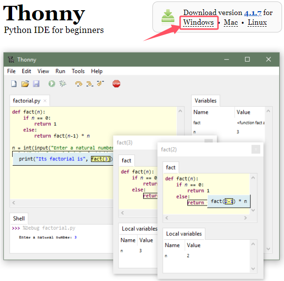

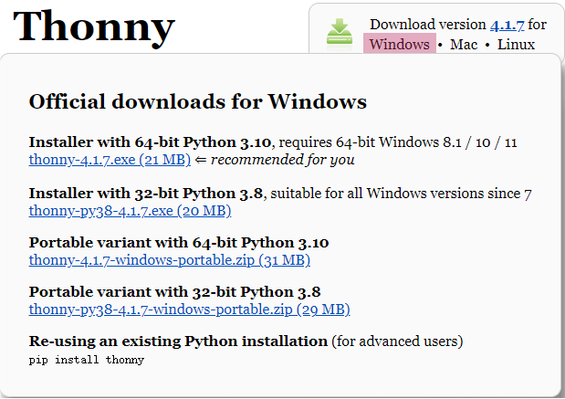

#### MAC

Please refer to Windows.

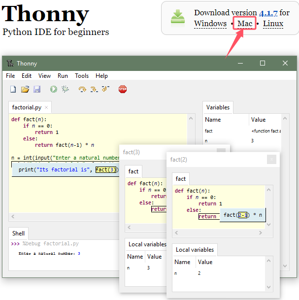


#### Linux

Please refer to Windows.

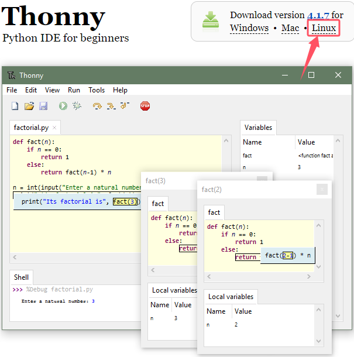


### 2-1-2 Install Thonny(<span style="color: rgb(255, 76, 65);">Important</span>)

Thonny supports two installation methods:

- Thonny+Python package

  Python IDE and Thonny are packaged together and can be directly installed and used. It is fast and easy so is recommended for beginners. There are also two ways to install this package:

  - Installer

    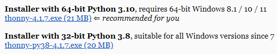

  - Portable variant

    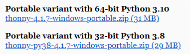

- Thonny only

  Thonny is actually a package of python. When the user already has a python environment, click **pip install thonny** to install Thonny only, which is more suitable for developers.

  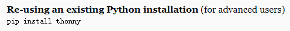

Please download the corresponding version according to your requirements.

#### Installer

Download the app according to your operation system. Here we demonstrate under **64bit Windows 10** to download <span style="color: rgb(255, 76, 65);">Installer with 64-bit Python 3.10</span>.

(1) Click  and you will see “Select Setup Install Mode”. Choose **Install for me only**.


(2) **Next**.

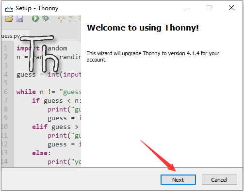

(3) Tick **I accept the agreement** and Click **Next**.


(4) The default installation path is in Disk C. You may click **Browse...** to choose another disk. And then click **Next**.

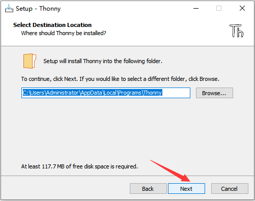

(5) By default, a shortcut to the program is created in the Start menu folder. Click **Browse...** to set another path for the shortcut and **Next**.


(6) Tick **Create desktop icon** and **Next**.

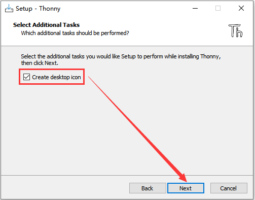

(7) Install.


(8) “**Finish**”!

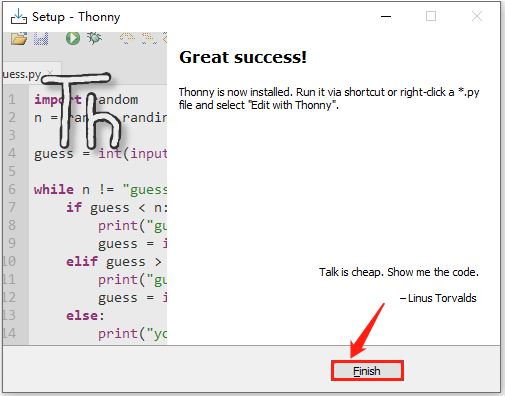

(9) Back to the desktop and start Thonny to choose a language.

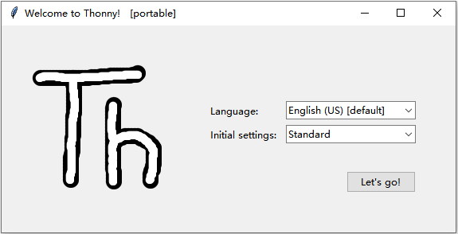

(10) Done.

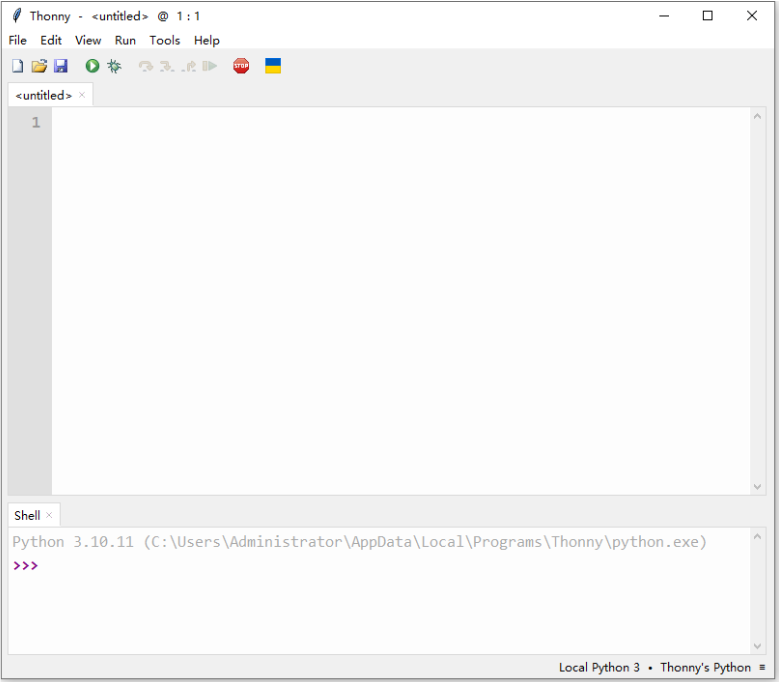

#### Portable Variant

Download the app according to your operation system. Here we demonstrate under **64bit Windows 10** to download <span style="color: rgb(255, 76, 65);">Installer with 64-bit Python 3.10</span>.

(1) Click  to start Thonny and choose a language.

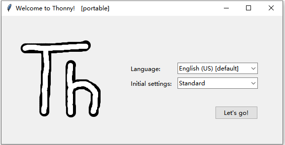

(2) Done.

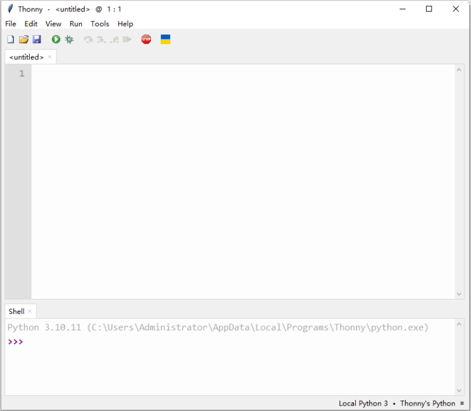

(3) For ease of use, you can create a shortcut to the desktop. Click  and choose “**Send to**” to create a **shortcut to the desktop**.

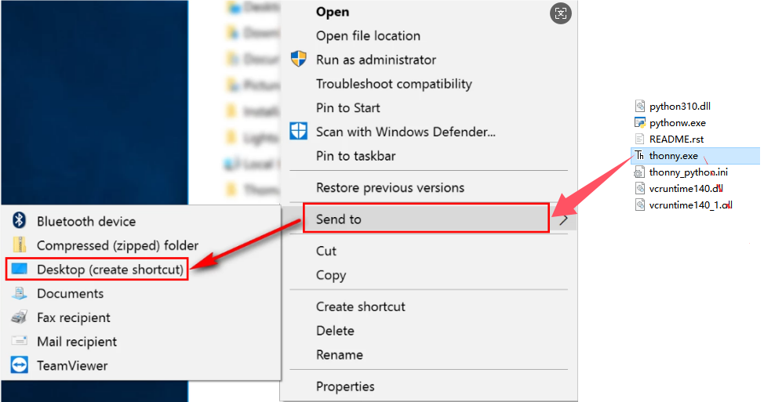

The shortcut to the desktop:  

---

### 2-1-3 Install Driver

We need a driver to start our ESP32 MPU. Otherwise, the COM port connected to your computer will not be found. For how to install the driver: [https://docs.keyestudio.com/projects/Arduino/en/latest/Arduino%20IDE%20Tutorial.html#install-driver](https://docs.keyestudio.com/projects/Arduino/en/latest/Arduino%20IDE%20Tutorial.html#install-driver)

According to ESP32 board and computer system, click the corresponding link to go to the guide.

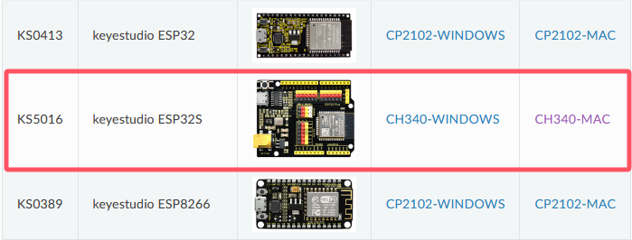

---

### 2-1-4 Burn Firmware(<span style="color: rgb(255, 76, 65);">Important</span>)

<span style="color: rgb(255, 76, 65);">The ESP32 MicroPython firmware we provided is saved in folder **Firmware esp32**.</span>

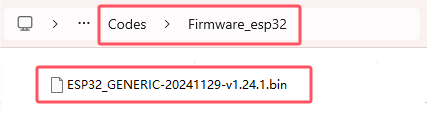

1\. Connect the ESP32 board to your computer via Micro USB.

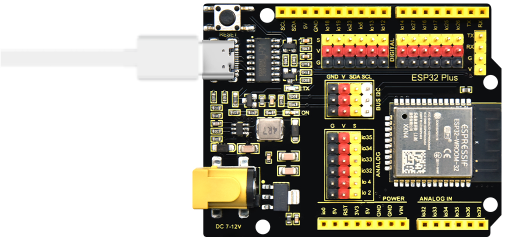

2\. Click “**Run**” to choose “**Configuration interpreter**”.

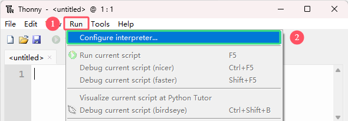

3\. Choose “**Interpreter**” and “**MicroPython(ESP32)**”, and then “**Install or update MicroPython(esptool)(UF2)**”.

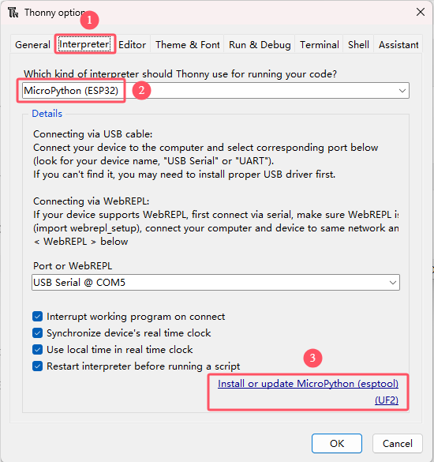

4\. Click the “” icon to “**Select local MicroPython image...**”. Find the firmware in the folder **Firmware esp32** and choose “<span style="color: rgb(255, 76, 65);">ESP32_GENERIC-20241129-v1.24.1.bin</span>” to “**Open**”.

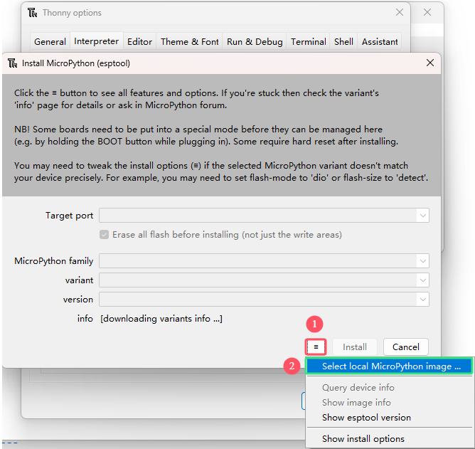

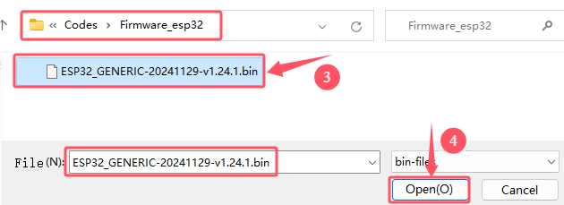

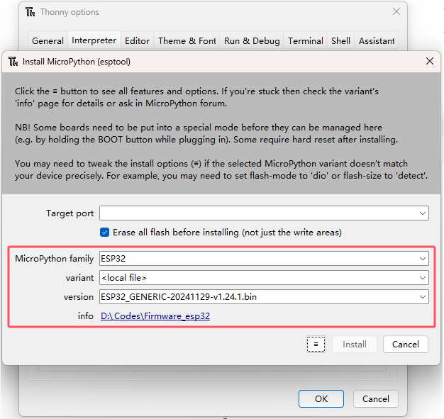

5\. Choose the “**USB serial port(COMXX)**” (*Serial port numbers(COMXX) vary from boards*) to “**Install**” it.

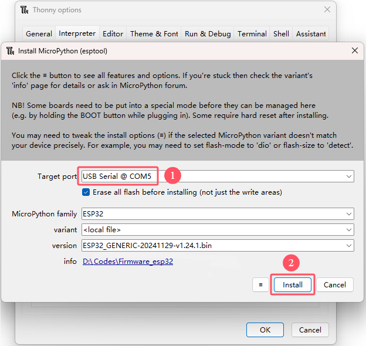

6\. After installation, “**Close**” and “**OK**”.

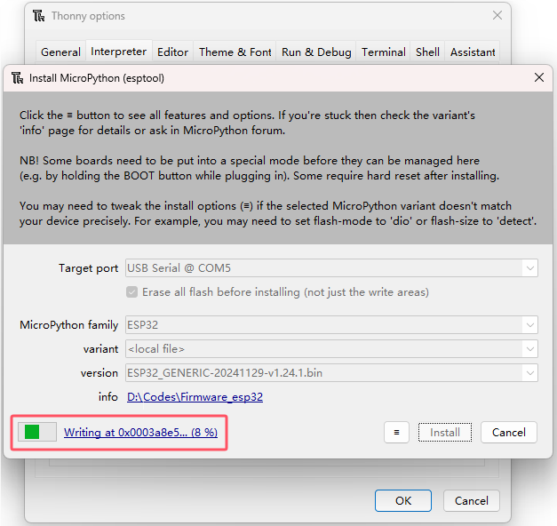

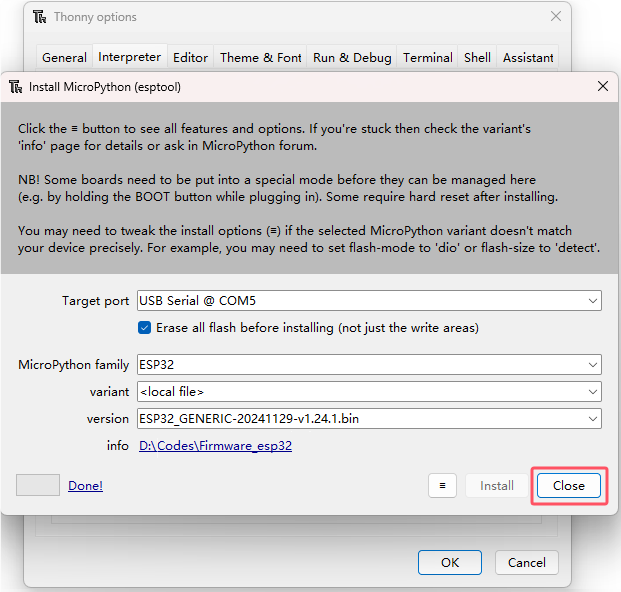

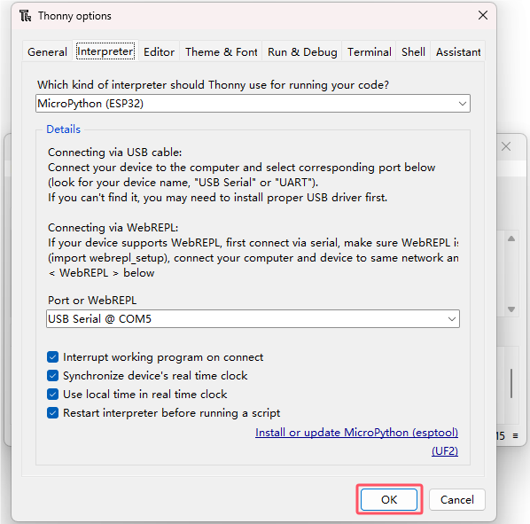

7\. Now the firmware of ESP32 is installed.

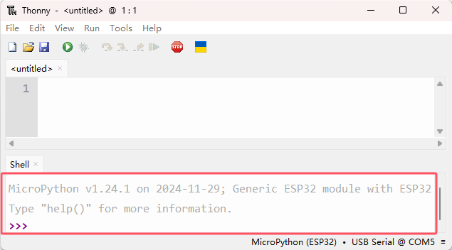

---

### 2-1-5 Use Thonny

#### Homepage

Click **View** and tick **Files** to open the file manager.

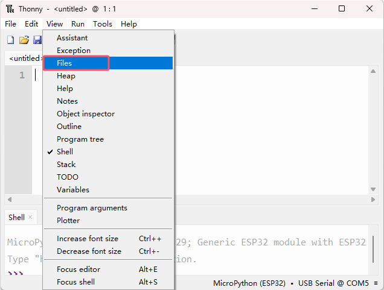

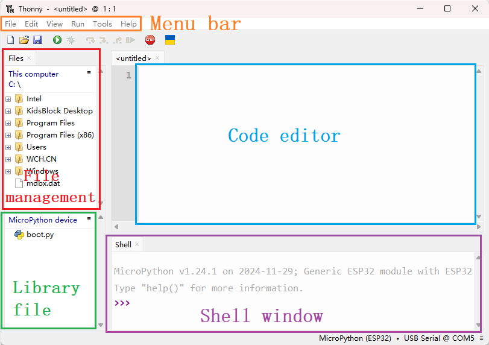

#### Toolbar

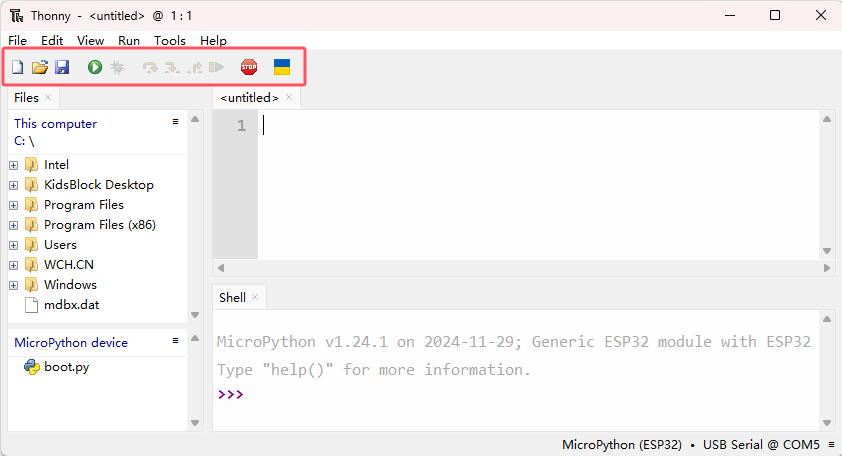

|          Icon          |       Function       |
| :---------------------: | :---------------: |
| |       New       |
|  |      Open...      |
| |       Save       |
|  |   Run current script   |
|  |   Debug current script   |
|  |       Step over       |
|  |   Step into   |
|  |    Step out   |
|  |     Resume     |
|  | Stop/Restart backend |

---

### 2-1-6 Test

<span style="color: rgb(255, 76, 65);">Please download and unzip the code files in your computer, and move it to a disk that is convenient for using, for instance, **Disk(D:)** in this tutorial, and the path is **`D:..\Codes\MicroPython_Code`**. You can also store the code in other disks as needed.</span>

In Files, click **This computer**.

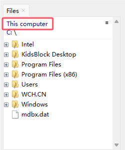

Open **Disk(D:)** and choose **Codes** folder to open **MicroPython_Code**. All codes in this tutorial are stored in it.

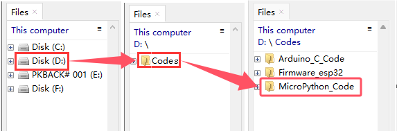

Connect the ESP32 board to your computer via Micro USB.

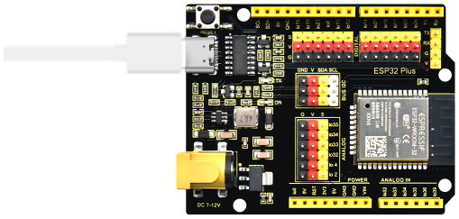

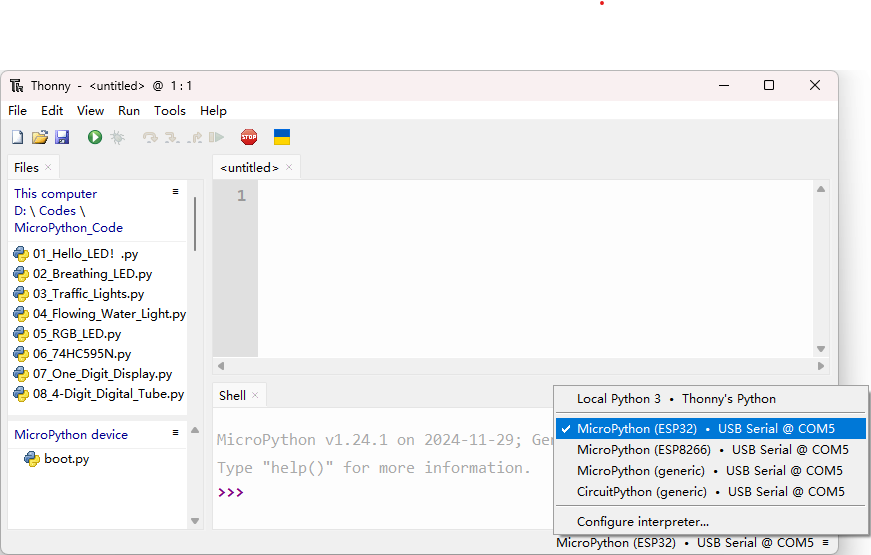

#### Test Shell Command

Input the following code in “Shell”.	

```python
print('hello world')
```
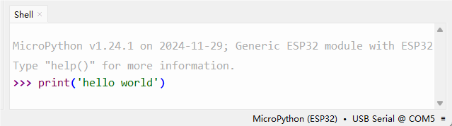

Then press the **Enter** on the keyboard, and the “Shell” shows **hello world**.

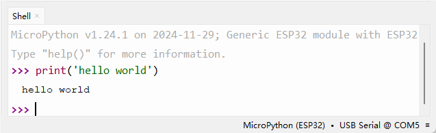

---

#### Test Online Running

Connect the LED and a 220Ω resistor to the ESP32 board, and connect the ESP32 board to your computer via USB cable.

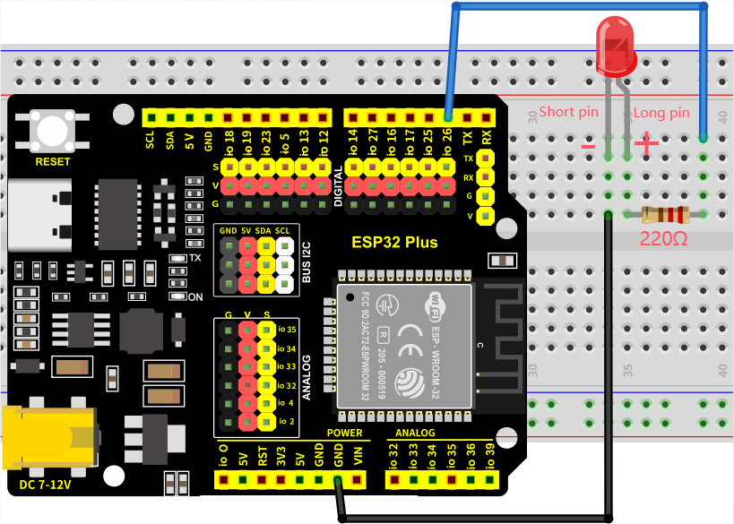

In Files, open **2-3-01_Hello_LED!.py**.

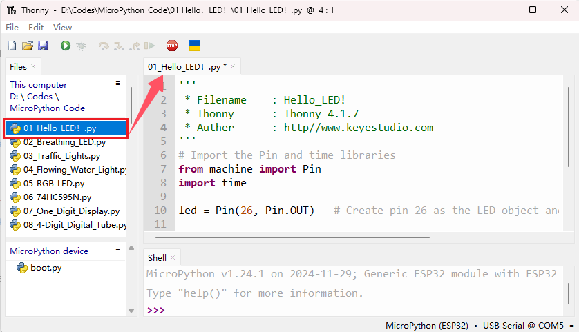

Click  to run the code, and you will see the red LED lights up for 1 second and goes off for 1 second, repeatedly.

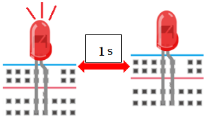

Click  to exit the execution.

---

#### Test Offline Running

**Method ①**: Run the already written program offline

First make sure the Thonny IDE is not in **Online** state. Click  to exit online running.

In Files, open **2-3-01_Hello_LED!.py** and choose **File** --> **Save as...** 


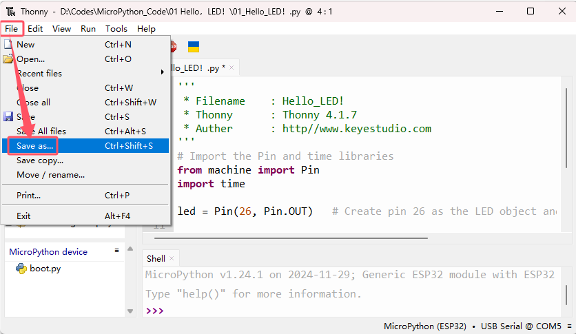

Choose **MicroPython device**.

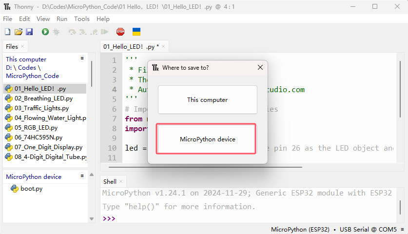

Name the file to **main\.py** (it has to be this name, otherwise the offline running will fail). Click **OK** and you can see the main\.py in **MicroPython device**.

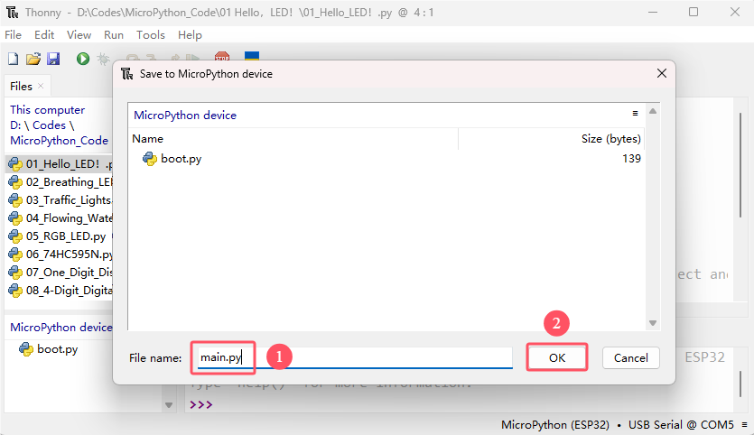

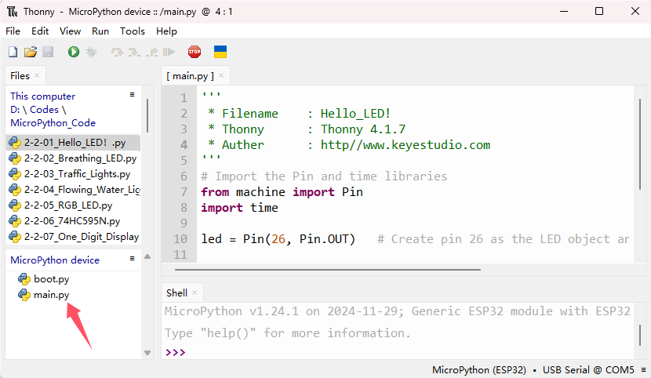

After uploading, unplug the USB cable connecting the ESP32 main board to the computer.

Then power on again (connect the ESP32 board to the computer via USB cable), it will automatically run the program in main\.py, you can see the red LED turns on for 1 second, then off for 1 second, repeatedly.


**Method ②**: Run the newly written program offline

Connect the ESP32 board to your computer via Micro USB.

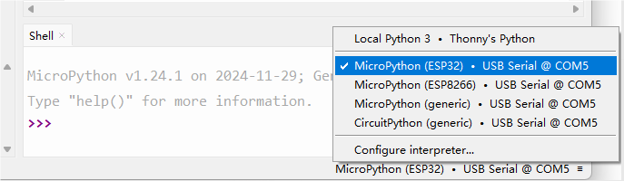

In Files, open **2-3-01_Hello_LED!.py** and copy and paste it to a new program **<untitled\>**. You may click  to create a new script <untitled\>.

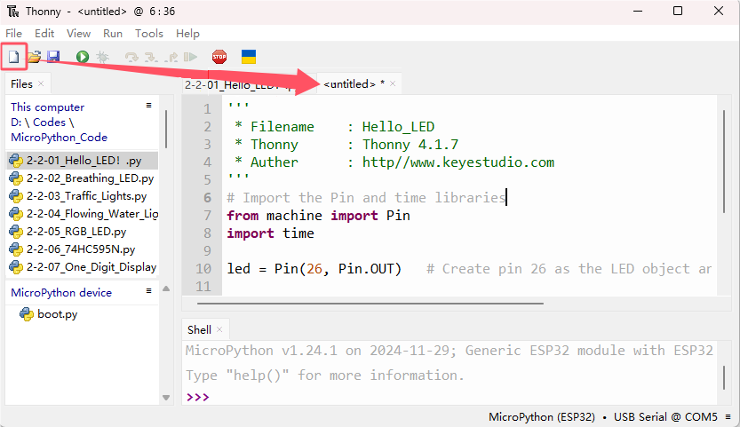

Click  to save it in **MicroPython device**.

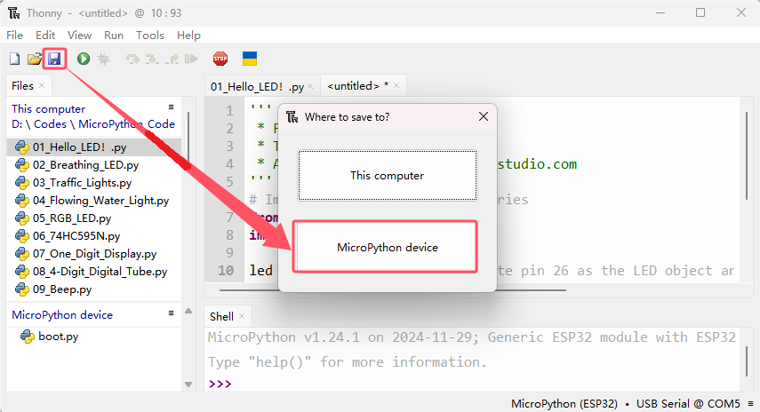

Name the file to **main\.py** (it has to be this name, otherwise the offline running will fail). Click **OK** and you can see the main\.py in **MicroPython device**.

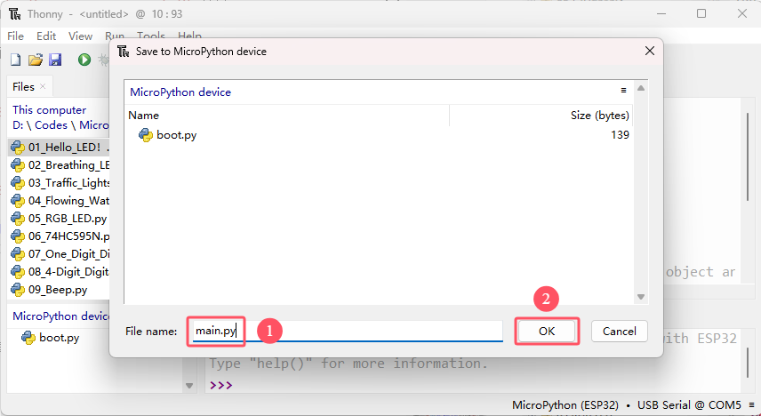

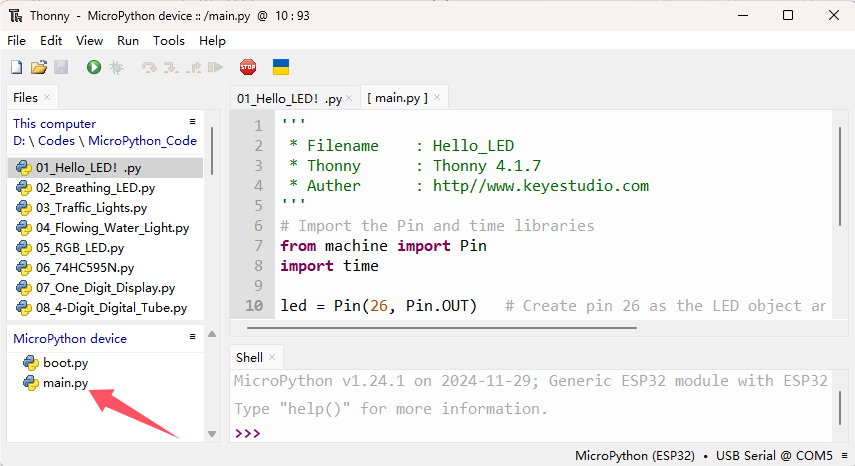

After uploading, unplug the USB cable connecting the ESP32 main board to the computer.

Then power on again (connect the ESP32 board to the computer via USB cable), it will automatically run the program in main\.py, you can see the red LED turns on for 1 second, then off for 1 second, repeatedly.


---

### 2-1-7 Import MicroPython Library(<span style="color: rgb(255, 76, 65);">Important</span>)

For some projects, libraries are required. Therewith, we need to import needed libraries to the ESP32 main board before uploading code.

1\. Connect the ESP32 board to your computer via Micro USB.

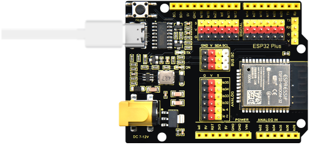

2\. Open Thonny IDE and choose “**MicroPython(ESP32) . USB Serial @ COMxx**”.

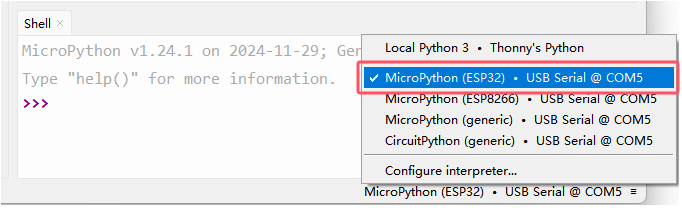

3\. Tick “ **View** -> **Files** ”.

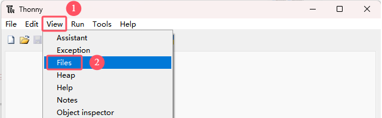

4\. Choose the path to the downloaded **Library** folder, and open **MicroPython_Library**. 
(<span style="color: rgb(255, 76, 65);">⚠️Note that here we download the **Libray** to disk D. You need to choose your path which saves the **Libray** you donwload.</span>)

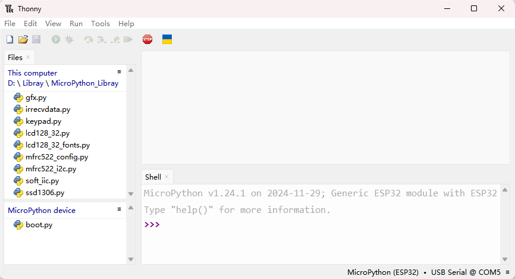

5\. Click the **gfx\.py** file in the ***MicroPython_Libray*** folder to “***Upload to/***” the “**MicroPython device**”.

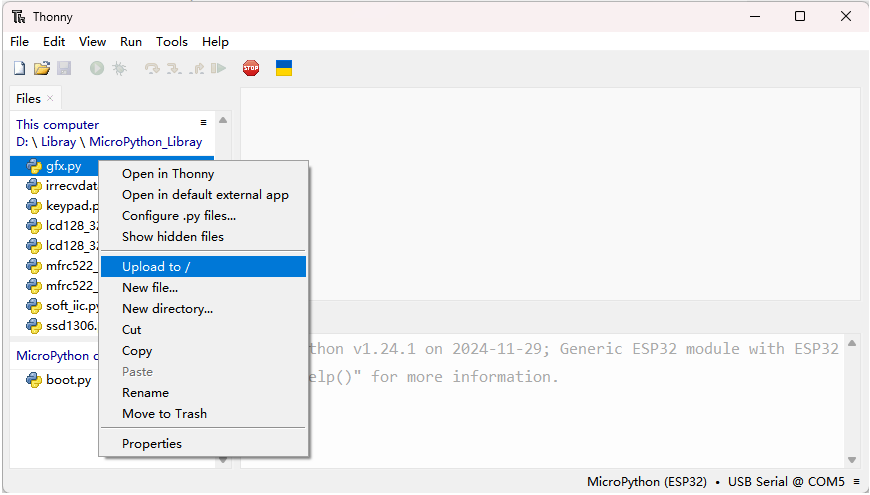

6\. You can see the file that you just uploaded to the “**MicroPython device**”.

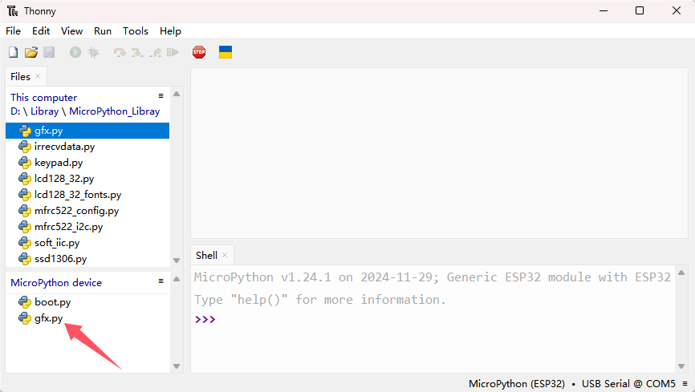

7\. Similarly, import all libraries to “**MicroPython device**”.

8\. And all libraries are in “**MicroPython device**”.

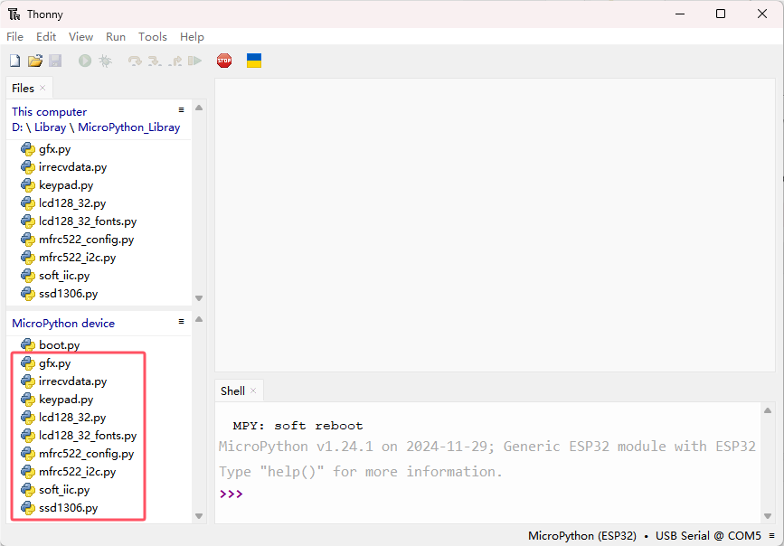

---

## 2-2 IoT Projects

The ESP32 iot Learning Kit utilizes the ESP32-S3 WiFi and Bluetooth to support a variety enjoyable IoT projects. Here we provide a tutorial to do these projects.

WiFi connectivity allows you to connect the Arduino to the Internet and cloud platforms. With WiFi, you can build projects like simple Web servers to remotely control leds, or Arduino IoT Cloud interactions to monitor sensors. 

As for Bluetooth, it supports localized(short-range) wireless communication, including Bluetooth control LED, relay, RGB and buzzer. We pair the ESP32 with your smartphone or other Bluetooth-enabled device to perform a variety of control and monitoring tasks.

---

### 2-2-01 IoT Bluetooth Control LED

---

**1. Overview**

In this experiment, we develop a simple Bluetooth Low Power (BLE) serial communication application with an ESP32 microcontroller. The ESP32 integrates Wi-Fi and Bluetooth, making it ideal for developing wireless applications. BLE is a low power wireless communication protocol designed for short distance communication. 

Here’s how to set up an ESP32 as a BLE server and communicate with BLE clients over a serial connection. We also add LED configuration and custom commands such as “1” and “0”. These commands allow you to control the on and off of the LED by sending commands from **LightBlue** APP on your mobile device.

---

**2. Component Knowledge**

**(1) ESP32 Bluetooth**

The ESP32 WROOM 32 integrates Wi-Fi and Bluetooth. It supports Bluetooth Low Energy (BLE) and Classic Bluetooth protocols and can be used as a Bluetooth client or server. As a Bluetooth client, it can connect to other Bluetooth devices and exchange data with them. As a Bluetooth server it provides services to other devices.

The module supports several Bluetooth profiles, including Generic Access Profile (GAP), Generic Attribute Profile (GATT), and Serial Port Profile (SPP). The SPP allows the module to emulate a serial port over Bluetooth, enabling serial communication with other Bluetooth devices.

When using the Bluetooth of the ESP32 WROOM 32, we need to program with an appropriate software development kit (SDK) or an Arduino IDE with the ESP32 BLE library that provides advanced interfaces for BLE, including an example of how to use the module as a BLE client and server.

Bluetooth is a short-distance communication system that can be divided into two types, namely Bluetooth Low Energy (BLE) and classic bluetooth. There are two modes for simple data transfer: master mode and slave mode.

**Master Mode**: In this mode, work is done on the master device and can be connected to the slave device. When the device initiates a connection request in the main mode, information such as the address and pairing password of other bluetooth devices are required. Once paired, you can connect directly to them.

**Slave Mode**: A bluetooth module in the slave mode can only accept connection requests from the host, but cannot initiate connection requests. After being connected to a host device, it can send and receive data through the host device . Bluetooth devices can interact with each other, when they interact, the bluetooth device in the main mode searches for nearby devices. While a connection is established, they can exchange data. For example, when a mobile phone exchanges data with ESP32, the mobile phone is usually in master mode and the ESP32 is in slave mode.

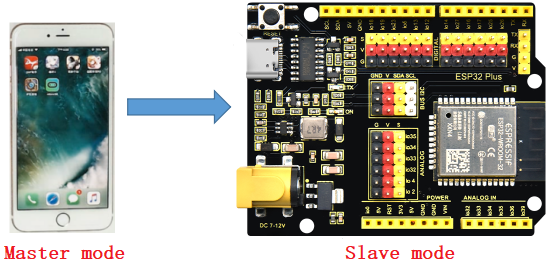

Overall, the Bluetooth capability of the ESP32 WROOM 32 provides a convenient and low-power way to enable wireless communication in the project.

**(2) LED**


An LED is a semiconductor known as a "light-emitting diode", which is made of semiconductor materials (silicon, selenium, germanium, etc.). It is polar. The short pin is negative that connects to GND, while the long one is positive that connects to 3.3V or 5V.

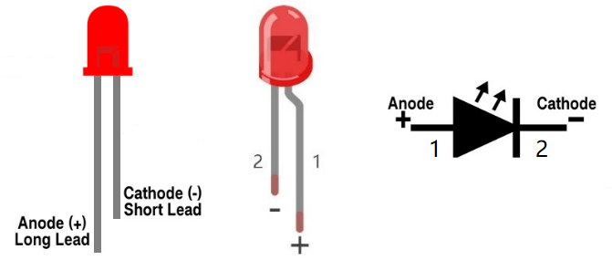

- Here is the detailed introduction for the LED: [LED - Wikipedia](https://en.wikipedia.org/wiki/Light-emitting_diode)

**(3) Five-color-ring Resistor**

A resistor limits or regulates the flow of current in the circuit. The left picture is the appearance of the resistor and the right one is its circuit symbol. Its unit of R is ohm(Ω). 1 MΩ= 1000 kΩ, 1 kΩ = 1000Ω.


We can use resistors to protect sensitive components, like LED. The resistance(Ω) is marked on the body with an electronic color code. Each color represents a number, and you can refer to it in the resistance card.

-ring 1 – 1st Digit.
-ring 2 – 2nd Digit.
-ring 3 – 3rd Digit.
-ring 4 – Multiplier.
-ring 5 – Tolerance.


In this kit, we provide four five-color-ring resistor. Here we take three of them as examples.

220Ω resistor *10

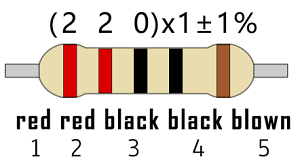

10KΩ resistor *10

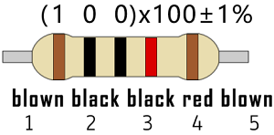

1KΩ resistor *10

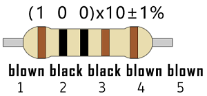

- You can learn more about resistor from Wiki: [Resistor - Wikipedia](https://en.wikipedia.org/wiki/Resistor)

In the same voltage, there will be less current but more resistance. The connection between current(I), voltage(V), and resistance(R) can be expressed: I=U/R. In the figure below, for instance, if the voltage is 3V, the current through R1 equals I = U / R = 3 V / 10 KΩ= 0.0003A= 0.3mA.


- You can learn more about Ohm’s Law from Wiki: [Ohm’s Law - Wikipedia](https://en.wikipedia.org/wiki/Ohm%27s_law)

Don’t connect a low resistance directly to the two poles of the power supply, as this will cause excessive current to damage the electronic components. Resistors are nonpolar.

**(4) Breadboard**

Breadboards are used to build and test circuits quickly before completing any circuit design. There are many holes in the breadboard so that components such as resistors can be inserted into it. 
A typical breadboard is shown below:

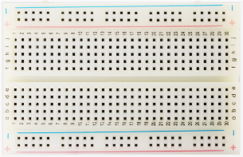

The breadboard comes with many metal strips that run underneath the board to connect holes together. They are laid out as shown below. Note that the top and bottom rows of holes are connected horizontally, while the remaining holes are connected vertically.

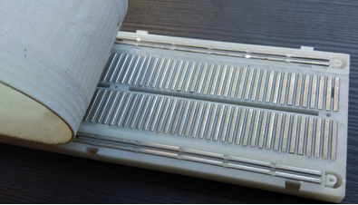

The first two rows (top) and the last two rows (bottom) are used for power positive(+) and negative(-) respectively. The conductive layout is shown below:

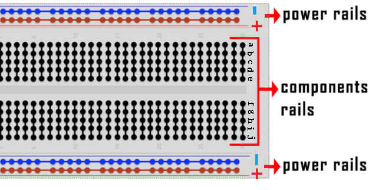

We should know that the up and low holes of groove in the middle are not connected. So we can connect the DIP(Dual in-line Packages) components (say, integrated circuits, microcontrollers, chips, etc.) as shown below:


If you want to know more about breadboard, refer to: [How to Use a Breadboard - Science Buddies](https://www.sciencebuddies.org/science-fair-projects/references/how-to-use-a-breadboard)

---

**3. Components**

| 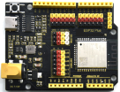 ||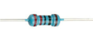||
| ------------------------ | ------------------------ | ---------------------------- |---------------------------- |
| ESP32 main board x1 | red LED x1 | 220Ω resistor  x1 |mobile device x1|
|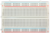|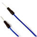||   |
|breadboard x1 |jumper wires | Micro USB cable x1 |    |

---

**4. Wiring Diagram** 

We adopt digital pin IO26 in this experiment. In the circuit, we connect a 220Ω resistor in serial, which protect the LED from over-current.

**Schematic diagram:**

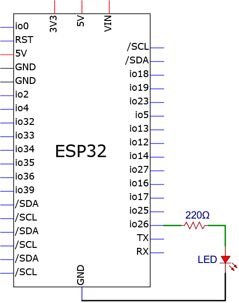

**Wiring diagram:**

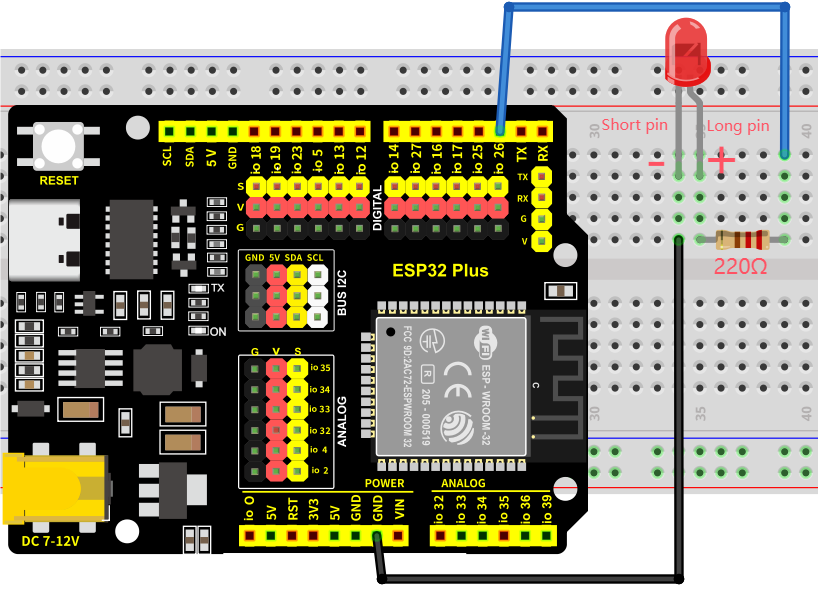

---

**5. LightBlue APP**

Take a tablet or smartphone, click [App Store](https://apps.apple.com/us/app/lightblue/id557428110)(iOS users) or [Google Play](https://play.google.com/store/apps/details?id=com.punchthrough.lightblueexplorer)(Android users) to download LightBlue. Or directly search “LightBlue” in **App Store**(iOS users) or **Google Play**(Android users) to download the APP.


---

**6. aioble Package**

To use codes and Bluetooth with the ESP32, we need to install the <span style="color: rgb(255, 76, 65);">**aioble**</span> package, which is currently the recommended library for BLE with MicroPython.

Before you can do this, you need to install it on your ESP32 board.

1\. Connect the ESP32 board (MicroPython installed - check prerequisites) to your computer and connect it to the Thonny IDE.

2\. Click “**Tools**” > “**Manage Packages...**” .

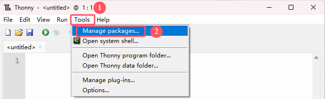

3\. Search **<span style="color: rgb(255, 76, 65);">aioble</span>** and choose **aioble** to install.

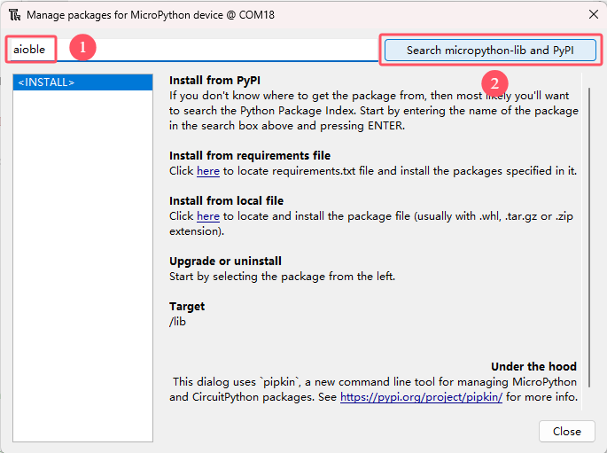

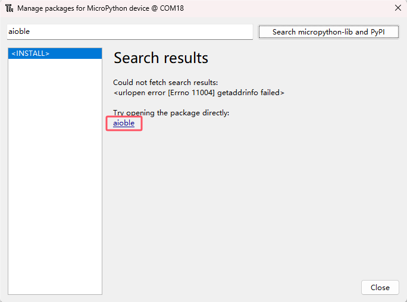

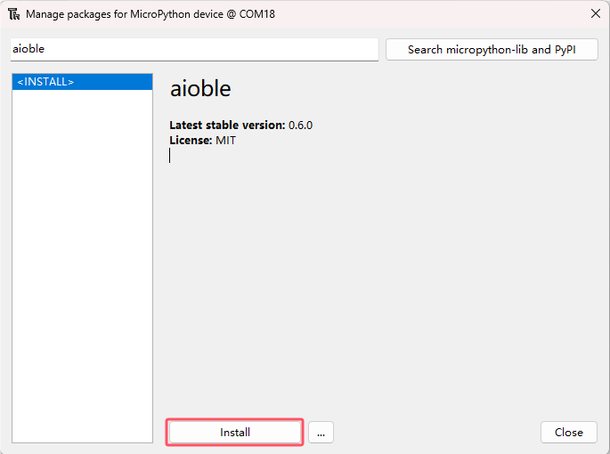

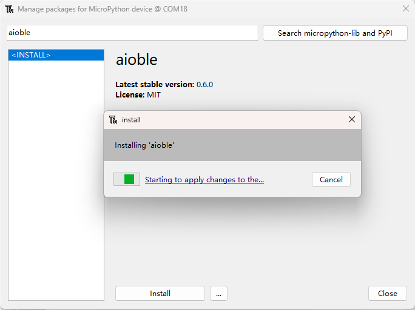

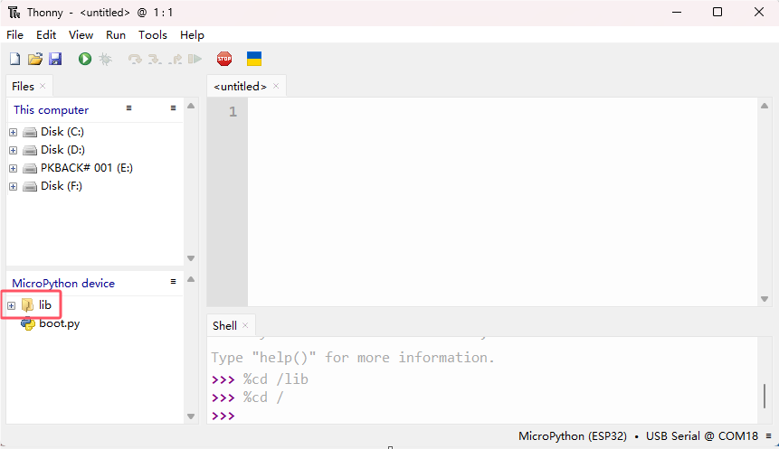

---

**7. Test Code**

```python
'''
 * Filename    : IoT_Bluetooth_Control_LED 
 * Thonny      : Thonny 4.1.7
 * Auther      : http//www.keyestudio.com
'''
# Import related library
from micropython import const
import asyncio
import aioble
import bluetooth
import struct
from machine import Pin
from random import randint

# Init LED
led = Pin(26, Pin.OUT)
led.value(0)

# Init random value
value = 0

# See the following for generating UUIDs:
# https://www.uuidgenerator.net/
_BLE_SERVICE_UUID = bluetooth.UUID('19b10000-e8f2-537e-4f6c-d104768a1214')
_BLE_SENSOR_CHAR_UUID = bluetooth.UUID('19b10001-e8f2-537e-4f6c-d104768a1214')
_BLE_LED_UUID = bluetooth.UUID('19b10002-e8f2-537e-4f6c-d104768a1214')
# How frequently to send advertising beacons.
_ADV_INTERVAL_MS = 250_000

# Register GATT server, the service and characteristics
ble_service = aioble.Service(_BLE_SERVICE_UUID)
sensor_characteristic = aioble.Characteristic(ble_service, _BLE_SENSOR_CHAR_UUID, read=True, notify=True)
led_characteristic = aioble.Characteristic(ble_service, _BLE_LED_UUID, read=True, write=True, notify=True, capture=True)

# Register service(s)
aioble.register_services(ble_service)

# Helper to encode the data characteristic UTF-8
def _encode_data(data):
    return str(data).encode('utf-8')

# Helper to decode the LED characteristic encoding (bytes).
def _decode_data(data):
    try:
        if data is not None:
            # Decode the UTF-8 data
            number = int.from_bytes(data, 'big')
            return number
    except Exception as e:
        print("Error decoding temperature:", e)
        return None

# Get sensor readings
def get_random_value():
    return randint(0,100)

# Get new value and update characteristic
async def sensor_task():
    while True:
        value = get_random_value()
        sensor_characteristic.write(_encode_data(value), send_update=True)
        print('New random value written: ', value)
        await asyncio.sleep_ms(1000)
        
# Serially wait for connections. Don't advertise while a central is connected.
async def peripheral_task():
    while True:
        try:
            async with await aioble.advertise(
                _ADV_INTERVAL_MS,
                name="ESP32_Bluetooth",
                services=[_BLE_SERVICE_UUID],
                ) as connection:
                    print("Connection from", connection.device)
                    await connection.disconnected()             
        except asyncio.CancelledError:
            # Catch the CancelledError
            print("Peripheral task cancelled")
        except Exception as e:
            print("Error in peripheral_task:", e)
        finally:
            # Ensure the loop continues to the next iteration
            await asyncio.sleep_ms(100)

async def wait_for_write():
    while True: 
        try:
            connection, data = await led_characteristic.written()
            print(data)
            print(type)
            data = _decode_data(data)
            print('Connection: ', connection)
            print('Data: ', data)
            if data == 1:
                print('Turning LED ON')
                led.value(1)
            elif data == 0:
                print('Turning LED OFF')
                led.value(0)
            else:
                print('Unknown command')
        except asyncio.CancelledError:
            # Catch the CancelledError
            print("Peripheral task cancelled")
        except Exception as e:
            print("Error in peripheral_task:", e)
        finally:
            # Ensure the loop continues to the next iteration
            await asyncio.sleep_ms(100)
            
# Run tasks
async def main():
    t1 = asyncio.create_task(sensor_task())
    t2 = asyncio.create_task(peripheral_task())
    t3 = asyncio.create_task(wait_for_write())
    await asyncio.gather(t1, t2)
    
asyncio.run(main())
```
---

**8. Test Result**

Please follow the steps below:

**⚠️Here we take Android system as an example, and iOS users may have a reference.**


1\. Open “Thonny IDE” and choose “This Computer” → “D:” → “Codes” → “MicroPython_Code”. Open the file “2-2-01_IoT_Bluetooth_Control_LED.py” or copy and paste the above code into “Thonny IDE”.

2\. Connect the ESP32 board to the computer via USB cable. Click  to run code and the “Shell” shows the temperature written by the sensor on the ESP32 board.

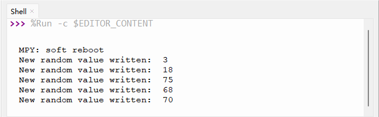

3\. After uploading code, enable Bluetooth on your mobile device (smartphone) and open **LightBlue**.

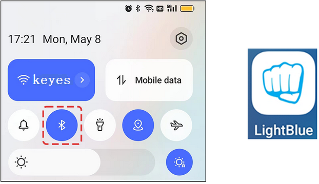

4\. In **Peripherals**, find **ESP32-Bluetooth** and click “**Connect**”. If you don’t see it, try refreshing the page a few times. Once “**Connected**”, the Bluetooth is connected. Scroll down to set **3 UUIDs** in the code. And Thonny IDE “Shell” shows it detects a new connection.

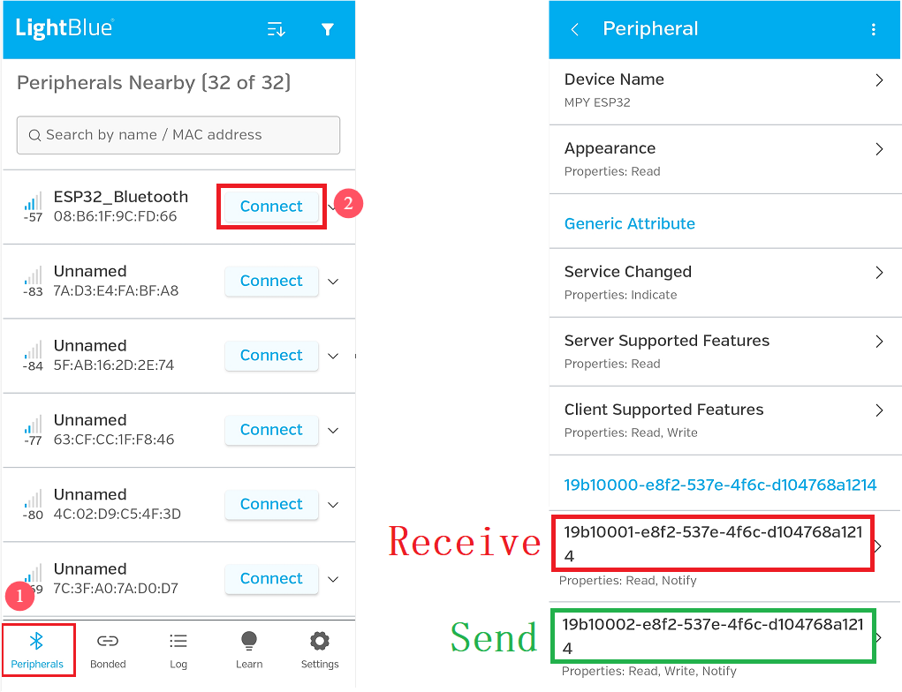

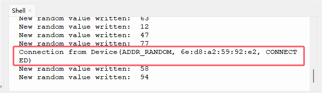

(**⚠️ATTENTION:** On iOS devices, if the **LightBlue** APP you downloaded and installed is an older version, find **MPY ESP32** and click “**Connect**”. If **LightBlue** is a new version, find **ESP32-Bluetooth** and click “**Connect**”. Other operations are similar to Android system.) 

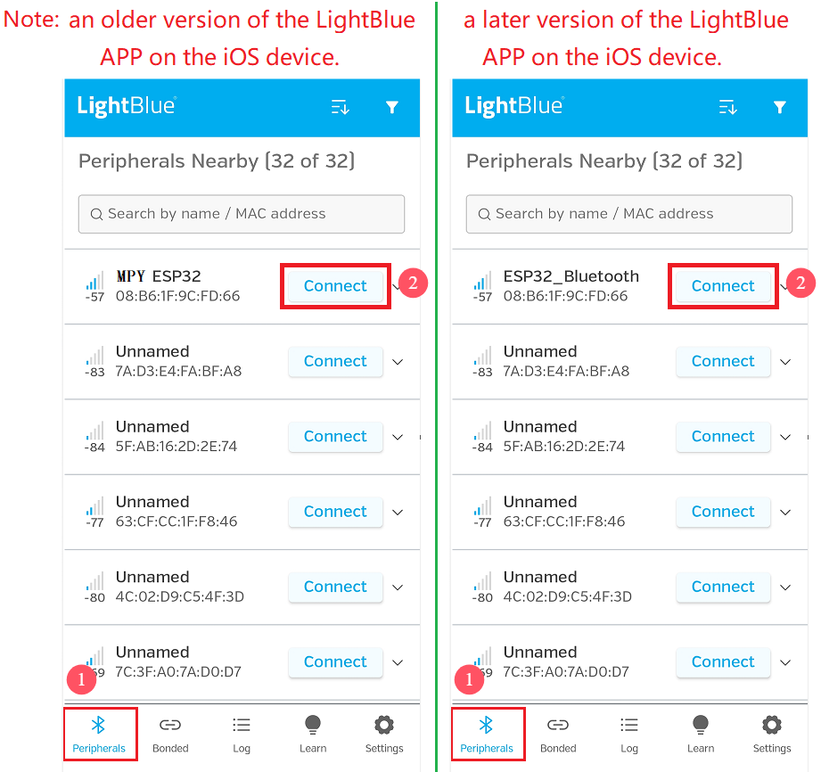

5\. Tap **Send** UUID and “**Write New Value**” to write a “**1**”. Click “**Write**” and the external LED lights up. Meanwhile, the “Shell” shows related messages.

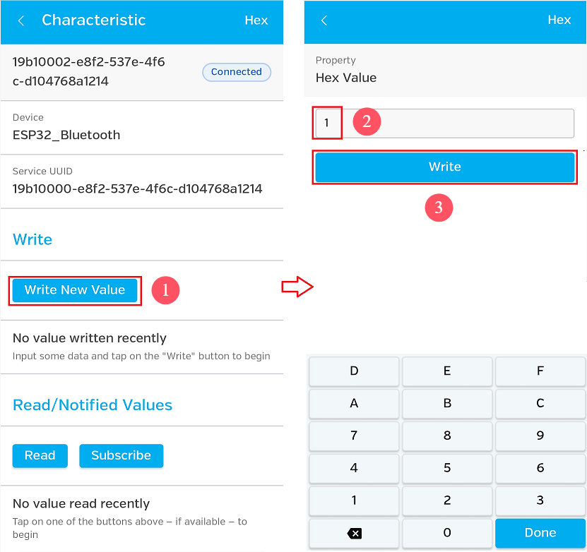

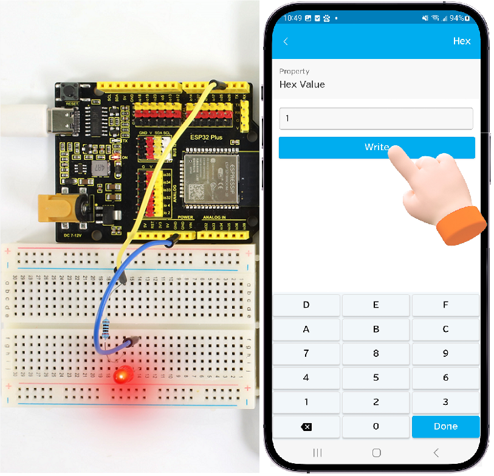

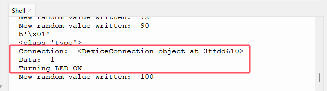

6\. Tap “**Write New Value**” again to write “**0**” to see if the LED responds to this command. Input “**0**” and click “**Write**”, and the LED goes off. Meanwhile, the “Shell” shows related messages.

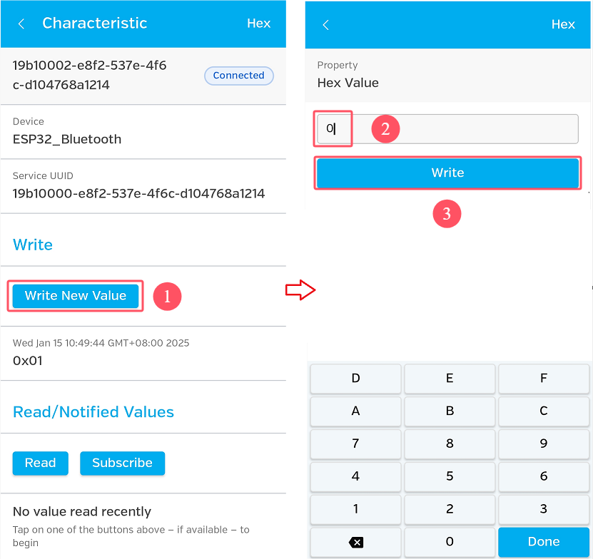

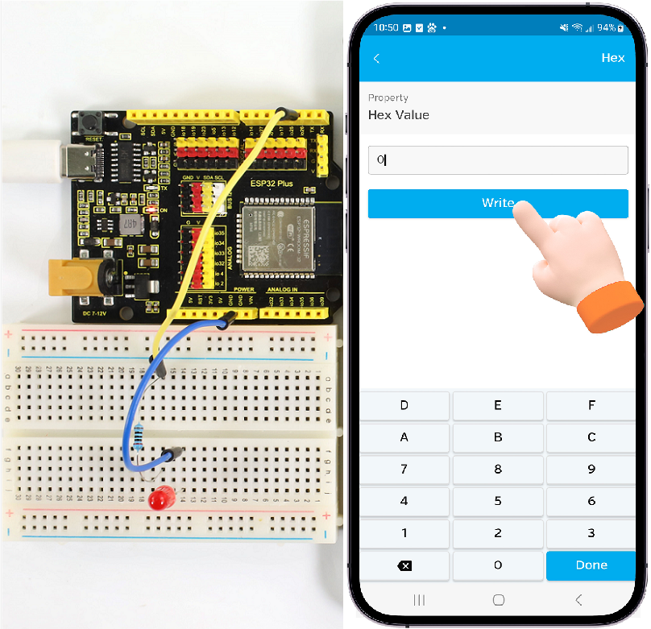

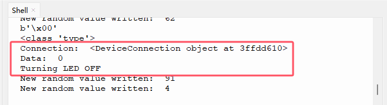

7\. Click  to exit the execution.

---

**9. Code Explanation**

- **Include libraries**: Libraries, including asyncio, aioble, randint, random, and bluetooth, should be imported before connecting the ESP32 board to Bluetooth.

```python
from micropython import const
import asyncio
import aioble
import bluetooth
import struct
from machine import Pin
from random import randint
```
- **Define UUID and register GATT services and characteristics**: Define the UUID of the service and its characteristics, one will hold the LED value and the other will hold the assumed sensor reading (it is recommended to use the same UUID we are using); Then, register GATT services and characteristics.

```python
_BLE_SERVICE_UUID = bluetooth.UUID('19b10000-e8f2-537e-4f6c-d104768a1214')
_BLE_SENSOR_CHAR_UUID = bluetooth.UUID('19b10001-e8f2-537e-4f6c-d104768a1214')
_BLE_LED_UUID = bluetooth.UUID('19b10002-e8f2-537e-4f6c-d104768a1214')
# How frequently to send advertising beacons.
_ADV_INTERVAL_MS = 250_000

# Register GATT server, the service and characteristics
ble_service = aioble.Service(_BLE_SERVICE_UUID)
sensor_characteristic = aioble.Characteristic(ble_service, _BLE_SENSOR_CHAR_UUID, read=True, notify=True)
led_characteristic = aioble.Characteristic(ble_service, _BLE_LED_UUID, read=True, write=True, notify=True, capture=True)

# Register service(s)
aioble.register_services(ble_service)
```
- **Encode and decode data**: The data to write characteristics needs to be in a specific format. `_encode_data()` converts the data to UTF-8 format.

```python
def _encode_data(data):
    return str(data).encode('utf-8')
```
- When other devices write `led_characteristic` , the data will be in byte format. The following function converts bytes to integers.

```python
def _decode_data(data):
    try:
        if data is not None:
            # Decode the UTF-8 data
            number = int.from_bytes(data, 'big')
            return number
    except Exception as e:
        print("Error decoding temperature:", e)
        return None
```
- **Get new values and write characteristics**: `sensor_task()` is an asynchronous function that gets a new random value. It performs a write characteristic to the `sensor_characteristic` through `write()`. This task is repeated once per second. You can adjust the delay time as needed.

```python
async def sensor_task():
    while True:
        value = get_random_value()
        sensor_characteristic.write(_encode_data(value), send_update=True)
        #print('New random value written: ', value)
        await asyncio.sleep_ms(1000)
```
When using `get_random_value()`, we should replace it with a function that will get the sensor data, for example, the temperature from the DS18B20 temperature sensor.

- **Annunciation**: In addition to writing the sensor characteristics, we also need to announce the ESP32 as a BLE service. So we use `peripheral_task()`.

```python
async def peripheral_task():
    while True:
        try:
            async with await aioble.advertise(
                _ADV_INTERVAL_MS,
                name="ESP32_Bluetooth",
                services=[_BLE_SERVICE_UUID],
                ) as connection:
                    print("Connection from", connection.device)
                    await connection.disconnected()             
        except asyncio.CancelledError:
            # Catch the CancelledError
            print("Peripheral task cancelled")
        except Exception as e:
            print("Error in peripheral_task:", e)
        finally:
            # Ensure the loop continues to the next iteration
            await asyncio.sleep_ms(100)
```

**⚠️Attention please,** In this function, we define the BLE device name to “ESP32_Bluetooth”. You can rename it if you want. However, if you want to follow our example, we recommend that you keep the name.

- **Wait to write**:  `wait_for_write()` keeps checking whether the `led_characteristic` is written. When it is activated, we decode the data and turn the ESP32 on-board LED on or off accordingly.

```python
async def wait_for_write():
    while True:
        try:
            connection, data = await led_characteristic.written()
            print(data)
            print(type)
            data = _decode_data(data)
            print('Connection: ', connection)
            print('Data: ', data)
            if data == 1:
                print('Turning LED ON')
                led.value(1)
            elif data == 0:
                print('Turning LED OFF')
                led.value(0)
            else:
                print('Unknown command')
        except asyncio.CancelledError:
            # Catch the CancelledError
            print("Peripheral task cancelled")
        except Exception as e:
            print("Error in peripheral_task:", e)
        finally:
            # Ensure the loop continues to the next iteration
            await asyncio.sleep_ms(100)
```
- **Main function**: We create an asynchronous `main()` function, in which the basis of the code will be written. We create three asynchronous tasks: one for announcements, one for writing sensor characteristics, and one for controlling LED when writing `led_characteristic` on other devices.
```python
async def main():
    t1 = asyncio.create_task(sensor_task())
    t2 = asyncio.create_task(peripheral_task())
    t3 = asyncio.create_task(wait_for_write())
    await asyncio.gather(t1, t2)
```
Finally, run the code as follows.
```python
asyncio.run(main())
```
---

### 2-2-02 IoT Bluetooth Control Buzzer

---

**1. Overview**

In previous experiments, we have learned how Bluetooth transmits data and controls LED. Here we  configure buzzer to set custom commands such as “1” and “0”. These commands allow you to control the buzzer to emit sound by sending commands from **LightBlue** APP on your mobile device.

---

**2. Component Knowledge**

**Active buzzer**


In the active buzzer, a simple oscillator circuit is integrated to convert constant direct current into pulse signals with a certain frequency. Once it receives a high level, it will emit sound. 

However, passive buzzer is without vibration source, so it must be driven by 2k ~ 5k square waves, rather than a DC signal. 

They are very similar in appearance, but the passive one buzzer is with a green circuit board, while the active one is with black tape. Passive buzzers are not polar, yet active ones are. 

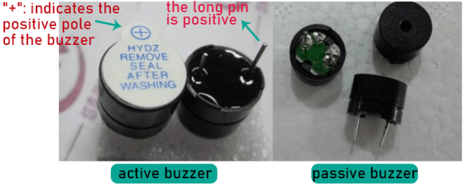

- You can learn more about buzzer from Wiki: [Buzzer - Wikipedia](https://en.wikipedia.org/wiki/Buzzer)

**Transistor**

As buzzer requires large current but GPIO of ESP32 output capability cannot meet this requirement, a NPN transistor is needed to amplify the current. 


Transistor is a semiconductor that controls current. It amplifies weak signals or works as a non-contact switch. 

According to structures, it can be divided into NPN and PNP. Both of them comes with three electrodes: base(B), collector(C) and emitter(E). The PN junction between E and B is also named “emitting junction”, and that between C and B is also called “collecting junction”. 

- You can learn more about transistor from Wiki: [P-N junction - Wikipedia](https://en.wikipedia.org/wiki/P%E2%80%93n_junction)

As shown below, the arrow points to the direction of current flow.

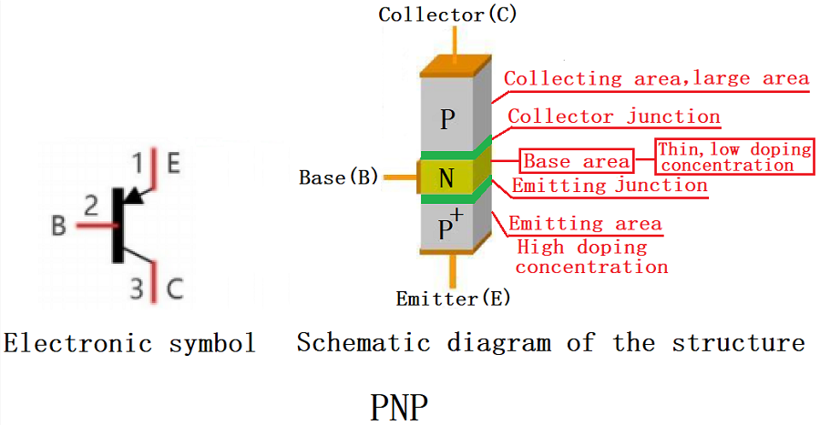

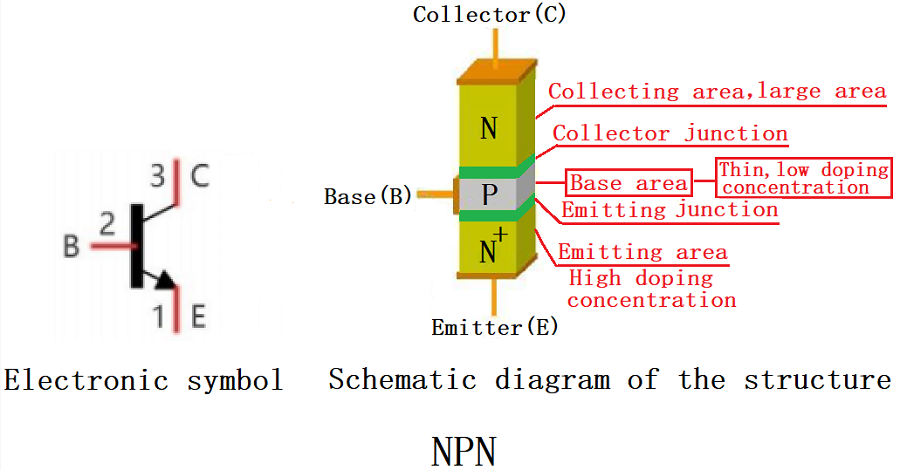

When there is current passing between “BE”, “CE” will allow several-folded current pass (amplified by the transistor). At this point, transistor works in the amplifying area. When current between “BE” exceeds a certain value, “CE” will not allow current to increase any longer. Now the transistor works in the saturation area.

Here are the two types of transistor: PNP and NPN

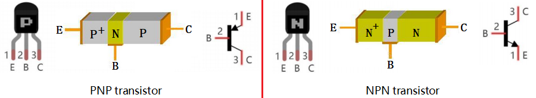

***In this kit, we mark PNP transistor as 8550, and NPN as 8050.***

It is often used as a switch in digital circuits. As microcontroller's capacity to output current is very weak, transistor is a perfect choice to amplify current and drive large-current components. 

NPN transistor drives buzzer: If GPIO outputs high, current will flow through R1, the transistor will get conducted, and the buzzer will emit sound. If GPIO outputs low, no current flows through R1, so the transistor will not be conducted to enable buzzer to sound. 

PNP transistor drives buzzer: If GPIO outputs low, current will flow through R1, the transistor will get conducted, and the buzzer will emit sound. If GPIO outputs high, no current flows through R1, so the transistor will not be conducted to enable buzzer to sound. 

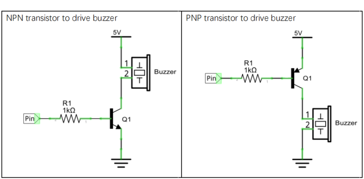

- [S8050 Transistor Datasheet](https://datasheet4u.com/datasheet-pdf/WeitronTechnology/S8050/pdf.php?id=576670)

- [S8550 Transistor Datasheet](https://www.mouser.com/datasheet/2/149/SS8550-118608.pdf)

---

**3. Components**

|   ||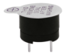|
| ------------------------ | ------------------------ | ---------------------------- |
|ESP32 main board x1| NPN transistor (S8050) x1 | active buzzer x1 |
||||
|breadboard x1 |jumper wires | Micro USB cable x1 |
||||
|mobile device x1| 1kΩ resistor x1 | 10kΩ resistor x1 |

---

**4. Wiring Diagram**

**Schematic diagram:**

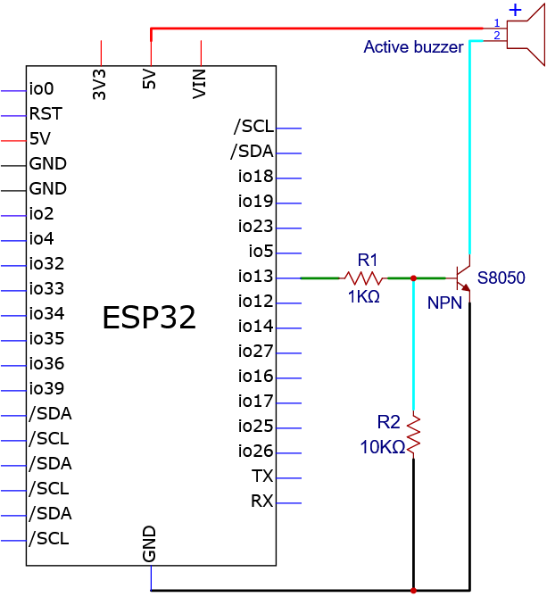

**Wiring diagram:**

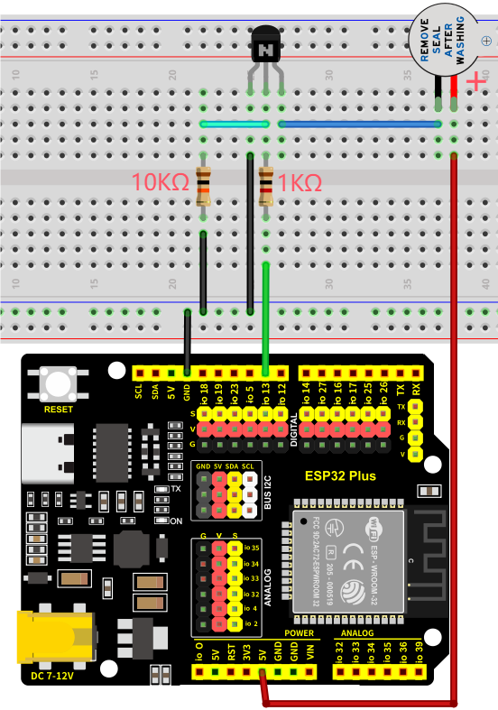

---

**5. LightBlue APP**

**⚠️ATTENTION:** If you have installed LightBlue APP, skip this step. If not, please refer to 2-2-01.

---

**6. aioble Package**

**⚠️ATTENTION:** If you have installed aioble package, skip this step. If not, please refer to 2-2-01.

---

**7. Test Code**

```python
'''
 * Filename    : IoT_Bluetooth_Control_Buzzer 
 * Thonny      : Thonny 4.1.7
 * Auther      : http//www.keyestudio.com
'''
# Import related library
from micropython import const
import asyncio
import aioble
import bluetooth
import struct
from machine import Pin
from random import randint

# Init buzzer
buzzer = Pin(13, Pin.OUT)
buzzer.value(0)

# Init random value
value = 0

# See the following for generating UUIDs:
# https://www.uuidgenerator.net/
_BLE_SERVICE_UUID = bluetooth.UUID('19b10000-e8f2-537e-4f6c-d104768a1214')
_BLE_SENSOR_CHAR_UUID = bluetooth.UUID('19b10001-e8f2-537e-4f6c-d104768a1214')
_BLE_LED_UUID = bluetooth.UUID('19b10002-e8f2-537e-4f6c-d104768a1214')
# How frequently to send advertising beacons.
_ADV_INTERVAL_MS = 250_000

# Register GATT server, the service and characteristics
ble_service = aioble.Service(_BLE_SERVICE_UUID)
sensor_characteristic = aioble.Characteristic(ble_service, _BLE_SENSOR_CHAR_UUID, read=True, notify=True)
buzzer_characteristic = aioble.Characteristic(ble_service, _BLE_LED_UUID, read=True, write=True, notify=True, capture=True)

# Register service(s)
aioble.register_services(ble_service)

# Helper to encode the data characteristic UTF-8
def _encode_data(data):
    return str(data).encode('utf-8')

# Helper to decode the buzzer characteristic encoding (bytes).
def _decode_data(data):
    try:
        if data is not None:
            # Decode the UTF-8 data
            number = int.from_bytes(data, 'big')
            return number
    except Exception as e:
        print("Error decoding temperature:", e)
        return None

# Get sensor readings
def get_random_value():
    return randint(0,100)

# Get new value and update characteristic
async def sensor_task():
    while True:
        value = get_random_value()
        sensor_characteristic.write(_encode_data(value), send_update=True)
        print('New random value written: ', value)
        await asyncio.sleep_ms(1000)
        
# Serially wait for connections. Don't advertise while a central is connected.
async def peripheral_task():  
    while True:
        try:
            async with await aioble.advertise(
                _ADV_INTERVAL_MS,
                name="ESP32_Bluetooth",
                services=[_BLE_SERVICE_UUID],
                ) as connection:
                    print("Connection from", connection.device)
                    await connection.disconnected()             
        except asyncio.CancelledError:
            # Catch the CancelledError
            print("Peripheral task cancelled")
        except Exception as e:
            print("Error in peripheral_task:", e)
        finally:
            # Ensure the loop continues to the next iteration
            await asyncio.sleep_ms(100)

async def wait_for_write():
    while True: 
        try:
            connection, data = await buzzer_characteristic.written()
            print(data)
            print(type)
            data = _decode_data(data)
            print('Connection: ', connection)
            print('Data: ', data)
            if data == 1:
                print('Turning Buzzer ON')
                buzzer.value(1)
            elif data == 0:
                print('Turning Buzzer OFF')
                buzzer.value(0)
            else:
                print('Unknown command')
        except asyncio.CancelledError:
            # Catch the CancelledError
            print("Peripheral task cancelled")
        except Exception as e:
            print("Error in peripheral_task:", e)
        finally:
            # Ensure the loop continues to the next iteration
            await asyncio.sleep_ms(100)
            
# Run tasks
async def main():
    t1 = asyncio.create_task(sensor_task())
    t2 = asyncio.create_task(peripheral_task())
    t3 = asyncio.create_task(wait_for_write())
    await asyncio.gather(t1, t2)
    
asyncio.run(main())
```
---

**8. Test Result**

Please follow the steps below:

***⚠️Here we take Android system as an example, and iOS users may have a reference.***

1\. Open “Thonny IDE” and choose “This Computer” → “D:” → “Codes” → “MicroPython_Code”. Open the file “2-2-02_IoT_Bluetooth_Control_Buzzer.py” or copy and paste the above code into “Thonny IDE”.

2\. Connect the ESP32 board to the computer via USB cable. Click  to run code and the “Shell” shows the temperature written by the sensor on the ESP32 board.


3\. After uploading code, enable Bluetooth on your mobile device (smartphone) and open **LightBlue**.


4\. In **Peripherals**, find <span style="color: rgb(255, 76, 65); font-size: 17px;">ESP32-Bluetooth</span> and click “**Connect**”. If you don’t see it, try refreshing the page a few times. Once “**Connected**”, the Bluetooth is connected. Scroll down to set **3 UUIDs** in the code. And Thonny IDE “Shell” shows it detects a new connection.


(***⚠️ATTENTION:*** On iOS devices, if the **LightBlue** APP you downloaded and installed is an older version, find **MPY ESP32** and click “**Connect**”. If **LightBlue** is a new version, find **ESP32-Bluetooth** and click “**Connect**”. Other operations are similar to Android system.) 


5\. Tap **Send** UUID and “**Write New Value**” to write a “**1**”. Click “**Write**” and the active buzzer beeps. Meanwhile, the “Shell” shows related messages.


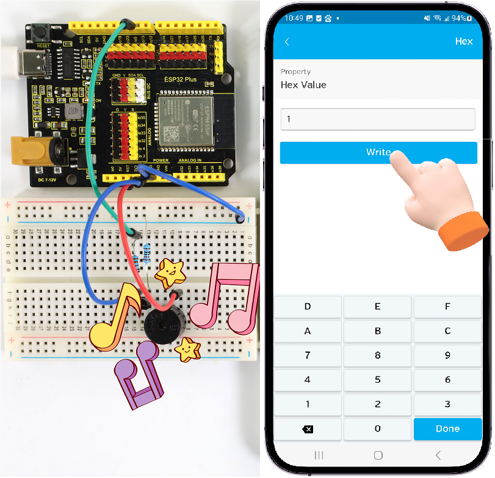

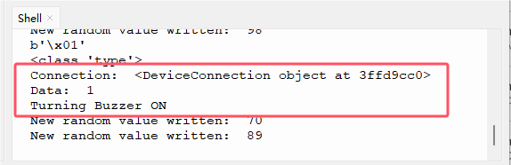

6\. Tap “**Write New Value**” again to write “**0**” to see if the active buzzer responds to this command. Input “**0**” and click “**Write**”, and the buzzer does not buzz. Meanwhile, the “Shell” shows related messages.


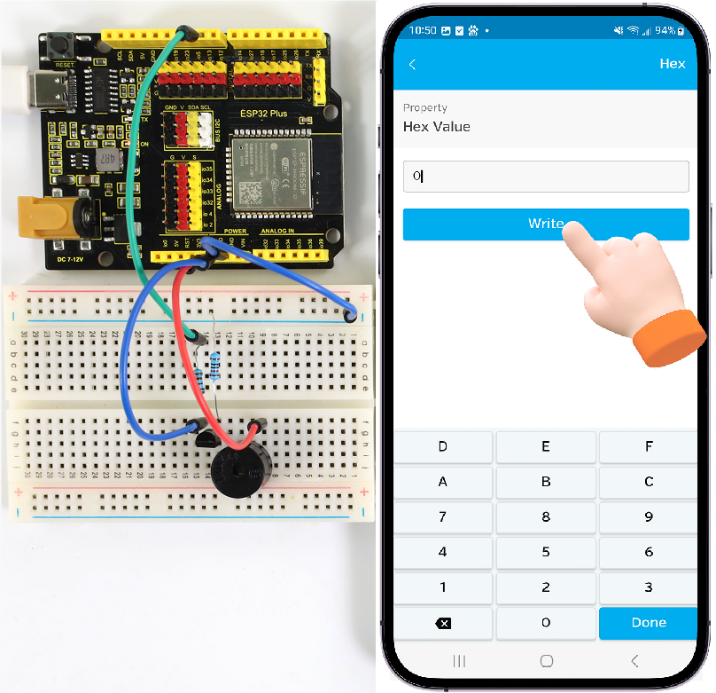

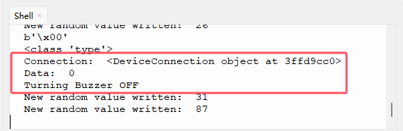

7\. Click  to exit the execution.

---

**9. Code Explanation**

Please refer to [2-2-01](https://docs.keyestudio.com/projects/KS5020/en/latest/docs/2.%20MicroPython_Tutorial.html#iot-bluetooth-control-led) Code Explanation.

---

### 2-2-03 IoT Bluetooth Control Relay

---

**1. Overview**

In daily life, we generally use 220V AC to drive electrical appliances and control them with switches. However, if the switch is directly connected to the 220V AC circuit, once leakage occurs and people will be in danger. 

Therefore, in this project, we specially designed this relay module with NO(normally open) and NC(normally closed) to work with wireless data transmission of Bluetooth.

---

**2. Components**

|  |||
| ------------------------ | ------------------------ | ---------------------------- |
|ESP32 main board x1|breadboard x1 |mobile device x1|
| 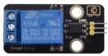| ||
|relay x1|LED x1|220Ω resistor  x1|
||||
|jumper wires | Micro USB cable x1 |M-F DuPont wires|

---

**3. Wiring Diagram**

**Schematic diagram:**

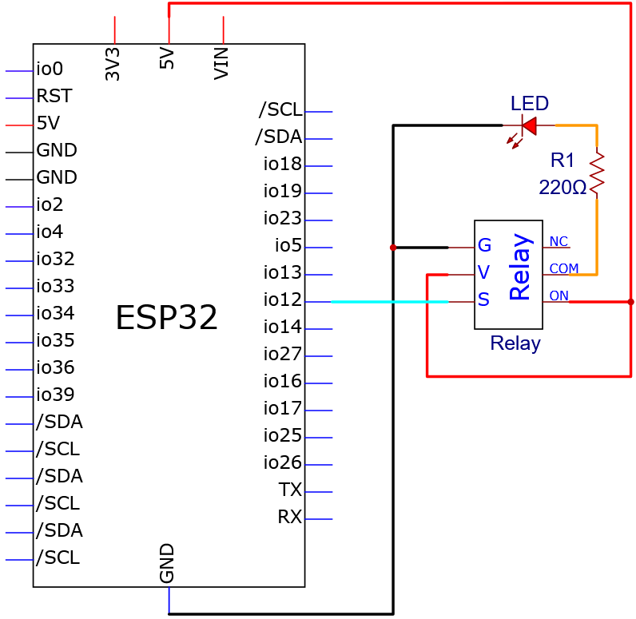

**Wiring diagram:**

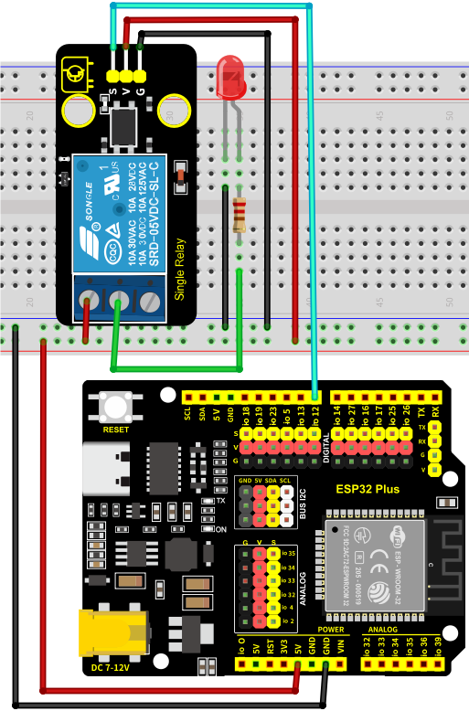

---

**4. LightBlue APP**

**⚠️ATTENTION:** If you have installed LightBlue APP, skip this step. If not, please refer to 2-2-01.

---

**5. aioble Package**

**⚠️ATTENTION:** If you have installed aioble package, skip this step. If not, please refer to 2-2-01.

---

**6. Test Code**

```python
'''
 * Filename    : IoT_Bluetooth_Control_Relay 
 * Thonny      : Thonny 4.1.7
 * Auther      : http//www.keyestudio.com
'''
# Import related library
from micropython import const
import asyncio
import aioble
import bluetooth 
import struct
from machine import Pin
from random import randint

# Init relay
relay = Pin(12, Pin.OUT)
relay.value(0)

# Init random value
value = 0

# See the following for generating UUIDs:
# https://www.uuidgenerator.net/
_BLE_SERVICE_UUID = bluetooth.UUID('19b10000-e8f2-537e-4f6c-d104768a1214')
_BLE_SENSOR_CHAR_UUID = bluetooth.UUID('19b10001-e8f2-537e-4f6c-d104768a1214')
_BLE_LED_UUID = bluetooth.UUID('19b10002-e8f2-537e-4f6c-d104768a1214')
# How frequently to send advertising beacons.
_ADV_INTERVAL_MS = 250_000

# Register GATT server, the service and characteristics
ble_service = aioble.Service(_BLE_SERVICE_UUID)
sensor_characteristic = aioble.Characteristic(ble_service, _BLE_SENSOR_CHAR_UUID, read=True, notify=True)
relay_characteristic = aioble.Characteristic(ble_service, _BLE_LED_UUID, read=True, write=True, notify=True, capture=True)

# Register service(s)
aioble.register_services(ble_service)

# Helper to encode the data characteristic UTF-8
def _encode_data(data):
    return str(data).encode('utf-8')

# Helper to decode the buzzer characteristic encoding (bytes).
def _decode_data(data):
    try:
        if data is not None:
            # Decode the UTF-8 data
            number = int.from_bytes(data, 'big')
            return number
    except Exception as e:
        print("Error decoding temperature:", e)
        return None

# Get sensor readings
def get_random_value():
    return randint(0,100)

# Get new value and update characteristic
async def sensor_task():
    while True:
        value = get_random_value()
        sensor_characteristic.write(_encode_data(value), send_update=True)
        print('New random value written: ', value)
        await asyncio.sleep_ms(1000)
        
# Serially wait for connections. Don't advertise while a central is connected.
async def peripheral_task():  
    while True:
        try:
            async with await aioble.advertise(
                _ADV_INTERVAL_MS,
                name="ESP32_Bluetooth",
                services=[_BLE_SERVICE_UUID],
                ) as connection:
                    print("Connection from", connection.device)
                    await connection.disconnected()             
        except asyncio.CancelledError:
            # Catch the CancelledError
            print("Peripheral task cancelled")
        except Exception as e:
            print("Error in peripheral_task:", e)
        finally:
            # Ensure the loop continues to the next iteration
            await asyncio.sleep_ms(100)

async def wait_for_write():
    while True: 
        try:
            connection, data = await relay_characteristic.written()
            print(data)
            print(type)
            data = _decode_data(data)
            print('Connection: ', connection)
            print('Data: ', data)
            if data == 1:
                print('Turning Relay ON')
                relay.value(1)
            elif data == 0:
                print('Turning Relay OFF')
                relay.value(0)
            else:
                print('Unknown command')
        except asyncio.CancelledError:
            # Catch the CancelledError
            print("Peripheral task cancelled")
        except Exception as e:
            print("Error in peripheral_task:", e)
        finally:
            # Ensure the loop continues to the next iteration
            await asyncio.sleep_ms(100)
            
# Run tasks
async def main():
    t1 = asyncio.create_task(sensor_task())
    t2 = asyncio.create_task(peripheral_task())
    t3 = asyncio.create_task(wait_for_write())
    await asyncio.gather(t1, t2)
    
asyncio.run(main())
```
---

**7. Test Result**

Please follow the steps below:

***⚠️Here we take Android system as an example, and iOS users may have a reference.***

1\. Open “Thonny IDE” and choose “This Computer” → “D:” → “Codes” → “MicroPython_Code”. Open the file “2-2-03_IoT_Bluetooth_Control_Relay.py” or copy and paste the above code into “Thonny IDE”.

2\. Connect the ESP32 board to the computer via USB cable. Click  to run code and the “Shell” shows the temperature written by the sensor on the ESP32 board.


3\. After uploading code, enable Bluetooth on your mobile device (smartphone) and open **LightBlue**.


4\. In **Peripherals**, find **ESP32-Bluetooth** and click “**Connect**”. If you don’t see it, try refreshing the page a few times. Once “**Connected**”, the Bluetooth is connected. Scroll down to set **3 UUIDs** in the code. And Thonny IDE “Shell” shows it detects a new connection.


(***⚠️ATTENTION:*** On iOS devices, if the **LightBlue** APP you downloaded and installed is an older version, find **MPY ESP32** and click “**Connect**”. If **LightBlue** is a new version, find **ESP32-Bluetooth** and click “**Connect**”. Other operations are similar to Android system.) 


5\. Tap **Send** UUID and “**Write New Value**” to write a “**1**”. Click “**Write**” and the relay turns on and the LED lights up. Meanwhile, the “Shell” shows related messages.


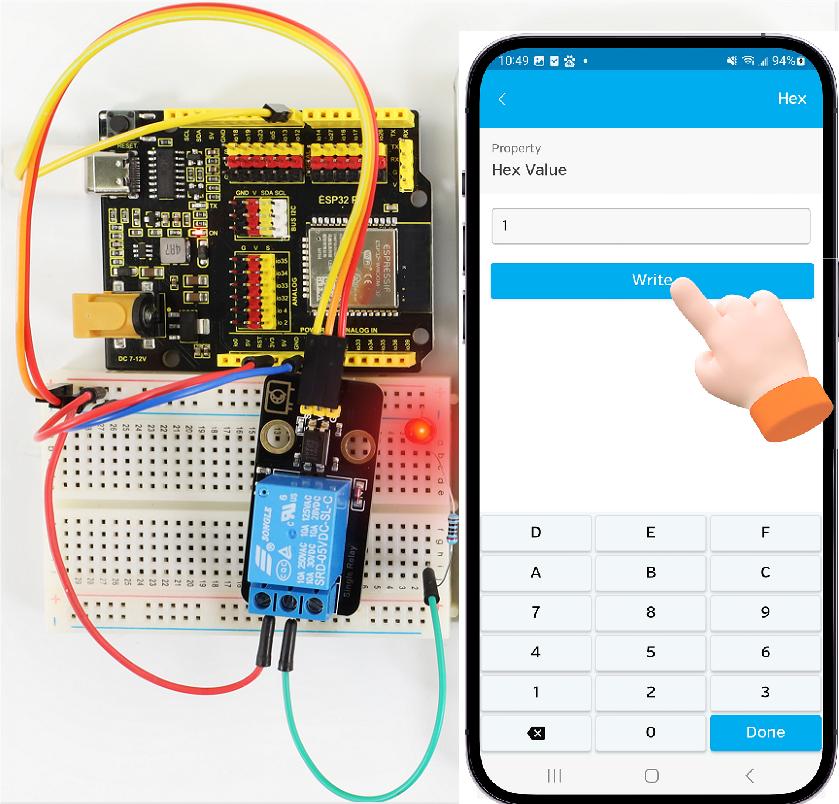

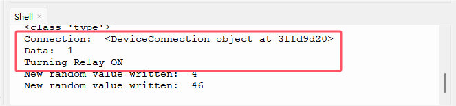

6\. Tap “**Write New Value**” again to write “**0**” to see if the LED responds to this command. Input “**0**” and click “**Write**”, and the relay disconnects and the LED goes off. Meanwhile, the “Shell” shows related messages.


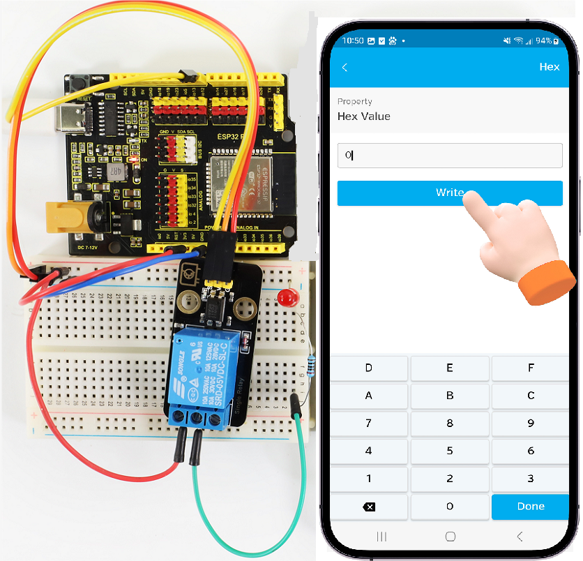

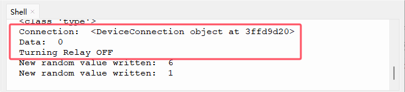

7\. Click  to exit the execution.

---

**8. Code Explanation**

Please refer to [2-2-01](https://docs.keyestudio.com/projects/KS5020/en/latest/docs/2.%20MicroPython_Tutorial.html#iot-bluetooth-control-led) Code Explanation.

---

### 2-2-04 IoT ESP32 WiFi Station Mode

---

**1. Overview**

One of the most useful features of the ESP32 is that it can not only act as a Web server, but also to create its own network for other devices to connect to and access web pages. ESP32 can run in three modes: Station (STA) mode, Soft Access Point (AP) mode, and Station+AP mode.

- Station mode: Actively connect to the router as a WiFi device, also known as WiFi Client
- AP mode: As an Access Point for other WiFi devices to connect to, i.e., WiFi hotspots
- Station+AP mode: While the ESP32 connects to the router, it is also a hotspot for other WiFi devices to connect to.

All WiFi programming projects must be configured with WiFi running mode before using, otherwise the WiFi cannot be used. In this project, we are going to learn the ESP32 WiFi Station Mode.

---

**2. Component Knowledge**

**Station Mode**

In Station mode, the ESP32 connects to an existing WiFi network (a network created by a wireless router).

When setting Station mode, the ESP32 is taken as a WiFi client. It can connect to the router network and communicate with other devices on the router via a WiFi connection. As shown in the figure below, the PC and the mobile device have been connected to the router. If the ESP32 wants to communicate with the PC and the mobile device, they need to be connected to the router.


In Station mode, the ESP32 gets its IP address from the wireless router it is connected to. With this IP address, it can set up a Web server and serve web pages to all connected devices on an existing WiFi network.

---

**2. Components**

|    |||
| ------------------------ | --------------------- | --------------------- |
| ESP32 main board x1 | Micro USB cable x1 |mobile device x1|

---

**3. Wiring Diagram**


---

**4. Test Code**

**⚠️ATTENTION:** Before uploading code, please replace the WiFi name(**REPLACE_WITH_YOUR_SSID**) in the code and the passwords(**REPLACE_WITH_YOUR_PASSWORD**) into yours.

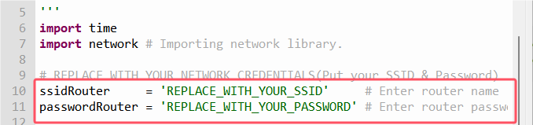


```python
'''
 * Filename    : IoT_ESP32_WiFi_Station_Mode 
 * Thonny      : Thonny 4.1.7
 * Auther      : http//www.keyestudio.com
'''
import time
import network # Importing network library.

# REPLACE WITH YOUR NETWORK CREDENTIALS(Put your SSID & Password)
ssidRouter     = 'REPLACE_WITH_YOUR_SSID'     # Enter router name
passwordRouter = 'REPLACE_WITH_YOUR_PASSWORD' # Enter router password

def STA_Setup(ssidRouter,passwordRouter):
    print("Setup start")
    sta_if = network.WLAN(network.STA_IF) # Set the ESP32 to Station mode.
    if not sta_if.isconnected():
        print('connecting to',ssidRouter)
  # Activate the station mode of the ESP32, initiate a connection request to the router and enter the connection password.      
        sta_if.active(True)
        sta_if.connect(ssidRouter,passwordRouter)
  # Wait for the ESP32 to connect to the router successfully.      
        while not sta_if.isconnected():
            pass
  # Print the IP address assigned to the ESP32 MPU in the Shell. 
    print('Connected, IP address:', sta_if.ifconfig())
    print("Setup End")

try:
    STA_Setup(ssidRouter,passwordRouter)
except:
    sta_if.disconnect()
```

---

**5. Test Result**

Please follow the steps below:

1\. Open “Thonny IDE” and choose “This Computer” → “D:” → “Codes” → “MicroPython_Code”. Open the file “2-2-04_IoT_WiFi_Station_Mode.py” or copy and paste the above code into “Thonny IDE”.

2\. Before uploading code, please replace the WiFi name(**REPLACE_WITH_YOUR_SSID**) in the code and the passwords(**REPLACE_WITH_YOUR_PASSWORD**) into yours.

***⚠️ATTENTION:*** Make sure that the WiFi name and passwords in the code is the same as the network connected to your computer, phone/tablet, ESP32 board, and the router. They must be under the same local area network (WiFi).

3\. Connect the ESP32 board to your computer via USB cable and click  to run the code. After uploading code and waiting for connection, the corresponding **IP** address will be displayed on the “Shell”.

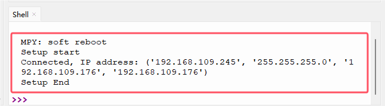

**⚠️Note that if there is no IP address on the “Shell”, please press the RESET button on the ESP32 board and click  again.**

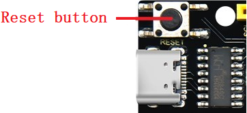

4\. Click  to exit the execution.

---

**6. Code Explanation**

Let’s explain the code in details:

- Import the network library.

```python
import network
```
- Please enter the correct router name and password.

```python
ssidRouter     = 'REPLACE_WITH_YOUR_SSID' 
passwordRouter = 'REPLACE_WITH_YOUR_PASSWORD' 
```
- Set ESP32 to “Station” mode.

```python
sta_if = network.WLAN(network.STA_IF) 
```
- Activate the Station mode of the ESP32, initiate a connection request to the router, and enter the connection password.

```python
sta_if.active(True)
sta_if.connect(ssidRouter,passwordRouter) 
```
- Wait for the ESP32 to connect to the router until the connection is successful.

```python
while not sta_if.isconnected():
    pass
```
- The “Shell” shows the IP address of the ESP32.

```python
print('Connected, IP address:', sta_if.ifconfig())
```
---

### 2-2-05 IoT Control LED Via Web server

---

**1. Overview**

In this project, we will learn to remotely control leds by a Web server and browser on a computer or smartphone. Specifically, the ESP32 will be programmed to work as a Web server. Assume that the lP address of the ESP32 is 192.168.XX.XX. Here’s how it works.

When you access 192.168.XX.XX in your browser, it sends a request to the ESP32 to respond to a web page with an on/off button to control the LED.

Click “ON” in your web pages or input “192.168.XX.XX/?1ed=on” in the browser, the LED turns on and the ESP32 responds to the control page.

Click “OFF” in your web pages or input “192.168.XX.XX/?1ed=off” in the browser, the LED turns off and the ESP32 responds to the control page.

---

**2. Components**

|  ||||
| ------------------------ | ------------------------ | ---------------------------- |---------------------------- |
| ESP32 main board x1 | red LED x1 | 220Ω resistor  x1 |mobile device x1|
||||   |
|breadboard x1 |jumper wires | Micro USB cable x1 |    |

---

**3. Wiring Diagram** 

**Schematic diagram:**


**Wiring diagram:**


---

**4. Test Code**

**⚠️ATTENTION:** Before uploading code, please replace the WiFi name(**REPLACE_WITH_YOUR_SSID**) in the code and the passwords(**REPLACE_WITH_YOUR_PASSWORD**) into yours.

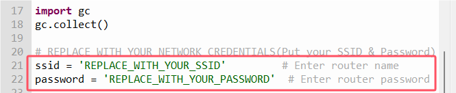

```python
'''
 * Filename    : IoT_Control_LED_Via_Web_Server 
 * Thonny      : Thonny 4.1.7
 * Auther      : http//www.keyestudio.com
'''
try:
  import usocket as socket
except:
  import socket

from machine import Pin
import network

import esp
esp.osdebug(None)

import gc
gc.collect()

ssid = 'REPLACE_WITH_YOUR_SSID'         # Enter router name
password = 'REPLACE_WITH_YOUR_PASSWORD' # Enter router password

station = network.WLAN(network.STA_IF)

station.active(True)
station.connect(ssid, password)

while station.isconnected() == False:
  pass

print('Connection successful')
print(station.ifconfig())

led = Pin(26, Pin.OUT)

def web_page():
  if led.value() == 1:
    gpio_state="ON"
  else:
    gpio_state="OFF"
  
  html = """<html><head> <title>ESP Web Server</title> <meta name="viewport" content="width=device-width, initial-scale=1">
  <link rel="icon" href="data:,"> <style>html{font-family: Helvetica; display:inline-block; margin: 0px auto; text-align: center;}
  h1{color: #0F3376; padding: 2vh;}p{font-size: 1.5rem;}.button{display: inline-block; background-color: #e7bd3b; border: none; 
  border-radius: 4px; color: white; padding: 16px 40px; text-decoration: none; font-size: 30px; margin: 2px; cursor: pointer;}
  .button2{background-color: #4286f4;}</style></head><body> <h1>ESP Web Server</h1> 
  <p>LED state: <strong>""" + gpio_state + """</strong></p><p><a href="/?led=on"><button class="button">ON</button></a></p>
  <p><a href="/?led=off"><button class="button button2">OFF</button></a></p></body></html>"""
  return html

s = socket.socket(socket.AF_INET, socket.SOCK_STREAM)
s.bind(('', 80))
s.listen(5)

while True:
  conn, addr = s.accept()
  print('Got a connection from %s' % str(addr))
  request = conn.recv(1024)
  request = str(request)
  print('Content = %s' % request)
  led_on = request.find('/?led=on')
  led_off = request.find('/?led=off')
  if led_on == 6:
    print('LED ON')
    led.value(1)
  if led_off == 6:
    print('LED OFF')
    led.value(0)
  response = web_page()
  conn.send('HTTP/1.1 200 OK\n')
  conn.send('Content-Type: text/html\n')
  conn.send('Connection: close\n\n')
  conn.sendall(response)
  conn.close()
```
---

**5. Test Result**

Please follow the steps below:

1\. Open “Thonny IDE” and choose “This Computer” → “D:” → “Codes” → “MicroPython_Code”. Open the file “2-2-05_IoT_Control_LED_Via_Web_Server.py” or copy and paste the above code into “Thonny IDE”.

2\. Before uploading code, please replace the WiFi name(**REPLACE_WITH_YOUR_SSID**) in the code and the passwords(**REPLACE_WITH_YOUR_PASSWORD**) into yours.

**⚠️ATTENTION:** Make sure that the WiFi name and passwords in the code is the same as the network connected to your computer, phone/tablet, ESP32 board, and the router. They must be under the same local area network (WiFi).

3\. Connect the ESP32 board to your computer via USB cable and click  to run the code. After uploading code and waiting for connection, the corresponding **IP** address(***circled in red***) will be displayed on the “Shell”.

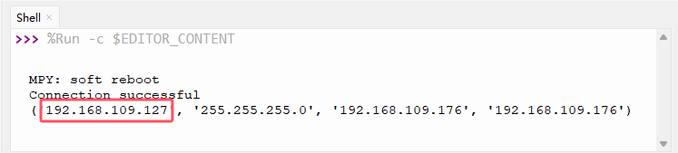

**⚠️Note that if there is no IP address on the “Shell”, please press the RESET button on the ESP32 board and click  again.**


4\. Open the browser on your phone and input the WIFI IP address in it and “**search**”.


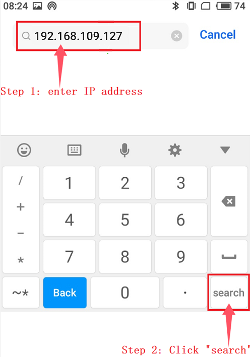

5\. After a few seconds, enter the WiFi web page, indicating that the ESP32 module is successfully connected to WiFi. The WiFi web page contains an on/off button for the LED and “**LED state: OFF**”. 

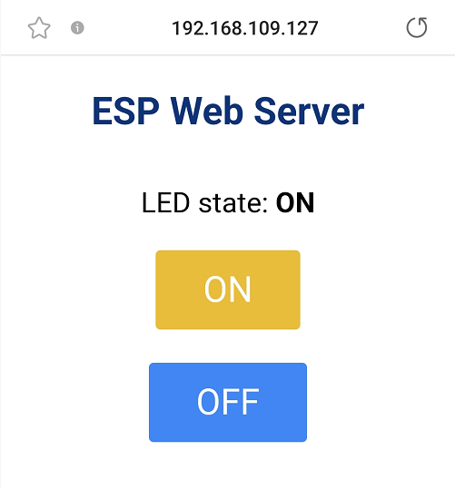

6\. Click “**ON**” to turn on the LED, and “LED state: OFF” becomes “LED state: ON”. 

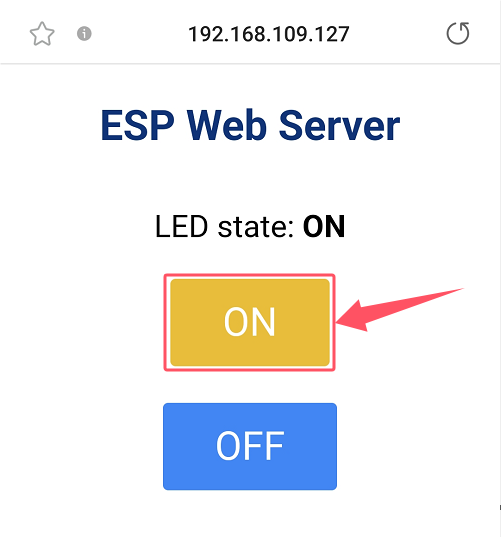

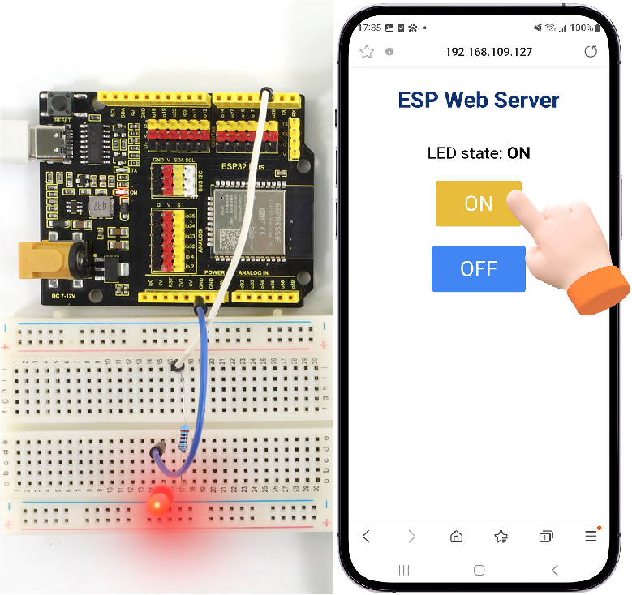

7\. Click “**OFF**” to turn off the LED, and “LED state: ON” becomes “LED state: OFF”.

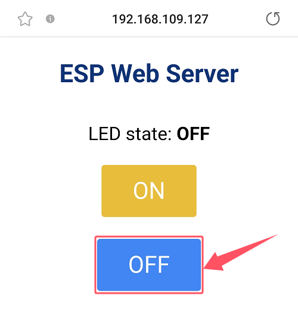

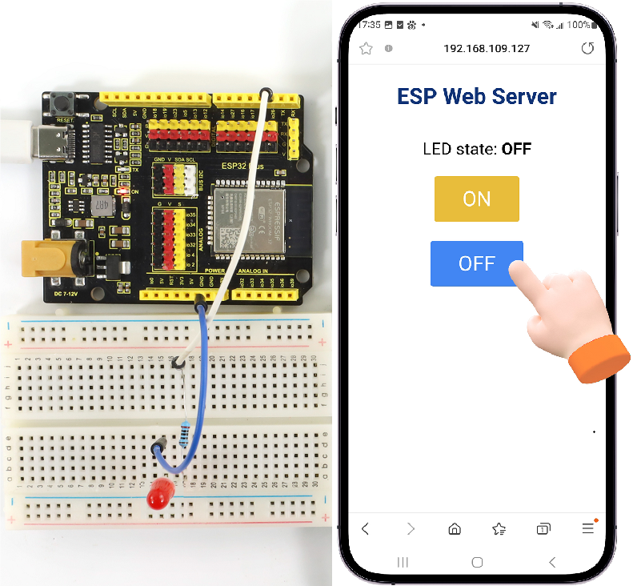

8\. Click  to exit the execution.

---

**6. Code Explanation**

Let’s explain the code in details:

- Create a web server using sockets and the Python socket API. For how to import `socket` library:

```python
try:
  import usocket as socket
except:
  import socket
```
- You need to import the `Pin` class from the `machine` module to interact with GPIO.

```python
from machine import Pin
```
- After importing the `socket`, we need to import `network` that allows us to connect the ESP32 to a Wi-Fi network.

```python
import network
```
- Disable the operating system debugging information and run the garbage collector.

```python
import esp
esp.osdebug(None)

import gc
gc.collect()
```
- Set the network credentials variable, set the ESP32 as a Wi-Fi station, and then activate the workstation, where the ESP32 connects to the router using the SSID and password defined earlier.

```python
ssid = 'REPLACE_WITH_YOUR_SSID'         # Enter router name
password = 'REPLACE_WITH_YOUR_PASSWORD'  # Enter router password

station = network.WLAN(network.STA_IF)

station.active(True)
station.connect(ssid, password)
```
- The following statement ensures that the code does not continue to execute when ESP is not connected to your network.

```python
while station.isconnected() == False:
  pass
```
- After the connection is successful, print the network interface parameters, such as the IP address of the ESP32, and use the `ifconfig()` object on the `station`.

```python
print('Connection successful')
print(station.ifconfig())
```
- Create a `Pin` called `led`,  which is an output, referring to the ESP32’s GPIO26.

```python
led = Pin(26, Pin.OUT)
```
- First create a function called `web_page()` which returns a variable named `html` that contains the HTML text used to build the web page.

```python
def web_page():
```
- The page displays the current GPIO status. Therefore, before generating the HTML text, we need to check the LED status. We save its state on the `gpio_state` .

```python
if led.value() == 1:
  gpio_state="ON"
else:
  gpio_state="OFF"
```
The `gpio_state` is then concatenated to the HTML text with a “+” sign to concatenate the string.

```python
html = """<html><head> <title>ESP Web Server</title> <meta name="viewport" content="width=device-width, initial-scale=1">
<link rel="icon" href="data:,"> <style>html{font-family: Helvetica; display:inline-block; margin: 0px auto; text-align: center;}
h1{color: #0F3376; padding: 2vh;}p{font-size: 1.5rem;}.button{display: inline-block; background-color: #e7bd3b; border: none; 
border-radius: 4px; color: white; padding: 16px 40px; text-decoration: none; font-size: 30px; margin: 2px; cursor: pointer;}
.button2{background-color: #4286f4;}</style></head><body> <h1>ESP Web Server</h1> 
<p>LED state: <strong>""" + gpio_state + """</strong></p><p><a href="/?led=on"><button class="button">ON</button></a></p>
<p><a href="/?led=off"><button class="button button2">OFF</button></a></p></body></html>"""
```
- Create a socket using `socket.socket()` and specify the socket type. We create a new socket object `s` with the given address family and socket type. This is a new STREAM TCP socket.

```python
s = socket.socket(socket.AF_INET, socket.SOCK_STREAM)
```
- bind the socket to an address (network interface and port number) by `bind()` that accepts a tuple variable with an ip address and a port number.

```python
s.bind(('', 80))
```
In our example, we pass an empty string '' as the IP address and port 80. In this case, the empty string refers to the IP address of the local host (that is, the IP address of the ESP32).

- The next line allows the server to accept connections by creating a “listening” socket. Specify the maximum number of parameters for queued connections. The maximum number is 5.

```python
s.listen(5)
```
- In `while` , we listen for requests and send responses. When the client connects, the server calls `accept()` to accept the connection, and it stores a new socket object on the `conn` to receive and send data, and stores the address of the client connecting to the server on `addr` .

```python
conn, addr = s.accept()
```
-  Print the client address saved on the `addr` .

```python
print('Got a connection from %s' % str(addr))
```
- Get the request received on the newly created socket and save it in the request variable.

```python
request = conn.recv(1024)
```
The `recv()` receives data from the socket client (we have created a new socket object on `conn` ), and the parameter of `recv()` specifies the maximum data that can be received at one time.

- Print the content of the request.

```python
print('Content = %s' % str(request))
```
- Create a variable called `response` containing the HTML text returned by `web_page()`.

```python
response = web_page()
```
- The response is sent to the socket client by `Send()` and `sendall()` .

```python
conn.send('HTTP/1.1 200 OK\n')
conn.send('Content-Type: text/html\n')
conn.send('Connection: close\n\n')
conn.sendall(response)
```
- Close the created socket.

```python
conn.close()
```
---

### 2-2-06 IoT Control Relay Via Web server

---

**1. Overview**

In this project, we will learn to remotely control the relay by a Web server and browser on a computer or smartphone. Specifically, the ESP32 will be programmed to work as a Web server. Assume that the lP address of the ESP32 is 192.168.XX.XX. Here’s how it works.

When you access 192.168.XX.XX in your browser, it sends a request to the ESP32 to respond to a web page with an on/off button to control the LED.

Click “ON” in your web pages or input “192.168.XX.XX/?relay=on” in the browser, the relay turns on and the ESP32 responds to the control page.

Click “OFF” in your web pages or input “192.168.XX.XX/?relay=off” in the browser, the relay turns off and the ESP32 responds to the control page.

---

**2. Components**

|  |||
| ------------------------ | ------------------------ | ---------------------------- |
|ESP32 main board x1 |breadboard x1 |mobile device x1|
| | ||
|relay x1|LED x1|220Ω resistor  x1|
||||
|jumper wires | Micro USB cable x1 |M-F DuPont wires|

---

**3. Wiring Diagram**

**Schematic diagram:**


**Wiring diagram:**


---

**4. Test Code**

**⚠️ATTENTION:** Before uploading code, please replace the WiFi name(**REPLACE_WITH_YOUR_SSID**) in the code and the passwords(**REPLACE_WITH_YOUR_PASSWORD**) into yours.


```python
'''
 * Filename    : IoT_Control_LED_Via_Web_Server 
 * Thonny      : Thonny 4.1.7
 * Auther      : http//www.keyestudio.com
'''
try:
  import usocket as socket
except:
  import socket

from machine import Pin
import network

import esp
esp.osdebug(None)

import gc
gc.collect()

ssid = 'REPLACE_WITH_YOUR_SSID'         # Enter router name
password = 'REPLACE_WITH_YOUR_PASSWORD' # Enter router password

station = network.WLAN(network.STA_IF)

station.active(True)
station.connect(ssid, password)

while station.isconnected() == False:
  pass

print('Connection successful')
print(station.ifconfig())

led = Pin(26, Pin.OUT)

def web_page():
  if led.value() == 1:
    gpio_state="ON"
  else:
    gpio_state="OFF"
  
  html = """<html><head> <title>ESP Web Server</title> <meta name="viewport" content="width=device-width, initial-scale=1">
  <link rel="icon" href="data:,"> <style>html{font-family: Helvetica; display:inline-block; margin: 0px auto; text-align: center;}
  h1{color: #0F3376; padding: 2vh;}p{font-size: 1.5rem;}.button{display: inline-block; background-color: #e7bd3b; border: none; 
  border-radius: 4px; color: white; padding: 16px 40px; text-decoration: none; font-size: 30px; margin: 2px; cursor: pointer;}
  .button2{background-color: #4286f4;}</style></head><body> <h1>ESP Web Server</h1> 
  <p>LED state: <strong>""" + gpio_state + """</strong></p><p><a href="/?led=on"><button class="button">ON</button></a></p>
  <p><a href="/?led=off"><button class="button button2">OFF</button></a></p></body></html>"""
  return html

s = socket.socket(socket.AF_INET, socket.SOCK_STREAM)
s.bind(('', 80))
s.listen(5)

while True:
  conn, addr = s.accept()
  print('Got a connection from %s' % str(addr))
  request = conn.recv(1024)
  request = str(request)
  print('Content = %s' % request)
  led_on = request.find('/?led=on')
  led_off = request.find('/?led=off')
  if led_on == 6:
    print('LED ON')
    led.value(1)
  if led_off == 6:
    print('LED OFF')
    led.value(0)
  response = web_page()
  conn.send('HTTP/1.1 200 OK\n')
  conn.send('Content-Type: text/html\n')
  conn.send('Connection: close\n\n')
  conn.sendall(response)
  conn.close()
```
---

**5. Test Result**

Please follow the steps below:

1\. Open “Thonny IDE” and choose “This Computer” → “D:” → “Codes” → “MicroPython_Code”. Open the file “2-2-06_IoT_Control_Relay_Via_Web_Server.py” or copy and paste the above code into “Thonny IDE”.

2\. Before uploading code, please replace the WiFi name(**REPLACE_WITH_YOUR_SSID**) in the code and the passwords(**REPLACE_WITH_YOUR_PASSWORD**) into yours.

**⚠️ATTENTION:** Make sure that the WiFi name and passwords in the code is the same as the network connected to your computer, phone/tablet, ESP32 board, and the router. They must be under the same local area network (WiFi).

3\. Connect the ESP32 board to your computer via USB cable and click  to run the code. After uploading code and waiting for connection, the corresponding **IP** address(***circled in red***) will be displayed on the “Shell”.


**⚠️Note that if there is no IP address on the “Shell”, please press the RESET button on the ESP32 board and click  again.**


4\. Open the browser on your phone and input the WIFI IP address in it and “**search**”.


5\. After a few seconds, enter the WiFi web page, indicating that the ESP32 module is successfully connected to WiFi. The WiFi web page contains an on/off button for the relay and “**Relay state: OFF**”. 

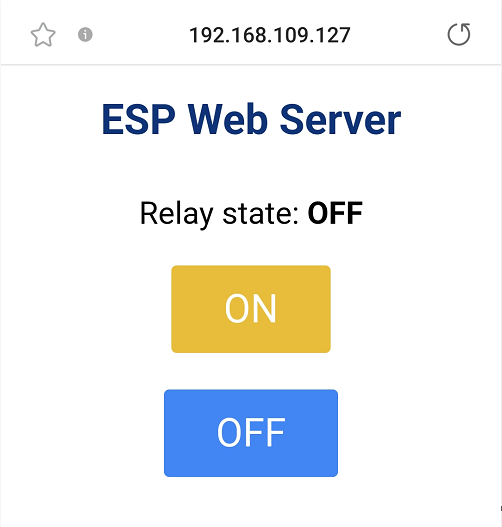

6\. Click “**ON**” to close the relay and the LED lights up. “Relay state: OFF” becomes “Relay state: ON”.

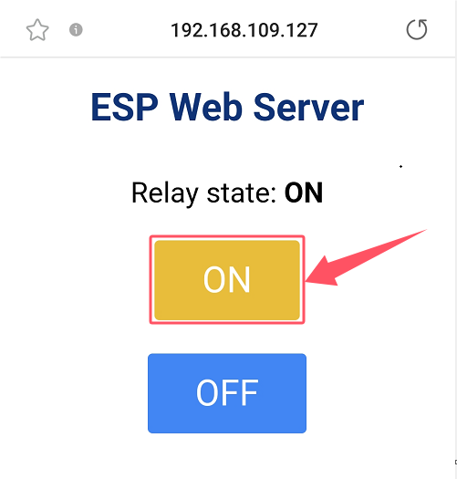

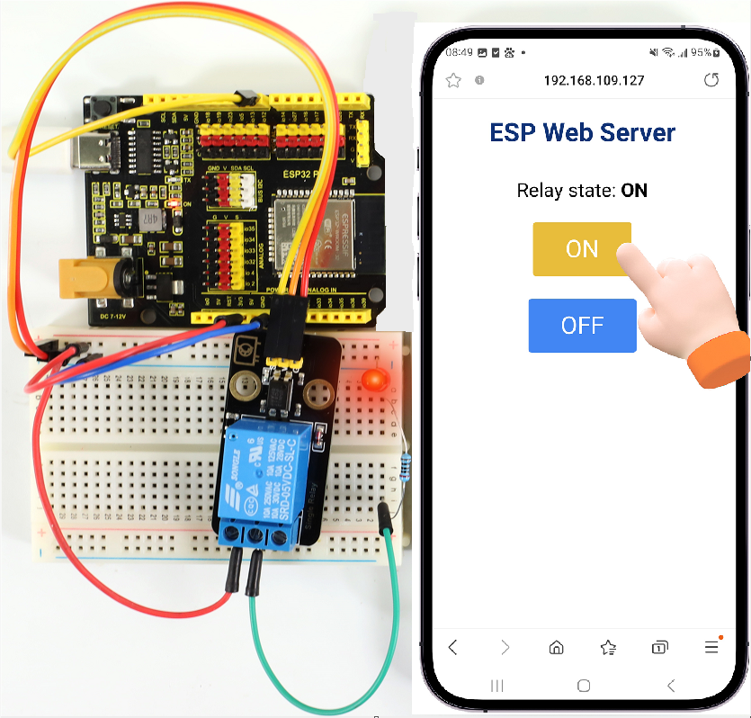

7\. Click “**OFF**” to open the relay and the LED goes off. “Relay state: ON” becomes “Relay state: OFF”.

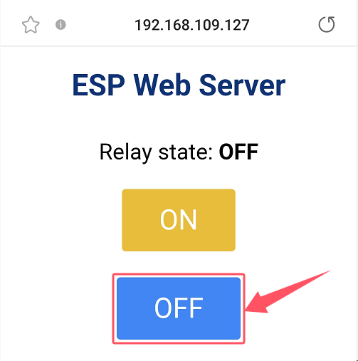

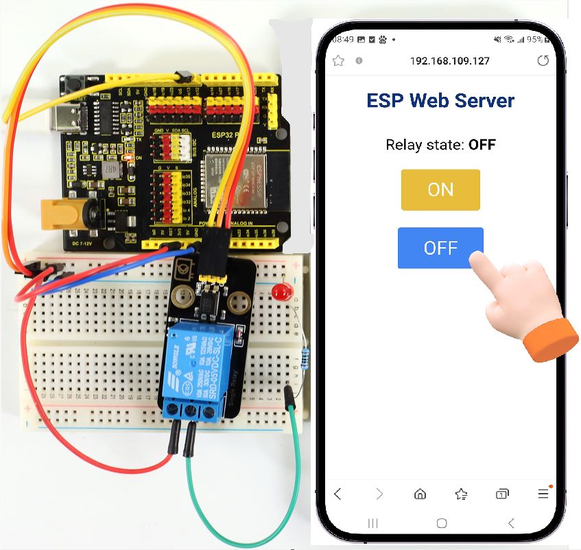

8\. Click  to exit the execution.

---

**6. Code Explanation**

Please refer to [2-2-05](https://docs.keyestudio.com/projects/KS5020/en/latest/docs/2.%20MicroPython_Tutorial.html#iot-control-led-via-web-server) Code Explanation.

---

### 2-2-07 IoT Temperature from LM35 on Web Server

---

**1. Overview**

In this project, we will explore the process of programming ESP32 as a web server to access temperature values. With the LM35 temperature sensor, it is easy to check the ambient temperature on the web page of your smartphone or computer.

---

**2. Component Knowledge**

**Working principle:**

- ESP32 is programmed as a Web server.
- You can enter the iP address of the ESP32 into a Web browser on your smartphone or PC.
- The ESP32 responds to a request from a Web browser to form a page where the LM35 temperature sensor reads the temperature.

---

**3. Components**

|  |||
| ------------------------ | ------------------------ | ---------------------------- |
| ESP32 main board x1 | LM35 x1  |breadboard x1 |
||||
|jumper wires | USB cable x1 |mobile device x1|

---

**4. Wiring Diagram**

**Schematic diagram:**

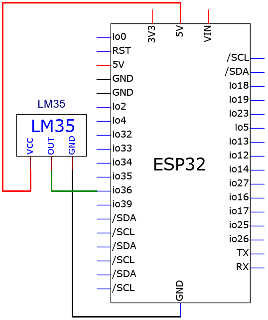

**Wiring diagram:**

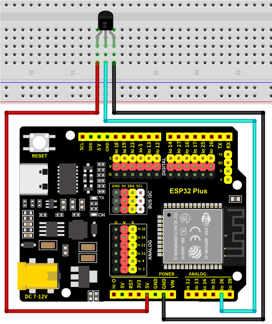

---

**5. Test Code**

**⚠️ATTENTION:** Before uploading code, please replace the WiFi name(**REPLACE_WITH_YOUR_SSID**) in the code and the passwords(**REPLACE_WITH_YOUR_PASSWORD**) into yours.


```python
'''
 * Filename    : IoT_Temperature_from_LM35_on_Web_Server 
 * Thonny      : Thonny 4.1.7
 * Auther      : http//www.keyestudio.com
'''
import machine
import network
import socket
import time
from machine import ADC, Pin

# Configure Wi-Fi
# REPLACE WITH YOUR NETWORK CREDENTIALS(Put your SSID & Password)
ssid = 'REPLACE_WITH_YOUR_SSID'         # Enter router name
password = 'REPLACE_WITH_YOUR_PASSWORD' # Enter router password

def connect_wifi():
    wlan = network.WLAN(network.STA_IF)
    wlan.active(True)
    wlan.connect(ssid, password)
    while not wlan.isconnected():
        print('Connecting to WiFi...')
        time.sleep(1)
    print('WiFi connected:', wlan.ifconfig())

# Connect to Wi-Fi
connect_wifi()

# Configure ADC pins
adc = machine.ADC(machine.Pin(36))
adc.atten(machine.ADC.ATTN_11DB)  # Set attenuation factor
adc.width(ADC.WIDTH_12BIT)

def read_temperature():
    raw_value = adc.read()
    voltage = raw_value / 4095 * 5.0
    temperature = voltage / 0.01  # The LM35 output is 0.01V/°C
    return temperature

def web_page():
  temperature = read_temperature()
  html = """<!DOCTYPE HTML><html><head>
  <meta name="viewport" content="width=device-width, initial-scale=1">
  <link rel="stylesheet" href="https://use.fontawesome.com/releases/v5.7.2/css/all.css" integrity="sha384-fnmOCqbTlWIlj8LyTjo7mOUStjsKC4pOpQbqyi7RrhN7udi9RwhKkMHpvLbHG9Sr" crossorigin="anonymous">
  <style> html { font-family: Arial; display: inline-block; margin: 0px auto; text-align: center; }
    h2 { font-size: 3.0rem; } p { font-size: 3.0rem; } .units { font-size: 1.2rem; } 
    .ds-labels{ font-size: 1.5rem; vertical-align:middle; padding-bottom: 15px; }
  </style></head><body><h2>ESP with LM35</h2>
  <p>
    <i class="fas fa-thermometer-half" style="color:#059e8a;"></i> 
    <span class="lm-labels">Temperature</span> 
    <span>""" + str(round(temperature, 2))+"""</span>
    <sup class="units">&deg;C</sup>
  </p>
    <p><i class="fas fa-thermometer-half" style="color:#059e8a;"></i> 
    <span class="lm-labels">Temperature</span>
    <span id="temperature">""" + str(round(temperature * (9/5) + 32.0, 2)) + """</span>
    <sup class="units">&deg;F</sup>
  </p></body></html>"""
  return html

# Creating a Web Server
s = socket.socket(socket.AF_INET, socket.SOCK_STREAM)
s.bind(('', 80))
s.listen(5)

while True:
    conn, addr = s.accept()
    print('Got a connection from %s' % str(addr))
    request = conn.recv(1024)
    print('Content = %s' % str(request))
    
    response = web_page()
    conn.send('HTTP/1.1 200 OK\n')
    conn.send('Content-Type: text/html\n')
    conn.send('Connection: close\n\n')
    conn.sendall(response)
    conn.close()
```
---

**6. Test Result**

Please follow the steps below:

1\. Open “Thonny IDE” and choose “This Computer” → “D:” → “Codes” → “MicroPython_Code”. Open the file “2-2-07_IoT_Temperature_from_LM35_on_Web_Server.py” or copy and paste the above code into “Thonny IDE”.

2\. Before uploading code, please replace the WiFi name(**REPLACE_WITH_YOUR_SSID**) in the code and the passwords(**REPLACE_WITH_YOUR_PASSWORD**) into yours.

**⚠️ATTENTION:** Make sure that the WiFi name and passwords in the code is the same as the network connected to your computer, phone/tablet, ESP32 board, and the router. They must be under the same local area network (WiFi).

3\. Connect the ESP32 board to your computer via USB cable and click  to run the code. After uploading code and waiting for connection, the corresponding **IP** address(***circled in red***) will be displayed on the “Shell”.


**⚠️Note that if there is no IP address on the “Shell”, please press the RESET button on the ESP32 board and click  again.**


4\. Open the browser on your phone and input the WIFI IP address in it and “**search**”.


5\. After a few seconds, enter the WiFi web page, indicating that the ESP32 module is successfully connected to WiFi. The WiFi web page displays the Celsius and Fahrenheit values of the LM35 temperature sensor.

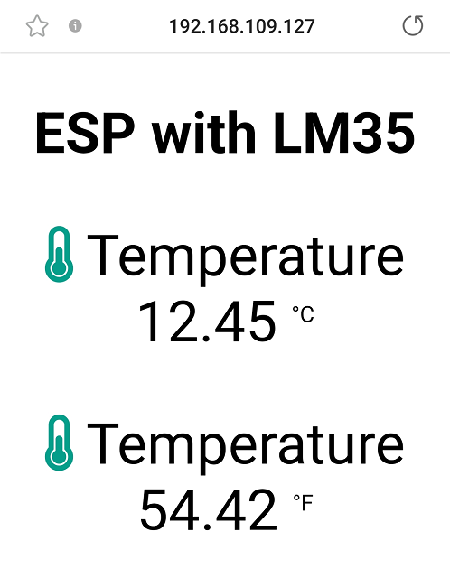

6\. If the ambient temperature detected by the LM35 sensor is constantly changed, click “” to refresh the page, and the values displayed on the web page will also change.

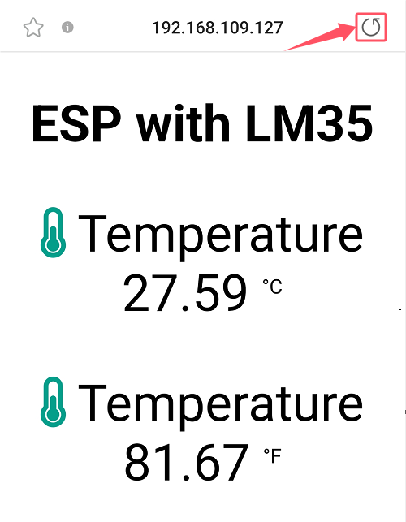

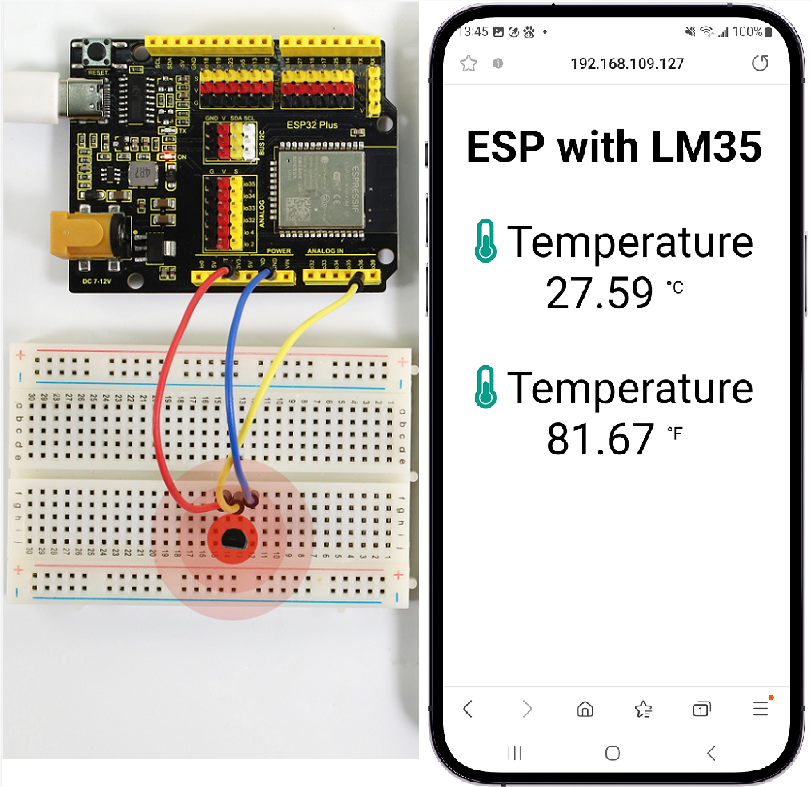

7\. Click  to exit the execution.

---

**7. Code Explanation**

Let’s explain the code in details:

- Add your network name and password.

```python
ssid = 'REPLACE_WITH_YOUR_SSID'
password = 'REPLACE_WITH_YOUR_PASSWORD'
```
- **Connect to Wi-Fi**: Create a sub-function `connect_wifi()` to connect to a Wi-Fi network.

```python
def connect_wifi():
    wlan = network.WLAN(network.STA_IF)
    wlan.active(True)
    wlan.connect(ssid, password)
    while not wlan.isconnected():
        print('Connecting to WiFi...')
        time.sleep(1)
    print('WiFi connected:', wlan.ifconfig())

# Connect to Wi-Fi
connect_wifi()
```
- **Set ADC pin**: adc = machine.ADC(machine.Pin(36)) is used to configure ADC pins; adc.atten(machine.ADC.ATTN_11DB) sets the attenuation factor; and adc.width(ADC.WIDTH_12BIT) sets the ADC width.

```python
adc = machine.ADC(machine.Pin(36))
adc.atten(machine.ADC.ATTN_11DB)  
adc.width(ADC.WIDTH_12BIT)
```
- **Read temperature**: `read_temperature()` reads the ADC value and converts it to temperature.

```python
def read_temperature():
    raw_value = adc.read()
    voltage = raw_value / 4095 * 5.0
    temperature = voltage / 0.01  # The LM35 output is 0.01V/°C
    return temperature
```
- **Create a Web page**: `web_page()` generates an HTML page containing temperature values.

```python
def web_page():
  temperature = read_temperature()
  html = """<!DOCTYPE HTML><html><head>
  <meta name="viewport" content="width=device-width, initial-scale=1">
  <link rel="stylesheet" href="https://use.fontawesome.com/releases/v5.7.2/css/all.css" integrity="sha384-fnmOCqbTlWIlj8LyTjo7mOUStjsKC4pOpQbqyi7RrhN7udi9RwhKkMHpvLbHG9Sr" crossorigin="anonymous">
  <style> html { font-family: Arial; display: inline-block; margin: 0px auto; text-align: center; }
    h2 { font-size: 3.0rem; } p { font-size: 3.0rem; } .units { font-size: 1.2rem; } 
    .ds-labels{ font-size: 1.5rem; vertical-align:middle; padding-bottom: 15px; }
  </style></head><body><h2>ESP with LM35</h2>
  <p>
    <i class="fas fa-thermometer-half" style="color:#059e8a;"></i> 
    <span class="lm-labels">Temperature</span> 
    <span>""" + str(round(temperature, 2))+"""</span>
    <sup class="units">&deg;C</sup>
  </p>
    <p><i class="fas fa-thermometer-half" style="color:#059e8a;"></i> 
    <span class="lm-labels">Temperature</span>
    <span id="temperature">""" + str(round(temperature * (9/5) + 32.0, 2)) + """</span>
    <sup class="units">&deg;F</sup>
  </p></body></html>"""
  return html
```
- **Create a Web Server**: Create a simple Web server with the socket library that listens on port 80 and returns temperature values when a request is received

```python
s = socket.socket(socket.AF_INET, socket.SOCK_STREAM)
s.bind(('', 80))
s.listen(5)
```
---

### 2-2-08 IoT Display Values of XHT11 Using Web Server

---

**1. Overview**

Have you ever wished you could monitor the temperature and humidity in your home, cooler or wine cellar at all times by your smartphone, tablet, or computer? This IoT project might be a good place to start!

We use the ESP32 as the control device to connect to the existing WiFi network and create a Web server. When the device is connected to this server, the ESP32 will read the temperature and relative humidity from the DHT11 sensor and send it to browser of the mobile device.

---

**2. Components**

|              | 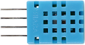   |  |
| -------------------------------------- | ---------------------------------------- | -------------------------------------- |
| ESP32 main board                       | DHT11 temperature and humidity sensor x1 | jumper wires                           |
|  |    |  |
| breadboard x1                          | mobile device x1                         | Micro USB cable x1                     |

---

**3. Wiring Diagram**

**Schematic diagram:**

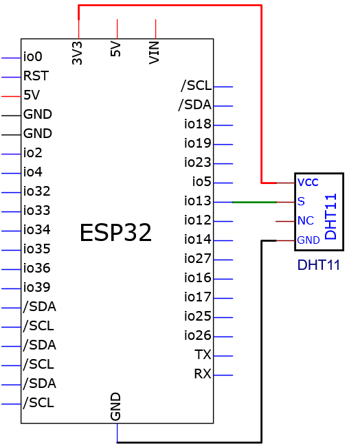


**Wiring diagram:**

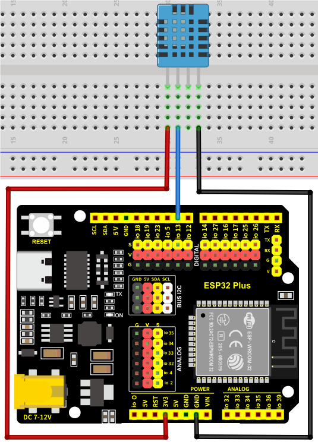

---

**4. Test Code**

**⚠️ATTENTION:** Before uploading code, please replace the WiFi name(**REPLACE_WITH_YOUR_SSID**) in the code and the passwords(**REPLACE_WITH_YOUR_PASSWORD**) into yours.


```python
'''
 * Filename    : IoT_Display_Values_of_XHT11_Using_Web_Server 
 * Thonny      : Thonny 4.1.7
 * Auther      : http//www.keyestudio.com
'''
try:
  import usocket as socket
except:
  import socket

import network
from machine import Pin
import dht

import esp
esp.osdebug(None)

import gc
gc.collect()

# REPLACE WITH YOUR NETWORK CREDENTIALS(Put your SSID & Password)
ssid = 'REPLACE_WITH_YOUR_SSID'         # Enter router name
password = 'REPLACE_WITH_YOUR_PASSWORD' # Enter router password

station = network.WLAN(network.STA_IF)

station.active(True)
station.connect(ssid, password)

while station.isconnected() == False:
  pass

print('Connection successful')
print(station.ifconfig())

sensor = dht.DHT11(Pin(13))
def read_sensor():
  global temp, hum
  temp = hum = 0
  try:
    sensor.measure()
    temp = sensor.temperature()
    hum = sensor.humidity()
    if (isinstance(temp, float) and isinstance(hum, float)) or (isinstance(temp, int) and isinstance(hum, int)):
      msg = (b'{0:3.1f},{1:3.1f}'.format(temp, hum))

      # uncomment for Fahrenheit
      # temp = temp * (9/5) + 32.0

      hum = round(hum, 2)
      return(msg)
    else:
      return('Invalid sensor readings.')
  except OSError as e:
    return('Failed to read sensor.')

def web_page():
  html = """<!DOCTYPE HTML><html><head>
  <meta name="viewport" content="width=device-width, initial-scale=1">
  <link rel="stylesheet" href="https://use.fontawesome.com/releases/v5.7.2/css/all.css" integrity="sha384-fnmOCqbTlWIlj8LyTjo7mOUStjsKC4pOpQbqyi7RrhN7udi9RwhKkMHpvLbHG9Sr" crossorigin="anonymous">
  <style>html {
     font-family: Arial;display: inline-block;margin: 0px auto;text-align: center;}
    h2 { font-size: 3.0rem; }p { font-size: 3.0rem; }.units { font-size: 1.2rem; }.dht-labels{font-size: 1.5rem;vertical-align:middle;padding-bottom: 15px;}
    </style></head><body><h2>ESP DHT Server</h2>
  <p>
    <i class="fas fa-thermometer-half" style="color:#059e8a;"></i> 
    <span class="dht-labels">Temperature</span> 
    <span>"""+str(temp)+"""</span>
    <sup class="units">&deg;C</sup>
  </p>
  <p><i class="fas fa-tint" style="color:#00add6;"></i> 
    <span class="dht-labels">Humidity</span>
    <span>"""+str(hum)+"""</span>
    <sup class="units">%</sup>
  </p></body></html>"""
  return html

s = socket.socket(socket.AF_INET, socket.SOCK_STREAM)
s.bind(('', 80))
s.listen(5)

while True:
  conn, addr = s.accept()
  print('Got a connection from %s' % str(addr))
  request = conn.recv(1024)
  print('Content = %s' % str(request))
  sensor_readings = read_sensor()
  print(sensor_readings)
  response = web_page()
  conn.send('HTTP/1.1 200 OK\n')
  conn.send('Content-Type: text/html\n')
  conn.send('Connection: close\n\n')
  conn.sendall(response)
  conn.close()
```

**5. Test Result**

Please follow the steps below:

1\. Open “Thonny IDE” and choose “This Computer” → “D:” → “Codes” → “MicroPython_Code”. Open the file “2-2-08_IoT_Display_Values_of_XHT11_Using_Web_Server.py” or copy and paste the above code into “Thonny IDE”.

2\. Before uploading code, please replace the WiFi name(**REPLACE_WITH_YOUR_SSID**) in the code and the passwords(**REPLACE_WITH_YOUR_PASSWORD**) into yours.

**⚠️ATTENTION:** Make sure that the WiFi name and passwords in the code is the same as the network connected to your computer, phone/tablet, ESP32 board, and the router. They must be under the same local area network (WiFi).

3\. Connect the ESP32 board to your computer via USB cable and click  to run the code. After uploading code and waiting for connection, the corresponding **IP** address(***circled in red***) will be displayed on the “Shell”.


**⚠️Note that if there is no IP address on the “Shell”, please press the RESET button on the ESP32 board and click  again.**


4\. Open the browser on your phone and input the WIFI IP address in it and “**search**”.


5\. After a few seconds, enter the WiFi web page, indicating that the ESP32 module is successfully connected to WiFi. The WiFi web page shows the following content.

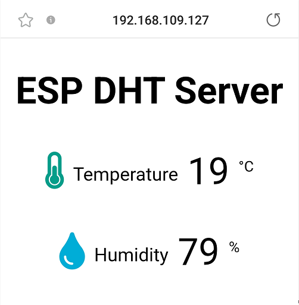

6\. If the ambient temperature and humidity detected by the DHT11 sensor, click the “” and the values displayed on the web page will be updated. 

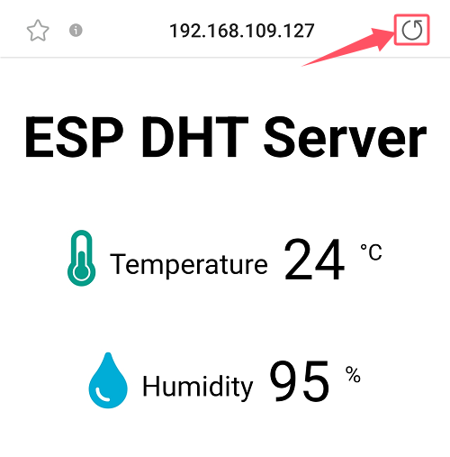

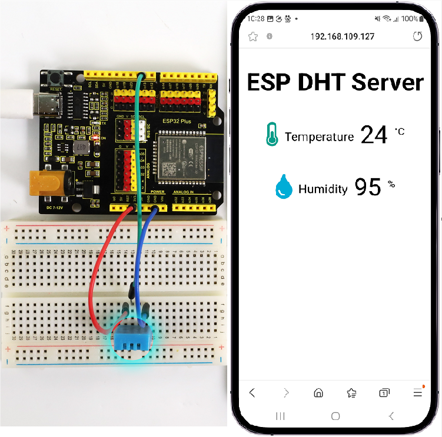

7\. Click  to exit the execution.

---

**6. Code Explanation**

Let’s explain the code in details:

- Import the necessary libraries to create the Web server.

```python
try:
  import usocket as socket
except:
  import socket

import network
```
- Import `Pin` class from the `machine` ; import `dht` to read data from the DHT sensor.

```python
from machine import Pin
import dht
```
- The dht sensor needs to be initialized by creating a DHT instance on GPIO 13.

```python
sensor = dht.DHT11(Pin(13))
```
- Add your network name and password.

```python
ssid = 'REPLACE_WITH_YOUR_SSID'
password = 'REPLACE_WITH_YOUR_PASSWORD'
```
- Create a function called `read_sensor()` to read the temperature and humidity measured by the DHT sensor.

```python
def read_sensor():
```
- The function first creates two global variables, so we can use them in all parts of the script (they are initialized to 0).

```python
global temp, hum
temp = hum = 0
```
`temp` holds the temperature read from the sensor, `hum` holds the humidity read from the sensor.

- Use `try` and `except` statements. In the `try` , we try to get the temperature and humidity values, we measure the sensor by `measure()` on the `sensor` object.

```python
try:
 sensor.measure()
```
- `sensor.temperature()` reads the temperature and `humidity()` reads the humidity. Save these readings in `temp` and `hum` .

```python
temp = sensor.temperature()
hum = sensor.humidity()
```
- Valid temperature and humidity readings should be of type float (if you use a DHT22 sensor) or type int (if you use a DHT11 sensor). Therefore, before proceeding, we check to see if there is a valid reading by `isinstance()`.

```python
if (isinstance(temp, float) and isinstance(hum, float)) or (isinstance(temp, int) and isinstance(hum,int)):
```
**⚠️ATTENTION:** `isinstance()` accepts variables and data types as parameters: `isinstance(variable, data type)`. Return `True` if the variable corresponds to the inserted data type. Return `False` if not.

- If the reading is valid, the “Shell” shows the temperature and humidity values.

```python
msg = (b'{0:3.1f},{1:3.1f}'.format(temp, hum))
```
- If you want to display the temperature in Fahrenheit, please uncomment # on the following line.

```python
# temp = temp * (9/5) + 32.0
```
- The humidity reading is rounded to two decimal places and will be printed later on the web server page.

```python
hum = round(hum, 2)
```
- Return a message with temperature and humidity.

```python
return(msg)
```
- If you do not get a valid sensor values(not of type float), return `Invalid sensor readings` .

```python
else:
    return('Invalid sensor readings.')
```
- If the data cannot be read from the sensor (for example, if the sensor is disconnected), return an error message.

```python
except OSError as e:
  return('Failed to read sensor.')
```
-  `web_page()` returns the HTML page and browses each line of the HTML to see what it does;  `<meta>` makes your web page responsive in any browser;  `<link>` loads the ICONS used in web pages from the fontawesome website.

```python
<meta name="viewport" content="width=device-width, initial-scale=1">
<link rel="stylesheet" href="https://cdnjs.cloudflare.com/ajax/libs/font-awesome/6.5.1/css/all.min.css">
```
- Between `<style>` and `</style>` , we add some CSS to style the page.

```python
  <style>html {
     font-family: Arial;display: inline-block;margin: 0px auto;text-align: center;}
    h2 { font-size: 3.0rem; }p { font-size: 3.0rem; }.units { font-size: 1.2rem; }.dht-labels{font-size: 1.5rem;vertical-align:middle;padding-bottom: 15px;}
    </style>
```
- Set the HTML page to use Arial font to display text in the module, without margins, and aligned in the center.

```python
html {
     font-family: Arial;display: inline-block;margin: 0px auto;text-align: center;}
```
- set the font size for headings(`h2`), paragraphs(`p`), and reading units(`.units`) .

```python
h2 { font-size: 3.0rem; } p { font-size: 3.0rem; }.units { font-size: 1.2rem; }
```
- The label style for the reading material is shown below.

```python
dht-labels{font-size: 1.5rem;vertical-align:middle;padding-bottom: 15px;}
```
- One shows temperature, the other humidity; Paragraphs are separated by `<p>` and `</p>` . The paragraphs on temperature and humidity are as follows:

```python
  <p>
    <i class="fas fa-thermometer-half" style="color:#059e8a;"></i> 
    <span class="dht-labels">Temperature</span> 
    <span>"""+str(temp)+"""</span>
    <sup class="units">&deg;C</sup>
  </p>
  <p><i class="fas fa-tint" style="color:#00add6;"></i> 
    <span class="dht-labels">Humidity</span>
    <span>"""+str(hum)+"""</span>
    <sup class="units">%</sup>
  </p>
```
- To select a color, you just need to pass the style parameter of the hexadecimal color, as follows:

```python
<i class="fas fa-tint" style="color:#00add6;"></i> 
```
- In `while` loop, when we call `read_sensor()` to print the values of the sensor and update the global variables `temp` and `hum` .
```python
sensor_readings = read_sensor()
print(sensor_readings) 
```
- Call `web_page()` to make the sensor’s latest reading generate HTML text.
```python
response = web_page()
```
---

### 2-2-09 IoT WiFi Web Control Smart Life

---

**1. Overview**

In previous experiments, we have understood the WiFi + ESP32 Web function of the ESP32 module. Herein, we control multiple modules on a web pages through the ESP32 WiFi.

---

**2. Components**

|  ||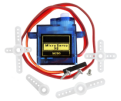||
| ------------------------ | ------------------------ | ---------------------------- |---------------------------- |
|ESP32 main board x1| S8050 transistor x1 |servo ×1 |1kΩ resistor x1|
| 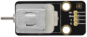| |||
| DC motor x1 |breadboard x1 |jumper wires | Micro USB cable x1 |
|||||
|fan x1|battery holder x1|AA battery (**self-provided**) x6| 10kΩ resistor x1 |
||| | |
|mobile device x1|RGB LED x1|relay x1|LED x1|
||||   |
|active buzzer ×1|220Ω resistor ×4|F-F DuPont wires|  |

---

**3. Wiring Diagram**

**Schematic diagram:**

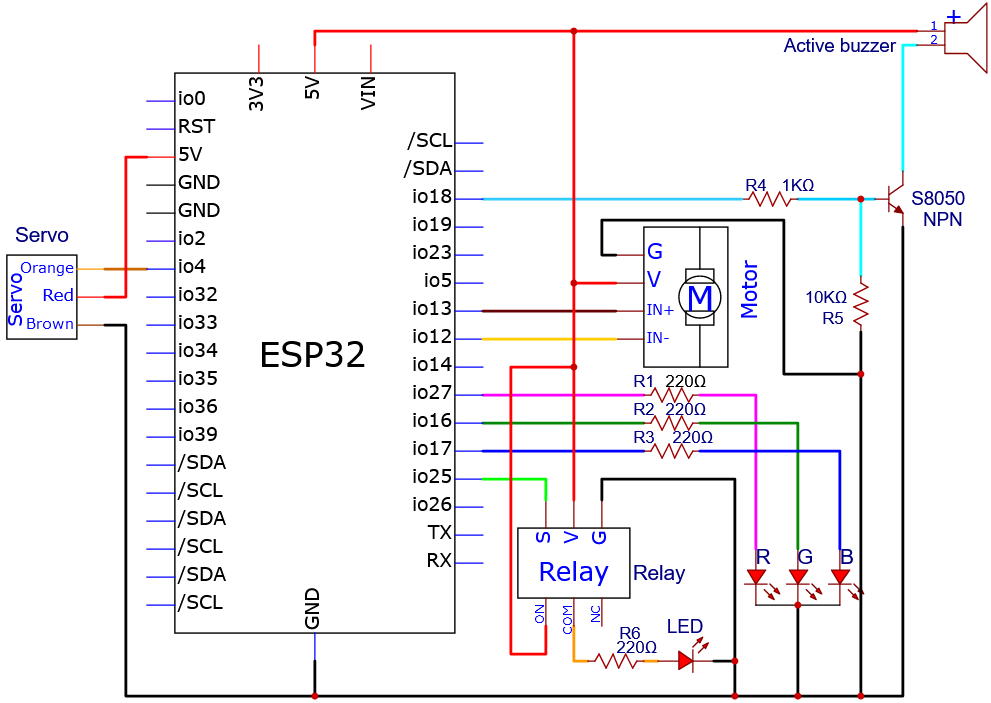

**Wiring diagram:**

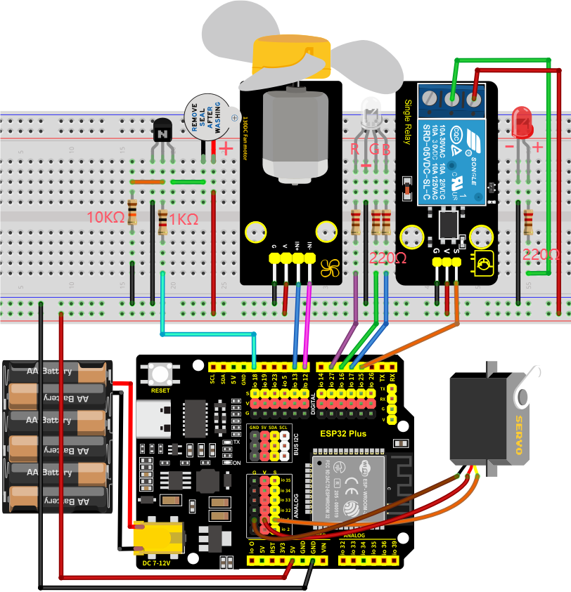

**⚠️ATTENTION:** After wiring up, mount the fan on the motor.

---

**4. Test Code**

**⚠️ATTENTION:** Before uploading code, please replace the WiFi name(**REPLACE_WITH_YOUR_SSID**) in the code and the passwords(**REPLACE_WITH_YOUR_PASSWORD**) into yours.

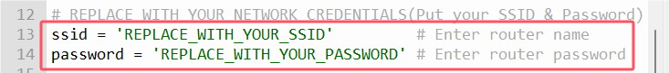

```python
'''
 * Filename    : IoT_WiFi_Web_Control_Smart_Life 
 * Thonny      : Thonny 4.1.7
 * Auther      : http//www.keyestudio.com
'''
import machine
import network
import socket
import time
from machine import Pin,PWM

# REPLACE WITH YOUR NETWORK CREDENTIALS(Put your SSID & Password)
ssid = 'REPLACE_WITH_YOUR_SSID'         # Enter router name
password = 'REPLACE_WITH_YOUR_PASSWORD' # Enter router password

buzzer = machine.Pin(18, machine.Pin.OUT) # Set the GPIO pin to output (assuming the active buzzer is connected to GPIO18)
motora = machine.Pin(13, machine.Pin.OUT) # Set GPIO pin to output (assuming DC motor IN+ is connected to GPIO13)
motorb = machine.Pin(12, machine.Pin.OUT) # Set GPIO pin to output (assuming DC motor IN-connected IN GPIO12)
relay = machine.Pin(25, machine.Pin.OUT) # Set the GPIO pin to output (assuming the relay is connected to GPIO25)

# Define the GPIO pins for the RGB LED
RED_PIN = 27
GREEN_PIN = 16
BLUE_PIN = 17
# Set up the PWM channels
red = PWM(Pin(RED_PIN))
green = PWM(Pin(GREEN_PIN))
blue = PWM(Pin(BLUE_PIN))

# Set the PWM frequency
red.freq(1000)
green.freq(1000)
blue.freq(1000)

# Map input values from one range to another
def interval_mapping(x, in_min, in_max, out_min, out_max):
    return (x - in_min) * (out_max - out_min) / (in_max - in_min) + out_min

# Convert color values (0-255) to duty cycle values (0-1023)
def color_to_duty(rgb_value):
    rgb_value = int(interval_mapping(rgb_value,0,255,0,1023))
    return rgb_value 

def set_color(red_value,green_value,blue_value):
    red.duty(color_to_duty(red_value))
    green.duty(color_to_duty(green_value))
    blue.duty(color_to_duty(blue_value))

# Create a PWM (Pulse Width Modulation) object on Pin 4
servo = machine.PWM(machine.Pin(4))

# Set the frequency of the PWM signal to 50 Hz, common for servos
servo.freq(50)

# Define a function for interval mapping
def interval_mapping(x, in_min, in_max, out_min, out_max):
    return (x - in_min) * (out_max - out_min) / (in_max - in_min) + out_min

# Define a function to write an angle to the servo
def servo_write(pin, angle):

    pulse_width = interval_mapping(angle, 0, 180, 0.5, 2.5) # Calculate the pulse width
    duty = int(interval_mapping(pulse_width, 0, 20, 0, 1023))     # Calculate the duty cycle
    pin.duty(duty) # Set the duty cycle of the PWM signal

def connect_wifi():
    wlan = network.WLAN(network.STA_IF)
    wlan.active(True)
    wlan.connect(ssid, password)
    while not wlan.isconnected():
        time.sleep(1)
    print('Connected to WiFi, IP:', wlan.ifconfig()[0])

connect_wifi()

# Create a simple Web server
def web_page():
    html = """
    <html>
    <body>
    <h1>ESP32 Web Server</h1>
    <p style=\"font-size:7vw;\">Click <a href=\"/A\">here</a> turn on Relay<br></p>
    <p style=\"font-size:7vw;\">Click <a href=\"/B\">here</a> turn off Relay<br></p>
    <p style=\"font-size:7vw;\">Click <a href=\"/C\">here</a> turn on RGB<br></p>
    <p style=\"font-size:7vw;\">Click <a href=\"/D\">here</a> turn off RGB<br></p>
    <p style=\"font-size:7vw;\">Click <a href=\"/E\">here</a> turn on fan<br></p>
    <p style=\"font-size:7vw;\">Click <a href=\"/F\">here</a> turn off fan<br></p>
    <p style=\"font-size:7vw;\">Click <a href=\"/G\">here</a> turn on buzzer<br></p>
    <p style=\"font-size:7vw;\">Click <a href=\"/H\">here</a> turn off buzzer<br></p>
    <p style=\"font-size:7vw;\">Click <a href=\"/I\">here</a> <br>servo turn to 180</p>
    <p style=\"font-size:7vw;\">Click <a href=\"/J\">here</a> <br>servo turn to 0</p>
    </body>
    </html>
    """
    return html

# Start a TCP server
addr = socket.getaddrinfo('0.0.0.0', 80)[0][-1]
s = socket.socket()
s.bind(addr)
s.listen(1)
print('Listening on', addr)

set_color(0, 0, 0)
servo_write(servo, 0)

while True:
    cl, addr = s.accept()
    print('Client connected from', addr)
    request = cl.recv(1024)
    request = str(request)

    if 'GET /A' in request:
        relay.value(1)  # Relay pull
    if 'GET /B' in request:
        relay.value(0)  # Relay off
    if 'GET /C' in request:
        # basic colors
        set_color(255, 0, 0)  # Red
        time.sleep(1)     # Wait for 1 second
        set_color(0, 255, 0)  # Green
        time.sleep(1)     # Wait for 1 second
        set_color(0, 0, 255)  # Blue
        time.sleep(1)      # Wait for 1 second
        # blended colors
        set_color(255, 0, 252)  # Magenta
        time.sleep(1)        # Wait for 1 second
        set_color(237, 109, 0)  # Orange
        time.sleep(1)       # Wait for 1 second
        set_color(255, 215, 0) # Yellow
        time.sleep(1)         # Wait for 1 second
        set_color(34, 139, 34)  # Forest Green
        time.sleep(1)         # Wait for 1 second
        set_color(0, 112, 255)  # Light Blue
        time.sleep(1)         # Wait for 1 second
        set_color(0, 46, 90)   # Indigo
        time.sleep(1)      # Wait for 1 second
        set_color(128, 0, 128)  # Purple
        time.sleep(1)        # Wait for 1 second
    if 'GET /D' in request:
        set_color(0, 0, 0)  # Black
    if 'GET /E' in request:
        motora.value(1)  # Turn on the motor
        motorb.value(0)
    if 'GET /F' in request:
        motora.value(0)  # Turn off the motor
        motorb.value(0)
    if 'GET /G' in request:
        buzzer.value(1)  # The buzzer buzzes
    if 'GET /H' in request:
        buzzer.value(0)  # The buzzer does not sound
    if 'GET /I' in request:
        servo_write(servo, 180)  # the Servo turns to 180°
    if 'GET /J' in request:
        servo_write(servo, 0)  # the Servo turns to 0° 
    cl.send('HTTP/1.1 200 OK\r\n')
    cl.send('Content-Type: text/html\r\n\r\n')
    cl.send(web_page())
    cl.close()
```
---

**5. Test Result**

Please follow the steps below:

1\. Open “Thonny IDE” and choose “This Computer” → “D:” → “Codes” → “MicroPython_Code”. Open the file “2-2-09_IoT_WiFi_Web_Control_Smart_Life.py” or copy and paste the above code into “Thonny IDE”.

2\. Before uploading code, please replace the WiFi name(**REPLACE_WITH_YOUR_SSID**) in the code and the passwords(**REPLACE_WITH_YOUR_PASSWORD**) into yours.

**⚠️ATTENTION:** Make sure that the WiFi name and passwords in the code is the same as the network connected to your computer, phone/tablet, ESP32 board, and the router. They must be under the same local area network (WiFi).

3\. Connect the ESP32 board to your computer via USB cable and click  to run the code. After uploading code and waiting for connection, the corresponding **IP** address will be displayed on the “Shell”.

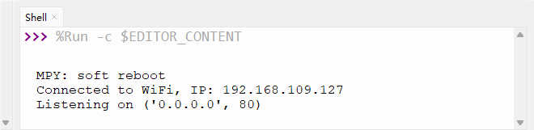

**⚠️Note that if there is no IP address on the “Shell”, please press the RESET button on the ESP32 board and click  again.**


4\. Open the browser on your phone and input the WIFI IP address in it and “**search**”.


5\. After a few seconds, enter the WiFi web page, indicating that the ESP32 module is successfully connected to WiFi. The WiFi web page displays the following content.

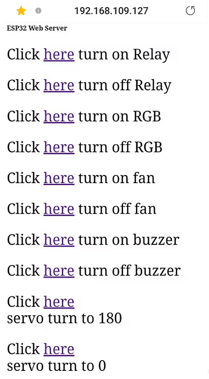


| Button            | Click | Function                                                 |
| --------------------- | -------- | ------------------------------------------------------------ |
|| Click here | relay close, LED on                                          |
|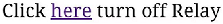| Click here | relay open, LED off                                          |
| | Click here | RGB LED on, RGB LED in different colors                      |
|  | Click here | RGB LED off<br /><span style="color: rgb(255, 76, 65);">Turn off the RGB when it does not change colors.</span> |
| | Click here | DC motor on, fan rotates                                     |
|  | Click here | DC motor off, fan off                                        |
|  | Click here | active buzzer beeps                                          |
|  | Click here | active buzzer off                                            |
| | Click here | servo rotates to 180°                                        |
|| Click here | servo rotates to 0° |

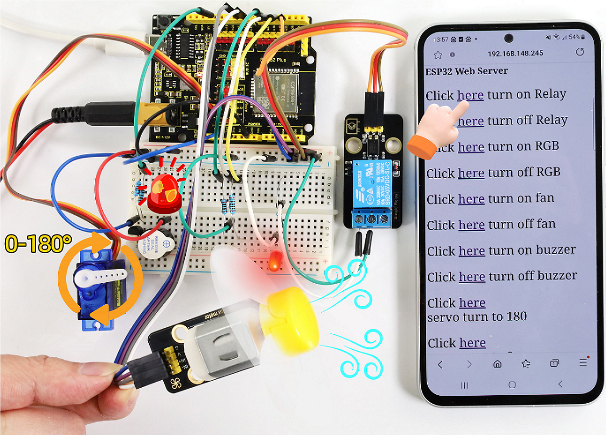

6\. Click  to exit the execution.

---

**6. Code Explanation**

Please refer to the previous Code Explanation.

---

## 2-3 Basic Projects

Herein, we do experiments with ESP32 main board, breadboard and sensors/modules. After connecting a sensor to the main board and uploading code, the function of each sensor can be tested. Besides, the working principles of modules are also included in each project so that we can have a deep understanding of each component. 

**⚠️ATTENTION:** During experiment, please connect to pins and power supply according to the wiring diagrams, or else the sensor/module may be damaged. 

---

### 2-3-01 Hello, LED!

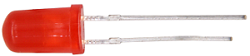

---

**1. Overview**

**LED:** Its full name is light-emitting diode made of compounds containing gallium (Ga), arsenic (As), phosphorus (P), nitrogen (N), etc. When electrons are combined with holes, visible light is emitted. So they can be used to produce light-emitting diodes. Except by components, they can also be divided into organic ones(OLED) and inorganic ones(LED). 

|     LED components      | Emitting light colors |
| :---------------------: | :-------------------: |
| gallium arsenide diode  |          red          |
| gallium phosphide diode |         green         |
|  silicon carbide diode  |        yellow         |
|  gallium nitride diode  |         blue          |

LED is used as an indicator in circuits and instruments, or as part of a text or numeric display. In this project, we connect an external LED to digital pin IO26.

---

**2. Component Knowledge** 

**(1) LED**


An LED is a semiconductor known as a "light-emitting diode", which is made of semiconductor materials (silicon, selenium, germanium, etc.). It is polar. The short pin is negative that connects to GND, while the long one is positive that connects to 3.3V or 5V.


- Here is the detailed introduction for the LED: [LED - Wikipedia](https://en.wikipedia.org/wiki/Light-emitting_diode)

**(2) Five-color-ring Resistor**

A resistor limits or regulates the flow of current in the circuit. The left picture is the appearance of the resistor and the right one is its circuit symbol. Its unit of R is ohm(Ω). 1 MΩ= 1000 kΩ, 1 kΩ = 1000Ω.

   

We can use resistors to protect sensitive components, like LED. The resistance(Ω) is marked on the body with an electronic color code. Each color represents a number, and you can refer to it in the resistance card.

-ring 1 – 1st Digit.
-ring 2 – 2nd Digit.
-ring 3 – 3rd Digit.
-ring 4 – Multiplier.
-ring 5 – Tolerance.


In this kit, we provide four five-color-ring resistor. Here we take three of them as examples.

220Ω resistor *10


10KΩ resistor *10


1KΩ resistor *10


- You can learn more about resistor from Wiki: [Resistor - Wikipedia](https://en.wikipedia.org/wiki/Resistor)

In the same voltage, there will be less current but more resistance. The connection between current(I), voltage(V), and resistance(R) can be expressed: I=U/R. In the figure below, for instance, if the voltage is 3V, the current through R1 equals I = U / R = 3 V / 10 KΩ= 0.0003A= 0.3mA.


- You can learn more about Ohm’s Law from Wiki: [Ohm’s Law - Wikipedia](https://en.wikipedia.org/wiki/Ohm%27s_law)

Don’t connect a low resistance directly to the two poles of the power supply, as this will cause excessive current to damage the electronic components. Resistors are nonpolar.

**(3) Breadboard**

Breadboards are used to build and test circuits quickly before completing any circuit design. There are many holes in the breadboard so that components such as resistors can be inserted into it. 

A typical breadboard is shown below:


The breadboard comes with many metal strips that run underneath the board to connect holes together. They are laid out as shown below. Note that the top and bottom rows of holes are connected horizontally, while the remaining holes are connected vertically.


The first two rows (top) and the last two rows (bottom) are used for power positive(+) and negative(-) respectively. The conductive layout is shown below:


We should know that the up and low holes of groove in the middle are not connected. So we can connect the DIP(Dual in-line Packages) components (say, integrated circuits, microcontrollers, chips, etc.) as shown below:


If you want to know more about breadboard, refer to: [How to Use a Breadboard - Science Buddies](https://www.sciencebuddies.org/science-fair-projects/references/how-to-use-a-breadboard)

---


**3. Components**

|  |||
| ------------------------ | ------------------------ | ---------------------------- |
| ESP32 main board x1 | red LED x1 | 220Ω resistor  x1 |
||||
|breadboard x1 |jumper wires | Micro USB cable x1 |

---

**4. Wiring Diagram** 

We adopt digital pin IO26 in this experiment. In the circuit, we connect a 220Ω resistor in serial, which protect the LED from over-current.

**Schematic diagram:**


**Wiring diagram:**


---

**5. Test Code**

Open “Thonny IDE” and choose “This Computer” → “D:” → “Codes” → “MicroPython_Code”. Open the file “2-3-01_Hello_LED.py” or copy and paste the following code into“Thonny IDE”.

```python
'''
 * Filename    : Hello_LED 
 * Thonny      : Thonny 4.1.7
 * Auther      : http//www.keyestudio.com
'''
# import Pin and time library
from machine import Pin
import time

led = Pin(26, Pin.OUT)   # Set LED pin to 26 and set it to output

try:
    while True:
        led.value(1)   # LED on
        time.sleep(1)  # Delay 1s
        led.value(0)   # LED off
        time.sleep(1)  # Delay 1s
except:
    pass
```

---

**6. Test Result**

Connect the ESP32 main board to your computer via Micro USB cable. Click  to run the code. After uploading the code, the red LED blinks: it lights up for 1s and goes off for 1s, in a loop.


Click  to exit the execution.

---

**7. Code Explanation**

1\. Import the Pin class from the machine module so that its functions can be used.

```python
from machine import Pin
```
2\. Import the time class so that its functions can be used.

```python
import time
```

3\. Set the LED pin and output mode.

```python
machine.Pin(id,mode,pull,value)
```
- `id`: GPIO number. The value ranges from 0 to 29. If GPIO26 is used, enter 26.

- `mode`: the pin mode. It can be one of the following:
  - `Pin\.IN(0)` - Pin configuration to input;
  
   - `Pin.OUT(1)` - Pin configuration to (normal) output;
  
   - `Pin.OPEN_DRAIN(2)` - Pin configuration to open drain output;
  
- `pull`: whether the pin is connected to a (weak) pull resistance. Valid only in input mode and can be one of the following:
  - `None` - No pull or pull down resistance;
  
   - `Pin.PULL_UP(1)` - The pull-up resistor is enabled.
  
   - `Pin.PULL_DOWN(2)` - The pull-down resistor is enabled.
  
- `value`: Valid only for Pin.OUT and Pin.OPEN_DRAIN. Specify the initial output pin value, otherwise the state of the pin peripheral remains unchanged. 0 is low (off) and 1 is high (on).

  - `Pin.on()` - Set the pin to high
  
   - `Pin.off()` - Set the pin to low

4\. Set LED pin to IO26, output mode. 

```python
led = Pin(26, Pin.OUT) 
```
Q: Why Output mode?

A: The code is set to the main board. For the board, this io11 pin is set to output mode, which outputs high and low levels for the module connected to this pin.

5\. `while True:` The statements below this function execute in a loop.

while:

```python
while (condition)：
    (statements)……
```

6\. LED on/off

```python
led.value(1)   # LED on
time.sleep(1)  # delay 1s
led.value(0)   # LED off
time.sleep(1)  # delay 1s
```
   - `led.value(1)`: Output high level (1) on the IO pin of the main control board; That is, input a high level (1) to the led to turn on LED.
   
   - `led.value(0)`: Output low level (0) on the IO pin of the main control board; That is, input low level (0) to the led to turn off LED.
   
   - `time.sleep(1)`: The program is delayed by 1 second.

Q : Why delay?

Input the high level to the LED module, and the LED will always be on. Set a delay of 1 second, and the LED will only stay on for 1 second. Then continue to run the rest of the program.

A : Control the time when the LED lights on and off by setting the delay.

---

### 2-3-02 Breathing LED


---

**1. Overview**

In previous studies, we control LED on/off state through digital output. Herein, we adopt PWM to light and dim the LED gradually. PWM is a technology that allows us to control the brightness of an LED or the speed of a motor by changing the duty cycle of a square-wave signal.

With PWM, instead of simply turning the LED on or off, we adjust the time the LED lights up and the time it turns off within each cycle, so that the LED will “breathe” evenly.

This breathing lighting adds a dynamic effect, attracting eyes. 

---

**2. Working Principle**


**Analog / Digital signal** 

An Analog Signal is a continuous signal in both time and value. On the contrary, a Digital Signal is a time series consisting of a sequence of quantities. Most signals in life are analog signals. A familiar example of an Analog Signal would be how the temperature throughout the day is continuously changing and could not suddenly change instantaneously from 0℃ to 10℃. However, Digital Signals can instantaneously change in value. This change is expressed in numbers as 1 and 0 (binary). Their differences can more easily be seen when compared when graphed as below. 

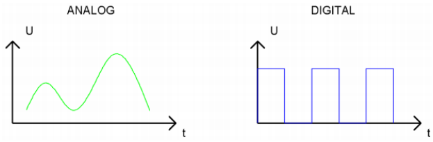

**PWM:**

Pulse Width Modulation, is a very effective method for using digital signals to control analog circuits. Common processors cannot directly output analog signals. PWM technology makes it very convenient to achieve this conversion (translation from digital to analog signals). 

PWM technology uses digital pins to send certain frequencies of square waves, that is, the output of high levels and low levels, which alternately last for a certain period. The total time is generally fixed, which is called the **period** (`the reciprocal of the period is frequency`). The time of high level outputs are generally called “pulse width”, and the duty cycle is the percentage of the ratio of pulse duration, or pulse width (PW) to the total period (T) of the waveform. The longer the high levels last, the longer the duty cycle and the higher the corresponding voltage in the analog signal will be. 

The following figures show how the analog signal voltages vary between 0V-3.3V (high level is 3.3V) corresponding to the pulse width 0%-100%.


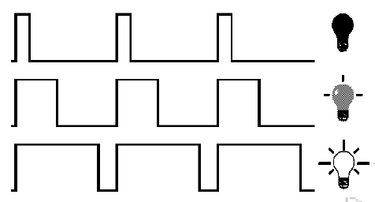

PWM is widely applied to adjust light brightness, motor rotation speed and sound production. Here are three parameters of it.


1\. Duty cycle: The duration proportion of high level to the total period

2\. Period: The reciprocal of the pulse frequency in one second

3\. On the ESP32, the LEDC(PWM) controller comes with 16 independent channels, each of which can independently control frequency, duty cycle and accuracy.

The longer the PWM duty cycle is, the higher the output power will be. So we can use PWM to control the brightness of an LED or the speed of DC motor. PWM is not real analog, but the effective value of the voltage is equivalent to the corresponding analog. Therefore, we can control the output power of modules. 

**ESP32 and PWM**

On the ESP32, the LEDC(PWM) controller boasts 16 independent channels, each of which can independently control frequency, duty cycle, and even accuracy. Unlike traditional PWM pins, the ESP32’s PWM output pins are configurable, with one or more PWM output pins per channel. The relationship between maximum frequency and bit accuracy is shown below:


The maximum of bits is 31. For example, generate PWM with 10-bit precision(2ˆ10 = 1024, ranging from 0 to 1023).

---

**3. Components**

|   | ||
| ------------------------ | ------------------------ | ---------------------------- |
|ESP32 main board x1| red LED x1 | 220Ω resistor  x1 |
||||
|breadboard x1 |jumper wires | Micro USB cable x1 |

---

**4. Wiring Diagram** 

Here we use digital pin IO26. We connect the LED to a 220Ω resistor to avoid high current damage to the LED.

**Schematic diagram:**


The pin in this experiment is the same as “Hello，LED!” but the signal type is not. In the last project, IO26 outputs digital high/low levels (0 & 1) to turn on/off LED, while here IO26 outputs PWM signals to adjust the brightness of the LED.

**Wiring diagram:**


---

**5. Test Code**

Open “Thonny IDE” and choose “This Computer” → “D:” → “Codes” → “MicroPython_Code”. Open the file “2-3-02_Breathing_LED.py” or copy and paste the following code into“Thonny IDE”.

```python
'''
 * Filename    : Breathing_LED 
 * Thonny      : Thonny 4.1.7
 * Auther      : http//www.keyestudio.com
'''
# import Pin, PWM and time
import time 
from machine import Pin,PWM

# ESP32 PWM pin output mode is different from the traditional controller.
# It can change the frequency and duty cycle by configuring the parameters of PWM during the initialization phase.
# set GPIO26 output frequency to 10000Hz, assign it to PWM.

pwm =PWM(Pin(26,Pin.OUT),10000)

try:
    while True:
# the duty cyclr ranges from 0-1023.
# Therefore, we use the first for loop to control the PWM and change the duty cycle to make the PWM output 0-100%;
# and use the second for loop to make PWM output 100%-0%.
        for i in range(0,1023): 
            pwm.duty(i)
            time.sleep_ms(1)
            
        for i in range(0,1023):
            pwm.duty(1023-i)
            time.sleep_ms(1)  
except:
# Each time PWM is used, the hardware timer will turn on to match it.
# Therefore, after each use of PWM, deinit() needs to be called to turn off the timer. Otherwise, the next time PWM may not work.
    pwm.deinit()
```
---

**6. Test Result**

Connect the ESP32 main board to your computer via Micro USB cable. Click  to run the code. After uploading the code, the LED gradually turns on and off, just like breathing.


Click  to exit the execution.

---

**7. Code Explanation**

1\. Import Pin, PWM and time.

```python
import time
from machine import Pin,PWM
```
2\. Set a `PWM` to control the LED connected to pin 26, and set PWM signal frequency to 10000 Hz.

```python
pwm =PWM(Pin(26,Pin.OUT),10000)
```
3\. loop: fade in and out LED. External `while True` always runs. Two nested `for` loop is used to gradually increase and decrease the brightness of the LED. Duty cycle ranges from 0 to 1023, representing 0% to 100% duty cycle.

```python
while True:
    for i in range(0,1023): 
       pwm.duty(i)
       time.sleep_ms(1)
            
    for i in range(0,1023):
       pwm.duty(1023-i)
       time.sleep_ms(1)
```
- `range()`: Create a sequence of integers from 0 to 1023.

- PWM signal Duty cycle `duty()`

- `time.sleep_ms()`: Pause the execution of the program for 1 millisecond between each iteration of the loop, thereby gradually increasing brightness over time.

---

### 2-3-03 Traffic Lights

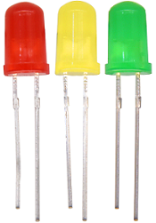

---

**1. Overview**

Traffic lights are closely related to people's daily life, which generally show red, yellow, and green. Everyone should obey the traffic rules to avoid many accidents. 

In this project, we will adopt red, green and yellow LED to make a mini traffic lights.

---

**2. Components**

|  |||
| ------------------------ | ------------------------ | ---------------------------- |
| ESP32 main board x1 | red LED x1 |green LED x1  |
|| ||
|yellow LED x1  | 220Ω resistor  x3 |breadboard x1 |
|||  |
|jumper wires | Micro USB cable x1 |  |

---

**3. Wiring Diagram** 

**Schematic diagram:**

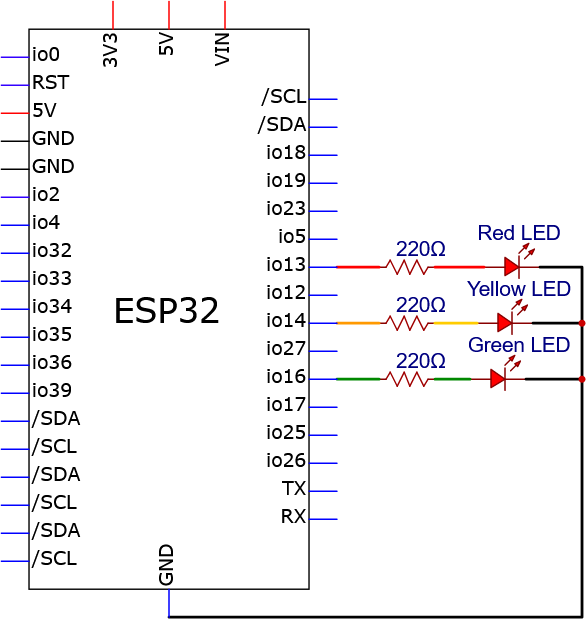


**Wiring diagram:**

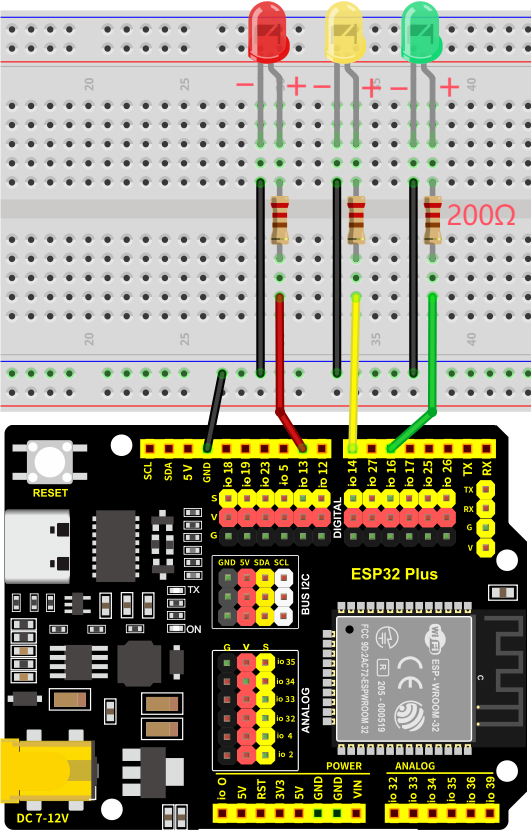

---

**4. Test Code**

Open “Thonny IDE” and choose “This Computer” → “D:” → “Codes” → “MicroPython_Code”. Open the file “2-3-03_Traffic_Lights.py” or copy and paste the following code into“Thonny IDE”.

```python
'''
 * Filename    : Traffic_Lights
 * Thonny      : Thonny 4.1.7
 * Auther      : http//www.keyestudio.com
'''
from machine import Pin 
import time

led_red = Pin(13, Pin.OUT)  # Connect red LED to pin 13, and set it to output mode
led_yellow = Pin(14, Pin.OUT)  # Connect yellow LED to pin 14, and set it to output mode
led_green = Pin(16, Pin.OUT) # Connect green LED to pin 16, and set it to output mode
 
while True:
    led_red.value(1)  # red LED on
    time.sleep(5)   # delay 5s
    led_red.value(0) # red LED off
    led_yellow.value(1)
    time.sleep(0.5)
    led_yellow.value(0)
    time.sleep(0.5)
    led_yellow.value(1)
    time.sleep(0.5)
    led_yellow.value(0)
    time.sleep(0.5)
    led_yellow.value(1)
    time.sleep(0.5)
    led_yellow.value(0)
    time.sleep(0.5)
    led_green.value(1)
    time.sleep(5) 
    led_green.value(0) 
```
---

**5. Test Result**

Connect the ESP32 main board to your computer via Micro USB cable. Click  to run the code. After uploading the code, the green LED lights up for 5 seconds and goes off; then the yellow LED blinks for three times; at last the red LED also lights up for 5 seconds and goes off. These actions repeat.

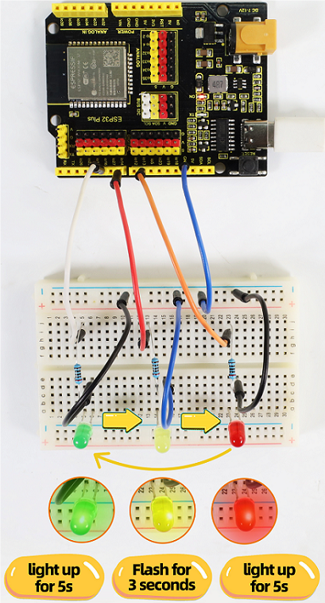

Click  to exit the execution.

---

**6. Code Explanation**

Please refer to [2-3-01](https://docs.keyestudio.com/projects/KS5020/en/latest/docs/2.%20MicroPython_Tutorial.html#hello-led) and [2-3-02](https://docs.keyestudio.com/projects/KS5020/en/latest/docs/2.%20MicroPython_Tutorial.html#breathing-led) Code Explanation.

---

### 2-3-04 Flowing Water Light

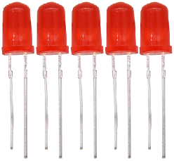

---

**1. Overview**

In our daily life, we can see many billboards composed of different colors of LED. They constantly change the light (like water) to attract customers’ attention. In this project, we will use ESP32 main board to control 5 LEDs to achieve the effect of flowing water.

**2. Components**

|  |||
| ------------------------ | ------------------------ | ---------------------------- |
| ESP32 main board x1 | red LED x5 | 220Ω resistor  x5 |
||||
|breadboard x1 |jumper wires | Micro USB cable x1 |

---

**3. Wiring Diagram** 

**Schematic diagram:**

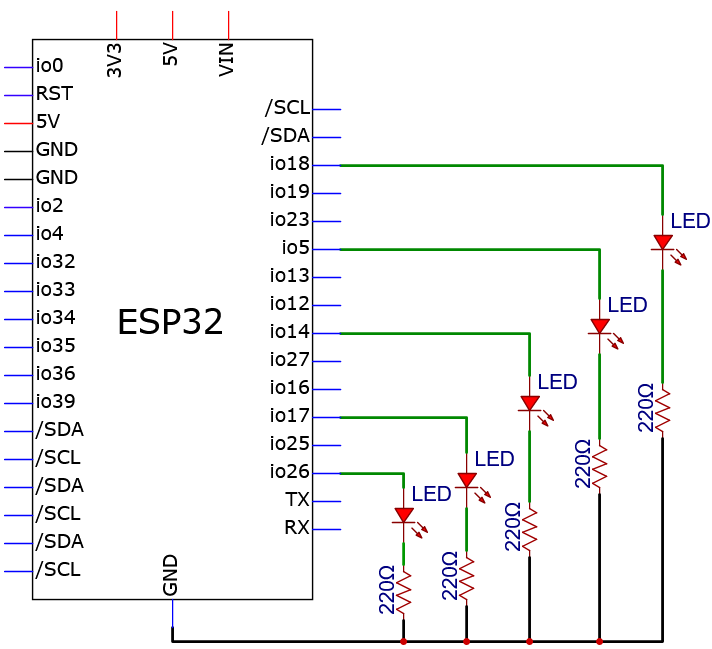

**Wiring diagram:**

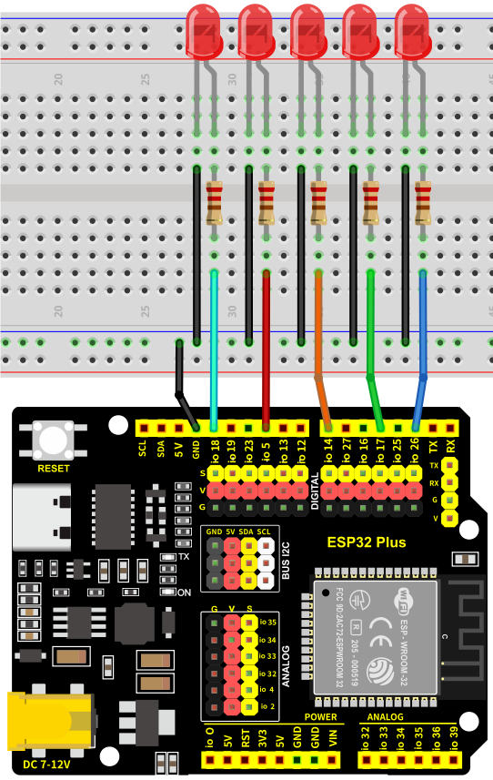

---

**4. Test Code**

This project is to design a water flow LED. It first turn on LED #1 and off; Then turn on LED #2 and off... And repeat the same operation for all 5 leds until the last LED is turned off. This just likes the “movement” of the water.

Open “Thonny IDE” and choose “This Computer” → “D:” → “Codes” → “MicroPython_Code”. Open the file “2-3-04_Flowing_Water_Light.py” or copy and paste the following code into“Thonny IDE”.

```python
'''
 * Filename    : Flowing_Water_Light
 * Thonny      : Thonny 4.1.7
 * Auther      : http//www.keyestudio.com
''' 
from machine import Pin
import time

# Use the array to define five IO ports connected to leds
pins = [18, 5, 14, 17, 26]
# Use two for loops to turn on the led from left to right, and then from right to left
def showLed():
    for pin in pins:
        print(pin)
        led = Pin(pin, Pin.OUT)
        led.value(1)
        time.sleep_ms(100)
        led.value(0)
        time.sleep_ms(100)        
    for pin in reversed(pins):
        print(pin)
        led = Pin(pin, Pin.OUT)
        led.value(1)
        time.sleep_ms(100)
        led.value(0)
        time.sleep_ms(100)
          
while True:
    showLed()
```
---

**5. Test Result**

Connect the ESP32 main board to your computer via Micro USB cable. Click  to run the code. After uploading the code, these LEDs gradually light up and go off in sequence. Meanwhile, the Thonny IDE “Shell” shows the corresponding LED pins.

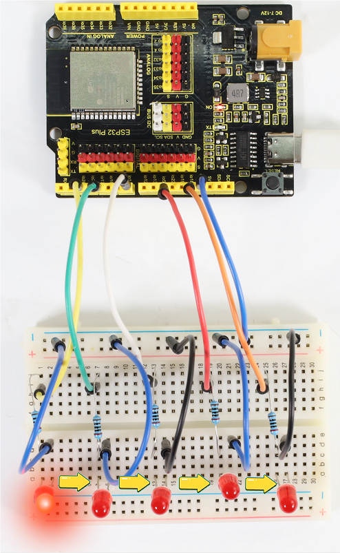

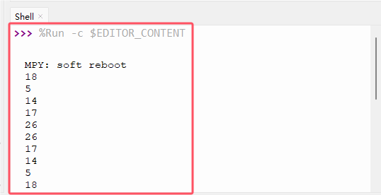

Click  to exit the execution.

---

**6. Code Explanation**

1\. Set pins for multiple leds.

```python
pins = [18, 5, 14, 17, 26]
```
2\. define `showLed()` and use two `for` loop turns on the led from left to right, and then from right to left.

```python
def showLed():
    for pin in pins:
        print(pin)
        led = Pin(pin, Pin.OUT)
        led.value(1)
        time.sleep_ms(100)
        led.value(0)
        time.sleep_ms(100)        
    for pin in reversed(pins):
        print(pin)
        led = Pin(pin, Pin.OUT)
        led.value(1)
        time.sleep_ms(100)
        led.value(0)
        time.sleep_ms(100)
          
```

For others, please refer to [2-3-01](https://docs.keyestudio.com/projects/KS5020/en/latest/docs/2.%20MicroPython_Tutorial.html#hello-led) and [2-3-02](https://docs.keyestudio.com/projects/KS5020/en/latest/docs/2.%20MicroPython_Tutorial.html#breathing-led) Code Explanation.

---

### 2-3-05 RGB LED

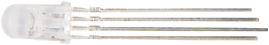

---

**1. Overview**

RGB LED combines three primary color (red, green and blue) pins that share a common cathode and whose anode pins control the intensity of the corresponding color. By varying the strength of the electrical signal applied to each anode, it produces a wide variety of colors. For example, mix high-intensity red and green to show yellow, while blue and green to cyan.

In this project, we will introduce the principles of additive color mixing and display colors with RGB LED.

---

**2. Component Knowledge**

RGB LED (red, green, and blue) are packaged in a transparent/translucent plastic housing. It can display a variety of colors by changing the input voltage of the three pins, which can statistically produce 16,777,216 different colors.

**Features:**

- Color: Three colors (Red/Green/blue)
- Common cathode
- 5mm transparent round lens
- Forward voltage: Red: DC 2.0-2.2V; Blue Green: DC 3.0-3.2V (IF=20mA)
- 0.06 watt DIP RGB LED
- Brightness up to + 20%
- Viewing Angle: 30°

**Common anode and common cathode:**

For common cathode RGB LED, three pins share a negative connection (cathode).

For common anode RGB LED, three pins share a positive connection (anode).

**⚠️In this kit, the RGB LED is a common cathode one.**

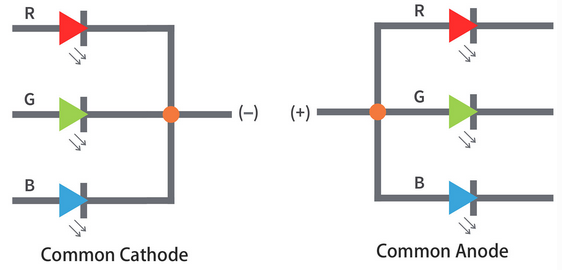

**RGB LED pins:**

There are 4 pins: the longest is GND; The others are red, green and blue. Place the RGB led as shown, the second from the left being the longest pin. So the pin numbers should be red, GND, green and blue.


You can also use the multimeter “**diode**” test mode to press the connection as shown to measure the color of each pin.

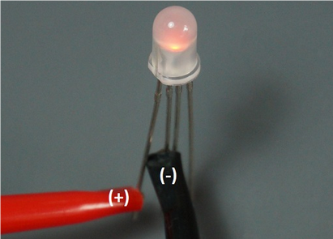

**Mixed color:**

Three colors can be combined in different intensities to generate additional colors, and intensities can be controlled by PWM.

Because they are so close to each other, so our eyes see the result of a combination rather than colors alone.

Take a look at the image below and you may understand how different colors are produced.

- Here is the detailed introduction for a dditive color of the RGB: [Additive color - Wikipedia](https://en.wikipedia.org/wiki/Additive_color)


The brightness of RGB LED can be adjusted by PWM.

- [RGB_Color - Wikipedia](https://en.wikipedia.org/wiki/RGB_color_model)

---

**3. Components**

|  |||
| ------------------------ | ------------------------ | ---------------------------- |
| ESP32 main board x1 | RGB LED x1  | 220Ω resistor  x3 |
||||
|breadboard x1 |jumper wires | Micro USB cable x1 |

---

**4. Wiring Diagram** 

**Schematic diagram:**

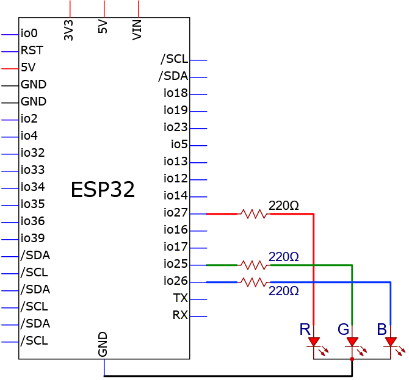

**Wiring diagram:**

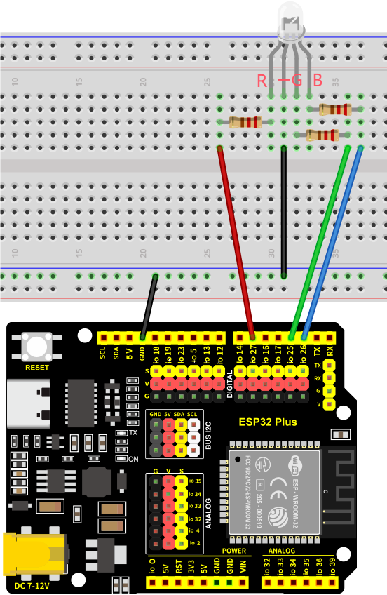

---

**5. Test Code**

You can also use the following code to set the color you want; the color value is 0~255;

Here, we can choose our favorite color in the drawing software and display it with RGB LED.

Open “Thonny IDE” and choose “This Computer” → “D:” → “Codes” → “MicroPython_Code”. Open the file “2-3-05_RGB_LED.py” or copy and paste the following code into“Thonny IDE”.

```python
'''
 * Filename    : RGB_LED
 * Thonny      : Thonny 4.1.7
 * Auther      : http//www.keyestudio.com
'''
from machine import Pin, PWM
import time

# Define the GPIO pins for the RGB LED
RED_PIN = 27
GREEN_PIN = 25
BLUE_PIN = 26

# Set up the PWM channels
red = PWM(Pin(RED_PIN))
green = PWM(Pin(GREEN_PIN))
blue = PWM(Pin(BLUE_PIN))

# Set the PWM frequency
red.freq(1000)
green.freq(1000)
blue.freq(1000)

# Map input values from one range to another
def interval_mapping(x, in_min, in_max, out_min, out_max):
    return (x - in_min) * (out_max - out_min) / (in_max - in_min) + out_min

# Convert color values (0-255) to duty cycle values (0-1023)
def color_to_duty(rgb_value):
    rgb_value = int(interval_mapping(rgb_value,0,255,0,1023))
    return rgb_value

def set_color(red_value,green_value,blue_value):
    red.duty(color_to_duty(red_value))
    green.duty(color_to_duty(green_value))
    blue.duty(color_to_duty(blue_value))

while True:
    # Set different colors and wait for a while
    set_color(255, 0, 0) # Red
    time.sleep(1)
    set_color(0, 255, 0) # Green
    time.sleep(1)
    set_color(0, 0, 255) # Blue
    time.sleep(1)
    set_color(255, 255, 0) # Yellow
    time.sleep(1)
    set_color(255, 0, 255) # Purple
    time.sleep(1)
    set_color(0, 255, 255) # Cyan
    time.sleep(1)
    set_color(255, 255, 255) # White
    time.sleep(1)
```

**⚠️Note:** This code maps color values from 0 to 255 to duty cycles from 0 to 1023.

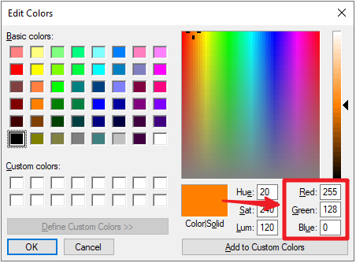

Write the RGB value to set_color() and you will be able to see RGB light up the color you want.

---

**6. Test Result**

Connect the ESP32 main board to your computer via Micro USB cable. Click  to run the code. After uploading the code, RGB LED shows the colors you set.

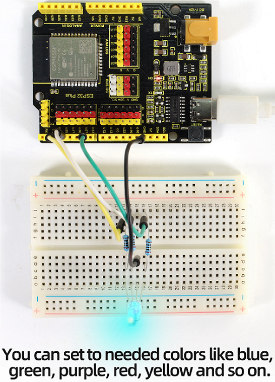

Click  to exit the execution.

---

**7. Code Explanation**

1\. `interval_mapping` is used to map values from one range to another. It accepts five parameters: the input value, the minimum and maximum value of the input range, and the minimum and maximum value of the output range. It maps the return input value to the output range.

```python
def color_to_duty(rgb_value):
    rgb_value = int(interval_mapping(rgb_value,0,255,0,1023))
    return rgb_value
```
2\. `color_to_duty` takes an integer RGB value (e.g. 255,0,255) and maps it to the duty cycle appropriate for the PWM pin. `interval_mapping` maps the input RGB values from 0-255 to 0-1023. `interval_mapping` output is returned as the duty cycle ratio.

```python
def color_to_duty(rgb_value):
    rgb_value = int(interval_mapping(rgb_value,0,255,0,1023))
    return rgb_value
```
3\. `color_set` accepts three integer parameters: the red, green, and blue values of the LED. These values are passed to `color_to_duty` to obtain the duty cycle of the PWM pin. `duty` sets the duty cycle for the corresponding pin.

```python
def set_color(red_value,green_value,blue_value):
    red.duty(color_to_duty(red_value))
    green.duty(color_to_duty(green_value))
    blue.duty(color_to_duty(blue_value))
```
---

### 2-3-06 74HC595N

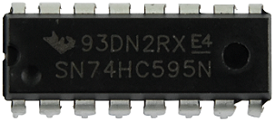

---

**1. Overview**

The 74HC595 chip has multiple output pins that can be connected in series to control the sequence of LED lighting. So it can be used to control 8 outputs at once, taking up only a few pins on microcontroller. In addition, multiple registers can connects to each other for further output expansion. 

In this project, we will use 74HC595 chip to turn on/off 8 LEDs. They just like a rainbow shining colorful lights. In addition, thanks to the scalability of the chip, we can easily add more leds to the display for an even more spectacular effect.

---

**2. Component Knowledge**

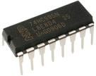

Have you ever found yourself wanting to control a lot of leds, or just needing more I/O pins to control buttons, sensors, and servos? Well, you can connect some sensors to the Arduino pins, but you’ll run out of Arduino pins pretty quickly.

The solution is to use “shift registers” that allows you to expand the number of I/O pins from the Arduino (or any microcontroller). The 74HC595 shift register is one of the most famous.

The 74HC595 essentially controls eight separate output pins, using only three input pins. If you need more than 8 additional I/O lines, you can easily cascade any number of shift registers and create a large number of I/O lines. All of this is done through what’s called a shift register.

- [74HC595 Datasheet](https://www.ti.com/lit/ds/symlink/cd74hc595.pdf?ts=1617341564801)

**Features:**

- 8-bit serial input, parallel output shift;
- Operating voltage range 2V to 6V;
- High current tri-state output can drive up to 15LSTTL loads;
- Low power consumption, 80µA Max ICC;
- Typical tPD = 14 ns;
- ±6ma output drive at 5v;
- Low input current, Max. 1µA;
- The shift register has a direct clear function.

**74HC595 pins and function:**

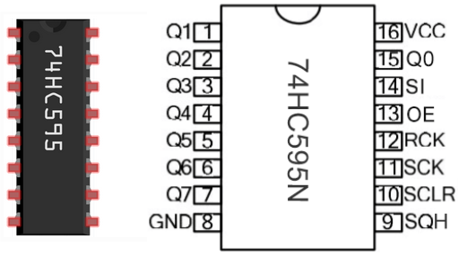

- Q0-Q7: 8-bit parallel data output pins for direct control of 8 leds or 8 7-segment display pins.
- SQR: Series output pin, connecting another 74HC595 DS, series multiple 74HC595
- SCLR: Reset pin, enable at low level;
- SCK: Timing input of the shift register. On the rising edge, the data in the shift register is continuously moved 1 bit, that is, the data from Q1 is moved to Q2, and so on. At the falling edge, the data in the shift register remains unchanged.
- RCK: Stores the timing input of the register. At the rising edge, the data in the shift register is moved to the memory register.
- OE: Output enable pin, enable at low level.
- SI: serial data entry pin
- VCC: positive voltage of the power supply.
- GND: Ground.

**Function diagram:**

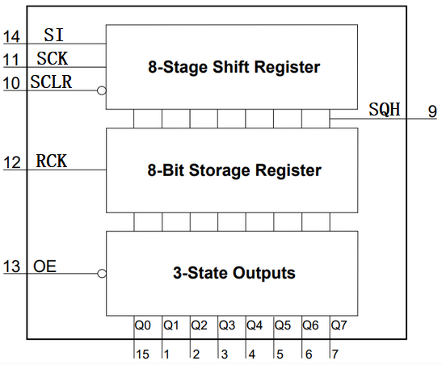

**Working Principle**

When SCLR (pin10) is high and OE (pin13) is low, data is entered from the rising edge of SCK and into the memory register via the rising edge of RCK.

- Shift register

	- Suppose we want to input binary data 1110 1110 into the 74hc595 shift register.
	- Data is input from the 0 bit of the shift register.
	- Each time the shift register clock is on a rising edge, the bits in the shift register are shifted by one step. For example, the 7th bit accepts the value before the 6th, the 6th obtains the value of the 5th, and so on.

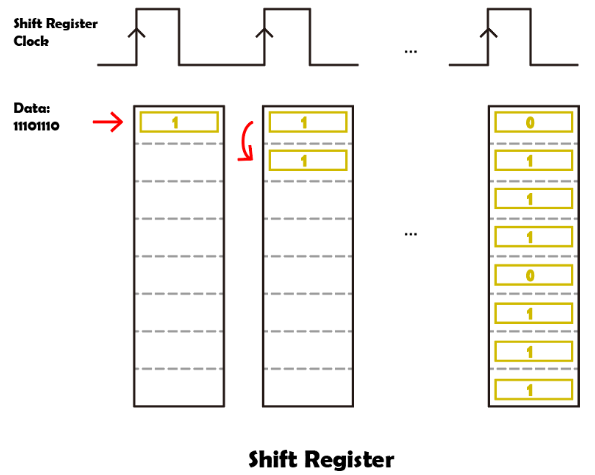

- Memory register
  - When the storage register is in the rising edge state, the data in the shift register will be transferred to the storage register.
  - Connect the memory register directly to the eight output pins, and Q0 to Q7 can receive one byte of data.
  - The so-called storage register means that data can exist in this register and will not disappear with an output.
  - As long as the 74HC595 is powered on, the data will remain valid and unchanged.
  - When new data appears, the data in the storage register will be overwritten and updated.

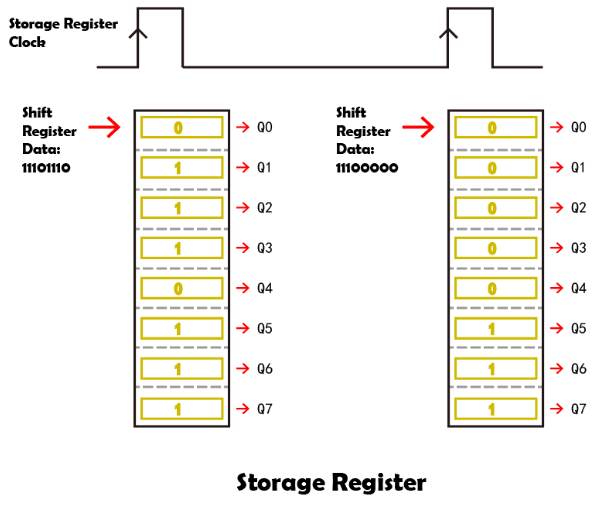

---

**3. Components**

|  |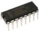|  ||
| ------------------------ | ------------------------ | ---------------------------- |---------------------------- |
|ESP32 main board x1| 74HC595N chip x1 | red LED x8 | 220Ω resistor  x8 |
||||  |
|breadboard x1 |jumper wires | Micro USB cable x1 |  |

---

**4. Wiring Diagram**

**Schematic diagram:**

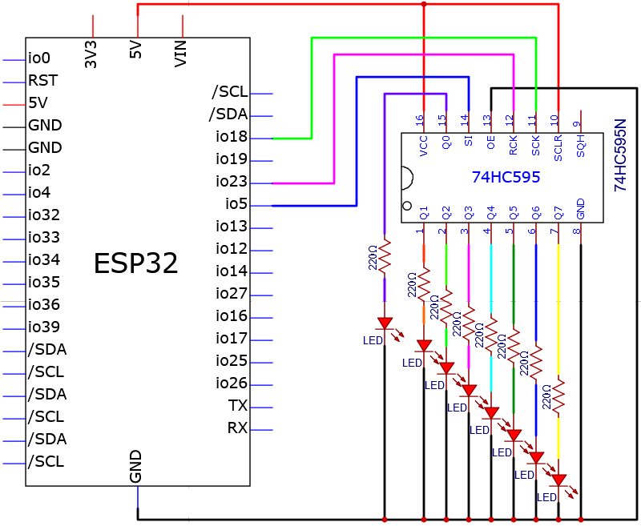

- When SCLR (pin10) is at a high level and OE (pin13) is at a low level, data is input from the rising edge of SCK and enters the memory register through the rising edge of SCK.
- If two clocks are connected together, the shift register is always one pulse ahead of the memory register.
- In the memory register there is a serial shift input pin (SI), a serial output pin (SQH), and an asynchronous reset button (low level).
- The memory register outputs a bus with parallel 8-bits and three states.
- When OE is enabled (low level), the data in the memory register is output to the bus (Q0 ~ Q7).

**Wiring diagram:**

**⚠️Pay attention to the insert direction of the 74HC595N**

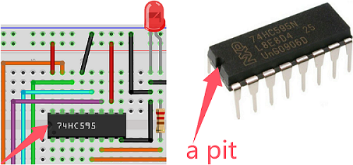

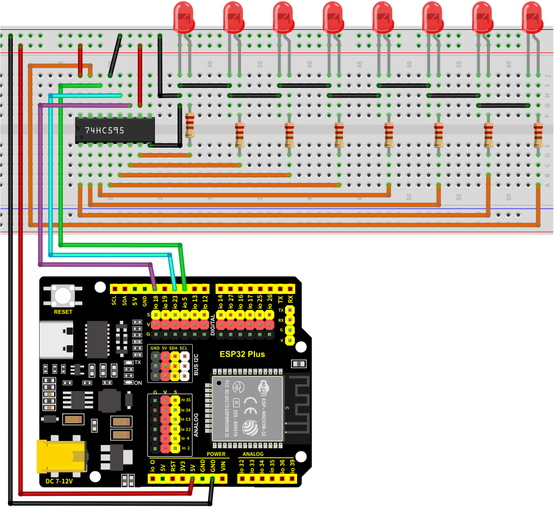

---

**5. Test Code** 

Open “Thonny IDE” and choose “This Computer” → “D:” → “Codes” → “MicroPython_Code”. Open the file “2-3-06_74HC595N.py” or copy and paste the following code into“Thonny IDE”.

```python
'''
 * Filename    : 74HC595N
 * Thonny      : Thonny 4.1.7
 * Auther      : http//www.keyestudio.com
'''
# Import the machine and time libraries
import machine
import time

# Initialize the pins for the 74HC595 shift register
si = machine.Pin(5, machine.Pin.OUT)  # SI
rck = machine.Pin(23, machine.Pin.OUT)  # RCK
sck = machine.Pin(18, machine.Pin.OUT)  # SCK

# Define the hc595_shift function to shift data into the 74HC595 shift register
def hc595_shift(dat):
    # Set the RCLK pin to low
    rck.off()

    # Iterate through each bit (from 7 to 0)
    for bit in range(7, -1, -1):
        # Extract the current bit from the input data
        value = 1 & (dat >> bit)

        # Set the SRCLK pin to low
        sck.off()

        # Set the value of the SDI pin
        si.value(value)

        # Clock the current bit into the shift register by setting the SRCLK pin to high
        sck.on()

    # Latch the data into the storage register by setting the RCLK pin to high
    rck.on()

num = 0

# Shift data into the 74HC595 to create a moving LED pattern
for i in range(16):
    if i < 8:
        num = (num << 1) + 1  # Shift left and set the least significant bit to 1
    elif i >= 8:
        num = (num & 0b01111111) << 1  # Mask the most significant bit and shift left
    hc595_shift(num)  # Shift the current value into the 74HC595
    print("{:0>8b}".format(num))  # Print the current value in binary format
    time.sleep_ms(200)  # Wait 200 milliseconds before shifting the next value
```
---

**6. Test Result**

Connect the ESP32 main board to your computer via Micro USB cable. Click  to run the code. After uploading the code, LEDs in the circuit turn on and off one by one. And the Shell prints related messages.

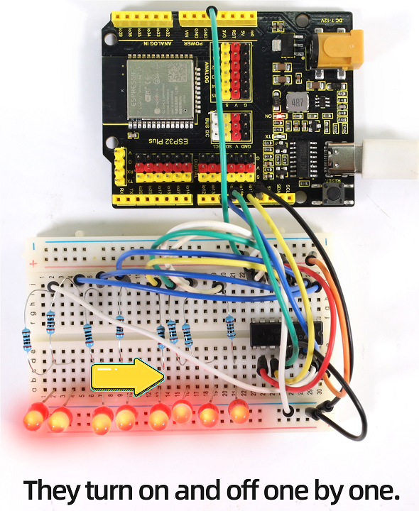

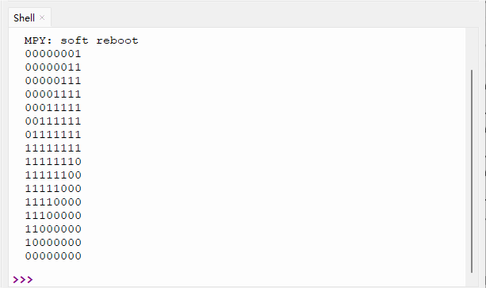

Click  to exit the execution.

---

**7. Code Explanation**

The above code controls the 8-bit shift register (74595) and outputs different binary values to the shift register, with each value displayed on the LED for a period of time.

1\. Import `machine` and `time`. The `machine` is used to control hardware I/O, while the `time` is used to delay time and others.

```python
import machine
import time
```
2\. `machine.Pin()` initializes three output ports corresponding to the shift register data port (SI), storage clock port (RCK), and shift Register clock port (SCK).

```python
# Initialize the pins for the 74HC595 shift register
si = machine.Pin(5, machine.Pin.OUT)  # SI
rck = machine.Pin(23, machine.Pin.OUT)  # RCK
sck = machine.Pin(18, machine.Pin.OUT)  # SCK
```
3\. Define a function called `hc595_shift()` to write 8-bit data to the shift register.

```python
def hc595_shift(dat):
    # Set the RCLK pin to low
    rck.off()

    # Iterate through each bit (from 7 to 0)
    for bit in range(7, -1, -1):
        # Extract the current bit from the input data
        value = 1 & (dat >> bit)

        # Set the SRCLK pin to low
        sck.off()

        # Set the value of the SDI pin
        si.value(value)

        # Clock the current bit into the shift register by setting the SRCLK pin to high
        sck.on()

    # Latch the data into the storage register by setting the RCLK pin to high
    rck.on()
```
4\. for loop

```python
for i in range(16):
    if i < 8:
        num = (num << 1) + 1  # Shift left and set the least significant bit to 1
    elif i >= 8:
        num = (num & 0b01111111) << 1  # Mask the most significant bit and shift left
    hc595_shift(num)  # Shift the current value into the 74HC595
    print("{:0>8b}".format(num))  # Print the current value in binary format
    time.sleep_ms(200)  # Wait 200 milliseconds before shifting the next value
```
- variable `i` is used to control the binary value of the output. In the first eight iterations, `num` values are, in order, 00000001, 00000011, 00000111, …, 11111111, move 1 bit to the left and add 1.
- In the 9th to 16th iteration, first change the highest bit of 1 to 0, and then move 1 bit left, the output value is 00000010, 00000100, 00001000, …, 10000000.
- In each iteration, `num` value is passed to `hc595_shift()` to control the shift register output corresponding binary values.
- While output binary values, `print()` outputs the binary value as a string to the terminal.
- After output binary value, `time.sleep_ms()` pauses for 200 milliseconds so that the value on the LED remains on for a period of time.

---

### 2-3-07 One-bit Digital Tube

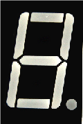

---

**1. Overview**

This One-bit Digital Tube can show number from 0 to 9 through signal pins, just like a mini screen. In this project, we design circuit to show numbers with this component. It is also widely used in counters and clocks.

---

**2. Components**

|  ||||
| ------------------------ | ------------------------ | ---------------------------- |---------------------------- |
|ESP32 main board x1|74HC595N chip x1| 1-bit Digital Tube x1 | 220Ω resistor  x8 |
||||   |
|breadboard x1 |jumper wires | Micro USB cable x1 |   |

---

**3. Component Knowledge**


A 7-segment display is an 8-shaped component which packages 7 LEDs. Each LED is called a segment - when energized, one segment forms part of a numeral to be displayed.

- Each of the LEDs in the display is given a positional segment with one of its connection pins led out from the rectangular plastic package.

- These LED pins are labeled from “a” through to “g” representing each individual LED.

- The other LED pins are connected together forming a common pin.

- So by forward biasing the appropriate pins of the LED segments in a particular order, some segments will brighten and others stay dim, thus showing the corresponding character on the display.

**Features:**

- Size: 19 x 12.7 x 13.8mm(LxWxH, include the pin)
- Screen: 0.56’’
- Color: red
- Common Cathode
- Forward Voltage: 1.8V
- 10 pins
- Pitch: standard 0.1” (2.54mm)

**Common Cathode (CC) or Common Anode (CA)**

There are two types of pin connection: Common Cathode (CC) and Common Anode (CA). As the name suggests, a CC display has all the cathodes of the 7 LEDs connected when a CA display has all the anodes of the 7 segments connected.

- Common Cathode 7-Segment Display

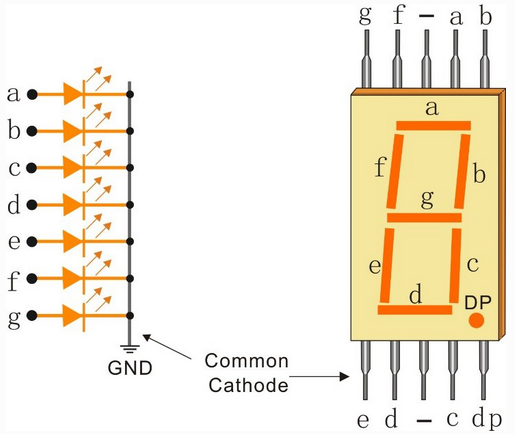

- Common Anode 7-Segment Display

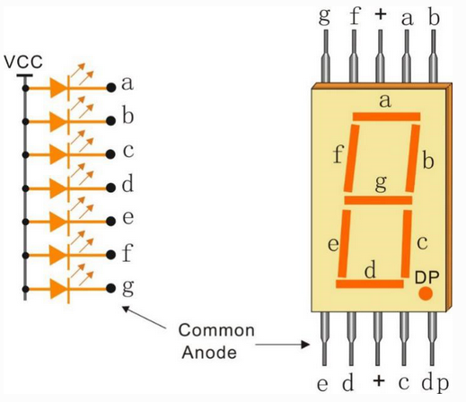

**How to Know CC or CA?**

Usually there will be label on the side of the 7-segment display, xxxAx or xxxBx. Generally speaking xxxAx stands for common cathode and xxxBx stands for common anode.

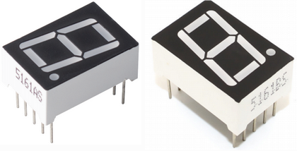

You can also use a multimeter to check the 7-segment display if there is no label. Set the multimeter to diode test mode and connect the black lead to the middle pin of the 7-segment display, and the red lead to any other pin except the middle one. The 7-segment display is common cathode if a segment lights up.

You swap the red and black meter heads if there is no segment lit. When a segment is lit, it indicates a common anode.

**Display Codes**

To help you get to know how 7-segment displays(Common Cathode) display Numbers, we have drawn the following table. Numbers are the number 0-F displayed on the 7-segment display; (DP) GFEDCBA refers to the corresponding LED set to 0 or 1.

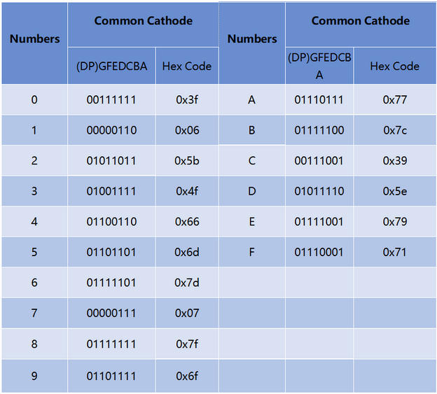

For example, 01011011 means that DP, F and C are set to 0, while others are set to 1. Therefore, the number 2 is displayed on the 7-segment display.

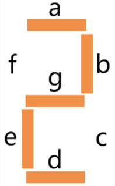

In this experiment, we use a <span style="color: rgb(255, 76, 65);">common cathode one-bit digital tube</span> 。 As we mentioned above, we connect the common cathode to GND and set pin to “HIGH” to light it up.

---

**4. Wiring Diagram**

**⚠️Pay attention to** the insert direction of the digital tube. Note the dot on the tube.

**Schematic diagram:**

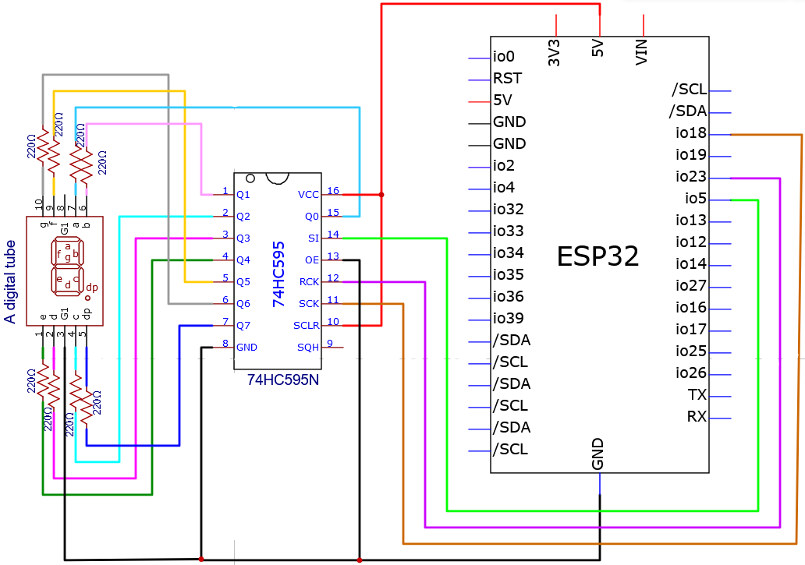

The schematic diagram here is basically the same as 74HC595, the only difference is that Q0-Q7 are connected to the a ~ g pins and dp pins of the 8-segment display.

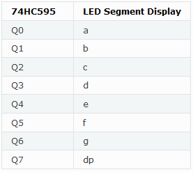

**Wiring diagram:**

**⚠️Pay attention to the insert direction of 74HC595N.**

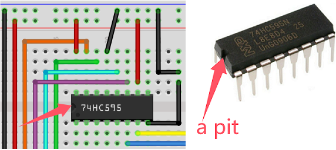

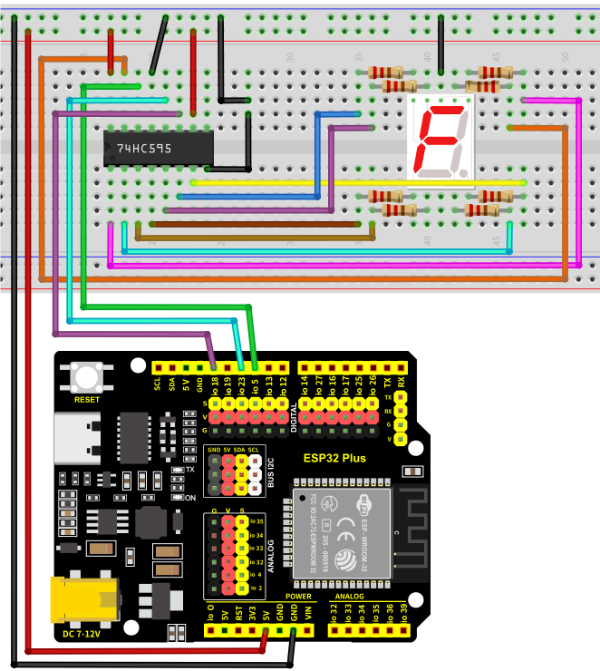

---

**5. Test Code**

7 segment for number display and 1 for a dot. For instance, if we show number 1, turn on segment b and c.

Open “Thonny IDE” and choose “This Computer” → “D:” → “Codes” → “MicroPython_Code”. Open the file “2-3-07_One_Digit_Display.py” or copy and paste the following code into“Thonny IDE”.

```python
'''
 * Filename    : One_Digit_Display
 * Thonny      : Thonny 4.1.7
 * Auther      : http//www.keyestudio.com
'''
import machine
import time

# Define the segment code for a common anode 7-segment display
SEGCODE = [0x3f, 0x06, 0x5b, 0x4f, 0x66, 0x6d, 0x7d, 0x07, 0x7f, 0x6f]

# Initialize the pins for the 74HC595 shift register
si = machine.Pin(5, machine.Pin.OUT)  # SI
rck = machine.Pin(23, machine.Pin.OUT)  # RCK
sck = machine.Pin(18, machine.Pin.OUT)  # SCK

# Define the hc595_shift function to shift data into the 74HC595 shift register
def hc595_shift(dat):
    # Set the RCLK pin to low
    rck.off()

    # Iterate through each bit (from 7 to 0)
    for bit in range(7, -1, -1):
        # Extract the current bit from the input data
        value = 1 & (dat >> bit)

        # Set the SRCLK pin to low
        sck.off()

        # Set the value of the SDI pin
        si.value(value)

        # Clock the current bit into the shift register by setting the SRCLK pin to high
        sck.on()

    # Latch the data into the storage register by setting the RCLK pin to high
    rck.on()

# Continuously loop through the numbers 0 to 9 and display them on the 7-segment display
while True:
    for num in range(10):
        hc595_shift(SEGCODE[num])  # Shift the segment code for the current number into the 74HC595
        time.sleep_ms(500)  # Wait 500 milliseconds before displaying the next number
```
---

**6. Test Result**

Connect the ESP32 main board to your computer via Micro USB cable. Click  to run the code. After uploading the code, the digital tube shows integer number from 0-9. 

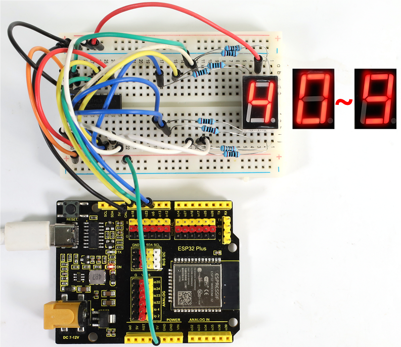

Click  to exit the execution.

---

**7. Code Explanation**

Herein, we use `hc595_shift()` function writes the binary number to the Shift register.

Suppose it displays numbers “2”. The **f** , **c** and **dp** should turn off (low), while **a** , **b** , **d** , **e** and **g** should be turn on (high). “01011011” is binary and “0x5b” is hexadecimal.

Thus, `hc595_shift(0x5b)` is required to show number “2” on the display. 

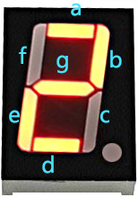

[Hexadecimal](https://en.wikipedia.org/wiki/Hexadecimal)

[BinaryHex Converter](https://www.binaryhexconverter.com/binary-to-hex-converter)

The following table shows the hexadecimal pattern that needs to be written to the shift register in order to display the numbers 0 ~ 9.

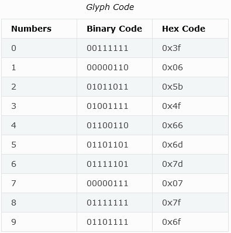

Write these codes to `hc595_shift()` to display the corresponding number.

---

### 2-3-08 4-bit Digital Tube

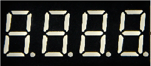

---

**1. Overview**

4-bit Digital Tube is very practical for devices such as electronic clocks, score counters and counters of number. In this project, we use ESP32 board to control it to display four digits 0000-9999.

---

**2. Component Knowledge**

**4-Digit 7-Segment Display**

4-Digit 7-segment display consists of four 7- segment displays working together.

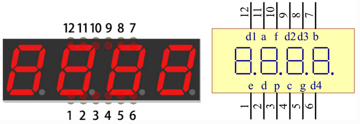

The 4-digtal 7-segment display works independently. It uses the principle of human visual persistence to quickly display the characters of each 7-segment in a loop to form continuous strings.

For example, when “1234” is displayed on the display, “1” is displayed on the first 7-segment, and “234” is not displayed. After a period of time, the second 7-segment shows “2”, the 1st 3th 4th of 7-segment does not show, and so on, the four digital display show in turn. This process is very short (typically 5ms), and because of the optical afterglow effect and the principle of visual residue, we can see four characters at the same time.

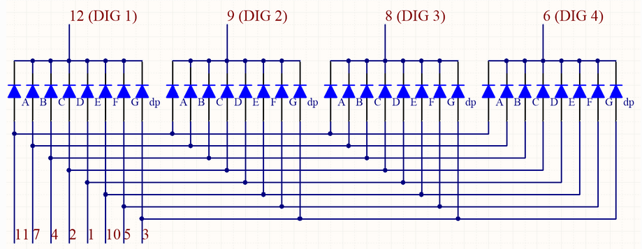

There are two types of 4-digtal 7-segment display: common anode and common cathode. The display principle is similar to that of a single-digit tube which is controlled by 8 GPIO ports to control the display segments of the digital tube, which are 8 LED lights. However, since this is a four-digit, it also needs 4 GPIO ports to control the digit selection end, which is to select which single digital tube is lit. The switching of the digit is very, and the human eye can't distinguish it, so it looks like multiple digital tubes are displayed at the same time. 

**Display Codes**

To help you get to know how 7-segment displays(<span style="color: rgb(255, 76, 65);">Common Anode</span>) display Numbers, we have drawn the following table. Numbers are the number 0-F displayed on the 7-segment display; (DP) GFEDCBA refers to the corresponding LED set to 0 or 1, For example, 11000000 means that DP and G are set to 1, while others are set to 0. Therefore, the number 0 is displayed on the 7-segment display, while HEX Code corresponds to hexadecimal number.

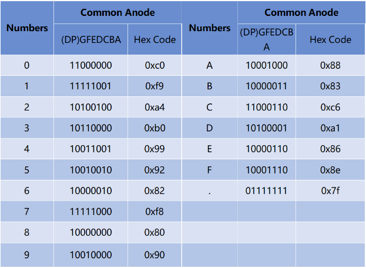

To help you get to know how 7-segment displays(<span style="color: rgb(255, 76, 65);">Common Cathode</span>) display Numbers, we have drawn the following table. Numbers are the number 0-F displayed on the 7-segment display; (DP) GFEDCBA refers to the corresponding LED set to 0 or 1, For example, 00111111 means that DP and G are set to 0, while others are set to 1. Therefore, the number 0 is displayed on the 7-segment display, while HEX Code corresponds to hexadecimal number.

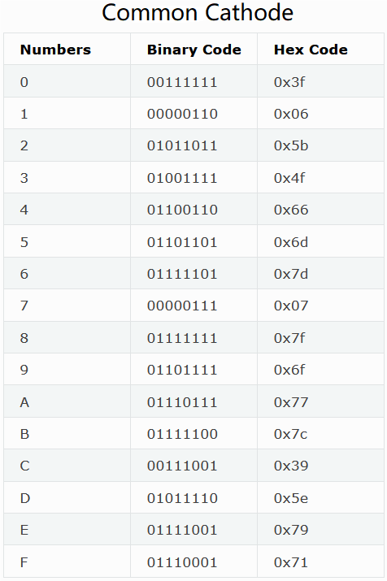

<span style="background: rgb(255, 251, 0);"><span style="color: rgb(255, 76, 65); font-size: 20px;">**⚠️Note:** The 4-digtal 7-segment display used here is a cathode one.</span></span>

---

**3. Components**

|  |||
| ------------------------ | ------------------------ | ---------------------------- |
|ESP32 main board x1| 4-bit Digital Tube x1 | 220Ω resistor  x8 |
||||
|breadboard x1 |jumper wires | USB cable x1 |

---

**4. Wiring Diagram**

**Schematic diagram:**

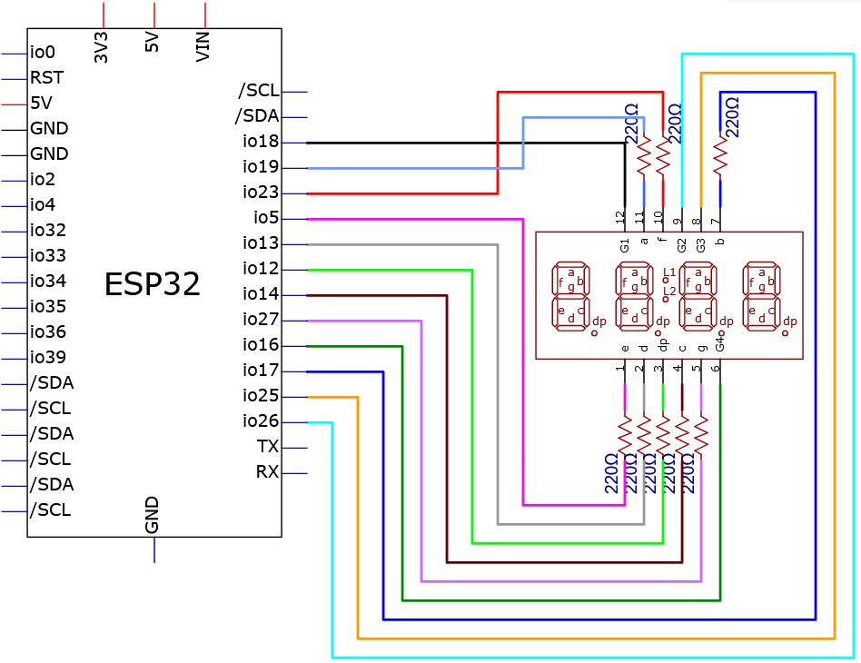

**Wiring diagram:**

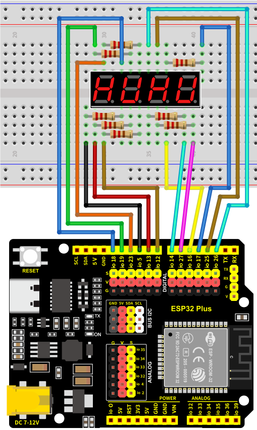

---

**5. Test Code** 

Open “Thonny IDE” and choose “This Computer” → “D:” → “Codes” → “MicroPython_Code”. Open the file “2-3-08_4-Digit_Digital_Tube.py” or copy and paste the following code into“Thonny IDE”.

```python
'''
 * Filename    : 4-Digit_Digital_Tube
 * Thonny      : Thonny 4.1.7 
 * Auther      : http//www.keyestudio.com
'''
from machine import Pin
import time

# each digit pin of the digital tube
a = Pin(19, Pin.OUT)
b = Pin(17, Pin.OUT)
c = Pin(14, Pin.OUT)
d = Pin(13, Pin.OUT)
e = Pin(5, Pin.OUT)
f = Pin(23, Pin.OUT)
g = Pin(27, Pin.OUT)
dp = Pin(12, Pin.OUT)

G1 = Pin(18, Pin.OUT)
G2 = Pin(26, Pin.OUT)
G3 = Pin(25, Pin.OUT)
G4 = Pin(16, Pin.OUT)
  
# corresponding pins of digital tube a-dp
d_Pins=[Pin(i,Pin.OUT)  for i in [19,17,14,13,5,23,27,12]]
# corresponding pins of digital tube segments G1, G2, G3, G4
w_Pins=[Pin(i,Pin.OUT)  for i in [18,26,25,16]]
 
number={
    '0':
    [1,1,1,1,1,1,0,0],#0
    '1':
    [0,1,1,0,0,0,0,0],#1
    '2':
    [1,1,0,1,1,0,1,0],#2
    '3':
    [1,1,1,1,0,0,1,0],#3
    '4':
    [0,1,1,0,0,1,1,0],#4
    '5':
    [1,0,1,1,0,1,1,0],#5
    '6':
    [1,0,1,1,1,1,1,0],#6
    '7':
    [1,1,1,0,0,0,0,0],#7
    '8':
    [1,1,1,1,1,1,1,0],#8
    '9':
    [1,1,1,1,0,1,1,0],#9
}
 
def display(num,dp):
    global number
    count=0
    for pin in d_Pins: # show num value
        pin.value(number[num][count])
        count+=1
    if dp==1:
        d_Pins[7].value(0)
def clear():
    for i in w_Pins:
        i.value(0)
    for i in d_Pins:
        i.value(1)
def showData(num):
   # numeric hundreds, thousands, units, and decimal places
    d_num=num
    location=d_num.find('.')
    if location>0:
        d_num=d_num.replace('.','')
        while len(d_num)<4:
            d_num='0'+d_num
        for i in range(0,4):
            time.sleep(2)
            clear()
            w_Pins[3-i].value(1)
            if i==location-1:
                display(d_num[i],1)
            else:
                display(d_num[i],0)
    if location<0:
        for i in range(0,4):
            time.sleep(2)
            clear()
            w_Pins[3-i].value(1)
            display(d_num[i],0)
while True:
 
    num='9016'
    showData(num)
```
---

**6. Test Result**

Connect the ESP32 main board to your computer via Micro USB cable. Click  to run the code. After uploading the code, the digital tube repeatedly shows 999, 000, 111, 666.


Click  to exit the execution.

---

**7. Code Explanation**

1\. 4-bit Digital Tube a to dp corresponding pins.

```python
d_Pins=[Pin(i,Pin.OUT)  for i in [19,17,14,13,5,23,27,12]]
```
2\. 4-bit Digital Tube G1, G2, G3, G4 corresponding pins.

```python
w_Pins=[Pin(i,Pin.OUT)  for i in [18,26,25,16]]
```

For others, please refer to [2-3-01](https://docs.keyestudio.com/projects/KS5020/en/latest/docs/2.%20MicroPython_Tutorial.html#hello-led) and [2-3-02](https://docs.keyestudio.com/projects/KS5020/en/latest/docs/2.%20MicroPython_Tutorial.html#breathing-led) Code Explanation.

---

### 2-3-09 Buzzer Beep

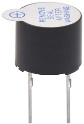

---

**1. Overview**

Active buzzer is a sound component that is widely used as a sound component for computers, printers, alarms ,electronic toys and phones, timers etc. It comes with an internal vibration source, so it can continuously buzz after connecting to 5V power supply. 

In this project, we will use ESP32 board to control the active buzzer to beep.

---

**2. Component Knowledge**

**(1) Active Buzzer**


In the active buzzer, a simple oscillator circuit is integrated to convert constant direct current into pulse signals with a certain frequency. Once it receives a high level, it will emit sound. 

However, passive buzzer is without vibration source, so it must be driven by 2k ~ 5k square waves, rather than a DC signal. 

They are very similar in appearance, but the passive one buzzer is with a green circuit board, while the active one is with black tape. Passive buzzers are not polar, yet active ones are. 


- You can learn more about buzzer from Wiki: [Buzzer - Wikipedia](https://en.wikipedia.org/wiki/Buzzer)

**(2) Transistor**

As buzzer requires large current but GPIO of ESP32 output capability cannot meet this requirement, a NPN transistor is needed to amplify the current. 


Transistor is a semiconductor that controls current. It amplifies weak signals or works as a non-contact switch. 

According to structures, it can be divided into NPN and PNP. Both of them comes with three electrodes: base(B), collector(C) and emitter(E). The PN junction between E and B is also named “emitting junction”, and that between C and B is also called “collecting junction”. 

- You can learn more about transistor from Wiki: [P-N junction - Wikipedia](https://en.wikipedia.org/wiki/P%E2%80%93n_junction)

As shown below, the arrow points to the direction of current flow.


When there is current passing between “BE”, “CE” will allow several-folded current pass (amplified by the transistor). At this point, transistor works in the amplifying area. When current between “BE” exceeds a certain value, “CE” will not allow current to increase any longer. Now the transistor works in the saturation area.

Here are the two types of transistor: PNP and NPN


***In this kit, we mark PNP transistor as 8550, and NPN as 8050.***

It is often used as a switch in digital circuits. As microcontroller's capacity to output current is very weak, transistor is a perfect choice to amplify current and drive large-current components. 

NPN transistor drives buzzer: If GPIO outputs high, current will flow through R1, the transistor will get conducted, and the buzzer will emit sound. If GPIO outputs low, no current flows through R1, so the transistor will not be conducted to enable buzzer to sound. 

PNP transistor drives buzzer: If GPIO outputs low, current will flow through R1, the transistor will get conducted, and the buzzer will emit sound. If GPIO outputs high, no current flows through R1, so the transistor will not be conducted to enable buzzer to sound. 


- [S8050 Transistor Datasheet](https://datasheet4u.com/datasheet-pdf/WeitronTechnology/S8050/pdf.php?id=576670)

- [S8550 Transistor Datasheet](https://www.mouser.com/datasheet/2/149/SS8550-118608.pdf)

---

**3. Components**

|   ||||
| ------------------------ | ------------------------ | ---------------------------- |---------------------------- |
|ESP32 main board x1| NPN transistor (S8050) x1 | active buzzer x1 | 1kΩ resistor x1 |
|||||
|breadboard x1 |jumper wires | Micro USB cable x1 | 10kΩ resistor x1 |

---

**4. Wiring Diagram**

**Schematic diagram:**


**Wiring diagram:**


---

**5. Test Code** 

Open “Thonny IDE” and choose “This Computer” → “D:” → “Codes” → “MicroPython_Code”. Open the file “2-3-09_Buzzer_Beep.py” or copy and paste the following code into“Thonny IDE”.

```python
'''
 * Filename    : Buzzer_Beep
 * Thonny      : Thonny 4.1.7 
 * Auther      : http//www.keyestudio.com
'''
from machine import Pin
import time

buzzer = Pin(13, Pin.OUT)   # set buzzer pin to 13, and set it to output

try:
    while True:
        buzzer.value(1)    # the buzzer buzzes
        time.sleep(0.5) # delay 0.5s
        buzzer.value(0)    # the buzzer keeps quiet
        time.sleep(0.5) # delay 0.5s
except:
    pass
```
---

**6. Test Result**

Connect the ESP32 main board to your computer via Micro USB cable. Click  to run the code. After uploading the code, the active buzzer in the circuit will beep.

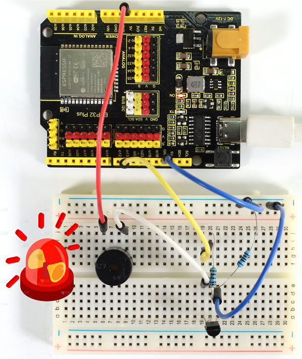

Click  to exit the execution.

---

**7. Code Explanation**

Please refer to [2-3-01](https://docs.keyestudio.com/projects/KS5020/en/latest/docs/2.%20MicroPython_Tutorial.html#hello-led) Code Explanation.

---

### 2-3-10 Play Music

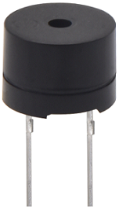

---

**1. Overview**

In a previous project, we studied an active buzzer, which can only make one single sound. Unlike it, passive buzzer can emit sounds of different frequencies. In this project, we will control a passive buzzer to play wonderful music. 


---

**2. Component Knowledge**

A passive buzzer is not integrated with internal vibration source. It must be driven by 2K-5K square waves, rather than DC signals. They are very similar in appearance, but the passive one buzzer is with a green circuit board, while the active one is with black tape. Passive buzzers are not polar, yet active ones are. 


---

**3. Components**

|  ||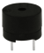||
| ------------------------ | ------------------------ | ---------------------------- |---------------------------- |
|ESP32 main board x1| NPN transistor (S8050) x1 | passive buzzer x1 | 1kΩ resistor x1 |
|||| |
|breadboard x1 |jumper wires | Micro USB cable x1 | 10kΩ resistor x1 |

---

**4. Wiring Diagram**

**Schematic diagram:**

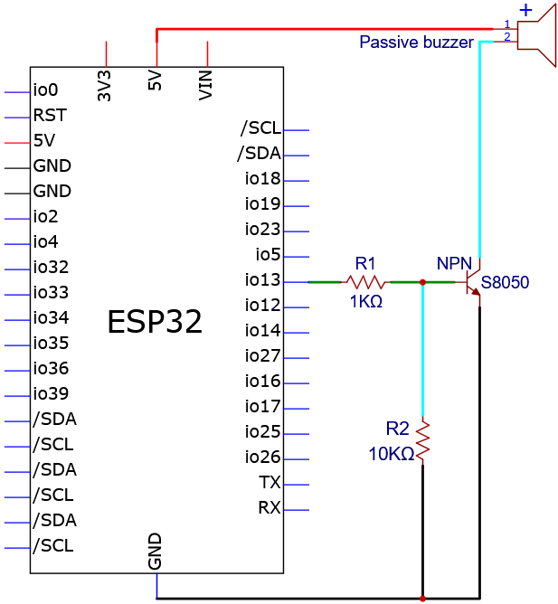

**Wiring diagram:**

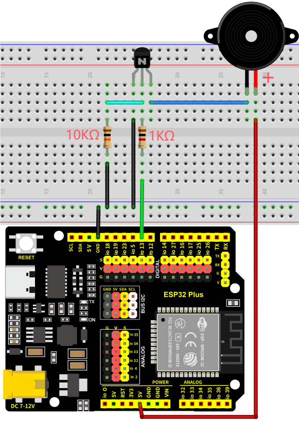

---

**5. Test Code** 

Open “Thonny IDE” and choose “This Computer” → “D:” → “Codes” → “MicroPython_Code”. Open the file “2-3-10_Play_Music.py” or copy and paste the following code into“Thonny IDE”.

```python
'''
 * Filename    : Play_Music
 * Thonny      : Thonny 4.1.7 
 * Auther      : http//www.keyestudio.com
'''
import machine 
import time

# Define the GPIO pin that is connected to the buzzer
buzzer = machine.PWM(machine.Pin(13))

# Define the frequencies of the notes in Hz
C5 = 523
D5 = 587
E5 = 659
F5 = 698
G5 = 784
A5 = 880
B5 = 988

# Define the durations of the notes in milliseconds
quarter_note = 250
half_note = 300
whole_note = 1000

# Define the melody as a list of tuples (note, duration)
melody = [
    (E5, quarter_note),
    (E5, quarter_note),
    (F5, quarter_note),
    (G5, half_note),
    (G5, quarter_note),
    (F5, quarter_note),
    (E5, quarter_note),
    (D5, half_note),
    (C5, quarter_note),
    (C5, quarter_note),
    (D5, quarter_note),
    (E5, half_note),
    (E5, quarter_note),
    (D5, quarter_note),
    (D5, half_note),
    (E5, quarter_note),
    (E5, quarter_note),
    (F5, quarter_note),
    (G5, half_note),
    (G5, quarter_note),
    (F5, quarter_note),
    (E5, quarter_note),
    (D5, half_note),
    (C5, quarter_note),
    (C5, quarter_note),
    (D5, quarter_note),
    (E5, half_note),
    (D5, quarter_note),
    (C5, quarter_note),
    (C5, half_note),

]

# Define a function to play a note with the given frequency and duration
def tone(pin,frequency,duration):
    pin.freq(frequency)
    pin.duty(512)
    time.sleep_ms(duration)
    pin.duty(0)

# Play the melody
for note in melody:
    tone(buzzer, note[0], note[1])
    time.sleep_ms(50)
```
---

**6. Test Result**

Connect the ESP32 main board to your computer via Micro USB cable. Click  to run the code. After uploading the code, the passive buzzer in the circuit plays music.

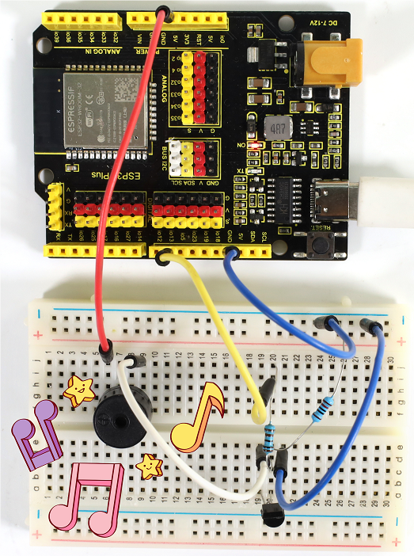

Click  to exit the execution.

---

**7. Code Explanation**

If passive buzzer is given a digital signal, it can only push the diaphragm without producing sound. Therefore, we use `tone()` to produce a PWM signal that makes passive buzzer sound.

This function takes three parameters:

- `pin`: pin that controls the buzzer.
- `frequency`:The tone of the buzzer is determined by the frequency, the higher the frequency is, the higher the tone will be.
- `frequency`: Duration of tone.

`duty()` sets the duty cycle to 512 (about 50%). It could be any other number, it just needs to generate a break.

- `tone()` uses the `pin` object’s `freq` to set the pin’s `frequency` to the frequency value.
- `pin` object’s `duty` sets the duty cycle of the pin to 512.
- The pin produces a tone with a specified frequency and volume, `duration` is measured in milliseconds, using the sleep_ms of the time module.

- The code plays the melody by iterating over a sequence called `melody`, and calls `tone` for each note in the melody by the frequency and duration of the note.
- The time module `sleep_ms` inserts a short pause of 50 milliseconds between each note.

---

### 2-3-11 Small Fan

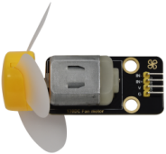

---

**1.Overview** 

In hot summer, we need electric fans to cool us down, so in this project, we control 130 motor with transistor and ESP32 board to rotate the fan. 

---

**2. Components**

|  ||||
| ------------------------ | ------------------------ | ---------------------------- |---------------------------- |
|ESP32 main board x1|130 motor x1| M-F DuPont wires |Micro USB cable x1|
||||  |
|AA battery (**self-provided**) x6|fan x1|battery holder x1|   |

---

**3. Component Knowledge**

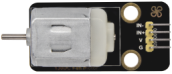

**130 motor:**

It uses HR1124S motor control chip that is a single channel H-bridge driver chip used in DC motor solutions. The H-bridge driving part adopts PMOS and NMOS power tubes with low on-resistance, which ensures low power loss of the chip and makes the chip work safely for a longer time. In addition, the HR1124S supports low standby current and low static operating current, which makes the 130 motor module easy to use in toys.

**130 motor parameters:**

- Operating voltage: 5V
- Operating current: ≤200MA
- Operating power: 2W
- Operating temperature: -10℃~+50℃

**130 motor working principle:**

The HR1124S chip helps drive the motor, which cannot be driven by a triode or directly driven by an IO port because of the large current required by the motor. 

The motor can be turned by adding a voltage to both ends. If the voltage direction is different, the direction of rotation of the motor is not the same. Within the limit voltage, the higher the voltage is, the faster the motor will rotate; On the other hand, the lower the voltage is, the slower the motor will rotate, or stop.

There are two control methods: one is high and low level (control on and off), and the other is PWM(control speed).

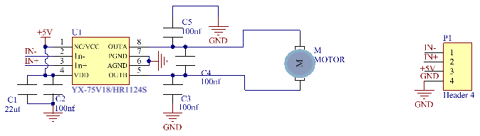

---

**4. Wiring Diagram**

**Schematic diagram:**

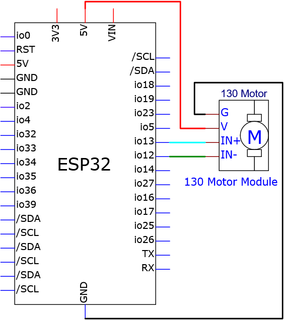

**Wiring diagram:**

**Wire up first and then mount the fan to the motor.**

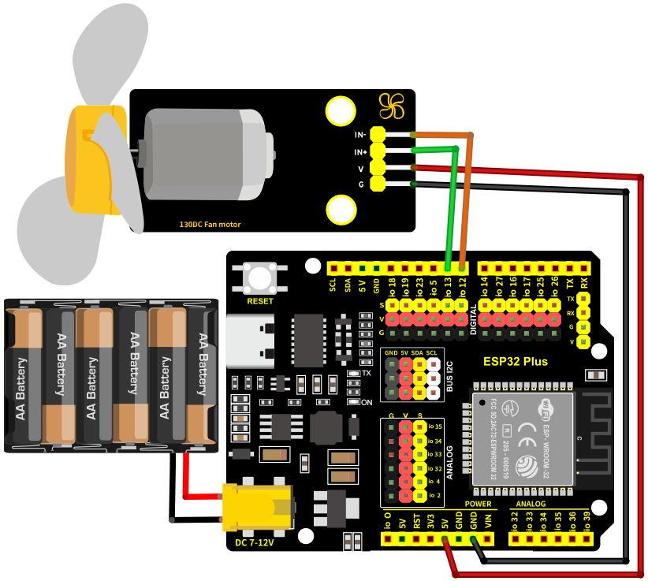

---

**5. Test Code**

Open “Thonny IDE” and choose “This Computer” → “D:” → “Codes” → “MicroPython_Code”. Open the file “2-3-11_Small_Fan.py” or copy and paste the following code into “Thonny IDE”.

```python
'''
 * Filename    : Small_Fan
 * Thonny      : Thonny 4.1.7 
 * Auther      : http//www.keyestudio.com
'''
from machine import Pin
import time 

motor1a = Pin(13, Pin.OUT) # set motor1a pin to 13, and set it to output
motor1b = Pin(12, Pin.OUT) # set motor1b pin to 12, and set it to output

def forward():
    motor1a.value(1) # set motor1a to high
    motor1b.value(0) # set motor1b to low
def backward():
    motor1a.value(0)
    motor1b.value(1)
def stop():
    motor1a.value(0)
    motor1b.value(0)

def test():
    forward() # the motor rotates forwards
    time.sleep(5) # delay
    stop() # the motor stops
    time.sleep(2)
    backward()# the motor rotates backwards
    time.sleep(5)
    stop()
    time.sleep(2)
    
for i in range(5):
    test() 
```
---

**6. Test Result**

Connect the ESP32 main board to your computer via Micro USB cable. Click  to run the code. After uploading the code, the fan rotates the fan rotates counterclockwise for 5 seconds and stops for 2 seconds, and then it rotates clockwise for 5 seconds and stops for 2 seconds. It repeats these actions.

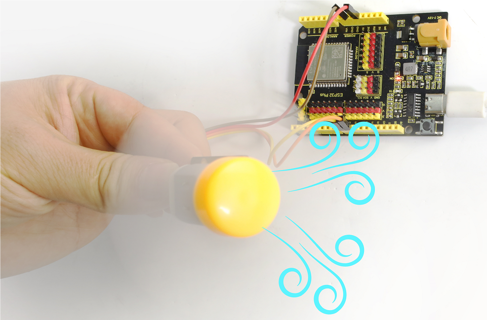

Click  to exit the execution.

---

**7. Code Explanation**

Please refer to [2-3-01](https://docs.keyestudio.com/projects/KS5020/en/latest/docs/2.%20MicroPython_Tutorial.html#hello-led) Code Explanation.

---

### 2-3-12 Servo Rotation

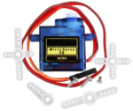

---

**1. Overview**

A servo is a position-based device capable of maintaining a specific Angle and providing precise rotation angles. So it is ideal for applications that require consistent Angle adjustment, such as remote controlled toys, airplane models, submarine replica, as well as complex robots.

In this project, we control the servo to rotate to certain angles.

Are you ready for servo to dance to your tune? Let’s go on this exciting journey!

---

**2. Parameters**

- Operating voltage: DC 3.3V~5V
- Operating temperature: -10°C ~ +50°C
- Dimensions: 32.25mm x 12.25mm x 30.42mm
- Interface: 3-pin spacing 2.54mm

---

**3. Principle**

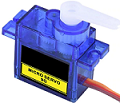

**Servo** is a kind of position driver, which is mainly composed of housing, DC motor, circuit board, variable gear group with torque, a potentiometer and a control board.


The angle range of most servos is 180 degrees. 

As the output torque of the servos is higher than that of DC motors, so they are widely used to control model of cars, planes and robots. 

Generally, servo comes with three wires, two of which are used for the power positive (2-positive wire, red) and negative (3-negative wire, brown). The remaining one is for signal (1-signal wire, orange). 

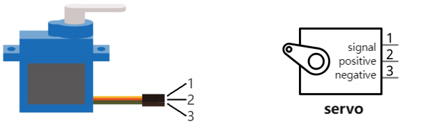

We drive the servo via PWM signals, whose duty cycle is fixed and frequency is 50Hz. In a single PWM cycle, the high level duration is 0.5ms ~ 2.5ms, which corresponds linearly to 0° ~ 180° of the servo. Some corresponding values are as follows:

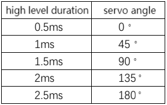

Change the signal value of the servo and it will rotate to the specified angle. 

**⚠️Note that** the angle may vary from servos of different brands after receiving the same signal.

---

**4.Components**

|  |||
| ------------------------ | ------------------- | --------------------- |
| ESP32 main board x1 | servo x1 | Micro USB cable x1 |

---

**5. Wiring Diagram**

**Schematic diagram:**

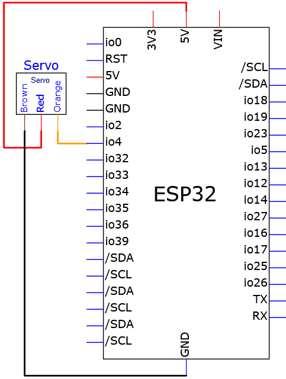

**Wiring diagram:**

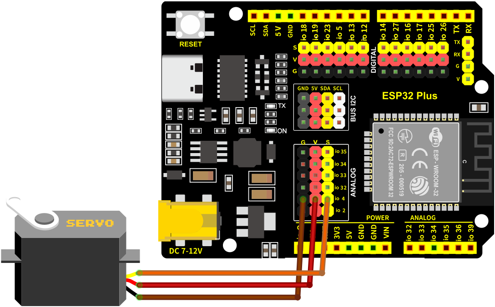

---

**6. Test Code**

Open “Thonny IDE” and choose “This Computer” → “D:” → “Codes” → “MicroPython_Code”. Open the file “2-3-12_Servo_Rotation.py” or copy and paste the following code into “Thonny IDE”.

```python
'''
 * Filename    : Servo_Rotation
 * Thonny      : Thonny 4.1.7
 * Auther      : http//www.keyestudio.com
'''
import machine
import time

# Create a PWM (Pulse Width Modulation) object on Pin 4
servo = machine.PWM(machine.Pin(4))

# Set the frequency of the PWM signal to 50 Hz, common for servos
servo.freq(50)

# Define a function for interval mapping
def interval_mapping(x, in_min, in_max, out_min, out_max):
    return (x - in_min) * (out_max - out_min) / (in_max - in_min) + out_min

# Define a function to write an angle to the servo
def servo_write(pin, angle):

    pulse_width = interval_mapping(angle, 0, 180, 0.5, 2.5) # Calculate the pulse width
    duty = int(interval_mapping(pulse_width, 0, 20, 0, 1023))     # Calculate the duty cycle
    pin.duty(duty) # Set the duty cycle of the PWM signal

# Create an infinite loop
while True:
    # Loop through angles from 0 to 180 degrees
    for angle in range(180):
        servo_write(servo, angle)
        time.sleep_ms(20)

    # Loop through angles from 180 to 0 degrees in reverse
    for angle in range(180, -1, -1):
        servo_write(servo, angle)
        time.sleep_ms(20)
```

**7. Test Result**

Connect the ESP32 main board to your computer via Micro USB cable. Click  to run the code. After uploading the code, the servo rotates forwards and backwards within 0 to 180 degree. 

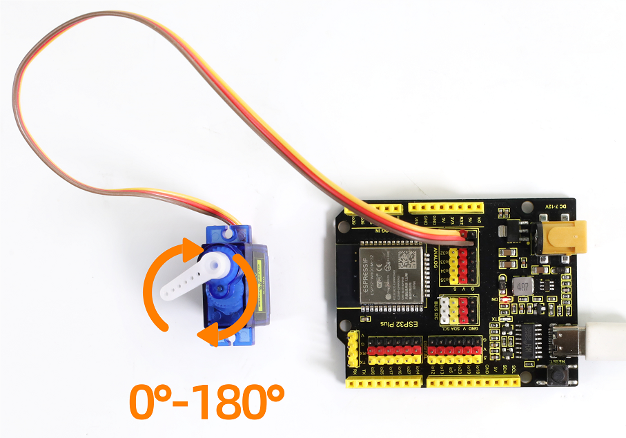

Click  to exit the execution.

---

**8. Code Explanation**

1\. Create a PWM (pulse width modulation) object on pin 4 and set its frequency to 50 Hz. This is common for servos.

```python
# Create a PWM (Pulse Width Modulation) object on Pin 25
servo = machine.PWM(machine.Pin(4))

# Set the frequency of the PWM signal to 50 Hz, common for servos
servo.freq(50)
```
2\. `interval_mapping` maps values from one range to another. This will be used to convert the Angle to the appropriate pulse width and duty cycle.

```python
# Define a function for interval mapping
def interval_mapping(x, in_min, in_max, out_min, out_max):
    return (x - in_min) * (out_max - out_min) / (in_max - in_min) + out_min
```
3\. `servo_write` takes a PWM object and an Angle as input. It calculates the pulse width and duty cycle based on the given Angle and then sets the PWM output accordingly.

```python
# Define a function to write an angle to the servo
def servo_write(pin, angle):

    pulse_width = interval_mapping(angle, 0, 180, 0.5, 2.5) # Calculate the pulse width
    duty = int(interval_mapping(pulse_width, 0, 20, 0, 1023))     # Calculate the duty cycle
    pin.duty(duty) # Set the duty cycle of the PWM signal
```
- In this function, `interval_mapping()` maps the Angle range 0 ~ 180 to the pulse width range 0.5 ~ 2.5ms.
- Why 0.5~2.5? This is driven by servo work model.
- Next, the pulse width is converted from period to duty cycle.
- Since `duty()` cannot be used with decimals (values cannot be of type float), `int()` is used to convert duty to type int.

4\. Create an infinite loop with two nested loops.

```python
while True:
    # Loop through angles from 0 to 180 degrees
    for angle in range(180):
        servo_write(servo, angle)
        time.sleep_ms(20)

    # Loop through angles from 180 to 0 degrees in reverse
    for angle in range(180, -1, -1):
        servo_write(servo, angle)
        time.sleep_ms(20)
```
- The first nested for loop iterates from 0 to 180 degrees, and the second iterates in turn from 180 to 0 degrees.
- On each iteration, `servo_write` is called at the current Angle and a delay of 20 milliseconds is added.

---

### 2-3-13 Stepper Motor

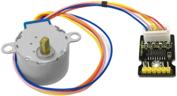

---

**1. Overview**

In this project, we will control stepper motor(28BYJ-48) with ULN2003 driver and the ESP32 main board. They are used in a variety of applications, such as 3D printers, CNC machines, robots, and common household appliances. Their precise control allows for complex movements, making them ideal for projects requiring high positioning accuracy.

The 28BYJ-48 stepper motor here will rotate in different speed and direction. By understanding how to control the stepper motors, you will smoothly integrate them into your own electronics projects.

---

**2. Component Knowledge** 

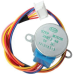

**Stepper Motor**

It is a motor controlled by a series of electromagnetic coils. It can rotate by the exact number of degrees (or steps) needed, allowing you to move it to a precise position and keep it there. It does this by supplying power to the coil inside the motor in a very short time, but you must always supply power to the motor to keep it in the position you want. There are two basic types of stepping motors, namely uni-polar stepping motor and bipolar stepping motor. In this project, we use a 28-BYJ48 uni-polar stepper motor.


**28BYJ-48 Working Principle**

The stepper motor is mainly composed of a stator and a rotor. The stator is fixed. As shown in the figure below, the part of the coil group A, B, C, and D will generate a magnetic field when the coil group is energized. The rotor is the rotating part. As follows, the middle part of the stator, two poles are permanent magnets.

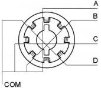

Single -phase four beat: At the beginning, the coils of group A are turned on, and the poles of the rotor point at A coil. Next, the group A coil are disconnected, and the group B coils are turned on. The rotor will turn clockwise to the group B. Then, group B is disconnected, group C is turned on, and the rotor is turned to group C. After that, group C is disconnected, and group D is turned on, and the rotor is turned to group D. Finally, group D is disconnected, group A is turned on, and the rotor is turned to group A coils. Therefore, rotor turns 180° and continuously rotates B-C-D-A, which means it runs a circle (eight phase). As shown below, he rotation principle of stepper motor is A - B - C - D - A...

You make order inverse(D - C - B - A - D .....) if you want to make stepper motor rotate anticlockwise.

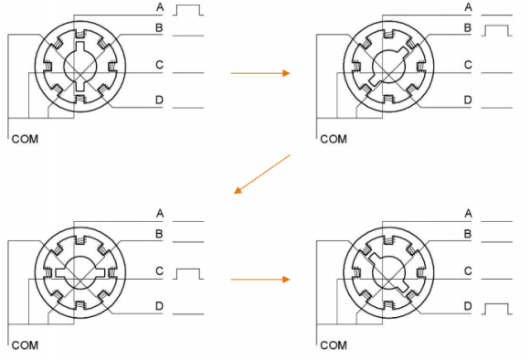

Half-phase and eight beat: 8 beat adopts single and dual beat way，A - AB - B - BC - C - CD - D - DA - A ......，rotor will rotate half phase in this order. For example, when A coil is electrified, rotor faces to A coil, then A and B coil are connected, on this condition, the strongest magnetic field produced lies in the central part of AB coil, which means rotating half-phase clockwise.

**Parameters**

The rotor rotates one circle when the stepper motor we provide rotates 32 phases and with the output shaft driven by 1:64 reduction geared set. Therefore the rotation (a circle) of output shaft requires  32 * 64 = 2048 phases.

The step angle of 4-beat mode of 5V and 4-phase stepper motor is 11.25. And the step angle of 8-beat mode is 5.625, the reduction ratio is 1:64.

**Drive Board for ULN2003 Stepper Motor** 

Drive Board for ULN2003 Stepper Motor converts the weak signal into a stronger control signal to drive the stepper motor. 

The following schematic diagram shows how to use the ULN2003 stepper motor driver board interface to connect a unipolar stepper motor to the pins of the ESP32, and shows how to use four TIP120 interfaces.

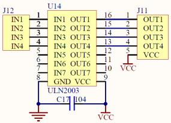

---

**3. Components**

|  |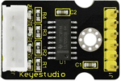|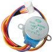||
| ------------------------ | ------------------------ | ---------------------------- |---------------------------- |
|ESP32 main board x1 | ULN2003 stepper motor drive board x1 | stepper motor x1 |battery holder x1|
||||  |
|M-F DuPont wires|AA battery (**self-provided**) x6| Micro USB cable x1 |  |

---

**4. Wiring Diagram**

**Schematic diagram:**

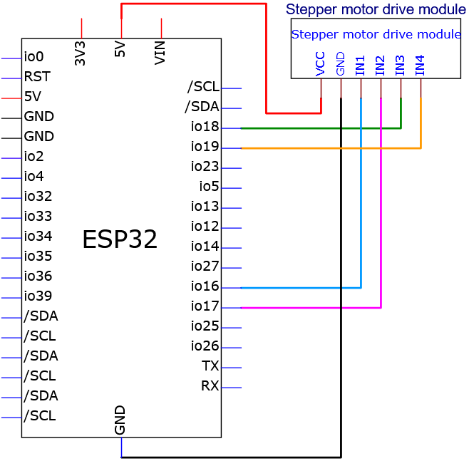

**Wiring diagram:**

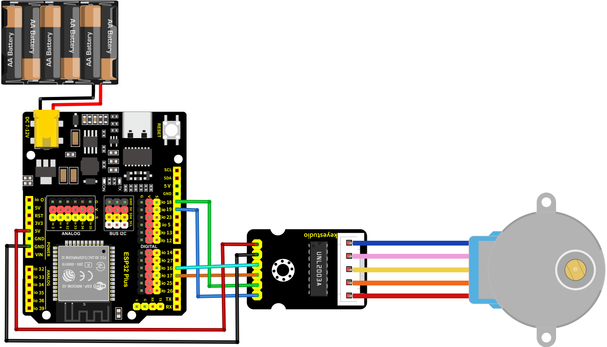

---

**5. Test Code** 

Open “Thonny IDE” and choose “This Computer” → “D:” → “Codes” → “MicroPython_Code”. Open the file “2-3-13_Stepper_Motor.py” or copy and paste the following code into “Thonny IDE”.

```python
'''
 * Filename    : Stepper_Motor
 * Thonny      : Thonny 4.1.7
 * Auther      : http//www.keyestudio.com
'''
from machine import Pin
import time 
 
# initialize pins
in1 = Pin(16, Pin.OUT)
in2 = Pin(17, Pin.OUT)
in3 = Pin(18, Pin.OUT)
in4 = Pin(19, Pin.OUT)
 
# delay
delay = 1
 
# The number of steps required for the motor to rotate one turn, (about 360°), may vary slightly.
ROUND_VALUE = 509
 
# 4-phase 8-beat stepper motor sequence value: A-AB-B-BC-C-CD-D-DA-A.
STEP_VALUE = [
    [1, 0, 0, 0],
    [1, 1, 0, 0],
    [0, 1, 0, 0],
    [0, 1, 1, 0],
    [0, 0, 1, 0],
    [0, 0, 1, 1],
    [0, 0, 0, 1],
    [1, 0, 0, 1],
]
 
# pins output low
def reset():
    in1(0)
    in2(0)
    in3(0)
    in4(0)
 
# If count is a positive integer, it rotates clockwise;
# if count is a negative integer, it rotates counterclockwise.
def step_run(count):
    direction = 1     # rotate clockwise
    if count < 0:
        direction = -1  # rotate counterclockwise
        count = -count
    for x in range(count):
        for bit in STEP_VALUE[::direction]:
            in1(bit[0])
            in2(bit[1])
            in3(bit[2])
            in4(bit[3])
            time.sleep_ms(delay)
    reset()
 
# If a is a positive integer, it rotates clockwise;
# if a is a negative integer, it rotates counterclockwise.
def step_angle(a):
    step_run(int(ROUND_VALUE * a / 360))
 
# Loop: turn clockwise once, then counterclockwise once.
while True:
    step_run(509)
    step_run(-509)
    step_angle(360)
    step_angle(-360)
```
---

**6. Test Result**

Connect the ESP32 main board to your computer via Micro USB cable. Click  to run the code. After uploading the code, the D1, D2, D3 and D4 leds on the ULN2003 drive module are turned on, and the stepper motor rotates in two directions and maintains this state cycle.

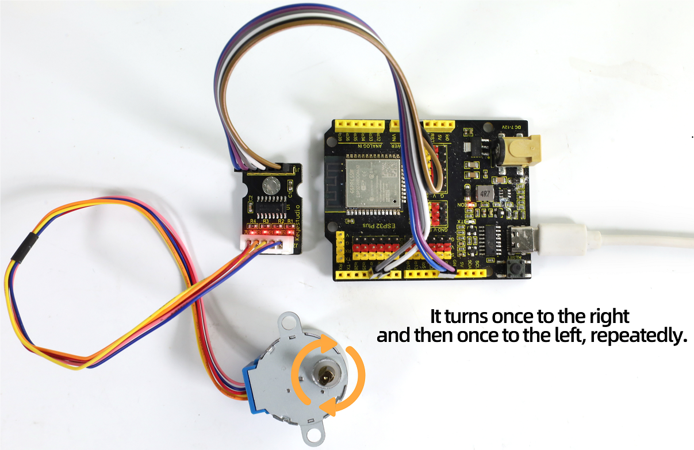

Click  to exit the execution.

---

**7. Code Explanation**

1\. Initialize the control pins of the stepper motor drive board.

```python
in1 = Pin(16, Pin.OUT)
in2 = Pin(17, Pin.OUT)
in3 = Pin(18, Pin.OUT)
in4 = Pin(19, Pin.OUT)
```
2\. The number of steps required for the motor to rotate one turn (about 360°). There will be slight deviations.

```python
ROUND_VALUE = 509
```
3\. Four-phase eight-beat stepper motor sequence value: A-AB-B-BC-C-CD-D-DA-A.

```python
STEP_VALUE = [
    [1, 0, 0, 0],
    [1, 1, 0, 0],
    [0, 1, 0, 0],
    [0, 1, 1, 0],
    [0, 0, 1, 0],
    [0, 0, 1, 1],
    [0, 0, 0, 1],
    [1, 0, 0, 1],
]
```
4\. Pin output level is low.

```python
def reset():
    in1(0)
    in2(0)
    in3(0)
    in4(0)
```
5\. If count is a positive integer, it rotates clockwise, and if count is a negative integer, it rotates counterclockwise.

```python
def step_run(count):
    direction = 1     # rotate clockwise
    if count < 0:
        direction = -1  # rotate counterclockwise
        count = -count
    for x in range(count):
        for bit in STEP_VALUE[::direction]:
            in1(bit[0])
            in2(bit[1])
            in3(bit[2])
            in4(bit[3])
            time.sleep_ms(delay)
    reset()
```
6\. If a is a positive integer, it rotates clockwise, and if a is a negative integer, it rotates counterclockwise.

```python
def step_angle(a):
    step_run(int(ROUND_VALUE * a / 360))
```
7\. Loop: clockwise rotate once, then counter-clockwise rotate once.

```python
while True:
    step_run(509)
    step_run(-509)
    step_angle(360)
    step_angle(-360)
```
---

### 2-3-14 Button

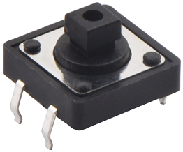

---

**1. Overview**

Button controls the ON/OFF state of a circuit, such as the start-up of electrical devices, light colors and sound volume by control signals and power.

---

**2. Component Knowledge**

If a **button** is connect to a circuit, the circuit is opened when the button is not pressed. Press the button to close the circuit. Before pressing it, current in the circuit is blocked on one side. It is the metal sheet in the button that becomes a bridge for the current to flow over the circuit. 


Button structure: 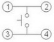

- Not pressed: 1 and 2 are connected, 3 and 4 are connected, yet 1/2 and 3/4 sides are disconnected.
- Pressed: all are connected.

Button circuit symbol: 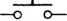

Button changes the high/low power levels. Here are three commonly seen circuits:

- Circuit with pull-up resistor
- Circuit with pull-down resistor
- Internal pull-up circuit

**A. Circuit with pull-up resistor**

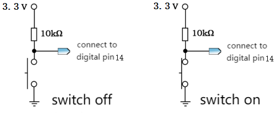

If the button is released, digital pin 14 will be connected to 5V power through resistor to output high, so digitalRead(14) function returns 1.

If the button is pressed, digital pin 14 is connected to GND to output low, so digitalRead(14) function returns 0. 

Therefore, the 10 KΩ resistor in the circuit is called pull-up resistor.

**B. Circuit with pull-down resistor**

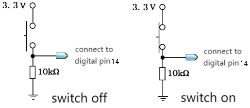

If the button is released, digital pin 14 will be connected to GND to output low, so digitalRead(14) function returns 0.

If the button is pressed, digital pin 14 is connected to 5V power through resistor to output low, so digitalRead(14) function returns 1. 

Therefore, the 10 KΩ resistor in the circuit is called pull-down resistor.

If the digital pin is set to INPUT mode, the following wiring methods are both wrong:

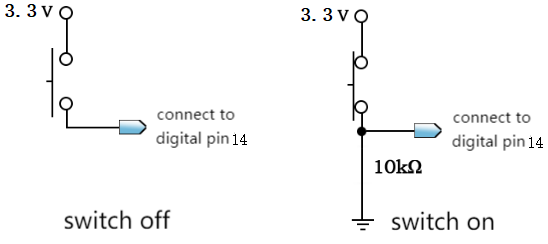

When the button is not pressed, in the left wiring, the digital pin 14 connects to neither power nor ground. This is called suspension, and digitalRead() returns an unsure value, including HIGH or LOW.

When the button is pressed, in the right wiring, the power is directly connect to ground, forming a short sircuit.

Therefore, at INPUT mode, a pull-up/down resistor is essential in a circuit, usually a 10 KΩ resistor. 

**C. Internal pull-up circuit**  

Except those, controller integrates a pull-up resistor of 20KΩ. We can set mode of pinMode() function to INPUT_PULLUP to enable the internal pull up resistor.

After that, an external resistor can be omitted. Here is the internal pull-up circuit diagram:

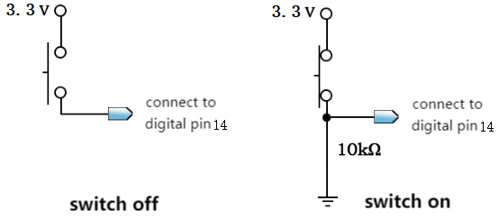

When the button is not pressed, digitalRead() returns 1. Otherwise it returns 0. In this condition, one terminal of the button is connected to the digital pin, while the other is linked to GND.

**⚠️In this project, we adopt the internal pull-up circuit.**

---

**3. Components**

|  |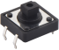||
| ------------------------ | ------------------------ | ---------------------------- |
| ESP32 main board x1 | button x1 | 10kΩ resistor x1 |
||||
|breadboard x1 |jumper wires | Micro USB cable x1 |

---

**4. Wiring Diagram** 

**Schematic diagram:**

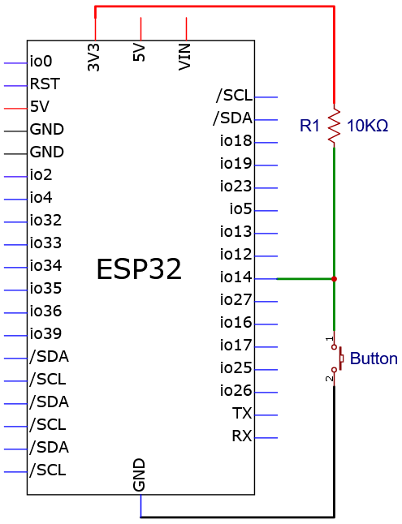

**Wiring diagram:**

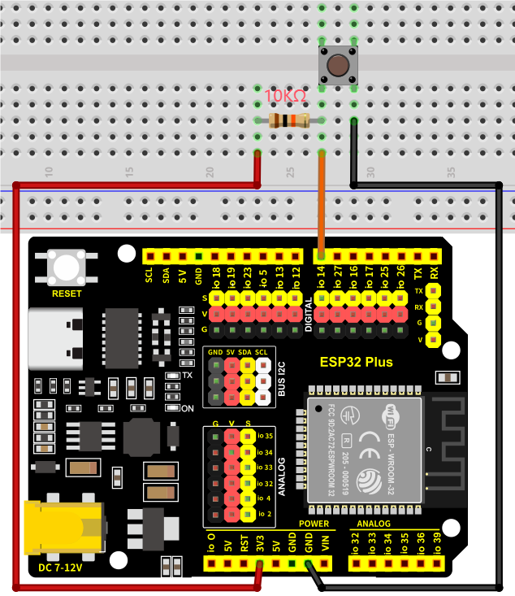

---

**5. Test Code**

Open “Thonny IDE” and choose “This Computer” → “D:” → “Codes” → “MicroPython_Code”. Open the file “2-3-14_Button.py” or copy and paste the following code into “Thonny IDE”.

```python
'''
 * Filename    : Button
 * Thonny      : Thonny 4.1.7
 * Auther      : http//www.keyestudio.com
'''
from machine import Pin
import time 

button = Pin(14, Pin.IN, Pin.PULL_UP) # set the button pin to input and pull-up mode

while True: 
    if button.value() == 0: # press the button, print related messages
        print("0  You pressed the button!")  
    else:  # release the button, print related messages
        print("1  You loosen the button!")
    time.sleep(0.1)  # delay 0.1s
```
---

**6. Test Result**

Connect the ESP32 main board to your computer via Micro USB cable. Click  to run the code. After uploading the code, press the button, value = 0, and “Shell” prints “**0  You pressed the button!**”; Release the button, value = 1, and “Shell” prints “**1  You loosen the button!**”.

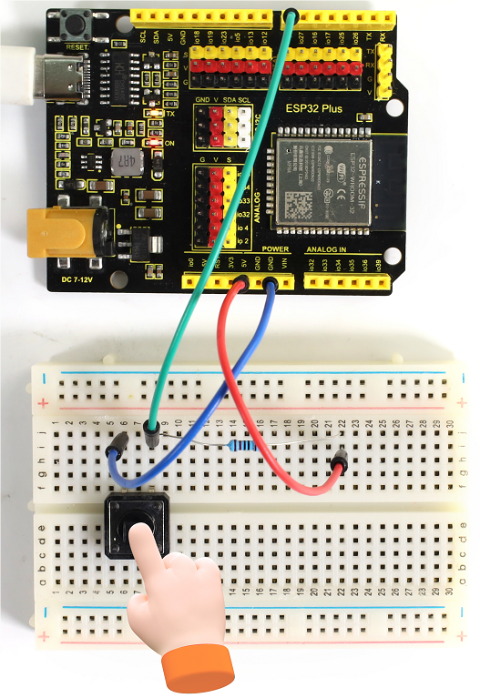

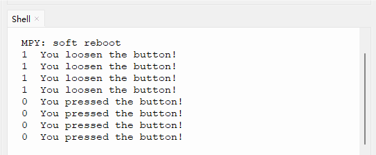

Click  to exit the execution.

---

**7. Code Explanation**

1\. Set the control pin and input mode of the button.

```python
button = Pin(14, Pin.IN, Pin.PULL_UP)
```
- `Serial.begin(speed)`: Set rate (in bits per second (baud)) for serial data transmission.
- `speed`: In bits per second (baud rate). Allowed data type: long.

2\. In `while True:` , The status of the button will be read and stored in `button.value()`. `print()` shows the value of the button.value().

```python
while True: 
    if button.value() == 0:
        print("0  You pressed the button!") 
    else:
        print("1  You loosen the button!")
    time.sleep(0.1) 
```
---

### 2-3-15 Tilt Switch

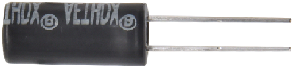

---

**1. Overview**

There is a ball inside the tilt switch. It can output different power levels according to its tilt states, and is widely used to detect tilt and make alarms.

---

**2. Component Knowledge**

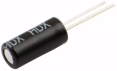

Tilt switch is also called digital switch. Inside is a metal ball that can roll. The principle of rolling the metal ball to contact with the conductive plate at the bottom, which is used to control the on and off of the circuit. 

Here is the internal structure of a tilt switch: 

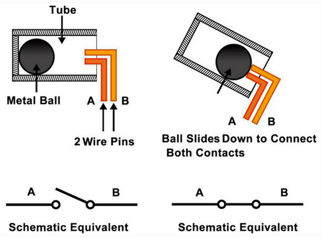

- You can learn more about tilt switch from Wiki: [Tilt Switch Datasheet](https://www.tme.com/Document/f1e6cedd8cb7feeb250b353b6213ec6c/SW-520D.pdf)

---

**3. Components**

|  |||
| ------------------------ | ------------------------ | ---------------------------- |
| ESP32 main board x1 | tilt switch  x1 | 10kΩ resistor x1 |
||||
|breadboard x1 |jumper wires | Micro USB cable x1 |
---

**4. Wiring Diagram**

**Schematic diagram:**

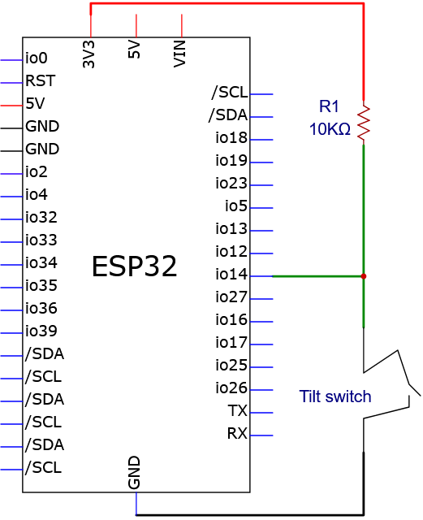

**Wiring diagram:**

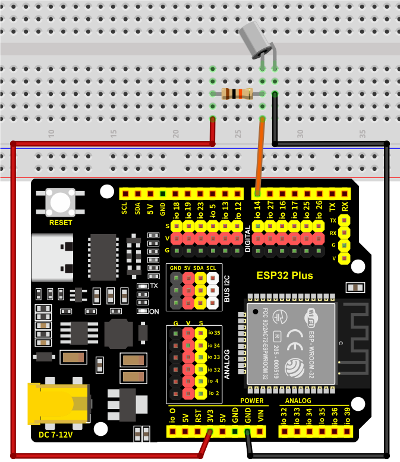

---

**5. Test Code** 

Open “Thonny IDE” and choose “This Computer” → “D:” → “Codes” → “MicroPython_Code”. Open the file “2-3-15_Tilt_Switch.py” or copy and paste the following code into “Thonny IDE”.

```python
'''
 * Filename    : Tilt_Switch
 * Thonny      : Thonny 4.1.7
 * Auther      : http//www.keyestudio.com
'''
from machine import Pin
import time

TiltSensor = Pin(14, Pin.IN) # set tilt switch pin to input

while True:
    value = TiltSensor.value()  # assign the value read by the tilt switch to variable value
    print(value, end = " ")  # print the value read by the tilt switch
    if  value== 1: # if tilt switch tilts, the serial monitor shows relevant messages
        print("The switch is turned on")
    else:  # if tilt switch does not tilt, the serial monitor shows relevant messages
        print("The switch is turned off")
    time.sleep(0.1)
```
---

**6. Test Result**

Connect the ESP32 main board to your computer via Micro USB cable. Click  to run the code. After uploading the code, when the module tilts to a certain angle, value = 1, and “Shell” shows “**1  The switch is turned on**”. Or else, value = 0 and “Shell” displays “**0  The switch is turned off**”.

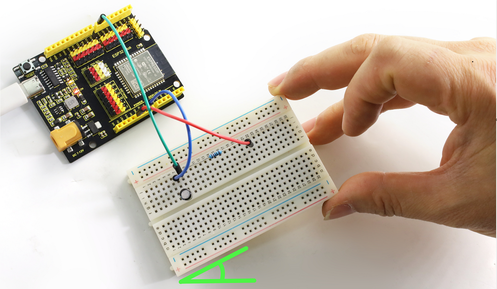

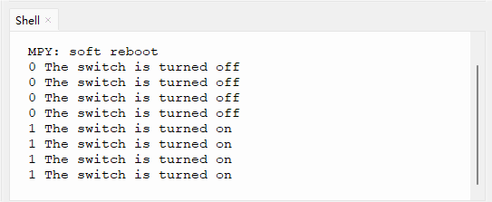

Click  to exit the execution.

---

**7. Code Explanation**

Please refer to [2-3-14](https://docs.keyestudio.com/projects/KS5020/en/latest/docs/2.%20MicroPython_Tutorial.html#button) Code Explanation.

---

### 2-3-16 Human Nearby or Not

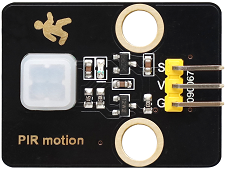

---

**1. Overview**

In this project, we use a PIR motion sensor to detect the surrounding movement. This sensor mainly adopts an RE200B-P sensing component, which detects infrared ray from human or animals. The detection range will be much wider with Fresnel lens. 

We display the test result on the serial monitor by reading the power level of terminal S.

---

**2. Parameters**

- Operating voltage: DC 3.3V~5V 
- Operating current: 3.6mA
- Maximum power: 0.018W
- Static current: <50 uA
- Output signal: digital signal
- Field of view: Y = 90°, X = 110° (theoretical values)
- Maximum detection distance: ≤5 meters

- Operating temperature: -10°C ~ +50°C

- Dimensions: 32mm x 23.8mm x 7.4mm

---

**3. Schematic Diagram**

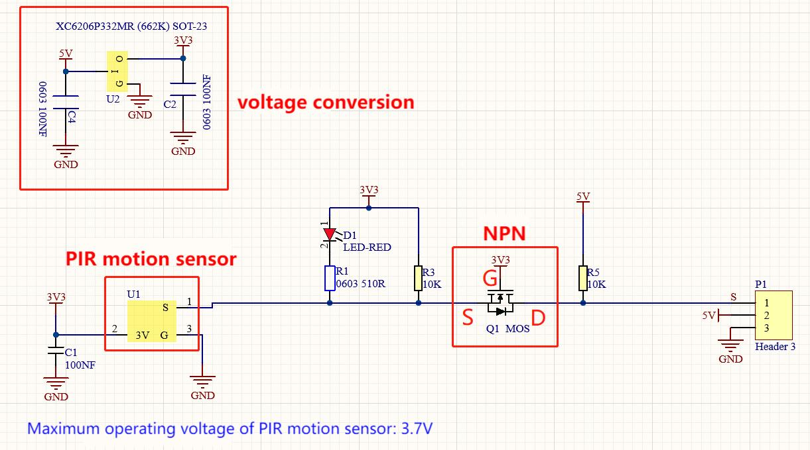

First, the 5V input voltage is converted into a 3.3V input voltage, as the sensor cannot be directly connect to 5V. With this voltage conversion, both 3.3V and 5V input are compatible with this sensor.

When it detects no infrared signals, sensor pin 1 outputs low. There will be a voltage difference between the two ends of LED, so current passes to light LED up; MOS tube Q1 is conducted (Q1 is NPN MOS tube in the model of 2N7002. Pin 1 outputs low, so Q1 source electrode Vs = 0, while Q1 grid electrode Vg = 3.3V, so voltage difference Vgs = 3.3V is greater than Q1 threshold voltage 2.5V. Q1 is conducted). Signal terminal S detects low.

When an infrared signal is detected, pin 1 outputs high and the LED goes off. MOS tube Q1 is not conducted, so the signal terminal S detects a high level pulled up by the 10K resistor. 

---

**4. Components**

|  |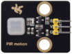|||
| ------------------------ | ------------------------ | ---------------------------- |---------------------------- |
| ESP32 main board x1 | PIR motion sensor x1 |M-F DuPont wires | Micro USB cable x1 |

---

**5. Wiring Diagram**

**Schematic diagram:**

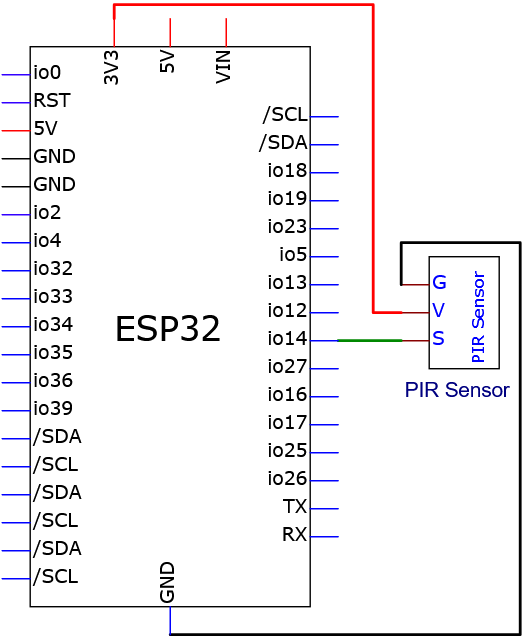

**Wiring diagram:**

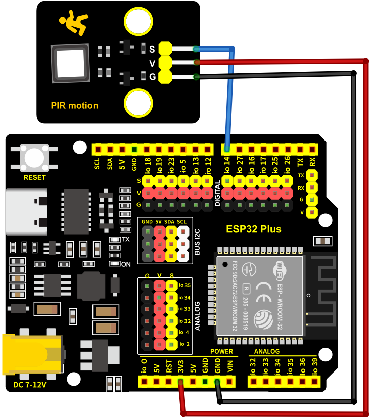

---

**6. Test Code**

Open “Thonny IDE” and choose “This Computer” → “D:” → “Codes” → “MicroPython_Code”. Open the file “2-3-16_Human_Nearby_or_Not.py” or copy and paste the following code into “Thonny IDE”.

```python
'''
 * Filename    : Human Nearby or Not
 * Thonny      : Thonny 4.1.7
 * Auther      : http//www.keyestudio.com
'''
from machine import Pin
import time

PIR = Pin(14, Pin.IN)  # set PIR motion sensor pin to input
 
while True:
    value = PIR.value()  # aggign the value read by PIR motion sensor to the variable value
    print(value, end = " ")  # show the value read by the PIR motion sensor
    if value == 1:  # if PIR motion sensor detects motion, the serial monitor prints relevant messages
        print("Some body is in this area!")
    else:  # if PIR motion sensor does not detect motion, the serial monitor prints relevant messages
        print("No one!")
    time.sleep(0.1)
```
---

**7. Test Result**

Connect the ESP32 main board to your computer via Micro USB cable. Click  to run the code. After uploading the code, if a human motion is detected by the sensor, value = 1 and LED goes off; “Shell” shows “**1  Some body is in this area!**”. If there is no human nearby, value = 0 and LED lights up; “Shell” prints “**0  No one!**”.

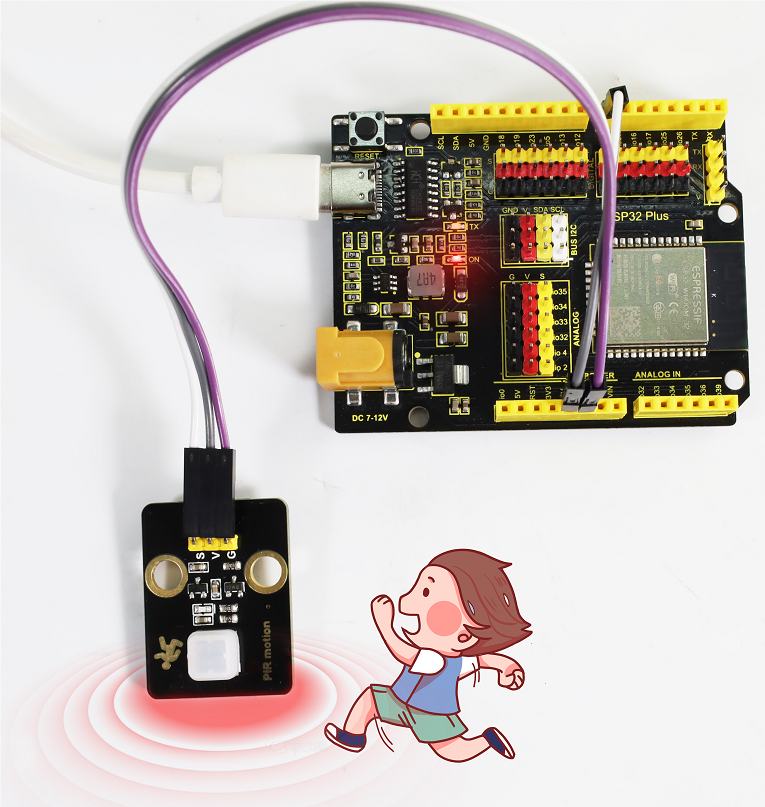

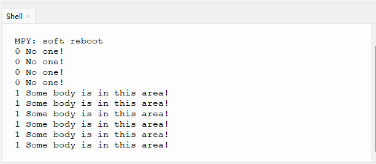

Click  to exit the execution.

---

**8. Code Explanation**

Please refer to [2-3-14](https://docs.keyestudio.com/projects/KS5020/en/latest/docs/2.%20MicroPython_Tutorial.html#button) Code Explanation.

---

### 2-3-17 Potentiometer

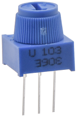

---

**1. Overview**

Previous sensors are digital ones. The middle value of, for example, 0~3.3V, cannot be read by digital IO ports so they only output high(3.3V) and low(0). Potentiometer is an analog sensor.  Yet, analog sensors are able to read them to output analog values within a range.

Herein, we read the ADC, DAC and voltage values in an analog port with the potentiometer.

---

**2. Component Knowledge**

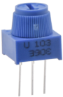

**Potentiometer Working Principle**

The brush slides on the resistor and obtains the output voltage in a certain relationship with the input voltage in the circuit. 

The potentiometer uses a 10K adjustable resistor. By rotating the handle, we can change the resistance, so the signal S detects a voltage change (0~3.3V). This change is a continuously analog value within 0~3.3V. However, we must first perform ADC acquisition on this analog value for measurement (it converts Analog to Digital, short for ADC). The board has integrated ADC acquisition so can be used directly.

The board default resolution is 12 bits, which means the ADC bits are also 12. An n-bit ADC means that the ADC has a total of 2^n scales. 12-bit ADC outputs a total of 4096 digital values from 0 to 4095, that is, 2^12 scales, with each scale 3.3V/4096 ≈ 0.00080566 V. This is also called resolution.

**ADC**

An ADC is an electronic integrated circuit used to convert analog signals such as voltages to digital or binary form consisting of 1s and 0s. The range of our ADC on the board is 10 bits (The bits of an ADC represent the number of bits of binary used to convert an analog value to a digital one), whose range of numbers that can be stored is 0 ~ 2^12 (i.e. 0 ~ 4095). For instance, reference voltage is 3.3V, so the minimum resolution is 3.3V/4096. 

The rage of analog values correspond to ADC values. So the more bits the ADC has, the denser the partition of analog will be and the greater the precision of the resulting conversion will be.

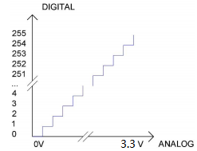

Ordinate number 0: analog within 0V ~ 3.3/4096 V (abscissa);

Ordinate number 1: analog within 3.3/4096 V ~ 2 * 3.3/4096 V (abscissa);

......

The following analog will be divided accordingly. The conversion formula is as follows:

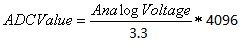

**DAC**

The reversing of this process requires a DAC, Digital-to-Analog Converter. The digital I/O ports can output high and low level (0 or 1), rather than intermediate voltage values. This is where a DAC works. 

The board boasts DAC with 8-bit accuracy, which can divide VCC (here is 3.3V) into 2^8=256 parts. For example, when the digital value is 1, the output voltage value is 3.3V/256 * 1 = 0.012890625 V; when it is 128, the output voltage value is 3.3V/256 * 128 = 1.65 V. The higher the accuracy of DAC is, the higher the that of output voltage will be.

The conversion formula is as follows: 

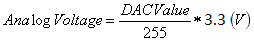


For more details, please visit: [wikipedia - potentiometer](https://en.wikipedia.org/wiki/Potentiometer)

---

**3. Components**

|  |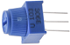||
| ------------------------ | ------------------------ | ---------------------------- |
| ESP32 main board x1 | potentiometer x1 |breadboard x1 |
|||  |
|jumper wires | Micro USB cable x1 |  |

---

**4. Wiring Diagram**

**Schematic diagram:**

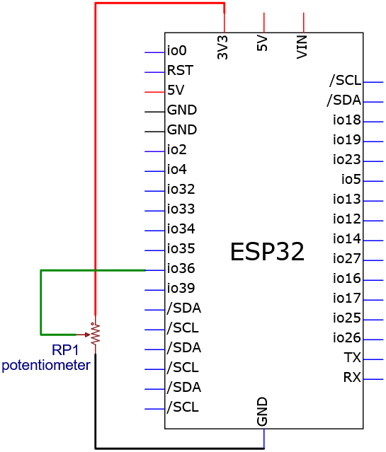

**Wiring diagram:**

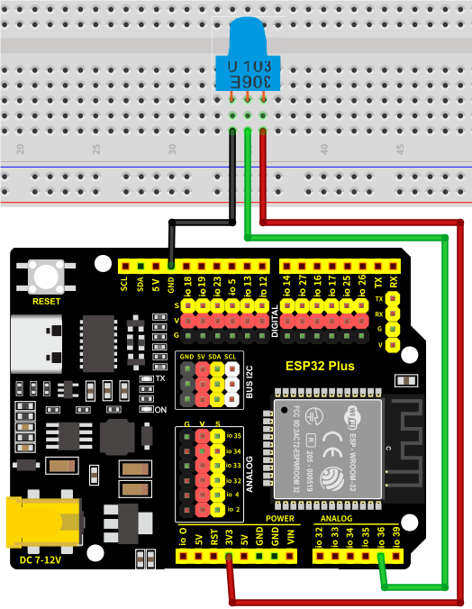

---

**5. Test Code** 

Open “Thonny IDE” and choose “This Computer” → “D:” → “Codes” → “MicroPython_Code”. Open the file “2-3-17_Potentiometer.py” or copy and paste the following code into “Thonny IDE”.

```python
'''
 * Filename    : Potentiometer
 * Thonny      : Thonny 4.1.7
 * Auther      : http//www.keyestudio.com
'''
# import pin, ADC and DAC module
from machine import ADC,Pin,DAC 
import time

# Enable and configure ADC with a range of 0-3.3V
adc=ADC(Pin(36))
adc.atten(ADC.ATTN_11DB)
adc.width(ADC.WIDTH_12BIT)

# Read the ADC value every 0.1 seconds, and convert the ADC value to the DAC value to output;
# show these values on “Shell”
try:
    while True:
        adcVal=adc.read()
        dacVal=adcVal//16
        voltage = adcVal / 4095.0 * 3.3
        print("ADC Val:",adcVal,"DACVal:",dacVal,"Voltage:",voltage,"V")
        time.sleep(0.1)
except:
    pass
```
---

**6. Test Result**

Connect the ESP32 main board to your computer via Micro USB cable. Click  to run the code. After uploading the code, “Shell” prints the ADC Val, DAC Val and Voltage of the potentiometer. Rotate the potentiometer and these values change.

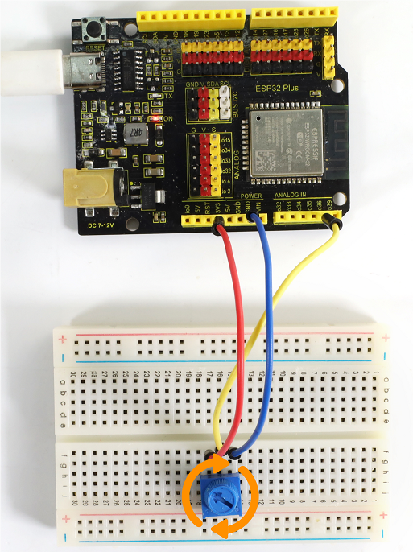

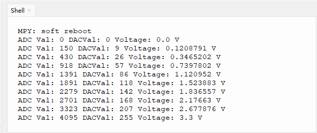

Click  to exit the execution.

---

**7. Code Explanation**

1\. Import Pin, ADC and DAC modules.

```python
from machine import ADC,Pin,DAC 
import time
```

2\. Define the pin connection, enable and configure the ADC with a range of 0-3.3V

```python
adc=ADC(Pin(36))
adc.atten(ADC.ATTN_11DB)
adc.width(ADC.WIDTH_12BIT)
```

3\. Read ADC values every 0.1 seconds, and convert ADC values to DAC values and voltage values for output; And print them on “Shell”.

```python
try:
    while True:
        adcVal=adc.read()
        dacVal=adcVal//16
        voltage = adcVal / 4095.0 * 3.3
        print("ADC Val:",adcVal,"DACVal:",dacVal,"Voltage:",voltage,"V")
        time.sleep(0.1)
except:
    pass
```

4\. ADC class

Before each time you use the ADC module, add  “from machine import ADC” at the top of the python file.

`machine.ADC(pin)`: Create an ADC object associated with a given pin.

- `pin`: Available pins are Pin(36), Pin(39), Pin(34), Pin(35), Pin(32), Pin(33).

`ADC.read()`: Read the ADC and return the value.

`ADC.atten(db)`: Set the attenuation ratio (i.e. full scale voltage, such as 3.3V for 11db full scale voltage).

- `db`: attenuation ratio.
- `ADC.ATTEN_0DB` - 1.2V full range.
- `ADC.ATTEN_2.5_DB` - 1.5V full range.
- `ADC.ATTEN_6DB`  - 2.0V full range.
- `ADC.ATTEIN_11DB` - 3.3V full range.

`ADC.width(bit)`: Set the data width.

- `bit`: Number of bits of data.
- `ADC.WIDTH_9BIT` — 9 Data width.
- `ADC.WIDTH_10BIT` — 10 Data width.
- `ADC.WIDTH_11BIT` — 11 Data width.
- `ADC.WIDTH_12BIT` — 12 Data width.

5\. DAC class

Before each time you use the DAC module, add “from machine import DAC” at the top of the python file.

`machine.DAC(pin)`: Create a DAC object associated with a given pin.

- `pin`: Available pins are Pin(25) and Pin(26)

`DAC.write(value)`: The output voltage.

- `value`: Data value, range: 0-255, corresponding output voltage 0-3.3V.

---

### 2-3-18 Light Intensity Detection

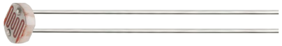

---

**1. Overview**

Sensors or components are ubiquitous in our daily life. For example, some public street lamps will automatically turn on at night and turn off during the day. Why? In fact, this make use of a photosensitive element that senses the intensity of ambient light. When the outdoor brightness decreases at night, the street lights will turn on automatically; In the daytime, the street lights will automatically turn off. In this Project, we use photoresistor to determine the ambient light intensity. 

---

**2. Component Knowledge**


Based on photoconductivity effect, **photoresistor** is a kind of resistor made of  semiconductor materials such as cadmium sulfide or cadmium selenide, whose resistance changes with the ambient light intensity. The brighter the light is, the lower the resistance will be. 

With the increase of light intensity, the resistance value decreases rapidly to as small as 1KΩ. Its dark resistance is generally up to 1.5MΩ in dark.


To increase sensitivity, the photoresistor's two electrodes are often shaped like a comb. It is non-polar. Here is its circuit symbol:


In the circuit, in order to read the change of photoresistor with light intensity, a resistor needs to be connected in series for voltage division. When the photoresistor resistance changes, the voltage at the analog input pin will change accordingly, and so does the read value. 

The following circuits are used to detect the change of its resistance value:

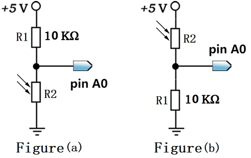

When the resistance changes due to a change in light intensity, the voltage between R2 and R1 will also change. Thus, the intensity of the light can be obtained by measuring this voltage.

- For more details, please visit: [Photoresistor - Wikipedia](https://en.wikipedia.org/wiki/Photoresistor)

***⚠️In this experiment, figure (a) is adopted. For figure (b), please have a try by yourself!***

---

**3. Components**

|  |||
| ------------------------ | ------------------------ | ---------------------------- |
| ESP32 main board x1 | photoresistor x1 |breadboard x1 |
|||  |
|jumper wires | Micro USB cable x1 | 10kΩ resistor x1 |

---

**4. Wiring Diagram**

**Schematic diagram:**

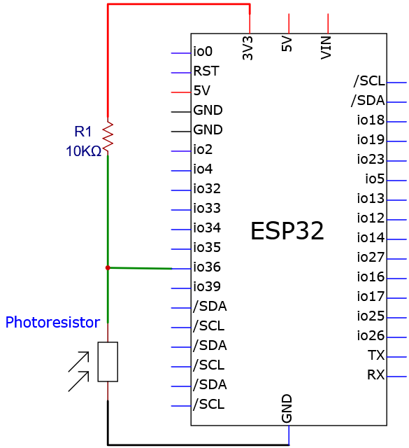

**Wiring diagram:**

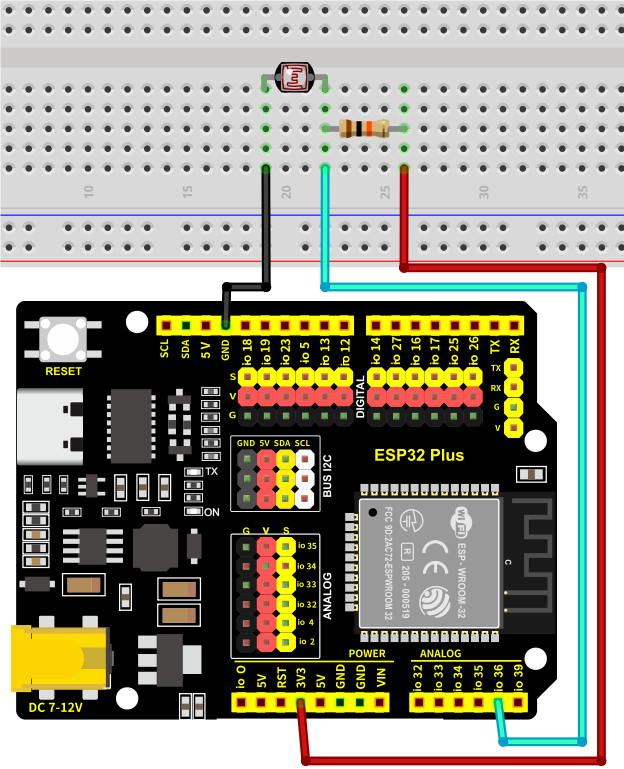

---

**5. Test Code** 

Open “Thonny IDE” and choose “This Computer” → “D:” → “Codes” → “MicroPython_Code”. Open the file “2-3-18_Light_Intensity_Detection.py” or copy and paste the following code into “Thonny IDE”.

```python
'''
 * Filename    : Light Intensity Detection
 * Thonny      : Thonny 4.1.7
 * Auther      : http//www.keyestudio.com
'''
# import pin, ADC and DAC module
from machine import ADC,Pin,DAC
import time
 
# Enable and configure ADC with a range of 0-3.3V
adc=ADC(Pin(36)) 
adc.atten(ADC.ATTN_11DB)
adc.width(ADC.WIDTH_12BIT)

# Read the ADC value every 0.1 seconds, and convert the ADC value to the DAC value to output;
# show these values on “Shell” 
try:
    while True:
        adcVal=adc.read()
        dacVal=adcVal//16
        voltage = adcVal / 4095.0 * 3.3
        print("ADC Val:",adcVal,"DACVal:",dacVal,"Voltage:",voltage,"V")
        time.sleep(0.1)
except:
    pass
```
---

**6. Test Result**

Connect the ESP32 main board to your computer via Micro USB cable. Click  to run the code. After uploading the code, “Shell” prints the ADC Val, DAC Val and Voltage of the photoresistor. Cover the module and these values change. The brighter the light is, the lower the values will be.

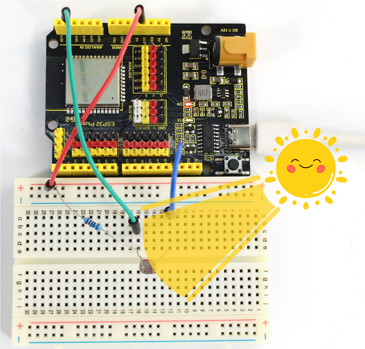


Click  to exit the execution.

---

**7. Code Explanation**

Please refer to [2-3-17](https://docs.keyestudio.com/projects/KS5020/en/latest/docs/2.%20MicroPython_Tutorial.html#potentiometer) Code Explanation. 

---

### 2-3-19 Flame Detection


---

**1. Overview**

Fire is a terrible disaster and fire alarm systems are very useful in houses、commercial buildings and factories. In this project, we will use the sensor to detect flame.

---

**2. Component Knowledge**


The flame emits a certain amount IR light that is invisible to the human eye, but the **flame sensor** can detect it and alert ESP32 board that a fire has been detected. It comes with a specially designed infrared receiver to detect the flame and convert the flame brightness into a fluctuating level signal. 

The short pin of the receiving triode is negative and the other long pin is positive. We should connect the short pin (negative) to 5V and the long pin (positive) to the analog pin, a resistor and GND.

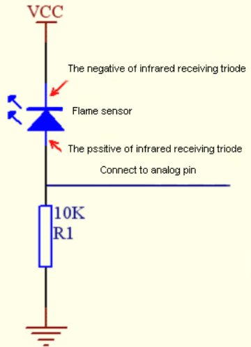

**⚠️ATTENTION:** Since it is vulnerable to radio frequency radiation and temperature changes, the flame sensor should be kept away from heat sources like radiators, heaters and air conditioners, as well as direct irradiation of sunlight, headlights and incandescent light.

---

**3. Components**

|  |||
| ------------------------ | ------------------------ | ---------------------------- |
| ESP32 main board x1 | flame sensor x1 |breadboard x1 |
|||  |
|jumper wires | Micro USB cable x1 | 10kΩ resistor x1 |

---

**4. Wiring Diagram**

**Schematic diagram:**

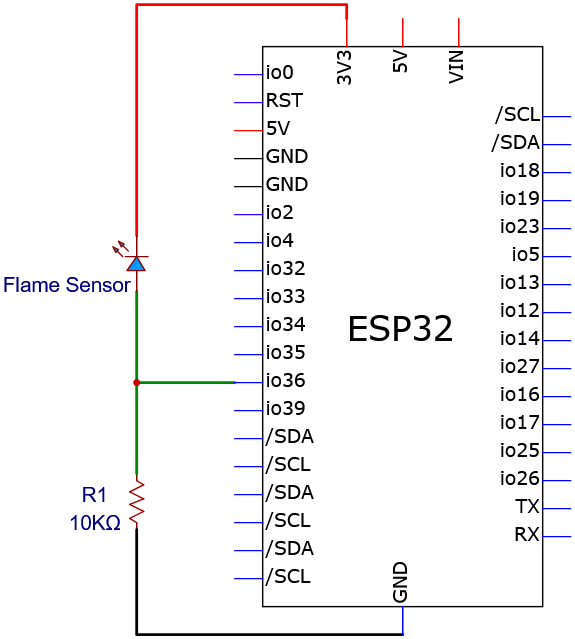

**Wiring diagram:**

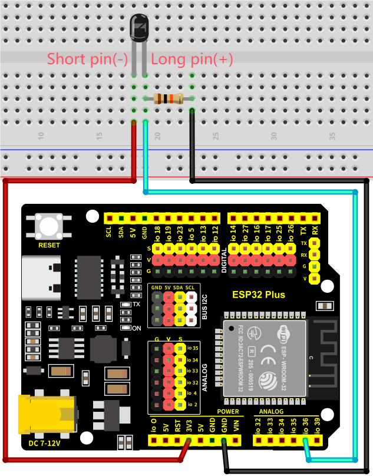

---

**5. Test Code** 

Open “Thonny IDE” and choose “This Computer” → “D:” → “Codes” → “MicroPython_Code”. Open the file “2-3-19_Flame_Detection.py” or copy and paste the following code into “Thonny IDE”.

```python
'''
 * Filename    : Flame_Detection
 * Thonny      : Thonny 4.1.7
 * Auther      : http//www.keyestudio.com
'''
# import pin, ADC and DAC module
from machine import ADC,Pin,DAC
import time

# Enable and configure ADC with a range of 0-3.3V
adc=ADC(Pin(36))
adc.atten(ADC.ATTN_11DB)
adc.width(ADC.WIDTH_12BIT)

# Read the ADC value every 0.1 seconds, and convert the ADC value to the DAC value and voltage to output;
# show these values on “Shell”
try:
    while True:
        adcVal=adc.read()
        dacVal=adcVal//16
        voltage = adcVal / 4095.0 * 3.3
        print("ADC Val:",adcVal,"DACVal:",dacVal,"Voltage:",voltage,"V")
        time.sleep(0.1)
except:
    pass
```
---

**6. Test Result**

Connect the ESP32 main board to your computer via Micro USB cable. Click  to run the code. After uploading the code, “Shell” prints the ADC Val, DAC Val and Voltage of the flame sensor. Approach the fire source to the sensor, and these values increase. 

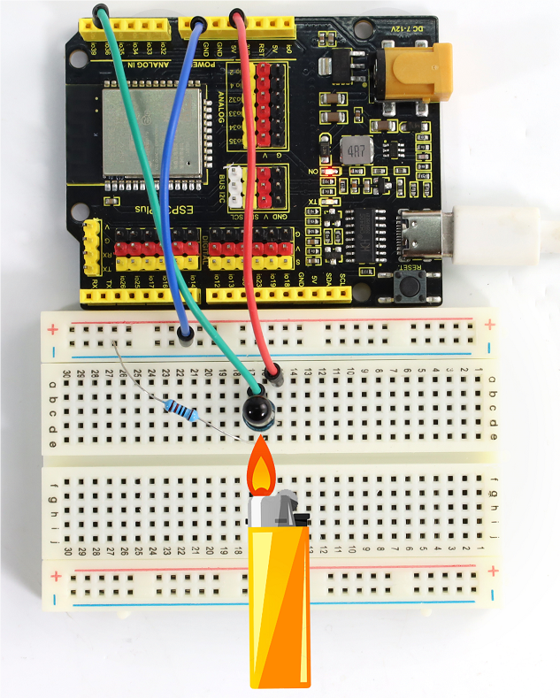

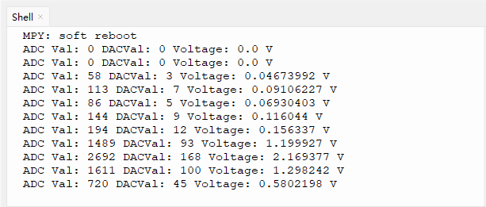

Click  to exit the execution.

---

**7. Code Explanation**

Please refer to [2-3-17](https://docs.keyestudio.com/projects/KS5020/en/latest/docs/2.%20MicroPython_Tutorial.html#potentiometer) Code Explanation. 

---

### 2-3-20 Thermistor


---

**1. Overview**

Similar to photoresistor, thermistor changes its resistance with temperature. 

We connect the signal end of thermistor to the analog port of the ESP32 board to read the corresponding analog value, voltage and temperature. We can use a formula to calculate the ambient temperature. 

It is widely used in thermometers, gardening and home alarm system.

---

**2. Component Knowledge**

A **thermistor** is a temperature-sensitive resistance. When thermistor senses a change in temperature, its resistance changes. So it can be used to detect temperature. Its circuit symbol is shown below.

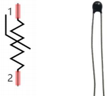

As the temperature increases, the resistance decreases, and the voltage at both ends of the 10KΩ resistor (R1) rises, which causes a voltage change of the signal GPIO36.

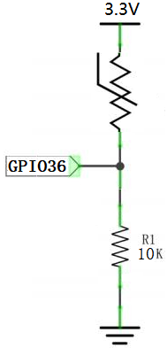

**NTC thermistor Temperature Calculation Formula: Rt = R * EXP ( B * (1/T1-1/T2) )**

T1 and T2 refer to kelvin degree. K degrees = 273.15(absolute temperature) + degrees Celsius.

**Rt** is the resistance value of thermistor when the ambient temperature is T1 (the current temperature).

**R** is the nominal resistance value of thermistor when the ambient temperature is room temperature T2 (25℃). Referring to the specification, NTC-MF52AT analog temperature sensor we used has a zero power resistance of 10KΩ ± 5% (i.e. R=10K) and T2=(273.15+25) at 25℃.

**B** is the material constant measured at 25 ° C. Reference to the specification shows that B is 3950±1%.

**EXP()** is e^(), e^n.

The relationship between temperature T1 and resistance Rt: T1=1/ (ln(Rt/R) /B+1/T2), where ln can be converted to log, that is, T1=1/ (log(Rt/R)/B +1/T2).

So the only thing we need to know is the value of Rt. 

Back to the schematic diagram above, set the voltage at both ends of thermistor to VRt, and the voltage at both ends of the fixed R1 resistor to VR. So from VR/VRt = R1/Rt: **Rt = R1 *(3.3-VR)/VR**. The VR we actually obtained is the converted analog value, which needs to be converted into a voltage value, i.e. VR = AnalogValue / 4096 * 3.3。

**⚠️ATTENTION**: The calculated temperature is Kelvin degrees, so Celsius temperature **t = T1-273.15**, and add an error correction of 0.5.

- For more details, please visit: [wikipedia - thermistor](https://en.wikipedia.org/wiki/Thermistor)

---

**3. Components**

|  |||
| ------------------------ | ------------------------ | ---------------------------- |
| ESP32 main board x1 | thermistor x1 |breadboard x1 |
|||  |
|jumper wires | Micro USB cable x1 | 10kΩ resistor x1 |

---

**4. Wiring Diagram**

**Schematic diagram:**

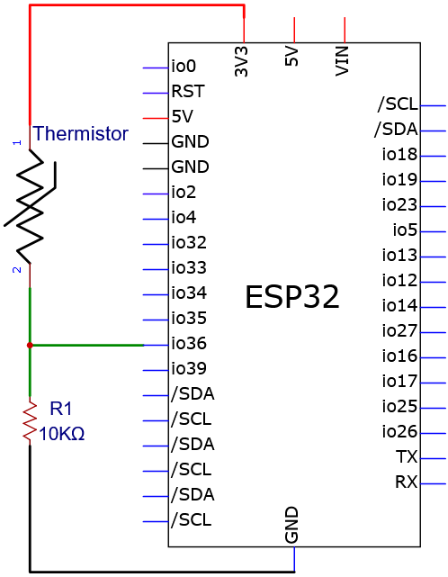

**Wiring diagram:**

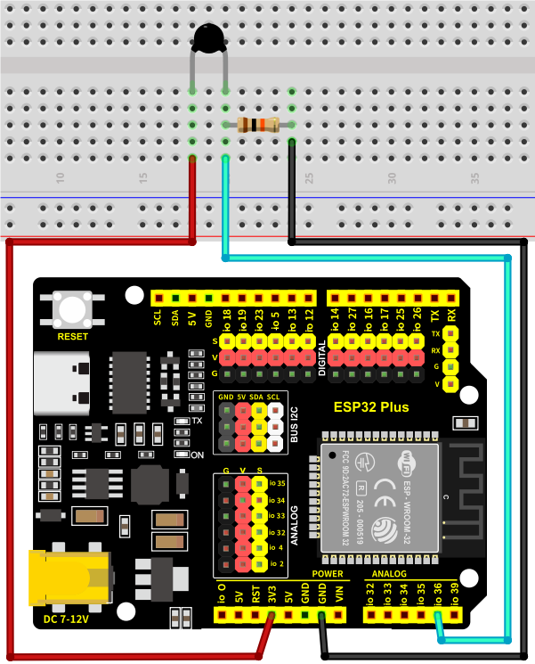

---

**5. Test Code** 

Open “Thonny IDE” and choose “This Computer” → “D:” → “Codes” → “MicroPython_Code”. Open the file “2-3-20_Thermistor.py” or copy and paste the following code into “Thonny IDE”.

```python
'''
 * Filename    : Thermistor
 * Thonny      : Thonny 4.1.7
 * Auther      : http//www.keyestudio.com
'''
from machine import Pin, ADC
import time
import math

# Enable and configure ADC with a range of 0-3.3V
adc=ADC(Pin(36))
adc.atten(ADC.ATTN_11DB)
adc.width(ADC.WIDTH_12BIT)

# Read the ADC value every 0.5 seconds, and convert the ADC value to voltage and temperature value to output;
# show these values on “Shell”
try: 
    while True:  
        adcValue = adc.read()  # read pin IO36 adc value
        voltage = adcValue / 4095 * 3.3  # convert to voltage value
        Rt =(3.3-voltage) / voltage * 10000  # calculate NTC thermistor risistance
        tempK = (1 / (1 / (273.15+25) + (math.log(Rt/10000)) / 3950))  # calculate the temperature in Fahrenheit
        tempC = (tempK - 273.15)+0.5  # calculate the temperature in Celsius
        print("ADC value:",adcValue,"  Voltage:",voltage,"V","  Temperature: ",tempC,"C");
        time.sleep(0.5)
except:
    pass
```
---

**6. Test Result**

Connect the ESP32 main board to your computer via Micro USB cable. Click  to run the code. After uploading the code, “Shell” prints the ambient analog value, voltage and temperature value of the thermistor.

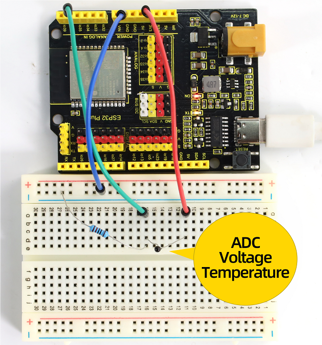

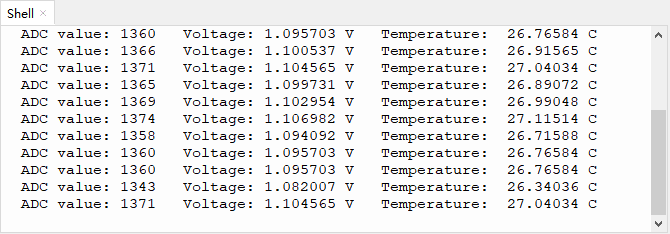

Click  to exit the execution.

---

**7. Code Explanation**

Read the ADC values at both ends of thermistor and convert them into voltage values and temperature values; Calculate the resistance value of thermistor at the current temperature, and calculate the temperature detected in the current environment. And print these values to “Shell”.

```python
try: 
    while True: 
        adcValue = adc.read()  # Read the adc value of the IO36 pin
        voltage = adcValue / 4095 * 3.3  # Convert to a voltage value
        Rt =(3.3-voltage) / voltage * 10000  # Calculate the NTC thermistor
        tempK = (1 / (1 / (273.15+25) + (math.log(Rt/10000)) / 3950))  # Calculate the temperature in Fahrenheit
        tempC = (tempK - 273.15)+0.5  # Calculated Celsius temperature
        print("ADC value:",adcValue,"  Voltage:",voltage,"V","  Temperature: ",tempC,"C");
        time.sleep(0.5)
except:
    pass
```
---

### 2-3-21 LM35 Temperature Sensor

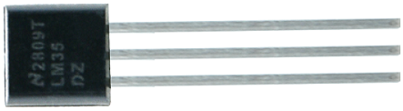

---

**1. Overview**

LM35 is a common used and easy-to-use temperature sensor. It doesn't require any other hardware and you only need an analog port. The difficulty lies in compiling the code and converting the analog values to Celsius temperature. 

In this project, we connect the signal end to the analog port of the board to read the corresponding analog value, voltage and temperature. With these values and a specific formula, the Celsius temperature can be calculated.

---

**2. Component Knowledge**


LM35 temperature sensor is a widely used temperature sensor with a variety of package types. 

On the ESP32, the temperature signal of the LM35 is converted into a voltage signal, and the voltage value is read by the ESP32 to obtain temperature information. The LM35 is a linear temperature sensor with an output voltage proportional to temperature, a sensitivity of 10mV/°C, and an operating voltage range of 4V to 30V.

At room temperature, it can achieve the accuracy of 1/4°C without additional calibration processing.

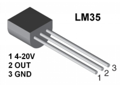

LM35 temperature sensor can produce different voltage according to different temperatures, when the temperature is 0 ℃, it output 0V; If increasing 1 ℃, the output voltage will increase 10mv. The output temperature is 0℃ to 100℃, the conversion formula is as follows:

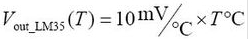

Parameters:

- Operating voltage: 4V~30V
- ‌ Output voltage: 10mV/°C
- ‌ Measuring range: 0°C to 100°C
- ‌ Accuracy: ±1/4°C at room temperature and ±3/4°C over the entire temperature range

---

**3. Components**

|  |||
| ------------------------ | ------------------------ | ---------------------------- |
| ESP32 main board x1 | LM35 x1  |breadboard x1 |
|||  |
|jumper wires | USB cable x1 |  |

---

**4. Wiring Diagram**

**Schematic diagram:**


**Wiring diagram:**


---

**5. Test Code** 

Open “Thonny IDE” and choose “This Computer” → “D:” → “Codes” → “MicroPython_Code”. Open the file “2-3-21_LM35.py” or copy and paste the following code into “Thonny IDE”.

```python
'''
 * Filename    : LM35
 * Thonny      : Thonny 4.1.7
 * Auther      : http//www.keyestudio.com
'''
from machine import ADC, Pin
import time

# Enable and configure ADC with a range of 0-5.0V
adc=ADC(Pin(36))
adc.atten(ADC.ATTN_11DB)
adc.width(ADC.WIDTH_12BIT)
conversion_factor = 5.0 / (4095) 

# Read the ADC value every 0.5 seconds, and convert the ADC value to temperature value to output;
# show these values on “Shell”
while True:
    adcVal=adc.read()
    reading = adcVal * conversion_factor 
    temperature = reading * 102.4 
    print(temperature)
    time.sleep(0.5)
```
---

**6. Test Result**

Connect the ESP32 main board to your computer via Micro USB cable. Click  to run the code. After uploading the code, “Shell” shows the ambient temperature detected by the LM35 temperature sensor.

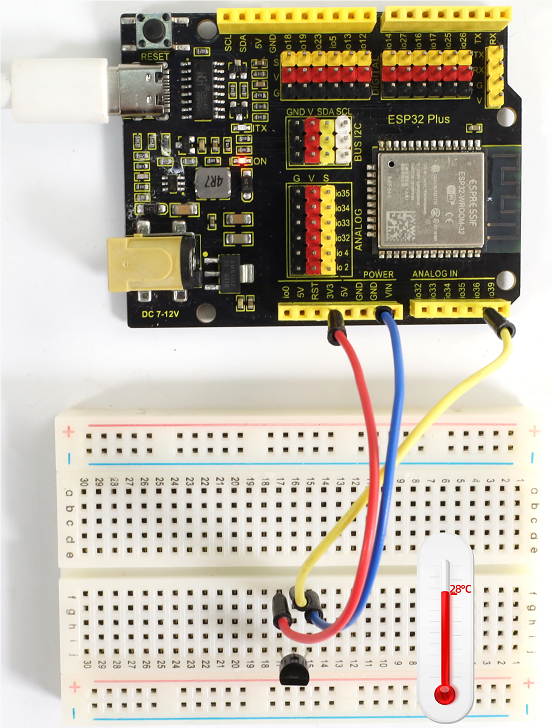

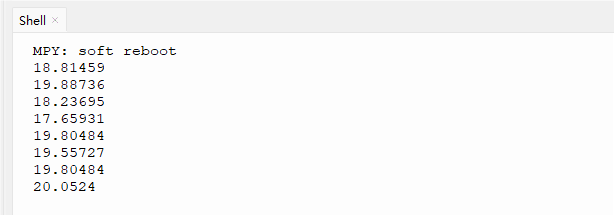

Click  to exit the execution.

---

**7. Code Explanation**

Please refer to previous Code Explanation. 

---

### 2-3-22 Sound Sensor

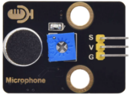

---

**1. Overview**

Sound sensor is usually used to detect the loudness of the sound in the surrounding environment. In this project, the sound sensor is controlled by the ESP32 main board to print the ADC value, DAC value and voltage value through code.

---

**2. Component Knowledge**

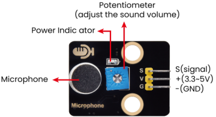

The sound sensor comes with a capacitive electret microphone that is sensitive to sound. Sound waves cause the electret film to vibrate and the capacitance to change, resulting in a corresponding voltage change. 

Since the voltage change is very weak, amplification is required. Thus, LM358 audio power amplifier chip is used to amplify the sound detected by the high sensitivity microphone with a maximum multiplier of 200 times. When used, we can adjust the amplification by rotating the potentiometer on the sensor(adjust clockwise to the end for maximum).

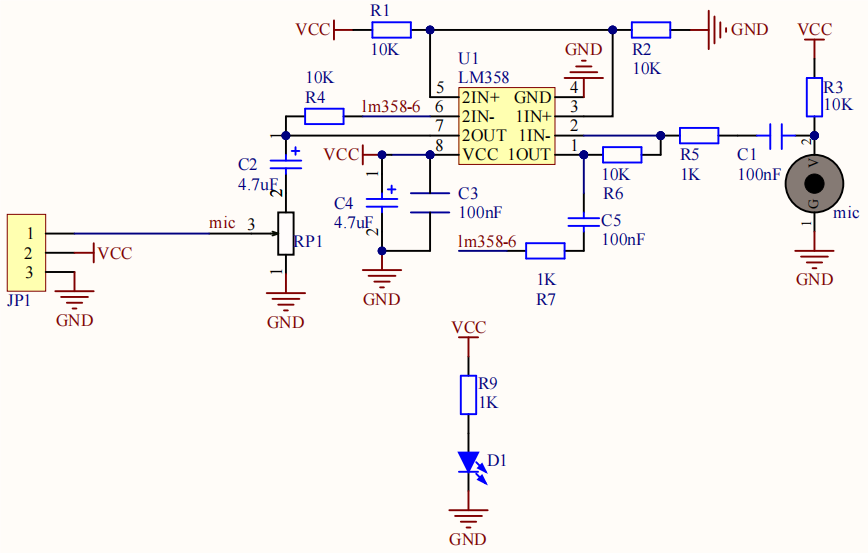

---

**3. Components**

|  |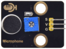|||
| ------------------------ | ------------------------ | ---------------------------- |---------------------------- |
| ESP32 main board x1 | sound sensor x1 |M-F DuPont wires | Micro USB cable x1 |

---

**4. Wiring Diagram**

**Schematic diagram:**

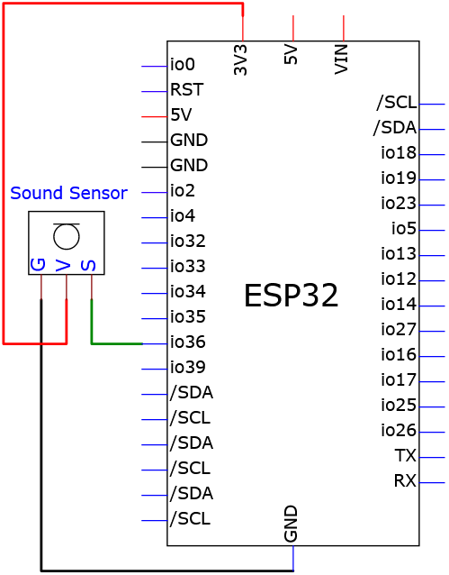

**Wiring diagram:**

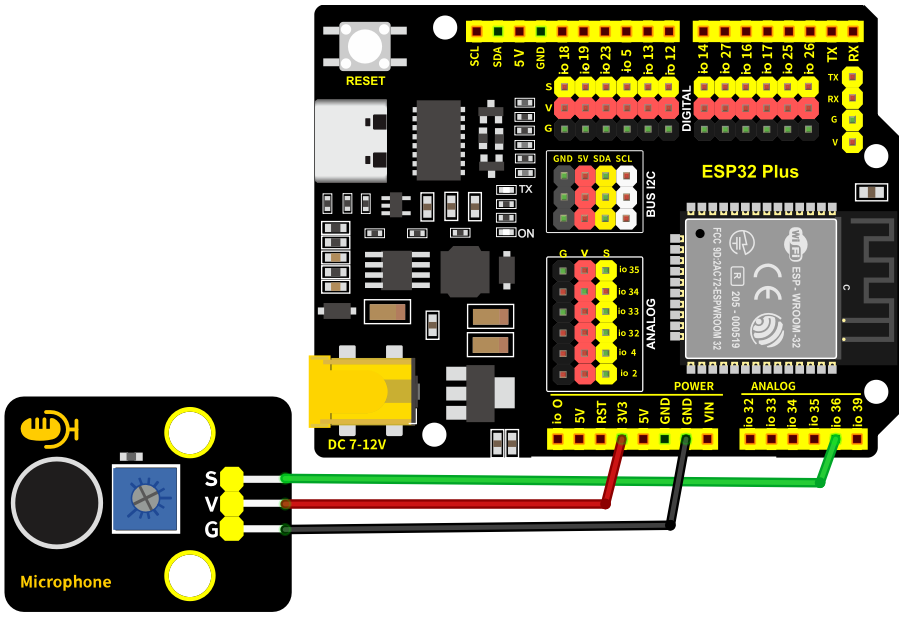

---

**5. Test Code** 

Open “Thonny IDE” and choose “This Computer” → “D:” → “Codes” → “MicroPython_Code”. Open the file “2-3-22_Sound_Sensor.py” or copy and paste the following code into “Thonny IDE”.

```python
'''
 * Filename    : Sound_Sensor
 * Thonny      : Thonny 4.1.7
 * Auther      : http//www.keyestudio.com
'''
# import Pin, ADC and DAC library
from machine import ADC,Pin,DAC
import time

# Enable and configure ADC with a range of 0-3.3V
adc=ADC(Pin(36))
adc.atten(ADC.ATTN_11DB)
adc.width(ADC.WIDTH_12BIT) 

# Read the ADC value every 0.1 seconds, and convert the ADC value to DAC value and voltage to output;
# show these values on “Shell”
try:
    while True:
        adcVal=adc.read()
        dacVal=adcVal//16
        voltage = adcVal / 4095.0 * 3.3
        print("ADC Val:",adcVal,"DACVal:",dacVal,"Voltage:",voltage,"V")
        time.sleep(0.1)
except:
    pass
```
---

**6. Test Result**

Connect the ESP32 main board to your computer via Micro USB cable. Click  to run the code. After uploading the code, “Shell” shows the sound ADC, DAC, and voltage values. Clap your hands and the values increase.

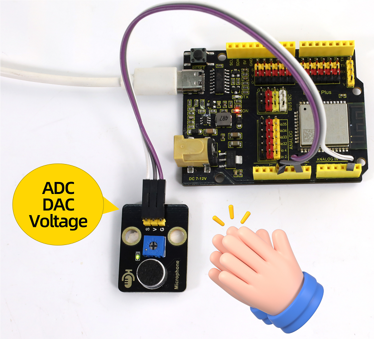

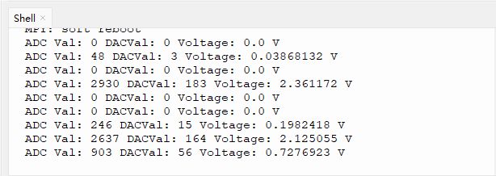

Click  to exit the execution.

---

**7. Code Explanation**

Please refer to [2-3-17](https://docs.keyestudio.com/projects/KS5020/en/latest/docs/2.%20MicroPython_Tutorial.html#potentiometer) Code Explanation. 

---

### 2-3-23 Joystick

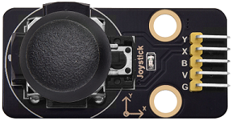

---

**1. Overview**

Have you ever seen a game-pad? There are buttons joysticks on it. 

In this kit, there is a joystick made of PS2 controller. We connect the X and Y pins of the module to the analog port and B pin to the digital port. Pin V is connected to the power output (3.3-5V) and G to GND. By reading two analog values and the high/low level of the digital port, the working state of the module can be known.

---

**2. Component Knowledge**

The **joystick** mainly uses PS2 joystick components. In fact, the joystick module has 3 signal terminal pins, which simulate a three-dimensional space. The pins of the joystick module are GND, VCC, and signal terminals (B, X, Y). The signal terminals X and Y simulate the X-axis and Y-axis of the space. When controlling, the X and Y signal terminals of the module are connected to the analog port of the microcontroller. The signal terminal B simulates the Z axis of the space, it is generally connected to the digital port and used as a button.

VCC is connected to the power output V/VCC (3.3/5V), GND is connected to G/GND, the voltage in the original state is about 1.65V/2.5V. 

In the X-axis direction, when moving in the direction of the arrow, the voltage value increases, and the maximum voltage can be reached. Moving in the opposite direction, the voltage value gradually decreases to the minimum voltage. 

In the Y-axis direction, the voltage value decreases gradually as it moves in the direction of the arrow on the module, till to the minimum voltage. As the arrow is moved in the opposite direction, the voltage value increases till to the maximum voltage. 

In the Z-axis direction, the signal terminal B is connected to the digital port and outputs 0 in the original state and outputs 1 when pressed. 

In this way, we can read the two analog values and the high/low level of the digital port to determine the operating status of the joystick.

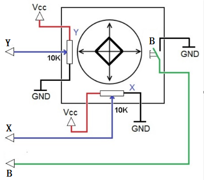

---

**3. Parameters**

- Operating voltage: DC 3.3V~5V 
- Operating current: 12mA

- Maximum power: 0.06W

- Output signal: Signal terminal X, Y are analog voltage output (analog signal), signal terminal B is digital level output (digital signal)

- Operating temperature: -10°C ~ +50°C

- Dimensions: 47.6mm x 23.8mm x 34.5mm

- Interface: interface spacing 2.54mm

---

**4. Schematic Diagram**

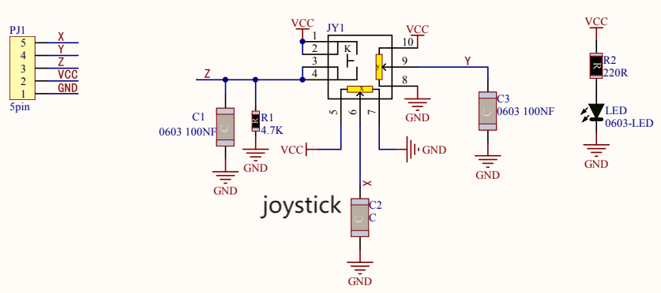

To put it simple, the joystick is equivalent to two potentiometers (left-right and up-down) and a button. 

When the button is not pressed, R1 is pulled down to low. When the button is pressed, VCC is turned on to the high level. Rotate the joystick, and the internal potentiometer is adjusted accordingly, so as to output different voltages and analog values.

---

**5. Components**

|  |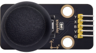|||
| ------------------------ | ------------------------ | ---------------------------- |---------------------------- |
|ESP32 main board x1 | joystick x1 | M-F DuPont wires |Micro USB cable x1|

---

**6. Wiring Diagram**

**Schematic diagram:**

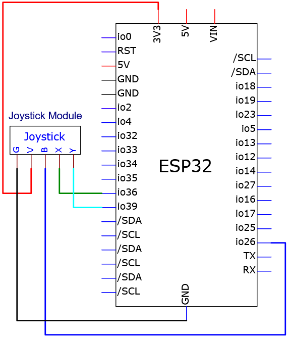


**Wiring diagram:**

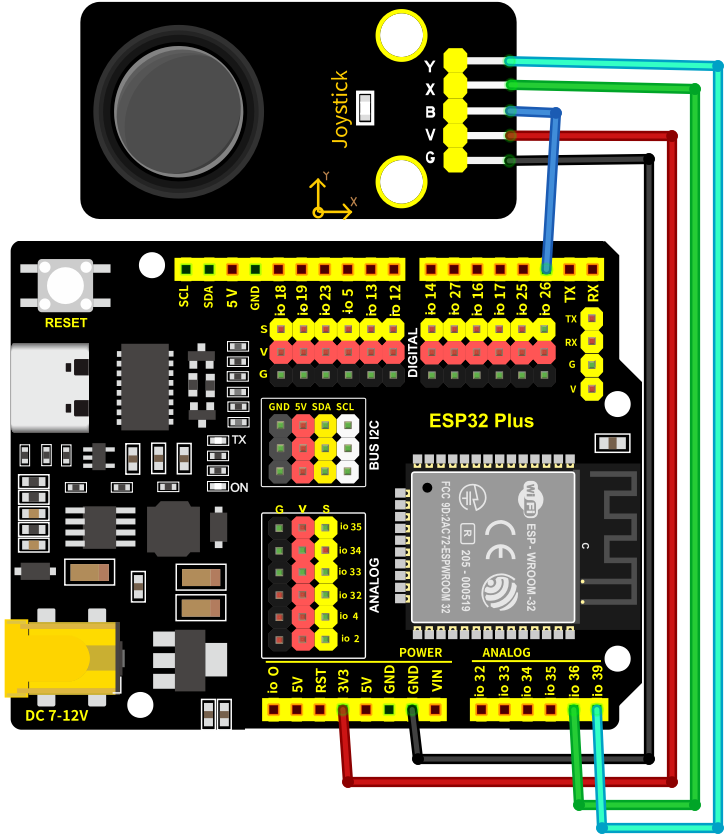

---

**7. Test Code** 

Open “Thonny IDE” and choose “This Computer” → “D:” → “Codes” → “MicroPython_Code”. Open the file “2-3-23_Joystick.py” or copy and paste the following code into “Thonny IDE”.

```python
'''
 * Filename    : Joystick
 * Thonny      : Thonny 4.1.7
 * Auther      : http//www.keyestudio.com
'''
from machine import Pin, ADC
import time 

# initialize joystick module (ADC function)
rocker_x=ADC(Pin(36)) 
rocker_y=ADC(Pin(39))
button_z=Pin(26,Pin.IN,Pin.PULL_UP)

# Set the voltage acquisition range of the two ADC channels to 0-3.3V
# Set the data acquisition width to 0-4095.
rocker_x.atten(ADC.ATTN_11DB)
rocker_y.atten(ADC.ATTN_11DB)
rocker_x.width(ADC.WIDTH_12BIT)
rocker_y.width(ADC.WIDTH_12BIT)
 
# In the code, configure the Z_Pin to pull-up input mode.
# In while True, read values of X and Y-axis by Read() and the values of z-axis by value(), and display them.
while True:
    print("X,Y,Z:",rocker_x.read(),",",rocker_y.read(),",",button_z.value())
    time.sleep(0.5)
```
---

**8. Test Result**

Connect the ESP32 main board to your computer via Micro USB cable. Click  to run the code. After uploading the code, “Shell” prints the analog values of the axis-X and Y and the digital value of axis-Z(pin B). Pull the joystick and these values change. Press it and Button = 1, Release it and Button = 0. From left to right, X value corresponds to 0 to 4095. From down to up, Y value corresponds to 0 to 4095.

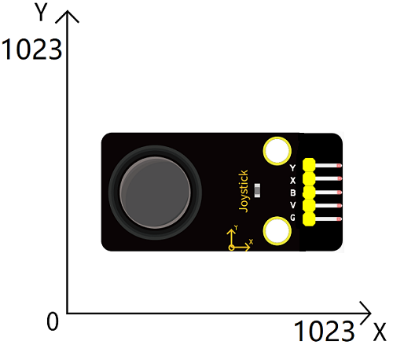

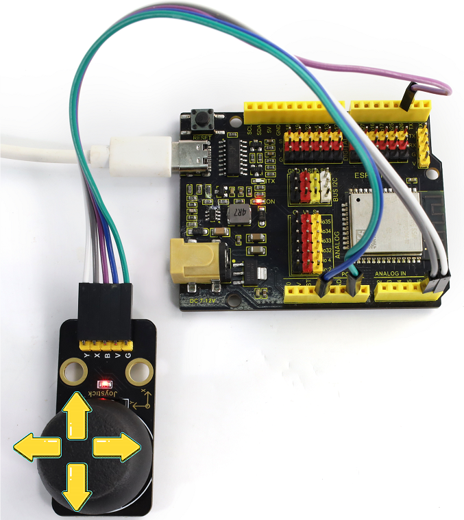

Pull the joystick on axis-X and the X value changes.

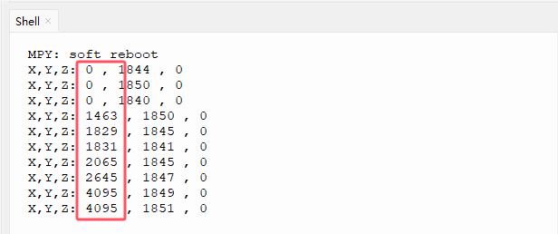

Pull the joystick on axis-Y and the Y value changes.

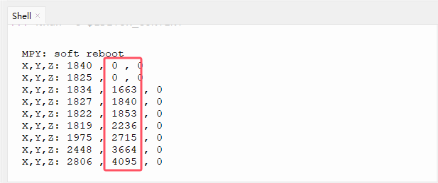

Press the joystick:

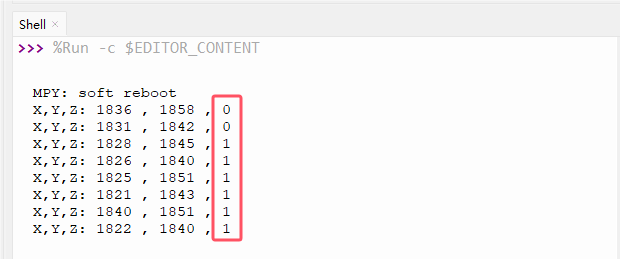

Click  to exit the execution.

---

**9. Code Explanation**

Please refer to [2-3-14](https://docs.keyestudio.com/projects/KS5020/en/latest/docs/2.%20MicroPython_Tutorial.html#button) and [2-3-17](https://docs.keyestudio.com/projects/KS5020/en/latest/docs/2.%20MicroPython_Tutorial.html#potentiometer) Code Explanation.  

---

### 2-3-24 Temperature and Humidity Detection

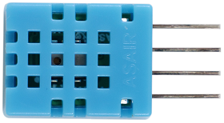

---

**1. Overview**

DHT11 temperature and humidity sensor detects humidity and temperature in the air, and its signal transmission distance can reach more than 20 meters. It features ultra-fast response, strong anti-interference ability and high performance.

---

**2. Component Knowledge**

**DHT11 temperature and humidity sensor**

This sensor includes calibrated digital signal output. Its precision of humidity is ±5%RH, temperature is ±2℃, detection range of humidity is 5 ~ 95%RH, and temperature is -25 ~ +60℃. The temperature and humidity sensor applies dedicated digital module acquisition technology and temperature and humidity sensing technology to ensure extremely high reliability and excellent long-term stability of the product. It also integrates a resistive-type humidity measurer and an NTC temperature measurer, which is very suitable for temperature and humidity measurement applications where accuracy and real-time performance are not required.

**Single bus format definition of DHT11 temperature and humidity sensor:**

|      Name       | Definition                                                   |
| :-------------: | :----------------------------------------------------------- |
|  Start signal   | Microprocessor pulls data bus (SDA) down at least 18ms for a period of time(Maximum is 30ms), notifying the sensor to prepare data. |
| Response signal | The sensor pulls the data bus (SDA) low for 83µs, and then pulls up for 87µs to respond to the host's start signal. |
|    Humidity     | The high humidity is an integer part of the humidity data, and the low humidity is a fractional part of the humidity data. |
|   Temperature   | The high temperature is the integer part of the temperature data, the low temperature is the fractional part of the temperature data. And the low temperature Bit8 is 1, indicating a negative temperature, otherwise, it is a positive temperature. |
|   Parity bit    | Parity bit = Humidity high bit + Humidity low bit + temperature high bit+temperature low bit |

**Data sequence diagram of DHT11 temperature and humidity sensor:**

When MCU sends a start signal, the sensor changes from the low-power-consumption mode to the high-speed mode, waiting for MCU completing the start signal. Once it is completed, it sends a response signal of 40-bit data and triggers a signal acquisition. The signal is sent as shown in the figure:

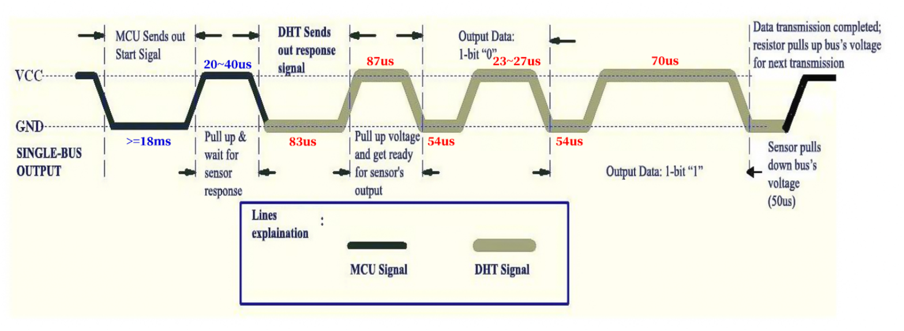 

The communication and synchronization between the MCU and DHT11, adopt single bus data format, with once communication time of about 4ms. The data includes decimal and integer, as described below. The current decimal part is used for future expansion, and now it is zero. 

Operation process: a complete data transmission for 40bit, high bit first.

**Data format:** 8bit Humidity integer + 8bit humidity decimal + 8bit Temperature integer + 8bit temperature decimal +8bit parity sum.

**8-bit parity sum:** The last eight digits of the sum of “8bit Humidity integer + 8bit humidity decimal + 8bit Temperature integer + 8bit temperature decimal”.

Combined with the code, you can understand better.

The sensor can easily add temperature and humidity data to your DIY electronic projects. It is perfect for remote weather stations, home environmental control systems, and farm or garden monitoring systems.

If you want to know more about DHT11, refer to: [DHT11 Datasheet](https://components101.com/sites/default/files/component_datasheet/DHT11-Temperature-Sensor.pdf)

---

**3. Parameters**

- Operating voltage: DC 3.3V~5V 
- Operating current: 2.1mA
- Maximum power: 0.015W
- Temperature detection range: -25 ~ +60°C (± 2℃)
- Humidity detection range: 5 ~ 95%RH (at 25C°, ±5%RH)

---

**4. Components**

|              |    |  |
| -------------------------------------- | ---------------------------------------- | -------------------------------------- |
| ESP32 main board                       | DHT11 temperature and humidity sensor x1 | jumper wires                           |
|  |    |                                        |
| breadboard x1                          | Micro USB cable x1                       |                                        |

---

**5. Wiring Diagram**

**Schematic diagram:**


**Wiring diagram:**


---

**6. Test Code**

Open “Thonny IDE” and choose “This Computer” → “D:” → “Codes” → “MicroPython_Code”. Open the file “2-3-24_DHT11.py” or copy and paste the following code into “Thonny IDE”.

```python
'''
 * Filename    : DHT11
 * Thonny      : Thonny 4.1.7
 * Auther      : http//www.keyestudio.com
'''
# import machine, time and dht library
import machine
import time
import dht

# connect DHT11 to pin(13).
DHT = dht.DHT11(machine.Pin(13))

# Obtain temperature and humidity values per second and print it out. 
while True:
    DHT.measure() # Start the DHT11 once to measure the data.
   # Call DHT built-in functions to get temperature and humidity values and print them on "Shell".
    print('temperature:',DHT.temperature(),'℃','humidity:',DHT.humidity(),'%')
    time.sleep_ms(1000)
```
---

**7. Test Result**

Connect the ESP32 main board to your computer via Micro USB cable. Click  to run the code. After uploading the code, “Shell” shows the ambient temperature and humidity value detected by the DHT11 sensor.

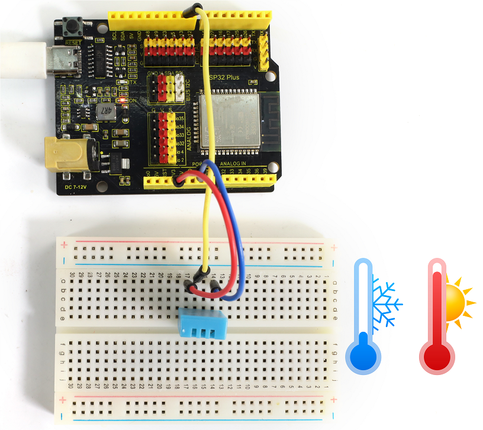

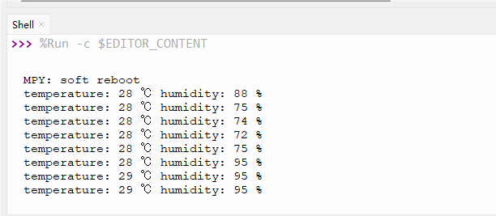

Click  to exit the execution.

---

**8. Code Explanation**

1\. Import machine, time and dht library.

```python
import machine
import time
import dht
```
2\. Associate pin DHT11 (13).

```python
DHT = dht.DHT11(machine.Pin(13))
```
3\. Obtain the temperature and humidity values every 0.5 seconds and print in the“Shell”.

```python
while True:
    DHT.measure() # Start the DHT11 to measure data.
   # Call DHT's built-in functions to get temperature and humidity values and print in the "Shell".
    print('temperature:',DHT.temperature(),'℃','humidity:',DHT.humidity(),'%')
    time.sleep_ms(1000)
```

---

### 2-3-25 Ultrasonic Ranger

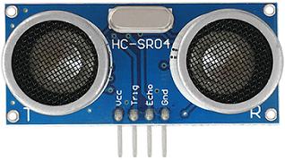

**1. Overview**

Bats and some marine animals are able to use high frequencies of sound for echolocation or communication. They can emit ultrasonic waves from the larynx through the mouth or nose and use the sound waves that bounce back to orient and determine the position, size and whether nearby objects are moving.

Ultrasonic is a frequency higher than 20000 Hz sound wave, which has a good direction, a strong penetration ability, and is easy to obtain more concentrated sound energy as well as spread far in the water. It can be used for ranging, speed measurement, cleaning, welding, gravel, sterilization and disinfection. What’s more, it has many applications in medicine, military, industry and agriculture.

Because its lower frequency is greater than the upper limit of human hearing, so it is called ultrasound. The number of vibrations per second is its frequency, whose unit is Hertz (Hz).

In this kit, there is an HC-SR04 ultrasonic sensor. It can emit the ultrasonic signals that cannot be heard by humans. When these signals hit an obstacle, they come back immediately. The distance between the sensor and the obstacle can be calculated by the time gap of emitting signals and receiving signals.

---

**2. Parameters**

- Ultrasonic sensor operating voltage: DC 5V 
- Ultrasonic sensor operating current: 15mA

- Ultrasonic sensor operating frequency: 40Hz

- Ultrasonic sensor detection range: 2cm~4m

- Ultrasonic sensor measuring angle: <= 15 degrees

- Ultrasonic sensor input trigger signal: TTL pulse of 10 uS

- Ultrasonic sensor output echo signal: The output TTL level signal is proportional to the range

- Operating temperature: -10°C ~ +50°C

- Ultrasonic sensor dimensions: 45.5mm x 26.7mm x 17.6mm

---

**3. Schematic Diagram**

The most common ultrasonic ranging method is the echo detection. As shown below; when the ultrasonic emitter emits the ultrasonic waves towards certain direction, the counter will count. The ultrasonic waves travel and reflect back once encountering the obstacle. Then the counter will stop counting when the receiver receives the ultrasonic waves coming back.

The ultrasonic wave is also sound wave, and its speed of sound V is related to temperature. Generally, it travels 340m/s in the air. According to time t, we can calculate the distance s from the emitting spot to the obstacle: s=340t/2.

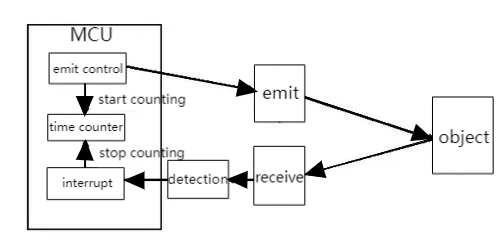

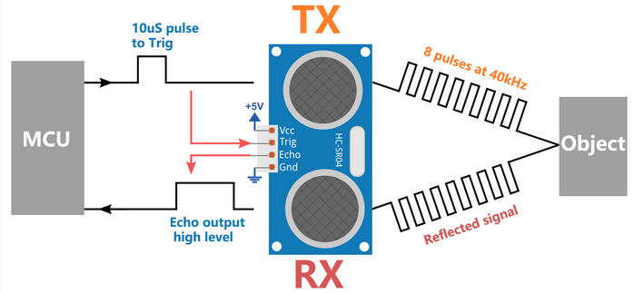

The HC-SR04 ultrasonic ranging module can provide a non-contact distance sensing function of 2cm-400cm, and the ranging accuracy can reach as high as 3mm; the module includes an ultrasonic transmitter, receiver and control circuit. 

(1) First pull down the TRIG, and then trigger it with at least 10us high level signal;

(2) After triggering, the module will automatically transmit eight 40KHZ square waves, and automatically detect whether there is a signal to return.

(3) If there is a signal returned back, through the ECHO to output a high level, the duration time of high level is actually the time from emission to reception of ultrasonic.

(4) Distance = (high level time x speed of sound (340M/S)) / 2


**⚠️ATTENTION:**

This module should not be powered on when connecting. If necessary, connect GND first.

The area of the object to be measured should be at least 0.5 square meters and as flat as possible. Otherwise, it will affect the result.


---

**4. Components**

|  ||||
| ------------------------ | ------------------------ | ---------------------------- |---------------------------- |
|ESP32 main board x1 |ultrasonic sensor x1| M-F DuPont wires | Micro USB cable x1 |

---

**5. Wiring Diagram**

**Schematic diagram:**

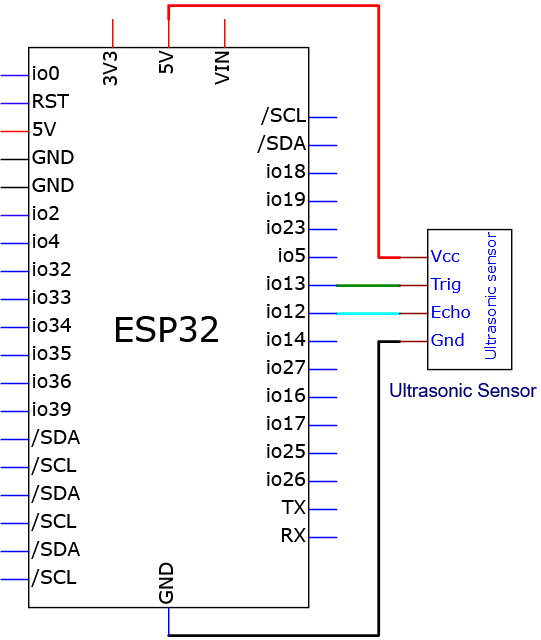


**Wiring diagram:**

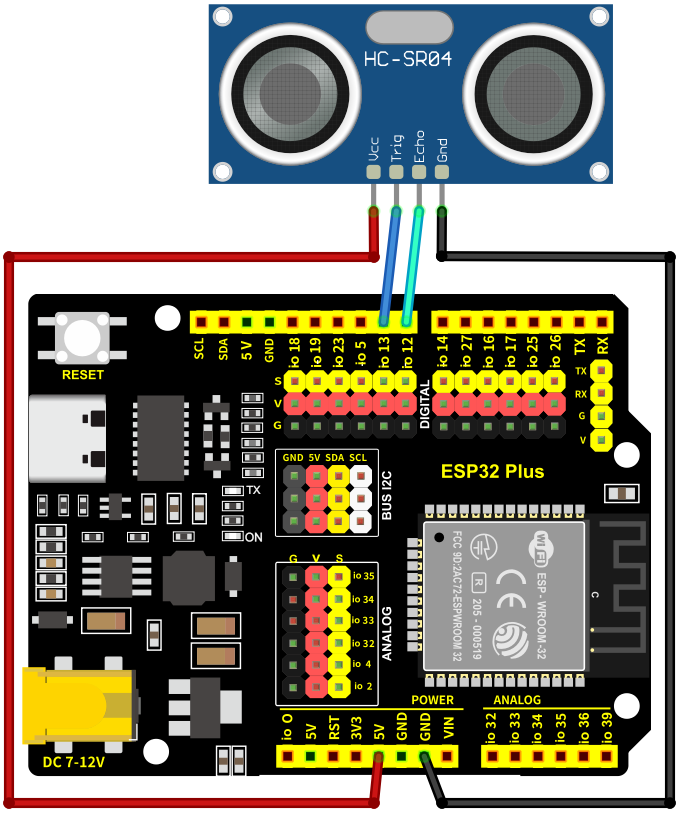

---

**6. Test Code**

Open “Thonny IDE” and choose “This Computer” → “D:” → “Codes” → “MicroPython_Code”. Open the file “2-3-25_Ultrasonic.py” or copy and paste the following code into “Thonny IDE”.

```python
'''
 * Filename    : Ultrasonic
 * Thonny      : Thonny 4.1.7
 * Auther      : http//www.keyestudio.com
'''
from machine import Pin
import time

# set the ultrasonic sensor pins
Trig = Pin(13, Pin.OUT, 0) 
Echo = Pin(12, Pin.IN, 0)

distance = 0 # set initial distance value to 0
soundVelocity = 340 #Set the speed of sound.

# getDistance() is used to drive the ultrasonic module to measure distance
# Trig holds a high level of 10us to activate the ultrasonic module
# Echo.value() is used to read the status of the Echo pin of the ultrasonic module
# time.sleep_us() function of the time module calculates the duration of the Echo
# Trig pin high level calculates the measured distance based on time and returns the value
def getDistance():
    Trig.value(1)
    time.sleep_us(10)
    Trig.value(0)
    while not Echo.value():
        pass
    pingStart = time.ticks_us()
    while Echo.value():
        pass
    pingStop = time.ticks_us()
    pingTime = time.ticks_diff(pingStop, pingStart) // 2
    distance = int(soundVelocity * pingTime // 10000)
    return distance

# delay 2 seconds, wait for the ultrasonic module to stabilize
# print values obtained from the ultrasonic module every 500 milliseconds
time.sleep(2)
while True:
    time.sleep_ms(500)
    distance = getDistance()
    print("Distance: ", distance, "cm")
```
---

**7. Test Result**

Connect the ESP32 main board to your computer via Micro USB cable. Click  to run the code. After uploading the code, put an object in front of the detection area of the ultrasonic sensor, and the “Shell” prints the distance value between the sensor and the object.

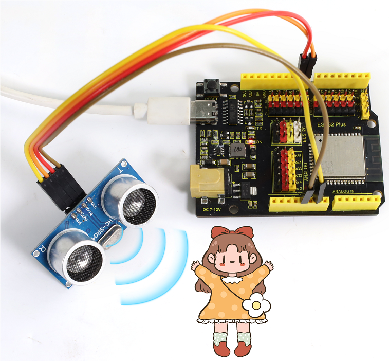

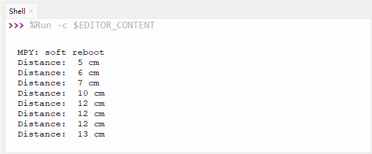

Click  to exit the execution.

---

**8. Code Explanation**

1\. For the application of ultrasonic sensor, we can directly check `getDistance()` sub-function. 

getDistance() is used to drive the module to measure the distance; Trig holds a high level of 10us to enable the sensor. Echo.value() is used to read the status of the Echo pin of the ultrasonic sensor. 

Time module `time.sleep_us()` calculates the duration of the Echo, the high level of the Trig pin, measures distance based on the time and returns the value.

```python
def getDistance():
    Trig.value(1)
    time.sleep_us(10)
    Trig.value(0)
    while not Echo.value():
        pass
    pingStart = time.ticks_us()
    while Echo.value():
        pass
    pingStop = time.ticks_us()
    pingTime = time.ticks_diff(pingStop, pingStart) // 2
    distance = int(soundVelocity * pingTime // 10000)
    return distance
```

2\. Delay 2 seconds, wait for the ultrasonic module to stabilize, and print the values from the ultrasonic sensor every 500 milliseconds.

```python
time.sleep(2)
while True:
    time.sleep_ms(500)
    distance = getDistance()
    print("Distance: ", distance, "cm")
```
---

### 2-3-26 Remote Control and IR Receiving

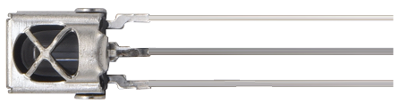

---

**1. Overview**

An infrared receiver receives infrared signals and can independently detect and output signals that are compatible with TTL levels. It is similar in size to ordinary plastic encapsulated transistors and is commonly used in various applications such as infrared remote control and infrared transmission.

In this project, we will detect signals received by infrared receiver from the remote control. When the button on the remote is pressed and the infrared receiver receives the corresponding signal, it can decode the signal to determine which button was pressed. Therefore, we can identify the specific key or command associated with it.

---

**2. Component Knowledge**

**Remote control:**

It is currently the most common means of communication and remote control. An infrared(IR) remote control is a low-cost and easy-to-use wireless communication technology. IR light is very similar to visible light, except that its wavelength is slightly longer. This means that infrared rays cannot be detected by the human eye, which is perfect for wireless communication. 

For example, when you press a button on the TV remote control, an infrared LED will switch on and off repeatedly at a frequency of 38,000 times per second, transmitting information (such as volume or channel control) to the infrared sensor on the TV. 

As it features small size, low power consumption, strong function and low cost, it is widely used in small electrical equipment, like recorders, audio equipment, air conditioners and electrical toys.

Its transmitting circuit uses infrared light-emitting diode to emit modulated infrared waves. The infrared receiving circuit consists of an infrared receiving diode and a triode / a silicon photocell, which converts the emitted infrared light into corresponding electrical signals and then sends them to the post amplifier.

The remote control in this kit is coded by NEC.

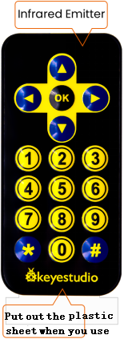

- Dimensions: 86x40x7mm
- Remote control range: about 8-10m
- Battery: 3V button lithium manganese battery
- Infrared carrier frequency: 38KHz
- Effective life: more than 20,000 times

**IR receiver:**

It is the VS1838B infrared receiving sensor element, which can receive infrared light, so it can be used to detect the infrared signal emitted by remote control.

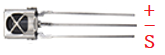

- S: signal output
- GND(-) : GND
- VCC(+) : power supply, 3.3V~5V

IR receiver integrates reception, amplification and demodulation. The received infrared signal has been adjusted in its internal IC (converting the infrared signal back to binary), so the output is a digital signal. It can receive the standard 38KHz modulated remote control signal.

**Infrared signal modulation process diagram:**

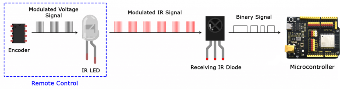

- Can be used for remote control
- Wide operating voltage: 2.7~5V
- Internal filter for PCM frequency
- TTL and CMOS compatibility
- Strong anti-interference ability

---

**3. Components**

|  ||||
| ------------------------ | ------------------------ | ---------------------------- |---------------------------- |
| ESP32 main board x1 | infrared receiver x1 |breadboard x1 |jumper wires |
|||  |   |
|remote control x1 | Micro USB cable x1 | 10kΩ resistor x1 |   |

---

**4. Wiring Diagram**

**Schematic diagram:**

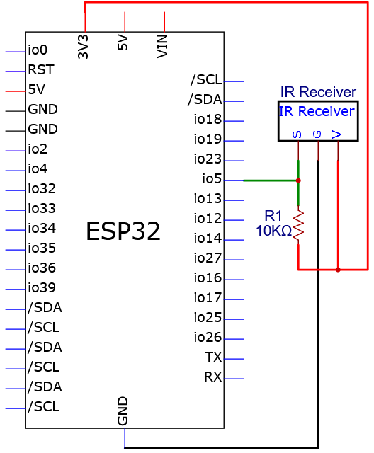

**Wiring diagram:**

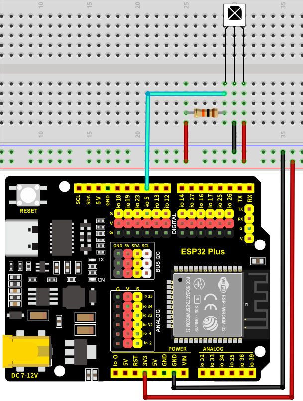

---

**5. Test Code** 

Open “Thonny IDE” and choose “This Computer” → “D:” → “Codes” → “MicroPython_Code”. Open the file “2-3-26_IR_Receiver.py” or copy and paste the following code into “Thonny IDE”.

```python
'''
 * Filename    : IR_Receiver
 * Thonny      : Thonny 4.1.7
 * Auther      : http//www.keyestudio.com
'''
# import infrared decoder library.
from irrecvdata import irGetCMD 

# connect IR receiver to pin GPIO5
recvPin = irGetCMD(5)

# When the key values of the infrared remote control are obtained, print on the "Shell".
try:
    while True:
        irValue = recvPin.ir_read() # Call ir_read() to read key values to assign to irValue
        if irValue:
            print(irValue)
except:
    pass
```
---

**6. Test Result**

Remove the insulating strip on the remote control. 

Connect the ESP32 main board to your computer via Micro USB cable. Click  to run the code. If the code fails to run, an error message is displayed in “Shell”.

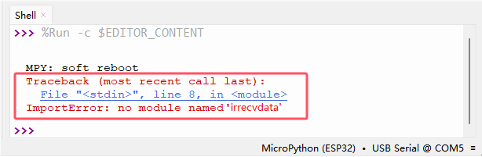

Please import library referring to **2-1-7 Import Arduino Library** or can click **[Import MicroPython Library](https://docs.keyestudio.com/projects/KS5020/en/latest/docs/2.%20MicroPython_Tutorial.html#import-micropython-library-important)** to refer to import library.

Connect the ESP32 main board to your computer via Micro USB cable. Click  to run the code. After uploading the code, align the remote control to the IR receiver. Press any button on the remote control, and the “Shell” will display the received button value.

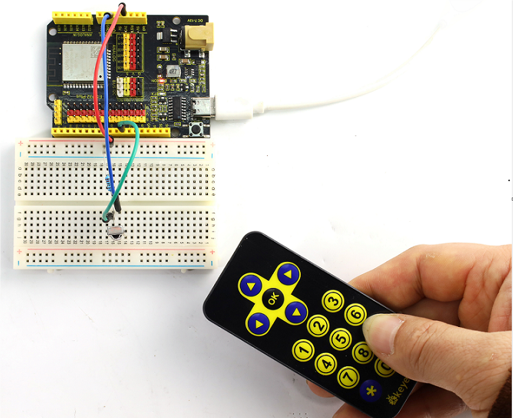

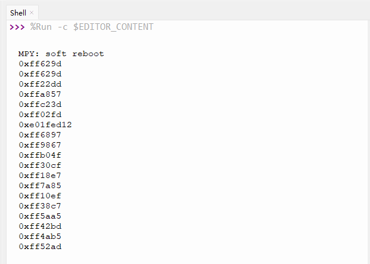

Click  to exit the execution.

The value corresponding to each button:

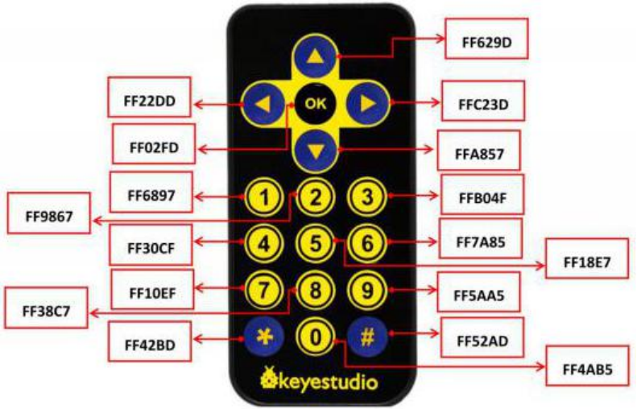

---

**7. Code Explanation**

1\. Import library of infrared decoders.

```python
from irrecvdata import irGetCMD
```
2\. Associate infrared receiver with GPIO5.

```python
recvPin = irGetCMD(5)
```
3\. Call ir_read() to read the pressed button value and assign it to IRValue; When the value is obtained, print it in “Shell”.

```python
try:
    while True:
        irValue = recvPin.ir_read() # Call ir_read() to read the pressed button value and assign it to IRValue.
        if irValue:
            print(irValue)
except:
    pass
```
---

### 2-3-27 Thin-film 4X4 Key Pad

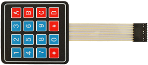

---

**1. Overview**

In this project, we will learn how to use the keypad that is applied to a variety of devices, including mobile phones, fax machines, microwave ovens, etc. It is often used for user input.

---

**2. Component Knowledge**

This sensor integrates 4x4 = 16 matrix keys:

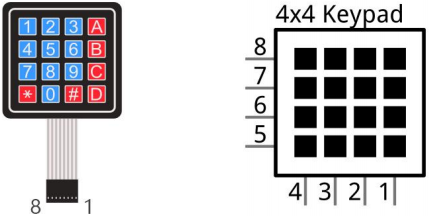

In a 4x4 key pad, each row / column of keys is connected with a pin, which reduces the processor ports. The internal circuit is shown below.

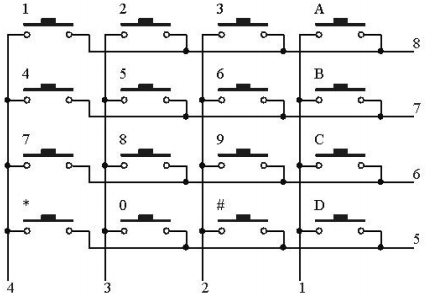

We detect the state of keys by scanning each column and row. Take the column scanning as an example, send low level to column 1 (Pin1), detect the level status of row 5, 6, 7, 8 to determine whether A, B, C, D are pressed. The low levels are then sent to columns 2, 3, 4 in turn to detect if any other keys have been pressed. Then, you can get the state of all the keys.

- If you want to know more about keypad, refer to: [Keypad - Wikipedia](https://en.wikipedia.org/wiki/Keypad)

---

**3. Components**

|  ||||
| ------------------------ | ------------------------ | ---------------------------- |---------------------------- |
| ESP32 main board x1 | thin film 4x4 matrix key pad x1 |jumper wires |Micro USB cable x1 |

---

**4. Wiring Diagram**

**Schematic diagram:**

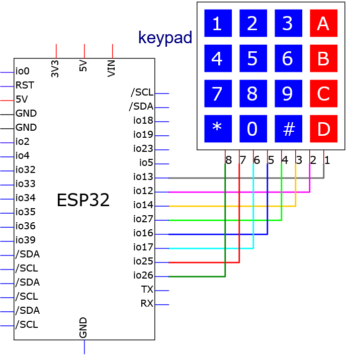

**Wiring diagram:**

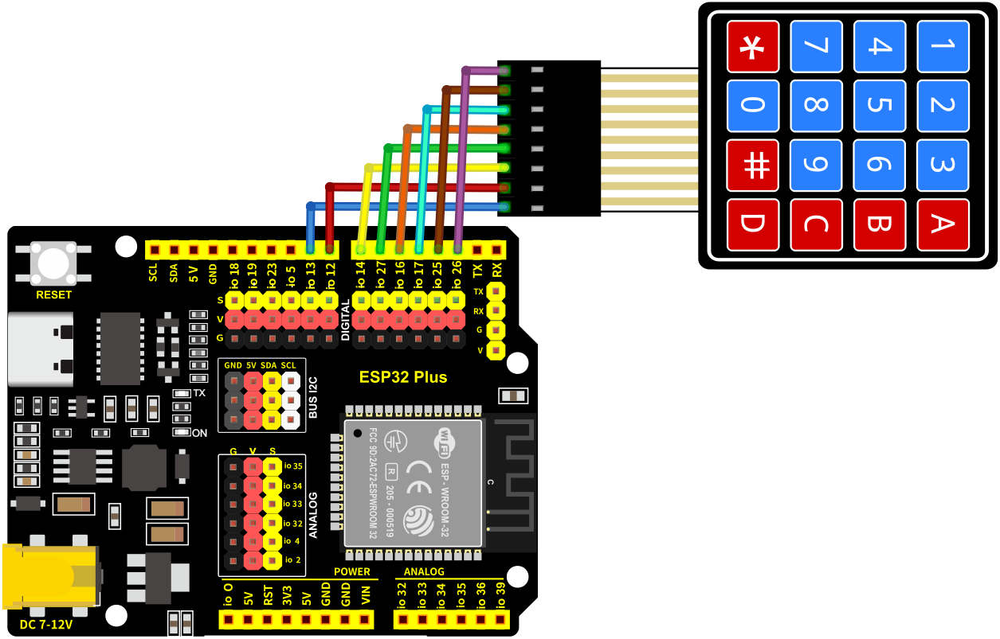

---

**5. Test Code** 

Open “Thonny IDE” and choose “This Computer” → “D:” → “Codes” → “MicroPython_Code”. Open the file “2-3-27_4x4_Keypad.py” or copy and paste the following code into “Thonny IDE”.

```python
'''
 * Filename    : 4x4_Keypad
 * Thonny      : Thonny 4.1.7
 * Auther      : http//www.keyestudio.com
'''
# import keypad library
from keypad import KeyPad
import time

# connect keypad midule to ESP32 pins
keyPad = KeyPad(26, 25, 17, 16, 27, 14, 12, 13)

# Call the keyPad.scan() function to get key values. Once you get them, print on Shell. 
def key():
    keyvalue = keyPad.scan()
    if keyvalue != None:
        print(keyvalue, end="\t")
        time.sleep_ms(300)
        return keyvalue
            
while True: 
    key()
```
---

**6. Test Result**

Connect the ESP32 main board to your computer via Micro USB cable. Click  to run the code. If the code fails to run, an error message is displayed in “Shell”.

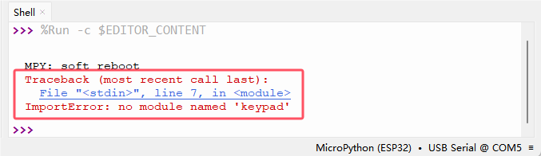

Please import library referring to **2-1-7 Import Arduino Library** or can click **[Import MicroPython Library](https://docs.keyestudio.com/projects/KS5020/en/latest/docs/2.%20MicroPython_Tutorial.html#import-micropython-library-important)** to refer to import library.

Click  to run the code. Press the key and the corresponding value will show on “Shell”.

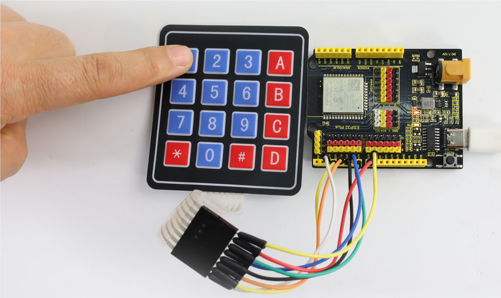

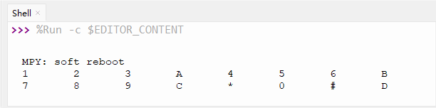

Click  to exit the execution.

---

**7. Code Explanation**

1\. Import the keypad and time libraries.

```python
from keypad import KeyPad
import time
```
2\. Connect the thin film 4x4 matrix key pad to the ESP32 pin.

```python
keyPad = KeyPad(26, 25, 17, 16, 27, 14, 12, 13)
```
3\. Call the keyPad.scan() function to get the value of the key. Once you get it, print it on “Shell”.

```python
def key():
    keyvalue = keyPad.scan()
    if keyvalue != None:
        print(keyvalue, end="\t")
        time.sleep_ms(300)
        return keyvalue
            
while True:
    key()
```
---

### 2-3-28 I2C 128×32 LCD

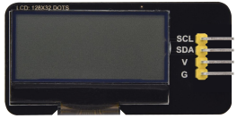

---

**1. Overview**

In everyday life, we can do all kinds of experiments with the display module and also DIY a variety of small objects. For example, you can make a temperature  meter with a temperature sensor and display, or make a distance meter with an ultrasonic module and display.

In this project, we will use the LCD_128X32_DOT as the display and connect it to ESP32 main board, which will be used to control the LCD to show various English words, common symbols and numbers.

---

**2. Components**

|  |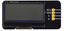|||
| ------------------------ | ------------------------ | ---------------------------- |---------------------------- |
|ESP32 main board x1 |LCD_128X32_DOT x1| F-F DuPont wires |Micro USB cable x1|

---

**3. Component Knowledge**

**LCD_128X32_DOT:** 

It is a 128*32 pixel LCD module whose driver chip is ST7567A. It uses IIC communication mode, which can display not only English letters and symbols, but also Chinese characters and patterns. When used, it can also be set in the code to display different sizes of English letters and symbols.

**LCD_128X32_DOT schematic diagram:**

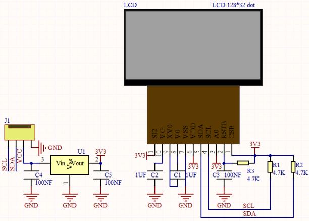

**LCD_128X32_DOT parameters:**

- Display pixel: 128*32 characters
- Operating voltage: DC 5V
- Operating current: 100mA (5V)
- Module optimum operating voltage: 5V
- Brightness and contrast can be controlled by program instructions

---

**4. Wiring Diagram**

**Schematic diagram:**

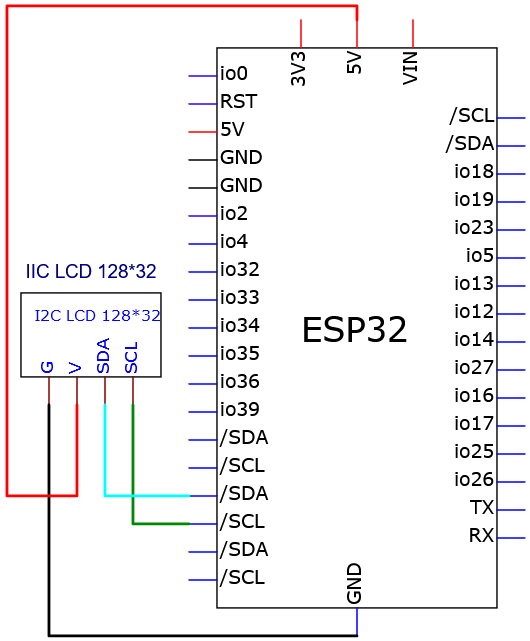

**Wiring diagram:**

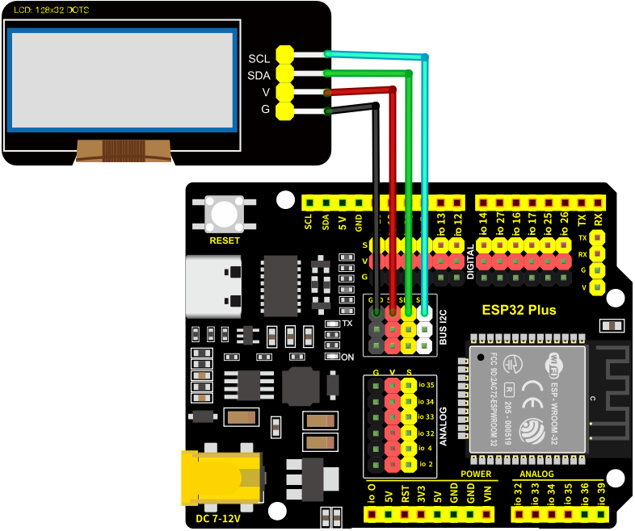

---

**5. Test Code**

Open “Thonny IDE” and choose “This Computer” → “D:” → “Codes” → “MicroPython_Code”. Open the file “2-3-28_I2C_128_32_LCD.py” or copy and paste the following code into “Thonny IDE”.

```python
'''
 * Filename    : I2C_128_32_LCD
 * Thonny      : Thonny 4.1.7
 * Auther      : http//www.keyestudio.com
'''
# import machine, time, lcd128_32_fonts, lcd128_32 library
import machine
import time
import lcd128_32_fonts
from lcd128_32 import lcd128_32

# configure i2c, pins and addresses, etc.
clock_pin = 22
data_pin = 21
bus = 0
i2c_addr = 0x3f
use_i2c = True

def scan_for_devices():
    i2c = machine.I2C(bus,sda=machine.Pin(data_pin),scl=machine.Pin(clock_pin))
    devices = i2c.scan()
    if devices:
        for d in devices:
            print(hex(d))
    else:
        print('no i2c devices')

if use_i2c:
    scan_for_devices()
    lcd = lcd128_32(data_pin, clock_pin, bus, i2c_addr)


lcd.Clear()

lcd.Cursor(0, 4)
lcd.Display("KEYESTUDIO")
lcd.Cursor(1, 0)
lcd.Display("ABCDEFGHIJKLMNOPQR")
lcd.Cursor(2, 0)
lcd.Display("123456789+-*/<>=$@")
lcd.Cursor(3, 0)
lcd.Display("%^&(){}:;'|?,.~\\[]")
'''
while True:
    # scan_for_devices()
    time.sleep(0.5)
'''
```
---

**6. Test Result**

Connect the ESP32 main board to your computer via Micro USB cable. Click  to run the code. If the code fails to run, an error message is displayed in “Shell”.

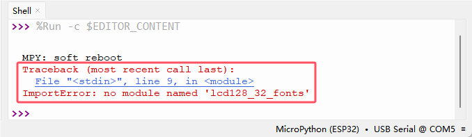

Please import library referring to **2-1-7 Import Arduino Library** or can click **[Import MicroPython Library](https://docs.keyestudio.com/projects/KS5020/en/latest/docs/2.%20MicroPython_Tutorial.html#import-micropython-library-important)** to refer to import library.

Click  to run the code. After uploading the code, 128X32LCD shows “KEYESTUDIO” on the first line, “ABCDEFGHIJKLMNOPQR” on the second, “123456789+-*/<>=$@” on the third and “%^&(){}:;'|?,.~\\[]” on the fourth line.

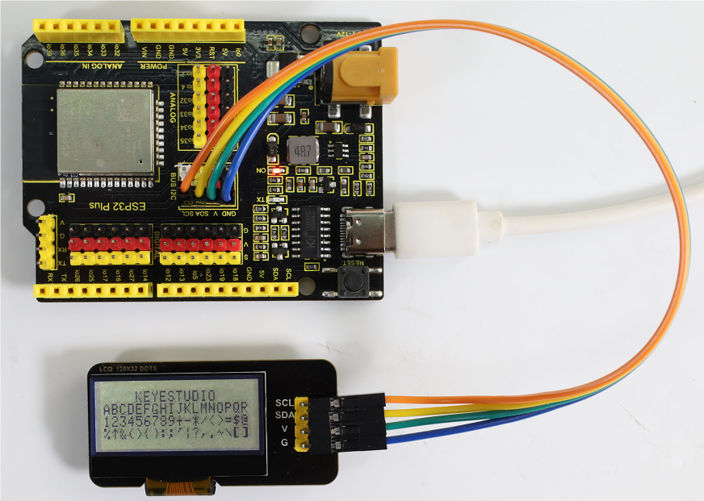

Click  to exit the execution.

---

**7. Code Explanation**

1\. Import machine, time, lcd128_32_fonts and lcd128_32 library.

```python
import machine
import time
import lcd128_32_fonts
from lcd128_32 import lcd128_32
```
2\. Configure i2c pins and addresses.

```python
clock_pin = 22
data_pin = 21
bus = 0
i2c_addr = 0x3f
use_i2c = True
```
---

### 2-3-29 OLED

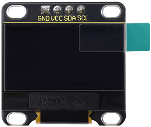

---

**1. Overview**

OLED is an organic light-emitting diode that is a device that uses organic materials to display text, graphics and images on a thin, flexible screen. 

Since organic materials emit light when an electric current is applied, OLED emits its own light and requires no other backlight. As a result, OLED displays generally boasts better contrast, brightness and viewing angles compared to LCD displays. 

Another important feature is the deep black level. Since each pixel emits its own light, individual pixels can be turned off in order to produce black.

Due to their low power consumption (only the pixels that are lit consume current), OLED displays are also popular in battery-powered devices and wearables such as smartwatches and fitness trackers. 

---

**2. Component Knowledge**

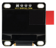

**OLED** is an organic light-emitting diode, also known as organic dot laser display. It has self-luminous properties, because it uses a very thin coating of organic materials and glass substrate.

It consists of OLED panel and OLED drive chip. 

On the panel, there are may tiny pixels that can emit different colors. Each pixel consists of several layers of organic material sandwiched between two electrodes (anode and cathode). When an electric current flows through the electrode, the organic material emits light at different wavelengths depending on its composition. It uses SSD1306 chip, whose communication mode is IIC. Its dimensions are 0.96 inches, resolution is 128*96 pixels (128 columns, 64 rows of pixels on the screen), and display color is blue.

As for the chip, it converts signals from the Arduino into commands for the panel. The Arduino can send data to the it via a library that can control the I2C protocol, for instance, Adafruit SSD1306 library. Thus, you can initialize OLED display modules, set brightness levels, print text, graphics or images.

**Parameters**

- Operating voltage: DC 3.3V-5V
- Operating current: 30mA
- Interface: Interface spacing 2.54mm
- Communication mode: I2C communication
- Internal driver chip: SSD1306
- Resolution: 128*64
- Viewing Angle: greater than 150°

---

**3. Components**

|  ||||
| ------------------------ | ------------------------ | ---------------------------- |---------------------------- |
|ESP32 main board x1|OLED x1| F-F DuPont wires | USB cable x1 |

---

**4. Wiring Diagram**

**Schematic diagram:**

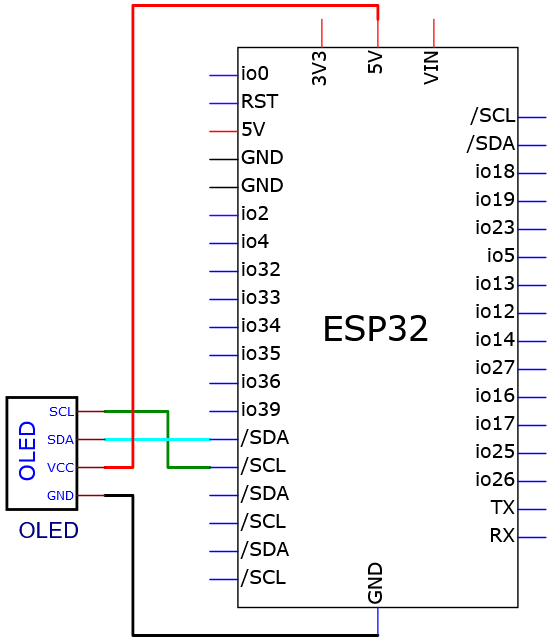

**Wiring diagram:**

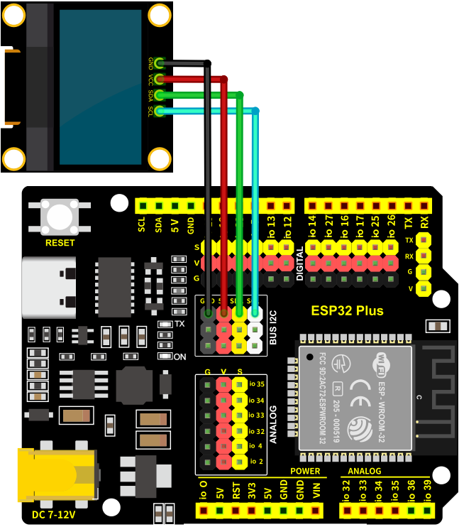

---

**5. Test Code**

Open “Thonny IDE” and choose “This Computer” → “D:” → “Codes” → “MicroPython_Code”. Open the file “2-3-29_OLED.py” or copy and paste the following code into “Thonny IDE”.

```python
'''
 * Filename    : OLED 
 * Thonny      : Thonny 4.1.7
 * Auther      : http//www.keyestudio.com
'''
# Import Pin, SoftI2C, ssd1306, sleep libraries
from machine import Pin, SoftI2C
import ssd1306
from time import sleep
import gfx

# ESP32 Pin assignment 
i2c = SoftI2C(scl=Pin(22), sda=Pin(21))

# Set the width, height and i2c of the OLED
oled_width = 128
oled_height = 64
oled = ssd1306.SSD1306_I2C(oled_width, oled_height, i2c)

graphics = gfx.GFX(oled_width, oled_height, oled.pixel)

screen1_row1 = "Screen 1, row 1"
screen1_row2 = "Screen 1, row 2"
screen1_row3 = "Screen 1, row 3"

screen2_row1 = "Screen 2, row 1"
screen2_row2 = "Screen 2, row 2"

screen3_row1 = "Screen 3, row 1"

screen1 = [[0, 0 , screen1_row1], [0, 16, screen1_row2], [0, 32, screen1_row3]]
screen2 = [[0, 0 , screen2_row1], [0, 16, screen2_row2]]
screen3 = [[0, 40 , screen3_row1]]

# Scroll in screen horizontally from left to right
def scroll_in_screen(screen):
  for i in range (0, oled_width+1, 4):
    for line in screen:
      oled.text(line[2], -oled_width+i, line[1])
    oled.show()
    if i!= oled_width:
      oled.fill(0)

# Scroll out screen horizontally from left to right
def scroll_out_screen(speed):
  for i in range ((oled_width+1)/speed):
    for j in range (oled_height):
      oled.pixel(i, j, 0)
    oled.scroll(speed,0)
    oled.show()

# Continuous horizontal scroll
def scroll_screen_in_out(screen):
  for i in range (0, (oled_width+1)*2, 1):
    for line in screen:
      oled.text(line[2], -oled_width+i, line[1])
    oled.show()
    if i!= oled_width:
      oled.fill(0)

# Scroll in screen vertically
def scroll_in_screen_v(screen):
  for i in range (0, (oled_height+1), 1):
    for line in screen:
      oled.text(line[2], line[0], -oled_height+i+line[1])
    oled.show()
    if i!= oled_height:
      oled.fill(0)

# Scroll out screen vertically
def scroll_out_screen_v(speed):
  for i in range ((oled_height+1)/speed):
    for j in range (oled_width):
      oled.pixel(j, i, 0)
    oled.scroll(0,speed)
    oled.show()

# Continous vertical scroll
def scroll_screen_in_out_v(screen):
  for i in range (0, (oled_height*2+1), 1):
    for line in screen:
      oled.text(line[2], line[0], -oled_height+i+line[1])
    oled.show()
    if i!= oled_height:
      oled.fill(0)

while True:
    
  oled.text('Hello, World 1!', 0, 0)
  oled.text('Hello, World 2!', 0, 10)
  oled.text('Hello, World 3!', 0, 20)
  oled.text('Hello, World 4!', 0, 30)
  oled.text('Hello, World 5!', 0, 40)
  oled.text('Hello, World 6!', 0, 50)       
  oled.show()
  sleep(2)
  oled.fill(0)
  
  # Scroll in, stop, scroll out (horizontal)
  scroll_in_screen(screen1)
  sleep(2)
  scroll_out_screen(4)

  scroll_in_screen(screen2)
  sleep(2)
  scroll_out_screen(4)

  scroll_in_screen(screen3)
  sleep(2)
  scroll_out_screen(4)

  # Continuous horizontal scroll
  scroll_screen_in_out(screen1)
  scroll_screen_in_out(screen2)
  scroll_screen_in_out(screen3)

  # Scroll in, stop, scroll out (vertical)
  scroll_in_screen_v(screen1)
  sleep(2)
  scroll_out_screen_v(4)

  scroll_in_screen_v(screen2)
  sleep(2)
  scroll_out_screen_v(4)

  scroll_in_screen_v(screen3)
  sleep(2)
  scroll_out_screen_v(4)

  # Continuous verticall scroll
  scroll_screen_in_out_v(screen1)
  scroll_screen_in_out_v(screen2)
  scroll_screen_in_out_v(screen3)

 # Draw a Line
  graphics.line(0, 0, 127, 20, 1)
  oled.show()
  sleep(1)
  oled.fill(0)

  # Draw a Rectangle
  graphics.rect(10, 10, 50, 30, 1)
  oled.show()
  sleep(1)
  oled.fill(0)

  # Draw a Filled Rectangle
  graphics.fill_rect(10, 10, 50, 30, 1)
  oled.show()
  sleep(1)
  oled.fill(0)

  # Draw a Circle
  graphics.circle(64, 32, 10, 1)
  oled.show()
  sleep(1)
  oled.fill(0)

  # Draw a Filled Circle
  graphics.fill_circle(64, 32, 10, 1)
  oled.show()
  sleep(1)
  oled.fill(0)

  # Draw a Triangle
  graphics.triangle(10,10,55,20,5,40,1)
  oled.show()
  sleep(1)
  oled.fill(0)

  # Draw a Filled Triangle 
  graphics.fill_triangle(10,10,55,20,5,40,1)
  oled.show()
  sleep(1)
  oled.fill(0)

```
---

**6. Test Result**

Connect the ESP32 main board to your computer via Micro USB cable. Click  to run the code. If the code fails to run, an error message is displayed in “Shell”.

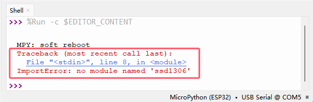

Please import library referring to **2-1-7 Import Arduino Library** or can click **[Import MicroPython Library](https://docs.keyestudio.com/projects/KS5020/en/latest/docs/2.%20MicroPython_Tutorial.html#import-micropython-library-important)** to refer to import library.

Click  to run the code. After uploading the code,  OLED displays strings in various forms and displays various graphics.


Click  to exit the execution.

**⚠️Note: After uploading the code, the OLED display does not show any information, try to press the RESET button on the ESP32 board.**

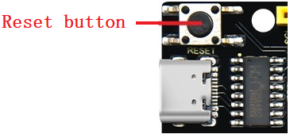

---

**7. Code Explanation**

1\. Import Pin, SoftI2C, ssd1306, sleep, gfx library.

```python
from machine import Pin, SoftI2C
import ssd1306
from time import sleep
import gfx
```
2\. ESP32 pin assignment.

```python
i2c = SoftI2C(scl=Pin(22), sda=Pin(21))
```
3\. Set the width, height and i2c of the OLED.

```python
oled_width = 128
oled_height = 64
oled = ssd1306.SSD1306_I2C(oled_width, oled_height, i2c)
```
4\. Clear OLED.

```python
oled.fill(0)
```
5\. Set the relevant content to be displayed at the location specified by the OLED.

```python
oled.text('Hello, World 1!', 0, 0)
oled.text('Hello, World 2!', 0, 10)
oled.text('Hello, World 3!', 0, 20)
oled.text('Hello, World 4!', 0, 30)
oled.text('Hello, World 5!', 0, 40)
oled.text('Hello, World 6!', 0, 50)
        
oled.show()
```
6\. Horizontal roll function: scroll_in_screen(screen), is the content of scrolling in the entire screen (from left to right).

```python
def scroll_out_screen(speed):
  for i in range ((oled_width+1)/speed):
    for j in range (oled_height):
      oled.pixel(i, j, 0)
    oled.scroll(speed,0)
    oled.show()
```
- It accepts a list as an parameter. For example:

```python
screen1 = [[0, 0 , screen1_row1], [0, 16, screen1_row2], [0, 32, screen1_row3]]
```
- Each list contains coordinates x, y, and a message `[x，y，message]`.

- For example, we will display three lines on the first screen that contain the following message.

```python
screen1_row1 = "Screen 1, row 1"
screen1_row2 = "Screen 1, row 2"
screen1_row3 = "Screen 1, row 3"
```
- Call `scroll_in_screen()` so the content on the screen scrolls from left to right, and it passes the list as an parameter:

```python
scroll_in_screen(screen1)
```

7\. Horizontal scrolling. call `scroll_out_screen(speed)` so the contents of the screen scroll out of the OLED. It accepts as a parameter the number that controls the rolling speed. The speed must be `128 (oled_width)`. 

```python
def scroll_out_screen(speed):
  for i in range ((oled_width+1)/speed):
    for j in range (oled_height):
      oled.pixel(i, j, 0)
    oled.scroll(speed,0)
    oled.show()
```
8\. Continuous horizontal scrolling. Call `scroll_screen_in_out(screen)` to make content flow continuously in and out of the screen.

```python
def scroll_screen_in_out(screen):
  for i in range (0, (oled_width+1)*2, 1):
    for line in screen:
      oled.text(line[2], -oled_width+i, line[1])
    oled.show()
    if i!= oled_width:
      oled.fill(0)
```

9\. Vertical scrolling: `scroll_in_screen_v（screen）`

```python
def scroll_in_screen_v(screen):
  for i in range (0, (oled_height+1), 1):
    for line in screen:
      oled.text(line[2], line[0], -oled_height+i+line[1])
    oled.show()
    if i!= oled_height:
      oled.fill(0)
```
10\. Vertical scrolling: Call `scroll_out_screen_v(speed)` to make the content on the screen scroll vertically. Similar to horizontal ones, it accepts as a parameter the number that controls the rolling speed. The speed must be `64 (oled_height)` number.

```python
def scroll_out_screen_v(speed):
  for i in range ((oled_height+1)/speed):
    for j in range (oled_width):
      oled.pixel(j, i, 0)
    oled.scroll(0,speed)
    oled.show()
```
11\. Continuous vertical scrolling. Call `scroll_in_out_screen_v(screen)` to make content go straight continuously in and out of the screen.

```python
def scroll_screen_in_out_v(screen):
  for i in range (0, (oled_height*2+1), 1):
    for line in screen:
      oled.text(line[2], line[0], -oled_height+i+line[1])
    oled.show()
    if i!= oled_height:
      oled.fill(0)
```
12\. Create a GFX object to draw the shape, which accepts the width and height of the drawing area as parameters. If we want to draw the entire OLED, in addition to passing the width and height of the OLED, we should also pass a display function that draws the pixels as a parameter. Here we use `oled.pixel`.

```python
graphics = gfx.GFX(oled_width, oled_height, oled.pixel)
```
13\. Draw lines. On `gfx`, we use `line(x0, y0, x1, y1, color)` to draw a line. `(x0, y0)` represents the starting point of a line; `(x1, y1)` represents the end of the line. 

Call `OLED.show()` to actually display the shape on the OLED.

```python
graphics.line(0, 0, 127, 20, 1)
oled.show()
```
14\. Draw rectangle. On `gfx`, we use `rect(x0, y0, width, height, color)` to draw a rectangle. `(x0, y0)` represents the upper left corner of the rectangle. Then specify its width, height, and color.

```python
graphics.rect(10, 10, 50, 30, 1)
oled.show()
```
15\. Draw a filled rectangle. `fill_rect(x0, y0, width, height, color)` to draw a filled rectangle. Its parameters are same as `drawRect()`.

```python
graphics.fill_rect(10, 10, 50, 30, 1)
oled.show()
```
16\. `circle(x0, y0, radius, color)` draws a circle with `(x0, y0)` as its center.

```python
graphics.circle(64, 32, 10, 1)
oled.show()
```
17\. `fill_circle(x0, y0, radius, color)` draws a filled circle.

```python
graphics.fill_circle(64, 32, 10, 1)
oled.show()
```
18\. `(x0, y0, x1, y1, x2, y2，color)` draws a triangle, with the coordinates and color of each Angle as parameters.

```python
graphics.triangle(10,10,55,20,5,40,1)
oled.show()
```
19\. `fill_triangle(x0, y0, x1, y1, x2, y2, color)` draws a filled triangle.

```python
graphics.fill_triangle(10,10,55,20,5,40,1)
oled.show()
```
---

### 2-3-30 RFID RC522

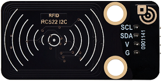

---

**1. Overview**

There is a Keyestudio RFID module in the kit. RFIDRFID-RC522 radio frequency module on it adopts a Philips MFRC522 original chip to design card reading circuit, easy to use and low cost, suitable for advanced application, such as equipment development and card reader development. This module can be directly loaded into a variety of card reader model and connected with the user any CPU board or MCU communication through the IIC interface.

In the experiment, the data read by the module is 4 hexadecimal numbers, and we print these four hexadecimal numbers as strings. For example, we read the data of the IC card “0xE7, 0xB9, 0x65, 0x65”, and the information string displayed in the serial monitor is “E7 B9 65 65”; the data read from the keychain is “0xB4, 0xB4, 0xAA, 0xDB”, and the string displayed in the serial monitor is “B4 B4 AA DB”. Sometimes you see only one-bit, because the “0” is omitted. For instance, “0a” will be printed as “a”. Different IC cards and key chains have diverse data.

---

**2. Parameters**

- Operating voltage: DC 3.3V~5V

- Operating current: 13~100mA /DC 5V 

- Idle current: 10~13mA /DC 5V

- Hibernation current: < 80uA

- Peak current: < 100mA

- Operating frequency: 13.56MHz
- Maximum power: 0.5W

- Supported card types: mifare1 S50, mifare1 S70, mifare UltraLight, mifare Pro, mifare Desfire

- Data transfer rate: Maximum 10Mbit/s
- Operating temperature: -10°C ~ +50°C

- Dimensions: 47.6mm x 23.8mm x 9.3mm

- Interface: 4pin anti-reverse interface spacing 2.54mm

---

**3. Schematic Diagram**


**Radio frequency identification(RFID):**

Its card reader is composed of a radio frequency module and a high-level magnetic field. The Tag transponder is a sensing device, and this device does not contain a battery. It only contains tiny integrated circuit chips and media for storing data and antennas for receiving and transmitting signals. To read the data in the tag, first put it into the reading range of the card reader. The reader will generate a magnetic field, and because the magnetic energy generates electricity according to Lenz’s law, the RFID tag will supply power, thereby activating the device.

**Schematic diagram:**


---

**4. Components**

|  | 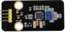||
| ------------------------ | ------------------------ | ---------------------------- |
|ESP32 main board x1 |RFID module x1    | F-F DuPont wires |
|||  |
|IC card/key chain x1| Micro USB cable x1 |  |

---

**5. Wiring Diagram**

**Schematic diagram:**

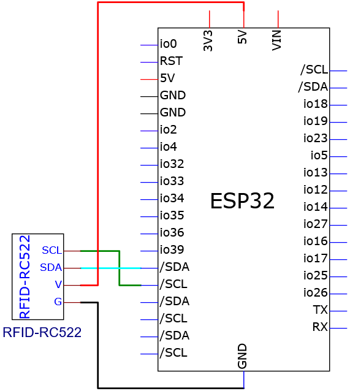

**Wiring diagram:**

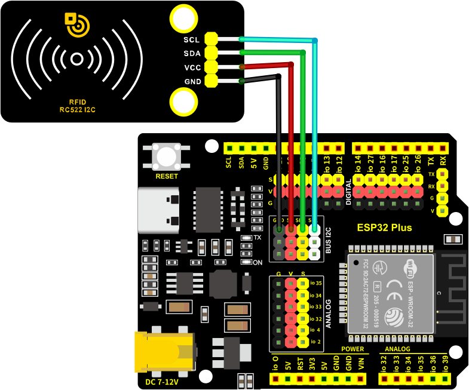

---

**6. Test Code**

Open “Thonny IDE” and choose “This Computer” → “D:” → “Codes” → “MicroPython_Code”. Open the file “2-3-30_RFID_RC522.py” or copy and paste the following code into “Thonny IDE”.

```python
'''
 * Filename    : RFID_RC522 
 * Thonny      : Thonny 4.1.7
 * Auther      : http//www.keyestudio.com
'''
import machine
import time
from mfrc522_i2c import mfrc522

#i2c configuration, define the address and pins of RFID_RC522
addr = 0x28
scl = 22
sda = 21
    
rc522 = mfrc522(scl, sda, addr)
rc522.PCD_Init()
rc522.ShowReaderDetails()    # display details of the PCD-MFRC522 card reader

while True:
    if rc522.PICC_IsNewCardPresent():
        if rc522.PICC_ReadCardSerial() == True:
            print("Card UID:")
            print(rc522.uid.uidByte[0 : rc522.uid.size])
    #time.sleep(1)
```
---

**7. Test Result**

Connect the ESP32 main board to your computer via Micro USB cable. Click  to run the code. If the code fails to run, an error message is displayed in “Shell”.

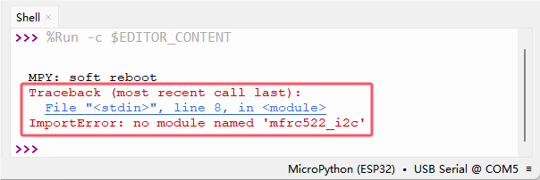

Please import library referring to **2-1-7 Import Arduino Library** or can click **[Import MicroPython Library](https://docs.keyestudio.com/projects/KS5020/en/latest/docs/2.%20MicroPython_Tutorial.html#import-micropython-library-important)** to refer to import library.

Click  to run the code. Approach the IC card and key chain to the sensing area of the RFID module, and the “Shell”shows the read values of the RFID module.

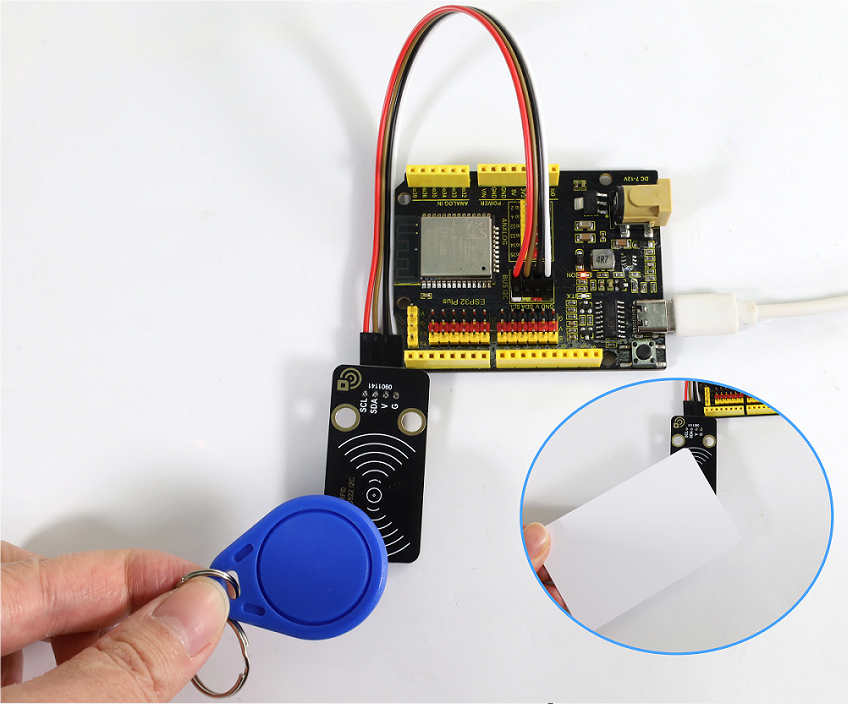

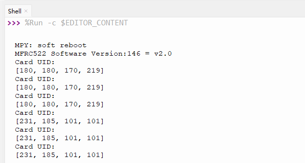

Click  to exit the execution.

**⚠️The values of IC cards and key chains are unique. Each one is different.** Please write down your UID of them, as they will be useful later.

**⚠️ATTENTION:If the baud rate is set, the UID code of the IC card or key chain is still not displayed in the “Shell” after scanning, please try to press the RESET button on the ESP32 board.**


---

**8. Code Explanation**

1\. Import machine, time, mfrc522_i2c library.

```python
import machine
import time
from mfrc522_i2c import mfrc522
```
2\. i2c configuration, define the address and pins of RFID_RC522.

```python
addr = 0x28
scl = 22
sda = 21
```
3\. Create <span style="color: rgb(255, 76, 0);">MFRC522</span> instance, representing a specific RFID module attached to MicroPython.

```python
rc522 = mfrc522(scl, sda, addr)
```
4\. Initialize <span style="color: rgb(255, 76, 0);">MFRC522</span> to display details of the PCD-MFRC522 card reader.

```python
rc522.PCD_Init()
rc522.ShowReaderDetails() 
```
5\. The MFRC522 module reads the IC card and key chain information and prints them out.

```python
while True:
    if rc522.PICC_IsNewCardPresent():
        if rc522.PICC_ReadCardSerial() == True:
            print("Card UID:")
            print(rc522.uid.uidByte[0 : rc522.uid.size])
    #time.sleep(1)
```
---

## 2-4 Fun Projects

The previous projects are related to a single sensor. In the following part, we will combine various sensors to create some comprehensive experiments to perform special functions. There are multiple sensors in the kit so we just design a few classic combination experiments, which also illustrate basic logic of how most programs interact with reality.

### 2-4-01 Two Kinds of Transistors

---

**1. Overview**

This kit includes S8550(PNP) and S8050(NPN) transistors which look very similar, so we need to check their labels carefully. When a high level signal passes through the NPN, it is energized. But PNP requires a low level signal to enable it. Both are often used for contactless switches.

Let’s integrate the transistors with leds and buttons!

---

**2.Components**

|  ||||
| ------------------------ | ------------------------ | ---------------------------- |---------------------------- |
| ESP32 main board x1 | button x1 | 10kΩ resistor x2 |1kΩ resistor x1|
|| |||
|breadboard x1 |red LED x1|jumper wires |Micro USB cable x1 |
||||   |
| 220Ω resistor  x1 | NPN transistor (S8050) x1 |PNP transistor (S8550) x1|   |

---

**3. Wiring Diagram 1**

**How to connect NPN(S8050) transistor in the circuit?**

**Schematic diagram 1:**

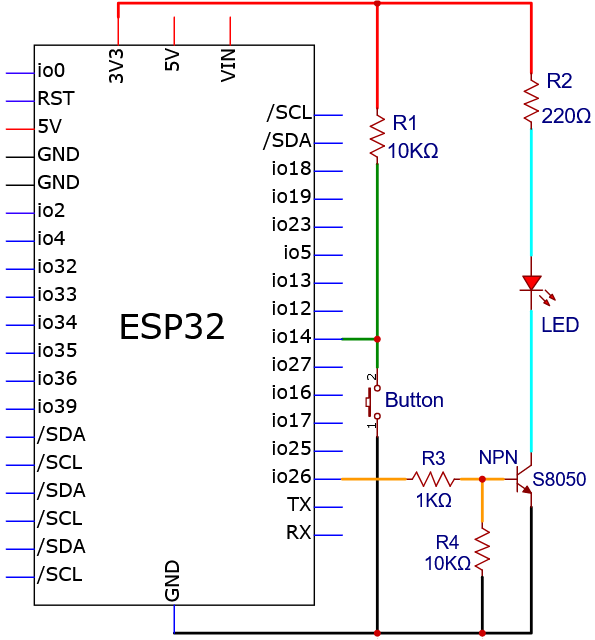

In the circuit, IO14 is at high level by default. When the button is pressed, it becomes low. 

We program the pin IO26 to output **HIGH**. After the current passing through the 1KΩ current-limiting resistor (to protect the transistor), **S8050(NPN) collector** is conducted so that the LED lights up.

**Wiring diagram 1:**

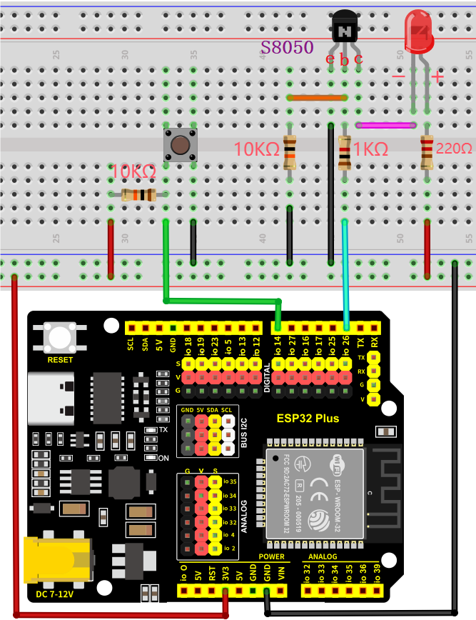

---

**4. Wiring Diagram 2**

**How to connect PNP(S8550) transistor in the circuit?**

**Schematic diagram 2:**

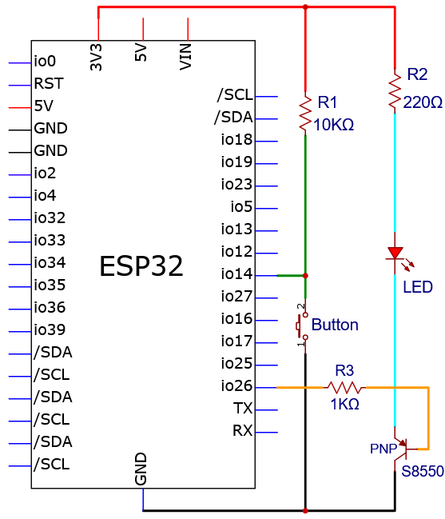

In the circuit, IO14 is at high level by default. When the button is pressed, it becomes low. 

We program the pin IO26 to output **LOW**. After the current passing through the 1KΩ current-limiting resistor (to protect the transistor), the S8550(PNP) is turned on, thus lighting up the LED.

The only difference between this circuit and the previous one is the connection of LED cathode. Here the LED cathode connects to **S8550(PNP) emitter** rather than **S8050(NPN) collector**.

**Wiring diagram 2:**

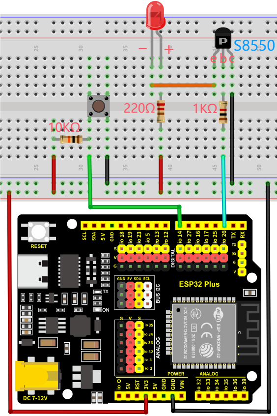

---

**5. Code Flow**

The flow chart of the whole program is shown in the left. 

Flow chart is a method to express program ideas with intuitive graphics, which is easy to understand. Common flowchart symbols are shown in the right.

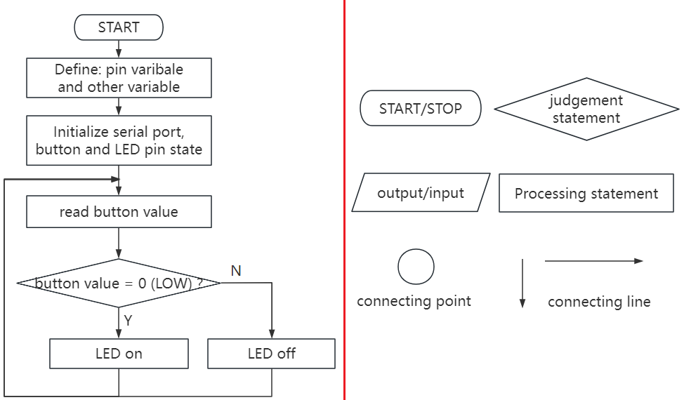

Before designing programs, please draw a flow first to help us better clarify the idea!

---

**6. Test Code**

Open “Thonny IDE” and choose “This Computer” → “D:” → “Codes” → “MicroPython_Code”. Open the file “2-4-01_Two_Kinds_of_Transistors.py” or copy and paste the following code into “Thonny IDE”.

```python
'''
 * Filename    : Two_Kinds_of_Transistors
 * Thonny      : Thonny 4.1.7
 * Auther      : http//www.keyestudio.com
'''
import machine

button = machine.Pin(14, machine.Pin.IN)   # Button
led = machine.Pin(26, machine.Pin.OUT)  # LED

# Start an infinite loop
while True:
    # Read the current value of the 'button' object (0 or 1) and store it in the 'button_status' variable
    button_status = button.value()
    # If the button is pressed (value is 0)
    if button_status == 0: 
        led.value(1) # Turn the LED on
    # If the button is not pressed (value is 1)
    else:
        led.value(0) # turn the LED off
```
---

**7. Test Result**

Two types of transistors can be controlled with the same code. When we press the button, the ESP32 main board will send a low level signal; When we release it, it sends a high signal.

Connect the ESP32 main board to your computer via Micro USB cable. Click  to run the code. After uploading the code, 

- With the S8050 (NPN) circuit, press the button to light up the LED, indicating that it is in a high level on-state;

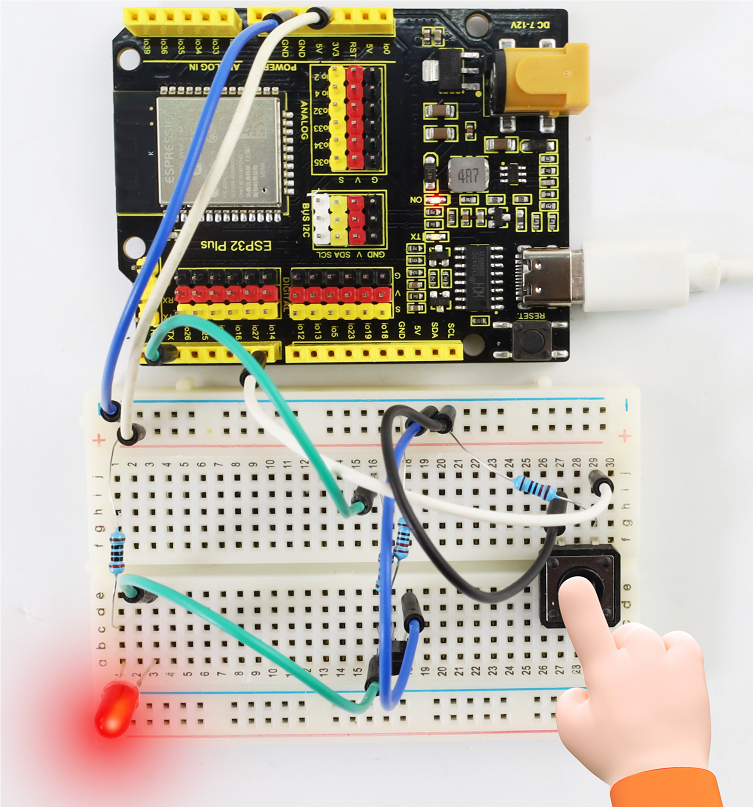

- With the S8550 (PNP) circuit, release the button to light up the LED, indicating that it is in a low level on-state.

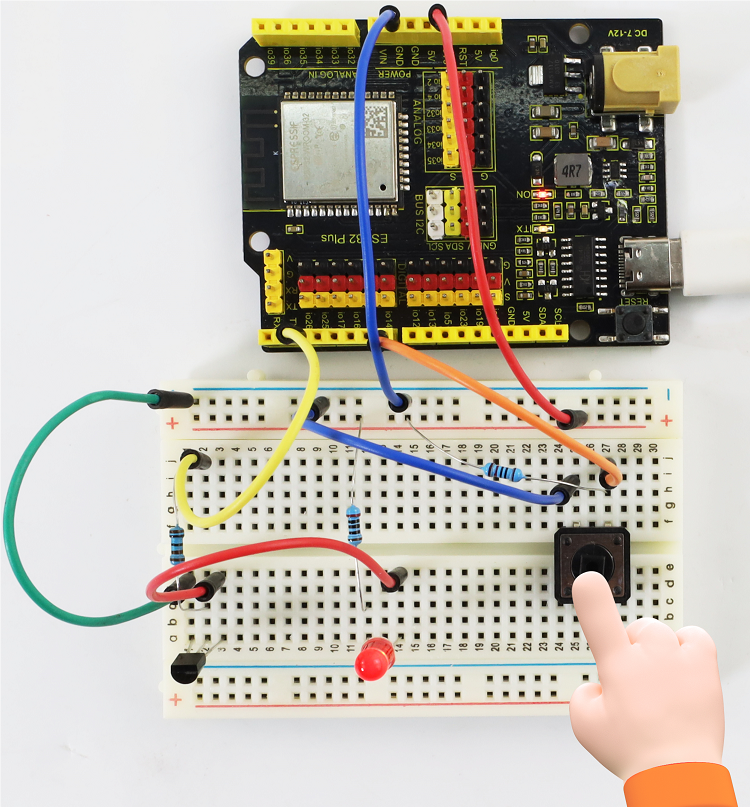

Click  to exit the execution.

---

**8. Code Explanation**

1\. Import machine library.

```python
button = machine.Pin(14, machine.Pin.IN)   # Button
led = machine.Pin(26, machine.Pin.OUT)  # LED
```
2\. Define pins for button and led, and their pin modes.

```python
button = machine.Pin(14, machine.Pin.IN)   # Button
led = machine.Pin(26, machine.Pin.OUT)  # LED
```
3\. Main loop. Button control LED on and off.

```python
# Start an infinite loop
while True:
    # Read the current value of the 'button' object (0 or 1) and store it in the 'button_status' variable
    button_status = button.value()
    # If the button is pressed (value is 1)
    if button_status == 0: 
        led.value(1) # Turn the LED on
    # If the button is not pressed (value is 0)
    else:
        led.value(0) # turn the LED off
```
---

### 2-4-02 Simple Creation-Answer Machine

---

**1. Overview**

In quiz shows, organizers often use a buzzer system in order to accurately, fairly, and intuitively determine the number of seats for respondents.

In this project, we will use some buttons, a passive buzzer and leds to make a simple responder system.

---

**2. Components**

|  ||||
| ------------------------ | ------------------------ | ---------------------------- |---------------------------- |
| ESP32 main board x1 | button x4 | 10kΩ resistor x2 | 220Ω resistor  x3 |
|||||
|breadboard x1 |passive buzzer x1|jumper wires | Micro USB cable x1 |
||||  |
|PGB LED x1  | NPN transistor (S8050) x1 | 1kΩ resistor x1 |  |

---

**3. Wiring Diagram**

**Schematic diagram:**

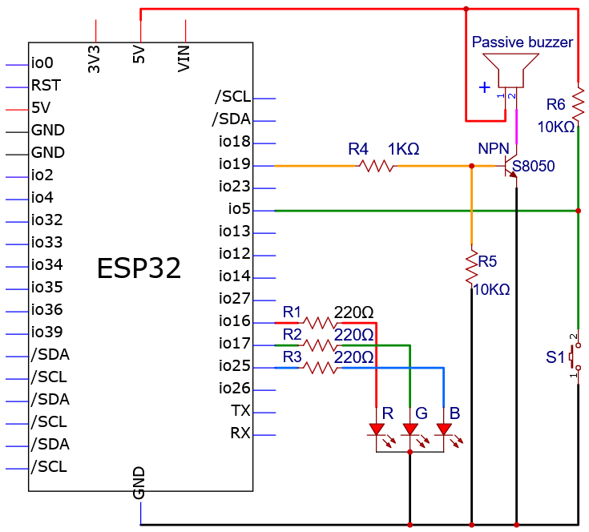

**Wiring diagram:**

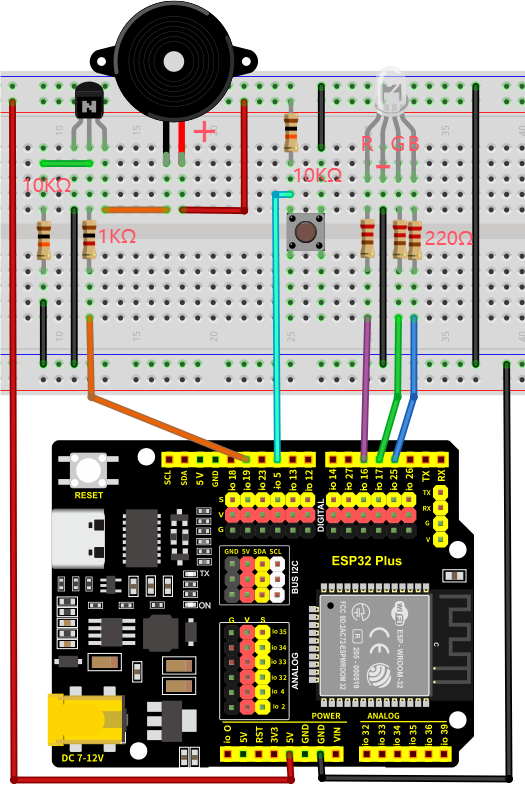

---

**4. Code Flow**

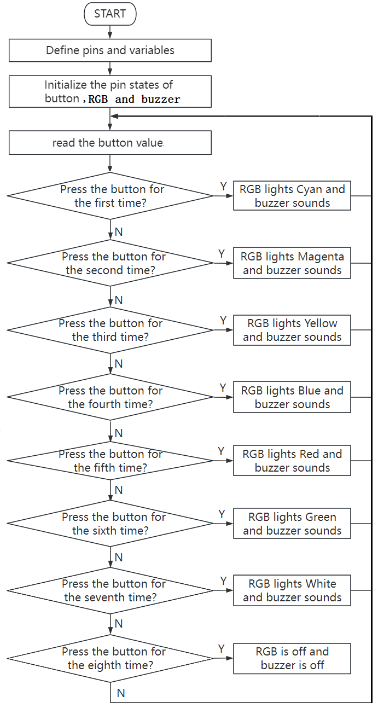

---

**5. Test Code**

Open “Thonny IDE” and choose “This Computer” → “D:” → “Codes” → “MicroPython_Code”. Open the file “2-4-02_Simple_Creation-Answer_Machine.py” or copy and paste the following code into “Thonny IDE”.

```python
'''
 * Filename    : Simple_Creation-Answer_Machine
 * Thonny      : Thonny 4.1.7
 * Auther      : http//www.keyestudio.com
'''
from machine import Pin, PWM 
import machine
from time import sleep

led_R = Pin(16, Pin.OUT) # Set R LED to pin 16, and set it to output mode
led_R.value(0) 
led_G = Pin(17, Pin.OUT) # Set G LED to pin 17, and set it to output mode
led_G.value(0) 
led_B = Pin(25, Pin.OUT) # Set B LED to pin 25, and set it to output mode
led_B.value(0) 

# Define the GPIO pin that is connected to the buzzer
buzzer = machine.PWM(machine.Pin(19))
buzzer.duty_u16(0)

# define the playtone function for the sound of the passive buzzer
def playtone(frequency):
    buzzer.duty_u16(10000)
    buzzer.freq(frequency)
    
button1 = Pin(5, Pin.IN, Pin.PULL_UP) # Set LED to pin 5, and set it to input pull-up mode
flag = 0
Key = 0

def fun(button1):
    global flag
    if flag == 0:
      led_R.value(0)
      led_G.value(1)
      led_B.value(1)
      playtone(392)
      sleep(0.375)
    elif flag == 1:
      led_R.value(1)
      led_G.value(0)
      led_B.value(1)
      playtone(440)
      sleep(0.25)
    elif flag == 2:
      led_R.value(1)
      led_G.value(1)
      led_B.value(0)
      playtone(494) 
      sleep(0.125)
    elif flag == 3:
      led_R.value(0)
      led_G.value(0)
      led_B.value(1)
      playtone(349)
      sleep(0.5)
    elif flag == 4:
      led_R.value(1)
      led_G.value(0)
      led_B.value(0)
      playtone(330)
      sleep(0.625)
    elif flag == 5:
      led_R.value(0)
      led_G.value(1)
      led_B.value(0)
      playtone(294)
      sleep(0.75)
    elif flag == 6:
      led_R.value(1)
      led_G.value(1)
      led_B.value(1)
      playtone(262)
      sleep(1)
    else:
      led_R.value(0)
      led_G.value(0)
      led_B.value(0)
      buzzer.duty_u16(0)
    if flag < 7:
      flag = flag + 1
    else:
      flag = 0
button1.irq(fun,Pin.IRQ_FALLING)
```
---

**6. Test Result**

Connect the ESP32 main board to your computer via Micro USB cable. Click  to run the code. After uploading the code, each time you press the button, the RGB LED lights up in different colors and the passive buzzer plays different tones.

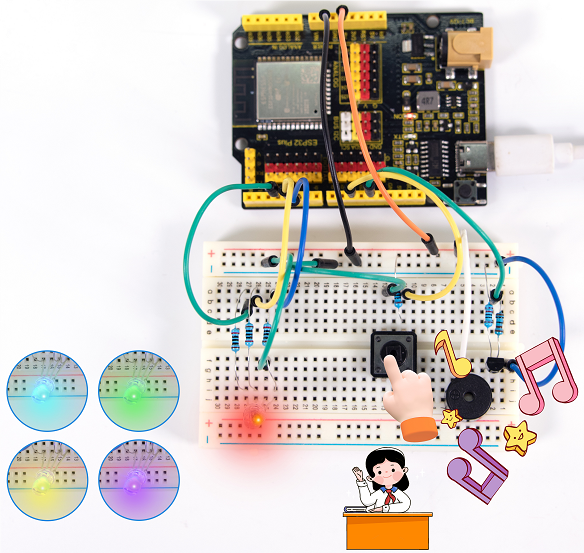

Click  to exit the execution.

---

**7. Code Explanation**

1\. flag, the original value of which is 0, is used as the criterion for judging if. When the if statement in the while is satisfied, flag=1, that is, x meets the condition of the if statement, and then the loop exits. If so, if-else statement will output the correct x. Otherwise, “x satisfies the condition of the if statement” is not found.

```python
def fun(button1):
    global flag
    if flag == 0:
      led_R.value(0)
      led_G.value(1)
      led_B.value(1)
      playtone(392)
      sleep(0.375)
    elif flag == 1:
      led_R.value(1)
      led_G.value(0)
      led_B.value(1)
      playtone(440)
      sleep(0.25)
    elif flag == 2:
      led_R.value(1)
      led_G.value(1)
      led_B.value(0)
      playtone(494) 
      sleep(0.125)
    elif flag == 3:
      led_R.value(0)
      led_G.value(0)
      led_B.value(1)
      playtone(349)
      sleep(0.5)
    elif flag == 4:
      led_R.value(1)
      led_G.value(0)
      led_B.value(0)
      playtone(330)
      sleep(0.625)
    elif flag == 5:
      led_R.value(0)
      led_G.value(1)
      led_B.value(0)
      playtone(294)
      sleep(0.75)
    elif flag == 6:
      led_R.value(1)
      led_G.value(1)
      led_B.value(1)
      playtone(262)
      sleep(1)
    else:
      led_R.value(0)
      led_G.value(0)
      led_B.value(0)
      buzzer.duty_u16(0)
    if flag < 7:
      flag = flag + 1
    else:
      flag = 0 
```
2\. Configure the interrupt mode. 

**fun**: Interrupt the execution of a call-back function;

**trigger**: There are four ways to trigger the interrupt: Pin.IRQ_FALLING(falling edge), Pin.IRQ_RISING(rising edge), Pin.IRQ_LOW_LEVEL(low level), Pin.IRQ_HIGH_LEVEL(high level).

```python
button1.irq(fun,Pin.trigger)
```
The falling and rising edge are collectively called “triggered by edge”, whose process that is a pin value changing from 1 to 0 when the button is pressed. 

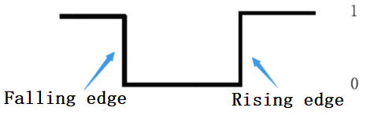

Therefore, we can choose to trigger the external interrupt by falling edge. When the button is pressed, the interrupt is immediately generated.

---

### 2-4-03 Electronic Hourglass

---

**1. Overview**

There is no electronic clock in ancient days, so hourglass is invented to measure time. The capacity of both sides of the hourglass is relatively large, and there is a small channel in the middle. When it is upright, the side with fine sand on the top will flow down through the channel to the other side due to gravity. After they are all down, invert it and record the number of inversion times during a day, so they can know the approximate time the next day with hourglass repeatedly flowing. 

In this project, we use the ESP32 board to control tilt switch and LED to simulate an hourglass.

---

**2. Components**

|  ||||
| ------------------------ | ------------------------ | ---------------------------- |---------------------------- |
| ESP32 main board x1 | tilt switch x1 | 10kΩ resistor x1 | 220Ω resistor  x4 |
|| |||
|breadboard x1 |red LED x4|jumper wires | Micro USB cable x1 |

---

**3. Wiring Diagram**

**Schematic diagram:**

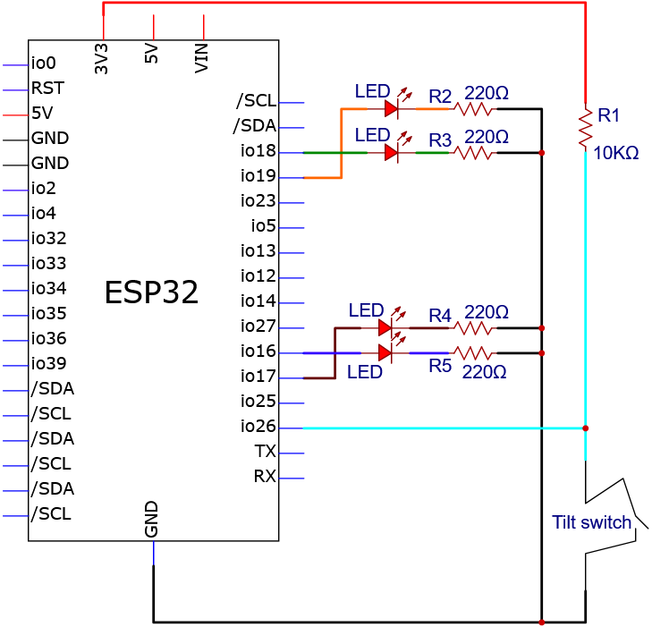


**Wiring diagram:**

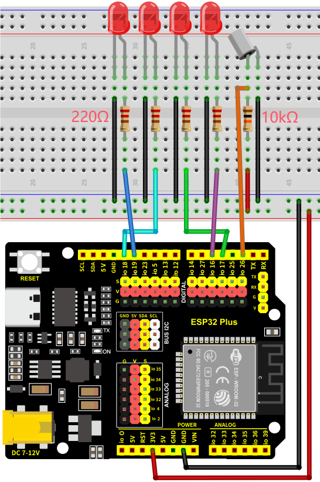

---

**4. Code Flow**

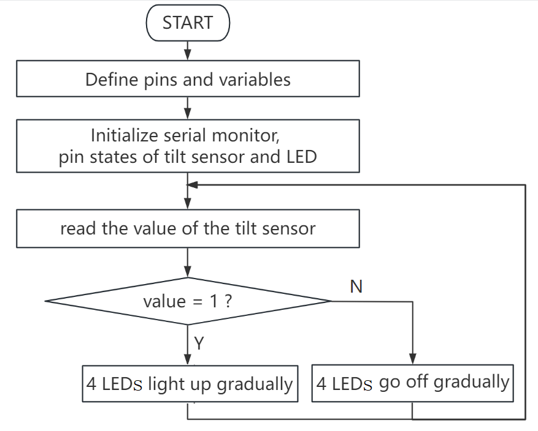

---

**5. Test Code**

Open “Thonny IDE” and choose “This Computer” → “D:” → “Codes” → “MicroPython_Code”. Open the file “2-4-03_Electronic_Hourglass.py” or copy and paste the following code into “Thonny IDE”.

```python
'''
 * Filename    : Electronic_Hourglass
 * Thonny      : Thonny 4.1.7
 * Auther      : http//www.keyestudio.com
'''
from machine import Pin 
import time

led1 = Pin(16, Pin.OUT) # connect LED to pin 16, and set pin 16 to output mode
led2 = Pin(17, Pin.OUT) # connect LED to pin 17, and set pin 17 to output mode
led3 = Pin(18, Pin.OUT) # connect LED to pin 18, and set pin 18 to output mode
led4 = Pin(19, Pin.OUT) # connect LED to pin 19, and set pin 19 to output mode
Tilt_Sensor = Pin(26,Pin.IN) # connect tilt sensor to pin 26, and set pin IO26 to input mode
 
while True:
    if(Tilt_Sensor.value() == 1) : # if the tilt sensor value equals to 1
        led1.value(1) # led1 on
        time.sleep_ms(200) #delay
        led2.value(1) # led2 on
        time.sleep_ms(200) #delay
        led3.value(1) # led3 on
        time.sleep_ms(200) #delay
        led4.value(1) # led4 on
        time.sleep_ms(200) #delay
    else :  # if the tilt sensor value equals to 0
        led4.value(0) # led4 off
        time.sleep_ms(200) #delay
        led3.value(0) # led3 off
        time.sleep_ms(200) #delay
        led2.value(0) # led2 off
        time.sleep_ms(200) #delay
        led1.value(0) # led1 off
        time.sleep_ms(200) #delay
```
---

**6. Test Result**

Connect the ESP32 main board to your computer via Micro USB cable. Click  to run the code. After uploading the code, hold the breadboard and tilt it gently, and LED will light up one by one. Put the breadboard back and they goes off one by one. Like an hourglass, the sand slides down over time.

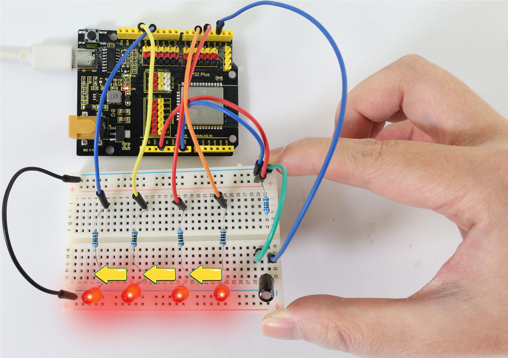

Click  to exit the execution.

---

**7. Code Explanation**

1\. Set pins and variables.

```python
led1 = Pin(16, Pin.OUT) # Set pin 16 as LED object, set pin 16 to output
led2 = Pin(17, Pin.OUT) # Set pin 17 as LED object, set pin 17 to output
led3 = Pin(18, Pin.OUT) # Set pin 18 as LED object, set pin 18 to output
led4 = Pin(19, Pin.OUT) # Set pin 19 as LED object, set pin 19 to output
Tilt_Sensor = Pin(26,Pin.IN) # Set pin 26 as tilt sensor object, set pin IO26 to output
```
2\. Main loop. When the tilt switch is tilted at an Angle (i.e. the ball in the tilt switch is away from the two pins), the four leds light up in turn; On the other hand, they turn off.

```python
while True:
    if(Tilt_Sensor.value() == 1) : # If the tilt switch is tilted at an Angle (i.e., its value is 1)
        led1.value(1) # led1 on
        time.sleep_ms(200) # delay
        led2.value(1) # led2 on
        time.sleep_ms(200) # delay
        led3.value(1) # led3 on
        time.sleep_ms(200) # delay
        led4.value(1) # led4 on
        time.sleep_ms(200) # delay
    else :  # If the tilt switch is not tilted (i.e., its value is 0)
        led4.value(0) # led4 off
        time.sleep_ms(200) # delay
        led3.value(0) # led3 off
        time.sleep_ms(200) # delay
        led2.value(0) # led2 off
        time.sleep_ms(200) # delay
        led1.value(0) # led1 off
        time.sleep_ms(200) # delay
```
---

### 2-4-04 Burglar Alarm

---

**1. Overview**

We have learned the working principle of PIR motion sensor. So in this project, we combine the PIR motion sensor, an LED and an active buzzer to build an burglar alarm. If it detects a human motion, the buzzer alarms and the LED blinks.

---

**2.Components**

|   ||||
| ------------------------ | ------------------------ | ---------------------------- |---------------------------- |
|ESP32 main board x1 | NPN transistor (S8050) x1 | active buzzer x1 | 1kΩ resistor x1 |
||| ||
| PIR motion sensor x1 |M-F DuPont wires |red LED x1|220Ω resistor  x1  |
|||||
|breadboard x1 |jumper wires | Micro USB cable x1 | 10kΩ resistor x1 |

---

**3. Wiring Diagram**

**Schematic diagram:**

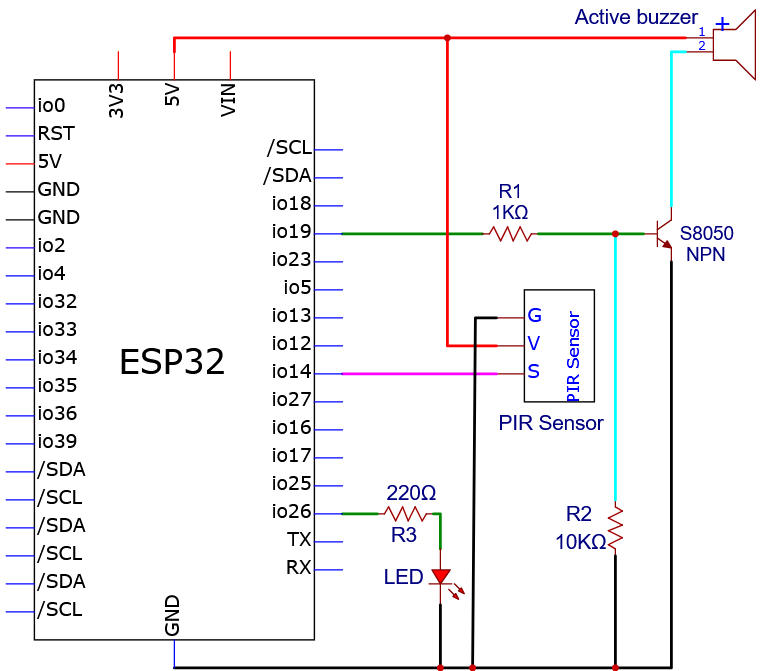

**Wiring diagram:**

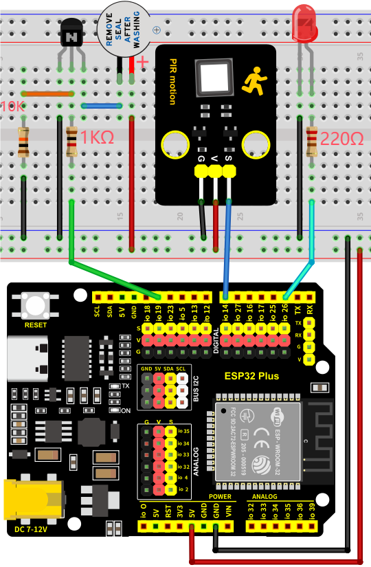

---

**4. Code Flow**

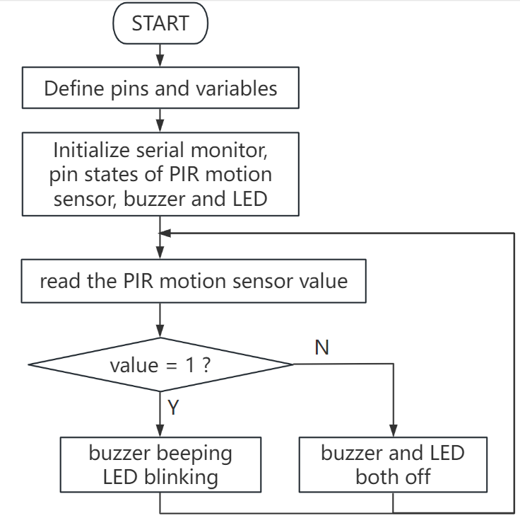

---

**5. Test Code**

Open “Thonny IDE” and choose “This Computer” → “D:” → “Codes” → “MicroPython_Code”. Open the file “2-4-04_Burglar_Alarm.py” or copy and paste the following code into “Thonny IDE”.

```python
'''
 * Filename    : Burglar_Alarm
 * Thonny      : Thonny 4.1.7
 * Auther      : http//www.keyestudio.com
'''
# import Pin and time library
from machine import Pin
import time

# define pins for PIR motion sensor, led and active buzzer. 
sensor_pir = Pin(14, Pin.IN)
led = Pin(26, Pin.OUT)
buzzer = Pin(19, Pin.OUT)

while True: 
      if sensor_pir.value():
          buzzer.value(1)
          led.value(1)
          time.sleep(0.2)
          buzzer.value(0)
          led.value(0)
          time.sleep(0.2)         
      else:
          buzzer.value(0)
          led.value(0)
```

---

**6. Test Result**

Connect the ESP32 main board to your computer via Micro USB cable. Click  to run the code. After uploading the code, when the PIR motion sensor detects a movement, its built-in LED goes off, the buzzer emits sound and the external LED blinks.

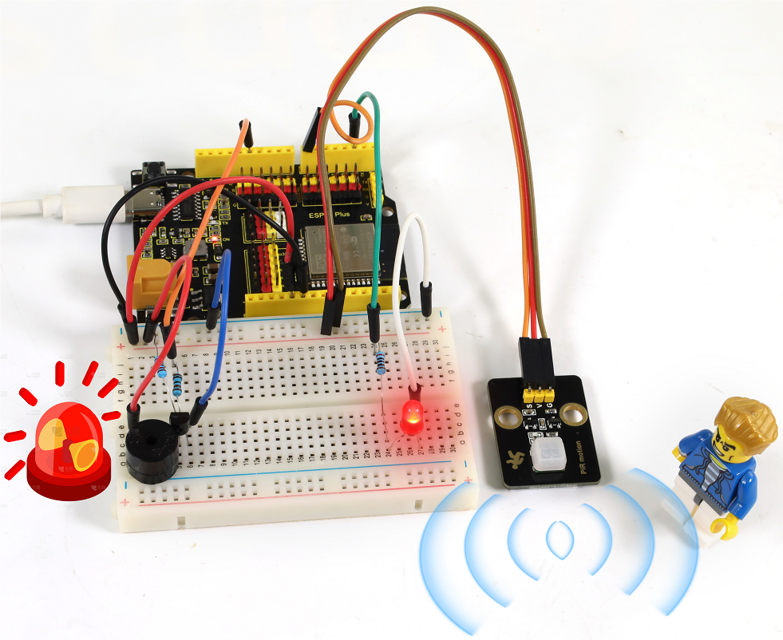

Click  to exit the execution.

---

**7. Code Explanation**

1\. Set pins and variables.

```python
sensor_pir = Pin(14, Pin.IN)
led = Pin(26, Pin.OUT)
buzzer = Pin(19, Pin.OUT)
```
2\. Main loop. Print the sensor digital signal output on serial monitor. When the PIR motion sensor detects a movement(i.e. it outputs high), the buzzer emits sound and the external LED blinks. Otherwise, the LED is off and the buzzer does not sound.

```python
while True: 
      if sensor_pir.value():
          buzzer.value(1)
          led.value(1)
          time.sleep(0.2)
          buzzer.value(0)
          led.value(0)
          time.sleep(0.2)         
      else:
          buzzer.value(0)
          led.value(0)
```
---

### 2-4-05 Home Appliances

---

**1. Overview**

In daily life, we generally use 220V AC to drive electrical appliances and control them with switches. However, if the switch is directly connected to the 220V AC circuit, once leakage occurs and people will be in danger. 

Therefore, in this project, we specially designed this relay module with NO(normally open) and NC(normally closed) to control motor rotation.

---

**2. Component Knowledge**

**Relay:** Relay uses a low-power circuit to control a high-power one. It consists of an electromagnet(controlled by low-power circuit) and a contact(control high-power circuit). When the electromagnet is energized, it attracts the contact. Below is a diagram of a commonly used relay:


---

**Parameters**

- Operating voltage: DC 5V
- Current: 50 mA
- Max power: 0.25W
- Input signal: digital signal
- Shock current: less than 3 A
- Operating temperature: -10°C ~ +50°C
- Control signal: digital signal
- Dimensions: 47.6 x 23.8 x 19 mm
- Positioning hole size: diameter of 4.8 mm

---

**Working principle:**

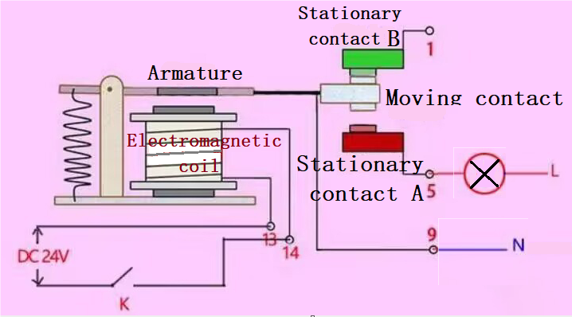

A relay comes with one moving contact and two static contacts A and B.

When the K is opened, no current passes through the relay. At this time, the moving contact contacts with the static contact B, so the upper part of the circuit is on. B is called the normally closed contact (NC), that is, the coil is closed without power.

When the K is closed, the relay circuit generates magnetic force through the current. At this time, the moving contact contacts the static contact A, so the lower part of the circuit is  on. A is called normally open contact (NO), that is, the coil is disconnected without power.

The moving contact is also known as common contact(COM).

A relay, in simple terms, is a switch. VCC is the positive power supply, GND is the negative power supply, IN is signal input pin, COM is a common terminal, NC is normally closed, and NO is the normally opened.

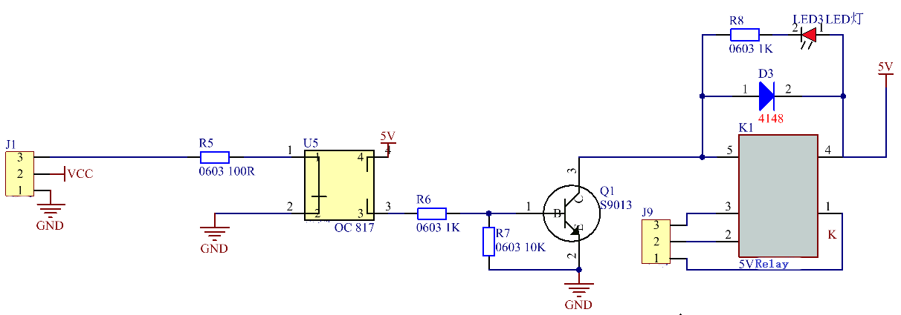

This relay is compatible with a variety of MCU control boards, which can be called an “automatic switch” controlling large current by small current. It allows control board to drive 3A loads, such as LED lights, DC motors, micro water pumps, solenoid valves pluggable interfaces.

- If you want to know more about relay, refer to: [Relay - Wikipedia](https://en.wikipedia.org/wiki/Relay)

---

**3.Components**

|  ||||
| ------------------------ | ------------------------ | ---------------------------- |---------------------------- |
|ESP32 main board x1 |  button x1   |10kΩ resistor x1 |breadboard x1 |
| | |||
|relay x1|LED x1|220Ω resistor  x1|M-F DuPont wires|
|||  |  |
|jumper wires | Micro USB cable x1 |  |   |

---

**4. Wiring Diagram**

**Schematic diagram:**

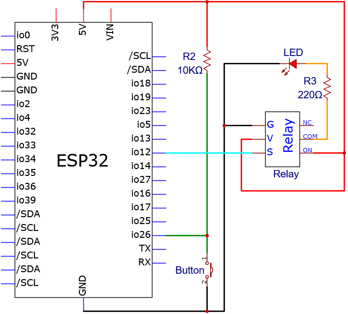

**Wiring diagram:**

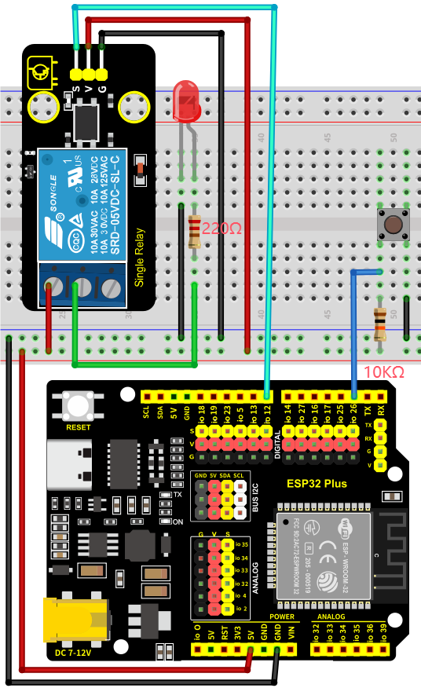

---

**5. Code Flow**

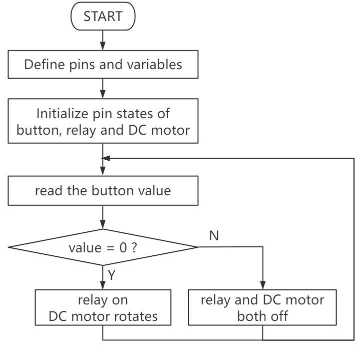

---

**6. Test Code**

Open “Thonny IDE” and choose “This Computer” → “D:” → “Codes” → “MicroPython_Code”. Open the file “2-4-05_Home_Appliances.py” or copy and paste the following code into “Thonny IDE”.

```python
'''
 * Filename    : Home_Appliances
 * Thonny      : Thonny 4.1.7
 * Auther      : http//www.keyestudio.com
'''
from machine import Pin
import time

relay = Pin(12, Pin.OUT) # connect relay to pin 12, and set pin 12 to output mode                  
button = Pin(26, Pin.IN, Pin.PULL_UP) #connect button to pin 26, and set pin 26 to input pull-up mode

# define a function called reverseGPIO() to reverse the relay output level
def reverseGPIO():
    if relay.value():
        relay.value(0)     #LED off
    else:
        relay.value(1)     #LED on

try:
    while True:
        if not button.value():
            time.sleep_ms(20)
            if not button.value():
                reverseGPIO()
                while not button.value():
                    time.sleep_ms(20)
except:
    pass
```
---

**7. Test Result**

Connect the ESP32 main board to your computer via Micro USB cable. Click  to run the code. After uploading the code, press the button, the relay is conducted and the LED lights up. Press again, the relay disconnected and the LED is off.

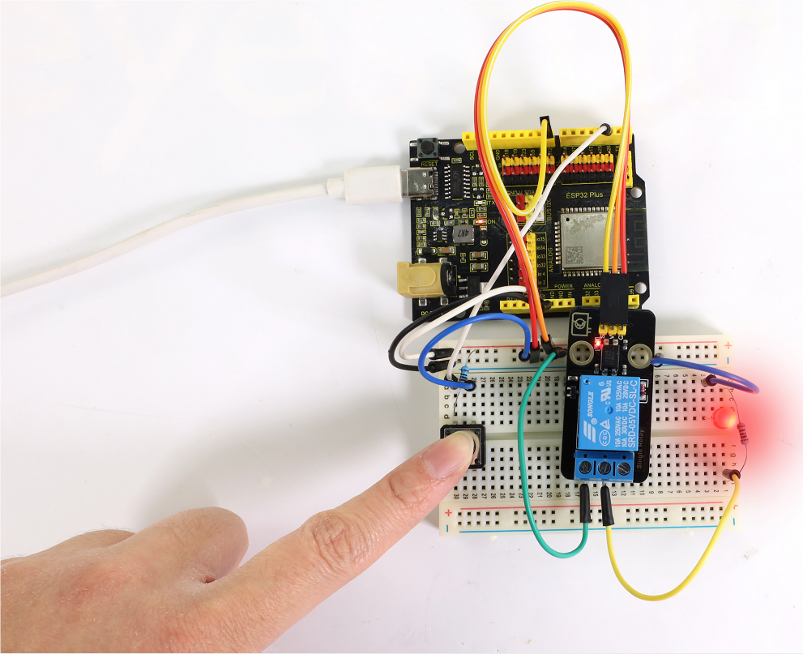

Click  to exit the execution.

---

**8. Code Explanation**

1\. Define a function called **reverseGPIO()** to reverse the relay output level.

```python
def reverseGPIO():
    if relay.value():
        relay.value(0)     #LED off
    else:
        relay.value(1)     #LED on
```
2\. Main loop.

```python
try:
    while True:
        if not button.value():
            time.sleep_ms(20)
            if not button.value():
                reverseGPIO()
                while not button.value():
                    time.sleep_ms(20)
except:
    pass
```
---

### 2-4-06 Dimming Light

---

**1. Overview**

We have learned how the potentiometer works in experiments of breathing LED and transistors. Herein, we use the potentiometer as a switch to control the LED brightness by reading the analog values. The potentiometer analog value ranges from 0 to 4095. The brightness of the LED is controlled by the PWM value, which ranges from 0 to 255.

---

**2.Components**

|  ||||
| ------------------------ | ------------------------ | ---------------------------- |---------------------------- |
| ESP32 main board x1 | potentiometer x1 | red LED x1 | 220Ω resistor  x1 |
||||   |
|breadboard x1 |jumper wires | Micro USB cable x1 |  |

---

**3. Wiring Diagram**

**Schematic diagram:**

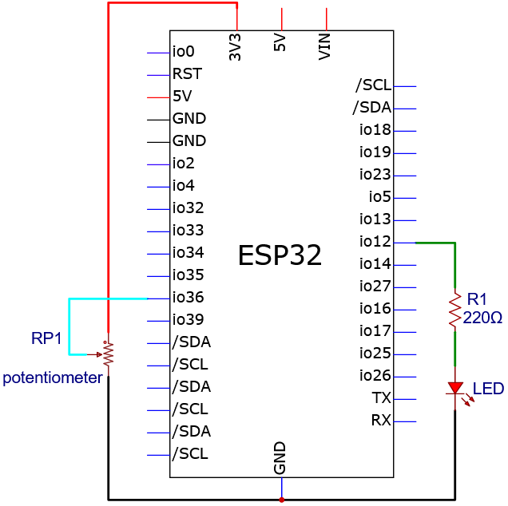

**Wiring diagram:**

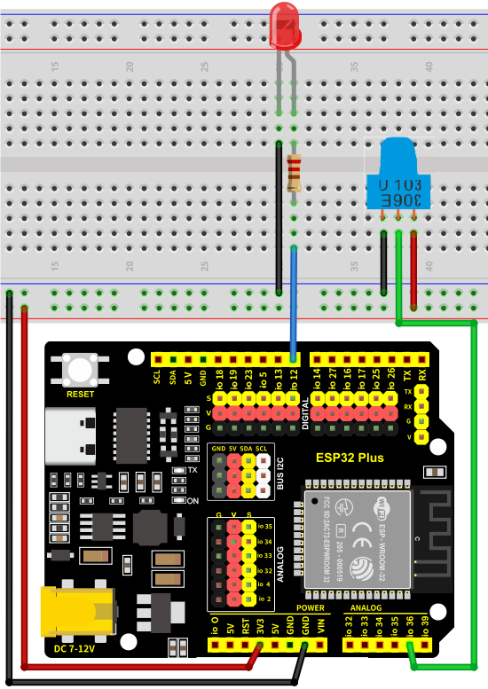

---

**4. Code Flow**

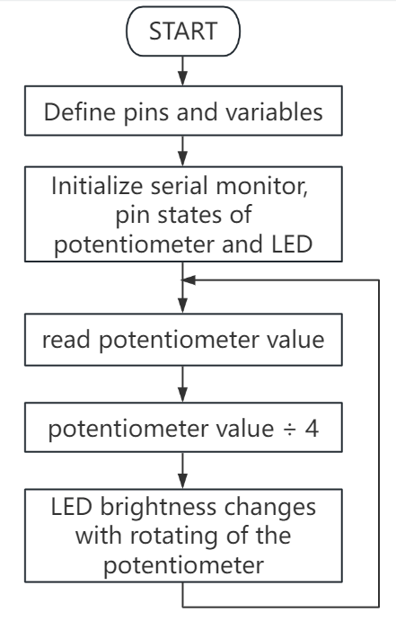

---

**5. Test Code**

Open “Thonny IDE” and choose “This Computer” → “D:” → “Codes” → “MicroPython_Code”. Open the file “2-4-06_Dimming_Light.py” or copy and paste the following code into “Thonny IDE”.

```python
'''
 * Filename    : Dimming_Light
 * Thonny      : Thonny 4.1.7
 * Auther      : http//www.keyestudio.com
'''
from machine import Pin,PWM,ADC 
import time

# define the output frequency of IO12 as 1000Hz and assign it to PWM.
pwm =PWM(Pin(12,Pin.OUT),1000)

# Enable and configure ADC with a range of 0-3.3V
adc=ADC(Pin(36))
adc.atten(ADC.ATTN_11DB)
adc.width(ADC.WIDTH_10BIT)

# Read the ADC value every 0.1 seconds, and convert the ADC value to the pum value to output;
# show these values on “Shell”
try:
    while True:
        adcValue=adc.read()
        pwm.duty(adcValue)
        print(adc.read())
        time.sleep_ms(100)
except:
    pwm.deinit()
```
---

**6. Test Result**

Connect the ESP32 main board to your computer via Micro USB cable. Click  to run the code. After uploading the code, “Shell” reveals the ADC value of the potentiometer. Rotate the potentiometer to adjust the brightness of the red LED.

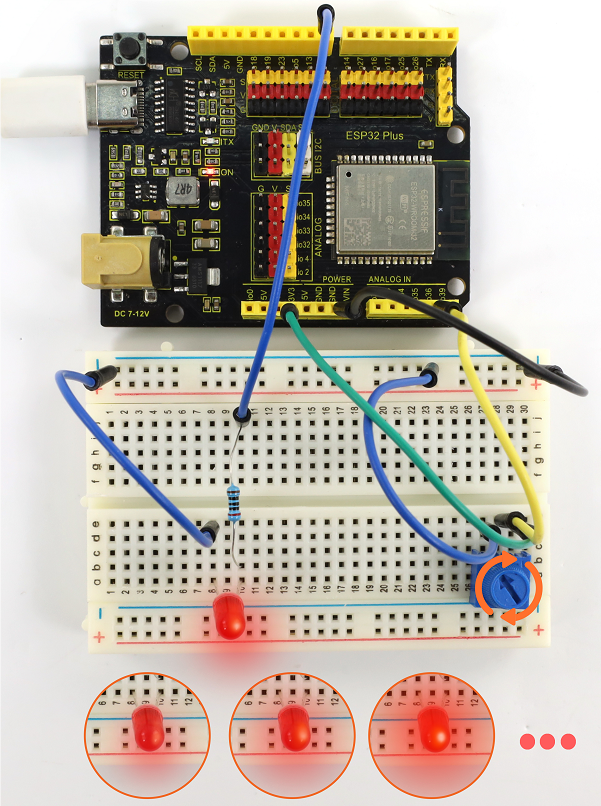

Click  to exit the execution.

---

**7. Code Explanation**

Please refer to [2-3-02](https://docs.keyestudio.com/projects/KS5020/en/latest/docs/2.%20MicroPython_Tutorial.html#breathing-led) and [2-3-17](https://docs.keyestudio.com/projects/KS5020/en/latest/docs/2.%20MicroPython_Tutorial.html#potentiometer) Code Explanation.

---

### 2-4-07 Night Lamp

---

**1. Overview**

We have learned the working principle of photoresistor before. In this project, we will make a combination experiment of photoresistor and red LED. The LED is off when the light intensity is higher than the set value and the LED is on when it is lower than the set value.

---

**2.Components**

|  ||||
| ------------------------ | ------------------------ | ---------------------------- |---------------------------- |
| ESP32 main board x1 | photoresistor x1 |breadboard x1 | red LED x1 |
|||  ||
|jumper wires | Micro USB cable x1 | 10kΩ resistor x1 |  220Ω resistor  x1  |

---

**3. Wiring Diagram**

**Schematic diagram:**

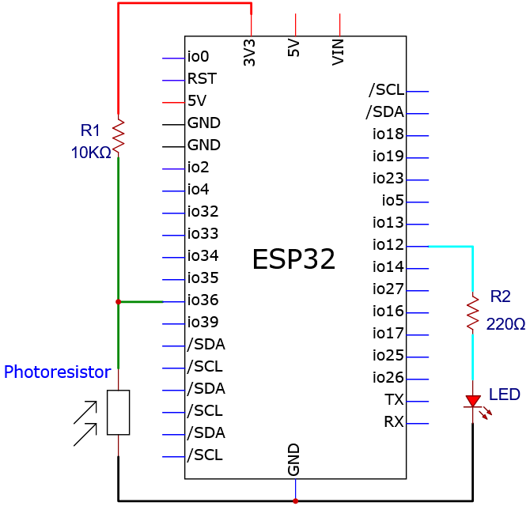


**Wiring diagram:**


---

**4. Code Flow**

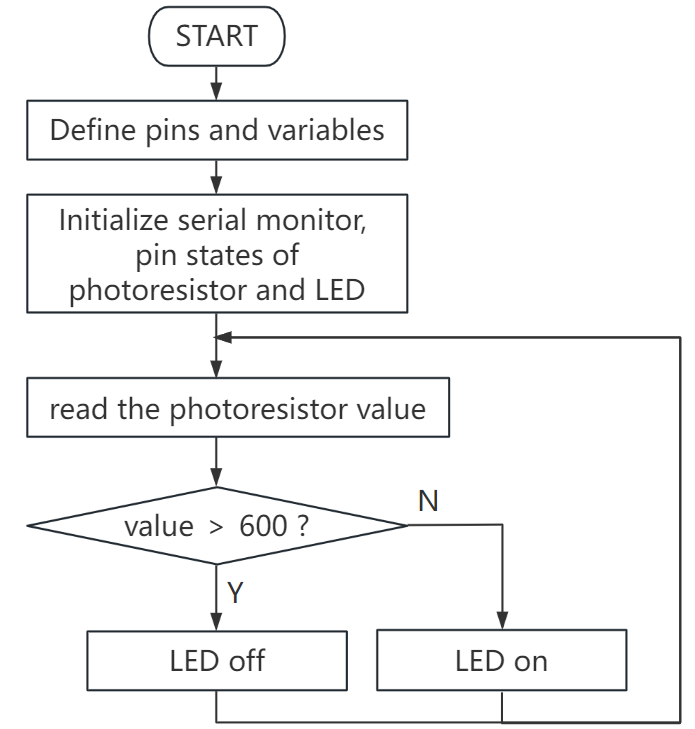

---

**5. Test Code**

Open “Thonny IDE” and choose “This Computer” → “D:” → “Codes” → “MicroPython_Code”. Open the file “2-4-07_Night_Lamp.py” or copy and paste the following code into “Thonny IDE”.

```python
'''
 * Filename    : Night_Lamp
 * Thonny      : Thonny 4.1.7
 * Auther      : http//www.keyestudio.com
'''
from machine import Pin,PWM,ADC
import time

# define the output frequency of IO12 as 1000Hz and assign it to PWM.
pwm =PWM(Pin(12,Pin.OUT),1000) 

# Enable and configure ADC with a range of 0-3.3V
adc=ADC(Pin(36))  
adc.atten(ADC.ATTN_11DB)
adc.width(ADC.WIDTH_10BIT) 

# Read the ADC value every 0.1 seconds, and convert the ADC value to the pum value to output;
# show these values on “Shell”
try:
    while True:
        adcValue=adc.read()
        pwm.duty(adcValue)
        print(adc.read())
        time.sleep_ms(50)
except:
    pwm.deinit()
```
---

**6. Test Result**

Connect the ESP32 main board to your computer via Micro USB cable. Click  to run the code. After uploading the code, “Shell” shows the ADC value of the photoresistor. Shine a light on the photoresistor. The brightness of LED varies with the intensity of the light source.

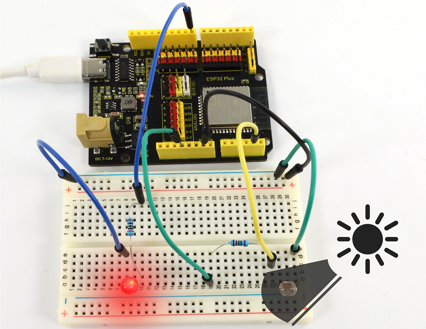

Click  to exit the execution.

---

**7. Code Explanation**

Please refer to [2-3-02](https://docs.keyestudio.com/projects/KS5020/en/latest/docs/2.%20MicroPython_Tutorial.html#breathing-led) and [2-3-17](https://docs.keyestudio.com/projects/KS5020/en/latest/docs/2.%20MicroPython_Tutorial.html#potentiometer) Code Explanation.

---

### 2-4-08 Potentiometer Controls Servo

---

**1. Overview**

---

We have learned how the potentiometer and servo work. In this project, we will use the potentiometer to control the servo to rotate at any Angle.

---

**2.Components**

|  |||
| ------------------------ | ------------------------ | ---------------------------- |
| ESP32 main board x1 | potentiometer x1 | servo x1 |
||||
|breadboard x1 |jumper wires | Micro USB cable x1 |

---

**3. Wiring Diagram**

**Schematic diagram:**

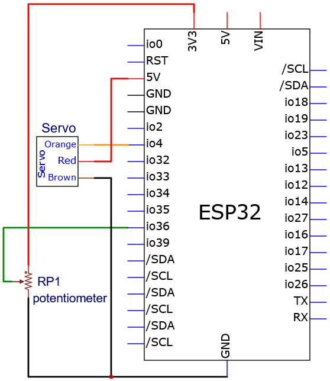

**Wiring diagram:**

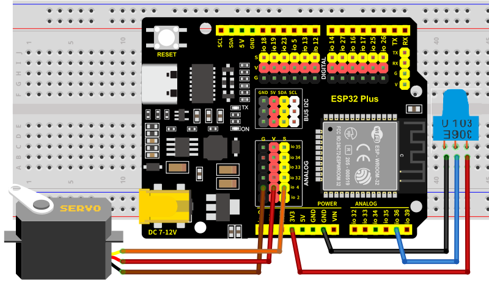

---

**4. Code Flow**

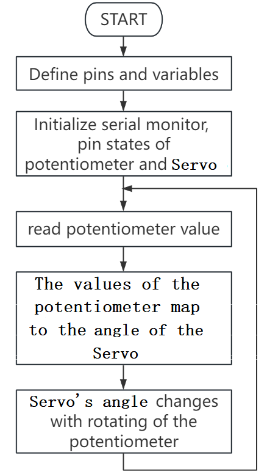

---

**5. Test Code**

Open “Thonny IDE” and choose “This Computer” → “D:” → “Codes” → “MicroPython_Code”. Open the file “2-4-08_Potentiometer_Controls_Servo.py” or copy and paste the following code into “Thonny IDE”.

```python
'''
 * Filename    : Potentiometer_Controls_Servo
 * Thonny      : Thonny 4.1.7
 * Auther      : http//www.keyestudio.com
'''
from machine import Pin,PWM,ADC
import time

# Create a PWM (Pulse Width Modulation) object on Pin 4
servo = PWM(Pin(4,Pin.OUT),10000)

# Set the frequency of the PWM signal to 50 Hz, common for servos
servo.freq(50)

# Define a function for interval mapping
def interval_mapping(x, in_min, in_max, out_min, out_max):
    return (x - in_min) * (out_max - out_min) / (in_max - in_min) + out_min

# Define a function to write an angle to the servo
def servo_write(pin, angle):

    pulse_width = interval_mapping(angle, 0, 180, 0.5, 2.5) # Calculate the pulse width
    duty = int(interval_mapping(pulse_width, 0, 20, 0, 1023))     # Calculate the duty cycle
    pin.duty(duty) # Set the duty cycle of the PWM signal

# Enable and configure ADC with a range of 0-3.3V
adc=ADC(Pin(36))
adc.atten(ADC.ATTN_11DB)
adc.width(ADC.WIDTH_12BIT)

try:
    while True:
        adcValue=adc.read() # Read the ADC value of the potentiometer
        angle=(adcValue*180)/4096 # Convert the ADC value of the potentiometer to the Angle of the servo
        servo_write(servo, int(angle)) # servo rotation Angle
        time.sleep_ms(50)
except:
    servo.deinit()
```

---

**6. Test Result**

Connect the ESP32 main board to your computer via Micro USB cable. Click  to run the code. After uploading the code, rotate the potentiometer and the ESP32 pin(36) reads the ADC value of it. The value is then converted to the angle value for the servo, and the main board controls the servo to rotate to the corresponding angle.

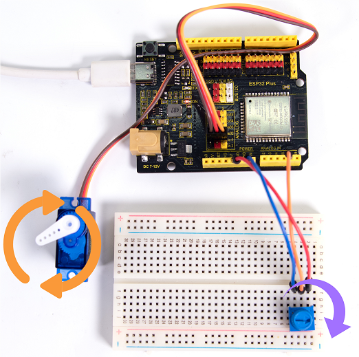

Click  to exit the execution.

---

**7. Code Explanation**

Please refer to [2-3-17](https://docs.keyestudio.com/projects/KS5020/en/latest/docs/2.%20MicroPython_Tutorial.html#potentiometer), [2-3-12](https://docs.keyestudio.com/projects/KS5020/en/latest/docs/2.%20MicroPython_Tutorial.html#servo-rotation) and [2-4-01](https://docs.keyestudio.com/projects/KS5020/en/latest/docs/2.%20MicroPython_Tutorial.html#two-kinds-of-transistors) Code Explanation.

---

### 2-4-09 Light Theremin

---

**1. Overview**

---

The theremin is an electronic music instrument controlled without any physical contact.

It consists of two antennas attached to a box with knobs (one for the pitch and one for the volume), oscillators, amplifiers, and a speaker. The two hands of Thereminist is detected to control the oscillator and volume so that to play different tones according to hands’ positions.

Although we cannot make a complete Theremin with ESP32, we can design a game similar to it with a photoresistor and a passive buzzer.

- You can learn more about theremin from Wiki: [Theremin - Wikipedia](https://en.wikipedia.org/wiki/Theremin)

---

**2.Components**

|  ||||
| ------------------------ | ------------------------ | ---------------------------- |---------------------------- |
| ESP32 main board x1 | photoresistor x1 |breadboard x1 | red LED x1 |
|||  ||
|jumper wires | Micro USB cable x1 | 10kΩ resistor x2 |  220Ω resistor  x1  |
||||  |
| NPN transistor (S8050) x1 | passive buzzer x1 | 1kΩ resistor x1 |  |

---

**3. Wiring Diagram**

**Schematic diagram:**

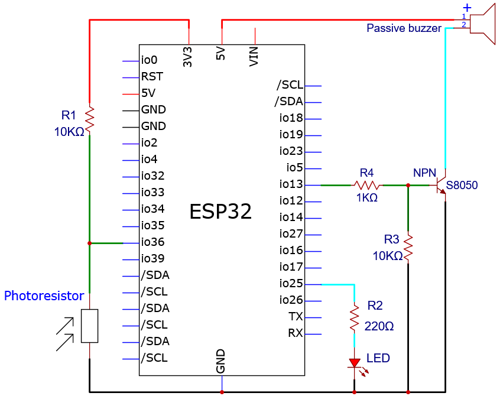

**Wiring diagram:**

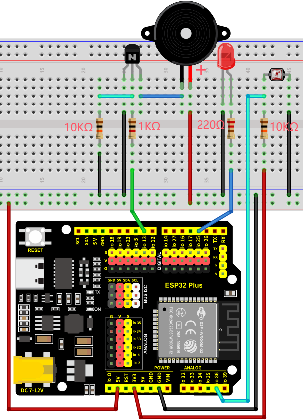

Calibrate the light intensity range by waving your hand over the photoresistor before the project. Connect the LED to the IO25 as an indicator during calibration. When the LED lights up, it indicates the start of calibration, and when the LED goes out, the calibration ends.

When you wave your hand in front of the photoresistor, its value changes to control the passive buzzer to play different tones. Each photoresistor value is mapped to a certain tone, so that the buzzer plays music when you wave your hands.

---

**4. Code Flow**

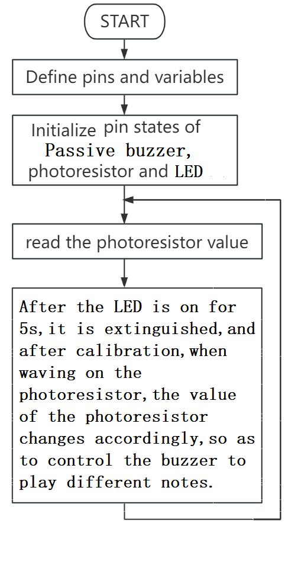

---

**5. Test Code**

Open “Thonny IDE” and choose “This Computer” → “D:” → “Codes” → “MicroPython_Code”. Open the file “2-4-09_Light_Theremin.py” or copy and paste the following code into “Thonny IDE”.

```python
'''
 * Filename    : Light_Theremin
 * Thonny      : Thonny 4.1.7
 * Auther      : http//www.keyestudio.com
'''
from machine import Pin, PWM, ADC
import time

# Initialize LED pin
led = Pin(25, Pin.OUT)

# Initialize light sensor
sensor = ADC(Pin(36))
sensor.atten(ADC.ATTN_11DB)
sensor.width(ADC.WIDTH_12BIT)

# Initialize buzzer
buzzer = PWM(Pin(13), freq=440, duty=0)

light_low = 4095
light_high = 0

# Map the interval of input values to output values
def interval_mapping(x, in_min, in_max, out_min, out_max):
    return (x - in_min) * (out_max - out_min) / (in_max - in_min) + out_min

# Create a tone using the specified pin, frequency, and duration
def tone(pin,frequency,duration):
    pin.freq(frequency)
    pin.duty(512)
    time.sleep_ms(duration)
    pin.duty(0)

# Calibrate the photoresistor's maximum and minimum values in 5 seconds.
timer_init_start = time.ticks_ms()
led.value(1) # turn on the LED
while time.ticks_diff(time.ticks_ms(), timer_init_start)<5000:
    light_value = sensor.read()
    if light_value > light_high:
        light_high = light_value
    if light_value < light_low:
        light_low = light_value
led.value(0) # turn off the LED

# Play the tones based on the light values
while True:
    light_value  = sensor.read()
    pitch = int(interval_mapping(light_value,light_low,light_high,50,6000))
    if pitch > 50 :
        tone(buzzer,pitch,20)
    time.sleep_ms(10)
```
---

**6. Test Result**

Connect the ESP32 main board to your computer via Micro USB cable. Click  to run the code. After uploading the code, the LED lights up, giving us 5 seconds to calibrate the detection range of the photoresistor.

Calibration is a crucial step. It takes into account not only the variety of lighting conditions we may encounter when using equipment, such as varying light intensity at different times of day, but also the distance between our hand and the photoresistor, which determines the playable range of the instrument.

After calibration, the LED indicator is off. Now we can wave hands to play music.  This allows us to adjust the height of our hands during composition. It is such an interactive and enjoyable experience!

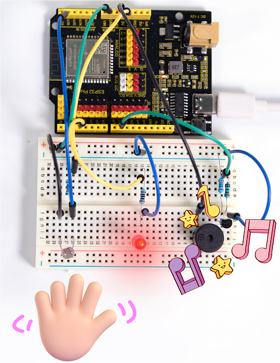

Click  to exit the execution.

---

**7. Code Explanation**

1\. Set pins and variables.

```python
# Initialize LED pin
led = Pin(25, Pin.OUT)

# Initialize light sensor
sensor = ADC(Pin(36))
sensor.atten(ADC.ATTN_11DB)
sensor.width(ADC.WIDTH_12BIT)

# Initialize buzzer
buzzer = PWM(Pin(13), freq=440, duty=0)

light_low = 4095
light_high = 0
```
2\. Map the photoresistor input value to the output value.

```python
def interval_mapping(x, in_min, in_max, out_min, out_max):
    return (x - in_min) * (out_max - out_min) / (in_max - in_min) + out_min
```
3\. Create a tone by the specified pin, frequency, and duration.

```python
def tone(pin,frequency,duration):
    pin.freq(frequency)
    pin.duty(512)
    time.sleep_ms(duration)
    pin.duty(0)
```
4\. Calibrate the maximum and minimum photoresistor values in 5 seconds.

```python
timer_init_start = time.ticks_ms()
led.value(1) # turn on the LED
while time.ticks_diff(time.ticks_ms(), timer_init_start)<5000:
    light_value = sensor.read()
    if light_value > light_high:
        light_high = light_value
    if light_value < light_low:
        light_low = light_value
led.value(0) # turn off the LED
```
5\. Play tone based on the ADC value of the light intensity detected by the photoresistor.

```python
while True:
    light_value  = sensor.read()
    pitch = int(interval_mapping(light_value,light_low,light_high,50,6000))
    if pitch > 50 :
        tone(buzzer,pitch,20)
    time.sleep_ms(10)
```
---

### 2-4-10 Fire-Fighting Robot

---

**1. Overview**

Do you know about fire-fighting robots? According to estimates by the National Crime Records Bureau (NCRB), fire accidents in India have killed more than 1.2 million people from 2010 to 2014. Even though many precautions are taken, these disasters still happen from time to time. With the advancement of technology and the development of robot technology, it is very possible to use robots to replace firefighters in the future, which improves the efficiency of fire fighting and protects the lives of firefighters.

In this project, we will learn how to build a very simple robot with the ESP32 board. We detect the flame with the flame sensor and turn on the motor to blowout the fire source.

---

**2. Components**

|  ||  ||
| ------------------------ | ------------------------ | ---------------------------- |---------------------------- |
|ESP32 main board x1 |flame sensor x1|LED x1|220Ω resistor  x1|
| | |||
| DC motor x1 |breadboard x1 |jumper wires | Micro USB cable x1 |
|||  |  |
|fan x1|battery holder x1|AA battery (**self-provided**) x6 |   |

**⚠️Note that please assemble the fan and the motor first.**

---

**3. Wiring Diagram**

**Schematic diagram:**

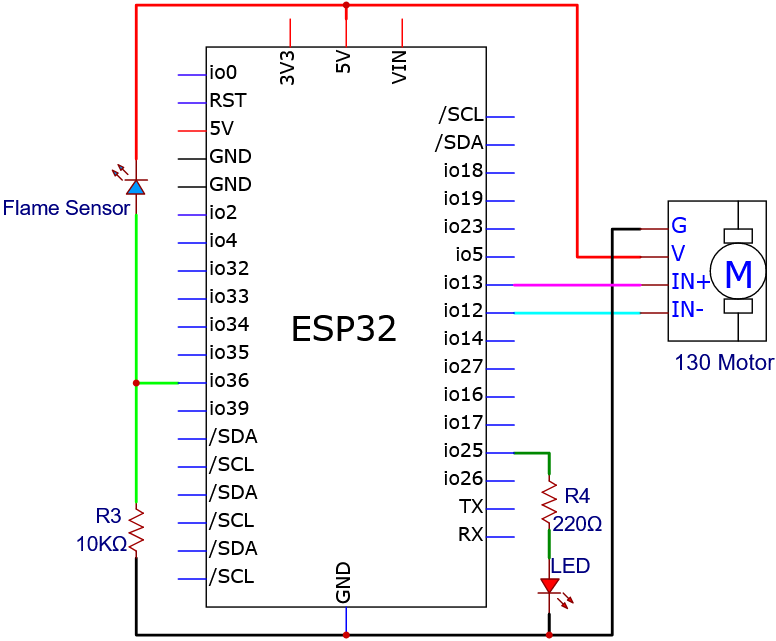

**Wiring diagram:**

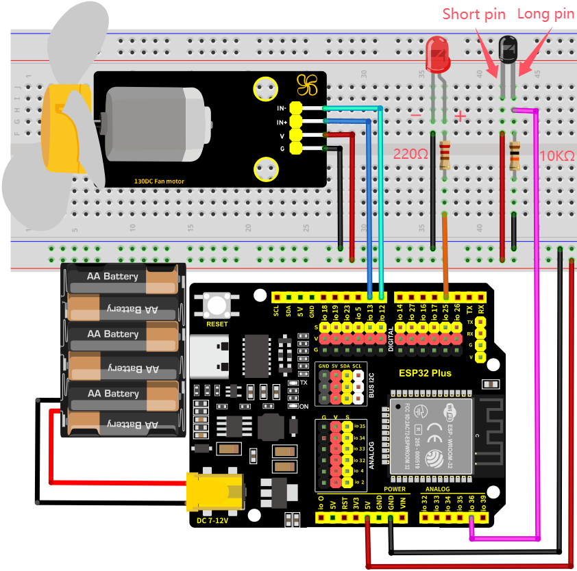

---

**4. Code Flow**

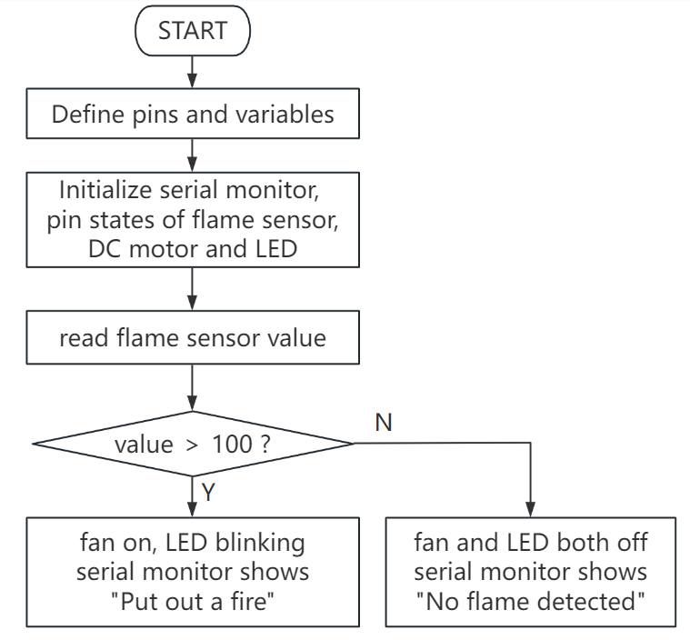

---

**5. Test Code**

**The threshold 2000 in the code can be adjusted according to actual conditions.**

Open “Thonny IDE” and choose “This Computer” → “D:” → “Codes” → “MicroPython_Code”. Open the file “2-4-10_Fire-Fighting_Robot.py” or copy and paste the following code into “Thonny IDE”.

```python
'''
 * Filename    : Fire-fighting_robot
 * Thonny      : Thonny 4.1.7
 * Auther      : http//www.keyestudio.com
'''
# import pin and ADC module
from machine import ADC,Pin
import time

# Enable and configure ADC with a range of 0-3.3V
adc=ADC(Pin(36))
adc.atten(ADC.ATTN_11DB)
adc.width(ADC.WIDTH_12BIT)

# connect LED to pin 25 and set it to output
led = Pin(25, Pin.OUT)   

# motor pins
INA = Pin(13, Pin.OUT) # INA to IN+
INB = Pin(12, Pin.OUT) # INB to IN-

while True:
    adcVal=adc.read()  # read the ADC value of the flame sensor
    print(adcVal)  # show ADC value on “Shell”
    if adcVal > 2000:  # when the ADC value of the flame sensor is greater than 2000
        # turn on the motor
        INA.value(0)
        INB.value(1)
        # LED flashes
        led.value(1)   
        time.sleep(0.5)  
        led.value(0)   
        time.sleep(0.5)  
    else: # when the ADC value of the flame sensor is less than or equal to 2000
        # turn off the motor and LED
        INA.value(0)
        INB.value(0)
        led.value(0)
    time.sleep(0.1)
```
---

**6. Test Result**

**⚠️ATTENTION:** The fan requires a larger current than other sensors when it is rotating, thus voltage and current fluctuations may appear, especially when changing direction. This will greatly reduce the voltage and current of the main board, resulting in a reset. Thus, an external power supply is required.

Connect the ESP32 main board to your computer via Micro USB cable. Click  to run the code. After uploading the code, “Shell” shows the ADC value of the flame sensor. If the value exceeds 2000, the fan will turn on to blowout the fire, with LED blinking. When the value is lower than 2000, the fan and LED turn off.

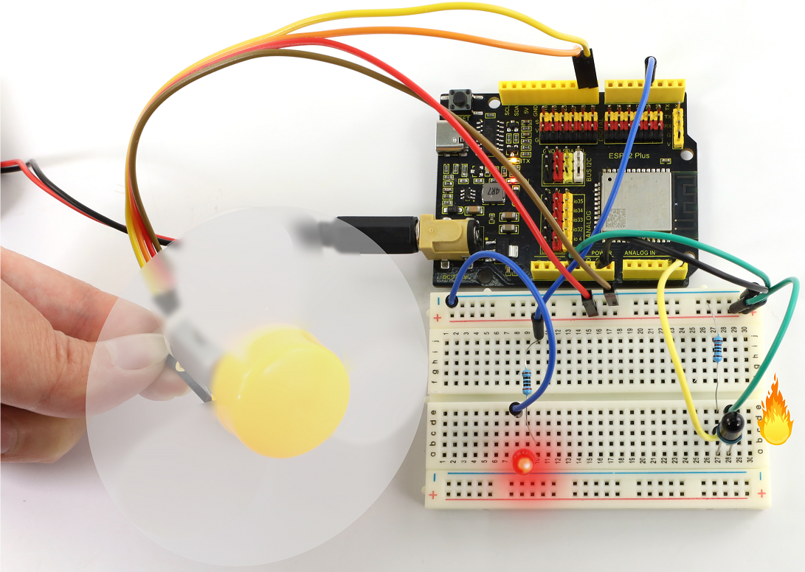

Click  to exit the execution.

---

**7. Code Explanation**

In the code, we set the threshold to 2000(item > 2000), which can be modified according to the actual situations. When the flame sensor detects that the analog value reaches this threshold, the fan will automatically turn on; Otherwise it turns off. See [2-3-11](https://docs.keyestudio.com/projects/KS5020/en/latest/docs/2.%20MicroPython_Tutorial.html#small-fan) for how to drive the fan.

---

### 2-4-11 Corridor Induction Lamp

---

**1. Overview**

Induction lights are generally used in dark corridors, bedrooms, underground garage and bathrooms. They are generally composed of PIR motion sensor, a light and photoresistor. In this project, we will learn how to make an corridor induction light by PIR motion sensor, LED and photoresistor.

---

**2. Components**

|  |||
| ------------------------ | ------------------------ | ---------------------------- |
|ESP32 main board x1 | photoresistor x1 |10kΩ resistor x1|
||  ||
|PIR motion sensor x1|LED x1|220Ω resistor  x1|
||||
|breadboard x1 |jumper wires | Micro USB cable x1 |

---

**3. Wiring Diagram**

**Schematic diagram:**

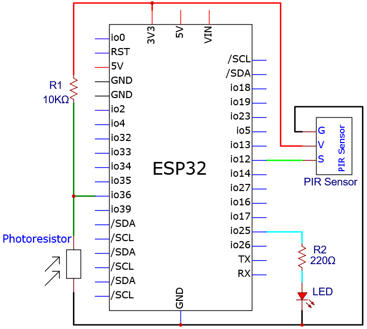

**Wiring diagram:**

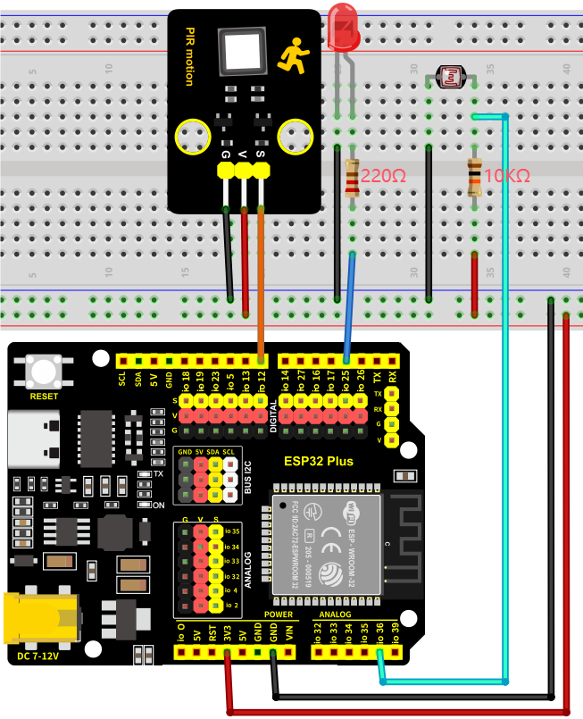

---

**4. Code Flow**

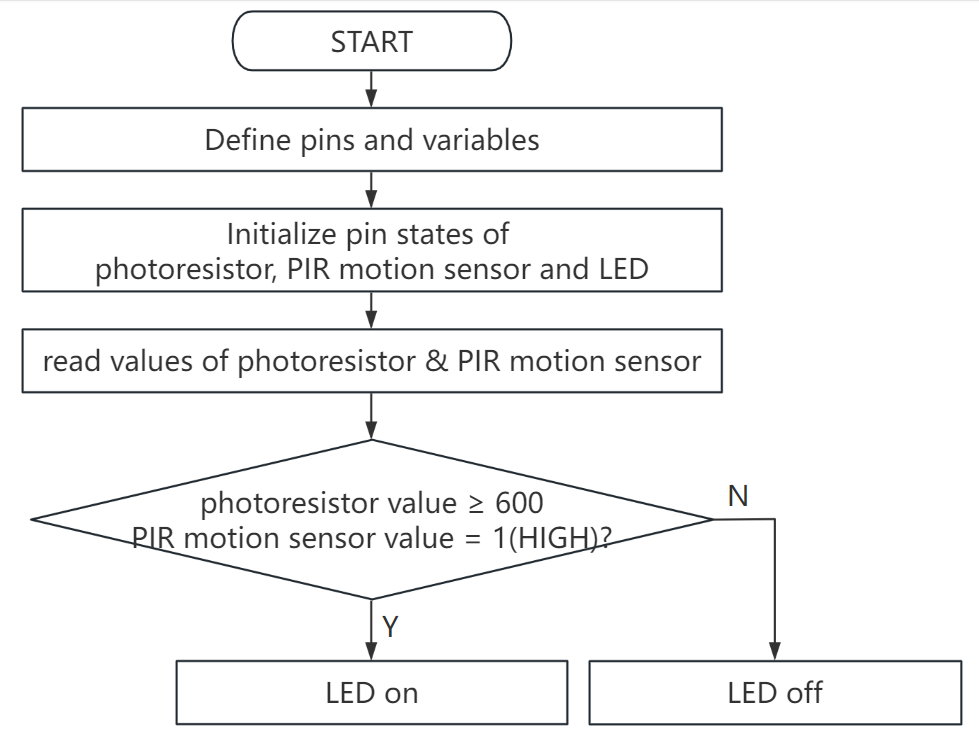

---

**5. Test Code**

**The threshold 3500 in the code can be set according to actual conditions.**

Open “Thonny IDE” and choose “This Computer” → “D:” → “Codes” → “MicroPython_Code”. Open the file “2-4-11_Corridor_Induction_Lamp.py” or copy and paste the following code into “Thonny IDE”.

```python
'''
 * Filename    : Corridor_Induction_Lamp
 * Thonny      : Thonny 4.1.7
 * Auther      : http//www.keyestudio.com
'''
from machine import Pin, ADC
import time
 
# PIR motion sensor pin
human = Pin(12, Pin.IN)
 
# set photoresistor pin to GP36 (ADC function)
adc=ADC(Pin(36))
adc.atten(ADC.ATTN_11DB)
adc.width(ADC.WIDTH_12BIT)

# set LED to pin 25 and set it to output 
led = Pin(25, Pin.OUT)

def detect_someone(): # the function of "if PIR motion sensor detects a motion"
    if human.value() == 1:
        return True
    return False
 
abc = 0
 
while True:
    adcVal=adc.read() # read the ADC value of the photoresistor
    if adcVal > 3500: # when the ADC value of the photoresistor is greater than 3500
        if detect_someone() == True: # if PIR motion sensor detects a motion
            abc += 1 # adc adds 1
            led.value(1) # LED on
            print("value=", abc)
            time.sleep(1)
        else:
            if abc != 0:
                abc = 0
                led.value(0)
    else:
        led.value(0)
 
    time.sleep(0.1)
```
---

**6. Test Result**

Connect the ESP32 main board to your computer via Micro USB cable. Click  to run the code. After uploading the code, cover the sensing area of the photoresistor and wave you hand in front of the PIR motion sensor, and you will see the LED lights up for a few seconds. Meanwhile, the “Shell” prints the lighting duration of the LED. If the PIR motion sensor detects a movement without covering photoresistor, the LED will not turn on.

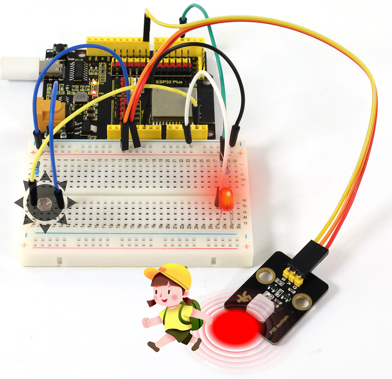

Click  to exit the execution.

---

**7. Code Explanation**

Please refer to [2-3-17](https://docs.keyestudio.com/projects/KS5020/en/latest/docs/2.%20MicroPython_Tutorial.html#potentiometer) and [2-4-01](https://docs.keyestudio.com/projects/KS5020/en/latest/docs/2.%20MicroPython_Tutorial.html#two-kinds-of-transistors) Code Explanation.

---

### 2-4-12 Temperature Detector

---

**1. Overview**

Nowadays, many families may hang a temperature instrument on the wall to measure the indoor temperature. In previous experiments, we have learned how thermistor and OLED display work, so here we will combine them to simulate a temperature detector.

---

**2.Components**

|  ||||
| ------------------------ | ------------------------ | ---------------------------- |---------------------------- |
| ESP32 main board x1 | thermistor x1 |OLED x1|breadboard x1 |
|||  | |
|jumper wires | Micro USB cable x1 | 10kΩ resistor x1 | F-F DuPont wires |

---

**3. Wiring Diagram**

**Schematic diagram:**

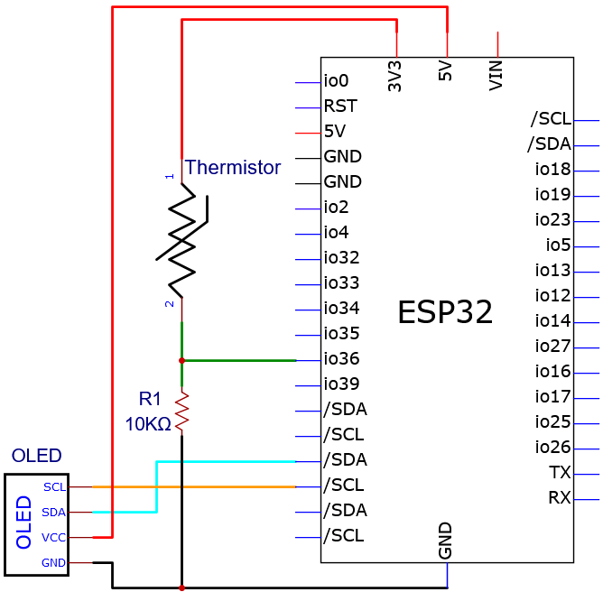

**Wiring diagram:**

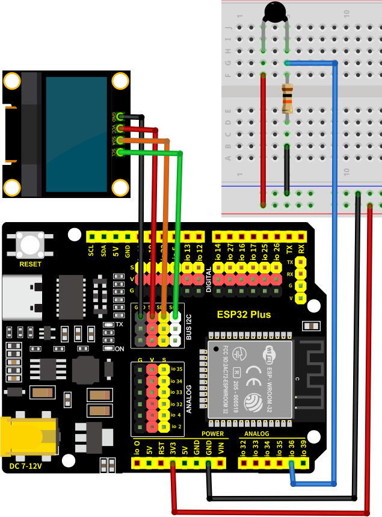

---

**4. Code Flow**

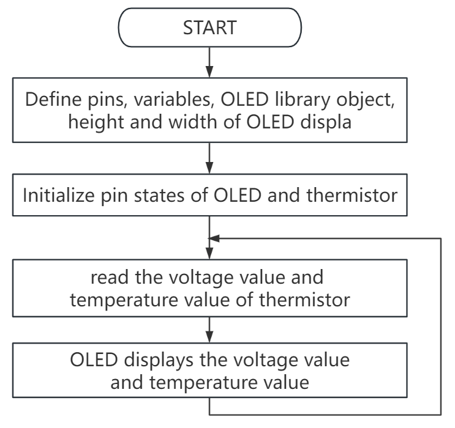

---

**5. Test Code**

Open “Thonny IDE” and choose “This Computer” → “D:” → “Codes” → “MicroPython_Code”. Open the file “2-4-12_Temperature_Detector.py” or copy and paste the following code into “Thonny IDE”.

```python
'''
 * Filename    : Temperature_Detector
 * Thonny      : Thonny 4.1.7
 * Auther      : http//www.keyestudio.com
'''
from machine import Pin, ADC, SoftI2C
import machine
import time
import math 
import ssd1306
from time import sleep

# Enable and configure ADC with a range of 0-3.3V
adc=ADC(Pin(36))
adc.atten(ADC.ATTN_11DB)
adc.width(ADC.WIDTH_12BIT)

# ESP32 Pin assignment 
i2c = SoftI2C(scl=Pin(22), sda=Pin(21))

# Set the width, height and i2c of the OLED
oled_width = 128
oled_height = 64
oled = ssd1306.SSD1306_I2C(oled_width, oled_height, i2c)

# OLED displays the voltage of the thermistor and the measured temperature value
try:
    while True: 
        adcValue = adc.read()
        voltage = adcValue / 4095 * 3.3
        Rt = 10 * voltage / (3.3-voltage)
        tempK = (1 / (1 / (273.15+25) + (math.log(Rt/10)) / 3950))
        tempC = int(tempK - 273.15)        
        voltage_string = str(voltage)
        tempC_string = str(tempC)
        oled.text('TemperatureMeter', 0, 0)
        oled.text('Volt:', 0, 25)
        oled.text(voltage_string, 40, 25)
        oled.text('V', 110, 25)
        oled.text('Temperature:', 0, 50)
        oled.text(tempC_string, 100, 50)
        oled.text('C', 120, 50) 
        oled.show()
        time.sleep(0.15)
        oled.fill(0)
except:
    pass
```
---

**6. Test Result**

Connect the ESP32 main board to your computer via Micro USB cable. Click  to run the code. After uploading the code, “Shell” displays an error message if the code fails to run.


Please import library referring to **2-1-7 Import Arduino Library** or can click **[Import MicroPython Library](https://docs.keyestudio.com/projects/KS5020/en/latest/docs/2.%20MicroPython_Tutorial.html#import-micropython-library-important)** to refer to import library.

Click  again and the OLED shows the voltage and detected temperature values of the thermistor.


Click  to exit the execution.

---

**7. Code Explanation**

Please refer to [2-3-17](https://docs.keyestudio.com/projects/KS5020/en/latest/docs/2.%20MicroPython_Tutorial.html#potentiometer) and [2-3-29](https://docs.keyestudio.com/projects/KS5020/en/latest/docs/2.%20MicroPython_Tutorial.html#oled) Code Explanation.


---

### 2-4-13 Temperature and Humidity Meter

---

**1. Overview**

In winter, the humidity in the air is very low, that is, the air is very dry. Coupled with the cold, human skin is easy to be too dry and cracked, so you may need to a humidifier. But how to know the humidity? A humidity sensor. We have learned how the DHT11 temperature and humidity sensor works. In this project, we combine the sensor with the I2C 128×32 LCD display to make a temperature and humidity meter.

---

**2.Components**

|  ||||
| ------------------------ | ------------------------ | ---------------------------- |---------------------------- |
|ESP32 main board x1 |DHT11 temperature and humidity sensor x1| F-F DuPont wires |breadboard x1|
||||  |
|I2C 128×32 LCD x1| jumper wires |Micro USB cable x1|   |

---

**3. Wiring Diagram**

**Schematic diagram:**

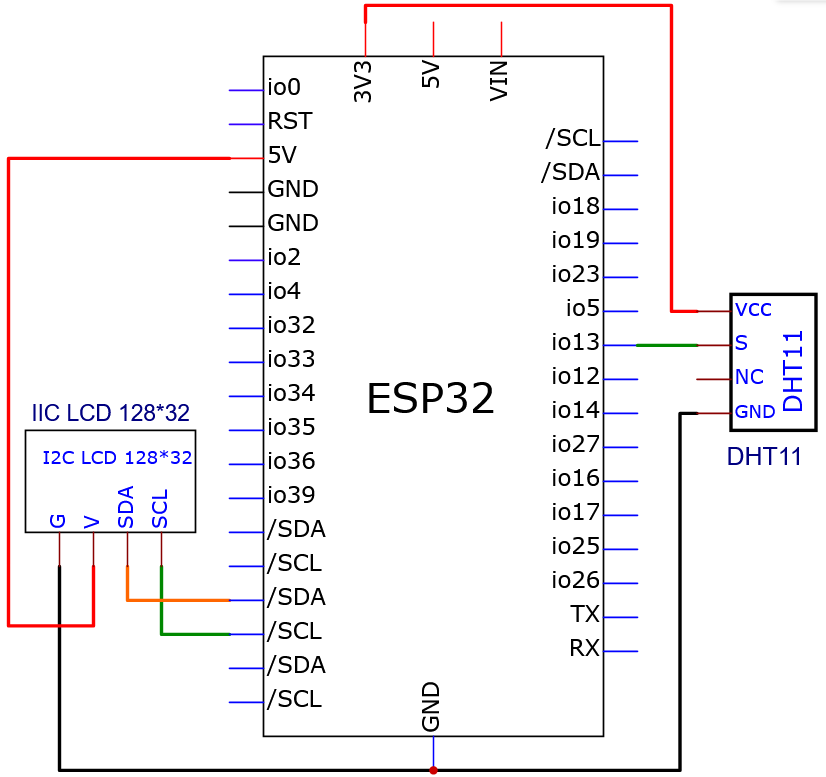

**Wiring diagram:**

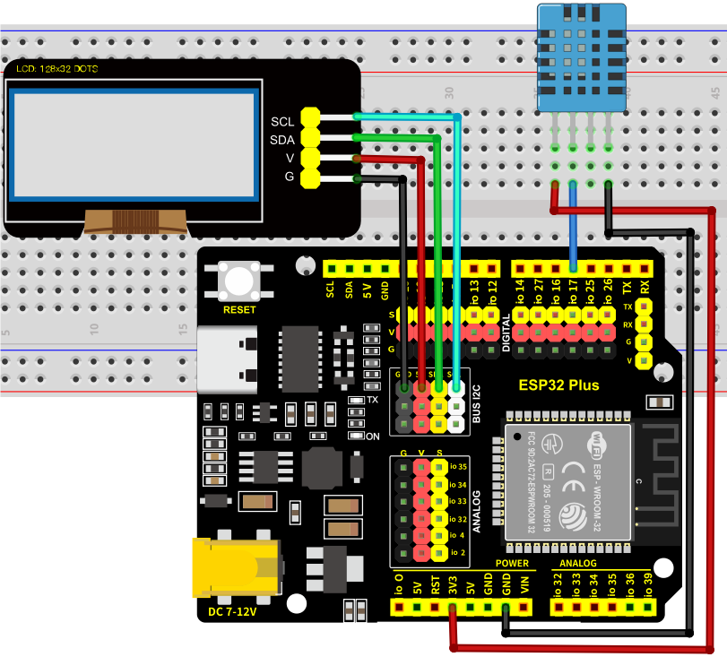

---

**4. Code Flow**

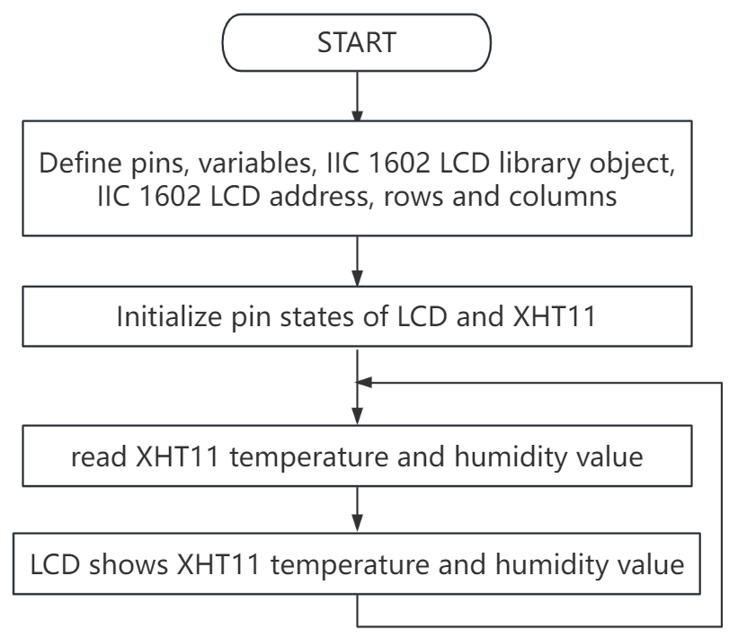

---

**5. Test Code**

Open “Thonny IDE” and choose “This Computer” → “D:” → “Codes” → “MicroPython_Code”. Open the file “2-4-13_Temperature-Humidity_Meter.py” or copy and paste the following code into “Thonny IDE”.

```python
'''
 * Filename    : Temperature-humidity meter
 * Thonny      : Thonny 4.1.7
 * Auther      : http//www.keyestudio.com
'''
from machine import Pin
import machine 
import dht
import time
import lcd128_32_fonts
from lcd128_32 import lcd128_32

# Create variables and set their initial values to 0.
temp = 0
humi = 0

# connect DHT11 to pin(13)
DHT = dht.DHT11(Pin(13))

# Configure i2c, pins, addresses, etc.
clock_pin = 22
data_pin = 21
bus = 0
i2c_addr = 0x3f
use_i2c = True

# DHT11 reads temperature and humidity values and the LCD reveals them
def scan_for_devices():
    i2c = machine.I2C(bus,sda=machine.Pin(data_pin),scl=machine.Pin(clock_pin))
    devices = i2c.scan()
    if devices:
        for d in devices:
            print(hex(d))
    else:
        print('no i2c devices')
        
# DHT11 reads temperature and humidity values and the LCD reveals them
try:
    while True:
        DHT.measure()
        temp = int(DHT.temperature())
        humi = int(DHT.humidity())
        if use_i2c:
            scan_for_devices()
            lcd = lcd128_32(data_pin, clock_pin, bus, i2c_addr)         
        lcd.Clear()
        lcd.Cursor(0, 0)
        lcd.Display("temper:")
        lcd.Cursor(0, 8)
        lcd.Display(str(temp))
        lcd.Cursor(0, 11)
        lcd.Display("C")
        lcd.Cursor(2, 0)
        lcd.Display("Humid:")
        lcd.Cursor(2, 7)
        lcd.Display(str(humi))
        lcd.Cursor(2, 10)
        lcd.Display("%")
        time.sleep(0.5)
except:
    pass
```
---

**6. Test Result**

Connect the ESP32 main board to your computer via Micro USB cable. Click  to run the code. If the code fails to run, an error message is displayed in “Shell”.


Please import library referring to **2-1-7 Import Arduino Library** or can click **[Import MicroPython Library](https://docs.keyestudio.com/projects/KS5020/en/latest/docs/2.%20MicroPython_Tutorial.html#import-micropython-library-important)** to refer to import library.

Click  to run the code. The I2C 128×32 LCD shows the ambient temperature and humidity values detected by the DHT11 sensor.

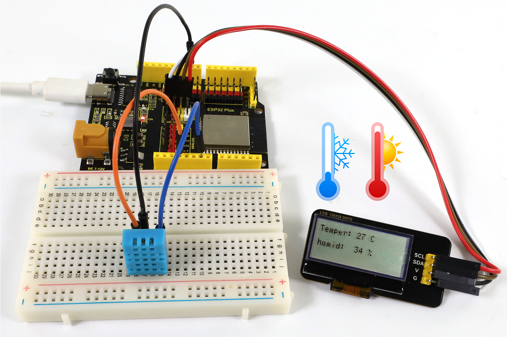

Click  to exit the execution.

---

**7. Code Explanation**

Please refer to [2-3-24](https://docs.keyestudio.com/projects/KS5020/en/latest/docs/2.%20MicroPython_Tutorial.html#temperature-and-humidity-detection) and [2-3-28](https://docs.keyestudio.com/projects/KS5020/en/latest/docs/2.%20MicroPython_Tutorial.html#i2c-12832-lcd) Code Explanation.

---


### 2-4-14 Volume Detector

---

**1. Overview**

Volume detector is used to detect sound levels, especially noise. It is generally composed of sound sensor and effective value indicator head(display). We have learned how the sound sensor works. Herein, we  combine the sensor with  the I2C 128×32 LCD display to make a simple volume detector.

---

**2. Components**

|  |||
| ------------------------ | ------------------------ | ---------------------------- |
|ESP32 main board x1 |sound sensor x1| I2C 128×32 LCD x1 |
|||  |
| M-F DuPont wires |Micro USB cable x1| F-F DuPont wires |

---

**3. Wiring Diagram**

**Schematic diagram:**

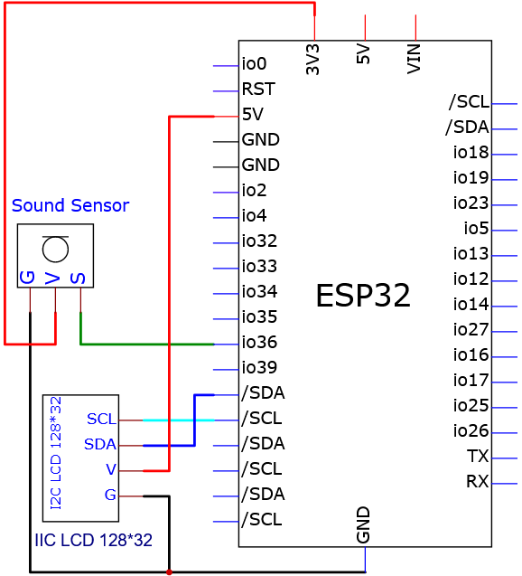

**Wiring diagram:**

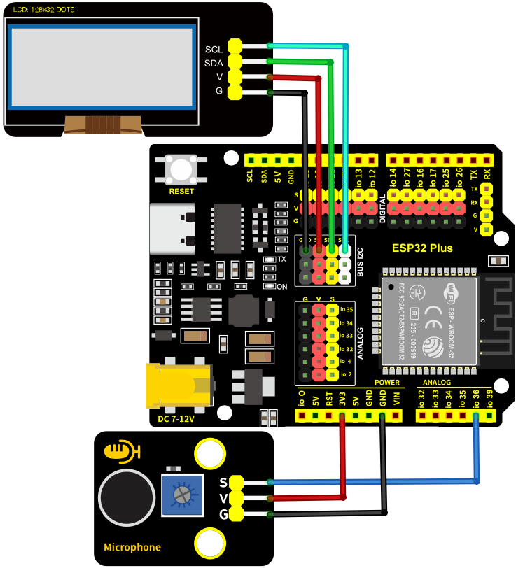

---

**4. Code Flow**

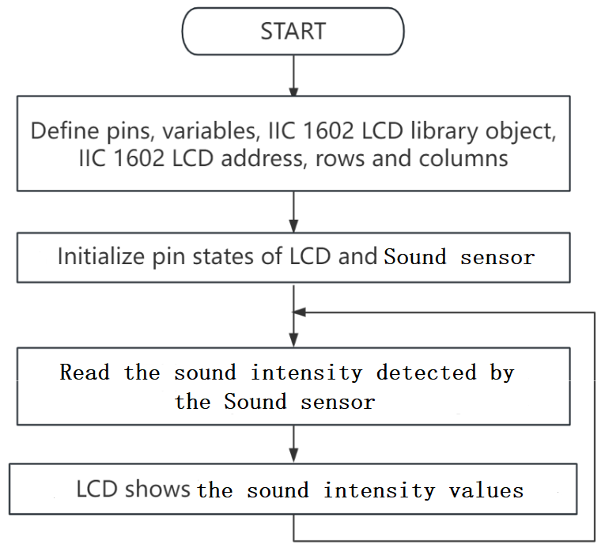

---

**5. Test Code**

Open “Thonny IDE” and choose “This Computer” → “D:” → “Codes” → “MicroPython_Code”. Open the file “2-4-14_Volume_Detector.py” or copy and paste the following code into “Thonny IDE”.

```python
'''
 * Filename    : Volume_Detector
 * Thonny      : Thonny 4.1.7
 * Auther      : http//www.keyestudio.com
'''
from machine import Pin, ADC
import machine
import time
import lcd128_32_fonts
from lcd128_32 import lcd128_32

# Enable and configure ADC with a range of 0-3.3V
adc=ADC(Pin(36))
adc.atten(ADC.ATTN_11DB)
adc.width(ADC.WIDTH_12BIT)

# Configure i2c, pins, addresses, etc.
clock_pin = 22
data_pin = 21
bus = 0
i2c_addr = 0x3f
use_i2c = True

# DHT11 reads temperature and humidity values and the LCD reveals them
def scan_for_devices():
    i2c = machine.I2C(bus,sda=machine.Pin(data_pin),scl=machine.Pin(clock_pin))
    devices = i2c.scan()
    if devices:
        for d in devices: 
            print(hex(d))
    else:
        print('no i2c devices')
         
# The sound sensor detects the sound and reads the ADC value of the volume, and the LCD displays it.
try:
    while True:
        adcVal=adc.read()
        if use_i2c:
            scan_for_devices()
            lcd = lcd128_32(data_pin, clock_pin, bus, i2c_addr)         
        lcd.Cursor(0, 2)
        lcd.Display("Volume Detector")
        lcd.Cursor(2, 4)
        lcd.Display("Volume:")
        lcd.Cursor(2, 12)
        lcd.Display(str(adcVal))
        time.sleep(0.5)
except:
    pass
```
---

**5. Test Result**

Connect the ESP32 main board to your computer via Micro USB cable. Click  to run the code. If the code fails to run, an error message is displayed in “Shell”.


Please import library referring to **2-1-7 Import Arduino Library** or can click **[Import MicroPython Library](https://docs.keyestudio.com/projects/KS5020/en/latest/docs/2.%20MicroPython_Tutorial.html#import-micropython-library-important)** to refer to import library.

Click  to run the code. The I2C 128×32 LCD shows the ADC value sound volume detected by the sound sensor.

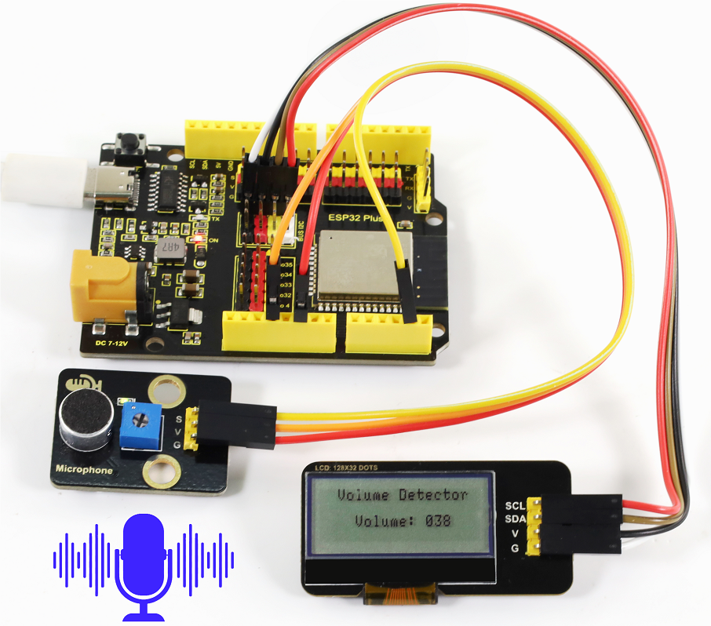

Click  to exit the execution.

---

**6. Code Explanation**

Please refer to previous Code Explanation.

---

### 2-4-15 Magic Color Music Box

---

**1. Overview**

Music box is a toy that automatically plays music through mechanical force. Its melodious music often brings back memories of the good old days. In this experiment, the “magic color music box” made by Ultrasonic sensor, passive buzzer and LED, plays notes by waving palms.

---

**2.Components**

|   ||||
| ------------------------ | ------------------------ | ---------------------------- |---------------------------- |
|ESP32 main board x1 | NPN transistor (S8050) x1 | passive buzzer x1 | 1kΩ resistor x1 |
||| ||
| ultrasonic sensor x1 |M-F DuPont wires |red LED x7|220Ω resistor  x7  |
|||||
|breadboard x1 |jumper wires | Micro USB cable x1 | 10kΩ resistor x1 |

---

**3. Wiring Diagram**

**Schematic diagram:**

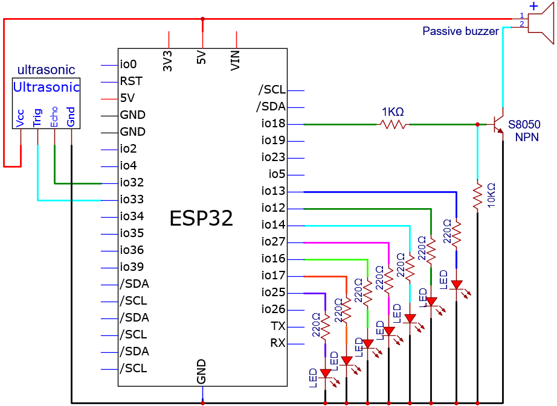

**Wiring diagram:**

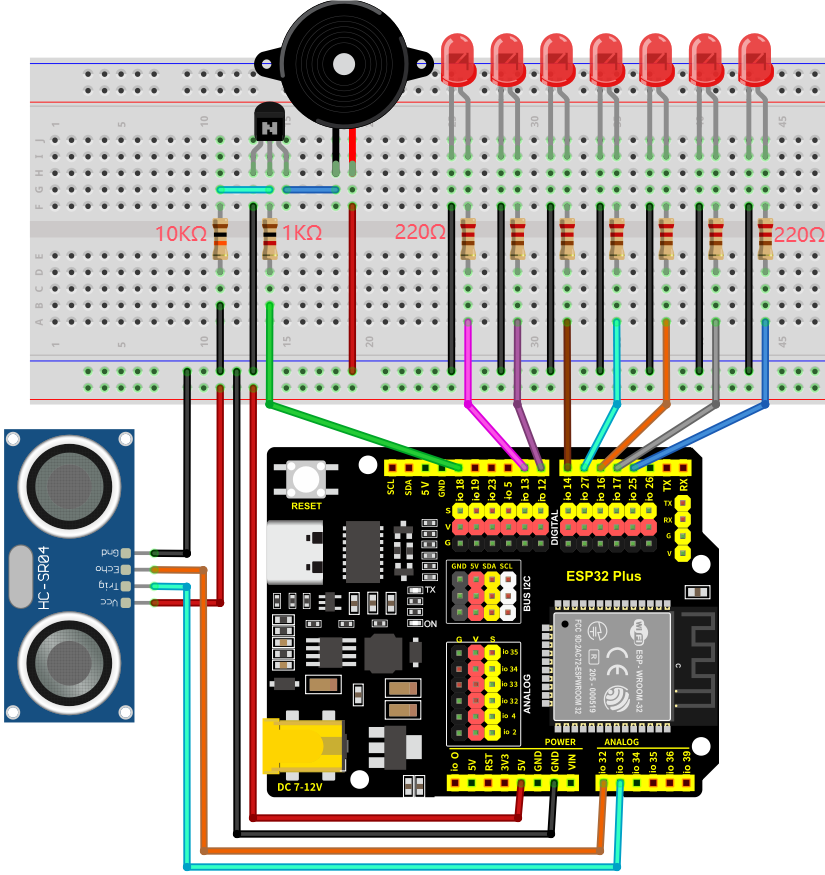

---

**4. Code Flow**

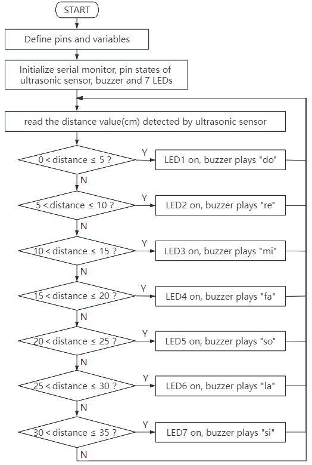

---

**5. Test Code**

Open “Thonny IDE” and choose “This Computer” → “D:” → “Codes” → “MicroPython_Code”. Open the file “2-4-15_Magic_Color_Music_Box.py” or copy and paste the following code into “Thonny IDE”.

```python
'''
 * Filename    : Magic_Color_Music_Box 
 * Thonny      : Thonny 4.1.7
 * Auther      : http//www.keyestudio.com
'''
from machine import Pin, ADC, PWM
import machine 
import time  
from time import sleep 

# Digital pins for 7 leds
led1 = Pin(13, Pin.OUT)
led2 = Pin(12, Pin.OUT)
led3 = Pin(14, Pin.OUT)
led4 = Pin(27, Pin.OUT)
led5 = Pin(16, Pin.OUT)
led6 = Pin(17, Pin.OUT) 
led7 = Pin(25, Pin.OUT)

# Define the GPIO pin that is connected to the buzzer
buzzer = machine.PWM(machine.Pin(18))

# Define the playtone function for the sound of the passive buzzer
def playtone(frequency):
    buzzer.duty_u16(1000)
    buzzer.freq(frequency)

# Define the control pins of the ultrasonic ranging module
Trig = Pin(33, Pin.OUT, 0) 
Echo = Pin(32, Pin.IN, 0)

distance = 0 # set initial distance value to 0
soundVelocity = 340 # Set the speed of sound.
# getDistance() is used to drive the ultrasonic module to measure distance
# Trig holds a high level of 10us to activate the ultrasonic module
# Echo.value() is used to read the status of the Echo pin of the ultrasonic module
# time.sleep_us() function of the time module calculates the duration of the Echo
# Trig pin high level calculates the measured distance based on time and returns the value
def getDistance():
    Trig.value(1)
    time.sleep_us(10)
    Trig.value(0)
    while not Echo.value():
        pass
    pingStart = time.ticks_us()
    while Echo.value():
        pass
    pingStop = time.ticks_us()
    pingTime = time.ticks_diff(pingStop, pingStart) // 2
    distance = int(soundVelocity * pingTime // 10000)
    return distance

# Wave your hand in front of an ultrasonic sensor to detect distance,
# At different distance ranges, the passive buzzer plays different notes and corresponding LED lights up.
while True:
    distance = getDistance()
    if distance > 0 and distance <= 5:
        led1.value(1)
        playtone(262)
        sleep(1)
    else:
        led1.value(0)
        buzzer.duty_u16(0)
        
    if distance > 5 and distance <= 10:
        led2.value(1)
        playtone(294)
        sleep(0.75)
    else:
        led2.value(0)
        buzzer.duty_u16(0)
    if distance > 10 and distance <= 15:
        led3.value(1)
        playtone(330)
        sleep(0.625)
    else:
        led3.value(0)
        buzzer.duty_u16(0)        
    if distance > 15 and distance <= 20:
        led4.value(1)
        playtone(349)
        sleep(0.5)
    else:
        led4.value(0)
        buzzer.duty_u16(0)
    if distance > 20 and distance <= 25:
        led5.value(1)
        playtone(392)
        sleep(0.375)
    else:
        led5.value(0)
        buzzer.duty_u16(0)        
    if distance > 25 and distance <= 30:
        led6.value(1)
        playtone(440)
        sleep(0.25)
    else:
        led6.value(0)
        buzzer.duty_u16(0)
    if distance > 35 and distance <= 40:
        led7.value(1)
        playtone(494)
        sleep(0.125)
    else:
        led7.value(0)
        buzzer.duty_u16(0)     
```
---

**6. Test Result**

Connect the ESP32 main board to your computer via Micro USB cable. Click  to run the code. After uploading the code, wave your hand in front of the ultrasonic sensor, and the passive buzzer plays music with 7 LED lighting up, forming a colorful music box.

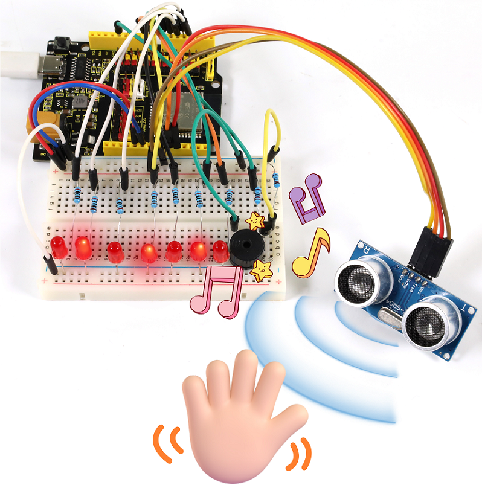

Click  to exit the execution.

---

**7. Code Explanation**

Please refer to [2-3-02](https://docs.keyestudio.com/projects/KS5020/en/latest/docs/2.%20MicroPython_Tutorial.html#breathing-led), [2-3-10](https://docs.keyestudio.com/projects/KS5020/en/latest/docs/2.%20MicroPython_Tutorial.html#play-music), [2-3-25](https://docs.keyestudio.com/projects/KS5020/en/latest/docs/2.%20MicroPython_Tutorial.html#ultrasonic-ranger) and [2-4-01](https://docs.keyestudio.com/projects/KS5020/en/latest/docs/2.%20MicroPython_Tutorial.html#two-kinds-of-transistors) Code Explanation.

---

### 2-4-16 Joystick Display

---

**1. Overview**

In previous experiments, we have learned how joystick and OLED works. Herein, can we combine them to make a fun and interesting joystick game machine? Of course we can. What are we waiting for? Let's do it!

---

**2.Components**

|  ||||
| ------------------------ | ------------------------ | ------------------------ | ---------------------------- |
|ESP32 main board x1| joystick x1 | M-F DuPont wires|breadboard x1 |
|||| |
|OLED x1|Micro USB cable x1 |jumper wires |  |

---

**3. Wiring Diagram**

**Schematic diagram:**

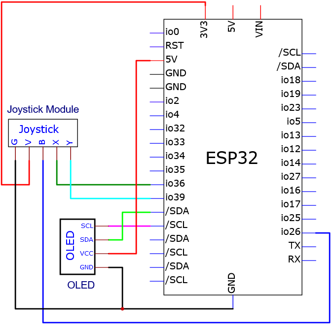

**Wiring diagram:**

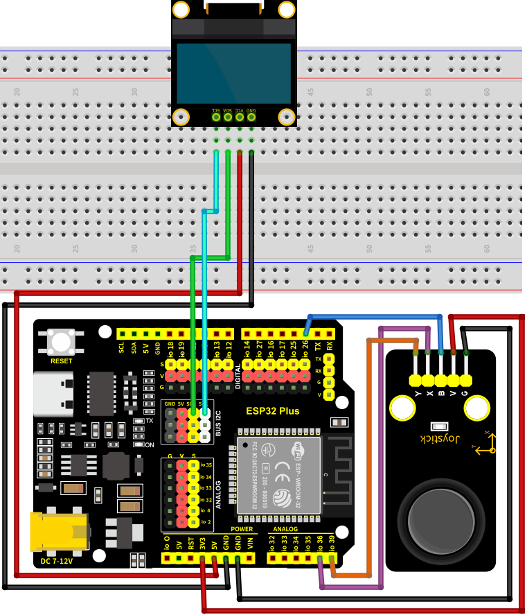

**4. Code Flow**

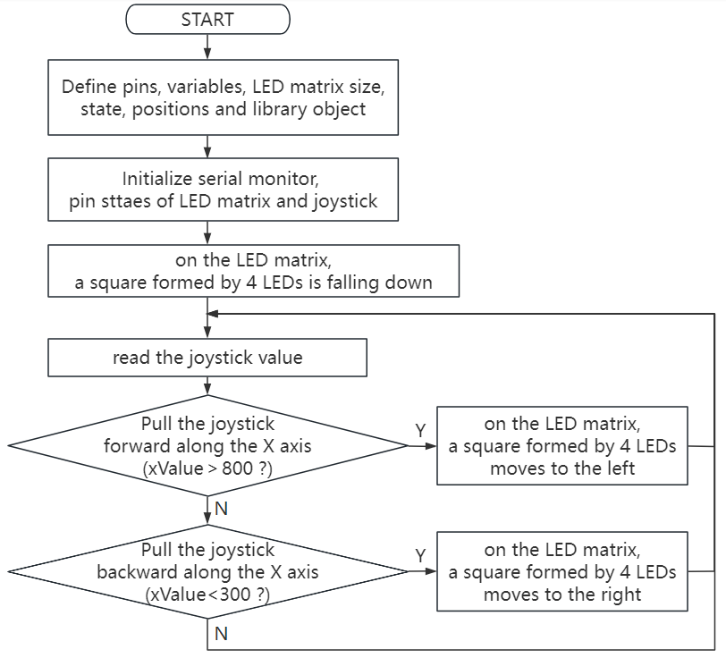

**5. Test Code**

Open “Thonny IDE” and choose “This Computer” → “D:” → “Codes” → “MicroPython_Code”. Open the file “2-4-16_Joystick_Display.py” or copy and paste the following code into “Thonny IDE”.

```python
'''
 * Filename    : Joystick_Display 
 * Thonny      : Thonny 4.1.7
 * Auther      : http//www.keyestudio.com 
'''
from machine import Pin, ADC, SoftI2C
import machine  
import time  
import ssd1306
from time import sleep

# initialize joystick module (ADC function)
rocker_x=ADC(Pin(36)) 
rocker_y=ADC(Pin(39))
button_z=Pin(26,Pin.IN,Pin.PULL_UP)

# Set the voltage acquisition range of the two ADC channels to 0-3.3V
# Set the data acquisition width to 0-4095.
rocker_x.atten(ADC.ATTN_11DB)
rocker_y.atten(ADC.ATTN_11DB)
rocker_x.width(ADC.WIDTH_12BIT)
rocker_y.width(ADC.WIDTH_12BIT)

# ESP32 Pin assignment 
i2c = SoftI2C(scl=Pin(22), sda=Pin(21))

# Set the width, height and i2c of the OLED
oled_width = 128
oled_height = 64
oled = ssd1306.SSD1306_I2C(oled_width, oled_height, i2c)

while True:
    # read the values of axes X, Y, Z of the joystick
    xValue = rocker_x.read()
    yValue = rocker_y.read()
    zValue = button_z.value()
    xValue_string = str(xValue)
    yValue_string = str(yValue)
    zValue_string = str(zValue)

    # show the values of axes X, Y, Z
    oled.text('X: ', 0, 0)
    oled.text(xValue_string, 20, 0)
    oled.text('Y: ', 0, 10)
    oled.text(yValue_string, 20, 10)
    oled.text('Z: ', 0, 20)
    oled.text(zValue_string, 20, 20)
    oled.show()
    time.sleep(0.15)
    oled.fill(0)
    
    # Determine the orientation of the joystick based on the values of the X and Y axes
    if yValue < 1000:
       oled.text('Direction:Down', 0, 35)
       oled.show()
    elif yValue > 3000:
       oled.text('Direction:Up', 0, 35)
       oled.show()
    elif xValue < 1000:
       oled.text('Direction:Left', 0, 35)
       oled.show()
    elif xValue > 3000:
       oled.text('Direction:Right', 0, 35)
       oled.show()
    else:
       oled.text('Direction:Center', 0, 35)
       oled.show()
    
    # show button(z axis) state
    if zValue == 1:
       oled.text('Button:Pressed', 0, 50)
       oled.show()
    else:
       oled.text('Button:Released', 0, 50)
       oled.show()
```

**6. Test Result**

Connect the ESP32 main board to your computer via Micro USB cable. Click  to run the code. After uploading the code, “Shell” displays an error message if the code fails to run.


Please import library referring to **2-1-7 Import Arduino Library** or can click **[Import MicroPython Library](https://docs.keyestudio.com/projects/KS5020/en/latest/docs/2.%20MicroPython_Tutorial.html#import-micropython-library-important)** to refer to import library.

Click  to upload the code again, press or pull the joystick, the content displayed on the OLED will change accordingly.

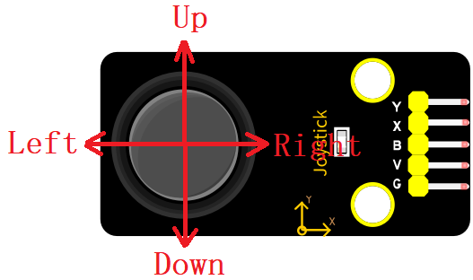

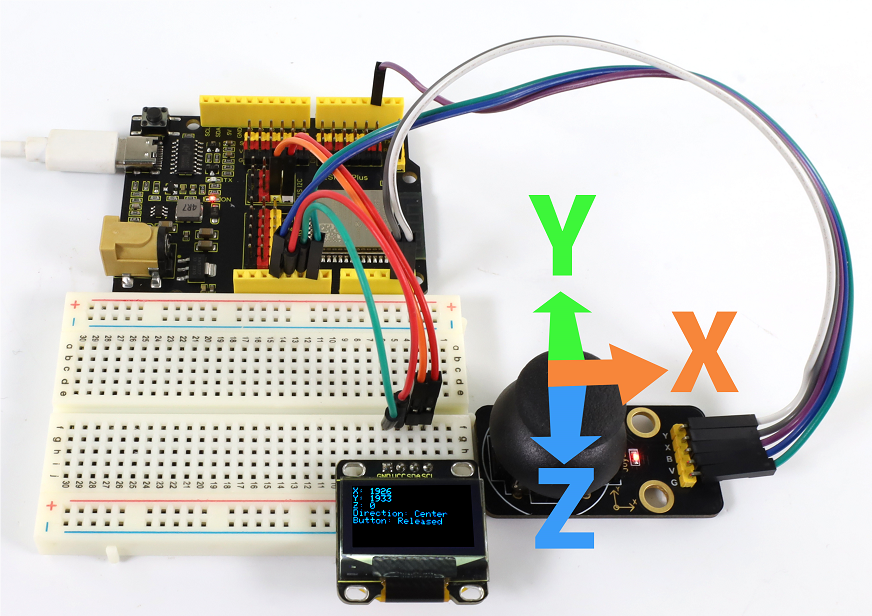

Click  to exit the execution.

---

**7. Code Explanation**

Please refer to previous code explanations.

---

### 2-4-17 Ping Pong Game

---

**1. Overview**

This is a simple ping-pong game designed with an OLED display and the ESP32 main board. In the game, press up_button and the OLED shows “up_button:0”, and when you press down_button, the OLED shows “down_button:0”.

---

**2.Components**

|  | ||
| ------------------------ | ------------------------ | ---------------------------- |
| ESP32 main board x1 | button cap x2 | OLED x1 |
|||  |
|jumper wires | Micro USB cable x1 | breadboard x1 |
|||  |
| button x2 | 10kΩ resistor x2 | F-F DuPont wires |

---

**3. Wiring Diagram**

**Schematic diagram:**

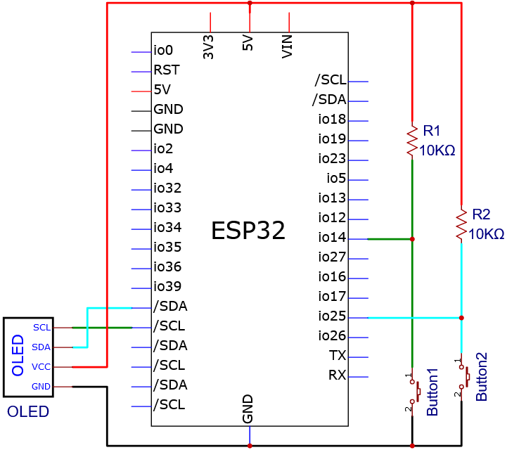

**Wiring diagram:**

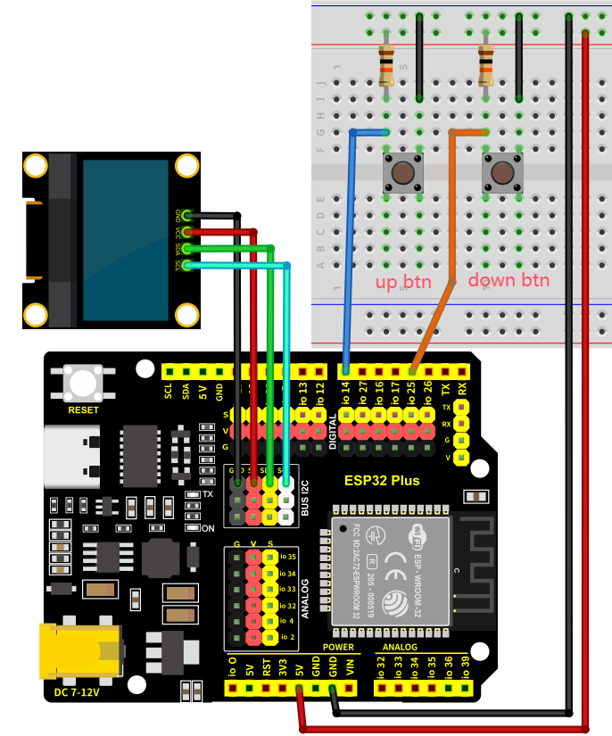

---

**4. Code Flow**

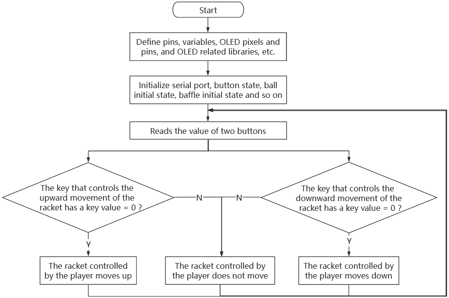

---

**5. Test Code**

Open “Thonny IDE” and choose “This Computer” → “D:” → “Codes” → “MicroPython_Code”. Open the file “2-4-17_Ping_Pong_Game.py” or copy and paste the following code into “Thonny IDE”.

```python
'''
 * Filename    : Ping Pong Game
 * Thonny      : Thonny 4.1.7
 * Auther      : http//www.buttonestudio.com
'''
# Import Pin,SoftI2C,ssd1306,sleep,gfx libraries
from machine import Pin, SoftI2C
import ssd1306
from time import sleep

up_button = Pin(14, Pin.IN, Pin.PULL_UP) # Up_Button
down_button = Pin(25, Pin.IN, Pin.PULL_UP) # Down_Button

# ESP32 Pin assignment 
i2c = SoftI2C(scl=Pin(22), sda=Pin(21))

# Set the width, height and i2c of the OLED
oled_width = 128
oled_height = 64 
oled = ssd1306.SSD1306_I2C(oled_width, oled_height, i2c)

# Read the two button values; Operate the two buttons, and OLED displays the corresponding message.
while True:
    upbutton = up_button.value()
    downbutton = down_button.value()
    upbutton_string = str(upbutton)
    downbutton_string = str(downbutton)

    if upbutton == 0: # when we press up_button
        oled.text('Ping Pong Game', 0, 0)
        oled.text('up_button:', 0, 25)
        oled.text(upbutton_string, 80, 25)
        oled.show()
    else:  # release
        oled.fill(0)
    if downbutton == 0: # when we press down_button
        oled.text('Ping Pong Game', 0, 0)
        oled.text('down_button:', 0, 25)
        oled.text(downbutton_string, 100, 25)
        oled.show()
    else:  # release down_button
        oled.fill(0)
```
---

**6. Test Result**

Connect the ESP32 main board to your computer via Micro USB cable. Click  to run the code. After uploading the code, “Shell” displays an error message if the code fails to run.


Please import library referring to **2-1-7 Import Arduino Library** or can click **[Import MicroPython Library](https://docs.keyestudio.com/projects/KS5020/en/latest/docs/2.%20MicroPython_Tutorial.html#import-micropython-library-important)** to refer to import library.

Click  to run the code. Press up_button and the OLED shows “up_button:0”, and when you press down_button, the OLED shows “down_button:0”.

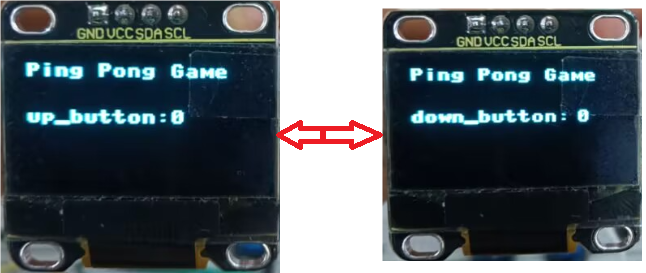

Click  to exit the execution.

---

**7. Code Explanation**

Please refer to [2-3-14](https://docs.keyestudio.com/projects/KS5020/en/latest/docs/2.%20MicroPython_Tutorial.html#button) and [2-3-29](https://docs.keyestudio.com/projects/KS5020/en/latest/docs/2.%20MicroPython_Tutorial.html#oled) Code Explanation.

---

### 2-4-18 Control Servo and LED

---

**1. Overview**

We have learned the relevant knowledge of servo, red LED, button and potentiometer. So we combine them to make a more complex experiment. In this experiment, the button controls the red LED to light up, and the potentiometer controls the servo to rotate slowly back and forth.

---

**2.Components**

|  ||||
| ------------------------ | ------------------------ | ---------------------------- |---------------------------- |
| ESP32 main board x1 | potentiometer x1 | red LED x1 | 220Ω resistor  x1 |
|| |||
| button x1 |servo x1| 10kΩ resistor x1 | Micro USB cable x1 |
|||  |  |
|breadboard x1 |jumper wires |  |   |

---

**3. Wiring Diagram**

**Schematic diagram:**

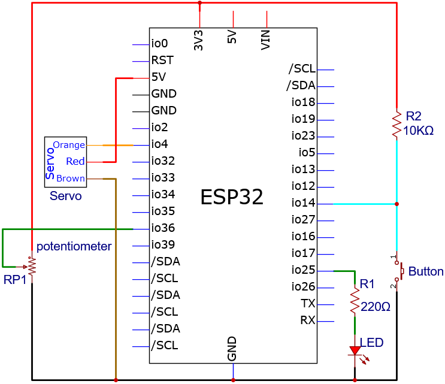

**Wiring diagram:**

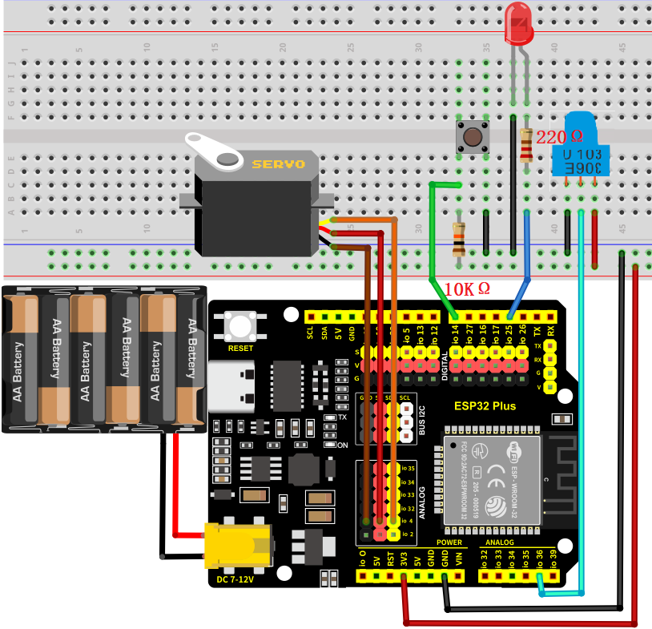

---

**4. Code Flow**

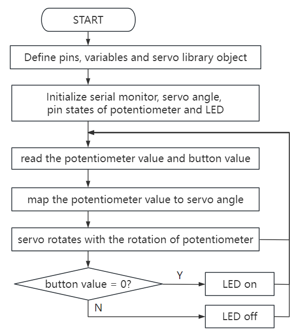

---

**5. Test Code**

Open “Thonny IDE” and choose “This Computer” → “D:” → “Codes” → “MicroPython_Code”. Open the file “2-4-18_Control_Servo_LED.py” or copy and paste the following code into “Thonny IDE”.

```python
'''
 * Filename    : Control_Servo_LED
 * Thonny      : Thonny 4.1.7
 * Auther      : http//www.keyestudio.com
'''
from machine import Pin,PWM,ADC
import time 

# connect LED to pin 25 and set it to output
led = Pin(25, Pin.OUT)

# Create a PWM (Pulse Width Modulation) object on Pin 4
servo = PWM(Pin(4,Pin.OUT),10000)

# Set the frequency of the PWM signal to 50 Hz, common for servos
servo.freq(50)

# Define a function for interval mapping
def interval_mapping(x, in_min, in_max, out_min, out_max):
    return (x - in_min) * (out_max - out_min) / (in_max - in_min) + out_min

# Define a function to write an angle to the servo
def servo_write(pin, angle):

    pulse_width = interval_mapping(angle, 0, 180, 0.5, 2.5) # Calculate the pulse width
    duty = int(interval_mapping(pulse_width, 0, 20, 0, 1023))     # Calculate the duty cycle
    pin.duty(duty) # Set the duty cycle of the PWM signal
    
button = Pin(14, Pin.IN, Pin.PULL_UP) # Button

# Enable and configure ADC with a range of 0-3.3V
adc=ADC(Pin(36))
adc.atten(ADC.ATTN_11DB)
adc.width(ADC.WIDTH_12BIT)  

while True:
    # Read the current value of the 'button' object (0 or 1) and store it in the 'button_status' variable
    button_status = button.value()
    # If the button is pressed (value is 0)
    if button_status == 0: 
        led.value(1) # Turn the LED on
    # If the button is not pressed (value is 1) 
    else:
        led.value(0)  # turn the LED off
    adcValue=adc.read() # read the ADC value of the potentiometer
    angle=(adcValue*180)/4096 # Convert the ADC value of the potentiometer to the Angle of the servo
    servo_write(servo, int(angle)) # servo rotation Angle
    time.sleep_ms(50)
```
---

**6. Test Result**

Connect the ESP32 main board to your computer via Micro USB cable. Click  to run the code. After uploading the code, press the button to light up LED, and rotate the potentiometer to slowly adjust the rotation of the servo back and forth.

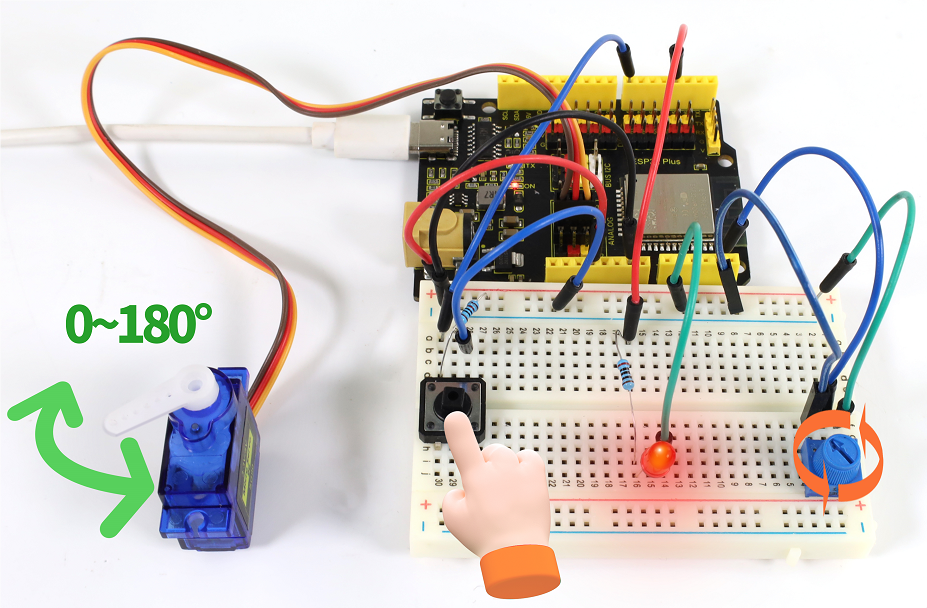

Click  to exit the execution.

---

**7. Code Explanation**

Please refer to [2-3-01](https://docs.keyestudio.com/projects/KS5020/en/latest/docs/2.%20MicroPython_Tutorial.html#hello-led), [2-3-14](https://docs.keyestudio.com/projects/KS5020/en/latest/docs/2.%20MicroPython_Tutorial.html#button), [2-3-17](https://docs.keyestudio.com/projects/KS5020/en/latest/docs/2.%20MicroPython_Tutorial.html#potentiometer) and [2-4-01](https://docs.keyestudio.com/projects/KS5020/en/latest/docs/2.%20MicroPython_Tutorial.html#two-kinds-of-transistors) Code Explanation.

---

### 2-4-19 Digital Dice

---

**1. Overview**

In this project, we simulate dice rolling with a 74HC595 shift register and a digital tube. It is activated by directly shaking the tilt switch. During this operation, the digital tube loops randomly among 1 to 6, simulating a dice roll. After a short interval, it displays a random number representing the result of the dice roll.

---

**2.Components**

|  |||
| ------------------------ | ------------------------ | ---------------------------- |
|ESP32 main board x1 | 74HC595 x1 | 1-bit digital tube x1 |
||||
|220Ω resistor  x8  |tilt switch x1|M-F DuPont wires |
||||
|breadboard x1 |jumper wires | Micro USB cable x1 |

---

**3. Wiring Diagram**

**Schematic diagram:**

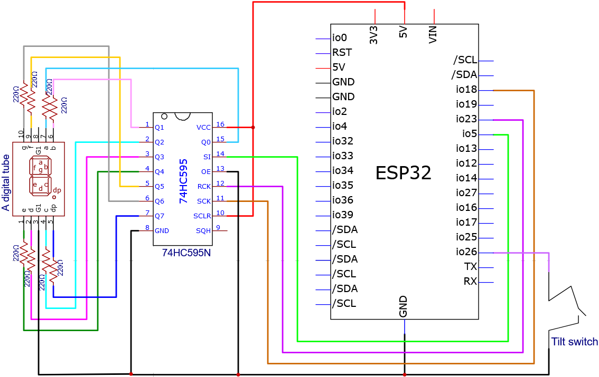

**Wiring diagram:**

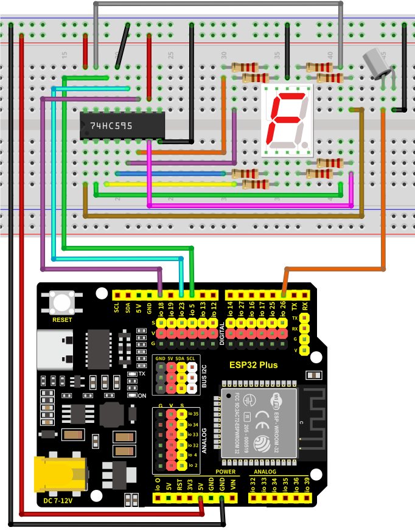

---

**4. Code Flow**

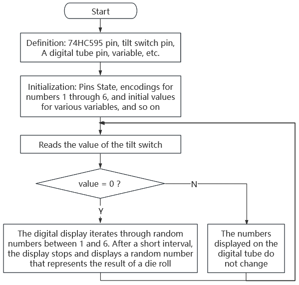

---

**5. Test Code**

Open “Thonny IDE” and choose “This Computer” → “D:” → “Codes” → “MicroPython_Code”. Open the file “2-4-19_Digital_Dice.py” or copy and paste the following code into “Thonny IDE”.

```python
'''
 * Filename    : Digital_Dice
 * Thonny      : Thonny 4.1.7
 * Auther      : http//www.keyestudio.com
'''
import machine
import time
import random

# Define the segment code for a common anode 7-segment display
SEGCODE = [0x3f, 0x06, 0x5b, 0x4f, 0x66, 0x6d, 0x7d, 0x07, 0x7f, 0x6f]

# Initialize the pins for the 74HC595 shift register
si = machine.Pin(5, machine.Pin.OUT)  # SI of 74HC595
rck = machine.Pin(23, machine.Pin.OUT)  # RCK of 74HC595
sck = machine.Pin(18, machine.Pin.OUT)  # SCK of 74HC595

tilt = machine.Pin(26, machine.Pin.IN) # Tilt pin

# Define the hc595_shift function to shift data into the 74HC595 shift register
def hc595_shift(dat):
    # Set the RCLK pin to low
    rck.off()

    # Iterate through each bit (from 7 to 0)
    for bit in range(7, -1, -1):
        # Extract the current bit from the input data
        value = 1 & (dat >> bit)

        # Set the SRCLK pin to low
        sck.off()

        # Set the value of the SDI pin
        si.value(value)

        # Clock the current bit into the shift register by setting the SRCLK pin to high
        sck.on()

    # Latch the data into the storage register by setting the RCLK pin to high
    rck.on()

# Initialize the random seed
random.seed(time.ticks_us())

num = 1
tilt_state = False

# Define the tilt callback function to toggle the tilt state
def tilt_callback(pin):
    global tilt_state
    tilt_state = not tilt_state

# Attach the tilt callback function to the falling edge of the tilt pin
tilt.irq(trigger=machine.Pin.IRQ_FALLING, handler=tilt_callback)

# Continuously display the current digit on the 7-segment display, scrolling if tilt is not shaked
while True: 

    # Display the current digit on the 7-segment display
    hc595_shift(SEGCODE[num])

    # If the tilt is shaked and tilt state is True
    if tilt_state:
        pass

    # If the tilt is shaked again and tilt state is False, generate a new random digit
    if not tilt_state:
        num = random.randint(1, 6)
        time.sleep_ms(100) # Adjust this value to control the display refresh rate
```
---

**6. Test Result**

Connect the ESP32 main board to your computer via Micro USB cable. Click  to run the code. After uploading the code, directly shake the tilt switch to activate the dice. During this operation, the digital display loops between random numbers within 1 to 6, simulating a dice roll. After a short interval, the roll stops and shows a random number.

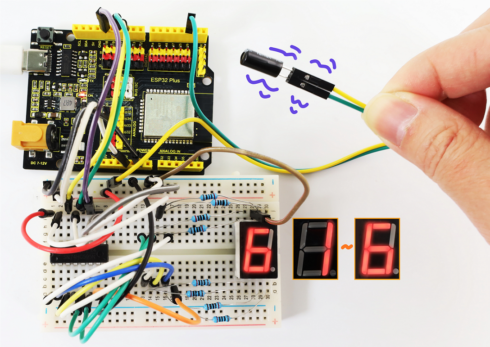

Click  to exit the execution.

---

**7. Code Explanation**

1\. Define a common cathode 7-segment digital tube display code. `SEGCODE[]`: An array used to store an encoding of numbers 1 to 6 on a common cathode digital tube.

```python
SEGCODE = [0x3f, 0x06, 0x5b, 0x4f, 0x66, 0x6d, 0x7d, 0x07, 0x7f, 0x6f]
```
2\. Variable initialization.

- `si`, `rck`, `sck`: Pin and output modes of 74HC595. `tilt`: Connect the digital pin of tilt switch and set it to output mode.

```python
si = machine.Pin(5, machine.Pin.OUT)  # SI of 74HC595
rck = machine.Pin(23, machine.Pin.OUT)  # RCK of 74HC595
sck = machine.Pin(18, machine.Pin.OUT)  # SCK of 74HC595

tilt = machine.Pin(26, machine.Pin.IN) # Tilt pin
```
3\. The hc595_shift function shifts the data into the 74HC595 shift register.

```python
def hc595_shift(dat):
    # Set the RCLK pin to low
    rck.off()

    # Iterate through each bit (from 7 to 0)
    for bit in range(7, -1, -1):
        # Extract the current bit from the input data
        value = 1 & (dat >> bit)

        # Set the SRCLK pin to low
        sck.off()

        # Set the value of the SDI pin
        si.value(value)

        # Clock the current bit into the shift register by setting the SRCLK pin to high
        sck.on()

    # Latch the data into the storage register by setting the RCLK pin to high
    rck.on()
```

4\. Initialize `random seed` .

```python
random.seed(time.ticks_us())
```
5\. `tilt_callback()` switches the tilt state.

```python
def tilt_callback(pin):
    global tilt_state
    tilt_state = not tilt_state
```
6\. append `tilt_callback()` to the pull-down input status of tilt switch.

```python
tilt.irq(trigger=machine.Pin.IRQ_FALLING, handler=tilt_callback)
```
7\. Continuously display the current number. If the tilt switch does not vibrate, the numbers keep changing; If it vibrates and then stops, a specific number is displayed.

```python
while True: 

    # Display the current digit on the 7-segment display
    hc595_shift(SEGCODE[num])

    # If the tilt is shaked and tilt state is True
    if tilt_state:
        pass

    # If the tilt is shaked again and tilt state is False, generate a new random digit
    if not tilt_state:
        num = random.randint(1, 6)
        time.sleep_ms(100) # Adjust this value to control the display refresh rate
```
---

### 2-4-20 Guess Numbers

---

**1. Overview**

In the previous experiments, we learned to display numbers on a digital tube and to use an infrared receiver to reveal the key value corresponding to the received remote control. Herein, we will combine the IR receiver and the digital tube to display numbers.

There are keys (“①”, “②”, “③”, “④”, “⑤”, “⑥”, “⑦”, “⑧”, “⑨”, “0”) on the remote control. We press them to display corresponding numbers on the digital tube;Use the "*" key to control the display of a digit tube. And the “OK” is used to control the external LED to be on or off. So we first need to learn a data type — flag.

Data type flag is a numeric form with variable storing 8 bits (1 byte), and it can only be **True(1)** or **False(0)**. It displays its value as True or False (when using Print), or #TRUE# or #FALSE# (when using Write #). Therefore, we can use the keywords True and False to assign this variable to one of these two states.

We can program: When the “OK” key is pressed and a certain condition is met, light the external LED; When the “OK” key is pressed and another condition is met, turn off the external LED. Therefore, flag is a perfect choice because it can only be True or False. Now it is simple: We set the flag to true when pressing the “OK” key to light up external LED; Similarly, press the “OK” while the flag is false, and turn off the external LED.

---

**2.Components**

|  ||||
| ------------------------ | ------------------------ | ---------------------------- |---------------------------- |
|ESP32 main board x1 | infrared receiver x1 |1-bit digital tube x1  | 10kΩ resistor x1 |
|||||
|breadboard x1 |jumper wires | Micro USB cable x1 |220Ω resistor  x9|
|||  |   |
|remote control x1 | red LED x1 |  |   |

---

**3. Wiring Diagram**

**Schematic diagram:**

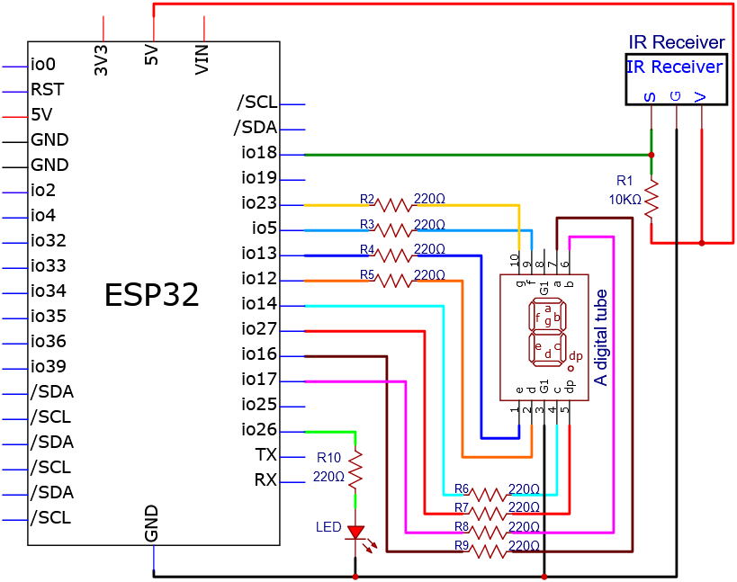

**Wiring diagram:**

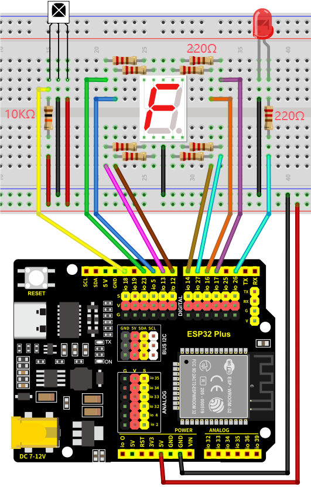

---

**4. Code Flow**

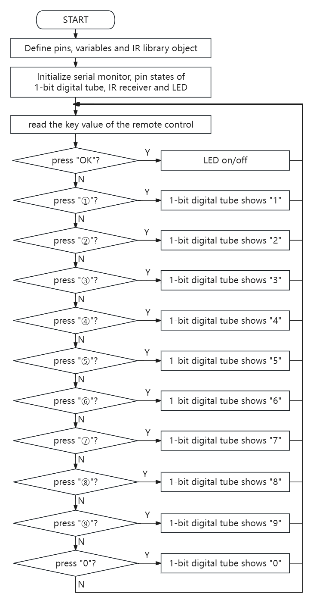

---

**5. Test Code**

Open “Thonny IDE” and choose “This Computer” → “D:” → “Codes” → “MicroPython_Code”. Open the file “2-4-20_Guess_Numbers.py” or copy and paste the following code into “Thonny IDE”.

```python
'''
 * Filename    : Guess_Numbers
 * Thonny      : Thonny 4.1.7
 * Auther      : http//www.keyestudio.com
'''
# import irGetCMD, Pin library
from irrecvdata import irGetCMD
from machine import Pin

# connect IR receiver to pin GPIO18
recvPin = irGetCMD(18)
 
# Set the pins of the digital tube (here is common cathode)
a = Pin(16, Pin.OUT)
b = Pin(17, Pin.OUT)
c = Pin(14, Pin.OUT)
d = Pin(12, Pin.OUT)
e = Pin(13, Pin.OUT)
f = Pin(5, Pin.OUT) 
g = Pin(23, Pin.OUT)
dp = Pin(27, Pin.OUT)

# connect LED to pin IO26
led = Pin(26, Pin.OUT)

flag = 1          
 
try:
    while True:
         irValue = recvPin.ir_read() # Call ir_read() to read key values to assign to irValue.
         if irValue:
            print(irValue)
            if irValue == '0xff02fd' and flag == 1: # press the key “OK” on the remote control, and receive “OK”
              led.value(1)   
              flag = 0 
            elif irValue == '0xff02fd' and flag == 0: # press the key “OK” on the remote control, and receive “OK”
              led.value(0)   
              flag = 1            
            elif irValue == '0xff6897': # press the key “1” on the remote control
                a.value(0)   # show number 1
                b.value(1)
                c.value(1)
                d.value(0)
                e.value(0)
                f.value(0)
                g.value(0)
                dp.value(0)  
            elif irValue == '0xff9867': # press the key “2” on the remote control
                a.value(1)  # show number 2 
                b.value(1)
                c.value(0)
                d.value(1)
                e.value(1)
                f.value(0)
                g.value(1)
                dp.value(0) 
            elif irValue == '0xffb04f': # press the key “3” on the remote control
                a.value(1) # show number 3  
                b.value(1)
                c.value(1)
                d.value(1)
                e.value(0)
                f.value(0)
                g.value(1)
                dp.value(0) 
            elif irValue == '0xff30cf': # press the key “4” on the remote control
                a.value(0)  # show number 4 
                b.value(1)
                c.value(1)
                d.value(0)
                e.value(0)
                f.value(1)
                g.value(1)
                dp.value(0) 
            elif irValue == '0xff18e7': # press the key “5” on the remote control
                a.value(1)  # show number 5 
                b.value(0)
                c.value(1)
                d.value(1)
                e.value(0)
                f.value(1)
                g.value(1)
                dp.value(0) 
            elif irValue == '0xff7a85': # press the key “6” on the remote control
                a.value(1)  # show number 6 
                b.value(0)
                c.value(1)
                d.value(1)
                e.value(1)
                f.value(1)
                g.value(1)
                dp.value(0) 
            elif irValue == '0xff10ef': # press the key “7” on the remote control            
                a.value(1) # show number 7  
                b.value(1)
                c.value(1)
                d.value(0)
                e.value(0)
                f.value(0)
                g.value(0)
                dp.value(0)    
            elif irValue == '0xff38c7': # press the key “8” on the remote control
                a.value(1)  # show number 8 
                b.value(1)
                c.value(1)
                d.value(1)
                e.value(1)
                f.value(1)
                g.value(1)
                dp.value(0) 
            elif irValue == '0xff5aa5': # press the key “9” on the remote control
                a.value(1)  # show number 9 
                b.value(1)
                c.value(1)
                d.value(1)
                e.value(0) 
                f.value(1)
                g.value(1)
                dp.value(0) 
            elif irValue == '0xff4ab5': # press the key “0” on the remote control
                a.value(1) # show number 0  
                b.value(1)
                c.value(1)
                d.value(1) 
                e.value(1)
                f.value(1)
                g.value(0)
                dp.value(0) 
            elif irValue == '0xff42bd': # press the key “*” on the remote control
                a.value(0)  # show nothing 
                b.value(0)
                c.value(0)
                d.value(0)
                e.value(0)
                f.value(0)
                g.value(0)
                dp.value(0)
except:
    pass
```
---

**6. Test Result**

Connect the ESP32 main board to your computer via Micro USB cable. Click  to run the code. If the code fails to run, an error message is displayed in “Shell”.


Please import library referring to **2-1-7 Import Arduino Library** or can click **[Import MicroPython Library](https://docs.keyestudio.com/projects/KS5020/en/latest/docs/2.%20MicroPython_Tutorial.html#import-micropython-library-important)** to refer to import library.

Click  to run the code. Remove the insulation sheet in the remote control and align it to the IR receiver.

Press the key  “ **OK** ” on the remote control for the first time, the external LED lights up. Press the key  “ **OK** ” on the remote control again, the external LED goes off.

Press the key  “ **①** ”  on the remote control, and the digital tube shows number 1.

Press the key  “ **②** ”  on the remote control, and the digital tube shows number 2.

Press the key  “ **③** ”  on the remote control, and the digital tube shows number 3.

Press the key  “ **④** ”  on the remote control, and the digital tube shows number 4.

Press the key  “ **⑤** ”  on the remote control, and the digital tube shows number 5.

Press the key  “ **⑥** ”  on the remote control, and the digital tube shows number 6.

Press the key  “ **⑦** ”  on the remote control, and the digital tube shows number 7.

Press the key  “ **⑧** ”  on the remote control, and the digital tube shows number 8.

Press the key  “ **⑨** ”  on the remote control, and the digital tube shows number 9.

Press the key  “ **0** ”  on the remote control, and the digital tube shows number 0.

Press the key  “ # ”  on the remote control, and the digital tube shows nothing.

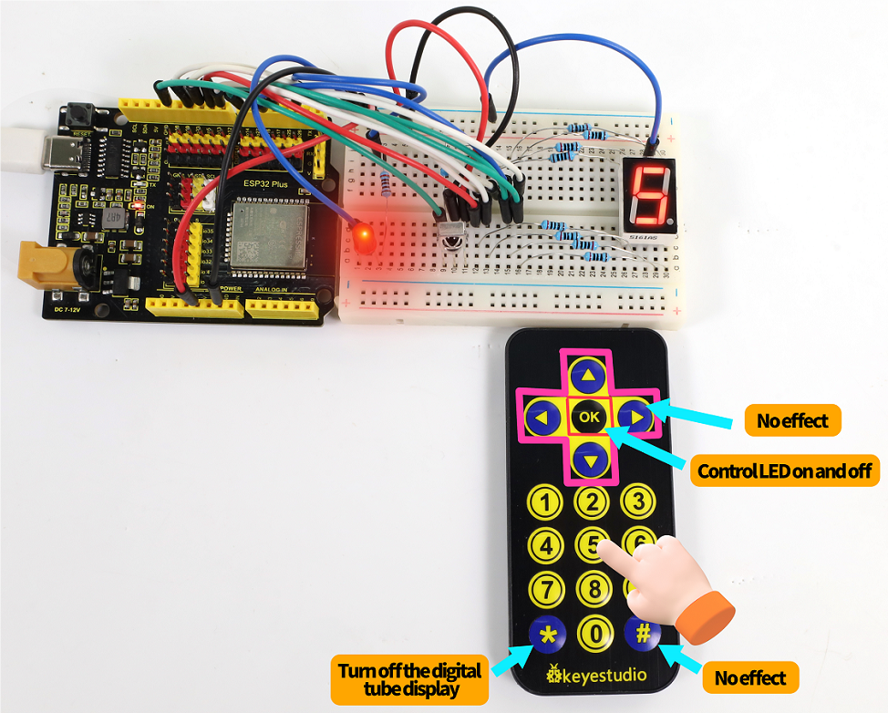

Click  to exit the execution.

---

**7. Code Explanation**

| Code     | Explanation                                                  |
| ------------------- | ------------------------------------------------------------ |
| flag = 1 | set a variable flag value to 1. |
| flag = 0        | assign the flag to 0, when the“OK” is pressed again, LED will be off. |

---

### 2-4-21 Smart Access Control System

---

**1. Overview**

In life, many access control systems use RF modules for unlocking, which is both convenient and safe. We have learned the working principle of the RFID RC522 module and the servo. In this project, we will learn to use them to set up an access control system.

The principle is very simple. In the sensor area on the RFID RC522 module, we use IC card or key chain to unlock, the servo rotates to open the lock.

---

**2. Components**

|  | ||
| ------------------------ | ------------------------ | ---------------------------- |
|ESP32 main board x1 |RFID module x1    | F-F DuPont wires |
||||
|IC card/key chain x1| Micro USB cable x1 |servo x1|

---

**3. Wiring Diagram**

**Schematic diagram:**

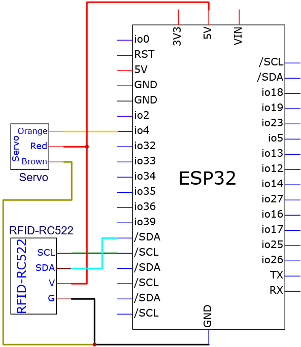

**Wiring diagram:**

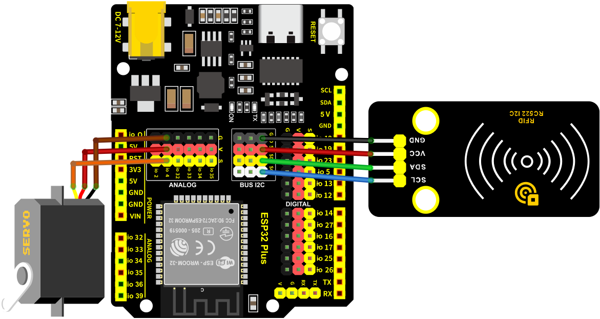

---

**4. Code Flow**

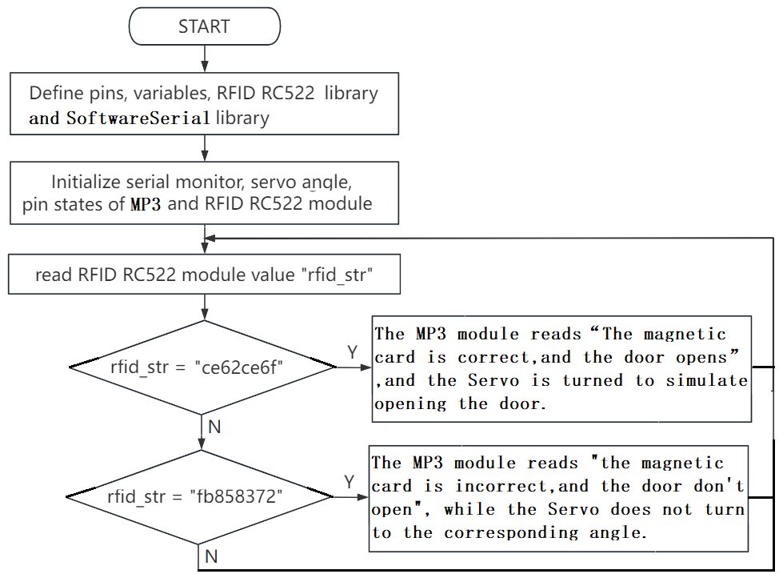

---

**5. Test Code**

**⚠️ATTENTION: The UID code may vary from different IC cards and key chains. Before running the code, please replace the UID code in the program with yours (UID code can be read in Project 2-3-30).**

Open “Thonny IDE” and choose “This Computer” → “D:” → “Codes” → “MicroPython_Code”. Open the file “2-4-21_Smart_Access_Control_System.py” or copy and paste the following code into “Thonny IDE”.

```python
'''
 * Filename    : Smart Access Control System
 * Thonny      : Thonny 4.1.7
 * Auther      : http//www.keyestudio.com
'''
from machine import Pin, PWM
import time
from mfrc522_i2c import mfrc522

# define the output frequency of IO4 as 50Hz and assign it to PWM.
servoPin = PWM(Pin(4)) 
servoPin.freq(50)
servoPin.duty(256)

# i2c config.
addr = 0x28
scl = 22
sda = 21

# initialize the pins and addresses of mfrc522
rc522 = mfrc522(scl, sda, addr)
rc522.PCD_Init()
rc522.ShowReaderDetails()  # display details of the PCD-MFRC522 card reader

# UID code values of the white card and green key chain
uid1 = [180, 180, 170, 219]
uid2 = [231, 185, 101, 101]

# initial Angle of the servo
servoPin.duty_u16(1638)
time.sleep(1)

# Read the UID code values for the white card and the green key chain. If the value is correct, the servo rotates.
while True:
    if rc522.PICC_IsNewCardPresent():
        #print("Is new card present!")
        if rc522.PICC_ReadCardSerial() == True:
            print("Card UID:", end=' ')
            print(rc522.uid.uidByte[0 : rc522.uid.size])
            if rc522.uid.uidByte[0 : rc522.uid.size] == uid1 or rc522.uid.uidByte[0 : rc522.uid.size] == uid2:
                servoPin.duty_u16(8100)
                time.sleep(1)
            else :
                servoPin.duty_u16(1638)
                time.sleep(1)
```
---

**6. Test Result**

Connect the ESP32 main board to your computer via Micro USB cable. Click  to run the code. If the code fails to run, an error message is displayed in “Shell”.


Please import library referring to **2-1-7 Import Arduino Library** or can click **[Import MicroPython Library](https://docs.keyestudio.com/projects/KS5020/en/latest/docs/2.%20MicroPython_Tutorial.html#import-micropython-library-important)** to refer to import library.

Click  to run the code. When using the correct IC card or key chain, the servo rotates (to open the door). Otherwise, the servo will not rotate. At the same time, “Shell” shows the data information read by the RFID module.

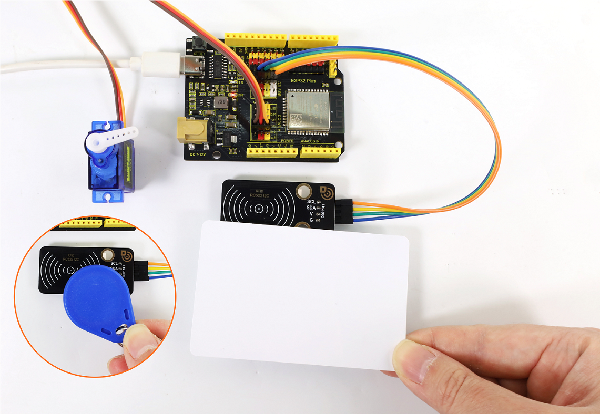


Click  to exit the execution.

---

**7. Code Explanation**

In the previous projects, the IC card and key chain UID code have been tested by the RFID module. Herein we apply the UID code to control the servo to rotate the certain angle to simulate door opening.

---

### 2-4-22 Astern Detector

---

**1. Overview**

Bats fly and acquire prey by echolocation. What is echolocation? Some animals emit ultrasonic waves from throat through the mouth or nasal cavity and determine directions by echo sounds. Inspired by bats, scientists invented radar. Radar antenna likes a bat’s mouth, and the radio waves emitted by the antenna are equivalent to a bat’s ultrasonic waves, and the fluorescent screen to receive the echo waves is a bat’s ear.

In this project, we combine the HC-SR04 ultrasonic sensor, passive buzzer and OLED display to make a simple radar. The passive buzzer will play different tones and  the corresponding distance will also be displayed on the OLED.

---

**2.Components**

|  ||||
| ------------------------ | ------------------------ | ---------------------------- |---------------------------- |
|ESP32 main board x1 | OLED x1|M-F DuPont wires|passive buzzer x1 |
|||||
|ultrasonic sensor x1|breadboard x1 |NPN transistor (S8050) x1| 1kΩ resistor x1 |
||| ||
|jumper wires | Micro USB cable x1 | 10kΩ resistor x1 | F-F DuPont wires |

---

**3. Wiring Diagram**

**Schematic diagram:**

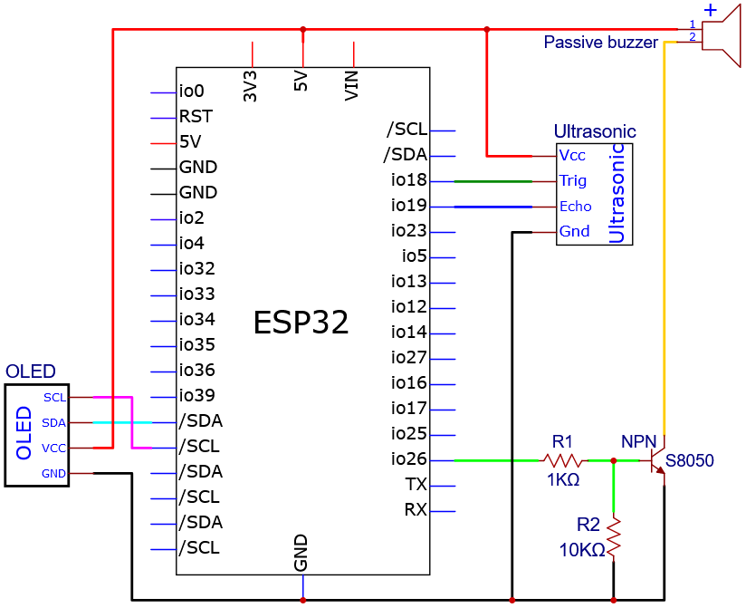


**Wiring diagram:**

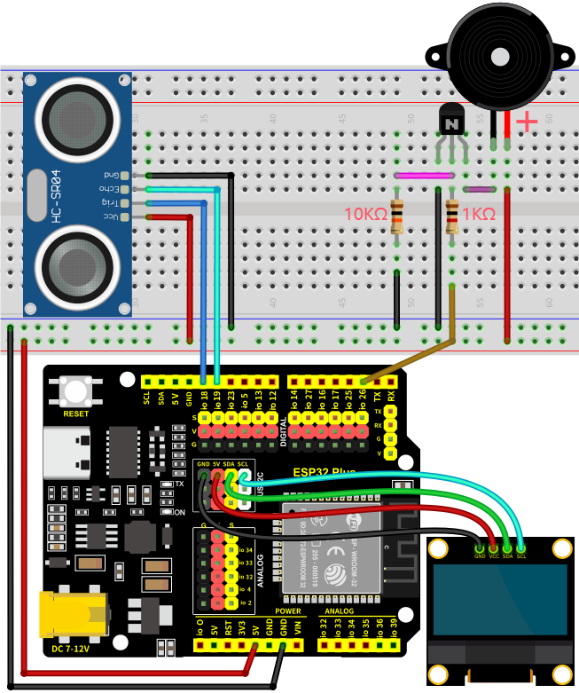

---

**4. Code Flow**

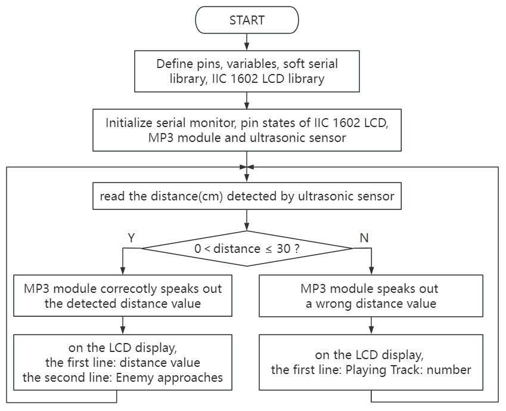

---

**5. Test Code**

**The threshold in the code can be adjusted according to actual conditions.**

Open “Thonny IDE” and choose “This Computer” → “D:” → “Codes” → “MicroPython_Code”. Open the file “2-4-22_Astern_Detector.py” or copy and paste the following code into “Thonny IDE”.

```python
'''
 * Filename    : Astern_Detector 
 * Thonny      : Thonny 4.1.7
 * Auther      : http//www.keyestudio.com
'''
from machine import Pin, ADC, PWM, SoftI2C
import machine 
import time  
import ssd1306
from time import sleep

# ESP32 Pin assignment 
i2c = SoftI2C(scl=Pin(22), sda=Pin(21))

# Set the width, height and i2c of the OLED
oled_width = 128
oled_height = 64
oled = ssd1306.SSD1306_I2C(oled_width, oled_height, i2c)

# Define the GPIO pin that is connected to the buzzer
buzzer = machine.PWM(machine.Pin(26))

# Define the playtone function for the sound of the passive buzzer
def playtone(frequency):
    buzzer.duty_u16(1000)
    buzzer.freq(frequency)

# set the ultrasonic sensor pins
Trig = Pin(18, Pin.OUT, 0) 
Echo = Pin(19, Pin.IN, 0)

distance = 0 # set initial distance value to 0
soundVelocity = 340 # Set the speed of sound.
# getDistance() is used to drive the ultrasonic module to measure distance
# Trig holds a high level of 10us to activate the ultrasonic module
# Echo.value() is used to read the status of the Echo pin of the ultrasonic module
# time.sleep_us() function of the time module calculates the duration of the Echo
# Trig pin high level calculates the measured distance based on time and returns the value
def getDistance():
    Trig.value(1)
    time.sleep_us(10)
    Trig.value(0)
    while not Echo.value():
        pass
    pingStart = time.ticks_us()
    while Echo.value():
        pass
    pingStop = time.ticks_us()
    pingTime = time.ticks_diff(pingStop, pingStart) // 2
    distance = int(soundVelocity * pingTime // 10000)
    return distance

# OLED displays the distance value detected by the ultrasonic sensor. At different distances, buzzers make different sounds.
while True:
    distance = getDistance()
    distance_string = str(distance)
    oled.text('Astern Detector', 0, 0)
    oled.text('Distance(cm):', 0, 25)
    oled.text(distance_string, 0, 50) 
    oled.show()
    time.sleep(0.15)
    oled.fill(0)
    if distance <= 10:
        playtone(880)
        sleep(0.1)
    elif distance > 10 and distance <= 20:
        playtone(332)
        sleep(0.2)
    else:
        buzzer.duty_u16(0)
```
---

**6. Test Result**

Connect the ESP32 main board to your computer via Micro USB cable. Click  to run the code. If the code fails to run, an error message is displayed in “Shell”.


Please import library referring to **2-1-7 Import Arduino Library** or can click **[Import MicroPython Library](https://docs.keyestudio.com/projects/KS5020/en/latest/docs/2.%20MicroPython_Tutorial.html#import-micropython-library-important)** to refer to import library.

Click  again to run the code. OLED shows the distance values detected  by the ultrasonic sensor.

When the ultrasonic sensor detects an object within 10cm, the buzzer beeps and the OLED reveals the concrete distance value.

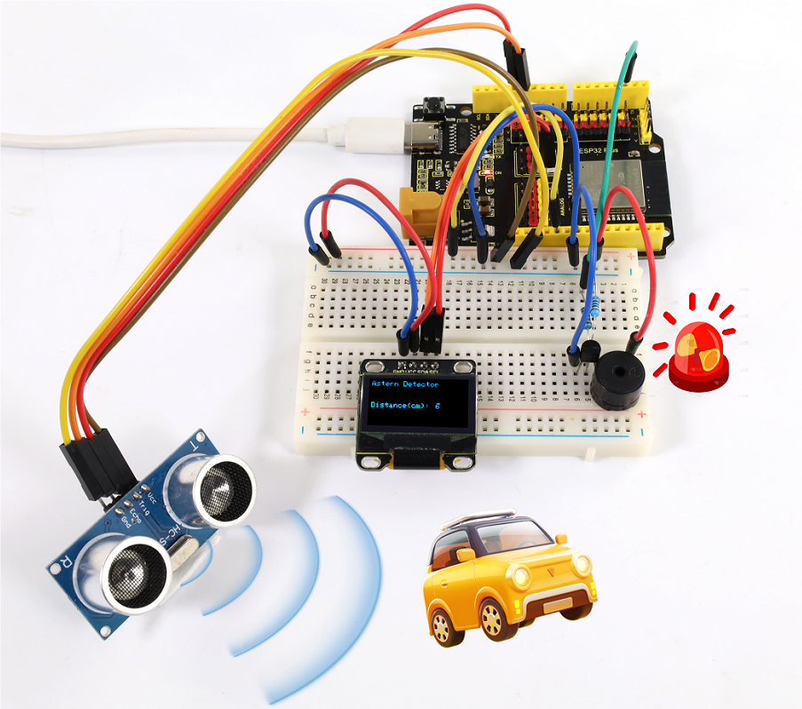

When the ultrasonic sensor detects an object within 10cm ~ 20cm, the buzzer beeps (in another tone) and the OLED reveals the concrete distance value.

When the ultrasonic sensor detects an object without 20cm, the buzzer does not sound and the OLED reveals the concrete distance value.

Click  to exit the execution.

---

**7. Code Explanation**

Please refer to [2-3-10](https://docs.keyestudio.com/projects/KS5020/en/latest/docs/2.%20MicroPython_Tutorial.html#play-music) and [2-3-29](https://docs.keyestudio.com/projects/KS5020/en/latest/docs/2.%20MicroPython_Tutorial.html#oled) Code Explanation.

---

### 2-4-23 Cooling Device

---

**1. Overview**

In life, our computers and circuit board chips will heat up seriously due to long working time or large power consumption, so we often need a cooling device.

We have learned how the LM35 temperature sensor, the OLED display, the 130 DC motor work. So in this project, we combine them to build a simple cooling device. When the LM35 temperature sensor detects that the ambient temperature is higher than a certain value, the 130 motor will turn on for cooling down, and then the temperature value will be displayed on the OLED.

---

**2.Components**

|  | |||
| ------------------------ | ------------------------ | ---------------------------- |---------------------------- |
|ESP32 main board x1 | OLED x1|M-F DuPont wires|LM35 x1 |
|||||
| Micro USB cable x1 | 130 DC motor x1 |fan x1|battery holder x1|
|||||
|F-F DuPont wires|breadboard x1|!jumper wires|AA battery (**self-provided**) x6|
---

**3. Wiring Diagram**

**Schematic diagram:**

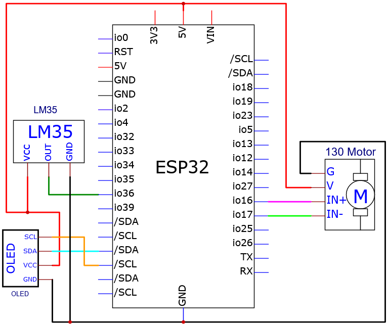

**Wiring diagram:**

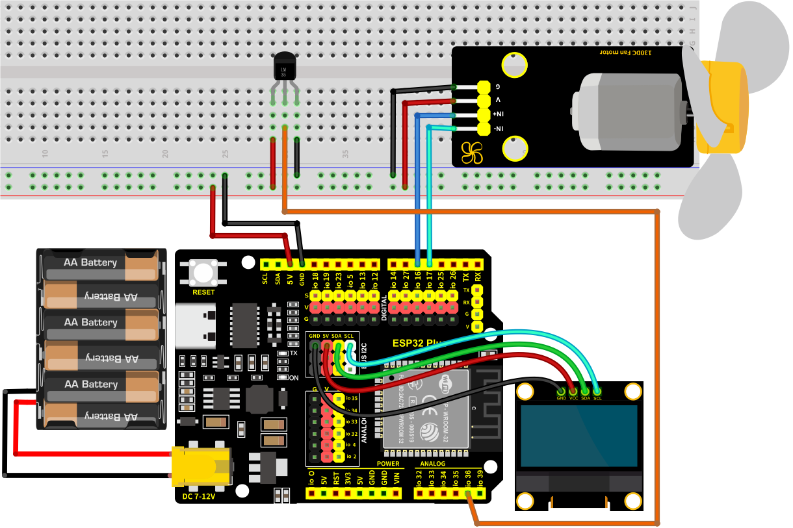

---

**4. Code Flow**

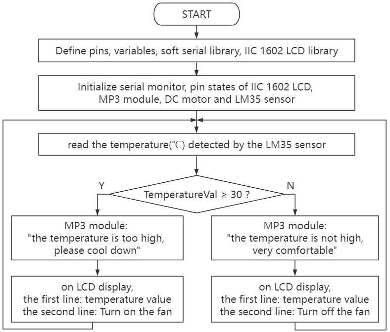

---

**5. Test Code**

**The temperature threshold 30  in the code can be adjusted according to actual conditions.**

Open “Thonny IDE” and choose “This Computer” → “D:” → “Codes” → “MicroPython_Code”. Open the file “2-4-23_Cooling_Device.py” or copy and paste the following code into “Thonny IDE”.

```python
'''
 * Filename    : Cooling_Device
 * Thonny      : Thonny 4.1.7
 * Auther      : http//www.keyestudio.com
'''
from machine import Pin, ADC, PWM, SoftI2C
import machine 
import time  
import ssd1306
from time import sleep

# ESP32 Pin assignment 
i2c = SoftI2C(scl=Pin(22), sda=Pin(21))

# Set the width, height and i2c of the OLED
oled_width = 128
oled_height = 64
oled = ssd1306.SSD1306_I2C(oled_width, oled_height, i2c)

# Enable and configure ADC with a range of 0-3.3V
adc=ADC(Pin(36))
adc.atten(ADC.ATTN_11DB)
adc.width(ADC.WIDTH_12BIT)
conversion_factor = 5.0 / (4095)

# motor pins
INA = Pin(16, Pin.OUT) # INA to IN+
INB = Pin(17, Pin.OUT) # INB to IN-

# OLED displays the temperature detected by the LM35. When it is higher than 30℃, turn on the motor.
while True:
    adcVal=adc.read()
    reading = adcVal * conversion_factor 
    temperature = reading * 102.4 
    temperature_string = str(temperature)
    oled.text('Cooling Device', 0, 0)
    oled.text('Temper(C):', 0, 20)
    oled.text(temperature_string, 0, 40) 
    oled.show()
    time.sleep(0.2)
    oled.fill(0) 
    if temperature > 30: # When the temperature is higher than 30℃
        # turn on the motor
        INA.value(0)
        INB.value(1)
    else: # When the temperature is not higher than 30℃
        # turn off the motor
        INA.value(0)
        INB.value(0)
```
---

**6. Test Result**

Connect the ESP32 main board to your computer via Micro USB cable. Click  to run the code. If the code fails to run, an error message is displayed in “Shell”.


Please import library referring to **2-1-7 Import Arduino Library** or can click **[Import MicroPython Library](https://docs.keyestudio.com/projects/KS5020/en/latest/docs/2.%20MicroPython_Tutorial.html#import-micropython-library-important)** to refer to import library.

Click  to run the code. OLED shows the ambient temperature value detected by the LM35 sensor. When it exceeds 30℃ , the 130 motor is turned on for cooling down.

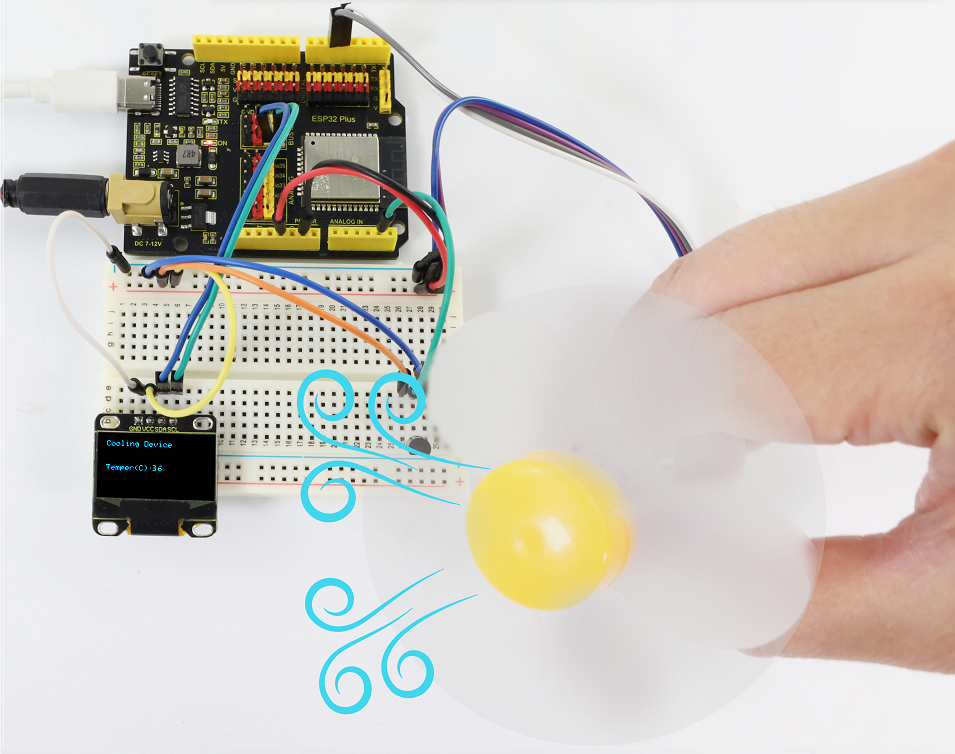

Click  to exit the execution.

---

**7. Code Explanation**

As we learned before, we set a temperature threshold (it can be modified according to the actual situation). The motor rotates when the detected value exceeds the threshold, and the OLED displays the temperature value. When the LM35 temperature sensor detects the ambient temperature is higher than a certain value, the motor is turned on for cooling down, and then the temperature value is revealed on the OLED.


