# 2. MicroPython Tutorial

## 2-1 MicroPython IDE 环境配置

### 2-1-1 软件下载

#### Windows系统

**操作系统：Windows 10**

软件下载链接：[Thonny IDE 软件官网](https://thonny.org)

鼠标触碰到箭头所示处，会出现Windows官方下载的版本选择。

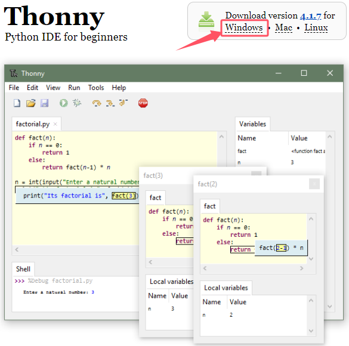

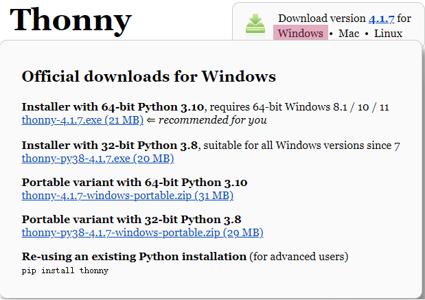

#### MAC系统

请参考Windows系统教程。

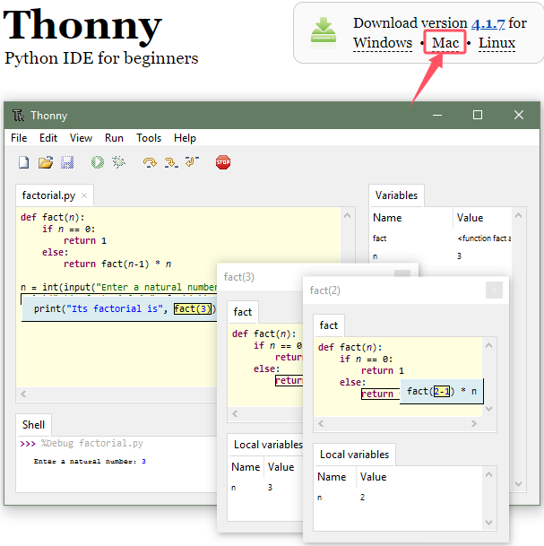

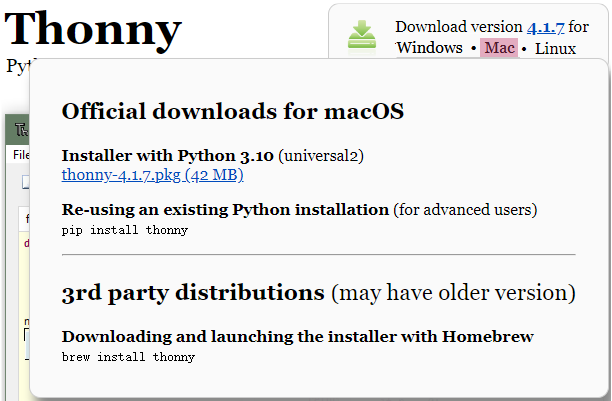

#### Linux系统

请参考Windows系统教程。

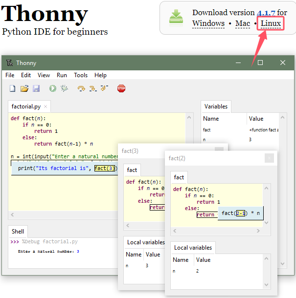

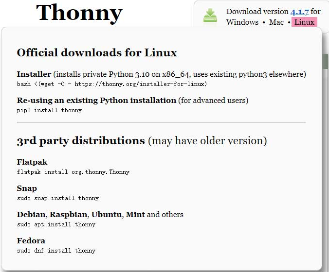

### 2-1-2 软件安装

Thonny应用程序安装支持两种安装方式：

- 安装Thonny+Python捆绑包

  这种方式本质是将Python环境和Thonny打包在一起，即可一键安装使用，快捷方便，推荐新手使用此方式。捆绑包的方式安装又分为两种：

  - Installer安装

    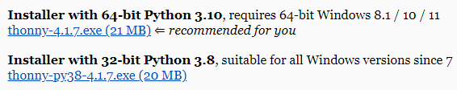

  - 免安装版本

    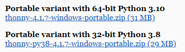

- 单独安装Thonny

  Thonny应用本质是以python包的形式存在，当用户已经具备python环境，即可通过`pip install thonny`单独安装Thonny。这种方式更适合开发者。

  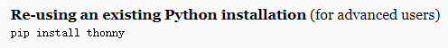

请根据您的需求选择下载相应版本的压缩包。

#### Installer 安装

请根据您的操作系统选择对应的程序下载。以 <span style="background:#ff0;color:#000">64bit Windows 10</span> 环境下，安装程序`Installer with 64-bit Python 3.10` 为例。

（1）下载完成后双击。弹出 Select Setup Install Mode 窗口，选择 **Install for me only** 。


（2）单击 **Next** 。


（3）选中 **I accept the agreement** ，单击 **Next** 。


（4）Thonny软件的安装路径，默认安装在C盘。单击 **Browse...** 可以选择其他安装位置，单击 **Next** 进行下一步。

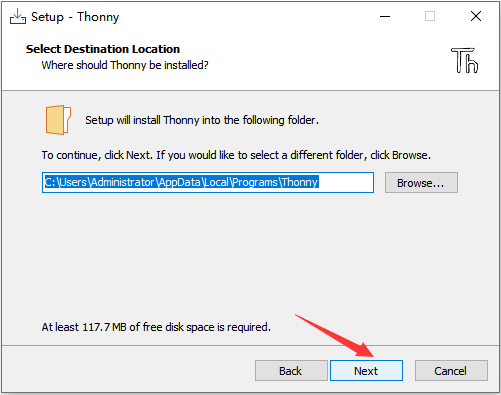

（5）默认将在下面的开始菜单文件夹中创建程序的快捷方式。单击 **Browse...** 可以选择其他安装位置，单击 **Next** 进行下一步。

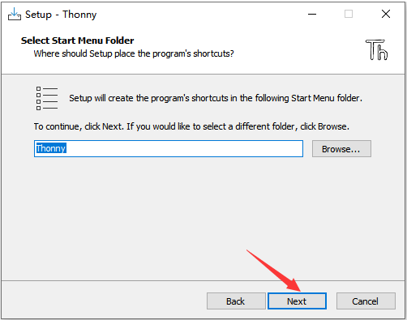

（6）勾选 **Creat desktop icon** ，单击 **Next** 。

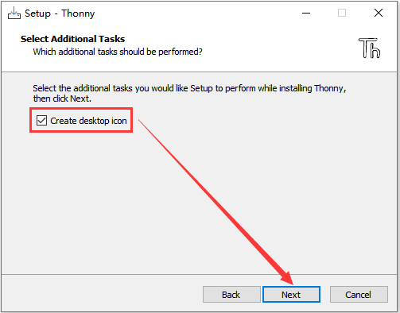

（7）单击 Inatall 进行安装。

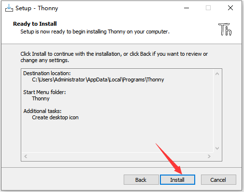

（8）单击“**Finish**”结束安装,安装完成。

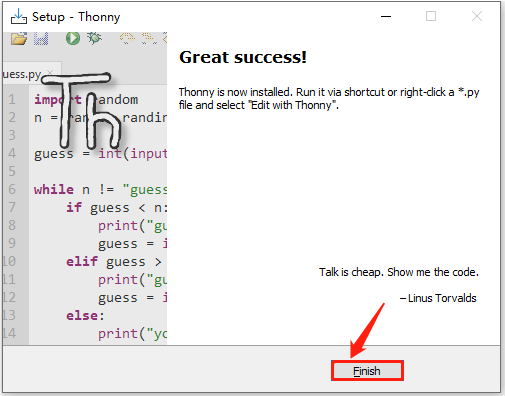

（9）回到桌面，双击 Thonny 图标。选择语言，即可开始运行。

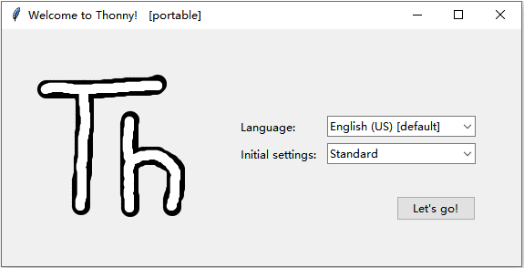

（10）安装完成。

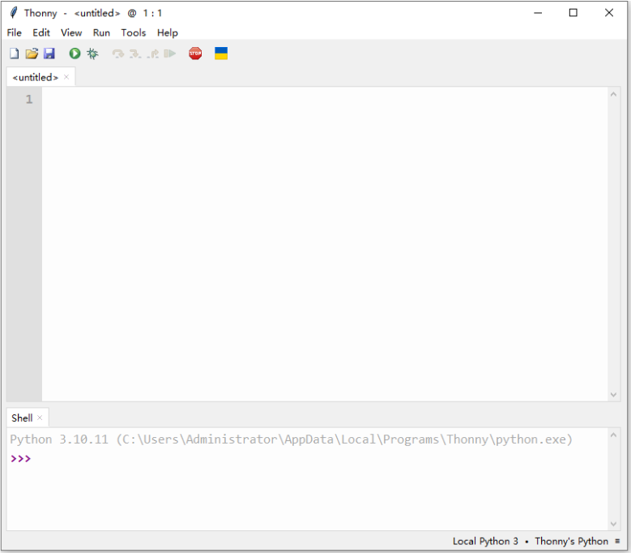

#### 免安装版本

请根据您的操作系统选择对应的程序下载。以 <span style="background:#ff0;color:#000">64bit Windows 10</span> 环境下，安装程序`Portable variant with 64-bit Python 3.10` 为例。

（1）下载完成后解压，双击，选择语言，即可开始运行。

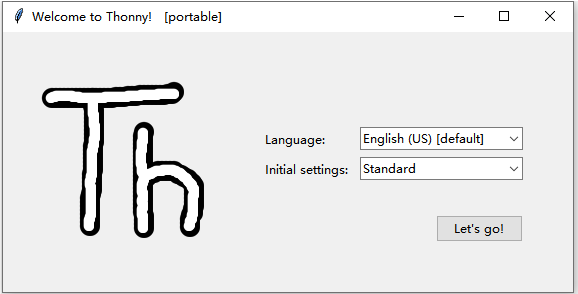

（2）安装完成。

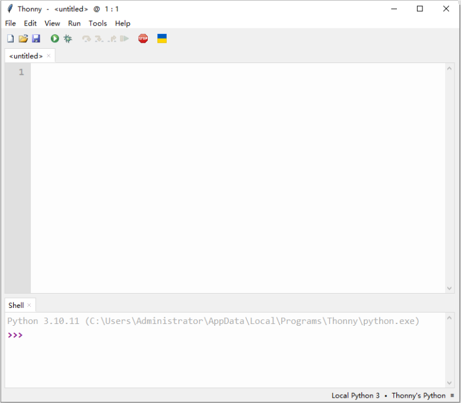

（3）为了使用方便，可以创建快捷方式到桌面。右键单击，选择 **发送到** ，再选择 **桌面快捷方式** 。

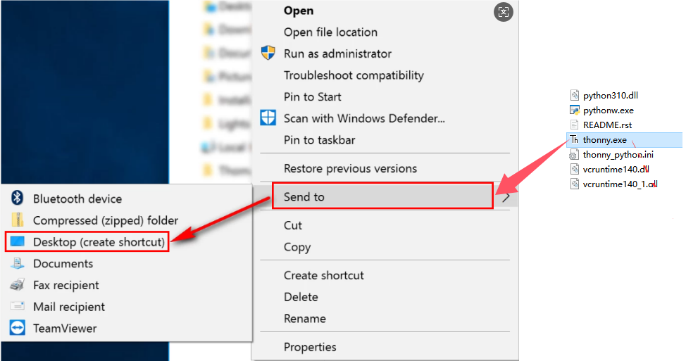

桌面快捷方式创建成功：

---

### 2-1-3 安装驱动

我们需要一个驱动程序来启动我们的ESP32主控板。否则，将找不到连接到计算机的COM端口。

驱动安装方法请参考链接：[https://docs.keyestudio.com/projects/Arduino/en/latest/Arduino%20IDE%20Tutorial.html#install-driver](https://docs.keyestudio.com/projects/Arduino/en/latest/Arduino%20IDE%20Tutorial.html#install-driver)

在表格中，根据ESP32主控板和计算机系统，点击相应链接进入对应的教程。


---

### 2-1-4 烧录固件

<span style="color: rgb(255, 76, 65); background: rgb(255, 251, 0);">（特别提醒：我们提供的ESP32 MicroPython的固件存放于 **Firmware esp32** 文件夹中。）</span>


1\. 首先，使用 Micro USB 数据线将 ESP32 主控板连接到您的计算机。

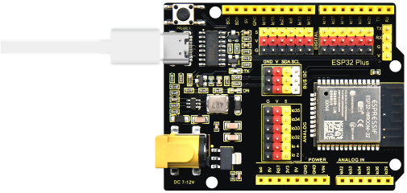

2\. 点击 Thonny IDE 上的 “**Run**”，然后选择 “**Configuration interpreter**”。

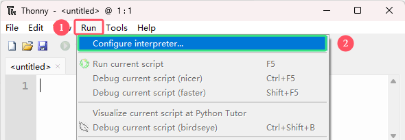

3\. 首先点击 “**Interpereter**”，然后选择“**MicroPython(ESP32)**”，最后点击 “**Install or update MicroPython(esptool)(UF2)**” 

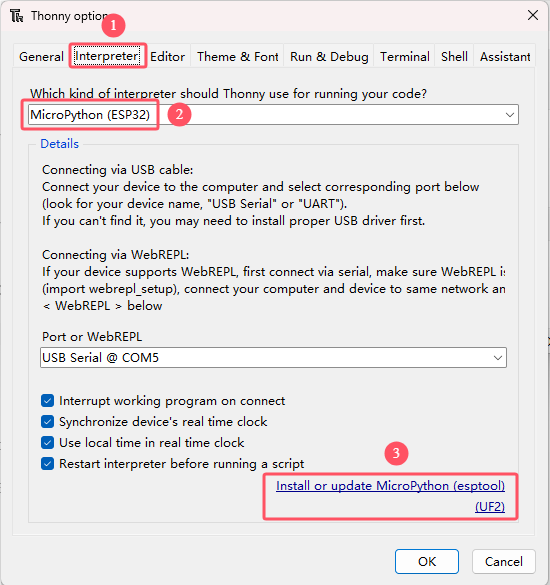

4\. 单击 “”，然后选择 “**Select local MicroPython image...**”。找到存放于文件夹 **Firmware esp32** 中的固件资料，选中 “<span style="color: rgb(255, 76, 65);">ESP32_GENERIC-20241129-v1.24.1.bin</span>” 文件，单击 “**Open**”。

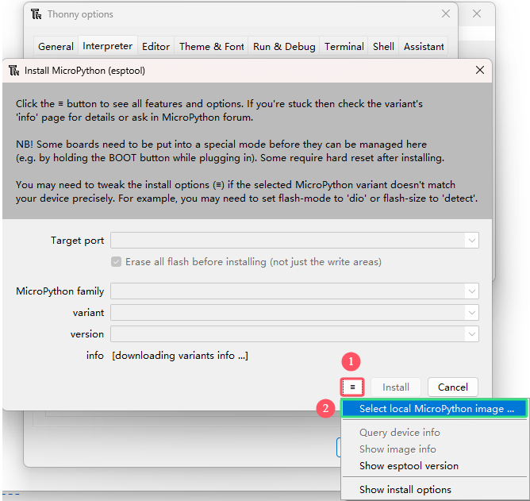

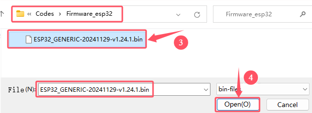

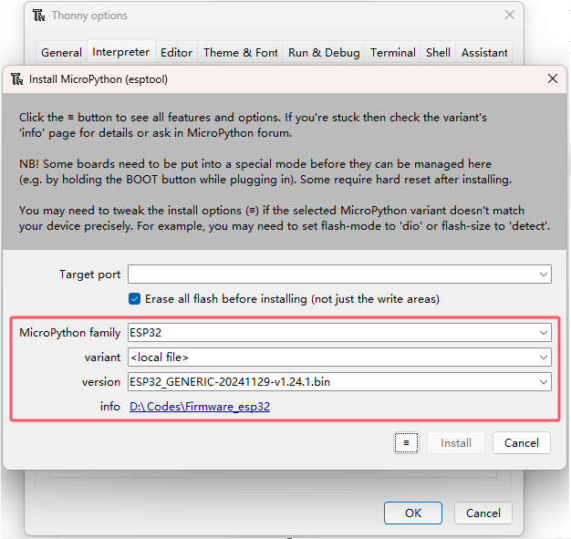

5\. 选择好对应的 “**串口端口(COMXX)**”<span style="color: rgb(255, 76, 65);">(不同的主控板，串口端口(COMXX)不一样)</span> ，然后点击 “**Install**” 。

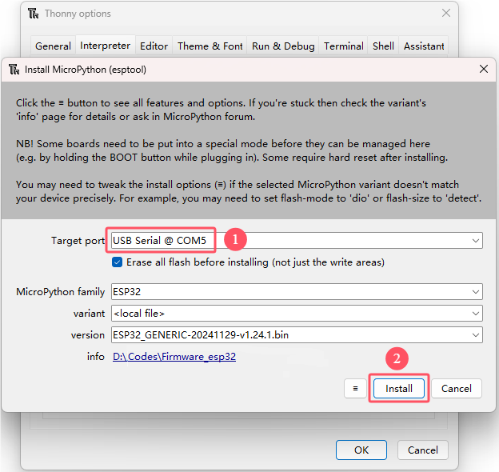

6\. 安装一会儿后，安装完成，单击 “**Close**” ，然后单击 “**OK**” 。

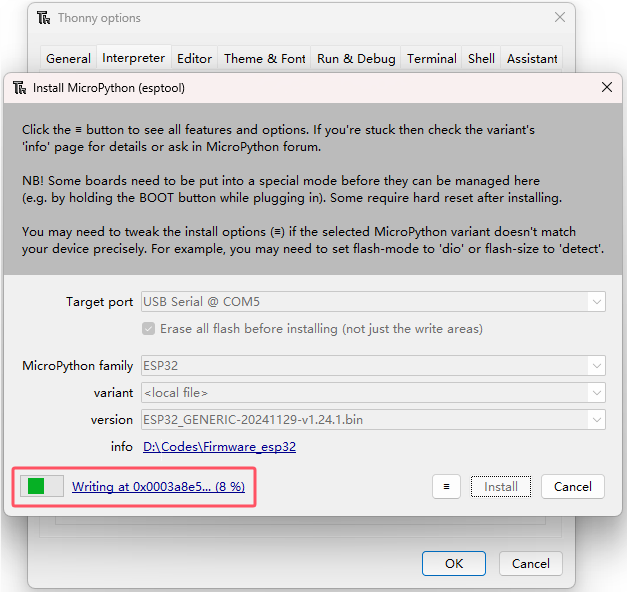

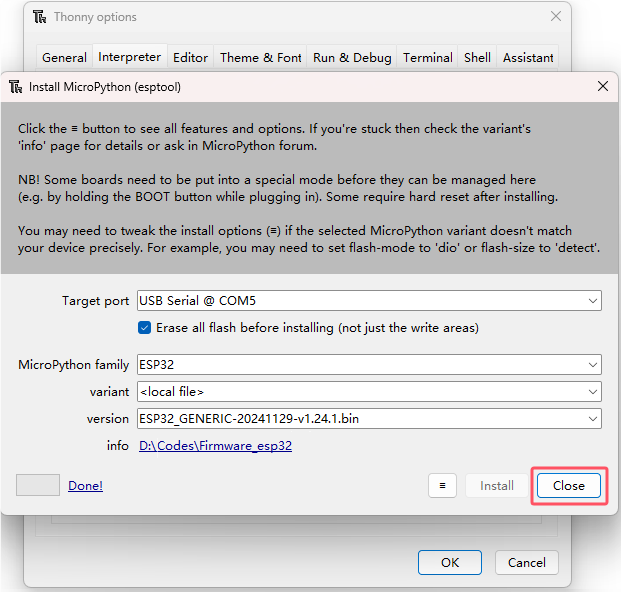

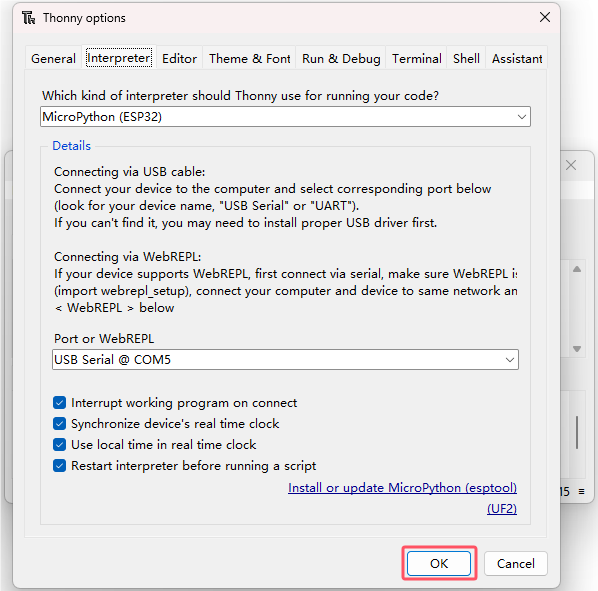

7\. 这样，ESP32固件安装完成。

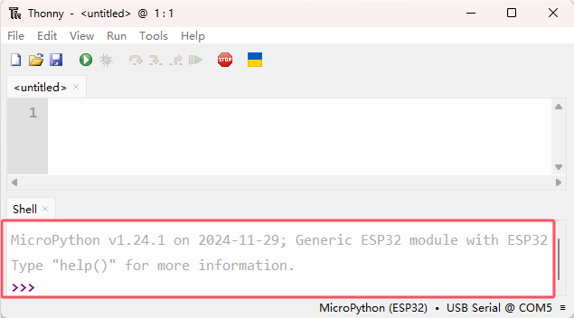

---

### 2-1-5 软件介绍

#### 页面介绍

单击 **View** ，勾选 **Files** ，打开文件路径管理，方便使用。

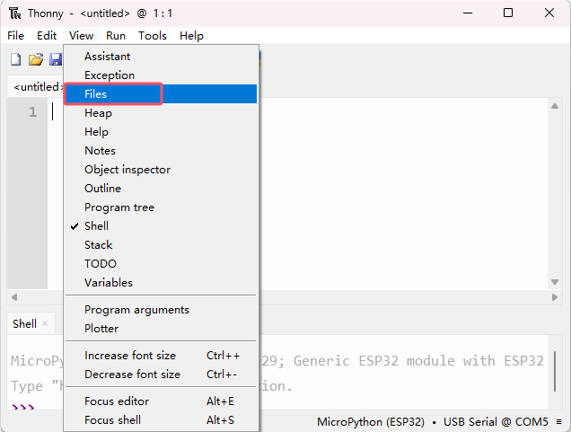

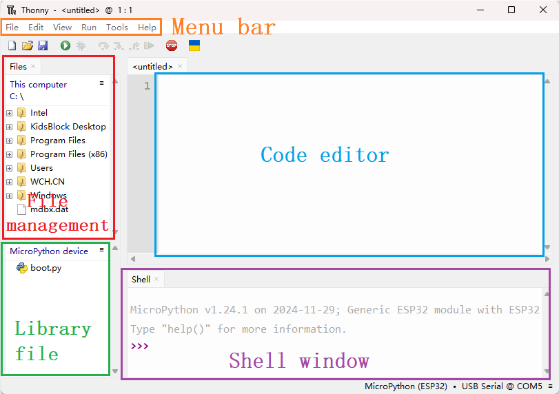

#### 工具栏介绍

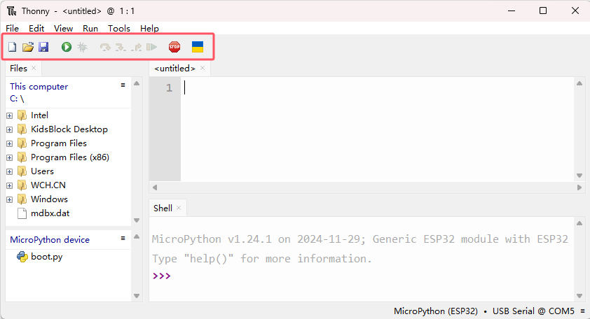

|          按钮           |       功能        |
| :---------------------: | :---------------: |
| |       新建        |
|  |      打开...      |
| |       保存        |
|  |   运行当前脚本    |
|  |   调试当前脚本    |
|  |       步过        |
|  |       步进        |
|  |       步出        |
|  |     恢复执行      |
|  | 停止/重启后端进程 |

---

### 2-1-6 测试

<span style="color: rgb(2550, 10, 50);">请确保代码已经下载完成并解压存放于方便使用的地方，本教程以代码存放于 **D盘** 路径下为例，路径为 **`D:..\Code\MicroPython_Code`**。</span>

在 Files 区单击 **This computer** 。

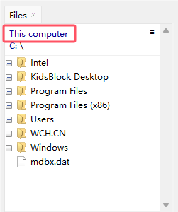

双击 **D 盘** ，双击选择 **Codes 文件夹** ，再双击 **MicroPython_Code 文件夹** ，打开本教程的所有代码。

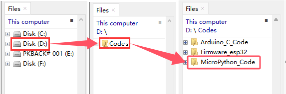

确保 ESP32主控板 已通过 USB数据线 连接到计算机上。

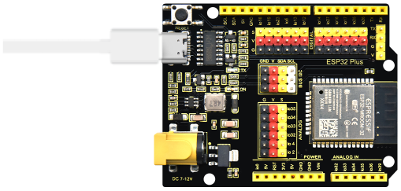

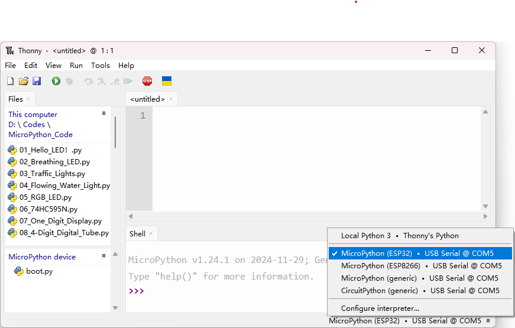

#### 测试Shell命令

在Shell窗口输入以下代码。	

```python
print('hello world')
```
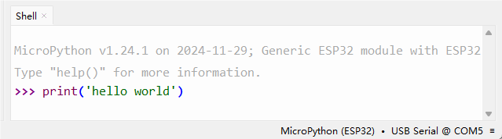

然后按下键盘上的 **回车键(Enter 键)** ，Shell窗口打印出 **hello world** 。

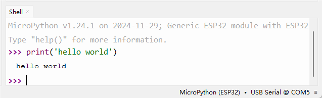

---

#### 测试在线运行

将 LED 和 220Ω 电阻连接到ESP32主控板上，确保 ESP32主控板 已通过 USB数据线 连接到计算机上。

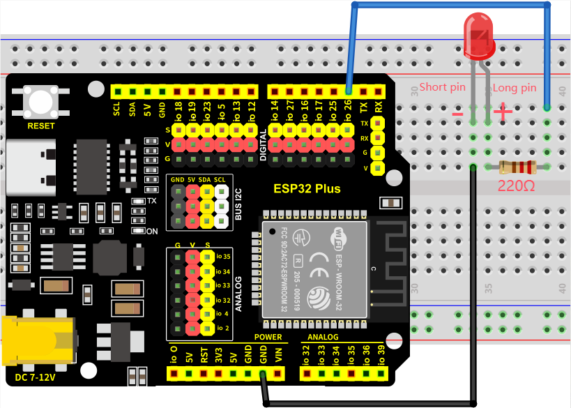

在 Files 区，双击打开 **01_Hello_LED.py** 代码文件。

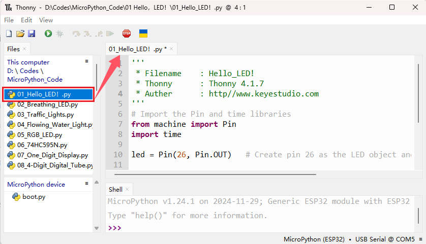

单击  运行代码，可以看到电路中的红色LED亮1秒，然后熄灭1秒，循环交替。

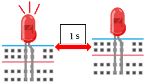

单击  退出程序。

---

#### 测试离线运行

**方法①**：离线运行已经编写好的程序

首先，要确保 Thonny IDE 不是 **在线运行** 状态，单击  退出在线运行。

在 Files 区，双击打开 **01_Hello_LED.py** 代码文件。再选择 <span style="color: rgb(255, 76, 65);">File</span> --> <span style="color: rgb(255, 76, 65);">Save as...</span> 


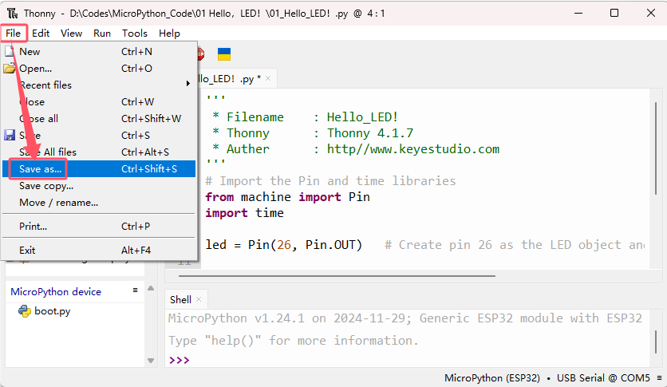

选择 **MicroPython device** 。

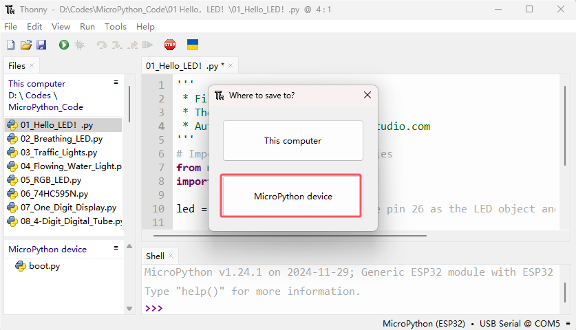

命名为 <span style="color: rgb(10, 10, 200);">main\.py</span> (必须是这个命名，否则离线运行失败)，然后单击 **OK** 。这样，可以在 **MicroPython device** 区可以看到 main\.py 文件。

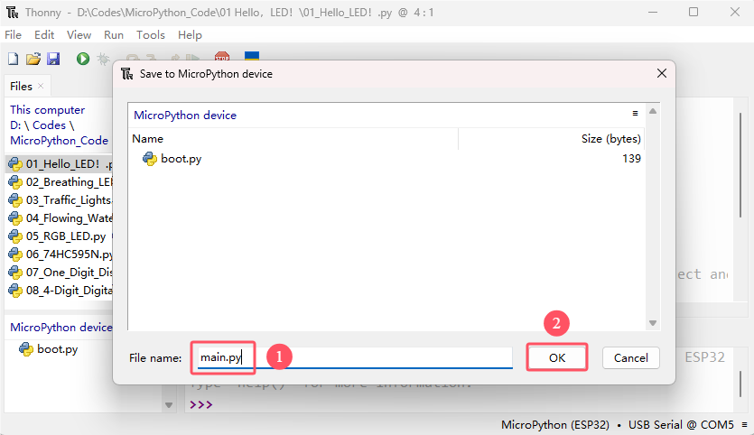

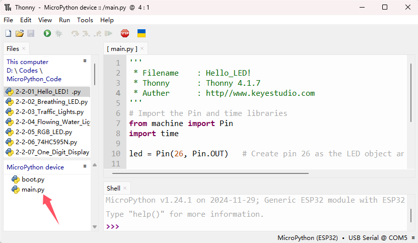

成功上传后，断开ESP32主控板与计算机连接的USB数据线。

然后再次通电（将ESP32主控板通过USB数据线连接到计算机）时，便会自动运行 main\.py 中的程序，能看到电路中的红色LED亮1秒，然后熄灭1秒，循环交替。


**方法②**：离线运行新编写的程序

确保ESP32主控板已经通过USB数据线连接到计算机。

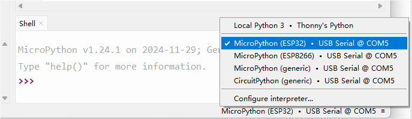

在 Files 区，双击打开 **01_Hello_LED.py** 代码文件。然后复制 **01_Hello_LED.py** 的代码到新文件 <untitled\> ，没有的话单击  新建 <untitled\> 。 

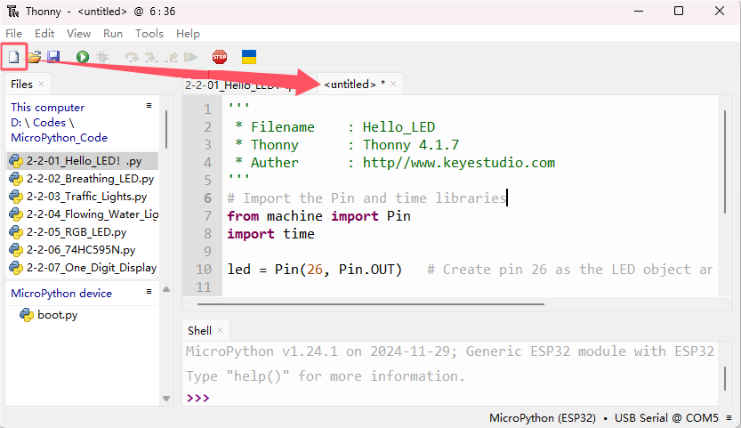

单击  保存，选择 **MicroPython device** 。

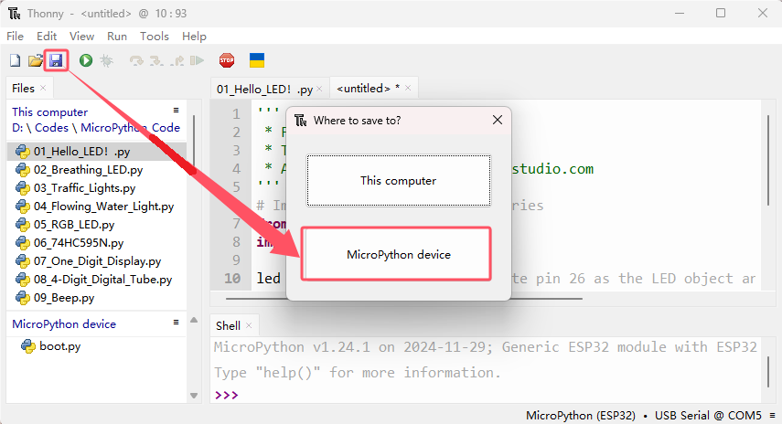

命名为 <span style="color: rgb(10, 10, 200);">main\.py</span> （必须是这个命名，否则离线运行失败），然后单击 **OK** 。这样，可以在 **MicroPython device** 区可以看到 main\.py 文件。

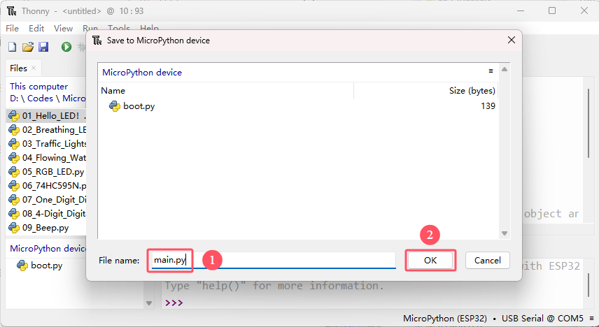

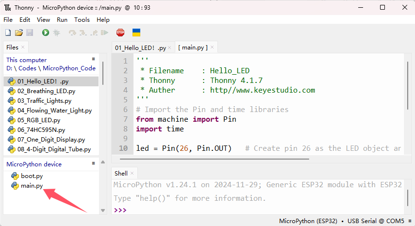

成功上传后，断开ESP32主控板与计算机连接的USB数据线。

然后再次通电（将ESP32主控板通过USB数据线连接到计算机）时，便会自动运行 main\.py 中的程序，能看到电路中的红色LED亮1秒，然后熄灭1秒，循环交替。


---

### 2-1-7 添加 MicroPython 库(重要)：

在某些项目中，您将需要额外的库。所以这里我们先把这些库上传到 ESP32 主控板上，然后我们可以直接运行代码。

1\. 使用 Micro USB 数据线将 ESP32 主控板连接到您的计算机。


2\. 打开 Thonny IDE 并单击右下角的 “**MicroPython(ESP32) . USB Serial @ COMxx**” 解释器。

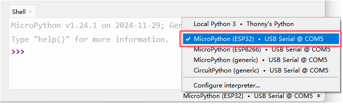

3\. 在顶部的菜单栏中，单击 “ **View** -> **Files** ”。

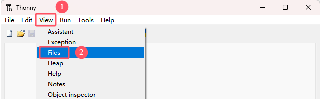

4\. 将路径切换到之前下载的 **Libray** 文件夹，然后转到 **MicroPython_Libray** 文件夹。
(<span style="color: rgb(255, 76, 65);">提醒：这里是以 **Libray** 的文件夹下载到D盘为例，你以你自己下载 **Libray** 文件夹而保存的位置为准。</span>)

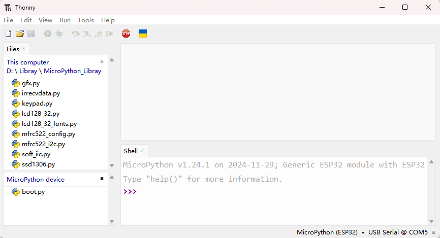

5\. 选中 <span style="color: rgb(255, 76, 65);">MicroPython_Libray</span> 文件夹中的 **gfx\.py** 文件，右键单击 **gfx\.py** 文件，然后选择 “**<span style="color: rgb(255, 76, 65);">Upload to/</span>**” ，这样，**gfx\.py** 文件被上传到 “**MicroPython device**” 驱动器中。

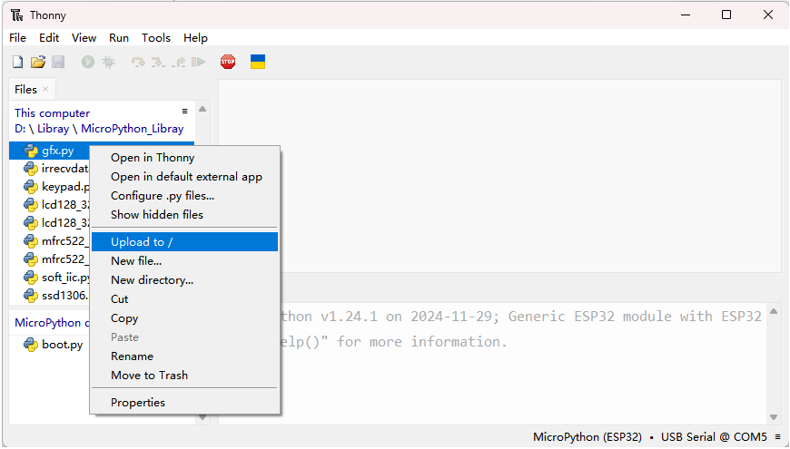

6\. 您将看到您刚刚上传到 “**MicroPython device**” 驱动器中的文件。

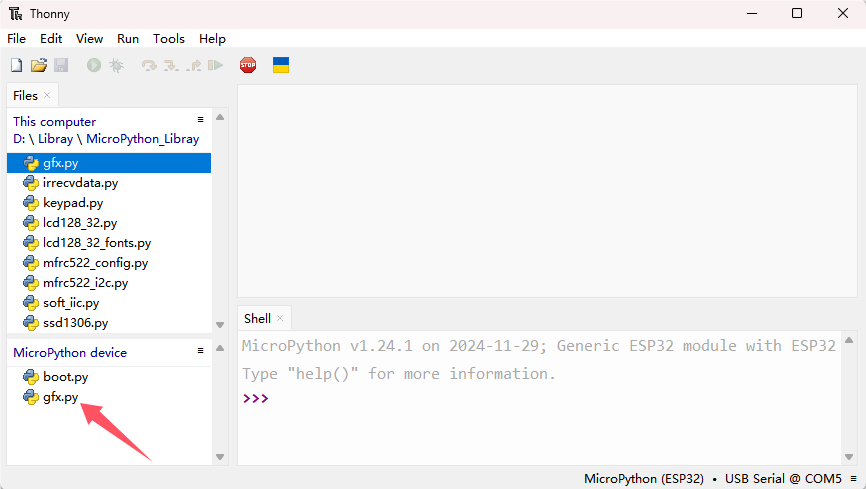

7\. 用相同的方法，将剩余的库文件都上传到 “**MicroPython device**” 驱动器中。

8\. 这样，您将看到您刚刚上传到“**MicroPython device**”驱动器中的所有文件。

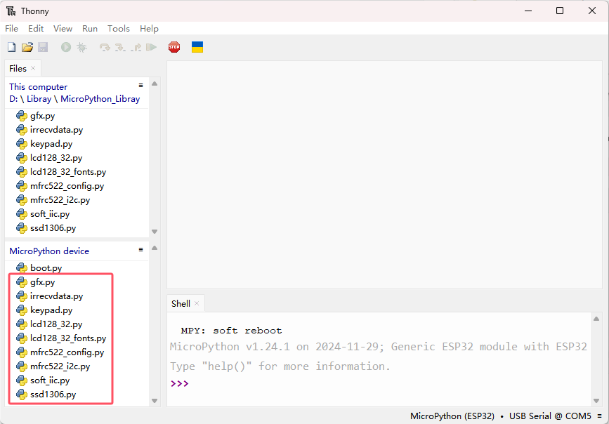

---

## 2-2 基础项目课程：

将多种元器件或传感器/模块利用自带连接线和面包板连接在 ESP32 主控板，然后上传对应的实验代码，测试各个元器件或传感器/模块的功能。下面的课程是先从简单到复杂学习单个元器件或传感器/模块的工作原理，再学习一些元器件和传感器/模块相互组合的扩展应用以巩固加深我们对该套件的理解。

**<span style="color: rgb(255, 76, 65);">特别注意：</span>** 实验时，模块/传感器和元器件连接线材时，必须按照教程里的接线方法及位置，电源与信号脚不能错接，否则会损坏模块/传感器和元器件。

---

### 2-2-1 Hello, LED!


---

**1. 项目介绍：**

**LED：** 即发光二极管的简称。由含镓（Ga）、砷（As）、磷（P）、氮（N）等的[化合物](https://baike.baidu.com/item/化合物/1142931)制成。当电子与[空穴](https://baike.baidu.com/item/空穴/3517781)复合时能辐射出可见光，因而可以用来制成发光二极管。在电路及仪器中作为指示灯，或者组成文字或数字显示。砷化镓二极管发红光，磷化镓二极管发绿光，碳化硅二极管发黄光，氮化镓二极管发蓝光。因化学性质又分有机发光二极管OLED和无机发光二极管LED。

LED闪烁实验相当简单，在本项目中，我们将把LED连接到其中一个数字引脚(IO26)上。

---

**2. 元件知识：** 

**（1）LED**:


LED是一种被称为“发光二极管”的半导体，是一种由半导体材料(硅、硒、锗等)制成的电子器件。它有正极和负极。短腿为负极，接GND，长腿为正极，接3.3V或5V。


**（2）五色环电阻**

电阻是电路中限制或调节电流流动的电子元件。左边是电阻器的外观，右边是电阻在电路中表示的符号。电阻(R)的单位为欧姆(Ω)，1 MΩ = 1000 KΩ，1KΩ = 1000Ω。

   
 
我们可以使用电阻来保护敏感组件，如LED。电阻的强度（以Ω为单位）用小色环标记在电阻器的主体上。每种颜色代表一个数字，你可以用电阻对照卡查找。

-色带1 – 1st Digit.
-色带 2 – 2nd Digit.
-色带 3 – 3rd Digit.
-色带 4 – Multiplier.
-色带 5 – Tolerance.


在这个套件中，我们提供了3个具有不同电阻值的五色环电阻。这里以3个五色环电阻为例：

220Ω 电阻*10


10KΩ 电阻*10


1KΩ 电阻*10


在相同的电压下，会有更小的电流和更大的电阻。电流(I)、电压(U)、电阻(R)之间的联系可以用公式表示：I=U/R。在下图中，假如电压为3V，则通过R1的电流: I = U / R = 3 V / 10 KΩ= 0.0003A= 0.3mA。


                                  
不要把电阻值很低的电阻直接连接在电源两极，这样会使电流过高而损坏电子元件。电阻是没有正负极之分。

**（3）面包板**

在完成任何电路设计之前，面包板用于快速构建和测试电路。面包板上有许多孔，可以插入集成电路和电阻等电路元件。一个典型的面包板如下所示：


面包板有很多金属条，它们在面包板的下面，连接面包板顶部的孔。金属条的摆放如下图所示。注意，顶部和底部的孔是水平连接，而其余的孔是垂直连接。


面包板的前两行(上)和后两行(下)分别用于电源的正极（+）和负极（-）。面包板的导电布局图如下图所示：


电子初学者在连接DIP (Dual In-line Packages)组件时，如集成电路、微控制器、芯片等，中间一条凹槽隔离中间部分，凹槽上下是不连通的。因此，DIP组件可以连接如下图所示：


---


**3. 实验组件：**

|  ||||
| ------------------------ | ------------------------ | ---------------------------- |---------------------------- |
| ESP32 主控板| 红色 LED x1  | 220Ω电阻 x1  |移动通信设备 x1|
||||   |
|面包板 x1 |面包板跳线若干 | Micro USB数据线 x1 |    |

---

**4. 接线图：** 

我们从下面的实验原理图可知。这里我们使用数字引脚IO26。我们将LED连接到一个220Ω的电阻，以避免大电流损坏LED。

**原理图：**


**实物接线图：**


---

**5. 实验代码：**

```python
'''
 * Filename    : Hello_LED 
 * Thonny      : Thonny 4.1.7
 * Auther      : http//www.keyestudio.com
'''
# 导入 Pin 和 time 库
from machine import Pin
import time

led = Pin(26, Pin.OUT)   # 创建引脚26为LED对象，设置引脚26为输出

try:
    while True:
        led.value(1)   # LED点亮
        time.sleep(1)  # 延时 1s
        led.value(0)   # LED熄灭
        time.sleep(1)  # 延时 1s
except:
    pass
```

---

**6. 实验结果：**

将 ESP32 主控板通过Micro USB数据线与计算机相连供电，单击  ，代码开始执行，你会看到的现象是：电路中的红色LED亮1秒，然后熄灭1秒，循环交替。


单击退出程序。

---

**7. 代码说明：**

1\. 从machine模块中导入Pin类，才可以用他的函数。。

```python
from machine import Pin
```
2\. 导入time 类，才可以用它的函数。

```python
import time
```

3\. 设置LED的引脚和输出模式。

```python
machine.Pin(id,mode,pull,value)
```
- <span style="color: rgb(255, 76, 65);">id</span> ：GPIO编号，数值为0-29，如使用GPIO26则此处填写26。
 
- <span style="color: rgb(255, 76, 65);">mode</span> ：指定引脚模式。可以是以下之一：
   
   - <span style="color: rgb(255, 76, 65);">Pin\.IN(0)</span> - 引脚配置为输入；
   
   - <span style="color: rgb(255, 76, 65);">Pin.OUT(1)</span> - 引脚配置为（正常）输出；
   
   - <span style="color: rgb(255, 76, 65);">Pin.OPEN_DRAIN(2)</span> - 引脚配置为开漏输出；
   
- <span style="color: rgb(255, 76, 65);">pull</span> ：指定引脚是否连接了（弱）拉电阻，仅在输入模式下有效，可以是以下之一：
   
   - <span style="color: rgb(255, 76, 65);">None</span> - 无上拉或下拉电阻；
   
   - <span style="color: rgb(255, 76, 65);">Pin.PULL_UP(1)</span> - 上拉电阻使能；
   
   - <span style="color: rgb(255, 76, 65);">Pin.PULL_DOWN(2)</span> - 下拉电阻使能；
   
- <span style="color: rgb(255, 76, 65);">value</span> ：仅对 Pin.OUT 和 Pin.OPEN_DRAIN 模式有效，并指定初始输出引脚值，否则引脚外设的状态保持不变。0为低(off)、1为高(on)。
   
   - <span style="color: rgb(255, 76, 65);">Pin.on()</span> - 设置引脚为高电平
   
   - <span style="color: rgb(255, 76, 65);">Pin.off()</span> - 设置引脚为低电平
 
4\. 设置LED连接引脚为IO26，输出模式。 

```python
led = Pin(26, Pin.OUT) 
```
Q ：为什么要选择输出模式呢？

A ：代码是对主板进行设置的。对于主板来说这个io11引脚设置为输出模式，输出高低电平给连接到这个引脚的模块使用。

5\. `while True:`此函数下面的语句循环执行。 

while循环函数，一般形式：

```python
while 判断条件(condition)：
    执行语句(statements)……
```

6\. LED亮灭

```python
led.value(1)   # LED点亮
time.sleep(1)  # 延时 1s
led.value(0)   # LED熄灭
time.sleep(1)  # 延时 1s
```
   - <span style="color: rgb(255, 76, 65);">led.value(1)</span> ：是在主控板的IO引脚上输出高电平（1）；也就是输入高电平（1）到led上，实现亮的效果。
   
   - <span style="color: rgb(255, 76, 65);">led.value(0)</span> : 是在主控板的IO引脚上输出低电平（0）；也就是输入低电平（0）到led上，实现灭的效果。
   
   - <span style="color: rgb(255, 76, 65);">time.sleep(1)</span> ：是让程序在此延时1秒。

Q ：为什么要延时呢？

输入高电平给LED模块，LED灯会一直亮。设置延时1秒，LED就只保持亮的状态1秒，然后接着往下运行程序。
   
A ：通过设置延时来控制LED灯亮、灭的时间。

---

### 2-2-2 呼吸灯

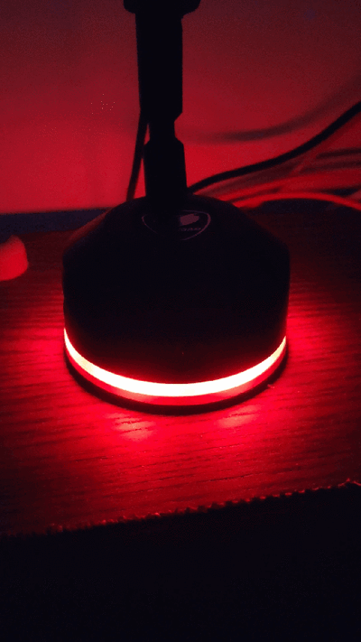

---

**1. 实验介绍：**

在上一个项目中，我们通过使用数字输出打开和关闭 LED 来控制 LED。在这个项目中，我们将利用脉宽调制 （PWM） 在 LED 上创建呼吸效果。PWM 是一种技术，它允许我们通过改变方波信号的占空比来控制 LED 的亮度或电机的速度。

使用 PWM，我们不是简单地打开或关闭 LED，而是调整 LED 亮起的时间与每个周期内关闭的时间。通过以不同的时间间隔快速打开和关闭 LED，我们可以创造 LED 逐渐变亮和变暗的错觉，模拟呼吸效果。

通过使用 ESP32 主控板 的 PWM 功能，我们可以实现对 LED 亮度的平滑和精确控制。这种呼吸效果为您的项目添加了动态且具有视觉吸引力的元素，从而营造出引人注目的显示或氛围。 

---

**2. 工作原理：**


**模拟信号 & 数字信号** 

模拟信号在时间和数值上都是连续的信号。相反，数字信号或离散时间信号是由一系列数字组成的时间序列。生活中的大多数信号都是模拟信号，一个熟悉的模拟信号的例子是：全天的温度是连续不断变化的，而不是突然从0到10的瞬间变化。然而，数字信号的值可以瞬间改变。这个变化用数字表示为1和0(二进制代码的基础)。如下图所示，我们可以更容易地看出它们的差异。

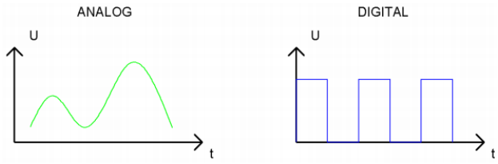

**PWM：**

脉宽调制(PWM)是一种利用数字信号控制模拟电路的有效方法。普通处理器不能直接输出模拟信号。PWM技术使这种转换(将数字信号转换为模拟信号)非常方便。PWM技术利用数字引脚发送一定频率的方波，即高电平和低电平的输出，交替持续一段时间。每一组高电平和低电平的总时间一般是固定的，称为周期(<span style="color: rgb(255, 76, 65);">注:周期的倒数是频率</span>)。高电平输出的时间通常称为脉宽，占空比是脉宽(PW)与波形总周期(T)之比的百分比。高电平输出持续时间越长，占空比越长，模拟信号中相应的电压也就越高。下图显示了对应于脉冲宽度0%-100%的模拟信号电压在0V-3.3V(高电平为3.3V)之间的变化情况.

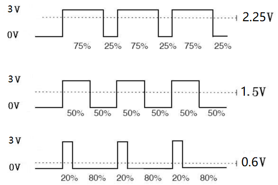

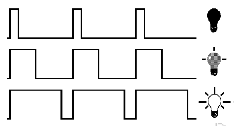

脉宽调制有许多应用，如灯亮度调节，电机调速，声音制造等。以下是PMW的三个基本参数。

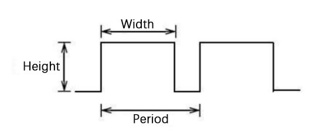

1\. 占空比：信号在某一时间段内处于高水平时，占时间的百分比。

2\. 脉冲周期(一秒内脉冲频率的倒数)

3\. 在ESP32上，LEDC(PWM)控制器有16个独立通道，每个通道可以独立控制频率，占空比，甚至精度。

PWM占空比越长，输出功率越高。既然我们了解了这种关系，我们就可以用PWM来控制LED的亮度或直流电机的速度等等。从上面可以看出，PWM并不是真实的模拟信号，电压的有效值等于相应的模拟信号。因此，我们可以控制LED和其他输出模块的输出功率，以达到不同的效果。

**ESP32 与 PWM**

在ESP32上，LEDC(PWM)控制器有16个独立通道，每个通道可以独立控制频率，占空比，甚至精度。与传统的PWM引脚不同，ESP32的PWM输出引脚是可配置的，每个通道有一个或多个PWM输出引脚。最大频率与比特精度的关系如下公式所示：


其中比特的最大值为31。例如,生成PWM的10位精度(2ˆ10 = 1024。取值范围为0 ~ 1023)。

---

**3. 实验组件：**

|   | ||
| ------------------------ | ------------------------ | ---------------------------- | 
|ESP32 主控板| 红色LED x1 | 220Ω电阻 x1 |
||||
|面包板 x1 |面包板跳线若干 | Micro USB数据线 x1 |

---

**4. 接线图：** 

我们从下面的实验原理图可知。这里我们使用数字引脚IO26。我们将LED连接到一个220Ω的电阻，以避免大电流损坏LED。

**原理图：**


本项目与第01课 Hello，LED！使用相同引脚，但信号类型不同。第01课是直接从 IO26 输出数字高低电平（0 & 1）以使 LED 亮起或关闭，该项目是从 IO26 输出 PWM 信号来控制 LED 的亮度。

**实物接线图：**


---

**5. 实验代码：**

```python
'''
 * Filename    : Breathing_LED 
 * Thonny      : Thonny 4.1.7
 * Auther      : http//www.keyestudio.com
'''
# 导入Pin,PWM和time
import time
from machine import Pin,PWM

# ESP32 PWM引脚输出的方式与传统控制器不同。
# 它可以改变频率和占空比通过配置PWM的参数在初始化阶段。
# 定义GPIO26的输出频率为10000Hz，分配给PWM。

pwm =PWM(Pin(26,Pin.OUT),10000)

try:
    while True:
# 占空比范围为0-1023，因此我们使用第一个for回路控制PWM改变占空比值，使PWM输出0% -100%;
# 使用第二个for回路使PWM输出100%-0%。 
        for i in range(0,1023): 
            pwm.duty(i)
            time.sleep_ms(1)
            
        for i in range(0,1023):
            pwm.duty(1023-i)
            time.sleep_ms(1)  
except:
# 每次使用PWM时，硬件定时器将打开以配合它。
# 因此，每次使用PWM后，都需要调用deinit()来关闭定时器。否则，下次PWM可能无法工作.
    pwm.deinit()
```
---

**6. 实验结果：**

将 ESP32 主控板通过Micro USB数据线与计算机相连供电，单击，代码开始执行，你会看到的现象是：电路中的LED从暗逐渐变亮，再从亮逐渐变暗，就像呼吸一样。

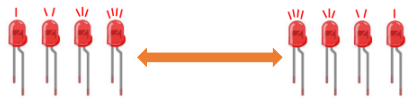

单击退出程序。

---

**7. 代码说明:**

1\. # 导入Pin,PWM和time。

```python
import time
from machine import Pin,PWM
```
2\. 初始化一个 <span style="color: rgb(255, 76, 65);">PWM</span> 对象，用于控制连接到引脚 26 的 LED，并将 PWM 信号的频率设置为 10000 Hz。

```python
pwm =PWM(Pin(26,Pin.OUT),10000)
```
3\. 使用循环淡入和淡出 LED：外部 <span style="color: rgb(255, 76, 65);">while True</span> 循环无限期运行。两个嵌套 <span style="color: rgb(255, 76, 65);">for</span> 循环 用于逐渐增加和减少 LED 的亮度。占空比范围为 0 至 1023，代表 0% 至 100% 占空比。

```python
while True:
    for i in range(0,1023): 
       pwm.duty(i)
       time.sleep_ms(1)
            
    for i in range(0,1023):
       pwm.duty(1023-i)
       time.sleep_ms(1)
```
- <span style="color: rgb(255, 76, 65);">range()</span>：创建一个从 0 到 1023 的整数序列。

- PWM 信号的占空比 <span style="color: rgb(255, 76, 65);">duty()</span> 方法 PWM 对象。

- <span style="color: rgb(255, 76, 65);">time.sleep_ms()</span>：在循环的每次迭代之间暂停程序的执行 1 毫秒，从而随着时间的推移逐渐增加亮度。

---

### 2-2-3 交通灯


---

**1. 实验介绍：**

交通灯，也就是马路上十字路口的红绿灯，在我们的日常生活中很常见。交通灯是由红、黄、绿三种颜色组成的，根据一定的时间规律循环交替亮起或熄灭。每个人都应该遵守交通规则，这可以避免许多交通事故。

想学习交通灯的原理吗？在这个项目中，我们可以用红、黄、绿3个LED外接电路来模拟马路上的交通灯。

---

**2. 实验组件：**

|  |||
| ------------------------ | ------------------------ | ---------------------------- | 
| ESP32 主控板| 红色LED x1  |绿色LED x1  |
|| ||
|黄色LED x1  | 220Ω电阻 x3  |面包板 x1 |
|||  |
|面包板跳线若干 | Micro USB数据线 x1 |  |

---

**3. 接线图：** 

**原理图：**

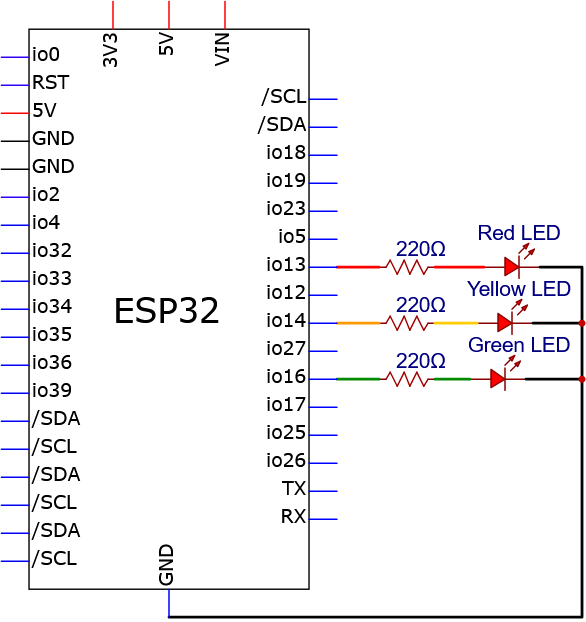


**实物接线图：**

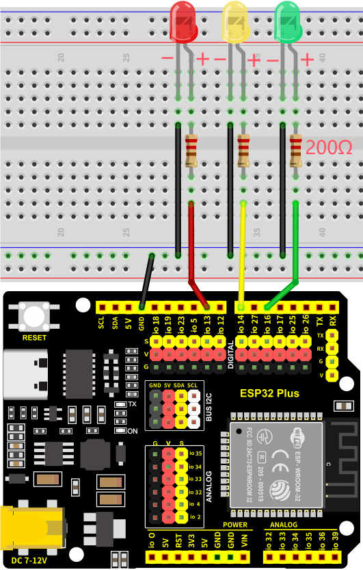

---

**4. 实验代码：**

```python
'''
 * Filename    : Traffic_Lights
 * Thonny      : Thonny 4.1.7
 * Auther      : http//www.keyestudio.com
'''
from machine import Pin
import time

led_red = Pin(13, Pin.OUT)  # 创建引脚13为红色led对象，设置引脚13为输出
led_yellow = Pin(14, Pin.OUT)  # 创建引脚14为黄色led对象，设置引脚14为输出
led_green = Pin(16, Pin.OUT) # 创建引脚16为绿色led对象，设置引脚16为输出
 
while True:
    led_red.value(1)  # 红色LED点亮
    time.sleep(5)   # 延时 5s
    led_red.value(0) # 红色LED熄灭
    led_yellow.value(1)
    time.sleep(0.5)
    led_yellow.value(0)
    time.sleep(0.5)
    led_yellow.value(1)
    time.sleep(0.5)
    led_yellow.value(0)
    time.sleep(0.5)
    led_yellow.value(1)
    time.sleep(0.5)
    led_yellow.value(0)
    time.sleep(0.5)
    led_green.value(1)
    time.sleep(5) 
    led_green.value(0) 
```
---

**5. 实验结果：**

将 ESP32 主控板通过Micro USB数据线与计算机相连供电，单击，代码开始执行，你会看到的现象是：电路中的绿色灯将亮5秒，然后熄灭，接着黄色灯闪烁3次，然后红色灯亮5秒，反复形成一个循环。


单击退出程序。

---

**6. 代码说明：**

可以参照前面的课程 2-2-1 和 2-2-2 的代码说明，这里就不多做介绍了。

---

### 2-2-4 流水灯

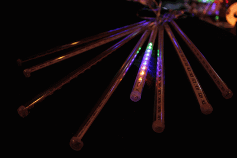

---

**1. 实验介绍：**

在日常生活中，我们可以看到许多由不同颜色的led组成的广告牌。他们不断地改变灯光(像流水一样)来吸引顾客的注意。在这个项目中，我们将使用ESP32 主控板控制5个LED灯实现流水的效果。

**2. 实验组件：**

|  |||
| ------------------------ | ------------------------ | ---------------------------- |
| ESP32 主控板| 红色LED x5  | 220Ω电阻 x5  |
||||
|面包板 x1 |面包板跳线若干 | Micro USB数据线 x1 |

---

**3. 接线图：** 

**原理图：**

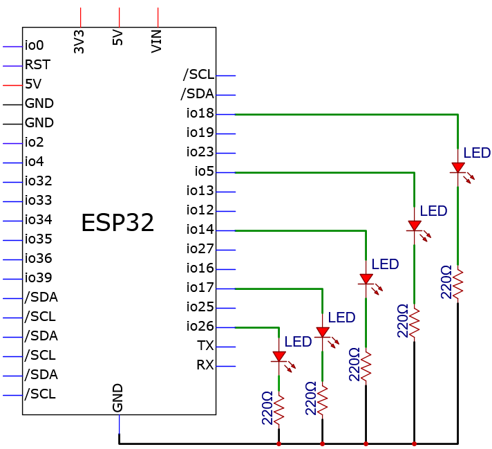

**实物接线图：**

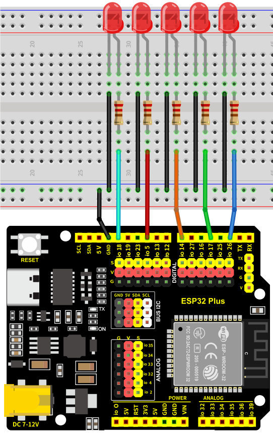

---

**4. 实验代码：**

本项目是设计制作一个流水灯。这是这些行动：首先打开LED #1，然后关闭它。然后打开LED #2，然后关闭…并对所有5个LED重复同样的操作，直到最后一个LED关闭。这一过程反复进行，以实现流水的“运动”。

```python
'''
 * Filename    : Flowing_Water_Light
 * Thonny      : Thonny 4.1.7
 * Auther      : http//www.keyestudio.com
'''
from machine import Pin
import time

# 使用阵列定义5个连接点阵屏的GPIO端口，便于操作。.
pins = [18, 5, 14, 17, 26]
# 使用两个for循环分别从左到右打开led，然后从右到左打开led
def showLed():
    for pin in pins:
        print(pin)
        led = Pin(pin, Pin.OUT)
        led.value(1)
        time.sleep_ms(100)
        led.value(0)
        time.sleep_ms(100)        
    for pin in reversed(pins):
        print(pin)
        led = Pin(pin, Pin.OUT)
        led.value(1)
        time.sleep_ms(100)
        led.value(0)
        time.sleep_ms(100)
          
while True:
    showLed()
```
---

**5. 实验结果：**

将 ESP32 主控板通过Micro USB数据线与计算机相连供电，单击，代码开始执行，你会看到的现象是：电路中的5个LED会逐渐亮起来，然后逐渐熄灭，就像电池充电一样；同时，Thonny IDE下的“Shell”窗口将打印出点亮与熄灭LED对应的引脚。

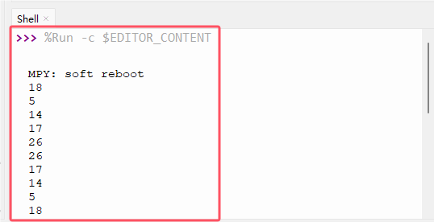

单击退出程序。

---

**6. 代码说明：**

1\. 设置多个led的引脚。

```python
pins = [18, 5, 14, 17, 26]
```
2\. 定义 <span style="color: rgb(255, 76, 65);">showLed()</span> 函数，并且使用两个 <span style="color: rgb(255, 76, 65);">for</span> 循环分别从左到右打开led，然后从右到左打开led。

```python
def showLed():
    for pin in pins:
        print(pin)
        led = Pin(pin, Pin.OUT)
        led.value(1)
        time.sleep_ms(100)
        led.value(0)
        time.sleep_ms(100)        
    for pin in reversed(pins):
        print(pin)
        led = Pin(pin, Pin.OUT)
        led.value(1)
        time.sleep_ms(100)
        led.value(0)
        time.sleep_ms(100)
          
```

其他的可以参照前面的课程 2-2-1 和2-2-2 的代码说明，这里就不多做介绍了。

---

### 2-2-5 RGB LED


---

**1. 实验介绍：**

在这个项目中，我们将深入研究使用RGB LED的加色混合的迷人世界。

RGB LED将红、绿、蓝三种原色组合成一个单一的封装。这三个led共用一个阴极引脚，而每个阳极引脚控制相应颜色的强度。

通过改变施加在每个阳极上的电信号强度，我们可以产生各种各样的颜色。例如，高强度的红光和绿光混合会产生黄色光，而蓝光和绿光混合会产生青色光。

通过这个项目，我们将探索加色混合的原理，并通过操纵RGB LED来释放我们的创造力，以显示迷人和充满活力的色彩。

---

**2. 元件知识：**
    
RGB led发出各种颜色的光。RGB LED将红、绿、蓝三种LED封装在透明或半透明的塑料外壳中。它可以通过改变三个引脚的输入电压并叠加来显示各种颜色，据统计可以产生16,777,216种不同的颜色。

**特性：**

- 颜色：三色（红/绿/蓝）
- 共阴极
- 5mm透明圆镜头
- 正向电压：红色：DC 2.0-2.2V；蓝绿：DC 3.0-3.2V （IF=20mA）
- 0.06瓦特DIP RGB LED
- 亮度可达 + 20%
- 视角：30°

**共阳极和共阴极：**

RGB led可分为共阳极和共阴极两种：

在共阴极RGB LED中，所有三个LED共用一个负连接（阴极）；

在共阳极RGB LED中，三个LED共用一个正连接（阳极）。

**<span style="background: rgb(255, 251, 0);">提醒：本套件提供的是共阴极RGB LED。</span>**

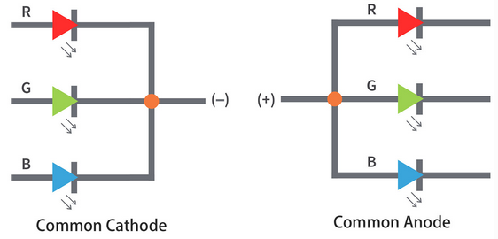

**RGB LED引脚：**

RGB LED有4个引脚：最长的是GND；其他的是红色，绿色和蓝色。如图所示放置RGB led，从左数第二个是最长的引线。那么RGB led的引脚编号应该是红色，GND，绿色和蓝色。

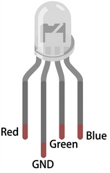

您也可以使用万用表选择 “**二极管**” 测试模式，然后按如图所示的连接以测量每个引脚的颜色

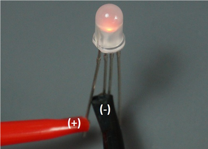

**混合的颜色：**

要生成额外的颜色，可以将三种颜色以不同的强度组合在一起。要调整每个LED的强度，可以使用PWM信号。

因为led彼此靠得很近，我们的眼睛看到的是颜色组合的结果，而不是三种颜色单独。

看看下面的图，看看这些颜色是如何组合的。它会让你了解颜色混合图是如何工作的，以及不同的颜色是如何产生的。


RGB LED是可以通过PWM调节LED的亮度。

---

**3. 实验组件：**

|  |||
| ------------------------ | ------------------------ | ---------------------------- |
| ESP32 主控板| RGB LED x1  | 220Ω电阻 x3  |
||||
|面包板 x1 |面包板跳线若干 | Micro USB数据线 x1 |

---

**4. 接线图：** 

**原理图：**


**实物接线图：**


---

**5. 实验代码：**

您还可以使用下面的代码设置您想要的颜色，颜色值为0~255;

在这里，我们可以在绘图软件中选择自己喜欢的颜色（比如绘画），用RGB LED显示出来。

```python
'''
 * Filename    : RGB_LED
 * Thonny      : Thonny 4.1.7
 * Auther      : http//www.keyestudio.com
'''
from machine import Pin, PWM
import time

# Define the GPIO pins for the RGB LED
RED_PIN = 27
GREEN_PIN = 25
BLUE_PIN = 26

# Set up the PWM channels
red = PWM(Pin(RED_PIN))
green = PWM(Pin(GREEN_PIN))
blue = PWM(Pin(BLUE_PIN))

# Set the PWM frequency
red.freq(1000)
green.freq(1000)
blue.freq(1000)

# Map input values from one range to another
def interval_mapping(x, in_min, in_max, out_min, out_max):
    return (x - in_min) * (out_max - out_min) / (in_max - in_min) + out_min

# Convert color values (0-255) to duty cycle values (0-1023)
def color_to_duty(rgb_value):
    rgb_value = int(interval_mapping(rgb_value,0,255,0,1023))
    return rgb_value

def set_color(red_value,green_value,blue_value):
    red.duty(color_to_duty(red_value))
    green.duty(color_to_duty(green_value))
    blue.duty(color_to_duty(blue_value))

while True:
    # Set different colors and wait for a while
    set_color(255, 0, 0) # Red
    time.sleep(1)
    set_color(0, 255, 0) # Green
    time.sleep(1)
    set_color(0, 0, 255) # Blue
    time.sleep(1)
    set_color(255, 255, 0) # Yellow
    time.sleep(1)
    set_color(255, 0, 255) # Purple
    time.sleep(1)
    set_color(0, 255, 255) # Cyan
    time.sleep(1)
    set_color(255, 255, 255) # White
    time.sleep(1)
```

<span style="color: rgb(255, 76, 65);">**注意**：</span>这段代码基于将从0到255的颜色值映射到0到1023的占空比范围。


将 RGB 值写入 set_color()，您将能够看到 RGB 点亮您想要的颜色。 

---

**6. 实验结果：**

将 ESP32 主控板通过Micro USB数据线与计算机相连供电，单击，代码开始执行，你会看到的现象是：电路中的RGB LED发出多种颜色光。


单击退出程序。

---

**7. 代码说明：**

1\. <span style="color: rgb(255, 76, 65);">interval_mapping</span> 函数是一个实用函数，用于将值从一个范围映射到另一个范围。它接受五个参数：输入值，输入范围的最小值和最大值，以及输出范围的最小值和最大值。它将返回输入值映射到输出范围。

```python
def color_to_duty(rgb_value):
    rgb_value = int(interval_mapping(rgb_value,0,255,0,1023))
    return rgb_value
```
2\. <span style="color: rgb(255, 76, 65);">color_to_duty</span> 函数接受一个整数RGB值（例如255,0,255），并将其映射到适合PWM引脚的占空比值。首先使用 <span style="color: rgb(255, 76, 65);">interval_mapping</span> 函数将输入的RGB值从0-255映射到0-1023。然后将 <span style="color: rgb(255, 76, 65);">interval_mapping</span> 的输出作为占空比值返回。 

```python
def color_to_duty(rgb_value):
    rgb_value = int(interval_mapping(rgb_value,0,255,0,1023))
    return rgb_value
```
3\. <span style="color: rgb(255, 76, 65);">color_set</span> 函数接受三个整数参数：LED的红色、绿色和蓝色值。这些值传递给 <span style="color: rgb(255, 76, 65);">color_to_duty</span> 以获得PWM引脚的占空比值。然后使用 <span style="color: rgb(255, 76, 65);">duty</span> 方式为相应引脚设置占空比值。

```python
def set_color(red_value,green_value,blue_value):
    red.duty(color_to_duty(red_value))
    green.duty(color_to_duty(green_value))
    blue.duty(color_to_duty(blue_value))
```
---

### 2-2-6 74HC595N

---

**1. 实验介绍：**

欢迎来到这个令人兴奋的项目！在这个项目中，我们将使用 74HC595 芯片来控制 8 个 LED 的流动显示。

想象一下，触发这个项目并目睹迷人的光流，仿佛闪闪发光的彩虹在 8 个 LED 之间跳跃。每个 LED 将一个接一个亮起并迅速消失，而下一个 LED 继续发光，营造出华丽而动感的效果。

通过巧妙地利用 74HC595 芯片，我们可以控制多个 LED 的开关状态，以达到流动的效果。该芯片具有多个输出引脚，可以串联以控制 LED 照明的顺序。此外，由于芯片的可扩展性，我们可以轻松地将更多 LED 添加到流动的显示屏中，从而创造出更壮观的效果。 

---

**2. 元件知识：**

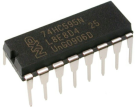

您是否曾经发现自己想要控制很多led，或者只是需要更多的I/O引脚来控制按钮，传感器和伺服器？好吧，你可以将一些传感器连接到Arduino引脚，但你很快就会用完Arduino的引脚。

解决方案是使用“移位寄存器”。移位寄存器允许您扩展可以从Arduino（或任何微控制器）使用的I/O引脚的数量。74HC595移位寄存器是其中最著名的一个。

74HC595基本上控制八个独立的输出引脚，只使用三个输入引脚。如果您需要8条以上的额外I/O 线，您可以轻松地级联任意数量的移位寄存器并创建大量的I/O 线。所有这些都是通过所谓的移位寄存器来完成的。

**特性：**

- 8位串行输入，并行输出移位;
- 工作电压范围2V至6V;
- 大电流三态输出可驱动高达15LSTTL负载;
- 低功耗，80µA最大ICC;
- 典型tPD = 14 ns;
- ±6ma输出驱动在5v;
- 低输入电流，最大1µA;
- 移位寄存器有直接清除功能.

**74HC595引脚及其功能：**

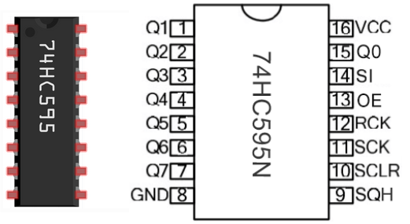

- Q0-Q7: 8位并行数据输出引脚，可直接控制8个led或8个7段显示引脚。
- SQR：串联输出引脚，连接另一个74HC595的DS，串联多个74HC595
- SCLR：复位引脚，低电平激活；
- SCK: 移位寄存器的时序输入。在上升沿，移位寄存器中的数据连续移动1位，即Q1的数据移动到Q2，以此类推。在下降沿，移位寄存器中的数据保持不变。
- RCK：存储寄存器的时序输入。在上升沿，移位寄存器中的数据移到内存寄存器中。
- OE：输出使能引脚，在低电平激活。
- SI：串行数据输入引脚
- VCC：电源正电压。
- GND：接地。

**功能图：**

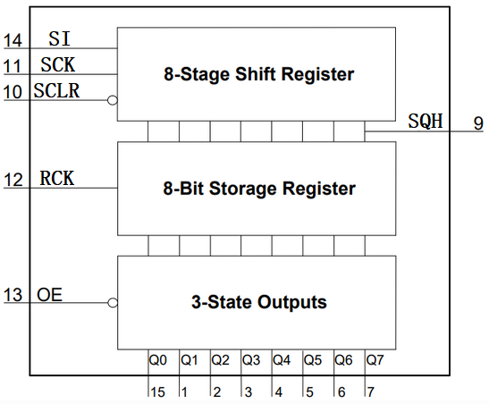

**工作原理：**

当SCLR（pin10）为高电平，OE（pin13）为低电平时，数据从SCK的上升沿输入，并通过RCK的上升沿进入内存寄存器。

- 移位寄存器

  - 假设，我们要将二进制数据1110 1110输入到74hc595的移位寄存器中。
  - 数据从移位寄存器的0位输入。
  - 每当移位寄存器时钟为上升沿时，移位寄存器中的位就移位一步。例如，第7位接受第6位之前的值，第6位获得第5位的值，等等。

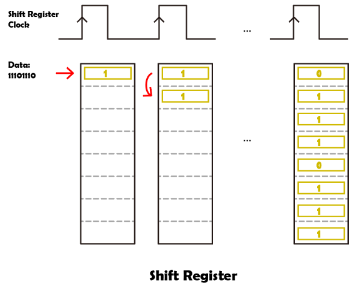

- 存储寄存器
  - 当存储寄存器处于上升沿状态时，移位寄存器的数据将被转移到存储寄存器。
  - 将存储寄存器直接连接到8个输出引脚上，Q0 ~ Q7就能接收一个字节的数据。
  - 所谓的存储寄存器意味着数据可以存在于这个寄存器中，并且不会随着一个输出而消失。
  - 只要74HC595持续上电，数据将保持有效且不变。
  - 当有新数据出现时，存储寄存器中的数据将被覆盖和更新。

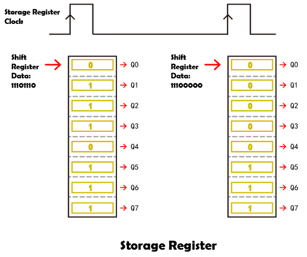

---

**3. 实验组件：**

|  |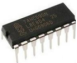|  ||
| ------------------------ | ------------------------ | ---------------------------- |---------------------------- |
|ESP32 主控板| 74HC595N芯片 x1| 红色LED x8 | 220Ω电阻 x8  |
||||  |
|面包板 x1 |面包板跳线若干 | Micro USB数据线 x1 |  |

---

**4. 接线图：**

**原理图：**

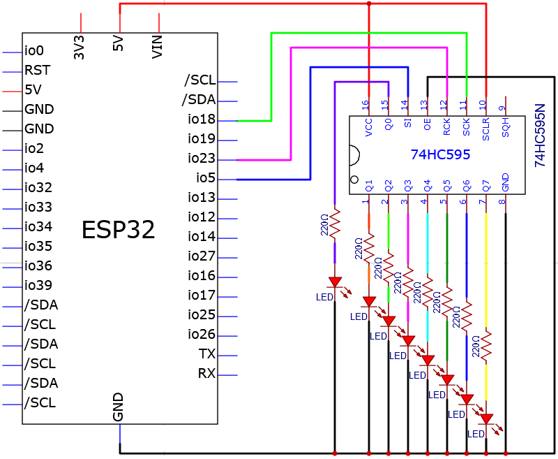

- 当 SCLR（pin10）为高电平，OE（pin13）为低电平时，数据从SCK的上升沿输入，并通过SCK的上升沿进入内存寄存器。
- 如果两个时钟连接在一起，移位寄存器总是比内存寄存器早一个脉冲。
- 在内存寄存器中有一个串行移位输入引脚（SI），一个串行输出引脚（SQH）和一个异步复位按钮（低电平）。
- 存储器寄存器输出具有并行8位和三种状态的总线。
- 当OE使能（低电平）时，内存寄存器中的数据输出到总线（Q0 ~ Q7）。

**实物接线图：**

<span style="color: rgb(255, 76, 65);">注意：需要注意74HC595N芯片插入的方向。</span>

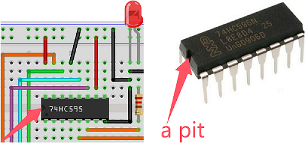

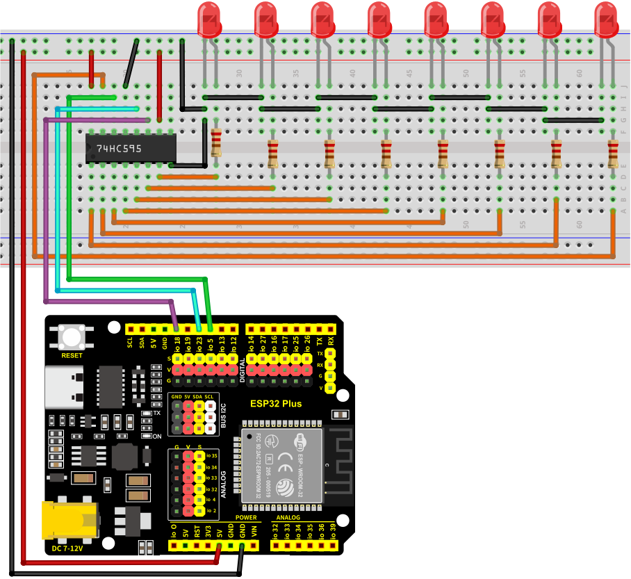

---

**5. 实验代码：** 

```python
'''
 * Filename    : 74HC595N
 * Thonny      : Thonny 4.1.7
 * Auther      : http//www.keyestudio.com
'''
# Import the machine and time libraries
import machine
import time

# Initialize the pins for the 74HC595 shift register
si = machine.Pin(5, machine.Pin.OUT)  # SI
rck = machine.Pin(23, machine.Pin.OUT)  # RCK
sck = machine.Pin(18, machine.Pin.OUT)  # SCK

# Define the hc595_shift function to shift data into the 74HC595 shift register
def hc595_shift(dat):
    # Set the RCLK pin to low
    rck.off()

    # Iterate through each bit (from 7 to 0)
    for bit in range(7, -1, -1):
        # Extract the current bit from the input data
        value = 1 & (dat >> bit)

        # Set the SRCLK pin to low
        sck.off()

        # Set the value of the SDI pin
        si.value(value)

        # Clock the current bit into the shift register by setting the SRCLK pin to high
        sck.on()

    # Latch the data into the storage register by setting the RCLK pin to high
    rck.on()

num = 0

# Shift data into the 74HC595 to create a moving LED pattern
for i in range(16):
    if i < 8:
        num = (num << 1) + 1  # Shift left and set the least significant bit to 1
    elif i >= 8:
        num = (num & 0b01111111) << 1  # Mask the most significant bit and shift left
    hc595_shift(num)  # Shift the current value into the 74HC595
    print("{:0>8b}".format(num))  # Print the current value in binary format
    time.sleep_ms(200)  # Wait 200 milliseconds before shifting the next value
```
---

**6. 实验结果：**

将 ESP32 主控板通过Micro USB数据线与计算机相连供电，单击，代码开始执行，你会看到的现象是：电路中的LED灯 LED 一个接一个地亮起，然后按原始顺序关闭；同时，在Shell窗口打印相关信息。


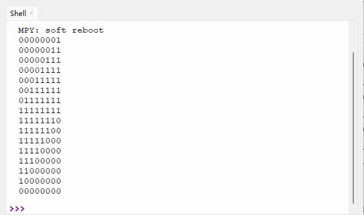

单击退出程序。

---

**7. 代码说明：**

上面实验代码用于控制 8 位移位寄存器 （74595），并将不同的二进制值输出到移位寄存器，每个值在 LED 上显示一段时间。

1\. 代码导入 <span style="color: rgb(255, 76, 65);">machine</span> 和 <span style="color: rgb(255, 76, 65);">time</span> 模块，其中 <span style="color: rgb(255, 76, 65);">machine</span> 模块用于控制硬件 I/O，而 <span style="color: rgb(255, 76, 65);">time</span> 模块 用于实现 时间延时 和其他功能。 

```python
import machine
import time
```
2\. 使用 <span style="color: rgb(255, 76, 65);">machine.Pin()</span> 函数初始化三个输出端口，分别对应于移位寄存器的数据端口（SI）、存储时钟端口（RCK）和移位寄存器时钟端口（SCK）。

```python
# Initialize the pins for the 74HC595 shift register
si = machine.Pin(5, machine.Pin.OUT)  # SI
rck = machine.Pin(23, machine.Pin.OUT)  # RCK
sck = machine.Pin(18, machine.Pin.OUT)  # SCK
```
3\. 定义了一个名为 <span style="color: rgb(255, 76, 65);">hc595_shift()</span> 的函数，用于将8位数据写入移位寄存器。

```python
def hc595_shift(dat):
    # Set the RCLK pin to low
    rck.off()

    # Iterate through each bit (from 7 to 0)
    for bit in range(7, -1, -1):
        # Extract the current bit from the input data
        value = 1 & (dat >> bit)

        # Set the SRCLK pin to low
        sck.off()

        # Set the value of the SDI pin
        si.value(value)

        # Clock the current bit into the shift register by setting the SRCLK pin to high
        sck.on()

    # Latch the data into the storage register by setting the RCLK pin to high
    rck.on()
```
4\. 关于for循环

```python
for i in range(16):
    if i < 8:
        num = (num << 1) + 1  # Shift left and set the least significant bit to 1
    elif i >= 8:
        num = (num & 0b01111111) << 1  # Mask the most significant bit and shift left
    hc595_shift(num)  # Shift the current value into the 74HC595
    print("{:0>8b}".format(num))  # Print the current value in binary format
    time.sleep_ms(200)  # Wait 200 milliseconds before shifting the next value
```
- 变量 <span style="color: rgb(255, 76, 65);">i</span> 用于控制输出的二进制值。在前8次迭代中，<span style="color: rgb(255, 76, 65);">num</span> 的值依次为00000001,00000011,00000111，…，11111111，左移1位，再加1。
- 在第9 ~ 16次迭代中，首先将1的最高位改为0，然后左移1位，输出值为00000010,00000100,00001000，…，10000000。
- 在每次迭代中，<span style="color: rgb(255, 76, 65);">num</span> 的值被传递给 <span style="color: rgb(255, 76, 65);">hc595_shift()</span> 函数，以控制移位寄存器输出相应的二进制值。
- 在输出二进制值的同时，<span style="color: rgb(255, 76, 65);">print()</span> 函数将二进制值作为字符串输出到终端。
- 输出二进制值后，程序使用 <span style="color: rgb(255, 76, 65);">time.sleep_ms()</span> 函数暂停200毫秒，以便LED上的值在一段时间内保持点亮。

---

### 2-2-7 一位数码管

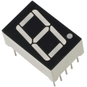

---

**1. 实验介绍：**

欢迎来到这个迷人的项目！在这个项目中，我们将探索在七段显示器上显示从 0 到 9 的数字的迷人世界。

想象一下，触发这个项目并目睹一个小而紧凑的显示屏，从 0 到 9 的每个数字都发出明亮的光芒。这就像拥有一个微型屏幕，以迷人的方式展示数字。通过控制信号引脚，您可以毫不费力地更改显示的数字并创建各种引人入胜的效果。

通过简单的电路连接和编程，您将学习如何与七段显示器交互并使您想要的数字栩栩如生。无论是计数器、时钟还是任何其他有趣的应用程序，七段式显示屏都将是您可靠的伴侣，为您的项目增添一丝光彩

---

**2. 实验组件：**

|  ||||
| ------------------------ | ------------------------ | ---------------------------- |---------------------------- |
|ESP32 主控板|74HC595N芯片 x1| 一数码管 x1| 220Ω电阻 x8  |
||||   |
|面包板 x1 |面包板跳线若干 | Micro USB数据线 x1 |   |

---

**3. 元件知识：**


**一位数码管显示原理：** 数码管显示是一种半导体发光器件。它的基本单元是一个发光二极管(LED)。数码管显示根据段数可分为7段数码管和8段数码管。8段数码管比7段多一个LED单元(用于小数点显示)。七段LED显示屏的每段是一个单独的LED。根据LED单元接线方式，数码管可分为共阳极数码管和共阴极数码管。

在共阴极7段数码管中，分段LED的所有阴极(或负极)都连接在一起，你应该把共阴极连接到GND，要点亮一个分段LED，你可以将其关联的引脚设置为HIGH。

在共阳极7段数码管中，所有段的LED阳极(正极)都连接在一起，你应该把共阳极连接到+5V。要点亮一个分段LED，你可以将其关联的引脚设置为LOW。

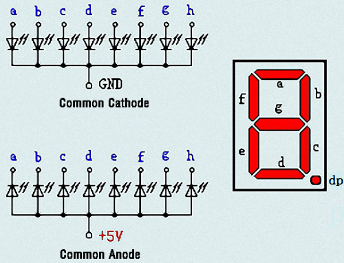

数码管的每个部分由一个LED组成。所以当你使用它的时候，你也需要使用一个限流电阻。否则，LED会被烧坏。在这个实验中，我们使用了一个普通的<span style="color: rgb(255, 76, 65);">共阴极一位数码管</span>。正如我们上面提到的，你应该将公共阴极连接到GND。要点亮一个分段LED，你可以将其关联的引脚设置为HIGH。

---

**4. 接线图：**

<span style="color: rgb(255, 76, 65);">注意：</span>插入面包板的七段数码管方向与接线图一致，右下角多一个点。

**原理图：**

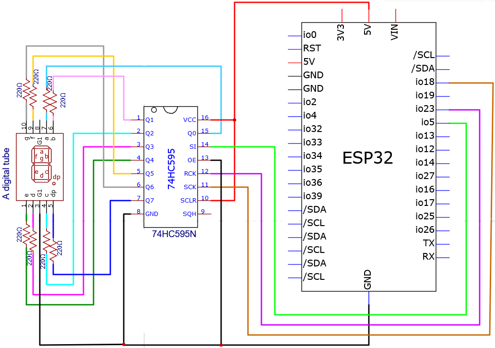

这里的原理图与 上一个实验 74HC595 基本相同，唯一的区别是 Q0-Q7 都连接到 8 段显示器的 a ~ g 引脚和 dp 引脚。

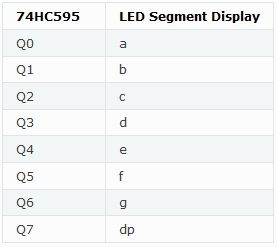

**实物接线图：**

<span style="color: rgb(255, 76, 65);">注意：需要注意74HC595N芯片插入的方向。</span>

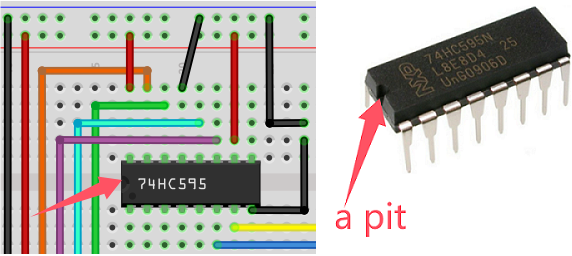

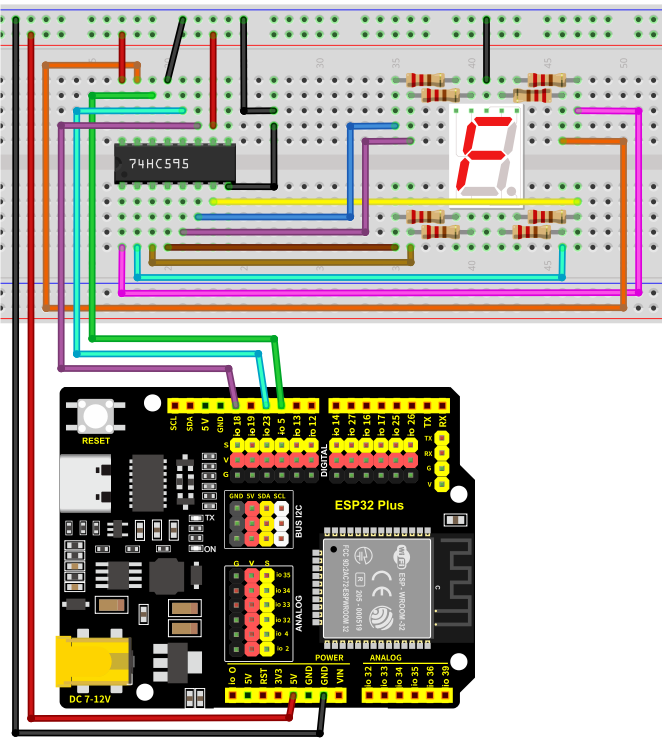

---

**5. 实验代码：**

数字显示分7段，小数点显示分1段。当显示某些数字时，相应的段将被点亮。例如，当显示数字1时，b和c段将被打开。

```python
'''
 * Filename    : One_Digit_Display
 * Thonny      : Thonny 4.1.7
 * Auther      : http//www.keyestudio.com
'''
import machine
import time

# Define the segment code for a common anode 7-segment display
SEGCODE = [0x3f, 0x06, 0x5b, 0x4f, 0x66, 0x6d, 0x7d, 0x07, 0x7f, 0x6f]

# Initialize the pins for the 74HC595 shift register
si = machine.Pin(5, machine.Pin.OUT)  # SI
rck = machine.Pin(23, machine.Pin.OUT)  # RCK
sck = machine.Pin(18, machine.Pin.OUT)  # SCK

# Define the hc595_shift function to shift data into the 74HC595 shift register
def hc595_shift(dat):
    # Set the RCLK pin to low
    rck.off()

    # Iterate through each bit (from 7 to 0)
    for bit in range(7, -1, -1):
        # Extract the current bit from the input data
        value = 1 & (dat >> bit)

        # Set the SRCLK pin to low
        sck.off()

        # Set the value of the SDI pin
        si.value(value)

        # Clock the current bit into the shift register by setting the SRCLK pin to high
        sck.on()

    # Latch the data into the storage register by setting the RCLK pin to high
    rck.on()

# Continuously loop through the numbers 0 to 9 and display them on the 7-segment display
while True:
    for num in range(10):
        hc595_shift(SEGCODE[num])  # Shift the segment code for the current number into the 74HC595
        time.sleep_ms(500)  # Wait 500 milliseconds before displaying the next number
```
---

**6. 实验现象：**

将 ESP32 主控板通过Micro USB数据线与计算机相连供电，单击，代码开始执行，你会看到的现象是：电路中的一位数码管将显示从0到9的数字。


单击退出程序。

---

**7. 代码说明：**

在这个项目中，我们使用 <span style="color: rgb(255, 76, 65);">hc595_shift()</span> 函数将二进制数写入 Shift 寄存器。

假设 7 段显示器显示数字 “2”。此位模式对应于 **段 f** 、 **c** 和 **dp** 关闭（低电平），而**段 a** 、 **b** 、 **d** 、 **e** 和 **g** 打开（高电平）。这是二进制 “01011011” 和 十六进制 “0x5b” 的表示法。

因此，您需要调用 <span style="color: rgb(255, 76, 65);">hc595_shift(0x5b)</span> 在 7 段显示屏上显示数字 “2” 。 

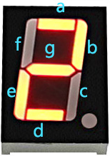

[十六进制](https://en.wikipedia.org/wiki/Hexadecimal)

[BinaryHex 转换器](https://www.binaryhexconverter.com/binary-to-hex-converter)

下表显示了需要写入移位寄存器的十六进制模式，以便在 7 段显示器上显示数字 0 到 9。

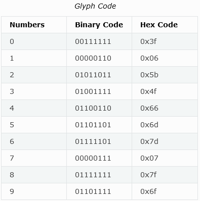

将这些代码写入 <span style="color: rgb(255, 76, 65);">hc595_shift()</span> 使 LED 段显示显示相应的数字。

---

### 2-2-8 四位数码管


---

**1. 项目介绍：**

四位数码管是一种非常实用的显示器件，电子时钟的显示，球场上的记分员，公园里的人数都是需要的。由于价格低廉，使用方便，越来越多的项目将使用4位数码管。在这个项目中，我们使用ESP32主控板控制四位数码管来显示四位数字0000-9999，并在一个无限循环中重复这些动作。

---

**2. 元件知识：**
  
**四位数码管：** 四位数码管有共阳极和共阴极两种四位数码管，显示原理是和一位数码管是类似的，都是8个GPIO口控制数码管的显示段，就是8个led灯，不过，这里是4位的，所以就还需要4个GPIO口来控制位选择端，就是选择哪个单个数码管亮，位的切换很快，肉眼区分不出来，就能看起来是多个数码管同时显示的了。
这里使用的四位数码管是共阴极的。

下图为4位数码管的引脚图，G1、G2、G3、G4就是控制位的引脚。

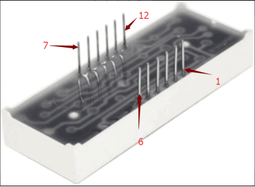

下图为4位数码管内部布线原理图：

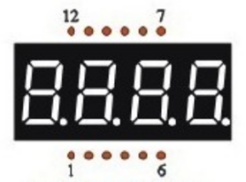

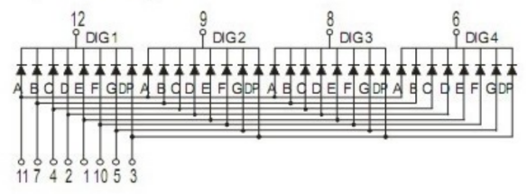

---

**3. 实验组件：**

|  |||
| ------------------------ | ------------------------ | ---------------------------- |
|ESP32 主控板| 四位数码管 x1  | 220Ω电阻 x8  |
||||
|面包板 x1 |面包板跳线若干 | USB线 x1 |

---

**4. 接线图：**

**原理图：**

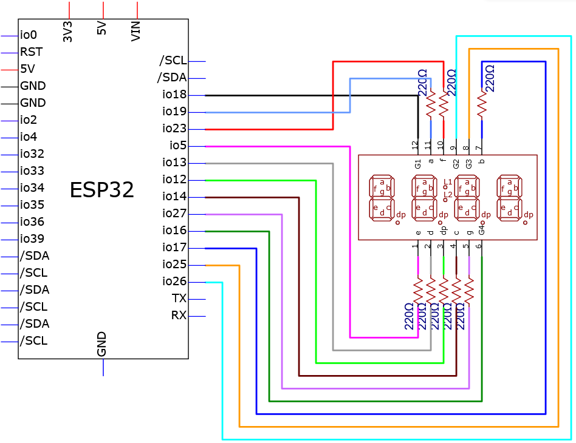

**实物接线图：**

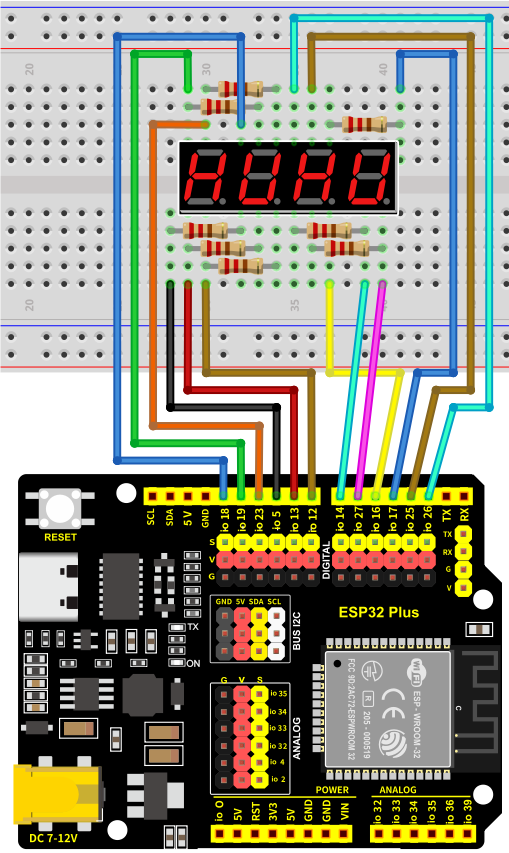

---

**5. 实验代码：** 

```python
'''
 * Filename    : 4-Digit_Digital_Tube
 * Thonny      : Thonny 4.1.7 
 * Auther      : http//www.keyestudio.com
'''
from machine import Pin
import time

# 数码管每个数字引脚
a = Pin(19, Pin.OUT)
b = Pin(17, Pin.OUT)
c = Pin(14, Pin.OUT)
d = Pin(13, Pin.OUT)
e = Pin(5, Pin.OUT)
f = Pin(23, Pin.OUT)
g = Pin(27, Pin.OUT)
dp = Pin(12, Pin.OUT)

G1 = Pin(18, Pin.OUT)
G2 = Pin(26, Pin.OUT)
G3 = Pin(25, Pin.OUT)
G4 = Pin(16, Pin.OUT)
 
# 数码管a到dp对应的引脚
d_Pins=[Pin(i,Pin.OUT)  for i in [19,17,14,13,5,23,27,12]]
# 数码管段G1、G2、G3、G4对应的引脚
w_Pins=[Pin(i,Pin.OUT)  for i in [18,26,25,16]]
 
number={
    '0':
    [1,1,1,1,1,1,0,0],#0
    '1':
    [0,1,1,0,0,0,0,0],#1
    '2':
    [1,1,0,1,1,0,1,0],#2
    '3':
    [1,1,1,1,0,0,1,0],#3
    '4':
    [0,1,1,0,0,1,1,0],#4
    '5':
    [1,0,1,1,0,1,1,0],#5
    '6':
    [1,0,1,1,1,1,1,0],#6
    '7':
    [1,1,1,0,0,0,0,0],#7
    '8':
    [1,1,1,1,1,1,1,0],#8
    '9':
    [1,1,1,1,0,1,1,0],#9
}
 
def display(num,dp):
    global number
    count=0
    for pin in d_Pins: # 显示num的值 
        pin.value(number[num][count])
        count+=1
    if dp==1:
        d_Pins[7].value(0)
def clear():
    for i in w_Pins:
        i.value(0)
    for i in d_Pins:
        i.value(1)
def showData(num):
   # 数值的百位、千位、个位和小数位
    d_num=num
    location=d_num.find('.')
    if location>0:
        d_num=d_num.replace('.','')
        while len(d_num)<4:
            d_num='0'+d_num
        for i in range(0,4):
            time.sleep(2)
            clear()
            w_Pins[3-i].value(1)
            if i==location-1:
                display(d_num[i],1)
            else:
                display(d_num[i],0)
    if location<0:
        for i in range(0,4):
            time.sleep(2)
            clear()
            w_Pins[3-i].value(1)
            display(d_num[i],0)
while True:
 
    num='9016'
    showData(num)
```
---

**6. 实验结果：**

将 ESP32 主控板通过Micro USB数据线与计算机相连供电，单击，代码开始执行，你会看到的现象是：4位数码管显示四位数字依次显示数字 999，000，111，666，并在一个无限循环中重复这些动作。


单击退出程序。

---

**7. 代码说明：**

1\. 四位数码管a到dp对应的引脚。

```python
d_Pins=[Pin(i,Pin.OUT)  for i in [19,17,14,13,5,23,27,12]]
```
2\. 四位数码管段G1、G2、G3、G4对应的引脚。

```c++
w_Pins=[Pin(i,Pin.OUT)  for i in [18,26,25,16]]
```

其他的可以参照前面的课程 2-2-1 和2-2-2 的代码说明，这里就不多做介绍了。

---


### 2-2-9 蜂鸣


---

**1. 实验介绍：**

有源蜂鸣器是一个发声组件，被广泛用作电脑、打印机、报警器、电子玩具、电话、计时器等的发声元件。它有一个内在的振动源，只需连接5V电源，即可持续发出嗡嗡声。在这个项目中，我们将使用ESP32 主控板控制有源蜂鸣器发出“滴滴”声。

---

**2. 元件知识：**


**有源蜂鸣器：** 其内部有一个简单的振荡器电路，可以将恒定的直流电转换成特定频率的脉冲信号。一旦有源蜂鸣器收到一个高电平，它将产生声音。而无源蜂鸣器是一种内部没有振动源的集成电子蜂鸣器，它必须由2K-5K方波驱动，而不是直流信号。这两个蜂鸣器的外观非常相似，但是一个带有绿色电路板的蜂鸣器是无源蜂鸣器，而另一个带有黑色胶带的是有源蜂鸣器。无源蜂鸣器不能区分正极性而有源极性蜂鸣器是可以。如下所示：


**三极管:** 由于蜂鸣器需要很大的电流，ESP32主控板输出能力的GPIO（引脚接口）不能满足要求，这里需要一个NPN型三极管来放大电流。


三极管，全称是半导体三极管，也称双极型晶体管、晶体三极管，是一种控制电流的半导体器件。其作用是把微弱信号放大成幅度值较大的电信号，也用作无触点开关。

三极管按结构可分为NPN和PNP，它们都分为三个区，分别称为发射区、基区和集电区，由三个区各引出一个电极，分别称为发射极(E)、基极(B)和集电极(C)，发射区和基区之间的PN结称为发射结，集电区和基区之间的PN结称为集电结。其结构和符号见下图所示，其中发射极箭头所示方向表示发射极电流的流向。


当电流通过“BE”之间时，“CE”将允许几倍的电流通过(三极管放大)，此时，三极管在放大区工作。当“BE”之间的电流超过某个值时，“CE”将不再允许电流增加，此时三极管工作在饱和区。三极管有两种类型如下所示：PNP和NPN


<span style="color: rgb(255, 76, 65);">在我们的套件中，PNP三极管标记为8550，NPN三极管标记为8050。</span>

基于三极管的特性，它常被用作数字电路中的开关。由于单片机输出电流的能力很弱，我们将使用三极管来放大电流和驱动大电流的元件。在使用NPN三极管驱动蜂鸣器时，通常采用以下方法：如果GPIO（引脚接口）输出高电平，电流将流过R1，三极管将传导，蜂鸣器将发出声音。如果GPIO（引脚接口）输出低电平，没有电流流过R1，三极管就不会传导，蜂鸣器也不会响。在使用PNP三极管驱动蜂鸣器时，通常采用以下方法：如果GPIO（引脚接口）输出低电平，电流将流过R1，三极管将传导，蜂鸣器将发出声音。如果GPIO（引脚接口）输出高电平，没有电流流过R1，三极管就不会传导，蜂鸣器也不会响。


---

**3. 实验组件：**

|   ||||
| ------------------------ | ------------------------ | ---------------------------- |---------------------------- |
|ESP32 主控板| NPN型三极管(S8050) x1| 有源蜂鸣器 x1 | 1kΩ电阻 x1 |
|||||
|面包板 x1 |面包板跳线若干 | Micro USB数据线 x1 | 10kΩ电阻 x1 |

---

**4. 接线图：**

**原理图：**


**实物接线图：**


---

**5. 实验代码：** 

```python
'''
 * Filename    : Beep
 * Thonny      : Thonny 4.1.7 
 * Auther      : http//www.keyestudio.com
'''
from machine import Pin
import time

buzzer = Pin(13, Pin.OUT)   # 创建引脚13为蜂鸣器对象，设置引脚15为输出

try:
    while True:
        buzzer.value(1)    # 蜂鸣器鸣叫
        time.sleep(0.5) # 延时 0.5s
        buzzer.value(0)    # 蜂鸣器关闭
        time.sleep(0.5) # 延时 0.5s
except:
    pass
```
---

**6. 实验结果：**

将 ESP32 主控板通过Micro USB数据线与计算机相连供电，单击，代码开始执行，你会看到的现象是：电路中的有源蜂鸣器发出“滴滴”声。


单击退出程序。

---

**7. 代码说明：**

可以参照前面的课程 2-2-1 的代码说明，这里就不多做介绍了。

---

### 2-2-10音乐演奏


---

**1. 实验介绍：**

我们在之前的项目中使用了有源蜂鸣器，这次我们将使用无源蜂鸣器。

与有源蜂鸣器一样，无源蜂鸣器也是利用电磁感应的现象来工作。不同之处在于无源蜂鸣器没有振荡源，因此如果使用直流信号，它不会发出哔哔声。但是这允许无源蜂鸣器调整自己的振荡频率，发出美妙的音乐旋律！ 


---

**2. 元件知识：**

**无源蜂鸣器：** 是一种内部没有振动源的集成电子蜂鸣器。它必须由2K-5K方波驱动，而不是直流信号。这两个蜂鸣器的外观非常相似，但是一个带有绿色电路板的蜂鸣器是无源蜂鸣器，而另一个带有黑色胶带的是有源蜂鸣器。无源蜂鸣器不能区分正极性而有源极性蜂鸣器是可以。如下所示：


---

**3. 实验组件：**

|  ||||
| ------------------------ | ------------------------ | ---------------------------- |---------------------------- |
|ESP32 主控板| NPN型三极管(S8050) x1| 无源蜂鸣器 x1 | 1kΩ电阻 x1 |
|||| |
|面包板 x1 |面包板跳线若干 | Micro USB数据线 x1 | 10kΩ电阻 x1 |

---

**4. 接线图：**

**原理图：**

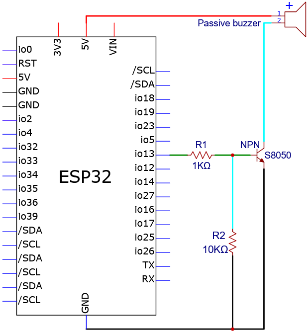

**实物接线图：**

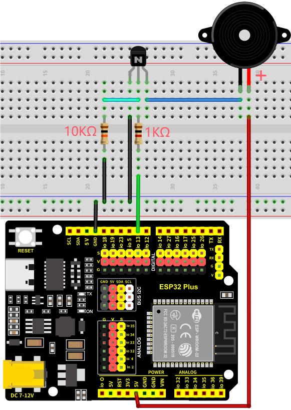

---

**5. 实验代码：** 

```python
'''
 * Filename    : Play_Music
 * Thonny      : Thonny 4.1.7 
 * Auther      : http//www.keyestudio.com
'''
import machine 
import time

# Define the GPIO pin that is connected to the buzzer
buzzer = machine.PWM(machine.Pin(13))

# Define the frequencies of the notes in Hz
C5 = 523
D5 = 587
E5 = 659
F5 = 698
G5 = 784
A5 = 880
B5 = 988

# Define the durations of the notes in milliseconds
quarter_note = 250
half_note = 300
whole_note = 1000

# Define the melody as a list of tuples (note, duration)
melody = [
    (E5, quarter_note),
    (E5, quarter_note),
    (F5, quarter_note),
    (G5, half_note),
    (G5, quarter_note),
    (F5, quarter_note),
    (E5, quarter_note),
    (D5, half_note),
    (C5, quarter_note),
    (C5, quarter_note),
    (D5, quarter_note),
    (E5, half_note),
    (E5, quarter_note),
    (D5, quarter_note),
    (D5, half_note),
    (E5, quarter_note),
    (E5, quarter_note),
    (F5, quarter_note),
    (G5, half_note),
    (G5, quarter_note),
    (F5, quarter_note),
    (E5, quarter_note),
    (D5, half_note),
    (C5, quarter_note),
    (C5, quarter_note),
    (D5, quarter_note),
    (E5, half_note),
    (D5, quarter_note),
    (C5, quarter_note),
    (C5, half_note),

]

# Define a function to play a note with the given frequency and duration
def tone(pin,frequency,duration):
    pin.freq(frequency)
    pin.duty(512)
    time.sleep_ms(duration)
    pin.duty(0)

# Play the melody
for note in melody:
    tone(buzzer, note[0], note[1])
    time.sleep_ms(50)
```
---

**6. 实验结果：**

将 ESP32 主控板通过Micro USB数据线与计算机相连供电，单击，代码开始执行，你会看到的现象是：电路中的无源蜂鸣器播放音乐。


单击退出程序。

---

**7. 代码说明：**

如果给无源蜂鸣器一个数字信号，它只能继续推动隔膜而不产生声音。因此，我们使用 <span style="color: rgb(255, 76, 65);">tone()</span> 函数产生PWM信号，使无源蜂鸣器发出声音。

这个函数有三个参数：

- <span style="color: rgb(255, 76, 65);">pin</span>：控制蜂鸣器的 pin。
- <span style="color: rgb(255, 76, 65);">frequency</span>：蜂鸣器的音调是由频率决定的，频率越高，音调越高。
- <span style="color: rgb(255, 76, 65);">frequency</span>：音调的持续时间。

我们使用 <span style="color: rgb(255, 76, 65);">duty()</span> 函数将占空比设置为512（约50%）。它可以是其他数，它只需要产生一个间断。

- <span style="color: rgb(255, 76, 65);">tone()</span> 函数使用 <span style="color: rgb(255, 76, 65);">pin</span> 对象的 <span style="color: rgb(255, 76, 65);">freq</span> 方式将引脚的 <span style="color: rgb(255, 76, 65);">frequency</span> 设置为频率值。
- 使用 <span style="color: rgb(255, 76, 65);">pin</span> 对象的 <span style="color: rgb(255, 76, 65);">duty</span> 方式将引脚的占空比设置为 512 。
- 将导致引脚产生具有指定频率和音量的音调，持续时间 <span style="color: rgb(255, 76, 65);">duration</span> 以毫秒为单位，使用时间模块的sleep_ms方法。

- 代码通过迭代一个名为 <span style="color: rgb(255, 76, 65);">melody</span> 的序列来播放旋律，并使用音符的频率和持续时间为旋律中的每个音符调用 <span style="color: rgb(255, 76, 65);">tone</span> 函数。
- 使用时间模块的 <span style="color: rgb(255, 76, 65);">sleep_ms</span> 方式在每个音符之间插入一个50毫秒的短暂停顿。

---

### 2-2-11 迷你小风扇


---

**1.实验介绍：** 

在炎热的夏季，需要电扇来给我们降温，那么在这个项目中，我们将使用ESP32控制130电机模块和小扇叶来制作一个小电扇。

---

**2. 实验组件：**

|  |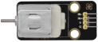|||
| ------------------------ | ------------------------ | ---------------------------- |---------------------------- |
|ESP32 主控板|130 电机模块 x1| 公对母杜邦线若干|Micro USB数据线 x1|
|||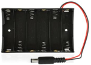|  |
|AA电池(<span style="color: rgb(255, 76, 65);">自备</span>) x6|风扇叶片 x1|电池盒 x1|   |

---

**3.元件知识:**

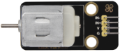

**130电机模块：** 该电机控制模块采用HR1124S电机控制芯片，HR1124S是应用于直流电机方案的单通道H桥驱动器芯片。HR1124S的H桥驱动部分采用低导通电阻的PMOS和NMOS功率管，低导通电阻保证芯片低的功率损耗，使得芯片安全工作更长时间。此外HR1124S拥有低待机电流，低静态工作电流，这些性能使130电机模块易用于玩具方案。

**130电机模块参数：**

- 工作电压：5V
- 工作电流：≤200MA
- 工作功率：2W
- 工作温度：-10℃~+50℃

**130电机模块原理：**

HR1124S芯片的作用是助于驱动电机，而电机所需电流较大，无法用三极管驱动更无法直接用IO口驱动。让电机转动起来的方法很简单，给电机两端添加电压即可。不同电压方向电机转向也不相同，在额度电压内，电压越大，电机转动得越快；反之电压越低，电机转动得越慢，甚至无法转动。控制方式有两种：一种是高低电平控制（控制转动和停止），一种是PWM控制（控制转速）。

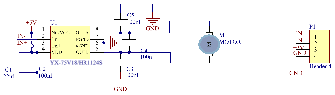

---

**4. 接线图：**

**原理图：**

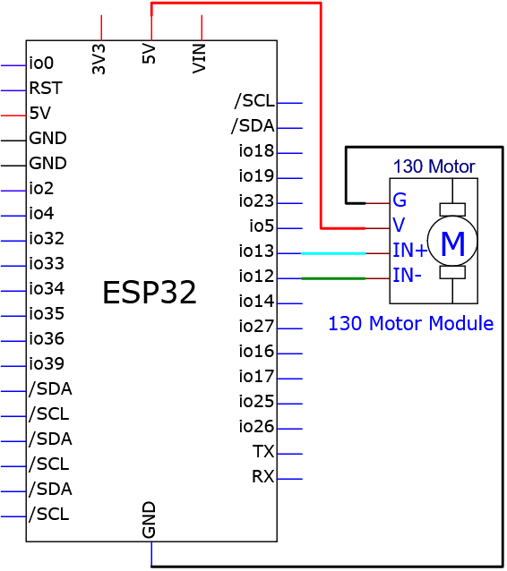

**实物接线图：**

(<span style="color: rgb(255, 76, 65);">注: 先接好线，然后在直流电机上安装一个小风扇叶片。</span>)

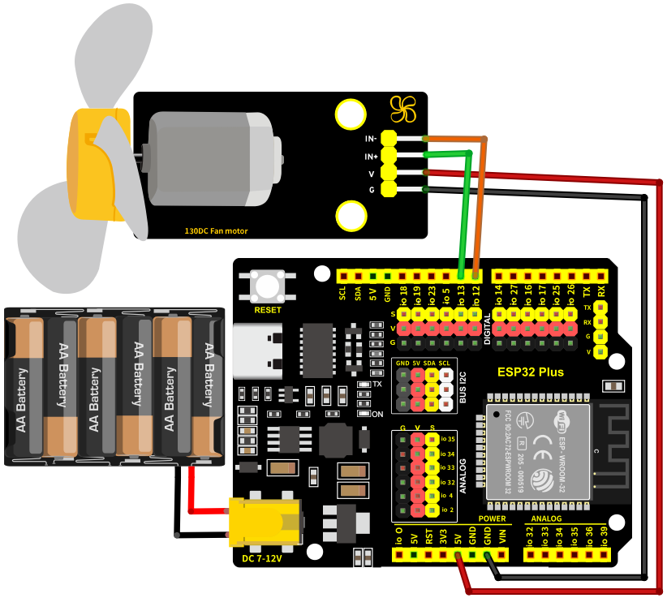

---

**5. 实验代码：**

```python
'''
 * Filename    : Small_Fan
 * Thonny      : Thonny 4.1.7 
 * Auther      : http//www.keyestudio.com
'''
from machine import Pin
import time

motor1a = Pin(13, Pin.OUT) # 创建引脚13为motor1a对象，设置引脚13为输出
motor1b = Pin(12, Pin.OUT) # 创建引脚12为motor1b对象，设置引脚12为输出

def forward():
    motor1a.value(1) # 设置motor1a 为高
    motor1b.value(0) # 设置motor1b 为低
def backward():
    motor1a.value(0)
    motor1b.value(1)
def stop():
    motor1a.value(0)
    motor1b.value(0)

def test():
    forward() # 电机向前转
    time.sleep(5) #延时
    stop() # 电机停止
    time.sleep(2)
    backward()# 电机向后转
    time.sleep(5)
    stop()
    time.sleep(2)
    
for i in range(5):
    test() 
```
---

**6. 实验现象：**

将 ESP32 主控板通过Micro USB数据线与计算机相连供电，还需要外接电源给ESP32 主控板供电，单击，代码开始执行，你会看到的现象是：小风扇先逆时针转5秒，停止2秒，再顺时针转5秒，停止2秒，以此规律重复执行。


单击退出程序。

---

**7. 代码说明：**

可以参照前面的课程 2-2-1 的代码说明，这里就不多做介绍了。

---

### 2-2-12 舵机转动

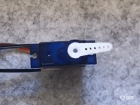

---

**1. 实验介绍：**

之前，我们学习了如何控制电机的速度和旋转方向。在本实验中，我们将学习伺服（舵机）系统，舵机是一种基于位置的设备，以其保持特定角度和提供精确旋转的能力而闻名。这使得它非常适合需要一致角度调整的控制系统。毫不奇怪，舵机在高端遥控玩具中得到了广泛的应用，从飞机模型到潜艇复制品和复杂的遥控机器人。

在这个有趣的冒险中，我们将挑战自己，以独特的方式操纵 舵机让它转动！该项目提供了一个绝佳的机会，可以更深入地了解伺服系统的动力学，提高您在精确控制系统中的技能，并更深入地了解它们的操作。

您准备好让 舵机 随着您的曲调跳舞了吗？让我们踏上这段激动人心的旅程吧！ 

---

**2. 模块参数：**

- 工作电压: DC 3.3V~5V 
- 工作温度：-10°C ~ +50°C
- 尺寸：32.25mm x 12.25mm x 30.42mm
- 接口：2.54mm间距，3pin接口

---

**3. 模块原理图：**

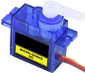

**舵机：** 舵机是密封包装，由直流电机，一套提供扭矩的变速齿轮组，可调电位器和电子控制板组成。

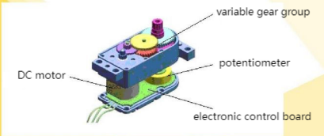

多数舵机只能旋转180度，舵机输出的转矩比简单直流电动机更高。被广泛用于控制模型汽车、模型飞机、机器人等。舵机一般有三线，通常连接到公或母3拼线。其中两线用于电源：正极（2-正极线，红线)，负极（3-负极线，棕线），以及一个信号线（1-信号线，橙线）。如下图所示，套件中的舵机：

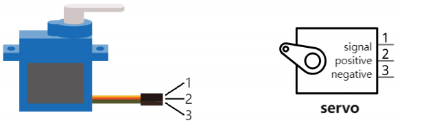

我们使用PWM信号驱动舵机，该信号占空比一定，频率为50Hz。PWM单个周期高电平持续时间为0.5ms ~ 2.5ms，与舵机角度的0° ~ 180°线性对应。部分对应值如下：

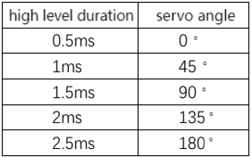

改变舵机信号值，舵机将旋转到指定角度。

<span style="color: rgb(255, 76, 65);">注意:</span> 由于舵机品牌不同，对于同一信号，不同品牌的舵机旋转的角度也会有所不同。

---

**4. 实验组件**

|  |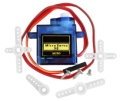||
| ------------------------ | ------------------- | --------------------- | 
| ESP32 主控板| 舵机 x1| Micro USB数据线 x1  |

---

**5. 接线图：**

**原理图：**

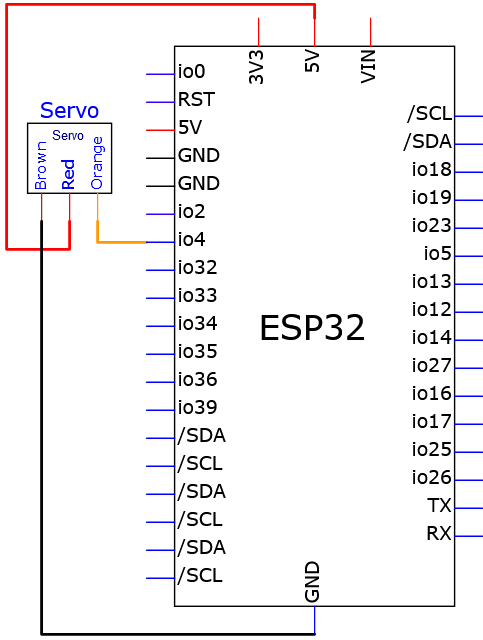

**实物接线图：**

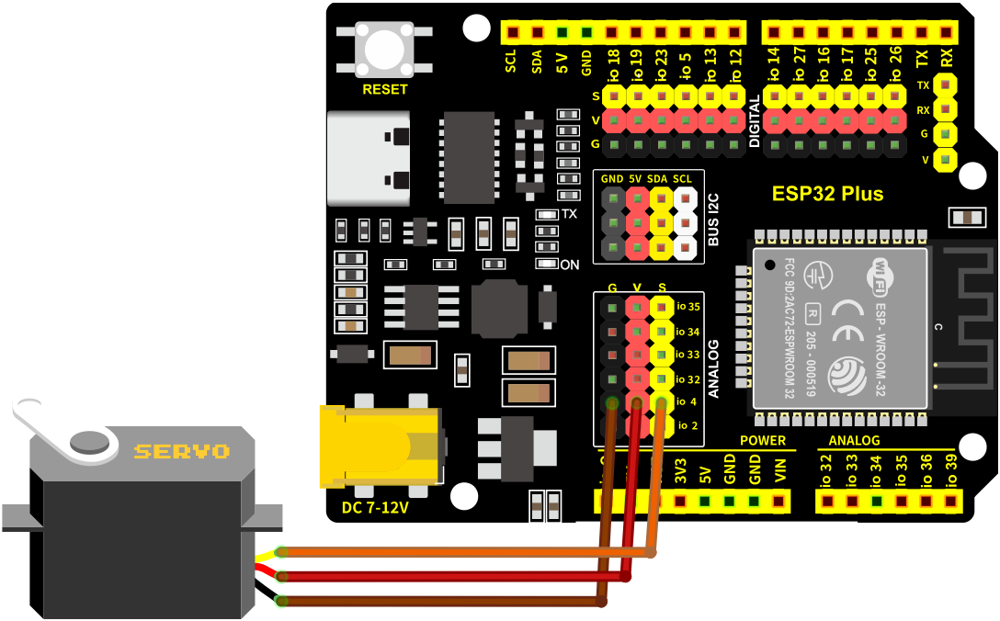

---

**6. 实验代码：**

```python
'''
 * Filename    : Servo
 * Thonny      : Thonny 4.1.7
 * Auther      : http//www.keyestudio.com
'''
import machine
import time

# Create a PWM (Pulse Width Modulation) object on Pin 4
servo = machine.PWM(machine.Pin(4))

# Set the frequency of the PWM signal to 50 Hz, common for servos
servo.freq(50)

# Define a function for interval mapping
def interval_mapping(x, in_min, in_max, out_min, out_max):
    return (x - in_min) * (out_max - out_min) / (in_max - in_min) + out_min

# Define a function to write an angle to the servo
def servo_write(pin, angle):

    pulse_width = interval_mapping(angle, 0, 180, 0.5, 2.5) # Calculate the pulse width
    duty = int(interval_mapping(pulse_width, 0, 20, 0, 1023))     # Calculate the duty cycle
    pin.duty(duty) # Set the duty cycle of the PWM signal

# Create an infinite loop
while True:
    # Loop through angles from 0 to 180 degrees
    for angle in range(180):
        servo_write(servo, angle)
        time.sleep_ms(20)

    # Loop through angles from 180 to 0 degrees in reverse
    for angle in range(180, -1, -1):
        servo_write(servo, angle)
        time.sleep_ms(20)
```

**7. 实验结果：**

将 ESP32 主控板通过Micro USB数据线与计算机相连供电，单击，代码开始执行，你会看到的现象是：舵机在 将在0到180度之间连续来回扫描。


单击退出程序。

---

**8. 代码说明：**

1\. 在引脚 4 上创建一个PWM（脉冲宽度调制）对象，并将其频率设置为50 Hz，这对于伺服来说是常见的。

```python
# Create a PWM (Pulse Width Modulation) object on Pin 25
servo = machine.PWM(machine.Pin(4))

# Set the frequency of the PWM signal to 50 Hz, common for servos
servo.freq(50)
```
2\. 定义 <span style="color: rgb(255, 76, 65);">interval_mapping</span> 函数将值从一个范围映射到另一个范围。这将用于将角度转换为适当的脉宽和占空比。。

```python
# Define a function for interval mapping
def interval_mapping(x, in_min, in_max, out_min, out_max):
    return (x - in_min) * (out_max - out_min) / (in_max - in_min) + out_min
```
3\. 定义一个 <span style="color: rgb(255, 76, 65);">servo_write</span> 函数，它接受一个PWM对象和一个角度作为输入。它根据给定的角度计算脉冲宽度和占空比，然后相应地设置PWM输出。

```python
# Define a function to write an angle to the servo
def servo_write(pin, angle):

    pulse_width = interval_mapping(angle, 0, 180, 0.5, 2.5) # Calculate the pulse width
    duty = int(interval_mapping(pulse_width, 0, 20, 0, 1023))     # Calculate the duty cycle
    pin.duty(duty) # Set the duty cycle of the PWM signal
```
- 在这个函数中，调用 <span style="color: rgb(255, 76, 65);">interval_mapping()</span> 将角度范围0 ~ 180映射到脉冲宽度范围0.5 ~ 2.5ms。
- 为什么是0.5~2.5？这是由舵机的工作模式决定的。
- 接下来，将脉冲宽度从周期转换为占空。
- 由于 <span style="color: rgb(255, 76, 65);">duty()</span> 在使用时不能有小数（值不能是float类型），因此我们使用 <span style="color: rgb(255, 76, 65);">int()</span> 强制将duty转换为int类型。


4\. 创建一个包含两个嵌套循环的无限循环。。 

```python
while True:
    # Loop through angles from 0 to 180 degrees
    for angle in range(180):
        servo_write(servo, angle)
        time.sleep_ms(20)

    # Loop through angles from 180 to 0 degrees in reverse
    for angle in range(180, -1, -1):
        servo_write(servo, angle)
        time.sleep_ms(20)
```
- 第一个嵌套 for 循环迭代从0到180度的角度，第二个嵌套 for 循环反过来迭代从180到0度的角度。
- 在每次迭代中，以当前角度调用 <span style="color: rgb(255, 76, 65);">servo_write</span> 函数，并添加20毫秒的延迟。

---

### 2-2-13 步进电机

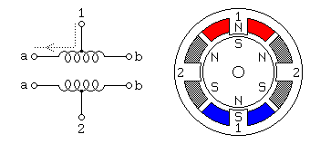

---

**1. 实验介绍：**

在本项目中，您将学习如何使用 ULN2003 驱动器和 ESP32 主控板 控制步进电机，特别是 28BYJ-48 型号。步进电机用于各种应用，例如 3D 打印机、CNC 机器、机器人，甚至普通家用电器。它们的精确控制允许复杂的运动，使其成为需要高定位精度的项目的理想选择。

在这个项目中，我们将配置 28BYJ-48 步进电机以不同的速度顺时针和逆时针方向旋转。像这样的步进电机通常用于自动化系统中，以旋转需要精确控制的物体或驱动机构。例如，它们可用于自动窗帘，其中窗帘在特定时间或特定条件下打开或关闭。通过了解如何控制步进电机的旋转和速度，您将顺利将它们整合到您自己的电子项目中。 

---

**2. 项目知识：** 

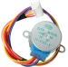

**步进电机：** 是由一系列电磁线圈控制的电机。它可以根据需要旋转精确的度数(或步数)，允许你将它移动到一个精确的位置并保持该位置。它是通过在很短的时间内为电机内部的线圈供电来做到这一点的，但你必须一直为电机供电，以保持它在你想要的位置。有两种基本类型的步进电机，单极步进和双极步进。在本项目中，我们使用的是单极步进电机28-BYJ48。

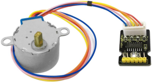

**28BYJ-48步进电机工作原理：**

步进电机主要由定子和转子组成，定子是固定不动的，如下图绕着A、B、C、D线圈组的部分，线圈组导通电就会产生磁场；转子就是转动的部分，如下图定子中间的部分，两极是永磁铁。

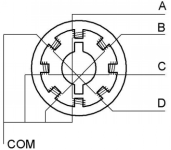

单步4节拍的转动原理：开始A组线圈导通，转子两极正对着A组线圈；接着A组线圈断开，B组线圈导通，转子就会顺时针转到B组线圈，转子转了一步；B断开，C导通，转子转到C组；C断开，D导通，转子转到D组；D组断开，A组导通，转子转到A组线圈。这样转子就转了半圈180度，接着再重复一次，B-C-D-A，转子转回到A组线圈，这样转子就转了一圈，总共转动了8步。如下图所示，这就是步进电机单节拍转动的原理A - B - C - D - A ....。

如果想让步进电机逆时针转动，那只要把节拍顺序反过来就行，D - C - B - A - D .....。

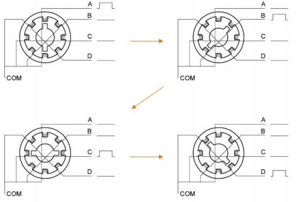

半步8节拍转动原理：8节拍，采用的是单双拍的形式，A - AB - B - BC - C - CD - D - DA - A ...... ，这样运转一拍，转子只会转动半步，例如，A组线圈导通，转子转到正对着A组线圈；接着A和B组一起导通，这样产生的磁场最强的地方在AB组线圈中间，转子两极就会转到AB组线圈中间，也就是顺时针转了半步。

**步进电机参数：**

我们所提供的步进电机需要转动32步，转子才能转一圈，还经过了1:64的减速齿轮组带动输出轴，这样输出轴转动一圈需要： 32 * 64 = 2048 步。
电压5V，4相步进电机 ，4节拍模式的步进角为11.25， 8节拍模式步进角为5.625， 减速比为1:64 。

**ULN2003步进电机驱动板：** ULN2003型步进电机驱动器，将微弱信号转换为更强的控制信号，从而驱动步进电机。

下面的原理图显示了如何使用ULN2003步进电机驱动板接口将一个单极步进电机接到ESP32 主控板的引脚上，并显示了如何使用四个TIP120的接口。 

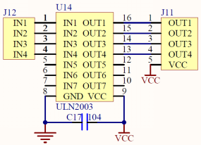

---

**3. 实验组件：**

|  |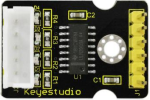|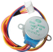||
| ------------------------ | ------------------------ | ---------------------------- |---------------------------- |
|ESP32 主控板| ULN2003步进电机驱动板 x1| 步进电机 x1 |电池盒 x1|
|||  |
|公对母杜邦线若干|AA电池(<span style="color: rgb(255, 76, 65);">自备</span>) x6| Micro USB数据线 x1 |  |

---

**4. 接线图：**

**原理图：**

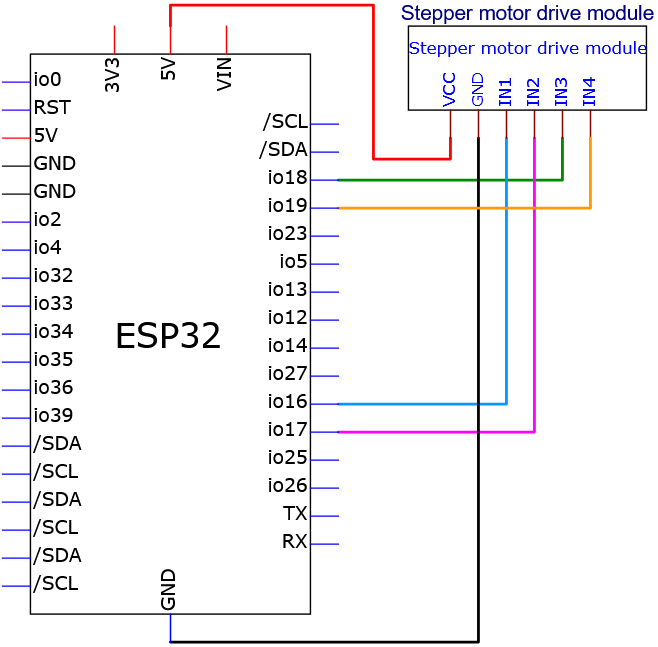

**实物接线图：**

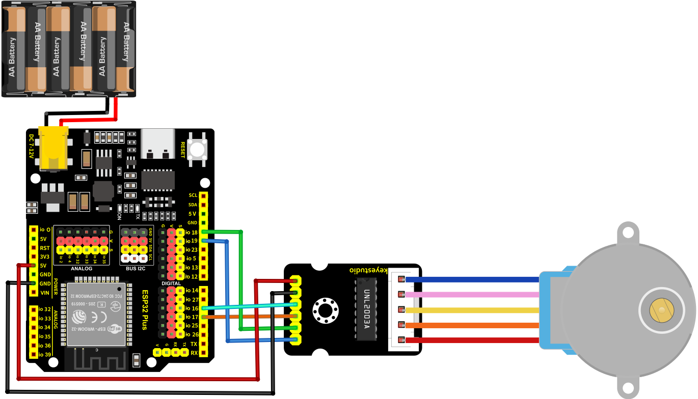

---

**5. 实验代码：** 

```python
'''
 * Filename    : Stepper_Motor
 * Thonny      : Thonny 4.1.7
 * Auther      : http//www.keyestudio.com
'''
from machine import Pin
import time
 
# 引脚初始化
in1 = Pin(16, Pin.OUT)
in2 = Pin(17, Pin.OUT)
in3 = Pin(18, Pin.OUT)
in4 = Pin(19, Pin.OUT)
 
# 延时
delay = 1
 
# 电机旋转一圈所需的步数，(约360°)，会有轻微偏差.
ROUND_VALUE = 509
 
# 四相八拍步进电机顺序值:A-AB-B-BC-C-CD-D-DA-A.
STEP_VALUE = [
    [1, 0, 0, 0],
    [1, 1, 0, 0],
    [0, 1, 0, 0],
    [0, 1, 1, 0],
    [0, 0, 1, 0],
    [0, 0, 1, 1],
    [0, 0, 0, 1],
    [1, 0, 0, 1],
]
 
# 引脚输出电平低
def reset():
    in1(0)
    in2(0)
    in3(0)
    in4(0)
 
# 如果count是正整数，则顺时针旋转，如果count是负整数，则逆时针旋转
def step_run(count):
    direction = 1     # 顺时针转
    if count < 0:
        direction = -1  # 逆时针旋转
        count = -count
    for x in range(count):
        for bit in STEP_VALUE[::direction]:
            in1(bit[0])
            in2(bit[1])
            in3(bit[2])
            in4(bit[3])
            time.sleep_ms(delay)
    reset()
 
# 如果a是正整数，则顺时针旋转，如果a是负整数，则逆时针旋转
def step_angle(a):
    step_run(int(ROUND_VALUE * a / 360))
 
# 循环:顺时针转一圈，再逆时针转一圈.
while True:
    step_run(509)
    step_run(-509)
    step_angle(360)
    step_angle(-360)
```
---

**6. 实验结果：**

将 ESP32 主控板通过Micro USB数据线与计算机相连供电，还需要外接电源给ESP32 主控板供电，单击，代码开始执行，你会看到的现象是：ULN2003驱动模块上的 D1、D2、D3、D4 四个LED点亮，步进电机开始正反方向转动，并保持此状态循环。


单击退出程序。

---

**7. 代码说明：**

1/. 初始化步进电机驱动板的控制引脚。

```python
in1 = Pin(16, Pin.OUT)
in2 = Pin(17, Pin.OUT)
in3 = Pin(18, Pin.OUT)
in4 = Pin(19, Pin.OUT)
```
2\. 电机旋转一圈所需的步数，(约360°)，会有轻微偏差.

```python
ROUND_VALUE = 509
```
3\. 四相八拍步进电机顺序值:A-AB-B-BC-C-CD-D-DA-A.。

```python
STEP_VALUE = [
    [1, 0, 0, 0],
    [1, 1, 0, 0],
    [0, 1, 0, 0],
    [0, 1, 1, 0],
    [0, 0, 1, 0],
    [0, 0, 1, 1],
    [0, 0, 0, 1],
    [1, 0, 0, 1],
]
```
4\. 引脚输出电平低。

```python
def reset():
    in1(0)
    in2(0)
    in3(0)
    in4(0)
```
5\. 如果count是正整数，则顺时针旋转，如果count是负整数，则逆时针旋转。

```python
def step_run(count):
    direction = 1     # 顺时针转
    if count < 0:
        direction = -1  # 逆时针旋转
        count = -count
    for x in range(count):
        for bit in STEP_VALUE[::direction]:
            in1(bit[0])
            in2(bit[1])
            in3(bit[2])
            in4(bit[3])
            time.sleep_ms(delay)
    reset()
```
6\. 如果a是正整数，则顺时针旋转，如果a是负整数，则逆时针旋转。

```python
def step_angle(a):
    step_run(int(ROUND_VALUE * a / 360))
```
6\. 循环:顺时针转一圈，再逆时针转一圈.。

```python
while True:
    step_run(509)
    step_run(-509)
    step_angle(360)
    step_angle(-360)
```
---

### 2-2-14 按键

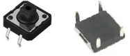

---

**1. 实验介绍：**

按键开关是电路元件之一，通常用于控制电路中的开关状态。它可以打开或关闭电路以实现各种功能。按键开关可以在电路中控制信号或功率的流动方向和速度，从而实现各种功能，例如控制电器的开关、选择不同的灯光颜色、控制音量大小等。

---

**2. 元件知识：**

**按键开关：** 按键可以控制电路的通断，把按键接入电路中，不按下按键的时候电路是断开的，按下按键电路就通啦，但是松开之后就又断了。可是为什么按下才通电呢？这得从按键的内部构造说起。没按下之前，电流从按键的一端过不去另一端；按下的时候，按键内部的金属片把两边连接起来让电流通过。


按键内部结构如图：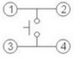，未按下按键之前，1、2就是导通的，3、4也是导通的，但是1、3或1、4或2、3或2、4是断开（不通）的；只有按下按键时，1、3或1、4或2、3或2、4才是导通的。

在设计电路时，按键开关是最常用的一种元件。在电路图中，按键开关的符号为：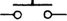。

通过按键来切换高、低电平信号，常见电路有三种，分别为：

● 上拉电阻电路;
● 下拉电阻电路;
● 内部上拉电路。

**下面详细讲述这三种电路：**

**A. 上拉电阻电路**  

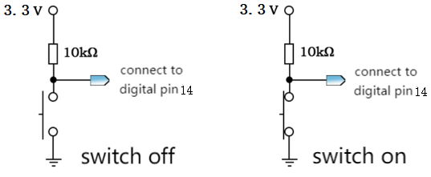

当按键开关断开时，数字引脚7通过电阻和5V电源相连接，产生高电平，digitalRead(7)函数的返回值为1。当按键开关闭合时，数字引脚7的电压和地相连接，产生低电平，digitalRead(7)函数的返回值为0。电路中10 KΩ电阻称为上拉电阻。

**B. 下拉电阻电路**

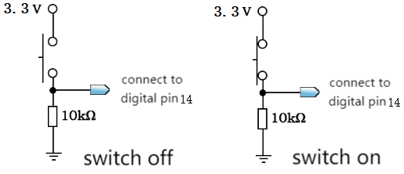

当按键开关断开时，数字引脚7通过电阻和地相连接，产生低电平，digitalRead(7)函数的返回值为0。当按键开关闭合时，数字引脚7的电压和5V电源相连接，产生高电平，digitalRead(7)函数的返回值为1。电路中10 KΩ电阻称为下拉电阻。

当数字输入引脚的工作模式设置为INPUT时，如下图所示的两种接法都是错误的。

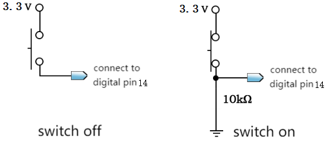

当按键开关断开时，上图左侧电路图中数字引脚7既没有接高电平，也没有接地，这种情形称为悬空。此时digitalRead()函数的返回值是不确定的，可能是HIGH，也可能是LOW，所以这种接法返回的数据是不可以使用的。

当按键开关闭合时，上图右侧电路图中，电源直接与地相连，此时会造成短路。

所以当数字输入引脚的工作模式设置为INPUT时，读取按键值，一定要在电路中设置一个上拉电阻或者下拉电阻，电阻的阻值一般为10 KΩ。采用上拉电阻时，当按键断开时digitalRead()函数的返回值为l。采用下拉电阻时，当按键断开时digitalRead()函数的返回值为0。

**C. 内部上拉电路**  

除了上述两种接法外，在ATmega328控制器内部还集成有上拉电阻，上拉电阻的阻值为20KΩ。可以通过在pinMode()函数中设置mode参数为INPUT_PULLUP来启用内部上拉电阻。

启用控制器内部的上拉电阻后，按键开关电路就可以省略外接电阻。内部上拉电路示意图如下图所示。

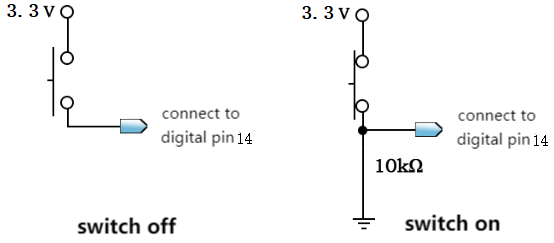

从上图中可以看出，当开关断开时，digitalRead()函数的返回值为l；当开关闭合时，digitalRead()函数的返回值为0。

当采用内部上拉电阻电路时，按键的一端和数字引脚相连，另外一端和地相连。

<span style="color: rgb(255, 76, 65);">**注意：在本项目实验中，按键是采用上拉电阻电路的。**</span>

---

**3. 实验组件：**

|  |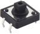||
| ------------------------ | ------------------------ | ---------------------------- |
| ESP32 主控板| 按键开关 x1  | 10KΩ电阻 x1  |
||||
|面包板 x1 |面包板跳线若干 | Micro USB数据线 x1 |

---

**4. 接线图：** 

**原理图：**

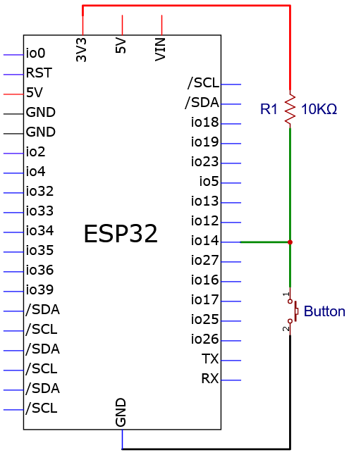

**实物接线图：**

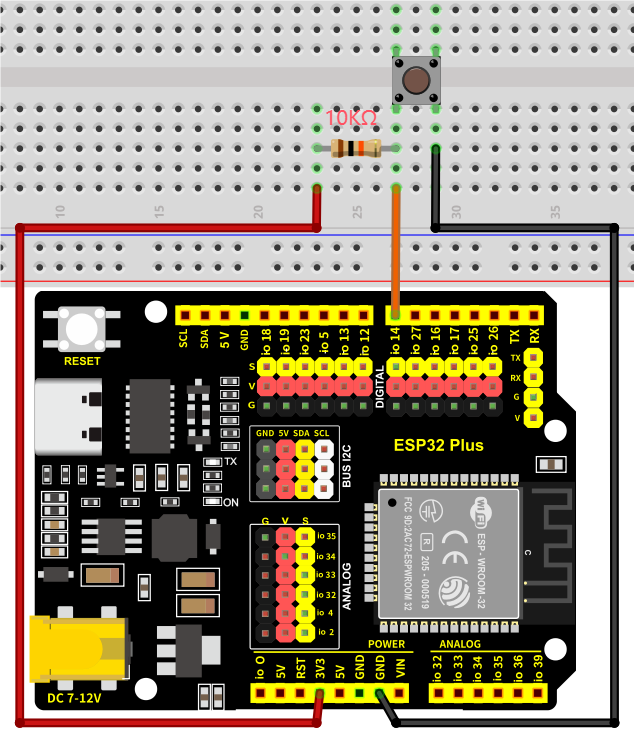

---

**5. 实验代码：**

```python
'''
 * Filename    : Button
 * Thonny      : Thonny 4.1.7
 * Auther      : http//www.keyestudio.com
'''
from machine import Pin
import time 

button = Pin(14, Pin.IN, Pin.PULL_UP) # 定义按键的引脚，输入模式和输入上拉模式

while True: 
    if button.value() == 0: # 按下按键时，打印相应信息
        print("0  You pressed the button!")  
    else:  # 松开按键时，打印相应信息
        print("1  You loosen the button!")
    time.sleep(0.1)  # 延时0.1秒
```
---

**7. 实验结果：**

将 ESP32 主控板通过Micro USB数据线与计算机相连供电，单击，代码开始执行，当按下按键时，按键值value为0；同时，“Shell”窗口将打印出 “**0  You pressed the button!**” 字符串。松开按键时，按键值value为1，“Shell”窗口将打印出 “**1  You loosen the button!**” 字符串。

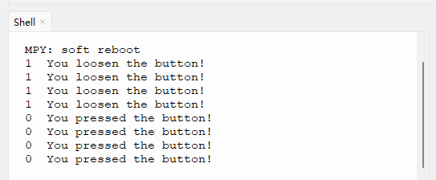


单击退出程序。

---

**8. 代码说明：**

1\. 设置按键开关的控制引脚和输入模式。

```python
button = Pin(14, Pin.IN, Pin.PULL_UP)
```
- <span style="color: rgb(255, 76, 65);">Serial.begin(speed)</span>：设置串行数据传输的数据速率（以位/秒（波特）为单位）。

    - <span style="color: rgb(255, 76, 65);">speed</span>：以每秒位数（波特率）为单位。允许的数据类型： long。

2\. 在 `while True:` 循环中，按钮的状态将被读取并存储在 <span style="color: rgb(255, 76, 65);">button.value()</span> 函数中。button.value() 函数的值使用 <span style="color: rgb(255, 76, 65);">print()</span> 串口打印出来。 

```python
while True: 
    if button.value() == 0:
        print("0  You pressed the button!") 
    else:
        print("1  You loosen the button!")
    time.sleep(0.1) 
```
---

### 2-2-15 倾斜开关

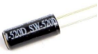

---

**1. 实验介绍：**

倾斜开关，其内部带有一颗滚珠，用来监测倾斜情况。倾斜开关可以依据是否倾斜而输出不同的电平信号。倾斜开关可用于倾斜检测、报警器制作或者其他检测。

---

**2. 元件知识：**

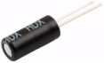

倾斜开关也叫数字开关或球形开关，里面有一个金属球。它用于检测小角度的倾斜。

原理很简单：当开关倾斜一定角度时，里面的球会向下滚动，接触到连接到外面引脚的两个触点，从而触发电路。否则，球将远离触点，从而断开电路。

这里用倾斜开关的内部结构来说明它是如何工作的，显示如下图：

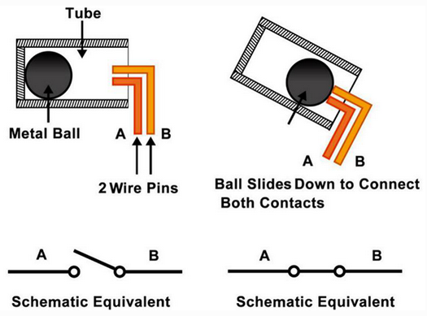

[AETHDX 倾斜开关 数据表](https://www.tme.com/Document/f1e6cedd8cb7feeb250b353b6213ec6c/SW-520D.pdf)

---

**3. 实验组件：**

|  |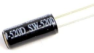||
| ------------------------ | ------------------------ | ---------------------------- |
| ESP32 主控板| 倾斜开关  x1  | 10KΩ电阻 x1  |
||||
|面包板 x1 |面包板跳线若干 | Micro USB数据线 x1 |
---

**4. 接线图：**

**原理图：**

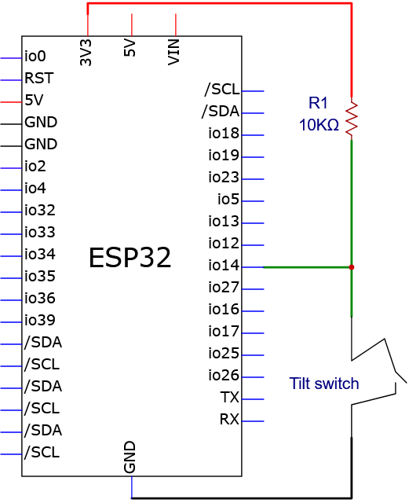

**实物接线图：**

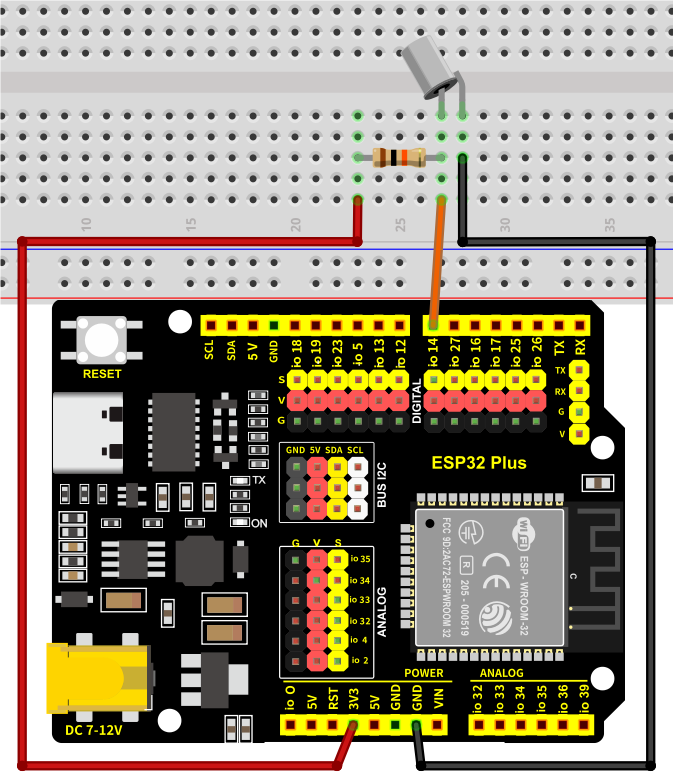

---

**5. 实验代码：** 

```python
'''
 * Filename    : Tilt_Switch
 * Thonny      : Thonny 4.1.7
 * Auther      : http//www.keyestudio.com
'''
from machine import Pin
import time

TiltSensor = Pin(14, Pin.IN) # 定义倾斜开关的引脚，输入模式

while True:
    value = TiltSensor.value()  # 将倾斜开关读取的值赋给与变量value
    print(value, end = " ")  # 打印倾斜开关读取的值
    if  value== 1: # 倾斜开关倾斜时，串口打印相关信息
        print("The switch is turned on")
    else:  # 倾斜开关未倾斜时，串口打印相关信息
        print("The switch is turned off")
    time.sleep(0.1)
```
---

**7. 实验结果：**

将 ESP32 主控板通过Micro USB数据线与计算机相连供电，单击，代码开始执行。当倾斜开关倾斜到一定角度时，value值为1；同时，“Shell”窗口将打印出 “**1  The switch is turned on**” 字符串。当倾斜开关未倾斜时，value值为0，“Shell”窗口将打印出 “**0  The switch is turned off**” 字符串。

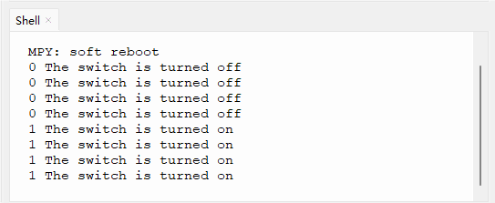

单击退出程序。

---

**8. 代码说明：**

可以参照前面的课程 2-2-14 的代码说明，这里就不多做介绍了。

---

### 2-2-16 附近有人吗

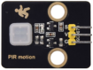

---

**1. 实验介绍：**

人体红外传感器主要由一个RE200B-P传感器元件组成。它是一款基于热释电效应的人体红外传感器，能检测到人体或动物身上发出的红外线，配合菲涅尔透镜能使传感器探测范围更远更广。

实验中，通过读取模块上S端高低电平，判断附近是否有人在运动；并且在串口监视器上显示测试结果。

---

**2. 模块参数**

- 工作电压: DC 3.3V~5V 
- 工作电流: 3.6mA
- 最大功率: 0.018W
- 静态电流: <50 uA
- 输出信号: 数字信号
- 视野角度：Y = 90°，X = 110°（视野角度为理论数值）
- 最大检测距离: ≤5米
- 工作温度：-10°C ~ +50°C
- 尺寸：32mm x 23.8mm x 7.4mm

---

**3. 模块原理图：**

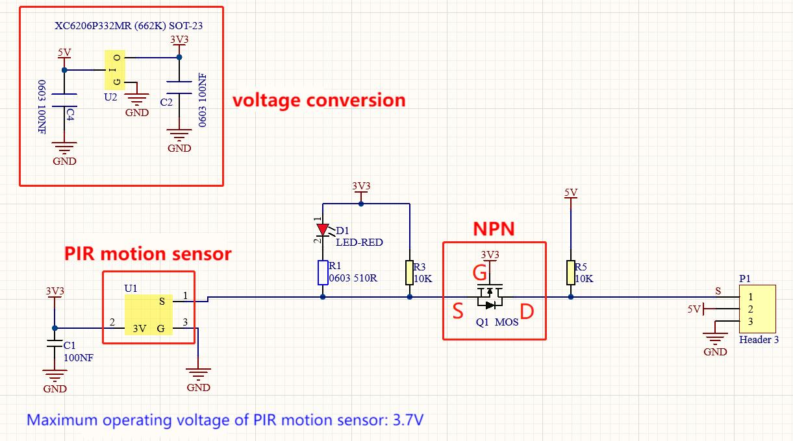

这个模块的原理图可能较前面的模块稍复杂，我们一部分一部分来看。先看电压转换部分，作用是将5V输入电压转换为3.3V输入电压。因为我们模块上用到的热释电红外传感器的工作电压是3.3V，不能直接用5V电压供电使用。有了这个电压转换部分，3.3V输入电压和5V输入电压都适用于此热释电红外传感器。

当人体红外传感器没有检测到红外信号时，人体红外传感器的1脚输出低电平，此时模块上的LED两端有电压差，有电流流过，LED被点亮，MOS管Q1导通（Q1是NPN MOS管，型号为2N7002。由于人体红外传感器的1脚输出低电平，所以Q1的源极Vs=0，而Q1的栅极Vg=3.3V，于是Q1的栅极G和Q1的源极S之间的电压 Vgs = 3.3V 大于Q1的阈值电压 2.5V，Q1导通。），信号端S检测到低电平。

当人体红外传感器检测到红外信号时，人体红外传感器的1脚输出高电平，此时模块上的LED熄灭，MOS管Q1不导通，则信号端S检测到被10K上拉电阻R5拉高的高电平。

---

**4. 实验组件：**

|  ||||
| ------------------------ | ------------------------ | ---------------------------- |---------------------------- |
| ESP32 主控板| 人体红外传感器 x1  |公对母杜邦线若干若干 | Micro USB数据线 x1 |

---

**5. 接线图：**

**原理图：**

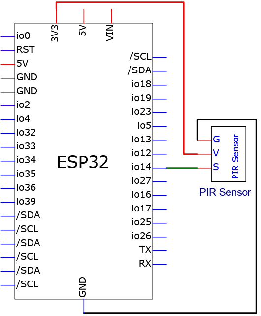

**实物接线图：**

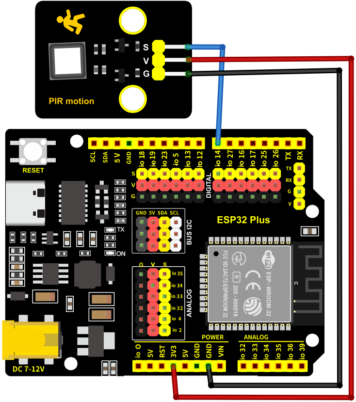

---

**6. 实验代码：**

```python
'''
 * Filename    : PIR_Motion
 * Thonny      : Thonny 4.1.7
 * Auther      : http//www.keyestudio.com
'''
from machine import Pin
import time

PIR = Pin(14, Pin.IN)  # 定义人体红外传感器的引脚，输入模式

while True:
    value = PIR.value()  # 将人体红外传感器读取的值赋给与变量value
    print(value, end = " ")  # 打印人体红外传感器读取的值
    if value == 1:  # 人体红外传感器检测的移动时，串口打印相关信息
        print("Some body is in this area!")
    else:  # 人体红外传感器未检测的移动时，串口打印相关信息
        print("No one!")
    time.sleep(0.1)
```
---

**7. 实验结果：**

将 ESP32 主控板通过Micro USB数据线与计算机相连供电，单击，代码开始执行。当传感器检测到附近有人在运动时，value值为1，模块上LED熄灭；同时，“Shell”窗口将打印出 “**1  Some body is in this area!**” 字符串。没有检测到附近有人在运动时，value值为0，模块上LED点亮，“Shell”窗口将打印出 “**0  No one!**” 字符串。

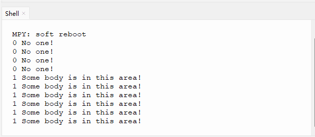

单击退出程序。

---

**8. 代码说明：**

可以参照前面的课程 2-2-14 的代码说明，这里就不多做介绍了。

---


### 2-2-17 读取电位器的值

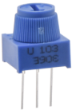

---

**1. 实验介绍：**

旋转电位器是一个模拟传感器。前面我们学习过的传感器，都是数字传感器。例如我们前面学习的人体红外热释传感器，当传感器检测到附近有人在运动时，我们读取到高电平（3.3V），当未检测到附近有人在运动时，我们读取到低电平（0V），而在 0 ~ 3.3V 中间的电压值，我们数字IO口无法读取到，当然人体红外热释传感器也只能输出高低电平。而模拟传感器就可以通过我们主板上的模拟口读取中间的电压值，那么，在本实验中我们使用旋转电位器通过模拟口来读取ADC值，DAC值和电压值。

---

**2. 元件知识：**


**可调电位器：** 其原理是靠电刷在电阻体上滑动，在电路中获取与输入电压形成一定关系地输出电压。旋转电位器选用了一个10K可调电阻。通过旋转电位器上的手柄，我们可以改变电阻大小，信号端S检测到电压变化（0 ~ 3.3V），而这个电压变化是一个连续变化的模拟量，也就是在 0~3.3V 内可以取任意值，我们必须先对这个模拟量进行ADC采集，来测量连续的这些模拟量。A/D 是模拟量到数字量的转换，依靠的是模数转换器(Analog to Digital Converter)，简称ADC。我们的主板已经集成了ADC采集，可以直接使用。

我们的ESP32 主控板默认分辨率为 12 位，即ADC位数是 12 位。一个 n 位的ADC表示这个ADC共有 2 的n次方个刻度，12位的ADC，输出的是从 0～4095 一共 4096 个数字量，也就是 2 的 12 次方个数据刻度，每个刻度就是 3.3V/4096 ≈ 0.00080566 V，这也叫分辨率。

**ADC：** ADC是一种电子集成电路，用于将模拟信号(如电压)转换为由1和0表示的数字信号。我们在主板上的ADC的范围是默认的 12 位（ADC的位数表示将模拟量转换成数字量后所用的二进制位数），其可存储数字量范围为：0 ~ 2^12 即 0 ~ 4095 。假设它的参考电压是 3.3V ，也就是说把参考电压分成4096份，最小分辨率为 3.3V/4096 ，模拟值的范围对应于ADC值。因此，ADC拥有的比特越多，模拟的分区就越密集，最终转换的精度也就越高。

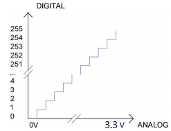

纵坐标数字0 : 0V ~ 3.3/4096 V 范围内的模拟量（横坐标）;

纵坐标数字1 : 3.3/4096 V ~ 2 * 3.3/4096 V 范围内的模拟量（横坐标）;

......

模拟将被相应地划分。换算公式如下：

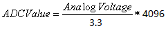

**DAC：** 这一过程的可逆需要DAC，数字到模拟转换器。数字I/O端口可以输出高电平和低电平(0或1)，但不能输出中间电压值，这就是DAC有用的地方。主板上8位精度的DAC可以将VCC(这里是 3.3 V)分成 2^8 = 256 个部分。例如，当数字量为 1 时，输出电压值为3.3V/256 * 1 = 0.012890625 V，当数字量为 128 时，输出电压值为 3.3V/256 * 128 = 1.65 V，DAC的精度越高，输出电压值的精度就越高。

换算公式如下：

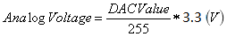


如果您想了解更多关于电位计的信息，请参阅：[电位计 - 维基百科](https://en.wikipedia.org/wiki/Potentiometer)

---

**3. 实验组件：**

|  |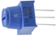||
| ------------------------ | ------------------------ | ---------------------------- |
| ESP32 主控板| 可调电位器 x1  |面包板 x1 |  
|||  |
|面包板跳线若干 | Micro USB数据线 x1 |  |

---

**4. 接线图：**

**原理图：**

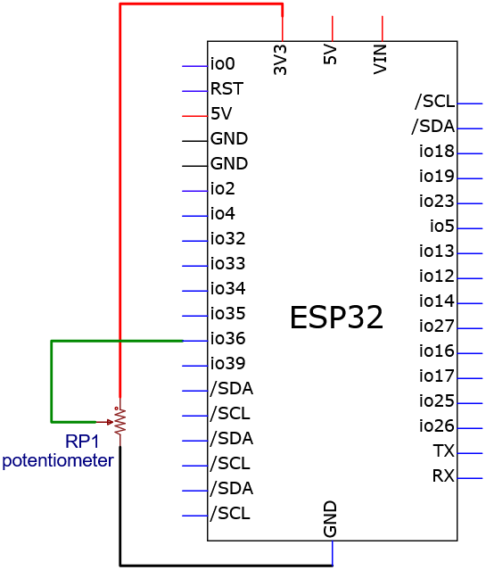

**实物接线图：**

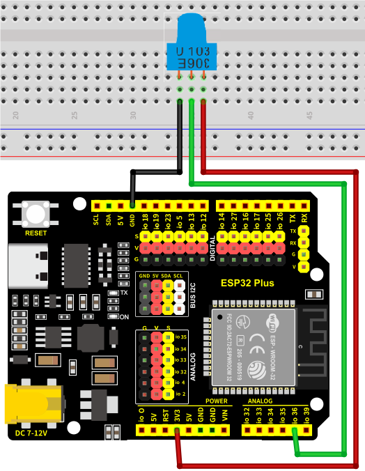

---

**5. 实验代码：** 

```c++
/*  
 * 名称   : Potentiometer
 * 功能   : 读取电位器的值
 * 编译IDE：ARDUINO 2.3.3
 * 作者   : https://www.keyestudio.com/
*/
const int PIN_ANALOG_IN = 36;   //可调电位器的引脚定义为GPIO36

void setup() {
  Serial.begin(9600);   //波特率设置为9600
  pinMode(PIN_ANALOG_IN, INPUT);    //将电位器的引脚设置为输入模式
}

void loop() {
  int adcVal = analogRead(PIN_ANALOG_IN);    //读取电位器的模拟信号
  int dacVal = map(adcVal, 0, 4095, 0, 255);
  double voltage = adcVal / 4095.0 * 3.3;
  Serial.print("ADC Val: ");    //打印字符串ADC Val:
  Serial.print(adcVal);    //打印且显示adcVal值
  Serial.print(" |DAC Val: ");    //打印字符串  DAC Val:  
  Serial.print(adcVal);    //打印且显示adcVal值
  Serial.print(" |Voltage: ");    //打印字符串  Voltage:  
  Serial.println(voltage);    //打印且显示voltage值
  delay(200);
}
```
---

**7. 实验结果：**

将 ESP32 主控板通过Micro USB数据线与计算机相连供电，单击，代码开始执行。“Shell”窗口将打印出电位器的ADC Val值、DAC Val值和Voltage值; 旋转可调电位器上的手柄时，观察“Shell”窗口的ADC Val值、DAC Val值和Voltage值的变化。

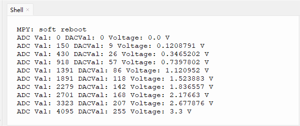

单击退出程序。

---

**8. 代码说明：**

1\. 导入Pin、ADC和DAC模块。

```python
from machine import ADC,Pin,DAC 
import time
```

2\. 定义引脚连接，开启并配置ADC，量程为0-3.3V

```python
adc=ADC(Pin(36))
adc.atten(ADC.ATTN_11DB)
adc.width(ADC.WIDTH_12BIT)
```

3\. 每0.1秒读取一次ADC值，将ADC值转换为DAC值和voltage值输出；并将这些数据打印到“Shell”。

```python
try:
    while True:
        adcVal=adc.read()
        dacVal=adcVal//16
        voltage = adcVal / 4095.0 * 3.3
        print("ADC Val:",adcVal,"DACVal:",dacVal,"Voltage:",voltage,"V")
        time.sleep(0.1)
except:
    pass
```

4\. ADC类

在每次使用ADC模块之前，请在 python 文件的顶部添加语句 “from machine import ADC”。

<span style="color: rgb(255, 76, 65);">machine.ADC(pin)</span>: 创建与给定引脚相关联的ADC对象.

- <span style="color: rgb(255, 76, 65);">pin</span>: 可用引脚有: Pin(36)、Pin(39)、Pin(34）、Pin(35)、Pin(32)、Pin(33)。

<span style="color: rgb(255, 76, 65);">ADC.read()</span>: 读取ADC并返回值。

<span style="color: rgb(255, 76, 65);">ADC.atten(db)</span>：设置衰减比（即满量程电压，如11db满量程电压为3.3V）。

- <span style="color: rgb(255, 76, 65);">db</span>：衰减比。
- <span style="color: rgb(255, 76, 65);">ADC.ATTEN_0DB</span> - 1.2V全量程
- <span style="color: rgb(255, 76, 65);">ADC.ATTEN_2.5_DB</span> - 1.5V全量程
- <span style="color: rgb(255, 76, 65);">ADC.ATTEN_6DB</span>  - 2.0V全量程
- <span style="color: rgb(255, 76, 65);">ADC.ATTEIN_11DB</span> - 3.3V全量程

<span style="color: rgb(255, 76, 65);">ADC.width(bit)</span>: 设置数据宽度。

- <span style="color: rgb(255, 76, 65);">bit</span>: 数据位数
- <span style="color: rgb(255, 76, 65);">ADC.WIDTH_9BIT</span> — 9 数据宽度
- <span style="color: rgb(255, 76, 65);">ADC.WIDTH_10BIT</span> — 10 数据宽度 
- <span style="color: rgb(255, 76, 65);">ADC.WIDTH_11BIT</span> — 11 数据宽度
- <span style="color: rgb(255, 76, 65);">ADC.WIDTH_12BIT</span> — 12 数据宽度

5\. DAC类

在每次使用DAC模块之前，请在python文件的顶部添加语句“from machine import DAC”。

<span style="color: rgb(255, 76, 65);">machine.DAC(pin)</span>: 创建与给定引脚相关联的DAC对象。

- <span style="color: rgb(255, 76, 65);">pin</span>: 可选引脚有：Pin(25)、Pin(26)

<span style="color: rgb(255, 76, 65);">DAC.write(value)</span>: 输出电压

- <span style="color: rgb(255, 76, 65);">value</span>: 数据值范围：0-255，对应输出电压0-3.3V.

---

### 2-2-18 检测光照强度

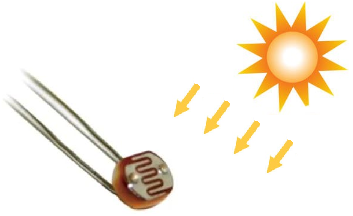

---

**1. 实验介绍：**

传感器或元件在我们的日常生活中是无处不在的。例如，一些公共路灯在晚上会自动亮起，而在白天会自动熄灭。为什么呢? 事实上，这些都是利用了一种光敏电阻元件，可以感应外部环境光强度的元件。光敏电阻元件的阻值随着光照强度的变化而变化，可以用来模拟人对环境光线的强度的判断，方便做出与人友好互动的应用。

---

**2. 元件知识：**

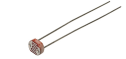

**光敏电阻：** 是利用硫化镉或硒化镉等半导体材料的光电导效应制成的一种电阻值随入射光的强弱而改变的电阻器。光照愈强，阻值就愈低，随着光照强度的升高，电阻值迅速降低，亮电阻值可小至1KΩ以下。光敏电阻对光线十分敏感，其在无光照时，呈高阻状态，暗电阻一般可达1.5MΩ。


为了增加灵敏度，光敏电阻两个电极常做成梳状。
光敏电阻没有极性，在电路图中，光敏电阻的符号如下图所示。


在电路中，为了读取光敏电阻随光线强度的变化值，电路连接时需要串联一个电阻。串联电阻的目的就是利用串联分压原理，当光敏电阻阻值变化时，模拟输入引脚处的电压会随之发生变化，读取的数值也因此而变化。下面的电路是用来检测光敏电阻电阻值的变化，如下图所示：

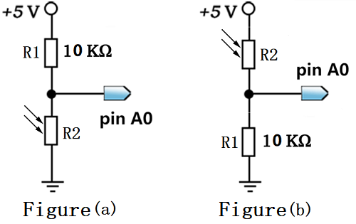

在上述电路中，当光敏电阻的电阻因光强的变化而改变时，光敏电阻R2与电阻R1之间的电压也会发生变化。因此，通过测量这个电压就可以得到光的强度。 

<span style="color: rgb(255, 76, 65);">**注意：本项目实验采用图（a）来进行说明和实验操作的，图（b）的电路图自己可以去拓展。**</span>

---

**3. 实验组件：**

|  |||
| ------------------------ | ------------------------ | ---------------------------- |
| ESP32 主控板| 光敏电阻 x1  |面包板 x1 |  
|||  |
|面包板跳线若干 | Micro USB数据线 x1 | 10KΩ电阻 x1 |    

---

**4. 接线图：**

**原理图：**

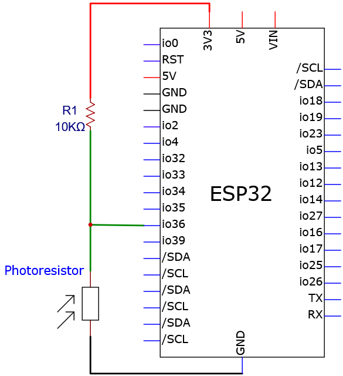

**实物接线图：**

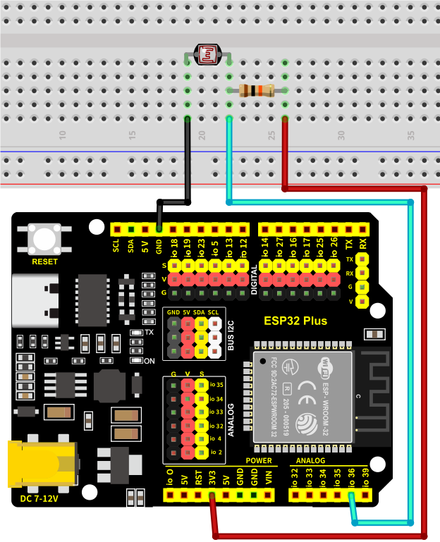

---

**5. 实验代码：** 

```python
'''
 * Filename    : Photoresistor
 * Thonny      : Thonny 4.1.7
 * Auther      : http//www.keyestudio.com
'''
# 导入引脚、ADC和DAC模块
from machine import ADC,Pin,DAC
import time

# 开启并配置ADC，量程为0-3.3V
adc=ADC(Pin(36)) 
adc.atten(ADC.ATTN_11DB)
adc.width(ADC.WIDTH_12BIT)

# 每0.1秒读取一次ADC值，将ADC值转换为DAC值输出
# 并将这些数据打印到“Shell”
try:
    while True:
        adcVal=adc.read()
        dacVal=adcVal//16
        voltage = adcVal / 4095.0 * 3.3
        print("ADC Val:",adcVal,"DACVal:",dacVal,"Voltage:",voltage,"V")
        time.sleep(0.1)
except:
    pass
```
---

**6. 实验结果：**

将 ESP32 主控板通过Micro USB数据线与计算机相连供电，单击，代码开始执行。“Shell”窗口将打印出光敏电阻的ADC Val值、DAC Val值和Voltage值; 将手指放置在光敏电阻上时，观察“Shell”窗口的ADC Val值、DAC Val值和Voltage值的变化。外界光照强度越强，ADC Val值、DAC Val值和Voltage值都减少；反之，ADC Val值、DAC Val值和Voltage值都增大。


单击退出程序。

---

**7. 代码说明：**

可以参照前面的课程 2-2-17 的代码说明，这里就不多做介绍了。 

---

### 2-2-19 检测火焰

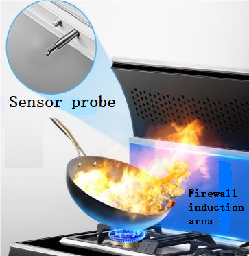

---

**1. 实验介绍：**

火灾是一种可怕的灾害，火灾检测传感器（火焰传感器）在房屋，商业建筑和工厂中是非常有用的。实验中，我们利用这个传感器来检测环境中是否有火焰，并且在串口监视器中的数值来说明火焰大小及远近。

---

**2. 元件知识：**


**火焰传感器：** 火焰会发出一定程度的IR光，这种光人眼是看不到的，但我们的火焰传感器可以检测到它，并提醒微控制器（ESP32 主控板）已经检测到火灾。它有一个专门设计的红外接收管来探测火焰，然后将火焰亮度转换为波动水平信号。接收三极管的短引脚是负极，另一个长引脚是正极。我们应该连接短引脚（负极)到5V，连接长引脚(正极)到模拟引脚，一个电阻和GND。如下图所示：

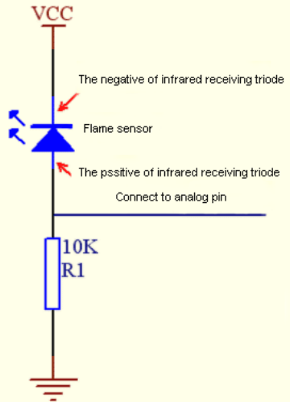


<span style="color: rgb(255, 76, 65);">**注意：**</span> 火焰传感器应避开日光、汽车头灯、白炽灯直接照射，也不能对着热源(如暖气片、加热器)或空调，以避免环境温度较大的变化而造成误报。同时还易受射频辐射的干扰。

---

**3. 实验组件：**

|  |||
| ------------------------ | ------------------------ | ---------------------------- |
| ESP32 主控板| 火焰传感器 x1  |面包板 x1 |  
|||  |
|面包板跳线若干 | Micro USB数据线 x1 | 10KΩ电阻 x1 |  

---

**4. 接线图：**

**原理图：**

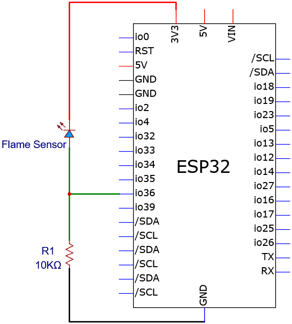

**实物接线图：**

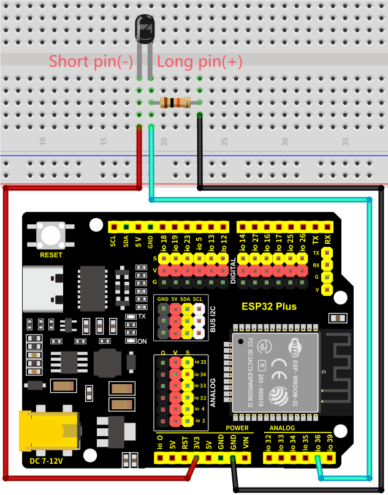

---

**5. 实验代码：** 

```python
'''
 * Filename    : Flame_Sensor
 * Thonny      : Thonny 4.1.7
 * Auther      : http//www.keyestudio.com
'''
# 导入引脚、ADC和DAC模块
from machine import ADC,Pin,DAC
import time

# 开启并配置ADC，量程为0-3.3V
adc=ADC(Pin(36))
adc.atten(ADC.ATTN_11DB)
adc.width(ADC.WIDTH_12BIT)

# 每0.1秒读取一次数字值和ADC值，将ADC值转换为DAC值和电压值输出
# 并将这些数据打印到“Shell”
try:
    while True:
        adcVal=adc.read()
        dacVal=adcVal//16
        voltage = adcVal / 4095.0 * 3.3
        print("ADC Val:",adcVal,"DACVal:",dacVal,"Voltage:",voltage,"V")
        time.sleep(0.1)
except:
    pass
```
---

**7. 实验结果：**

将 ESP32 主控板通过Micro USB数据线与计算机相连供电，单击，代码开始执行。“Shell”窗口将打印出火焰传感器的ADC Val值、DAC Val值和Voltage值。当火焰靠近火焰传感器时，ADC Val值、DAC Val值和Voltage值增大；反之，ADC Val值、DAC Val值和Voltage值减小。

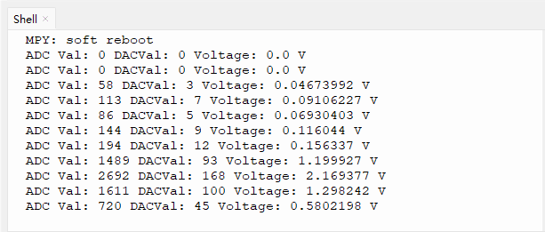

单击退出程序。

---

**8. 代码说明：**

可以参照前面的课程 2-2-17 的代码说明，这里就不多做介绍了。 

---

### 2-2-20 热敏电阻


---

**1. 实验介绍：**

热敏电阻，它的原理与光敏电阻类似，只是感应的器件不同。将热敏电阻的信号端接到ESP32 主控板的模拟口，可以读出对应的模拟值，电压值和温度值。我们可以利用模拟值，输出电压值，通过特定公式，计算出当前环境的温度。广泛应用于园艺、家庭警报系统等装置中。热敏电阻也是一种电阻，其阻值取决于温度和温度的变化，因此，我们可以利用这一特性来制作温度计。

---

**2. 元件知识：**

**热敏电阻：** 热敏电阻是一种温度敏感电阻。当热敏电阻感应到温度的变化时，它的电阻就会发生变化。我们可以利用热敏电阻的这种特性来检测温度强度。热敏电阻及其电子符号如下所示。

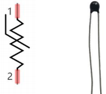

热敏电阻元件能够感知周边环境温度的变化，随着温度的升高，热敏电阻的阻值降低，10KΩ电阻（R1）两端的电压上升，从而引起信号端 GPIO36 的电压变化。

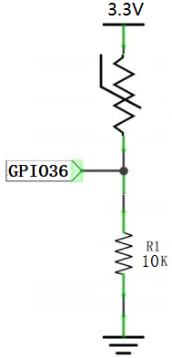


**NTC 热敏电阻温度计算公式：Rt = R * EXP( B * (1/T1-1/T2) ) 。**

其中，T1和T2指的是K度，即开尔文温度。K度=273.15(绝对温度)+摄氏度。

**Rt** 是热敏电阻在周围温度为T1（当前温度）时的电阻值。

**R** 是热敏电阻在周围温度为T2常温（常温取25℃）时的标称阻值。参考规格书可知我们用的NTC-MF52AT模拟温度传感器在 25℃ 下热敏电阻的零功率电阻值为 10KΩ ± 5%（即R=10K），T2=(273.15+25) 。

**B** 值是热敏电阻的重要参数，为材料常数，在25℃下测得。参考规格书可知B值为 3950 ± 1%。

**EXP()** 是e^()，e的n次方。

通过转换可以得到温度 T1 与电阻 Rt 的关系：T1=1 / (ln(Rt/R) /B+1/T2) ，这里可以将 ln 换算成 log，即 T1=1/ ( log(Rt/R)/B + 1/T2 ) 。

那么我们唯一需要知道的就是 Rt 的值。回到上面的原理图，设热敏电阻两端电压为 VRt，固定的 R1电阻两端的电压为VR，由电阻分压知识 VR/VRt = R1/Rt 可以知道：Rt = R1*(3.3-VR)/VR 。而我们实际得到的 VR 是转换后的模拟值，需要转换成电压值，即 VR = AnalogValue / 4096 * 3.3。

**注意**：计算出来的温度是开尔文温度，因此需要减去K值，对应的摄氏温度 t = T1 - 273.15，同时加上 0.5 的误差矫正。


[热敏电阻 - 维基百科](https://en.wikipedia.org/wiki/Thermistor)

---

**3. 实验组件：**

|  |||
| ------------------------ | ------------------------ | ---------------------------- |
| ESP32 主控板| 热敏电阻 x1  |面包板 x1 |  
|||  |
|面包板跳线若干 | Micro USB数据线 x1 | 10KΩ电阻 x1 |     

---

**4. 接线图：**

**原理图：**

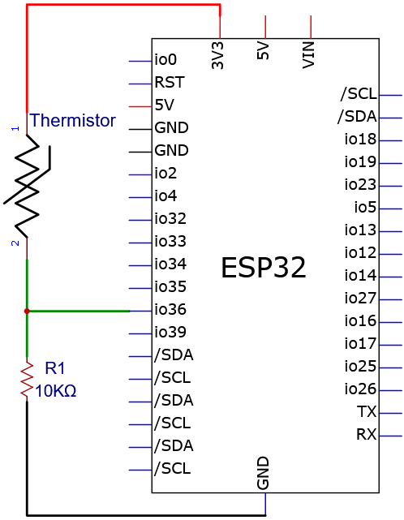

**实物接线图：**

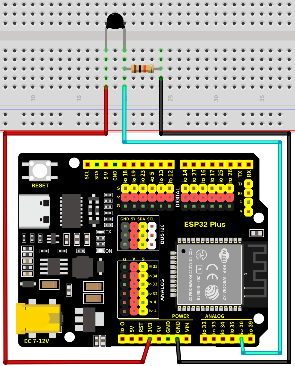

---

**5. 实验代码：** 

```python
'''
 * Filename    : Thermistor
 * Thonny      : Thonny 4.1.7
 * Auther      : http//www.keyestudio.com
'''
from machine import Pin, ADC
import time
import math

# 开启并配置ADC，量程为0-3.3V
adc=ADC(Pin(36))
adc.atten(ADC.ATTN_11DB)
adc.width(ADC.WIDTH_12BIT)

# 每0.5秒读取一次ADC值，将ADC值转换为电压值和温度值输出
# 并将这些数据打印到“Shell”
try: 
    while True: 
        adcValue = adc.read()  # 读IO36引脚的adc值
        voltage = adcValue / 4095 * 3.3  # 转换成电压值
        Rt =(3.3-voltage) / voltage * 10000  # 计算NTC热敏电阻
        tempK = (1 / (1 / (273.15+25) + (math.log(Rt/10000)) / 3950))  # 计算华氏温度
        tempC = (tempK - 273.15)+0.5  # 计算摄氏温度
        print("ADC value:",adcValue,"  Voltage:",voltage,"V","  Temperature: ",tempC,"C");
        time.sleep(0.5)
except:
    pass
```
---

**6. 实验结果：**

将 ESP32 主控板通过Micro USB数据线与计算机相连供电，单击，代码开始执行。“Shell”窗口将打印出热敏电阻检测到当前所处环境下的ADC Val值、Voltage值和Temperature值。


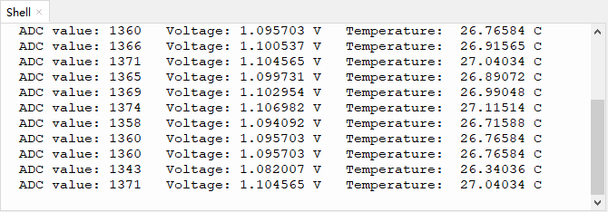


单击退出程序。

---

**7. 代码说明：**

1\. 将读取热敏电阻两端的ADC值，将ADC值转换成电压值和温度值；计算热敏电阻在当前温度下的电阻值，然后计算当前环境下检测到的温度。并将这些数据打印到“Shell”。

```python
try: 
    while True: 
        adcValue = adc.read()  # 读IO36引脚的adc值
        voltage = adcValue / 4095 * 3.3  # 转换成电压值
        Rt =(3.3-voltage) / voltage * 10000  # 计算NTC热敏电阻
        tempK = (1 / (1 / (273.15+25) + (math.log(Rt/10000)) / 3950))  # 计算华氏温度
        tempC = (tempK - 273.15)+0.5  # 计算摄氏温度
        print("ADC value:",adcValue,"  Voltage:",voltage,"V","  Temperature: ",tempC,"C");
        time.sleep(0.5)
except:
    pass
```
---

### 2-2-21 LM35温度传感器


---

**1. 实验介绍：**

LM35是一种常用且易于使用的温度传感器。它不需要其他硬件你只需要一个模拟端口就可以了。难点在于编译代码，将其读取的模拟值转换为摄氏温度。将信号端接到主板的模拟口，可以读出对应的模拟值，电压值和温度值。我们可以利用模拟值，输出电压值，通过特定公式，计算出当前环境的温度值。

---

**2. 元件知识：**


**LM35温度传感器：** LM35是一种应用广泛的温度传感器，具有多种封装类型。在ESP32上的应用‌涉及将LM35的温度信号转换为电压信号，并通过ESP32读取这个电压值来获取温度信息。LM35是一款线性温度传感器，其输出电压与温度成正比，灵敏度为10mV/°C，工作电压范围为4V至30V。在室温下，无需额外的校准处理即可达到1/4°C的精度。

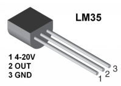

LM35温度传感器可以根据不同的温度产生不同的电压，当温度为0°C时输出0V；如果增加1°C，输出电压将增加10mv。输出温度为0 ~ 100，换算公式如下：

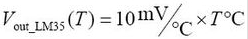

LM35的基本特性:

- ‌工作电压‌：4V至30V
- ‌输出电压‌：10mV/°C
- ‌测量范围‌：0°C至100°C
- ‌精度‌：在室温下为±1/4°C，在整个温度范围内为±3/4°C

---

**3. 实验组件：**

|  |||
| ------------------------ | ------------------------ | ---------------------------- |
| UNO R4 WiFi/Minima主板(二选一)| LM35 x1  |面包板 x1 |  
|||  |
|面包板跳线若干 | USB线 x1 |  | 

---

**4. 接线图：**

**原理图：**

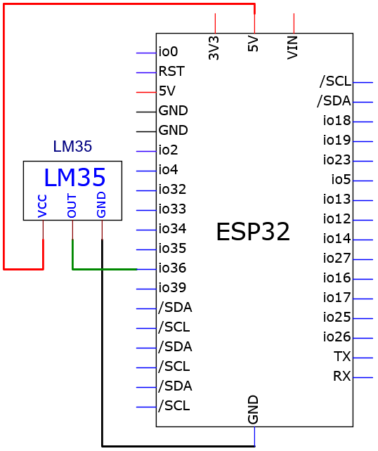

**实物接线图：**

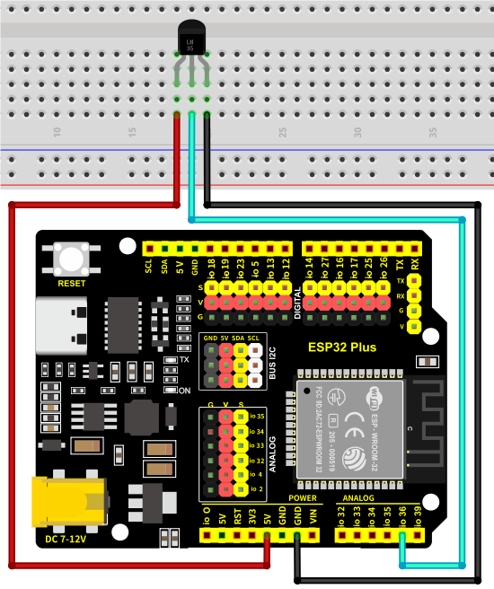

---

**5. 实验代码：** 

```python
'''
 * Filename    : LM35
 * Thonny      : Thonny 4.1.7
 * Auther      : http//www.keyestudio.com
'''
from machine import ADC, Pin
import time

# 开启并配置ADC，量程为0-5.0V
adc=ADC(Pin(36))
adc.atten(ADC.ATTN_11DB)
adc.width(ADC.WIDTH_12BIT)
conversion_factor = 5.0 / (4095)

# 每0.5秒读取一次ADC值，将ADC值转换为温度值输出;
# 并将这些数据打印到“Shell”
while True:
    adcVal=adc.read()
    reading = adcVal * conversion_factor 
    temperature = reading * 102.4 
    print(temperature)
    time.sleep(0.5)
```
---

**6. 实验结果：**

将 ESP32 主控板通过Micro USB数据线与计算机相连供电，单击，代码开始执行。“Shell”窗口将打印出LM35检测到当前所处环境下的温度值。


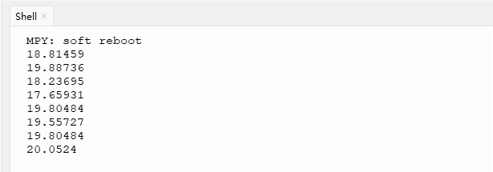

单击退出程序。

---

**7. 代码说明：**

可以参照前面项目的代码说明，这里就不多做介绍了。 

---


### 2-2-22 声音传感器

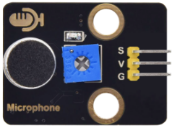

---

**1. 实验介绍：**

声音传感器是一种接收声波并将其转换为电信号的元件，它像麦克风一样检测周围环境中的声音强度。在本项目中，使用ESP32 主控板控制声音传感器，通过一个简单的代码来读取声音传感器检测声音强度的ADC值，DAC值和电压值并将其打印出来。

---

**2. 元件知识：**

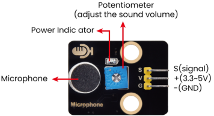

该声音传感器有一个对声音敏感的电容驻极体麦克风。声波使驻极体薄膜振动，电容发生变化，从而产生相应的电压变化。由于电压变化非常微弱，需要放大。利用LM358音频功率放大器芯片设计对高感度麦克风检测到的声音进行放大的电路，最大倍数为200倍。使用时我们可以通过旋转传感器上电位器，调节声音的放大倍数。顺时针调节电位器到尽头，放大倍数最大。原理图：

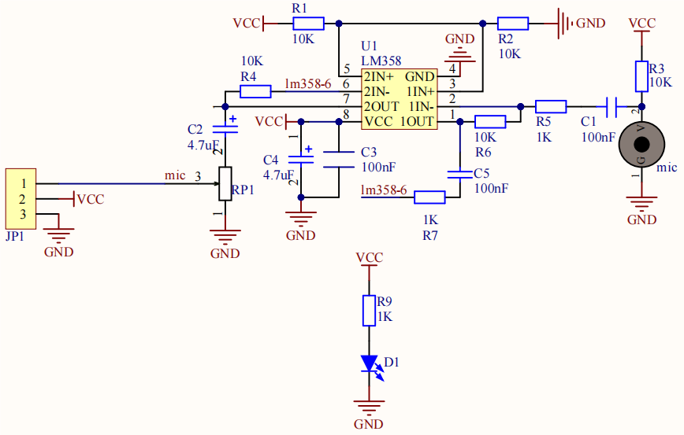

---

**3. 实验组件：**

|  |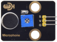|||
| ------------------------ | ------------------------ | ---------------------------- |---------------------------- |
| ESP32 主控板| 声音传感器 x1 |公对母杜邦线 若干 | Micro USB数据线 x1 |

---

**4. 接线图：**

**原理图：**

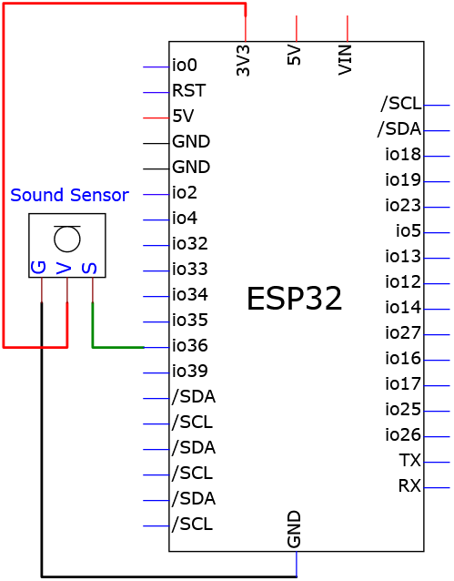

**实物接线图：**

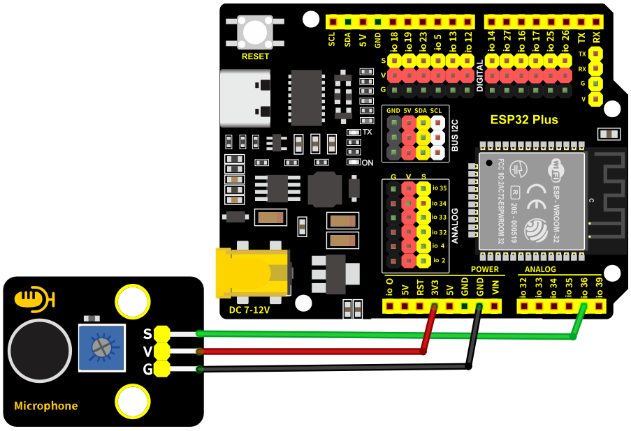

---

**5. 实验代码：** 

```c++
'''
 * Filename    : Sound_Sensor
 * Thonny      : Thonny 4.1.7
 * Auther      : http//www.keyestudio.com
'''
# 导入 Pin, ADC 和 DAC 库.
from machine import ADC,Pin,DAC
import time

# 打开并配置0-3.3V的ADC
adc=ADC(Pin(36))
adc.atten(ADC.ATTN_11DB)
adc.width(ADC.WIDTH_12BIT)

# 每0.1秒读取一次ADC值，将ADC值转换为DAC值和Voltage值并输出，
# 并将这些数据打印到“Shell”. 
try:
    while True:
        adcVal=adc.read()
        dacVal=adcVal//16
        voltage = adcVal / 4095.0 * 3.3
        print("ADC Val:",adcVal,"DACVal:",dacVal,"Voltage:",voltage,"V")
        time.sleep(0.1)
except:
    pass
```
---

**6. 实验结果：**

将 ESP32 主控板通过Micro USB数据线与计算机相连供电，单击，代码开始执行。“Shell”窗口将打印出声音传感器检测声音强度的ADC值、DAC值和电压值，当对着传感器拍拍手，其ADC值、DAC值和电压值都发生了显著的变化。

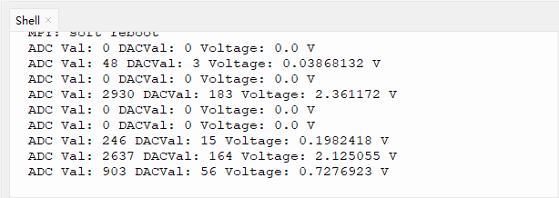

单击退出程序。

---

**8. 代码说明：**

可以参照前面的课程 2-2-17 的代码说明，这里就不多做介绍了。  

---

### 2-2-23 摇杆模块

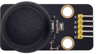

---

**1. 实验介绍：**

你看过游戏手柄吗？游戏手柄上有按键，还有摇杆。摇杆是什么工作原理呢？在我们这个套件中，就有一个摇杆模块，它的主要元件是PS2手柄摇杆。控制时，我们需要将模块的X引脚和Y引脚连接至单片机的模拟口。B引脚连接至单片机数字口，V引脚接至单片机电源输出端（3.3-5V），G引脚接单片机GND。通过读取两个模拟值和一个数字口的高低电平情况，可以判断模块上摇杆的工作状态。

---

**2. 元件知识：**

**摇杆模块：** 主要是采用PS2 手柄摇杆元件，实际上摇杆模块有3个信号端引脚，模拟3维空间，摇杆模块的引脚分别是GND、VCC、信号端（B、X、Y），其中信号端X、Y模拟空间的X轴和Y轴，控制时，模块的X、Y信号端是连接单片机模拟口，通过控制2个模拟输入值来控制物体在空间X、Y轴的坐标。信号端B模拟空间Z轴，它一般是接数字口，做按键使用。

VCC接单片机电源输出端V/VCC（3.3/5V），GND接单片机G/GND，原始状态下读出电压大约为1.65V/2.5V左右，对于X轴方向，当随箭头方向逐渐按下，读出电压值随着增加，且可以达到最大电压，随箭头相反方向逐渐按下，读出电压值逐渐减少，减少到最小电压；对于Y轴方向，当沿着模块上的箭头方向逐渐按下，读出电压值逐渐减少，减少到最小电压，随箭头相反方向逐渐按下，读出电压值随着增加，且可以达到最大电压；对于Z轴方向，信号端B接数字口，原始状态下输出0，按下输出1。这样，我们可以读取两个模拟值和一个数字口的高低电平情况，判断模块上摇杆的工作状态。

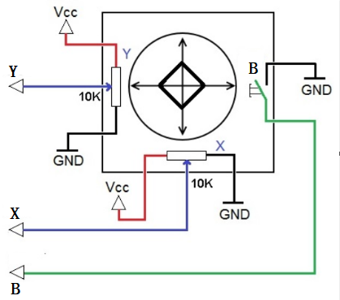

---

**3. 模块参数：**

- 工作电压: DC 3.3V~5V 
- 工作电流: 12mA
- 最大功率: 0.06W
- 输出信号: 信号端X、Y模拟电压输出(模拟信号)，信号端B是数字电平输出(数字信号) 
- 工作温度：-10°C ~ +50°C
- 尺寸：47.6mm x 23.8mm x 34.5mm
- 接口：2.54mm间距

---

**4. 模块原理图：**

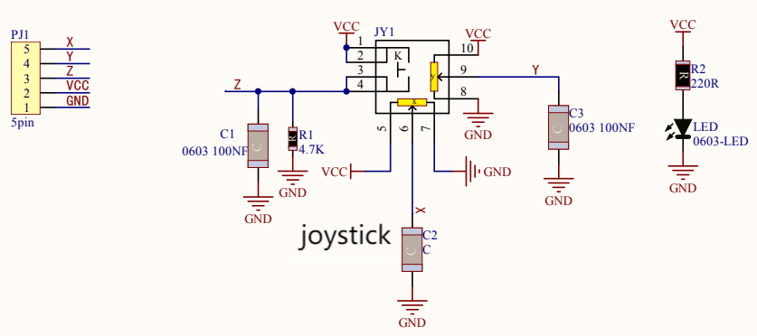

其实摇杆模块的原理非常简单，内部相当于两个可调电位器（左右和上下）和一个按键。按键没有按下时被R1下拉为低电平，按下时接通VCC即为高电平，与我们前面学习过的按键模块的电平值是相反的。摇动摇杆时内部的电位器就会根据摇杆的摇动调节，从而输出不同的电压，可以读取到模拟值。

---

**5. 实验组件：**

|  ||||
| ------------------------ | ------------------------ | ---------------------------- |---------------------------- |
|ESP32 主控板| 摇杆模块 x1| 公对母杜邦线 若干|Micro USB数据线 x1|

---

**6. 接线图：**

**原理图：**

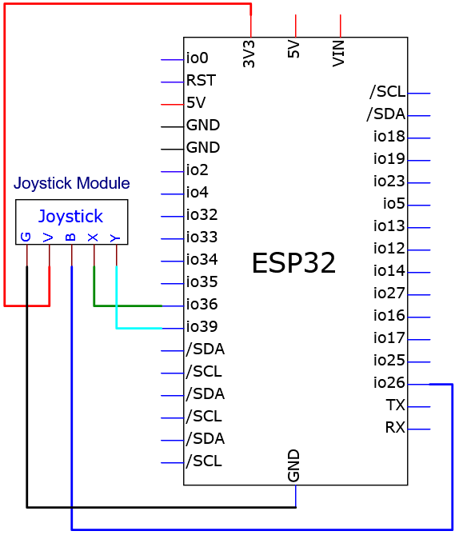


**实物接线图：**

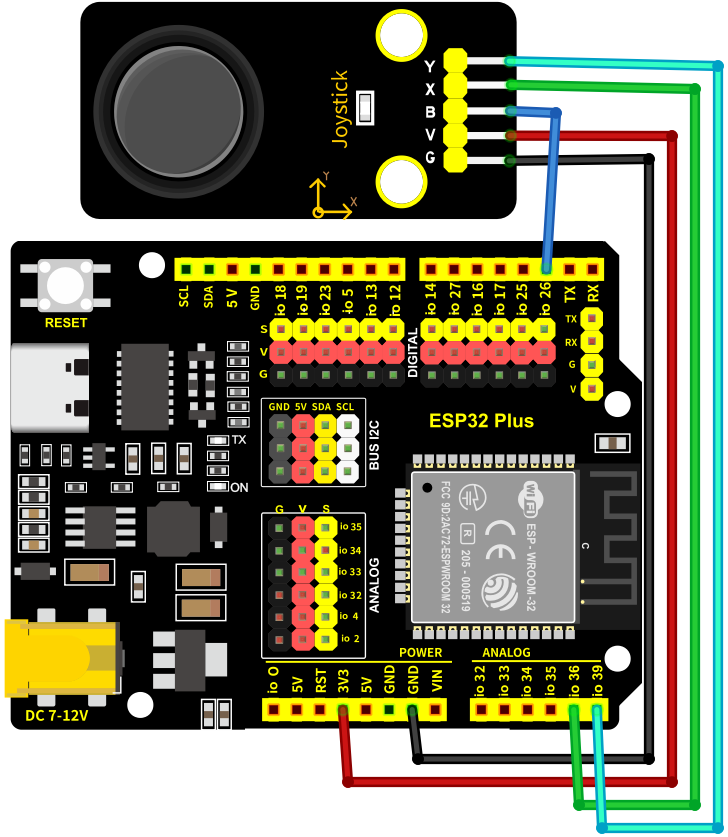

---

**7. 实验代码：** 

```python
'''
 * Filename    : Joystick
 * Thonny      : Thonny 4.1.7
 * Auther      : http//www.keyestudio.com
'''
from machine import Pin, ADC
import time

# 初始化摇杆模块(ADC函数)
rocker_x=ADC(Pin(36)) 
rocker_y=ADC(Pin(39))
button_z=Pin(26,Pin.IN,Pin.PULL_UP)

# 将两个ADC通道的电压采集范围设置为0-3.3V，
#，数据采集宽度为0-4095.
rocker_x.atten(ADC.ATTN_11DB)
rocker_y.atten(ADC.ATTN_11DB)
rocker_x.width(ADC.WIDTH_12BIT)
rocker_y.width(ADC.WIDTH_12BIT)
 
# 在代码中，将Z_Pin配置为上拉输入模式。
# 在loop()中，使用Read()读取X轴和Y轴的值
# 和使用value()来读取Z轴的值，然后显示它们.
while True:
    print("X,Y,Z:",rocker_x.read(),",",rocker_y.read(),",",button_z.value())
    time.sleep(0.5)
```
---

**8. 实验结果：**

将 ESP32 主控板通过Micro USB数据线与计算机相连供电，单击，代码开始执行。“Shell”窗口将打印出摇杆X轴(X引脚)和Y轴(Y引脚)对应的ADC值以及Z轴(B引脚)对应的数字值，当对着传感器拍拍手，其ADC值、DAC值和电压值都发生了显著的变化。移动摇杆或按下它将改变“Shell”窗口中的ADC值和数字值。当按下摇杆时，Button值为1；未按下摇杆时，Button值为0。X值的范围由0增长到4095。Y值的范围由0增长到4095。


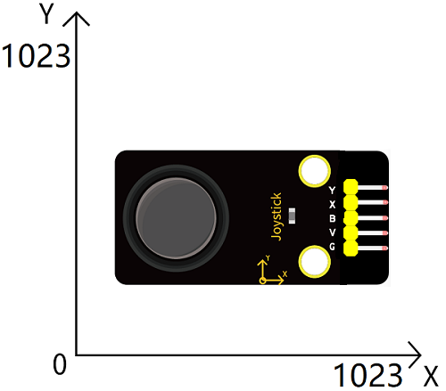

在X轴上移动摇杆，使数据从小到大。

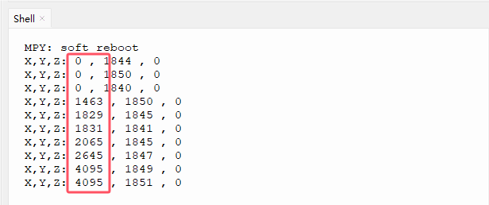

在Y轴上移动摇杆，使数据从小到大。

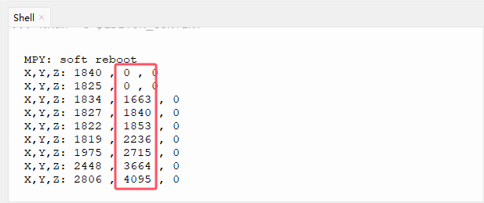

按下摇杆。

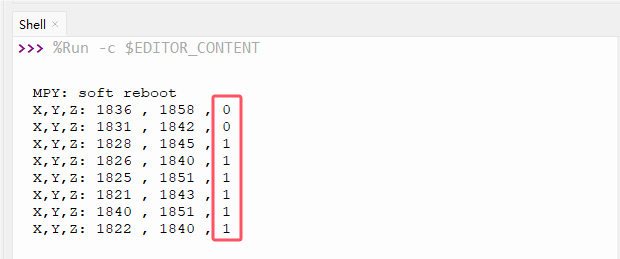

单击退出程序。

---

**9. 代码说明：**

可以参照前面的课程 2-2-14 和 2-2-17 的代码说明，这里就不多做介绍了。  

---

### 2-2-24 检测温湿度

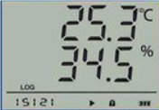

---

**1. 实验介绍：**

DHT11温湿度传感器是一款低价的入门级温湿度传感器，可以用来检测空气中的湿度和温度，其信号传输距离可达20米以上，具有超快响应、抗干扰能力强、性价比极高等优点。

---

**2. 元件知识：**

**DHT11温湿度传感器：** 是一款含有已校准数字信号输出的温湿度复合传感器，其精度湿度±5%RH，温度±2℃，湿度量程5 ~ 95%RH，温度量程-25 ~ +60℃。温湿度传感器应用专用的数字模块采集技术和温湿度传感技术，确保产品具有极高的可靠性和卓越的长期稳定性。温湿度传感器包括一个电阻式感湿元件和一个NTC测温元件，非常适用于对精度和实时性要求不高的温湿度测量场合。

**DHT11温湿度传感器的单总线格式定义：**

|名称 |单总线格式定义 |
| :--: | :--: |
| 起始信号 | 微处理器把数据总线(SDA)拉低一段时间至少 18ms(最大不得超过 30ms)，通知传感器准备数据。 | 
| 响应信号| 传感器把数据总线（SDA）拉低 83µs，再接高 87µs 以响应主机的起始信号。 |
| 湿度 | 湿度高位为湿度整数部分数据，湿度低位为湿度小数部分数据 |
| 温度 | 温度高位为温度整数部分数据，温度低位为温度小数部分数据，且温度低位 Bit8 为 1 则表示负温度，否则为正温度 |
| 校验位 | 校验位＝湿度高位+湿度低位+温度高位+温度低位 |

**DHT11温湿度传感器数据时序图：**

用户主机（MCU）发送一次开始信号后，DHT11温湿度传感器从低功耗模式转换到高速模式，待主机开始信号结束后，DHT11温湿度传感器发送响应信号，送出 40bit 的数据，并触发一次信采集。信号发送如图所示。

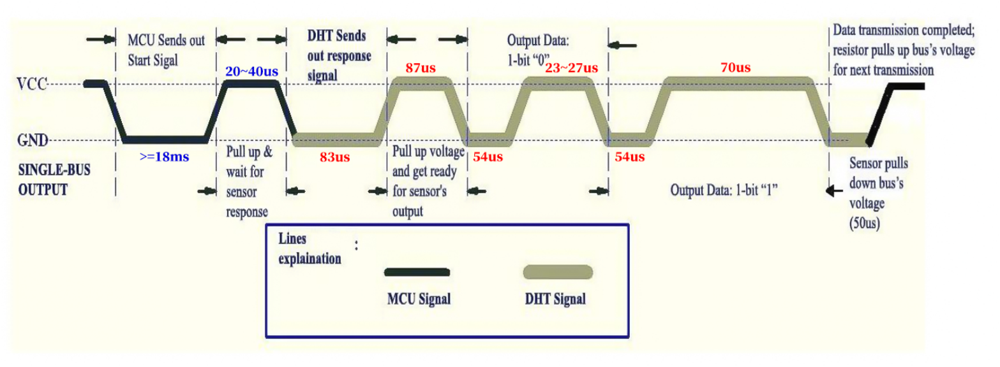 

单片机与 DHT11之间的通讯和同步,采用单总线数据格式,一次通讯时间4ms左右,数据分小数部分和整数部分,具体格式在下面说明,当前小数部分用于以后扩展,现读出为零，操作流程：一次完整的数据传输为40bit，高位先出。

**数据格式：** 8bit湿度整数数据+8bit湿度小数数据+8bi温度整数数据+8bit温度小数数据+8bit校验和。

**8位校验和：** 8bit湿度整数数据+8bit湿度小数数据+8bi温度整数数据+8bit温度小数数据"相加所得结果的末8位。

结合示例代码，可以更好的理解。

DHT11温湿度传感器可以很容易地将温湿度数据添加到您的DIY电子项目中。它可以完美的应用到远程气象站，家庭环境控制系统，和农场或花园监测系统等中。

---

**3. 元器件参数：**

- 工作电压: DC 3.3V~5V 
- 工作电流: 2.1mA
- 最大功率: 0.015W
- 温度范围: -25 ~ +60°C (± 2℃)
- 湿度范围: 5 ~ 95%RH（25C°左右精度为±5%RH）

---

**4. 实验组件：**

|  |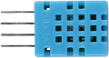|||
| ------------------------ | ------------------------ | ---------------------------- |
|ESP32 主控板|DHT11温湿度传感器 x1|面包板跳线若干| Micro USB数据线 x1|  
||| |
|面包板 x1|Micro USB数据线 x1|  |

---

**5. 接线图：**

**原理图：**

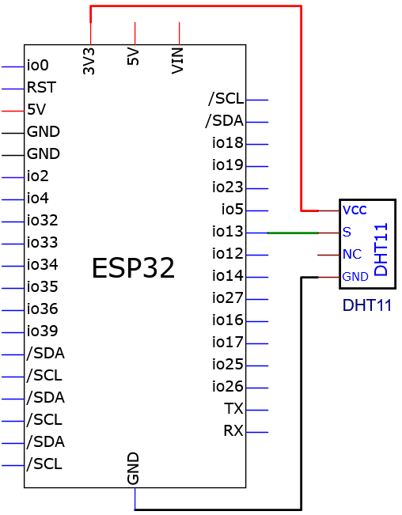


**实物接线图：**

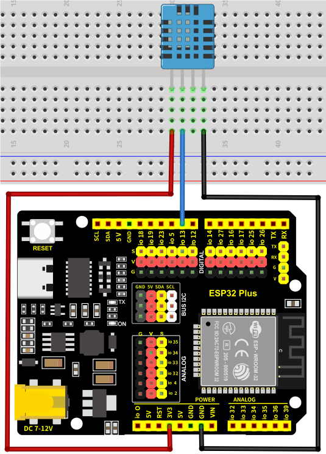

---

**6. 实验代码：**

```python
'''
 * Filename    : DHT11
 * Thonny      : Thonny 4.1.7
 * Auther      : http//www.keyestudio.com
'''
# 导入 machine, time 和 dht 库. 
import machine
import time
import dht

# 关联DHT11引脚(13).
DHT = dht.DHT11(machine.Pin(13))

# 每1秒获取一次温湿度数据，并打印出来. 
while True:
    DHT.measure() # 启动DHT11一次测量数据.
   # 调用DHT的内置函数来获取温度
   # 和湿度数据并打印在“Shell”中.
    print('temperature:',DHT.temperature(),'℃','humidity:',DHT.humidity(),'%')
    time.sleep_ms(1000)
```
---

**7. 实验结果：**

将 ESP32 主控板通过Micro USB数据线与计算机相连供电，单击，代码开始执行。“Shell”窗口将打印出DHT11温湿度传感器检测到当前环境的温湿度值。

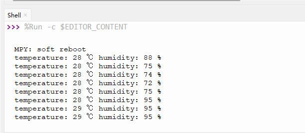

单击退出程序。

---

**8. 代码说明：**

1\. 导入 machine, time 和 dht 库。

```python
import machine
import time
import dht
```
2\. 关联DHT11引脚(13)。

```python
DHT = dht.DHT11(machine.Pin(13))
```
3\. 每0.5秒获取一次温湿度数据，并在“Shell”窗口打印出来。

```python
while True:
    DHT.measure() # 启动DHT11一次测量数据.
   # 调用DHT的内置函数来获取温度
   # 和湿度数据并打印在“Shell”中.
    print('temperature:',DHT.temperature(),'℃','humidity:',DHT.humidity(),'%')
    time.sleep_ms(1000)
```

---

### 2-2-25 超声波测距

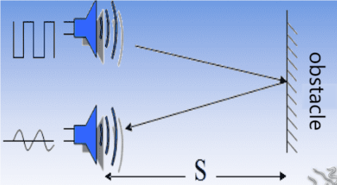

**1. 实验介绍：**

蝙蝠和某些海洋动物都能够利用高频率的声音进行回声定位或信息交流。它们能通过口腔或鼻腔把从喉部产生的超声波发射出去，利用折回的声波来定向，并判定附近物体的位置、大小以及是否在移动。超声波是一种频率高于20000赫兹的声波，它的方向性好，穿透能力强，易于获得较集中的声能，在水中传播距离远，可用于测距、测速、清洗、焊接、碎石、杀菌消毒等。在医学、军事、工业、农业上有很多的应用。超声波因其频率下限大于人的听觉上限而得名。科学家们将每秒钟振动的次数称为声音的频率，它的单位是赫兹(Hz)。

在这个套件中，有一个HC-SR04超声波传感器，它可以发送出一种频率很高的人类无法听到的超声波信号，这些超声波的信号碰到障碍物，就会立刻反射回来。在接收到返回的信息之后，根据发射信号和接收信号的时间差，计算出传感器和障碍物的详细距离，和蝙蝠飞行的原理一样。

---

**2. 模块参数：**

- 超声波传感器工作电压：DC 5V 
- 超声波传感器工作电流：15mA
- 超声波传感器工作频率：40Hz
- 超声波传感器射程范围：2cm~4m
- 超声波传感器测量角度：<= 15度
- 超声波传感器输入触发信号：10 uS 的TTL脉冲
- 超声波传感器输出回响信号：输出TTL电平信号与射程成正比
- 工作温度：-10°C ~ +50°C
- 超声波传感器尺寸：45.5mm x 26.7mm x 17.6mm

---

**3. 模块原理图：**

最常用的超声测距的方法是回声探测法。当有脉冲电压触发时（单片机给Trig引脚发送高电平），超声波发射器探头里的晶片就会振动，继而产生超声波。在超声波发射时刻的同时计数器开始计时，超声波在空气中传播，途中碰到障碍物面阻挡就立即反射回来（Echo引脚发送高电平信号给单片机），超声波接收器收到反射回的超声波就立即停止计时。

超声波是一种声波，其声速V与温度有关。一般情况下超声波在空气中的传播速度为340m/s，根据计时器记录的时间t，就可以计算出超声波探头发射点距障碍物面的距离s，即：s=340t/2 。

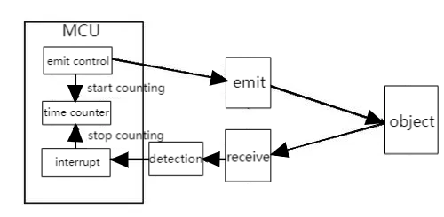


HC-SR04超声波测距模块可提供范围为2厘米至4米的非接触式距离感测功能，测距精度可达高到3mm。超声波传感器包括超声波发射器、超声波接收器与控制电路。其基本工作原理：

(1) 采用IO口Trig触发测距，给至少10us的高电平信号;

(2) 模块自动发送8个40khz的方波，自动检测是否有信号返回；

(3) 有信号返回，通过IO口Echo输出一个高电平，高电平持续的时间就是超声波从发射到返回的时间。

(4) 距离 =（高电平时间 x 声速（340M/S）） / 2

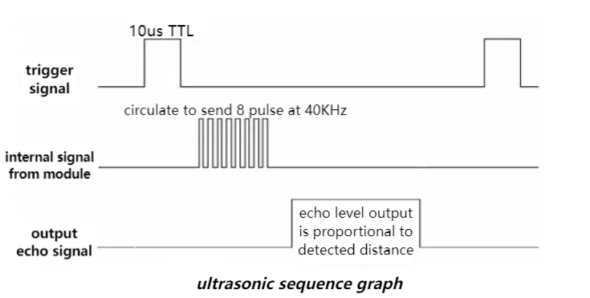

**注意:**

此模块不应在通电时连接，如有必要，先连接模块的 GND。否则，会影响模块的工作。

被测物体的面积应至少为 0.5 平方米，并尽可能平坦。否则，它会影响结果。


---

**4. 实验组件：**

|  |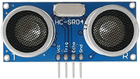|||
| ------------------------ | ------------------------ | ---------------------------- |---------------------------- |
|ESP32 主控板|超声波传感器 x1| 公对母杜邦线若干|  Micro USB数据线 x1|

---

**5. 接线图：**

**原理图：**

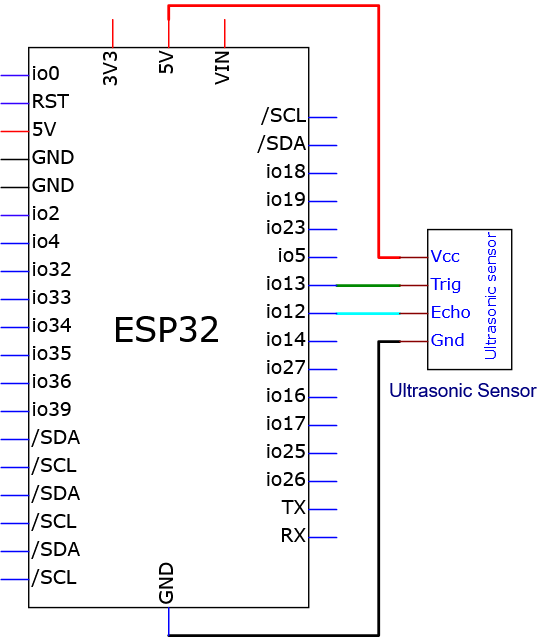


**实物接线图：**

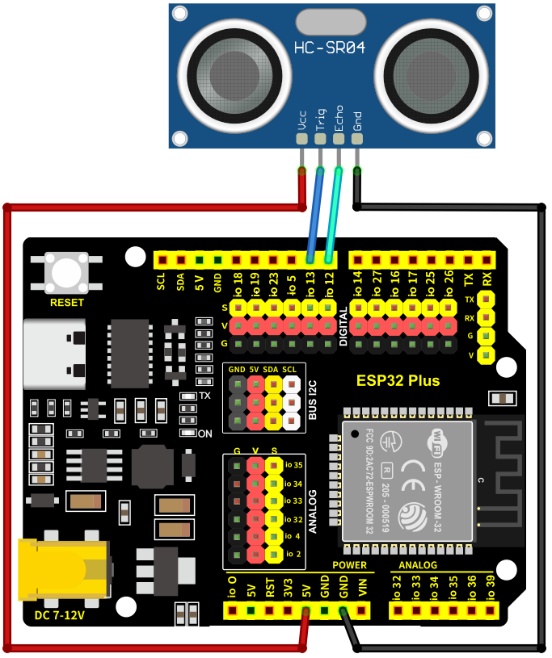

---

**6. 实验代码：**

```python
'''
 * Filename    : Ultrasonic
 * Thonny      : Thonny 4.1.7
 * Auther      : http//www.keyestudio.com
'''
from machine import Pin
import time

# 定义超声波测距模块的控制引脚
Trig = Pin(13, Pin.OUT, 0) 
Echo = Pin(12, Pin.IN, 0)

distance = 0 # 将初始距离定义为0
soundVelocity = 340 #Set the speed of sound.

# getDistance()函数用于驱动超声波模块测量距离，
# Trig保持高电平10us以启动超声波模块
# Echo.value()用于读取超声波模块Echo引脚的状态，
# 然后使用时间模块的time.sleep_us()函数计算Echo的持续时间,
# Trig引脚的高电平，根据时间计算测量距离并返回值。
def getDistance():
    Trig.value(1)
    time.sleep_us(10)
    Trig.value(0)
    while not Echo.value():
        pass
    pingStart = time.ticks_us()
    while Echo.value():
        pass
    pingStop = time.ticks_us()
    pingTime = time.ticks_diff(pingStop, pingStart) // 2
    distance = int(soundVelocity * pingTime // 10000)
    return distance

# 延时2秒，等待超声波模块稳定
# 打印每500毫秒从超声波模块获得的数据
time.sleep(2)
while True:
    time.sleep_ms(500)
    distance = getDistance()
    print("Distance: ", distance, "cm")
```
---

**7. 实验结果：**

将 ESP32 主控板通过Micro USB数据线与计算机相连供电，单击，代码开始执行。放置障碍物在超声波传感器探头前感应，“Shell”窗口将打印出超声波传感器与障碍物之间的距离值。


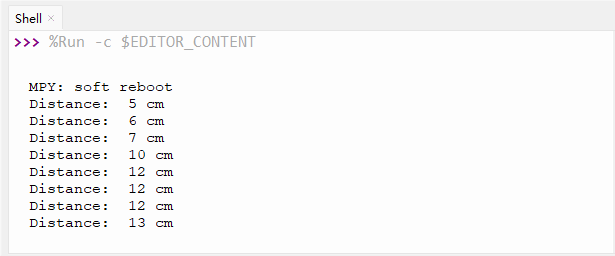

单击退出程序。

---

**8. 代码说明：**

1\. 关于超声波传感器的应用，我们可以直接查看 <span style="color: rgb(255, 76, 65);">getDistance()</span> 子函数。getDistance() 函数用于驱动超声波模块测量距离，Trig保持高电平10us以启动超声波模块；Echo.value()用于读取超声波模块Echo引脚的状态，然后使用时间模块的 <span style="color: rgb(255, 76, 65);">time.sleep_us()</span> 函数计算Echo的持续时间，Trig引脚的高电平，根据时间计算测量距离并返回值。

```python
def getDistance():
    Trig.value(1)
    time.sleep_us(10)
    Trig.value(0)
    while not Echo.value():
        pass
    pingStart = time.ticks_us()
    while Echo.value():
        pass
    pingStop = time.ticks_us()
    pingTime = time.ticks_diff(pingStop, pingStart) // 2
    distance = int(soundVelocity * pingTime // 10000)
    return distance
```

2\. 延时2秒，等待超声波模块稳定，打印每500毫秒从超声波模块获得的数据。

```python
time.sleep(2)
while True:
    time.sleep_ms(500)
    distance = getDistance()
    print("Distance: ", distance, "cm")
```
---

### 2-2-26 红外遥控与接收

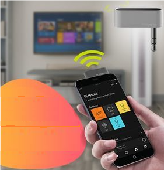

---

**1. 实验介绍：**

红外接收器是接收红外信号的元件，可以独立检测和输出与 TTL 电平兼容的信号。它的尺寸与普通的塑料封装晶体管相似，常用于红外遥控和红外传输等各种应用。

在这个项目中，我们将使用红外接收器来检测来自遥控器的信号。当按下遥控器上的按钮并且红外接收器接收到相应的信号时，它可以解码信号以确定按下了哪个按钮。通过解码接收到的信号，我们可以识别与其关联的特定键或命令。

红外接收器使我们能够将远程控制功能整合到我们的项目中，使我们能够使用红外信号与设备进行交互和控制。 

---

**2. 元件知识：**

**红外遥控器：** 是目前使用最广泛的一种通信和遥控手段，红外遥控是一种低成本、易于使用的无线通信技术。IR光与可见光非常相似，除了它的波长稍长一点。这意味着红外线是人眼无法检测到的，这对于无线通信来说是完美的。例如，当你按下电视遥控器上的一个按钮时，一个红外LED会以每秒38000次的频率反复开关，将信息(如音量或频道控制)传送到电视上的红外感光器。因红外线遥控装置具有体积小、功耗低、功能强、成本低等特点，录音机、音响设备、空凋机以及玩具等其它小型电器装置上纷纷采用红外线遥控。

红外遥控的发射电路是采用红外发光二极管发出经过调制的红外光波；红外接收电路由红外接收二极管、三极管或硅光电池组成，它们将红外发射器发射的红外光转换为相应的电信号，再送到后置放大器。

我们使用的遥控器如下所示，该红外遥控器是采用NEC编码的。

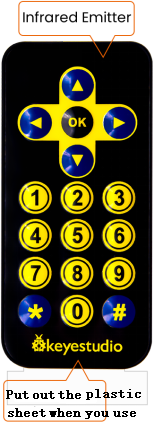

- 尺寸：86x40x7mm
- 遥控范围：8-10m左右
- 电池：3V纽扣式锂锰电池
- 红外载波频率：38KHz
- 有效寿命：20000次以上

**红外接收器：** 是VS1838B红外接收传感器元件，可以接收红外光，所以可以用它来检测红外遥控器发出的红外光信号。

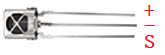

- S ：信号输出
- GND(-) ：GND
- VCC(+) ：电源，3.3V~5V

红外接收器是集接收、放大、解调一体的器件，将接收到的红外光信号在其内部IC就已经完成了解调（将红外光信号转换回二进制），输出的就是数字信号，然后将信息传递给微控制器。它可接收标准38KHz调制的遥控器信号。

红外信号调制过程图：

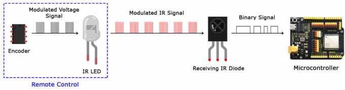

- 可用于远程控制
- 宽工作电压：2.7~5V
- 用于 PCM 频率的内部滤波器
- TTL 和 CMOS 兼容性
- 抗干扰能力强 

---

**4. 实验组件：**

|  ||||
| ------------------------ | ------------------------ | ---------------------------- |---------------------------- |
| ESP32 主控板| 红外接收器 x1  |面包板 x1 |面包板跳线若干 |
|||  |   |
|红外遥控器 x1 | Micro USB数据线 x1 | 10KΩ电阻 x1 |   |

---

**5. 接线图：**

**原理图：**

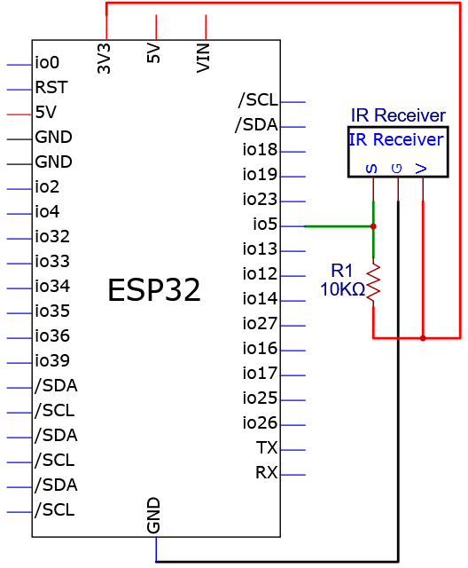

**实物接线图：**

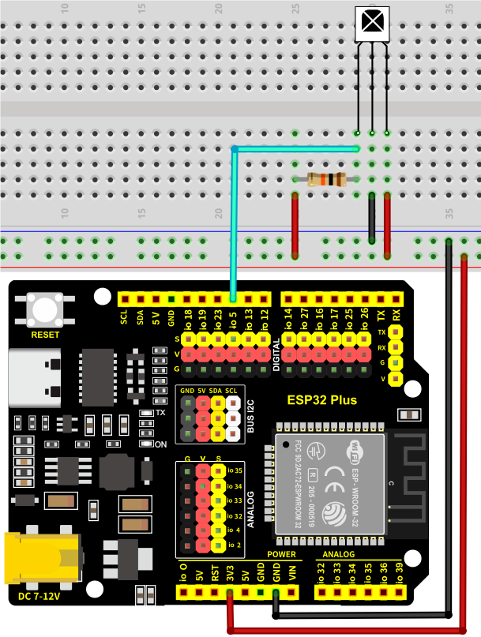

---

**6. 实验代码：** 

```python
'''
 * Filename    : IR_Receiver
 * Thonny      : Thonny 4.1.7
 * Auther      : http//www.keyestudio.com
'''
# 导入红外解码器的库.
from irrecvdata import irGetCMD

# 将红外接收器与GPIO5关联.
recvPin = irGetCMD(5)

# 当获得红外遥控的键值时，在“Shell”中打印出来. 
try:
    while True:
        irValue = recvPin.ir_read() # 调用ir_read()来读取遥控器上按键的值并将其赋值给irValue.
        if irValue:
            print(irValue)
except:
    pass
```
---

**7. 实验结果：**

找到红外遥控器，拔出绝缘片。将 ESP32 主控板通过Micro USB数据线与计算机相连供电，单击 运行代码，若代码运行不成功，并且“Shell”窗口出现报错提示信息。

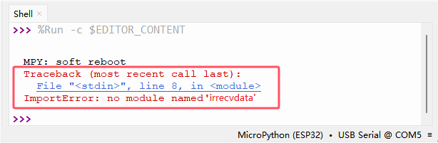

需要添加库文件，请回到 **2-1-7 添加 MicroPython 库(重要)** 处参照其说明添加库，也可以点击 **[添加 MicroPython 库](   )** 跳转到 **2-1-7 添加 MicroPython 库(重要)** 处参照其说明添加库文件。

再次单击 运行代码，代码开始执行。对准红外接收器的接收头，按下红外遥控器上的任意按键，红外接收器的接收头接收到信号后，“Shell”窗口将打印出当前接收到的按键值。

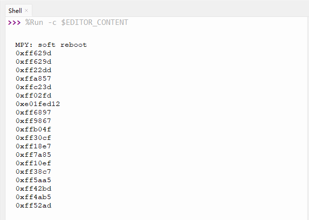

单击退出程序。

Keyestudio遥控器上每一个按键都对应着一个按键值，如下图所示。

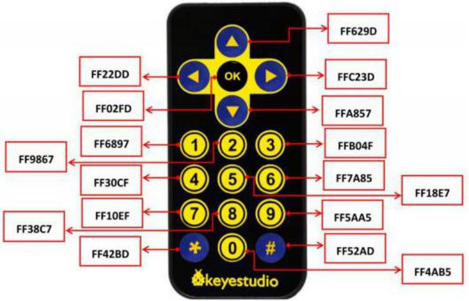

---

**8. 代码说明：**

1\. 导入红外解码器的库.

```python
from irrecvdata import irGetCMD
```
2\. 将红外接收器与GPIO5关联.。

```python
recvPin = irGetCMD(5)
```
3\. 调用ir_read()来读取所按键的值并将其赋值给IRValue；当获得红外遥控的键值时，在“Shell”中打印出来.

```python
try:
    while True:
        irValue = recvPin.ir_read() # 调用ir_read()来读取所按键的值并将其赋值给IRValue.
        if irValue:
            print(irValue)
except:
    pass
```
---

### 2-2-27 薄膜4*4矩阵键盘


---

**1. 实验介绍：**

在本项目中，我们将来学习如何使用键盘。键盘可应用于各种设备，包括手机、传真机、微波炉等，它通常用于用户输入。

---

**2. 元件知识：**

**薄膜4*4矩阵键盘：** 矩阵键盘是一种集成了许多键的设备。如下图所示，一个4x4矩阵键盘集成了16个键。

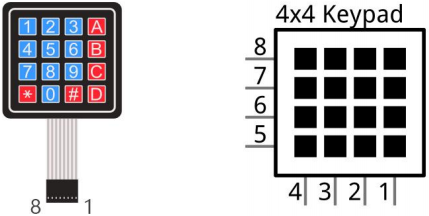
      
类似于一个 LED 矩阵的集成，4x4矩阵键盘有每行键连接一个引脚，这是相同的列。这种有效的连接减少了所需的处理器端口数量，矩阵键盘的内部电路如下所示。

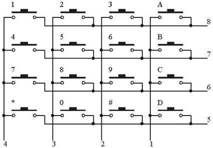

使用方法类似于矩阵LED，即使用行扫描或列扫描方法检测每列或每行上的键的状态。以列扫描法为例，向第1列(Pin1)发送低电平，检测第5、6、7、8行电平状态，判断A、B、C、D键是否按下。然后依次将低电平发送到列2、3、4，检测是否有其它键被按下。然后，你可以获得所有键的状态。

---

**3. 实验组件：**

|  ||||
| ------------------------ | ------------------------ | ---------------------------- |---------------------------- |
| ESP32 主控板| 薄膜4*4矩阵键盘 x1|面包板跳线若干 |Micro USB数据线 x1 |

---

**4. 接线图：**

**原理图：**

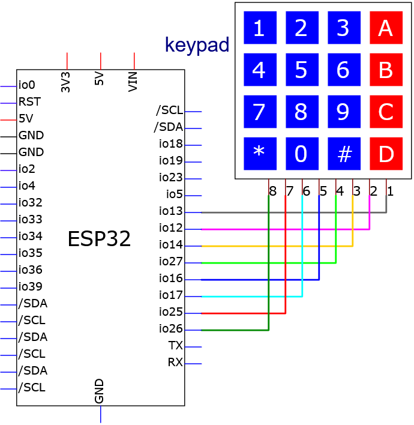

**实物接线图：**

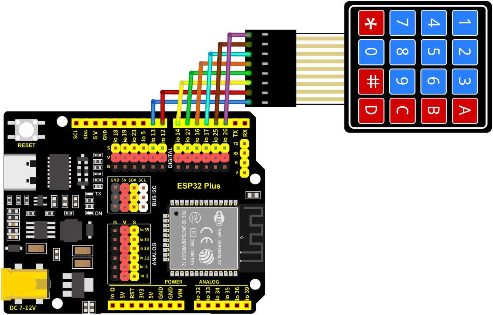

---

**5. 实验代码：** 

```python
'''
 * Filename    : 4x4_Keypad
 * Thonny      : Thonny 4.1.7
 * Auther      : http//www.keyestudio.com
'''
# 导入 keypad 库.
from keypad import KeyPad
import time

# 将键盘模块与ESP32引脚关联. 
keyPad = KeyPad(26, 25, 17, 16, 27, 14, 12, 13)

# 调用keyPad.scan()函数来获取所按键的值。一旦得到，就在“Shell”窗口打印出来. 
def key():
    keyvalue = keyPad.scan()
    if keyvalue != None:
        print(keyvalue, end="\t")
        time.sleep_ms(300)
        return keyvalue
            
while True: 
    key()
```
---

**6. 实验结果：**

将 ESP32 主控板通过Micro USB数据线与计算机相连供电，单击 运行代码，若代码运行不成功，并且“Shell”窗口出现报错提示信息。

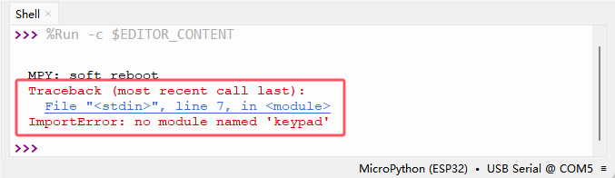

需要添加库文件，请回到 **2-1-7 添加 MicroPython 库(重要)** 处参照其说明添加库，也可以点击 **[添加 MicroPython 库](   )** 跳转到 **2-1-7 添加 MicroPython 库(重要)** 处参照其说明添加库文件。

再次单击 运行代码，代码开始执行。按下薄膜4*4矩阵键盘上的按键，“Shell”窗口将打印出对应的键值。

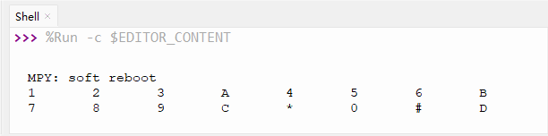

单击退出程序。

---

**7. 代码说明：**

1\. 导入 keypad 和 time 库。

```python
from keypad import KeyPad
import time
```
2\. 将薄膜4*4矩阵键盘与ESP32引脚关联。

```python
keyPad = KeyPad(26, 25, 17, 16, 27, 14, 12, 13)
```
3\. 调用keyPad.scan()函数来获取所按键的值。一旦得到，就在“Shell”窗口打印出来. 

```python
def key():
    keyvalue = keyPad.scan()
    if keyvalue != None:
        print(keyvalue, end="\t")
        time.sleep_ms(300)
        return keyvalue
            
while True:
    key()
```
---

### 2-2-28 I2C 128×32 LCD

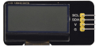

---

**1. 实验介绍：**

在生活中，我们可以利用显示器等模块来做各种实验。你也可以DIY各种各样的小物件。例如，用一个温度传感器和显示器做一个温度测试仪，或者用一个超声波模块和显示器做一个距离测试仪。下面，我们将使用LCD_128X32_DOT模块作为显示器，将其连接到ESP32 主控板上。将使用ESP32 主控板控制LCD_128X32_DOT显示屏显示各种英文文字、常用符号和数字，等等。

---

**2. 实验组件：**

|  |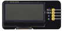|||
| ------------------------ | ------------------------ | ---------------------------- |---------------------------- |
|ESP32 主控板|LCD_128X32_DOT模块 x1| 母对母杜邦线若干|Micro USB数据线 x1|

---

**3. 元件知识：**

**LCD_128X32_DOT：** 一个像素为128*32的液晶屏模块，它的驱动芯片为ST7567A。模块使用IIC通信方式，它不仅可以显示英文字母、符号，还可以显示中文文字和图案。使用时，还可以在代码中设置，让英文字母和符号等显示不同大小。

**LCD_128X32_DOT原理图：**

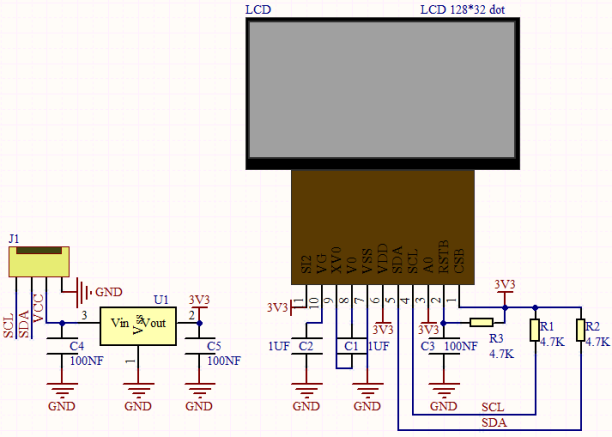

**LCD_128X32_DOT技术参数：**

- 显示像素：128*32 字符
- 工作电压：DC 5V
- 工作电流：100mA (5V)
- 模块最佳工作电压：5V
- 亮度、对比度可通过程序指令控制

---

**4. 接线图：**

**原理图：**

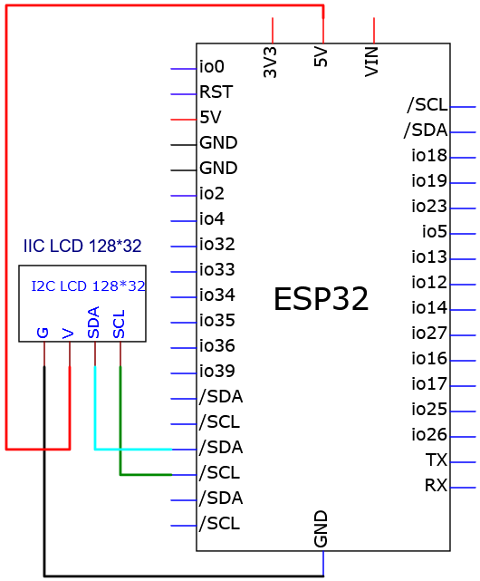

**实物接线图：**

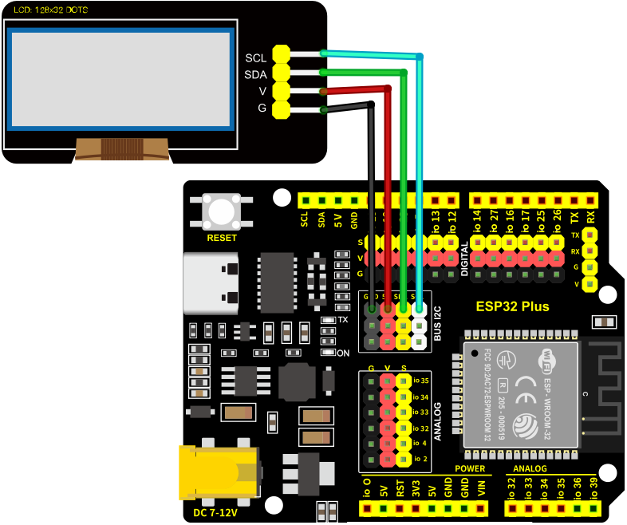

---

**5. 实验代码：**

```python
'''
 * Filename    : I2C_128_32_LCD
 * Thonny      : Thonny 4.1.7
 * Auther      : http//www.keyestudio.com
'''
# 导入machine,time,lcd128_32_fonts和lcd128_32库
import machine
import time
import lcd128_32_fonts
from lcd128_32 import lcd128_32

# i2c配置引脚和地址等.
clock_pin = 22
data_pin = 21
bus = 0
i2c_addr = 0x3f
use_i2c = True

def scan_for_devices():
    i2c = machine.I2C(bus,sda=machine.Pin(data_pin),scl=machine.Pin(clock_pin))
    devices = i2c.scan()
    if devices:
        for d in devices:
            print(hex(d))
    else:
        print('no i2c devices')

if use_i2c:
    scan_for_devices()
    lcd = lcd128_32(data_pin, clock_pin, bus, i2c_addr)


lcd.Clear()

lcd.Cursor(0, 4)
lcd.Display("KEYESTUDIO")
lcd.Cursor(1, 0)
lcd.Display("ABCDEFGHIJKLMNOPQR")
lcd.Cursor(2, 0)
lcd.Display("123456789+-*/<>=$@")
lcd.Cursor(3, 0)
lcd.Display("%^&(){}:;'|?,.~\\[]")
'''
while True:
    # scan_for_devices()
    time.sleep(0.5)
'''
```
---

**6. 实验现象：**

将 ESP32 主控板通过Micro USB数据线与计算机相连供电，单击 运行代码，若代码运行不成功，并且“Shell”窗口出现报错提示信息。

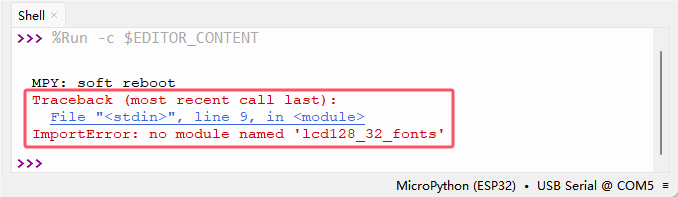

需要添加库文件，请回到 **2-1-7 添加 MicroPython 库(重要)** 处参照其说明添加库，也可以点击 **[添加 MicroPython 库](   )** 跳转到 **2-1-7 添加 MicroPython 库(重要)** 处参照其说明添加库文件。

再次单击 运行代码，代码开始执行。128X32LCD模块显示屏第一行显示“KEYESTUDIO”、第二行显示“ABCDEFGHIJKLMNOPQR”、第三行显示“123456789+-*/<>=$@”、第四行显示“%^&(){}:;'|?,.~\\[]”。


单击退出程序。

---

**7. 代码说明：**

1\. 导入machine,time,lcd128_32_fonts和lcd128_32库。

```python
import machine
import time
import lcd128_32_fonts
from lcd128_32 import lcd128_32
```
2\. i2c配置引脚和地址等。

```python
clock_pin = 22
data_pin = 21
bus = 0
i2c_addr = 0x3f
use_i2c = True
```
---

### 2-2-29 OLED

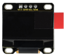

---

**1. 实验介绍：**

OLED（有机发光二极管）显示模块是一种使用有机材料在薄而灵活的屏幕上显示文本、图形和图像的设备，有机材料在施加电流时会发光。

OLED 显示器的主要优点是它会发出自己的光，不需要其他背光源。因此，与 LCD 显示器相比，OLED 显示器通常具有更好的对比度、亮度和视角。

OLED 显示器的另一个重要特性是深黑电平。由于每个像素在 OLED 显示器中都会发出自己的光，因此为了产生黑色，可以关闭单个像素。

由于功耗较低（只有被点亮的像素才会消耗电流），OLED 显示器在智能手表、健康追踪器和其他可穿戴设备等电池供电设备中也很受欢迎。 

---

**2. 元件知识：**


**OLED：** 是有机发光二极管，又称为有机点激光显示。OLED显示技术具有自发光特性，它采用非常薄的有机材料涂层和玻璃基板，当有电流通过时，这些有机材料就会发光。OLED显示模块由OLED面板和安装在模块背面的OLED驱动芯片组成。OLED 面板由许多微小的像素组成，可以产生不同颜色的光。每个像素由夹在两个电极（阳极和阴极）之间的几层有机材料组成。当电流流过电极时，有机材料会根据其成分发出不同波长的光。

OLED 使用的SSD1306芯片驱动是一种可以使用称为 I2C（内部集成电路）的串行通信协议来控制 OLED 面板像素的芯片。OLED的尺寸是0.96寸，分辨率是128*96像素，也就是屏幕上有128列，64行像素，显示颜色是蓝色。

OLED 驱动芯片将来自 Arduino 的信号转换为 OLED 面板的命令。Arduino 可以使用可以控制 I2C 协议的库将数据发送到 OLED 驱动芯片。Adafruit SSD1306 库就是这样一个库。使用此库，您可以初始化 OLED 显示模块、设置亮度级别、打印文本、图形或图像等。 

**模块参数：**

- 工作电压：DC 3.3V-5V
- 工作电流：30mA
- 接口：间距为2.54mm 的排针接口
- 通信方式：I2C通信
- 内部驱动芯片：SSD1306
- 分辨率：128*64
- 可视角度：大于150°

---

**3. 实验组件：**

|  ||||
| ------------------------ | ------------------------ | ---------------------------- |---------------------------- |
|ESP32主控板 x1|OLED x1| 母对母杜邦线若干|  USB线 x1|
  
---

**4. 接线图：**

**原理图：**

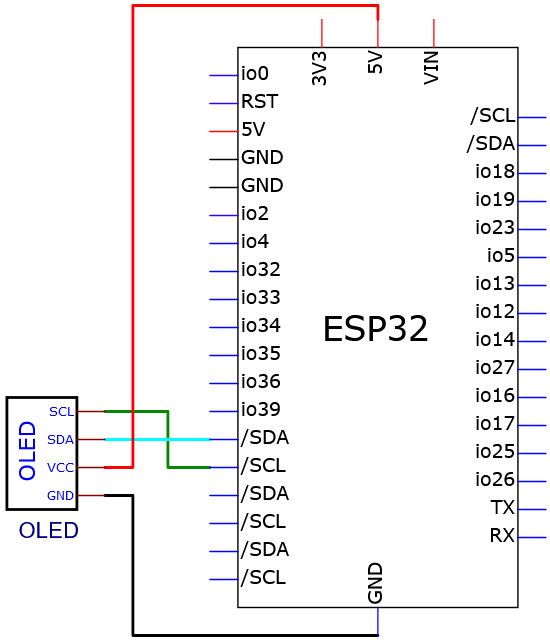

**实物接线图：**

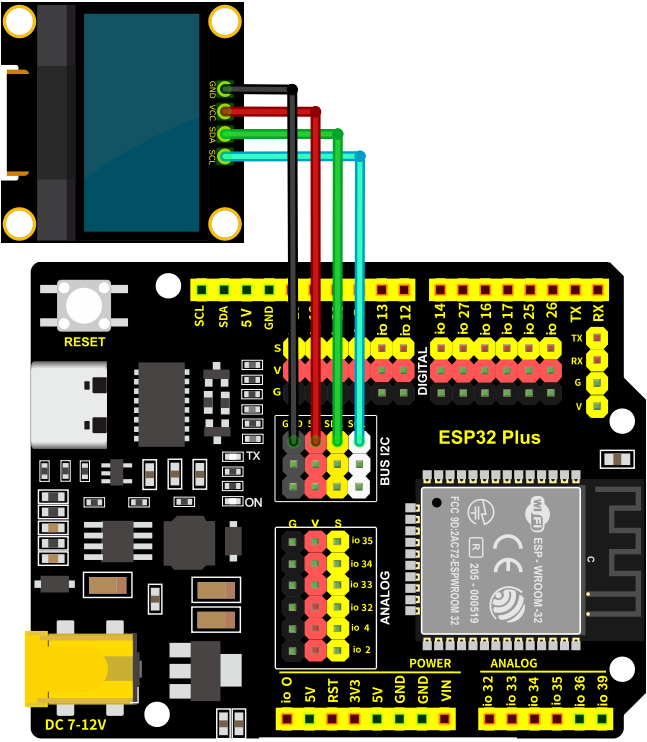

---

**5. 实验代码：**

```python
'''
 * Filename    : OLED 
 * Thonny      : Thonny 4.1.7
 * Auther      : http//www.keyestudio.com
'''
# Import Pin, SoftI2C, ssd1306, sleep libraries
from machine import Pin, SoftI2C
import ssd1306
from time import sleep
import gfx

# ESP32 Pin assignment 
i2c = SoftI2C(scl=Pin(22), sda=Pin(21))

# Set the width, height and i2c of the OLED
oled_width = 128
oled_height = 64
oled = ssd1306.SSD1306_I2C(oled_width, oled_height, i2c)

graphics = gfx.GFX(oled_width, oled_height, oled.pixel)

screen1_row1 = "Screen 1, row 1"
screen1_row2 = "Screen 1, row 2"
screen1_row3 = "Screen 1, row 3"

screen2_row1 = "Screen 2, row 1"
screen2_row2 = "Screen 2, row 2"

screen3_row1 = "Screen 3, row 1"

screen1 = [[0, 0 , screen1_row1], [0, 16, screen1_row2], [0, 32, screen1_row3]]
screen2 = [[0, 0 , screen2_row1], [0, 16, screen2_row2]]
screen3 = [[0, 40 , screen3_row1]]

# Scroll in screen horizontally from left to right
def scroll_in_screen(screen):
  for i in range (0, oled_width+1, 4):
    for line in screen:
      oled.text(line[2], -oled_width+i, line[1])
    oled.show()
    if i!= oled_width:
      oled.fill(0)

# Scroll out screen horizontally from left to right
def scroll_out_screen(speed):
  for i in range ((oled_width+1)/speed):
    for j in range (oled_height):
      oled.pixel(i, j, 0)
    oled.scroll(speed,0)
    oled.show()

# Continuous horizontal scroll
def scroll_screen_in_out(screen):
  for i in range (0, (oled_width+1)*2, 1):
    for line in screen:
      oled.text(line[2], -oled_width+i, line[1])
    oled.show()
    if i!= oled_width:
      oled.fill(0)

# Scroll in screen vertically
def scroll_in_screen_v(screen):
  for i in range (0, (oled_height+1), 1):
    for line in screen:
      oled.text(line[2], line[0], -oled_height+i+line[1])
    oled.show()
    if i!= oled_height:
      oled.fill(0)

# Scroll out screen vertically
def scroll_out_screen_v(speed):
  for i in range ((oled_height+1)/speed):
    for j in range (oled_width):
      oled.pixel(j, i, 0)
    oled.scroll(0,speed)
    oled.show()

# Continous vertical scroll
def scroll_screen_in_out_v(screen):
  for i in range (0, (oled_height*2+1), 1):
    for line in screen:
      oled.text(line[2], line[0], -oled_height+i+line[1])
    oled.show()
    if i!= oled_height:
      oled.fill(0)

while True:
    
  oled.text('Hello, World 1!', 0, 0)
  oled.text('Hello, World 2!', 0, 10)
  oled.text('Hello, World 3!', 0, 20)
  oled.text('Hello, World 4!', 0, 30)
  oled.text('Hello, World 5!', 0, 40)
  oled.text('Hello, World 6!', 0, 50)       
  oled.show()
  sleep(2)
  oled.fill(0)
  
  # Scroll in, stop, scroll out (horizontal)
  scroll_in_screen(screen1)
  sleep(2)
  scroll_out_screen(4)

  scroll_in_screen(screen2)
  sleep(2)
  scroll_out_screen(4)

  scroll_in_screen(screen3)
  sleep(2)
  scroll_out_screen(4)

  # Continuous horizontal scroll
  scroll_screen_in_out(screen1)
  scroll_screen_in_out(screen2)
  scroll_screen_in_out(screen3)

  # Scroll in, stop, scroll out (vertical)
  scroll_in_screen_v(screen1)
  sleep(2)
  scroll_out_screen_v(4)

  scroll_in_screen_v(screen2)
  sleep(2)
  scroll_out_screen_v(4)

  scroll_in_screen_v(screen3)
  sleep(2)
  scroll_out_screen_v(4)

  # Continuous verticall scroll
  scroll_screen_in_out_v(screen1)
  scroll_screen_in_out_v(screen2)
  scroll_screen_in_out_v(screen3)

 # Draw a Line
  graphics.line(0, 0, 127, 20, 1)
  oled.show()
  sleep(1)
  oled.fill(0)

  # Draw a Rectangle
  graphics.rect(10, 10, 50, 30, 1)
  oled.show()
  sleep(1)
  oled.fill(0)

  # Draw a Filled Rectangle
  graphics.fill_rect(10, 10, 50, 30, 1)
  oled.show()
  sleep(1)
  oled.fill(0)

  # Draw a Circle
  graphics.circle(64, 32, 10, 1)
  oled.show()
  sleep(1)
  oled.fill(0)

  # Draw a Filled Circle
  graphics.fill_circle(64, 32, 10, 1)
  oled.show()
  sleep(1)
  oled.fill(0)

  # Draw a Triangle
  graphics.triangle(10,10,55,20,5,40,1)
  oled.show()
  sleep(1)
  oled.fill(0)

  # Draw a Filled Triangle 
  graphics.fill_triangle(10,10,55,20,5,40,1)
  oled.show()
  sleep(1)
  oled.fill(0)

```
---

**6. 实验现象：**

将 ESP32 主控板通过Micro USB数据线与计算机相连供电，单击 运行代码，若代码运行不成功，并且“Shell”窗口出现报错提示信息。

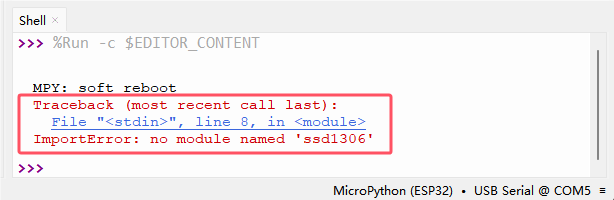

需要添加库文件，请回到 **2-1-7 添加 MicroPython 库(重要)** 处参照其说明添加库，也可以点击 **[添加 MicroPython 库](   )** 跳转到 **2-1-7 添加 MicroPython 库(重要)** 处参照其说明添加库文件。

再次单击 运行代码，代码开始执行后，OLED屏以各种形式显示字符串和显示各种图形。


单击退出程序。


**注意：如果上传完代码，OLED显示屏未显示任何信息，可以尝试按下 ESP32 主板上的RESET按键。**

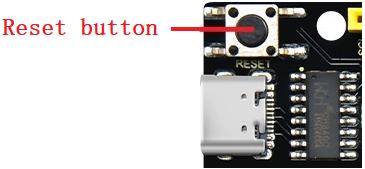

---

**8. 代码说明：**

1\. 导入Pin,SoftI2C,ssd1306,sleep,gfx 库.

```python
from machine import Pin, SoftI2C
import ssd1306
from time import sleep
import gfx
```
2\. ESP32引脚分配。

```python
i2c = SoftI2C(scl=Pin(22), sda=Pin(21))
```
3\. 设置OLED的宽度、高度和i2c。

```python
oled_width = 128
oled_height = 64
oled = ssd1306.SSD1306_I2C(oled_width, oled_height, i2c)
```
4\. OLED 清屏.

```python
oled.fill(0)
```
5\. 设置在OLED指定的位置显示相关内容。

```python
oled.text('Hello, World 1!', 0, 0)
oled.text('Hello, World 2!', 0, 10)
oled.text('Hello, World 3!', 0, 20)
oled.text('Hello, World 4!', 0, 30)
oled.text('Hello, World 5!', 0, 40)
oled.text('Hello, World 6!', 0, 50)
        
oled.show()
```
6\. 水平滚动函数 scroll_in_screen(screen), 是滚动整个屏幕的内容（从左到右）。 

```python
def scroll_out_screen(speed):
  for i in range ((oled_width+1)/speed):
    for j in range (oled_height):
      oled.pixel(i, j, 0)
    oled.scroll(speed,0)
    oled.show()
```
- 此函数接受列表列表作为参数。例如：

```python
screen1 = [[0, 0 , screen1_row1], [0, 16, screen1_row2], [0, 32, screen1_row3]]
```
- 列表的每个列表都包含 x 坐标、y 坐标和消息 <span style="color: rgb(255, 76, 65);">[x，y，message]</span>。

- 例如，我们将在第一个屏幕上显示三行，其中包含以下消息。

```python
screen1_row1 = "Screen 1, row 1"
screen1_row2 = "Screen 1, row 2"
screen1_row3 = "Screen 1, row 3"
```
- 要使屏幕从左向右滚动，您只需调用 <span style="color: rgb(255, 76, 65);">scroll_in_screen()</span> 函数并将列表列表作为参数传递：

```python
scroll_in_screen(screen1)
```

7\. 水平滚动，要使屏幕滚动出去，您可以使用 <span style="color: rgb(255, 76, 65);">scroll_out_screen(speed)</span> 功能将整个屏幕滚动出 OLED。它接受一个控制滚动速度的数字作为参数。速度必须是 <span style="color: rgb(255, 76, 65);">128 (oled_width)</span>. 

```python
def scroll_out_screen(speed):
  for i in range ((oled_width+1)/speed):
    for j in range (oled_height):
      oled.pixel(i, j, 0)
    oled.scroll(speed,0)
    oled.show()
```
8\. 连续水平滚动. 如果您想连续地进出屏幕，您可以改用 <span style="color: rgb(255, 76, 65);">scroll_screen_in_out(screen)</span> 功能。 

```python
def scroll_screen_in_out(screen):
  for i in range (0, (oled_width+1)*2, 1):
    for line in screen:
      oled.text(line[2], -oled_width+i, line[1])
    oled.show()
    if i!= oled_width:
      oled.fill(0)
```

9\. 垂直滚动函数 <span style="color: rgb(255, 76, 65);">scroll_in_screen_v（screen）</span>，在整个屏幕的内容中滚动。 

```python
def scroll_in_screen_v(screen):
  for i in range (0, (oled_height+1), 1):
    for line in screen:
      oled.text(line[2], line[0], -oled_height+i+line[1])
    oled.show()
    if i!= oled_height:
      oled.fill(0)
```
10\. 垂直滚动. 您可以使用 <span style="color: rgb(255, 76, 65);">scroll_out_screen_v(speed)</span> 功能垂直滚动屏幕。与 horizontal 函数类似，它接受滚动速度作为参数，该滚动速度必须是 <span style="color: rgb(255, 76, 65);">64 (oled_height)</span> 的数字. 

```python
def scroll_out_screen_v(speed):
  for i in range ((oled_height+1)/speed):
    for j in range (oled_width):
      oled.pixel(j, i, 0)
    oled.scroll(0,speed)
    oled.show()
```
11\. 连续垂直滚动.如果要连续垂直进出屏幕，可以使用 <span style="color: rgb(255, 76, 65);">scroll_in_out_screen_v(screen)</span> 功能。 

```python
def scroll_screen_in_out_v(screen):
  for i in range (0, (oled_height*2+1), 1):
    for line in screen:
      oled.text(line[2], line[0], -oled_height+i+line[1])
    oled.show()
    if i!= oled_height:
      oled.fill(0)
```
12\. 创建一个GFX对象来绘制形状, 它接受绘图区域的宽度和高度作为参数。我们想要绘制整个OLED，除了需要传递OLED的宽度和高度，还应该传递一个绘制像素的显示函数作为参数，在我们的例子中是 <span style="color: rgb(255, 76, 65);">oled.pixel</span> 。

```python
graphics = gfx.GFX(oled_width, oled_height, oled.pixel)
```
13\. 绘制线条. 可以在 <span style="color: rgb(255, 76, 65);">gfx</span> 对象上使用 <span style="color: rgb(255, 76, 65);">line(x0, y0, x1, y1, color)</span> 方法来创建一条线。<span style="color: rgb(255, 76, 65);">(x0, y0)</span> 坐标表示直线的起点，<span style="color: rgb(255, 76, 65);">(x1, y1)</span> 坐标表示直线的终点。您总是需要调用 <span style="color: rgb(255, 76, 65);">OLED. show()</span> 才能在OLED上实际显示形状。 

```python
graphics.line(0, 0, 127, 20, 1)
oled.show()
```
14\. 要绘制矩形，可以在 <span style="color: rgb(255, 76, 65);">gfx</span> 对象上使用 <span style="color: rgb(255, 76, 65);">rect(x0, y0, width, height, color)</span> 方法。<span style="color: rgb(255, 76, 65);">(x0, y0)</span> 坐标表示矩形的左上角。然后，您需要指定矩形的宽度、高度和颜色。

```python
graphics.rect(10, 10, 50, 30, 1)
oled.show()
```
15\. 要绘制实心矩形, 可以使用 <span style="color: rgb(255, 76, 65);">fill_rect(x0, y0, width, height, color)</span> 方法来绘制填充矩形。此方法接受与 <span style="color: rgb(255, 76, 65);">drawRect()</span> 相同的参数。 

```python
graphics.fill_rect(10, 10, 50, 30, 1)
oled.show()
```
16\. 使用 <span style="color: rgb(255, 76, 65);">circle(x0, y0, radius, color)</span> 方法画一个圆, <span style="color: rgb(255, 76, 65);">(x0, y0)</span> 坐标表示圆心.

```python
graphics.circle(64, 32, 10, 1)
oled.show()
```
17\. 使用 <span style="color: rgb(255, 76, 65);">fill_circle(x0, y0, radius, color)</span> 方法绘制一个填充的圆。

```python
graphics.fill_circle(64, 32, 10, 1)
oled.show()
```
18\. 使用 <span style="color: rgb(255, 76, 65);">(x0, y0, x1, y1, x2, y2，color)</span> 方法画一个三角形，接受每个角的坐标和颜色作为参数。

```python
graphics.triangle(10,10,55,20,5,40,1)
oled.show()
```
19\. 使用 <span style="color: rgb(255, 76, 65);">fill_triangle(x0, y0, x1, y1, x2, y2, color)</span> 方法绘制一个填充的三角形。

```python
graphics.fill_triangle(10,10,55,20,5,40,1)
oled.show()
```
---

### 2-2-30 RFID RC522

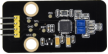

---

**1. 实验介绍：**

在这个套件中，有一个Keyestudio RFID刷卡模块。其模块上的RFIDRFID-RC522射频模块采用Philips MFRC522原装芯片设计读卡电路，使用方便，成本低廉，适用于设备开发、读卡器开发等高级应用的用户，也适用于需要进行射频卡终端设计/生产的用户。本模块可直接装入各种读卡器模具,通过IIC接口简单的2条线就可以直接与用户任何CPU主板或单片机相连接通信。

实验中用刷卡模块读取到的数据是4个16进制数，我们把这四个16进制数串以字符串的形式打印出来。例如：在实验中如果读取到的白色IC卡的数据为：0xE7、0xB9、0x65、0x65，则在串口监视器打印并显示的信息字符串就是E7 B9 65 65；如果读取到的钥匙扣的数据为：0xB4、0xB4、0xAA、0xDB，则在串口监视器打印并显示的信息字符串就是B4 B4 AA DB。有时候看到的不是两位数，是因为前面有个0省略了，如0a它显示的就是a。不同的IC卡和钥匙扣，其数据是不一样的。

---

**2. 模块参数：**

工作电压: DC 3.3V~5V

工作电流: 13~100mA /DC 5V 

空闲电流: 10~13mA /DC 5V

休眠电流: < 80uA

峰值电流: < 100mA

工作频率: 13.56MHz

最大功率: 0.5W

支持的卡类型：mifare1 S50、mifare1 S70、mifare UltraLight、mifare Pro、mifare Desfire

数据传输速率：最大10Mbit/s

工作温度：-10°C ~ +50°C

尺寸：47.6mm x 23.8mm x 9.3mm

接口：2.54mm间距，4pin防反接口

---

**3. 模块原理图：**

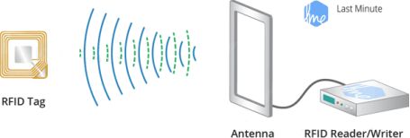

RFID（Radio Frequency Identification）：无线射频识别，读卡器由频射模块及高平磁场组成。Tag应答器为待感应设备，此设备不包含电池。他只包含微型集成电路芯片及存储数据的介质以及接收和发送信号的天线。读取tag中的数据，首先要放到读卡器的读取范围内。读卡器会产生一个磁场，因为磁能生电由楞次定律，RFID Tag就会供电，从而激活设备。

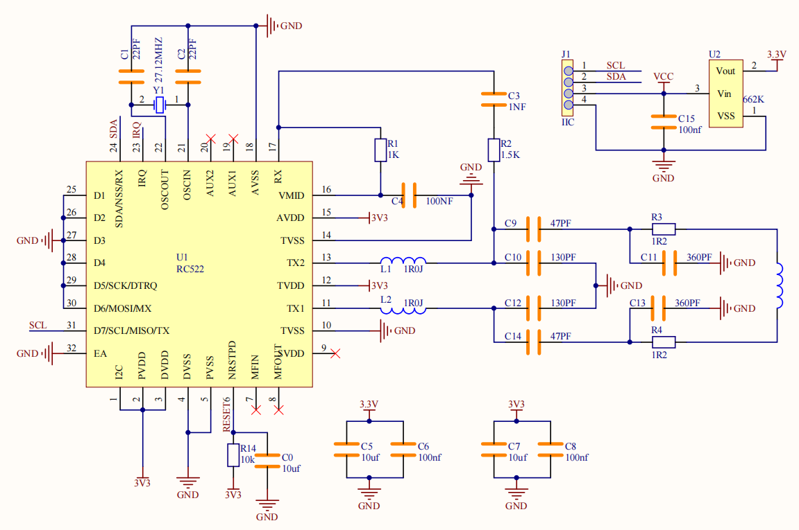

---

**4. 实验组件：**

|  | ||
| ------------------------ | ------------------------ | ---------------------------- |
|ESP32 主控板|RFID刷卡模块 x1    | 母对母杜邦线若干|
|||  |
|IC 磁卡/钥匙扣 x1| Micro USB数据线 x1 |  | 

---

**5. 接线图：**

**原理图：**

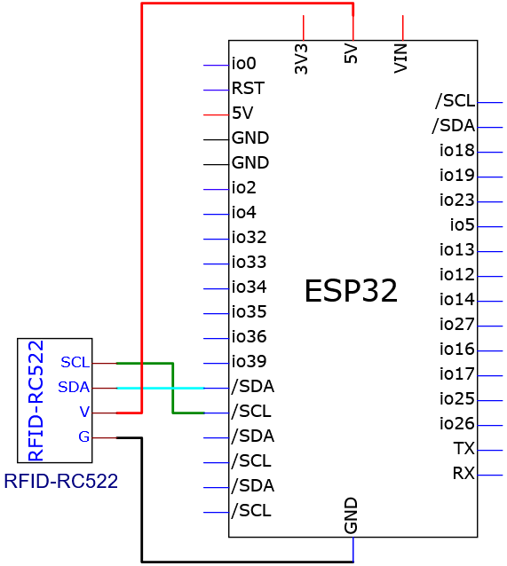

**实物接线图：**

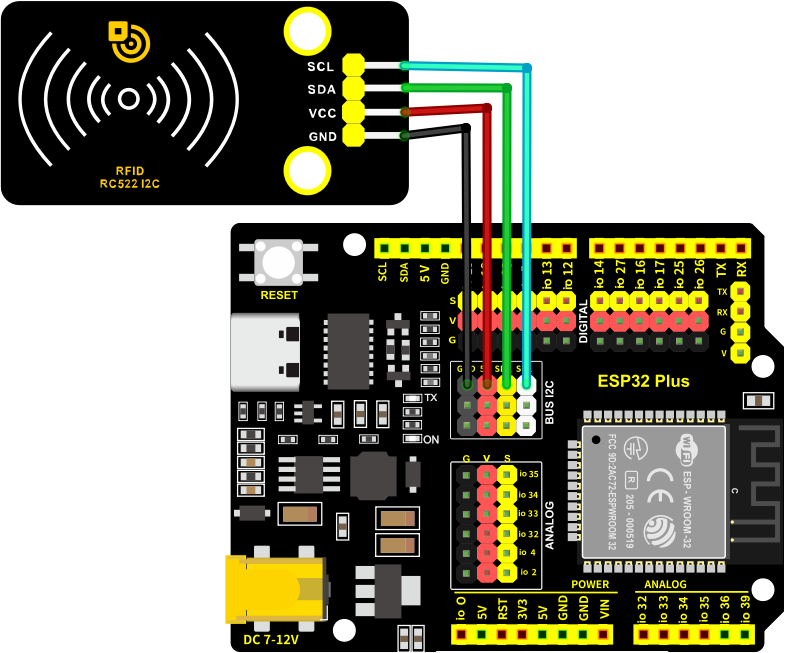

---

**6. 实验代码：**

```python
'''
 * Filename    : RFID_RC522 
 * Thonny      : Thonny 4.1.7
 * Auther      : http//www.keyestudio.com
'''
import machine
import time
from mfrc522_i2c import mfrc522

#i2c配置,RFID_RC522的地址和引脚
addr = 0x28
scl = 22
sda = 21
    
rc522 = mfrc522(scl, sda, addr)
rc522.PCD_Init()
rc522.ShowReaderDetails()  # 显示PCD - MFRC522读卡器的详细信息

while True:
    if rc522.PICC_IsNewCardPresent():
        if rc522.PICC_ReadCardSerial() == True:
            print("Card UID:")
            print(rc522.uid.uidByte[0 : rc522.uid.size])
    #time.sleep(1)
```
---

**7. 实验结果：**

将 ESP32 主控板通过Micro USB数据线与计算机相连供电，单击 运行代码，若代码运行不成功，并且“Shell”窗口出现报错提示信息。

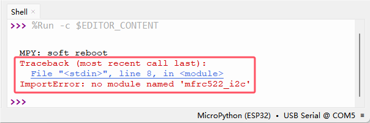

需要添加库文件，请回到 **2-1-7 添加 MicroPython 库(重要)** 处参照其说明添加库，也可以点击 **[添加 MicroPython 库](   )** 跳转到 **2-1-7 添加 MicroPython 库(重要)** 处参照其说明添加库文件。

再次单击 运行代码，代码开始执行。用IC卡和钥匙扣靠近RFID模块，“Shell”窗口将打印出RFID刷卡模块读取到的数据信息。

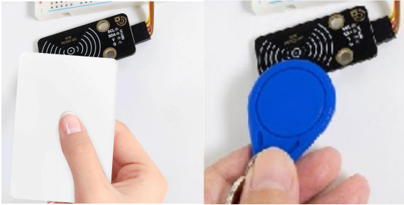

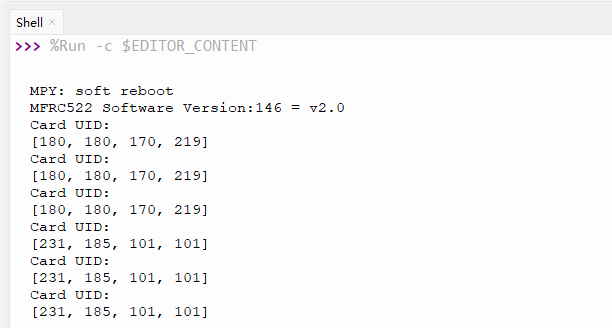

单击退出程序。

<span style="background:#ff0;color:#000">**注意：不同的IC卡和钥匙扣，其数据是不一样的。** 请记录下你的IC卡和钥匙扣的UID码，后面的课程会用到它们。</span>

**<span style="color: rgb(255, 76, 0);">特别提醒：</span> 如果打开串口监视器且设置好波特率，将白色IC卡或蓝色钥匙扣在RFID刷卡模块上的感应区感应时，“Shell”窗口还是没有显示IC卡或钥匙扣的UID码，可以尝试按下 ESP32 主控板上的RESET按键。**


---

**8. 代码说明:**

1\. 导入machine,time,mfrc522_i2c库。

```python
import machine
import time
from mfrc522_i2c import mfrc522
```
2\. i2c配置,定义RFID_RC522的地址和引脚。

```python
addr = 0x28
scl = 22
sda = 21
```
3\. 创建一个 <span style="color: rgb(255, 76, 0);">MFRC522</span> 类的新实例，它表示附加到MicroPython上的特定RFID模块。

```python
rc522 = mfrc522(scl, sda, addr)
```
4\. 初始化 <span style="color: rgb(255, 76, 0);">MFRC522</span>，显示PCD - MFRC522读卡器的详细信息.

```python
rc522.PCD_Init()
rc522.ShowReaderDetails() 
```
5/. MFRC522模块读取白色IC卡和绿色钥匙扣相关信息并且打印出来。

```c++
while True:
    if rc522.PICC_IsNewCardPresent():
        if rc522.PICC_ReadCardSerial() == True:
            print("Card UID:")
            print(rc522.uid.uidByte[0 : rc522.uid.size])
    #time.sleep(1)
```
---

### 2-2-31 两种晶体三极管


---

**1. 实验介绍**

本套件配备S8550和S8050两种晶体三极管，前者为PNP型，后者为NPN型。它们看起来很相似，我们需要仔细检查它们的标签。当高电平信号通过NPN晶体三极管时，它被通电。但是PNP需要一个低电平信号来导通它。两种类型的晶体管都经常用于无触点开关，就像在这个实验中一样。

让我们用LED和按钮来了解如何使用晶体管！

---

**2. 实验组件**

|  ||||
| ------------------------ | ------------------------ | ---------------------------- |---------------------------- |
| ESP32 主控板| 按键开关 x1  | 10KΩ电阻 x2  |1KΩ电阻 x1|
|| |||
|面包板 x1 |红色LED x1|面包板跳线若干 |Micro USB数据线 x1 |
||||   |
| 220Ω电阻 x1  | NPN型三极管(S8050) x1|PNP型三极管(S8550) x1|   |

---

**3. 接线图1：**

<span style="color: rgb(255, 76, 65);">连接 NPN（S8050）晶体三极管的的方式</span>

**原理图1：**

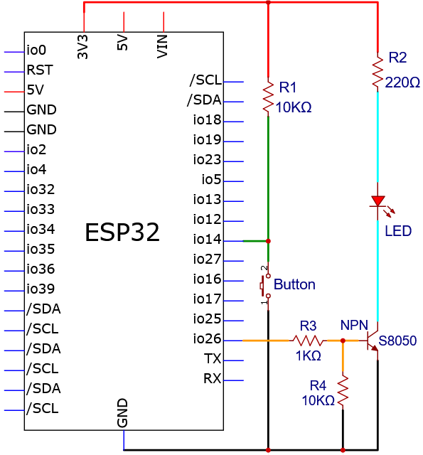

在此电路中，当按下按钮时，IO14 是 高电平。

通过编程 IO26 输出**高电平**，经过 1KΩ 限流电阻（保护晶体三极管），允许 **S8050（NPN晶体三极管）** 导通，从而使 LED 亮起。

**实物接线图1：**

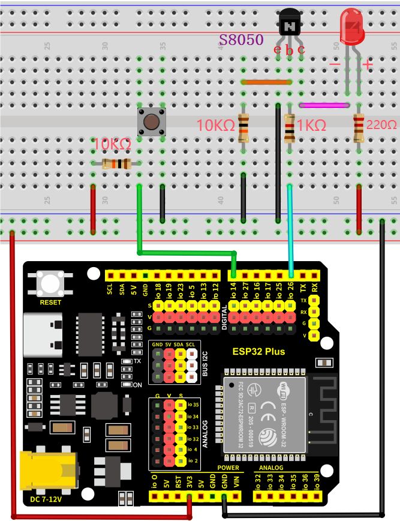

---

**4. 接线图2：**

<span style="color: rgb(255, 76, 65);">连接 PNP（S8550）晶体三极管的方式</span>

**原理图2：**

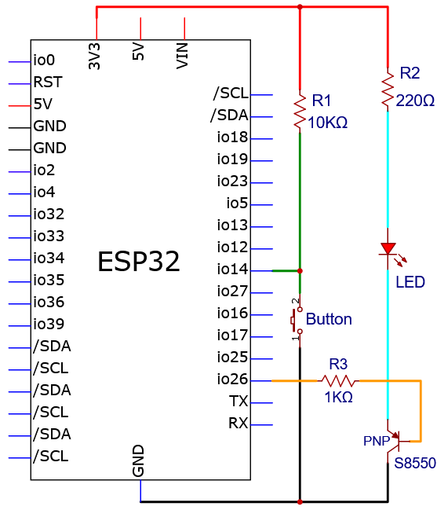

在此电路中，IO14 默认为低电平，当按下按钮时将变为高电平。

通过编程 IO26 输出**低电平**，在 1KΩ 限流电阻（以保护晶体三极管）之后，允许S8550（PNP晶体三极管）导通，从而使 LED 亮起。

这个电路和前一个电路之间的唯一区别是，在前一个电路中，LED 的阴极连接到 **S8050（NPN晶体三极管）**的**集电极**，而这个是连接到 **S8550（PNP晶体三极管）**的**发射极**。

**实物接线图2：**

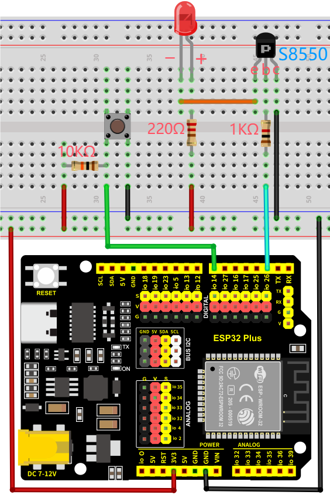

---

**5. 程序流程图：**

整个程序的流程图如下左图所示:

流程图是使用图形来表述程序思路的一种方法，直观形象，易于理解。常用的流程图符号，如下右图所示:

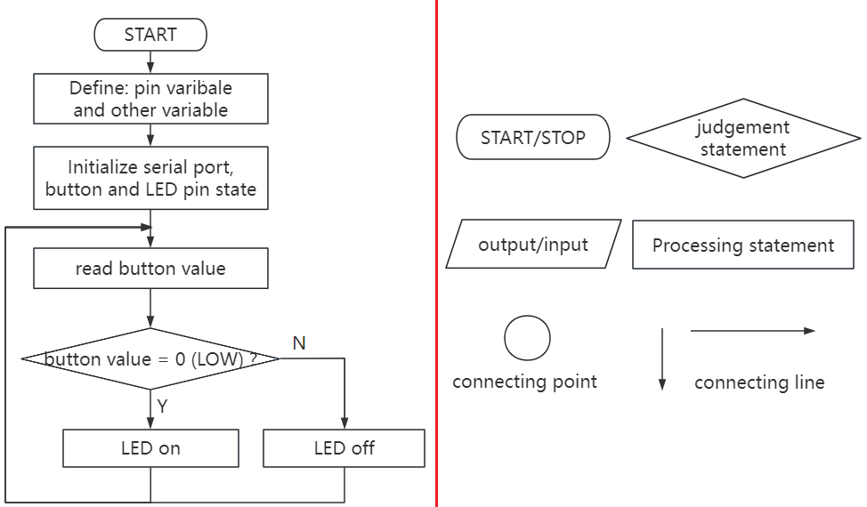

在后续的项目中，在编写程序之前，要养成绘制流程图的习惯，通过绘制流程图，可以帮助我们更好地厘清思路，从而顺利地编写出相应的程序。

---

**6. 实验代码**

```python
'''
 * Filename    : Two_Kinds_of_Transistors
 * Thonny      : Thonny 4.1.7
 * Auther      : http//www.keyestudio.com
'''
import machine

button = machine.Pin(14, machine.Pin.IN)   # Button
led = machine.Pin(26, machine.Pin.OUT)  # LED

# Start an infinite loop
while True:
    # Read the current value of the 'button' object (0 or 1) and store it in the 'button_status' variable
    button_status = button.value()
    # If the button is pressed (value is 0)
    if button_status == 0: 
        led.value(1) # Turn the LED on
    # If the button is not pressed (value is 1)
    else:
        led.value(0) # turn the LED off
```
---

**7. 实验结果**

用相同的代码可以控制两种类型的晶体三极管。当我们按下按键时，ESP32 主控板将向晶体三极管发送低电平信号；当我们释放它时，它会发送一个高电平信号。

将 ESP32 主控板通过Micro USB数据线与计算机相连供电，单击，代码开始执行。

- 使用S8050（NPN晶体三极管）的电路，在按下按键时，LED将亮起，表明其处于高电平导通状态；
- 使用S8550（PNP晶体管）的电路，当按键被释放时，LED将亮起，表明其处于低电平导通状态。

单击退出程序。

---

**8. 代码说明**

1\. 导入 machine 库.

```python
button = machine.Pin(14, machine.Pin.IN)   # Button
led = machine.Pin(26, machine.Pin.OUT)  # LED
```
2\. 定义按键和LED的引脚，及它们的引脚模式.

```python
button = machine.Pin(14, machine.Pin.IN)   # Button
led = machine.Pin(26, machine.Pin.OUT)  # LED
```
3\. 主循环，按键控制LED的亮灭状态.

```python
# Start an infinite loop
while True:
    # Read the current value of the 'button' object (0 or 1) and store it in the 'button_status' variable
    button_status = button.value()
    # If the button is pressed (value is 1)
    if button_status == 0: 
        led.value(1) # Turn the LED on
    # If the button is not pressed (value is 0)
    else:
        led.value(0) # turn the LED off
```
---

### 2-2-32 简易创作应答机


---

**1. 实验介绍：**

在智力竞赛节目中，特别是娱乐活动（如竞技答题活动），组织者经常使用蜂鸣器系统，以便准确、公平和直观地确定答题者的座位数。

现在系统的可以用数据来说明判断的准确性和公正性，提高了娱乐性。同时，它也更加公平和公正。在本项目中，我们将使用一些按键开关，无源蜂鸣器和RGB来制作一个简单的创造答录机系统。

---

**2. 实验组件：**

|  ||||
| ------------------------ | ------------------------ | ---------------------------- |---------------------------- |
| ESP32 主控板| 按键开关 x4  | 10KΩ电阻 x2  | 220Ω电阻 x3  |
|||||
|面包板 x1 |无源蜂鸣器 x1|面包板跳线若干 | Micro USB数据线 x1 |
||||  | 
|PGB LED x1  | NPN型三极管(S8050) x1| 1kΩ电阻 x1 |  | 

---

**3. 接线图：**

**原理图：**

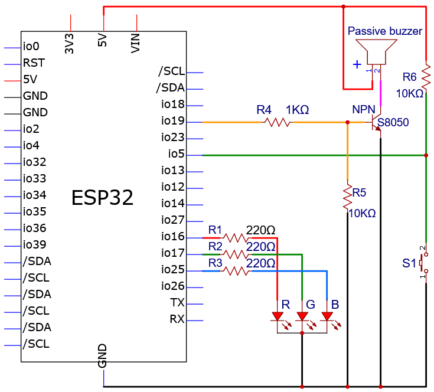

**实物接线图：**

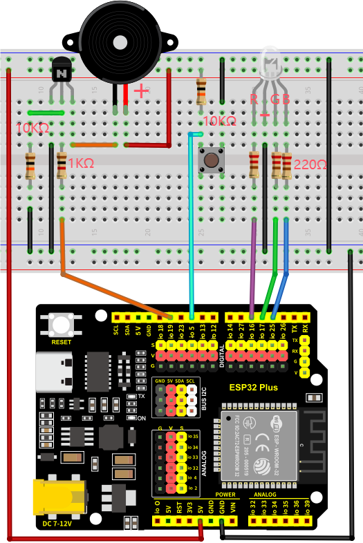

---

**4. 程序流程图：**

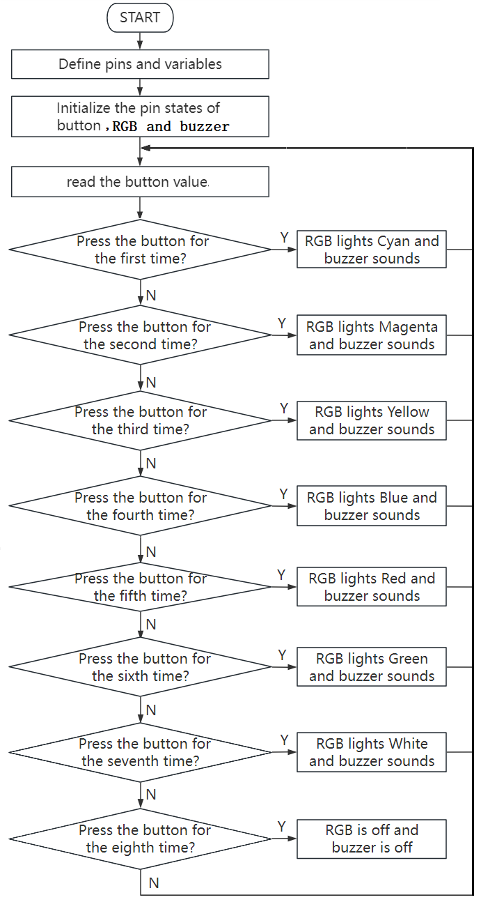

---

**5. 实验代码：**

```python
'''
 * Filename    : Simple_Creation-Answer_Machine
 * Thonny      : Thonny 4.1.7
 * Auther      : http//www.keyestudio.com
'''
from machine import Pin, PWM 
import machine
from time import sleep

led_R = Pin(16, Pin.OUT) # 创建引脚16为LED对象，设置引脚16为输出模式
led_R.value(0) 
led_G = Pin(17, Pin.OUT) # 创建引脚17为LED对象，设置引脚17为输出模式
led_G.value(0) 
led_B = Pin(25, Pin.OUT) # 创建引脚25为LED对象，设置引脚25为输出模式
led_B.value(0) 

# Define the GPIO pin that is connected to the buzzer
buzzer = machine.PWM(machine.Pin(19))
buzzer.duty_u16(0)

# 定义无源蜂鸣器发声的playtone函数
def playtone(frequency):
    buzzer.duty_u16(10000)
    buzzer.freq(frequency)
    
button1 = Pin(5, Pin.IN, Pin.PULL_UP) # 创建引脚5为按键对象,设置IO5为输入模式
flag = 0
Key = 0

def fun(button1):
    global flag
    if flag == 0:
      led_R.value(0)
      led_G.value(1)
      led_B.value(1)
      playtone(392)
      sleep(0.375)
    elif flag == 1:
      led_R.value(1)
      led_G.value(0)
      led_B.value(1)
      playtone(440)
      sleep(0.25)
    elif flag == 2:
      led_R.value(1)
      led_G.value(1)
      led_B.value(0)
      playtone(494) 
      sleep(0.125)
    elif flag == 3:
      led_R.value(0)
      led_G.value(0)
      led_B.value(1)
      playtone(349)
      sleep(0.5)
    elif flag == 4:
      led_R.value(1)
      led_G.value(0)
      led_B.value(0)
      playtone(330)
      sleep(0.625)
    elif flag == 5:
      led_R.value(0)
      led_G.value(1)
      led_B.value(0)
      playtone(294)
      sleep(0.75)
    elif flag == 6:
      led_R.value(1)
      led_G.value(1)
      led_B.value(1)
      playtone(262)
      sleep(1)
    else:
      led_R.value(0)
      led_G.value(0)
      led_B.value(0)
      buzzer.duty_u16(0)
    if flag < 7:
      flag = flag + 1
    else:
      flag = 0
button1.irq(fun,Pin.IRQ_FALLING)
```
---

**5. 实验结果：**

将 ESP32 主控板通过Micro USB数据线与计算机相连供电，单击，代码开始执行。每次按下按键时，RGB灯亮不同颜色灯，无源蜂鸣器播放不同的音调。


单击退出程序。

---

**6. 代码说明：**

1\. flag作为if的判断条件，原值为0，当满足while里的if语句，flag=1，即为找到x满足if语句的条件，然后跳出循环; flag作为一个标识，如果找到了满足条件的x，那么在下面的if-else语句中将输出正确的x，否则表示没找到.

```python
def fun(button1):
    global flag
    if flag == 0:
      led_R.value(0)
      led_G.value(1)
      led_B.value(1)
      playtone(392)
      sleep(0.375)
    elif flag == 1:
      led_R.value(1)
      led_G.value(0)
      led_B.value(1)
      playtone(440)
      sleep(0.25)
    elif flag == 2:
      led_R.value(1)
      led_G.value(1)
      led_B.value(0)
      playtone(494) 
      sleep(0.125)
    elif flag == 3:
      led_R.value(0)
      led_G.value(0)
      led_B.value(1)
      playtone(349)
      sleep(0.5)
    elif flag == 4:
      led_R.value(1)
      led_G.value(0)
      led_B.value(0)
      playtone(330)
      sleep(0.625)
    elif flag == 5:
      led_R.value(0)
      led_G.value(1)
      led_B.value(0)
      playtone(294)
      sleep(0.75)
    elif flag == 6:
      led_R.value(1)
      led_G.value(1)
      led_B.value(1)
      playtone(262)
      sleep(1)
    else:
      led_R.value(0)
      led_G.value(0)
      led_B.value(0)
      buzzer.duty_u16(0)
    if flag < 7:
      flag = flag + 1
    else:
      flag = 0 
```
2\. 配置中断模式。fun:中断执行的回调函数, trigger: 触发中断的方式，共 4 种，分别是 Pin.IRQ_FALLING (下降沿触发)、Pin.IRQ_RISING (上升沿触发)、Pin.IRQ_LOW_LEVEL (低电平触发) 和 Pin.IRQ_HIGH_LEVEL (高电平触发)。

```python
button1.irq(fun,Pin.trigger)
```
上升沿和下降沿触发统称边沿触发。从前面的按键可以看到，按键被按下时一个引脚值从 1 到 0 变化的过程，边沿触发就是指这个过程。

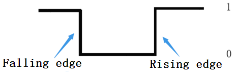

由此可见，我们可以选择下降沿方式触发外部中断，也就是当按键被按下的时候立即产生中断。

---

### 2-2-33 电子沙漏


---

**1. 实验介绍：**
                 
古代人没有电子时钟，就发明了沙漏来测时间，沙漏两边的容量比较大，在一边装了细沙，中间有个很小的通道，将沙漏直立，有细沙的一边在上方，由于重力的作用，细沙就会往下流通过通道到沙漏的另一边，当细沙都流到下边了，就倒过来，把一天反复的次数记录下来，第二天就可以通过沙漏反复流动的次数而知道这一天大概的时间了。这一课我们将利用 ESP32 主控板控制倾斜开关和LED灯电子元件来模拟沙漏，制作一个电子沙漏。

---

**2. 实验组件：**

|  ||||
| ------------------------ | ------------------------ | ---------------------------- |---------------------------- |
| ESP32 主控板| 倾斜开关 x1  | 10KΩ电阻 x1  | 220Ω电阻 x4  |
|| |||
|面包板 x1 |红色LED x4|面包板跳线若干 | Micro USB数据线 x1 |

---

**3. 接线图：**

**原理图：**

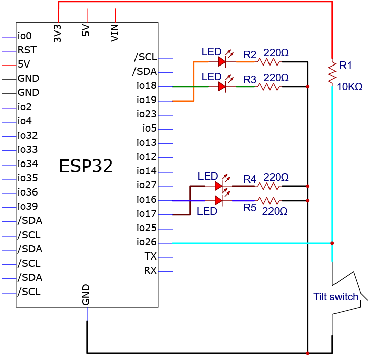


**实物接线图：**

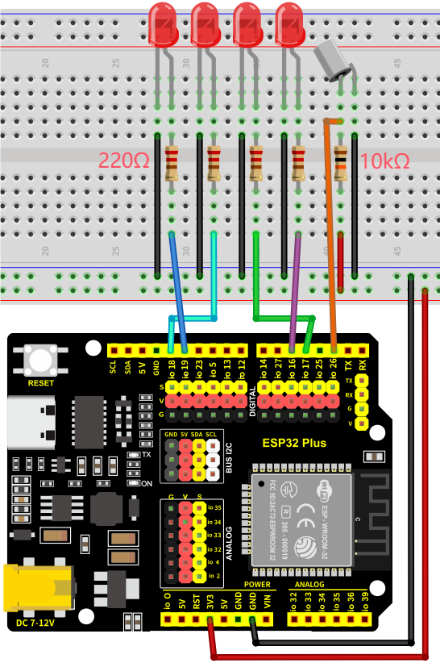

---

**4. 程序流程图：**

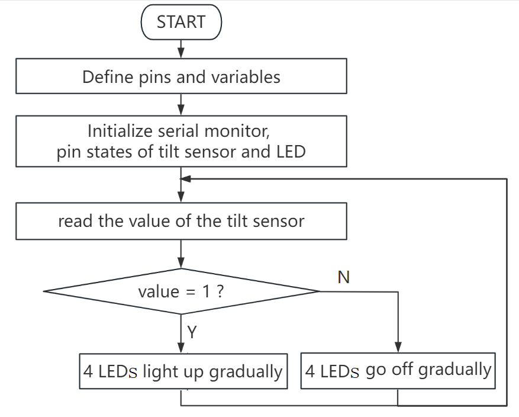

---

**5. 实验代码**

```python
'''
 * Filename    : Electronic_Hourglass
 * Thonny      : Thonny 4.1.7
 * Auther      : http//www.keyestudio.com
'''
from machine import Pin
import time

led1 = Pin(16, Pin.OUT) # 创建引脚16为LED对象，设置引脚16为输出模式
led2 = Pin(17, Pin.OUT) # 创建引脚17为LED对象，设置引脚17为输出模式
led3 = Pin(18, Pin.OUT) # 创建引脚18为LED对象，设置引脚18为输出模式
led4 = Pin(19, Pin.OUT) # 创建引脚19为LED对象，设置引脚19为输出模式
Tilt_Sensor = Pin(26,Pin.IN) # 创建引脚26为倾斜传感器对象，设置IO26为输入模式

while True:
    if(Tilt_Sensor.value() == 1) : # 如果倾斜传感器的值为1时
        led1.value(1) # led1 点亮
        time.sleep_ms(200) #延时
        led2.value(1) # led2 点亮
        time.sleep_ms(200) #延时
        led3.value(1) # led3 点亮
        time.sleep_ms(200) #延时
        led4.value(1) # led4 点亮
        time.sleep_ms(200) #延时
    else :  #如果倾斜传感器的值为0时
        led4.value(0) # led4 熄灭
        time.sleep_ms(200) #延时
        led3.value(0) # led3 熄灭
        time.sleep_ms(200) #延时
        led2.value(0) # led2 熄灭
        time.sleep_ms(200) #延时
        led1.value(0) # led1 熄灭
        time.sleep_ms(200) #延时
```
---

**6. 实验结果**

将 ESP32 主控板通过Micro USB数据线与计算机相连供电，单击，代码开始执行。用手握住面包板，倾斜到一定角度，led就会一个一个亮起来；当回到上一个角度时，led会一个一个关闭。就像沙漏一样，随着时间的推移，沙子漏了出来。


单击退出程序。

---

**7. 代码说明**

1\. 定义引脚和引脚模式。

```python
led1 = Pin(16, Pin.OUT) # 创建引脚16为LED对象，设置引脚16为输出模式
led2 = Pin(17, Pin.OUT) # 创建引脚17为LED对象，设置引脚17为输出模式
led3 = Pin(18, Pin.OUT) # 创建引脚18为LED对象，设置引脚18为输出模式
led4 = Pin(19, Pin.OUT) # 创建引脚19为LED对象，设置引脚19为输出模式
Tilt_Sensor = Pin(26,Pin.IN) # 创建引脚26为倾斜传感器对象，设置IO26为输入模式
```
2\. 主循环，倾斜开关倾斜到一定角度（即：倾斜开关里面的滚珠远离两个引脚）时，4个LED依次点亮；反之，倾斜开关回到原来状态时，4个LED依次熄灭。

```python
while True:
    if(Tilt_Sensor.value() == 1) : # 如果倾斜传感器的值为1时
        led1.value(1) # led1 点亮
        time.sleep_ms(200) #延时
        led2.value(1) # led2 点亮
        time.sleep_ms(200) #延时
        led3.value(1) # led3 点亮
        time.sleep_ms(200) #延时
        led4.value(1) # led4 点亮
        time.sleep_ms(200) #延时
    else :  #如果倾斜传感器的值为0时
        led4.value(0) # led4 熄灭
        time.sleep_ms(200) #延时
        led3.value(0) # led3 熄灭
        time.sleep_ms(200) #延时
        led2.value(0) # led2 熄灭
        time.sleep_ms(200) #延时
        led1.value(0) # led1 熄灭
        time.sleep_ms(200) #延时
```

---

### 2-2-34 防盗报警器


---

**1. 实验介绍**

前面实验我们已经学习了人体红外传感器的原理，那在这一实验课程中我们将人体红外传感器、LED和有源蜂鸣器组合实验，实现人体红外传感器检测到附近有人经过时，有源蜂鸣器响起，LED闪烁的效果。

---

**2. 实验组件**

|   ||||
| ------------------------ | ------------------------ | ---------------------------- |---------------------------- |
|ESP32 主控板| NPN型三极管(S8050) x1| 有源蜂鸣器 x1 | 1kΩ电阻 x1 |
||| ||
| 人体红外传感器 x1  |公对母杜邦线若干 |红色LED x1|220Ω电阻 x1  |
|||||
|面包板 x1 |面包板跳线若干 | Micro USB数据线 x1 | 10kΩ电阻 x1 |

---

**3. 接线图：**

**原理图：**

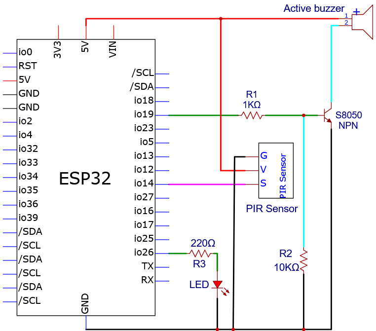

**实物接线图：**

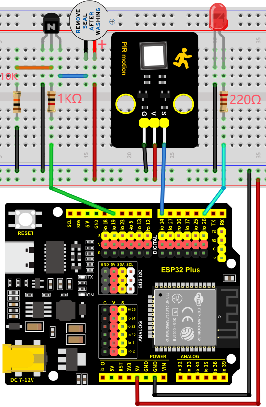

---

**4. 程序流程图：**

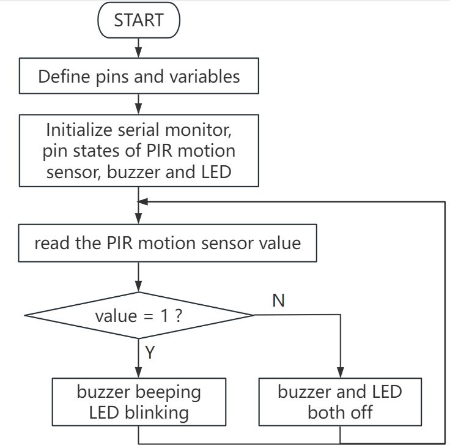

---

**5. 实验代码**

```python
'''
 * Filename    : Burglar_Alarm
 * Thonny      : Thonny 4.1.7
 * Auther      : http//www.keyestudio.com
'''
# 导入 Pin and time 库.
from machine import Pin
import time

# 定义人体红外传感器，led和有源蜂鸣器的引脚和引脚模式. 
sensor_pir = Pin(14, Pin.IN)
led = Pin(26, Pin.OUT)
buzzer = Pin(19, Pin.OUT)

while True: 
      if sensor_pir.value():
          buzzer.value(1)
          led.value(1)
          time.sleep(0.2)
          buzzer.value(0)
          led.value(0)
          time.sleep(0.2)         
      else:
          buzzer.value(0)
          led.value(0)
```

---

**6. 实验结果**

将 ESP32 主控板通过Micro USB数据线与计算机相连供电，单击，代码开始执行。当人体红外热释传感器检测到附近有人经过时，人体红外热释传感器上的红灯灭，有源蜂鸣器发出警报，LED闪烁。


单击退出程序。

---

**7. 代码说明：**

1\. 定义引脚和引脚模式。

```python
sensor_pir = Pin(14, Pin.IN)
led = Pin(26, Pin.OUT)
buzzer = Pin(19, Pin.OUT)
```
2\. 主循环，串口打印体人体红外热释传感器输出的数字信号，当人体红外传感器检测到人体或动物移动（即：人体红外热传感器输出高电平信号）时，LED闪烁蜂鸣器鸣叫；反之，LED熄灭，蜂鸣器不鸣叫。

```python
while True: 
      if sensor_pir.value():
          buzzer.value(1)
          led.value(1)
          time.sleep(0.2)
          buzzer.value(0)
          led.value(0)
          time.sleep(0.2)         
      else:
          buzzer.value(0)
          led.value(0)
```
---

### 2-2-35 小家电


---

**1. 实验介绍：**

在日常生活中，我们一般使用220V交流来驱动电气设备，有时我们会用开关来控制电器。如果将开关直接连接到220V交流电路上，一旦发生漏电，人就有危险。从安全的角度考虑，我们特别设计了这款具有NO(常开)端和NC(常闭)端的继电器模块。在这节课我们将学习一个比较特殊好用的开关，就是继电器。使用继电器和按键开关来控制LED转动模拟小家电运转功能。

---

**2. 元件知识：**

**继电器：** 继电器是一种利用低功耗电路控制大功率电路的安全开关。它由电磁铁和触点组成。电磁铁采用低功耗电路控制，大功率电路采用触点控制。当电磁铁通电时，它会吸引触点。下面是一个常用继电器的示意图:

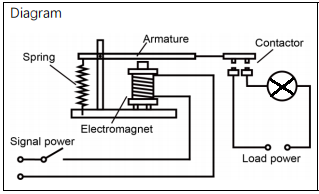

---

**模块参数**

- 工作电压 : DC 5V 
- 电流 : 50 mA
- 最大功率 : 0.25 W
- 输入信号 : 数字信号
- 触电电流 : 小于 3 A
- 工作温度 ：-10°C ~ +50°C
- 控制信号 : 数字信号
- 尺寸 ：47.6 x 23.8 x 19 mm
- 定位孔大小：直径为 4.8 mm

---

**模块原理图**

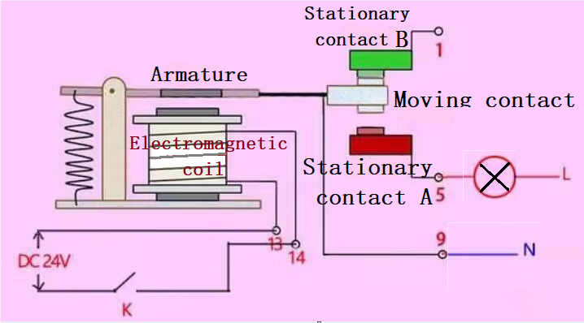

一个继电器拥有一个动触点以及两个静触点A和B。

当开关K断开时，继电器线路无电流通过，此时动触点与静触点B相接触，上半部分的电路导通。静触点B被称为常闭触点（NC）。常闭——NC（normal close）通常情况下是关合状态，即线圈未得电的情况下闭合的。

当开关K闭合时，继电器电路通过电流产生磁力，此时动触点与静触点A相接触，下半部分电路导通。静触点A被称为常开触点（NO）。常开——NO（normal open）通常情况下是断开状态，即线圈未得电的情况下断开的。

而动触点也被称为公共触点（COM）。

继电器简单来说就是一个开关，VCC表示电源正极、GND表示电源负极、IN表示信号输入脚，COM表示公共端，NC（normal close）表示常闭端，NO(normal open)表示常开端。

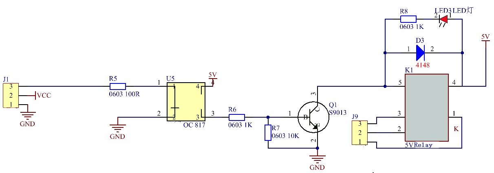

继电器能兼容多种单片机控制板，是用小电流去控制大电流运作的一种“自动开关”。它可以让单片机控制板驱动3A以下负载，如LED灯带、直流马达、微型水泵、电磁阀可插拔式接口设计，方便使用。

---

**3. 实验组件**

|  ||||
| ------------------------ | ------------------------ | ---------------------------- |---------------------------- |
|ESP32 主控板|  按键开关 x1     |10KΩ电阻 x1 |面包板 x1 |
| | |||
|继电器 x1|LED x1|220Ω电阻 x1|公对母杜邦线若干|
|||  |  |
|面包板跳线若干 | Micro USB数据线 x1 |  |   |

---

**4. 接线图：**

**原理图：**

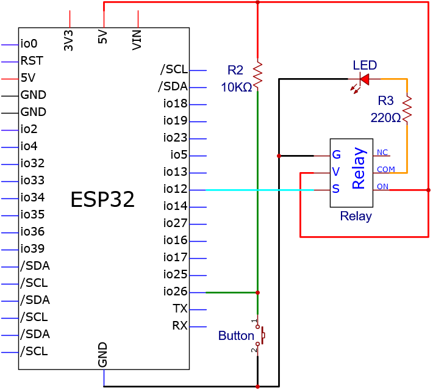

**实物接线图：**

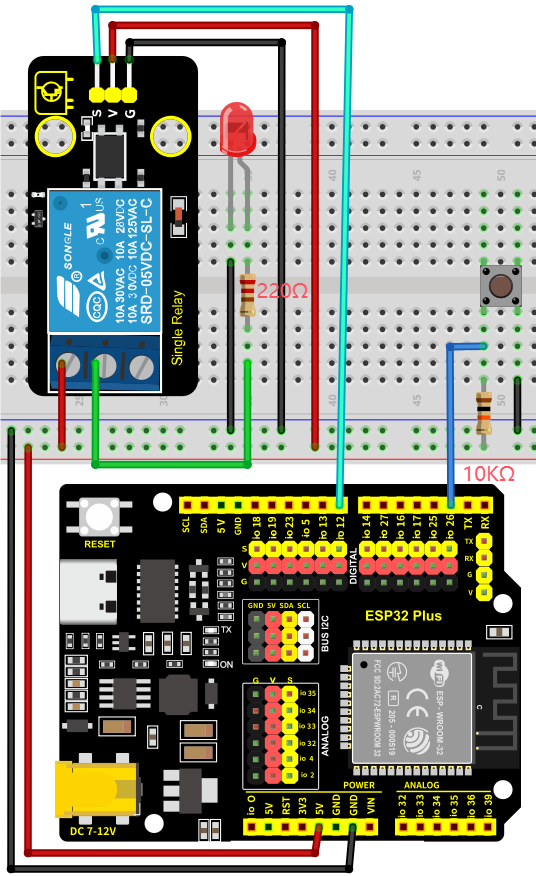

---

**5. 程序流程图：**

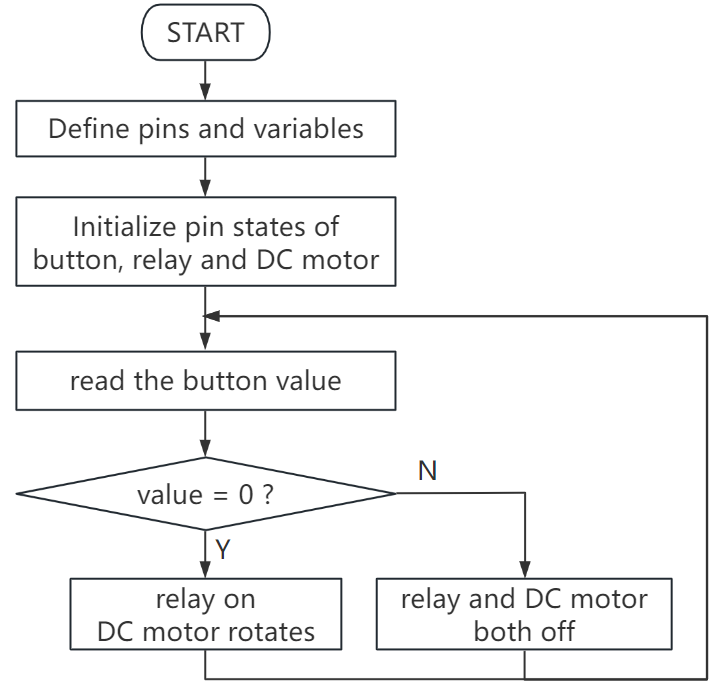

---

**6. 实验代码**

```python
'''
 * Filename    : Home_Appliances
 * Thonny      : Thonny 4.1.7
 * Auther      : http//www.keyestudio.com
'''
from machine import Pin
import time

relay = Pin(12, Pin.OUT) # 创建引脚12为relay对象，设置引脚12为输出模式                  
button = Pin(26, Pin.IN, Pin.PULL_UP) #创建引脚26为button对象，设置引脚26为输入上拉模式

#定义一个函数并将其命名为reverseGPIO()，用于反转继电器输出电平
def reverseGPIO():
    if relay.value():
        relay.value(0)     #LED熄灭
    else:
        relay.value(1)     #LED点亮

try:
    while True:
        if not button.value():
            time.sleep_ms(20)
            if not button.value():
                reverseGPIO()
                while not button.value():
                    time.sleep_ms(20)
except:
    pass
```
---

**5. 实验结果**

将 ESP32 主控板通过Micro USB数据线与计算机相连供电，单击，代码开始执行。按下按键，继电器吸合，LED灯点亮；再次按下按键，继电器断开，LED灯熄灭。


单击退出程序。

---

**6. 代码说明**

1\. 定义一个函数并将其命名为reverseGPIO()，用于反转继电器输出电平。

```python
def reverseGPIO():
    if relay.value():
        relay.value(0)     #LED熄灭
    else:
        relay.value(1)     #LED点亮
```
2\. 主循环。

```python
try:
    while True:
        if not button.value():
            time.sleep_ms(20)
            if not button.value():
                reverseGPIO()
                while not button.value():
                    time.sleep_ms(20)
except:
    pass
```
---

### 2-2-36 调光灯

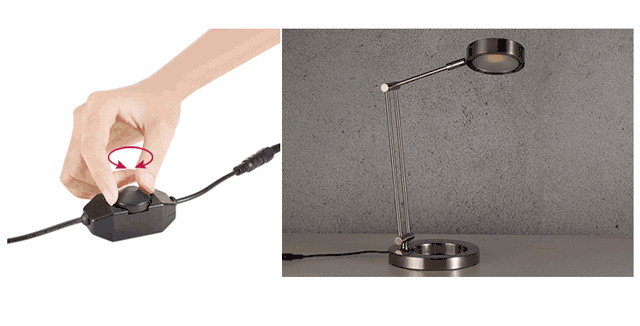

---

**1. 实验介绍**

在前面的课程中已经学习了可调电位器的工作原理，呼吸灯和两种晶体三极管（按键控制红色LED灯）等实验。在这一实验课程中我们尝试将呼吸灯和两种晶体三极管（按键控制红色LED灯）这两个实验现象组合起来，用可调电位器代替按键，实现利用旋转可调电位器读取到的模拟值控制LED亮度的效果。可调电位器模拟值的范围是0 ~ 4095；LED的亮度由PWM值控制，范围为0 ~ 255。

---

**2. 实验组件**

|  ||||
| ------------------------ | ------------------------ | ---------------------------- |---------------------------- |
| ESP32 主控板| 可调电位器 x1  | 红色LED x1| 220Ω电阻 x1  |
||||   |
|面包板 x1 |面包板跳线若干 | Micro USB数据线 x1 |  |

---

**3. 接线图：**

**原理图：**

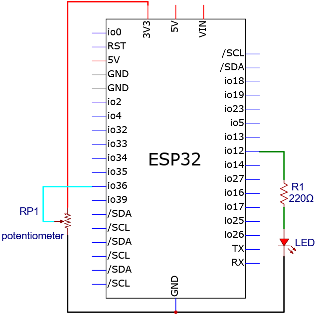

**实物接线图：**

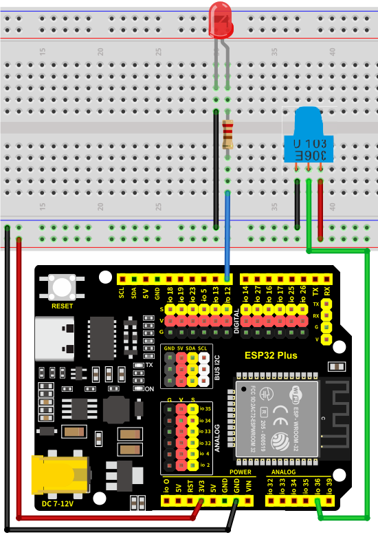

---

**4. 程序流程图：**

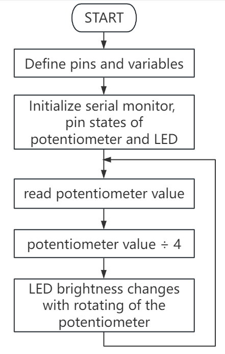

---

**5. 实验代码**

```python
'''
 * Filename    : Dimming_Light
 * Thonny      : Thonny 4.1.7
 * Auther      : http//www.keyestudio.com
'''
from machine import Pin,PWM,ADC 
import time

# 定义IO12的输出频率为1000Hz，并将其分配给PWM.
pwm =PWM(Pin(12,Pin.OUT),1000)

# 开启并配置ADC，量程为0-3.3V
adc=ADC(Pin(36))
adc.atten(ADC.ATTN_11DB)
adc.width(ADC.WIDTH_10BIT)

# 每0.1秒读取一次ADC值，将ADC值转换为pwm值输出;
# 并将ADC值打印到“Shell”
try:
    while True:
        adcValue=adc.read()
        pwm.duty(adcValue)
        print(adc.read())
        time.sleep_ms(100)
except:
    pwm.deinit()
```
---

**5. 实验结果**

将 ESP32 主控板通过Micro USB数据线与计算机相连供电，单击，代码开始执行，“Shell”窗口将打印出可调电位器的ADC值。旋转可调电位器，可以调节红色LED的亮度。


单击退出程序。

---

**6. 代码说明**

可以参照前面的课程 2-2-2 和 2-2-17的代码说明，这里就不多做介绍了。

---

### 2-2-37 夜光灯


---

**1. 实验介绍**

前面我们已经学习了光敏电阻的工作原理，在这一项目中，我们将光敏电阻和红色LED组合实验，实现光敏电阻检测到光照强度模拟值高于设定值时红色LED熄灭，低于设定值时红色LED点亮的效果。

---

**2. 实验组件**

|  ||||
| ------------------------ | ------------------------ | ---------------------------- |---------------------------- |
| ESP32 主控板| 光敏电阻 x1  |面包板 x1 | 红色LED x1|
|||  ||
|面包板跳线若干 | Micro USB数据线 x1 | 10KΩ电阻 x1 |  220Ω电阻 x1  |  

---

**3. 接线图：**

**原理图：**

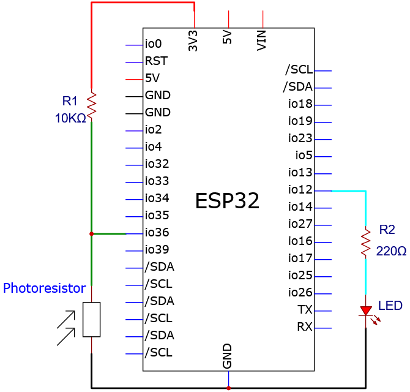


**实物接线图：**

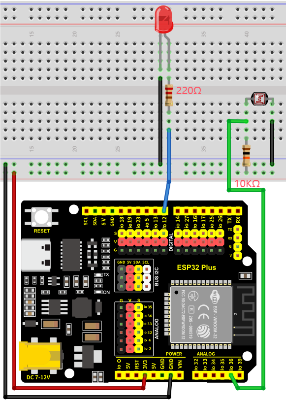

---

**4. 程序流程图：**

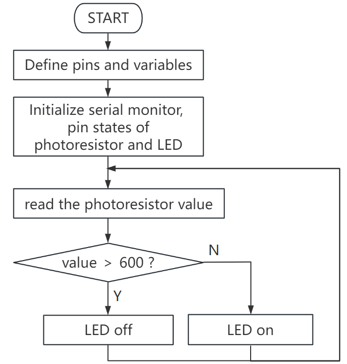

---

**5. 实验代码**

```c++
'''
 * Filename    : Night_Lamp
 * Thonny      : Thonny 4.1.7
 * Auther      : http//www.keyestudio.com
'''
from machine import Pin,PWM,ADC
import time

# 定义IO12的输出频率为1000Hz，并将其分配给PWM.
pwm =PWM(Pin(12,Pin.OUT),1000)

# 开启并配置ADC，量程为0-3.3V
adc=ADC(Pin(36))  
adc.atten(ADC.ATTN_11DB)
adc.width(ADC.WIDTH_10BIT)

# 每0.05秒读取一次ADC值，将ADC值转换为pwm值输出;
# 并将ADC值打印到“Shell”
try:
    while True:
        adcValue=adc.read()
        pwm.duty(adcValue)
        print(adc.read())
        time.sleep_ms(50)
except:
    pwm.deinit()
```
---

**5. 实验结果**

将 ESP32 主控板通过Micro USB数据线与计算机相连供电，单击，代码开始执行，“Shell”窗口将打印出光敏电阻的ADC值。使用手机的照明灯或其他的光源对着光敏光敏电阻照射时，LED的亮度随着照明灯或其他的光源的强度而改变，实现了夜光灯的效果。


单击退出程序。

---

**6. 代码说明**

可以参照前面的课程 2-2-2 和 2-2-17 的代码说明，这里就不多做介绍了。

---

### 2-2-38 电位器控制舵机

---

**1. 实验介绍**

---

前面已经学习过电位器和舵机的工作原理，在本项目中，我们将使用电位器控制电机以任意角度旋转。

---

**2. 实验组件**

|  |||
| ------------------------ | ------------------------ | ---------------------------- |
| ESP32 主控板| 可调电位器 x1  | 舵机 x1| 
||||
|面包板 x1 |面包板跳线若干 | Micro USB数据线 x1 | 

---

**3. 接线图：**

**原理图：**

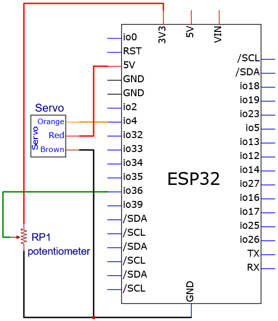

**实物接线图：**

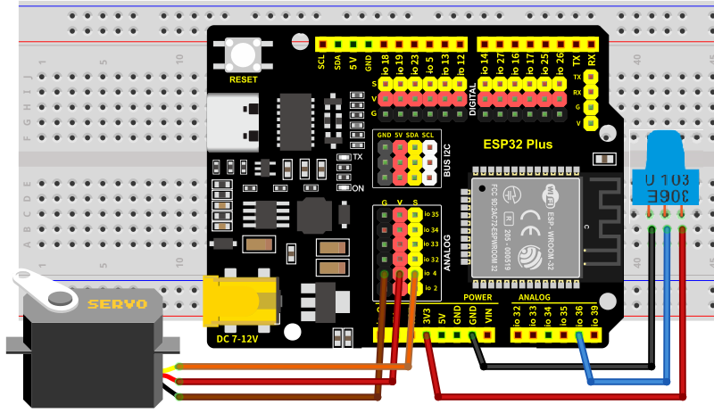

---

**4. 程序流程图：**

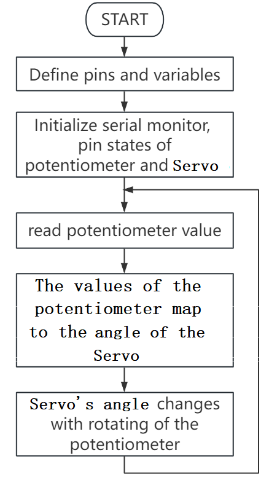

---

**5. 实验代码**

```python
'''
 * Filename    : Potentiometer_Controls_Servo
 * Thonny      : Thonny 4.1.7
 * Auther      : http//www.keyestudio.com
'''
from machine import Pin,PWM,ADC
import time

# Create a PWM (Pulse Width Modulation) object on Pin 4
servo = PWM(Pin(4,Pin.OUT),10000)

# Set the frequency of the PWM signal to 50 Hz, common for servos
servo.freq(50)

# Define a function for interval mapping
def interval_mapping(x, in_min, in_max, out_min, out_max):
    return (x - in_min) * (out_max - out_min) / (in_max - in_min) + out_min

# Define a function to write an angle to the servo
def servo_write(pin, angle):

    pulse_width = interval_mapping(angle, 0, 180, 0.5, 2.5) # Calculate the pulse width
    duty = int(interval_mapping(pulse_width, 0, 20, 0, 1023))     # Calculate the duty cycle
    pin.duty(duty) # Set the duty cycle of the PWM signal

# 开启并配置ADC，量程为0-3.3V
adc=ADC(Pin(36))
adc.atten(ADC.ATTN_11DB)
adc.width(ADC.WIDTH_12BIT)

try:
    while True:
        adcValue=adc.read() # 读取电位器的ADC值
        angle=(adcValue*180)/4096 # 电位器的ADC值转化成舵机的角度
        servo_write(servo, int(angle)) # 舵机转动角度
        time.sleep_ms(50)
except:
    servo.deinit()
```

---

**6. 实验结果**

将 ESP32 主控板通过Micro USB数据线与计算机相连供电，单击，代码开始执行，旋转电位器，使用ESP32的引脚(36)读取旋转电位器的ADC值，然后将其转换为舵机所需的角度值，并控制舵机旋转到相应的角度。


单击退出程序。


---

**7. 代码说明**

可以参照前面的课程 2-2-17 、2-2-12 和 2-2-31 的代码说明，这里就不多做介绍了。

---

### 2-2-39 Light Theremin (电子乐器)

---

**1. 实验介绍**

---

Theremin 是一种不需要身体接触的电子乐器。根据玩家手的位置，它会产生不同的音调。

它的控制部分通常由两个金属天线组成，它们感应 Thereminist 手的位置，一只手控制振荡器，另一只手控制音量。来自 Theremin 的电信号被放大并发送到扬声器。

我们无法通过 ESP32 再现相同的乐器，但我们可以使用光敏电阻和无源蜂鸣器来实现类似的游戏玩法。 

[Theremin - Wikipedia](https://en.wikipedia.org/wiki/Theremin)

---

**2. 实验组件**

|  ||||
| ------------------------ | ------------------------ | ---------------------------- |---------------------------- |
| ESP32 主控板| 光敏电阻 x1  |面包板 x1 | 红色LED x1|
|||  ||
|面包板跳线若干 | Micro USB数据线 x1 | 10KΩ电阻 x2 |  220Ω电阻 x1  | 
||||  |
| NPN型三极管(S8050) x1| 无源蜂鸣器 x1 | 1kΩ电阻 x1 |  |

---

**3. 接线图：**

**原理图：**

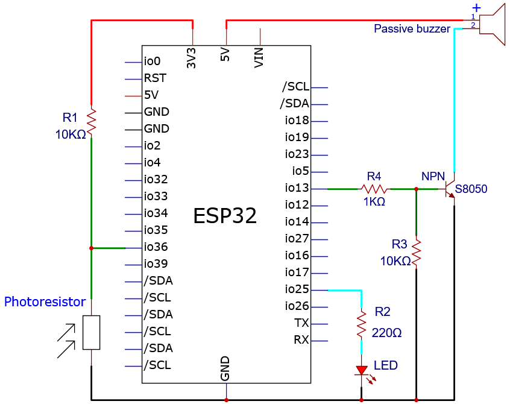

**实物接线图：**

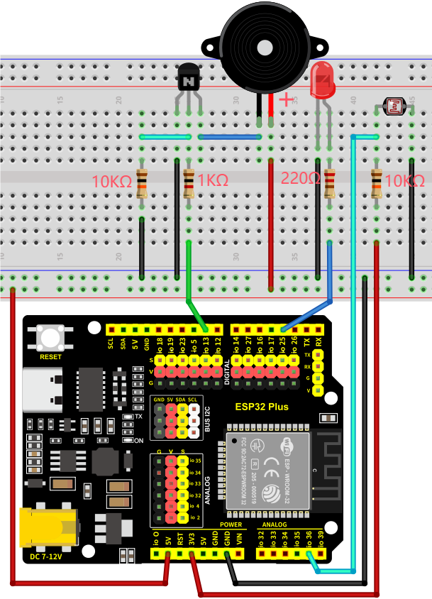

在开始项目之前，通过在光敏电阻上挥手来校准光强度范围。连接到 IO25 的 LED 在校准过程中用作指示灯。当 LED 亮起时，表示校准开始，当 LED 熄灭时，表示校准结束。

当您在光敏电阻上挥手时，光敏电阻的值会相应变化。利用此更改来控制蜂鸣器并播放不同的音符。光敏电阻值的每个变化都可以映射到特定的音符，从而允许蜂鸣器在您在光敏电阻上挥手时产生旋律。 

---

**4. 程序流程图：**

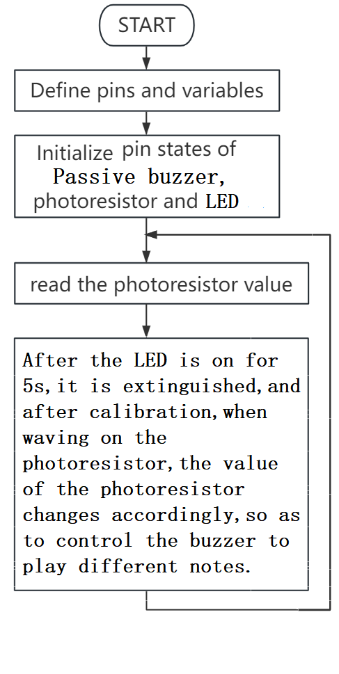

---

**5. 实验代码**

```python
'''
 * Filename    : Light_Theremin
 * Thonny      : Thonny 4.1.7
 * Auther      : http//www.keyestudio.com
'''
from machine import Pin, PWM, ADC
import time

# Initialize LED pin
led = Pin(25, Pin.OUT)

# Initialize light sensor
sensor = ADC(Pin(36))
sensor.atten(ADC.ATTN_11DB)
sensor.width(ADC.WIDTH_12BIT)

# Initialize buzzer
buzzer = PWM(Pin(13), freq=440, duty=0)

light_low = 4095
light_high = 0

# Map the interval of input values to output values
def interval_mapping(x, in_min, in_max, out_min, out_max):
    return (x - in_min) * (out_max - out_min) / (in_max - in_min) + out_min

# Create a tone using the specified pin, frequency, and duration
def tone(pin,frequency,duration):
    pin.freq(frequency)
    pin.duty(512)
    time.sleep_ms(duration)
    pin.duty(0)

# Calibrate the photoresistor's maximum and minimum values in 5 seconds.
timer_init_start = time.ticks_ms()
led.value(1) # turn on the LED
while time.ticks_diff(time.ticks_ms(), timer_init_start)<5000:
    light_value = sensor.read()
    if light_value > light_high:
        light_high = light_value
    if light_value < light_low:
        light_low = light_value
led.value(0) # turn off the LED

# Play the tones based on the light values
while True:
    light_value  = sensor.read()
    pitch = int(interval_mapping(light_value,light_low,light_high,50,6000))
    if pitch > 50 :
        tone(buzzer,pitch,20)
    time.sleep_ms(10)
```
---

**6. 实验结果**

将 ESP32 主控板通过Micro USB数据线与计算机相连供电，单击，代码开始执行，启动程序后，LED 亮起，为我们提供 5 秒钟的窗口来校准光敏电阻的检测范围。

校准是一个至关重要的步骤，因为它考虑了我们在使用设备时可能遇到的各种照明条件， 例如在一天中的不同时间变化的光强度。 此外，校准过程还考虑了我们的手和光敏电阻之间的距离，它决定了乐器的可演奏范围。

校准期结束后，LED 指示灯熄灭，表示我们现在可以通过在光敏电阻上挥手来演奏乐器。这种设置使我们能够通过调整手的高度来创作音乐，从而提供互动和愉快的体验。 


单击退出程序。

---

**7. 代码说明**

1\. 定义引脚和设置变量.

```python
# Initialize LED pin
led = Pin(25, Pin.OUT)

# Initialize light sensor
sensor = ADC(Pin(36))
sensor.atten(ADC.ATTN_11DB)
sensor.width(ADC.WIDTH_12BIT)

# Initialize buzzer
buzzer = PWM(Pin(13), freq=440, duty=0)

light_low = 4095
light_high = 0
```
2\. 将光敏电阻的输入值映射到输出值.

```python
def interval_mapping(x, in_min, in_max, out_min, out_max):
    return (x - in_min) * (out_max - out_min) / (in_max - in_min) + out_min
```
3\. 使用指定的引脚、频率和持续时间来创建音调.

```python
def tone(pin,frequency,duration):
    pin.freq(frequency)
    pin.duty(512)
    time.sleep_ms(duration)
    pin.duty(0)
```
4\. 在5秒内校准光敏电阻的最大值和最小值。.

```python
timer_init_start = time.ticks_ms()
led.value(1) # turn on the LED
while time.ticks_diff(time.ticks_ms(), timer_init_start)<5000:
    light_value = sensor.read()
    if light_value > light_high:
        light_high = light_value
    if light_value < light_low:
        light_low = light_value
led.value(0) # turn off the LED
```
5\. 根据光敏电阻检测的光照强度ADC值来播放音调.

```python
while True:
    light_value  = sensor.read()
    pitch = int(interval_mapping(light_value,light_low,light_high,50,6000))
    if pitch > 50 :
        tone(buzzer,pitch,20)
    time.sleep_ms(10)
```
---

### 2-2-40 模拟灭火机器人


---

**1. 实验介绍：**

你知道灭火机器人吗？根据国家犯罪记录局（NCRB）的估计，从2010年至2014年，印度发生的火灾事故已造成超过120万死亡。即使为火灾事故采取了许多预防措施，但这些自然/人为灾难却还是时有发生。发生火灾时，为了营救人员和灭火，非常需要消防员等人力资源。随着技术的进步、机器人技术的发展，未来很有可能使用机器人代替消防员灭火。这将提高灭火的效率，也能保障消防员的生命安全。

在这个项目中，我们将学习如何使用ESP32 主控板构建一个非常简单的机器人。用火焰传感器检测火焰，并启动电机吹灭火源。

---

**2. 实验组件：**

|  ||  ||
| ------------------------ | ------------------------ | ---------------------------- |---------------------------- |
|ESP32 主控板|火焰传感器 x1|LED x1|220Ω电阻 x1|
| | |||
| 直流电机 x1|面包板 x1 |面包板跳线若干 | Micro USB数据线 x1 |
|||  |  |
|风扇叶片 x1|电池盒 x1|AA电池(<span style="color: rgb(255, 76, 65);">自备</span>) x6 |   |

<span style="color: rgb(255, 76, 65);">**注意：电机与风扇叶是分开装的，需要组合到一起。**</span>

---

**3. 接线图：**

**原理图：**

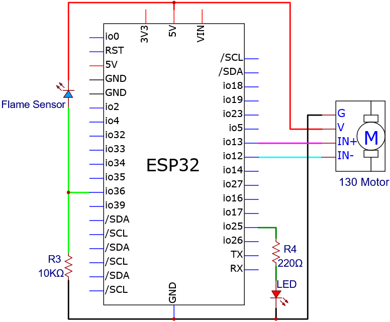

**实物接线图：**

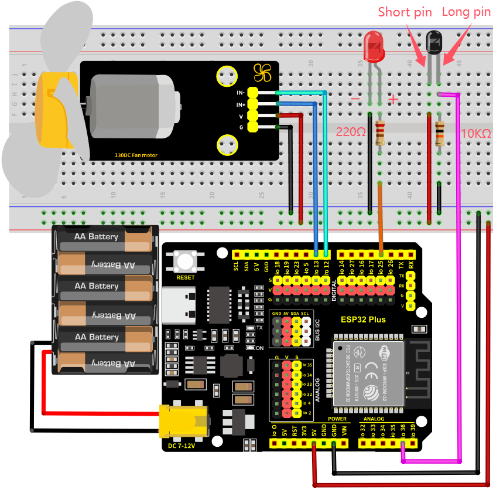

---

**4. 程序流程图：**

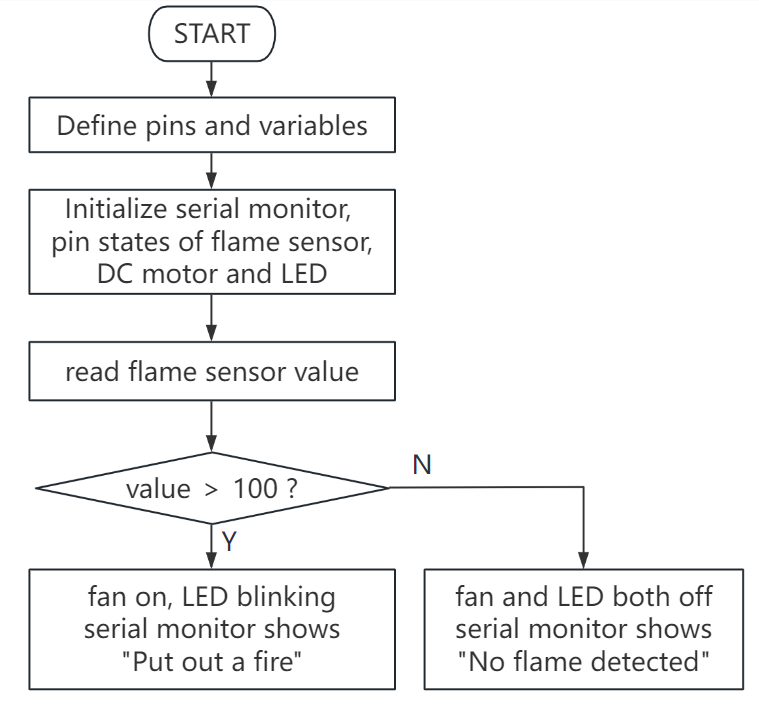

---

**5. 实验代码**

<span style="color: rgb(255, 76, 65);">注意：代码中的模拟值的阈值2000可以根据实际情况设置。</span>

```python
'''
 * Filename    : Fire-fighting_robot
 * Thonny      : Thonny 4.1.7
 * Auther      : http//www.keyestudio.com
'''
# 导入引脚和ADC模块
from machine import ADC,Pin
import time

# 开启并配置ADC，量程为0-3.3V
adc=ADC(Pin(36))
adc.atten(ADC.ATTN_11DB)
adc.width(ADC.WIDTH_12BIT)

# 创建引脚25为LED对象，设置引脚25为输出模式
led = Pin(25, Pin.OUT)   

# 电机的两个引脚
INA = Pin(13, Pin.OUT) # INA对应IN+
INB = Pin(12, Pin.OUT) # INB对应IN-

while True:
    adcVal=adc.read()  # 读取火焰传感器的ADC值
    print(adcVal)  # 将ADC值打印到“Shell”
    if adcVal > 2000:  # 当火焰传感器的ADC值大于2000时
        # 开启电机
        INA.value(0)
        INB.value(1)
        # LED闪烁
        led.value(1)   
        time.sleep(0.5)  
        led.value(0)   
        time.sleep(0.5)  
    else: # 当火焰传感器的ADC值小于等于2000时
        # 关闭电机和LED
        INA.value(0)
        INB.value(0)
        led.value(0)
    time.sleep(0.1)
```
---

**6. 实验结果：**

**<span style="color: rgb(255, 76, 65);">特别提醒：</span>** 由于电机在转动时，所需的电流比其他传感器要大，会引起电路中电压电流波动，特别是电机进行正反转时，电压电流波动过大，导致ESP32 主控板的电压电流过低，会导致复位。必须外接电源给ESP32 主控板供电。

将 ESP32 主控板通过Micro USB数据线与计算机相连供电，单击，代码开始执行，“Shell”窗口将打印出火焰传感器的ADC值。当ADC值大于2000时打开风扇（电机转动）灭火，LED灯闪烁；当ADC值低于2000时关闭风扇，LED不亮，


单击退出程序。

---

**7. 代码说明：**

在代码中我们设置了阈值为2000（item > 2000），阈值可以根据实际情况更改。当火焰传感器检测到火焰输出的模拟值高于这个阈值时，风扇将自动开启，LED闪烁；否则，风扇关闭，LED不亮。风扇的驱动方式请查看前面的课程 2-2-11 。

---

### 2-2-41 楼道感应灯

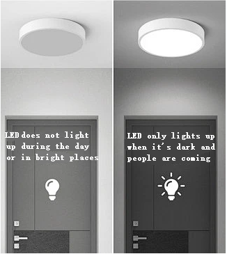

---

**1. 实验介绍：**

人体感应灯一般都用在黑漆漆的楼道区域，随着科技的发展，人体感应灯的使用在我们现实生活中十分常见。小区的楼道，房间的卧室、地下城的车库、卫生间等区域都会用到人体感应灯。现实生活中的人体感应灯一般是由人体红外热释传感器、灯、光敏电阻等组成的。
在本项目中，我们将学习如何利用人体红外传感器、LED、光敏电阻来制作一款人体感应灯。

---

**2. 实验组件：**

|  |||
| ------------------------ | ------------------------ | ---------------------------- |
|ESP32 主控板|  光敏电阻 x1     |10KΩ电阻 x1|
||  ||
|人体红外传感器 x1|LED x1|220Ω电阻 x1|
||||
|面包板 x1 |面包板跳线若干 | Micro USB数据线 x1 |

---

**3. 接线图：**

**原理图：**

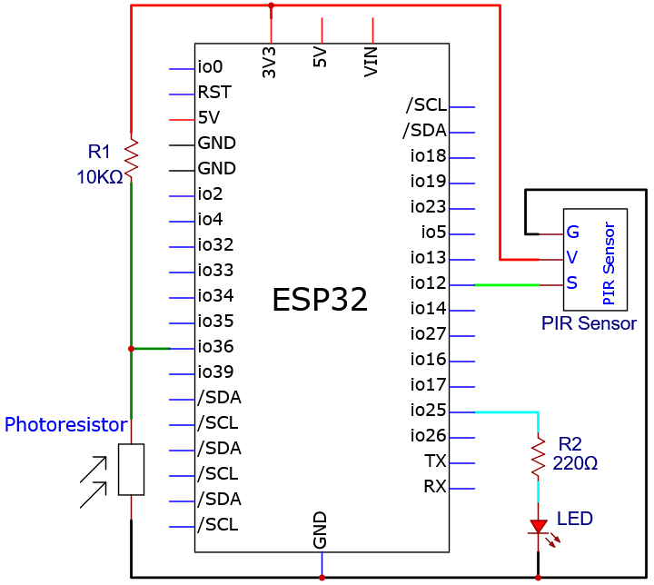

**实物接线图：**

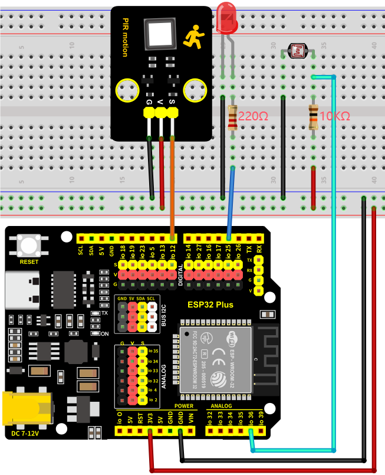

---

**4. 程序流程图：**

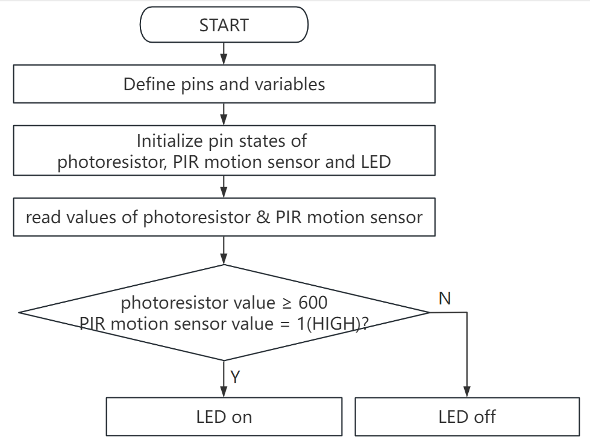

---

**5. 实验代码**

<span style="color: rgb(255, 76, 65);">注意：代码中的模拟值的阈值3500可以根据实际情况更改。</span>

```c++
'''
 * Filename    : Corridor_Induction_Lamp
 * Thonny      : Thonny 4.1.7
 * Auther      : http//www.keyestudio.com
'''
from machine import Pin, ADC
import time
 
# 人体红外传感器引脚
human = Pin(12, Pin.IN)
 
# 初始化光敏电阻引脚到GP36 (ADC函数)
adc=ADC(Pin(36))
adc.atten(ADC.ATTN_11DB)
adc.width(ADC.WIDTH_12BIT)

# 创建引脚25为LED对象，设置引脚25为输出模式 
led = Pin(25, Pin.OUT)

def detect_someone(): # 创建人体红外传感器检测到有人移动的函数
    if human.value() == 1:
        return True
    return False
 
abc = 0
 
while True:
    adcVal=adc.read() # 读取光敏电阻的ADC值
    if adcVal > 3500: # 当光敏电阻的ADC值大于3500时
        if detect_someone() == True: # 当人体红外传感器检测到有人移动时
            abc += 1 # adc值加1
            led.value(1) # LED点亮
            print("value=", abc)
            time.sleep(1)
        else:
            if abc != 0:
                abc = 0
                led.value(0)
    else:
        led.value(0)
 
    time.sleep(0.1)
```
---

**6. 实验结果：**

将 ESP32 主控板通过Micro USB数据线与计算机相连供电，单击，代码开始执行，当你的手覆盖光敏电阻的感光部分来模拟黑暗状态时，然后用另一只手在人体红外传感器前面晃动，LED也点亮，而且延时几秒钟后LED会自动关闭，同时 “Shell” 窗口将打印LED点亮的延时时间。如果光敏电阻的感光部分没有被覆盖，这时候用手在人体红外传感器前面晃动，LED处于熄灭状态。


单击退出程序。

---

**7. 代码说明：**

可以参照前面的课程 2-2-17和 2-2-31 的代码说明，这里就不多做介绍了。

---

### 2-2-42 温度测量仪 

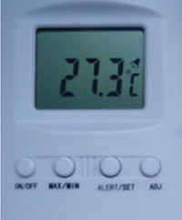

---

**1. 实验介绍**：

如今社会，很多家庭室内的墙上都挂有温度测量仪表，来测量室内温度。在前面的项目实验中我们已经学习了热敏电阻和OLED显示屏的工作原理，那么在这个项目实验中，我们将它们相结合，来模拟温度测量仪表。

---

**2. 实验组件**

|  ||||
| ------------------------ | ------------------------ | ---------------------------- |---------------------------- |
| ESP32 主控板| 热敏电阻 x1  |OLED x1|面包板 x1 |  
|||  | |
|面包板跳线若干 | Micro USB数据线 x1 | 10KΩ电阻 x1 | 母对母杜邦线若干 | 

---

**3. 接线图：**

**原理图：**

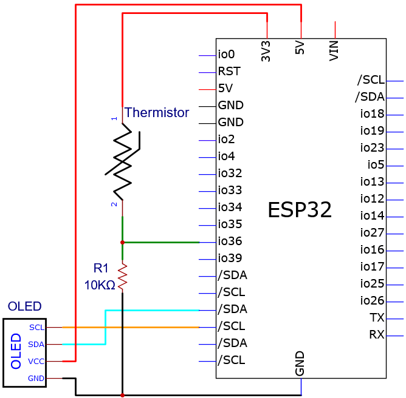

**实物接线图：**

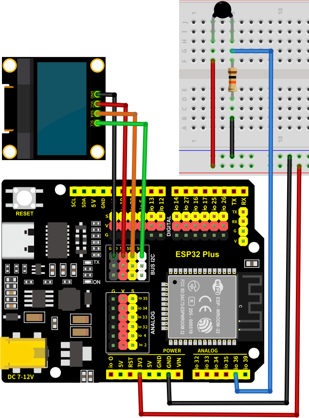

---

**4. 程序流程图：**

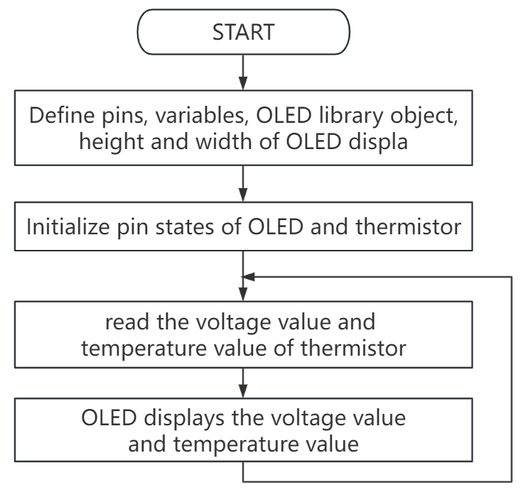

---

**5. 实验代码**

```python
'''
 * Filename    : Temperature_Detector
 * Thonny      : Thonny 4.1.7
 * Auther      : http//www.keyestudio.com
'''
from machine import Pin, ADC, SoftI2C
import machine
import time
import math
import ssd1306
from time import sleep

# 开启并配置ADC，量程为0-3.3V
adc=ADC(Pin(36))
adc.atten(ADC.ATTN_11DB)
adc.width(ADC.WIDTH_12BIT)

# ESP32 Pin assignment 
i2c = SoftI2C(scl=Pin(22), sda=Pin(21))

# Set the width, height and i2c of the OLED
oled_width = 128
oled_height = 64
oled = ssd1306.SSD1306_I2C(oled_width, oled_height, i2c)

# OLED屏显示热敏电阻的电压和检测的温度值.
try:
    while True:
        adcValue = adc.read()
        voltage = adcValue / 4095 * 3.3
        Rt = 10 * voltage / (3.3-voltage)
        tempK = (1 / (1 / (273.15+25) + (math.log(Rt/10)) / 3950))
        tempC = int(tempK - 273.15)        
        voltage_string = str(voltage)
        tempC_string = str(tempC)
        oled.text('TemperatureMeter', 0, 0)
        oled.text('Volt:', 0, 25)
        oled.text(voltage_string, 40, 25)
        oled.text('V', 110, 25)
        oled.text('Temperature:', 0, 50)
        oled.text(tempC_string, 100, 50)
        oled.text('C', 120, 50) 
        oled.show()
        time.sleep(0.15)
        oled.fill(0)
except:
    pass
```
---

**5. 实验结果**

将 ESP32 主控板通过Micro USB数据线与计算机相连供电，单击，代码开始执行，若代码运行不成功，并且“Shell”窗口出现报错提示信息。


需要添加库文件，请回到 **2-1-7 添加 MicroPython 库(重要)** 处参照其说明添加库，也可以点击 **[添加 MicroPython 库](   )** 跳转到 **2-1-7 添加 MicroPython 库(重要)** 处参照其说明添加库文件。

再次单击 运行代码，代码开始执行后，OLED显示屏显示热敏电阻两端的电压值和检测到的温度值。


单击退出程序。

---

**6. 代码说明**

可以参照前面的课程 2-2-17 和 2-2-29 的代码说明，这里就不多做介绍了。


---

### 2-2-43 温湿度仪表 

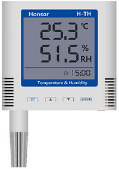

---

**1. 实验介绍**：

在冬季时，空气中的湿度很低，就是空气很干燥，再加上寒冷，人体的皮肤就容易过于干燥而裂，所以需要使用加湿器给家里的空气增加湿度，但是怎么知道空气过于干燥了呢？那就需要检测空气湿度的设备，前面我们已经学习过了XHT11温湿度传感器的工作原理。在这一课我们将结合XHT11温湿度传感器和I2C 128×32 LCD显示屏来制作一个温湿度仪表。

---

**2. 实验组件**

|  ||||
| ------------------------ | ------------------------ | ---------------------------- |---------------------------- |
|ESP32 主控板|DHT11温湿度传感器 x1| 母对母杜邦线若干|面包板 x1|
||||  |
|I2C 128×32 LCD显示屏 x1| 面包板跳线若干|Micro USB数据线 x1|   |

---

**3. 接线图：**

**原理图：**

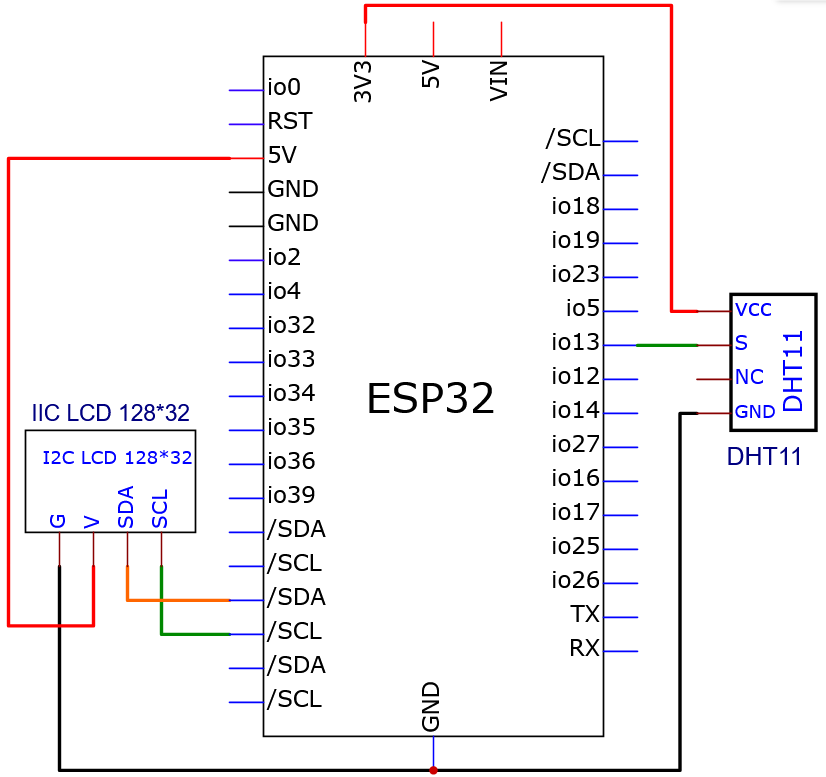

**实物接线图：**

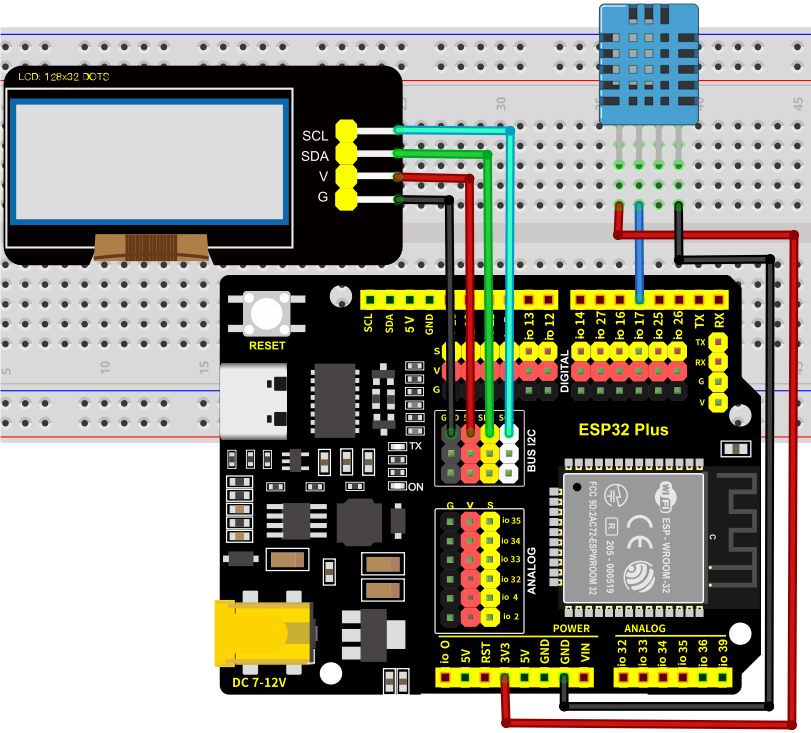

---

**4. 程序流程图：**

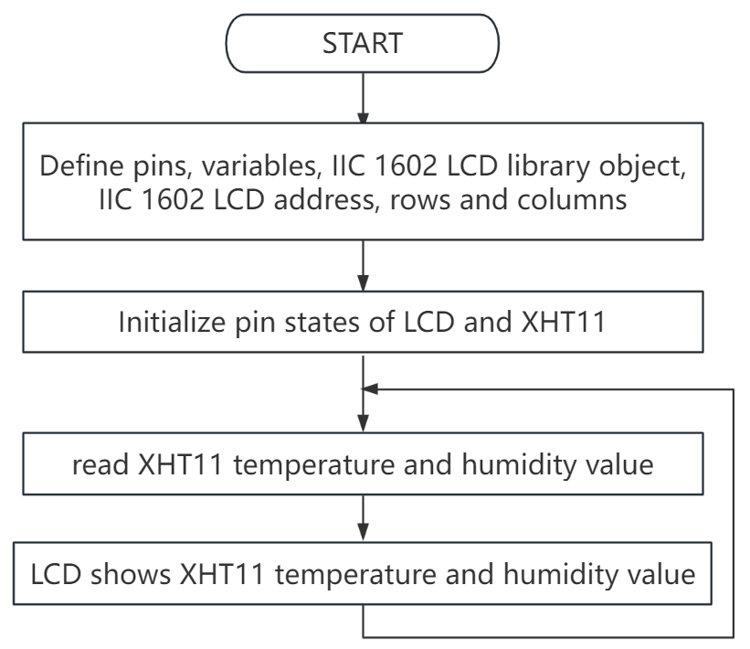

---

**5. 实验代码**

```python
'''
 * Filename    : Temperature-humidity meter
 * Thonny      : Thonny 4.1.7
 * Auther      : http//www.keyestudio.com
'''
from machine import Pin
import machine
import dht
import time
import lcd128_32_fonts
from lcd128_32 import lcd128_32

# 创建变量, 设置变量初始值为0.
temp = 0
humi = 0

# 关联DHT11引脚(13).
DHT = dht.DHT11(Pin(13))

# i2c配置引脚,地址和其他
clock_pin = 22
data_pin = 21
bus = 0
i2c_addr = 0x3f
use_i2c = True

# DHT11读取温湿度,LCD显示温湿度.
def scan_for_devices():
    i2c = machine.I2C(bus,sda=machine.Pin(data_pin),scl=machine.Pin(clock_pin))
    devices = i2c.scan()
    if devices:
        for d in devices:
            print(hex(d))
    else:
        print('no i2c devices')
        
# DHT11读取温湿度,LCD显示温湿度.
try:
    while True:
        DHT.measure()
        temp = int(DHT.temperature())
        humi = int(DHT.humidity())
        if use_i2c:
            scan_for_devices()
            lcd = lcd128_32(data_pin, clock_pin, bus, i2c_addr)         
        lcd.Clear()
        lcd.Cursor(0, 0)
        lcd.Display("temper:")
        lcd.Cursor(0, 8)
        lcd.Display(str(temp))
        lcd.Cursor(0, 11)
        lcd.Display("C")
        lcd.Cursor(2, 0)
        lcd.Display("Humid:")
        lcd.Cursor(2, 7)
        lcd.Display(str(humi))
        lcd.Cursor(2, 10)
        lcd.Display("%")
        time.sleep(0.5)
except:
    pass
```
---

**5. 实验结果**

将 ESP32 主控板通过Micro USB数据线与计算机相连供电，单击 运行代码，若代码运行不成功，并且“Shell”窗口出现报错提示信息。


需要添加库文件，请回到 **2-1-7 添加 MicroPython 库(重要)** 处参照其说明添加库，也可以点击 **[添加 MicroPython 库](   )** 跳转到 **2-1-7 添加 MicroPython 库(重要)** 处参照其说明添加库文件。

再次单击 运行代码，代码开始执行后。可以在I2C 128×32 LCD显示屏看到DHT11温湿度传感器检测到环境中的温度值和湿度值。


单击退出程序。

---

**6. 代码说明**

可以参照前面的课程 2-2-24 和 2-2-28 的代码说明，这里就不多做介绍了。

---


### 2-2-44 音量检测仪


---

**1. 实验介绍**：

音量检测仪用于检测声音大小级别特别是噪声的一种最基本的仪器。音量检测仪一般由声音传感器以及有效值指示表头（显示屏）等组成。在前面的项目中，我们已经学习过了声音传感器的工作原理，那么，在这一课我们将结合声音传感器和I2C 128×32 LCD显示屏来制作一个简易的音量检测仪。

---

**2. 实验组件：**

|  |||
| ------------------------ | ------------------------ | ---------------------------- |
|ESP32 主控板|声音传感器 x1| I2C 128×32 LCD显示屏 x1|
|||  |
| 公对母杜邦线 若干|Micro USB数据线 x1| 母对母杜邦线 若干  |

---

**3. 接线图：**

**原理图：**

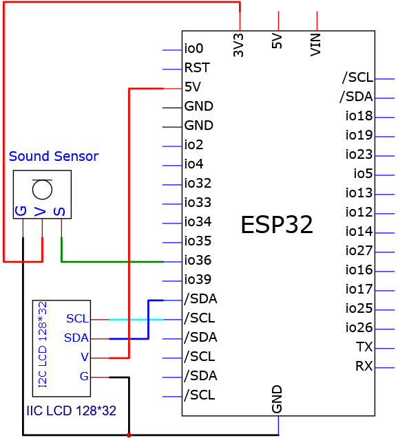

**实物接线图：**

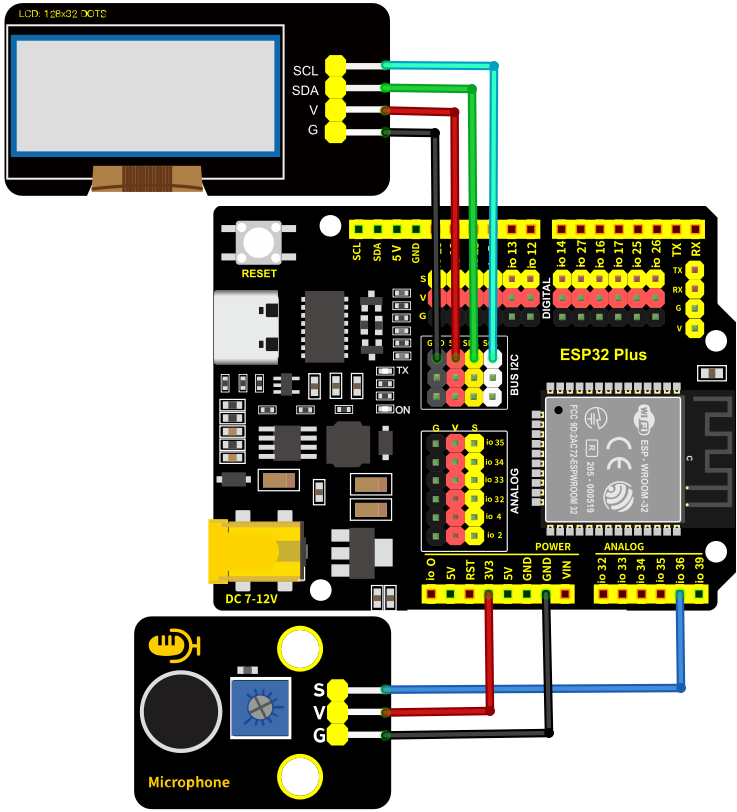

---

**4. 程序流程图：**

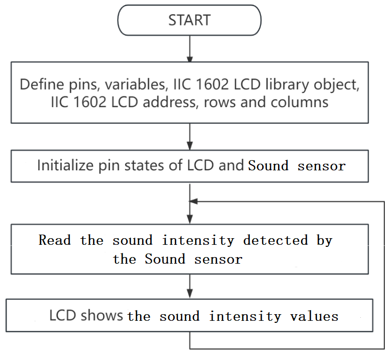

---

**5. 实验代码**

```python
'''
 * Filename    : Volume_Detector
 * Thonny      : Thonny 4.1.7
 * Auther      : http//www.keyestudio.com
'''
from machine import Pin, ADC
import machine
import time
import lcd128_32_fonts
from lcd128_32 import lcd128_32

# 开启并配置ADC，量程为0-3.3V
adc=ADC(Pin(36))
adc.atten(ADC.ATTN_11DB)
adc.width(ADC.WIDTH_12BIT)

# i2c配置引脚,地址和其他
clock_pin = 22
data_pin = 21
bus = 0
i2c_addr = 0x3f
use_i2c = True

# DHT11读取温湿度,LCD显示温湿度.
def scan_for_devices():
    i2c = machine.I2C(bus,sda=machine.Pin(data_pin),scl=machine.Pin(clock_pin))
    devices = i2c.scan()
    if devices:
        for d in devices: 
            print(hex(d))
    else:
        print('no i2c devices')
         
# 声音传感器检测声音并且读取音量ADC值,LCD显示ADC值.
try:
    while True:
        adcVal=adc.read()
        if use_i2c:
            scan_for_devices()
            lcd = lcd128_32(data_pin, clock_pin, bus, i2c_addr)         
        lcd.Cursor(0, 2)
        lcd.Display("Volume Detector")
        lcd.Cursor(2, 4)
        lcd.Display("Volume:")
        lcd.Cursor(2, 12)
        lcd.Display(str(adcVal))
        time.sleep(0.5)
except:
    pass

```
---

**5. 实验结果**

将 ESP32 主控板通过Micro USB数据线与计算机相连供电，单击 运行代码，若代码运行不成功，并且“Shell”窗口出现报错提示信息。


需要添加库文件，请回到 **2-1-7 添加 MicroPython 库(重要)** 处参照其说明添加库，也可以点击 **[添加 MicroPython 库](   )** 跳转到 **2-1-7 添加 MicroPython 库(重要)** 处参照其说明添加库文件。

再次单击 运行代码，代码开始执行后。可以在I2C 128×32 LCD显示屏看到声音传感器检测到声音强度的ADC值。


单击退出程序。

---

**6. 代码说明**

可以参照前面项目的代码说明，这里就不多做介绍了。

---

### 2-2-45 魔幻色彩音乐盒

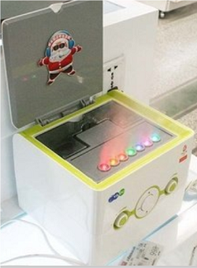

---

**1. 实验介绍**：

音乐盒又称八音盒，是一种通过机械力自动演奏音乐的玩具。它悠扬的乐声，经常勾起人们对美好往事的回忆。本项目实验使用超声波传感器、无源蜂鸣器和LED所制作的“魔法音乐盒”，能够让人隔空挥动手掌演奏音符，充满了魔幻色彩。

---

**2. 实验组件**

|   ||||
| ------------------------ | ------------------------ | ---------------------------- |---------------------------- |
|ESP32 主控板| NPN型三极管(S8050) x1| 无源蜂鸣器 x1 | 1kΩ电阻 x1 |
||| ||
| 超声波传感器 x1  |公对母杜邦线若干若干 |红色LED x7|220Ω电阻 x7  |
|||||
|面包板 x1 |面包板跳线若干 | Micro USB数据线 x1 | 10kΩ电阻 x1 |

---

**3. 接线图：**

**原理图：**

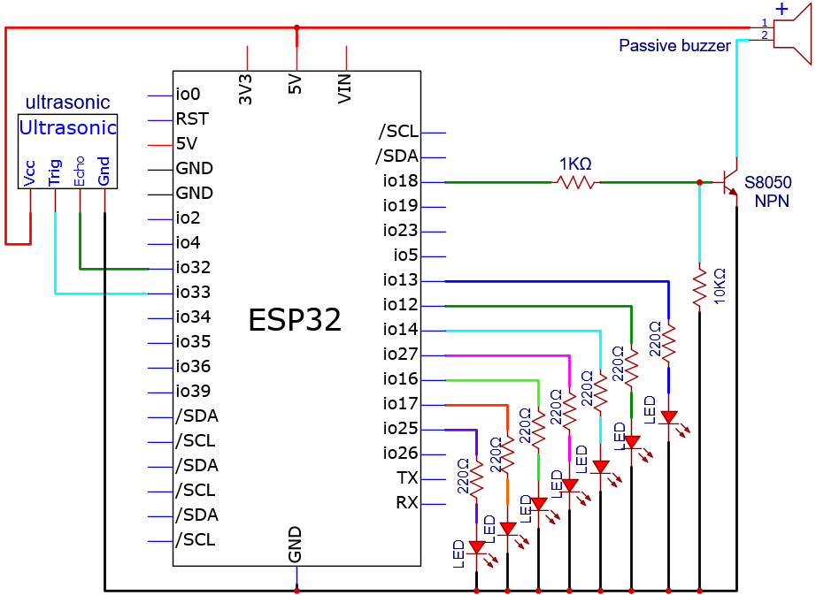

**实物接线图：**

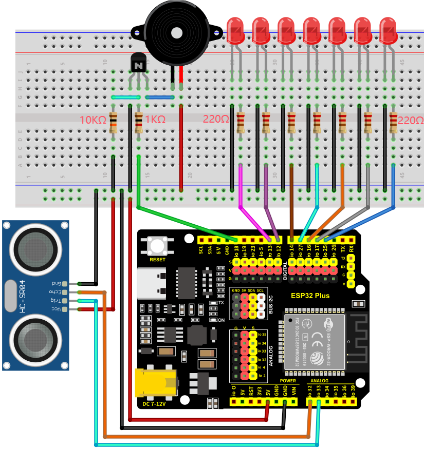

---

**4. 程序流程图：**

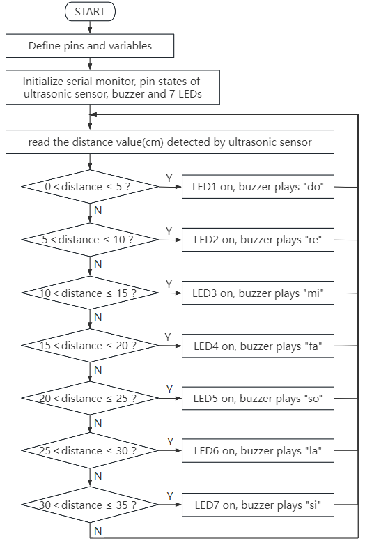

---

**5. 实验代码**

```python
'''
 * Filename    : Magic_Color_Music_Box 
 * Thonny      : Thonny 4.1.7
 * Auther      : http//www.keyestudio.com
'''
from machine import Pin, ADC, PWM
import machine 
import time  
from time import sleep 

# 7个led的数字引脚
led1 = Pin(13, Pin.OUT)
led2 = Pin(12, Pin.OUT)
led3 = Pin(14, Pin.OUT)
led4 = Pin(27, Pin.OUT)
led5 = Pin(16, Pin.OUT)
led6 = Pin(17, Pin.OUT)
led7 = Pin(25, Pin.OUT)

# Define the GPIO pin that is connected to the buzzer
buzzer = machine.PWM(machine.Pin(18))

# 定义无源蜂鸣器发声的playtone函数
def playtone(frequency):
    buzzer.duty_u16(1000)
    buzzer.freq(frequency)

# 定义超声波测距模块的控制引脚
Trig = Pin(33, Pin.OUT, 0) 
Echo = Pin(32, Pin.IN, 0)

distance = 0 # 将初始距离定义为0
soundVelocity = 340 # Set the speed of sound.
# getDistance()函数用于驱动超声波模块测量距离，
# Trig保持高电平10us以启动超声波模块
# Echo.value()用于读取超声波模块Echo引脚的状态，
# 然后使用时间模块的time.sleep_us()函数计算Echo的持续时间,
# Trig引脚的高电平，根据时间计算测量距离并返回值。
def getDistance():
    Trig.value(1)
    time.sleep_us(10)
    Trig.value(0)
    while not Echo.value():
        pass
    pingStart = time.ticks_us()
    while Echo.value():
        pass
    pingStop = time.ticks_us()
    pingTime = time.ticks_diff(pingStop, pingStart) // 2
    distance = int(soundVelocity * pingTime // 10000)
    return distance

# 让人隔空在超声波传感器前挥动手掌，超声波传感器检测距离，在不同的距离范围内，
# 无源蜂鸣器演奏不同音符，7个LED相互点亮.
while True:
    distance = getDistance()
    if distance > 0 and distance <= 5:
        led1.value(1)
        playtone(262)
        sleep(1)
    else:
        led1.value(0)
        buzzer.duty_u16(0)
        
    if distance > 5 and distance <= 10:
        led2.value(1)
        playtone(294)
        sleep(0.75)
    else:
        led2.value(0)
        buzzer.duty_u16(0)
    if distance > 10 and distance <= 15:
        led3.value(1)
        playtone(330)
        sleep(0.625)
    else:
        led3.value(0)
        buzzer.duty_u16(0)        
    if distance > 15 and distance <= 20:
        led4.value(1)
        playtone(349)
        sleep(0.5)
    else:
        led4.value(0)
        buzzer.duty_u16(0)
    if distance > 20 and distance <= 25:
        led5.value(1)
        playtone(392)
        sleep(0.375)
    else:
        led5.value(0)
        buzzer.duty_u16(0)        
    if distance > 25 and distance <= 30:
        led6.value(1)
        playtone(440)
        sleep(0.25)
    else:
        led6.value(0)
        buzzer.duty_u16(0)
    if distance > 35 and distance <= 40:
        led7.value(1)
        playtone(494)
        sleep(0.125)
    else:
        led7.value(0)
        buzzer.duty_u16(0)     
```
---

**6. 实验结果：**

将 ESP32 主控板通过Micro USB数据线与计算机相连供电，单击，代码开始执行，外接电源给ESP32 主控板供电。上电后，让人隔空在超声波传感器前挥动手掌，无源蜂鸣器演奏音符，7个LED相互点亮，充满了魔幻色彩。这样，模拟的魔幻色彩音乐盒就完成了。


单击退出程序。

---

**7. 代码说明：**

可以参照前面的课程 2-2-2、2-2-9、2-2-25 和 2-2-31 的代码说明，这里就不多做介绍了。

---

### 2-2-46 摇杆游戏机


---

**1. 实验介绍：**

在前面的项目实验中，我们已经学习了摇杆模块的工作原理和OLED显示屏。在本项目实验中，我们可不可以将它们相互组合做个好玩又有趣的摇杆游戏机？当然可以了，那我们还等什么呀，赶快行动吧。

---

**2. 实验组件**

|  |||
| ------------------------ | ------------------------ | ---------------------------- |
|ESP32 主控板 x1| 摇杆模块 x1| 公对母杜邦线若干|
||||
|OLED x1|Micro USB数据线 x1| 母对母杜邦线若干| 

---

**3. 接线图：**

**原理图：**

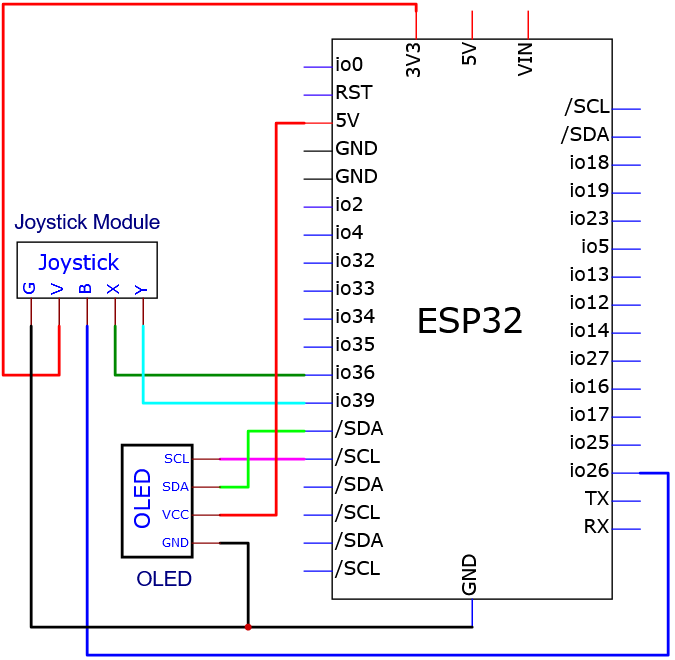

**实物接线图：**

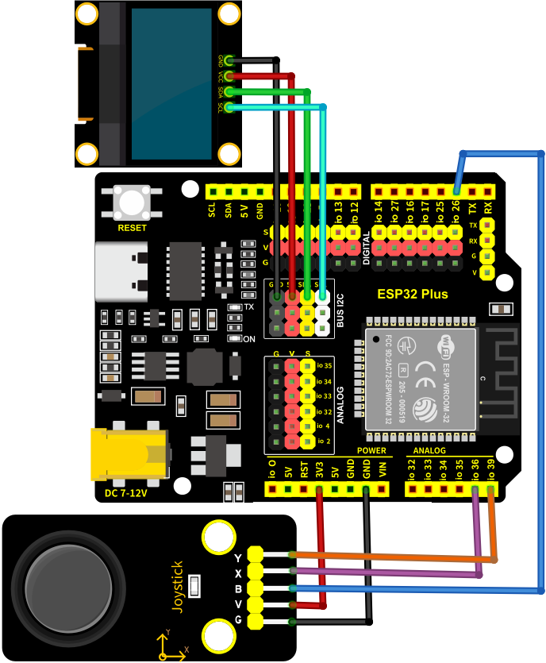

**4. 程序流程图：**

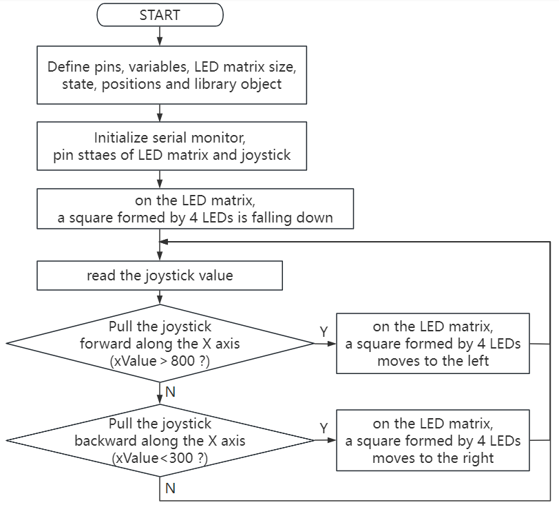

**5. 实验代码：**

```python
'''
 * Filename    : Joystick_Display 
 * Thonny      : Thonny 4.1.7
 * Auther      : http//www.keyestudio.com 
'''
from machine import Pin, ADC, SoftI2C
import machine 
import time  
import ssd1306
from time import sleep

# 初始化摇杆模块(ADC函数)
rocker_x=ADC(Pin(36)) 
rocker_y=ADC(Pin(39))
button_z=Pin(26,Pin.IN,Pin.PULL_UP)

# 将两个ADC通道的电压采集范围设置为0-3.3V，
# 数据采集宽度为0-4095.
rocker_x.atten(ADC.ATTN_11DB)
rocker_y.atten(ADC.ATTN_11DB)
rocker_x.width(ADC.WIDTH_12BIT)
rocker_y.width(ADC.WIDTH_12BIT)

# ESP32 Pin assignment 
i2c = SoftI2C(scl=Pin(22), sda=Pin(21))

# Set the width, height and i2c of the OLED
oled_width = 128
oled_height = 64
oled = ssd1306.SSD1306_I2C(oled_width, oled_height, i2c)

while True:
    # 读取摇杆模块的X轴、Y轴和Z轴的值
    xValue = rocker_x.read()
    yValue = rocker_y.read()
    zValue = button_z.value()
    xValue_string = str(xValue)
    yValue_string = str(yValue)
    zValue_string = str(zValue)

    # 显示X轴、Y轴和Z轴的值
    oled.text('X: ', 0, 0)
    oled.text(xValue_string, 20, 0)
    oled.text('Y: ', 0, 10)
    oled.text(yValue_string, 20, 10)
    oled.text('Z: ', 0, 20)
    oled.text(zValue_string, 20, 20)
    oled.show()
    time.sleep(0.15)
    oled.fill(0)
    
    # 根据X轴和Y轴的值判断摇杆的方向
    if yValue < 1000:
       oled.text('Direction:Down', 0, 35)
       oled.show()
    elif yValue > 3000:
       oled.text('Direction:Up', 0, 35)
       oled.show()
    elif xValue < 1000:
       oled.text('Direction:Left', 0, 35)
       oled.show()
    elif xValue > 3000:
       oled.text('Direction:Right', 0, 35)
       oled.show()
    else:
       oled.text('Direction:Center', 0, 35)
       oled.show()
    
    # 显示按钮状态
    if zValue == 1:
       oled.text('Button:Pressed', 0, 50)
       oled.show()
    else:
       oled.text('Button:Released', 0, 50)
       oled.show()
```

**6. 实验结果：**

将 ESP32 主控板通过Micro USB数据线与计算机相连供电，单击，代码开始执行，若代码运行不成功，并且“Shell”窗口出现报错提示信息。


需要添加库文件，请回到 **2-1-7 添加 MicroPython 库(重要)** 处参照其说明添加库，也可以点击 **[添加 MicroPython 库](   )** 跳转到 **2-1-7 添加 MicroPython 库(重要)** 处参照其说明添加库文件。

再次单击 运行代码，代码开始执行后，可以看到的现象是：移动或按下摇杆模块上的摇杆时，OLED显示屏显示的内容会相应的变化。

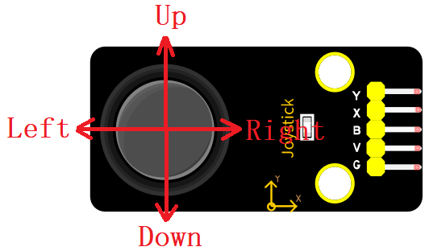

单击退出程序。

---

**7. 代码说明：**

可以参照前面项目的代码说明，这里就不多做介绍了。

---

### 2-2-47 乒乓球游戏

---

**1. 实验介绍**：

这是一个使用 OLED 显示屏和 ESP32 主控板设计的简单 OLED显示 游戏。 在 OLED显示 游戏中，按up_button按键时，OLED显示“up_button:0”；而按down_button按键时，OLED显示“down_button:0”。。

---

**2. 实验组件**

|  | ||
| ------------------------ | ------------------------ | ---------------------------- |
| ESP32 主控板| 按键帽 x1  | OLED x1 | 
|||  |
|面包板跳线若干 | Micro USB数据线 x1 | 面包板 x1 | 
|||  |
| 按键开关 x2  | 10KΩ电阻 x2| 母对母杜邦线若干  |  

---

**3. 接线图：**

**原理图：**

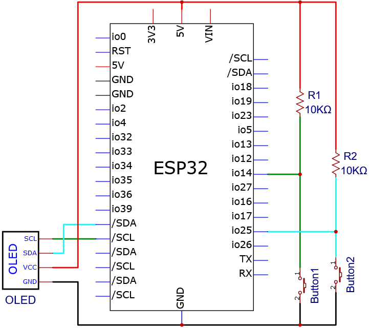

**实物接线图：**

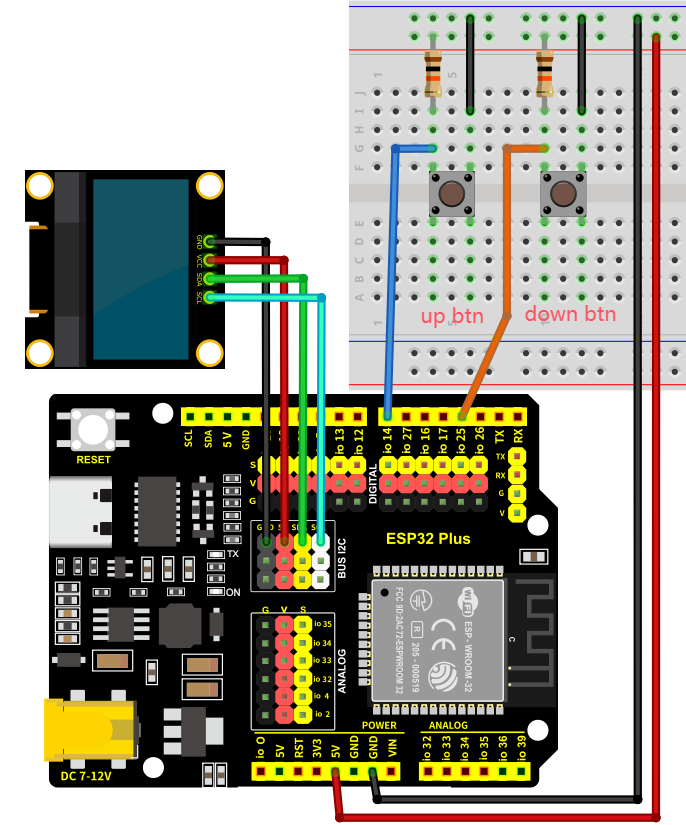

---

**4. 程序流程图：**

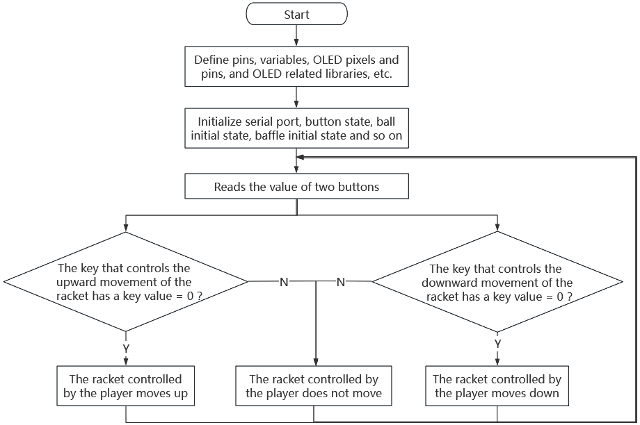

---

**5. 实验代码**

```python
'''
 * Filename    : Ping Pong Game
 * Thonny      : Thonny 4.1.7
 * Auther      : http//www.keyestudio.com
'''
# Import Pin,SoftI2C,ssd1306,sleep,gfx libraries
from machine import Pin, SoftI2C
import ssd1306
from time import sleep

up_button = Pin(14, Pin.IN, Pin.PULL_UP) # Up_Button
down_button = Pin(25, Pin.IN, Pin.PULL_UP) # Down_Button

# ESP32 Pin assignment 
i2c = SoftI2C(scl=Pin(22), sda=Pin(21))

# Set the width, height and i2c of the OLED
oled_width = 128
oled_height = 64 
oled = ssd1306.SSD1306_I2C(oled_width, oled_height, i2c)

# 读取两个按键值，并且操作两个按键，OLED显示对应的信息.
while True:
    upbutton = up_button.value()
    downbutton = down_button.value()
    upbutton_string = str(upbutton)
    downbutton_string = str(downbutton)

    if upbutton == 0: # 按下up_button按键时
        oled.text('Ping Pong Game', 0, 0)
        oled.text('up_button:', 0, 25)
        oled.text(upbutton_string, 80, 25)
        oled.show()
    else:  # 松开按键时
        oled.fill(0)
    if downbutton == 0: # 按下down_button按键时
        oled.text('Ping Pong Game', 0, 0)
        oled.text('down_button:', 0, 25)
        oled.text(downbutton_string, 100, 25)
        oled.show()
    else:  # 松开down_button按键时
        oled.fill(0)
```
---

**6. 实验结果**

将 ESP32 主控板通过Micro USB数据线与计算机相连供电，单击，代码开始执行，若代码运行不成功，并且“Shell”窗口出现报错提示信息。


需要添加库文件，请回到 **2-1-7 添加 MicroPython 库(重要)** 处参照其说明添加库，也可以点击 **[添加 MicroPython 库](   )** 跳转到 **2-1-7 添加 MicroPython 库(重要)** 处参照其说明添加库文件。

再次单击 运行代码，代码开始执行后，按up_button按键时，OLED显示“up_button:0”；而按down_button按键时，OLED显示“down_button:0”。

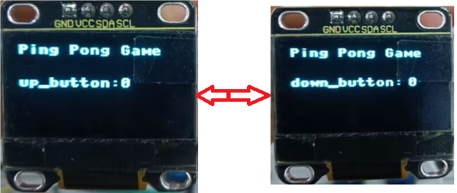


单击退出程序。

---

**7. 代码说明**

可以参照前面的课程 2-2-14 和 2-2-29 的代码说明，这里就不多做介绍了。

---

### 2-2-48 控制舵机和LED

---

**1. 实验介绍**

前面已经学习过舵机，红色LED，按键开关和可调电位器等相关知识，那它们可不可以组合制成更复杂的实验呢？当然可以。则在本实验中，按键开关控制红色LED亮起，然后旋转可调电位器控制舵机来回缓慢地转动。

---

**2. 实验组件**

|  ||||
| ------------------------ | ------------------------ | ---------------------------- |---------------------------- |
| ESP32 主控板| 可调电位器 x1  | 红色LED x1| 220Ω电阻 x1  |
|| |||
| 按键开关 x1  |舵机 x1| 10KΩ电阻 x1  | Micro USB数据线 x1  |
|||||
|面包板 x1 |面包板跳线若干 |电池盒 x1|AA电池(<span style="color: rgb(255, 76, 65);">自备</span>) x6|

---

**3. 接线图：**

**原理图：**

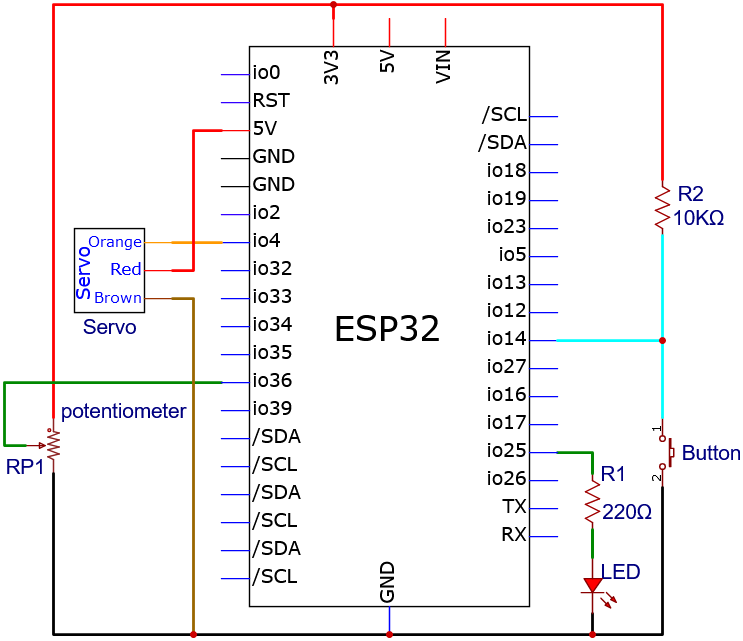

**实物接线图：**

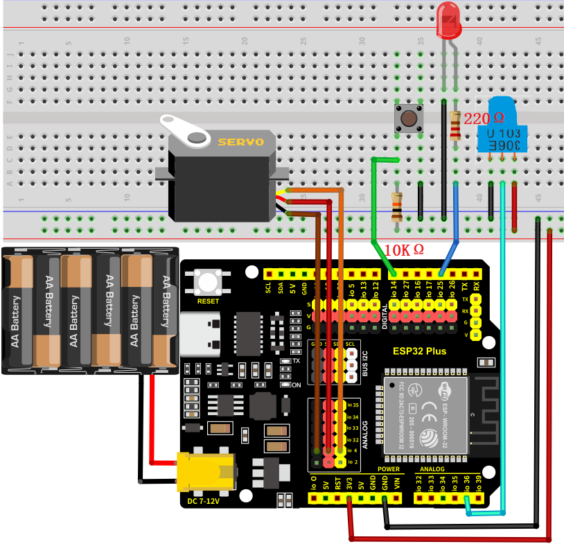

---

**4. 程序流程图：**

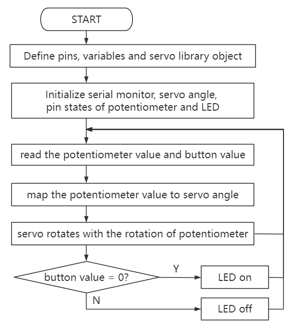

---

**5. 实验代码：**

```python
'''
 * Filename    : Dimming_Light
 * Thonny      : Thonny 4.1.7
 * Auther      : http//www.keyestudio.com
'''
from machine import Pin,PWM,ADC
import time 

# 创建引脚25为LED对象，设置引脚25为输出
led = Pin(25, Pin.OUT)

# Create a PWM (Pulse Width Modulation) object on Pin 4
servo = PWM(Pin(4,Pin.OUT),10000)

# Set the frequency of the PWM signal to 50 Hz, common for servos
servo.freq(50)

# Define a function for interval mapping
def interval_mapping(x, in_min, in_max, out_min, out_max):
    return (x - in_min) * (out_max - out_min) / (in_max - in_min) + out_min

# Define a function to write an angle to the servo
def servo_write(pin, angle):

    pulse_width = interval_mapping(angle, 0, 180, 0.5, 2.5) # Calculate the pulse width
    duty = int(interval_mapping(pulse_width, 0, 20, 0, 1023))     # Calculate the duty cycle
    pin.duty(duty) # Set the duty cycle of the PWM signal
    
button = Pin(14, Pin.IN, Pin.PULL_UP) # Button

# 开启并配置ADC，量程为0-3.3V
adc=ADC(Pin(36))
adc.atten(ADC.ATTN_11DB)
adc.width(ADC.WIDTH_12BIT)  

while True:
    # Read the current value of the 'button' object (0 or 1) and store it in the 'button_status' variable
    button_status = button.value()
    # If the button is pressed (value is 0)
    if button_status == 0: 
        led.value(1) # Turn the LED on
    # If the button is not pressed (value is 1) 
    else:
        led.value(0)  # turn the LED off
    adcValue=adc.read() # 读取电位器的ADC值
    angle=(adcValue*180)/4096 # 电位器的ADC值转化成舵机的角度
    servo_write(servo, int(angle)) # 舵机转动角度
    time.sleep_ms(50)
```
---

**5. 实验结果**

将 ESP32 主控板通过Micro USB数据线与计算机相连供电，单击，代码开始执行。按下按键开关时，LED亮起，然后旋转可调电位器，舵机则来回缓慢地转动。


单击退出程序。

---

**6. 代码说明**

可以参照前面的课程 2-2-1，2-2-14，2-2-17 和 2-2-31 的代码说明，这里就不多做介绍了。

---

### 2-2-49 数字骰子


---

**1. 实验介绍**

本项目教程旨在模拟使用 74HC595 移位寄存器和 7 段数字显示器的掷骰子，通过直接摇动倾斜开关来激活掷骰子模拟。在此操作时，数字显示屏在 1 到 6 之间的随机数之间循环，模拟掷骰子。短暂的间隔后，显示屏停止，显示一个表示掷骰子结果的随机数。 

---

**2. 实验组件**

|  |||
| ------------------------ | ------------------------ | ---------------------------- |
|ESP32 主控板| 四位数码管 x1| 一位数码管 x1 | 
||||
|220Ω电阻 x8  |倾斜开关 x1|公对母杜邦线若干若干 |
|||| 
|面包板 x1 |面包板跳线若干 | Micro USB数据线 x1 | 

---

**3. 接线图：**

**原理图：**

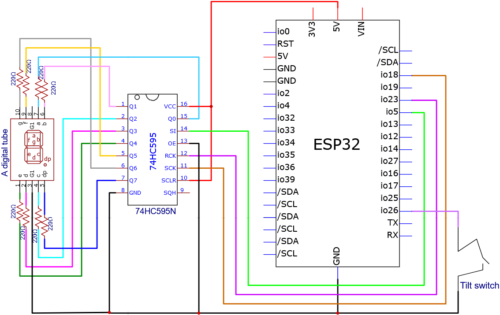

**实物接线图：**

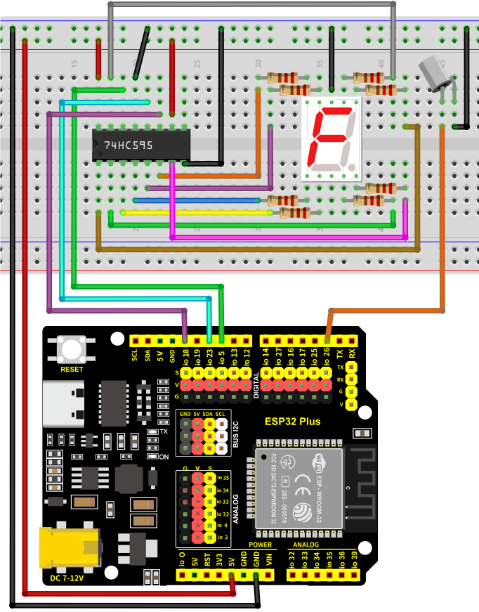

---

**4. 程序流程图：**

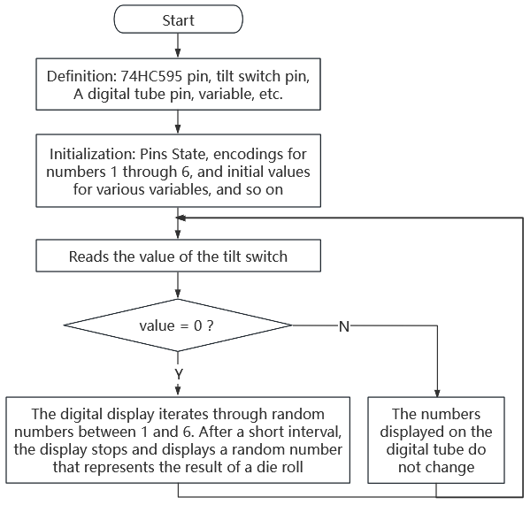

---

**5. 实验代码：**

```python
'''
 * Filename    : Digital_Dice
 * Thonny      : Thonny 4.1.7
 * Auther      : http//www.keyestudio.com
'''
import machine
import time
import random

# Define the segment code for a common anode 7-segment display
SEGCODE = [0x3f, 0x06, 0x5b, 0x4f, 0x66, 0x6d, 0x7d, 0x07, 0x7f, 0x6f]

# Initialize the pins for the 74HC595 shift register
si = machine.Pin(5, machine.Pin.OUT)  # SI of 74HC595
rck = machine.Pin(23, machine.Pin.OUT)  # RCK of 74HC595
sck = machine.Pin(18, machine.Pin.OUT)  # SCK of 74HC595

tilt = machine.Pin(26, machine.Pin.IN) # Tilt pin

# Define the hc595_shift function to shift data into the 74HC595 shift register
def hc595_shift(dat):
    # Set the RCLK pin to low
    rck.off()

    # Iterate through each bit (from 7 to 0)
    for bit in range(7, -1, -1):
        # Extract the current bit from the input data
        value = 1 & (dat >> bit)

        # Set the SRCLK pin to low
        sck.off()

        # Set the value of the SDI pin
        si.value(value)

        # Clock the current bit into the shift register by setting the SRCLK pin to high
        sck.on()

    # Latch the data into the storage register by setting the RCLK pin to high
    rck.on()

# Initialize the random seed
random.seed(time.ticks_us())

num = 1
tilt_state = False

# Define the tilt callback function to toggle the tilt state
def tilt_callback(pin):
    global tilt_state
    tilt_state = not tilt_state

# Attach the tilt callback function to the falling edge of the tilt pin
tilt.irq(trigger=machine.Pin.IRQ_FALLING, handler=tilt_callback)

# Continuously display the current digit on the 7-segment display, scrolling if tilt is not shaked
while True: 

    # Display the current digit on the 7-segment display
    hc595_shift(SEGCODE[num])

    # If the tilt is shaked and tilt state is True
    if tilt_state:
        pass

    # If the tilt is shaked again and tilt state is False, generate a new random digit
    if not tilt_state:
        num = random.randint(1, 6)
        time.sleep_ms(100) # Adjust this value to control the display refresh rate
```
---

**5. 实验结果**

将 ESP32 主控板通过Micro USB数据线与计算机相连供电，单击，代码开始执行。直接摇动倾斜开关来激活掷骰子模拟，在此操作时，数字显示屏在 1 到 6 之间的随机数之间循环，模拟掷骰子。短暂的间隔后，显示屏停止，显示一个表示掷骰子结果的随机数。


单击退出程序。

---

**6. 代码说明**

1\. 定义一个公共阴极7段数码管显示的段代码， <span style="color: rgb(255, 76, 65);">SEGCODE[]</span>：一个数组，用于在公共阴极数码管上存储表示数字 1 到 6 的编码。

```python
SEGCODE = [0x3f, 0x06, 0x5b, 0x4f, 0x66, 0x6d, 0x7d, 0x07, 0x7f, 0x6f]
```
2\. 变量初始化.

- <span style="color: rgb(255, 76, 65);">si</span>、 <span style="color: rgb(255, 76, 65);">rck</span>、 <span style="color: rgb(255, 76, 65);">sck</span>：74HC595的引脚和输出模式。 <span style="color: rgb(255, 76, 65);">tilt</span>：连接倾斜开关的数字引脚和输出模式。

```python
si = machine.Pin(5, machine.Pin.OUT)  # SI of 74HC595
rck = machine.Pin(23, machine.Pin.OUT)  # RCK of 74HC595
sck = machine.Pin(18, machine.Pin.OUT)  # SCK of 74HC595

tilt = machine.Pin(26, machine.Pin.IN) # Tilt pin
```
3\. 定义hc595_shift函数将数据移位到74HC595移位寄存器中.

```python
def hc595_shift(dat):
    # Set the RCLK pin to low
    rck.off()

    # Iterate through each bit (from 7 to 0)
    for bit in range(7, -1, -1):
        # Extract the current bit from the input data
        value = 1 & (dat >> bit)

        # Set the SRCLK pin to low
        sck.off()

        # Set the value of the SDI pin
        si.value(value)

        # Clock the current bit into the shift register by setting the SRCLK pin to high
        sck.on()

    # Latch the data into the storage register by setting the RCLK pin to high
    rck.on()
```

4\. 初始化random seed.

```python
random.seed(time.ticks_us())
```
5\. 定义 <span style="color: rgb(255, 76, 65);">tilt_callback()</span> 函数来切换倾斜状态.

```python
def tilt_callback(pin):
    global tilt_state
    tilt_state = not tilt_state
```
6\. 将 <span style="color: rgb(255, 76, 65);">tilt_callback()</span> 函数附加到倾斜开关的下拉输入状态.
```python
tilt.irq(trigger=machine.Pin.IRQ_FALLING, handler=tilt_callback)
```
7\. 在7段数码管上连续显示当前数字，如果倾斜开关不震动时则数字不停地滚动；如果倾斜开关震动后再停下来则显示具体的数字。

```python
while True: 

    # Display the current digit on the 7-segment display
    hc595_shift(SEGCODE[num])

    # If the tilt is shaked and tilt state is True
    if tilt_state:
        pass

    # If the tilt is shaked again and tilt state is False, generate a new random digit
    if not tilt_state:
        num = random.randint(1, 6)
        time.sleep_ms(100) # Adjust this value to control the display refresh rate
```
---

### 2-2-50 猜数字

**1. 实验介绍**

在前面实验中，我们学会了一位数码管显示数字、学会了使用红外接收器，并将接收到的遥控器对应的键值打印出来。在这一实验课程中，我们将红外接收器和一位数码管组合实验，实现用红外遥控器控制一位数码管显示数字。

在这一实验课程中，我们使用“①”、“②”、“③”、“④”、“⑤”、“⑥”、“⑦”、“⑧”、“⑨”、“0”等十个按键来控制一位数码管显示对应的数字；使用“0”按键来控制一位数码管不显示。如果想要使用“OK”键来控制外接LED灯亮和灭的两种情况该如何实现呢？这一实验课程我们将学习使用一个变量 —— flag，来实现同一个按键控制led灯亮灭的效果。

变量 flag 存储为 8 位（1 个字节）的数值形式，**只能是 True (1) 或是 False (0)**。变量 flag 的值显示为 True 或 False（在使用 Print 的时候），或者 #TRUE# 或 #FALSE#（在使用 Write # 的时候）。使用关键字 True 与 False 可将 变量 flag 赋值为这两个状态中的一个。

设置代码，按下 “OK” 键且满足某一条件，点亮外接LED灯；按下“OK”键且满足另一条件，熄灭外接LED灯。这个条件我们用 变量 flag 来实现是最简单方便的，因为 变量 flag 只有 True 或是 False 两种状态。我们只需要设置按下“OK”键的同时 flag 为 true，即可点亮外接LED灯；同理，按下“OK”键的同时 flag 为 false，熄灭外接LED灯。

---

**2. 实验组件**

|  ||||
| ------------------------ | ------------------------ | ---------------------------- |---------------------------- |
|ESP32 主控板| 红外接收器 x1 |一位数码管 x1  | 10KΩ电阻 x1|
|||||
|面包板 x1 |面包板跳线若干 | Micro USB数据线 x1  |220Ω电阻 x9|
|||  |   |
|红外遥控器 x1 | 红色LED x1 |  |   |

---

**3. 接线图：**

**原理图：**

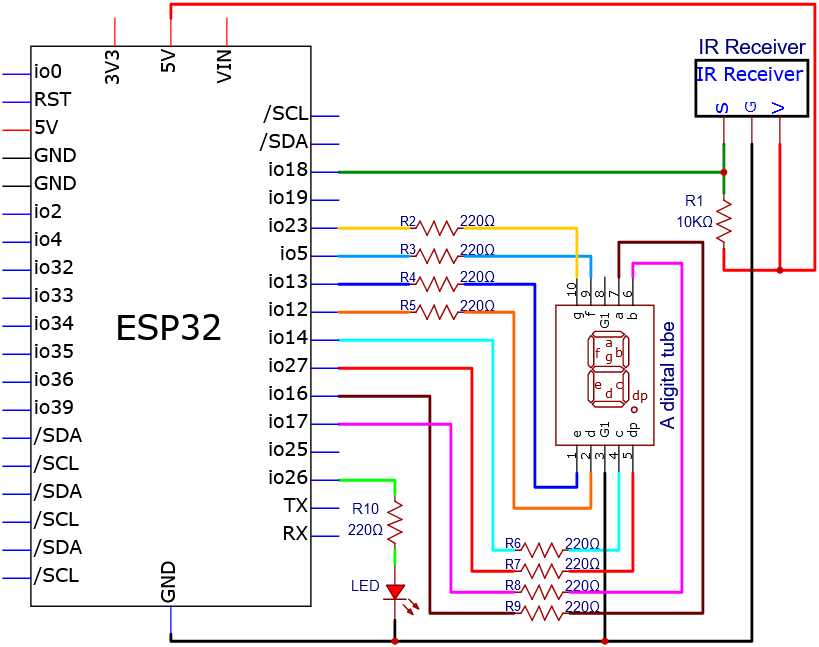

**实物接线图：**

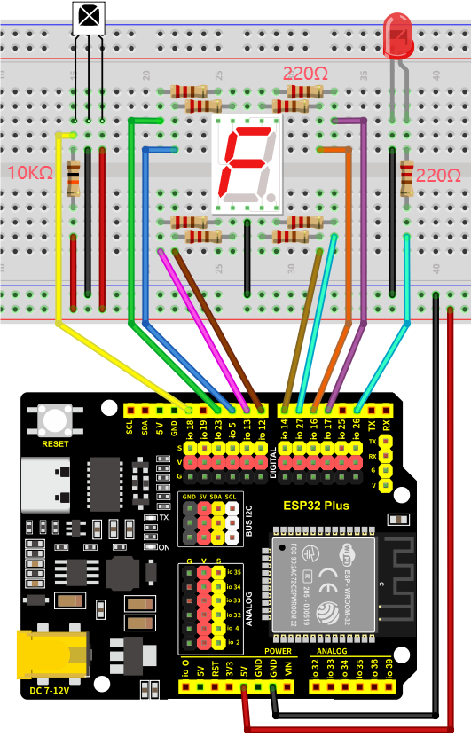

---

**4. 程序流程图：**

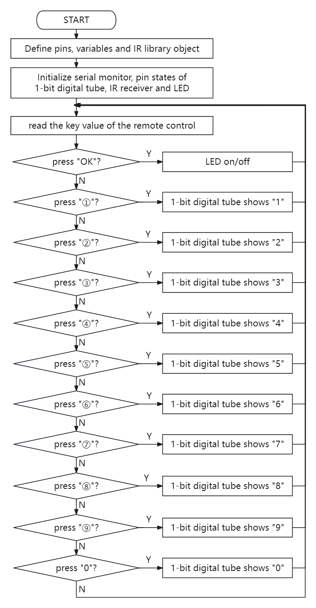

---

**5. 实验代码：**

```python
'''
 * Filename    : Guess_Numbers
 * Thonny      : Thonny 4.1.7
 * Auther      : http//www.keyestudio.com
'''
# 导入irGetCMD,Pin的库.
from irrecvdata import irGetCMD
from machine import Pin

# 将红外接收器与GPIO18关联.
recvPin = irGetCMD(18)
 
# 配置七段数码管引脚（这里以共阴极为例）
a = Pin(16, Pin.OUT)
b = Pin(17, Pin.OUT)
c = Pin(14, Pin.OUT)
d = Pin(12, Pin.OUT)
e = Pin(13, Pin.OUT)
f = Pin(5, Pin.OUT) 
g = Pin(23, Pin.OUT)
dp = Pin(27, Pin.OUT)

# 定义LED灯引脚连接到IO26
led = Pin(26, Pin.OUT)

flag = 1          
 
try:
    while True:
         irValue = recvPin.ir_read() # 调用ir_read()来读取按键的值并将其赋值给irValue.
         if irValue:
            print(irValue)
            if irValue == '0xff02fd' and flag == 1: # 按下遥控器的“OK”键并且接收数字“OK”
              led.value(1)   
              flag = 0 
            elif irValue == '0xff02fd' and flag == 0: # 按下遥控器的“OK”键并且接收数字“OK”
              led.value(0)   
              flag = 1            
            elif irValue == '0xff6897': # 按下遥控器的“1”键
                a.value(0)   # 显示数字1
                b.value(1)
                c.value(1)
                d.value(0)
                e.value(0)
                f.value(0)
                g.value(0)
                dp.value(0)  
            elif irValue == '0xff9867': # 按下遥控器的“2”键
                a.value(1)  # 显示数字2 
                b.value(1)
                c.value(0)
                d.value(1)
                e.value(1)
                f.value(0)
                g.value(1)
                dp.value(0) 
            elif irValue == '0xffb04f': # 按下遥控器的“3”键
                a.value(1) # 显示数字3  
                b.value(1)
                c.value(1)
                d.value(1)
                e.value(0)
                f.value(0)
                g.value(1)
                dp.value(0) 
            elif irValue == '0xff30cf': # 按下遥控器的“4”键
                a.value(0)  # 显示数字4 
                b.value(1)
                c.value(1)
                d.value(0)
                e.value(0)
                f.value(1)
                g.value(1)
                dp.value(0) 
            elif irValue == '0xff18e7': # 按下遥控器的“5”键
                a.value(1)  # 显示数字5 
                b.value(0)
                c.value(1)
                d.value(1)
                e.value(0)
                f.value(1)
                g.value(1)
                dp.value(0) 
            elif irValue == '0xff7a85': # 按下遥控器的“6”键
                a.value(1)  # 显示数字6 
                b.value(0)
                c.value(1)
                d.value(1)
                e.value(1)
                f.value(1)
                g.value(1)
                dp.value(0) 
            elif irValue == '0xff10ef': # 按下遥控器的“7”键            
                a.value(1) # 显示数字7  
                b.value(1)
                c.value(1)
                d.value(0)
                e.value(0)
                f.value(0)
                g.value(0)
                dp.value(0)    
            elif irValue == '0xff38c7': # 按下遥控器的“8”键
                a.value(1)  # 显示数字8 
                b.value(1)
                c.value(1)
                d.value(1)
                e.value(1)
                f.value(1)
                g.value(1)
                dp.value(0) 
            elif irValue == '0xff5aa5': # 按下遥控器的“9”键
                a.value(1)  # 显示数字9 
                b.value(1)
                c.value(1)
                d.value(1)
                e.value(0) 
                f.value(1)
                g.value(1)
                dp.value(0) 
            elif irValue == '0xff4ab5': # 按下遥控器的“0”键
                a.value(1) # 显示数字0  
                b.value(1)
                c.value(1)
                d.value(1)
                e.value(1)
                f.value(1)
                g.value(0)
                dp.value(0) 
            elif irValue == '0xff42bd': # 按下遥控器的“*”键
                a.value(0) # 不显示  
                b.value(0)
                c.value(0)
                d.value(0)
                e.value(0)
                f.value(0)
                g.value(0)
                dp.value(0)
except:
    pass
```
---

**5. 实验结果**

将 ESP32 主控板通过Micro USB数据线与计算机相连供电，单击 运行代码，若代码运行不成功，并且“Shell”窗口出现报错提示信息。


需要添加库文件，请回到 **2-1-7 添加 MicroPython 库(重要)** 处参照其说明添加库，也可以点击 **[添加 MicroPython 库](   )** 跳转到 **2-1-7 添加 MicroPython 库(重要)** 处参照其说明添加库文件。

再次单击 运行代码，代码开始执行。找到红外遥控器，拔出绝缘片，安装好电池，对准红外接收器的接收头。第一次按下红外遥控器上的 “ **OK** ” 键，外接LED灯点亮，实现开灯的效果。

再次按下红外遥控器上的 “ **OK** ” 键，外接LED灯熄灭，实现关灯的效果。

按下红外遥控器上的 “ **①** ” 键，一位数码管显示数字1。

按下红外遥控器上的 “ **②** ” 键，一位数码管显示数字2。

按下红外遥控器上的 “ **③** ” 键，一位数码管显示数字3。

按下红外遥控器上的 “ **④** ” 键，一位数码管显示数字4。

按下红外遥控器上的 “ **⑤** ” 键，一位数码管显示数字5。

按下红外遥控器上的 “ **⑥** ” 键，一位数码管显示数字6。

按下红外遥控器上的 “ **⑦** ” 键，一位数码管显示数字7。

按下红外遥控器上的 “ **⑧** ” 键，一位数码管显示数字8。

按下红外遥控器上的 “ **⑨** ” 键，一位数码管显示数字9。

按下红外遥控器上的 “ **0** ” 键，一位数码管显示数字0。

按下红外遥控器上的 “ * ” 键，一位数码管不显示。

单击退出程序。

---

**6. 代码说明**

| 代码                | 说明                                                         |
| ------------------- | ------------------------------------------------------------ |
| flag = 1 | 设置一个变量 flag 为数值是 1 。         |
| flag = 0        | 变量 flag 赋值为 0 ，以便再次按下 “OK” 键时满足熄灭LED的条件。 |

---

### 2-2-51 智能门禁系统

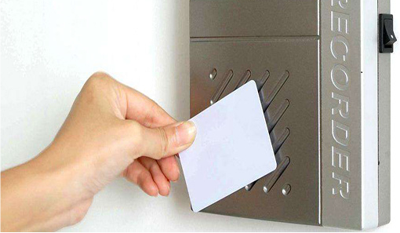

---

**1. 实验介绍：**

生活中，很多门禁系统都是使用射频模块进行开锁的，既方便又安全。并且在前面的项目课程中已经学习过了RFID RC522刷卡模块、MP3模块上小喇叭扬声器和舵机的工作原理。那么在这一项目实验中，我们将学习利用RFID RC522刷卡模块、MP3模块上小喇叭扬声器和舵机设置一个智能门禁系统。

原理很简单，在RFID RC522刷卡模块上的感应区，使用IC卡或者钥匙卡来开锁，舵机的作用即门禁锁打开，MP3模块上小喇叭扬声器语音播报磁卡是否正确，门是否打开。

---

**2. 实验组件：**

|  | ||
| ------------------------ | ------------------------ | ---------------------------- |
|ESP32 主控板|RFID刷卡模块 x1    | 母对母杜邦线若干|
||||
|IC 磁卡/钥匙扣 x1| Micro USB数据线 x1 |舵机 x1|

---

**3. 接线图：**

**原理图：**

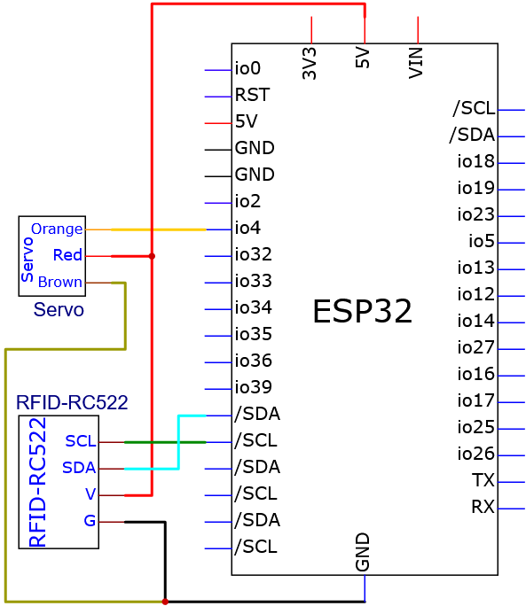

**实物接线图：**

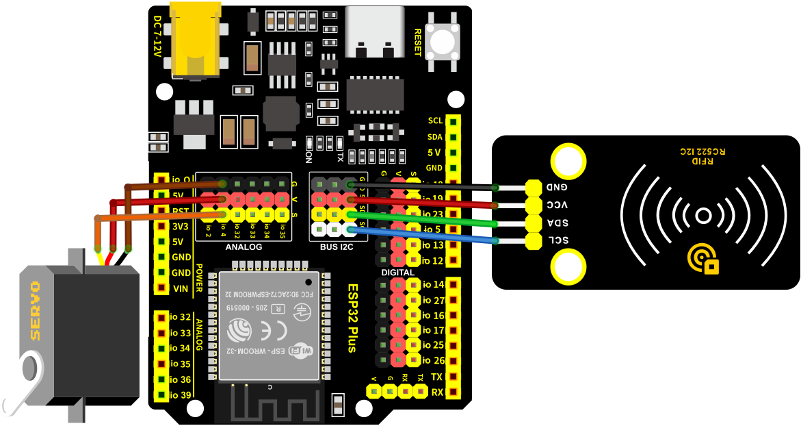

---

**4. 程序流程图：**

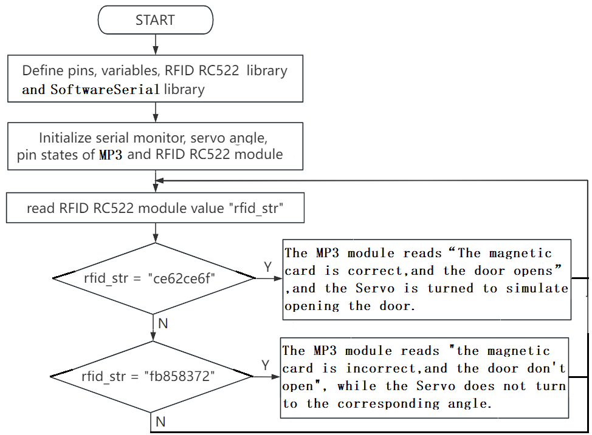

---

**5. 实验代码：**

**<span style="background:#ff0;color:#000">特别注意：对于不同的IC卡和钥匙扣，其读取的IC卡和钥匙扣的UID码值可能都不一样。在代码运行前，需要将你自己的IC卡和钥匙扣的UID码值替换程序代码中的UID码（UID码在前面教程 2-2-30 的实验可以得知），替换位置如下图所示。</span>**

```python
'''
 * Filename    : RFID_Control_Servo
 * Thonny      : Thonny 4.1.7
 * Auther      : http//www.keyestudio.com
'''
from machine import Pin, PWM
import time
from mfrc522_i2c import mfrc522

#定义IO4的输出频率为50Hz，分配给PWM.
servoPin = PWM(Pin(4)) 
servoPin.freq(50)
servoPin.duty(256)

# i2c config.
addr = 0x28
scl = 22
sda = 21

# 初始化mfrc522的引脚和地址.
rc522 = mfrc522(scl, sda, addr)
rc522.PCD_Init()
rc522.ShowReaderDetails()  # 显示PCD-MFRC522读卡器详细信息.

# 白色磁卡和绿色钥匙扣的UID码值.
uid1 = [180, 180, 170, 219]
uid2 = [231, 185, 101, 101]

# 舵机的初始角度
servoPin.duty_u16(1638)
time.sleep(1)

# 读取白色磁卡和绿色钥匙扣的UID码值, 正确的UID码值控制舵机转动.
while True:
    if rc522.PICC_IsNewCardPresent():
        #print("Is new card present!")
        if rc522.PICC_ReadCardSerial() == True:
            print("Card UID:", end=' ')
            print(rc522.uid.uidByte[0 : rc522.uid.size])
            if rc522.uid.uidByte[0 : rc522.uid.size] == uid1 or rc522.uid.uidByte[0 : rc522.uid.size] == uid2:
                servoPin.duty_u16(8100)
                time.sleep(1)
            else :
                servoPin.duty_u16(1638)
                time.sleep(1)
```
---

**5. 实验结果:**

将 ESP32 主控板通过Micro USB数据线与计算机相连供电，单击 运行代码，若代码运行不成功，并且“Shell”窗口出现报错提示信息。


需要添加库文件，请回到 **2-1-7 添加 MicroPython 库(重要)** 处参照其说明添加库，也可以点击 **[添加 MicroPython 库](   )** 跳转到 **2-1-7 添加 MicroPython 库(重要)** 处参照其说明添加库文件。

再次单击 运行代码，代码开始执行。使用正确的IC卡或者钥匙扣刷卡接触RFID刷卡模块上的感应区时，舵机转动到相应的角度模拟开门的效果；否则，使用不正确的IC卡或者钥匙扣接触RFID刷卡模块上的感应区时，舵机未转动。同时，“Shell”窗口将打印出RFID刷卡模块读取到的数据信息。


单击退出程序。

---

**6. 代码说明:**

在前面的课程中，使用RFID刷卡模块已经测试出来了IC卡和钥匙扣的UID码。这一课利用对应的UID码信息来控制，舵机转动对应的角度，模拟开门的效果。

---

### 2-2-52 倒车检测仪

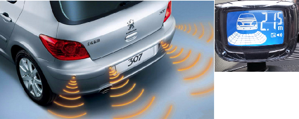

---

**1. 实验介绍**

蝙蝠飞行与获取猎物是通过回声定位的。回声定位：某些动物能通过口腔或鼻腔把从喉部产生的超声波发射出去，利用折回的声音来定向，这种空间定向的方法称为回声定位。科学家们从蝙蝠身上得到的启示发明了雷达，即雷达的天线相当于蝙蝠的嘴，而天线发出的无线电波就相当于蝙蝠的超声波，雷达接收电波的荧光屏就相当于蝙蝠的耳朵。

这一课我们就来学习制作一个简易雷达。将HC-SR04 超声波传感器、无源蜂鸣器模块和OLED模块组合实验，利用距离大小控制无源蜂鸣器模块发出不同的音调，然后把距离值显示在OLED模块上。这样就搭建好了一个简易的倒车检测仪。

---

**2. 实验组件**

|  ||||
| ------------------------ | ------------------------ | ---------------------------- |---------------------------- |
|ESP32 主控板| OLED x1|公对母杜邦线若干|无源蜂鸣器 x1 | 
|||||
|超声波传感器 x1|面包板 x1 |NPN型三极管(S8050) x1| 1kΩ电阻 x1 |
||| ||
|面包板跳线若干 | Micro USB数据线 x1 | 10kΩ电阻 x1 | 母对母杜邦线若干|

---

**3. 接线图：**

**原理图：**

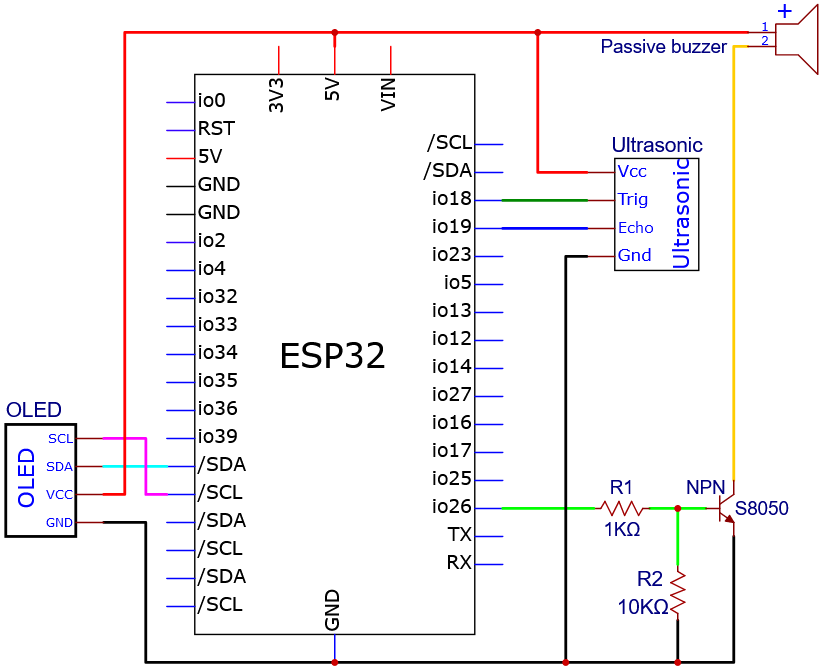


**实物接线图：**

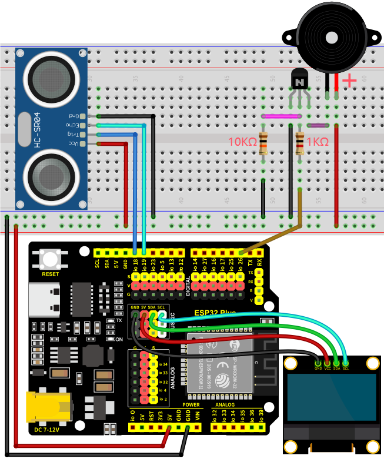

---

**4. 程序流程图：**

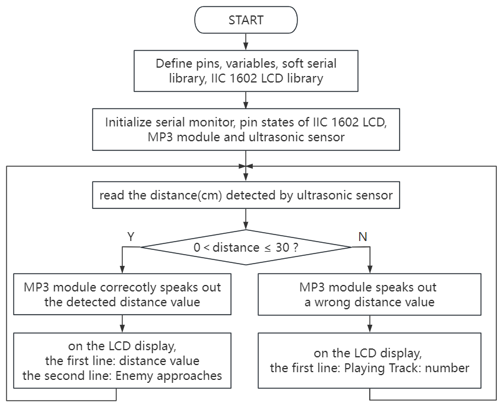

---

**5. 实验代码：**

**<span style="background:#ff0;color:#000">注意：代码中的距离阈值可以根据实际情况设置。</span>**

```python
'''
 * Filename    : Astern_Detector
 * Thonny      : Thonny 4.1.7
 * Auther      : http//www.keyestudio.com
'''
from machine import Pin, ADC, PWM, SoftI2C
import machine
import time  
import ssd1306
from time import sleep

# ESP32 Pin assignment 
i2c = SoftI2C(scl=Pin(22), sda=Pin(21))

# Set the width, height and i2c of the OLED
oled_width = 128
oled_height = 64
oled = ssd1306.SSD1306_I2C(oled_width, oled_height, i2c)

# Define the GPIO pin that is connected to the buzzer
buzzer = machine.PWM(machine.Pin(26))

# 定义无源蜂鸣器发声的playtone函数
def playtone(frequency):
    buzzer.duty_u16(1000)
    buzzer.freq(frequency)

# 定义超声波测距模块的控制引脚
Trig = Pin(18, Pin.OUT, 0) 
Echo = Pin(19, Pin.IN, 0)

distance = 0 # 将初始距离定义为0
soundVelocity = 340 # Set the speed of sound.
# getDistance()函数用于驱动超声波模块测量距离，
# Trig保持高电平10us以启动超声波模块
# Echo.value()用于读取超声波模块Echo引脚的状态，
# 然后使用时间模块的time.sleep_us()函数计算Echo的持续时间,
# Trig引脚的高电平，根据时间计算测量距离并返回值。
def getDistance():
    Trig.value(1)
    time.sleep_us(10)
    Trig.value(0)
    while not Echo.value():
        pass
    pingStart = time.ticks_us()
    while Echo.value():
        pass
    pingStop = time.ticks_us()
    pingTime = time.ticks_diff(pingStop, pingStart) // 2
    distance = int(soundVelocity * pingTime // 10000)
    return distance

# OLED显示超声波传感器检测的距离值，在不同的距离范围内，蜂鸣器发出不同的声音.
while True:
    distance = getDistance()
    distance_string = str(distance)
    oled.text('Astern Detector', 0, 0)
    oled.text('Distance(cm):', 0, 25)
    oled.text(distance_string, 0, 50) 
    oled.show()
    time.sleep(0.15)
    oled.fill(0)
    if distance <= 10:
        playtone(880)
        sleep(0.1)
    elif distance > 10 and distance <= 20:
        playtone(332)
        sleep(0.2)
    else:
        buzzer.duty_u16(0)
```
---

**5. 实验结果**

将 ESP32 主控板通过Micro USB数据线与计算机相连供电，单击 运行代码，若代码运行不成功，并且“Shell”窗口出现报错提示信息。


需要添加库文件，请回到 **2-1-7 添加 MicroPython 库(重要)** 处参照其说明添加库，也可以点击 **[添加 MicroPython 库](   )** 跳转到 **2-1-7 添加 MicroPython 库(重要)** 处参照其说明添加库文件。

再次单击 运行代码，代码开始执行后，OLED屏显示超声波传感器检测到离障碍物之间的距离值。

当超声波传感器检测到障碍物距离范围在 10cm 以内时，蜂鸣器发出一种鸣叫声，起到提示的作用；同时将检测到障碍物的距离显示在OLED模块上。


当超声波传感器检测到障碍物距离范围在 10cm ~ 20cm 以内时，蜂鸣器发出一种鸣叫声；同时将检测到障碍物的距离显示在OLED模块上。


当超声波传感器检测到障碍物距离范围在 20cm 以外时，蜂鸣器不鸣叫，同时将检测到障碍物的距离显示在OLED模块上。


单击退出程序。

---

**6. 代码说明**

可以参照前面的教程 2-2-10 和 2-2-29 的代码说明，这里就不多做介绍了。

---


### 2-2-53 模拟温度散热装置

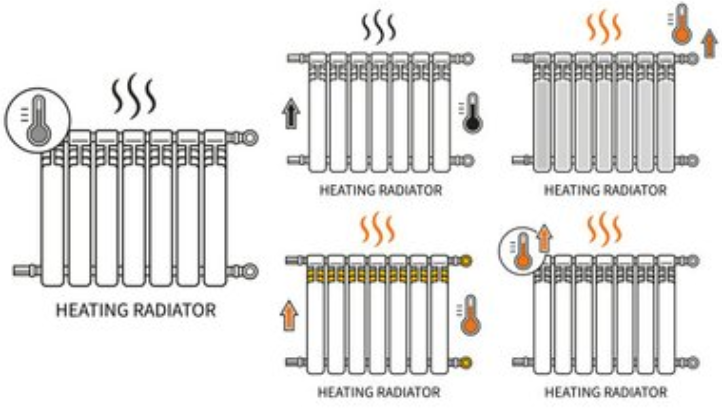

---

**1. 实验介绍**

生活中，我们的电脑或者电路板芯片等器件会由于工作时间过长或者功耗过大的问题而发热严重，所以我们常常需要一个散热装置。

在前面的项目课程中，我们学习了有关LM35温度传感器、OLED模块和130直流电机模块的工作原理。那么在这一项目实验中，我们将学习把它们结合起来做成一个智能散热装置。当LM35温度传感器检测到环境温度高于某一个阈值时的时候，130直流电机开启，从而达到降低环境温度、散热效果，再把此刻的温度值显示在OLED模块上。

---

**2. 实验组件**

|  | |||
| ------------------------ | ------------------------ | ---------------------------- |---------------------------- |
|ESP32 主控板| OLED x1|公对母杜邦线若干|LM35 x1 | 
|||||
| Micro USB数据线 x1 | 130直流电机模块 x1 |风扇叶片 x1|电池盒 x1|
|||||
|母对母杜邦线若干|面包板 x1|!面包板跳线若干|AA电池(<span style="color: rgb(255, 76, 65);">自备</span>) x6|
---

**3. 接线图：**

**原理图：**

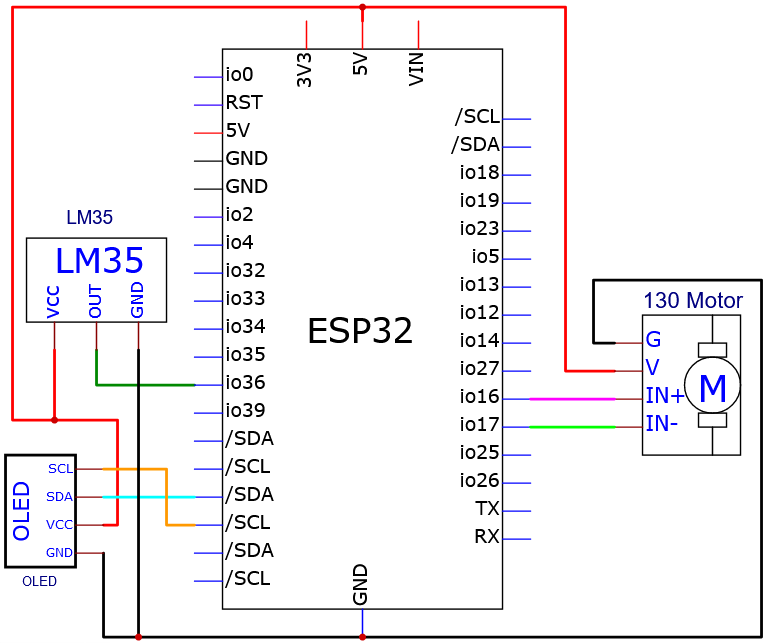

**实物接线图：**

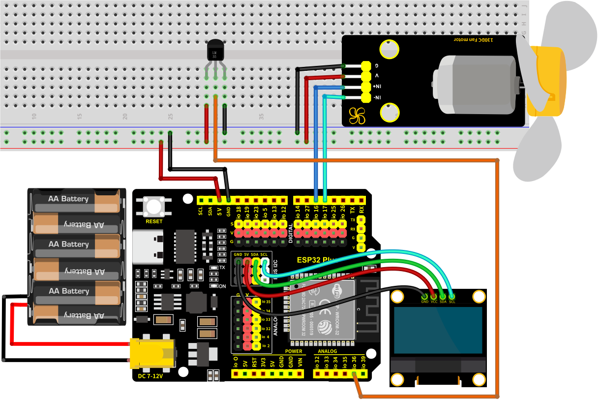

---

**4. 程序流程图：**

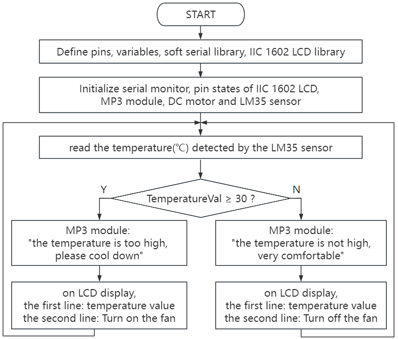

---

**5. 实验代码：**

**<span style="background:#ff0;color:#000">特别注意：代码中的温度阈值 30 可以根据实际情况设置。</span>**

```python
'''
 * Filename    : Cooling_Device
 * Thonny      : Thonny 4.1.7
 * Auther      : http//www.keyestudio.com
'''
from machine import Pin, ADC, PWM, SoftI2C
import machine 
import time  
import ssd1306
from time import sleep

# ESP32 Pin assignment 
i2c = SoftI2C(scl=Pin(22), sda=Pin(21))

# Set the width, height and i2c of the OLED
oled_width = 128
oled_height = 64
oled = ssd1306.SSD1306_I2C(oled_width, oled_height, i2c)

# 开启并配置ADC，量程为0-3.3V
adc=ADC(Pin(36))
adc.atten(ADC.ATTN_11DB)
adc.width(ADC.WIDTH_12BIT)
conversion_factor = 5.0 / (4095)

# 电机的两个引脚
INA = Pin(16, Pin.OUT) # INA对应IN+
INB = Pin(17, Pin.OUT) # INB对应IN-

# OLED显示LM35检测到环境中的温度，当温度高于30℃时，开启电机.
while True:
    adcVal=adc.read()
    reading = adcVal * conversion_factor 
    temperature = reading * 102.4 
    temperature_string = str(temperature)
    oled.text('Cooling Device', 0, 0)
    oled.text('Temper(C):', 0, 20)
    oled.text(temperature_string, 0, 40) 
    oled.show()
    time.sleep(0.2)
    oled.fill(0) 
    if temperature > 30: # 当温度高于30℃时
        # 开启电机
        INA.value(0)
        INB.value(1)
    else: # 当温度不高于30℃时
        # 关闭电机
        INA.value(0)
        INB.value(0)
```
---

**5. 实验结果**

将 ESP32 主控板通过Micro USB数据线与计算机相连供电，单击 运行代码，若代码运行不成功，并且“Shell”窗口出现报错提示信息。


需要添加库文件，请回到 **2-1-7 添加 MicroPython 库(重要)** 处参照其说明添加库，也可以点击 **[添加 MicroPython 库](   )** 跳转到 **2-1-7 添加 MicroPython 库(重要)** 处参照其说明添加库文件。

再次单击 运行代码，代码开始执行后，OLED模块上显示LM35温度传感器检测到的环境温度值，当温度高于阈值 30℃ 的时候，130直流电机开启，从而达到降低环境温度、散热效果。


单击退出程序。

---

**6. 代码说明**

变量的设置与存储检测值，与前面我们学习的一样，也是通过设置一个温度的阈值（阈值30可以根据实际情况重新更改），超过这个阈值进行控制电机转动，OLED模块上显示温度值。当LM35温度传感器检测到环境温度高于某一个值时的时候，电机开启，从而达到降低环境温度、散热效果，再把此刻的温度值显示在OLED模块上。

---


