**首先感谢选择keyestudio产品,**

**我们将继续为你提供好的产品和服务!**

------

**关于keyestudio**

Keyestudio是KEYES Corporation旗下最畅销的品牌，我们的产品包括Arduino开发板，扩展板，传感器模块，树莓派，micro：bit扩展板和智能小车，以及为各种级别的客户设计的完整入门套件，这些入门套件旨在为任何水平的客户学习Arduino知识。

我们所有的产品均符合国际质量标准，并在世界各地的不同市场中得到了极大的赞赏。 

欢迎从我们的官方网站查看更多内容：

[http://www.keyestudio.com](http://www.keyestudio.com)

------

**获取资料和售后服务**

1. 如果发现某些东西丢失或损坏，或者学习套件时遇到一些困难。keyestudio会提供免费和快速的支持，如果您有任何疑问，请给我们发送电子邮件：[service@keyestudio.com](http://m.138.gz.cn/webadmin/~CAmsnCrrNXhTAySKCerrIfWjjZuuWVfI/~/usr/mod_edituser.jsp?;uid=service@keyestudio.com;;clearCache=)

2. 欢迎提出建议和反馈，我们会根据您的反馈不断更新套件和教程，以使其更好。谢谢！

------

**产品安全**

1. 本产品内含排针针脚，注意刺伤，请勿让7岁以下的儿童接触，放在他们拿不到的地方。
2. 本产品包含导电部件(控制板和电子模块），请按照本教程的要求进行操作，不当的操作可能导致过热并且损害零件，请勿触摸并立即断开电路电源。

------

**版权**

keyestudio商标和徽标是KEYES DIY ROBOT co.,LTD的版权,任何人和公司在没有授权的情况下，不得复制，售卖，转卖，keyestudio品牌的产品。如果你有兴趣在当地售卖我们的产品，请联系我们专业的批发销售人员：[fennie@keyestudio.com](http://m.138.gz.cn/webadmin/~CAmsnCrrNXhTAySKCerrIfWjjZuuWVfI/~/usr/mod_edituser.jsp?;uid=fennie@keyestudio.com;;clearCache=)

------

**Keyestudio ESP32 物联网 学习套件**

---


# 产品介绍：

欢迎使用 ESP32 高级版学习套件！这个全面的软件包旨在让初学者和经验丰富的开发人员深入了解 ESP32 微控制器的多功能世界。以 ESP32 WROOM 32 为核心，以及 LED、传感器、电机等一系列配套组件，用户可以探索各种各样的项目。

无论您是热衷于基本电子产品还是物联网集成，这款套件都能满足您的需求。对于 MicroPython 爱好者，我们提供了 MicroPython 的结构化介绍，包括 IDE 设置和基本语法课程。Arduino 用户也不甘落后，其中有专门的部分介绍了 Arduino 入门，一套基本项目来快速启动学习和物联网项目。

套件中的每个项目都经过精心概述，确保您了解目标、电路组装，编程方面和代码解释。

该套件包含无数的游戏项目、实际应用程序和故障排除常见问题解答，有望为所有人提供丰富的学习体验。潜入游戏，让 ESP32 开始吧！ 

此外，如果您对本教程和工具包有任何困难或问题，您可以随时向我们咨询。

---

# 产品物料清单：

当收到此产品套件时，拆开包装，请根据以下清单清点，确保所有的配件完整无损。如果发现配件有缺失，请立即联系我们的销售人员。

| 序号 | 图片 | 规格 | 倍用量 |
| :--: | :--: | :--: | :--: |
| 1 |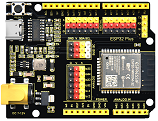| ESP32 PLUS主控板|1|
| 2 |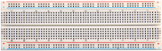|面包板 | 1 |
| 3 | 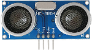 | 超声波传感器 | 1 |
| 4 | 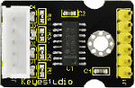 | 步进电机驱动板 | 1 |
| 5 | 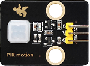| 人体红外热释传感器| 1 |
| 6 | 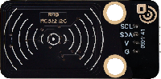 | RFID刷卡模块 | 1 |
| 7 | 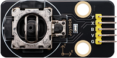 | 摇杆模块 | 1 |
| 8 | 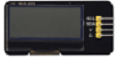 |LCD_128X32_DOT模块| 1 |
| 9|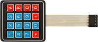 |薄膜4*4矩阵键盘| 1 |
| 10| 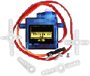 | 舵机 | 1 |
| 11 | 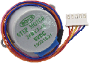 | 步进电机 | 1 |
| 12 | 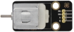| 直流电机 | 1 |
| 13 |  | 一位数码管 | 1 |
| 14 | 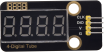 | 四位数码管模块 | 1 |
| 15 | 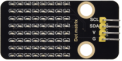 | 8*8点阵模块 | 1 |
| 16 | 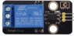 | 继电器模块 | 1 |
| 17 | 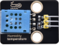| XHT11 温湿度模块 | 1 |
| 18 | 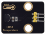| LM35 温温度传感器 | 1 |
| 19 | 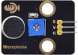| 声音传感器 | 1 |
| 20 | 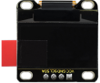|OLED|1|
| 20| | 按键开关 | 4 |
| 21 | 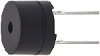 | 无源蜂鸣器 | 1 |
| 22 | 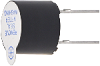 | 有源蜂鸣器| 1 |
| 23 | 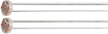 | 光敏电阻 | 2 |
| 24 | 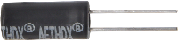 | 倾斜开关 | 1 |
| 25 | | 火焰传感器 | 1 |
| 26 |  |热敏电阻| 1 |
| 27 |  | 红外接收器| 1 |
| 28 | 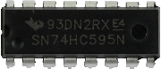 | 74HC595芯片 | 1 |
| 29 | 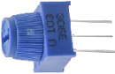 | 可调电位器 | 1 |
| 30 |  | NPN(S8050)三极管 | 2 |
| 31 | 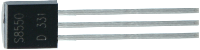| PNP(S8550)三极管 | 2 |
| 32 |  | RGB | 1 |
| 33 | 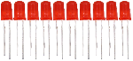 |红色LED| 10 |
| 34 |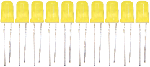 | 黄色LED| 10 |
| 35 | 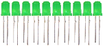 | 绿色LED | 10 |
| 36 | 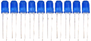 | 蓝色LED | 10 |
| 37 | 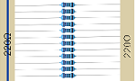 | 220Ω电阻 | 10 |
| 38| 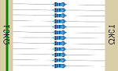 | 10KΩ电阻  | 10 |
| 39| 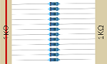 | 1KΩ电阻 | 10 |
| 40 |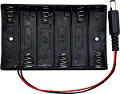 | 电池盒 | 1 |
| 41 |  | 白色IC卡 | 1|
| 42| | 蓝色钥匙扣 | 1 |
| 43 |  |摇杆帽| 1 |
| 44 | | 风扇叶片| 1 |
| 45 |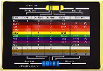|电阻卡| 1 |
| 46| |红外遥控器 | 1 |
| 47 |  | 黄色按键帽 | 4|
| 48 |  |Micro USB数据线 | 1 |
| 49 |  | 面包板跳线 | 1 |
| 50 |  | 母对母杜邦线 | 1 |
| 51 | 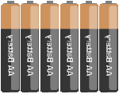 | 1.5V AA电池(<span style="color: rgb(255, 76, 65);">自备</span>) | 6 |

---

# 资料下载：

本教程的所有实验代码、库文件和规格书等资料的下载链接：

- [Arduino_C_代码](Arduino_C_代码.zip)

- [库文件](库文件.zip)

- [规格书](规格书.zip)

---

# ESP32 主控板介绍：

详细资料请参考链接：[https://wiki.keyestudio.com/KS5016_Keyestudio_ESP32_PLUS_Development_Board](https://wiki.keyestudio.com/KS5016_Keyestudio_ESP32_PLUS_Development_Board)

---

# 常见问题解答：

1\. 问：ESP32 主控板烧录程序出错。

答：请检查ESP32 主控板的型号是否选对。

请检查USB串口端口号是否选对。

2\. 问：ESP32 主控板使用Micro USB数据线连接到计算机，串口端口未显示。

答：请检查ESP32 主控板是否与计算机连接完好，再点击“设备管理器”，查看是否显示对应的串口端口。如果显示正确，说明连接完好，如果还是没有显示，那有可能是ESP32 主控板上的USB芯片出问题了。

3\. 问：烧录了代码，传感器/模块不工作或串口监视器窗口不能显示正确的信息？

答：请确认代码中的引脚和实际接线是否一致，如有错误，请正确按照代码中的引脚进行接线即可。

4\. 问：舵机为什么工作不正常？

答：可能电压不够，最好外接电源供电。

5\. 问：超声波传感器检测时，为什么检测距离不准？

答：应从超声波传感器的发射头处开始测量，此模块非高精度超声波距离检测模块，会有误差。

6\. 问：风扇（电机）工作不正常，主板很容易被烧坏？

答：由于风扇在转动时，所需的电流比其他传感器要大，会引起电路中电压电流波动，特别是风扇进行正反转时，电压电流波动过大，导致ESP32 主控板的电压电流过低，会导致复位。需要外接电源给UNO R4主板供电，这样保证风扇能正常工作。

7\. 问：无源蜂鸣器的音调与实际音调不准？

答：普通无源蜂鸣器模拟的音调，达不到专业音调的要求，如需非常准确音调，需要更专业的无源蜂鸣器。

8\. 问：人体红外热释电传感器误报？

答：人体红外热释电传感器避免误报警要求如下：

探测范围内避开被风吹而引起飘动的物体，如：窗帘、衣物、花草等。

探测范围内避免强光照射干扰，如：阳光照射、汽车灯光照射、射灯照射及照明等光源。

9\. 问：温湿度传感器防水吗？

答：温湿度传感器检测的是空气中的温度和湿度，不防水，请勿将模块放入水中。

10\. 问：OLED模块接上电源为什么不亮？

答：OLED是没有背光的，显示属于自发光方式。只接VCC和GND，OLED是不会亮的。必须用程序控制才能亮点OLED。

11\. 问：WiFi一直连接不上？

答：请将UNO R4 WiFi主板移动到路由器周边，按下主板上的复位键重启UNO R4 WiFi主板，耐心等待连接即可。若还是一直连接不上，请查看WiFi名称和密码是否填写正确。

12\. 问：网页端远程操作其他传感器时，反应很慢？

答：路由器网络传输变慢的原因：

- 多人连接，路由器CPU资源不足，重启路由器，重新连接网络。
- 路由器系统使用时间过长，重启路由器。
- 无线干扰，无线信号不稳定时，请勿穿墙使用。

路由器相关知识，请自行**google**搜索。

---

# Arduino_C 教程

## Arduino IDE 环境设置

### 1. 安装 Arduino IDE（重要）

Arduino IDE，称为 Arduino 集成开发环境，提供完成 Arduino 项目所需的所有软件支持。这是由 Arduino 团队提供的专为 Arduino 设计的编程软件，它允许我们编写程序并将其上传到 Arduino 主控板。

Arduino IDE 2.3.3 是一个开源项目。这是前身Arduino IDE 1.x 的改进，并配备了改进的用户界面，改进的板和库管理器，调试器，自动完成功能等等。

在本教程中，我们将展示如何在 Windows、Mac 或 Linux 计算机上下载和安装 Arduino IDE 2.3.3。 

<span style="color: rgb(255, 76, 65);">**特别提醒**：</span><span style="background:#ff0;color:#000">本教程使用的是Arduino IDE 2.3.3 版本。</span>


**<span style="font-size: 20px;">要求：</span>**

- Windows - Win 10 及更高版本，64 位
- Linux - 64 位
- MacOS - 64 位

**<span style="font-size: 20px;">下载 Arduino IDE 2.3.3：</span>**

1\. 访问 [Arduino IDE 2.3 页面](https://www.arduino.cc/en/software#future-version-of-the-arduino-ide)

2\. 下载适用于您的操作系统版本的 IDE。

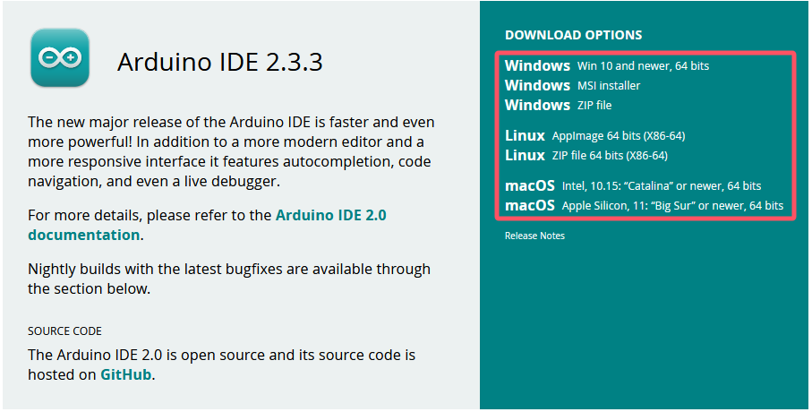

**<span style="font-size: 20px;">安装:</span>**

**Windows**

1\. 双击 <span style="color: rgb(255, 76, 65); font-size: 15px;">arduino-ide_xxxx.exe file</span> 以运行下载的文件。

2\. 阅读许可协议并同意它。

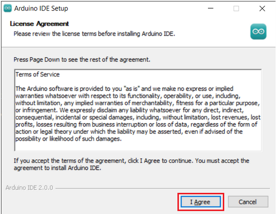

3\. 选择安装选项。

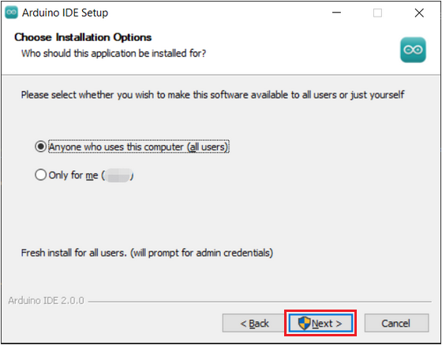

4\. 选择安装位置，建议将软件安装在系统驱动器以外的驱动盘上。

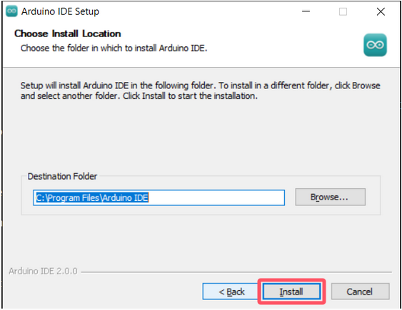

5\. 然后点击 Finish.

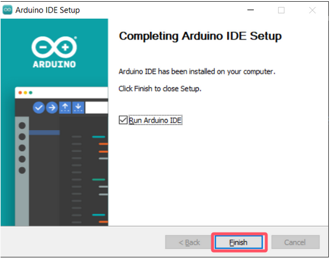


**MacOS：**

双击下载的 <span style="color: rgb(255, 76, 65); font-size: 15px;">arduino_ide_xxxx.dmg</span> 文件并按照说明将 **Arduino IDE.app** 复制到 **Applications** 文件夹，几秒钟后您将看到 Arduino IDE 安装成功

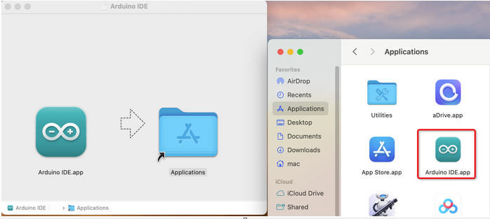

**Linux:**

关于在 Linux 系统上安装 Arduino IDE 2.3 的教程，请参考：[https://docs.arduino.cc/software/ide-v2/tutorials/getting-started/ide-v2-downloading-and-installing/#linux](https://docs.arduino.cc/software/ide-v2/tutorials/getting-started/ide-v2-downloading-and-installing/#linux)

**<span style="font-size: 24px;">打开 IDE:</span>**

1\. 当您首次打开 Arduino IDE 2.3 时，它会自动安装 Arduino AVR 板、内置库和其他所需文件。 

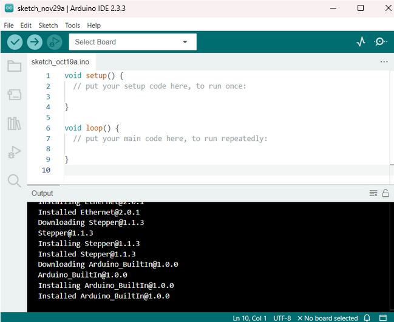

2\. 此外，您的防火墙或安全中心可能会弹出几次询问您是否要安装某些设备驱动程序。请全部安装。

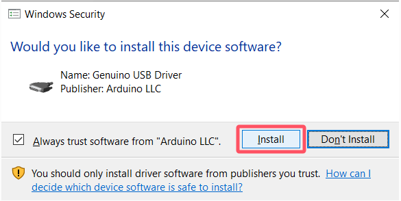

3\. 现在你的Arduino IDE已经准备好了！

**<span style="color: rgb(255, 76, 65);">注意：</span>** 如果由于网络问题或其他原因导致某些安装无法工作，您可以重新打开Arduino IDE，它将完成其余的安装。在所有安装完成后，“输出” 窗口不会自动打开，除非单击 “验证” 或 “上传” 。

### 2. 安装驱动

我们需要一个驱动程序来启动我们的主控板。否则，将找不到连接到计算机的COM端口。

驱动安装方法请参考链接：[https://docs.keyestudio.com/projects/Arduino/en/latest/Arduino%20IDE%20Tutorial.html#install-driver](https://docs.keyestudio.com/projects/Arduino/en/latest/Arduino%20IDE%20Tutorial.html#install-driver)

在表格中选择相应的开发板和计算机系统，点击链接进入教程。

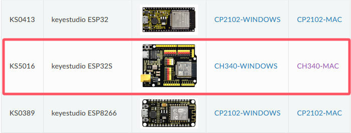

### 3. Arduino IDE 介绍

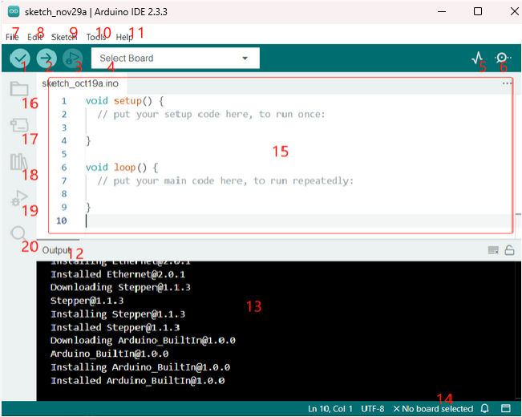

- 1\. Verify：编译您的代码。任何语法问题都将提示错误。
- 2\. Upload：将代码上传到您的开发板。当您单击该按钮时，主控板上的 RX 和 TX LED 将快速闪烁，并且在上传完成之前不会停止。
- 3\. Debug：用于逐行错误检查。
- 4\. Select Board：快速设置主控板板型和端口。
- 5\. Serial Plotter：检查读数值的变化。
- 6\. Serial Monitor：单击按钮，将出现一个窗口，它接收从您的控制板发送的数据。它对于调试非常有用。
- 7\. File：点击菜单，会出现一个下拉列表，包括文件创建、打开、保存、关闭、一些参数配置等。
- 8\. Edit：点击菜单。在下拉列表中，有一些编辑操作，如：剪切、复制、粘贴、查找 等，以及它们相应的快捷方式。
- 9\. Sketch：包括 Verify、Upload、Add files等操作。更重要的功能是 Include Library ，您可以在其中添加库。
- 10\. Tool：包括一些工具，最常用的 Board（您使用的主控板）和 Port（您的主控板所在的端口）。每次要上传代码时，都需要选择或选中它们。
- 11\. Help：如果您是初学者，您可以查看菜单下方的选项并获得您需要的帮助，包括 IDE 中的操作、介绍信息、故障排除、代码解释等。
- 12\. Output Bar：在此处切换输出选项卡。
- 13\. Output Window：打印信息。
- 14\. Board 和 Port：在这里，您可以预览为代码上传选择的主控板板型和端口。如果有不正确的主控板板型/端口，可以通过 “Tools -> Board / Port” 重新选择。
- 15\. IDE 的编辑区域：您可以在此处编写代码。
- 16\. Sketchbook：用于管理草图文件。
- 17\. Board Manager：用于管理板驱动程序。
- 18\. Library Manager：用于管理您的库文件。
- 19\. Debug：帮助调试代码。
- 20\. Search：从草图中搜索代码。

### 4. 安装 ESP32 开发板(重要)

要对 ESP32 微控制器进行编程，我们需要在 Arduino IDE 中安装 ESP32 开发板包。请按照以下分步指南进行操作：

**安装 ESP32 开发板**

1\. 点击“File” → “Preferences” 进入对话框页面，点击打开标出的按钮。

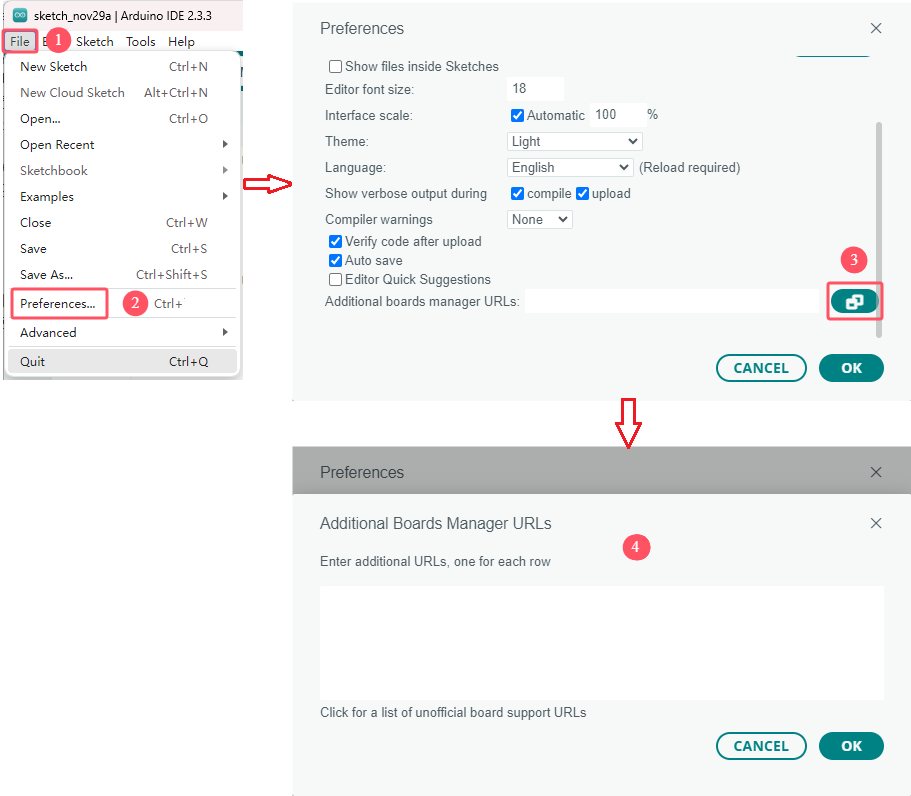

2\. 将这个地址：https://espressif.github.io/arduino-esp32/package_esp32_index.json ，复制粘贴到文本框中并且点击 “**OK**” 保存这个地址，如下图。然后再点击 “**OK**” 关闭对话框页面。

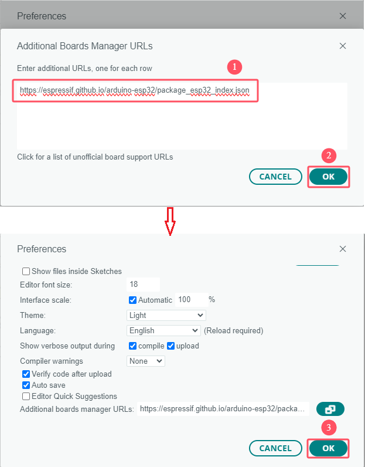

3\. 在 Boards Manager 窗口中，在搜索栏中键入 “**ESP32**” ，选择 <span style="color: rgb(255, 76, 65);">1.06</span> 版本进行安装。单击 “**Install**” 按钮开始安装过程。这将下载并安装 ESP32 开发板包，如下图：**<span style="color: rgb(255, 76, 0);">（特别提醒：本教程是安装 1.06 版本的 ESP32 开发板包，选择更高版本或最最新版本，可能会出现安装失败。）</span>**

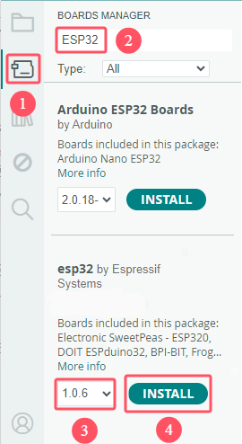

3\. 您已在 Arduino IDE 中成功安装了 ESP32 开发板包.

**上传代码**

1\. 现在，使用 Micro USB 数据线将 ESP32 WROOM 32 连接到您的计算机.

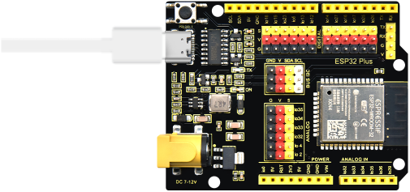

2\. 点击 “**Tools**” -> “**Board**” -> “**esp32**”，然后选择正确的开发板板型 ESP32 Dev Module。


3\. 如果您的 ESP32 已连接到计算机，您可以通过单击 “**Tools**” -> “**Board**” 来选择正确的端口。


4\. 此外，Arduino 2.0 引入了一种快速选择主控板板型和端口的新方法。对于 ESP32 ，通常不会自动识别，因此您需要单击 “**Select other board and port**” 。


5\. 在搜索框中，键入 “**ESP32 Dev Module**” 并在出现时选择它。然后，选择正确的端口并单击 “**OK**”。


6\. 之后，您可以通过此快速访问窗口选择它。注意，在后续使用过程中，可能会出现 ESP32 在快速访问窗口中不可用的情况，您需要重复上述两个步骤。


7\. 这两种方法都允许您选择正确的主控板板型和端口，因此请选择最适合您的那一种。现在，一切都准备好将代码上传到 ESP32 了。

### 5. 添加 Arduino 库（重要）：

库是扩展 Arduino IDE 功能的预编写代码或函数的集合。库为各种功能提供了现成的代码，使您可以节省对复杂功能进行编码的时间和精力。

<span style="color: rgb(255, 76, 65);">**特别注意：** 本教程使用到的相关库文件一定要使用我们提供的，强烈推荐方法一：手动安装。</span>

**方法一：手动安装**

添加库除了可以使用库管理器安装还可以手动安装（或者，有些库无法通过库管理器添加安装，则必须需要手动安装。）。要安装这些库，请执行以下步骤：

1\. 打开Arduino IDE，进入**Sketch** -> **Include Library** -> **Add .ZIP Library...**。


2\. 导航到库文件所在的目录，例如：..\ **库文件** 文件夹，然后选择对应的库文件并单击“**Open**”。


3\. 安装完成后，你将收到一条通知，确认该库已成功添加到Arduino IDE中。下次需要使用此库时，你不需要重复安装过程。


4\. 重复相同的过程以添加其他库文件。

**方法二：使用库管理器**

许多库可以直接通过 “**Arduino Library Manager**” 获得。您可以按照以下步骤访问 Library Manager：

1\. 在 Library Manager 中，你可以按名称搜索所需的库或浏览不同的类别。 

<span style="color: rgb(255, 76, 65);">**注意：**</span>在需要安装库的项目中，将出现提示，指示要安装哪些库。按照提供的说明进行操作，例如“此处使用了 Adafruit_GFX 库，你可以从 Library Manager 安装它”。只需按照提示安装推荐的库即可。


2\. 找到要安装的库后，单击它，然后单击 **Install** 按钮安装。如果出现“**INSTALL WITHOUT DEPENDENCIES**”和“**INSTALL ALL**”两个选项按钮，则单击“**INSTALL ALL**”。<span style="color: rgb(255, 76, 65);">同理，其他的库也是一样的。</span>


3\. Arduino IDE将自动为你下载并安装库。


4\. 重复相同的过程以添加其他库文件。

**库位置**

使用上述方法安装的库可以在Arduino IDE的默认库目录中找到，该目录通常位于 <span style="color: rgb(255, 76, 65);">C:\Users\xxx\Documents\Arduino\libraries</span> 。

如果您的库目录不同，您可以通过转到 File -> Preferences 来检查它。


[Installing libraries in Arduino IDE 2](https://docs.arduino.cc/software/ide-v2/tutorials/ide-v2-installing-a-library/)

---

## IoT 项目课程

---

## 第01课 蓝牙低功耗数据传输

---

**1. 实验介绍：**

本项目提供了一个使用ESP32微控制器开发一个简单的蓝牙低功耗（BLE）串行通信应用程序的指南。ESP32是一款功能强大的微控制器，集成了Wi-Fi和蓝牙连接，使其成为开发无线应用程序的理想选择。BLE是一种低功耗无线通信协议，专为短距离通信而设计。本文将介绍将ESP32设置为BLE服务器并通过串行连接与BLE客户端通信的步骤。

---

**2. 实验组件：**

|    |||
| ------------------------ | --------------------- | --------------------- |
| ESP32 主控板 x1  | Micro USB数据线 x1 |移动通信设备 x1|

---

**3. 元件知识：**

ESP32 WROOM 32 是一个将Wi-Fi和蓝牙连接集成到单个芯片中的模块。它支持低功耗蓝牙（BLE）和经典蓝牙协议。
该模块可作为蓝牙客户端或服务器使用。作为蓝牙客户端，该模块可以连接到其他蓝牙设备并与它们交换数据。该模块作为蓝牙服务器，可以为其他蓝牙设备提供服务。

ESP32 WROOM 32 支持多种蓝牙配置文件，包括通用接入配置文件（GAP）、通用属性配置文件（GATT）和串口配置文件（SPP）。SPP配置文件允许模块通过蓝牙模拟串行端口，从而实现与其他蓝牙设备的串行通信。

要使用 ESP32 WROOM 32 的蓝牙功能，你需要使用合适的软件开发工具包（SDK）或使用带有ESP32 BLE库的Arduino IDE进行编程。ESP32 BLE库提供了处理BLE的高级接口。其中包括演示如何将该模块用作BLE客户端和服务器的示例。

蓝牙是一种短距离通信系统，可分为两种类型，即低功耗蓝牙(BLE)和经典蓝牙。简单的数据传输有两种模式：主模式和从模式。

**主模式：** 在这种模式下，工作在主设备上完成，并且可以与从设备连接。我们可以搜索和选择附近的从设备来连接。当设备在主模式下发起连接请求时，需要其他蓝牙设备的地址和配对密码等信息。配对完成后，可直接与它们连接。

**从模式：** 处于从模式的蓝牙模块只能接受来自主机的连接请求，但不能发起连接请求。与主机设备连接后，可以向主机设备发送数据，也可以从主机设备接收数据。蓝牙设备之间可以进行数据交互，一个设备处于主模式，另一个设备处于从模式。当它们进行数据交互时，处于主模式的蓝牙设备会搜索并选择附近要连接的设备。在建立连接时，它们可以交换数据。当移动通信设备（例如：智能手机/平板）与ESP32进行数据交换时，移动通讯设备通常处于主模式，ESP32为从模式。


总体而言，ESP32 WROOM 32 的蓝牙功能提供了一种方便和低功耗的方式来实现项目中的无线通信。

---

**4. 模块接线图：**


---

**5. 实验代码：**


```c++
/*  
 * 名称   : IoT_Bluetooth
 * 功能   : 蓝牙数据传输
 * 编译IDE：ARDUINO 2.3.2
 * 作者   : https://www.keyestudio.com/
*/
#include "BLEDevice.h"
#include "BLEServer.h"
#include "BLEUtils.h"
#include "BLE2902.h"

// Define the Bluetooth device name
const char *bleName = "ESP32_Bluetooth";

// Define the received text and the time of the last message
String receivedText = "";
unsigned long lastMessageTime = 0;

// Define the UUIDs of the service and characteristics
#define SERVICE_UUID           "6E400001-B5A3-F393-E0A9-E50E24DCCA9E" 
#define CHARACTERISTIC_UUID_RX "6E400002-B5A3-F393-E0A9-E50E24DCCA9E"
#define CHARACTERISTIC_UUID_TX "6E400003-B5A3-F393-E0A9-E50E24DCCA9E"

// Define the Bluetooth characteristic
BLECharacteristic *pCharacteristic;

void setup() {
  Serial.begin(115200);  // Initialize the serial port
  setupBLE();            // Initialize the Bluetooth BLE
}

void loop() {
  // When the received text is not empty and the time since the last message is over 1 second
  // Send a notification and print the received text
  if (receivedText.length() > 0 && millis() - lastMessageTime > 1000) {
    Serial.print("Received message: ");
    Serial.println(receivedText);
    pCharacteristic->setValue(receivedText.c_str());
    pCharacteristic->notify();
    receivedText = "";
  }

  // Read data from the serial port and send it to BLE characteristic
  if (Serial.available() > 0) {
    String str = Serial.readStringUntil('\n');
    const char *newValue = str.c_str();
    pCharacteristic->setValue(newValue);
    pCharacteristic->notify();
  }
}

// Define the BLE server callbacks
class MyServerCallbacks : public BLEServerCallbacks {
  // Print the connection message when a client is connected
  void onConnect(BLEServer *pServer) {
    Serial.println("Connected");
  }
  // Print the disconnection message when a client is disconnected
  void onDisconnect(BLEServer *pServer) {
    Serial.println("Disconnected");
  }
};

// Define the BLE characteristic callbacks
class MyCharacteristicCallbacks : public BLECharacteristicCallbacks {
  void onWrite(BLECharacteristic *pCharacteristic) {
    // When data is received, get the data and save it to receivedText, and record the time
    std::string value = std::string(pCharacteristic->getValue().c_str());
    receivedText = String(value.c_str());
    lastMessageTime = millis();
    Serial.print("Received: ");
    Serial.println(receivedText);
  }
};

// Initialize the Bluetooth BLE
void setupBLE() {
  BLEDevice::init(bleName);                        // Initialize the BLE device
  BLEServer *pServer = BLEDevice::createServer();  // Create the BLE server
  // Print the error message if the BLE server creation fails
  if (pServer == nullptr) {
    Serial.println("Error creating BLE server");
    return;
  }
  pServer->setCallbacks(new MyServerCallbacks());  // Set the BLE server callbacks

  // Create the BLE service
  BLEService *pService = pServer->createService(SERVICE_UUID);
  // Print the error message if the BLE service creation fails
  if (pService == nullptr) {
    Serial.println("Error creating BLE service");
    return;
  }
  // Create the BLE characteristic for sending notifications
  pCharacteristic = pService->createCharacteristic(CHARACTERISTIC_UUID_TX, BLECharacteristic::PROPERTY_NOTIFY);
  pCharacteristic->addDescriptor(new BLE2902());  // Add the descriptor
  // Create the BLE characteristic for receiving data
  BLECharacteristic *pCharacteristicRX = pService->createCharacteristic(CHARACTERISTIC_UUID_RX, BLECharacteristic::PROPERTY_WRITE);
  pCharacteristicRX->setCallbacks(new MyCharacteristicCallbacks());  // Set the BLE characteristic callbacks
  pService->start();                                                 // Start the BLE service
  pServer->getAdvertising()->start();                                // Start advertising
  Serial.println("Waiting for a client connection...");              // Wait for a client connection
}
```
---

**6. 操作步骤：**

1\. 使用平板或智能手机，点击 [App Store](https://apps.apple.com/us/app/lightblue/id557428110)（适用于 iOS ）或 [Google Play](https://play.google.com/store/apps/details?id=com.punchthrough.lightblueexplorer)（适用于 Android ）来下载 LightBlue 应用程序。也可以直接在**App Store**（适用于 iOS ）或**Google Play**（适用于 Android ）的搜索框搜索 “LightBlue” 进入下载页面去下载 LightBlue 应用程序(APP)。

<span style="color: rgb(255, 76, 65);">**这里是以 Android 系统为例进行操作，iOS系统可以参考。**</span>


2\. 打开位于 <span style="color: rgb(255, 76, 65);">01 IoT Bluetooth</span> 文件夹中的 <span style="color: rgb(255, 76, 65);">IoT_Bluetooth.ino</span> 文件，或将上面的实验代码复制粘贴到 Arduino IDE 中。

3\. 选择正确的主控板板型（ESP32 Dev Module）和 适当的串口端口（COMxx），然后单击按钮上传代码。


4\. 成功上传代码后，开启移动设备(智能手机)上的蓝牙并打开 **LightBlue** 应用程序(APP)。


5\. 在 **Peripherals** 页面上，找到 ESP32-Bluetooth 并单击 “**Connect**” 。 如果您没有看到它，请尝试刷新页面几次。当 “**Connected**” 出现，表示蓝牙连接成功，向下滚动以查看代码中设置的 **3个 UUID** 。同时，Arduino IDE的串口监视器中也打印了 “**Connected**”。


6\. 单击 **Receive** UUID。单击 “**HEX**” 进入 <span style="color: rgb(0, 0, 255);">Format Selection</span> 页面，选择 “**UTF-8 String**”，然后单击 “**Save**” 保存信息。例如：“<span style="color: rgb(255, 76, 65);">HEX</span>” 表示十六进制，“<span style="color: rgb(255, 76, 65);">UTF-8 String</span> ” 表示字符，“<span style="color: rgb(255, 76, 65);">Binary</span>” 表示二进制等。


7\. 单击 “**Subscribe**” 变成 “**Unsubscribe**” 。


8\. 返回 Arduino IDE，打开串行监视器，将波特率设置为 “**115200**” ，然后在文本框中键入 “**welcome**” 并按键盘上的 “**Enter**” 键。


9\. 您现在应该会在 LightBlue 应用程序(APP)中看到 “**welcome**” 信息。


10\. 要将信息从移动设备发送到串行监视器，请单击 **Send** UUID。再单击 “**HEX**” 进入 <span style="color: rgb(255, 76, 65);">Format Selection</span> 页面，选择 “**UTF-8 String**”，然后单击 “**Save**” 保存信息。


11\. 单击 “**Write New Value**” 进入消息编写页面，编写 “**bluetooth test**” ，然后单击 “**Write**” 。


12\. 您应该会在Arduino IDE 的 “**Serial Monitor**” 中看到该信息。


---

**7. 代码说明：**

此 Arduino 代码是为 ESP32 微控制器编写的，并将其设置为与低功耗蓝牙（BLE）设备通信。下是代码的简要摘要：

- **包含必要的库** ：该代码首先包含在 ESP32 上使用低功耗蓝牙 （BLE） 所需的库。 

```c++
#include "BLEDevice.h"
#include "BLEServer.h"
#include "BLEUtils.h"
#include "BLE2902.h"
```
- **全局变量**：该代码定义了一组全局变量，包括蓝牙设备名称（<span style="color: rgb(255, 76, 65);">bleName</span>）、用于跟踪接收文本和最后一条消息时间的变量、服务和特征的 UUID，以及 <span style="color: rgb(255, 76, 65);">BLECharacteristic</span> 对象（<span style="color: rgb(255, 76, 65);">pCharacteristic</span>）。 

```c++
// Define the Bluetooth device name
const char *bleName = "ESP32_Bluetooth";

// Define the received text and the time of the last message
String receivedText = "";
unsigned long lastMessageTime = 0;

// Define the UUIDs of the service and characteristics
#define SERVICE_UUID           "6E400001-B5A3-F393-E0A9-E50E24DCCA9E" 
#define CHARACTERISTIC_UUID_RX "6E400002-B5A3-F393-E0A9-E50E24DCCA9E"
#define CHARACTERISTIC_UUID_TX "6E400003-B5A3-F393-E0A9-E50E24DCCA9E"

// Define the Bluetooth characteristic
BLECharacteristic *pCharacteristic;
```
- **初始化**：在 <span style="color: rgb(255, 76, 65);">setup()</span> 函数，则初始化串行端口的波特率为 115200 ，并且 <span style="color: rgb(255, 76, 65);">setupBLE()</span> 函数来设置蓝牙 BLE。

```c++
void setup() {
    Serial.begin(115200);  // Initialize the serial port
    setupBLE();            // Initialize the Bluetooth BLE
}
```
- **主循环**：在 <span style="color: rgb(255, 76, 65);">loop()</span> 函数，如果通过 BLE 接收字符串（即 receivedText 不为空），并且自最后一条消息以来至少已经过了 1 秒，则代码会将收到的字符串打印到串行监视器，将 <span style="color: rgb(255, 76, 65);">Characteristic</span> 值设置为收到的字符串，发送通知，然后清除收到的字符串。如果串行端口上有数据可用，它会读取字符串，直到遇到换行符，将特征值设置为此字符串，并发送通知。

```c++
void loop() {
    // When the received text is not empty and the time since the last message is over 1 second
    // Send a notification and print the received text
    if (receivedText.length() > 0 && millis() - lastMessageTime > 1000) {
        Serial.print("Received message: ");
        Serial.println(receivedText);
        pCharacteristic->setValue(receivedText.c_str());
        pCharacteristic->notify();
        receivedText = "";
    }

    // Read data from the serial port and send it to BLE characteristic
    if (Serial.available() > 0) {
        String str = Serial.readStringUntil('\n');
        const char *newValue = str.c_str();
        pCharacteristic->setValue(newValue);
        pCharacteristic->notify();
    }
}
```
- **回调**：两个回调类（<span style="color: rgb(255, 76, 65);">MyServerCallbacks</span> 和 <span style="color: rgb(255, 76, 65);">MyCharacteristicCallbacks</span>）用于处理与 Bluetooth 通信相关的事件。 <span style="color: rgb(255, 76, 65);">MyServerCallbacks</span> 用于处理与 BLE 服务器的连接状态（已连接或已断开连接）相关的事件。 <span style="color: rgb(255, 76, 65);">MyCharacteristicCallbacks</span> 用于处理 BLE 特性上的写入事件，即当连接的设备通过 BLE 向 ESP32 发送字符串时，该字符串会被捕获并存储在 <span style="color: rgb(255, 76, 65);">receivedText</span>，当前时间记录在 <span style="color: rgb(255, 76, 65);">lastMessageTime</span>。

```c++
// Define the BLE server callbacks
class MyServerCallbacks : public BLEServerCallbacks {
    // Print the connection message when a client is connected
    void onConnect(BLEServer *pServer) {
    Serial.println("Connected");
    }
    // Print the disconnection message when a client is disconnected
    void onDisconnect(BLEServer *pServer) {
    Serial.println("Disconnected");
    }
};

// Define the BLE characteristic callbacks
class MyCharacteristicCallbacks : public BLECharacteristicCallbacks {
    void onWrite(BLECharacteristic *pCharacteristic) {
        // When data is received, get the data and save it to receivedText, and record the time
        std::string value = std::string(pCharacteristic->getValue().c_str());
        receivedText = String(value.c_str());
        lastMessageTime = millis();
        Serial.print("Received: ");
        Serial.println(receivedText);
    }
};
```
- **设置 BLE**：在 <span style="color: rgb(255, 76, 65);">setupBLE()</span> 函数，初始化 BLE 设备和服务器，设置服务器回调，使用定义的 UUID 创建 BLE 服务，创建用于发送通知和接收数据的特征并将其添加到服务中，并设置特征回调。最后，服务启动，服务器开始播发。

```c++
// Initialize the Bluetooth BLE
void setupBLE() {
    BLEDevice::init(bleName);                        // Initialize the BLE device
    BLEServer *pServer = BLEDevice::createServer();  // Create the BLE server
    // Print the error message if the BLE server creation fails
    if (pServer == nullptr) {
        Serial.println("Error creating BLE server");
        return;
    }
    pServer->setCallbacks(new MyServerCallbacks());  // Set the BLE server callbacks

    // Create the BLE service
    BLEService *pService = pServer->createService(SERVICE_UUID);
    // Print the error message if the BLE service creation fails
    if (pService == nullptr) {
        Serial.println("Error creating BLE service");
        return;
    }
    // Create the BLE characteristic for sending notifications
    pCharacteristic = pService->createCharacteristic(CHARACTERISTIC_UUID_TX, BLECharacteristic::PROPERTY_NOTIFY);
    pCharacteristic->addDecodeor(new BLE2902());  // Add the decodeor
    // Create the BLE characteristic for receiving data
    BLECharacteristic *pCharacteristicRX = pService->createCharacteristic(CHARACTERISTIC_UUID_RX, BLECharacteristic::PROPERTY_WRITE);
    pCharacteristicRX->setCallbacks(new MyCharacteristicCallbacks());  // Set the BLE characteristic callbacks
    pService->start();                                                 // Start the BLE service
    pServer->getAdvertising()->start();                                // Start advertising
    Serial.println("Waiting for a client connection...");              // Wait for a client connection
}
```

<span style="color: rgb(255, 76, 65);">**请注意**</span>：<span style="background: rgb(255, 251, 0);">此代码允许双向通信 - 它可以通过 BLE 发送和接收数据。 但是，要与特定硬件交互（例如打开/关闭 LED），应添加其他代码以处理 接收到的字符串并采取相应的行动。</span>

---

## 第02课 蓝牙控制 LED

---

**1. 实验介绍：**

本项目是前一个项目（第01课 IOT Bluetooth）的扩展，增加了LED 配置和自定义命令，如 “led_on”和“led_off”等。这些命令允许通过使用 **LightBlue** APP 从移动设备发送命令来控制 LED 的亮与灭。

---

**2. 元件知识：** 

**（1）LED**:


LED是一种被称为“发光二极管”的半导体，是一种由半导体材料(硅、硒、锗等)制成的电子器件。它有正极和负极。短腿为负极，接GND，长腿为正极，接3.3V或5V。


**（2）五色环电阻**

电阻是电路中限制或调节电流流动的电子元件。左边是电阻器的外观，右边是电阻在电路中表示的符号。电阻(R)的单位为欧姆(Ω)，1 mΩ= 1000 kΩ，1kΩ= 1000Ω。

   
 
我们可以使用电阻来保护敏感组件，如LED。电阻的强度（以Ω为单位）用小色环标记在电阻器的主体上。每种颜色代表一个数字，你可以用电阻对照卡查找。
-色带1 – 1st Digit.
-色带 2 – 2nd Digit.
-色带 3 – 3rd Digit.
-色带 4 – Multiplier.
-色带 5 – Tolerance.


在这个套件中，我们提供了4个具有不同电阻值的五色环电阻。这里以3个五色环电阻为例：

220Ω 电阻*10


10KΩ 电阻*10


1KΩ 电阻*10


在相同的电压下，会有更小的电流和更大的电阻。电流(I)、电压(U)、电阻(R)之间的联系可以用公式表示：I=U/R。在下图中，假如电压为3V，则通过R1的电流: I = U / R = 3 V / 10 KΩ= 0.0003A= 0.3mA。


                                  
不要把电阻值很低的电阻直接连接在电源两极，这样会使电流过高而损坏电子元件。电阻是没有正负极之分。

**（3）面包板**

在完成任何电路设计之前，面包板用于快速构建和测试电路。面包板上有许多孔，可以插入集成电路和电阻等电路元件。一个典型的面包板如下所示：


面包板有很多金属条，它们在面包板的下面，连接面包板顶部的孔。金属条的摆放如下图所示。注意，顶部和底部的孔是水平连接，而其余的孔是垂直连接。


面包板的前两行(上)和后两行(下)分别用于电源的正极（+）和负极（-）。面包板的导电布局图如下图所示：


电子初学者在连接DIP (Dual In-line Packages)组件时，如集成电路、微控制器、芯片等，中间一条凹槽隔离中间部分，凹槽上下是不连通的。因此，DIP组件可以连接如下图所示：


---

**3. 实验组件：**

|  ||||
| ------------------------ | ------------------------ | ---------------------------- |---------------------------- |
| ESP32 主控板| 红色 LED x1  | 220Ω电阻 x1  |移动通信设备 x1|
||||   |
|面包板 x1 |面包板跳线若干 | Micro USB数据线 x1 |    |

---

**4. 接线图：** 

我们从下面的实验原理图可知。这里我们使用数字引脚IO26。我们将LED连接到一个220Ω的电阻，以避免大电流损坏LED。

**原理图：**


**实物接线图：**


---

**5. 实验代码：**

```c++
/*  
 * 名称   : IoT_Bluetooth Control LED
 * 功能   : 蓝牙 + APP控制LED灯
 * 编译IDE：ARDUINO 2.3.3
 * 作者   : https://www.keyestudio.com/
*/
#include "BLEDevice.h"
#include "BLEServer.h"
#include "BLEUtils.h"
#include "BLE2902.h"

const int ledPin = 26; // Define LED pin to IO26.

// Define the Bluetooth device name
const char *bleName = "ESP32_Bluetooth";

// Define the received text and the time of the last message
String receivedText = "";
unsigned long lastMessageTime = 0;

// Define the UUIDs of the service and characteristics
#define SERVICE_UUID           "6E400001-B5A3-F393-E0A9-E50E24DCCA9E" 
#define CHARACTERISTIC_UUID_RX "6E400002-B5A3-F393-E0A9-E50E24DCCA9E"
#define CHARACTERISTIC_UUID_TX "6E400003-B5A3-F393-E0A9-E50E24DCCA9E"

// Define the Bluetooth characteristic
BLECharacteristic *pCharacteristic;

void setup() {
  Serial.begin(115200);      // Initialize the serial port
  setupBLE();                // Initialize the Bluetooth BLE

  pinMode(ledPin, OUTPUT);  // Set LED pin to output

}

void loop() {
  // When the received text is not empty and the time since the last message is over 1 second
  // Send a notification and print the received text
  if (receivedText.length() > 0 && millis() - lastMessageTime > 1000) {
    Serial.print("Received message: ");
    Serial.println(receivedText);
    pCharacteristic->setValue(receivedText.c_str());
    pCharacteristic->notify();
    receivedText = "";
  }

  // Read data from the serial port and send it to BLE characteristic
  if (Serial.available() > 0) {
    String str = Serial.readStringUntil('\n');
    const char *newValue = str.c_str();
    pCharacteristic->setValue(newValue);
    pCharacteristic->notify();
  }
}

// Define the BLE server callbacks
class MyServerCallbacks : public BLEServerCallbacks {
  // Print the connection message when a client is connected
  void onConnect(BLEServer *pServer) {
    Serial.println("Connected");
  }
  // Print the disconnection message when a client is disconnected
  void onDisconnect(BLEServer *pServer) {
    Serial.println("Disconnected");
  }
};

// Define the BLE characteristic callbacks
class MyCharacteristicCallbacks : public BLECharacteristicCallbacks {
  void onWrite(BLECharacteristic *pCharacteristic) {
    std::string value = std::string(pCharacteristic->getValue().c_str());
    if (value == "led_on") {
      digitalWrite(ledPin, HIGH); // LED on.
      Serial.println("LED turned on");
    } else if (value == "led_off") {
      digitalWrite(ledPin, LOW); // LED off.
    }
  }
};

// Initialize the Bluetooth BLE
void setupBLE() {
  BLEDevice::init(bleName);                        // Initialize the BLE device
  BLEServer *pServer = BLEDevice::createServer();  // Create the BLE server
  // Print the error message if the BLE server creation fails
  if (pServer == nullptr) {
    Serial.println("Error creating BLE server");
    return;
  }
  pServer->setCallbacks(new MyServerCallbacks());  // Set the BLE server callbacks

  // Create the BLE service
  BLEService *pService = pServer->createService(SERVICE_UUID);
  // Print the error message if the BLE service creation fails
  if (pService == nullptr) {
    Serial.println("Error creating BLE service");
    return;
  }
  // Create the BLE characteristic for sending notifications
  pCharacteristic = pService->createCharacteristic(CHARACTERISTIC_UUID_TX, BLECharacteristic::PROPERTY_NOTIFY);
  pCharacteristic->addDescriptor(new BLE2902());  // Add the descriptor
  // Create the BLE characteristic for receiving data
  BLECharacteristic *pCharacteristicRX = pService->createCharacteristic(CHARACTERISTIC_UUID_RX, BLECharacteristic::PROPERTY_WRITE);
  pCharacteristicRX->setCallbacks(new MyCharacteristicCallbacks());  // Set the BLE characteristic callbacks
  pService->start();                                                 // Start the BLE service
  pServer->getAdvertising()->start();                                // Start advertising
  Serial.println("Waiting for a client connection...");              // Wait for a client connection
}

```
---

**6. 实验结果：**

其操作步骤如下：

1\. 打开位于 <span style="color: rgb(255, 76, 65);">03 IoT Bluetooth Control Buzzer</span> 文件夹中的 <span style="color: rgb(255, 76, 65);">IoT_Bluetooth_Control_Buzzer.ino</span> 文件，或将上面的实验代码复制粘贴到 Arduino IDE 中。

2\. 选择正确的主控板板型（ESP32 Dev Module）和 适当的串口端口（COMxx），然后单击按钮上传代码。


3\. 成功上传代码后，开启移动设备(智能手机)上的蓝牙并打开 **LightBlue** 应用程序(APP)。


4\. 在 **Peripherals** 页面上，找到 ESP32-Bluetooth 并单击 “**Connect**” 。 如果您没有看到它，请尝试刷新页面几次。当 “**Connected**” 出现，表示蓝牙连接成功，向下滚动以查看代码中设置的 **3 个 UUID** 。同时，Arduino IDE的串口监视器中也打印了 “**Connected**”。


5\. 单击 **Send** UUID。再单击 “**HEX**” 进入 <span style="color: rgb(255, 76, 65);">Format Selection</span> 页面，选择 “**UTF-8 String**”，然后单击 “**Save**” 保存信息。


6\. 单击 “**Write New Value**” 进入编写指令页面，现在您可以编写这个指令：“led_on” 来查看LED是否响应这个指令。输入 “**led_on**” ，然后单击 “**Write**” ，看看LED 是不是点亮。同时串口监视器也打印相应的信息。


7\. 再次单击 “**Write New Value**” 进入编写指令页面，现在您可以编写这个指令：“led_off” 来查看LED是否响应这个指令。输入 “**led_off**” ，然后单击 “**Write**” ，看看LED 是不是熄灭。同时串口监视器也打印相应的信息。


---

**7. 代码说明：**

此代码是先前项目（第01课 IOT Bluetooth）的扩展，添加了LED配置和自定义命令，如“led_on”和“led_off”等。这些指令允许通过使用 LightBlue APP 从移动设备(智能手机)发送命令来控制RGB LED。

让我们一步一步地分解代码：

- 为LED引脚添加新的全局变量。

```c++
const int ledPin = 26; // Define LED pin to IO26.
```
- 在<span style="color: rgb(255, 76, 65);">setup()</span>函数中，定义LED连接的引脚为输出模式。

```c++
pinMode(ledPin, OUTPUT);  // Set LED pin to output
```
- 修改MyCharacteristicCallbacks类中的onWrite方法。这个函数监听来自蓝牙连接的数据。根据接收到的字符串（如“led_on”和“led_off”）来控制LED。

```c++
// Define the BLE characteristic callbacks
class MyCharacteristicCallbacks : public BLECharacteristicCallbacks {
  void onWrite(BLECharacteristic *pCharacteristic) {
    std::string value = std::string(pCharacteristic->getValue().c_str());
    if (value == "led_on") {
      digitalWrite(ledPin, HIGH); // LED on.
      Serial.println("LED turned on");
    } else if (value == "led_off") {
      digitalWrite(ledPin, LOW); // LED off.
      Serial.println("LED turned off");
    }
  }
};
```
---

## 第03课 蓝牙控制蜂鸣器鸣叫

---

**1. 实验介绍：**

前面的项目学习了蓝牙传输数据功能和蓝牙控制LED的项目，那么这个项目使用有源蜂鸣器的配置和自定义命令，如 “buzzer_on”和“buzzer_off”等。这些命令允许通过使用 **LightBlue** APP 从移动设备发送命令来控制有源蜂鸣器鸣叫。

---

**2. 元件知识：**


**有源蜂鸣器：** 其内部有一个简单的振荡器电路，可以将恒定的直流电转换成特定频率的脉冲信号。一旦有源蜂鸣器收到一个高电平，它将产生声音。而无源蜂鸣器是一种内部没有振动源的集成电子蜂鸣器，它必须由2K-5K方波驱动，而不是直流信号。这两个蜂鸣器的外观非常相似，但是一个带有绿色电路板的蜂鸣器是无源蜂鸣器，而另一个带有黑色胶带的是有源蜂鸣器。无源蜂鸣器不能区分正极性而有源极性蜂鸣器是可以。如下所示：


**三极管:** 由于蜂鸣器需要很大的电流，ESP32主控板输出能力的GPIO（引脚接口）不能满足要求，这里需要一个NPN型三极管来放大电流。


三极管，全称是半导体三极管，也称双极型晶体管、晶体三极管，是一种控制电流的半导体器件。其作用是把微弱信号放大成幅度值较大的电信号，也用作无触点开关。

三极管按结构可分为NPN和PNP，它们都分为三个区，分别称为发射区、基区和集电区，由三个区各引出一个电极，分别称为发射极(E)、基极(B)和集电极(C)，发射区和基区之间的PN结称为发射结，集电区和基区之间的PN结称为集电结。其结构和符号见下图所示，其中发射极箭头所示方向表示发射极电流的流向。


当电流通过“BE”之间时，“CE”将允许几倍的电流通过(三极管放大)，此时，三极管在放大区工作。当“BE”之间的电流超过某个值时，“CE”将不再允许电流增加，此时三极管工作在饱和区。三极管有两种类型如下所示：PNP和NPN


<span style="color: rgb(255, 76, 65);">在我们的套件中，PNP三极管标记为8550，NPN三极管标记为8050。</span>

基于三极管的特性，它常被用作数字电路中的开关。由于单片机输出电流的能力很弱，我们将使用三极管来放大电流和驱动大电流的元件。在使用NPN三极管驱动蜂鸣器时，通常采用以下方法：如果GPIO（引脚接口）输出高电平，电流将流过R1，三极管将传导，蜂鸣器将发出声音。如果GPIO（引脚接口）输出低电平，没有电流流过R1，三极管就不会传导，蜂鸣器也不会响。在使用PNP三极管驱动蜂鸣器时，通常采用以下方法：如果GPIO（引脚接口）输出低电平，电流将流过R1，三极管将传导，蜂鸣器将发出声音。如果GPIO（引脚接口）输出高电平，没有电流流过R1，三极管就不会传导，蜂鸣器也不会响。


---

**3. 实验组件：**

|   |||
| ------------------------ | ------------------------ | ---------------------------- |
|ESP32 主控板| NPN型三极管(S8050) x1| 有源蜂鸣器 x1 |
||||
|面包板 x1 |面包板跳线若干 | Micro USB数据线 x1 |
||||
|移动通信设备 x1| 1kΩ电阻 x1 | 10kΩ电阻 x1 |

---

**4. 接线图：**

**原理图：**


**实物接线图：**


---

**5. 实验代码：**

```c++
/*  
 * 名称   : IoT_Bluetooth Control buzzer
 * 功能   : 蓝牙 + APP控制有源蜂鸣器鸣叫
 * 编译IDE：ARDUINO 2.3.3
 * 作者   : https://www.keyestudio.com/
*/
#include "BLEDevice.h"
#include "BLEServer.h"
#include "BLEUtils.h"
#include "BLE2902.h"

const int buzzerPin = 13; // Define Active buzzer pin to IO13.

// Define the Bluetooth device name
const char *bleName = "ESP32_Bluetooth";

// Define the received text and the time of the last message
String receivedText = "";
unsigned long lastMessageTime = 0;

// Define the UUIDs of the service and characteristics
#define SERVICE_UUID           "6E400001-B5A3-F393-E0A9-E50E24DCCA9E" 
#define CHARACTERISTIC_UUID_RX "6E400002-B5A3-F393-E0A9-E50E24DCCA9E"
#define CHARACTERISTIC_UUID_TX "6E400003-B5A3-F393-E0A9-E50E24DCCA9E"

// Define the Bluetooth characteristic
BLECharacteristic *pCharacteristic;

void setup() {
  Serial.begin(115200);      // Initialize the serial port
  setupBLE();                // Initialize the Bluetooth BLE

  pinMode(buzzerPin, OUTPUT);  // Set Active buzzer pin to output

}

void loop() {
  // When the received text is not empty and the time since the last message is over 1 second
  // Send a notification and print the received text
  if (receivedText.length() > 0 && millis() - lastMessageTime > 1000) {
    Serial.print("Received message: ");
    Serial.println(receivedText);
    pCharacteristic->setValue(receivedText.c_str());
    pCharacteristic->notify();
    receivedText = "";
  }

  // Read data from the serial port and send it to BLE characteristic
  if (Serial.available() > 0) {
    String str = Serial.readStringUntil('\n');
    const char *newValue = str.c_str();
    pCharacteristic->setValue(newValue);
    pCharacteristic->notify();
  }
}

// Define the BLE server callbacks
class MyServerCallbacks : public BLEServerCallbacks {
  // Print the connection message when a client is connected
  void onConnect(BLEServer *pServer) {
    Serial.println("Connected");
  }
  // Print the disconnection message when a client is disconnected
  void onDisconnect(BLEServer *pServer) {
    Serial.println("Disconnected");
  }
};

// Define the BLE characteristic callbacks
class MyCharacteristicCallbacks : public BLECharacteristicCallbacks {
  void onWrite(BLECharacteristic *pCharacteristic) {
    std::string value = std::string(pCharacteristic->getValue().c_str());
    if (value == "buzzer_on") {
      digitalWrite(buzzerPin, HIGH); // turn on active buzzer .
      Serial.println("buzzer turned on");
    } else if (value == "buzzer_off") {
      digitalWrite(buzzerPin, LOW); // turn off active buzzer .
      Serial.println("buzzer turned off");
    }
  }
};

// Initialize the Bluetooth BLE
void setupBLE() {
  BLEDevice::init(bleName);                        // Initialize the BLE device
  BLEServer *pServer = BLEDevice::createServer();  // Create the BLE server
  // Print the error message if the BLE server creation fails
  if (pServer == nullptr) {
    Serial.println("Error creating BLE server");
    return;
  }
  pServer->setCallbacks(new MyServerCallbacks());  // Set the BLE server callbacks

  // Create the BLE service
  BLEService *pService = pServer->createService(SERVICE_UUID);
  // Print the error message if the BLE service creation fails
  if (pService == nullptr) {
    Serial.println("Error creating BLE service");
    return;
  }
  // Create the BLE characteristic for sending notifications
  pCharacteristic = pService->createCharacteristic(CHARACTERISTIC_UUID_TX, BLECharacteristic::PROPERTY_NOTIFY);
  pCharacteristic->addDescriptor(new BLE2902());  // Add the descriptor
  // Create the BLE characteristic for receiving data
  BLECharacteristic *pCharacteristicRX = pService->createCharacteristic(CHARACTERISTIC_UUID_RX, BLECharacteristic::PROPERTY_WRITE);
  pCharacteristicRX->setCallbacks(new MyCharacteristicCallbacks());  // Set the BLE characteristic callbacks
  pService->start();                                                 // Start the BLE service
  pServer->getAdvertising()->start();                                // Start advertising
  Serial.println("Waiting for a client connection...");              // Wait for a client connection
}
```
---

**6. 实验结果：**

其操作步骤如下：

1\. 打开位于 <span style="color: rgb(255, 76, 65);">03 IoT Bluetooth Control Buzzer</span> 文件夹中的 <span style="color: rgb(255, 76, 65);">IoT_Bluetooth_Control_Buzzer.ino</span> 文件，或将上面的实验代码复制粘贴到 Arduino IDE 中。

2\. 选择正确的主控板板型（ESP32 Dev Module）和 适当的串口端口（COMxx），然后单击按钮上传代码。


3\. 成功上传代码后，开启移动设备(智能手机)上的蓝牙并打开 **LightBlue** 应用程序(APP)。


4\. 在 **Peripherals** 页面上，找到 ESP32-Bluetooth 并单击 “**Connect**” 。 如果您没有看到它，请尝试刷新页面几次。当 “**Connected**” 出现，表示蓝牙连接成功，向下滚动以查看代码中设置的 **3 个 UUID** 。同时，Arduino IDE的串口监视器中也打印了 “**Connected**”。


5\. 单击 **Send** UUID。再单击 “**HEX**” 进入 <span style="color: rgb(255, 76, 65);">Format Selection</span> 页面，选择 “**UTF-8 String**”，然后单击 “**Save**” 保存信息。


6\. 单击 “**Write New Value**” 进入编写指令页面，现在您可以编写这个指令：“buzzer_on” 来查看有源蜂鸣器是否响应这个指令。输入 “**buzzer_on**” ，然后单击 “**Write**” ，看看有源蜂鸣器是不是在鸣叫。同时串口监视器也打印相应的信息。


7\. 再次单击 “**Write New Value**” 进入编写指令页面，现在您可以编写这个指令：“buzzer_off” 来查看有源蜂鸣器是否响应这个指令。输入 “**buzzer_off**” ，然后单击 “**Write**” ，看看有源蜂鸣器是不是鸣叫停止。同时串口监视器也打印相应的信息。


---

**7. 代码说明：**

此课程代码与第02课代码类似，这里就不多做介绍了。

---

## 第04课 蓝牙控制继电器

---

**1. 实验介绍：**

在日常生活中，我们一般使用220V交流来驱动电气设备，有时我们会用开关来控制电器。如果将开关直接连接到220V交流电路上，一旦发生漏电，人就有危险。从安全的角度考虑，我们特别设计了这款具有NO(常开)端和NC(常闭)端的继电器模块。那么，在本项目中，我们将使用无线蓝牙传输数据功能来操作继电器工作。

---

**2. 实验组件：**

|  |||
| ------------------------ | ------------------------ | ---------------------------- |
|ESP32 主控板 |面包板 x1 |移动通信设备 x1| 
| | ||
|继电器 x1|LED x1|220Ω电阻 x1|
||||
|面包板跳线若干 | Micro USB数据线 x1 |公对母杜邦线若干|

---

**3. 接线图：**

**原理图：**


**实物接线图：**


---

**4. 实验代码：**

```c++
/*  
 * 名称   : IoT_Bluetooth_Control_Relay
 * 功能   : 蓝牙 + APP控制继电器吸合和断开
 * 编译IDE：ARDUINO 2.3.3
 * 作者   : https://www.keyestudio.com/
*/
#include "BLEDevice.h"
#include "BLEServer.h"
#include "BLEUtils.h"
#include "BLE2902.h"

const int relayPin = 12;  // Define relay pin to IO12.

// Define the Bluetooth device name
const char *bleName = "ESP32_Bluetooth";

// Define the received text and the time of the last message
String receivedText = "";
unsigned long lastMessageTime = 0;

// Define the UUIDs of the service and characteristics
#define SERVICE_UUID           "6E400001-B5A3-F393-E0A9-E50E24DCCA9E" 
#define CHARACTERISTIC_UUID_RX "6E400002-B5A3-F393-E0A9-E50E24DCCA9E"
#define CHARACTERISTIC_UUID_TX "6E400003-B5A3-F393-E0A9-E50E24DCCA9E"

// Define the Bluetooth characteristic
BLECharacteristic *pCharacteristic;

void setup() {
  Serial.begin(115200);      // Initialize the serial port
  setupBLE();                // Initialize the Bluetooth BLE

  pinMode(relayPin, OUTPUT);  // Set Active buzzer pin to output

}

void loop() {
  // When the received text is not empty and the time since the last message is over 1 second
  // Send a notification and print the received text
  if (receivedText.length() > 0 && millis() - lastMessageTime > 1000) {
    Serial.print("Received message: ");
    Serial.println(receivedText);
    pCharacteristic->setValue(receivedText.c_str());
    pCharacteristic->notify();
    receivedText = "";
  }

  // Read data from the serial port and send it to BLE characteristic
  if (Serial.available() > 0) {
    String str = Serial.readStringUntil('\n');
    const char *newValue = str.c_str();
    pCharacteristic->setValue(newValue);
    pCharacteristic->notify();
  }
}

// Define the BLE server callbacks
class MyServerCallbacks : public BLEServerCallbacks {
  // Print the connection message when a client is connected
  void onConnect(BLEServer *pServer) {
    Serial.println("Connected");
  }
  // Print the disconnection message when a client is disconnected
  void onDisconnect(BLEServer *pServer) {
    Serial.println("Disconnected");
  }
};

// Define the BLE characteristic callbacks
class MyCharacteristicCallbacks : public BLECharacteristicCallbacks {
  void onWrite(BLECharacteristic *pCharacteristic) {
    std::string value = std::string(pCharacteristic->getValue().c_str());
    if (value == "relay_on") {
      digitalWrite(relayPin, HIGH); // turn on relay .
      Serial.println("relay on");
    } else if (value == "relay_off") {
      digitalWrite(relayPin, LOW); // relay off.
      Serial.println("relay off");
    }
  }
};

// Initialize the Bluetooth BLE
void setupBLE() {
  BLEDevice::init(bleName);                        // Initialize the BLE device
  BLEServer *pServer = BLEDevice::createServer();  // Create the BLE server
  // Print the error message if the BLE server creation fails
  if (pServer == nullptr) {
    Serial.println("Error creating BLE server");
    return;
  }
  pServer->setCallbacks(new MyServerCallbacks());  // Set the BLE server callbacks

  // Create the BLE service
  BLEService *pService = pServer->createService(SERVICE_UUID);
  // Print the error message if the BLE service creation fails
  if (pService == nullptr) {
    Serial.println("Error creating BLE service");
    return;
  }
  // Create the BLE characteristic for sending notifications
  pCharacteristic = pService->createCharacteristic(CHARACTERISTIC_UUID_TX, BLECharacteristic::PROPERTY_NOTIFY);
  pCharacteristic->addDescriptor(new BLE2902());  // Add the descriptor
  // Create the BLE characteristic for receiving data
  BLECharacteristic *pCharacteristicRX = pService->createCharacteristic(CHARACTERISTIC_UUID_RX, BLECharacteristic::PROPERTY_WRITE);
  pCharacteristicRX->setCallbacks(new MyCharacteristicCallbacks());  // Set the BLE characteristic callbacks
  pService->start();                                                 // Start the BLE service
  pServer->getAdvertising()->start();                                // Start advertising
  Serial.println("Waiting for a client connection...");              // Wait for a client connection
}
```
---

**5. 实验结果：**

其操作步骤如下：

1\. 打开位于 <span style="color: rgb(255, 76, 65);">04 IoT Bluetooth Control Relay</span> 文件夹中的 <span style="color: rgb(255, 76, 65);">IoT_Bluetooth_Control_Relay.ino</span> 文件，或将上面的实验代码复制粘贴到 Arduino IDE 中。

2\. 选择正确的主控板板型（ESP32 Dev Module）和 适当的串口端口（COMxx），然后单击按钮上传代码。


3\. 成功上传代码后，开启移动设备(智能手机)上的蓝牙并打开 **LightBlue** 应用程序(APP)。


4\. 在 **Peripherals** 页面上，找到 ESP32-Bluetooth 并单击 “**Connect**” 。 如果您没有看到它，请尝试刷新页面几次。当 “**Connected**” 出现，表示蓝牙连接成功，向下滚动以查看代码中设置的 **3 个 UUID** 。同时，Arduino IDE的串口监视器中也打印了 “**Connected**”。


5\. 单击 **Send** UUID。再单击 “**HEX**” 进入 <span style="color: rgb(255, 76, 65);">Format Selection</span> 页面，选择 “**UTF-8 String**”，然后单击 “**Save**” 保存信息。


6\. 单击 “**Write New Value**” 进入编写指令页面，现在您可以编写这个指令：“relay_on” 来查看继电器是否响应这个指令。输入 “**relay_on**” ，然后单击 “**Write**” ，看看继电器控制的LED是不是点亮。同时串口监视器也打印相应的信息。


7\. 再次单击 “**Write New Value**” 进入编写指令页面，现在您可以编写这个指令：“relay_off” 来查看继电器是否响应这个指令。输入 “**relay_off**” ，然后单击 “**Write**” ，看看继电器控制的LED是不是熄灭。同时串口监视器也打印相应的信息。


---

**6. 代码说明：**

此课程代码与第02课代码类似，这里就不多做介绍了。

---
## 第05课 蓝牙控制 RGB LED

---

**1. 实验介绍：**

前面项目已经讲解了蓝牙传输数据功能和蓝牙控制LED、蜂鸣器和继电器等应用，那么在本项目向，我们将使用 RGB LED 来配置和自定义命令，如 “led_off”、“red”、“green” 等。这些命令允许通过使用 **LightBlue** 从移动设备发送命令来控制 RGB LED 。

---

**2. 实验组件：**

|  ||||
| ------------------------ | ------------------------ | ---------------------------- |---------------------------- |
| ESP32 主控板| RGB LED x1  | 220Ω电阻 x3  |移动通信设备 x1| 
||||  |
|面包板 x1 |面包板跳线若干 | Micro USB数据线 x1 |   |

---

**3. 接线图：** 


RGB LED有4个引脚：长引脚是共阴极引脚，通常接GND：最长引脚旁边的左引脚是红色：右边的两个引脚是绿色和蓝色。

**原理图：**


**实物接线图：**


---

**4. 实验代码：**

在这里，我们可以在绘图软件中选择自己喜欢的颜色（比如绘画），用RGB LED显示出来。

```c++
/*  
 * 名称   : IoT_Bluetooth Control RGB LED
 * 功能   : 蓝牙控制RGB灯
 * 编译IDE：ARDUINO 2.3.3
 * 作者   : https://www.keyestudio.com/
*/
#include "BLEDevice.h"
#include "BLEServer.h"
#include "BLEUtils.h"
#include "BLE2902.h"

// Define RGB LED pins
const int ledPins[] = {27, 25, 26};  // 依次定义红、绿、蓝的引脚
const byte chns[] = {0, 1, 2};      // 定义PWM通道
int red, green, blue;

// Define the Bluetooth device name
const char *bleName = "ESP32_Bluetooth";

// Define the received text and the time of the last message
String receivedText = "";
unsigned long lastMessageTime = 0;

// Define the UUIDs of the service and characteristics
#define SERVICE_UUID           "6E400001-B5A3-F393-E0A9-E50E24DCCA9E" 
#define CHARACTERISTIC_UUID_RX "6E400002-B5A3-F393-E0A9-E50E24DCCA9E"
#define CHARACTERISTIC_UUID_TX "6E400003-B5A3-F393-E0A9-E50E24DCCA9E"

// Define the Bluetooth characteristic
BLECharacteristic *pCharacteristic;

void setup() {
  Serial.begin(115200);      // Initialize the serial port
  setupBLE();                // Initialize the Bluetooth BLE

  // 设置pwm通道，1KHz,8bit
  for (int i = 0; i < 3; i++) {   
    ledcSetup(chns[i], 1000, 8);
    ledcAttachPin(ledPins[i], chns[i]);
  }
}

void loop() {
  // When the received text is not empty and the time since the last message is over 1 second
  // Send a notification and print the received text
  if (receivedText.length() > 0 && millis() - lastMessageTime > 1000) {
    Serial.print("Received message: ");
    Serial.println(receivedText);
    pCharacteristic->setValue(receivedText.c_str());
    pCharacteristic->notify();
    receivedText = "";
  }

  // Read data from the serial port and send it to BLE characteristic
  if (Serial.available() > 0) {
    String str = Serial.readStringUntil('\n');
    const char *newValue = str.c_str();
    pCharacteristic->setValue(newValue);
    pCharacteristic->notify();
  }
}

// Define the BLE server callbacks
class MyServerCallbacks : public BLEServerCallbacks {
  // Print the connection message when a client is connected
  void onConnect(BLEServer *pServer) {
    Serial.println("Connected");
  }
  // Print the disconnection message when a client is disconnected
  void onDisconnect(BLEServer *pServer) {
    Serial.println("Disconnected");
  }
};

// Define the BLE characteristic callbacks
class MyCharacteristicCallbacks : public BLECharacteristicCallbacks {
  void onWrite(BLECharacteristic *pCharacteristic) {
    std::string value = std::string(pCharacteristic->getValue().c_str());
    if (value == "led_off") {
      setColor(0, 0, 0); // turn the RGB LED off
      Serial.println("RGB LED turned off");
    } else if (value == "red") {
      setColor(255, 0, 0); // Red
      Serial.println("red");
    }
    else if (value == "green") {
      setColor(0, 255, 0); // green
      Serial.println("green");
    }
    else if (value == "blue") {
      setColor(0, 0, 255); // blue
      Serial.println("blue");
    }
    else if (value == "yellow") {
      setColor(255, 150, 0); // yellow
      Serial.println("yellow");
    }
    else if (value == "purple") {
      setColor(80, 0, 80); // purple
      Serial.println("purple");
    }
  }
};

// Initialize the Bluetooth BLE
void setupBLE() {
  BLEDevice::init(bleName);                        // Initialize the BLE device
  BLEServer *pServer = BLEDevice::createServer();  // Create the BLE server
  // Print the error message if the BLE server creation fails
  if (pServer == nullptr) {
    Serial.println("Error creating BLE server");
    return;
  }
  pServer->setCallbacks(new MyServerCallbacks());  // Set the BLE server callbacks

  // Create the BLE service
  BLEService *pService = pServer->createService(SERVICE_UUID);
  // Print the error message if the BLE service creation fails
  if (pService == nullptr) {
    Serial.println("Error creating BLE service");
    return;
  }
  // Create the BLE characteristic for sending notifications
  pCharacteristic = pService->createCharacteristic(CHARACTERISTIC_UUID_TX, BLECharacteristic::PROPERTY_NOTIFY);
  pCharacteristic->addDescriptor(new BLE2902());  // Add the descriptor
  // Create the BLE characteristic for receiving data
  BLECharacteristic *pCharacteristicRX = pService->createCharacteristic(CHARACTERISTIC_UUID_RX, BLECharacteristic::PROPERTY_WRITE);
  pCharacteristicRX->setCallbacks(new MyCharacteristicCallbacks());  // Set the BLE characteristic callbacks
  pService->start();                                                 // Start the BLE service
  pServer->getAdvertising()->start();                                // Start advertising
  Serial.println("Waiting for a client connection...");              // Wait for a client connection
}

void setColor(int red, int green, int blue) {
  // For common-cathode RGB LEDs, use 255 minus the color value
  ledcWrite(chns[0], red); 
  ledcWrite(chns[1], green);
  ledcWrite(chns[2], blue);
}

```


将 RGB 值写入 setColor()，您将能够看到 RGB 点亮您想要的颜色。 

---

**5. 实验结果：**

其操作步骤如下：

1\. 打开位于 <span style="color: rgb(255, 76, 65);">05 IoT Bluetooth Control RGB LED</span> 文件夹中的 <span style="color: rgb(255, 76, 65);">IoT_Bluetooth_Control_RGB_LED.ino</span> 文件，或将上面的实验代码复制粘贴到 Arduino IDE 中。

2\. 选择正确的主控板板型（ESP32 Dev Module）和 适当的串口端口（COMxx），然后单击按钮上传代码。


3\. 成功上传代码后，开启移动设备(智能手机)上的蓝牙并打开 **LightBlue** 应用程序(APP)。


4\. 在 **Peripherals** 页面上，找到 ESP32-Bluetooth 并单击 “**Connect**” 。 如果您没有看到它，请尝试刷新页面几次。当 “**Connected**” 出现，表示蓝牙连接成功。向下滚动以查看代码中设置的 **3 个 UUID** 。同时，Arduino IDE的串口监视器中也打印了 “**Connected**”。


5\. 单击 **Send** UUID。再单击 “**HEX**” 进入 <span style="color: rgb(255, 76, 65);">Format Selection</span> 页面，选择 “**UTF-8 String**”，然后单击 “**Save**” 保存信息。


6\. 单击 “**Write New Value**” 进入编写指令页面，现在您可以编写这些指令：“red”、“green”、“blue”、“yellow”、“purple”和“led_off”来查看RGB LED是否响应这些指令。以编写 “**red**” 指令为例，然后单击 “**Write**”，看看RGB LED 是不是亮红灯。同时串口监视器也打印相应的信息。 然后编写剩余的指令来操作一下，查看RGB LED是否响应对应的指令。


---

**6. 代码说明：**

本项目使用RGB LED配置和自定义命令，如“led_off”，“red”，“green”等。这些指令允许通过使用 **LightBlue** APP 的移动设备(智能手机)发送命令来控制RGB LED。

让我们一步一步地分解代码：

- 为RGB LED引脚和PWM通道添加新的全局变量。

```c++
// Define RGB LED pins
const int ledPins[] = {27, 25, 26};  // 依次定义红、绿、蓝的引脚
const byte chns[] = {0, 1, 2};      // 定义PWM通道
int red, green, blue;
```
- 在<span style="color: rgb(255, 76, 65);">setup()</span>函数中，用预定义的频率和分辨率来初始化PWM通道。然后将RGB LED引脚连接到各自的PWM通道。

```c++
  // 设置pwm通道，1KHz,8bit
  for (int i = 0; i < 3; i++) {   
    ledcSetup(chns[i], 1000, 8);
    ledcAttachPin(ledPins[i], chns[i]);
  }
```
- 修改MyCharacteristicCallbacks类中的onWrite方法。这个函数监听来自蓝牙连接的数据。根据接收到的字符串（如“led_off”，“red”，“green”等）来控制RGB LED。

```c++
// Define the BLE characteristic callbacks
class MyCharacteristicCallbacks : public BLECharacteristicCallbacks {
  void onWrite(BLECharacteristic *pCharacteristic) {
    std::string value = std::string(pCharacteristic->getValue().c_str());
    if (value == "led_off") {
      setColor(0, 0, 0); // turn the RGB LED off
      Serial.println("RGB LED turned off");
    } else if (value == "red") {
      setColor(255, 0, 0); // Red
      Serial.println("red");
    }
    else if (value == "green") {
      setColor(0, 255, 0); // green
      Serial.println("green");
    }
    else if (value == "blue") {
      setColor(0, 0, 255); // blue
      Serial.println("blue");
    }
    else if (value == "yellow") {
      setColor(255, 150, 0); // yellow
      Serial.println("yellow");
    }
    else if (value == "purple") {
      setColor(80, 0, 80); // purple
      Serial.println("purple");
    }
  }
};
```
- 最后，增加了设置RGB LED颜色的功能。

```c++
void setColor(int red, int green, int blue) {
  // For common-cathode RGB LEDs, use 255 minus the color value
  ledcWrite(chns[0], red); 
  ledcWrite(chns[1], green);
  ledcWrite(chns[2], blue);
}
```

总之，这个脚本启用了一个远程控制交互模型，其中ESP32作为蓝牙低功耗（BLE）服务器运行。
连接的BLE客户端（如智能手机）可以发送字符串命令来改变RGB LED的颜色。ESP32还通过发送接收到的字符串向客户端提供反馈，使客户端知道执行了什么操作。

---

## 第06课 蓝牙音频播放器

---

**1. 实验介绍：**

该项目的目的是提供一个简单的解决方案，使用ESP32的内置DAC来播放蓝牙设备的音频。

该项目涉及使用ESP32-A2DP库来接收来自蓝牙设备的音频数据。接收到的音频数据然后通过I2S接口传输到ESP32的内部DAC。I2S接口配置为主模式、传输模式和内置DAC模式。然后通过连接到DAC的无源蜂鸣器播放音频数据

当使用ESP32的内部DAC时，重要的是要确保音频数据的格式和采样率正确，以防止播放过程中的失真或噪音。 

---

**2. 实验组件：**

|  |||
| ------------------------ | ------------------------ | ---------------------------- |
|ESP32 主控板| NPN型三极管(S8050) x1| 无源蜂鸣器 x1 |
||||
|面包板 x1 |面包板跳线若干 | Micro USB数据线 x1 |
||| |
|移动通信设备 x1|  1kΩ电阻 x1 | 10kΩ电阻 x1 |

---

**3. 接线图：** 

**原理图：**


**实物接线图：**


---

**4. 实验代码：**

```c++
/*
 * 名称   : IoT Bluetooth Audio Player
 * 功能   : 蓝牙控制无源蜂鸣器播放音频
 * 编译IDE：ARDUINO 2.3.2
 * 作者   : https://www.keyestudio.com/
*/

// ==> Example to use built in DAC of ESP32

#include "BluetoothA2DPSink.h"

BluetoothA2DPSink a2dp_sink;

int LEDC_CHANNEL_0 = 0; // LEDC定时器采用通道0

int LEDC_TIMER_13_BIT = 8; // LEDC定时器采用8位精度

const int BUZZER_PIN = 25; // 定义工具I/O端口

// 创建一个音乐旋律列表
int melody[] = {330,330,330,262,330,392,196,262,196,165,220,247,233,220,196,330,392,440,349,392,330,262,294,247,262,196,165,220,247,233,220,196,330,392,440,349,392,330,262,294,247,392,370,330,311,330,208,220,262,220,262,294,392,370,330,311,330,523,523,523,392,370,330,311,330,208,220,262,220,262,294,311,294,262,262,262,262,262,294,330,262,220,196,262,262,262,262,294,330,262,262,262,262,294,330,262,220,196};

// 创建一个音调持续时间列表
int noteDurations[] = {8,4,4,8,4,2,2,3,3,3,4,4,8,4,8,8,8,4,8,4,3,8,8,3,3,3,3,4,4,8,4,8,8,8,4,8,4,3,8,8,2,8,8,8,4,4,8,8,4,8,8,3,8,8,8,4,4,4,8,2,8,8,8,4,4,8,8,4,8,8,3,3,3,1,8,4,4,8,4,8,4,8,2,8,4,4,8,4,1,8,4,4,8,4,8,4,8,2};


void setup() {
  const i2s_config_t i2s_config = {
    .mode = (i2s_mode_t)(I2S_MODE_MASTER | I2S_MODE_TX | I2S_MODE_DAC_BUILT_IN),
    .sample_rate = 44100,                          // corrected by info from bluetooth
    .bits_per_sample = (i2s_bits_per_sample_t)16,  //the DAC module will only take the 8bits from MSB
    .channel_format = I2S_CHANNEL_FMT_RIGHT_LEFT,
    .communication_format = (i2s_comm_format_t)I2S_COMM_FORMAT_STAND_MSB,
    .intr_alloc_flags = 0,  // default interrupt priority
    .dma_buf_count = 8,
    .dma_buf_len = 64,
    .use_apll = false
  };

  a2dp_sink.set_i2s_config(i2s_config);
  a2dp_sink.start("ESP32_Bluetooth");

  pinMode(BUZZER_PIN, OUTPUT);  // 将蜂鸣器设置为输出模式

  int noteDuration;  // 创建一个变量noteDuration
  for (int i = 0; i < sizeof(noteDurations); ++i){
      noteDuration = 800/noteDurations[i];
      ledcSetup(LEDC_CHANNEL_0, melody[i]*2, LEDC_TIMER_13_BIT);
      ledcAttachPin(BUZZER_PIN, LEDC_CHANNEL_0);
      ledcWrite(LEDC_CHANNEL_0, 50);
      delay(noteDuration * 1.30);  // 延时
  }

}

void loop() {
}

```
---

**5. 实验结果：**

其操作步骤如下：

1\. 代码中涉及到 <span style="color: rgb(255, 76, 65);">ESP32-A2DP</span> 库文件，则需要安装<span style="color: rgb(255, 76, 65);">ESP32-A2DP</span> 库文件。如果已经添加好了所有的库文件，这一步就跳过；如果还没有，请跳转到 **添加Arduino 库** ，参照说明添加库文件。

<span style="background: rgb(255, 251, 0);">**<span style="color: rgb(0, 209, 0);">特别提醒</span>**：如果您使用的是ESP32开发板3.0.0或更高版本，则在编译过程中可能会遇到错误。此问题通常是由于较新版本的板型不再支持 <span style="color: rgb(255, 76, 65);">ESP32-A2DP</span> 库。为了正常运行本示例，建议采用ESP32开发板的固件版本<span style="color: rgb(0, 0, 255);">**1.06**</span>（本教程都是采用**1.06**版本） </span>。

2\. 打开位于 <span style="color: rgb(255, 76, 65);">06 IoT Bluetooth Audio Player</span> 文件夹中的 <span style="color: rgb(255, 76, 65);">IoT_Bluetooth_Audio_Player.ino</span> 文件，或将上面的实验代码复制粘贴到 Arduino IDE 中。

3\. 选择正确的主控板板型（ESP32 Dev Module）和 适当的串口端口（COMxx），然后单击按钮上传代码。


4\. 代码上传成功后，开启蓝牙并搜索可用的设备，然后连接到 <span style="color: rgb(255, 76, 65);">ESP32_Bluetooth</span> 。


5\. 无源蜂鸣器播放音频，音频应该通过连接到ESP32的无源蜂鸣器播放。

---

**6. 代码说明：**

1\. 该代码首先包含 <span style="color: rgb(255, 76, 65);">BluetoothA2DPSink.h</span> 库，该库用于从启用蓝牙的设备接收音频数据。然后用I2S接口设置创建并配置 <span style="color: rgb(255, 76, 65);">BluetoothA2DPSink</span> 对象。

```c++
#include "BluetoothA2DPSink.h"

BluetoothA2DPSink a2dp_sink;
```
2\. 在 <span style="color: rgb(255, 76, 65);">setup()</span> 函数中，代码用I2S （Inter-IC Sound）接口所需的配置来初始化 i2s_config_t 的结构体。

```c++
  const i2s_config_t i2s_config = {
    .mode = (i2s_mode_t)(I2S_MODE_MASTER | I2S_MODE_TX | I2S_MODE_DAC_BUILT_IN),
    .sample_rate = 44100,                          // corrected by info from bluetooth
    .bits_per_sample = (i2s_bits_per_sample_t)16,  //the DAC module will only take the 8bits from MSB
    .channel_format = I2S_CHANNEL_FMT_RIGHT_LEFT,
    .communication_format = (i2s_comm_format_t)I2S_COMM_FORMAT_STAND_MSB,
    .intr_alloc_flags = 0,  // default interrupt priority
    .dma_buf_count = 8,
    .dma_buf_len = 64,
    .use_apll = false
  };
```
- I2S接口用于在设备之间传输数字音频数据。
- 配置包括 <span style="color: rgb(255, 76, 65);">I2S mode</span>, <span style="color: rgb(255, 76, 65);">sample rate</span>, <span style="color: rgb(255, 76, 65);">bits per sample</span>, <span style="color: rgb(255, 76, 65);">channel format</span>, <span style="color: rgb(255, 76, 65);">communication format</span>, <span style="color: rgb(255, 76, 65);">interrupt allocation flags</span>, <span style="color: rgb(255, 76, 65);">DMA buffer count</span>, <span style="color: rgb(255, 76, 65);">DMA buffer length</span>, 以及是否使用APLL(Audio PLL)。
- 然后将 <span style="color: rgb(255, 76, 65);">i2s_config_t struct</span> 结构体作为参数传递给 <span style="color: rgb(255, 76, 65);">BluetoothA2DPSink</span> 对象的 <span style="color: rgb(255, 76, 65);">set_i2s_config</span> 函数，以配置用于音频播放的I2S接口。
- 调用 <span style="color: rgb(255, 76, 65);">BluetoothA2DPSink</span> 对象的 <span style="color: rgb(255, 76, 65);">start</span> 函数来启动蓝牙音频接收器并开始通过内置DAC播放音频。

---

## 第07课 ESP32 WiFi Station 模式 

---

**1. 实验介绍：**

ESP32 最有用的功能之一是它不仅能够连接到现有的 WiFi 网络并充当 Web 服务器，还可以创建自己的网络，允许其他设备直接连接到它并访问网页。这是因为ESP32可以在三种模式下运行：Station（STA）模式、Soft Access Point（AP）模式和Station+AP共存模式。

- Station模式（作为WiFi设备主动连接路由器，也叫做WiFi Client）
- AP模式（作为一个Access Point，让其他WiFi设备来连接）即WiFi热点
- Station+AP共存模式（ESP32连接路由器的同时自身也是一个热点供其他WiFi设备来连接）

所有WiFi编程项目在使用WiFi前必须配置WiFi运行模式，否则无法使用WiFi。在本实验课程中，我们将学习使用ESP32的WiFi Station模式。

---

**2. 元件知识：**

**Station 模式：**

在 Station 模式下，ESP32 连接到现有的 WiFi 网络（由无线路由器创建的网络）。

当ESP32选择Station模式时，它作为一个WiFi客户端。它可以连接路由器网络，通过WiFi连接与路由器上的其他设备通信。如下图所示，移动通信设备(智能手机/平板)、PC和路由器已经连接，ESP32如果要与移动通信设备和PC通信，需要将移动通信设备、PC和路由器连接起来。


在 Station 模式下，ESP32 从其连接的无线路由器获取 IP 地址。使用此 IP 地址，它可以设置 Web 服务器并向现有 WiFi 网络上的所有连接设备提供网页。

---

**3. 实验组件：**

|  ||||
| ------------------------ | ------------------------ | ---------------------------- |---------------------------- |
| ESP32 主控板| 红色LED x1  |面包板 x1 |面包板跳线若干 |
|| |||
|黄色LED x1  | 220Ω电阻 x2  |移动通信设备 x1|Micro USB数据线 x1 |

---

**4. 接线图：**

**原理图：**


**实物接线图：**


---

**4. 实验代码：**

<span style="color: rgb(255, 76, 65);">特别注意：</span>在上传实验代码之前，你需要先将实验代码中的Wifi名称(<span style="color: rgb(255, 76, 65);">**ChinaNet_2.4G**</span>)和Wifi密码(<span style="color: rgb(255, 76, 65);">**ChinaNet@233**</span>)改成你自己的Wifi名称和Wifi密码。


```c++
/*
 * 名称   : ESP32 Web server of WiFi Station Mode
 * 功能   : 在WiFi Station(STA)模式下配置ESP32 Web服务器 
 * 编译IDE：ARDUINO 2.3.3
 * 作者   : https://www.keyestudio.com/
*/
#include <WiFi.h>
#include <WebServer.h>

/*Put your SSID & Password*/
const char* ssid = "ChinaNet_2.4G";    // Enter SSID here
const char* password = "ChinaNet@233"; // Enter Password here

WebServer server(80);

uint8_t LED1pin = 17;
bool LED1status = LOW;

uint8_t LED2pin = 13;
bool LED2status = LOW;

void setup() {
  Serial.begin(115200);
  delay(100);
  pinMode(LED1pin, OUTPUT);
  pinMode(LED2pin, OUTPUT);

  Serial.println("Connecting to ");
  Serial.println(ssid);

  //connect to your local wi-fi network
  WiFi.begin(ssid, password);

  //check wi-fi is connected to wi-fi network
  while (WiFi.status() != WL_CONNECTED) {
  delay(1000);
  Serial.print(".");
  }
  Serial.println("");
  Serial.println("WiFi connected..!");
  Serial.print("Got IP: ");  Serial.println(WiFi.localIP());

  server.on("/", handle_OnConnect);
  server.on("/led1on", handle_led1on);
  server.on("/led1off", handle_led1off);
  server.on("/led2on", handle_led2on);
  server.on("/led2off", handle_led2off);
  server.onNotFound(handle_NotFound);

  server.begin();
  Serial.println("HTTP server started");
}
void loop() {
  server.handleClient();
  if(LED1status)
  {digitalWrite(LED1pin, HIGH);}
  else
  {digitalWrite(LED1pin, LOW);}
  
  if(LED2status)
  {digitalWrite(LED2pin, HIGH);}
  else
  {digitalWrite(LED2pin, LOW);}
}

void handle_OnConnect() {
  LED1status = LOW;
  LED2status = LOW;
  Serial.println("GPIO17 Status: OFF | GPIO13 Status: OFF");
  server.send(200, "text/html", SendHTML(LED1status,LED2status)); 
}

void handle_led1on() {
  LED1status = HIGH;
  Serial.println("GPIO17 Status: ON");
  server.send(200, "text/html", SendHTML(true,LED2status)); 
}

void handle_led1off() {
  LED1status = LOW;
  Serial.println("GPIO17 Status: OFF");
  server.send(200, "text/html", SendHTML(false,LED2status)); 
}

void handle_led2on() {
  LED2status = HIGH;
  Serial.println("GPIO13 Status: ON");
  server.send(200, "text/html", SendHTML(LED1status,true)); 
}

void handle_led2off() {
  LED2status = LOW;
  Serial.println("GPIO13 Status: OFF");
  server.send(200, "text/html", SendHTML(LED1status,false)); 
}

void handle_NotFound(){
  server.send(404, "text/plain", "Not found");
}

String SendHTML(uint8_t led1stat,uint8_t led2stat){
  String ptr = "<!DOCTYPE html> <html>\n";
  ptr +="<head><meta name=\"viewport\" content=\"width=device-width, initial-scale=1.0, user-scalable=no\">\n";
  ptr +="<title>LED Control</title>\n";
  ptr +="<style>html { font-family: Helvetica; display: inline-block; margin: 0px auto; text-align: center;}\n";
  ptr +="body{margin-top: 50px;} h1 {color: #444444;margin: 50px auto 30px;} h3 {color: #444444;margin-bottom: 50px;}\n";
  ptr +=".button {display: block;width: 80px;background-color: #3498db;border: none;color: white;padding: 13px 30px;text-decoration: none;font-size: 25px;margin: 0px auto 35px;cursor: pointer;border-radius: 4px;}\n";
  ptr +=".button-on {background-color: #3498db;}\n";
  ptr +=".button-on:active {background-color: #2980b9;}\n";
  ptr +=".button-off {background-color: #34495e;}\n";
  ptr +=".button-off:active {background-color: #2c3e50;}\n";
  ptr +="p {font-size: 14px;color: #888;margin-bottom: 10px;}\n";
  ptr +="</style>\n";
  ptr +="</head>\n";
  ptr +="<body>\n";
  ptr +="<h1>ESP32 Web Server</h1>\n";
    ptr +="<h3>Using Station(STA) Mode</h3>\n";
  
   if(led1stat)
  {ptr +="<p>LED1 Status: ON</p><a class=\"button button-off\" href=\"/led1off\">OFF</a>\n";}
  else
  {ptr +="<p>LED1 Status: OFF</p><a class=\"button button-on\" href=\"/led1on\">ON</a>\n";}

  if(led2stat)
  {ptr +="<p>LED2 Status: ON</p><a class=\"button button-off\" href=\"/led2off\">OFF</a>\n";}
  else
  {ptr +="<p>LED2 Status: OFF</p><a class=\"button button-on\" href=\"/led2on\">ON</a>\n";}

  ptr +="</body>\n";
  ptr +="</html>\n";
  return ptr;
}

```
---

**5. 实验结果：**

其操作步骤如下：

1\. 打开位于 <span style="color: rgb(255, 76, 65);">07 ESP32 Web Server of WiFi Station Mode</span> 文件夹中的 <span style="color: rgb(255, 76, 65);">ESP32_Web_Server_of_WiFi_Station_Mode.ino</span> 文件，或将上面的实验代码复制粘贴到 Arduino IDE 中。

2\. 如果你还没有修改实验代码中的Wifi名称和Wifi密码，那么你需要将实验代码中的Wifi名称(<span style="color: rgb(255, 76, 65);">**ChinaNet_2.4G**</span>)和Wifi密码(<span style="color: rgb(255, 76, 65);">**ChinaNet@233**</span>)改成你自己的Wifi名称和Wifi密码。

<span style="background: rgb(255, 251, 0);"><span style="color: rgb(255, 76, 0);">**特别注意：**<span style="color: rgb(255, 76, 0);"></span>确保计算机网络，手机/平板的网络，ESP32主板，路由器，实验代码中输入的WiFi名称和WiFi密码都必须是在同一个局域网（WiFi）下。</span></span>

3\. 选择正确的主控板板型（ESP32 Dev Module）和 适当的串口端口（COMxx），然后单击按钮上传代码。


4\. 成功上传代码后，打开串口监视器，设置波特率为 **115200** ，串口监视器打印出接收到的对应的 <span style="color: rgb(255, 76, 65);">**IP**</span> 地址。


<span style="background: rgb(255, 127, 170);">**提醒：假如串口监视器没打印 IP 地址，则需要按下ESP32主控板上的复位键**。</span>


5\. 接着打开智能手机或平板的浏览器，在下图所示的浏览器搜索框里输入串口监视器窗口打印的WIFI IP地址（192.168.0.69），接着点击 “**search**” 。


6\. 几秒钟后进入WiFi网页，说明ESP32主板上的ESP32模块成功连接上了WiFi。 WiFi网页显示LED 的当前状态和两个用于控制它们的按钮。同时，您可以查看串口监视器以查看 ESP32 的 GPIO 引脚的状态。


7\. 单击 “**ON**” 按钮将LED1打开。一旦单击该按钮，ESP32就会接收到对 <span style="color: rgb(255, 76, 65);">/led1on</span> URL的请求。然后它打开LED1并提供一个更新了LED状态的网页。同时它还在串行监视器上打印GPIO引脚状态。


8\. 您可以测试 LED2 按钮以查看它是否类似地工作。


---

**6. 代码说明：**

让我们一步一步地分解代码：

- 首先包括 <span style="color: rgb(255, 76, 65);">WiFi.h</span> 库。该库包含我们用于连接到网络的 ESP32 特定方法；<span style="color: rgb(255, 76, 65);">WebServer.h</span> 库，也包含一些方法，这些方法将帮助我们配置服务器和处理传入的HTTP请求。

```c++
#include <WiFi.h>
#include <WebServer.h>
```
- 由于我们将ESP32 Web服务器配置为Station模式，它将创建自己的WiFi网络。因此，我们需要设置SSID和Password。

```c++
/*Put your SSID & Password*/
const char* ssid = "ChinaNet_2.4G";    // Enter SSID here
const char* password = "ChinaNet@233"; // Enter Password here
```
- 创建 <span style="color: rgb(255, 76, 65);">WebServer</span> 库的对象，以便可以访问它的函数。此对象的构造函数接受服务器将侦听的端口作为参数。由于HTTP默认使用端口80，因此将使用此值。这允许我们连接到服务器，而不需要在URL中指定端口。

```c++
// declare an object of WebServer library
WebServer server(80);
```
- 声明led连接的ESP32的GPIO引脚，以及它们的初始状态。

```c++
uint8_t LED1pin = 17;
bool LED1status = LOW;

uint8_t LED2pin = 13;
bool LED2status = LOW;
```
- 在 <span style="color: rgb(255, 76, 65);">setup()</span> 函数中，我们将ESP32 Web服务器配置为Station模式。首先，我们建立一个用于调试串行连接的串口波特率，并将GPIO引脚配置为OUTPUT。

```c++
  Serial.begin(115200);
  delay(100);
  pinMode(LED1pin, OUTPUT);
  pinMode(LED2pin, OUTPUT);
```
- 使用 <span style="color: rgb(255, 76, 65);">WiFi.begin()</span> 函数加入一个现有的网络。

```c++
  //connect to your local wi-fi network
  WiFi.begin(ssid, password);
```
- 当ESP32尝试连接到网络时，我们可以使用 <span style="color: rgb(255, 76, 65);">WiFi.status()</span> 函数来检查连接状态。

```c++
  //check wi-fi is connected to wi-fi network
  while (WiFi.status() != WL_CONNECTED) {
  delay(1000);
  Serial.print(".");
  }
```

- 一旦连接到网络，<span style="color: rgb(255, 76, 65);">WiFi.localIP()</span> 函数用于打印ESP32的IP地址

```c++
  Serial.println("");
  Serial.println("WiFi connected..!");
  Serial.print("Got IP: ");  Serial.println(WiFi.localIP());
```

- 为了处理传入的HTTP请求，我们必须指定在访问特定URL时应该执行哪些代码。为此，我们使用 <span style="color: rgb(255, 76, 65);">.on()</span> 方法。该方法接受两个参数：一个相对URL路径和访问该URL时要执行函数的名称。
例如，下面代码片段的第一行表明，当服务器接收到根(/)路径上的HTTP请求时，它将调用 <span style="color: rgb(255, 76, 65);">handle_OnConnect()</span> 函数。重要的是要注意指定的URL是一个相对路径。类似地，我们必须再指定四个URL来处理两个LED的两种状态。

```c++
  server.on("/", handle_OnConnect); 
  server.on("/led1on", handle_led1on);
  server.on("/led1off", handle_led1off);
  server.on("/led2on", handle_led2on);
  server.on("/led2off", handle_led2off);
```
- 如果客户端请求的URL没有使用 <span style="color: rgb(255, 76, 65);">server.on()</span> 指定，我们还没有指定服务器应该提供什么服务。它应该给出404错误（Page Not Found）作为响应。为此，我们使用 <span style="color: rgb(255, 76, 65);">server.onNotFound()</span> 方法。

```c++
  server.onNotFound(handle_NotFound);
```
- 为了启动服务器，我们调用服务器对象的begin()方法。

```c++
  server.begin();
  Serial.println("HTTP server started");
```

- 实际传入的HTTP请求在 <span style="color: rgb(255, 76, 65);">loop()</span> 函数中处理。为此，我们使用服务器对象的 <span style="color: rgb(255, 76, 65);">handleClient()</span> 方法。我们还根据请求改变led的状态。

```c++
void loop() {
  server.handleClient();
  if(LED1status)
  {digitalWrite(LED1pin, HIGH);}
  else
  {digitalWrite(LED1pin, LOW);}
  
  if(LED2status)
  {digitalWrite(LED2pin, HIGH);}
  else
  {digitalWrite(LED2pin, LOW);}
}
```

- 我们必须编写 <span style="color: rgb(255, 76, 65);">handle_OnConnect()</span> 函数，之前使用 <span style="color: rgb(255, 76, 65);">server.on</span> 将其附加到根（/）URL。我们通过将两个led的状态设置为LOW（led的初始状态）并将其打印在串行监视器上开始此功能。使用send方法来响应HTTP请求。尽管可以使用许多不同的参数调用该方法，但最简单的形式需要HTTP响应代码、内容类型和内容。传递给send方法的第一个参数是代码200（HTTP状态码之一），它对应于OK响应。然后将内容类型指定为 “**text/html**”，最后传递 <span style="color: rgb(255, 76, 65);">SendHTML()</span> 自定义函数，该函数生成带有LED状态的动态html页面。

```c++
void handle_OnConnect() {
  LED1status = LOW;
  LED2status = LOW;
  Serial.println("GPIO17 Status: OFF | GPIO13 Status: OFF");
  server.send(200, "text/html", SendHTML(LED1status,LED2status)); 
}
```
- 编写了五个函数来处理LED开/关请求和404错误页面。

```c++
void handle_led1on() {
  LED1status = HIGH;
  Serial.println("GPIO17 Status: ON");
  server.send(200, "text/html", SendHTML(true,LED2status)); 
}

void handle_led1off() {
  LED1status = LOW;
  Serial.println("GPIO17 Status: OFF");
  server.send(200, "text/html", SendHTML(false,LED2status)); 
}

void handle_led2on() {
  LED2status = HIGH;
  Serial.println("GPIO13 Status: ON");
  server.send(200, "text/html", SendHTML(LED1status,true)); 
}

void handle_led2off() {
  LED2status = LOW;
  Serial.println("GPIO13 Status: OFF");
  server.send(200, "text/html", SendHTML(LED1status,false)); 
}

void handle_NotFound(){
  server.send(404, "text/plain", "Not found");
}
```
- 显示HTML网页，当ESP32 Web服务器收到来自Web客户端的请求时，<span style="color: rgb(255, 76, 65);">SendHTML()</span> 函数就会生成一个Web页面。它只是将HTML代码连接到一个长字符串中，然后返回到我们前面讨论过的 <span style="color: rgb(255, 76, 65);">server.send()</span> 函数。该函数使用led的状态作为参数来动态生成HTML内容。你应该发送的第一个文本总是  **<!DOCTYPE> declaration**，这表明我们正在发送HTML代码。

```c++
String SendHTML(uint8_t led1stat,uint8_t led2stat){
  String ptr = "<!DOCTYPE html> <html>\n";
```
- **<meta> viewport element** 使网页响应，确保它在所有设备上看起来都很好。标题标签决定了页面的标题。

```c++
  ptr +="<head><meta name=\"viewport\" content=\"width=device-width, initial-scale=1.0, user-scalable=no\">\n";
  ptr +="<title>LED Control</title>\n";
```
- 设计网页样式，接下来我们使用 CSS 设计按钮和网页的整体外观。我们选择了Helvetica字体，并将显示的内容定义为行内块，居中对齐。

```c++
  ptr +="<style>html { font-family: Helvetica; display: inline-block; margin: 0px auto; text-align: center;}\n";
```
- 接下来的代码设置主体、H1、H3和p标记周围的颜色、字体和边距

```c++
  ptr +="body{margin-top: 50px;} h1 {color: #444444;margin: 50px auto 30px;} h3 {color: #444444;margin-bottom: 50px;}\n";
```
- 这些按钮还可以使用颜色、大小、边距等属性进行样式化。**:active selector** 在按钮被点击时改变按钮的外观。

```c++
  ptr +=".button {display: block;width: 80px;background-color: #3498db;border: none;color: white;padding: 13px 30px;text-decoration: none;font-size: 25px;margin: 0px auto 35px;cursor: pointer;border-radius: 4px;}\n";
  ptr +=".button-on {background-color: #3498db;}\n";
  ptr +=".button-on:active {background-color: #2980b9;}\n";
  ptr +=".button-off {background-color: #34495e;}\n";
  ptr +=".button-off:active {background-color: #2c3e50;}\n";
```
- 设置网页的标题。您可以将此文本更改为适合您的应用程序的任何内容。

```c++
  ptr +="<h1>ESP32 Web Server</h1>\n";
    ptr +="<h3>Using Station(STA) Mode</h3>\n";
```
- 显示按钮和相应的状态，if语句用于动态更新按钮和led的状态。

```c++
  if(led1stat)
  {ptr +="<p>LED1 Status: ON</p><a class=\"button button-off\" href=\"/led1off\">OFF</a>\n";}
  else
  {ptr +="<p>LED1 Status: OFF</p><a class=\"button button-on\" href=\"/led1on\">ON</a>\n";}

  if(led2stat)
  {ptr +="<p>LED2 Status: ON</p><a class=\"button button-off\" href=\"/led2off\">OFF</a>\n";}
  else
  {ptr +="<p>LED2 Status: OFF</p><a class=\"button button-on\" href=\"/led2on\">ON</a>\n";}
```
---

