**首先感谢选择keyestudio产品,**

**我们将继续为你提供好的产品和服务!**

------

**关于keyestudio**

Keyestudio是KEYES Corporation旗下最畅销的品牌，我们的产品包括Arduino开发板，扩展板，传感器模块，树莓派，micro：bit扩展板和智能小车，以及为各种级别的客户设计的完整入门套件，这些入门套件旨在为任何水平的客户学习Arduino知识。

我们所有的产品均符合国际质量标准，并在世界各地的不同市场中得到了极大的赞赏。 

欢迎从我们的官方网站查看更多内容：[http://www.keyestudio.com](http://www.keyestudio.com)

------

**获取资料和售后服务**

1. 如果发现某些东西丢失或损坏，或者学习套件时遇到一些困难。keyestudio会提供免费和快速的支持，如果您有任何疑问，请给我们发送电子邮件：[service@keyestudio.com](http://m.138.gz.cn/webadmin/~CAmsnCrrNXhTAySKCerrIfWjjZuuWVfI/~/usr/mod_edituser.jsp?;uid=service@keyestudio.com;;clearCache=)

2. 欢迎提出建议和反馈，我们会根据您的反馈不断更新套件和教程，以使其更好。谢谢！

------

**产品安全**

1. 本产品内含排针针脚，注意刺伤，请勿让7岁以下的儿童接触，放在他们拿不到的地方。
2. 本产品包含导电部件(控制板和电子模块），请按照本教程的要求进行操作，不当的操作可能导致过热并且损害零件，请勿触摸并立即断开电路电源。

------

**版权**

keyestudio商标和徽标是KEYES DIY ROBOT co.,LTD的版权,任何人和公司在没有授权的情况下，不得复制，售卖，转卖，keyestudio品牌的产品。如果你有兴趣在当地售卖我们的产品，请联系我们专业的批发销售人员：[fennie@keyestudio.com](http://m.138.gz.cn/webadmin/~CAmsnCrrNXhTAySKCerrIfWjjZuuWVfI/~/usr/mod_edituser.jsp?;uid=fennie@keyestudio.com;;clearCache=)

------

**Keyestudio ESP32 物联网 学习套件**

---

# 产品介绍：

欢迎使用 Keyestudio ESP32 物联网 学习套件！这个套件包旨在让初学者和经验丰富的开发人员深入了解 ESP32 微控制器的多功能世界。以 ESP32 WROOM 32 为核心，以及 LED、传感器、电机等一系列配套组件，用户可以探索各种各样的DIY项目和IoT项目。

无论您是热衷于基本电子产品还是物联网集成，这款套件都能满足您的需求。对于 MicroPython 爱好者，我们提供了 MicroPython 的结构化介绍，包括 IDE 设置和基本语法课程。Arduino 用户也不甘落后，其中有专门的部分介绍了好玩的DIY项目和IoT项目。

套件中的每个项目都经过精心概述，确保您了解目标、电路组装，编程方面和代码解释。

该套件包含无数的游戏和IoT项目、实际应用程序和故障排除常见问题解答等等，有望为所有人提供丰富的学习体验。潜入游戏和IoT项目，让 ESP32 开始吧！ 

此外，如果您对本教程和工具包有任何困难或问题，您可以随时向我们咨询。

---

# 产品物料清单：

当收到此产品套件时，拆开包装，请根据以下清单清点，确保所有的配件完整无损。如果发现配件有缺失，请立即联系我们的销售人员。

| 序号 | 图片 | 规格 | 倍用量 |
| :--: | :--: | :--: | :--: |
| 1 || ESP32 PLUS 主控板|1|
| 2 ||面包板 | 1 |
| 3 |  | 超声波传感器 | 1 |
| 4 |  | 步进电机驱动板 | 1 |
| 5 | | 人体红外热释传感器| 1 |
| 6 |  | RFID刷卡模块 | 1 |
| 7 |  | 摇杆模块 | 1 |
| 8 |  |LCD_128X32_DOT模块| 1 |
| 9| |薄膜4*4矩阵键盘| 1 |
| 10|  | 舵机 | 1 |
| 11 |  | 步进电机 | 1 |
| 12 | | 直流电机 | 1 |
| 13 |  | 一位数码管 | 1 |
| 14 |  | 四位数码管模块 | 1 |
| 15 |  | 继电器模块 | 1 |
| 16 | 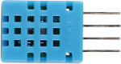| DHT11 温湿度传感器 | 1 |
| 17 | | LM35 温度传感器 | 1 |
| 18 | | 声音传感器 | 1 |
| 19 | |OLED模块|1|
| 20| | 按键开关 | 4 |
| 21 |  | 无源蜂鸣器 | 1 |
| 22 |  | 有源蜂鸣器| 1 |
| 23 |  | 光敏电阻 | 2 |
| 24 |  | 倾斜开关 | 1 |
| 25 | | 火焰传感器 | 1 |
| 26 |  |热敏电阻| 1 |
| 27 |  | 红外接收器| 1 |
| 28 |  | 74HC595芯片 | 1 |
| 29 |  | 可调电位器 | 1 |
| 30 |  | NPN(S8050)三极管 | 2 |
| 31 | | PNP(S8550)三极管 | 2 |
| 32 |  | RGB LED| 1 |
| 33 |  |红色LED| 10 |
| 34 | | 黄色LED| 10 |
| 35 |  | 绿色LED | 10 |
| 36 |  | 蓝色LED | 10 |
| 37 |  | 220Ω电阻 | 10 |
| 38|  | 10KΩ电阻  | 10 |
| 39|  | 1KΩ电阻 | 10 |
| 40 | | 电池盒 | 1 |
| 41 |  | 白色IC卡 | 1|
| 42| | 蓝色钥匙扣 | 1 |
| 43 |  |摇杆帽| 1 |
| 44 | | 风扇叶片| 1 |
| 45 ||电阻卡| 1 |
| 46| |红外遥控器 | 1 |
| 47 |  | 黄色按键帽 | 4|
| 48 |  |Micro USB数据线 | 1 |
| 49 |  | 面包板跳线 | 1 |
| 50 |  | 母对母杜邦线 | 1 |
| 51 |  | 公对母杜邦线 | 1 |
| 52 |  | 1.5V AA电池(<span style="color: rgb(255, 76, 65);">自备</span>) | 6 |

---

# 资料下载：

本教程的所有实验代码和库文件等资料的下载链接：

- [Codes](Codes.zip)

- [Library](Library.zip)

---

# ESP32 主控板介绍：

详细资料请参考链接：[https://wiki.keyestudio.com/KS5016_Keyestudio_ESP32_PLUS_Development_Board](https://wiki.keyestudio.com/KS5016_Keyestudio_ESP32_PLUS_Development_Board)

---

# 常见问题解答：

1\. 问：ESP32 主控板烧录程序出错。

答：请检查ESP32 主控板的型号是否选对。

请检查USB串口端口号是否选对。

2\. 问：ESP32 主控板使用Micro USB数据线连接到计算机，串口端口未显示。

答：请检查ESP32 主控板是否与计算机连接完好，再点击“设备管理器”，查看是否显示对应的串口端口。如果显示正确，说明连接完好，如果还是没有显示，那有可能是ESP32 主控板上的USB芯片出问题了。

3\. 问：烧录了代码，传感器/模块不工作或串口监视器窗口不能显示正确的信息？

答：请确认代码中的引脚和实际接线是否一致，如有错误，请正确按照代码中的引脚进行接线即可。

4\. 问：舵机为什么工作不正常？

答：可能电压不够，最好外接电源供电。

5\. 问：超声波传感器检测时，为什么检测距离不准？

答：应从超声波传感器的发射头处开始测量，此模块非高精度超声波距离检测模块，会有误差。

6\. 问：风扇（电机）工作不正常，主板很容易被烧坏？

答：由于风扇在转动时，所需的电流比其他传感器要大，会引起电路中电压电流波动，特别是风扇进行正反转时，电压电流波动过大，导致ESP32 主控板的电压电流过低，会导致复位。需要外接电源给UNO R4主板供电，这样保证风扇能正常工作。

7\. 问：无源蜂鸣器的音调与实际音调不准？

答：普通无源蜂鸣器模拟的音调，达不到专业音调的要求，如需非常准确音调，需要更专业的无源蜂鸣器。

8\. 问：人体红外热释电传感器误报？

答：人体红外热释电传感器避免误报警要求如下：

探测范围内避开被风吹而引起飘动的物体，如：窗帘、衣物、花草等。

探测范围内避免强光照射干扰，如：阳光照射、汽车灯光照射、射灯照射及照明等光源。

9\. 问：温湿度传感器防水吗？

答：温湿度传感器检测的是空气中的温度和湿度，不防水，请勿将模块放入水中。

10\. 问：OLED模块接上电源为什么不亮？

答：OLED是没有背光的，显示属于自发光方式。只接VCC和GND，OLED是不会亮的。必须用程序控制才能亮点OLED。

11\. 问：WiFi一直连接不上？

答：请将ESP32主控板移动到路由器周边，按下主板上的复位键重启ESP32主控板，耐心等待连接即可。若还是一直连接不上，请查看WiFi名称和密码是否填写正确。

12\. 问：网页端远程操作其他传感器时，反应很慢？

答：路由器网络传输变慢的原因：

- 多人连接，路由器CPU资源不足，重启路由器，重新连接网络。
- 路由器系统使用时间过长，重启路由器。
- 无线干扰，无线信号不稳定时，请勿穿墙使用。

路由器相关知识，请自行**google**搜索。

---

# Arduino_C Tutorial

## 1. Arduino IDE 环境设置

### 1.1. 安装 Arduino IDE（重要）

Arduino IDE，称为 Arduino 集成开发环境，提供完成 Arduino 项目所需的所有软件支持。这是由 Arduino 团队提供的专为 Arduino 设计的编程软件，它允许我们编写程序并将其上传到 Arduino 主控板。

Arduino IDE 2.3.3 是一个开源项目。这是前身Arduino IDE 1.x 的改进，并配备了改进的用户界面，改进的板型和库管理器，调试器，自动完成功能等等。

在本教程中，我们将展示如何在 Windows、Mac 或 Linux 计算机上下载和安装 Arduino IDE 2.3.3。 

<span style="color: rgb(255, 76, 65);">**特别提醒**：</span><span style="background:#ff0;color:#000">本教程使用的是Arduino IDE 2.3.3 版本，其他的版本不能保证代码编译和上传成功。</span>


**<span style="font-size: 20px;">要求：</span>**

- Windows - Win 10 及更高版本，64 位
- Linux - 64 位
- MacOS - 64 位

**<span style="font-size: 20px;">下载 Arduino IDE 2.3.3：</span>**

1\. 访问 [Arduino IDE 2.3.3 页面](https://www.arduino.cc/en/software#future-version-of-the-arduino-ide)

2\. 下载适用于您的操作系统版本的 IDE。


<span style="color: rgb(255, 76, 65); background: rgb(200, 255, 200);">特别提醒：为了防止Arduino IDE版本更新过快，我们也提供了Arduino IDE 2.3.3 版本的安装包下载链接。而更高级的版本可能会导致本教程的实验代码编译不成功。如果这样的话，建议采用我们提供的Arduino IDE 2.3.3 版本安装包下载链接。</span>

[Arduino IDE 2.3.3 版本](https://downloads.arduino.cc/arduino-ide/arduino-ide_2.3.3_Windows_64bit.exe)

**<span style="font-size: 20px;">安装:</span>**

**Windows**

1\. 双击 <span style="color: rgb(255, 76, 65); font-size: 15px;">arduino-ide_xxxx.exe file</span> 以运行下载的文件。

2\. 阅读许可协议并单击 “**I Agree**”。


3\. 选择安装选 “**Anyone who uses this conputer(all users)**”,然后单击 “**Next**”。


4\. 选择安装位置，建议将软件安装在系统驱动器以外的驱动盘上，然后单击 “**Install**”。


5\. 然后点击 “**Finish**”.


**MacOS：**

双击下载的 <span style="color: rgb(255, 76, 65); font-size: 15px;">arduino_ide_xxxx.dmg</span> 文件并按照说明将 **Arduino IDE.app** 复制到 **Applications** 文件夹，几秒钟后您将看到 Arduino IDE 安装成功


**Linux:**

关于在 Linux 系统上安装 Arduino IDE 2.3.3 的教程，请参考：[https://docs.arduino.cc/software/ide-v2/tutorials/getting-started/ide-v2-downloading-and-installing/#linux](https://docs.arduino.cc/software/ide-v2/tutorials/getting-started/ide-v2-downloading-and-installing/#linux)

**<span style="font-size: 24px;">打开 IDE:</span>**

1\. 当您首次打开 Arduino IDE 2.3.3 时，它会自动安装 Arduino AVR 板、内置库和其他所需文件。 


2\. 此外，您的防火墙或安全中心可能会弹出几次询问您是否要安装某些设备驱动程序。请全部安装。


3\. 现在你的Arduino IDE已经准备好了！

**<span style="color: rgb(255, 76, 65);">注意：</span>** 如果由于网络问题或其他原因导致某些安装无法工作，您可以重新打开Arduino IDE，它将完成其余的安装。在所有安装完成后，“输出” 窗口不会自动打开，除非单击 “验证” 或 “上传” 。

### 1.2. 安装驱动

我们需要一个驱动程序来启动我们的ESP32主控板。否则，将找不到连接到计算机的COM端口。

驱动安装方法请参考链接：[https://docs.keyestudio.com/projects/Arduino/en/latest/Arduino%20IDE%20Tutorial.html#install-driver](https://docs.keyestudio.com/projects/Arduino/en/latest/Arduino%20IDE%20Tutorial.html#install-driver)

在表格中，根据ESP32主控板和计算机系统，点击相应链接进入对应的教程。


### 1.3. Arduino IDE 介绍


- 1\. Verify：编译您的代码。任何语法问题都将提示错误。
- 2\. Upload：将代码上传到您的开发板。当您单击该按钮时，主控板上的 RX 和 TX LED 将快速闪烁，并且在上传完成之前不会停止。
- 3\. Debug：用于逐行错误检查。
- 4\. Select Board：快速设置主控板板型和端口。
- 5\. Serial Plotter：检查读数值的变化。
- 6\. Serial Monitor：单击按钮，将出现一个窗口，它接收从您的控制板发送的数据。它对于调试非常有用。
- 7\. File：点击菜单，会出现一个下拉列表，包括文件创建、打开、保存、关闭、一些参数配置等。
- 8\. Edit：点击菜单。在下拉列表中，有一些编辑操作，如：剪切、复制、粘贴、查找 等，以及它们相应的快捷方式。
- 9\. Sketch：包括 Verify、Upload、Add files等操作。更重要的功能是 Include Library ，您可以在其中添加库。
- 10\. Tool：包括一些工具，最常用的 Board（您使用的主控板）和 Port（您的主控板所在的端口）。每次要上传代码时，都需要选择或选中它们。
- 11\. Help：如果您是初学者，您可以查看菜单下方的选项并获得您需要的帮助，包括 IDE 中的操作、介绍信息、故障排除、代码解释等。
- 12\. Output Bar：在此处切换输出选项卡。
- 13\. Output Window：打印信息。
- 14\. Board 和 Port：在这里，您可以预览为代码上传选择的主控板板型和端口。如果有不正确的主控板板型/端口，可以通过 “Tools -> Board / Port” 重新选择。
- 15\. IDE 的编辑区域：您可以在此处编写代码。
- 16\. Sketchbook：用于管理草图文件。
- 17\. Board Manager：用于管理板驱动程序。
- 18\. Library Manager：用于管理您的库文件。
- 19\. Debug：帮助调试代码。
- 20\. Search：从草图中搜索代码。

### 1.4. 安装 ESP32 开发板(重要)

要对 ESP32 微控制器进行编程，我们需要在 Arduino IDE 中安装 ESP32 开发板包。请按照以下分步指南进行操作：

**安装 ESP32 开发板**

1\. 点击“File” → “Preferences” 进入对话框页面，点击打开标出的按钮。


2\. 将这个地址：https://espressif.github.io/arduino-esp32/package_esp32_index.json ，复制粘贴到文本框中并且点击 “**OK**” 保存这个地址，如下图。然后再点击 “**OK**” 关闭对话框页面。


3\. 在 Boards Manager 窗口中，在搜索栏中键入 “**ESP32**” ，选择 <span style="color: rgb(255, 76, 65);">1.06</span> 版本进行安装。单击 “**Install**” 按钮开始安装过程。这将下载并安装 ESP32 开发板包，如下图：**<span style="color: rgb(255, 76, 0);">（特别提醒：本教程是安装 1.06 版本的 ESP32 开发板包，选择更高版本或最最新版本的ESP32 开发板包，可能会出现安装失败。）</span>**


3\. 您已在 Arduino IDE 中成功安装了 ESP32 开发板包。

**上传代码**

1\. 现在，使用 Micro USB 数据线将 ESP32 WROOM 32 连接到您的计算机.


2\. 点击 “**Tools**” -> “**Board**” -> “**esp32**”，然后选择正确的开发板板型 ESP32 Dev Module。


3\. 如果您的 ESP32 已连接到计算机，您可以通过单击 “**Tools**” -> “**Board**” 来选择正确的端口。


4\. 此外，Arduino 2.0 引入了一种快速选择主控板板型和端口的新方法。对于 ESP32 ，通常不会自动识别，因此您需要单击 “**Select other board and port**” 。


5\. 在搜索框中，键入 “**ESP32 Dev Module**” 并在出现时选择它。然后，选择正确的端口并单击 “**OK**”。


6\. 之后，您可以通过此快速访问窗口选择它。注意，在后续使用过程中，可能会出现 ESP32 在快速访问窗口中不可用的情况，您需要重复上述两个步骤。


7\. 这两种方法都允许您选择正确的主控板板型和端口，因此请选择最适合您的那一种。现在，一切都准备好将代码上传到 ESP32 了。

### 1.5. 添加 Arduino 库(重要)：

库是扩展 Arduino IDE 功能的预编写代码或函数的集合。库为各种功能提供了现成的代码，使您可以节省对复杂功能进行编码的时间和精力。

<span style="color: rgb(255, 76, 65);">**特别注意：** 本教程使用到的相关库文件一定要使用我们提供的，强烈推荐方法一：手动安装。</span>

**方法一：手动安装**

添加库除了可以使用库管理器安装还可以手动安装（或者，有些库无法通过库管理器添加安装，则必须需要手动安装。）。要安装这些库，请执行以下步骤：

1\. 打开Arduino IDE，进入**Sketch** -> **Include Library** -> **Add .ZIP Library...**。


2\. 导航到库文件所在的目录，例如：..\ **Libray** \ **Arduino_Libray** 文件夹，然后选择对应的库文件并单击 “**Open**”。


3\. 安装完成后，你将收到一条通知，确认该库已成功添加到Arduino IDE中。下次需要使用此库时，你不需要重复安装过程。


4\. 重复相同的过程以添加其他库文件。

**方法二：使用库管理器**

许多库可以直接通过 “**Arduino Library Manager**” 获得。您可以按照以下步骤访问 Library Manager：

1\. 在 Library Manager 中，你可以按名称搜索所需的库或浏览不同的类别。 

<span style="color: rgb(255, 76, 65);">**注意：**</span>在需要安装库的项目中，将出现提示，指示要安装哪些库。按照提供的说明进行操作，例如“此处使用了 Adafruit_GFX 库，你可以从 Library Manager 安装它”。只需按照提示安装推荐的库即可。


2\. 找到要安装的库后，单击它，然后单击 **Install** 按钮安装。如果出现“**INSTALL WITHOUT DEPENDENCIES**”和“**INSTALL ALL**”两个选项按钮，则单击“**INSTALL ALL**”。<span style="color: rgb(255, 76, 65);">同理，其他的库也是一样的。</span>


3\. Arduino IDE将自动为你下载并安装库。


4\. 重复相同的过程以添加其他库文件。

**库位置**

使用上述方法安装的库可以在Arduino IDE的默认库目录中找到，该目录通常位于 <span style="color: rgb(255, 76, 65);">C:\Users\xxx\Documents\Arduino\libraries</span> 。

如果您的库目录不同，您可以通过转到 “**File**” -> “**Preferences**” 来检查它。


[Installing libraries in Arduino IDE 2](https://docs.arduino.cc/software/ide-v2/tutorials/ide-v2-installing-a-library/)

---

## 2. IoT 项目课程

ESP32 物联网 学习套件利用 ESP32主控板上内置的 ESP32-S3 WiFi 和蓝牙模块，支持各种轻松愉快的物联网项目。WiFi 连接允许您将 Arduino 连接到互联网和云平台以进行 IoT 实验。蓝牙提供短距离无线通信功能。

借助 WiFi，您可以构建简单的 Web 服务器等项目来远程控制 LED，与 Arduino IoT Cloud 交互以监控传感器，等等。我们提供了实施这些项目和其他联网 IoT 项目的分步指南。

蓝牙功能支持本地化无线通信项目，例如，蓝牙控制LED，继电器、RGB和蜂鸣器等。 我们将指导您将 ESP32 与智能手机或其他支持蓝牙的设备配对，以执行各种控制和监控任务。


---

### 第01课 蓝牙低功耗数据传输

---

**1. 实验介绍：**

本项目提供了一个使用ESP32微控制器开发一个简单的蓝牙低功耗（BLE）串行通信应用程序的指南。ESP32是一款功能强大的微控制器，集成了Wi-Fi和蓝牙连接，使其成为开发无线应用程序的理想选择。BLE是一种低功耗无线通信协议，专为短距离通信而设计。本文将介绍将ESP32设置为BLE服务器并通过串行连接与BLE客户端通信的步骤。

---

**2. 实验组件：**

|    |||
| ------------------------ | --------------------- | --------------------- |
| ESP32 主控板 x1  | Micro USB数据线 x1 |移动通信设备 x1|

---

**3. 元件知识：**

ESP32 WROOM 32 是一个将Wi-Fi和蓝牙连接集成到单个芯片中的模块。它支持低功耗蓝牙（BLE）和经典蓝牙协议。
该模块可作为蓝牙客户端或服务器使用。作为蓝牙客户端，该模块可以连接到其他蓝牙设备并与它们交换数据。该模块作为蓝牙服务器，可以为其他蓝牙设备提供服务。

ESP32 WROOM 32 支持多种蓝牙配置文件，包括通用接入配置文件（GAP）、通用属性配置文件（GATT）和串口配置文件（SPP）。SPP配置文件允许模块通过蓝牙模拟串行端口，从而实现与其他蓝牙设备的串行通信。

要使用 ESP32 WROOM 32 的蓝牙功能，你需要使用合适的软件开发工具包（SDK）或使用带有ESP32 BLE库的Arduino IDE进行编程。ESP32 BLE库提供了处理BLE的高级接口。其中包括演示如何将该模块用作BLE客户端和服务器的示例。

蓝牙是一种短距离通信系统，可分为两种类型，即低功耗蓝牙(BLE)和经典蓝牙。简单的数据传输有两种模式：主模式和从模式。

**主模式：** 在这种模式下，工作在主设备上完成，并且可以与从设备连接。我们可以搜索和选择附近的从设备来连接。当设备在主模式下发起连接请求时，需要其他蓝牙设备的地址和配对密码等信息。配对完成后，可直接与它们连接。

**从模式：** 处于从模式的蓝牙模块只能接受来自主机的连接请求，但不能发起连接请求。与主机设备连接后，可以向主机设备发送数据，也可以从主机设备接收数据。蓝牙设备之间可以进行数据交互，一个设备处于主模式，另一个设备处于从模式。当它们进行数据交互时，处于主模式的蓝牙设备会搜索并选择附近要连接的设备。在建立连接时，它们可以交换数据。当移动通信设备（例如：智能手机/平板）与ESP32进行数据交换时，移动通讯设备通常处于主模式，ESP32为从模式。


总体而言，ESP32 WROOM 32 的蓝牙功能提供了一种方便和低功耗的方式来实现项目中的无线通信。

---

**4. 模块接线图：**


---

**5. 实验代码：**


```c++
/*  
 * 名称   : IoT_Bluetooth
 * 功能   : 蓝牙数据传输
 * 编译IDE：ARDUINO 2.3.2
 * 作者   : https://www.keyestudio.com/
*/
#include "BLEDevice.h"
#include "BLEServer.h"
#include "BLEUtils.h"
#include "BLE2902.h"

// Define the Bluetooth device name
const char *bleName = "ESP32_Bluetooth";

// Define the received text and the time of the last message
String receivedText = "";
unsigned long lastMessageTime = 0;

// Define the UUIDs of the service and characteristics
#define SERVICE_UUID           "6E400001-B5A3-F393-E0A9-E50E24DCCA9E" 
#define CHARACTERISTIC_UUID_RX "6E400002-B5A3-F393-E0A9-E50E24DCCA9E"
#define CHARACTERISTIC_UUID_TX "6E400003-B5A3-F393-E0A9-E50E24DCCA9E"

// Define the Bluetooth characteristic
BLECharacteristic *pCharacteristic;

void setup() {
  Serial.begin(115200);  // Initialize the serial port
  setupBLE();            // Initialize the Bluetooth BLE
}

void loop() {
  // When the received text is not empty and the time since the last message is over 1 second
  // Send a notification and print the received text
  if (receivedText.length() > 0 && millis() - lastMessageTime > 1000) {
    Serial.print("Received message: ");
    Serial.println(receivedText);
    pCharacteristic->setValue(receivedText.c_str());
    pCharacteristic->notify();
    receivedText = "";
  }

  // Read data from the serial port and send it to BLE characteristic
  if (Serial.available() > 0) {
    String str = Serial.readStringUntil('\n');
    const char *newValue = str.c_str();
    pCharacteristic->setValue(newValue);
    pCharacteristic->notify();
  }
}

// Define the BLE server callbacks
class MyServerCallbacks : public BLEServerCallbacks {
  // Print the connection message when a client is connected
  void onConnect(BLEServer *pServer) {
    Serial.println("Connected");
  }
  // Print the disconnection message when a client is disconnected
  void onDisconnect(BLEServer *pServer) {
    Serial.println("Disconnected");
  }
};

// Define the BLE characteristic callbacks
class MyCharacteristicCallbacks : public BLECharacteristicCallbacks {
  void onWrite(BLECharacteristic *pCharacteristic) {
    // When data is received, get the data and save it to receivedText, and record the time
    std::string value = std::string(pCharacteristic->getValue().c_str());
    receivedText = String(value.c_str());
    lastMessageTime = millis();
    Serial.print("Received: ");
    Serial.println(receivedText);
  }
};

// Initialize the Bluetooth BLE
void setupBLE() {
  BLEDevice::init(bleName);                        // Initialize the BLE device
  BLEServer *pServer = BLEDevice::createServer();  // Create the BLE server
  // Print the error message if the BLE server creation fails
  if (pServer == nullptr) {
    Serial.println("Error creating BLE server");
    return;
  }
  pServer->setCallbacks(new MyServerCallbacks());  // Set the BLE server callbacks

  // Create the BLE service
  BLEService *pService = pServer->createService(SERVICE_UUID);
  // Print the error message if the BLE service creation fails
  if (pService == nullptr) {
    Serial.println("Error creating BLE service");
    return;
  }
  // Create the BLE characteristic for sending notifications
  pCharacteristic = pService->createCharacteristic(CHARACTERISTIC_UUID_TX, BLECharacteristic::PROPERTY_NOTIFY);
  pCharacteristic->addDescriptor(new BLE2902());  // Add the descriptor
  // Create the BLE characteristic for receiving data
  BLECharacteristic *pCharacteristicRX = pService->createCharacteristic(CHARACTERISTIC_UUID_RX, BLECharacteristic::PROPERTY_WRITE);
  pCharacteristicRX->setCallbacks(new MyCharacteristicCallbacks());  // Set the BLE characteristic callbacks
  pService->start();                                                 // Start the BLE service
  pServer->getAdvertising()->start();                                // Start advertising
  Serial.println("Waiting for a client connection...");              // Wait for a client connection
}
```
---

**6. 操作步骤：**

1\. 使用平板或智能手机，点击 [App Store](https://apps.apple.com/us/app/lightblue/id557428110)（适用于 iOS ）或 [Google Play](https://play.google.com/store/apps/details?id=com.punchthrough.lightblueexplorer)（适用于 Android ）来下载 LightBlue 应用程序。也可以直接在**App Store**（适用于 iOS ）或**Google Play**（适用于 Android ）的搜索框搜索 “LightBlue” 进入下载页面去下载 LightBlue 应用程序(APP)。

<span style="color: rgb(255, 76, 65);">**这里是以 Android 系统为例进行操作，iOS系统可以参考。**</span>


2\. 打开位于 <span style="color: rgb(255, 76, 65);">..\Codes\Arduino_C_Code\IoT_C_Code\01 IoT Bluetooth</span> 路径下的 <span style="color: rgb(255, 76, 65);">IoT_Bluetooth.ino</span> 文件，或将上面的实验代码复制粘贴到 Arduino IDE 中。

3\. 选择正确的主控板板型（ESP32 Dev Module）和 适当的串口端口（COMxx），然后单击按钮上传代码。


4\. 成功上传代码后，开启移动设备(智能手机)上的蓝牙并打开 **LightBlue** 应用程序(APP)。


5\. 在 **Peripherals** 页面上，找到 ESP32-Bluetooth 并单击 “**Connect**” 。 如果您没有看到它，请尝试刷新页面几次。当 “**Connected**” 出现，表示蓝牙连接成功，向下滚动以查看代码中设置的 **3个 UUID** 。同时，Arduino IDE的串口监视器中也打印了 “**Connected**”。


6\. 单击 **Receive** UUID。单击 “**HEX**” 进入 <span style="color: rgb(0, 0, 255);">Format Selection</span> 页面，选择 “**UTF-8 String**”，然后单击 “**Save**” 保存信息。例如：“<span style="color: rgb(255, 76, 65);">HEX</span>” 表示十六进制，“<span style="color: rgb(255, 76, 65);">UTF-8 String</span> ” 表示字符，“<span style="color: rgb(255, 76, 65);">Binary</span>” 表示二进制等。


7\. 单击 “**Subscribe**” 变成 “**Unsubscribe**” 。


8\. 返回 Arduino IDE，打开串行监视器，将波特率设置为 “**115200**” ，然后在文本框中键入 “**welcome**” 并按键盘上的 “**Enter**” 键。


9\. 您现在应该会在 LightBlue 应用程序(APP)中看到 “**welcome**” 信息。


10\. 要将信息从移动设备发送到串行监视器，请单击 **Send** UUID。再单击 “**HEX**” 进入 <span style="color: rgb(255, 76, 65);">Format Selection</span> 页面，选择 “**UTF-8 String**”，然后单击 “**Save**” 保存信息。


11\. 单击 “**Write New Value**” 进入消息编写页面，编写 “**bluetooth test**” ，然后单击 “**Write**” 。


12\. 您应该会在Arduino IDE 的 “**Serial Monitor**” 中看到该信息。


---

**7. 代码说明：**

此 Arduino 代码是为 ESP32 微控制器编写的，并将其设置为与低功耗蓝牙（BLE）设备通信。下是代码的简要摘要：

- **包含必要的库** ：该代码首先包含在 ESP32 上使用低功耗蓝牙 （BLE） 所需的库。 

```c++
#include "BLEDevice.h"
#include "BLEServer.h"
#include "BLEUtils.h"
#include "BLE2902.h"
```
- **全局变量**：该代码定义了一组全局变量，包括蓝牙设备名称（<span style="color: rgb(255, 76, 65);">bleName</span>）、用于跟踪接收文本和最后一条消息时间的变量、服务和特征的 UUID，以及 <span style="color: rgb(255, 76, 65);">BLECharacteristic</span> 对象（<span style="color: rgb(255, 76, 65);">pCharacteristic</span>）。 

```c++
// Define the Bluetooth device name
const char *bleName = "ESP32_Bluetooth";

// Define the received text and the time of the last message
String receivedText = "";
unsigned long lastMessageTime = 0;

// Define the UUIDs of the service and characteristics
#define SERVICE_UUID           "6E400001-B5A3-F393-E0A9-E50E24DCCA9E" 
#define CHARACTERISTIC_UUID_RX "6E400002-B5A3-F393-E0A9-E50E24DCCA9E"
#define CHARACTERISTIC_UUID_TX "6E400003-B5A3-F393-E0A9-E50E24DCCA9E"

// Define the Bluetooth characteristic
BLECharacteristic *pCharacteristic;
```
- **初始化**：在 <span style="color: rgb(255, 76, 65);">setup()</span> 函数，则初始化串行端口的波特率为 115200 ，并且 <span style="color: rgb(255, 76, 65);">setupBLE()</span> 函数来设置蓝牙 BLE。

```c++
void setup() {
    Serial.begin(115200);  // Initialize the serial port
    setupBLE();            // Initialize the Bluetooth BLE
}
```
- **主循环**：在 <span style="color: rgb(255, 76, 65);">loop()</span> 函数，如果通过 BLE 接收字符串（即 receivedText 不为空），并且自最后一条消息以来至少已经过了 1 秒，则代码会将收到的字符串打印到串行监视器，将 <span style="color: rgb(255, 76, 65);">Characteristic</span> 值设置为收到的字符串，发送通知，然后清除收到的字符串。如果串行端口上有数据可用，它会读取字符串，直到遇到换行符，将特征值设置为此字符串，并发送通知。

```c++
void loop() {
    // When the received text is not empty and the time since the last message is over 1 second
    // Send a notification and print the received text
    if (receivedText.length() > 0 && millis() - lastMessageTime > 1000) {
        Serial.print("Received message: ");
        Serial.println(receivedText);
        pCharacteristic->setValue(receivedText.c_str());
        pCharacteristic->notify();
        receivedText = "";
    }

    // Read data from the serial port and send it to BLE characteristic
    if (Serial.available() > 0) {
        String str = Serial.readStringUntil('\n');
        const char *newValue = str.c_str();
        pCharacteristic->setValue(newValue);
        pCharacteristic->notify();
    }
}
```
- **回调**：两个回调类（<span style="color: rgb(255, 76, 65);">MyServerCallbacks</span> 和 <span style="color: rgb(255, 76, 65);">MyCharacteristicCallbacks</span>）用于处理与 Bluetooth 通信相关的事件。 <span style="color: rgb(255, 76, 65);">MyServerCallbacks</span> 用于处理与 BLE 服务器的连接状态（已连接或已断开连接）相关的事件。 <span style="color: rgb(255, 76, 65);">MyCharacteristicCallbacks</span> 用于处理 BLE 特性上的写入事件，即当连接的设备通过 BLE 向 ESP32 发送字符串时，该字符串会被捕获并存储在 <span style="color: rgb(255, 76, 65);">receivedText</span>，当前时间记录在 <span style="color: rgb(255, 76, 65);">lastMessageTime</span>。

```c++
// Define the BLE server callbacks
class MyServerCallbacks : public BLEServerCallbacks {
    // Print the connection message when a client is connected
    void onConnect(BLEServer *pServer) {
    Serial.println("Connected");
    }
    // Print the disconnection message when a client is disconnected
    void onDisconnect(BLEServer *pServer) {
    Serial.println("Disconnected");
    }
};

// Define the BLE characteristic callbacks
class MyCharacteristicCallbacks : public BLECharacteristicCallbacks {
    void onWrite(BLECharacteristic *pCharacteristic) {
        // When data is received, get the data and save it to receivedText, and record the time
        std::string value = std::string(pCharacteristic->getValue().c_str());
        receivedText = String(value.c_str());
        lastMessageTime = millis();
        Serial.print("Received: ");
        Serial.println(receivedText);
    }
};
```
- **设置 BLE**：在 <span style="color: rgb(255, 76, 65);">setupBLE()</span> 函数，初始化 BLE 设备和服务器，设置服务器回调，使用定义的 UUID 创建 BLE 服务，创建用于发送通知和接收数据的特征并将其添加到服务中，并设置特征回调。最后，服务启动，服务器开始播发。

```c++
// Initialize the Bluetooth BLE
void setupBLE() {
    BLEDevice::init(bleName);                        // Initialize the BLE device
    BLEServer *pServer = BLEDevice::createServer();  // Create the BLE server
    // Print the error message if the BLE server creation fails
    if (pServer == nullptr) {
        Serial.println("Error creating BLE server");
        return;
    }
    pServer->setCallbacks(new MyServerCallbacks());  // Set the BLE server callbacks

    // Create the BLE service
    BLEService *pService = pServer->createService(SERVICE_UUID);
    // Print the error message if the BLE service creation fails
    if (pService == nullptr) {
        Serial.println("Error creating BLE service");
        return;
    }
    // Create the BLE characteristic for sending notifications
    pCharacteristic = pService->createCharacteristic(CHARACTERISTIC_UUID_TX, BLECharacteristic::PROPERTY_NOTIFY);
    pCharacteristic->addDecodeor(new BLE2902());  // Add the decodeor
    // Create the BLE characteristic for receiving data
    BLECharacteristic *pCharacteristicRX = pService->createCharacteristic(CHARACTERISTIC_UUID_RX, BLECharacteristic::PROPERTY_WRITE);
    pCharacteristicRX->setCallbacks(new MyCharacteristicCallbacks());  // Set the BLE characteristic callbacks
    pService->start();                                                 // Start the BLE service
    pServer->getAdvertising()->start();                                // Start advertising
    Serial.println("Waiting for a client connection...");              // Wait for a client connection
}
```

<span style="color: rgb(255, 76, 65);">**请注意**</span>：<span style="background: rgb(255, 251, 0);">此代码允许双向通信 - 它可以通过 BLE 发送和接收数据。 但是，要与特定硬件交互（例如打开/关闭 LED），应添加其他代码以处理 接收到的字符串并采取相应的行动。</span>

---

### 第02课 蓝牙控制 LED

---

**1. 实验介绍：**

本项目是前一个项目（第01课 IOT Bluetooth）的扩展，增加了LED 配置和自定义命令，如 “led_on”和“led_off”等。这些命令允许通过使用 **LightBlue** APP 从移动设备发送命令来控制 LED 的亮与灭。

---

**2. 元件知识：** 

**（1）LED**:


LED是一种被称为“发光二极管”的半导体，是一种由半导体材料(硅、硒、锗等)制成的电子器件。它有正极和负极。短腿为负极，接GND，长腿为正极，接3.3V或5V。


**（2）五色环电阻**

电阻是电路中限制或调节电流流动的电子元件。左边是电阻器的外观，右边是电阻在电路中表示的符号。电阻(R)的单位为欧姆(Ω)，1 mΩ= 1000 kΩ，1kΩ= 1000Ω。

   
 
我们可以使用电阻来保护敏感组件，如LED。电阻的强度（以Ω为单位）用小色环标记在电阻器的主体上。每种颜色代表一个数字，你可以用电阻对照卡查找。
-色带1 – 1st Digit.
-色带 2 – 2nd Digit.
-色带 3 – 3rd Digit.
-色带 4 – Multiplier.
-色带 5 – Tolerance.


在这个套件中，我们提供了4个具有不同电阻值的五色环电阻。这里以3个五色环电阻为例：

220Ω 电阻*10


10KΩ 电阻*10


1KΩ 电阻*10


在相同的电压下，会有更小的电流和更大的电阻。电流(I)、电压(U)、电阻(R)之间的联系可以用公式表示：I=U/R。在下图中，假如电压为3V，则通过R1的电流: I = U / R = 3 V / 10 KΩ= 0.0003A= 0.3mA。


                                  
不要把电阻值很低的电阻直接连接在电源两极，这样会使电流过高而损坏电子元件。电阻是没有正负极之分。

**（3）面包板**

在完成任何电路设计之前，面包板用于快速构建和测试电路。面包板上有许多孔，可以插入集成电路和电阻等电路元件。一个典型的面包板如下所示：


面包板有很多金属条，它们在面包板的下面，连接面包板顶部的孔。金属条的摆放如下图所示。注意，顶部和底部的孔是水平连接，而其余的孔是垂直连接。


面包板的前两行(上)和后两行(下)分别用于电源的正极（+）和负极（-）。面包板的导电布局图如下图所示：


电子初学者在连接DIP (Dual In-line Packages)组件时，如集成电路、微控制器、芯片等，中间一条凹槽隔离中间部分，凹槽上下是不连通的。因此，DIP组件可以连接如下图所示：


---

**3. 实验组件：**

|  ||||
| ------------------------ | ------------------------ | ---------------------------- |---------------------------- |
| ESP32 主控板| 红色 LED x1  | 220Ω电阻 x1  |移动通信设备 x1|
||||   |
|面包板 x1 |面包板跳线若干 | Micro USB数据线 x1 |    |

---

**4. 接线图：** 

我们从下面的实验原理图可知。这里我们使用数字引脚IO26。我们将LED连接到一个220Ω的电阻，以避免大电流损坏LED。

**原理图：**


**实物接线图：**


---

**5. 实验代码：**

```c++
/*  
 * 名称   : IoT_Bluetooth Control LED
 * 功能   : 蓝牙 + APP控制LED灯
 * 编译IDE：ARDUINO 2.3.3
 * 作者   : https://www.keyestudio.com/
*/
#include "BLEDevice.h"
#include "BLEServer.h"
#include "BLEUtils.h"
#include "BLE2902.h"

const int ledPin = 26; // Define LED pin to IO26.

// Define the Bluetooth device name
const char *bleName = "ESP32_Bluetooth";

// Define the received text and the time of the last message
String receivedText = "";
unsigned long lastMessageTime = 0;

// Define the UUIDs of the service and characteristics
#define SERVICE_UUID           "6E400001-B5A3-F393-E0A9-E50E24DCCA9E" 
#define CHARACTERISTIC_UUID_RX "6E400002-B5A3-F393-E0A9-E50E24DCCA9E"
#define CHARACTERISTIC_UUID_TX "6E400003-B5A3-F393-E0A9-E50E24DCCA9E"

// Define the Bluetooth characteristic
BLECharacteristic *pCharacteristic;

void setup() {
  Serial.begin(115200);      // Initialize the serial port
  setupBLE();                // Initialize the Bluetooth BLE

  pinMode(ledPin, OUTPUT);  // Set LED pin to output

}

void loop() {
  // When the received text is not empty and the time since the last message is over 1 second
  // Send a notification and print the received text
  if (receivedText.length() > 0 && millis() - lastMessageTime > 1000) {
    Serial.print("Received message: ");
    Serial.println(receivedText);
    pCharacteristic->setValue(receivedText.c_str());
    pCharacteristic->notify();
    receivedText = "";
  }

  // Read data from the serial port and send it to BLE characteristic
  if (Serial.available() > 0) {
    String str = Serial.readStringUntil('\n');
    const char *newValue = str.c_str();
    pCharacteristic->setValue(newValue);
    pCharacteristic->notify();
  }
}

// Define the BLE server callbacks
class MyServerCallbacks : public BLEServerCallbacks {
  // Print the connection message when a client is connected
  void onConnect(BLEServer *pServer) {
    Serial.println("Connected");
  }
  // Print the disconnection message when a client is disconnected
  void onDisconnect(BLEServer *pServer) {
    Serial.println("Disconnected");
  }
};

// Define the BLE characteristic callbacks
class MyCharacteristicCallbacks : public BLECharacteristicCallbacks {
  void onWrite(BLECharacteristic *pCharacteristic) {
    std::string value = std::string(pCharacteristic->getValue().c_str());
    if (value == "led_on") {
      digitalWrite(ledPin, HIGH); // LED on.
      Serial.println("LED turned on");
    } else if (value == "led_off") {
      digitalWrite(ledPin, LOW); // LED off.
    }
  }
};

// Initialize the Bluetooth BLE
void setupBLE() {
  BLEDevice::init(bleName);                        // Initialize the BLE device
  BLEServer *pServer = BLEDevice::createServer();  // Create the BLE server
  // Print the error message if the BLE server creation fails
  if (pServer == nullptr) {
    Serial.println("Error creating BLE server");
    return;
  }
  pServer->setCallbacks(new MyServerCallbacks());  // Set the BLE server callbacks

  // Create the BLE service
  BLEService *pService = pServer->createService(SERVICE_UUID);
  // Print the error message if the BLE service creation fails
  if (pService == nullptr) {
    Serial.println("Error creating BLE service");
    return;
  }
  // Create the BLE characteristic for sending notifications
  pCharacteristic = pService->createCharacteristic(CHARACTERISTIC_UUID_TX, BLECharacteristic::PROPERTY_NOTIFY);
  pCharacteristic->addDescriptor(new BLE2902());  // Add the descriptor
  // Create the BLE characteristic for receiving data
  BLECharacteristic *pCharacteristicRX = pService->createCharacteristic(CHARACTERISTIC_UUID_RX, BLECharacteristic::PROPERTY_WRITE);
  pCharacteristicRX->setCallbacks(new MyCharacteristicCallbacks());  // Set the BLE characteristic callbacks
  pService->start();                                                 // Start the BLE service
  pServer->getAdvertising()->start();                                // Start advertising
  Serial.println("Waiting for a client connection...");              // Wait for a client connection
}

```
---

**6. 实验结果：**

其操作步骤如下：

1\. 打开位于 <span style="color: rgb(255, 76, 65);">..\Codes\Arduino_C_Code\IoT_C_Code\02 IoT Bluetooth Control LED</span> 路径下的 <span style="color: rgb(255, 76, 65);">IoT_Bluetooth_Control_LED.ino</span> 文件，或将上面的实验代码复制粘贴到 Arduino IDE 中。

2\. 选择正确的主控板板型（ESP32 Dev Module）和 适当的串口端口（COMxx），然后单击按钮上传代码。


3\. 成功上传代码后，开启移动设备(智能手机)上的蓝牙并打开 **LightBlue** 应用程序(APP)。


4\. 在 **Peripherals** 页面上，找到 ESP32-Bluetooth 并单击 “**Connect**” 。 如果您没有看到它，请尝试刷新页面几次。当 “**Connected**” 出现，表示蓝牙连接成功，向下滚动以查看代码中设置的 **3 个 UUID** 。同时，Arduino IDE的串口监视器中也打印了 “**Connected**”。


5\. 单击 **Send** UUID。再单击 “**HEX**” 进入 <span style="color: rgb(255, 76, 65);">Format Selection</span> 页面，选择 “**UTF-8 String**”，然后单击 “**Save**” 保存信息。


6\. 单击 “**Write New Value**” 进入编写指令页面，现在您可以编写这个指令：“led_on” 来查看LED是否响应这个指令。输入 “**led_on**” ，然后单击 “**Write**” ，看看LED 是不是点亮。同时串口监视器也打印相应的信息。


7\. 再次单击 “**Write New Value**” 进入编写指令页面，现在您可以编写这个指令：“led_off” 来查看LED是否响应这个指令。输入 “**led_off**” ，然后单击 “**Write**” ，看看LED 是不是熄灭。同时串口监视器也打印相应的信息。


---

**7. 代码说明：**

此代码是先前项目（第01课 IOT Bluetooth）的扩展，添加了LED配置和自定义命令，如“led_on”和“led_off”等。这些指令允许通过使用 LightBlue APP 从移动设备(智能手机)发送命令来控制RGB LED。

让我们一步一步地分解代码：

- 为LED引脚添加新的全局变量。

```c++
const int ledPin = 26; // Define LED pin to IO26.
```
- 在<span style="color: rgb(255, 76, 65);">setup()</span>函数中，定义LED连接的引脚为输出模式。

```c++
pinMode(ledPin, OUTPUT);  // Set LED pin to output
```
- 修改MyCharacteristicCallbacks类中的onWrite方法。这个函数监听来自蓝牙连接的数据。根据接收到的字符串（如“led_on”和“led_off”）来控制LED。

```c++
// Define the BLE characteristic callbacks
class MyCharacteristicCallbacks : public BLECharacteristicCallbacks {
  void onWrite(BLECharacteristic *pCharacteristic) {
    std::string value = std::string(pCharacteristic->getValue().c_str());
    if (value == "led_on") {
      digitalWrite(ledPin, HIGH); // LED on.
      Serial.println("LED turned on");
    } else if (value == "led_off") {
      digitalWrite(ledPin, LOW); // LED off.
      Serial.println("LED turned off");
    }
  }
};
```
---

### 第03课 蓝牙控制蜂鸣器鸣叫

---

**1. 实验介绍：**

前面的项目学习了蓝牙传输数据功能和蓝牙控制LED的项目，那么这个项目使用有源蜂鸣器的配置和自定义命令，如 “buzzer_on”和“buzzer_off”等。这些命令允许通过使用 **LightBlue** APP 从移动设备发送命令来控制有源蜂鸣器鸣叫。

---

**2. 元件知识：**


**有源蜂鸣器：** 其内部有一个简单的振荡器电路，可以将恒定的直流电转换成特定频率的脉冲信号。一旦有源蜂鸣器收到一个高电平，它将产生声音。而无源蜂鸣器是一种内部没有振动源的集成电子蜂鸣器，它必须由2K-5K方波驱动，而不是直流信号。这两个蜂鸣器的外观非常相似，但是一个带有绿色电路板的蜂鸣器是无源蜂鸣器，而另一个带有黑色胶带的是有源蜂鸣器。无源蜂鸣器不能区分正极性而有源极性蜂鸣器是可以。如下所示：


**三极管:** 由于蜂鸣器需要很大的电流，ESP32主控板输出能力的GPIO（引脚接口）不能满足要求，这里需要一个NPN型三极管来放大电流。


三极管，全称是半导体三极管，也称双极型晶体管、晶体三极管，是一种控制电流的半导体器件。其作用是把微弱信号放大成幅度值较大的电信号，也用作无触点开关。

三极管按结构可分为NPN和PNP，它们都分为三个区，分别称为发射区、基区和集电区，由三个区各引出一个电极，分别称为发射极(E)、基极(B)和集电极(C)，发射区和基区之间的PN结称为发射结，集电区和基区之间的PN结称为集电结。其结构和符号见下图所示，其中发射极箭头所示方向表示发射极电流的流向。


当电流通过“BE”之间时，“CE”将允许几倍的电流通过(三极管放大)，此时，三极管在放大区工作。当“BE”之间的电流超过某个值时，“CE”将不再允许电流增加，此时三极管工作在饱和区。三极管有两种类型如下所示：PNP和NPN


<span style="color: rgb(255, 76, 65);">在我们的套件中，PNP三极管标记为8550，NPN三极管标记为8050。</span>

基于三极管的特性，它常被用作数字电路中的开关。由于单片机输出电流的能力很弱，我们将使用三极管来放大电流和驱动大电流的元件。在使用NPN三极管驱动蜂鸣器时，通常采用以下方法：如果GPIO（引脚接口）输出高电平，电流将流过R1，三极管将传导，蜂鸣器将发出声音。如果GPIO（引脚接口）输出低电平，没有电流流过R1，三极管就不会传导，蜂鸣器也不会响。在使用PNP三极管驱动蜂鸣器时，通常采用以下方法：如果GPIO（引脚接口）输出低电平，电流将流过R1，三极管将传导，蜂鸣器将发出声音。如果GPIO（引脚接口）输出高电平，没有电流流过R1，三极管就不会传导，蜂鸣器也不会响。


---

**3. 实验组件：**

|   |||
| ------------------------ | ------------------------ | ---------------------------- |
|ESP32 主控板| NPN型三极管(S8050) x1| 有源蜂鸣器 x1 |
||||
|面包板 x1 |面包板跳线若干 | Micro USB数据线 x1 |
||||
|移动通信设备 x1| 1kΩ电阻 x1 | 10kΩ电阻 x1 |

---

**4. 接线图：**

**原理图：**


**实物接线图：**


---

**5. 实验代码：**

```c++
/*  
 * 名称   : IoT_Bluetooth Control buzzer
 * 功能   : 蓝牙 + APP控制有源蜂鸣器鸣叫
 * 编译IDE：ARDUINO 2.3.3
 * 作者   : https://www.keyestudio.com/
*/
#include "BLEDevice.h"
#include "BLEServer.h"
#include "BLEUtils.h"
#include "BLE2902.h"

const int buzzerPin = 13; // Define Active buzzer pin to IO13.

// Define the Bluetooth device name
const char *bleName = "ESP32_Bluetooth";

// Define the received text and the time of the last message
String receivedText = "";
unsigned long lastMessageTime = 0;

// Define the UUIDs of the service and characteristics
#define SERVICE_UUID           "6E400001-B5A3-F393-E0A9-E50E24DCCA9E" 
#define CHARACTERISTIC_UUID_RX "6E400002-B5A3-F393-E0A9-E50E24DCCA9E"
#define CHARACTERISTIC_UUID_TX "6E400003-B5A3-F393-E0A9-E50E24DCCA9E"

// Define the Bluetooth characteristic
BLECharacteristic *pCharacteristic;

void setup() {
  Serial.begin(115200);      // Initialize the serial port
  setupBLE();                // Initialize the Bluetooth BLE

  pinMode(buzzerPin, OUTPUT);  // Set Active buzzer pin to output

}

void loop() {
  // When the received text is not empty and the time since the last message is over 1 second
  // Send a notification and print the received text
  if (receivedText.length() > 0 && millis() - lastMessageTime > 1000) {
    Serial.print("Received message: ");
    Serial.println(receivedText);
    pCharacteristic->setValue(receivedText.c_str());
    pCharacteristic->notify();
    receivedText = "";
  }

  // Read data from the serial port and send it to BLE characteristic
  if (Serial.available() > 0) {
    String str = Serial.readStringUntil('\n');
    const char *newValue = str.c_str();
    pCharacteristic->setValue(newValue);
    pCharacteristic->notify();
  }
}

// Define the BLE server callbacks
class MyServerCallbacks : public BLEServerCallbacks {
  // Print the connection message when a client is connected
  void onConnect(BLEServer *pServer) {
    Serial.println("Connected");
  }
  // Print the disconnection message when a client is disconnected
  void onDisconnect(BLEServer *pServer) {
    Serial.println("Disconnected");
  }
};

// Define the BLE characteristic callbacks
class MyCharacteristicCallbacks : public BLECharacteristicCallbacks {
  void onWrite(BLECharacteristic *pCharacteristic) {
    std::string value = std::string(pCharacteristic->getValue().c_str());
    if (value == "buzzer_on") {
      digitalWrite(buzzerPin, HIGH); // turn on active buzzer .
      Serial.println("buzzer turned on");
    } else if (value == "buzzer_off") {
      digitalWrite(buzzerPin, LOW); // turn off active buzzer .
      Serial.println("buzzer turned off");
    }
  }
};

// Initialize the Bluetooth BLE
void setupBLE() {
  BLEDevice::init(bleName);                        // Initialize the BLE device
  BLEServer *pServer = BLEDevice::createServer();  // Create the BLE server
  // Print the error message if the BLE server creation fails
  if (pServer == nullptr) {
    Serial.println("Error creating BLE server");
    return;
  }
  pServer->setCallbacks(new MyServerCallbacks());  // Set the BLE server callbacks

  // Create the BLE service
  BLEService *pService = pServer->createService(SERVICE_UUID);
  // Print the error message if the BLE service creation fails
  if (pService == nullptr) {
    Serial.println("Error creating BLE service");
    return;
  }
  // Create the BLE characteristic for sending notifications
  pCharacteristic = pService->createCharacteristic(CHARACTERISTIC_UUID_TX, BLECharacteristic::PROPERTY_NOTIFY);
  pCharacteristic->addDescriptor(new BLE2902());  // Add the descriptor
  // Create the BLE characteristic for receiving data
  BLECharacteristic *pCharacteristicRX = pService->createCharacteristic(CHARACTERISTIC_UUID_RX, BLECharacteristic::PROPERTY_WRITE);
  pCharacteristicRX->setCallbacks(new MyCharacteristicCallbacks());  // Set the BLE characteristic callbacks
  pService->start();                                                 // Start the BLE service
  pServer->getAdvertising()->start();                                // Start advertising
  Serial.println("Waiting for a client connection...");              // Wait for a client connection
}
```
---

**6. 实验结果：**

其操作步骤如下：

1\. 打开位于 <span style="color: rgb(255, 76, 65);">..\Codes\Arduino_C_Code\IoT_C_Code\03 IoT_Bluetooth_Control_Buzzer</span> 路径下的 <span style="color: rgb(255, 76, 65);">IoT_Bluetooth_Control_Buzzer.ino</span> 文件，或将上面的实验代码复制粘贴到 Arduino IDE 中。

2\. 选择正确的主控板板型（ESP32 Dev Module）和 适当的串口端口（COMxx），然后单击按钮上传代码。


3\. 成功上传代码后，开启移动设备(智能手机)上的蓝牙并打开 **LightBlue** 应用程序(APP)。


4\. 在 **Peripherals** 页面上，找到 ESP32-Bluetooth 并单击 “**Connect**” 。 如果您没有看到它，请尝试刷新页面几次。当 “**Connected**” 出现，表示蓝牙连接成功，向下滚动以查看代码中设置的 **3 个 UUID** 。同时，Arduino IDE的串口监视器中也打印了 “**Connected**”。


5\. 单击 **Send** UUID。再单击 “**HEX**” 进入 <span style="color: rgb(255, 76, 65);">Format Selection</span> 页面，选择 “**UTF-8 String**”，然后单击 “**Save**” 保存信息。


6\. 单击 “**Write New Value**” 进入编写指令页面，现在您可以编写这个指令：“buzzer_on” 来查看有源蜂鸣器是否响应这个指令。输入 “**buzzer_on**” ，然后单击 “**Write**” ，看看有源蜂鸣器是不是在鸣叫。同时串口监视器也打印相应的信息。


7\. 再次单击 “**Write New Value**” 进入编写指令页面，现在您可以编写这个指令：“buzzer_off” 来查看有源蜂鸣器是否响应这个指令。输入 “**buzzer_off**” ，然后单击 “**Write**” ，看看有源蜂鸣器是不是鸣叫停止。同时串口监视器也打印相应的信息。


---

**7. 代码说明：**

此课程代码与第02课代码类似，这里就不多做介绍了。

---

### 第04课 蓝牙控制继电器

---

**1. 实验介绍：**

在日常生活中，我们一般使用220V交流来驱动电气设备，有时我们会用开关来控制电器。如果将开关直接连接到220V交流电路上，一旦发生漏电，人就有危险。从安全的角度考虑，我们特别设计了这款具有NO(常开)端和NC(常闭)端的继电器模块。那么，在本项目中，我们将使用无线蓝牙传输数据功能来操作继电器工作。

---

**2. 实验组件：**

|  |||
| ------------------------ | ------------------------ | ---------------------------- |
|ESP32 主控板 |面包板 x1 |移动通信设备 x1| 
| | ||
|继电器 x1|LED x1|220Ω电阻 x1|
||||
|面包板跳线若干 | Micro USB数据线 x1 |公对母杜邦线若干|

---

**3. 接线图：**

**原理图：**


**实物接线图：**


---

**4. 实验代码：**

```c++
/*  
 * 名称   : IoT_Bluetooth_Control_Relay
 * 功能   : 蓝牙 + APP控制继电器吸合和断开
 * 编译IDE：ARDUINO 2.3.3
 * 作者   : https://www.keyestudio.com/
*/
#include "BLEDevice.h"
#include "BLEServer.h"
#include "BLEUtils.h"
#include "BLE2902.h"

const int relayPin = 12;  // Define relay pin to IO12.

// Define the Bluetooth device name
const char *bleName = "ESP32_Bluetooth";

// Define the received text and the time of the last message
String receivedText = "";
unsigned long lastMessageTime = 0;

// Define the UUIDs of the service and characteristics
#define SERVICE_UUID           "6E400001-B5A3-F393-E0A9-E50E24DCCA9E" 
#define CHARACTERISTIC_UUID_RX "6E400002-B5A3-F393-E0A9-E50E24DCCA9E"
#define CHARACTERISTIC_UUID_TX "6E400003-B5A3-F393-E0A9-E50E24DCCA9E"

// Define the Bluetooth characteristic
BLECharacteristic *pCharacteristic;

void setup() {
  Serial.begin(115200);      // Initialize the serial port
  setupBLE();                // Initialize the Bluetooth BLE

  pinMode(relayPin, OUTPUT);  // Set Active buzzer pin to output

}

void loop() {
  // When the received text is not empty and the time since the last message is over 1 second
  // Send a notification and print the received text
  if (receivedText.length() > 0 && millis() - lastMessageTime > 1000) {
    Serial.print("Received message: ");
    Serial.println(receivedText);
    pCharacteristic->setValue(receivedText.c_str());
    pCharacteristic->notify();
    receivedText = "";
  }

  // Read data from the serial port and send it to BLE characteristic
  if (Serial.available() > 0) {
    String str = Serial.readStringUntil('\n');
    const char *newValue = str.c_str();
    pCharacteristic->setValue(newValue);
    pCharacteristic->notify();
  }
}

// Define the BLE server callbacks
class MyServerCallbacks : public BLEServerCallbacks {
  // Print the connection message when a client is connected
  void onConnect(BLEServer *pServer) {
    Serial.println("Connected");
  }
  // Print the disconnection message when a client is disconnected
  void onDisconnect(BLEServer *pServer) {
    Serial.println("Disconnected");
  }
};

// Define the BLE characteristic callbacks
class MyCharacteristicCallbacks : public BLECharacteristicCallbacks {
  void onWrite(BLECharacteristic *pCharacteristic) {
    std::string value = std::string(pCharacteristic->getValue().c_str());
    if (value == "relay_on") {
      digitalWrite(relayPin, HIGH); // turn on relay .
      Serial.println("relay on");
    } else if (value == "relay_off") {
      digitalWrite(relayPin, LOW); // relay off.
      Serial.println("relay off");
    }
  }
};

// Initialize the Bluetooth BLE
void setupBLE() {
  BLEDevice::init(bleName);                        // Initialize the BLE device
  BLEServer *pServer = BLEDevice::createServer();  // Create the BLE server
  // Print the error message if the BLE server creation fails
  if (pServer == nullptr) {
    Serial.println("Error creating BLE server");
    return;
  }
  pServer->setCallbacks(new MyServerCallbacks());  // Set the BLE server callbacks

  // Create the BLE service
  BLEService *pService = pServer->createService(SERVICE_UUID);
  // Print the error message if the BLE service creation fails
  if (pService == nullptr) {
    Serial.println("Error creating BLE service");
    return;
  }
  // Create the BLE characteristic for sending notifications
  pCharacteristic = pService->createCharacteristic(CHARACTERISTIC_UUID_TX, BLECharacteristic::PROPERTY_NOTIFY);
  pCharacteristic->addDescriptor(new BLE2902());  // Add the descriptor
  // Create the BLE characteristic for receiving data
  BLECharacteristic *pCharacteristicRX = pService->createCharacteristic(CHARACTERISTIC_UUID_RX, BLECharacteristic::PROPERTY_WRITE);
  pCharacteristicRX->setCallbacks(new MyCharacteristicCallbacks());  // Set the BLE characteristic callbacks
  pService->start();                                                 // Start the BLE service
  pServer->getAdvertising()->start();                                // Start advertising
  Serial.println("Waiting for a client connection...");              // Wait for a client connection
}
```
---

**5. 实验结果：**

其操作步骤如下：

1\. 打开位于 <span style="color: rgb(255, 76, 65);">..\Codes\Arduino_C_Code\IoT_C_Code\04 IoT Bluetooth Control Relay</span> 路径下的 <span style="color: rgb(255, 76, 65);">IoT_Bluetooth_Control_Relay.ino</span> 文件，或将上面的实验代码复制粘贴到 Arduino IDE 中。

2\. 选择正确的主控板板型（ESP32 Dev Module）和 适当的串口端口（COMxx），然后单击按钮上传代码。


3\. 成功上传代码后，开启移动设备(智能手机)上的蓝牙并打开 **LightBlue** 应用程序(APP)。


4\. 在 **Peripherals** 页面上，找到 ESP32-Bluetooth 并单击 “**Connect**” 。 如果您没有看到它，请尝试刷新页面几次。当 “**Connected**” 出现，表示蓝牙连接成功，向下滚动以查看代码中设置的 **3 个 UUID** 。同时，Arduino IDE的串口监视器中也打印了 “**Connected**”。


5\. 单击 **Send** UUID。再单击 “**HEX**” 进入 <span style="color: rgb(255, 76, 65);">Format Selection</span> 页面，选择 “**UTF-8 String**”，然后单击 “**Save**” 保存信息。


6\. 单击 “**Write New Value**” 进入编写指令页面，现在您可以编写这个指令：“relay_on” 来查看继电器是否响应这个指令。输入 “**relay_on**” ，然后单击 “**Write**” ，看看继电器控制的LED是不是点亮。同时串口监视器也打印相应的信息。


7\. 再次单击 “**Write New Value**” 进入编写指令页面，现在您可以编写这个指令：“relay_off” 来查看继电器是否响应这个指令。输入 “**relay_off**” ，然后单击 “**Write**” ，看看继电器控制的LED是不是熄灭。同时串口监视器也打印相应的信息。


---

**6. 代码说明：**

此课程代码与第02课代码类似，这里就不多做介绍了。

---

### 第05课 蓝牙控制 RGB LED

---

**1. 实验介绍：**

前面项目已经讲解了蓝牙传输数据功能和蓝牙控制LED、蜂鸣器和继电器等应用，那么在本项目向，我们将使用 RGB LED 来配置和自定义命令，如 “led_off”、“red”、“green” 等。这些命令允许通过使用 **LightBlue** 从移动设备发送命令来控制 RGB LED 。

---

**2. 实验组件：**

|  ||||
| ------------------------ | ------------------------ | ---------------------------- |---------------------------- |
| ESP32 主控板| RGB LED x1  | 220Ω电阻 x3  |移动通信设备 x1| 
||||  |
|面包板 x1 |面包板跳线若干 | Micro USB数据线 x1 |   |

---

**3. 接线图：** 


RGB LED有4个引脚：长引脚是共阴极引脚，通常接GND：最长引脚旁边的左引脚是红色：右边的两个引脚是绿色和蓝色。

**原理图：**


**实物接线图：**


---

**4. 实验代码：**

在这里，我们可以在绘图软件中选择自己喜欢的颜色（比如绘画），用RGB LED显示出来。

```c++
/*  
 * 名称   : IoT_Bluetooth Control RGB LED
 * 功能   : 蓝牙控制RGB灯
 * 编译IDE：ARDUINO 2.3.3
 * 作者   : https://www.keyestudio.com/
*/
#include "BLEDevice.h"
#include "BLEServer.h"
#include "BLEUtils.h"
#include "BLE2902.h"

// Define RGB LED pins
const int ledPins[] = {27, 25, 26};  // 依次定义红、绿、蓝的引脚
const byte chns[] = {0, 1, 2};      // 定义PWM通道
int red, green, blue;

// Define the Bluetooth device name
const char *bleName = "ESP32_Bluetooth";

// Define the received text and the time of the last message
String receivedText = "";
unsigned long lastMessageTime = 0;

// Define the UUIDs of the service and characteristics
#define SERVICE_UUID           "6E400001-B5A3-F393-E0A9-E50E24DCCA9E" 
#define CHARACTERISTIC_UUID_RX "6E400002-B5A3-F393-E0A9-E50E24DCCA9E"
#define CHARACTERISTIC_UUID_TX "6E400003-B5A3-F393-E0A9-E50E24DCCA9E"

// Define the Bluetooth characteristic
BLECharacteristic *pCharacteristic;

void setup() {
  Serial.begin(115200);      // Initialize the serial port
  setupBLE();                // Initialize the Bluetooth BLE

  // 设置pwm通道，1KHz,8bit
  for (int i = 0; i < 3; i++) {   
    ledcSetup(chns[i], 1000, 8);
    ledcAttachPin(ledPins[i], chns[i]);
  }
}

void loop() {
  // When the received text is not empty and the time since the last message is over 1 second
  // Send a notification and print the received text
  if (receivedText.length() > 0 && millis() - lastMessageTime > 1000) {
    Serial.print("Received message: ");
    Serial.println(receivedText);
    pCharacteristic->setValue(receivedText.c_str());
    pCharacteristic->notify();
    receivedText = "";
  }

  // Read data from the serial port and send it to BLE characteristic
  if (Serial.available() > 0) {
    String str = Serial.readStringUntil('\n');
    const char *newValue = str.c_str();
    pCharacteristic->setValue(newValue);
    pCharacteristic->notify();
  }
}

// Define the BLE server callbacks
class MyServerCallbacks : public BLEServerCallbacks {
  // Print the connection message when a client is connected
  void onConnect(BLEServer *pServer) {
    Serial.println("Connected");
  }
  // Print the disconnection message when a client is disconnected
  void onDisconnect(BLEServer *pServer) {
    Serial.println("Disconnected");
  }
};

// Define the BLE characteristic callbacks
class MyCharacteristicCallbacks : public BLECharacteristicCallbacks {
  void onWrite(BLECharacteristic *pCharacteristic) {
    std::string value = std::string(pCharacteristic->getValue().c_str());
    if (value == "led_off") {
      setColor(0, 0, 0); // turn the RGB LED off
      Serial.println("RGB LED turned off");
    } else if (value == "red") {
      setColor(255, 0, 0); // Red
      Serial.println("red");
    }
    else if (value == "green") {
      setColor(0, 255, 0); // green
      Serial.println("green");
    }
    else if (value == "blue") {
      setColor(0, 0, 255); // blue
      Serial.println("blue");
    }
    else if (value == "yellow") {
      setColor(255, 150, 0); // yellow
      Serial.println("yellow");
    }
    else if (value == "purple") {
      setColor(80, 0, 80); // purple
      Serial.println("purple");
    }
  }
};

// Initialize the Bluetooth BLE
void setupBLE() {
  BLEDevice::init(bleName);                        // Initialize the BLE device
  BLEServer *pServer = BLEDevice::createServer();  // Create the BLE server
  // Print the error message if the BLE server creation fails
  if (pServer == nullptr) {
    Serial.println("Error creating BLE server");
    return;
  }
  pServer->setCallbacks(new MyServerCallbacks());  // Set the BLE server callbacks

  // Create the BLE service
  BLEService *pService = pServer->createService(SERVICE_UUID);
  // Print the error message if the BLE service creation fails
  if (pService == nullptr) {
    Serial.println("Error creating BLE service");
    return;
  }
  // Create the BLE characteristic for sending notifications
  pCharacteristic = pService->createCharacteristic(CHARACTERISTIC_UUID_TX, BLECharacteristic::PROPERTY_NOTIFY);
  pCharacteristic->addDescriptor(new BLE2902());  // Add the descriptor
  // Create the BLE characteristic for receiving data
  BLECharacteristic *pCharacteristicRX = pService->createCharacteristic(CHARACTERISTIC_UUID_RX, BLECharacteristic::PROPERTY_WRITE);
  pCharacteristicRX->setCallbacks(new MyCharacteristicCallbacks());  // Set the BLE characteristic callbacks
  pService->start();                                                 // Start the BLE service
  pServer->getAdvertising()->start();                                // Start advertising
  Serial.println("Waiting for a client connection...");              // Wait for a client connection
}

void setColor(int red, int green, int blue) {
  // For common-cathode RGB LEDs, use 255 minus the color value
  ledcWrite(chns[0], red); 
  ledcWrite(chns[1], green);
  ledcWrite(chns[2], blue);
}

```


将 RGB 值写入 setColor()，您将能够看到 RGB 点亮您想要的颜色。 

---

**5. 实验结果：**

其操作步骤如下：

1\. 打开位于 <span style="color: rgb(255, 76, 65);">..\Codes\Arduino_C_Code\IoT_C_Code\05 IoT Bluetooth Control RGB LED</span> 路径下的 <span style="color: rgb(255, 76, 65);">IoT_Bluetooth_Control_RGB_LED.ino</span> 文件，或将上面的实验代码复制粘贴到 Arduino IDE 中。

2\. 选择正确的主控板板型（ESP32 Dev Module）和 适当的串口端口（COMxx），然后单击按钮上传代码。

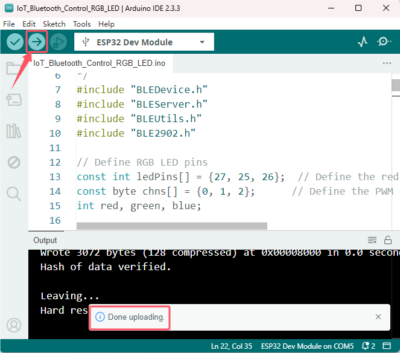

3\. 成功上传代码后，开启移动设备(智能手机)上的蓝牙并打开 **LightBlue** 应用程序(APP)。


4\. 在 **Peripherals** 页面上，找到 ESP32-Bluetooth 并单击 “**Connect**” 。 如果您没有看到它，请尝试刷新页面几次。当 “**Connected**” 出现，表示蓝牙连接成功。向下滚动以查看代码中设置的 **3 个 UUID** 。同时，Arduino IDE的串口监视器中也打印了 “**Connected**”。


5\. 单击 **Send** UUID。再单击 “**HEX**” 进入 <span style="color: rgb(255, 76, 65);">Format Selection</span> 页面，选择 “**UTF-8 String**”，然后单击 “**Save**” 保存信息。


6\. 单击 “**Write New Value**” 进入编写指令页面，现在您可以编写这些指令：“red”、“green”、“blue”、“yellow”、“purple”和“led_off”来查看RGB LED是否响应这些指令。以编写 “**red**” 指令为例，然后单击 “**Write**”，看看RGB LED 是不是亮红灯。同时串口监视器也打印相应的信息。 然后编写剩余的指令来操作一下，查看RGB LED是否响应对应的指令。


---

**6. 代码说明：**

本项目使用RGB LED配置和自定义命令，如“led_off”，“red”，“green”等。这些指令允许通过使用 **LightBlue** APP 的移动设备(智能手机)发送命令来控制RGB LED。

让我们一步一步地分解代码：

- 为RGB LED引脚和PWM通道添加新的全局变量。

```c++
// Define RGB LED pins
const int ledPins[] = {27, 25, 26};  // 依次定义红、绿、蓝的引脚
const byte chns[] = {0, 1, 2};      // 定义PWM通道
int red, green, blue;
```
- 在<span style="color: rgb(255, 76, 65);">setup()</span>函数中，用预定义的频率和分辨率来初始化PWM通道。然后将RGB LED引脚连接到各自的PWM通道。

```c++
  // 设置pwm通道，1KHz,8bit
  for (int i = 0; i < 3; i++) {   
    ledcSetup(chns[i], 1000, 8);
    ledcAttachPin(ledPins[i], chns[i]);
  }
```
- 修改MyCharacteristicCallbacks类中的onWrite方法。这个函数监听来自蓝牙连接的数据。根据接收到的字符串（如“led_off”，“red”，“green”等）来控制RGB LED。

```c++
// Define the BLE characteristic callbacks
class MyCharacteristicCallbacks : public BLECharacteristicCallbacks {
  void onWrite(BLECharacteristic *pCharacteristic) {
    std::string value = std::string(pCharacteristic->getValue().c_str());
    if (value == "led_off") {
      setColor(0, 0, 0); // turn the RGB LED off
      Serial.println("RGB LED turned off");
    } else if (value == "red") {
      setColor(255, 0, 0); // Red
      Serial.println("red");
    }
    else if (value == "green") {
      setColor(0, 255, 0); // green
      Serial.println("green");
    }
    else if (value == "blue") {
      setColor(0, 0, 255); // blue
      Serial.println("blue");
    }
    else if (value == "yellow") {
      setColor(255, 150, 0); // yellow
      Serial.println("yellow");
    }
    else if (value == "purple") {
      setColor(80, 0, 80); // purple
      Serial.println("purple");
    }
  }
};
```
- 最后，增加了设置RGB LED颜色的功能。

```c++
void setColor(int red, int green, int blue) {
  // For common-cathode RGB LEDs, use 255 minus the color value
  ledcWrite(chns[0], red); 
  ledcWrite(chns[1], green);
  ledcWrite(chns[2], blue);
}
```

总之，这个脚本启用了一个远程控制交互模型，其中ESP32作为蓝牙低功耗（BLE）服务器运行。
连接的BLE客户端（如智能手机）可以发送字符串命令来改变RGB LED的颜色。ESP32还通过发送接收到的字符串向客户端提供反馈，使客户端知道执行了什么操作。

---

### 第06课 蓝牙音频播放器

---

**1. 实验介绍：**

该项目的目的是提供一个简单的解决方案，使用ESP32的内置DAC来播放蓝牙设备的音频。

该项目涉及使用ESP32-A2DP库来接收来自蓝牙设备的音频数据。接收到的音频数据然后通过I2S接口传输到ESP32的内部DAC。I2S接口配置为主模式、传输模式和内置DAC模式。然后通过连接到DAC的无源蜂鸣器播放音频数据

当使用ESP32的内部DAC时，重要的是要确保音频数据的格式和采样率正确，以防止播放过程中的失真或噪音。 

---

**2. 实验组件：**

|  |||
| ------------------------ | ------------------------ | ---------------------------- |
|ESP32 主控板| NPN型三极管(S8050) x1| 无源蜂鸣器 x1 |
||||
|面包板 x1 |面包板跳线若干 | Micro USB数据线 x1 |
||| |
|移动通信设备 x1|  1kΩ电阻 x1 | 10kΩ电阻 x1 |

---

**3. 接线图：** 

**原理图：**


**实物接线图：**


---

**4. 实验代码：**

```c++
/*
 * 名称   : IoT Bluetooth Audio Player
 * 功能   : 蓝牙控制无源蜂鸣器播放音频
 * 编译IDE：ARDUINO 2.3.2
 * 作者   : https://www.keyestudio.com/
*/

// ==> Example to use built in DAC of ESP32

#include "BluetoothA2DPSink.h"

BluetoothA2DPSink a2dp_sink;

int LEDC_CHANNEL_0 = 0; // LEDC定时器采用通道0

int LEDC_TIMER_13_BIT = 8; // LEDC定时器采用8位精度

const int BUZZER_PIN = 25; // 定义工具I/O端口

// 创建一个音乐旋律列表
int melody[] = {330,330,330,262,330,392,196,262,196,165,220,247,233,220,196,330,392,440,349,392,330,262,294,247,262,196,165,220,247,233,220,196,330,392,440,349,392,330,262,294,247,392,370,330,311,330,208,220,262,220,262,294,392,370,330,311,330,523,523,523,392,370,330,311,330,208,220,262,220,262,294,311,294,262,262,262,262,262,294,330,262,220,196,262,262,262,262,294,330,262,262,262,262,294,330,262,220,196};

// 创建一个音调持续时间列表
int noteDurations[] = {8,4,4,8,4,2,2,3,3,3,4,4,8,4,8,8,8,4,8,4,3,8,8,3,3,3,3,4,4,8,4,8,8,8,4,8,4,3,8,8,2,8,8,8,4,4,8,8,4,8,8,3,8,8,8,4,4,4,8,2,8,8,8,4,4,8,8,4,8,8,3,3,3,1,8,4,4,8,4,8,4,8,2,8,4,4,8,4,1,8,4,4,8,4,8,4,8,2};


void setup() {
  const i2s_config_t i2s_config = {
    .mode = (i2s_mode_t)(I2S_MODE_MASTER | I2S_MODE_TX | I2S_MODE_DAC_BUILT_IN),
    .sample_rate = 44100,                          // corrected by info from bluetooth
    .bits_per_sample = (i2s_bits_per_sample_t)16,  //the DAC module will only take the 8bits from MSB
    .channel_format = I2S_CHANNEL_FMT_RIGHT_LEFT,
    .communication_format = (i2s_comm_format_t)I2S_COMM_FORMAT_STAND_MSB,
    .intr_alloc_flags = 0,  // default interrupt priority
    .dma_buf_count = 8,
    .dma_buf_len = 64,
    .use_apll = false
  };

  a2dp_sink.set_i2s_config(i2s_config);
  a2dp_sink.start("ESP32_Bluetooth");

  pinMode(BUZZER_PIN, OUTPUT);  // 将蜂鸣器设置为输出模式

  int noteDuration;  // 创建一个变量noteDuration
  for (int i = 0; i < sizeof(noteDurations); ++i){
      noteDuration = 800/noteDurations[i];
      ledcSetup(LEDC_CHANNEL_0, melody[i]*2, LEDC_TIMER_13_BIT);
      ledcAttachPin(BUZZER_PIN, LEDC_CHANNEL_0);
      ledcWrite(LEDC_CHANNEL_0, 50);
      delay(noteDuration * 1.30);  // 延时
  }

}

void loop() {
}

```
---

**5. 实验结果：**

其操作步骤如下：

1\. 代码中涉及到 <span style="color: rgb(255, 76, 65);">ESP32-A2DP</span> 库文件，则需要安装<span style="color: rgb(255, 76, 65);">ESP32-A2DP</span> 库文件。如果已经添加好了所有的库文件，这一步就跳过；如果还没有，请跳转到 **[添加 Arduino 库](https://docs.keyestudio.com/projects/KS5020/en/latest/docs/Arduino_C.html#arduino)** ，参照说明添加库文件。

<span style="background: rgb(255, 251, 0);">**<span style="color: rgb(0, 209, 0);">特别提醒</span>**：如果您使用的是ESP32开发板3.0.0或更高版本，则在编译过程中可能会遇到错误。此问题通常是由于较新版本的板型不再支持 <span style="color: rgb(255, 76, 65);">ESP32-A2DP</span> 库。为了正常运行本示例，建议采用ESP32开发板的固件版本<span style="color: rgb(0, 0, 255);">**1.06**</span>（本教程都是采用**1.06**版本） </span>。

2\. 打开位于 <span style="color: rgb(255, 76, 65);">..\Codes\Arduino_C_Code\IoT_C_Code\06 IoT Bluetooth Audio Player</span> 路径下的 <span style="color: rgb(255, 76, 65);">IoT_Bluetooth_Audio_Player.ino</span> 文件，或将上面的实验代码复制粘贴到 Arduino IDE 中。

3\. 选择正确的主控板板型（ESP32 Dev Module）和 适当的串口端口（COMxx），然后单击按钮上传代码。


4\. 代码上传成功后，开启蓝牙并搜索可用的设备，然后连接到 <span style="color: rgb(255, 76, 65);">ESP32_Bluetooth</span> 。


5\. 无源蜂鸣器播放音频，音频应该通过连接到ESP32的无源蜂鸣器播放。

---

**6. 代码说明：**

1\. 该代码首先包含 <span style="color: rgb(255, 76, 65);">BluetoothA2DPSink.h</span> 库，该库用于从启用蓝牙的设备接收音频数据。然后用I2S接口设置创建并配置 <span style="color: rgb(255, 76, 65);">BluetoothA2DPSink</span> 对象。

```c++
#include "BluetoothA2DPSink.h"

BluetoothA2DPSink a2dp_sink;
```
2\. 在 <span style="color: rgb(255, 76, 65);">setup()</span> 函数中，代码用I2S （Inter-IC Sound）接口所需的配置来初始化 i2s_config_t 的结构体。

```c++
  const i2s_config_t i2s_config = {
    .mode = (i2s_mode_t)(I2S_MODE_MASTER | I2S_MODE_TX | I2S_MODE_DAC_BUILT_IN),
    .sample_rate = 44100,                          // corrected by info from bluetooth
    .bits_per_sample = (i2s_bits_per_sample_t)16,  //the DAC module will only take the 8bits from MSB
    .channel_format = I2S_CHANNEL_FMT_RIGHT_LEFT,
    .communication_format = (i2s_comm_format_t)I2S_COMM_FORMAT_STAND_MSB,
    .intr_alloc_flags = 0,  // default interrupt priority
    .dma_buf_count = 8,
    .dma_buf_len = 64,
    .use_apll = false
  };
```
- I2S接口用于在设备之间传输数字音频数据。
- 配置包括 <span style="color: rgb(255, 76, 65);">I2S mode</span>, <span style="color: rgb(255, 76, 65);">sample rate</span>, <span style="color: rgb(255, 76, 65);">bits per sample</span>, <span style="color: rgb(255, 76, 65);">channel format</span>, <span style="color: rgb(255, 76, 65);">communication format</span>, <span style="color: rgb(255, 76, 65);">interrupt allocation flags</span>, <span style="color: rgb(255, 76, 65);">DMA buffer count</span>, <span style="color: rgb(255, 76, 65);">DMA buffer length</span>, 以及是否使用APLL(Audio PLL)。
- 然后将 <span style="color: rgb(255, 76, 65);">i2s_config_t struct</span> 结构体作为参数传递给 <span style="color: rgb(255, 76, 65);">BluetoothA2DPSink</span> 对象的 <span style="color: rgb(255, 76, 65);">set_i2s_config</span> 函数，以配置用于音频播放的I2S接口。
- 调用 <span style="color: rgb(255, 76, 65);">BluetoothA2DPSink</span> 对象的 <span style="color: rgb(255, 76, 65);">start</span> 函数来启动蓝牙音频接收器并开始通过内置DAC播放音频。

---

### 第07课 ESP32 WiFi Station 模式 

---

**1. 实验介绍：**

ESP32 最有用的功能之一是它不仅能够连接到现有的 WiFi 网络并充当 Web 服务器，还可以创建自己的网络，允许其他设备直接连接到它并访问网页。这是因为ESP32可以在三种模式下运行：Station（STA）模式、Soft Access Point（AP）模式和Station+AP共存模式。

- Station模式（作为WiFi设备主动连接路由器，也叫做WiFi Client）
- AP模式（作为一个Access Point，让其他WiFi设备来连接）即WiFi热点
- Station+AP共存模式（ESP32连接路由器的同时自身也是一个热点供其他WiFi设备来连接）

所有WiFi编程项目在使用WiFi前必须配置WiFi运行模式，否则无法使用WiFi。在本实验课程中，我们将学习使用ESP32的WiFi Station模式。

---

**2. 元件知识：**

**Station 模式：**

在 Station 模式下，ESP32 连接到现有的 WiFi 网络（由无线路由器创建的网络）。

当ESP32选择Station模式时，它作为一个WiFi客户端。它可以连接路由器网络，通过WiFi连接与路由器上的其他设备通信。如下图所示，移动通信设备(智能手机/平板)、PC和路由器已经连接，ESP32如果要与移动通信设备和PC通信，需要将移动通信设备、PC和路由器连接起来。


在 Station 模式下，ESP32 从其连接的无线路由器获取 IP 地址。使用此 IP 地址，它可以设置 Web 服务器并向现有 WiFi 网络上的所有连接设备提供网页。

---

**3. 实验组件：**

|  ||||
| ------------------------ | ------------------------ | ---------------------------- |---------------------------- |
| ESP32 主控板| 红色LED x1  |面包板 x1 |面包板跳线若干 |
|| |||
|黄色LED x1  | 220Ω电阻 x2  |移动通信设备 x1|Micro USB数据线 x1 |

---

**4. 接线图：**

**原理图：**


**实物接线图：**


---

**4. 实验代码：**

<span style="color: rgb(255, 76, 65);">特别注意：</span>在上传实验代码之前，你需要先将实验代码中的Wifi名称(<span style="color: rgb(255, 76, 65);">**REPLACE_WITH_YOUR_SSID**</span>)和Wifi密码(<span style="color: rgb(255, 76, 65);">**REPLACE_WITH_YOUR_PASSWORD**</span>)改成你自己的Wifi名称和Wifi密码。


```c++
/*
 * 名称   : ESP32 Web server of WiFi Station Mode
 * 功能   : 在WiFi Station(STA)模式下配置ESP32 Web服务器 
 * 编译IDE：ARDUINO 2.3.3
 * 作者   : https://www.keyestudio.com/
*/
#include <WiFi.h>
#include <WebServer.h>

/*Put your SSID & Password*/
const char* ssid = "ChinaNet_2.4G";    // Enter SSID here
const char* password = "ChinaNet@233"; // Enter Password here

WebServer server(80);

uint8_t LED1pin = 17;
bool LED1status = LOW;

uint8_t LED2pin = 13;
bool LED2status = LOW;

void setup() {
  Serial.begin(115200);
  delay(100);
  pinMode(LED1pin, OUTPUT);
  pinMode(LED2pin, OUTPUT);

  Serial.println("Connecting to ");
  Serial.println(ssid);

  //connect to your local wi-fi network
  WiFi.begin(ssid, password);

  //check wi-fi is connected to wi-fi network
  while (WiFi.status() != WL_CONNECTED) {
  delay(1000);
  Serial.print(".");
  }
  Serial.println("");
  Serial.println("WiFi connected..!");
  Serial.print("Got IP: ");  Serial.println(WiFi.localIP());

  server.on("/", handle_OnConnect);
  server.on("/led1on", handle_led1on);
  server.on("/led1off", handle_led1off);
  server.on("/led2on", handle_led2on);
  server.on("/led2off", handle_led2off);
  server.onNotFound(handle_NotFound);

  server.begin();
  Serial.println("HTTP server started");
}
void loop() {
  server.handleClient();
  if(LED1status)
  {digitalWrite(LED1pin, HIGH);}
  else
  {digitalWrite(LED1pin, LOW);}
  
  if(LED2status)
  {digitalWrite(LED2pin, HIGH);}
  else
  {digitalWrite(LED2pin, LOW);}
}

void handle_OnConnect() {
  LED1status = LOW;
  LED2status = LOW;
  Serial.println("GPIO17 Status: OFF | GPIO13 Status: OFF");
  server.send(200, "text/html", SendHTML(LED1status,LED2status)); 
}

void handle_led1on() {
  LED1status = HIGH;
  Serial.println("GPIO17 Status: ON");
  server.send(200, "text/html", SendHTML(true,LED2status)); 
}

void handle_led1off() {
  LED1status = LOW;
  Serial.println("GPIO17 Status: OFF");
  server.send(200, "text/html", SendHTML(false,LED2status)); 
}

void handle_led2on() {
  LED2status = HIGH;
  Serial.println("GPIO13 Status: ON");
  server.send(200, "text/html", SendHTML(LED1status,true)); 
}

void handle_led2off() {
  LED2status = LOW;
  Serial.println("GPIO13 Status: OFF");
  server.send(200, "text/html", SendHTML(LED1status,false)); 
}

void handle_NotFound(){
  server.send(404, "text/plain", "Not found");
}

String SendHTML(uint8_t led1stat,uint8_t led2stat){
  String ptr = "<!DOCTYPE html> <html>\n";
  ptr +="<head><meta name=\"viewport\" content=\"width=device-width, initial-scale=1.0, user-scalable=no\">\n";
  ptr +="<title>LED Control</title>\n";
  ptr +="<style>html { font-family: Helvetica; display: inline-block; margin: 0px auto; text-align: center;}\n";
  ptr +="body{margin-top: 50px;} h1 {color: #444444;margin: 50px auto 30px;} h3 {color: #444444;margin-bottom: 50px;}\n";
  ptr +=".button {display: block;width: 80px;background-color: #3498db;border: none;color: white;padding: 13px 30px;text-decoration: none;font-size: 25px;margin: 0px auto 35px;cursor: pointer;border-radius: 4px;}\n";
  ptr +=".button-on {background-color: #3498db;}\n";
  ptr +=".button-on:active {background-color: #2980b9;}\n";
  ptr +=".button-off {background-color: #34495e;}\n";
  ptr +=".button-off:active {background-color: #2c3e50;}\n";
  ptr +="p {font-size: 14px;color: #888;margin-bottom: 10px;}\n";
  ptr +="</style>\n";
  ptr +="</head>\n";
  ptr +="<body>\n";
  ptr +="<h1>ESP32 Web Server</h1>\n";
    ptr +="<h3>Using Station(STA) Mode</h3>\n";
  
   if(led1stat)
  {ptr +="<p>LED1 Status: ON</p><a class=\"button button-off\" href=\"/led1off\">OFF</a>\n";}
  else
  {ptr +="<p>LED1 Status: OFF</p><a class=\"button button-on\" href=\"/led1on\">ON</a>\n";}

  if(led2stat)
  {ptr +="<p>LED2 Status: ON</p><a class=\"button button-off\" href=\"/led2off\">OFF</a>\n";}
  else
  {ptr +="<p>LED2 Status: OFF</p><a class=\"button button-on\" href=\"/led2on\">ON</a>\n";}

  ptr +="</body>\n";
  ptr +="</html>\n";
  return ptr;
}

```
---

**5. 实验结果：**

其操作步骤如下：

1\. 打开位于 <span style="color: rgb(255, 76, 65);">..\Codes\Arduino_C_Code\IoT_C_Code\07 ESP32 Web Server of WiFi Station Mode</span> 路径下的 <span style="color: rgb(255, 76, 65);">ESP32_Web_Server_of_WiFi_Station_Mode.ino</span> 文件，或将上面的实验代码复制粘贴到 Arduino IDE 中。

2\. 如果你还没有修改实验代码中的Wifi名称和Wifi密码，那么你需要将实验代码中的Wifi名称(<span style="color: rgb(255, 76, 65);">**REPLACE_WITH_YOUR_SSID**</span>)和Wifi密码(<span style="color: rgb(255, 76, 65);">**REPLACE_WITH_YOUR_PASSWORD**</span>)改成你自己的Wifi名称和Wifi密码。

<span style="background: rgb(255, 251, 0);"><span style="color: rgb(255, 76, 0);">**特别注意：**<span style="color: rgb(255, 76, 0);"></span>确保计算机网络，手机/平板的网络，ESP32主板，路由器，实验代码中输入的WiFi名称和WiFi密码都必须是在同一个局域网（WiFi）下。</span></span>

3\. 选择正确的主控板板型（ESP32 Dev Module）和 适当的串口端口（COMxx），然后单击按钮上传代码。


4\. 成功上传代码后，打开串口监视器，设置波特率为 **115200** ，串口监视器打印出接收到的对应的 <span style="color: rgb(255, 76, 65);">**IP**</span> 地址。


<span style="background: rgb(255, 127, 170);">**提醒：假如串口监视器没打印 IP 地址，则需要按下ESP32主控板上的复位键**。</span>


5\. 接着打开智能手机或平板的浏览器，在下图所示的浏览器搜索框里输入串口监视器窗口打印的WIFI IP地址（192.168.0.69），接着点击 “**search**” 。


6\. 几秒钟后进入WiFi网页，说明ESP32主板上的ESP32模块成功连接上了WiFi。 WiFi网页显示LED 的当前状态和两个用于控制它们的按钮。同时，您可以查看串口监视器以查看 ESP32 的 GPIO 引脚的状态。


7\. 单击 “**ON**” 按钮将LED1打开。一旦单击该按钮，ESP32就会接收到对 <span style="color: rgb(255, 76, 65);">/led1on</span> URL的请求。然后它打开LED1并提供一个更新了LED状态的网页。同时它还在串行监视器上打印GPIO引脚状态。


8\. 您可以测试 LED2 按钮以查看它是否类似地工作。


---

**6. 代码说明：**

让我们一步一步地分解代码：

- 首先包括 <span style="color: rgb(255, 76, 65);">WiFi.h</span> 库。该库包含我们用于连接到网络的 ESP32 特定方法；<span style="color: rgb(255, 76, 65);">WebServer.h</span> 库，也包含一些方法，这些方法将帮助我们配置服务器和处理传入的HTTP请求。

```c++
#include <WiFi.h>
#include <WebServer.h>
```
- 由于我们将ESP32 Web服务器配置为Station模式，它将创建自己的WiFi网络。因此，我们需要设置SSID和Password。

```c++
/*REPLACE WITH YOUR NETWORK CREDENTIALS(Put your SSID & Password)*/
const char* ssid = "REPLACE_WITH_YOUR_SSID";  //Enter SSID here
const char* password = "REPLACE_WITH_YOUR_PASSWORD"; //Enter Password here
```
- 创建 <span style="color: rgb(255, 76, 65);">WebServer</span> 库的对象，以便可以访问它的函数。此对象的构造函数接受服务器将侦听的端口作为参数。由于HTTP默认使用端口80，因此将使用此值。这允许我们连接到服务器，而不需要在URL中指定端口。

```c++
// declare an object of WebServer library
WebServer server(80);
```
- 声明led连接的ESP32的GPIO引脚，以及它们的初始状态。

```c++
uint8_t LED1pin = 17;
bool LED1status = LOW;

uint8_t LED2pin = 13;
bool LED2status = LOW;
```
- 在 <span style="color: rgb(255, 76, 65);">setup()</span> 函数中，我们将ESP32 Web服务器配置为Station模式。首先，我们建立一个用于调试串行连接的串口波特率，并将GPIO引脚配置为OUTPUT。

```c++
  Serial.begin(115200);
  delay(100);
  pinMode(LED1pin, OUTPUT);
  pinMode(LED2pin, OUTPUT);
```
- 使用 <span style="color: rgb(255, 76, 65);">WiFi.begin()</span> 函数加入一个现有的网络。

```c++
  //connect to your local wi-fi network
  WiFi.begin(ssid, password);
```
- 当ESP32尝试连接到网络时，我们可以使用 <span style="color: rgb(255, 76, 65);">WiFi.status()</span> 函数来检查连接状态。

```c++
  //check wi-fi is connected to wi-fi network
  while (WiFi.status() != WL_CONNECTED) {
  delay(1000);
  Serial.print(".");
  }
```

- 一旦连接到网络，<span style="color: rgb(255, 76, 65);">WiFi.localIP()</span> 函数用于打印ESP32的IP地址

```c++
  Serial.println("");
  Serial.println("WiFi connected..!");
  Serial.print("Got IP: ");  Serial.println(WiFi.localIP());
```

- 为了处理传入的HTTP请求，我们必须指定在访问特定URL时应该执行哪些代码。为此，我们使用 <span style="color: rgb(255, 76, 65);">.on()</span> 方法。该方法接受两个参数：一个相对URL路径和访问该URL时要执行函数的名称。
例如，下面代码片段的第一行表明，当服务器接收到根(/)路径上的HTTP请求时，它将调用 <span style="color: rgb(255, 76, 65);">handle_OnConnect()</span> 函数。重要的是要注意指定的URL是一个相对路径。类似地，我们必须再指定四个URL来处理两个LED的两种状态。

```c++
  server.on("/", handle_OnConnect); 
  server.on("/led1on", handle_led1on);
  server.on("/led1off", handle_led1off);
  server.on("/led2on", handle_led2on);
  server.on("/led2off", handle_led2off);
```
- 如果客户端请求的URL没有使用 <span style="color: rgb(255, 76, 65);">server.on()</span> 指定，我们还没有指定服务器应该提供什么服务。它应该给出404错误（Page Not Found）作为响应。为此，我们使用 <span style="color: rgb(255, 76, 65);">server.onNotFound()</span> 方法。

```c++
  server.onNotFound(handle_NotFound);
```
- 为了启动服务器，我们调用服务器对象的begin()方法。

```c++
  server.begin();
  Serial.println("HTTP server started");
```

- 实际传入的HTTP请求在 <span style="color: rgb(255, 76, 65);">loop()</span> 函数中处理。为此，我们使用服务器对象的 <span style="color: rgb(255, 76, 65);">handleClient()</span> 方法。我们还根据请求改变led的状态。

```c++
void loop() {
  server.handleClient();
  if(LED1status)
  {digitalWrite(LED1pin, HIGH);}
  else
  {digitalWrite(LED1pin, LOW);}
  
  if(LED2status)
  {digitalWrite(LED2pin, HIGH);}
  else
  {digitalWrite(LED2pin, LOW);}
}
```

- 我们必须编写 <span style="color: rgb(255, 76, 65);">handle_OnConnect()</span> 函数，之前使用 <span style="color: rgb(255, 76, 65);">server.on</span> 将其附加到根（/）URL。我们通过将两个led的状态设置为LOW（led的初始状态）并将其打印在串行监视器上开始此功能。使用send方法来响应HTTP请求。尽管可以使用许多不同的参数调用该方法，但最简单的形式需要HTTP响应代码、内容类型和内容。传递给send方法的第一个参数是代码200（HTTP状态码之一），它对应于OK响应。然后将内容类型指定为 “**text/html**”，最后传递 <span style="color: rgb(255, 76, 65);">SendHTML()</span> 自定义函数，该函数生成带有LED状态的动态html页面。

```c++
void handle_OnConnect() {
  LED1status = LOW;
  LED2status = LOW;
  Serial.println("GPIO17 Status: OFF | GPIO13 Status: OFF");
  server.send(200, "text/html", SendHTML(LED1status,LED2status)); 
}
```
- 编写了五个函数来处理LED开/关请求和404错误页面。

```c++
void handle_led1on() {
  LED1status = HIGH;
  Serial.println("GPIO17 Status: ON");
  server.send(200, "text/html", SendHTML(true,LED2status)); 
}

void handle_led1off() {
  LED1status = LOW;
  Serial.println("GPIO17 Status: OFF");
  server.send(200, "text/html", SendHTML(false,LED2status)); 
}

void handle_led2on() {
  LED2status = HIGH;
  Serial.println("GPIO13 Status: ON");
  server.send(200, "text/html", SendHTML(LED1status,true)); 
}

void handle_led2off() {
  LED2status = LOW;
  Serial.println("GPIO13 Status: OFF");
  server.send(200, "text/html", SendHTML(LED1status,false)); 
}

void handle_NotFound(){
  server.send(404, "text/plain", "Not found");
}
```
- 显示HTML网页，当ESP32 Web服务器收到来自Web客户端的请求时，<span style="color: rgb(255, 76, 65);">SendHTML()</span> 函数就会生成一个Web页面。它只是将HTML代码连接到一个长字符串中，然后返回到我们前面讨论过的 <span style="color: rgb(255, 76, 65);">server.send()</span> 函数。该函数使用led的状态作为参数来动态生成HTML内容。你应该发送的第一个文本总是  **<!DOCTYPE> declaration**，这表明我们正在发送HTML代码。

```c++
String SendHTML(uint8_t led1stat,uint8_t led2stat){
  String ptr = "<!DOCTYPE html> <html>\n";
```
- **<meta> viewport element** 使网页响应，确保它在所有设备上看起来都很好。标题标签决定了页面的标题。

```c++
  ptr +="<head><meta name=\"viewport\" content=\"width=device-width, initial-scale=1.0, user-scalable=no\">\n";
  ptr +="<title>LED Control</title>\n";
```
- 设计网页样式，接下来我们使用 CSS 设计按钮和网页的整体外观。我们选择了Helvetica字体，并将显示的内容定义为行内块，居中对齐。

```c++
  ptr +="<style>html { font-family: Helvetica; display: inline-block; margin: 0px auto; text-align: center;}\n";
```
- 接下来的代码设置主体、H1、H3和p标记周围的颜色、字体和边距

```c++
  ptr +="body{margin-top: 50px;} h1 {color: #444444;margin: 50px auto 30px;} h3 {color: #444444;margin-bottom: 50px;}\n";
```
- 这些按钮还可以使用颜色、大小、边距等属性进行样式化。**:active selector** 在按钮被点击时改变按钮的外观。

```c++
  ptr +=".button {display: block;width: 80px;background-color: #3498db;border: none;color: white;padding: 13px 30px;text-decoration: none;font-size: 25px;margin: 0px auto 35px;cursor: pointer;border-radius: 4px;}\n";
  ptr +=".button-on {background-color: #3498db;}\n";
  ptr +=".button-on:active {background-color: #2980b9;}\n";
  ptr +=".button-off {background-color: #34495e;}\n";
  ptr +=".button-off:active {background-color: #2c3e50;}\n";
```
- 设置网页的标题。您可以将此文本更改为适合您的应用程序的任何内容。

```c++
  ptr +="<h1>ESP32 Web Server</h1>\n";
    ptr +="<h3>Using Station(STA) Mode</h3>\n";
```
- 显示按钮和相应的状态，if语句用于动态更新按钮和led的状态。

```c++
  if(led1stat)
  {ptr +="<p>LED1 Status: ON</p><a class=\"button button-off\" href=\"/led1off\">OFF</a>\n";}
  else
  {ptr +="<p>LED1 Status: OFF</p><a class=\"button button-on\" href=\"/led1on\">ON</a>\n";}

  if(led2stat)
  {ptr +="<p>LED2 Status: ON</p><a class=\"button button-off\" href=\"/led2off\">OFF</a>\n";}
  else
  {ptr +="<p>LED2 Status: OFF</p><a class=\"button button-on\" href=\"/led2on\">ON</a>\n";}
```
---

### 第08课 ESP32 WiFi AP 模式 

---

**1. 实验介绍：**

从上一课实验中我们知道ESP32有3种不同的WiFi工作模式：

- Station模式（作为WiFi设备主动连接路由器，也叫做WiFi Client）
- AP模式（作为一个Access Point，让其他WiFi设备来连接）即WiFi热点
- Station+AP共存模式（ESP32连接路由器的同时自身也是一个热点供其他WiFi设备来连接）

所有WiFi编程项目在使用WiFi前必须配置WiFi运行模式，否则无法使用WiFi。在本实验课程中，我们将接着学习使用ESP32的WiFi AP模式。

---

**2. 元件知识：**

**AP 模式：**

在Access Point(AP)模式下，ESP32可以建立自己的WiFi网络，并充当路由器，就像WiFi路由器一样。然而，与WiFi路由器不同的是，它没有连接有线网络的接口。因此，这种操作模式被称为Access Point(AP)模式。此外，不能同时连接超过5个站点。

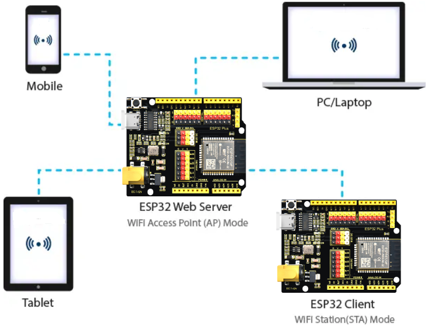

在AP模式下，ESP32创建一个新的WiFi网络，并为其分配一个SSID（网络名称）和一个IP地址。有了这个IP地址，它可以为所有连接的设备提供网页服务。

---

**3. 实验组件：**

|  ||||
| ------------------------ | ------------------------ | ---------------------------- |---------------------------- |
| ESP32 主控板| 红色LED x1  |面包板 x1 |面包板跳线若干 |
|| |||
|黄色LED x1  | 220Ω电阻 x2  |移动通信设备 x1|Micro USB数据线 x1 |

---

**4. 接线图：**

**原理图：**


**实物接线图：**


---

**4. 实验代码：**

<span style="color: rgb(255, 76, 65);">**特别注意**</span>：建议实验代码中的WiFi名称，WiFi密码和IP地址都不用修改，直接使用代码中给定的WiFi名称，WiFi密码和IP地址。

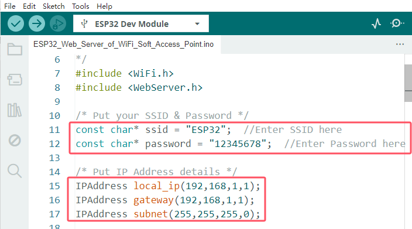

```c++
/*
 * 名称   : ESP32 Web Server of WiFi Soft Access Point
 * 功能   : 在WiFi Soft Access Point(AP)模式下配置ESP32 Web服务器  
 * 编译IDE：ARDUINO 2.3.3
 * 作者   : https://www.keyestudio.com/
*/
#include <WiFi.h>
#include <WebServer.h>

/* Put your SSID & Password */
const char* ssid = "ESP32";  // Enter SSID here
const char* password = "12345678";  //Enter Password here

/* Put IP Address details */
IPAddress local_ip(192,168,1,1);
IPAddress gateway(192,168,1,1);
IPAddress subnet(255,255,255,0);

WebServer server(80);

uint8_t LED1pin = 17;
bool LED1status = LOW;

uint8_t LED2pin = 13;
bool LED2status = LOW;

void setup() {
  Serial.begin(115200);
  pinMode(LED1pin, OUTPUT);
  pinMode(LED2pin, OUTPUT);

  WiFi.softAP(ssid, password);
  WiFi.softAPConfig(local_ip, gateway, subnet);
  delay(100);
  
  server.on("/", handle_OnConnect);
  server.on("/led1on", handle_led1on);
  server.on("/led1off", handle_led1off);
  server.on("/led2on", handle_led2on);
  server.on("/led2off", handle_led2off);
  server.onNotFound(handle_NotFound);
  
  server.begin();
  Serial.println("HTTP server started");
}
void loop() {
  server.handleClient();
  if(LED1status)
  {digitalWrite(LED1pin, HIGH);}
  else
  {digitalWrite(LED1pin, LOW);}
  
  if(LED2status)
  {digitalWrite(LED2pin, HIGH);}
  else
  {digitalWrite(LED2pin, LOW);}
}

void handle_OnConnect() {
  LED1status = LOW;
  LED2status = LOW;
  Serial.println("GPIO17 Status: OFF | GPIO13 Status: OFF");
  server.send(200, "text/html", SendHTML(LED1status,LED2status)); 
}

void handle_led1on() {
  LED1status = HIGH;
  Serial.println("GPIO17 Status: ON");
  server.send(200, "text/html", SendHTML(true,LED2status)); 
}

void handle_led1off() {
  LED1status = LOW;
  Serial.println("GPIO17 Status: OFF");
  server.send(200, "text/html", SendHTML(false,LED2status)); 
}

void handle_led2on() {
  LED2status = HIGH;
  Serial.println("GPIO13 Status: ON");
  server.send(200, "text/html", SendHTML(LED1status,true)); 
}

void handle_led2off() {
  LED2status = LOW;
  Serial.println("GPIO13 Status: OFF");
  server.send(200, "text/html", SendHTML(LED1status,false)); 
}

void handle_NotFound(){
  server.send(404, "text/plain", "Not found");
}

String SendHTML(uint8_t led1stat,uint8_t led2stat){
  String ptr = "<!DOCTYPE html> <html>\n";
  ptr +="<head><meta name=\"viewport\" content=\"width=device-width, initial-scale=1.0, user-scalable=no\">\n";
  ptr +="<title>LED Control</title>\n";
  ptr +="<style>html { font-family: Helvetica; display: inline-block; margin: 0px auto; text-align: center;}\n";
  ptr +="body{margin-top: 50px;} h1 {color: #444444;margin: 50px auto 30px;} h3 {color: #444444;margin-bottom: 50px;}\n";
  ptr +=".button {display: block;width: 80px;background-color: #3498db;border: none;color: white;padding: 13px 30px;text-decoration: none;font-size: 25px;margin: 0px auto 35px;cursor: pointer;border-radius: 4px;}\n";
  ptr +=".button-on {background-color: #3498db;}\n";
  ptr +=".button-on:active {background-color: #2980b9;}\n";
  ptr +=".button-off {background-color: #34495e;}\n";
  ptr +=".button-off:active {background-color: #2c3e50;}\n";
  ptr +="p {font-size: 14px;color: #888;margin-bottom: 10px;}\n";
  ptr +="</style>\n";
  ptr +="</head>\n";
  ptr +="<body>\n";
  ptr +="<h1>ESP32 Web Server</h1>\n";
  ptr +="<h3>Using Access Point(AP) Mode</h3>\n";
  
   if(led1stat)
  {ptr +="<p>LED1 Status: ON</p><a class=\"button button-off\" href=\"/led1off\">OFF</a>\n";}
  else
  {ptr +="<p>LED1 Status: OFF</p><a class=\"button button-on\" href=\"/led1on\">ON</a>\n";}

  if(led2stat)
  {ptr +="<p>LED2 Status: ON</p><a class=\"button button-off\" href=\"/led2off\">OFF</a>\n";}
  else
  {ptr +="<p>LED2 Status: OFF</p><a class=\"button button-on\" href=\"/led2on\">ON</a>\n";}

  ptr +="</body>\n";
  ptr +="</html>\n";
  return ptr;
}
```
---

**5. 实验结果：**

其操作步骤如下：

1\. 打开位于 <span style="color: rgb(255, 76, 65);">..\Codes\Arduino_C_Code\IoT_C_Code\08 ESP32 Web Server of WiFi Soft Access Point</span> 路径下的 <span style="color: rgb(255, 76, 65);">ESP32_Web_Server_of_WiFi_Soft_Access_Point.ino</span> 文件，或将上面的实验代码复制粘贴到 Arduino IDE 中。

2\. 选择正确的主控板板型（ESP32 Dev Module）和 适当的串口端口（COMxx），然后单击按钮上传代码。

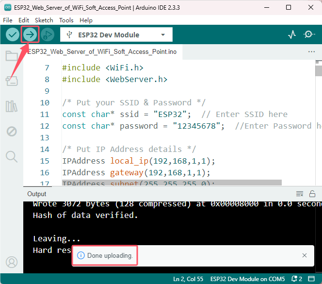

3\. 成功上传代码后，打开串口监视器，设置波特率为 **115200** ，串口监视器打印出相关信息。

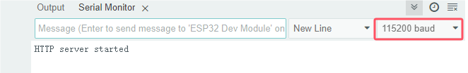

<span style="background: rgb(255, 127, 170);">**提醒：假如串口监视器没打印相关信息，则需要按下ESP32主控板上的复位键**。</span>


4\. 现在，获取一部可以连接到 WiFi 网络的手机、笔记本电脑或其他设备，并寻找一个名为 “**ESP32**” 的网络。使用密码 **12345678** 连接到网络。

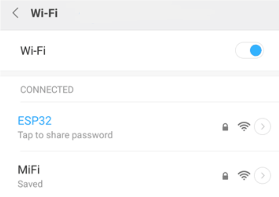

5\. 连接到 ESP32 AP 网络后，打开浏览器并导航到 **192.168.1.1** 。ESP32 应返回一个网页，显示 LED 和按钮的当前状态。同时，您可以查看串口监视器以查看 ESP32 的 GPIO 引脚的状态。

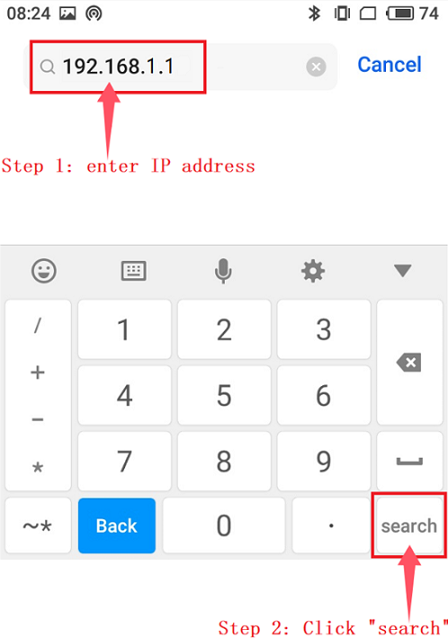

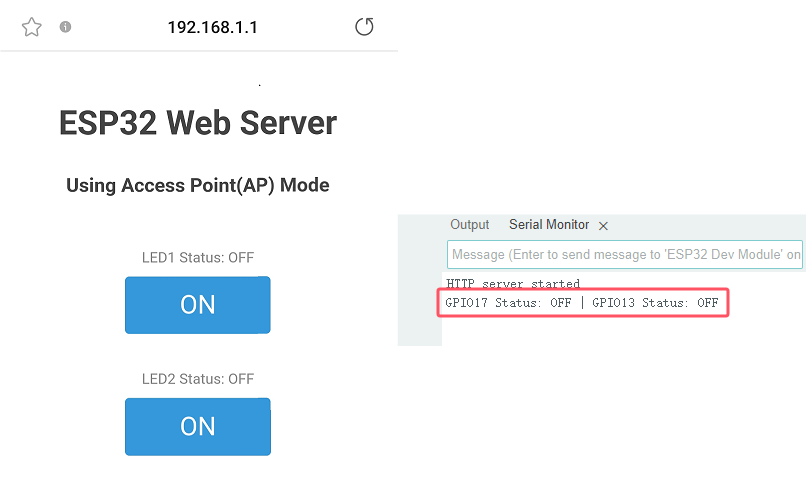

7\. 单击 “**ON**” 按钮将LED1打开。一旦单击该按钮，ESP32就会接收到对 <span style="color: rgb(255, 76, 65);">/led1on</span> URL的请求。然后它打开LED1并提供一个更新了LED状态的网页。同时它还在串行监视器上打印GPIO引脚状态。

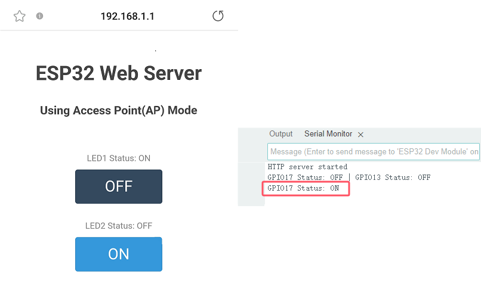

8\. 您可以测试 LED2 按钮以查看它是否类似地工作。

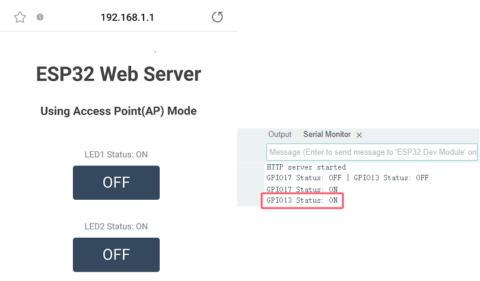

---

**6. 代码说明：**

让我们一步一步地分解代码：

- 首先包括 <span style="color: rgb(255, 76, 65);">WiFi.h</span> 库。该库包含我们用于连接到网络的 ESP32 特定方法；<span style="color: rgb(255, 76, 65);">WebServer.h</span> 库，也包含一些方法，这些方法将帮助我们配置服务器和处理传入的HTTP请求。

```c++
#include <WiFi.h>
#include <WebServer.h>
```
- 因为我们在Access Point(AP)模式下配置 ESP32 Web 服务器，所以它将创建自己的 WiFi 网络。因此，我们需要设置 SSID、密码、IP 地址、IP 子网掩码和 IP 网关。

```c++
/* Put your SSID & Password */
const char* ssid = "ESP32";  // Enter SSID here
const char* password = "12345678";  //Enter Password here

/* Put IP Address details */
IPAddress local_ip(192,168,1,1);
IPAddress gateway(192,168,1,1);
IPAddress subnet(255,255,255,0);
```
- 创建一个 <span style="color: rgb(255, 76, 65);">WebServer</span> 库的对象，以便我们可以访问其函数。此对象的构造函数接受 <span style="color: rgb(255, 76, 65);">port</span> 服务器将侦听的端口作为参数。由于 HTTP 默认使用端口 80，因此我们将使用此值。这允许我们连接到服务器，而无需在 URL 中指定端口。

```c++
WebServer server(80);
```
- 声明 LED 所连接的 ESP32 的 GPIO 引脚，以及它们的初始状态。

```c++
uint8_t LED1pin = 17;
bool LED1status = LOW;

uint8_t LED2pin = 13;
bool LED2status = LOW;
```
- 在 <span style="color: rgb(255, 76, 65);">setup()</span> 函数中，我们将ESP32 Web服务器配置为Access Point (AP)模式。首先，我们建立一个用于调试串行连接的串口波特率，并将GPIO引脚配置为OUTPUT。

```c++
  Serial.begin(115200);
  pinMode(LED1pin, OUTPUT);
  pinMode(LED2pin, OUTPUT);
```
- 我们通过提供SSID、密码、IP地址、IP子网掩码和IP网关来配置软接入点以创建Wi-Fi网络。

```c++
  WiFi.softAP(ssid, password);
  WiFi.softAPConfig(local_ip, gateway, subnet);
  delay(100);
```
- 当ESP32尝试连接到网络时，我们可以使用WiFi.status()函数来检查连接状态。

```c++
  //check wi-fi is connected to wi-fi network
  while (WiFi.status() != WL_CONNECTED) {
  delay(1000);
  Serial.print(".");
  }
```

- 为了处理传入的HTTP请求，我们必须指定在访问特定URL时应该执行哪些代码。为此，我们使用 <span style="color: rgb(255, 76, 65);">.on()</span> 方法。该方法接受两个参数：一个相对URL路径和访问该URL时要执行函数的名称。
例如，下面代码片段的第一行表明，当服务器接收到根(/)路径上的HTTP请求时，它将调用 <span style="color: rgb(255, 76, 65);">handle_OnConnect()</span> 函数。重要的是要注意指定的URL是一个相对路径。类似地，我们必须再指定四个URL来处理两个LED的两种状态。

```c++
  server.on("/", handle_OnConnect);
  server.on("/led1on", handle_led1on);
  server.on("/led1off", handle_led1off);
  server.on("/led2on", handle_led2on);
  server.on("/led2off", handle_led2off);
```
- 如果客户端请求的URL没有使用 <span style="color: rgb(255, 76, 65);">server.on()</span> 指定，我们还没有指定服务器应该提供什么服务。它应该给出404错误（Page Not Found）作为响应。为此，我们使用 <span style="color: rgb(255, 76, 65);">server.onNotFound()</span> 方法。

```c++
  server.onNotFound(handle_NotFound);
```
- 为了启动服务器，我们调用服务器对象的 <span style="color: rgb(255, 76, 65);">begin()</span> 方法。

```c++
  server.begin();
  Serial.println("HTTP server started");
```

- 实际传入的HTTP请求在 <span style="color: rgb(255, 76, 65);">loop()</span> 函数中处理。为此，我们使用服务器对象的 <span style="color: rgb(255, 76, 65);">handleClient()</span> 方法。我们还根据请求改变led的状态。

```c++
void loop() {
  server.handleClient();
  if(LED1status)
  {digitalWrite(LED1pin, HIGH);}
  else
  {digitalWrite(LED1pin, LOW);}
  
  if(LED2status)
  {digitalWrite(LED2pin, HIGH);}
  else
  {digitalWrite(LED2pin, LOW);}
}
```

- 我们必须编写 <span style="color: rgb(255, 76, 65);">handle_OnConnect()</span> 函数，之前使用 <span style="color: rgb(255, 76, 65);">server.on</span> 将其附加到根（/）URL。我们通过将两个led的状态设置为LOW（led的初始状态）并将其打印在串行监视器上开始此功能。使用send方法来响应HTTP请求。尽管可以使用许多不同的参数调用该方法，但最简单的形式需要HTTP响应代码、内容类型和内容。传递给send方法的第一个参数是代码200（<span style="color: rgb(0, 209, 0);">HTTP status codes</span> 之一），它对应于OK响应。然后将内容类型指定为 “**text/html**” ，最后传递 <span style="color: rgb(255, 76, 65);">SendHTML()</span> 自定义函数，该函数生成带有LED状态的动态html页面。

```c++
void handle_OnConnect() {
  LED1status = LOW;
  LED2status = LOW;
  Serial.println("GPIO17 Status: OFF | GPIO13 Status: OFF");
  server.send(200, "text/html", SendHTML(LED1status,LED2status)); 
}
```
- 编写了五个函数来处理LED开/关请求和404错误页面。

```c++
void handle_led1on() {
  LED1status = HIGH;
  Serial.println("GPIO17 Status: ON");
  server.send(200, "text/html", SendHTML(true,LED2status)); 
}

void handle_led1off() {
  LED1status = LOW;
  Serial.println("GPIO17 Status: OFF");
  server.send(200, "text/html", SendHTML(false,LED2status)); 
}

void handle_led2on() {
  LED2status = HIGH;
  Serial.println("GPIO13 Status: ON");
  server.send(200, "text/html", SendHTML(LED1status,true)); 
}

void handle_led2off() {
  LED2status = LOW;
  Serial.println("GPIO13 Status: OFF");
  server.send(200, "text/html", SendHTML(LED1status,false)); 
}

void handle_NotFound(){
  server.send(404, "text/plain", "Not found");
}
```
- 显示HTML网页，当ESP32 Web服务器收到来自Web客户端的请求时，<span style="color: rgb(255, 76, 65);">SendHTML()</span> 函数就会生成一个Web页面。它只是将HTML代码连接到一个长字符串中，然后返回到我们前面讨论过的 <span style="color: rgb(255, 76, 65);">server.send()</span> 函数。该函数使用led的状态作为参数来动态生成HTML内容。你应该发送的第一个文本总是  **<!DOCTYPE> declaration**，这表明我们正在发送HTML代码。

```c++
String SendHTML(uint8_t led1stat,uint8_t led2stat){
  String ptr = "<!DOCTYPE html> <html>\n";
```
- **<meta> viewport element** 使网页响应，确保它在所有设备上看起来都很好。标题标签决定了页面的标题。

```c++
  ptr +="<head><meta name=\"viewport\" content=\"width=device-width, initial-scale=1.0, user-scalable=no\">\n";
  ptr +="<title>LED Control</title>\n";
```
- 设计网页样式，接下来我们使用 CSS 设计按钮和网页的整体外观。我们选择了Helvetica字体，并将显示的内容定义为行内块，居中对齐。

```c++
  ptr +="<style>html { font-family: Helvetica; display: inline-block; margin: 0px auto; text-align: center;}\n";
```
- 接下来的代码设置主体、H1、H3和p标记周围的颜色、字体和边距。

```c++
  ptr +="body{margin-top: 50px;} h1 {color: #444444;margin: 50px auto 30px;} h3 {color: #444444;margin-bottom: 50px;}\n";
```
- 这些按钮还可以使用颜色、大小、边距等属性进行样式化。**:active selector** 在按钮被点击时改变按钮的外观。

```c++
  ptr +=".button {display: block;width: 80px;background-color: #3498db;border: none;color: white;padding: 13px 30px;text-decoration: none;font-size: 25px;margin: 0px auto 35px;cursor: pointer;border-radius: 4px;}\n";
  ptr +=".button-on {background-color: #3498db;}\n";
  ptr +=".button-on:active {background-color: #2980b9;}\n";
  ptr +=".button-off {background-color: #34495e;}\n";
  ptr +=".button-off:active {background-color: #2c3e50;}\n";
```
- 设置网页的标题。您可以将此文本更改为适合您的应用程序的任何内容。

```c++
  ptr +="<h1>ESP32 Web Server</h1>\n";
  ptr +="<h3>Using Access Point(AP) Mode</h3>\n";
```
- 显示按钮和相应的状态，if 语句用于动态更新按钮和led的状态。

```c++
  if(led1stat)
  {ptr +="<p>LED1 Status: ON</p><a class=\"button button-off\" href=\"/led1off\">OFF</a>\n";}
  else
  {ptr +="<p>LED1 Status: OFF</p><a class=\"button button-on\" href=\"/led1on\">ON</a>\n";}

  if(led2stat)
  {ptr +="<p>LED2 Status: ON</p><a class=\"button button-off\" href=\"/led2off\">OFF</a>\n";}
  else
  {ptr +="<p>LED2 Status: OFF</p><a class=\"button button-on\" href=\"/led2on\">ON</a>\n";}
```
---

### 第09课 使用WebSocket创建一个ESP32 Web服务器

---

**1. 实验介绍：**

现在让我们创建一个简单的项目，我们用ESP32构建一个WebSocket服务器，通过WebSocket连接ESP32 远程控制 LED。

我们将设计一个带有拨动开关的网页，允许我们改变 LED 的状态，同时WiFi网页界面也会显示LED的当前状态。

ESP32将在端口80上主动侦听传入的WebSocket连接和消息。当用户在网页上拨动LED开关时，会向ESP32发送一个“拨动”消息。当ESP32接收到此消息时，它将切换LED并立即通过发送“1”（指示LED打开）或“0”（指示LED关闭）通知所有连接的客户端（浏览器）。因此，所有活跃的客户端将立即在其网页上更新LED的状态。

---

**2. 元件知识：**

**什么是WebSocket？**

尽管 “WebSocket” 这个名字乍一看似乎没有意义，但它背后的概念其实很简单，你很快就能对它有一个基本的了解。

WebSocket 是一种通信协议的名称，它支持客户端和 Web 服务器之间的双向通信。简单地说，WebSocket 是一种允许客户端和服务器建立连接的技术，通过该连接，任何一方都可以随时向另一方发送消息。

这与常规 HTTP 连接不同，在常规 HTTP 连接中，客户端发起请求，服务器发送响应，然后连接终止。事实上，WebSocket 是一种完全不同的通信协议 —- 当客户端与服务器建立连接时，连接的两端都可以发送和接收数据。因此，就像服务器正在侦听新消息一样，所有连接的客户端也在进行侦听。因此，服务器可以将数据发送到特定客户端或将其广播到所有客户端，而无需请求。最重要的是，连接将保持活动状态，直到客户端或服务器关闭它，从而允许它们之间进行持续通信。 

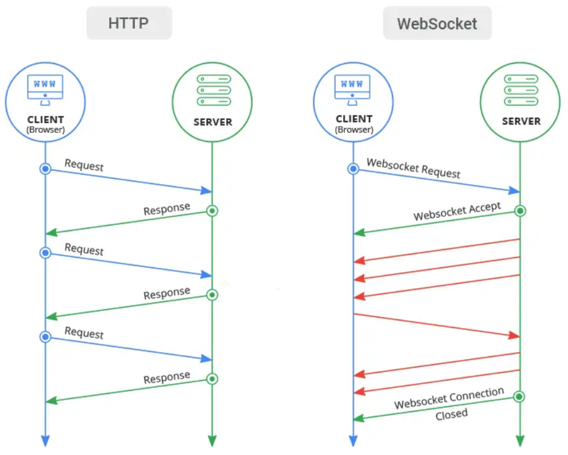

所以，WebSocket 很棒，但这并不意味着它在任何地方应该使用。实现 WebSocket 会增加项目的复杂性，尤其是在服务器端。因此，除非您的项目涉及数据广播（您希望同时将相同的数据传输给多个客户端），否则不应这样做；否则，轮询可能就足够了。

---

**3. 实验组件：**

|  ||||
| ------------------------ | ------------------------ | ---------------------------- |---------------------------- |
| ESP32 主控板| 红色LED x1  |面包板 x1 |面包板跳线若干 |
| |||   |
| 220Ω电阻 x1  |移动通信设备 x1|Micro USB数据线 x1 |    |

---

**4. 接线图：**

**原理图：**


**实物接线图：**


---

**4. 实验代码：**

<span style="color: rgb(255, 76, 65);">特别注意：</span>在上传实验代码之前，你需要先将实验代码中的Wifi名称(<span style="color: rgb(255, 76, 65);">**REPLACE_WITH_YOUR_SSID**</span>)和Wifi密码(<span style="color: rgb(255, 76, 65);">**REPLACE_WITH_YOUR_PASSWORD**</span>)改成你自己的Wifi名称和Wifi密码。

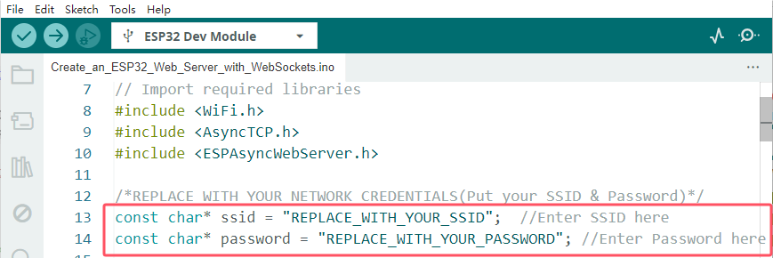

```c++
/*
 * 名称   : Create an ESP32 Web Server with WebSockets
 * 功能   : 使用WebSockets创建ESP32 Web服务器 
 * 编译IDE：ARDUINO 2.3.3
 * 作者   : https://www.keyestudio.com/
*/
// Import required libraries
#include <WiFi.h>
#include <AsyncTCP.h>
#include <ESPAsyncWebServer.h>

/*Put your SSID & Password*/
const char* ssid = "ChinaNet_2.4G";    // Enter SSID here
const char* password = "ChinaNet@233"; // Enter Password here

bool ledState = 0;
const int ledPin = 26;

// Create AsyncWebServer object on port 80
AsyncWebServer server(80);
AsyncWebSocket ws("/ws");

const char index_html[] PROGMEM = R"rawliteral(
<!DOCTYPE html>
<html>
  <head>
    <meta name="viewport" content="width=device-width, initial-scale=1.0, user-scalable=no">
    <title>ESP32 WebSocket Server</title>
    <style>
    html{font-family: Helvetica; display: inline-block; margin: 0px auto; text-align: center;}
    body{margin-top: 50px;}
    h1{color: #444444;margin: 50px auto;}
    p{font-size: 19px;color: #888;}
    #state{font-weight: bold;color: #444;}
    .switch{margin:25px auto;width:80px}
    .toggle{display:none}
    .toggle+label{display:block;position:relative;cursor:pointer;outline:0;user-select:none;padding:2px;width:80px;height:40px;background-color:#ddd;border-radius:40px}
    .toggle+label:before,.toggle+label:after{display:block;position:absolute;top:1px;left:1px;bottom:1px;content:""}
    .toggle+label:before{right:1px;background-color:#f1f1f1;border-radius:40px;transition:background .4s}
    .toggle+label:after{width:40px;background-color:#fff;border-radius:20px;box-shadow:0 2px 5px rgba(0,0,0,.3);transition:margin .4s}
    .toggle:checked+label:before{background-color:#4285f4}
    .toggle:checked+label:after{margin-left:42px}
    </style>
  </head>
  <body>
    <h1>ESP32 WebSocket Server</h1>
    <div class="switch">
      <input id="toggle-btn" class="toggle" type="checkbox" %CHECK%>
      <label for="toggle-btn"></label>
    </div>
    <p>LED: <span id="state">%STATE%</span></p>

    <script>
	  window.addEventListener('load', function() {
		var websocket = new WebSocket(`ws://${window.location.hostname}/ws`);
		websocket.onopen = function(event) {
		  console.log('Connection established');
		}
		websocket.onclose = function(event) {
		  console.log('Connection died');
		}
		websocket.onerror = function(error) {
		  console.log('error');
		};
		websocket.onmessage = function(event) {
		  if (event.data == "1") {
			document.getElementById('state').innerHTML = "ON";
			document.getElementById('toggle-btn').checked = true;
		  }
		  else {
			document.getElementById('state').innerHTML = "OFF";
			document.getElementById('toggle-btn').checked = false;
		  }
		};
		
		document.getElementById('toggle-btn').addEventListener('change', function() { websocket.send('toggle'); });
	  });
	</script>
  </body>
</html>
)rawliteral";

void handleWebSocketMessage(void *arg, uint8_t *data, size_t len) {
  AwsFrameInfo *info = (AwsFrameInfo*)arg;
  if (info->final && info->index == 0 && info->len == len && info->opcode == WS_TEXT) {
    data[len] = 0;
    if (strcmp((char*)data, "toggle") == 0) {
      ledState = !ledState;
      ws.textAll(String(ledState));
    }
  }
}

void eventHandler(AsyncWebSocket *server, AsyncWebSocketClient *client, AwsEventType type, void *arg, uint8_t *data, size_t len) {
  switch (type) {
    case WS_EVT_CONNECT:
      Serial.printf("WebSocket client #%u connected from %s\n", client->id(), client->remoteIP().toString().c_str());
      break;
    case WS_EVT_DISCONNECT:
      Serial.printf("WebSocket client #%u disconnected\n", client->id());
      break;
    case WS_EVT_DATA:
      handleWebSocketMessage(arg, data, len);
      digitalWrite(ledPin, ledState);
      break;
    case WS_EVT_PONG:
    case WS_EVT_ERROR:
      break;
  }
}

String processor(const String& var){
  if(var == "STATE"){
      return ledState ? "ON" : "OFF";
  }
  if(var == "CHECK"){
    return ledState ? "checked" : "";
  }
  return String();
}

void setup(){
  // Serial port for debugging purposes
  Serial.begin(115200);

  pinMode(ledPin, OUTPUT);
  digitalWrite(ledPin, LOW);

  Serial.print("Connecting to ");
  Serial.println(ssid);
  
  // Connect to Wi-Fi
  WiFi.begin(ssid, password);
  
  while (WiFi.status() != WL_CONNECTED) {
    delay(1000);
    Serial.print(".");
  }
  
  Serial.println("");
  Serial.println("Connected..!");
  Serial.print("Got IP: ");  Serial.println(WiFi.localIP());

  ws.onEvent(eventHandler);
  server.addHandler(&ws);

  // Route for root / web page
  server.on("/", HTTP_GET, [](AsyncWebServerRequest *request){
    request->send_P(200, "text/html", index_html, processor);
  });

  // Start server
  server.begin();
}

void loop() {
  ws.cleanupClients();
}
```
---

**5. 实验结果：**

其操作步骤如下：

1\. 打开位于 <span style="color: rgb(255, 76, 65);">..\Codes\Arduino_C_Code\IoT_C_Code\09 Create an ESP32 Web Server with WebSockets</span> 路径下的 <span style="color: rgb(255, 76, 65);">Create_an_ESP32_Web_Server_with_WebSockets.ino</span> 文件，或将上面的实验代码复制粘贴到 Arduino IDE 中。

2\. 如果你还没有修改实验代码中的Wifi名称和Wifi密码，那么你需要将实验代码中的Wifi名称(<span style="color: rgb(255, 76, 65);">**REPLACE_WITH_YOUR_SSID**</span>)和Wifi密码(<span style="color: rgb(255, 76, 65);">**REPLACE_WITH_YOUR_PASSWORD**</span>)改成你自己的Wifi名称和Wifi密码。

<span style="background: rgb(255, 251, 0);"><span style="color: rgb(255, 76, 0);">**特别注意：**<span style="color: rgb(255, 76, 0);"></span>确保计算机网络，手机/平板的网络，ESP32主板，路由器，实验代码中输入的WiFi名称和WiFi密码都必须是在同一个局域网（WiFi）下。</span></span>

3\. 要构建WebSocket服务器，将使用<span style="color: rgb(255, 76, 65);">ESPAsyncWebServer</span>库。这个库需要<span style="color: rgb(255, 76, 65);">AsyncTCP</span>库才能工作。如果已经添加好了所有的库文件，这一步就跳过；如果还没有，请跳转到 **[添加 Arduino 库](https://docs.keyestudio.com/projects/KS5020/en/latest/docs/Arduino_C.html#arduino)** ，参照说明添加库文件。

4\. 选择正确的主控板板型（ESP32 Dev Module）和 适当的串口端口（COMxx），然后单击按钮上传代码。

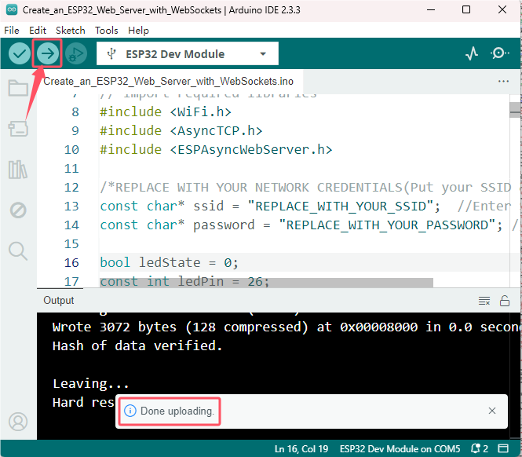

5\. 成功上传代码后，打开Serial Monitor，将波特率设置为 **115200** 。然后，<span style="background: rgb(255, 251, 0);">按下ESP32上的复位键</span>。连接到您的网络可能需要一些时间，之后它将显示从路由器获得的动态 <span style="color: rgb(255, 76, 65);">**IP**</span> 地址。

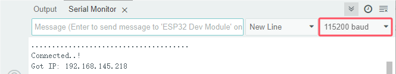

6\. 在你的手机或平板电脑上打开浏览器，输入串口监视器显示的 <span style="color: rgb(255, 76, 65);">IP</span> 地址，点击 “**search**” 。之后显示一个网页，其中包含LED的当前状态和拨动开关。串口监视器显示相关信息，并且显示的IP地址发生变化。

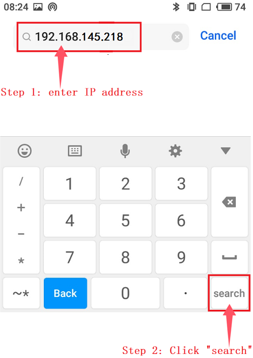

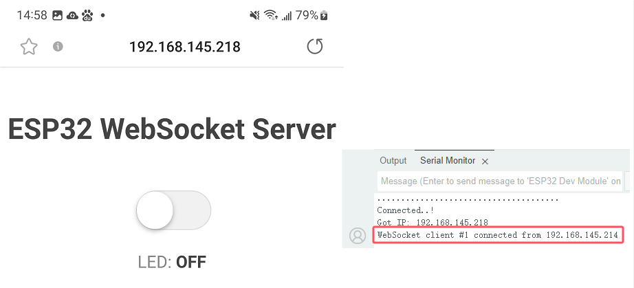

7\. 点击拨动开关来拨动LED。你会发现，不仅LED切换，而且LED状态在web浏览器中都会自动更新。

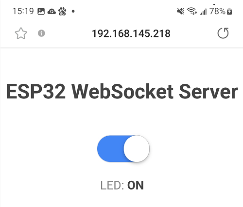

8\. 您可以密切关注 Serial Monitor，查看客户端从 ESP32 断开连接。 

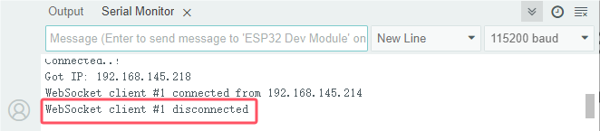

---

**6. 代码说明：**

让我们一步一步地分解代码：

- 实验代码包括以下库：
  - <span style="color: rgb(255, 76, 65);">WiFi.h</span>：提供esp32特有的WiFi连接方式。
  - <span style="color: rgb(255, 76, 65);">ESPAsyncWebServer.h</span>：用于创建一个支持websocket端点的HTTP服务器。
  - <span style="color: rgb(255, 76, 65);">AsyncTCP.h</span>: ESPAsyncWebServer库依赖于这个库

```c++
// Import required libraries
#include <WiFi.h>
#include <AsyncTCP.h>
#include <ESPAsyncWebServer.h>
```
- 指定网络名称和密码（SSID和密码），您应该用自己的Wi-Fi网络名称和密码替换它们。

```c++
/*REPLACE WITH YOUR NETWORK CREDENTIALS(Put your SSID & Password)*/
const char* ssid = "REPLACE_WITH_YOUR_SSID";  //Enter SSID here
const char* password = "REPLACE_WITH_YOUR_PASSWORD"; //Enter Password here
```
- 在同一个全局区域中，定义了两个变量：一个用于跟踪当前GPIO状态（ledState），另一个用于指定连接到LED的GPIO引脚（ledPin）。

```c++
bool ledState = 0;
const int ledPin = 26;
```
- 初始化Web服务器和WebSocket。创建一个名为 <span style="color: rgb(0 0, 255);">server</span> 的 <span style="color: rgb(255, 76, 65);">AsyncWebServer</span> 类对象。该类的构造函数接受HTTP服务器侦听传入请求的端口作为参数。在本例中，我们将使用默认的HTTP端口，即端口80。

```c++
AsyncWebServer server(80);
```
- 要设置 WebSocket 端点，请使用 <span style="color: rgb(255, 76, 65);">AsyncWebSocket</span> 类的 <span style="color: rgb(0, 209, 0);">ws</span> 已创建。websocket 端点的路径必须作为参数传递给此类的构造函数。此路径定义为字符串，在我们的代码中，它被设置为 <span style="color: rgb(0, 209, 0);">/ws</span>。以便 WebSocket 将侦听 path 上的连接：<span style="color: rgb(0, 209, 0);">ws://[esp ip]/ws</span>

```c++
AsyncWebSocket ws("/ws");
```
- 创建Web页面，然后定义 <span style="color: rgb(255, 76, 65);">index_html</span> 常量。它包含一个原始字符串，其中包含用于在网页上显示切换开关的HTML代码，用于控制LED，以及用于对网页进行样式化的CSS和JavaScript，以建立WebSocket连接并监控LED状态的变化。整个代码将在客户端执行。（<span style="color: rgb(255, 76, 65);"><span style="background: rgb(255, 251, 0);">注意</span></span>，这里使用了PROGMEM宏指令来优化内存，它将内容存储在ESP32的程序内存（闪存）中，而不是SRAM中。）

```c++
 const char index_html[] PROGMEM = R"rawliteral(
<!DOCTYPE html>
<html>
  <head>
    <meta name="viewport" content="width=device-width, initial-scale=1.0, user-scalable=no">
    <title>ESP32 WebSocket Server</title>
    <style>
    html{font-family: Helvetica; display: inline-block; margin: 0px auto; text-align: center;}
    body{margin-top: 50px;}
    h1{color: #444444;margin: 50px auto;}
    p{font-size: 19px;color: #888;}
    #state{font-weight: bold;color: #444;}
    .switch{margin:25px auto;width:80px}
    .toggle{display:none}
    .toggle+label{display:block;position:relative;cursor:pointer;outline:0;user-select:none;padding:2px;width:80px;height:40px;background-color:#ddd;border-radius:40px}
    .toggle+label:before,.toggle+label:after{display:block;position:absolute;top:1px;left:1px;bottom:1px;content:""}
    .toggle+label:before{right:1px;background-color:#f1f1f1;border-radius:40px;transition:background .4s}
    .toggle+label:after{width:40px;background-color:#fff;border-radius:20px;box-shadow:0 2px 5px rgba(0,0,0,.3);transition:margin .4s}
    .toggle:checked+label:before{background-color:#4285f4}
    .toggle:checked+label:after{margin-left:42px}
    </style>
  </head>
  <body>
    <h1>ESP32 WebSocket Server</h1>
    <div class="switch">
      <input id="toggle-btn" class="toggle" type="checkbox" %CHECK%>
      <label for="toggle-btn"></label>
    </div>
    <p>LED: <span id="state">%STATE%</span></p>

    <script>
	  window.addEventListener('load', function() {
		var websocket = new WebSocket(`ws://${window.location.hostname}/ws`);
		websocket.onopen = function(event) {
		  console.log('Connection established');
		}
		websocket.onclose = function(event) {
		  console.log('Connection died');
		}
		websocket.onerror = function(error) {
		  console.log('error');
		};
		websocket.onmessage = function(event) {
		  if (event.data == "1") {
			document.getElementById('state').innerHTML = "ON";
			document.getElementById('toggle-btn').checked = true;
		  }
		  else {
			document.getElementById('state').innerHTML = "OFF";
			document.getElementById('toggle-btn').checked = false;
		  }
		};
		
		document.getElementById('toggle-btn').addEventListener('change', function() { websocket.send('toggle'); });
	  });
	</script>
  </body>
</html>
)rawliteral";
```

- 在 <span style="color: rgb(255, 76, 65);">setup()</span> 函数中，ESP32尝试连接WiFi网络。将连接进度和获取到的IP地址打印到串口监视器上。。

```c++
  Serial.print("Connecting to ");
  Serial.println(ssid);
  
  // Connect to Wi-Fi
  WiFi.begin(ssid, password);
  
  while (WiFi.status() != WL_CONNECTED) {
    delay(1000);
    Serial.print(".");
  }
  
  Serial.println("");
  Serial.println("Connected..!");
  Serial.print("Got IP: ");  Serial.println(WiFi.localIP());
```
- WebSocket设置了一个事件监听器。这意味着无论何时发生与WebSocket（<span style="color: rgb(255, 76, 65);">ws</span> 对象）相关的事件，都将触发 <span style="color: rgb(255, 76, 65);">eventHandler()</span> 函数来处理该事件。<span style="color: rgb(255, 76, 65);">eventHandler()</span> 函数包含确定发生了什么类型的WebSocket事件的逻辑（如新的客户端连接，接收到的数据，客户端断开连接等）以及如何响应该事件。

```c++
  ws.onEvent(eventHandler);
```
- 将WebSocket（<span style="color: rgb(255, 76, 65);">ws</span> 对象）附加或注册到web服务器（<span style="color: rgb(255, 76, 65);">server</span> 对象）。这告诉 <span style="color: rgb(255, 76, 65);">server</span> 它有一个WebSocket处理程序，任何传入的WebSocket连接或请求都应该被定向到这个处理程序。<span style="color: rgb(255, 76, 65);">&amp;ws</span> 是指向WebSocket对象的指针，允许 <span style="color: rgb(255, 76, 65);">server</span> 知道在哪里发送和从哪里接收与WebSocket相关的数据。

```c++
  server.addHandler(&ws);
```

- Web服务器已启动。一旦执行，服务器就开始在前面定义的路径（如我们设置的根路径）上侦听传入的客户机请求。

```c++
  // Start server
  server.begin();
```

- 在 <span style="color: rgb(255, 76, 65);">loop()</span> 函数中，在同步web服务器的情况下，你通常会调用<span style="color: rgb(255, 76, 65);">server.handleclient()</span>；在循环中，它检查是否有任何要处理的客户机请求。如果有，代码将处理这些请求并在将控制返回给其余部分之前发送的响应。

```c++
void loop() {
  ws.cleanupClients();
}
```
- 处理网页占位符。网页有两个占位符：<span style="color: rgb(255, 76, 65);">%CHECK%</span> 和 <span style="color: rgb(255, 76, 65);">%STATE%</span>。<span style="color: rgb(255, 76, 65);">processor()</span> 函数负责在HTML文本中搜索这样的占位符，并在将网页发送给浏览器之前用适当的值替换它们。

```c++
String processor(const String& var){
  if(var == "STATE"){
      return ledState ? "ON" : "OFF";
  }
  if(var == "CHECK"){
    return ledState ? "checked" : "";
  }
  return String();
}

```
- 读取WebSocket消息和广播。<span style="color: rgb(255, 76, 65);">handleWebSocketMessage()</span> 函数被定义为处理传入的WebSocket消息。当收到有效的“toggle”消息时，该函数切换LED，并使用 <span style="color: rgb(255, 76, 65);">textAll()</span> 方法将此更改通知所有连接的客户端。AsyncWebSocket类的 <span style="color: rgb(255, 76, 65);">textAll()</span> 方法允许ESP32同时向所有连接的客户端发送相同的消息，确保LED的状态在所有客户端之间保持同步。

```c++
void handleWebSocketMessage(void *arg, uint8_t *data, size_t len) {
  AwsFrameInfo *info = (AwsFrameInfo*)arg;
  if (info->final && info->index == 0 && info->len == len && info->opcode == WS_TEXT) {
    data[len] = 0;
    if (strcmp((char*)data, "toggle") == 0) {
      ledState = !ledState;
      ws.textAll(String(ledState));
    }
  }
}
```
- 处理服务器端WebSocket事件。在setup()函数中，我们使用<span style="color: rgb(255, 76, 65);">ws.onevent(eventHandler)</span> 方法为WebSocket设置了一个事件监听器，这样每当发生与WebSocket(<span style="color: rgb(255, 76, 65);">ws</span> object)相关的事件时，就会触发 <span style="color: rgb(255, 76, 65);">eventHandler()</span> 函数来处理该事件。

```c++
void eventHandler(AsyncWebSocket *server, AsyncWebSocketClient *client, AwsEventType type, void *arg, uint8_t *data, size_t len) {
  switch (type) {
    case WS_EVT_CONNECT:
      Serial.printf("WebSocket client #%u connected from %s\n", client->id(), client->remoteIP().toString().c_str());
      break;
    case WS_EVT_DISCONNECT:
      Serial.printf("WebSocket client #%u disconnected\n", client->id());
      break;
    case WS_EVT_DATA:
      handleWebSocketMessage(arg, data, len);
      digitalWrite(ledPin, ledState);
      break;
    case WS_EVT_PONG:
    case WS_EVT_ERROR:
      break;
  }
}
```
---

### 第10课 Web 绘图仪

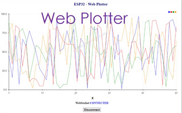

---

**1. 实验介绍：**

在本教程中，我们将学习如何创建一个看起来类似于 Arduino IDE 中的串行绘图仪 的 Web 绘图仪。通过设置，您可以使用智能手机或 PC 上的 Web 浏览器轻松査看来自 ESP32 的实时数据。它将以图形形式显示数据，就像您在 Arduino IDE 的串行绘图仪上看到的那样。

---

**2. 元件知识：**
    
**Web 绘图仪的工作原理:**

ESP32 代码创建 Web 服务器和 Websocket 服务器。当用户通过 Web 浏览器访问 ESP32 开发板上的网页时，ESP32 开发板上的Web服务器会将Web内容(HTML、CSS、javascript)返回给 Web 浏览器。

JavaScript 代码在 Web 浏览器上绘制一个类似于 Seria Plotter 的图形。当用户点击网络上的连接按钮时。javascript代码创建一个Websocket连接到ESP32开发板上的Websocket服务器
ESP32 通过 Websocket 连接将数据发送到 Web 浏览器，其格式与串行绘图仪相同。

Web 浏览器上的 JavaScript 代码接收数据并将数据绘制在图表上。

---

**3. ESP32 发送到 Web Plotter 的数据格式：**

要绘制多个变量，我们需要用“|t"或""字符将变量彼此分开。最后一个值必须以“|r|n"字符终止。

详细地:
- 第一个变量
```c++
  webSocket.broadcastTXT(variable_1);
```
- 中间变量
```c++
  webSocket.broadcastTXT(" ");  // a tab '\t' or space ' ' character is printed between the two values.
  webSocket.broadcastTXT(variable_2);
  webSocket.broadcastTXT(" ");  // a tab '\t' or space ' ' character is printed between the two values.
  webSocket.broadcastTXT(variable_3);
```
- 最后变量
```c++
  webSocket.broadcastTXT(" ");  // a tab '\t' or space ' ' character is printed between the two values.
  webSocket.broadcastTXT(variable_4);
  webSocket.broadcastTXT("\r\n");  // the last value is terminated by a carriage return and a newline characters.
```
---

**4. 快速说明：**

网页的内容(HTML、CSS、JavaScript)单独存储在 index.h 文件中。因此，我们将在 Arduino IDE 上有两个代码文件:

- 一个<span style="color: rgb(255, 76, 65);">.ino</span> 文件，即 Web_Plotter 代码，用于创建 Web 服务器和 Websocket 服务器，控制舵机转动。
- 一个<span style="color: rgb(255, 76, 65);">.h</span> 文件，其中包含网页的内容。

---

**5. 实验组件：**

|    |||
| ------------------------ | --------------------- | --------------------- |
| ESP32 主控板 x1  | Micro USB数据线 x1 |移动通信设备 x1|

---

**6. 模块接线图：**


---

**7. 实验代码：**

<span style="color: rgb(255, 76, 65);">特别注意：</span>在上传实验代码之前，你需要先将实验代码中的Wifi名称(<span style="color: rgb(255, 76, 65);">**REPLACE_WITH_YOUR_SSID**</span>)和Wifi密码(<span style="color: rgb(255, 76, 65);">**REPLACE_WITH_YOUR_PASSWORD**</span>)改成你自己的Wifi名称和Wifi密码。

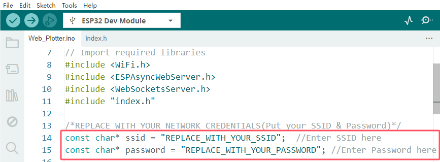

```c++
/*
 * 名称   : Web Plotter
 * 功能   : 在Web 服务器中绘制多种折线图
 * 编译IDE：ARDUINO 2.3.3
 * 作者   : https://www.keyestudio.com/
*/
// Import required libraries
#include <WiFi.h>
#include <ESPAsyncWebServer.h>
#include <WebSocketsServer.h>
#include "index.h"

/*Put your SSID & Password*/
const char* ssid = "ChinaNet_2.4G";    // Enter SSID here
const char* password = "ChinaNet@233";  //Enter Password here

AsyncWebServer server(80);
WebSocketsServer webSocket = WebSocketsServer(81);  // WebSocket server on port 81

int last_update = 0;

void setup() {
  Serial.begin(115200);
  delay(1000);

  // Connect to Wi-Fi
  WiFi.begin(ssid, password);
  while (WiFi.status() != WL_CONNECTED) {
    delay(1000);
    Serial.println("Connecting to WiFi...");
  }
  Serial.println("Connected to WiFi");

  // Initialize WebSocket server
  webSocket.begin();
  //webSocket.onEvent(webSocketEvent);

  // Serve a basic HTML page with JavaScript to create the WebSocket connection
  server.on("/", HTTP_GET, [](AsyncWebServerRequest* request) {
    Serial.println("Web Server: received a web page request");
    String html = HTML_CONTENT;  // Use the HTML content from the index.h file
    request->send(200, "text/html", html);
  });

  server.begin();
  Serial.print("ESP32 Web Server's IP address: ");
  Serial.println(WiFi.localIP());
}

void loop() {
  webSocket.loop();

  if (millis() - last_update > 500) {
    last_update = millis();
    String variable_1 = String(random(0, 100));
    String variable_2 = String(random(0, 100));
    String variable_3 = String(random(0, 100));
    String variable_4 = String(random(0, 100));

    // TO SERIAL PLOTTER
 // Serial.print(variable_1);
 // Serial.print(" ");  // a tab '\t' or space ' ' character is printed between the two values.
 // Serial.print(variable_2);
 // Serial.print(" ");  // a tab '\t' or space ' ' character is printed between the two values.
 // Serial.print(variable_3);
 // Serial.print(" ");           // a tab '\t' or space ' ' character is printed between the two values.
 // Serial.println(variable_4);  // the last value is terminated by a carriage return and a newline characters.

    // TO WEB PLOTTER
    webSocket.broadcastTXT(variable_1);
    webSocket.broadcastTXT(" ");  // a tab '\t' or space ' ' character is printed between the two values.
    webSocket.broadcastTXT(variable_2);
    webSocket.broadcastTXT(" ");  // a tab '\t' or space ' ' character is printed between the two values.
    webSocket.broadcastTXT(variable_3);
    webSocket.broadcastTXT(" ");  // a tab '\t' or space ' ' character is printed between the two values.
    webSocket.broadcastTXT(variable_4);
    webSocket.broadcastTXT("\r\n");  // the last value is terminated by a carriage return and a newline characters.
  }
}
```

---

**8. 创建index.h文件：**

如果是直接打开位于 <span style="color: rgb(255, 76, 65);">..\Codes\Arduino_C_Code\IoT_C_Code\10 Web Plotter</span> 路径下的 <span style="color: rgb(255, 76, 65);">Web_Plotter.ino</span> 文件，则不需要另外创建 <span style="color: rgb(0, 0, 255);">index.h</span> 文件。因为代码文件中已经包含有。

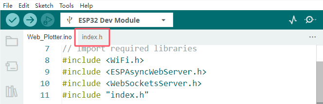

如果是将上面的实验代码直接复制粘贴到 Arduino IDE 中，那么需要创建 <span style="color: rgb(0, 0, 255);">index.h</span> 文件，其创建步骤如下：

- 1\. 单击串行监视器图标下方的按钮并选择 “**New Tab**” ，或使用 **ctrl+shift+N** 键。

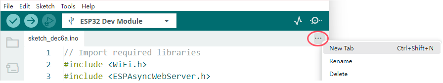

- 2\. 在出现的页面文本框中输入 <span style="color: rgb(0, 0, 255);">index.h</span> ，然后单击 “**OK**” 按钮。

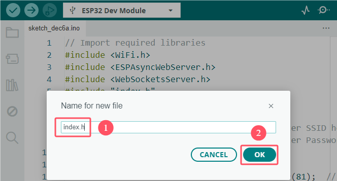

- 3\. 复制下面的代码并将其粘贴到文件 <span style="color: rgb(0, 0, 255);">index.h</span> 。

```c++
const char *HTML_CONTENT = R"=====(
<!DOCTYPE html>
<html>
<head>
<title>ESP32 - Web Plotter</title>
<meta name="viewport" content="width=device-width, initial-scale=0.7">
<style> 
body {text-align: center; height: 750px; }
h1 {font-weight: bold; font-size: 20pt; padding-bottom: 5px; color: navy; }
h2 {font-weight: bold; font-size: 15pt; padding-bottom: 5px; }
button {font-weight: bold; font-size: 15pt; } 
#footer {width: 100%; margin: 0px;  padding: 0px 0px 10px 0px; bottom: 0px; }
.sub-footer {margin: 0 auto; position: relative; width:400px; }
.sub-footer a {position: absolute; font-size: 10pt; top: 3px; }
</style>
<script>
var COLOR_BACKGROUND  = "#FFFFFF";
var COLOR_TEXT      = "#000000";
var COLOR_BOUND      = "#000000";
var COLOR_GRIDLINE    = "#F0F0F0";
//var COLOR_LINE = ["#33FFFF", "#FF00FF", "#FF0000", "#FF8C00", "#00FF00"];
//var COLOR_LINE = ["#0000FF", "#FF0000", "#00FF00", "#FF8C00", "#00FF00"];
//var COLOR_LINE = ["#33FFFF", "#FF0000", "#00FF00", "#FF8C00", "#00FF00"];
var COLOR_LINE = ["#0000FF", "#FF0000", "#009900", "#FF9900", "#CC00CC", "#666666", "#00CCFF", "#000000"];

var LEGEND_WIDTH = 10;
var X_AXIS_TITLE_HEIGHT  = 40;
var Y_AXIS_TITLE_WIDTH  = 40;
var X_AXIS_VALUE_HEIGHT  = 40;
var Y_AXIS_VALUE_WIDTH  = 50;
var PLOT_AREA_PADDING_TOP  = 30;
var PLOT_AREA_PADDING_RIGHT  = 30;
var X_GRIDLINE_NUM = 5;
var Y_GRIDLINE_NUM = 4;

var WSP_SIZE_TYPE = 1; /* 0: Fixed size, 1: full screen */
var WSP_WIDTH  = 400;
var WSP_HEIGHT = 200;
var MAX_SAMPLE = 50; // in sample
var X_AXIS_MIN = 0;
var X_AXIS_MAX = MAX_SAMPLE;
var Y_AXIS_AUTO_SCALE = 1; /* 0: y axis fixed range, 1: y axis auto scale */
var Y_AXIS_MIN = -5;
var Y_AXIS_MAX = 5;
var X_AXIS_TITLE = "X";
var Y_AXIS_TITLE = "Y";

var plot_area_width;
var plot_area_height;
var plot_area_pivot_x;
var plot_area_pivot_y;

var sample_count = 0;

var buffer = "";
var data = [];

var ws;
var canvas;
var ctx;

function init()
{
  canvas = document.getElementById("graph");
  canvas.style.backgroundColor = COLOR_BACKGROUND;
  ctx = canvas.getContext("2d");
  canvas_resize();
  setInterval(update_view, 1000 / 60);
}
function connect_onclick()
{
  if(ws == null)
  {
    ws = new WebSocket("ws://" + window.location.host + ":81");
    document.getElementById("ws_state").innerHTML = "CONNECTING";
    ws.onopen = ws_onopen;
    ws.onclose = ws_onclose;
    ws.onmessage = ws_onmessage;
    ws.binaryType = "arraybuffer";
  }
  else
    ws.close();
}
function ws_onopen()
{
  document.getElementById("ws_state").innerHTML = "<span style='color: blue'>CONNECTED</span>";
  document.getElementById("bt_connect").innerHTML = "Disconnect";
}
function ws_onclose()
{
  document.getElementById("ws_state").innerHTML = "<span style='color: gray'>CLOSED</span>";
  document.getElementById("bt_connect").innerHTML = "Connect";

  ws.onopen = null;
  ws.onclose = null;
  ws.onmessage = null;
  ws = null;
}
function ws_onmessage(e_msg)
{
  e_msg = e_msg || window.event; // MessageEvent
  console.log(e_msg.data);

  buffer += e_msg.data;
  buffer = buffer.replace(/\r\n/g, "\n");
  buffer = buffer.replace(/\r/g, "\n");

  while(buffer.indexOf("\n") == 0)
    buffer = buffer.substr(1);

  if(buffer.indexOf("\n") <= 0)
    return;

  var pos = buffer.lastIndexOf("\n");
  var str = buffer.substr(0, pos);
  var new_sample_arr = str.split("\n");
  buffer = buffer.substr(pos + 1);

  for(var si = 0; si < new_sample_arr.length; si++) 
  {
    var str = new_sample_arr[si];
    var arr = [];

    if(str.indexOf("\t") > 0)
      arr = str.split("\t");
    else
      arr = str.split(" ");

    for(var i = 0; i < arr.length; i++)
    {
      var value = parseFloat(arr[i]);

      if(isNaN(value))
        continue;

      if(i >= data.length) 
      {
        var new_line = [value];
        data.push(new_line); // new line
      }
      else
        data[i].push(value);
    }

    sample_count++;
  }

  for(var line = 0; line < data.length; line++)
  {
    while(data[line].length > MAX_SAMPLE)
      data[line].splice(0, 1);
  }

  if(Y_AXIS_AUTO_SCALE)
    auto_scale();
}
function map(x, in_min, in_max, out_min, out_max)
{
  return (x - in_min) * (out_max - out_min) / (in_max - in_min) + out_min;
}
function get_random_color()
{
  var letters = '0123456789ABCDEF';
  var _color = '#';

  for (var i = 0; i < 6; i++)
    _color += letters[Math.floor(Math.random() * 16)];

  return _color;
}
function update_view()
{
  if(sample_count <= MAX_SAMPLE)
    X_AXIS_MAX = sample_count;
  else
    X_AXIS_MAX = 50;

  ctx.clearRect(0, 0, WSP_WIDTH, WSP_HEIGHT);
  ctx.save();
  ctx.translate(plot_area_pivot_x, plot_area_pivot_y);

  ctx.font = "bold 20px Arial";
  ctx.textBaseline = "middle";
  ctx.textAlign = "center";
  ctx.fillStyle = COLOR_TEXT;

  // draw X axis title
  if(X_AXIS_TITLE != "")
  {
    ctx.fillText(X_AXIS_TITLE, plot_area_width / 2, X_AXIS_VALUE_HEIGHT + X_AXIS_TITLE_HEIGHT / 2);
  }

  // draw Y axis title
  if(Y_AXIS_TITLE != "")
  {
    ctx.rotate(-90 * Math.PI / 180);
    ctx.fillText(Y_AXIS_TITLE, plot_area_height / 2, -Y_AXIS_VALUE_WIDTH - Y_AXIS_TITLE_WIDTH / 2);
    ctx.rotate(90 * Math.PI / 180);
  }

  ctx.font = "16px Arial";
  ctx.textAlign = "right";
  ctx.strokeStyle = COLOR_BOUND;

  for(var i = 0; i <= Y_GRIDLINE_NUM; i++)
  {
    var y_gridline_px = -map(i, 0, Y_GRIDLINE_NUM, 0, plot_area_height);
    y_gridline_px = Math.round(y_gridline_px) + 0.5;
    ctx.beginPath();
    ctx.moveTo(0, y_gridline_px);
    ctx.lineTo(plot_area_width, y_gridline_px);
    ctx.stroke();

    ctx.strokeStyle = COLOR_BOUND;
    ctx.beginPath();
    ctx.moveTo(-7 , y_gridline_px);
    ctx.lineTo(4, y_gridline_px);
    ctx.stroke();

    var y_gridline_value = map(i, 0, Y_GRIDLINE_NUM, Y_AXIS_MIN, Y_AXIS_MAX);
    y_gridline_value = y_gridline_value.toFixed(1);

    ctx.fillText(y_gridline_value + "", -15, y_gridline_px);
    ctx.strokeStyle = COLOR_GRIDLINE;
  }

  ctx.strokeStyle = COLOR_BOUND;
  ctx.textAlign = "center";

  ctx.beginPath();
  ctx.moveTo(0.5, y_gridline_px - 7);
  ctx.lineTo(0.5, y_gridline_px + 4);
  ctx.stroke();

  for(var i = 0; i <= X_GRIDLINE_NUM; i++)
  {
    var x_gridline_px = map(i, 0, X_GRIDLINE_NUM, 0, plot_area_width);
    x_gridline_px = Math.round(x_gridline_px) + 0.5;
    ctx.beginPath();
    ctx.moveTo(x_gridline_px, 0);
    ctx.lineTo(x_gridline_px, -plot_area_height);
    ctx.stroke();

    ctx.strokeStyle = COLOR_BOUND;
    ctx.beginPath();
    ctx.moveTo(x_gridline_px, 7);
    ctx.lineTo(x_gridline_px, -4);
    ctx.stroke();

    var x_gridline_value;
    if(sample_count <= MAX_SAMPLE)
      x_gridline_value = map(i, 0, X_GRIDLINE_NUM, X_AXIS_MIN, X_AXIS_MAX);
    else
      x_gridline_value = map(i, 0, X_GRIDLINE_NUM, sample_count - MAX_SAMPLE, sample_count);;

    ctx.fillText(x_gridline_value.toString(), x_gridline_px, X_AXIS_VALUE_HEIGHT / 2 + 5);
    ctx.strokeStyle = COLOR_GRIDLINE;
  }

  //ctx.lineWidth = 2;

  var line_num = data.length;

  for(var line = 0; line < line_num; line++)
  {
    // draw graph
    var sample_num = data[line].length;
    if(sample_num >= 2)
    {
      var y_value = data[line][0];

      var x_px = 0;
      var y_px = -map(y_value, Y_AXIS_MIN, Y_AXIS_MAX, 0, plot_area_height);

      if(line == COLOR_LINE.length)
        COLOR_LINE.push(get_random_color());

      ctx.strokeStyle = COLOR_LINE[line];

      ctx.beginPath();
      ctx.moveTo(x_px, y_px);
      for(var i = 0; i < sample_num; i++)
      {
        y_value = data[line][i];

        x_px = map(i, X_AXIS_MIN, X_AXIS_MAX -1, 0, plot_area_width);
        y_px = -map(y_value, Y_AXIS_MIN, Y_AXIS_MAX, 0, plot_area_height);

        ctx.lineTo(x_px, y_px);
      }

      ctx.stroke();
    }

    // draw legend
    var x = plot_area_width - (line_num - line) * LEGEND_WIDTH - (line_num - line - 1) * LEGEND_WIDTH / 2;
    var y = -plot_area_height - PLOT_AREA_PADDING_TOP / 2 - LEGEND_WIDTH / 2;
    ctx.fillStyle = COLOR_LINE[line];
    ctx.beginPath();
    ctx.rect(x, y, LEGEND_WIDTH, LEGEND_WIDTH);
    ctx.fill();
  }

  ctx.restore();
}
function canvas_resize()
{
  canvas.width = 0; // to avoid wrong screen size
  canvas.height = 0;

  if(WSP_SIZE_TYPE)
  { // full screen
    document.getElementById('footer').style.position = "fixed";

    var width = window.innerWidth - 20;
    var height = window.innerHeight - 20;

    WSP_WIDTH = width;
    WSP_HEIGHT = height - document.getElementById('header').offsetHeight - document.getElementById('footer').offsetHeight;
  }

  canvas.width = WSP_WIDTH;
  canvas.height = WSP_HEIGHT;

  ctx.font = "16px Arial";
  var y_min_text_size = ctx.measureText(Y_AXIS_MIN.toFixed(1) + "").width;
  var y_max_text_size = ctx.measureText(Y_AXIS_MAX.toFixed(1) + "").width;
  Y_AXIS_VALUE_WIDTH = Math.round(Math.max(y_min_text_size, y_max_text_size)) + 15;

  plot_area_width    = WSP_WIDTH - Y_AXIS_VALUE_WIDTH - PLOT_AREA_PADDING_RIGHT;
  plot_area_height  = WSP_HEIGHT - X_AXIS_VALUE_HEIGHT - PLOT_AREA_PADDING_TOP;
  plot_area_pivot_x  = Y_AXIS_VALUE_WIDTH;
  plot_area_pivot_y  = WSP_HEIGHT - X_AXIS_VALUE_HEIGHT;

  if(X_AXIS_TITLE != "") 
  {
    plot_area_height  -= X_AXIS_TITLE_HEIGHT;
    plot_area_pivot_y  -= X_AXIS_TITLE_HEIGHT;
  }

  if(Y_AXIS_TITLE != "") 
  {
    plot_area_width    -= Y_AXIS_TITLE_WIDTH;
    plot_area_pivot_x  += Y_AXIS_TITLE_WIDTH;
  }

  ctx.lineWidth = 1;
}
function auto_scale()
{
  if(data.length >= 1)
  {
    var max_arr = [];
    var min_arr = [];

    for(var i = 0; i < data.length; i++)
    {
      if(data[i].length >= 1)
      {
        var max = Math.max.apply(null, data[i]);
        var min = Math.min.apply(null, data[i]);

        max_arr.push(max);
        min_arr.push(min);
      }
    }

    var max = Math.max.apply(null, max_arr);
    var min = Math.min.apply(null, min_arr);
    var MIN_DELTA = 10.0;

    if((max - min) < MIN_DELTA)
    {
      var mid = (max + min) / 2;
      max = mid + MIN_DELTA / 2;
      min = mid - MIN_DELTA / 2;
    }

    var range = max - min;
    var exp;

    if (range == 0.0)
      exp = 0;
    else
      exp = Math.floor(Math.log10(range / 4));

    var scale = Math.pow(10, exp);
    var raw_step = (range / 4) / scale;
    var step;

    potential_steps =[1.0, 1.5, 2.0, 2.5, 3.0, 4.0, 5.0, 6.0, 8.0, 10.0];

    for (var i = 0; i < potential_steps.length; i++) 
    {
      if (potential_steps[i] < raw_step)
        continue;

      step = potential_steps[i] * scale;
      Y_AXIS_MIN = step * Math.floor(min / step);
      Y_AXIS_MAX = Y_AXIS_MIN + step * (4);

      if (Y_AXIS_MAX >= max)
        break;
    }

    var count = 5 - Math.floor((Y_AXIS_MAX - max) / step);
    Y_AXIS_MAX = Y_AXIS_MIN + step * (count - 1);

    ctx.font = "16px Arial";
    var y_min_text_size = ctx.measureText(Y_AXIS_MIN.toFixed(1) + "").width;
    var y_max_text_size = ctx.measureText(Y_AXIS_MAX.toFixed(1) + "").width;
    Y_AXIS_VALUE_WIDTH = Math.round(Math.max(y_min_text_size, y_max_text_size)) + 15;

    plot_area_width    = WSP_WIDTH - Y_AXIS_VALUE_WIDTH - PLOT_AREA_PADDING_RIGHT;
    plot_area_pivot_x  = Y_AXIS_VALUE_WIDTH;
  }
}

window.onload = init;

</script>
</head>
<body onresize="canvas_resize()">
  <h1 id="header">ESP32 - Web Plotter</h1>
  <canvas id="graph"></canvas>
  <br>
  <div id="footer">
    <div class="sub-footer">
      <h2>WebSocket <span id="ws_state"><span style="color: gray">CLOSED</span></span></h2>
    </div>
    <button id="bt_connect" type="button" onclick="connect_onclick();">Connect</button>
  </div>
</body>
</html>
)=====";
```

4\. 现在文件夹中有了这两个代码文件：<span style="color: rgb(255, 76, 65);">Web_Plotter.ino</span> 和 <span style="color: rgb(0, 0, 255);">index.h</span> 。

---

**6. 实验结果：**

其操作步骤如下：

1\. 如果你还没有修改实验代码中的Wifi名称和Wifi密码，那么你需要将实验代码中的Wifi名称(<span style="color: rgb(255, 76, 65);">**REPLACE_WITH_YOUR_SSID**</span>)和Wifi密码(<span style="color: rgb(255, 76, 65);">**REPLACE_WITH_YOUR_PASSWORD**</span>)改成你自己的Wifi名称和Wifi密码。

<span style="background: rgb(255, 251, 0);"><span style="color: rgb(255, 76, 0);">**特别注意：**<span style="color: rgb(255, 76, 0);"></span>确保计算机网络，手机/平板的网络，ESP32主板，路由器，实验代码中输入的WiFi名称和WiFi密码都必须是在同一个局域网（WiFi）下。</span></span>

2\. 检查是否添加了代码中涉及到的库文件。如果已经添加好了所有的库文件，这一步就跳过；如果还没有，请跳转到 **[添加 Arduino 库](https://docs.keyestudio.com/projects/KS5020/en/latest/docs/Arduino_C.html#arduino)** ，参照说明添加库文件。

3\. 选择正确的主控板板型（ESP32 Dev Module）和 适当的串口端口（COMxx），然后单击按钮上传代码。

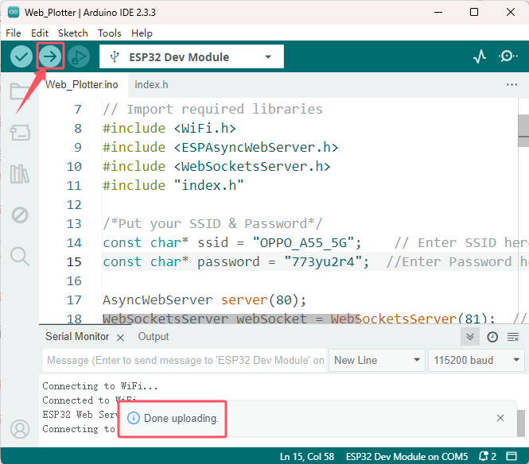

4\. 成功上传代码后，打开串口监视器，设置波特率为 **115200** ，串口监视器打印出接收到的对应的 <span style="color: rgb(255, 76, 65);">**IP**</span> 地址。

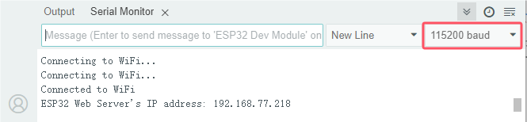

<span style="background: rgb(255, 127, 170);">**提醒：假如串口监视器没打印 IP 地址，则需要按下ESP32主控板上的复位键**。</span>


5\. 接着打开智能手机或平板的浏览器，在下图所示的浏览器搜索框里输入串口监视器窗口打印的WIFI IP地址，接着点击 “**search**” 。


6\. 几秒钟后进入WiFi网页，说明ESP32主板上的ESP32模块成功连接上了WiFi。 WiFi网页显示Web绘图仪的坐标图，同时串口监视器打印相关信息。

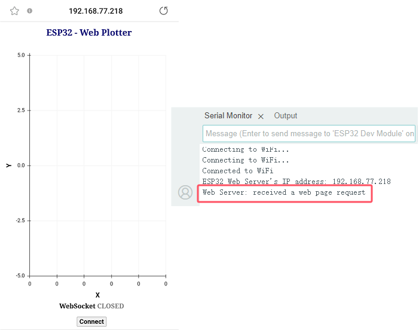

7\. 单击 “**Connect**” 按钮，通过Websocket将网页连接到ESP32。您将看到绘图仪绘制的数据如下图所示。

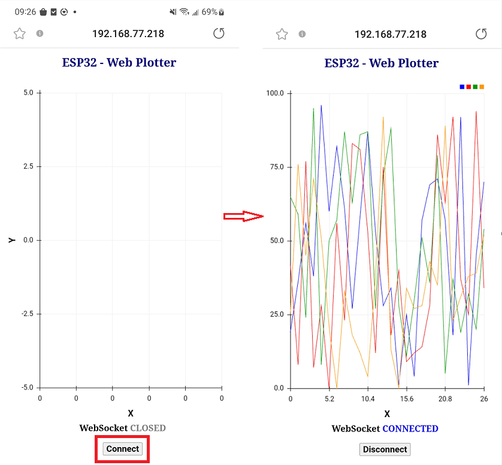

**<span style="color: rgb(255, 76, 65);">注意:</span>**

如果您修改了<span style="color: rgb(255, 76, 65);">index.h</span>中的HTML内容，并且没有触及到<span style="color: rgb(255, 76, 65);">Web_Plotter.ino</span>文件中的任何内容，如果编译并上传代码到ESP32，则Arduino IDE不会更新HTML内容。

要使Arduino lDE在本例中更新HTML内容，请在<span style="color: rgb(255, 76, 65);">Web_Plotter.ino</span>中进行更改(例如：添加空行，添加注释… 等等)。

---

**7. 代码说明：**

实验代码中已经包含逐行解释，请阅读代码中的注释！这里就不重复。

---

### 第11课 在 Web 服务器上输入数据

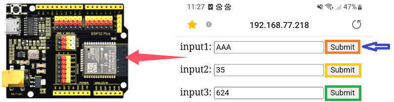

---

**1. 实验介绍：**

在前面项目中，我们利用ESP32构建一个Websocket服务器。我们不仅可以通过Websocket服务器连接 ESP32 Web 绘图仪，还可以通过Web服务器从ESP32输入数据。

在本教程中，您将学习如何创建具有三个输入字段的 ESP32 Web 服务器，以使用 HTML 表单将值传递给 ESP32。然后，您可以将这些值用作代码中的变量，我们将使用 Arduino IDE 对开发板进行编程。

---

**2. 实验组件：**

|    |||
| ------------------------ | --------------------- | --------------------- |
| ESP32 主控板 x1  | Micro USB数据线 x1 |移动通信设备 x1|

---

**3. 模块接线图：**


---

**4. 实验代码：**

<span style="color: rgb(255, 76, 65);">特别注意：</span>在上传实验代码之前，你需要先将实验代码中的Wifi名称(<span style="color: rgb(255, 76, 65);">**REPLACE_WITH_YOUR_SSID**</span>)和Wifi密码(<span style="color: rgb(255, 76, 65);">**REPLACE_WITH_YOUR_PASSWORD**</span>)改成你自己的Wifi名称和Wifi密码。

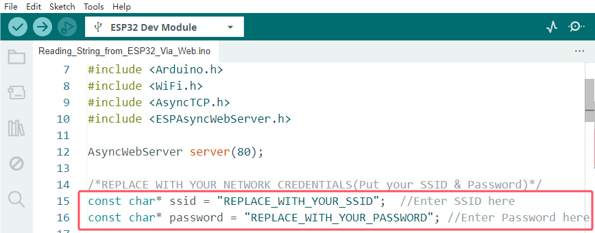

```c++
/*
 * 名称   : Reading string from ESP32 via Web
 * 功能   : 通过Web服务器从ESP32读取字符串
 * 编译IDE：ARDUINO 2.3.3
 * 作者   : https://www.keyestudio.com/
*/
#include <WiFi.h>
#include <ESPAsyncWebServer.h>

/*Put your SSID & Password*/
const char* ssid = "ChinaNet_2.4G";  // Enter SSID here
const char* password = "ChinaNet@233";  //Enter Password here

AsyncWebServer server(80);

void setup() {
  Serial.begin(115200);

  // Connect to Wi-Fi
  WiFi.begin(ssid, password);
  while (WiFi.status() != WL_CONNECTED) {
    delay(1000);
    Serial.println("Connecting to WiFi...");
  }
  Serial.println("Connected to WiFi");

  // Print the ESP32's IP address
  Serial.print("ESP32 Web Server's IP address: ");
  Serial.println(WiFi.localIP());

  // Define a route to serve the HTML page
  server.on("/", HTTP_GET, [](AsyncWebServerRequest* request) {
    Serial.println("ESP32 Web Server: New request received:");  // for debugging
    Serial.println("GET /");        // for debugging
    request->send(200, "text/html", "<html><body><h1>Hello, ESP32!</h1></body></html>");
  });

  // Start the server
  server.begin();
}

void loop() {
  // Your code here
}
```
---

**6. 实验结果：**

其操作步骤如下：

1\. 打开位于 <span style="color: rgb(255, 76, 65);">..\Codes\Arduino_C_Code\IoT_C_Code\11 Input Data on ESP32 Web Server</span> 路径下的 <span style="color: rgb(255, 76, 65);">Input_Data_on_ESP32_Web_Server.ino</span> 文件，或将上面的实验代码复制粘贴到 Arduino IDE 中。

2\. 如果你还没有修改实验代码中的Wifi名称和Wifi密码，那么你需要将实验代码中的Wifi名称(<span style="color: rgb(255, 76, 65);">**REPLACE_WITH_YOUR_SSID**</span>)和Wifi密码(<span style="color: rgb(255, 76, 65);">**REPLACE_WITH_YOUR_PASSWORD**</span>)改成你自己的Wifi名称和Wifi密码。

<span style="background: rgb(255, 251, 0);"><span style="color: rgb(255, 76, 0);">**特别注意：**<span style="color: rgb(255, 76, 0);"></span>确保计算机网络，手机/平板的网络，ESP32主板，路由器，实验代码中输入的WiFi名称和WiFi密码都必须是在同一个局域网（WiFi）下。</span></span>

3\. 检查是否添加了代码中涉及到的库文件。如果已经添加好了所有的库文件，这一步就跳过；如果还没有，请跳转到 **添加Arduino 库** ，参照说明添加库文件。

4\. 选择正确的主控板板型（ESP32 Dev Module）和 适当的串口端口（COMxx），然后单击按钮上传代码。

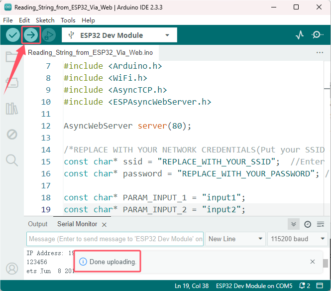

5\. 成功上传代码后，打开串口监视器，设置波特率为 **115200** ，串口监视器打印出接收到的对应的 <span style="color: rgb(255, 76, 65);">**IP**</span> 地址。

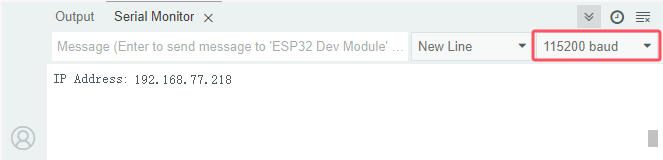

<span style="background: rgb(255, 127, 170);">**提醒：假如串口监视器没打印 IP 地址，则需要按下ESP32主控板上的复位键**。</span>


6\. 接着打开智能手机或平板的浏览器，在下图所示的浏览器搜索框里输入串口监视器窗口打印的WIFI IP地址，接着点击 “**search**” 。


7\. 几秒钟后进入WiFi网页，说明ESP32主板上的ESP32模块成功连接上了WiFi。WiFi网页应加载如下：

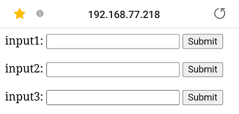

8\. 如果在 input1 字段中输入 **123456**，然后单击 “<span style="color: rgb(255, 76, 65);">**Submit**</span>” 按钮。应加载一个新页面，说明 **123456** 值已发送到您的 ESP32 ，同时串口监视器窗口打印 “**123456**”。

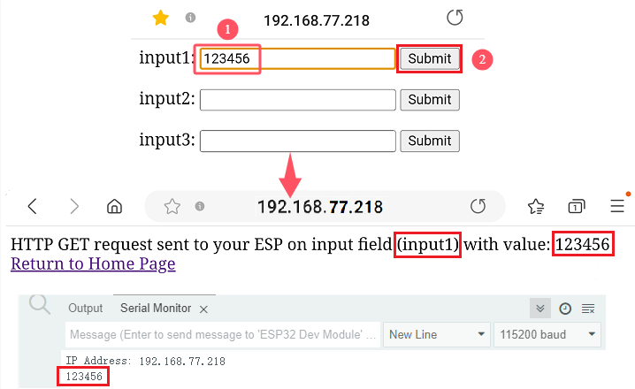

9\. 点击 “Return to Home Page” 按钮返回前一页，在 input2 字段中输入 **AAAA**，然后单击 “<span style="color: rgb(255, 76, 65);">**Submit**</span>” 按钮；或者在 input3 字段中输入 **ABC123**，然后单击 “<span style="color: rgb(255, 76, 65);">**Submit**</span>” 按钮。分别加载一个新页面，如下图所示。同时串口监视器窗口打印相对应的信息。

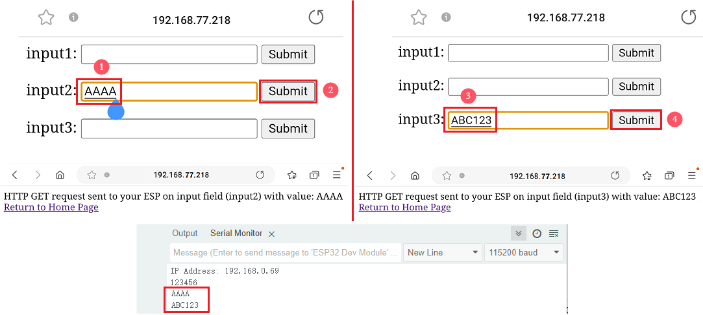

---

**7. 代码说明：**

1\. HTML 表单和输入字段。在示例中，我们显示三个输入字段，每个字段都有一个“Submit”按钮。当用户输入数据并按下 “Submit” 按钮时，该值将发送到 ESP32 并更新变量。 

```c++
// HTML web page to handle 3 input fields (input1, input2, input3)
const char index_html[] PROGMEM = R"rawliteral(
<!DOCTYPE HTML><html><head>
  <title>ESP Input Form</title>
  <meta name="viewport" content="width=device-width, initial-scale=1">
  </head><body>
  <form action="/get">
    input1: <input type="text" name="input1">
    <input type="submit" value="Submit">
  </form><br>
  <form action="/get">
    input2: <input type="text" name="input2">
    <input type="submit" value="Submit">
  </form><br>
  <form action="/get">
    input3: <input type="text" name="input3">
    <input type="submit" value="Submit">
  </form>
</body></html>)rawliteral";
```
- 在 HTML 中，`<form>` 标签用于创建用于用户输入的 HTML 表单。在例子中，表单应该包含一个输入字段和一个提交按钮。

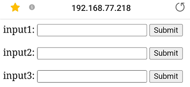

2\. 在 <span style="color: rgb(255, 76, 65);">setup()</span> 中，连接到您的本地网络。

```c++
  Serial.begin(115200);
  WiFi.mode(WIFI_STA);
  WiFi.begin(ssid, password);
  if (WiFi.waitForConnectResult() != WL_CONNECTED) {
    Serial.println("WiFi Failed!");
    return;
  }
  Serial.println();
  Serial.print("IP Address: ");
  Serial.println(WiFi.localIP());
```
3\. 处理 HTTP GET 请求。当您访问路由 URL 时，会将 HTML 页面发送到客户端。在这种情况下，HTML 文本将保存在 <span style="color: rgb(255, 76, 65);">index_html</span> 变量上。

```c++
  // Send web page with input fields to client
  server.on("/", HTTP_GET, [](AsyncWebServerRequest *request){
    request->send_P(200, "text/html", index_html);
  });
```
---

### 第12课 通过Web服务器控制LED

---

**1. 实验介绍：**

在本教程中，我们将学习通过使用计算机或智能手机上的浏览器，使用ESP32创建Web服务器来远程控制LED。具体来说，ESP32将被编程为Web服务器而工作。让我们假设ESP32的lP地址是192.168.XX.XX。以下是它的工作原理：

当你在Web浏览器的搜索框中输入192.168.XX.XX，搜索并且跳转网页，浏览器向ESP32发送请求，ESP32响应一个网页，其中包含用于控制LED的开/关按钮。

同样，当你点击网页上的 “Turn ON” 按钮或在网页浏览器中输入192.168.XX.XX/1ed1/on时，
ESP32打开LED并响应控制网页。

同样，当你点击网页上的 “Turn OFF” 按钮或在网页浏览器中输入192.168.XX.XX/1ed1/off时，
ESP32关闭LED并响应控制网页。

---

**2. 实验组件：**

|  ||||
| ------------------------ | ------------------------ | ---------------------------- |---------------------------- |
| ESP32 主控板| 红色 LED x1  | 220Ω电阻 x1  |移动通信设备 x1|
||||   |
|面包板 x1 |面包板跳线若干 | Micro USB数据线 x1 |    |

---

**3. 接线图：** 

**原理图：**


**实物接线图：**


---

**4. 实验代码：**

<span style="color: rgb(255, 76, 65);">特别注意：</span>在上传实验代码之前，你需要先将实验代码中的Wifi名称(<span style="color: rgb(255, 76, 65);">**REPLACE_WITH_YOUR_SSID**</span>)和Wifi密码(<span style="color: rgb(255, 76, 65);">**REPLACE_WITH_YOUR_PASSWORD**</span>)改成你自己的Wifi名称和Wifi密码。


```c++
/*
 * 名称   : Control LED Via Web
 * 功能   : 通过Web服务器控制LED的亮与灭
 * 编译IDE：ARDUINO 2.3.3
 * 作者   : https://www.keyestudio.com/
*/
#include <WiFi.h>
#include <ESPAsyncWebServer.h>

#define LED_PIN 26  // ESP32 pin GPIO26 connected to LED

/*Put your SSID & Password*/
const char* ssid = "ChinaNet_2.4G";    // Enter SSID here
const char* password = "ChinaNet@233"; // Enter Password here

AsyncWebServer server(80);

int LED_state = LOW;

String getHTML() {
  String html = "<!DOCTYPE HTML>";
  html += "<html>";
  html += "<head>";
  html += "<link rel='icon' href='data:,'>";
  html += "</head>";
  html += "<p>LED state: <span style='color: red;'>";

  if (LED_state == LOW)
    html += "OFF";
  else
    html += "ON";

  html += "</span></p>";
  html += "<a href='/led1/on'>Turn ON</a>";
  html += "<br><br>";
  html += "<a href='/led1/off'>Turn OFF</a>";
  html += "</html>";

  return html;
}

void setup() {
  Serial.begin(115200);
  pinMode(LED_PIN, OUTPUT);
  digitalWrite(LED_PIN, LED_state);

  // Connect to Wi-Fi
  WiFi.begin(ssid, password);
  while (WiFi.status() != WL_CONNECTED) {
    delay(1000);
    Serial.println("Connecting to WiFi...");
  }
  Serial.println("Connected to WiFi");

  // Print the ESP32's IP address
  Serial.print("ESP32 Web Server's IP address: ");
  Serial.println(WiFi.localIP());

  // home page
  server.on("/", HTTP_GET, [](AsyncWebServerRequest *request) {
    Serial.println("ESP32 Web Server: New request received:");
    Serial.println("GET /");
    request->send(200, "text/html", getHTML());
  });

  // Route to control the LED
  server.on("/led1/on", HTTP_GET, [](AsyncWebServerRequest *request) {
    Serial.println("ESP32 Web Server: New request received:");
    Serial.println("GET /led1/on");
    LED_state = HIGH;
    digitalWrite(LED_PIN, LED_state);
    request->send(200, "text/html", getHTML());
  });
  server.on("/led1/off", HTTP_GET, [](AsyncWebServerRequest *request) {
    Serial.println("ESP32 Web Server: New request received:");
    Serial.println("GET /led1/off");
    LED_state = LOW;
    digitalWrite(LED_PIN, LED_state);
    request->send(200, "text/html", getHTML());
  });

  // Start the server
  server.begin();
}

void loop() {
  // Your code here
}
```
---

**6. 实验结果：**

其操作步骤如下：

1\. 打开位于 <span style="color: rgb(255, 76, 65);">..\Codes\Arduino_C_Code\IoT_C_Code\12 Control LED Via Web</span> 路径下的 <span style="color: rgb(255, 76, 65);">Control_LED_Via_Web.ino</span> 文件，或将上面的实验代码复制粘贴到 Arduino IDE 中。

2\. 如果你还没有修改实验代码中的Wifi名称和Wifi密码，那么你需要将实验代码中的Wifi名称(<span style="color: rgb(255, 76, 65);">**REPLACE_WITH_YOUR_SSID**</span>)和Wifi密码(<span style="color: rgb(255, 76, 65);">**REPLACE_WITH_YOUR_PASSWORD**</span>)改成你自己的Wifi名称和Wifi密码。

<span style="background: rgb(255, 251, 0);"><span style="color: rgb(255, 76, 0);">**特别注意：**<span style="color: rgb(255, 76, 0);"></span>确保计算机网络，手机/平板的网络，ESP32主板，路由器，实验代码中输入的WiFi名称和WiFi密码都必须是在同一个局域网（WiFi）下。</span></span>

3\. 检查是否添加了代码中涉及到的库文件。如果已经添加好了所有的库文件，这一步就跳过；如果还没有，请跳转到 **[添加 Arduino 库](https://docs.keyestudio.com/projects/KS5020/en/latest/docs/Arduino_C.html#arduino)** ，参照说明添加库文件。

4\. 选择正确的主控板板型（ESP32 Dev Module）和 适当的串口端口（COMxx），然后单击按钮上传代码。

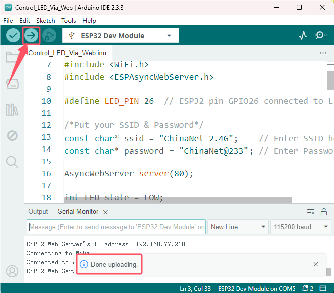

5\. 成功上传代码后，打开串口监视器，设置波特率为 **115200** ，串口监视器打印出接收到的对应的 <span style="color: rgb(255, 76, 65);">**IP**</span> 地址。

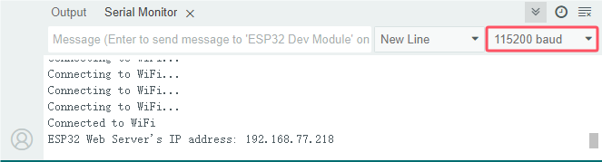

<span style="background: rgb(255, 127, 170);">**提醒：假如串口监视器没打印 IP 地址，则需要按下ESP32主控板上的复位键**。</span>


6\. 接着打开智能手机或平板的浏览器，在下图所示的浏览器搜索框里输入串口监视器窗口打印的WIFI IP地址，接着点击 “**search**” 。


7\. 几秒钟后进入WiFi网页，说明ESP32主板上的ESP32模块成功连接上了WiFi。 WiFi网页包含用于控制LED的开/关按钮和 “<span style="color: rgb(255, 76, 65);">LED state：OFF</span>” ，同时串口监视器打印相关信息。

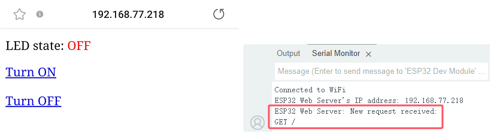

8\. 单击 “**Turn ON**” 按钮，LED点亮，“LED state：OFF” 变成 “LED state：ON”，同时串口监视器打印对应的信息。

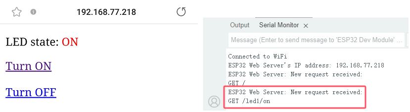

9\. 单击 “**Turn OFF**” 按钮，LED熄灭，“LED state：ON” 变成 “LED state：OFF”，同时串口监视器打印对应的信息。

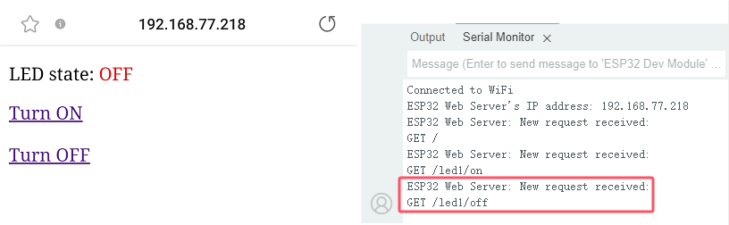

---

**7. 代码说明：**

实验代码中已经包含逐行解释，请阅读代码中的注释！这里就不重复。

---

### 第13课 通过Web服务器控制继电器吸合与断开

---

**1. 实验介绍：**

在本教程中，我们将学习通过使用计算机或智能手机上的浏览器，使用ESP32创建Web服务器来远程控制LED。具体来说，ESP32将被编程为Web服务器而工作。让我们假设ESP32的lP地址是192.168.XX.XX。以下是它的工作原理：

当你在Web浏览器的搜索框中输入192.168.XX.XX，搜索并且跳转网页。浏览器向Esp32发送请求，ESP32响应一个网页，其中包含用于控制继电器的吸合/断开按钮。

同样，当你点击网页上的 “Turn ON” 按钮或在网页浏览器中输入192.168.XX.XX/relay1/on时,
ESP32使继电器吸合，LED点亮并响应控制网页。

同样，当你点击网页上的 “Turn OFF” 按钮或在网页浏览器中输入192.168.XX.XX/relay1/off时
ESP32使继电器断开，LED熄灭并响应控制网页。

---

**2. 实验组件：**

|  |||
| ------------------------ | ------------------------ | ---------------------------- |
|ESP32 主控板 |面包板 x1 |移动通信设备 x1| 
| | ||
|继电器 x1|LED x1|220Ω电阻 x1|
||||
|面包板跳线若干 | Micro USB数据线 x1 |公对母杜邦线若干|

---

**3. 接线图：**

**原理图：**


**实物接线图：**


---

**4. 实验代码：**

<span style="color: rgb(255, 76, 65);">特别注意：</span>在上传实验代码之前，你需要先将实验代码中的Wifi名称(<span style="color: rgb(255, 76, 65);">**REPLACE_WITH_YOUR_SSID**</span>)和Wifi密码(<span style="color: rgb(255, 76, 65);">**REPLACE_WITH_YOUR_PASSWORD**</span>)改成你自己的Wifi名称和Wifi密码。

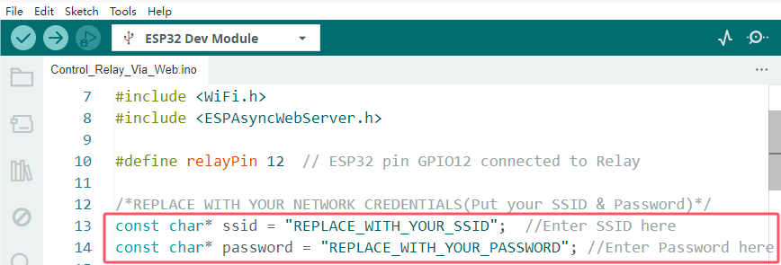

```c++
/*
 * 名称   : Control LED Via Web
 * 功能   : 通过Web服务器控制LED的亮与灭
 * 编译IDE：ARDUINO 2.3.3
 * 作者   : https://www.keyestudio.com/
*/
#include <WiFi.h>
#include <ESPAsyncWebServer.h>

#define LED_PIN 26  // ESP32 pin GPIO26 connected to LED

/*Put your SSID & Password*/
const char* ssid = "ChinaNet_2.4G";    // Enter SSID here
const char* password = "ChinaNet@233"; // Enter Password here

AsyncWebServer server(80);

int LED_state = LOW;

String getHTML() {
  String html = "<!DOCTYPE HTML>";
  html += "<html>";
  html += "<head>";
  html += "<link rel='icon' href='data:,'>";
  html += "</head>";
  html += "<p>LED state: <span style='color: red;'>";

  if (LED_state == LOW)
    html += "OFF";
  else
    html += "ON";

  html += "</span></p>";
  html += "<a href='/led1/on'>Turn ON</a>";
  html += "<br><br>";
  html += "<a href='/led1/off'>Turn OFF</a>";
  html += "</html>";

  return html;
}

void setup() {
  Serial.begin(115200);
  pinMode(LED_PIN, OUTPUT);
  digitalWrite(LED_PIN, LED_state);

  // Connect to Wi-Fi
  WiFi.begin(ssid, password);
  while (WiFi.status() != WL_CONNECTED) {
    delay(1000);
    Serial.println("Connecting to WiFi...");
  }
  Serial.println("Connected to WiFi");

  // Print the ESP32's IP address
  Serial.print("ESP32 Web Server's IP address: ");
  Serial.println(WiFi.localIP());

  // home page
  server.on("/", HTTP_GET, [](AsyncWebServerRequest *request) {
    Serial.println("ESP32 Web Server: New request received:");
    Serial.println("GET /");
    request->send(200, "text/html", getHTML());
  });

  // Route to control the LED
  server.on("/led1/on", HTTP_GET, [](AsyncWebServerRequest *request) {
    Serial.println("ESP32 Web Server: New request received:");
    Serial.println("GET /led1/on");
    LED_state = HIGH;
    digitalWrite(LED_PIN, LED_state);
    request->send(200, "text/html", getHTML());
  });
  server.on("/led1/off", HTTP_GET, [](AsyncWebServerRequest *request) {
    Serial.println("ESP32 Web Server: New request received:");
    Serial.println("GET /led1/off");
    LED_state = LOW;
    digitalWrite(LED_PIN, LED_state);
    request->send(200, "text/html", getHTML());
  });

  // Start the server
  server.begin();
}

void loop() {
  // Your code here
}
```
---

**6. 实验结果：**

其操作步骤如下：

1\. 打开位于 <span style="color: rgb(255, 76, 65);">..\Codes\Arduino_C_Code\IoT_C_Code\13 Control Relay Via Web</span> 路径下的 <span style="color: rgb(255, 76, 65);">Control_Relay_Via_Web.ino</span> 文件，或将上面的实验代码复制粘贴到 Arduino IDE 中。

2\. 如果你还没有修改实验代码中的Wifi名称和Wifi密码，那么你需要将实验代码中的Wifi名称(<span style="color: rgb(255, 76, 65);">**REPLACE_WITH_YOUR_SSID**</span>)和Wifi密码(<span style="color: rgb(255, 76, 65);">**REPLACE_WITH_YOUR_PASSWORD**</span>)改成你自己的Wifi名称和Wifi密码。

<span style="background: rgb(255, 251, 0);"><span style="color: rgb(255, 76, 0);">**特别注意：**<span style="color: rgb(255, 76, 0);"></span>确保计算机网络，手机/平板的网络，ESP32主板，路由器，实验代码中输入的WiFi名称和WiFi密码都必须是在同一个局域网（WiFi）下。</span></span>

3\. 检查是否添加了代码中涉及到的库文件。如果已经添加好了所有的库文件，这一步就跳过；如果还没有，请跳转到 **[添加 Arduino 库](https://docs.keyestudio.com/projects/KS5020/en/latest/docs/Arduino_C.html#arduino)** ，参照说明添加库文件。

4\. 选择正确的主控板板型（ESP32 Dev Module）和 适当的串口端口（COMxx），然后单击按钮上传代码。

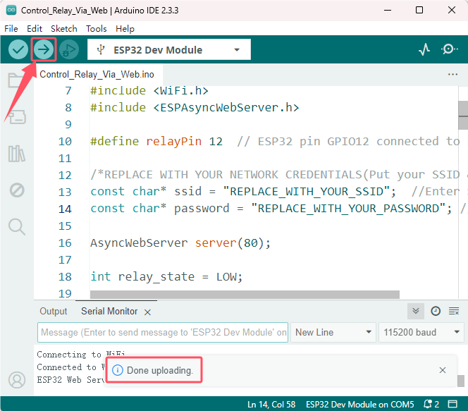

5\. 成功上传代码后，打开串口监视器，设置波特率为 **115200** ，串口监视器打印出接收到的对应的 <span style="color: rgb(255, 76, 65);">**IP**</span> 地址。

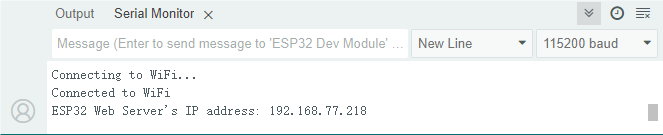

<span style="background: rgb(255, 127, 170);">**提醒：假如串口监视器没打印 IP 地址，则需要按下ESP32主控板上的复位键**。</span>


6\. 接着打开智能手机或平板的浏览器，在下图所示的浏览器搜索框里输入串口监视器窗口打印的WIFI IP地址，接着点击 “**search**” 。


7\. 几秒钟后进入WiFi网页，说明ESP32主板上的ESP32模块成功连接上了WiFi。 WiFi网页包含用于控制LED的开/关按钮和 “<span style="color: rgb(255, 76, 65);">Relay state：OFF</span>” ，同时串口监视器打印相关信息。

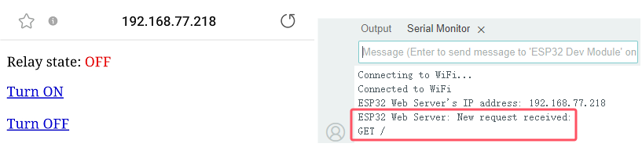

8\. 单击 “**Turn ON**” 按钮，继电器吸合，LED点亮，“Relay state：OFF” 变成 “Relay state：ON”，同时串口监视器打印对应的信息。

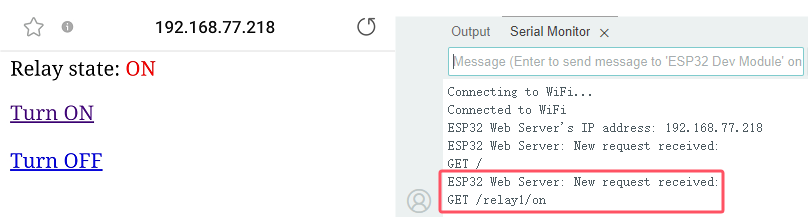

9\. 单击 “**Turn OFF**” 按钮，继电器断开，LED熄灭，“Relay state：ON” 变成 “Relay state：OFF”，同时串口监视器打印对应的信息。

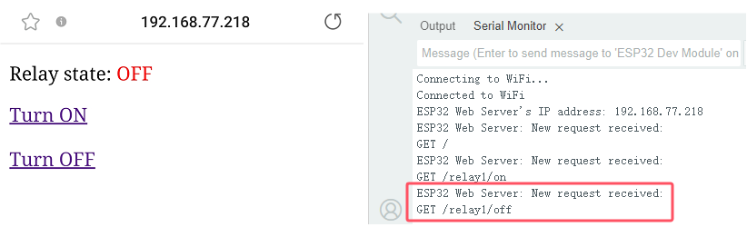

---

**7. 代码说明：**

实验代码中已经包含逐行解释，请阅读代码中的注释！这里就不重复。

---

### 第14课 通过Web服务器控制舵机转动

---

**1. 实验介绍：**

本教程将指导您借助智能手机或计算机上的Web服务器，使用ESP32创建Web服务器来远程控制舵机。我们将使用一种称为 Websocket ，通过一种可编程的 Web 用户平台来平稳、动态地控制舵机转动。

现在，讲讲为什么要使用 Websocket ? ，这个想法是这样的:

- 没有 WebSocket ，每次想改变舵机的角度时，都得重新加载页面。不是很好!
 
- 但是通过 Websocket ，在网页和 ESP32 之间建立了一个特殊的连接。这意味着我们可以在后台将 angle 值发送到ESP32，而无需重新加载页面。这使得舵机可以平稳、实时地移动，是不是很炫酷！！

---

**2. 元件知识：**
    
**如何运作:**

ESP32 代码同时创建 Web 服务器和 Websocket 服务器，以下是它的工作原理：

- 当您在 Web 浏览器中输入 ESP32 的IP 地址时，它会从 ESP32 请求网页(用户界面)
ESP32 的 Web 服务器通过发送网页内容(HTML、CSS、JavaScript)来响应。
- 然后，您的 Web 浏览器将显示该网页,
- 网页中的 JavaScript 代码与 ESP32 上的 WebSocket 服务器建立 Websocket 连接。
- 建立此 Websocket 连接后，如果您转动网页上显示的舵机轴，JavaScript 代码会在后台通过此 Websocket 连接悄悄地将 angle 值发送到 ESP32。
- ESP32 上的 Websocket 服务器在接收到角度值后，会相应地控制伺服电机。

简而言之，Websocket 连接可以平稳、实时地控制舵机的角度。

---

**3. 快速说明：**

网页的内容(HTML、CSS、JavaScript)单独存储在 index.h 文件中。因此，我们将在 Arduino IDE 上有两个代码文件:

- 一个<span style="color: rgb(255, 76, 65);">.ino</span> 文件，即 ESP32 代码，用于创建 Web 服务器和 Websocket 服务器
- 一个<span style="color: rgb(255, 76, 65);">.h</span> 文件，其中包含网页的内容。

---

**4. 实验组件：**

|  |  |||
| ------------------------ | ------------------------ | --------------------- | --------------------- |
| ESP32 主控板 x1| 舵机 x1  | Micro USB数据线 x1 |移动通信设备 x1|

---

**5. 接线图：**

**原理图：**


**实物接线图：**


---

**6. 实验代码：**

<span style="color: rgb(255, 76, 65);">特别注意：</span>在上传实验代码之前，你需要先将实验代码中的Wifi名称(<span style="color: rgb(255, 76, 65);">**REPLACE_WITH_YOUR_SSID**</span>)和Wifi密码(<span style="color: rgb(255, 76, 65);">**REPLACE_WITH_YOUR_PASSWORD**</span>)改成你自己的Wifi名称和Wifi密码。

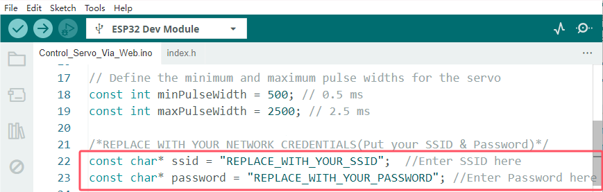

```c++
/*
 * 名称   : Control_Servo_Via_Web
 * 功能   : 通过Web服务器控制舵机转动
 * 编译IDE：ARDUINO 2.3.3
 * 作者   : https://www.keyestudio.com/
*/
#include <ESP32Servo.h>
#include <WiFi.h>
#include <ESPAsyncWebServer.h>
#include <WebSocketsServer.h>
#include "index.h"

// Define the servo and the pin it is connected to
Servo myServo;
const int servoPin = 4;

// Define the minimum and maximum pulse widths for the servo
const int minPulseWidth = 500; // 0.5 ms
const int maxPulseWidth = 2500; // 2.5 ms

/*Put your SSID & Password*/
const char* ssid = "ChinaNet_2.4G";    // Enter SSID here
const char* password = "ChinaNet@233"; // Enter Password here

AsyncWebServer server(80);
WebSocketsServer webSocket = WebSocketsServer(81);  // WebSocket server on port 81

void webSocketEvent(uint8_t num, WStype_t type, uint8_t* payload, size_t length) {
  switch (type) {
    case WStype_DISCONNECTED:
      Serial.printf("[%u] Disconnected!\n", num);
      break;
    case WStype_CONNECTED:
      {
        IPAddress ip = webSocket.remoteIP(num);
        Serial.printf("[%u] Connected from %d.%d.%d.%d\n", num, ip[0], ip[1], ip[2], ip[3]);
      }
      break;
    case WStype_TEXT:
      //Serial.printf("[%u] Received text: %s\n", num, payload);
      String angle = String((char*)payload);
      int angle_value = angle.toInt();
      Serial.println(angle_value);
      myServo.write(angle_value);
      break;
  }
}

void setup() {
  Serial.begin(115200);

  // Attach the servo to the specified pin and set its pulse width range
  myServo.attach(servoPin, minPulseWidth, maxPulseWidth);
  // Set the PWM frequency for the servo
  myServo.setPeriodHertz(50); // Standard 50Hz servo

  // Connect to Wi-Fi
  WiFi.begin(ssid, password);
  while (WiFi.status() != WL_CONNECTED) {
    delay(1000);
    Serial.println("Connecting to WiFi...");
  }
  Serial.println("Connected to WiFi");

  // Initialize WebSocket server
  webSocket.begin();
  webSocket.onEvent(webSocketEvent);

  // Serve a basic HTML page with JavaScript to create the WebSocket connection
  server.on("/", HTTP_GET, [](AsyncWebServerRequest* request) {
    Serial.println("Web Server: received a web page request");
    String html = HTML_CONTENT;  // Use the HTML content from the index.h file
    request->send(200, "text/html", html);
  });

  server.begin();
  Serial.print("ESP32 Web Server's IP address: ");
  Serial.println(WiFi.localIP());
}

void loop() {
  webSocket.loop();
}
```
---

**7. 创建index.h文件：**

如果是直接打开位于 <span style="color: rgb(255, 76, 65);">..\Codes\Arduino_C_Code\IoT_C_Code\14 Control Servo Via Web</span> 路径下的 <span style="color: rgb(255, 76, 65);">Control_Servo_Via_Web.ino</span> 文件，则不需要另外创建 <span style="color: rgb(0, 0, 255);">index.h</span> 文件。因为代码文件中已经包含有。

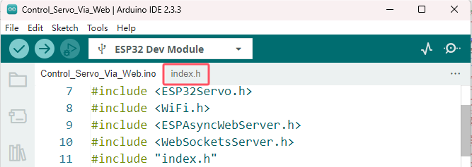

如果是将上面的实验代码直接复制粘贴到 Arduino IDE 中，那么需要创建 <span style="color: rgb(0, 0, 255);">index.h</span> 文件，其创建步骤如下：

- 1\. 单击串行监视器图标下方的按钮并选择 “**New Tab**” ，或使用 **ctrl+shift+N** 键。


- 2\. 在出现的页面文本框中输入 <span style="color: rgb(0, 0, 255);">index.h</span> ，然后单击 “**OK**” 按钮。


- 3\. 复制下面的代码并将其粘贴到文件 <span style="color: rgb(0, 0, 255);">index.h</span> 。

```c++
const char *HTML_CONTENT = R"=====(
<!DOCTYPE html>
<html>
<head>
<title>ESP32 Controls Servo Motor via Web</title>
<meta name="viewport" content="width=device-width, initial-scale=0.7">
<style>
body { text-align: center; }
canvas { background-color: #ffffff; }
</style>
<script>
var canvas_width = 401, canvas_height = 466;
var pivot_x = 200, pivot_y = 200;
var bracket_radius = 160, bracket_angle = 0;
var bracket_img = new Image();
var click_state = 0;
var last_angle = 0;
var mouse_xyra = {x:0, y:0, r:0.0, a:0.0};
var ws;

bracket_img.src = "https://esp32io.com/images/tutorial/servo-bracket.png";

function init()
{
  var servo = document.getElementById("servo");

  servo.width = canvas_width;
  servo.height = canvas_height;
  servo.style.backgroundImage = "url('https://esp32io.com/images/tutorial/servo-body.png')";
  servo.style.backgroundPosition = "center";
  servo.style.backgroundSize = "contain";

  servo.addEventListener("touchstart", mouse_down);
  servo.addEventListener("touchend", mouse_up);
  servo.addEventListener("touchmove", mouse_move);
  servo.addEventListener("mousedown", mouse_down);
  servo.addEventListener("mouseup", mouse_up);
  servo.addEventListener("mousemove", mouse_move);

  var ctx = servo.getContext("2d");

  ctx.translate(pivot_x, pivot_y);

  rotate_bracket(0);

  ws = new WebSocket("ws://" + window.location.host + ":81");
  document.getElementById("ws_state").innerHTML = "CONNECTING";

  ws.onopen  = function(){ document.getElementById("ws_state").innerHTML = "CONNECTED" };
  ws.onclose = function(){ document.getElementById("ws_state").innerHTML = "CLOSED"};
  ws.onerror = function(){ alert("websocket error " + this.url) };

  ws.onmessage = ws_onmessage;
}
function ws_onmessage(e_msg)
{
  e_msg = e_msg || window.event; // MessageEvent

  alert("msg : " + e_msg.data);
}
function rotate_bracket(angle)
{
  var servo = document.getElementById("servo");
  var ctx = servo.getContext("2d");

  ctx.clearRect(-pivot_x, -pivot_y, canvas_width, canvas_height);
  ctx.rotate(angle / 180 * Math.PI);

  ctx.drawImage(bracket_img, -pivot_x, -pivot_y);

  ctx.rotate(-angle / 180 * Math.PI);
}
function check_range_xyra(event, mouse_xyra)
{
  var x, y, r, a, rc_x, rc_y, radian;
  var min_r, max_r, width;

  if(event.touches)
  {
    var touches = event.touches;

    x = (touches[0].pageX - touches[0].target.offsetLeft) - pivot_x;
    y = pivot_y - (touches[0].pageY - touches[0].target.offsetTop);
    min_r = 60;
    max_r = pivot_x;
    width = 40;
  }
  else
  {
    x = event.offsetX - pivot_x;
    y = pivot_y - event.offsetY;
    min_r = 60;
    max_r = bracket_radius;
    width = 20;
  }

  /* cartesian to polar coordinate conversion */
  r = Math.sqrt(x * x + y * y);
  a = Math.atan2(y, x);

  mouse_xyra.x = x;
  mouse_xyra.y = y;
  mouse_xyra.r = r;
  mouse_xyra.a = a;

  radian = bracket_angle / 180 * Math.PI;

  /* rotate coordinate */
  rc_x = x * Math.cos(radian) - y * Math.sin(radian);
  rc_y = x * Math.sin(radian) + y * Math.cos(radian);

  if((r < min_r) || (r > max_r))
    return false;

  if((rc_y < -width) || (rc_y > width))
    return false;

  return true;
}
function mouse_down()
{
  if(event.touches && (event.touches.length > 1))
    click_state = event.touches.length;

  if(click_state > 1)
    return;

  if(check_range_xyra(event, mouse_xyra))
  {
    click_state = 1;
    last_angle = mouse_xyra.a / Math.PI * 180.0;
  }
}
function mouse_up()
{
  click_state = 0;
}
function mouse_move()
{
  var angle;

  if(event.touches && (event.touches.length > 1))
    click_state = event.touches.length;

  if(click_state > 1)
    return;

  if(!click_state)
    return;

  if(!check_range_xyra(event, mouse_xyra))
  {
    click_state = 0;
    return;
  }

  angle = mouse_xyra.a / Math.PI * 180.0;

  if((Math.abs(angle) > 90) && (angle * last_angle < 0))
  {
    if(last_angle > 0)
      last_angle = -180;
    else
      last_angle = 180;
  }

  bracket_angle += (last_angle - angle);
  last_angle = angle;

  if(bracket_angle > 90)
    bracket_angle = 90;

  if(bracket_angle < -90)
    bracket_angle = -90;

  rotate_bracket(bracket_angle);

  if(ws.readyState == 1)
    ws.send(Math.floor(90 - bracket_angle) + "\r\n");

  debug = document.getElementById("debug");
  debug.innerHTML = Math.floor(90 - bracket_angle);

  event.preventDefault();
}
window.onload = init;
</script>
</head>

<body>

<h2>
ESP32 - Servo Motor via Web<br>
<canvas id="servo"></canvas>

<p>
WebSocket : <span id="ws_state" style="color:blue">null</span><br>
Angle : <span id="debug" style="color:blue">90</span>
</p>
</h2>

<div class="sponsor">Sponsored by <a href="https://keyestudio.com/diyables">DIYables</a></div>

</body>
</html>
)=====";
```

4\. 现在在文件夹中有了这两个代码文件：<span style="color: rgb(255, 76, 65);">Web_Plotter.ino</span> 和 <span style="color: rgb(0, 0, 255);">index.h</span> 。

---

**6. 实验结果：**

其操作步骤如下：

1\. 如果你还没有修改实验代码中的Wifi名称和Wifi密码，那么你需要将实验代码中的Wifi名称(<span style="color: rgb(255, 76, 65);">**REPLACE_WITH_YOUR_SSID**</span>)和Wifi密码(<span style="color: rgb(255, 76, 65);">**REPLACE_WITH_YOUR_PASSWORD**</span>)改成你自己的Wifi名称和Wifi密码。

<span style="background: rgb(255, 251, 0);"><span style="color: rgb(255, 76, 0);">**特别注意：**<span style="color: rgb(255, 76, 0);"></span>确保计算机网络，手机/平板的网络，ESP32主板，路由器，实验代码中输入的WiFi名称和WiFi密码都必须是在同一个局域网（WiFi）下。</span></span>

2\. 检查是否添加了代码中涉及到的库文件。如果已经添加好了所有的库文件，这一步就跳过；如果还没有，请跳转到 **[添加 Arduino 库](https://docs.keyestudio.com/projects/KS5020/en/latest/docs/Arduino_C.html#arduino)** ，参照说明添加库文件。

3\. 选择正确的主控板板型（ESP32 Dev Module）和 适当的串口端口（COMxx），然后单击按钮上传代码。


4\. 成功上传代码后，打开串口监视器，设置波特率为 **115200** ，串口监视器打印出接收到的对应的 <span style="color: rgb(255, 76, 65);">**IP**</span> 地址。


<span style="background: rgb(255, 127, 170);">**提醒：假如串口监视器没打印 IP 地址，则需要按下ESP32主控板上的复位键**。</span>


5\. 接着打开智能手机或平板的浏览器，在下图所示的浏览器搜索框里输入串口监视器窗口打印的WIFI IP地址，接着点击 “**search**” 。


6\. 几秒钟后进入WiFi网页，说明ESP32主板上的ESP32模块成功连接上了WiFi。 WiFi网页显示舵机和舵机初始角度等信息，同时串口监视器打印相关信息。

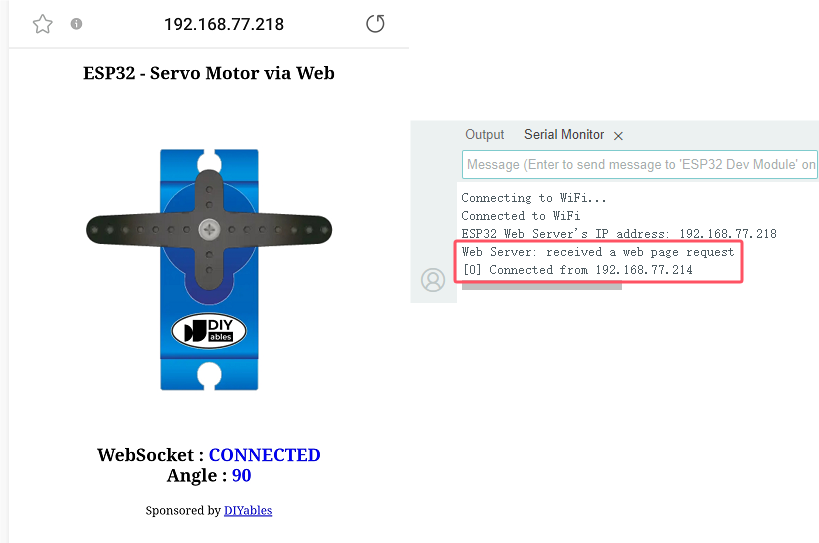

7\. 您可以通过 Web 界面控制舵机的角度，即：手接触智能手机 Web 界面上的舵机轴，转动舵机轴，Angle 值会随着舵机轴转动而变化；同时串口监视器打印舵机转动的角度值，外接的舵机也会相应的转动。


---

**7. 代码说明：**

实验代码中已经包含逐行解释，请阅读代码中的注释！这里就不重复。

---

### 第15课 通过Web服务器控制步进电机正反转

---

**1. 实验介绍：**

前面的项目中已经学习了使用ESP32创建Web服务器来远程控制舵机转动。那么，在本项目中将学习如何使用ESP32创建Web服务器来远程控制步进电机。Web服务器显示一个带有HTML表单的网页，该表单允许您选择步进电机移动的方向和步数。 

---

**2. 工作原理：**


在网页上，您可以选择步进电机 **顺时针** 还是 **逆时针** 转动。这些是 **单选按钮** 。单选按钮通常显示为小圆圈，选中后会填充或突出显示这些圆圈。您一次只能在给定组中选择一个单选按钮。

有一个 number 类型的输入字段 ，用户可以在其中输入 **数字** - 在本例中为 **步数**。

最后，一个名为 GO！按钮，类型为 submit ，通过HTTP POST请求将数据发送到服务器。

---

**3. 实验组件：**

|  ||||
| ------------------------ | ------------------------ | ---------------------------- |---------------------------- |
|ESP32 主控板| ULN2003步进电机驱动板 x1| 步进电机 x1 |电池盒 x1|
|||  |
|公对母杜邦线若干|AA电池(<span style="color: rgb(255, 76, 65);">自备</span>) x6| Micro USB数据线 x1 |  |

---

**4. 接线图：**

**原理图：**


**实物接线图：**


---

**4. 实验代码：**

<span style="color: rgb(255, 76, 65);">特别注意：</span>在上传实验代码之前，你需要先将实验代码中的Wifi名称(<span style="color: rgb(255, 76, 65);">**REPLACE_WITH_YOUR_SSID**</span>)和Wifi密码(<span style="color: rgb(255, 76, 65);">**REPLACE_WITH_YOUR_PASSWORD**</span>)改成你自己的Wifi名称和Wifi密码。


```c++
/*
 * 名称   : ESP32 Web Server Control Stepper Motor
 * 功能   : ESP32 Web服务器 控制步进电机 
 * 编译IDE：ARDUINO 2.3.3
 * 作者   : https://www.keyestudio.com/
*/
#include <Arduino.h>
#include <WiFi.h>
#include <AsyncTCP.h>
#include <ESPAsyncWebServer.h>
#include <Stepper.h>

// Stepper Motor Settings
const int stepsPerRevolution = 2048;  // change this to fit the number of steps per revolution
#define IN1 16
#define IN2 17
#define IN3 18
#define IN4 19
Stepper myStepper(stepsPerRevolution, IN1, IN3, IN2, IN4);

/*Put your SSID & Password*/
const char* ssid = "ChinaNet_2.4G";    // Enter SSID here
const char* password = "ChinaNet@233"; // Enter Password here

// Create AsyncWebServer object on port 80
AsyncWebServer server(80);

// Search for parameters in HTTP POST request
const char* PARAM_INPUT_1 = "direction";
const char* PARAM_INPUT_2 = "steps";

// Variables to save values from HTML form
String direction;
String steps;

// Variable to detect whether a new request occurred
bool newRequest = false;

// HTML to build the web page
const char index_html[] PROGMEM = R"rawliteral(
<!DOCTYPE html>
<html>
<head>
  <title>Stepper Motor</title>
  <meta name="viewport" content="width=device-width, initial-scale=1">
</head>
<body>
  <h1>Stepper Motor Control</h1>
    <form action="/" method="POST">
      <input type="radio" name="direction" value="CW" checked>
      <label for="CW">Clockwise</label>
      <input type="radio" name="direction" value="CCW">
      <label for="CW">Counterclockwise</label><br><br><br>
      <label for="steps">Number of steps:</label>
      <input type="number" name="steps">
      <input type="submit" value="GO!">
    </form>
</body>
</html>
)rawliteral";

// Initialize WiFi
void initWiFi() {
  WiFi.mode(WIFI_STA);
  WiFi.begin(ssid, password);
  Serial.print("Connecting to WiFi ..");
  while (WiFi.status() != WL_CONNECTED) {
    Serial.print('.');
    delay(1000);
  }
  Serial.println(WiFi.localIP());
}


void setup() {
  Serial.begin(115200);

  initWiFi();

  myStepper.setSpeed(5);

  // Web Server Root URL
  server.on("/", HTTP_GET, [](AsyncWebServerRequest *request){
    request->send(200, "text/html", index_html);
  });
  
  // Handle request (form)
  server.on("/", HTTP_POST, [](AsyncWebServerRequest *request) {
    int params = request->params();
    for(int i=0;i<params;i++){
      const AsyncWebParameter* p = request->getParam(i);
      if(p->isPost()){
        // HTTP POST input1 value (direction)
        if (p->name() == PARAM_INPUT_1) {
          direction = p->value().c_str();
          Serial.print("Direction set to: ");
          Serial.println(direction);
        }
        // HTTP POST input2 value (steps)
        if (p->name() == PARAM_INPUT_2) {
          steps = p->value().c_str();
          Serial.print("Number of steps set to: ");
          Serial.println(steps);
        }
      }
    }
    request->send(200, "text/html", index_html);
    newRequest = true;
  });

  server.begin();
}

void loop() {
  // Check if there was a new request and move the stepper accordingly
  if (newRequest){
    if (direction == "CW"){
      // Spin the stepper clockwise direction
      myStepper.step(-steps.toInt());
    }
    else{
      // Spin the stepper counterclockwise direction
      myStepper.step(steps.toInt());
    }
    newRequest = false;
  }
}
```

**5. 实验结果：**

其操作步骤如下：

1\. 打开位于 <span style="color: rgb(255, 76, 65);">..\Codes\Arduino_C_Code\IoT_C_Code\15 Control Stepper Motor Via Web</span> 路径下的 <span style="color: rgb(255, 76, 65);">Control_Stepper_Motor_Via_Web.ino</span> 文件，或将上面的实验代码复制粘贴到 Arduino IDE 中。

2\. 如果你还没有修改实验代码中的Wifi名称和Wifi密码，那么你需要将实验代码中的Wifi名称(<span style="color: rgb(255, 76, 65);">**REPLACE_WITH_YOUR_SSID**</span>)和Wifi密码(<span style="color: rgb(255, 76, 65);">**REPLACE_WITH_YOUR_PASSWORD**</span>)改成你自己的Wifi名称和Wifi密码。

<span style="background: rgb(255, 251, 0);"><span style="color: rgb(255, 76, 0);">**特别注意：**<span style="color: rgb(255, 76, 0);"></span>确保计算机网络，手机/平板的网络，ESP32主板，路由器，实验代码中输入的WiFi名称和WiFi密码都必须是在同一个局域网（WiFi）下。</span></span>

3\. 检查是否添加了代码中涉及到的库文件。如果已经添加好了所有的库文件，这一步就跳过；如果还没有，请跳转到 **[添加 Arduino 库](https://docs.keyestudio.com/projects/KS5020/en/latest/docs/Arduino_C.html#arduino)** ，参照说明添加库文件。

4\. 选择正确的主控板板型（ESP32 Dev Module）和 适当的串口端口（COMxx），然后单击按钮上传代码。


5\. 成功上传代码后，打开串口监视器，设置波特率为 **115200** ，串口监视器打印出接收到的对应的 <span style="color: rgb(255, 76, 65);">**IP**</span> 地址。


<span style="background: rgb(255, 127, 170);">**提醒：假如串口监视器没打印 IP 地址，则需要按下ESP32主控板上的复位键**。</span>


6\. 接着打开智能手机或平板的浏览器，在下图所示的浏览器搜索框里输入串口监视器窗口打印的WIFI IP地址，接着点击 “**search**” 。


7\. 几秒钟后进入WiFi网页，说明ESP32主板上的ESP32模块成功连接上了WiFi。 WiFi网页显示如下图所示内容。


8\. 选中 <span style="color: rgb(255, 76, 65);">**Clockwise**</span> ，然后在文本框中输入 <span style="color: rgb(255, 76, 65);">**2000**</span> ，再单击 “<span style="color: rgb(255, 76, 65);">**GO!**</span>按钮”。看到的现象是：步进电机顺时针转动。


9\. 选中 <span style="color: rgb(255, 76, 65);">**Counterclockwise**</span> ，然后在文本框中输入 <span style="color: rgb(255, 76, 65);">**2000**</span> ，再单击 “<span style="color: rgb(255, 76, 65);">**GO!**</span>按钮”。看到的现象是：步进电机逆时针转动。


---

**6. 代码说明：**

1\. 单选按钮


- 单选按钮定义如下：

```c++
<input type="radio">
```
- 对于这个项目，需要两个单选按钮，并且一次只能选择一个。因此，可以创建一组单选按钮。为此，单选按钮必须共享相同的名称(name 属性的值 - 在本例中为 direction)。

```c++
<input type="radio" name="direction">
```
- 还需要 value 属性，该属性为每个单选按钮指定唯一值。此值对用户不可见，但当您单击提交按钮以标识选择了哪个按钮时，它会发送到服务器。在这个示例代码中，创建了一个值为 CW (顺时针转动)和另一个 CCW (逆时针转动)的 。

```c++
<input type="radio" name="direction" value="CW">
```
```c++
<input type="radio" name="direction" value="CCW">
```
- 如果希望默认选择一个单选按钮，则可以添加 <span style="color: rgb(255, 76, 65);">checked</span> 关键字。在这个示例中，默认情况下选择**顺时针**方向转动。

```c++
<input type="radio" name="direction" value="CW" checked>
```
- 单选按钮和相应的标签是这样的。

```c++
<input type="radio" name="direction" value="CW" checked>
<label for="CW">Clockwise</label>

<input type="radio" name="direction" value="CCW">
<label for="CW">Counterclockwise</label><br><br><br>
```
2\. 输入字段（步数）


- 需要一个输入字段，用户可在其中输入步数 — 数字类型的输入字段 number。name <span style="color: rgb(255, 76, 65);">name</span> 属性允许我们确定用户在哪个输入字段中输入了数据。

```c++ 
<input type="number" name="steps">
```
3\. 提交按钮

要填写表单，还需要一个提交按钮。提交按钮是 submit 类型的输入 <span style="color: rgb(255, 76, 65);">submit</span> 。单击此按钮时，表单的数据将发送到服务器（ESP32 主控板）。value <span style="color: rgb(255, 76, 65);">value</span> 属性指定要在按钮上显示的文本。 

```c++
<input type="submit" value="GO!">
```
- 如果您选择顺时针方向并输入 2000 步，则客户端将向 ESP32 发出以下请求：

```c++
POST /
Host: localhost
direction=CW&steps=2000
```
ESP 接收此请求，并可以从请求主体中获取方向和步骤数。


---

### 第16课 LM35检测的温度在Web服务器上显示

---

**1. 实验介绍：**

在本教程中，我们将探索将ESP32编程为web服务器的过程，允许您通过web服务器访问温度数据。使用LM35温度传感器，你可以很容易地通过使用您的智能手机或计算机访问ESP32所提供的网页检查当前的温度。

---

**2. 元件知识：**
    
**如何运作:**

以下是它是如何工作的简要概述：

- ESP32被编程为Web服务器。
- 您可以在智能手机或PC上的Web浏览器中输入ESP32的iP地址。
- ESP32响应来自Web浏览器的请求，形成LM35温度传感器读取温度的网页。

---

**3. 快速说明：**

网页的内容(HTML、CSS、JavaScript)单独存储在 index.h 文件中。因此，我们将在 Arduino IDE 上有两个代码文件:

- 一个<span style="color: rgb(255, 76, 65);">.ino</span> 文件，即 ESP32 代码，用于创建 Web 服务器和 Websocket 服务器
- 一个<span style="color: rgb(255, 76, 65);">.h</span> 文件，其中包含网页的内容。

---

**4. 实验组件：**

|  |||
| ------------------------ | ------------------------ | ---------------------------- |
| ESP32主控板 x1 | LM35 x1  |面包板 x1 |  
||||
|面包板跳线若干 | USB线 x1 |移动通信设备 x1|

---

**5. 接线图：**

**原理图：**


**实物接线图：**


---

**6. 实验代码：**

<span style="color: rgb(255, 76, 65);">特别注意：</span>在上传实验代码之前，你需要先将实验代码中的Wifi名称(<span style="color: rgb(255, 76, 65);">**REPLACE_WITH_YOUR_SSID**</span>)和Wifi密码(<span style="color: rgb(255, 76, 65);">**REPLACE_WITH_YOUR_PASSWORD**</span>)改成你自己的Wifi名称和Wifi密码。


```c++
/*  
 * 名称   : Measure Temperature Via Web
 * 功能   : LM35检测的温度在Web服务器上显示
 * 编译IDE：ARDUINO 2.3.2
 * 作者   : https://www.keyestudio.com/
*/
// Import required libraries
#include <WiFi.h>
#include <ESPAsyncWebServer.h>
#include <WebSocketsServer.h>
#include "index.h"

const int lm35Pin = 36;   // ESP32 pin GPIO36 connected to LM35 sensor's DATA pin

/*Put your SSID & Password*/
const char* ssid = "ChinaNet_2.4G";    // Enter SSID here
const char* password = "ChinaNet@233"; // Enter Password here

AsyncWebServer server(80);

void setup() {
  Serial.begin(115200);

  pinMode(lm35Pin, INPUT);  //Set the lm35Pin to the input mode
  
  // Connect to Wi-Fi
  WiFi.begin(ssid, password);
  while (WiFi.status() != WL_CONNECTED) {
    delay(1000);
    Serial.println("Connecting to WiFi...");
  }
  Serial.println("Connected to WiFi");

  // Print the ESP32's IP address
  Serial.print("ESP32 Web Server's IP address: ");
  Serial.println(WiFi.localIP());

   // Serve the HTML page from the file
  server.on("/", HTTP_GET, [](AsyncWebServerRequest* request) {
    Serial.println("ESP32 Web Server: New request received:");  // for debugging
    Serial.println("GET /");                                    // for debugging

    request->send(200, "text/html", webpage); // webpage is from index.h file
  });                                    // for debugging


  // Define a route to get the temperature data
  server.on("/temperature", HTTP_GET, [](AsyncWebServerRequest* request) {
    Serial.println("ESP32 Web Server: New request received:");  // for debugging
    Serial.println("GET /temperature");

    long value = analogRead(lm35Pin); //Read analog input
    // get temperature from sensor
    // Voltage and Celsius conversion:
    // 0.0012210012210012 = 5.0/4095, 0~5.0V corresponds to the analog port reading 0~4095, and every 10 millivolts corresponds to 1℃
    float temperature = (value * 0.0012210012210012 * 100);
    // Format the temperature with two decimal places
    String temperatureStr = String(temperature, 2);
    request->send(200, "text/plain", temperatureStr);
  });

  // Start the server
  server.begin();
}

void loop() {
  // Your code here
}
```
---

**7. 创建index.h文件：**

如果是直接打开位于 <span style="color: rgb(255, 76, 65);">..\Codes\Arduino_C_Code\IoT_C_Code\16 Measure Temperature Via Web</span> 路径下的 <span style="color: rgb(255, 76, 65);">Measure_Temperature_Via_Web.ino</span> 文件，则不需要另外创建 <span style="color: rgb(0, 0, 255);">index.h</span> 文件。因为代码文件中已经包含有。


如果是将上面的实验代码直接复制粘贴到 Arduino IDE 中，那么需要创建 <span style="color: rgb(0, 0, 255);">index.h</span> 文件，其创建步骤如下：

- 1\. 单击串行监视器图标下方的按钮并选择 “**New Tab**” ，或使用 **ctrl+shift+N** 键。


- 2\. 在出现的页面文本框中输入 <span style="color: rgb(0, 0, 255);">index.h</span> ，然后单击 “**OK**” 按钮。


- 3\. 复制下面的代码并将其粘贴到文件 <span style="color: rgb(0, 0, 255);">index.h</span> 。

```c++
#ifndef WEBPAGE_H
#define WEBPAGE_H

const char* webpage = R"=====(
<!DOCTYPE html>
<html>
<head>
<title>ESP32 - Web Temperature</title>
<meta name="viewport" content="width=device-width, initial-scale=0.7, maximum-scale=0.7">
<meta charset="utf-8">
<link rel="icon" href="https://diyables.io/images/page/diyables.svg">
<style>
body { font-family: "Georgia"; text-align: center; font-size: width/2pt;}
h1 { font-weight: bold; font-size: width/2pt;}
h2 { font-weight: bold; font-size: width/2pt;}
button { font-weight: bold; font-size: width/2pt;}
</style>
<script>
var cvs_width = 200, cvs_height = 450;

function init() {
  var canvas = document.getElementById("cvs");
  canvas.width = cvs_width;
  canvas.height = cvs_height + 50;

  var ctx = canvas.getContext("2d");

  ctx.translate(cvs_width/2, cvs_height - 80);

  fetchTemperature();
  setInterval(fetchTemperature, 4000); // Update temperature every 4 seconds

}

function fetchTemperature() {
  fetch("/temperature")
    .then(response => response.text())
    .then(data => {update_view(data);});
}


function update_view(temp) {
  var canvas = document.getElementById("cvs");
  var ctx = canvas.getContext("2d");

  var radius = 70;
  var offset = 5;
  var width = 45;
  var height = 330;

  ctx.clearRect(-cvs_width/2, -cvs_height + 80, cvs_width, cvs_height + 50);
  ctx.strokeStyle="blue";
  ctx.fillStyle="blue";

  //5-step Degree
  var x = -width/2;
  ctx.lineWidth=2;
  for (var i = 0; i <= 100; i+=5) {
    var y = -(height - radius)*i/100 - radius - 5;
    ctx.beginPath();
    ctx.lineTo(x, y);
    ctx.lineTo(x - 20, y);
    ctx.stroke();
  }

  //20-step Degree
  ctx.lineWidth=5;
  for (var i = 0; i <= 100; i+=20) {
    var y = -(height - radius)*i/100 - radius - 5;
    ctx.beginPath();
    ctx.lineTo(x, y);
    ctx.lineTo(x - 25, y);
    ctx.stroke();

    ctx.font="20px Georgia";
    ctx.textBaseline="middle"; 
    ctx.textAlign="right";
    ctx.fillText(i.toString(), x - 35, y);
  }

  // shape
  ctx.lineWidth=16;
  ctx.beginPath();
  ctx.arc(0, 0, radius, 0, 2 * Math.PI);
  ctx.stroke();

  ctx.beginPath();
  ctx.rect(-width/2, -height, width, height); 
  ctx.stroke();

  ctx.beginPath();
  ctx.arc(0, -height, width/2, 0, 2 * Math.PI);
  ctx.stroke();

  ctx.fillStyle="#e6e6ff";
  ctx.beginPath();
  ctx.arc(0, 0, radius, 0, 2 * Math.PI);
  ctx.fill();

  ctx.beginPath();
  ctx.rect(-width/2, -height, width, height); 
  ctx.fill();

  ctx.beginPath();
  ctx.arc(0, -height, width/2, 0, 2 * Math.PI);
  ctx.fill();
  ctx.fillStyle="#ff1a1a";

  ctx.beginPath();
  ctx.arc(0, 0, radius - offset, 0, 2 * Math.PI);
  ctx.fill();

  temp = Math.round(temp * 100) / 100;
  var y = (height - radius)*temp/100.0 + radius + 5; 
  ctx.beginPath();
  ctx.rect(-width/2 + offset, -y, width - 2*offset, y); 
  ctx.fill();

  ctx.fillStyle="red";
  ctx.font="bold 34px Georgia";
  ctx.textBaseline="middle"; 
  ctx.textAlign="center";
  ctx.fillText(temp.toString() + "°C", 0, 100);
}

window.onload = init;
</script>
</head>

<body>
<h1>ESP32 - Web Temperature</h1>
<canvas id="cvs"></canvas>
</body>
</html>
)=====";

#endif
```

4\. 现在在文件夹中有了这两个代码文件：<span style="color: rgb(255, 76, 65);">Web_Plotter.ino</span> 和 <span style="color: rgb(0, 0, 255);">index.h</span> 。

---

**6. 实验结果：**

其操作步骤如下：

1\. 如果你还没有修改实验代码中的Wifi名称和Wifi密码，那么你需要将实验代码中的Wifi名称(<span style="color: rgb(255, 76, 65);">**REPLACE_WITH_YOUR_SSID**</span>)和Wifi密码(<span style="color: rgb(255, 76, 65);">**REPLACE_WITH_YOUR_PASSWORD**</span>)改成你自己的Wifi名称和Wifi密码。

<span style="background: rgb(255, 251, 0);"><span style="color: rgb(255, 76, 0);">**特别注意：**<span style="color: rgb(255, 76, 0);"></span>确保计算机网络，手机/平板的网络，ESP32主板，路由器，实验代码中输入的WiFi名称和WiFi密码都必须是在同一个局域网（WiFi）下。</span></span>

2\. 检查是否添加了代码中涉及到的库文件。如果已经添加好了所有的库文件，这一步就跳过；如果还没有，请跳转到 **[添加 Arduino 库](https://docs.keyestudio.com/projects/KS5020/en/latest/docs/Arduino_C.html#arduino)** ，参照说明添加库文件。

3\. 选择正确的主控板板型（ESP32 Dev Module）和 适当的串口端口（COMxx），然后单击按钮上传代码。


4\. 成功上传代码后，打开串口监视器，设置波特率为 **115200** ，串口监视器打印出接收到的对应的 <span style="color: rgb(255, 76, 65);">**IP**</span> 地址。


<span style="background: rgb(255, 127, 170);">**提醒：假如串口监视器没打印 IP 地址，则需要按下ESP32主控板上的复位键**。</span>


5\. 接着打开智能手机或平板的浏览器，在下图所示的浏览器搜索框里输入串口监视器窗口打印的WIFI IP地址，接着点击 “**search**” 。


6\. 几秒钟后进入WiFi网页，说明ESP32主板上的ESP32模块成功连接上了WiFi。 WiFi网页显示温度计和温度值，同时串口监视器打印相关信息。


7\. 不断地改变LM35温度传感器所处的外界环境中的温度，WiFi网页显示的温度值也会不断地变化。同时串口监视器打印相关信息。


---

**7. 代码说明：**

实验代码中已经包含逐行解释，请阅读代码中的注释！这里就不重复。

---

### 第17课 Web 服务器显示DHT11的温湿度值

---

**1. 实验介绍：**

您是否曾经希望可以随时使用智能手机、平板电脑或计算机来监控家中、冷却器或酒窖的温度和湿度？那么这个 IoT 项目可能是一个很好的起点！

本项目使用 ESP32 作为控制设备，连接到现有的 WiFi 网络并创建一个 Web 服务器。当设备连接到此 Web 服务器时，ESP32 将从 DHT11 传感器读取温度和相对湿度，并将其发送到移动通信设备的 Web 浏览器中，界面美观！ 

---

**2. 实验组件：**

|  ||||
| ------------------------ | ------------------------ | ---------------------------- |
|ESP32 主控板|DHT11温湿度传感器 x1|面包板跳线若干| Micro USB数据线 x1|  
||||
|面包板 x1|Micro USB数据线 x1|移动通信设备 x1|

---

**3. 接线图：**

**原理图：**


**实物接线图：**


---

**4. 实验代码：**

<span style="color: rgb(255, 76, 65);">特别注意：</span>在上传实验代码之前，你需要先将实验代码中的Wifi名称(<span style="color: rgb(255, 76, 65);">**REPLACE_WITH_YOUR_SSID**</span>)和Wifi密码(<span style="color: rgb(255, 76, 65);">**REPLACE_WITH_YOUR_PASSWORD**</span>)改成你自己的Wifi名称和Wifi密码。


```c++
/*  
 * 名称   : Display Values of XHT11 Using Web Server
 * 功能   : 将XHT11与ESP32相连接并使用Web服务器显示值 
 * 编译IDE：ARDUINO 2.3.3
 * 作者   : https://www.keyestudio.com/ 
*/
#include <WiFi.h>
#include <WebServer.h>
#include "DHT.h"

// Uncomment one of the lines below for whatever DHT sensor type you're using!
#define DHTTYPE DHT11   // DHT 11

/*Put your SSID & Password*/
const char* ssid = "ChinaNet_2.4G";    // Enter SSID here
const char* password = "ChinaNet@233"; // Enter Password here

WebServer server(80);

// Set the 1O13 connected to the xHT11 data pin
uint8_t DHTPin = 13;  
               
// Initialize DHT sensor.
DHT dht(DHTPin, DHTTYPE);                

float Temperature;
float Humidity;
 
void setup() {
  Serial.begin(115200);
  delay(100);
  
  pinMode(DHTPin, INPUT);

  dht.begin();              

  Serial.println("Connecting to ");
  Serial.println(ssid);

  //connect to your local wi-fi network
  WiFi.begin(ssid, password);

  //check wi-fi is connected to wi-fi network
  while (WiFi.status() != WL_CONNECTED) {
  delay(1000);
  Serial.print(".");
  }
  Serial.println("");
  Serial.println("WiFi connected..!");
  Serial.print("Got IP: ");  Serial.println(WiFi.localIP());

  server.on("/", handle_OnConnect);
  server.onNotFound(handle_NotFound);

  server.begin();
  Serial.println("HTTP server started");

}
void loop() {
  
  server.handleClient();
  
}

void handle_OnConnect() {

  Temperature = dht.readTemperature(); // Gets the values of the temperature
  Humidity = dht.readHumidity(); // Gets the values of the humidity 
  server.send(200, "text/html", SendHTML(Temperature, Humidity)); 
}

void handle_NotFound(){
  server.send(404, "text/plain", "Not found");
}

String SendHTML(float TempCstat,float Humiditystat){
  String ptr = "<!DOCTYPE html> <html>\n";
  ptr +="<head><meta name=\"viewport\" content=\"width=device-width, initial-scale=1.0, user-scalable=no\">\n";
  ptr +="<link href=\"https://fonts.googleapis.com/css?family=Open+Sans:300,400,600\" rel=\"stylesheet\">\n";
  ptr +="<title>ESP32 Weather Report</title>\n";
  ptr +="<style>html { font-family: 'Open Sans', sans-serif; display: block; margin: 0px auto; text-align: center;color: #333333;}\n";
  ptr +="body{margin-top: 50px;}\n";
  ptr +="h1 {margin: 50px auto 30px;}\n";
  ptr +=".side-by-side{display: inline-block;vertical-align: middle;position: relative;}\n";
  ptr +=".humidity-icon{background-color: #3498db;width: 30px;height: 30px;border-radius: 50%;line-height: 36px;}\n";
  ptr +=".humidity-text{font-weight: 600;padding-left: 15px;font-size: 19px;width: 160px;text-align: left;}\n";
  ptr +=".humidity{font-weight: 300;font-size: 60px;color: #3498db;}\n";
  ptr +=".temperature-icon{background-color: #f39c12;width: 30px;height: 30px;border-radius: 50%;line-height: 40px;}\n";
  ptr +=".temperature-text{font-weight: 600;padding-left: 15px;font-size: 19px;width: 160px;text-align: left;}\n";
  ptr +=".temperature{font-weight: 300;font-size: 60px;color: #f39c12;}\n";
  ptr +=".superscript{font-size: 17px;font-weight: 600;position: absolute;right: -20px;top: 15px;}\n";
  ptr +=".data{padding: 10px;}\n";
  ptr +="</style>\n";
  ptr +="</head>\n";
  ptr +="<body>\n";
  ptr +="<div id=\"webpage\">\n";
  ptr +="<h1>ESP32 Weather Report</h1>\n";
  ptr +="<div class=\"data\">\n";

  ptr +="<div class=\"side-by-side temperature-icon\">\n";
  ptr +="<svg version=\"1.1\" id=\"Layer_1\" xmlns=\"http://www.w3.org/2000/svg\" xmlns:xlink=\"http://www.w3.org/1999/xlink\" x=\"0px\" y=\"0px\"\n";
  ptr +="width=\"9.915px\" height=\"22px\" viewBox=\"0 0 9.915 22\" enable-background=\"new 0 0 9.915 22\" xml:space=\"preserve\">\n";
  ptr +="<path fill=\"#FFFFFF\" d=\"M3.498,0.53c0.377-0.331,0.877-0.501,1.374-0.527C5.697-0.04,6.522,0.421,6.924,1.142\n";
  ptr +="c0.237,0.399,0.315,0.871,0.311,1.33C7.229,5.856,7.245,9.24,7.227,12.625c1.019,0.539,1.855,1.424,2.301,2.491\n";
  ptr +="c0.491,1.163,0.518,2.514,0.062,3.693c-0.414,1.102-1.24,2.038-2.276,2.594c-1.056,0.583-2.331,0.743-3.501,0.463\n";
  ptr +="c-1.417-0.323-2.659-1.314-3.3-2.617C0.014,18.26-0.115,17.104,0.1,16.022c0.296-1.443,1.274-2.717,2.58-3.394\n";
  ptr +="c0.013-3.44,0-6.881,0.007-10.322C2.674,1.634,2.974,0.955,3.498,0.53z\"/>\n";
  ptr +="</svg>\n";
  ptr +="</div>\n";

  ptr +="<div class=\"side-by-side temperature-text\">Temperature</div>\n";
  ptr +="<div class=\"side-by-side temperature\">";
  ptr +=(int)TempCstat;
  ptr +="<span class=\"superscript\">'C</span></div>\n";
  ptr +="</div>\n";
  ptr +="<div class=\"data\">\n";
  ptr +="<div class=\"side-by-side humidity-icon\">\n";
  ptr +="<svg version=\"1.1\" id=\"Layer_2\" xmlns=\"http://www.w3.org/2000/svg\" xmlns:xlink=\"http://www.w3.org/1999/xlink\" x=\"0px\" y=\"0px\"\n\"; width=\"12px\" height=\"17.955px\" viewBox=\"0 0 13 17.955\" enable-background=\"new 0 0 13 17.955\" xml:space=\"preserve\">\n";
  ptr +="<path fill=\"#FFFFFF\" d=\"M1.819,6.217C3.139,4.064,6.5,0,6.5,0s3.363,4.064,4.681,6.217c1.793,2.926,2.133,5.05,1.571,7.057\n";
  ptr +="c-0.438,1.574-2.264,4.681-6.252,4.681c-3.988,0-5.813-3.107-6.252-4.681C-0.313,11.267,0.026,9.143,1.819,6.217\"></path>\n";
  ptr +="</svg>\n";
  ptr +="</div>\n";
  ptr +="<div class=\"side-by-side humidity-text\">Humidity</div>\n";
  ptr +="<div class=\"side-by-side humidity\">";
  ptr +=(int)Humiditystat;
  ptr +="<span class=\"superscript\"> % </span></div>\n";
  ptr +="</div>\n";

  ptr +="</div>\n";
  ptr +="</body>\n";
  ptr +="</html>\n";
  return ptr;
  }
```

**5. 实验结果：**

其操作步骤如下：

1\. 打开位于 <span style="color: rgb(255, 76, 65);">..\Codes\Arduino_C_Code\IoT_C_Code\17 Display Values of XHT11 Using Web Server</span> 文件夹中的 <span style="color: rgb(255, 76, 65);">Display_Values_of_XHT11_Using_Web_Server.ino</span> 文件，或将上面的实验代码复制粘贴到 Arduino IDE 中。

2\. 如果你还没有修改实验代码中的Wifi名称和Wifi密码，那么你需要将实验代码中的Wifi名称(<span style="color: rgb(255, 76, 65);">**REPLACE_WITH_YOUR_SSID**</span>)和Wifi密码(<span style="color: rgb(255, 76, 65);">**REPLACE_WITH_YOUR_PASSWORD**</span>)改成你自己的Wifi名称和Wifi密码。

<span style="background: rgb(255, 251, 0);"><span style="color: rgb(255, 76, 0);">**特别注意：**<span style="color: rgb(255, 76, 0);"></span>确保计算机网络，手机/平板的网络，ESP32主板，路由器，实验代码中输入的WiFi名称和WiFi密码都必须是在同一个局域网（WiFi）下。</span></span>

3\. 检查是否添加了代码中涉及到的库文件。如果已经添加好了所有的库文件，这一步就跳过；如果还没有，请跳转到 **[添加 Arduino 库](https://docs.keyestudio.com/projects/KS5020/en/latest/docs/Arduino_C.html#arduino)** ，参照说明添加库文件。

4\. 选择正确的主控板板型（ESP32 Dev Module）和 适当的串口端口（COMxx），然后单击按钮上传代码。


5\. 成功上传代码后，打开串口监视器，设置波特率为 **115200** ，串口监视器打印出接收到的对应的 <span style="color: rgb(255, 76, 65);">**IP**</span> 地址。


<span style="background: rgb(255, 127, 170);">**提醒：假如串口监视器没打印 IP 地址，则需要按下ESP32主控板上的复位键**。</span>


6\. 接着打开智能手机或平板的浏览器，在下图所示的浏览器搜索框里输入串口监视器窗口打印的WIFI IP地址，接着点击 “**search**” 。


7\. 几秒钟后进入WiFi网页，说明ESP32主板上的ESP32模块成功连接上了WiFi。 WiFi网页显示如下图所示内容。


8\. 改变DHT11温湿度传感器所处环境中的温度和湿度，单击WiFi网页页面上的 “” 按钮刷新页面。温度值和湿度值会发生变化。


---

**6. 代码说明：**

让我们一步一步地分解代码：

- 首先包括 <span style="color: rgb(255, 76, 65);">WiFi.h</span> 库，该库包含我们用于连接到网络的 ESP32 特定方法；<span style="color: rgb(255, 76, 65);">WebServer.h</span> 库，也包含一些方法，这些方法将帮助我们配置服务器和处理传入的HTTP请求。最后，包括 DHT.h 库。

```c++
  #include <WiFi.h>
  #include <WebServer.h>
  #include "DHT.h"
```
- 指定使用的 DHT 传感器的类型。

```c++
  #define DHTTYPE DHT11   // DHT 11
```
- 由于我们将ESP32 Web服务器配置为Station模式，它将创建自己的WiFi网络。因此，我们需要设置SSID和Password。

```c++
/*REPLACE WITH YOUR NETWORK CREDENTIALS(Put your SSID & Password)*/
const char* ssid = "REPLACE_WITH_YOUR_SSID";  //Enter SSID here
const char* password = "REPLACE_WITH_YOUR_PASSWORD"; //Enter Password here
```
- 创建 <span style="color: rgb(255, 76, 65);">WebServer</span> 库的对象，以便可以访问它的函数。此对象的构造函数接受服务器将侦听的端口作为参数。由于HTTP默认使用端口80，因此将使用此值。这允许我们连接到服务器，而不需要在URL中指定端口。

```c++
  // declare an object of WebServer library
  WebServer server(80);
```
- 在传感器的 S 引脚所连接的 ESP32 上定义 GPIO 引脚号，并创建一个 DHT 对象。因此，我们可以访问 DHT 库特定的功能。

```c++
  // Set the 1O13 connected to the DHT11 data pin
  uint8_t DHTPin = 13;  
               
  // Initialize DHT sensor.
  DHT dht(DHTPin, DHTTYPE); 
```
- 设置了两个浮点变量：Temperature 和 Humidity。

```c++
  float Temperature;
  float Humidity;
```
- 在 <span style="color: rgb(255, 76, 65);">setup()</span> 函数中，配置我们的 Web 服务器。首先，我们建立一个串行连接以进行调试，并将 GPIO 引脚配置为 INPUT。我们还初始化 DHT 对象。

```c++ 
  Serial.begin(115200);
  delay(100);
  
  pinMode(DHTPin, INPUT);

  dht.begin(); 
```
- 当ESP32尝试连接到网络时，我们可以使用 <span style="color: rgb(255, 76, 65);">WiFi.status()</span> 函数来检查连接状态。

```c++
  //check wi-fi is connected to wi-fi network
  while (WiFi.status() != WL_CONNECTED) {
  delay(1000);
  Serial.print(".");
  }
```

- 一旦连接到网络，<span style="color: rgb(255, 76, 65);">WiFi.localIP()</span> 函数用于打印ESP32的IP地址

```c++
  Serial.println("");
  Serial.println("WiFi connected..!");
  Serial.print("Got IP: ");  Serial.println(WiFi.localIP());
```

- 为了处理传入的HTTP请求，我们必须指定在访问特定URL时应该执行哪些代码。为此，我们使用 <span style="color: rgb(255, 76, 65);">.on()</span> 方法。该方法接受两个参数：一个相对URL路径和访问该URL时要执行函数的名称。
例如，下面代码片段的第一行表明，当服务器接收到根(/)路径上的HTTP请求时，它将调用 <span style="color: rgb(255, 76, 65);">handle_OnConnect()</span> 函数。重要的是要注意指定的URL是一个相对路径。类似地，我们必须再指定四个URL来处理两个LED的两种状态。

```c++
  server.on("/", handle_OnConnect); 
  server.on("/led1on", handle_led1on);
  server.on("/led1off", handle_led1off);
  server.on("/led2on", handle_led2on);
  server.on("/led2off", handle_led2off);
```
- 如果客户端请求的URL没有使用 <span style="color: rgb(255, 76, 65);">server.on()</span> 指定，我们还没有指定服务器应该提供什么服务。它应该给出404错误（Page Not Found）作为响应。为此，我们使用 <span style="color: rgb(255, 76, 65);">server.onNotFound()</span> 方法。

```c++
  server.onNotFound(handle_NotFound);
```
- 为了启动服务器，我们调用服务器对象的begin()方法。

```c++
  server.begin();
  Serial.println("HTTP server started");
```

- 实际传入的HTTP请求在 <span style="color: rgb(255, 76, 65);">loop()</span> 函数中处理。为此，我们使用服务器对象的 <span style="color: rgb(255, 76, 65);">handleClient()</span> 方法。我们还根据请求改变led的状态。

```c++
void loop() {
  server.handleClient();
  if(LED1status)
  {digitalWrite(LED1pin, HIGH);}
  else
  {digitalWrite(LED1pin, LOW);}
  
  if(LED2status)
  {digitalWrite(LED2pin, HIGH);}
  else
  {digitalWrite(LED2pin, LOW);}
}
```

- 我们必须编写 <span style="color: rgb(255, 76, 65);">handle_OnConnect()</span> 函数，之前使用 <span style="color: rgb(255, 76, 65);">server.on</span> 将其附加到根（/）URL。我们通过将两个led的状态设置为LOW（led的初始状态）并将其打印在串行监视器上开始此功能。使用send方法来响应HTTP请求。尽管可以使用许多不同的参数调用该方法，但最简单的形式需要HTTP响应代码、内容类型和内容。传递给send方法的第一个参数是代码200（HTTP状态码之一），它对应于OK响应。然后将内容类型指定为 “**text/html**”，最后传递 <span style="color: rgb(255, 76, 65);">SendHTML()</span> 自定义函数，该函数生成带有LED状态的动态html页面。

```c++
void handle_OnConnect() {
  LED1status = LOW;
  LED2status = LOW;
  Serial.println("GPIO17 Status: OFF | GPIO13 Status: OFF");
  server.send(200, "text/html", SendHTML(LED1status,LED2status)); 
}
```
- 编写了五个函数来处理LED开/关请求和404错误页面。

```c++
void handle_led1on() {
  LED1status = HIGH;
  Serial.println("GPIO17 Status: ON");
  server.send(200, "text/html", SendHTML(true,LED2status)); 
}

void handle_led1off() {
  LED1status = LOW;
  Serial.println("GPIO17 Status: OFF");
  server.send(200, "text/html", SendHTML(false,LED2status)); 
}

void handle_led2on() {
  LED2status = HIGH;
  Serial.println("GPIO13 Status: ON");
  server.send(200, "text/html", SendHTML(LED1status,true)); 
}

void handle_led2off() {
  LED2status = LOW;
  Serial.println("GPIO13 Status: OFF");
  server.send(200, "text/html", SendHTML(LED1status,false)); 
}

void handle_NotFound(){
  server.send(404, "text/plain", "Not found");
}
```
- 显示HTML网页，当ESP32 Web服务器收到来自Web客户端的请求时，<span style="color: rgb(255, 76, 65);">SendHTML()</span> 函数就会生成一个Web页面。它只是将HTML代码连接到一个长字符串中，然后返回到我们前面讨论过的 <span style="color: rgb(255, 76, 65);">server.send()</span> 函数。该函数使用led的状态作为参数来动态生成HTML内容。你应该发送的第一个文本总是  **<!DOCTYPE> declaration**，这表明我们正在发送HTML代码。

```c++
String SendHTML(uint8_t led1stat,uint8_t led2stat){
  String ptr = "<!DOCTYPE html> <html>\n";
```
- **<meta> viewport element** 使网页响应，确保它在所有设备上看起来都很好。标题标签决定了页面的标题。

```c++
  ptr +="<head><meta name=\"viewport\" content=\"width=device-width, initial-scale=1.0, user-scalable=no\">\n";
  ptr +="<title>LED Control</title>\n";
```
- 设计网页样式，接下来我们使用 CSS 设计按钮和网页的整体外观。我们选择了Helvetica字体，并将显示的内容定义为行内块，居中对齐。

```c++
  ptr +="<style>html { font-family: Helvetica; display: inline-block; margin: 0px auto; text-align: center;}\n";
```
- 接下来的代码设置主体、H1、H3和p标记周围的颜色、字体和边距

```c++
  ptr +="body{margin-top: 50px;} h1 {color: #444444;margin: 50px auto 30px;} h3 {color: #444444;margin-bottom: 50px;}\n";
```
- 这些按钮还可以使用颜色、大小、边距等属性进行样式化。**:active selector** 在按钮被点击时改变按钮的外观。

```c++
  ptr +=".button {display: block;width: 80px;background-color: #3498db;border: none;color: white;padding: 13px 30px;text-decoration: none;font-size: 25px;margin: 0px auto 35px;cursor: pointer;border-radius: 4px;}\n";
  ptr +=".button-on {background-color: #3498db;}\n";
  ptr +=".button-on:active {background-color: #2980b9;}\n";
  ptr +=".button-off {background-color: #34495e;}\n";
  ptr +=".button-off:active {background-color: #2c3e50;}\n";
```
- 设置网页的标题。您可以将此文本更改为适合您的应用程序的任何内容。

```c++
  ptr +="<h1>ESP32 Web Server</h1>\n";
    ptr +="<h3>Using Station(STA) Mode</h3>\n";
```
- 显示按钮和相应的状态，if语句用于动态更新按钮和led的状态。

```c++
  if(led1stat)
  {ptr +="<p>LED1 Status: ON</p><a class=\"button button-off\" href=\"/led1off\">OFF</a>\n";}
  else
  {ptr +="<p>LED1 Status: OFF</p><a class=\"button button-on\" href=\"/led1on\">ON</a>\n";}

  if(led2stat)
  {ptr +="<p>LED2 Status: ON</p><a class=\"button button-off\" href=\"/led2off\">OFF</a>\n";}
  else
  {ptr +="<p>LED2 Status: OFF</p><a class=\"button button-on\" href=\"/led2on\">ON</a>\n";}
```
---

### 第18课 使用 ESP32 和 OLED 显示屏的互联网时钟

---

**1. 实验介绍：**

在前面的教程中，我们了解了关于ESP32 的 WiFi 功能 。ESP32 是一个 Wi-Fi 模块，是可以轻松连接到互联网，因此我们将使用 NTP（网络时间协议）和 UDP（用户数据报协议）通过 Wi-Fi 从互联网上获取时间。为了最大限度地减少硬件要求，我们将不使用时钟模块来制作 Internet 时钟。在构建 IoT 项目时，此 Internet 时钟非常有用。 

---

**2. 元件知识：**

**什么是 NTP ？**

**网络时间协议(NTP)**: 是一种网络协议，用于在系统和数据网络之间同步时间。NTP 框架依赖于 Internet Time 服务器。NTP 具有精确调整一天中的时间的算法。NTP 服务器具有使用 [UDP](https://www.lifewire.com/list-of-tcp-ports-and-udp-ports-818133) 端口 123 将时钟时间发送到客户端计算机的软件。因此，在这个项目中，我们使用 ESP32 从 NTP 服务器获取时间，并将其显示在 OLED 显示屏上。 


---

**3. 实验组件：**

|  ||||
| ------------------------ | ------------------------ | ---------------------------- |---------------------------- |
|ESP32主控板 x1|OLED x1| 母对母杜邦线若干|  USB线 x1|
  
---

**4. 接线图：**

**原理图：**


**实物接线图：**


---

**5. 实验代码：**

<span style="color: rgb(255, 76, 65);">特别注意：</span>在上传实验代码之前，你需要先将实验代码中的Wifi名称(<span style="color: rgb(255, 76, 65);">**REPLACE_WITH_YOUR_SSID**</span>)和Wifi密码(<span style="color: rgb(255, 76, 65);">**REPLACE_WITH_YOUR_PASSWORD**</span>)改成你自己的Wifi名称和Wifi密码。


<span style="color: rgb(255, 76, 65); background: rgb(255, 251, 0);">你还需要将实验代码中以下三个变量根据你所在国家/地区的时区来修改：</span>


- <span style="color: rgb(255, 76, 65);">NTP_OFFSET</span> 您所在国家/地区的时区，例如：印度现在的时间为 + 5:30 ，所以现在是 19800（5.5 × 3600）秒。
- <span style="color: rgb(255, 76, 65);">NTP_INTERVAL</span> 这是 NTP 更新时间所采用的时间间隔，是采用 60 ~ 64 秒，在这里是以 <span style="color: rgb(0, 209, 0);">60 秒</span> 为例。
- <span style="color: rgb(255, 76, 65);">NTP_ADDRESS</span> 是您所在国家/地区的 NTP 服务器。对于印度，您可以使用 “ <span style="color: rgb(255, 76, 65);">in.pool.ntp.org</span> ”。

```c++
/*
 * 名称   : RGB_LED
 * 功能   : RGB LED发出不同的颜色光
 * 编译IDE：ARDUINO 2.3.2
 * 作者   : https://www.keyestudio.com/ 
*/
int redpin = 11; //选择红色LED的引脚11.
int greenpin = 10; // 选择绿色LED的引脚10.
int bluepin = 9; // 选择蓝色LED的引脚9.

int val = 0; //定义变量val

void setup() {
  pinMode(redpin, OUTPUT);
  pinMode(greenpin, OUTPUT);
  pinMode(bluepin, OUTPUT);
  digitalWrite(redpin,LOW);
  digitalWrite(greenpin,LOW);
  digitalWrite(bluepin,LOW);
}

void loop() {
  for(val=255; val>0; val--){
    analogWrite(redpin,val);
    analogWrite(greenpin,(255 - val));
    analogWrite(bluepin,(128 - val));
    delay(0.001 * 1000);
  }
  for(val=0; val<255; val++){
    analogWrite(redpin,val);
    analogWrite(greenpin,(255 - val));
    analogWrite(bluepin,(128 - val));
    delay(0.001 * 1000);
  }
}

```
---

**5. 实验结果：**

其操作步骤如下：

1\. 打开位于 <span style="color: rgb(255, 76, 65);">..\Codes\Arduino_C_Code\IoT_C_Code\18 OLED Displays Internet Clock</span> 文件夹中的 <span style="color: rgb(255, 76, 65);">OLED_Displays_Internet_Clock.ino</span> 文件，或将上面的实验代码复制粘贴到 Arduino IDE 中。

2\. 如果你还没有修改实验代码中的Wifi名称和Wifi密码，那么你需要将实验代码中的Wifi名称(<span style="color: rgb(255, 76, 65);">**REPLACE_WITH_YOUR_SSID**</span>)和Wifi密码(<span style="color: rgb(255, 76, 65);">**REPLACE_WITH_YOUR_PASSWORD**</span>)改成你自己的Wifi名称和Wifi密码。

<span style="background: rgb(255, 251, 0);"><span style="color: rgb(255, 76, 0);">**特别注意：**<span style="color: rgb(255, 76, 0);"></span>确保计算机网络，手机/平板的网络，ESP32主板，路由器，实验代码中输入的WiFi名称和WiFi密码都必须是在同一个局域网（WiFi）下。</span></span>

3\. 检查是否添加了代码中涉及到的库文件。如果已经添加好了所有的库文件，这一步就跳过；如果还没有，请跳转到 **[添加 Arduino 库](https://docs.keyestudio.com/projects/KS5020/en/latest/docs/Arduino_C.html#arduino)** ，参照说明添加库文件。

4\. 选择正确的主控板板型（ESP32 Dev Module）和 适当的串口端口（COMxx），然后单击按钮上传代码。


5\. 成功上传代码后，打开串口监视器，设置波特率为 **115200** ，串口监视器打印出接收到的对应的 <span style="color: rgb(255, 76, 65);">**IP**</span> 地址。


<span style="background: rgb(255, 127, 170);">**提醒：假如串口监视器没打印 IP 地址，则需要按下ESP32主控板上的复位键**。</span>


6\. OLED显示屏显示了你的互联网时钟。

---

**6. 代码说明：**

- 包含了所有库并定义了用于输入 Wi-Fi 名称和密码的变量。

```c++
#include <WiFi.h>
#include <SPI.h>
#include <Adafruit_GFX.h>
#include <Adafruit_SSD1306.h>
#include <NTPClient.h>
#include <WiFiUdp.h>

/*REPLACE WITH YOUR NETWORK CREDENTIALS(Put your SSID & Password)*/
const char* ssid = "REPLACE_WITH_YOUR_SSID";  //Enter SSID here
const char* password = "REPLACE_WITH_YOUR_PASSWORD"; //Enter Password here
```
-  <span style="color: rgb(255, 76, 65);">NTPClient.h</span> 库用于连接时间服务器。它需要 NTP 服务器的时间并保持同步。<span style="color: rgb(255, 76, 65);">Hhre WiFiUdp.h</span> 库 用于发送和接收 UDP 消息。UDP 是一种从我们的系统向 NTP 服务器发送和接收短消息的协议。因此，要从 Internet 获取时间，我们必须在程序中为 NTP 定义三个变量。

   - <span style="color: rgb(255, 76, 65);">NTP_OFFSET</span> 您所在国家/地区的时区，例如：印度此时的为 +5:30 ，所以此时是 19800 秒。
   - <span style="color: rgb(255, 76, 65);">NTP_INTERVAL</span> 这是 NTP 更新时间所采用的时间间隔。这是 60 ~ 64 秒。
   - <span style="color: rgb(255, 76, 65);">NTP_ADDRESS</span> 是您所在国家/地区的 NTP 服务器。对于印度，您可以使用 “ <span style="color: rgb(255, 76, 65);">in.pool.ntp.org</span> ”。

```c++
#define NTP_OFFSET  19800 // In seconds 
#define NTP_INTERVAL 60 * 1000    // In miliseconds
#define NTP_ADDRESS  "1.asia.pool.ntp.org"
WiFiUDP ntpUDP;
NTPClient timeClient(ntpUDP, NTP_ADDRESS, NTP_OFFSET, NTP_INTERVAL);
```
- 在setup()函数中，初始化 Wi-Fi 设置以连接互联网。。

```c++
void setup(){
  display.begin();
  Serial.begin(115200);
  Serial.println();
  Serial.println();
  Serial.print("Connecting to ");
  Serial.println(ssid);
  WiFi.begin(ssid, password);
  while (WiFi.status() != WL_CONNECTED){
  delay(500);
  Serial.print(".");
  }
  Serial.println("");
  Serial.println("WiFi connected.");
  Serial.println("IP address: ");
  Serial.println(WiFi.localIP());
  timeClient.begin();
```
- 初始化显示函数以在 OLED 上显示时间。

```c++
display.begin(SSD1306_SWITCHCAPVCC, 0x3C); 
```
- 在 <span style="color: rgb(255, 76, 65);">loop()</span> 函数中，我们使用了 <span style="color: rgb(255, 76, 65);">timeClient.update()</span> ， 该函数以字符串的形式从 NTP 获取更新的时间并将其存储在 <span style="color: rgb(255, 76, 65);">formattedTime</span> 变量中。然后使用 <span style="color: rgb(255, 76, 65);">display.println()</span> 函数 。

```c++
void loop(){
  timeClient.update();
  String formattedTime = timeClient.getFormattedTime();
  // Serial.println(formattedTime);
  display.clearDisplay();
  display.setTextSize(2);
  display.setCursor(0, 0);
  display.println(formattedTime);
  display.display();   // write the buffer to the display
  delay(10);
  delay(100);
}
```
---

### 第19课 基于 Blynk 的入侵通知系统

---

**1. 实验介绍：**

本项目演示了一种使用人体红外传感器的简单家庭入侵检测系统。 当通过 Blynk 应用程序将系统设置为“离开”模式时，人体红外传感器会监控运动。检测到的任何移动都会在 Blynk 应用程序上触发通知，提醒用户有潜在的入侵。

---

**2. 实验组件**

|   ||||
| ------------------------ | ------------------------ | ---------------------------- |---------------------------- |
|ESP32 主控板| NPN型三极管(S8050) x1| 有源蜂鸣器 x1 | 1kΩ电阻 x1 |
||| ||
| 人体红外传感器 x1  |公对母杜邦线若干 |红色LED x1|220Ω电阻 x1  |
|||||
|面包板 x1 |面包板跳线若干 | Micro USB数据线 x1 | 10kΩ电阻 x1 |

---

**3. 接线图：**

**原理图：**


**实物接线图：**


---

**4. Blynk 配置：**

**4.1 初始化 Blynk**

1\. 转到 [BLYNK](https://blynk.io/) 页面并选择 **Sign Up Free** (推荐选择) 或 **Enterprise Solution** 。 


2\. 输入您的电子邮件以开始注册过程。


3\. 检查您的电子邮件中是否有提示，然后单击 电子邮件中的 **Create Password** 链接以设置您的密码。


4\. 在 “FIRST NAME” 文本框设置一个名字，然后点击 “**Done**”。


5\. 确认后，将开始 Blynk 之旅 ，您可以在其中快速了解 Blynk 的一些主要功能。


6\. 完成 Blynk 之旅后，会弹出一个窗口，您可以在其中选择 “**Explore Blueprints**” 或单击 “**Quick Start**” 快速连接您的设备。但是，在这种情况下，我们将选择 “**Have a look around first**”。


**4.2 创建模板**

1\. 首先在 Blynk 中创建模板。按照步骤设置 “**Intrusion Alert System**” 模板。 


2\. 为模板命名。选择 **ESP32** 作为硬件，选择 **WiFi** 作为 “**Connection Type**” ，然后单击 “**Done**” 。 


3\. 输入模板，系统将提示您执行后续步骤。单击 “**Configure template**” 上传封面图像、增加描述等。按照提示其余三个步骤也完成设置。(<span style="color: rgb(255, 76, 65);">这一步也可以不用进行设置，可以直接跳过，</span>)


**4.3 设置 Datastreams**

1\. 单击 “(**Datastreams**)” 打开新创建的模板，然后转到 “**datastream setup**” 页面。 


2\. 单击 “**New Datastream**” ，然后在弹出窗口中选择 “**Virtual Pin**” 。


3\. 将 “**Virtual Pin V0**” 命名为 “**AwayMode**” ，并将 “**DATA TYPE**” 设置为 “**Integer**”，**MIN** 和 **MAX** 值分别为 0 和 1 。然后，点击 “**Create**” 按钮。


4\. 同样地，创建另一个的 “**Virtual Pin**” 名为 “**Current Status**” ，并将 “**DATA TYPE**” 设置为 “**String**” 。


**4.4 设置 Web Dashboard**

1\. 将 “**Switch widget**” 和 “**Switch widget**” 分别拖放到 “**Web Dashboard**” 里面。 


2\. 将鼠标悬停在小组件上可查看三个图标。使用 “(**Settings**)” 图标设置小组件的属性。


3\. 配置 “**Switch widget**” 将其链接到 “**AwayMode(V0)**” 数据流，将 “**ONLABEL**” 和 “**OFFLABEL**” 分别设置为显示 “**away home**” 和 “**at home**”。


4\. 在 “**Label widget**” 设置中，将其链接到 “**Current Status(V1)**” 数据流。


**4.5 设置事件**

1\. 点击“(**Events & Notifications**)” ， 然后点击 “**Create Event**” 。


2\. 命名事件并指定其代码。在 “**TYPE**” 选择 “**Warning**” 并提供通知电子邮件的简短描述。根据需要调整通知频率。<span style="background: rgb(255, 251, 0);">（<span style="color: rgb(255, 76, 65);">注意：</span>确保 “**EVENT CODE**” 设置为 <span style="color: rgb(255, 76, 65);">intrusion_detected</span> ，这里的任何更改都需要相应的代码调整）</span>。


3\. 转到 “**Notifications**” 部分，以启用通知并配置电子邮件设置。


4\. 转到 “**Settings**” 部分，定义事件触发通知的频率，并根据您的偏好设置间隔。请记住单击 “**<span style="color: rgb(255, 76, 65);">Create</span>**” 以保存您的设置。 


**4.6 保存模板**

1\. 请记住点击 “**Save**” 来保存对模板的更改。 


**4.7 制作设备**

1\. 是时候从模板创建新设备了。 


2\. 选择 “**From template**” 以开始。


3\. 选择 “**Intrusion Alert System**” 模板，然后单击 “**Create**” 。


4\. 记下用于ESP32的 “**Template ID**” 、“**Device Name**” 和 “**AuthToken ESP32**” 的代码集合。<span style="color: rgb(255, 76, 65);"><span style="background: rgb(212, 250, 0);">（提醒：实验代码中会用到）</span></span>


---

**5. 实验代码：**

<span style="color: rgb(255, 76, 65);">特别提醒：在上传实验代码之前，你需要先完成下面的操作</span>

1\. 将实验代码中的 <span style="color: rgb(255, 76, 65);">BLYNK_TEMPLATE_ID</span>、<span style="color: rgb(255, 76, 65);">BLYNK_TEMPLATE_NAME</span> 和 <span style="color: rgb(255, 76, 65);">BLYNK_AUTH_TOKEN</span> 替换为您自己的唯一ID（直接可以复制上面的“**Template ID**” 、“**Device Name**” 和 “**AuthToken ESP32**” 的代码集合，然后替换下面红线圈住的部分）。


2\. 将实验代码中的Wifi名称(<span style="color: rgb(255, 76, 65);">**REPLACE_WITH_YOUR_SSID**</span>)和Wifi密码(<span style="color: rgb(255, 76, 65);">**REPLACE_WITH_YOUR_PASSWORD**</span>)改成你自己的Wifi名称和Wifi密码。


```c++
/*
 * 名称   : Blynk-based_Intrusion_Notification_System
 * 功能   : 基于 Blynk 的入侵通知系统 
 * 编译IDE：ARDUINO 2.3.3
 * 作者   : https://www.keyestudio.com/
*/
/* Comment this out to disable prints and save space */
#define BLYNK_PRINT Serial

#define BLYNK_TEMPLATE_ID "TMPxxxxxxx"
#define BLYNK_TEMPLATE_NAME "Intrusion Alert System"
#define BLYNK_AUTH_TOKEN "xxxxxxxxxxxxxxxx"

#include <WiFi.h>
#include <WiFiClient.h>
#include <BlynkSimpleEsp32.h>

/*REPLACE WITH YOUR NETWORK CREDENTIALS(Put your SSID & Password)*/
const char* ssid = "REPLACE_WITH_YOUR_SSID";  //Enter SSID here
const char* password = "REPLACE_WITH_YOUR_PASSWORD"; //Enter Password here

// Define the PIR sensor pin and related variables
const int sensorPin = 14;
int state = 0;
int awayHomeMode = 0;

const int ledPin = 26; // Define LED pin to IO26.
const int buzzerPin = 19; // the buzzer pin

// Create Blynk Timer object
BlynkTimer timer;

void setup() {
  Serial.begin(115200);  // Start serial communication at 115200 baud rate for debugging
  pinMode(sensorPin, INPUT);  // Set PIR sensor pin as input
  pinMode(ledPin, OUTPUT); // Set LED pin to output
  pinMode(buzzerPin, OUTPUT); // Set as output

  // Configure Blynk and connect to WiFi
  Blynk.begin(BLYNK_AUTH_TOKEN, ssid, password);

  timer.setInterval(1000L, myTimerEvent);  // Setup a function to be called every second
}

void loop() {
  Blynk.run();  // Run Blynk
  timer.run();  // Run BlynkTimer
}

// This function is called every time the device is connected to the Blynk.Cloud
BLYNK_CONNECTED() {
  Blynk.syncVirtual(V0);
}

// This function is called every time the Virtual Pin 0 state changes
BLYNK_WRITE(V0) {
  awayHomeMode = param.asInt();  // Set incoming value from pin V0 to a variable

  if (awayHomeMode == 1) {
    Serial.println("The switch on Blynk has been turned on.");
    Blynk.virtualWrite(V1, "Detecting signs of intrusion...");
  } else {
    Serial.println("The switch on Blynk has been turned off.");
    Blynk.virtualWrite(V1, "Away home mode close");
  }
}

void myTimerEvent() {
  // Please don't send more that 10 values per second.
  sendData();  // Call function to send sensor data to Blynk app
}

// Function to send sensor data to Blynk app
void sendData() {
  if (awayHomeMode == 1) {
    state = digitalRead(sensorPin);  // Read the state of the PIR sensor

    Serial.print("state:");
    Serial.println(state);

    // If the sensor detects movement, send an alert to the Blynk app
    if (state == HIGH) {
      Serial.println("Somebody here!");
      Blynk.virtualWrite(V1, "Somebody in your house! Please check!");
      Blynk.logEvent("intrusion_detected");
      digitalWrite(ledPin, HIGH); // LED on.
      digitalWrite(buzzerPin, HIGH); // Set to HIGH to make the buzzer sound
      delay(500); // Delay 1s.
      digitalWrite(ledPin, LOW); // LED off.
      digitalWrite(buzzerPin, LOW); // LOW to turn off the buzzer
      delay(500); // Delay 1s.
    }
  }
}
```
---

**6. 实验结果：**

其操作步骤如下：

1\. 打开位于 <span style="color: rgb(255, 76, 65);">..\Codes\Arduino_C_Code\IoT_C_Code\19 Blynk-based Intrusion Notification System</span> 文件夹中的 <span style="color: rgb(255, 76, 65);">Blynk-based_Intrusion_Notification_System.ino</span> 文件，或将上面的实验代码复制粘贴到 Arduino IDE 中。

2\. 如果你还没有修改实验代码中的 <span style="color: rgb(255, 76, 65);">BLYNK_TEMPLATE_ID</span>, <span style="color: rgb(255, 76, 65);">BLYNK_TEMPLATE_NAME</span>, <span style="color: rgb(255, 76, 65);">BLYNK_AUTH_TOKEN</span>，Wifi名称和Wifi密码，那么你需要将实验代码中的<span style="color: rgb(255, 76, 65);">BLYNK_TEMPLATE_ID</span>, <span style="color: rgb(255, 76, 65);">BLYNK_TEMPLATE_NAME</span> 和 <span style="color: rgb(255, 76, 65);">BLYNK_AUTH_TOKEN</span>替换为您自己的唯一ID。同时，Wifi名称(<span style="color: rgb(255, 76, 65);">**REPLACE_WITH_YOUR_SSID**</span>)和Wifi密码(<span style="color: rgb(255, 76, 65);">**REPLACE_WITH_YOUR_PASSWORD**</span>)也要改成你自己的Wifi名称和Wifi密码。

<span style="background: rgb(255, 251, 0);"><span style="color: rgb(255, 76, 0);">**特别注意：**<span style="color: rgb(255, 76, 0);"></span>确保计算机网络，手机/平板的网络，ESP32主板，路由器，实验代码中输入的WiFi名称和WiFi密码都必须是在同一个局域网（WiFi）下。</span></span>

3\. 检查是否添加了代码中涉及到的库文件。如果已经添加好了所有的库文件，这一步就跳过；如果还没有，请跳转到 **[添加 Arduino 库](https://docs.keyestudio.com/projects/KS5020/en/latest/docs/Arduino_C.html#arduino)** ，参照说明添加库文件。

4\. 选择正确的主控板板型（ESP32 Dev Module）和 适当的串口端口（COMxx），然后单击按钮上传代码。


5\. 成功上传代码后，打开串口监视器，设置波特率为 **115200** ，串口监视器打印出接收到的对应的 <span style="color: rgb(255, 76, 65);">**IP**</span> 地址和其他信息。


<span style="background: rgb(255, 127, 170);">**提醒：假如串口监视器没打印 IP 地址，则需要按下ESP32主控板上的复位键**。</span>


6\. WiFi连接成功后，激活 Blynk 中的开关将启动人体红外传感器的监视。当检测到运动时（状态为 1），它会说 “Somebody here!”，并向您的电子邮件发送警报。同时，LED闪烁，蜂鸣器鸣叫。


---

**7. 代码说明：**

1\. 配置和库。在这里，您将设置 Blynk 常量和凭证。您还包括 ESP32 和 Blynk 所需的库。 

```c++
/* Comment this out to disable prints and save space */
#define BLYNK_PRINT Serial

#define BLYNK_TEMPLATE_ID "TMPxxxxxxx"
#define BLYNK_TEMPLATE_NAME "Intrusion Alert System"
#define BLYNK_AUTH_TOKEN "xxxxxxxxxxxxxxxx"

#include <WiFi.h>
#include <WiFiClient.h>
#include <BlynkSimpleEsp32.h>
```
2\. WiFi 设置。输入您的 WiFi 名称和密码。 

```c++
/*REPLACE WITH YOUR NETWORK CREDENTIALS(Put your SSID & Password)*/
const char* ssid = "REPLACE_WITH_YOUR_SSID";  //Enter SSID here
const char* password = "REPLACE_WITH_YOUR_PASSWORD"; //Enter Password here
```
3\. 人体红外传感器，LED和蜂鸣器配置。设置人体红外传感器，LED和蜂鸣器连接的IO引脚并初始化状态变量。 

```c++
// Define the PIR sensor pin and related variables
const int sensorPin = 14;
int state = 0;
int awayHomeMode = 0;

const int ledPin = 26; // Define LED pin to IO26.
const int buzzerPin = 19; // the buzzer pin
```
4\. setup()函数，此函数将初始化人体红外传感器为输入模式，LED和蜂鸣器为输出模式；设置串行通信，连接到 WiFi 并配置 Blynk。

- 我们要在 <span style="color: rgb(255, 76, 65);">setup()</span>中使用 <span style="color: rgb(255, 76, 65);">timer.setInterval(1000L, myTimerEvent)</span> ，这里设置每1000毫秒 <span style="color: rgb(255, 76, 65);">myTimerEvent()</span> 运行一次。还可以修改 <span style="color: rgb(255, 76, 65);">setInterval(1000L, myTimerEvent)</span> 的第一个参数来改变myTimerEvent的执行间隔。。
 
```c++
void setup() {
  Serial.begin(115200);  // Start serial communication at 115200 baud rate for debugging
  pinMode(sensorPin, INPUT);  // Set PIR sensor pin as input
  pinMode(ledPin, OUTPUT); // Set LED pin to output
  pinMode(buzzerPin, OUTPUT); // Set as output

  // Configure Blynk and connect to WiFi
  Blynk.begin(BLYNK_AUTH_TOKEN, ssid, password);

  timer.setInterval(1000L, myTimerEvent);  // Setup a function to be called every second
}
```
5\. loop()函数，此函数持续运行 Blynk 和 Blynk 计时器函数。 

```c++
void loop() {
  Blynk.run();  // Run Blynk
  timer.run();  // Run BlynkTimer
}
```
6\. Blynk 应用程序交互。当设备连接到 Blynk 以及 Blynk 应用程序上的virtual pin V0 的状态发生变化时，将调用这些函数。

- 每次设备连接到Blynk服务器，或由于网络条件不佳而重新连接时，都会调用 <span style="color: rgb(255, 76, 65);">BLYNK_CONNECTED()</span> 函数。Blynk.syncVirtual()命令请求一个Virtual Pin 值。指定的Virtual Pin将执行 <span style="color: rgb(255, 76, 65);">BLYNK_WRITE()</span> 调用。
- 当BLYNK服务器上的 virtual pin 的值发生变化时，它将触发 <span style="color: rgb(255, 76, 65);">BLYNK_WRITE()</span> 。

```c++
BLYNK_CONNECTED() {
  Blynk.syncVirtual(V0);
}

// This function is called every time the Virtual Pin 0 state changes
BLYNK_WRITE(V0) {
  awayHomeMode = param.asInt();  // Set incoming value from pin V0 to a variable
}
```
7\. 数据处理。每秒，<span style="color: rgb(255, 76, 65);">myTimerEvent()</span> 函数调用 <span style="color: rgb(255, 76, 65);">sendData()</span> 。如果在Blynk上启用了离开模式，它会检查人体红外传感器，并在检测到运动时向Blynk发送通知。

- 我们使用 <span style="color: rgb(255, 76, 65);">Blynk.virtualWrite(V1, "Somebody in your house! Please check!");</span> 更改标签的文本。
- 使用 <span style="color: rgb(255, 76, 65);">Blynk.logEvent("intrusion_detected");</span> 把事件记录给Blynk。

```c++
void myTimerEvent() {
  // Please don't send more that 10 values per second.
  sendData();  // Call function to send sensor data to Blynk app
}

// Function to send sensor data to Blynk app
void sendData() {
  if (awayHomeMode == 1) {
    state = digitalRead(sensorPin);  // Read the state of the PIR sensor

    Serial.print("state:");
    Serial.println(state);

    // If the sensor detects movement, send an alert to the Blynk app
    if (state == HIGH) {
      Serial.println("Somebody here!");
      Blynk.virtualWrite(V1, "Somebody in your house! Please check!");
      Blynk.logEvent("intrusion_detected");
      digitalWrite(ledPin, HIGH); // LED on.
      digitalWrite(buzzerPin, HIGH); // Set to HIGH to make the buzzer sound
      delay(500); // Delay 1s.
      digitalWrite(ledPin, LOW); // LED off.
      digitalWrite(buzzerPin, LOW); // LOW to turn off the buzzer
      delay(500); // Delay 1s.
    }
  }
}
```
---

### 第20课 WiFi网页控制智能生活

---

**1. 实验介绍：**

在前面的实验中，我们已经了解了ESP32主控板上ESP32模块的WiFi + ESP32 Web功能。在本课程实验中，我们将利用ESP32模块的WiFi功能通过网页来控制多个元器件/模块工作，实现WiFi网页控制智能生活的效果。

---

**2. 实验组件：**

|  ||||
| ------------------------ | ------------------------ | ---------------------------- |---------------------------- |
|ESP32主控板 x1|  S8050三极管 x1     |舵机 ×1 |1KΩ电阻 x1|
| | |||
| 直流电机 x1|面包板 x1 |面包板跳线若干 | Micro USB数据线 x1 |
|||||
|风扇叶片 x1|电池盒 x1|AA电池(<span style="color: rgb(255, 76, 65);">自备</span>) x6| 10KΩ电阻 x2|
||| | |
|移动通信设备 x1|RGB LED x1|继电器 x1|LED x1|
||||   |
|有源蜂鸣器 ×1|220Ω电阻 ×4|母对母杜邦线若干|  |

---

**3. 接线图：**

**原理图：**


**实物接线图：**


<span style="color: rgb(255, 76, 65);">**提示：** 连接完线材，然后将风扇叶片接到电机模块上。</span>

---

**4. 实验代码：**

<span style="color: rgb(255, 76, 65);">特别注意：</span>在上传实验代码之前，你需要先将实验代码中的Wifi名称(<span style="color: rgb(255, 76, 65);">**REPLACE_WITH_YOUR_SSID**</span>)和Wifi密码(<span style="color: rgb(255, 76, 65);">**REPLACE_WITH_YOUR_PASSWORD**</span>)改成你自己的Wifi名称和Wifi密码。

```c++
/*
 * 名称    : WiFi_Web_Control_Smart_Life  
 * 功能    : WIFI 网页控制多个元器件和模块模拟WiFi智能生活
 * 编译 IDE: ARDUINO 2.3.3
 * 作者    : https://www.keyestudio.com/
*/
#include <Arduino.h>
#include <WiFi.h>
#include <ESP32Servo.h>

/*REPLACE WITH YOUR NETWORK CREDENTIALS(Put your SSID & Password)*/
const char* ssid = "REPLACE_WITH_YOUR_SSID";  //Enter SSID here
const char* password = "REPLACE_WITH_YOUR_PASSWORD"; //Enter Password here

// 用于存储 HTTP 请求的变量
String header;

const int ledPins[] = {27, 16, 17};  // 依次定义红、绿、蓝的引脚
const byte chns[] = {1, 2, 3};     // 定义PWM通道
int red, green, blue;

const int buzzerPin = 18;   // 定义有源蜂鸣器引脚为IO18
const int motoraPin = 13;   // 定义直流电机IN+的数字控制引脚为IO13
const int motorbPin = 12;   // 定义直流电机IN-的数字控制引脚为IO12
const int relayPin = 25;  // 定义继电器引脚为IO25
const int servoPin = 4;  // 定义舵机引脚为IO4
Servo myservo;  // 创建舵机对象来控制舵机
// Define the minimum and maximum pulse widths for the servo
const int minPulseWidth = 500; // 0.5 ms
const int maxPulseWidth = 2500; // 2.5 ms

int status = WL_IDLE_STATUS;
WiFiServer server(80);

unsigned long currentTime = millis(); // 当前时间
unsigned long previousTime = 0;  // 前一时刻
const long timeoutTime = 2000; // 定义超时时间（以毫秒为单位）(示例：2000ms = 2s）

void setup() {
  Serial.begin(115200);  // 初始化硬件串口
  for (int i = 0; i < 3; i++) {   //设置pwm通道，1KHz,8bit
    ledcSetup(chns[i], 1000, 8);
    ledcAttachPin(ledPins[i], chns[i]);
  }
  pinMode(motoraPin, OUTPUT);  // 设置直流电机的IN+引脚为输出模式
  pinMode(motorbPin, OUTPUT);  // 设置直流电机的IN-引脚为输出模式
  pinMode(relayPin, OUTPUT);   // 设置继电器引脚为输出模式
  pinMode(buzzerPin, OUTPUT);  // 设置有源蜂鸣器引脚为输出模式

  myservo.attach(servoPin);  //设置舵机引脚为IO4
  myservo.write(0); //旋转到0度
  delay(1000); //延迟1s

  // 使用 SSID 和密码连接到 Wi-Fi 网络
  Serial.print("Connecting to ");
  Serial.println(ssid);
  WiFi.begin(ssid, password);
  while (WiFi.status() != WL_CONNECTED) {
    delay(500);
    Serial.print(".");
  }
  // 打印本地IP地址并启动Web服务器
  Serial.println("");
  Serial.println("WiFi connected.");
  Serial.println("IP address: ");
  Serial.println(WiFi.localIP());
  server.begin();
}

void loop() {
  WiFiClient client = server.available();   // 监听数据

  if (client) {                             // 如果有新客户端连接，
    currentTime = millis();
    previousTime = currentTime;
    Serial.println("New Client.");          // 在串行端口中打印一条消息
    String currentLine = "";                // 创建一个字符串来保存来自客户端的传入数据
    while (client.connected() && currentTime - previousTime <= timeoutTime) {  // 当客户端连接时循环
      currentTime = millis();
      if (client.available()) {             // 如果有字节要从客户端读取，
        char c = client.read();             // 读取一个字节
        Serial.write(c);                    // 将其打印出串行监视器
        header += c;
        if (c == '\n') {                    // 如果该字节是换行符
           // 如果当前行为空，则连续有两个换行符。
           // 这就是客户端 HTTP 请求的结束，因此发送响应：
          if (currentLine.length() == 0) {
             // HTTP 标头始终以响应代码开头（例如 HTTP/1.1 200 OK）
             // 一个内容类型，以便客户端知道接下来会发生什么，然后是一个空行：
            client.println("HTTP/1.1 200 OK");
            client.println("Content-type:text/html");
            client.println("Connection: close");
            client.println();
            // 网页标题
            client.println("<body><h1>ESP32 Web Server</h1>");
            // HTTP响应的内容跟在首部之后:
            client.print("<p style=\"font-size:7vw;\">Click <a href=\"/A\">here</a> turn on Relay<br></p>");
            client.print("<p style=\"font-size:7vw;\">Click <a href=\"/B\">here</a> turn off Relay<br></p>");
            client.print("<p style=\"font-size:7vw;\">Click <a href=\"/C\">here</a> turn on RGB<br></p>");
            client.print("<p style=\"font-size:7vw;\">Click <a href=\"/D\">here</a> turn off RGB<br></p>");
            client.print("<p style=\"font-size:7vw;\">Click <a href=\"/E\">here</a> turn on fan<br></p>");
            client.print("<p style=\"font-size:7vw;\">Click <a href=\"/F\">here</a> turn off fan<br></p>");
            client.print("<p style=\"font-size:7vw;\">Click <a href=\"/G\">here</a> turn on buzzer<br></p>");
            client.print("<p style=\"font-size:7vw;\">Click <a href=\"/H\">here</a> turn off buzzer<br></p>");
            client.print("<p style=\"font-size:7vw;\">Click <a href=\"/I\">here</a> <br>servo turn to 180</p>");
            client.print("<p style=\"font-size:7vw;\">Click <a href=\"/J\">here</a> <br>servo turn to 0</p>");
           
            // HTTP响应以另一个空行结束:
            client.println();
            // 跳出while循环:
            break;
          } else {    // 如果有换行符，清除currentLine:
            currentLine = "";
          }
        } else if (c != '\r') {  // 如果你有除回车字符以外的其他字符,
          currentLine += c;      // 并且将其添加到currentLine的末尾
        }

        // 检查客户端请求是否存在 "GET /A"or"GET /B"or"GET /C"or"GET /D"or"GET /E"or"GET /F"or"GET /G"or"GET /H"or"GET /I"or"GET /J":
        if (currentLine.endsWith("GET /A")) {    // GET /A 打开继电器
          digitalWrite(relayPin, HIGH);       
        }
        if (currentLine.endsWith("GET /B")) {    // GET /B 关闭继电器
          digitalWrite(relayPin, LOW); 
        }
        if (currentLine.endsWith("GET /C")) {    // GET /C 打开RGB
            // Cycle through basic colors
          setColor(255, 0, 0);  // Red
          delay(1000);       // Wait for 1 second
          setColor(0, 255, 0);  // Green
          delay(1000);       // Wait for 1 second
          setColor(0, 0, 255);  // Blue
          delay(1000);       // Wait for 1 second

            // Cycle through blended colors
          setColor(255, 0, 252);  // Magenta
          delay(1000);         // Wait for 1 second
          setColor(237, 109, 0);  // Orange
          delay(1000);         // Wait for 1 second
          setColor(255, 215, 0);  // Yellow
          delay(1000);         // Wait for 1 second
          setColor(34, 139, 34);  // Forest Green
          delay(1000);         // Wait for 1 second
          setColor(0, 112, 255);  // Light Blue
          delay(1000);         // Wait for 1 second
          setColor(0, 46, 90);    // Indigo
          delay(1000);         // Wait for 1 second
          setColor(128, 0, 128);  // Purple
          delay(1000);         // Wait for 1 second       
        }
        if (currentLine.endsWith("GET /D")) {    // GET /D 关闭RGB
          setColor(0, 0, 0);  // Black
        }
        if (currentLine.endsWith("GET /E")) {  // GET /E 直流电机转动
          digitalWrite(motoraPin, LOW);  
          digitalWrite(motorbPin, HIGH);               
        }
        if (currentLine.endsWith("GET /F")) {  // GET /F 直流电机不转
          digitalWrite(motoraPin, LOW);  
          digitalWrite(motorbPin, LOW);                 
        }
        if (currentLine.endsWith("GET /G")) {  // GET /G 打开有源蜂鸣器
          digitalWrite(buzzerPin, HIGH);                              
        }
        if (currentLine.endsWith("GET /H")) {  // GET /H 关闭无源蜂鸣器
          digitalWrite(buzzerPin, LOW);                              
        }
        if (currentLine.endsWith("GET /I")) {  // GET /J 舵机转到180°
          myservo.write(180); //旋转到180度
          delay(1000); //延迟1s
        }
        if (currentLine.endsWith("GET /J")) {  // GET /K 舵机转到0°
          myservo.write(0); //旋转到0度
          delay(1000); //延迟1s
        }
      } 
    }
    // 清除头变量
    header = "";
    // 断开连接:
    client.stop();
    Serial.println("Client disconnected.");
    Serial.println("");
  }
}

// Function to set the RGB LED color
void setColor(int red, int green, int blue) {
  ledcWrite(chns[1], red); //共阴极LED，高电平开启LED.
  ledcWrite(chns[2], green);
  ledcWrite(chns[3], blue);
}
```
---

**5. 实验结果：**

其操作步骤如下：

1\. 打开位于 <span style="color: rgb(255, 76, 65);">..\Codes\Arduino_C_Code\IoT_C_Code\20 WiFi Web Control Smart Life</span> 文件夹中的 <span style="color: rgb(255, 76, 65);">WiFi_Web_Control_Smart_Life.ino</span> 文件，或将上面的实验代码复制粘贴到 Arduino IDE 中。

2\. 如果你还没有修改实验代码中的Wifi名称和Wifi密码，那么你需要将实验代码中的Wifi名称(<span style="color: rgb(255, 76, 65);">**REPLACE_WITH_YOUR_SSID**</span>)和Wifi密码(<span style="color: rgb(255, 76, 65);">**REPLACE_WITH_YOUR_PASSWORD**</span>)改成你自己的Wifi名称和Wifi密码。

<span style="background: rgb(255, 251, 0);"><span style="color: rgb(255, 76, 0);">**特别注意：**<span style="color: rgb(255, 76, 0);"></span>确保计算机网络，手机/平板的网络，ESP32主板，路由器，实验代码中输入的WiFi名称和WiFi密码都必须是在同一个局域网（WiFi）下。</span></span>

3\. 检查是否添加了代码中涉及到的库文件。如果已经添加好了所有的库文件，这一步就跳过；如果还没有，请跳转到 **[添加 Arduino 库](https://docs.keyestudio.com/projects/KS5020/en/latest/docs/Arduino_C.html#arduino)** ，参照说明添加库文件。

4\. 选择正确的主控板板型（ESP32 Dev Module）和 适当的串口端口（COMxx），然后单击按钮上传代码。


5\. 成功上传代码后，打开串口监视器，设置波特率为 **115200** ，串口监视器打印出接收到的对应的 <span style="color: rgb(255, 76, 65);">**IP**</span> 地址。


<span style="background: rgb(255, 127, 170);">**提醒：假如串口监视器没打印 IP 地址，则需要按下ESP32主控板上的复位键**。</span>


6\. 接着打开智能手机或平板的浏览器，在下图所示的浏览器搜索框里输入串口监视器窗口打印的WIFI IP地址，接着点击 “**search**” 。


7\. 几秒钟后进入WiFi网页，说明ESP32主板上的ESP32模块成功连接上了WiFi。 WiFi网页显示内容如下图所示。


| 按钮                  | 点击     | 效果                                                         |
| --------------------- | -------- | ------------------------------------------------------------ |
|| 点击here | 继电器吸合，LED点亮。 |
|| 点击here | 继电器断开，LED不亮。 |
| | 点击here | 打开RGB LED，RGB LED 亮各种颜色灯。 |
|  | 点击here | 关闭RGB LED。 |
| | 点击here | 打开直流电机，风扇转动。 |
|  | 点击here | 关闭直流电机，风扇不转。     |
|  | 点击here |打开有源蜂鸣器。 |
|  | 点击here |关闭有源蜂鸣器。 |
| | 点击here | 舵机旋转到180°处位置。 |
|| 点击here | 舵机旋转到0°处位置。|

---

**6. 代码说明:**

可以参照前面的项目实验的代码说明，这里就不多做介绍了。

---


## 3. 基础项目课程：

将多种元器件或传感器/模块利用自带连接线和面包板连接在 ESP32 主控板，然后上传对应的实验代码，测试各个元器件或传感器/模块的功能。下面的课程是先从简单到复杂学习单个元器件或传感器/模块的工作原理，再学习一些元器件和传感器/模块相互组合的扩展应用以巩固加深我们对该套件的理解。

**<span style="color: rgb(255, 76, 65);">特别注意：</span>** 实验时，模块/传感器和元器件连接线材时，必须按照教程里的接线方法及位置，电源与信号脚不能错接，否则会损坏模块/传感器和元器件。

---

### 第01课 LED


---

**1. 项目介绍：**

**LED：** 即发光二极管的简称。由含镓（Ga）、砷（As）、磷（P）、氮（N）等的[化合物](https://baike.baidu.com/item/化合物/1142931)制成。当电子与[空穴](https://baike.baidu.com/item/空穴/3517781)复合时能辐射出可见光，因而可以用来制成发光二极管。在电路及仪器中作为指示灯，或者组成文字或数字显示。砷化镓二极管发红光，磷化镓二极管发绿光，碳化硅二极管发黄光，氮化镓二极管发蓝光。因化学性质又分有机发光二极管OLED和无机发光二极管LED。

LED闪烁实验相当简单，在本项目中，我们将把LED连接到其中一个数字引脚上，而不是使用焊接到主控板上的L灯(D13)。

---

**2. 元件知识：** 

**（1）LED**:


LED是一种被称为“发光二极管”的半导体，是一种由半导体材料(硅、硒、锗等)制成的电子器件。它有正极和负极。短腿为负极，接GND，长腿为正极，接3.3V或5V。


**（2）五色环电阻**

电阻是电路中限制或调节电流流动的电子元件。左边是电阻器的外观，右边是电阻在电路中表示的符号。电阻(R)的单位为欧姆(Ω)，1 mΩ= 1000 kΩ，1kΩ= 1000Ω。

   
 
我们可以使用电阻来保护敏感组件，如LED。电阻的强度（以Ω为单位）用小色环标记在电阻器的主体上。每种颜色代表一个数字，你可以用电阻对照卡查找。
-色带1 – 1st Digit.
-色带 2 – 2nd Digit.
-色带 3 – 3rd Digit.
-色带 4 – Multiplier.
-色带 5 – Tolerance.


在这个套件中，我们提供了4个具有不同电阻值的五色环电阻。这里以3个五色环电阻为例：

220Ω 电阻*10


10KΩ 电阻*10


1KΩ 电阻*10


在相同的电压下，会有更小的电流和更大的电阻。电流(I)、电压(U)、电阻(R)之间的联系可以用公式表示：I=U/R。在下图中，假如电压为3V，则通过R1的电流: I = U / R = 3 V / 10 KΩ= 0.0003A= 0.3mA。


                                  
不要把电阻值很低的电阻直接连接在电源两极，这样会使电流过高而损坏电子元件。电阻是没有正负极之分。

**（3）面包板**

在完成任何电路设计之前，面包板用于快速构建和测试电路。面包板上有许多孔，可以插入集成电路和电阻等电路元件。一个典型的面包板如下所示：


面包板有很多金属条，它们在面包板的下面，连接面包板顶部的孔。金属条的摆放如下图所示。注意，顶部和底部的孔是水平连接，而其余的孔是垂直连接。


面包板的前两行(上)和后两行(下)分别用于电源的正极（+）和负极（-）。面包板的导电布局图如下图所示：


电子初学者在连接DIP (Dual In-line Packages)组件时，如集成电路、微控制器、芯片等，中间一条凹槽隔离中间部分，凹槽上下是不连通的。因此，DIP组件可以连接如下图所示：


---


**3. 实验组件：**

|  ||||
| ------------------------ | ------------------------ | ---------------------------- |---------------------------- |
| ESP32 主控板| 红色 LED x1  | 220Ω电阻 x1  |移动通信设备 x1|
||||   |
|面包板 x1 |面包板跳线若干 | Micro USB数据线 x1 |    |

---

**4. 接线图：** 

我们从下面的实验原理图可知。这里我们使用数字引脚IO26。我们将LED连接到一个220Ω的电阻，以避免大电流损坏LED。

**原理图：**


**实物接线图：**


---

**5. 实验代码：**

```c++
/*
 * File name: Hello,LED
 * Function: LED blinks 1s
 * Compiling IDE: ARDUINO 2.3.3
 * Author: https://www.keyestudio.com/
*/
const int ledPin = 26; // Define LED pin to IO26.

void setup(){
  pinMode(ledPin, OUTPUT); // Set LED pin to output
}

void loop(){
  digitalWrite(ledPin, HIGH); // LED on.
  delay(1000); // Delay 1s.
  digitalWrite(ledPin, LOW); // LED off.
  delay(1000); // Delay 1s.
}
```
然后使用 Micro USB 数据线将 ESP32 主控板 连接到你的计算机。


点击“**<u>工具</u>**”→“**<u>开发板</u>**”，选择开发板 （ESP32 Dev Module）和 适当的串口端口（COMxx）。


**<span style="background:#ff0;color:#000">
<span style="color: rgb(255, 76, 65);">注意：将 ESP32 主控板 通过Micro USB数据线连接到计算机后才能看到对应的串口端口。</span> </span>**

单击将代码上传到ESP32 主控板上，等待代码上传成功。


代码上传成功！


---

**6. 实验结果：**

代码上传成功后，外接电源给ESP32主控板供电，可以看到的现象是：电路中的红色LED亮1秒，然后熄灭1秒，循环交替。


---

**7. 代码说明：**

1\. 声明一个名为 ledPin 并为其分配数字引脚 IO26。

```c++
const int ledPin = 26; // Define LED pin to IO26.
```
2\. 在 <span style="color: rgb(255, 76, 65);">setup()</span> 函数，您需要将 pin 初始化为 OUTPUT 模式。 

```c++
void setup(){
  pinMode(ledPin, OUTPUT); // Set LED pin to output
}
```
- <span style="color: rgb(255, 76, 65);">void pinMode(uint8_t pin, uint8_t mode);</span>：此函数用于定义特定引脚的 GPIO 操作模式。

  - <span style="color: rgb(255, 76, 65);">pin</span> 定义 GPIO 引脚号。

  - <span style="color: rgb(255, 76, 65);">mode</span> 设置操作模式。

  基本输入和输出支持以下模式：

   - <span style="color: rgb(255, 76, 65);">INPUT</span> 将 GPIO 设置为无 pullup 或 pulldown （高阻抗） 的输入。

   - <span style="color: rgb(255, 76, 65);">OUTPUT</span> 将 GPIO 设置为输出/读取模式。

   - <span style="color: rgb(255, 76, 65);">INPUT_PULLDOWN</span> 将 GPIO 设置为带有内部 Pulldown 的输入。

  - <span style="color: rgb(255, 76, 65);">INPUT_PULLUP</span> 将 GPIO 设置为带有内部上拉的输入。

3\. <span style="color: rgb(255, 76, 65);">loop()</span> 函数中包含程序的主逻辑，并持续运行。它在将引脚设置为高电平和低电平之间交替，时间间隔一秒。 

```c++
void loop(){
  digitalWrite(ledPin, HIGH); // LED on.
  delay(1000); // Delay 1s.
  digitalWrite(ledPin, LOW); // LED off.
  delay(1000); // Delay 1s.
}
```
---

### 第02课 呼吸灯


---

**1. 实验介绍：**

在上一个项目中，我们通过使用数字输出打开和关闭 LED 来控制 LED。在这个项目中，我们将利用脉宽调制 （PWM） 在 LED 上创建呼吸效果。PWM 是一种技术，它允许我们通过改变方波信号的占空比来控制 LED 的亮度或电机的速度。

使用 PWM，我们不是简单地打开或关闭 LED，而是调整 LED 亮起的时间与每个周期内关闭的时间。通过以不同的时间间隔快速打开和关闭 LED，我们可以创造 LED 逐渐变亮和变暗的错觉，模拟呼吸效果。

通过使用 ESP32 主控板 的 PWM 功能，我们可以实现对 LED 亮度的平滑和精确控制。这种呼吸效果为您的项目添加了动态且具有视觉吸引力的元素，从而营造出引人注目的显示或氛围。 

---

**2. 工作原理：**


**模拟信号 & 数字信号** 

模拟信号在时间和数值上都是连续的信号。相反，数字信号或离散时间信号是由一系列数字组成的时间序列。生活中的大多数信号都是模拟信号，一个熟悉的模拟信号的例子是：全天的温度是连续不断变化的，而不是突然从0到10的瞬间变化。然而，数字信号的值可以瞬间改变。这个变化用数字表示为1和0(二进制代码的基础)。如下图所示，我们可以更容易地看出它们的差异。


**PWM：**

脉宽调制(PWM)是一种利用数字信号控制模拟电路的有效方法。普通处理器不能直接输出模拟信号。PWM技术使这种转换(将数字信号转换为模拟信号)非常方便。PWM技术利用数字引脚发送一定频率的方波，即高电平和低电平的输出，交替持续一段时间。每一组高电平和低电平的总时间一般是固定的，称为周期(<span style="color: rgb(255, 76, 65);">注:周期的倒数是频率</span>)。高电平输出的时间通常称为脉宽，占空比是脉宽(PW)与波形总周期(T)之比的百分比。高电平输出持续时间越长，占空比越长，模拟信号中相应的电压也就越高。下图显示了对应于脉冲宽度0%-100%的模拟信号电压在0V-3.3V(高电平为3.3V)之间的变化情况.


脉宽调制有许多应用，如灯亮度调节，电机调速，声音制造等。以下是PMW的三个基本参数。


1\. 占空比：信号在某一时间段内处于高水平时，占时间的百分比。

2\. 脉冲周期(一秒内脉冲频率的倒数)

3\. 在ESP32上，LEDC(PWM)控制器有16个独立通道，每个通道可以独立控制频率，占空比，甚至精度。

PWM占空比越长，输出功率越高。既然我们了解了这种关系，我们就可以用PWM来控制LED的亮度或直流电机的速度等等。从上面可以看出，PWM并不是真实的模拟信号，电压的有效值等于相应的模拟信号。因此，我们可以控制LED和其他输出模块的输出功率，以达到不同的效果。

**ESP32 与 PWM**

在ESP32上，LEDC(PWM)控制器有16个独立通道，每个通道可以独立控制频率，占空比，甚至精度。与传统的PWM引脚不同，ESP32的PWM输出引脚是可配置的，每个通道有一个或多个PWM输出引脚。最大频率与比特精度的关系如下公式所示：


其中比特的最大值为31。例如,生成PWM的8位精度(2ˆ8 = 256。取值范围为0 ~ 255)，最大频率为80,000,000/255 = 312,500Hz。)

---

**3. 实验组件：**

|   | ||
| ------------------------ | ------------------------ | ---------------------------- | 
|ESP32 主控板| 红色LED x1 | 220Ω电阻 x1 |
||||
|面包板 x1 |面包板跳线若干 | Micro USB数据线 x1 |

---

**4. 接线图：** 

我们从下面的实验原理图可知。这里我们使用数字引脚IO26。我们将LED连接到一个220Ω的电阻，以避免大电流损坏LED。

**原理图：**


本项目与第01课 Hello，LED！使用相同引脚，但信号类型不同。第01课是直接从 IO26 输出数字高低电平（0 & 1）以使 LED 亮起或关闭，该项目是从 IO26 输出 PWM 信号来控制 LED 的亮度。

**实物接线图：**


---

**5. 实验代码：**

```c++
/*
 * Filename: Breathing_LED
 * Function: Make led light fade in and out, just like breathing.
 * Compiling IDE：ARDUINO 2.3.3
 * Author: https://www.keyestudio.com/
*/
const int ledPin = 26;  // The GPIO pin for the LED
int CHN = 0;   // define the pwm channel
int FRQ = 1000;   // define the pwm frequency
int PWM_BIT = 8;   // define the pwm resolution for ledc channel

void setup() {
  ledcSetup(CHN, FRQ, PWM_BIT); // setup pwm channel，frequency and resolution for ledc channel.
  ledcAttachPin(ledPin, CHN);  // attach the led pin to pwm channel
}

void loop() {
  for (int i = 0; i < 255; i++) { //make light fade in
    ledcWrite(CHN, i);
    delay(5);
  }
  for (int i = 255; i > -1; i--) {  //make light fade out
    ledcWrite(CHN, i);
    delay(5);
  }
}
```
然后使用 Micro USB 数据线将 ESP32 主控板 连接到你的计算机。


点击“**<u>工具</u>**”→“**<u>开发板</u>**”，选择开发板 （ESP32 Dev Module）和 适当的串口端口（COMxx）。


**<span style="background:#ff0;color:#000">
<span style="color: rgb(255, 76, 65);">注意：将 ESP32 主控板 通过Micro USB数据线连接到计算机后才能看到对应的串口端口。</span> </span>**

单击将代码上传到ESP32 主控板上，等待代码上传成功。


代码上传成功！


---

**6. 实验结果：**

代码上传成功后，外接电源给ESP32主控板供电，可以看到的现象是：电路中的LED从暗逐渐变亮，再从亮逐渐变暗，就像呼吸一样。


---

**7. 代码说明:**

1\. 定义引脚，常量和变量。

```c++
const int ledPin = 26;  // The GPIO pin for the LED
int CHN = 0;   // define the pwm channel
int FRQ = 1000;   // define the pwm frequency
int PWM_BIT = 8;   // define the pwm frequency
```
- ledPin：连接 LED 的 GPIO 引脚号（在本例中为 GPIO 26）。
- CHN ：LED 当前的 PWM 通道编号。
- FRQ ：LED 当前的 PWM 频率。
- PWM_BIT ：PWM 通道的分辨率，范围为 1-14 位（ESP32 为 1-20 位）。

2\. 初始化 PWM 通道并配置 LED 指定PWM输出的引脚。

```c++
void setup() {
  ledcSetup(CHN, FRQ, PWM_BIT); // setup pwm channel
  ledcAttachPin(ledPin, CHN);  // attach the led pin to pwm channel
}
```
在这里，我们使用 LEDC（LED 控制）外围设备，它最初设计用于控制 LED 的强度，尽管它也可以用于生成用于其他目的的 PWM 信号。

- <span style="color: rgb(255, 76, 65);"> ledcSetup(uint8_t chan, uint32_t freq, uint8_t bit_num);</span>：此函数用于设置指定通道编号、PWM频率和分辨率的 LEDC 引脚。将自动选择 PWM 通道。

   - <span style="color: rgb(255, 76, 65);">chan</span> ：表示要配置的通道编号，范围从0到15。一个LED控制器可以有多个通道，每个通道可以独立控制一个LED。

   - <span style="color: rgb(255, 76, 65);">freq</span>：表示要配置的通道的PWM频率（单位为赫兹）。PWM（脉宽调制）是一种用于产生模拟信号的技术，常用于控制LED的亮度。

   - <span style="color: rgb(255, 76, 65);">bit_num</span> ：表示要配置的通道的位数（也称为分辨率）。该参数决定了PWM信号的精度，即可以产生多少个不同亮度的级别。较高的位数会导致更精确的控制，但可能需要更多的计算和存储资源。范围为 1-14 位（ESP32 为 1-20 位）。

- <span style="color: rgb(255, 76, 65);">ledcAttachPin(uint8_t pin, uint8_t chan);</span>： 此函数指定pwm输出的引脚和通道编号。

  参数1为输出到哪个引脚，参数2为pwm的通道，他要和ledcSetup通道一致。

3\. loop() 函数包含程序的主逻辑，并持续运行。它会更新 LED 的亮度，在亮度达到最小值或最大值时又重新改变亮度值，并引入延迟。

```c++
void loop() {
  for (int i = 0; i < 255; i++) { //make light fade in
    ledcWrite(CHN, i);
    delay(5);
  }
  for (int i = 255; i > -1; i--) {  //make light fade out
    ledcWrite(CHN, i);
    delay(5);
  }
}
```
当我们需要重复执行某句话时，我们可以使用for语句。

for语句格式如下：


for循环顺序如下：

第一轮：1 → 2 → 3 → 4

第二轮：2 → 3 → 4

…

直到2不成立，for循环结束。

知道了这么个顺序之后，回到代码中：

for (int i = 0; i < 255; i++){

   ...}

for (int i = 255; i > -1; i--){

   ...}

这两个for语句实现了 i 的值不断由0增加到255，随之在从255减到0，再增加到255，……，无限循环下去。

再看下for里面，涉及一个新函数ledcWrite()。

我们知道数字口只有0和1两个状态，那如何发送一个模拟值到一个数字引脚呢？就要用到该函数。观察一下 ESP32 主控板，查看数字引脚：IO13、IO12、IO14、IO27、IO26、IO25、IO33、IO32、IO15、IO2、IO0、IO4、IO5、IO18、IO19、IO21、IO22、IO23，这些引脚不同于其他引脚，它们可以输出PWM信号。

**函数格式如下：**

ledcWrite(CHN, i);

ledcWrite()函数用于给 LEDC 通道 写入一个0 ~ 255的模拟值。所以，i 是在0 ~ 255之间的值。特别注意的是，ledcWrite()函数只能写入具有 LEDC 通道 的数字引脚，也就是IO13、IO12、IO14、IO27、IO26、IO25、IO33、IO32、IO15、IO2、IO0、IO4、IO5、IO18、IO19、IO21、IO22、IO23 引脚。

---

### 第03课 交通灯


---

**1. 实验介绍：**

交通灯，也就是马路上十字路口的红绿灯，在我们的日常生活中很常见。交通灯是由红、黄、绿三种颜色组成的，根据一定的时间规律循环交替亮起或熄灭。每个人都应该遵守交通规则，这可以避免许多交通事故。

想学习交通灯的原理吗？在这个项目中，我们可以用红、黄、绿3个LED外接电路来模拟马路上的交通灯。

---

**2. 实验组件：**

|  |||
| ------------------------ | ------------------------ | ---------------------------- | 
| ESP32 主控板| 红色LED x1  |绿色LED x1  |
|| ||
|黄色LED x1  | 220Ω电阻 x3  |面包板 x1 |
|||  |
|面包板跳线若干 | Micro USB数据线 x1 |  |

---

**3. 接线图：** 

**原理图：**


**实物接线图：**


---

**4. 实验代码：**

```c++
/*
 * 名称   : Traffic_Lights
 * 功能   : 模拟交通灯
 * 编译IDE：ARDUINO 2.3.3
 * 作者   : https://www.keyestudio.com/ 
*/
const int PIN_LED_RED = 13;   //定义红色引脚
const int PIN_LED_YELLOW = 14;   //定义黄色引脚
const int PIN_LED_GREEN = 16;   //定义绿色引脚

void setup() {
  pinMode(PIN_LED_RED, OUTPUT);
  pinMode(PIN_LED_YELLOW, OUTPUT);
  pinMode(PIN_LED_GREEN, OUTPUT);
}

void loop() {
   digitalWrite(PIN_LED_GREEN, HIGH);// 点亮绿色的灯
   delay(5000);// 延时 5 s
   digitalWrite(PIN_LED_GREEN, LOW);// 
   delay(500);// 延时 0.5 s
   for(int i=0;i<3;i++)// 闪烁 3 次.
   {
     digitalWrite(PIN_LED_YELLOW, HIGH);// 点亮黄色的灯
     delay(500);// 延时 0.5 s
     digitalWrite(PIN_LED_YELLOW, LOW);// 熄灭黄色的灯
     delay(500);// 延时 0.5 s
   } 
   digitalWrite(PIN_LED_RED, HIGH);// 点亮红色的灯
   delay(5000);// 延时 5 s
   digitalWrite(PIN_LED_RED, LOW); // 熄灭红色的灯
   delay(500);// 延时 0.5 s
}
```
---

**5. 实验结果：**

ESP32 主控板选择好正确的主控板板型（ESP32 Dev Module）和 适当的串口端口（COMxx），再点击 Arduino IDE 上的上传按钮上传代码。代码上传成功后，外接电源给ESP32 主控板供电，可以看到的现象是：电路中的绿色灯将亮5秒，然后熄灭，接着黄色灯闪烁3次，然后红色灯亮5秒，反复形成一个循环。


---

**6. 代码说明：**

可以参照第01课和第02课的代码说明，这里就不多做介绍了。

---

### 第04课 流水灯


---

**1. 实验介绍：**

在日常生活中，我们可以看到许多由不同颜色的led组成的广告牌。他们不断地改变灯光(像流水一样)来吸引顾客的注意。在这个项目中，我们将使用ESP32 主控板控制5个LED灯实现流水的效果。

**2. 实验组件：**

|  |||
| ------------------------ | ------------------------ | ---------------------------- |
| ESP32 主控板| 红色LED x5  | 220Ω电阻 x5  |
||||
|面包板 x1 |面包板跳线若干 | Micro USB数据线 x1 |

---

**3. 接线图：** 

**原理图：**


**实物接线图：**


---

**4. 实验代码：**

本项目是设计制作一个流水灯。这是这些行动：首先打开LED #1，然后关闭它。然后打开LED #2，然后关闭…并对所有5个LED重复同样的操作，直到最后一个LED关闭。这一过程反复进行，以实现流水的“运动”。

```c++
/*
 * 名称   : Flowing_Water_Light
 * 功能   : 流水灯
 * 编译IDE：ARDUINO 2.3.3
 * 作者   : https://www.keyestudio.com/ 
*/
byte ledPins[] = {18, 5, 14, 17, 26}; //LED的引脚
int ledCounts; //定义LED的数量

void setup() {
//将5个LED设置为输出模式
  ledCounts = sizeof(ledPins); 
  for (int i = 0; i < ledCounts; i++) {
    pinMode(ledPins[i], OUTPUT);
  }
}

void loop() {
  for (int i = 0; i < ledCounts; i++) { //5个LED将从右到左依次点亮再熄灭
    digitalWrite(ledPins[i], HIGH);
    delay(100);
    digitalWrite(ledPins[i], LOW);
  }
  for (int i = ledCounts - 1; i > -1; i--) { //5个LED将从左到右依次点亮再熄灭
    digitalWrite(ledPins[i], HIGH);
    delay(100);
    digitalWrite(ledPins[i], LOW);
  }
}
```
---

**5. 实验结果：**

ESP32 主控板选择好正确的主控板板型（ESP32 Dev Module）和 适当的串口端口（COMxx），再点击 Arduino IDE 上的上传按钮上传代码。代码上传成功后，外接电源给ESP32主控板供电，可以看到的现象是：电路中的5个LED会逐渐亮起来，然后逐渐熄灭，就像电池充电一样。


---

**6. 代码说明：**

1\. 设置多个led的引脚和LED数量。

```c++
byte ledPins[] = {18, 5, 14, 17, 26}; //LED的引脚
int ledCounts; //定义LED的数量
```
2\. a 是一个数组，有9位int型，sizeof(a) 就是 a 整个的存储字节数，就是 9*4=36。

```c++
sizeof(a); 
```

其他的可以参照第01课和第02课的代码说明，这里就不多做介绍了。

---

### 第05课 RGB LED


---

**1. 实验介绍：**

在这个项目中，我们将深入研究使用RGB LED的加色混合的迷人世界。

RGB LED将红、绿、蓝三种原色组合成一个单一的封装。这三个led共用一个阴极引脚，而每个阳极引脚控制相应颜色的强度。

通过改变施加在每个阳极上的电信号强度，我们可以产生各种各样的颜色。例如，高强度的红光和绿光混合会产生黄色光，而蓝光和绿光混合会产生青色光。

通过这个项目，我们将探索加色混合的原理，并通过操纵RGB LED来释放我们的创造力，以显示迷人和充满活力的色彩。

---

**2. 元件知识：**
    
RGB led发出各种颜色的光。RGB LED将红、绿、蓝三种LED封装在透明或半透明的塑料外壳中。它可以通过改变三个引脚的输入电压并叠加来显示各种颜色，据统计可以产生16,777,216种不同的颜色。

**特性：**

- 颜色：三色（红/绿/蓝）
- 共阴极
- 5mm透明圆镜头
- 正向电压：红色：DC 2.0-2.2V；蓝绿：DC 3.0-3.2V （IF=20mA）
- 0.06瓦特DIP RGB LED
- 亮度可达 + 20%
- 视角：30°

**共阳极和共阴极：**

RGB led可分为共阳极和共阴极两种：

在共阴极RGB LED中，所有三个LED共用一个负连接（阴极）；

在共阳极RGB LED中，三个LED共用一个正连接（阳极）。

**<span style="background: rgb(255, 251, 0);">提醒：本套件提供的是共阴极RGB LED。</span>**


**RGB LED引脚：**

RGB LED有4个引脚：最长的是GND；其他的是红色，绿色和蓝色。如图所示放置RGB led，从左数第二个是最长的引线。那么RGB led的引脚编号应该是红色，GND，绿色和蓝色。


您也可以使用万用表选择 “**二极管**” 测试模式，然后按如图所示的连接以测量每个引脚的颜色


**混合的颜色：**

要生成额外的颜色，可以将三种颜色以不同的强度组合在一起。要调整每个LED的强度，可以使用PWM信号。

因为led彼此靠得很近，我们的眼睛看到的是颜色组合的结果，而不是三种颜色单独。

看看下面的图，看看这些颜色是如何组合的。它会让你了解颜色混合图是如何工作的，以及不同的颜色是如何产生的。


RGB LED是可以通过PWM调节LED的亮度。

---

**3. 实验组件：**

|  |||
| ------------------------ | ------------------------ | ---------------------------- |
| ESP32 主控板| RGB LED x1  | 220Ω电阻 x3  |
||||
|面包板 x1 |面包板跳线若干 | Micro USB数据线 x1 |

---

**4. 接线图：** 

**原理图：**


**实物接线图：**


---

**5. 实验代码：**

在这里，我们可以在绘图软件中选择自己喜欢的颜色（比如绘画），用RGB LED显示出来。

```c++
/*
 * 名称   : RGB_LED
 * 功能   : RGB LED发出不同的颜色光
 * 编译IDE：ARDUINO 2.3.3
 * 作者   : https://www.keyestudio.com/ 
*/
const int ledPins[] = {27, 25, 26};    //依次定义红、绿、蓝的引脚
const byte chns[] = {0, 1, 2};      //定义PWM通道
int red, green, blue;

void setup() {
  for (int i = 0; i < 3; i++) {   //设置pwm通道，1KHz,8bit
    ledcSetup(chns[i], 1000, 8);
    ledcAttachPin(ledPins[i], chns[i]);
  }
}

void loop() {
  setColor(255, 0, 0); // Red
  delay(1000);
  setColor(0, 255, 0); // Green
  delay(1000);
  setColor(0, 0, 255); // Blue
  delay(1000);
  setColor(255, 255, 0); // Yellow
  delay(1000);
  setColor(80, 0, 80); // Purple
  delay(1000);
  setColor(0, 255, 255); // Cyan
  delay(1000);
}

void setColor(int red, int green, int blue) {
  ledcWrite(chns[0], red); //共阴极LED，高电平开启LED.
  ledcWrite(chns[1], green);
  ledcWrite(chns[2], blue);
}
```


将 RGB 值写入 setColor()，您将能够看到 RGB 点亮您想要的颜色。 

---

**6. 实验结果：**

ESP32 主控板选择好正确的主控板板型（ESP32 Dev Module）和 适当的串口端口（COMxx），再点击 Arduino IDE 上的上传按钮上传代码。代码上传成功后，外接电源给ESP32 主控板供电，可以看到的现象是：电路中的RGB LED发出多种颜色光。


---

**7. 代码说明：**

1\. 定义 GPIO 引脚、PWM 通道。

```c++
const int ledPins[] = {27, 25, 26};    //定义红、绿、蓝引脚
const byte chns[] = {0, 1, 2};      //定义PWM通道
int red, green, blue;
```
2\. setup() 函数 是以指定的频率和分辨率初始化 PWM 通道，然后将 LED 引脚连接到相应的 PWM 通道以及频率 （以 Hz）为单位）和分辨率（以位为单位）。 

```c++
void setup() {
  for (int i = 0; i < 3; i++) {   //设置pwm通道，1KHz,8bit
    ledcSetup(chns[i], 1000, 8);
    ledcAttachPin(ledPins[i], chns[i]);
  }
}
```
- 在这里，我们使用 LEDC （LED 控制）外围设备，它最初设计用于控制 LED 的强度，尽管它也可以用于生成用于其他目的的 PWM 信号。

   ```c++
    ledcSetup(CHN, uint32_t freq, uint8_t resolution);
    ledcAttachPin(uint8_t pin, CHN);
   ```
  此功能用于设置给定频率和分辨率的 LEDC 引脚。将自动选择 LEDC 通道。

   - <span style="color: rgb(255, 76, 65);">freq</span> 选择 Frequency of PWM（PWM 的频率）。

   - <span style="color: rgb(255, 76, 65);">resolution_bits</span> 选择 LEDC 通道的分辨率。范围为 1-14 位（ESP32 为 1-20 位）

3\. 这 loop() 函数在各种颜色（红色、绿色、蓝色、黄色、紫色和青色）之间循环，每次颜色更改之间间隔一秒。

```c++
void loop() {
  setColor(255, 0, 0); // Red
  delay(1000);
  setColor(0, 255, 0); // Green
  delay(1000);
  setColor(0, 0, 255); // Blue
  delay(1000);
  setColor(255, 255, 0); // Yellow
  delay(1000);
  setColor(80, 0, 80); // Purple
  delay(1000);
  setColor(0, 255, 255); // Cyan
  delay(1000);
}
```
4\. <span style="color: rgb(255, 76, 65);">setColor()</span> 函数通过向每个PWM通道写入适当的占空比值来设置所需的颜色。该函数接受三个整数参数，分别表示红色、绿色和蓝色的颜色值。

```c++
void setColor(int red, int green, int blue) {
  ledcWrite(chns[0], red); //共阴极LED，高电平开启LED.
  ledcWrite(chns[1], green);
  ledcWrite(chns[2], blue);
}
```
---

### 第06课 74HC595N

---

**1. 实验介绍：**

欢迎来到这个令人兴奋的项目！在这个项目中，我们将使用 74HC595 芯片来控制 8 个 LED 的流动显示。

想象一下，触发这个项目并目睹迷人的光流，仿佛闪闪发光的彩虹在 8 个 LED 之间跳跃。每个 LED 将一个接一个亮起并迅速消失，而下一个 LED 继续发光，营造出华丽而动感的效果。

通过巧妙地利用 74HC595 芯片，我们可以控制多个 LED 的开关状态，以达到流动的效果。该芯片具有多个输出引脚，可以串联以控制 LED 照明的顺序。此外，由于芯片的可扩展性，我们可以轻松地将更多 LED 添加到流动的显示屏中，从而创造出更壮观的效果。 

---

**2. 元件知识：**


您是否曾经发现自己想要控制很多led，或者只是需要更多的I/O引脚来控制按钮，传感器和伺服器？好吧，你可以将一些传感器连接到Arduino引脚，但你很快就会用完Arduino的引脚。

解决方案是使用“移位寄存器”。移位寄存器允许您扩展可以从Arduino（或任何微控制器）使用的I/O引脚的数量。74HC595移位寄存器是其中最著名的一个。

74HC595基本上控制八个独立的输出引脚，只使用三个输入引脚。如果您需要8条以上的额外I/O 线，您可以轻松地级联任意数量的移位寄存器并创建大量的I/O 线。所有这些都是通过所谓的移位寄存器来完成的。

**特性：**

- 8位串行输入，并行输出移位;
- 工作电压范围2V至6V;
- 大电流三态输出可驱动高达15LSTTL负载;
- 低功耗，80µA最大ICC;
- 典型tPD = 14 ns;
- ±6ma输出驱动在5v;
- 低输入电流，最大1µA;
- 移位寄存器有直接清除功能.

**74HC595引脚及其功能：**


- Q0-Q7: 8位并行数据输出引脚，可直接控制8个led或8个7段显示引脚。
- SQR：串联输出引脚，连接另一个74HC595的DS，串联多个74HC595
- SCLR：复位引脚，低电平激活；
- SCK: 移位寄存器的时序输入。在上升沿，移位寄存器中的数据连续移动1位，即Q1的数据移动到Q2，以此类推。在下降沿，移位寄存器中的数据保持不变。
- RCK：存储寄存器的时序输入。在上升沿，移位寄存器中的数据移到内存寄存器中。
- OE：输出使能引脚，在低电平激活。
- SI：串行数据输入引脚
- VCC：电源正电压。
- GND：接地。

**功能图：**


**工作原理：**

当SCLR（pin10）为高电平，OE（pin13）为低电平时，数据从SCK的上升沿输入，并通过RCK的上升沿进入内存寄存器。

- 移位寄存器

  - 假设，我们要将二进制数据1110 1110输入到74hc595的移位寄存器中。
  - 数据从移位寄存器的0位输入。
  - 每当移位寄存器时钟为上升沿时，移位寄存器中的位就移位一步。例如，第7位接受第6位之前的值，第6位获得第5位的值，等等。


- 存储寄存器
  - 当存储寄存器处于上升沿状态时，移位寄存器的数据将被转移到存储寄存器。
  - 将存储寄存器直接连接到8个输出引脚上，Q0 ~ Q7就能接收一个字节的数据。
  - 所谓的存储寄存器意味着数据可以存在于这个寄存器中，并且不会随着一个输出而消失。
  - 只要74HC595持续上电，数据将保持有效且不变。
  - 当有新数据出现时，存储寄存器中的数据将被覆盖和更新。


---

**3. 实验组件：**

|  ||  ||
| ------------------------ | ------------------------ | ---------------------------- |---------------------------- |
|ESP32 主控板| 74HC595N芯片 x1| 红色LED x8 | 220Ω电阻 x8  |
||||  |
|面包板 x1 |面包板跳线若干 | Micro USB数据线 x1 |  |

---

**4. 接线图：**

**原理图：**


- 当 SCLR（pin10）为高电平，OE（pin13）为低电平时，数据从SCK的上升沿输入，并通过SCK的上升沿进入内存寄存器。
- 如果两个时钟连接在一起，移位寄存器总是比内存寄存器早一个脉冲。
- 在内存寄存器中有一个串行移位输入引脚（SI），一个串行输出引脚（SQH）和一个异步复位按钮（低电平）。
- 存储器寄存器输出具有并行8位和三种状态的总线。
- 当OE使能（低电平）时，内存寄存器中的数据输出到总线（Q0 ~ Q7）。

**实物接线图：**

<span style="color: rgb(255, 76, 65);">注意：需要注意74HC595N芯片插入的方向。</span>


---

**5. 实验代码：** 

```c++
/*
 * 名称   : 74HC595N
 * 功能   : 74HC595N控制8个LED实现流水一样的效果
 * 编译IDE：ARDUINO 2.3.3
 * 作者   : https://www.keyestudio.com/
*/
const int rckPin = 23; //RCK
const int sckPin = 18; //SCK
const int siPin = 5; //SI 

int datArray[] = {B00000000, B00000001, B00000011, B00000111, B00001111, B00011111, B00111111, B01111111, B11111111};

void setup (){
  //set pins to output
  pinMode(rckPin,OUTPUT);
  pinMode(sckPin,OUTPUT);
  pinMode(siPin,OUTPUT);
}

void loop(){
  for(int num = 0; num < 9; num++){
    digitalWrite(rckPin,LOW); //ground RCK and hold low for as long as you are transmitting
    shiftOut(siPin,sckPin,MSBFIRST,datArray[num]);
    digitalWrite(rckPin,HIGH); //pull the RCK to save the data
    delay(1000);
  }
}
```
---

**6. 实验结果：**

ESP32 主控板选择好正确的主控板板型（ESP32 Dev Module）和 适当的串口端口（COMxx），再点击 Arduino IDE 上的上传按钮上传代码。代码上传成功后，外接电源给ESP32 主控板供电，可以看到的现象是：电路中的LED灯LED 一个接一个地亮起。


---

**7. 代码说明：**

1\. 声明一个数组，存储几个 8 位二进制数，用于改变 74HC595 控制的 8 个 LED 的工作状态。 

```c++
int datArray[] = {B00000000, B00000001, B00000011, B00000111, B00001111, B00011111, B00111111, B01111111, B11111111};
```
2\. loop() 功能

```c++
void loop(){
   for(int num = 0; num <10; num++){
      digitalWrite(RCK,LOW); //Set RCK and hold low for as long as you are transmitting
      shiftOut(SI,SCK,MSBFIRST,datArray[num]);
      digitalWrite(RCK,HIGH); //pull the RCK to save the data
      delay(1000);
    }
}
```
- 通过<span style="color: rgb(255, 76, 65);">datArray[]</span>，依次将二进制值发送到移位寄存器。

- <span style="color: rgb(255, 76, 65);">digitalWrite(RCK，LOW)</span>和<span style="color: rgb(255, 76, 65);">digitalWrite(RCK，HIGH)</span>命令将数据锁存到存储寄存器中。

- <span style="color: rgb(255, 76, 65);">shiftOut()</span>函数使用数据引脚（SI）和移位寄存器时钟引脚（SCK）将datArray[]中的二进制值发送到移位寄存器。MSBFIRST意味着从高位移动。

- 然后在每个LED图案更新之间创建1秒的暂停。

---

### 第07课 一位数码管


---

**1. 实验介绍：**

欢迎来到这个迷人的项目！在这个项目中，我们将探索在七段显示器上显示从 0 到 9 的数字的迷人世界。

想象一下，触发这个项目并目睹一个小而紧凑的显示屏，从 0 到 9 的每个数字都发出明亮的光芒。这就像拥有一个微型屏幕，以迷人的方式展示数字。通过控制信号引脚，您可以毫不费力地更改显示的数字并创建各种引人入胜的效果。

通过简单的电路连接和编程，您将学习如何与七段显示器交互并使您想要的数字栩栩如生。无论是计数器、时钟还是任何其他有趣的应用程序，七段式显示屏都将是您可靠的伴侣，为您的项目增添一丝光彩

---

**2. 实验组件：**

|  ||||
| ------------------------ | ------------------------ | ---------------------------- |---------------------------- |
|ESP32 主控板|74HC595N芯片 x1| 一数码管 x1| 220Ω电阻 x8  |
||||   |
|面包板 x1 |面包板跳线若干 | Micro USB数据线 x1 |   |

---

**3. 元件知识：**


**一位数码管显示原理：** 数码管显示是一种半导体发光器件。它的基本单元是一个发光二极管(LED)。数码管显示根据段数可分为7段数码管和8段数码管。8段数码管比7段多一个LED单元(用于小数点显示)。七段LED显示屏的每段是一个单独的LED。根据LED单元接线方式，数码管可分为共阳极数码管和共阴极数码管。

在共阴极7段数码管中，分段LED的所有阴极(或负极)都连接在一起，你应该把共阴极连接到GND，要点亮一个分段LED，你可以将其关联的引脚设置为HIGH。

在共阳极7段数码管中，所有段的LED阳极(正极)都连接在一起，你应该把共阳极连接到+5V。要点亮一个分段LED，你可以将其关联的引脚设置为LOW。


数码管的每个部分由一个LED组成。所以当你使用它的时候，你也需要使用一个限流电阻。否则，LED会被烧坏。在这个实验中，我们使用了一个普通的<span style="color: rgb(255, 76, 65);">共阴极一位数码管</span>。正如我们上面提到的，你应该将公共阴极连接到GND。要点亮一个分段LED，你可以将其关联的引脚设置为HIGH。

---

**4. 接线图：**

<span style="color: rgb(255, 76, 65);">注意：</span>插入面包板的七段数码管方向与接线图一致，右下角多一个点。

**原理图：**


这里的原理图与 上一个实验 74HC595 基本相同，唯一的区别是 Q0-Q7 都连接到 8 段显示器的 a ~ g 引脚和 dp 引脚。


**实物接线图：**

<span style="color: rgb(255, 76, 65);">注意：需要注意74HC595N芯片插入的方向。</span>


---

**5. 实验代码：**

数字显示分7段，小数点显示分1段。当显示某些数字时，相应的段将被点亮。例如，当显示数字1时，b和c段将被打开。

```c++
/*
 * 名称   : One_Digit_Display
 * 功能   : 一位数码管显示0-9数字
 * 编译IDE：ARDUINO 2.3.3
 * 作者   : https://www.keyestudio.com/ 
*/
const int rckPin = 23; //RCK
const int sckPin = 18; //SCK
const int siPin = 5; //SI 

int datArray[] = {0x3f,0x06,0x5b,0x4f,0x66,0x6d,0x7d,0x07,0x7f,0x6f};

void setup (){
  //set pins to output
  pinMode(rckPin,OUTPUT);
  pinMode(sckPin,OUTPUT);
  pinMode(siPin,OUTPUT);
}

void loop(){
  for(int num = 0; num <10; num++){
    digitalWrite(rckPin,LOW); //ground RCK and hold low for as long as you are transmitting
    shiftOut(siPin,sckPin,MSBFIRST,datArray[num]);
    digitalWrite(rckPin,HIGH); //pull the RCK to save the data
    delay(1000);
  }
}
```
---

**6. 实验现象：**

ESP32 主控板选择好正确的主控板板型（ESP32 Dev Module）和 适当的串口端口（COMxx），再点击 Arduino IDE 上的上传按钮上传代码。代码上传成功后，外接电源给ESP32 主控板供电，可以看到的现象是：电路中的一位数码管将显示从0到9的数字。

---

**7. 代码说明：**

在这个项目中，我们使用 <span style="color: rgb(255, 76, 65);">shiftOut()</span> 函数将二进制数写入 Shift 寄存器。

假设 7 段显示器显示数字 “2”。此位模式对应于 **段 f** 、 **c** 和 **dp** 关闭（低电平），而**段 a** 、 **b** 、 **d** 、 **e** 和 **g** 打开（高电平）。这是二进制 “01011011” 和 十六进制 “0x5b” 的表示法。

因此，您需要调用 <span style="color: rgb(255, 76, 65);">shiftOut(siPin,sckPin,MSBFIRST,0x5b)</span> 在 7 段显示屏上显示数字 “2” 。 


[十六进制](https://en.wikipedia.org/wiki/Hexadecimal)

[BinaryHex 转换器](https://www.binaryhexconverter.com/binary-to-hex-converter)

下表显示了需要写入移位寄存器的十六进制模式，以便在 7 段显示器上显示数字 0 到 9。


将这些代码写入 <span style="color: rgb(255, 76, 65);">shiftOut()</span> 使 LED 段显示显示相应的数字。

---

### 第08课 四位数码管


---

**1. 项目介绍：**

四位数码管是一种非常实用的显示器件，电子时钟的显示，球场上的记分员，公园里的人数都是需要的。由于价格低廉，使用方便，越来越多的项目将使用4位数码管。在这个项目中，我们使用ESP32主控板控制四位数码管来显示四位数字0000-9999，并在一个无限循环中重复这些动作。

---

**2. 元件知识：**
  
**四位数码管：** 四位数码管有共阳极和共阴极两种四位数码管，显示原理是和一位数码管是类似的，都是8个GPIO口控制数码管的显示段，就是8个led灯，不过，这里是4位的，所以就还需要4个GPIO口来控制位选择端，就是选择哪个单个数码管亮，位的切换很快，肉眼区分不出来，就能看起来是多个数码管同时显示的了。
这里使用的四位数码管是共阴极的。

下图为4位数码管的引脚图，G1、G2、G3、G4就是控制位的引脚。


下图为4位数码管内部布线原理图：


---

**3. 实验组件：**

|  |||
| ------------------------ | ------------------------ | ---------------------------- |
|ESP32 主控板| 四位数码管 x1  | 220Ω电阻 x8  |
||||
|面包板 x1 |面包板跳线若干 | USB线 x1 |

---

**4. 接线图：**

**原理图：**


**实物接线图：**


---

**5. 实验代码：** 

```c++
/*
 * 名称   : 四位数码管
 * 功能   : 四位数码管显示数字0000-9999
 * 编译IDE：ARDUINO 2.3.3
 * 作者   : https://www.keyestudio.com/ 
*/
const int d_a = 19;   //定义数码管a段到引脚19
const int d_b = 17;
const int d_c = 14;
const int d_d = 13;
const int d_e = 5;
const int d_f = 23;
const int d_g = 27;
const int d_dp = 12;

const int G1 = 18;   //定义数码管第一组G1到引脚18
const int G2 = 26;
const int G3 = 25;
const int G4 = 16;

//数码管0-F码值
unsigned char num[17][8] =
{
 //a  b  c  d  e  f  g  dp 
  {1, 1, 1, 1, 1, 1, 0, 0},     //0
  {0, 1, 1, 0, 0, 0, 0, 0},     //1
  {1, 1, 0, 1, 1, 0, 1, 0},     //2
  {1, 1, 1, 1, 0, 0, 1, 0},     //3
  {0, 1, 1, 0, 0, 1, 1, 0},     //4
  {1, 0, 1, 1, 0, 1, 1, 0},     //5
  {1, 0, 1, 1, 1, 1, 1, 0},     //6
  {1, 1, 1, 0, 0, 0, 0, 0},     //7
  {1, 1, 1, 1, 1, 1, 1, 0},     //8
  {1, 1, 1, 1, 0, 1, 1, 0},     //9
  {1, 1, 1, 0, 1, 1, 1, 1},     //A
  {1, 1, 1, 1, 1, 1, 1, 1},     //B
  {1, 0, 0, 1, 1, 1, 0, 1},     //C
  {1, 1, 1, 1, 1, 1, 0, 1},     //D
  {1, 0, 0, 1, 1, 1, 1, 1},     //E
  {1, 0, 0, 0, 1, 1, 1, 1},     //F
  {0, 0, 0, 0, 0, 0, 0, 1},     //.
};

void setup(){
  pinMode(d_a,OUTPUT);    //设置引脚d_a为输出引脚
  pinMode(d_b,OUTPUT);
  pinMode(d_c,OUTPUT);
  pinMode(d_d,OUTPUT);
  pinMode(d_e,OUTPUT);
  pinMode(d_f,OUTPUT);
  pinMode(d_g,OUTPUT);
  pinMode(d_dp,OUTPUT);

  pinMode(G1,OUTPUT);
  pinMode(G2,OUTPUT);
  pinMode(G3,OUTPUT);
  pinMode(G4,OUTPUT);
}

void loop(){
  //从0开始计数，逐渐增加1到9999，重复进行.
  for(int l = 0;l < 10;l++ )
  {
    for(int k = 0; k < 10;k++)
    {
      for(int j = 0; j < 10; j++)
      {
        for(int i = 0;i < 10;i++)
        {
          //每秒闪125次等于1秒.
          //1000/8=125
          for(int q = 0;q<125;q++)
          {
            Display(1,l);//第一位数码管显示l的值.
            delay(2);
            Display(2,k);
            delay(2);
            Display(3,j);
            delay(2);
            Display(4,i);
            delay(2);
          }

        }
      }
    }
  }
  

}

//显示功能:g的范围为1 ~ 4,num的范围为0 ~ 9
void Display(unsigned char g,unsigned char n) 
{
  digitalWrite(d_a,LOW);      //
  digitalWrite(d_b,LOW);
  digitalWrite(d_c,LOW);
  digitalWrite(d_d,LOW);
  digitalWrite(d_e,LOW);
  digitalWrite(d_f,LOW);
  digitalWrite(d_g,LOW);
  digitalWrite(d_dp,LOW);

  switch(g)           //做出选择
  {
    case 1:
      digitalWrite(G1,LOW);   //选择第一个位
      digitalWrite(G2,HIGH);
      digitalWrite(G3,HIGH);
      digitalWrite(G4,HIGH);
      break;
    case 2:
      digitalWrite(G1,HIGH);
      digitalWrite(G2,LOW);   //选择第二个位
      digitalWrite(G3,HIGH);
      digitalWrite(G4,HIGH);
      break;
    case 3:
      digitalWrite(G1,HIGH);
      digitalWrite(G2,HIGH);
      digitalWrite(G3,LOW);   //选择第三个位
      digitalWrite(G4,HIGH);
      break;
    case 4:
      digitalWrite(G1,HIGH);
      digitalWrite(G2,HIGH);
      digitalWrite(G3,HIGH);
      digitalWrite(G4,LOW);   //选择第四个位
      break;
    default:break;
  }

  digitalWrite(d_a,num[n][0]);      //a查询码值表
  digitalWrite(d_b,num[n][1]);
  digitalWrite(d_c,num[n][2]);
  digitalWrite(d_d,num[n][3]);
  digitalWrite(d_e,num[n][4]);
  digitalWrite(d_f,num[n][5]);
  digitalWrite(d_g,num[n][6]);
  digitalWrite(d_dp,num[n][7]);
}
```
---

**6. 实验结果：**

ESP32 主控板选择好正确的主控板板型（ESP32 Dev Module）和 适当的串口端口（COMxx），再点击 Arduino IDE 上的上传按钮上传代码。代码上传成功后，外接电源给ESP32主控板供电，你会看到的现象是：4位数码管显示四位数字0000-9999，并在一个无限循环中重复这些动作。

---

**7. 代码说明：**

1\. “unsigned”表示无符号类型；char表示num是一个字符，即定义一个静态无符号字符为num， char变量占2个字节。

```c++
unsigned char num
```
2\. 这是一个包含行和列的二维数组（但存储仍然是连续的）；数据类型 数组名 [number of rows][number of
columns]={{values of row element},{values of row
element}};

```c++
unsigned char num[17][8]
```

其他的可以参照第01课和第02课的代码说明，这里就不多做介绍了。

---


### 第09课 蜂鸣


---

**1. 实验介绍：**

有源蜂鸣器是一个发声组件，被广泛用作电脑、打印机、报警器、电子玩具、电话、计时器等的发声元件。它有一个内在的振动源，只需连接5V电源，即可持续发出嗡嗡声。在这个项目中，我们将使用ESP32 主控板控制有源蜂鸣器发出“滴滴”声。

---

**2. 元件知识：**


**有源蜂鸣器：** 其内部有一个简单的振荡器电路，可以将恒定的直流电转换成特定频率的脉冲信号。一旦有源蜂鸣器收到一个高电平，它将产生声音。而无源蜂鸣器是一种内部没有振动源的集成电子蜂鸣器，它必须由2K-5K方波驱动，而不是直流信号。这两个蜂鸣器的外观非常相似，但是一个带有绿色电路板的蜂鸣器是无源蜂鸣器，而另一个带有黑色胶带的是有源蜂鸣器。无源蜂鸣器不能区分正极性而有源极性蜂鸣器是可以。如下所示：


**三极管:** 由于蜂鸣器需要很大的电流，ESP32主控板输出能力的GPIO（引脚接口）不能满足要求，这里需要一个NPN型三极管来放大电流。


三极管，全称是半导体三极管，也称双极型晶体管、晶体三极管，是一种控制电流的半导体器件。其作用是把微弱信号放大成幅度值较大的电信号，也用作无触点开关。

三极管按结构可分为NPN和PNP，它们都分为三个区，分别称为发射区、基区和集电区，由三个区各引出一个电极，分别称为发射极(E)、基极(B)和集电极(C)，发射区和基区之间的PN结称为发射结，集电区和基区之间的PN结称为集电结。其结构和符号见下图所示，其中发射极箭头所示方向表示发射极电流的流向。


当电流通过“BE”之间时，“CE”将允许几倍的电流通过(三极管放大)，此时，三极管在放大区工作。当“BE”之间的电流超过某个值时，“CE”将不再允许电流增加，此时三极管工作在饱和区。三极管有两种类型如下所示：PNP和NPN


<span style="color: rgb(255, 76, 65);">在我们的套件中，PNP三极管标记为8550，NPN三极管标记为8050。</span>

基于三极管的特性，它常被用作数字电路中的开关。由于单片机输出电流的能力很弱，我们将使用三极管来放大电流和驱动大电流的元件。在使用NPN三极管驱动蜂鸣器时，通常采用以下方法：如果GPIO（引脚接口）输出高电平，电流将流过R1，三极管将传导，蜂鸣器将发出声音。如果GPIO（引脚接口）输出低电平，没有电流流过R1，三极管就不会传导，蜂鸣器也不会响。在使用PNP三极管驱动蜂鸣器时，通常采用以下方法：如果GPIO（引脚接口）输出低电平，电流将流过R1，三极管将传导，蜂鸣器将发出声音。如果GPIO（引脚接口）输出高电平，没有电流流过R1，三极管就不会传导，蜂鸣器也不会响。


---

**3. 实验组件：**

|   ||||
| ------------------------ | ------------------------ | ---------------------------- |---------------------------- |
|ESP32 主控板| NPN型三极管(S8050) x1| 有源蜂鸣器 x1 | 1kΩ电阻 x1 |
|||||
|面包板 x1 |面包板跳线若干 | Micro USB数据线 x1 | 10kΩ电阻 x1 |

---

**4. 接线图：**

**原理图：**


**实物接线图：**


---

**5. 实验代码：** 

```c++
/*
 * 名称   : Beep
 * 功能   : 有源蜂鸣器产生声音
 * 编译IDE：ARDUINO 2.3.3
 * 作者   : https://www.keyestudio.com/ 
*/
const int buzzerPin = 13; // the buzzer pin

void setup(){
  pinMode(buzzerPin, OUTPUT); // Set as output
}

void loop(){
  for (int i = 0; i < 50; i++) // Loop 50 times and play a short tone each time
  {
    digitalWrite(buzzerPin, HIGH); // Set to HIGH to make the buzzer sound
    delay(3); // Wait for 3 milliseconds
    digitalWrite(buzzerPin, LOW); // LOW to turn off the buzzer
    delay(3); // 
  }
  delay(1000); // Wait for 1s before starting the next loop
}
```
---

**6. 实验结果：**

ESP32 主控板选择好正确的主控板板型（ESP32 Dev Module）和 适当的串口端口（COMxx），再点击 Arduino IDE 上的上传按钮上传代码。代码上传成功后，外接电源给ESP32 主控板供电，可以看到的现象是：电路中的有源蜂鸣器发出“滴滴”声。


---

**7. 代码说明：**

可以参照第01课的代码说明，这里就不多做介绍了。

---

### 第10课 音乐演奏


---

**1. 实验介绍：**

我们在之前的项目中使用了有源蜂鸣器，这次我们将使用无源蜂鸣器。

与有源蜂鸣器一样，无源蜂鸣器也是利用电磁感应的现象来工作。不同之处在于无源蜂鸣器没有振荡源，因此如果使用直流信号，它不会发出哔哔声。但是这允许无源蜂鸣器调整自己的振荡频率，发出美妙的音乐旋律！ 


---

**2. 元件知识：**

**无源蜂鸣器：** 是一种内部没有振动源的集成电子蜂鸣器。它必须由2K-5K方波驱动，而不是直流信号。这两个蜂鸣器的外观非常相似，但是一个带有绿色电路板的蜂鸣器是无源蜂鸣器，而另一个带有黑色胶带的是有源蜂鸣器。无源蜂鸣器不能区分正极性而有源极性蜂鸣器是可以。如下所示：


---

**3. 实验组件：**

|  ||||
| ------------------------ | ------------------------ | ---------------------------- |---------------------------- |
|ESP32 主控板| NPN型三极管(S8050) x1| 无源蜂鸣器 x1 | 1kΩ电阻 x1 |
|||| |
|面包板 x1 |面包板跳线若干 | Micro USB数据线 x1 | 10kΩ电阻 x1 |

---

**4. 接线图：**

**原理图：**


**实物接线图：**


---

**5. 实验代码：** 

```c++
/*
 * 名称   : Play music
 * 功能   : 无源蜂鸣器播放音乐
 * 编译IDE：ARDUINO 2.3.3
 * 作者   : https://www.keyestudio.com/
*/
int LEDC_CHANNEL_0 = 0; // LEDC定时器采用通道0

int LEDC_TIMER_13_BIT = 8; // LEDC定时器采用8位精度

const int BUZZER_PIN = 13; // 定义工具I/O端口

// 创建一个音乐旋律列表
int melody[] = {330,330,330,262,330,392,196,262,196,165,220,247,233,220,196,330,392,440,349,392,330,262,294,247,262,196,165,220,247,233,220,196,330,392,440,349,392,330,262,294,247,392,370,330,311,330,208,220,262,220,262,294,392,370,330,311,330,523,523,523,392,370,330,311,330,208,220,262,220,262,294,311,294,262,262,262,262,262,294,330,262,220,196,262,262,262,262,294,330,262,262,262,262,294,330,262,220,196};

// 创建一个音调持续时间列表
int noteDurations[] = {8,4,4,8,4,2,2,3,3,3,4,4,8,4,8,8,8,4,8,4,3,8,8,3,3,3,3,4,4,8,4,8,8,8,4,8,4,3,8,8,2,8,8,8,4,4,8,8,4,8,8,3,8,8,8,4,4,4,8,2,8,8,8,4,4,8,8,4,8,8,3,3,3,1,8,4,4,8,4,8,4,8,2,8,4,4,8,4,1,8,4,4,8,4,8,4,8,2};

void setup() {
  pinMode(BUZZER_PIN, OUTPUT);  // 将蜂鸣器设置为输出模式
}

void loop() {
  int noteDuration;  // 创建一个变量noteDuration
  for (int i = 0; i < sizeof(noteDurations); ++i){
      noteDuration = 800/noteDurations[i];
      ledcSetup(LEDC_CHANNEL_0, melody[i]*2, LEDC_TIMER_13_BIT);
      ledcAttachPin(BUZZER_PIN, LEDC_CHANNEL_0);
      ledcWrite(LEDC_CHANNEL_0, 50);
      delay(noteDuration * 1.30);  // 延时
  }
}
```
---

**6. 实验结果：**

ESP32 主控板选择好正确的主控板板型（ESP32 Dev Module）和 适当的串口端口（COMxx），再点击 Arduino IDE 上的上传按钮上传代码。代码上传成功后，外接电源给ESP32 主控板供电，可以看到的现象是：电路中的无源蜂鸣器播放音乐。


---

**7. 代码说明：**

1\. 定义蜂鸣器引脚和 PWM 通道、精度和分辨率的常数.

```c++
int LEDC_CHANNEL_0 = 0; // LEDC定时器采用通道0

int LEDC_TIMER_13_BIT = 13; // LEDC定时器采用13位精度

const int BUZZER_PIN = 14; // 定义工具I/O端口
```

2/. 定义两个数组，其中包含音乐旋律（以 Hz 为单位）和 音调持续时间。

```c++
// 创建一个音乐旋律列表
int melody[] = {330,330,330,262,330,392,196,262,196,165,220,247,233,220,196,330,392,440,349,392,330,262,294,247,262,196,165,220,247,233,220,196,330,392,440,349,392,330,262,294,247,392,370,330,311,330,208,220,262,220,262,294,392,370,330,311,330,523,523,523,392,370,330,311,330,208,220,262,220,262,294,311,294,262,262,262,262,262,294,330,262,220,196,262,262,262,262,294,330,262,262,262,262,294,330,262,220,196};

// 创建一个音调持续时间列表
int noteDurations[] = {8,4,4,8,4,2,2,3,3,3,4,4,8,4,8,8,8,4,8,4,3,8,8,3,3,3,3,4,4,8,4,8,8,8,4,8,4,3,8,8,2,8,8,8,4,4,8,8,4,8,8,3,8,8,8,4,4,4,8,2,8,8,8,4,4,8,8,4,8,8,3,3,3,1,8,4,4,8,4,8,4,8,2,8,4,4,8,4,1,8,4,4,8,4,8,4,8,2};
```
---

### 第11课 迷你小风扇


---

**1.实验介绍：** 

在炎热的夏季，需要电扇来给我们降温，那么在这个项目中，我们将使用ESP32控制130电机模块和小扇叶来制作一个小电扇。

---

**2. 实验组件：**

|  ||||
| ------------------------ | ------------------------ | ---------------------------- |---------------------------- |
|ESP32 主控板|130 电机模块 x1| 公对母杜邦线若干|Micro USB数据线 x1|
||||  |
|AA电池(<span style="color: rgb(255, 76, 65);">自备</span>) x6|风扇叶片 x1|电池盒 x1|   |

---

**3.元件知识:**


**130电机模块：** 该电机控制模块采用HR1124S电机控制芯片，HR1124S是应用于直流电机方案的单通道H桥驱动器芯片。HR1124S的H桥驱动部分采用低导通电阻的PMOS和NMOS功率管，低导通电阻保证芯片低的功率损耗，使得芯片安全工作更长时间。此外HR1124S拥有低待机电流，低静态工作电流，这些性能使130电机模块易用于玩具方案。

**130电机模块参数：**

- 工作电压：5V
- 工作电流：≤200MA
- 工作功率：2W
- 工作温度：-10℃~+50℃

**130电机模块原理：**

HR1124S芯片的作用是助于驱动电机，而电机所需电流较大，无法用三极管驱动更无法直接用IO口驱动。让电机转动起来的方法很简单，给电机两端添加电压即可。不同电压方向电机转向也不相同，在额度电压内，电压越大，电机转动得越快；反之电压越低，电机转动得越慢，甚至无法转动。控制方式有两种：一种是高低电平控制（控制转动和停止），一种是PWM控制（控制转速）。


---

**4. 接线图：**

**原理图：**


**实物接线图：**

(<span style="color: rgb(255, 76, 65);">注: 先接好线，然后在直流电机上安装一个小风扇叶片。</span>)


---

**5. 实验代码：**

```c++
/*
 * 名称   : Small_Fan
 * 功能   : 风扇转动
 * 编译IDE：ARDUINO 2.3.3
 * 作者   : https://www.keyestudio.com/
*/
const int Motorla = 13;  // 电机的Motor_IN+引脚
const int Motorlb = 12;  // 电机的Motor_IN-引脚

void setup(){
  pinMode(Motorla, OUTPUT);//设置Motorla为OUTPUT
  pinMode(Motorlb, OUTPUT);//设置Motorlb为OUTPUT
}
void loop(){
//设置为逆时针旋转5s
  digitalWrite(Motorla,HIGH);
  digitalWrite(Motorlb,LOW);
  delay(5000);
//设置停止旋转2s 
  digitalWrite(Motorla,LOW);
  digitalWrite(Motorlb,LOW);
  delay(2000);
//设置为顺时针旋转5s
  digitalWrite(Motorla,LOW);
  digitalWrite(Motorlb,HIGH);
  delay(5000);
//设置停止旋转2s 
  digitalWrite(Motorla,LOW);
  digitalWrite(Motorlb,LOW);
  delay(2000);
}
```
---

**6. 实验现象：**

ESP32 主控板选择好正确的主控板板型（ESP32 Dev Module）和 适当的串口端口（COMxx），再点击 Arduino IDE 上的上传按钮上传代码。代码上传成功后，外接电源给ESP32 主控板供电，你会看到的现象是：小风扇先逆时针转5秒，停止2秒，再顺时针转5秒，停止2秒，以此规律重复执行。

---

**7. 代码说明：**

可以参照第01课的代码说明，这里就不多做介绍了。

---

### 第12课 舵机转动


---

**1. 实验介绍：**

之前，我们学习了如何控制电机的速度和旋转方向。在本实验中，我们将学习伺服（舵机）系统，舵机是一种基于位置的设备，以其保持特定角度和提供精确旋转的能力而闻名。这使得它非常适合需要一致角度调整的控制系统。毫不奇怪，舵机在高端遥控玩具中得到了广泛的应用，从飞机模型到潜艇复制品和复杂的遥控机器人。

在这个有趣的冒险中，我们将挑战自己，以独特的方式操纵 舵机让它转动！该项目提供了一个绝佳的机会，可以更深入地了解伺服系统的动力学，提高您在精确控制系统中的技能，并更深入地了解它们的操作。

您准备好让 舵机 随着您的曲调跳舞了吗？让我们踏上这段激动人心的旅程吧！ 

---

**2. 模块参数：**

- 工作电压: DC 3.3V~5V 
- 工作温度：-10°C ~ +50°C
- 尺寸：32.25mm x 12.25mm x 30.42mm
- 接口：2.54mm间距，3pin接口

---

**3. 模块原理图：**


**舵机：** 舵机是密封包装，由直流电机，一套提供扭矩的变速齿轮组，可调电位器和电子控制板组成。


多数舵机只能旋转180度，舵机输出的转矩比简单直流电动机更高。被广泛用于控制模型汽车、模型飞机、机器人等。舵机一般有三线，通常连接到公或母3拼线。其中两线用于电源：正极（2-正极线，红线)，负极（3-负极线，棕线），以及一个信号线（1-信号线，橙线）。如下图所示，套件中的舵机：


我们使用PWM信号驱动舵机，该信号占空比一定，频率为50Hz。PWM单个周期高电平持续时间为0.5ms ~ 2.5ms，与舵机角度的0° ~ 180°线性对应。部分对应值如下：


改变舵机信号值，舵机将旋转到指定角度。

<span style="color: rgb(255, 76, 65);">注意:</span> 由于舵机品牌不同，对于同一信号，不同品牌的舵机旋转的角度也会有所不同。

---

**4. 实验组件**

|  |||
| ------------------------ | ------------------- | --------------------- | 
| ESP32 主控板| 舵机 x1| Micro USB数据线 x1  |

---

**5. 接线图：**

**原理图：**


**实物接线图：**


---

**6. 实验代码：**

```c++
/*
 * 名称   : Servo
 * 功能   : 舵机转动
 * 编译IDE：ARDUINO 2.3.3
 * 作者   : https://www.keyestudio.com/
*/
#include <ESP32Servo.h>

// Define the servo and the pin it is connected to
Servo myServo;
const int servoPin = 4;

// Define the minimum and maximum pulse widths for the servo
const int minPulseWidth = 500; // 0.5 ms
const int maxPulseWidth = 2500; // 2.5 ms

void setup() {
  // Attach the servo to the specified pin and set its pulse width range
  myServo.attach(servoPin, minPulseWidth, maxPulseWidth);

  // Set the PWM frequency for the servo
  myServo.setPeriodHertz(50); // Standard 50Hz servo
}

void loop() {
  // Rotate the servo from 0 to 180 degrees
  for (int angle = 0; angle <= 180; angle++) {
    int pulseWidth = map(angle, 0, 180, minPulseWidth, maxPulseWidth);
    myServo.writeMicroseconds(pulseWidth);
    delay(15);
  }

  // Rotate the servo from 180 to 0 degrees
  for (int angle = 180; angle >= 0; angle--) {
    int pulseWidth = map(angle, 0, 180, minPulseWidth, maxPulseWidth);
    myServo.writeMicroseconds(pulseWidth);
    delay(15);
  }
}
```

**7. 实验结果：**

ESP32 主控板选择好正确的主控板板型（ESP32 Dev Module）和 适当的串口端口（COMxx），再点击 Arduino IDE 上的上传按钮上传代码。。若代码上传不成功，提示 “**Servo.h: No such file or directory**” ，请添加库文件。其添加方法请参照：**[添加 Arduino 库](https://docs.keyestudio.com/projects/KS5020/en/latest/docs/Arduino_C.html#arduino)**  。

再次上传代码，代码上传成功后，拔下Micro USB数据线断电，按照接线图正确接好元器件后再将 ESP32 主控板通过Micro USB数据线与计算机相连供电，你可以看到的现象是：舵机在 0°~180° 范围内旋转。

---

**8. 代码说明：**

1\. 包括 ESP32Servo 库：此行导入 ESP32Servo 库，这是控制舵机所必需的。

```c++
#include <ESP32Servo.h>
```

2\. 定义 servo 及其所连接的引脚：本节声明一个 Servo 对象 （<span style="color: rgb(255, 76, 65);">myServo</span>）和常数整数（<span style="color: rgb(255, 76, 65);">servoPin</span>）表示舵机所连接的引脚（引脚 25）。

```c++
// Define the servo and the pin it is connected to
Servo myServo;
const int servoPin = 25;
```
3\. 定义舵机的最小和最大脉冲宽度：此部分设置舵机的最小和最大脉冲宽度（分别为 0.5 ms 和 2.5 ms）。

```c++
// Define the minimum and maximum pulse widths for the servo
const int minPulseWidth = 500; // 0.5 ms
const int maxPulseWidth = 2500; // 2.5 ms
```

4\. setup() 函数是通过将舵机连接到指定引脚并设置其脉冲宽度范围来初始化舵机。它还将舵机的 PWM 频率设置为标准 50Hz。 

```c++
void setup() {
    // Attach the servo to the specified pin and set its pulse width range
    myServo.attach(servoPin, minPulseWidth, maxPulseWidth);

    // Set the PWM frequency for the servo
    myServo.setPeriodHertz(50); // Standard 50Hz servo
}
```

- <span style="color: rgb(255, 76, 65);">attach (int pin, int min, int max)</span>：此功能将舵机连接到指定的 GPIO 引脚，并设置舵机的最小和最大脉冲宽度。

   - <span style="color: rgb(255, 76, 65);">pin</span>：舵机连接的 GPIO 引脚号。

   - <span style="color: rgb(255, 76, 65);">min</span> 和 <span style="color: rgb(255, 76, 65);">max</span> 最小和最大脉冲宽度，分别以微秒为单位。这些值定义伺服电动机的运动范围。

- <span style="color: rgb(255, 76, 65);">setPeriodHertz(int hertz)</span>：此功能以赫兹为单位设置伺服电动机的 PWM 频率。

    - <span style="color: rgb(255, 76, 65);">hertz</span>：所需的 PWM 频率，单位为赫兹。舵机的默认 PWM 频率为 50Hz，适用于大多数应用。

5\. loop()函数是持续运行的代码的主要部分。它将舵机从 0 度旋转到 180 度，然后再旋转回 0 度。这是通过将角度映射到相应的脉冲宽度并使用新的脉冲宽度值更新舵机来完成的。 

```c++
void loop() {
    // Rotate the servo from 0 to 180 degrees
    for (int angle = 0; angle <= 180; angle++) {
        int pulseWidth = map(angle, 0, 180, minPulseWidth, maxPulseWidth);
        myServo.writeMicroseconds(pulseWidth);
        delay(15);
    }

    // Rotate the servo from 180 to 0 degrees
    for (int angle = 180; angle >= 0; angle--) {
        int pulseWidth = map(angle, 0, 180, minPulseWidth, maxPulseWidth);
        myServo.writeMicroseconds(pulseWidth);
        delay(15);
    }
}
```
- <span style="color: rgb(255, 76, 65);">writeMicroseconds(int value)</span>：此功能以微秒为单位设置伺服电机的脉冲宽度。

   - <span style="color: rgb(255, 76, 65);">value</span>：所需的脉冲宽度，以微秒为单位。

   - <span style="color: rgb(255, 76, 65);">writeMicroseconds(int value)</span> 的功能是将 整数值 作为其参数，表示所需的脉冲宽度（以微秒为单位）。该值通常应位于最小和最大脉冲宽度（ <span style="color: rgb(255, 76, 65);">minPulseWidth</span> 和 <span style="color: rgb(255, 76, 65);">maxPulseWidth</span> ）中。然后，该功能设置伺服电机的脉冲宽度，使其移动到相应的位置。

---

### 第13课 步进电机


---

**1. 实验介绍：**

在本项目中，您将学习如何使用 ULN2003 驱动器和 ESP32 主控板 控制步进电机，特别是 28BYJ-48 型号。步进电机用于各种应用，例如 3D 打印机、CNC 机器、机器人，甚至普通家用电器。它们的精确控制允许复杂的运动，使其成为需要高定位精度的项目的理想选择。

在这个项目中，我们将配置 28BYJ-48 步进电机以不同的速度顺时针和逆时针方向旋转。像这样的步进电机通常用于自动化系统中，以旋转需要精确控制的物体或驱动机构。例如，它们可用于自动窗帘，其中窗帘在特定时间或特定条件下打开或关闭。通过了解如何控制步进电机的旋转和速度，您将顺利将它们整合到您自己的电子项目中。 

---

**2. 项目知识：** 


**步进电机：** 是由一系列电磁线圈控制的电机。它可以根据需要旋转精确的度数(或步数)，允许你将它移动到一个精确的位置并保持该位置。它是通过在很短的时间内为电机内部的线圈供电来做到这一点的，但你必须一直为电机供电，以保持它在你想要的位置。有两种基本类型的步进电机，单极步进和双极步进。在本项目中，我们使用的是单极步进电机28-BYJ48。


**28BYJ-48步进电机工作原理：**

步进电机主要由定子和转子组成，定子是固定不动的，如下图绕着A、B、C、D线圈组的部分，线圈组导通电就会产生磁场；转子就是转动的部分，如下图定子中间的部分，两极是永磁铁。


单步4节拍的转动原理：开始A组线圈导通，转子两极正对着A组线圈；接着A组线圈断开，B组线圈导通，转子就会顺时针转到B组线圈，转子转了一步；B断开，C导通，转子转到C组；C断开，D导通，转子转到D组；D组断开，A组导通，转子转到A组线圈。这样转子就转了半圈180度，接着再重复一次，B-C-D-A，转子转回到A组线圈，这样转子就转了一圈，总共转动了8步。如下图所示，这就是步进电机单节拍转动的原理A - B - C - D - A ....。

如果想让步进电机逆时针转动，那只要把节拍顺序反过来就行，D - C - B - A - D .....。


半步8节拍转动原理：8节拍，采用的是单双拍的形式，A - AB - B - BC - C - CD - D - DA - A ...... ，这样运转一拍，转子只会转动半步，例如，A组线圈导通，转子转到正对着A组线圈；接着A和B组一起导通，这样产生的磁场最强的地方在AB组线圈中间，转子两极就会转到AB组线圈中间，也就是顺时针转了半步。

**步进电机参数：**

我们所提供的步进电机需要转动32步，转子才能转一圈，还经过了1:64的减速齿轮组带动输出轴，这样输出轴转动一圈需要： 32 * 64 = 2048 步。
电压5V，4相步进电机 ，4节拍模式的步进角为11.25， 8节拍模式步进角为5.625， 减速比为1:64 。

**ULN2003步进电机驱动板：** ULN2003型步进电机驱动器，将微弱信号转换为更强的控制信号，从而驱动步进电机。

下面的原理图显示了如何使用ULN2003步进电机驱动板接口将一个单极步进电机接到ESP32 主控板的引脚上，并显示了如何使用四个TIP120的接口。 


---

**3. 实验组件：**

|  ||||
| ------------------------ | ------------------------ | ---------------------------- |---------------------------- |
|ESP32 主控板| ULN2003步进电机驱动板 x1| 步进电机 x1 |电池盒 x1|
|||  |
|公对母杜邦线若干|AA电池(<span style="color: rgb(255, 76, 65);">自备</span>) x6| Micro USB数据线 x1 |  |

---

**4. 接线图：**

**原理图：**


**实物接线图：**


---

**5. 实验代码：** 

```c++
/*
 * 名称   : Stepper_Motor
 * 功能   : 步进电机转动
 * 编译IDE：ARDUINO 2.3.3
 * 作者   : https://www.keyestudio.com/
*/
// 连接步进电机驱动板的IN1、IN2、IN3和IN4引脚分别是IO16、IO17、IO18和IO19
const int outPorts[] = {16, 17, 18, 19};

void setup() {
  // 设置步进电机驱动板的引脚为输出模式
  for (int i = 0; i < 4; i++) {
    pinMode(outPorts[i], OUTPUT);
  }
}

void loop(){
  // 步进电机旋转一圈
  moveSteps(true, 32 * 64, 3);
  delay(1000);
  // 向另一个方向旋转一圈
  moveSteps(false, 32 * 64, 3);
  delay(1000);
}

//建议: 电机转动精确时，毫秒的范围是3至20
void moveSteps(bool dir, int steps, byte ms) {
  for (unsigned long i = 0; i < steps; i++) {
    moveOneStep(dir); // 旋转一步
    delay(constrain(ms,3,20)); // 控制速度
  }
}

void moveOneStep(bool dir) {
  // 定义一个变量，使用四个低位来表示端口的状态
  static byte out = 0x01;
  // 根据转动方向确定换档方向
  if (dir) {  // 环向左移动
    out != 0x08 ? out = out << 1 : out = 0x01;
  }
  else {   // 环向右移动
    out != 0x01 ? out = out >> 1 : out = 0x08;
  }
  // 输出信号到每个端口
  for (int i = 0; i < 4; i++) {
    digitalWrite(outPorts[i], (out & (0x01 << i)) ? HIGH : LOW);
  }
}

void moveAround(bool dir, int turns, byte ms){
  for(int i=0;i<turns;i++)
    moveSteps(dir,32*64,ms);
}
void moveAngle(bool dir, int angle, byte ms){
  moveSteps(dir,(angle*32*64/360),ms);
}
```
---

**6. 实验结果：**

ESP32 主控板选择好正确的主控板板型（ESP32 Dev Module）和 适当的串口端口（COMxx），再点击 Arduino IDE 上的上传按钮上传代码。代码上传成功后，外接电源给ESP32 主控板供电，你可以看到的现象是：ULN2003驱动模块上的 D1、D2、D3、D4 四个LED点亮，步进电机开始正反方向转动，并保持此状态循环。


---

**7. 代码说明：**

1/. 初始化步进电机驱动板的控制引脚。

```c++
// 连接步进电机驱动板的数字口
int outPorts[] = {16, 17, 18, 19};
```
- <span style="color: rgb(255, 76, 65);"> outPorts[] = {pin1, pin2, pin3, pin4}</span>：此函数创建 outPorts[] 类的新实例，该实例表示连接到 ESP32 主控板的特定步进电机。引脚 pin1、pin2、pin3 和 pin4 对应于 ULN2003 驱动器上的 IN1、IN3、IN2 和 IN4 引脚。

2\. loop()函数

```c++
void loop(){
  // 步进电机旋转一圈
  moveSteps(true, 32 * 64, 3);
  delay(1000);
  // 向另一个方向旋转一圈
  moveSteps(false, 32 * 64, 3);
  delay(1000);
}
```
主程序连续旋转步进电机，以 3 RPM 的速度完成一个完整的顺时针旋转圈，然后以 3 RPM 的速度完成一个完整的逆时针旋转圈。

- <span style="color: rgb(255, 76, 65);">moveSteps(true, 32 * 64, 3);</span> 和 <span style="color: rgb(255, 76, 65);">moveSteps(false, 32 * 64, 3);</span>：以每分钟转数（RPM）为单位设置电机速度、方向和步数 (2038步)。

   - <span style="color: rgb(255, 76, 65);">true</span>：正向转动。
   - <span style="color: rgb(255, 76, 65);">false</span>：反向转动。

---

### 第14课 按键


---

**1. 实验介绍：**

按键开关是电路元件之一，通常用于控制电路中的开关状态。它可以打开或关闭电路以实现各种功能。按键开关可以在电路中控制信号或功率的流动方向和速度，从而实现各种功能，例如控制电器的开关、选择不同的灯光颜色、控制音量大小等。

---

**2. 元件知识：**

**按键开关：** 按键可以控制电路的通断，把按键接入电路中，不按下按键的时候电路是断开的，按下按键电路就通啦，但是松开之后就又断了。可是为什么按下才通电呢？这得从按键的内部构造说起。没按下之前，电流从按键的一端过不去另一端；按下的时候，按键内部的金属片把两边连接起来让电流通过。


按键内部结构如图：，未按下按键之前，1、2就是导通的，3、4也是导通的，但是1、3或1、4或2、3或2、4是断开（不通）的；只有按下按键时，1、3或1、4或2、3或2、4才是导通的。

在设计电路时，按键开关是最常用的一种元件。在电路图中，按键开关的符号为：。

通过按键来切换高、低电平信号，常见电路有三种，分别为：

● 上拉电阻电路;
● 下拉电阻电路;
● 内部上拉电路。

**下面详细讲述这三种电路：**

**A. 上拉电阻电路**  


当按键开关断开时，数字引脚7通过电阻和5V电源相连接，产生高电平，digitalRead(7)函数的返回值为1。当按键开关闭合时，数字引脚7的电压和地相连接，产生低电平，digitalRead(7)函数的返回值为0。电路中10 KΩ电阻称为上拉电阻。

**B. 下拉电阻电路**


当按键开关断开时，数字引脚7通过电阻和地相连接，产生低电平，digitalRead(7)函数的返回值为0。当按键开关闭合时，数字引脚7的电压和5V电源相连接，产生高电平，digitalRead(7)函数的返回值为1。电路中10 KΩ电阻称为下拉电阻。

当数字输入引脚的工作模式设置为INPUT时，如下图所示的两种接法都是错误的。


当按键开关断开时，上图左侧电路图中数字引脚7既没有接高电平，也没有接地，这种情形称为悬空。此时digitalRead()函数的返回值是不确定的，可能是HIGH，也可能是LOW，所以这种接法返回的数据是不可以使用的。

当按键开关闭合时，上图右侧电路图中，电源直接与地相连，此时会造成短路。

所以当数字输入引脚的工作模式设置为INPUT时，读取按键值，一定要在电路中设置一个上拉电阻或者下拉电阻，电阻的阻值一般为10 KΩ。采用上拉电阻时，当按键断开时digitalRead()函数的返回值为l。采用下拉电阻时，当按键断开时digitalRead()函数的返回值为0。

**C. 内部上拉电路**  

除了上述两种接法外，在ATmega328控制器内部还集成有上拉电阻，上拉电阻的阻值为20KΩ。可以通过在pinMode()函数中设置mode参数为INPUT_PULLUP来启用内部上拉电阻。

启用控制器内部的上拉电阻后，按键开关电路就可以省略外接电阻。内部上拉电路示意图如下图所示。


从上图中可以看出，当开关断开时，digitalRead()函数的返回值为l；当开关闭合时，digitalRead()函数的返回值为0。

当采用内部上拉电阻电路时，按键的一端和数字引脚相连，另外一端和地相连。

<span style="color: rgb(255, 76, 65);">**注意：在本项目实验中，按键是采用上拉电阻电路的。**</span>

---

**3. 实验组件：**

|  |||
| ------------------------ | ------------------------ | ---------------------------- |
| ESP32 主控板| 按键开关 x1  | 10KΩ电阻 x1  |
||||
|面包板 x1 |面包板跳线若干 | Micro USB数据线 x1 |

---

**4. 接线图：** 

**原理图：**


**实物接线图：**


---

**5. 实验代码：**

```c++
/*
 * 名称   : button
 * 功能   : 读按键的值
 * 编译IDE：ARDUINO 2.3.3
 * 作者   : https://www.keyestudio.com/
*/
const int button = 14;  // 将按键的引脚连接到IO14
int val = 0;       // 用于存储按键的键值

void setup() {
  Serial.begin(9600);    // 启动串口监视器，设置波特率为9600
  pinMode(button, INPUT);  // 设置按键的引脚为输入模式
}

void loop() {
  val = digitalRead(button);  // 读取按键的值并将其赋值给变量val
  Serial.print(val);          // 打印变量val的值
  if (val == 0) {             // 按下按键时读取到低电平，并打印出相关的信息
    Serial.print("    ");  
    Serial.println("Press the botton"); // 打印按键的释放信息
    delay(100);
  }
  else {               // 按起按键
    Serial.print("    ");
    Serial.println("Loose the botton");
    delay(100);
  }
}
```
---

**7. 实验结果：**

ESP32 主控板选择好正确的主控板板型（ESP32 Dev Module）和 适当的串口端口（COMxx），再点击 Arduino IDE 上的上传按钮上传代码。代码上传成功后，外接电源给ESP32 主控板供电，打开串口监视器，设置波特率为 **<u>9600</u>**。

当按下按键时，按键值value为0，串口监视器打印出“**0     Press the button**”；松开按键时，按键值value为1，串口监视器打印出“**1   Loose the botton**”字符。


---

**8. 代码说明：**

1\. 在 <span style="color: rgb(255, 76, 65);">setup()</span> 函数，则按钮引脚初始化为 <span style="color: rgb(255, 76, 65);">INPUT</span> ，串行通信也以 9600 的波特率启动。

```c++
void setup() {
  Serial.begin(9600);    // 启动串口监视器，设置波特率为9600
  pinMode(button, INPUT);  // 设置按键的引脚为输入模式
}
```
- <span style="color: rgb(255, 76, 65);">Serial.begin(speed)</span>：设置串行数据传输的数据速率（以位/秒（波特）为单位）。

    - <span style="color: rgb(255, 76, 65);">speed</span>：以每秒位数（波特率）为单位。允许的数据类型： long。

2\. 在 loop() 函数中，按钮的状态将被读取并存储在变量 val。val 的值使用 Serial.println() 串口打印出来。 

```c++
void loop() {
  val = digitalRead(button);  // 读取按键的值并将其赋值给变量val
  Serial.print(val);          // 打印变量val的值
  if (val == 0) {             // 按下按键时读取到低电平，并打印出相关的信息
    Serial.print("    ");  
    Serial.println("Press the botton"); // 打印按键的释放信息
    delay(100);
  }
  else {               // 按起按键
    Serial.print("    ");
    Serial.println("Loose the botton");
    delay(100);
  }
}
```
如果按下该按钮并且 val 为低电平，则 串口打印 " 0 Press the botton "；否则，串口打印 " 1 Loose the botton "。

- <span style="color: rgb(255, 76, 65);">digitalRead(uint8_t pin);</span>: 要读取配置为INPUT的给定引脚的状态，需要使用digitalRead函数。这个函数将返回所选引脚的逻辑状态 <span style="color: rgb(255, 76, 65);">HIGH</span> 或 <span style="color: rgb(255, 76, 65);">LOW</span> 。

    - <span style="color: rgb(255, 76, 65);">pin</span>： 选择的 GPIO 引脚。

    - <span style="color: rgb(255, 76, 65);">Serial.println()</span>: 将数据以人类可读的ASCII文本的形式输出到串行端口，后面跟着一个回车字符（ASCII 13，或‘ r ’）和一个换行字符（ASCII 10，或‘ n ’）。

---

### 第15课 倾斜开关


---

**1. 实验介绍：**

倾斜开关，其内部带有一颗滚珠，用来监测倾斜情况。倾斜开关可以依据是否倾斜而输出不同的电平信号。倾斜开关可用于倾斜检测、报警器制作或者其他检测。

---

**2. 元件知识：**


倾斜开关也叫数字开关或球形开关，里面有一个金属球。它用于检测小角度的倾斜。

原理很简单：当开关倾斜一定角度时，里面的球会向下滚动，接触到连接到外面引脚的两个触点，从而触发电路。否则，球将远离触点，从而断开电路。

这里用倾斜开关的内部结构来说明它是如何工作的，显示如下图：


[AETHDX 倾斜开关 数据表](https://www.tme.com/Document/f1e6cedd8cb7feeb250b353b6213ec6c/SW-520D.pdf)

---

**3. 实验组件：**

|  |||
| ------------------------ | ------------------------ | ---------------------------- |
| ESP32 主控板| 倾斜开关  x1  | 10KΩ电阻 x1  |
||||
|面包板 x1 |面包板跳线若干 | Micro USB数据线 x1 |
---

**4. 接线图：**

**原理图：**


**实物接线图：**


---

**5. 实验代码：** 

```c++
/*
 * 名称   : Tilt_Switch
 * 功能   : 读倾斜开关的值
 * 编译IDE：ARDUINO 2.3.3
 * 作者   : https://www.keyestudio.com/ 
*/
int SWITCH_PIN = 14; // 将倾斜开关连接到IO14
int val = 0;       // 用于存储倾斜开关的值

void setup(){
  Serial.begin(9600); // 启动串口监视器，设置波特率为9600
  pinMode(SWITCH_PIN, INPUT); // 设置倾斜开关的引脚为输入模式
} 

void loop(){
  val = digitalRead(SWITCH_PIN); // 读取倾斜开关的值并将其赋值给变量val
  Serial.print(val);  // 打印变量val的值
  if (val == 1) {  // 倾斜开关倾斜时读取到高电平，并打印出相关的信息
    Serial.print("    ");  
    Serial.println("Tilt"); // 打印倾斜开关的倾斜信息
    delay(100); 
  }
  else {  // 倾斜开关不倾斜时读取到低电平
    Serial.print("    ");
    Serial.println("No tilt");
    delay(100);
  }
}
```
---

**7. 实验结果：**

ESP32 主控板选择好正确的主控板板型（ESP32 Dev Module）和 适当的串口端口（COMxx），再点击 Arduino IDE 上的上传按钮上传代码。代码上传成功后，外接电源给ESP32 主控板供电，打开串口监视器，设置波特率为 **<u>9600</u>**。

当倾斜开关倾斜到一定角度时，value值为1，串口监视器打印出“ **1  Tilt** ”；当倾斜开关未倾斜时，value值为0，串口监视器打印出“ **0  No tilt** ”字符。


---

**8. 代码说明：**

可以参照第14课的代码说明，这里就不多做介绍了。

---

### 第16课 附近有人吗


---

**1. 实验介绍：**

人体红外传感器主要由一个RE200B-P传感器元件组成。它是一款基于热释电效应的人体红外传感器，能检测到人体或动物身上发出的红外线，配合菲涅尔透镜能使传感器探测范围更远更广。

实验中，通过读取模块上S端高低电平，判断附近是否有人在运动；并且在串口监视器上显示测试结果。

---

**2. 模块参数**

- 工作电压: DC 3.3V~5V 
- 工作电流: 3.6mA
- 最大功率: 0.018W
- 静态电流: <50 uA
- 输出信号: 数字信号
- 视野角度：Y = 90°，X = 110°（视野角度为理论数值）
- 最大检测距离: ≤5米
- 工作温度：-10°C ~ +50°C
- 尺寸：32mm x 23.8mm x 7.4mm

---

**3. 模块原理图：**


这个模块的原理图可能较前面的模块稍复杂，我们一部分一部分来看。先看电压转换部分，作用是将5V输入电压转换为3.3V输入电压。因为我们模块上用到的热释电红外传感器的工作电压是3.3V，不能直接用5V电压供电使用。有了这个电压转换部分，3.3V输入电压和5V输入电压都适用于此热释电红外传感器。

当人体红外传感器没有检测到红外信号时，人体红外传感器的1脚输出低电平，此时模块上的LED两端有电压差，有电流流过，LED被点亮，MOS管Q1导通（Q1是NPN MOS管，型号为2N7002。由于人体红外传感器的1脚输出低电平，所以Q1的源极Vs=0，而Q1的栅极Vg=3.3V，于是Q1的栅极G和Q1的源极S之间的电压 Vgs = 3.3V 大于Q1的阈值电压 2.5V，Q1导通。），信号端S检测到低电平。

当人体红外传感器检测到红外信号时，人体红外传感器的1脚输出高电平，此时模块上的LED熄灭，MOS管Q1不导通，则信号端S检测到被10K上拉电阻R5拉高的高电平。

---

**4. 实验组件：**

|  ||||
| ------------------------ | ------------------------ | ---------------------------- |---------------------------- |
| ESP32 主控板| 人体红外传感器 x1  |公对母杜邦线若干若干 | Micro USB数据线 x1 |

---

**5. 接线图：**

**原理图：**


**实物接线图：**


---

**6. 实验代码：**

```c++
/*
 * 名称   : PIR motion
 * 功能   : 读取人体红外传感器的数值
 * 编译IDE：ARDUINO 2.3.3
 * 作者   : https://www.keyestudio.com/
*/
const int pirPin = 14;  // PIR运动传感器的引脚定义为IO14
int val = 0;

void setup() {
  Serial.begin(9600);   // 波特率设置为9600
  pinMode(pirPin, INPUT);   // 将传感器设置为输入模式
}

void loop() {
  val = digitalRead(pirPin);    // 读取传感器值
  Serial.print(val);    // 打印传感器值
  if (val == 1) {    // 附近有人移动，输出高电平
    Serial.print("        ");
    Serial.println("Some body is in this area!");
    delay(100);
  }
  else {    // 如果附近没有人移动，输出低电平
    Serial.print("        ");
    Serial.println("No one!");
    delay(100);
  }
}
```
---

**7. 实验结果：**

ESP32 主控板选择好正确的主控板板型（ESP32 Dev Module）和 适当的串口端口（COMxx），再点击 Arduino IDE 上的上传按钮上传代码。代码上传成功后，外接电源给ESP32 主控板供电，打开串口监视器，设置波特率为 **<u>9600</u>**。

当传感器检测到附近有人在运动时，value值为1，模块上LED熄灭，串口监视器显示“ **1   Somebody is in this area!** ”；没有检测到附近有人在运动时，value值为0，模块上LED点亮，串口监视器显示“ **0   No one!** ”。


---

**8. 代码说明：**

可以参照第14课的代码说明，这里就不多做介绍了。

---


### 第17课 读取电位器的值


---

**1. 实验介绍：**

旋转电位器是一个模拟传感器。前面我们学习过的传感器，都是数字传感器。例如我们前面学习的人体红外热释传感器，当传感器检测到附近有人在运动时，我们读取到高电平（3.3V），当未检测到附近有人在运动时，我们读取到低电平（0V），而在 0 ~ 3.3V 中间的电压值，我们数字IO口无法读取到，当然人体红外热释传感器也只能输出高低电平。而模拟传感器就可以通过我们主板上的模拟口读取中间的电压值，那么，在本实验中我们使用旋转电位器通过模拟口来读取ADC值，DAC值和电压值。

---

**2. 元件知识：**


**可调电位器：** 其原理是靠电刷在电阻体上滑动，在电路中获取与输入电压形成一定关系地输出电压。旋转电位器选用了一个10K可调电阻。通过旋转电位器上的手柄，我们可以改变电阻大小，信号端S检测到电压变化（0 ~ 3.3V），而这个电压变化是一个连续变化的模拟量，也就是在 0~3.3V 内可以取任意值，我们必须先对这个模拟量进行ADC采集，来测量连续的这些模拟量。A/D 是模拟量到数字量的转换，依靠的是模数转换器(Analog to Digital Converter)，简称ADC。我们的主板已经集成了ADC采集，可以直接使用。

我们的ESP32 主控板默认分辨率为 12 位，即ADC位数是 12 位。一个 n 位的ADC表示这个ADC共有 2 的n次方个刻度，12位的ADC，输出的是从 0～4095 一共 4096 个数字量，也就是 2 的 12 次方个数据刻度，每个刻度就是 3.3V/4096 ≈ 0.00080566 V，这也叫分辨率。

**ADC：** ADC是一种电子集成电路，用于将模拟信号(如电压)转换为由1和0表示的数字信号。我们在主板上的ADC的范围是默认的 12 位（ADC的位数表示将模拟量转换成数字量后所用的二进制位数），其可存储数字量范围为：0 ~ 2^12 即 0 ~ 4095 。假设它的参考电压是 3.3V ，也就是说把参考电压分成4096份，最小分辨率为 3.3V/4096 ，模拟值的范围对应于ADC值。因此，ADC拥有的比特越多，模拟的分区就越密集，最终转换的精度也就越高。


纵坐标数字0 : 0V ~ 3.3/4096 V 范围内的模拟量（横坐标）;

纵坐标数字1 : 3.3/4096 V ~ 2 * 3.3/4096 V 范围内的模拟量（横坐标）;

......

模拟将被相应地划分。换算公式如下：


**DAC：** 这一过程的可逆需要DAC，数字到模拟转换器。数字I/O端口可以输出高电平和低电平(0或1)，但不能输出中间电压值，这就是DAC有用的地方。主板上8位精度的DAC可以将VCC(这里是 3.3 V)分成 2^8 = 256 个部分。例如，当数字量为 1 时，输出电压值为3.3V/256 * 1 = 0.012890625 V，当数字量为 128 时，输出电压值为 3.3V/256 * 128 = 1.65 V，DAC的精度越高，输出电压值的精度就越高。

换算公式如下：


如果您想了解更多关于电位计的信息，请参阅：[电位计 - 维基百科](https://en.wikipedia.org/wiki/Potentiometer)

---

**3. 实验组件：**

|  |||
| ------------------------ | ------------------------ | ---------------------------- |
| ESP32 主控板| 可调电位器 x1  |面包板 x1 |  
|||  |
|面包板跳线若干 | Micro USB数据线 x1 |  |

---

**4. 接线图：**

**原理图：**


**实物接线图：**


---

**5. 实验代码：** 

```c++
/*  
 * 名称   : Potentiometer
 * 功能   : 读取电位器的值
 * 编译IDE：ARDUINO 2.3.3
 * 作者   : https://www.keyestudio.com/
*/
const int PIN_ANALOG_IN = 36;   //可调电位器的引脚定义为GPIO36

void setup() {
  Serial.begin(9600);   //波特率设置为9600
  pinMode(PIN_ANALOG_IN, INPUT);    //将电位器的引脚设置为输入模式
}

void loop() {
  int adcVal = analogRead(PIN_ANALOG_IN);    //读取电位器的模拟信号
  int dacVal = map(adcVal, 0, 4095, 0, 255);
  double voltage = adcVal / 4095.0 * 3.3;
  Serial.print("ADC Val: ");    //打印字符串ADC Val:
  Serial.print(adcVal);    //打印且显示adcVal值
  Serial.print(" |DAC Val: ");    //打印字符串  DAC Val:  
  Serial.print(adcVal);    //打印且显示adcVal值
  Serial.print(" |Voltage: ");    //打印字符串  Voltage:  
  Serial.println(voltage);    //打印且显示voltage值
  delay(200);
}
```
---

**7. 实验结果：**

ESP32 主控板选择好正确的主控板板型（ESP32 Dev Module）和 适当的串口端口（COMxx），再点击 Arduino IDE 上的上传按钮上传代码。代码上传成功后，外接电源给ESP32 主控板供电，打开串口监视器，设置波特率为 **<u>9600</u>**。

串口监视器打印出此时电位器的ADC Val值、DAC Val值和Voltage值，旋转可调电位器上的手柄时，观察串口监视器的ADC Val值、DAC Val值和Voltage值的变化。


---

**8. 代码说明：**

1\. 定义引脚连接。

```c++
const int PIN_ANALOG_IN = 36;   //可调电位器的引脚定义为GPIO36
```

2\. 设置串口波特率和定义可调电位器的模拟管脚为GPIO36，“INPUT”设置为输入模式。

```c++
void setup() {
  Serial.begin(9600);   //波特率设置为9600
  pinMode(PIN_ANALOG_IN, INPUT);    //将电位器的引脚设置为输入模式
}
```

3\. 从指定的模拟引脚读取模拟值。为了兼容ESP32 主控板，设置 analogRead() 的分辨率为 12 位。从指定的模拟引脚PIN_ANALOG_IN读取可调电位器的模拟信号，模拟信号的范围：0 ~ 4096。并且将可调电位器的模拟信号（0 ~ 4096）映射到模拟输出 （0 ~ 255）

```c++
  int adcVal = analogRead(PIN_ANALOG_IN);    //读取电位器的模拟信号
  int dacVal = map(adcVal, 0, 4096, 0, 255);
  double voltage = adcVal / 4096.0 * 3.3;
```
详细了解请参考链接：[https://vimsky.com/examples/usage/arduino-language-functions-analog-io-analogread-ar.html](https://vimsky.com/examples/usage/arduino-language-functions-analog-io-analogread-ar.html) 。

- <span style="color: rgb(255, 76, 65);">map(adcVal, 0, 1023, 0, 255);</span>：将adcVal从 intLow (0) ～ intHigh (4096) 映射到 0～255 之间。

  - <span style="color: rgb(255, 76, 65);">map()</span>函数也是系统提供给的内建函数，map()函数的调用格式如下:

- <span style="color: rgb(255, 76, 65);">map(adcVal, fromLow, fromHigh, toLow, toHigh);</span>：

  - <span style="color: rgb(255, 76, 65);">adcVal</span>：需要映射的值；

  - <span style="color: rgb(255, 76, 65);">fromLow</span>：当前范围的下限；

  - <span style="color: rgb(255, 76, 65);">fromHigh</span>：当前范围的上限；

  - <span style="color: rgb(255, 76, 65);">toLow</span>：目标范围的下限；

  - <span style="color: rgb(255, 76, 65);">toHigh</span>：目标范围的上限；

  - 返回值：映射后的值；

- <span style="color: rgb(255, 76, 65);">map()</span> 函数的功能是将一个数从一个范围映射到另外一个范围。也就是说，将 <span style="color: rgb(255, 76, 65);">fromLow ～ fromHigh</span> 之间的 <span style="color: rgb(255, 76, 65);">adcVal</span> 值映射到 <span style="color: rgb(255, 76, 65);">toLow ～ toHigh </span>之间，<span style="color: rgb(255, 76, 65);">map()</span> 函数返回映射后的值。

---

### 第18课 检测光照强度


---

**1. 实验介绍：**

传感器或元件在我们的日常生活中是无处不在的。例如，一些公共路灯在晚上会自动亮起，而在白天会自动熄灭。为什么呢? 事实上，这些都是利用了一种光敏电阻元件，可以感应外部环境光强度的元件。光敏电阻元件的阻值随着光照强度的变化而变化，可以用来模拟人对环境光线的强度的判断，方便做出与人友好互动的应用。

---

**2. 元件知识：**


**光敏电阻：** 是利用硫化镉或硒化镉等半导体材料的光电导效应制成的一种电阻值随入射光的强弱而改变的电阻器。光照愈强，阻值就愈低，随着光照强度的升高，电阻值迅速降低，亮电阻值可小至1KΩ以下。光敏电阻对光线十分敏感，其在无光照时，呈高阻状态，暗电阻一般可达1.5MΩ。


为了增加灵敏度，光敏电阻两个电极常做成梳状。
光敏电阻没有极性，在电路图中，光敏电阻的符号如下图所示。


在电路中，为了读取光敏电阻随光线强度的变化值，电路连接时需要串联一个电阻。串联电阻的目的就是利用串联分压原理，当光敏电阻阻值变化时，模拟输入引脚处的电压会随之发生变化，读取的数值也因此而变化。下面的电路是用来检测光敏电阻电阻值的变化，如下图所示：


在上述电路中，当光敏电阻的电阻因光强的变化而改变时，光敏电阻R2与电阻R1之间的电压也会发生变化。因此，通过测量这个电压就可以得到光的强度。 

<span style="color: rgb(255, 76, 65);">**注意：本项目实验采用图（a）来进行说明和实验操作的，图（b）的电路图自己可以去拓展。**</span>

---

**3. 实验组件：**

|  |||
| ------------------------ | ------------------------ | ---------------------------- |
| ESP32 主控板| 光敏电阻 x1  |面包板 x1 |  
|||  |
|面包板跳线若干 | Micro USB数据线 x1 | 10KΩ电阻 x1 |    

---

**4. 接线图：**

**原理图：**


**实物接线图：**


---

**5. 实验代码：** 

```c++
/*  
 * 名称   : Photoresistor
 * 功能   : 读取光敏电阻的值检测光照强度
 * 编译IDE：ARDUINO 2.3.3
 * 作者   : https://www.keyestudio.com/
*/
const int PIN_ANALOG_IN = 36;   //光敏电阻的引脚定义为GPIO36

void setup() {
  Serial.begin(9600);   //波特率设置为9600
  pinMode(PIN_ANALOG_IN, INPUT);    //将光敏电阻的引脚设置为输入模式
}

void loop() {
  int adcVal = analogRead(PIN_ANALOG_IN);    //读取光敏电阻的模拟信号
  int dacVal = map(adcVal, 0, 4095, 0, 255);
  double voltage = adcVal / 4095.0 * 3.3;
  Serial.print("ADC Val: ");    //打印字符串ADC Val:
  Serial.print(adcVal);    //打印且显示adcVal值
  Serial.print(" |DAC Val: ");    //打印字符串  DAC Val:  
  Serial.print(dacVal);    //打印且显示adcVal值
  Serial.print(" |Voltage: ");    //打印字符串  Voltage:  
  Serial.println(voltage);    //打印且显示voltage值
  delay(200);
}
```
---

**6. 实验结果：**

ESP32 主控板选择好正确的主控板板型（ESP32 Dev Module）和 适当的串口端口（COMxx），再点击 Arduino IDE 上的上传按钮上传代码。代码上传成功后，外接电源给ESP32 主控板供电，打开串口监视器，设置波特率为 **<u>9600</u>**。

串口监视器打印出此时光敏电阻的ADC Val值、DAC Val值和Voltage值，将手指放置在光敏电阻上时，观察串口监视器的ADC Val值、DAC Val值和Voltage值的变化。外界光照强度越强，ADC Val值、DAC Val值和Voltage值都减少；反之，ADC Val值、DAC Val值和Voltage值都增大。


---

**7. 代码说明：**

可以参照第17课的代码说明，这里就不多做介绍了。 

---

### 第19课 检测火焰


---

**1. 实验介绍：**

火灾是一种可怕的灾害，火灾检测传感器（火焰传感器）在房屋，商业建筑和工厂中是非常有用的。实验中，我们利用这个传感器来检测环境中是否有火焰，并且在串口监视器中的数值来说明火焰大小及远近。

---

**2. 元件知识：**


**火焰传感器：** 火焰会发出一定程度的IR光，这种光人眼是看不到的，但我们的火焰传感器可以检测到它，并提醒微控制器（ESP32 主控板）已经检测到火灾。它有一个专门设计的红外接收管来探测火焰，然后将火焰亮度转换为波动水平信号。接收三极管的短引脚是负极，另一个长引脚是正极。我们应该连接短引脚（负极)到5V，连接长引脚(正极)到模拟引脚，一个电阻和GND。如下图所示：


<span style="color: rgb(255, 76, 65);">**注意：**</span> 火焰传感器应避开日光、汽车头灯、白炽灯直接照射，也不能对着热源(如暖气片、加热器)或空调，以避免环境温度较大的变化而造成误报。同时还易受射频辐射的干扰。

---

**3. 实验组件：**

|  |||
| ------------------------ | ------------------------ | ---------------------------- |
| ESP32 主控板| 火焰传感器 x1  |面包板 x1 |  
|||  |
|面包板跳线若干 | Micro USB数据线 x1 | 10KΩ电阻 x1 |  

---

**4. 接线图：**

**原理图：**


**实物接线图：**


---

**5. 实验代码：** 

```c++
/*  
 * 名称   : Flame_Sensor
 * 功能   : 读取火焰传感器的值检测火焰
 * 编译IDE：ARDUINO 2.3.3
 * 作者   : https://www.keyestudio.com/
*/
const int PIN_ANALOG_IN = 36;   //火焰传感器的引脚定义为GPIO36

void setup() {
  Serial.begin(9600);   //波特率设置为9600
  pinMode(PIN_ANALOG_IN, INPUT);    //将火焰传感器的引脚设置为输入模式
}

void loop() {
  int adcVal = analogRead(PIN_ANALOG_IN);    //读取火焰传感器的模拟信号
  int dacVal = map(adcVal, 0, 4095, 0, 255);
  double voltage = adcVal / 4095.0 * 3.3;
  Serial.print("ADC Val: ");    //打印字符串ADC Val:
  Serial.print(adcVal);    //打印且显示adcVal值
  Serial.print(" |DAC Val: ");    //打印字符串  DAC Val:  
  Serial.print(adcVal);    //打印且显示adcVal值
  Serial.print(" |Voltage: ");    //打印字符串  Voltage:  
  Serial.println(voltage);    //打印且显示voltage值
  delay(200);
}
```
---

**7. 实验结果：**

ESP32 主控板选择好正确的主控板板型（ESP32 Dev Module）和 适当的串口端口（COMxx），再点击 Arduino IDE 上的上传按钮上传代码。代码上传成功后，外接电源给ESP32 主控板供电，打开串口监视器，设置波特率为 **<u>9600</u>**。

串口监视器打印出此时火焰传感器的ADC Val值、DAC Val值和Voltage值。当火焰靠近火焰传感器时，ADC Val值、DAC Val值和Voltage值增大；反之，ADC Val值、DAC Val值和Voltage值减小。


---

**8. 代码说明：**

可以参照第17课的代码说明，这里就不多做介绍了。 

---

### 第20课 热敏电阻


---

**1. 实验介绍：**

热敏电阻，它的原理与光敏电阻类似，只是感应的器件不同。将热敏电阻的信号端接到ESP32 主控板的模拟口，可以读出对应的模拟值，电压值和温度值。我们可以利用模拟值，输出电压值，通过特定公式，计算出当前环境的温度。广泛应用于园艺、家庭警报系统等装置中。热敏电阻也是一种电阻，其阻值取决于温度和温度的变化，因此，我们可以利用这一特性来制作温度计。

---

**2. 元件知识：**

**热敏电阻：** 热敏电阻是一种温度敏感电阻。当热敏电阻感应到温度的变化时，它的电阻就会发生变化。我们可以利用热敏电阻的这种特性来检测温度强度。热敏电阻及其电子符号如下所示。


热敏电阻元件能够感知周边环境温度的变化，随着温度的升高，热敏电阻的阻值降低，10KΩ电阻（R1）两端的电压上升，从而引起信号端 GPIO36 的电压变化。


**NTC 热敏电阻温度计算公式：Rt = R * EXP( B * (1/T1-1/T2) ) 。**

其中，T1和T2指的是K度，即开尔文温度。K度=273.15(绝对温度)+摄氏度。

**Rt** 是热敏电阻在周围温度为T1（当前温度）时的电阻值。

**R** 是热敏电阻在周围温度为T2常温（常温取25℃）时的标称阻值。参考规格书可知我们用的NTC-MF52AT模拟温度传感器在 25℃ 下热敏电阻的零功率电阻值为 10KΩ ± 5%（即R=10K），T2=(273.15+25) 。

**B** 值是热敏电阻的重要参数，为材料常数，在25℃下测得。参考规格书可知B值为 3950 ± 1%。

**EXP()** 是e^()，e的n次方。

通过转换可以得到温度 T1 与电阻 Rt 的关系：T1=1 / (ln(Rt/R) /B+1/T2) ，这里可以将 ln 换算成 log，即 T1=1/ ( log(Rt/R)/B + 1/T2 ) 。

那么我们唯一需要知道的就是 Rt 的值。回到上面的原理图，设热敏电阻两端电压为 VRt，固定的 R1电阻两端的电压为VR，由电阻分压知识 VR/VRt = R1/Rt 可以知道：Rt = R1*(3.3-VR)/VR 。而我们实际得到的 VR 是转换后的模拟值，需要转换成电压值，即 VR = AnalogValue / 4096 * 3.3。

**注意**：计算出来的温度是开尔文温度，因此需要减去K值，对应的摄氏温度 t = T1 - 273.15，同时加上 0.5 的误差矫正。


[热敏电阻 - 维基百科](https://en.wikipedia.org/wiki/Thermistor)

---

**3. 实验组件：**

|  |||
| ------------------------ | ------------------------ | ---------------------------- |
| ESP32 主控板| 热敏电阻 x1  |面包板 x1 |  
|||  |
|面包板跳线若干 | Micro USB数据线 x1 | 10KΩ电阻 x1 |     

---

**4. 接线图：**

**原理图：**


**实物接线图：**


---

**5. 实验代码：** 

```c++
/*  
 * 名称   : Thermistor
 * 功能   : 用热敏电阻检测温度
 * 编译IDE：ARDUINO 2.3.3
 * 作者   : https://www.keyestudio.com/
*/
const int PIN_ANALOG_IN = 36; // 热敏电阻接到模拟引脚IO36

void setup() {
  Serial.begin(9600);
}

void loop() {
  int AnalogValue = analogRead(PIN_ANALOG_IN);    //读IO36引脚的模拟值
  float Rt=0;      //NTC 热敏电阻
  float R=10000;   //具有固定电阻值的10K电阻
  float B=3950;    //B值是热敏电阻的一个重要参数
  float K=273.15;  //开氏度 (K°)
  float VR=0;
  VR = (float)(AnalogValue / 4095.0 * 3.3);  //转换成电压值
  Rt = (3.3 - VR) / VR * 10000;    //计算NTC热敏电阻
  float temp = 1/(1/(273.15+25)+log(Rt/R)/B)-K+0.5;//计算温度
  Serial.print("ADC value:");
  Serial.print(AnalogValue);
  Serial.print("  |  Voltage:");
  Serial.print(VR);
  Serial.print("V");
  Serial.print("  |  Temperature:");
  Serial.print(temp);
  Serial.println("℃");
  delay(200);
}
```
---

**6. 实验结果：**

ESP32 主控板选择好正确的主控板板型（ESP32 Dev Module）和 适当的串口端口（COMxx），再点击 Arduino IDE 上的上传按钮上传代码。代码上传成功后，外接电源给ESP32 主控板供电，打开串口监视器，设置波特率为 **<u>9600</u>**。

串口监视器打印出热敏电阻检测到当前所处环境下的模拟值、电压值和温度值。


---

**7. 代码说明：**

1\. 将读取热敏电阻电阻两端的模拟值，将模拟值转换成电压值，数据类型为单精度浮点型；计算热敏电阻在当前温度下的电阻值，然后计算当前环境下检测到的温度，数据类型为单精度浮点型。

```c++
int AnalogValue = analogRead(PIN_ANALOG_IN);    //读A0引脚的模拟值。
VR = (float)(AnalogValue / 4095.0 * 3.3);  //转换成电压值。
Rt = (3.3 - VR) / VR * 10000;    //计算NTC热敏电阻
float temp = 1/(1/(273.15+25)+log(Rt/R)/B)-K+0.5;//计算温度。
```
---

### 第21课 LM35温度传感器


---

**1. 实验介绍：**

LM35是一种常用且易于使用的温度传感器。它不需要其他硬件你只需要一个模拟端口就可以了。难点在于编译代码，将其读取的模拟值转换为摄氏温度。将信号端接到主板的模拟口，可以读出对应的模拟值，电压值和温度值。我们可以利用模拟值，输出电压值，通过特定公式，计算出当前环境的温度值。

---

**2. 元件知识：**


**LM35温度传感器：** LM35是一种应用广泛的温度传感器，具有多种封装类型。在ESP32上的应用‌涉及将LM35的温度信号转换为电压信号，并通过ESP32读取这个电压值来获取温度信息。LM35是一款线性温度传感器，其输出电压与温度成正比，灵敏度为10mV/°C，工作电压范围为4V至30V。在室温下，无需额外的校准处理即可达到1/4°C的精度。


LM35温度传感器可以根据不同的温度产生不同的电压，当温度为0°C时输出0V；如果增加1°C，输出电压将增加10mv。输出温度为0 ~ 100，换算公式如下：


LM35的基本特性:

- ‌工作电压‌：4V至30V
- ‌输出电压‌：10mV/°C
- ‌测量范围‌：0°C至100°C
- ‌精度‌：在室温下为±1/4°C，在整个温度范围内为±3/4°C

---

**3. 实验组件：**

|  |||
| ------------------------ | ------------------------ | ---------------------------- |
| UNO R4 WiFi/Minima主板(二选一)| LM35 x1  |面包板 x1 |  
|||  |
|面包板跳线若干 | USB线 x1 |  | 

---

**4. 接线图：**

**原理图：**


**实物接线图：**


---

**5. 实验代码：** 

```c++
/*  
 * 名称   : LM35
 * 功能   : 用LM35检测温度
 * 编译IDE：ARDUINO 2.3.3
 * 作者   : https://www.keyestudio.com/
*/
const int lm35Pin = 36;  //定义lm35的引脚GPIO36
float temperature = 0; //定义变量temperature初始值为0
long value = 0; //定义变量value初始值为0

void setup() {
  Serial.begin(9600); //设置串口波特率9600
  pinMode(lm35Pin, INPUT);  //设置lm35Pin为输入模式
}

void loop() {
  value = analogRead(lm35Pin); //读取模拟输入

  //电压与摄氏度转换：
  //0.0012210012210012 = 5.0/4095，0~5.0V对应模拟口读数0~4095，每10毫伏对应1℃
  temperature = (value * 0.0012210012210012 * 100);
  
  Serial.print("Temper =  ");
  Serial.print(temperature);
  Serial.println("℃");
  delay(100);
}
```
---

**6. 实验结果：**

ESP32 主控板选择好正确的主控板板型（ESP32 Dev Module）和 适当的串口端口（COMxx），再点击 Arduino IDE 上的上传按钮上传代码。代码上传成功后，外接电源给ESP32 主控板供电，打开串口监视器，设置波特率为 **<u>9600</u>**。

串口监视器打印出LM35检测到当前所处环境下的温度值。


---

**7. 代码说明：**

可以参照前面项目的代码说明，这里就不多做介绍了。 

---


### 第22课 声音传感器


---

**1. 实验介绍：**

声音传感器是一种接收声波并将其转换为电信号的元件，它像麦克风一样检测周围环境中的声音强度。在本项目中，使用ESP32 主控板控制声音传感器，通过一个简单的代码来读取声音传感器检测声音强度的ADC值，DAC值和电压值并将其打印出来。

---

**2. 元件知识：**


该声音传感器有一个对声音敏感的电容驻极体麦克风。声波使驻极体薄膜振动，电容发生变化，从而产生相应的电压变化。由于电压变化非常微弱，需要放大。利用LM358音频功率放大器芯片设计对高感度麦克风检测到的声音进行放大的电路，最大倍数为200倍。使用时我们可以通过旋转传感器上电位器，调节声音的放大倍数。顺时针调节电位器到尽头，放大倍数最大。原理图：


---

**3. 实验组件：**

|  ||||
| ------------------------ | ------------------------ | ---------------------------- |---------------------------- |
| ESP32 主控板| 声音传感器 x1 |公对母杜邦线 若干 | Micro USB数据线 x1 |

---

**4. 接线图：**

**原理图：**


**实物接线图：**


---

**5. 实验代码：** 

```c++
/*  
 * 名称   : Potentiometer
 * 功能   : 读取声音传感器的值
 * 编译IDE：ARDUINO 2.3.3
 * 作者   : https://www.keyestudio.com/
*/
const int PIN_ANALOG_IN = 36;   //定义声音传感器的引脚连接到IO36

void setup() {
  Serial.begin(9600);   // 波特率设置为9600
  pinMode(PIN_ANALOG_IN, INPUT);  // 将声音传感器的引脚设置为输入模式
}

void loop() {
  int adcVal = analogRead(PIN_ANALOG_IN);    // 读取声音传感器的模拟信号
  int dacVal = map(adcVal, 0, 4095, 0, 255);
  double voltage = adcVal / 4095.0 * 3.3;
  Serial.print("ADC Val: ");    // 打印字符串ADC Val:
  Serial.print(adcVal);    // 打印且显示adcVal值
  Serial.print(" |DAC Val: ");    // 打印字符串  DAC Val:  
  Serial.print(adcVal);    // 打印且显示adcVal值
  Serial.print(" |Voltage: ");    // 打印字符串  Voltage:  
  Serial.println(voltage);    // 打印且显示voltage值
  delay(200);
}
```
---

**6. 实验结果：**

ESP32 主控板选择好正确的主控板板型（ESP32 Dev Module）和 适当的串口端口（COMxx），再点击 Arduino IDE 上的上传按钮上传代码。代码上传成功后，外接电源给ESP32 主控板供电，打开串口监视器，设置波特率为 **<u>9600</u>**。

串口监视器打印出声音传感器检测声音强度的ADC值、DAC值和电压值，当对着传感器拍拍手，其ADC值、DAC值和电压值都发生了显著的变化。


---

**8. 代码说明：**

可以参照第17课的代码说明，这里就不多做介绍了。  

---

### 第23课 摇杆模块


---

**1. 实验介绍：**

你看过游戏手柄吗？游戏手柄上有按键，还有摇杆。摇杆是什么工作原理呢？在我们这个套件中，就有一个摇杆模块，它的主要元件是PS2手柄摇杆。控制时，我们需要将模块的X引脚和Y引脚连接至单片机的模拟口。B引脚连接至单片机数字口，V引脚接至单片机电源输出端（3.3-5V），G引脚接单片机GND。通过读取两个模拟值和一个数字口的高低电平情况，可以判断模块上摇杆的工作状态。

---

**2. 元件知识：**

**摇杆模块：** 主要是采用PS2 手柄摇杆元件，实际上摇杆模块有3个信号端引脚，模拟3维空间，摇杆模块的引脚分别是GND、VCC、信号端（B、X、Y），其中信号端X、Y模拟空间的X轴和Y轴，控制时，模块的X、Y信号端是连接单片机模拟口，通过控制2个模拟输入值来控制物体在空间X、Y轴的坐标。信号端B模拟空间Z轴，它一般是接数字口，做按键使用。

VCC接单片机电源输出端V/VCC（3.3/5V），GND接单片机G/GND，原始状态下读出电压大约为1.65V/2.5V左右，对于X轴方向，当随箭头方向逐渐按下，读出电压值随着增加，且可以达到最大电压，随箭头相反方向逐渐按下，读出电压值逐渐减少，减少到最小电压；对于Y轴方向，当沿着模块上的箭头方向逐渐按下，读出电压值逐渐减少，减少到最小电压，随箭头相反方向逐渐按下，读出电压值随着增加，且可以达到最大电压；对于Z轴方向，信号端B接数字口，原始状态下输出0，按下输出1。这样，我们可以读取两个模拟值和一个数字口的高低电平情况，判断模块上摇杆的工作状态。


---

**3. 模块参数：**

- 工作电压: DC 3.3V~5V 
- 工作电流: 12mA
- 最大功率: 0.06W
- 输出信号: 信号端X、Y模拟电压输出(模拟信号)，信号端B是数字电平输出(数字信号) 
- 工作温度：-10°C ~ +50°C
- 尺寸：47.6mm x 23.8mm x 34.5mm
- 接口：2.54mm间距

---

**4. 模块原理图：**


其实摇杆模块的原理非常简单，内部相当于两个可调电位器（左右和上下）和一个按键。按键没有按下时被R1下拉为低电平，按下时接通VCC即为高电平，与我们前面学习过的按键模块的电平值是相反的。摇动摇杆时内部的电位器就会根据摇杆的摇动调节，从而输出不同的电压，可以读取到模拟值。

---

**5. 实验组件：**

|  ||||
| ------------------------ | ------------------------ | ---------------------------- |---------------------------- |
|ESP32 主控板| 摇杆模块 x1| 公对母杜邦线 若干|Micro USB数据线 x1|

---

**6. 接线图：**

**原理图：**


**实物接线图：**


---

**7. 实验代码：** 

```c++
/*  
 * 名称   : Joystick
 * 功能   : 从摇杆读取数据
 * 编译IDE：ARDUINO 2.3.3
 * 作者   : https://www.keyestudio.com/ 
*/
int VRx = 36;  //定义X引脚连接到IO36
int VRy = 39;  //定义Y引脚连接到IO39
int SW = 26;    //定义B引脚连接到IO26
int xPosition = 0;  //设置变量xPosition初始值为0
int yPosition = 0;  //设置变量yPosition初始值为0
int SW_state = 0;  //设置变量SW_state初始值为0

void setup() {
Serial.begin(9600); 
pinMode(VRx, INPUT);  //X轴引脚为输入模式
pinMode(VRy, INPUT);  //Y轴引脚为输入模式
pinMode(SW, INPUT_PULLUP);   //Z轴引脚为输入上拉模式
}

// 在loop()中，使用analogRead()读取X轴和Y轴的值
//并使用digitalRead()读取Z轴的值，然后显示它们。
void loop() {
  xPosition = analogRead(VRx); 
  yPosition = analogRead(VRy);
  SW_state = digitalRead(SW);
  Serial.print("X: ");
  Serial.print(xPosition);
  Serial.print(" | Y: ");
  Serial.print(yPosition);
  Serial.print(" | Button: ");
  Serial.println(SW_state);
  delay(100);
}
```
---

**8. 实验结果：**

ESP32 主控板选择好正确的主控板板型（ESP32 Dev Module）和 适当的串口端口（COMxx），再点击 Arduino IDE 上的上传按钮上传代码。代码上传成功后，外接电源给ESP32 主控板供电，打开串口监视器，设置波特率为 **<u>9600</u>**。

串口监视器窗口将打印出当前摇杆X轴(X引脚)和Y轴(Y引脚)对应的模拟值以及Z轴(B引脚)对应的数字值，移动摇杆或按下它将改变串口监视器中的模拟值和数字值。当按下摇杆时，Button值为1；未按下摇杆时，Button值为0。X值的范围由0增长到4095。Y值的范围由0增长到4095。


在X轴上移动摇杆，使数据从小到大。


在Y轴上移动摇杆，使数据从小到大。


按下摇杆。


---

**9. 代码说明：**

| 代码                              | 说明                       |
| --------------------------------- | -------------------------- |
|pinMode(SW, INPUT_PULLUP) | 将引脚设置为输入上拉模式。 |

剩余的请参照前面项目的代码说明。

---

### 第24课 检测温湿度


---

**1. 实验介绍：**

DHT11温湿度传感器是一款低价的入门级温湿度传感器，可以用来检测空气中的湿度和温度，其信号传输距离可达20米以上，具有超快响应、抗干扰能力强、性价比极高等优点。

---

**2. 元件知识：**

**DHT11温湿度传感器：** 是一款含有已校准数字信号输出的温湿度复合传感器，其精度湿度±5%RH，温度±2℃，湿度量程5 ~ 95%RH，温度量程-25 ~ +60℃。温湿度传感器应用专用的数字模块采集技术和温湿度传感技术，确保产品具有极高的可靠性和卓越的长期稳定性。温湿度传感器包括一个电阻式感湿元件和一个NTC测温元件，非常适用于对精度和实时性要求不高的温湿度测量场合。

**DHT11温湿度传感器的单总线格式定义：**

|名称 |单总线格式定义 |
| :--: | :--: |
| 起始信号 | 微处理器把数据总线(SDA)拉低一段时间至少 18ms(最大不得超过 30ms)，通知传感器准备数据。 | 
| 响应信号| 传感器把数据总线（SDA）拉低 83µs，再接高 87µs 以响应主机的起始信号。 |
| 湿度 | 湿度高位为湿度整数部分数据，湿度低位为湿度小数部分数据 |
| 温度 | 温度高位为温度整数部分数据，温度低位为温度小数部分数据，且温度低位 Bit8 为 1 则表示负温度，否则为正温度 |
| 校验位 | 校验位＝湿度高位+湿度低位+温度高位+温度低位 |

**DHT11温湿度传感器数据时序图：**

用户主机（MCU）发送一次开始信号后，DHT11温湿度传感器从低功耗模式转换到高速模式，待主机开始信号结束后，DHT11温湿度传感器发送响应信号，送出 40bit 的数据，并触发一次信采集。信号发送如图所示。

 

单片机与 DHT11之间的通讯和同步,采用单总线数据格式,一次通讯时间4ms左右,数据分小数部分和整数部分,具体格式在下面说明,当前小数部分用于以后扩展,现读出为零，操作流程：一次完整的数据传输为40bit，高位先出。

**数据格式：** 8bit湿度整数数据+8bit湿度小数数据+8bi温度整数数据+8bit温度小数数据+8bit校验和。

**8位校验和：** 8bit湿度整数数据+8bit湿度小数数据+8bi温度整数数据+8bit温度小数数据"相加所得结果的末8位。

结合示例代码，可以更好的理解。

DHT11温湿度传感器可以很容易地将温湿度数据添加到您的DIY电子项目中。它可以完美的应用到远程气象站，家庭环境控制系统，和农场或花园监测系统等中。


---

**3. 元器件参数：**

- 工作电压: DC 3.3V~5V 
- 工作电流: 2.1mA
- 最大功率: 0.015W
- 温度范围: -25 ~ +60°C (± 2℃)
- 湿度范围: 5 ~ 95%RH（25C°左右精度为±5%RH）

---

**4. 实验组件：**

|  ||||
| ------------------------ | ------------------------ | ---------------------------- |
|ESP32 主控板|DHT11温湿度传感器 x1|面包板跳线若干| Micro USB数据线 x1|  
||| |
|面包板 x1|Micro USB数据线 x1|  |

---

**5. 接线图：**

**原理图：**


**实物接线图：**


---

**6. 实验代码：**

```c++
/*  
 * 名称   : xht11
 * 功能   : 读取XHT11检测的温度和湿度值
 * 编译IDE：ARDUINO 2.3.3
 * 作者   : https://www.keyestudio.com/ 
*/
#include "DHT.h"

#define DHTPIN 13  // Set the IO13 connected to the DHT11 data pin
#define DHTTYPE DHT11 // DHT 11 

DHT dht(DHTPIN, DHTTYPE);

void setup() {
  Serial.begin(9600);  // Set the baud rate of the serial port
  Serial.println("DHT11 test!");  // Print string "DHT11 test!"
  dht.begin();  // Initialize DHT11
}

void loop() {
  // Reading temperature or humidity takes about 250 milliseconds!
  // Sensor readings may also be up to 2 seconds 'old' (it's a very slow sensor)
  float humidity = dht.readHumidity();
  // Read temperature as Celsius (the default)
  float temperature = dht.readTemperature();

  // Check if any reads failed and exit early (to try again).
  if (isnan(humidity) || isnan(temperature)) {
    Serial.println("Failed to read from DHT sensor!");
    return;
  }
  // Print the humidity and temperature
  Serial.print("Humidity: "); 
  Serial.print(humidity);
  Serial.print(" %\t");
  Serial.print("Temperature: "); 
  Serial.print(temperature);
  Serial.println(" ℃");
  // Wait a few seconds between measurements.
  delay(200);
}
```
---

**7. 实验结果：**

ESP32 主控板选择好正确的主控板板型（ESP32 Dev Module）和 适当的串口端口（COMxx），再点击 Arduino IDE 上的上传按钮上传代码。若代码上传不成功，提示“**DHT.h: No such file or directory**”，请添加库文件。其添加方法请参照：**[添加 Arduino 库](https://docs.keyestudio.com/projects/KS5020/en/latest/docs/Arduino_C.html#arduino)**  。

再次上传代码，代码上传成功后，外接电源给ESP32 主控板供电，打开串口监视器，设置波特率为 **<u>9600</u>**。

串口监视器打印出DHT11温湿度传感器检测到当前环境的温湿度值。


---

**8. 代码说明：**

1\. 包括 DHT.h 库，该库提供与 DHT11 传感器交互的函数。然后，设置DHT11传感器的引脚和相关函数。

```c++
#include "DHT.h"

#define DHTPIN 13  // Set the IO13 connected to the DHT11 data pin
#define DHTTYPE DHT11 // DHT 11 

DHT dht(DHTPIN, DHTTYPE);
```
2\. 在 <span style="color: rgb(255, 76, 65);">setup()</span> 函数，初始化串口波特率，DHT11。

```c++
void setup() {
  Serial.begin(9600);  // Set the baud rate of the serial port
  Serial.println("DHT11 test!");  // Print string "DHT11 test!"
  dht.begin();  // Initialize DHT11
}
```


3\. 在 <span style="color: rgb(255, 76, 65);">loop()</span> 函数中，从 DHT11 传感器读取温度和湿度值，并将其打印到串行监视器。

```c++
void loop() {
  // Reading temperature or humidity takes about 250 milliseconds!
  // Sensor readings may also be up to 2 seconds 'old' (it's a very slow sensor)
  float humidity = dht.readHumidity();
  // Read temperature as Celsius (the default)
  float temperature = dht.readTemperature();

  // Check if any reads failed and exit early (to try again).
  if (isnan(humidity) || isnan(temperature)) {
    Serial.println("Failed to read from DHT sensor!");
    return;
  }
  // Print the humidity and temperature
  Serial.print("Humidity: "); 
  Serial.print(humidity);
  Serial.print(" %\t");
  Serial.print("Temperature: "); 
  Serial.print(temperature);
  Serial.println(" ℃");
  // Wait a few seconds between measurements.
  delay(200);
}
```
- <span style="color: rgb(255, 76, 65);">float humidity = dht.readHumidity()</span> 函数从 DHT11 传感器读取湿度值。

- <span style="color: rgb(255, 76, 65);">float temperature = dht.readTemperature()</span> 函数从 DHT11 传感器读取温度值。

- 检查是否有任何读取失败并尽早退出（以便再次尝试）

```c++
  if (isnan(humidity) || isnan(temperature)) {
    Serial.println("Failed to read from DHT sensor!");
    return;
  }
```

---

### 第25课 超声波测距


**1. 实验介绍：**

蝙蝠和某些海洋动物都能够利用高频率的声音进行回声定位或信息交流。它们能通过口腔或鼻腔把从喉部产生的超声波发射出去，利用折回的声波来定向，并判定附近物体的位置、大小以及是否在移动。超声波是一种频率高于20000赫兹的声波，它的方向性好，穿透能力强，易于获得较集中的声能，在水中传播距离远，可用于测距、测速、清洗、焊接、碎石、杀菌消毒等。在医学、军事、工业、农业上有很多的应用。超声波因其频率下限大于人的听觉上限而得名。科学家们将每秒钟振动的次数称为声音的频率，它的单位是赫兹(Hz)。

在这个套件中，有一个HC-SR04超声波传感器，它可以发送出一种频率很高的人类无法听到的超声波信号，这些超声波的信号碰到障碍物，就会立刻反射回来。在接收到返回的信息之后，根据发射信号和接收信号的时间差，计算出传感器和障碍物的详细距离，和蝙蝠飞行的原理一样。

---

**2. 模块参数：**

- 超声波传感器工作电压：DC 5V 
- 超声波传感器工作电流：15mA
- 超声波传感器工作频率：40Hz
- 超声波传感器射程范围：2cm~4m
- 超声波传感器测量角度：<= 15度
- 超声波传感器输入触发信号：10 uS 的TTL脉冲
- 超声波传感器输出回响信号：输出TTL电平信号与射程成正比
- 工作温度：-10°C ~ +50°C
- 超声波传感器尺寸：45.5mm x 26.7mm x 17.6mm

---

**3. 模块原理图：**

最常用的超声测距的方法是回声探测法。当有脉冲电压触发时（单片机给Trig引脚发送高电平），超声波发射器探头里的晶片就会振动，继而产生超声波。在超声波发射时刻的同时计数器开始计时，超声波在空气中传播，途中碰到障碍物面阻挡就立即反射回来（Echo引脚发送高电平信号给单片机），超声波接收器收到反射回的超声波就立即停止计时。

超声波是一种声波，其声速V与温度有关。一般情况下超声波在空气中的传播速度为340m/s，根据计时器记录的时间t，就可以计算出超声波探头发射点距障碍物面的距离s，即：s=340t/2 。


HC-SR04超声波测距模块可提供范围为2厘米至4米的非接触式距离感测功能，测距精度可达高到3mm。超声波传感器包括超声波发射器、超声波接收器与控制电路。其基本工作原理：

(1) 采用IO口Trig触发测距，给至少10us的高电平信号;

(2) 模块自动发送8个40khz的方波，自动检测是否有信号返回；

(3) 有信号返回，通过IO口Echo输出一个高电平，高电平持续的时间就是超声波从发射到返回的时间。

(4) 距离 =（高电平时间 x 声速（340M/S）） / 2


**注意:**

此模块不应在通电时连接，如有必要，先连接模块的 GND。否则，会影响模块的工作。

被测物体的面积应至少为 0.5 平方米，并尽可能平坦。否则，它会影响结果。


---

**4. 实验组件：**

|  ||||
| ------------------------ | ------------------------ | ---------------------------- |---------------------------- |
|ESP32 主控板|超声波传感器 x1| 公对母杜邦线若干|  Micro USB数据线 x1|

---

**5. 接线图：**

**原理图：**


**实物接线图：**


---

**6. 实验代码：**

```c++
/*  
 * 名称   : Ultrasonic
 * 功能   : 使用超声波传感器测量距离
 * 编译IDE：ARDUINO 2.3.3
 * 作者   : https://www.keyestudio.com/ 
*/
// Define pins for the ultrasonic sensor
const int trigPin = 13;
const int echoPin = 12;

// Function prototype for reading sensor data
float readSensorData();

void setup() {
  // Begin serial communication at 115200 baud rate
  Serial.begin(9600);
  // Set echoPin as input and trigPin as output
  pinMode(trigPin, OUTPUT);
  pinMode(echoPin, INPUT);
  // Print sensor information to the serial monitor
  Serial.println("Ultrasonic sensor:");  
}

void loop() {
  // Read distance from the ultrasonic sensor
  float distance = readSensorData();
  // Print the measured distance to the serial monitor
  Serial.print("distance: ");
  Serial.print(distance);   
  Serial.println(" cm");
  // Delay between readings
  delay(100);
}

// Function to read data from the ultrasonic sensor
float readSensorData() {
  // Trigger a low signal before sending a high signal
  digitalWrite(trigPin, LOW); 
  delayMicroseconds(2);
  // Send a 10-microsecond high signal to the trigPin
  digitalWrite(trigPin, HIGH); 
  delayMicroseconds(10);
  // Return to low signal
  digitalWrite(trigPin, LOW);
  
  // Measure the duration of the high signal on the echoPin
  unsigned long microsecond = pulseIn(echoPin, HIGH);

  // Calculate the distance using the speed of sound (29.00µs per centimeter)
  float distance = microsecond / 29.00 / 2;

  // Return the calculated distance
  return distance;
}
```
---

**7. 实验结果：**

ESP32 主控板选择好正确的主控板板型（ESP32 Dev Module）和 适当的串口端口（COMxx），再点击 Arduino IDE 上的上传按钮上传代码。上传代码成功后，外接电源给ESP32主控板供电，打开串口监视器，设置波特率为 **<u>9600</u>**。

放置障碍物在超声波传感器探头前感应，串口监视器窗口打印出超声波传感器与障碍物之间的距离值。


---

**8. 代码说明：**

关于超声波传感器的应用，我们可以直接查看子函数。

```c++
float readSensorData(){// ...}
```

- 超声波模块的 <span style="color: rgb(255, 76, 65);">trigPin</span> 每 2us 发送一个 10us 的方波信号。

    ```c++
    // Trigger a low signal before sending a high signal
    digitalWrite(trigPin, LOW);
    delayMicroseconds(2);
    // Send a 10-microsecond high signal to the trigPin
    digitalWrite(trigPin, HIGH);
    delayMicroseconds(10);
    // Return to low signal
    digitalWrite(trigPin, LOW);
    ```
- 如果在范围内有障碍物，<span style="color: rgb(255, 76, 65);">echoPin</span> 接收高电平信号，使用 <span style="color: rgb(255, 76, 65);">pulseIn()</span> 函数记录从发送到接收的时间。

    ```c++
    unsigned long microsecond = pulseIn(echoPin, HIGH);
    ```
- 声音的速度是每秒340米，相当于每厘米29微秒。通过测量方波到达障碍物并返回所花费的时间，我们可以通过将总时间除以 2 来计算传播的距离。这就给出了障碍物到超声波传感器的距离。
    
    ```c++
    float distance = microsecond / 29.00 / 2;
    ```
注意超声波传感器在工作时会暂停程序，这可能会导致在编写复杂项目时出现一些滞后。 

---

### 第26课 红外遥控与接收


---

**1. 实验介绍：**

红外接收器是接收红外信号的元件，可以独立检测和输出与 TTL 电平兼容的信号。它的尺寸与普通的塑料封装晶体管相似，常用于红外遥控和红外传输等各种应用。

在这个项目中，我们将使用红外接收器来检测来自遥控器的信号。当按下遥控器上的按钮并且红外接收器接收到相应的信号时，它可以解码信号以确定按下了哪个按钮。通过解码接收到的信号，我们可以识别与其关联的特定键或命令。

红外接收器使我们能够将远程控制功能整合到我们的项目中，使我们能够使用红外信号与设备进行交互和控制。 

---

**2. 元件知识：**

**红外遥控器：** 是目前使用最广泛的一种通信和遥控手段，红外遥控是一种低成本、易于使用的无线通信技术。IR光与可见光非常相似，除了它的波长稍长一点。这意味着红外线是人眼无法检测到的，这对于无线通信来说是完美的。例如，当你按下电视遥控器上的一个按钮时，一个红外LED会以每秒38000次的频率反复开关，将信息(如音量或频道控制)传送到电视上的红外感光器。因红外线遥控装置具有体积小、功耗低、功能强、成本低等特点，录音机、音响设备、空凋机以及玩具等其它小型电器装置上纷纷采用红外线遥控。

红外遥控的发射电路是采用红外发光二极管发出经过调制的红外光波；红外接收电路由红外接收二极管、三极管或硅光电池组成，它们将红外发射器发射的红外光转换为相应的电信号，再送到后置放大器。

我们使用的遥控器如下所示，该红外遥控器是采用NEC编码的。


- 尺寸：86x40x7mm
- 遥控范围：8-10m左右
- 电池：3V纽扣式锂锰电池
- 红外载波频率：38KHz
- 有效寿命：20000次以上

**红外接收器：** 是VS1838B红外接收传感器元件，可以接收红外光，所以可以用它来检测红外遥控器发出的红外光信号。


- S ：信号输出
- GND(-) ：GND
- VCC(+) ：电源，3.3V~5V

红外接收器是集接收、放大、解调一体的器件，将接收到的红外光信号在其内部IC就已经完成了解调（将红外光信号转换回二进制），输出的就是数字信号，然后将信息传递给微控制器。它可接收标准38KHz调制的遥控器信号。

红外信号调制过程图：


- 可用于远程控制
- 宽工作电压：2.7~5V
- 用于 PCM 频率的内部滤波器
- TTL 和 CMOS 兼容性
- 抗干扰能力强 

---

**4. 实验组件：**

|  ||||
| ------------------------ | ------------------------ | ---------------------------- |---------------------------- |
| ESP32 主控板| 红外接收器 x1  |面包板 x1 |面包板跳线若干 |
|||  |   |
|红外遥控器 x1 | Micro USB数据线 x1 | 10KΩ电阻 x1 |   |

---

**5. 接线图：**

**原理图：**


**实物接线图：**


---

**6. 实验代码：** 

```c++
/*  
 * 名称   : IR Receiver
 * 功能   : 解码红外线遥控器，通过串口打印出来
 * 编译IDE：ARDUINO 2.3.3
 * 作者   : https://www.keyestudio.com/
*/
#include <Arduino.h>
#include <IRremoteESP8266.h>
#include <IRrecv.h>
#include <IRutils.h>

const uint16_t recvPin = 5;  // 定义红外接收引脚连接到IO5
IRrecv irrecv(recvPin);      // 创建用于接收器的类对象
decode_results results;       // 创建解码结果类对象

void setup() {
  Serial.begin(9600);       // 初始化串口，波特率设置为9600
  irrecv.enableIRIn();        // 启动接收器
  Serial.print("IRrecvDemo is now running and waiting for IR message on Pin ");
  Serial.println(recvPin);   //打印红外接收引脚接收到的信号
}

void loop() {
  if (irrecv.decode(&results)) {          // 等待解码
    serialPrintUint64(results.value, HEX);// 打印出解码结果
    Serial.println("");
    irrecv.resume();                      // 释放IRremote。接收下一个值
  }
  delay(100);
}
```
---

**7. 实验结果：**

ESP32 主控板选择好正确的主控板板型（ESP32 Dev Module）和 适当的串口端口（COMxx），再点击 Arduino IDE 上的上传按钮上传代码。若代码上传不成功，提示“**IRremoteESP8266.h: No such file or directory**”，请添加库文件。其添加方法请参照：**[添加 Arduino 库](https://docs.keyestudio.com/projects/KS5020/en/latest/docs/Arduino_C.html#arduino)**  。

上传代码成功后，外接电源给ESP32主控板供电，打开串口监视器，设置波特率为 **<u>9600</u>**。

找到红外遥控器，拔出绝缘片。对准红外接收器的接收头，按下红外遥控器上的任意按键，红外接收器的接收头接收到信号后，串口监视器窗口打印出当前接收到的按键值。


Keyestudio遥控器上每一个按键都对应着一个按键值，如下图所示。


---

**8. 代码说明：**

1\. 此代码使用 <span style="color: rgb(255, 76, 65);">IRremoteESP8266</span> 库使红外接收器接收红外（IR）信号。

```c++
const uint16_t recvPin = 5;  // 定义红外接收引脚
IRrecv irrecv(recvPin);      // 创建用于接收器的类对象
decode_results results;       // 创建解码结果类对象
```
2\. 在 <span style="color: rgb(255, 76, 65);">setup()</span> 函数中，串行通信以9600的波特率启动，并使用<span style="color: rgb(255, 76, 65);">irrecv.enableIRIn()</span> 启用IR接收器。

```c++
void setup() {
  Serial.begin(9600);       // 初始化串口，波特率设置为9600
  irrecv.enableIRIn();        // 启动接收器
  Serial.print("IRrecvDemo is now running and waiting for IR message on Pin ");
  Serial.println(recvPin);   //打印红外接收引脚接收到的信号
}
```
3\. 在 <span style="color: rgb(255, 76, 65);">loop()</span> 函数中，当你按下遥控器上的一个键时，如果被红外接收器接收到，串行监视器将打印出该键的键值。

```c++
void loop() {
  if (irrecv.decode(&results)) {          // 等待解码
    serialPrintUint64(results.value, HEX);// 打印出解码结果
    Serial.println("");
    irrecv.resume();                      // 释放IRremote。接收下一个值
  }
  delay(100);
}
```
- 首先，检查是否使用 <span style="color: rgb(255, 76, 65);">irrecv.decode()</span> 函数接收到IR信号。

- 如果接收到信号，则调用 <span style="color: rgb(255, 76, 65);">serialPrintUint64()</span> 函数对信号的值进行解码。

- 如果信号被成功解码，解码后的值将使用 <span style="color: rgb(255, 76, 65);">serial .println()</span> 打印到串行监视器。

- 最后，调用 <span style="color: rgb(255, 76, 65);">irrecv.resume()</span> 继续接收下一个信号。

---

### 第27课 薄膜4*4矩阵键盘


---

**1. 实验介绍：**

在本项目中，我们将来学习如何使用键盘。键盘可应用于各种设备，包括手机、传真机、微波炉等，它通常用于用户输入。

---

**2. 元件知识：**

**薄膜4*4矩阵键盘：** 矩阵键盘是一种集成了许多键的设备。如下图所示，一个4x4矩阵键盘集成了16个键。


      
类似于一个 LED 矩阵的集成，4x4矩阵键盘有每行键连接一个引脚，这是相同的列。这种有效的连接减少了所需的处理器端口数量，矩阵键盘的内部电路如下所示。


使用方法类似于矩阵LED，即使用行扫描或列扫描方法检测每列或每行上的键的状态。以列扫描法为例，向第1列(Pin1)发送低电平，检测第5、6、7、8行电平状态，判断A、B、C、D键是否按下。然后依次将低电平发送到列2、3、4，检测是否有其它键被按下。然后，你可以获得所有键的状态。

---

**3. 实验组件：**

|  ||||
| ------------------------ | ------------------------ | ---------------------------- |---------------------------- |
| ESP32 主控板| 薄膜4*4矩阵键盘 x1|面包板跳线若干 |Micro USB数据线 x1 |

---

**4. 接线图：**

**原理图：**


**实物接线图：**


---

**5. 实验代码：** 

```c++
/*  
 * 名称   : 4x4_Keypad
 * 功能   : 读取薄膜4*4矩阵键盘上的按键值
 * 编译IDE：ARDUINO 2.3.3
 * 作者   : https://www.keyestudio.com/
*/
#include <Keypad.h> // 包含 Keypad 库

//定义键盘按钮上的符号
const byte ROWS = 4;
const byte COLS = 4;
char keys[ROWS][COLS] = {
  {'1', '2', '3', 'A'},
  {'4', '5', '6', 'B'},
  {'7', '8', '9', 'C'},
  {'*', '0', '#', 'D'}
};

byte rowPins[ROWS] = {26, 25, 17, 16}; // 连接到键盘的行引脚
byte colPins[COLS] = {27, 14, 12, 13};   // 连接到键盘的列引脚

// 初始化myKeypad类的实例
Keypad myKeypad = Keypad(makeKeymap(keys), rowPins, colPins, ROWS, COLS);

void setup() {
  Serial.begin(9600); // 初始化串口，波特率设置为115200
  Serial.println("ESP32 is ready!");  // 打印字符串“ESP32 is ready!”
}

void loop() {
  // 获取字符输入
  char keyPressed = myKeypad.getKey();
  // 如果有字符输入，则发送到串口
  if (keyPressed) {
    Serial.println(keyPressed);
  }
}
```
---

**6. 实验结果：**

ESP32 主控板选择好正确的主控板板型（ESP32 Dev Module）和 适当的串口端口（COMxx），再点击 Arduino IDE 上的上传按钮上传代码。若代码上传不成功，提示“**Keypad.h: No such file or directory**”，请添加库文件。其添加方法请参照：**[添加 Arduino 库](https://docs.keyestudio.com/projects/KS5020/en/latest/docs/Arduino_C.html#arduino)**  。

再次上传代码，代码上传成功后，外接电源给ESP32 主控板供电，打开串口监视器，设置波特率为 **<u>9600</u>**。

按下键盘，串口监视器窗口将打印对应的键值。


---

**7. 代码说明：**

1\. 包括库

首先包括 <span style="color: rgb(255, 76, 65);">Keypad.h</span> 库，它允许我们轻松地与键盘交互。

```c++
#include <Keypad.h> // 包含 Keypad 库
```
2\. 键盘布局

```c++
//定义键盘按钮上的符号
const byte ROWS = 4;
const byte COLS = 4;
char keys[ROWS][COLS] = {
  {'1', '2', '3', 'A'},
  {'4', '5', '6', 'B'},
  {'7', '8', '9', 'C'},
  {'*', '0', '#', 'D'}
};

byte rowPins[ROWS] = {26, 25, 17, 16}; // 连接到键盘的行引脚
byte colPins[COLS] = {27, 14, 12, 13};   // 连接到键盘的列引脚
```
- <span style="color: rgb(255, 76, 65);">ROWS</span> 和 <span style="color: rgb(255, 76, 65);">COLS</span> 常量定义键盘的尺寸。
- <span style="color: rgb(255, 76, 65);">keys</span> 是一个二维数组，存储键盘上每个按钮的标签。
- <span style="color: rgb(255, 76, 65);">rowPins</span> 和<span style="color: rgb(255, 76, 65);">colPins</span> 是存储连接到键盘行和列的 Arduino ESP32 引脚的数组。

3\. 初始化键盘

创建 <span style="color: rgb(255, 76, 0);">Keypad</span> 一个名为 <span style="color: rgb(255, 76, 0);">myKeypad</span> 的实例并初始化它。 

```c++
// 初始化myKeypad类的实例
Keypad myKeypad = Keypad(makeKeymap(keys), rowPins, colPins, ROWS, COLS);
```
4\. setup()函数，初始化串行通信和打印字符串“ESP32 is ready!”。 

```c++
void setup() {
  Serial.begin(9600); // 初始化串口，波特率设置为115200
  Serial.println("ESP32 is ready!");  // 打印字符串“ESP32 is ready!”
}
```
5\. 主循环
检查按键事件并在串行监视器中显示它们。

```c++
void loop() {
  // 获取字符输入
  char keyPressed = myKeypad.getKey();
  // 如果有字符输入，则发送到串口
  if (keyPressed) {
    Serial.println(keyPressed);
  }
}
```
---

### 第28课 I2C 128×32 LCD


---

**1. 实验介绍：**

在生活中，我们可以利用显示器等模块来做各种实验。你也可以DIY各种各样的小物件。例如，用一个温度传感器和显示器做一个温度测试仪，或者用一个超声波模块和显示器做一个距离测试仪。下面，我们将使用LCD_128X32_DOT模块作为显示器，将其连接到ESP32 主控板上。将使用ESP32 主控板控制LCD_128X32_DOT显示屏显示各种英文文字、常用符号和数字，等等。

---

**2. 实验组件：**

|  ||||
| ------------------------ | ------------------------ | ---------------------------- |---------------------------- |
|ESP32 主控板|LCD_128X32_DOT模块 x1| 母对母杜邦线若干|Micro USB数据线 x1|

---

**3. 元件知识：**

**LCD_128X32_DOT：** 一个像素为128*32的液晶屏模块，它的驱动芯片为ST7567A。模块使用IIC通信方式，它不仅可以显示英文字母、符号，还可以显示中文文字和图案。使用时，还可以在代码中设置，让英文字母和符号等显示不同大小。

**LCD_128X32_DOT原理图：**


**LCD_128X32_DOT技术参数：**

- 显示像素：128*32 字符
- 工作电压：DC 5V
- 工作电流：100mA (5V)
- 模块最佳工作电压：5V
- 亮度、对比度可通过程序指令控制

---

**4. 接线图：**

**原理图：**


**实物接线图：**


---

**5. 实验代码：**

```c++
/*
 * 文件名 : LCD 128*32
 * 描述   : LCD 128*32显示字符串
 * 编译IDE：ARDUINO 2.3.3
 * 作者   : https://www.keyestudio.com/
*/
#include "lcd128_32_io.h"

lcd lcd(21, 22); // 创建IIC LCD 128*32引脚:SDA-->IO21, SCL-->IO22

void setup() {
  lcd.Init();  // 初始化
  lcd.Clear(); // 清屏
}

void loop() {
  lcd.Cursor(0, 4); // 设置显示的位置
  lcd.Display("KEYESTUDIO"); // 设置显示的字符串
  lcd.Cursor(1, 0);
  lcd.Display("ABCDEFGHIJKLMNOPQR");
  lcd.Cursor(2, 0);
  lcd.Display("123456789+-*/<>=$@");
  lcd.Cursor(3, 0);
  lcd.Display("%^&(){}:;'|?,.~\\[]");
}
```
---

**6. 实验现象：**

ESP32 主控板选择好正确的主控板板型（ESP32 Dev Module）和 适当的串口端口（COMxx），再点击 Arduino IDE 上的上传按钮上传代码。若代码上传不成功，提示 “**lcd128_32_io.h: No such file or directory**” ，请添加库文件。其添加方法请参照：**[添加 Arduino 库](https://docs.keyestudio.com/projects/KS5020/en/latest/docs/Arduino_C.html#arduino)** 。

再次上传代码，代码上传成功后，外接电源给ESP32主控板供电，你会看到的现象是：128X32LCD模块显示屏第一行显示“KEYESTUDIO”、第二行显示“ABCDEFGHIJKLMNOPQR”、第三行显示“123456789+-*/<>=$@”、第四行显示“%^&(){}:;'|?,.~\\[]”。

---

### 第29课 OLED


---

**1. 实验介绍：**

OLED（有机发光二极管）显示模块是一种使用有机材料在薄而灵活的屏幕上显示文本、图形和图像的设备，有机材料在施加电流时会发光。

OLED 显示器的主要优点是它会发出自己的光，不需要其他背光源。因此，与 LCD 显示器相比，OLED 显示器通常具有更好的对比度、亮度和视角。

OLED 显示器的另一个重要特性是深黑电平。由于每个像素在 OLED 显示器中都会发出自己的光，因此为了产生黑色，可以关闭单个像素。

由于功耗较低（只有被点亮的像素才会消耗电流），OLED 显示器在智能手表、健康追踪器和其他可穿戴设备等电池供电设备中也很受欢迎。 

---

**2. 元件知识：**


**OLED：** 是有机发光二极管，又称为有机点激光显示。OLED显示技术具有自发光特性，它采用非常薄的有机材料涂层和玻璃基板，当有电流通过时，这些有机材料就会发光。OLED显示模块由OLED面板和安装在模块背面的OLED驱动芯片组成。OLED 面板由许多微小的像素组成，可以产生不同颜色的光。每个像素由夹在两个电极（阳极和阴极）之间的几层有机材料组成。当电流流过电极时，有机材料会根据其成分发出不同波长的光。

OLED 使用的SSD1306芯片驱动是一种可以使用称为 I2C（内部集成电路）的串行通信协议来控制 OLED 面板像素的芯片。OLED的尺寸是0.96寸，分辨率是128*96像素，也就是屏幕上有128列，64行像素，显示颜色是蓝色。

OLED 驱动芯片将来自 Arduino 的信号转换为 OLED 面板的命令。Arduino 可以使用可以控制 I2C 协议的库将数据发送到 OLED 驱动芯片。Adafruit SSD1306 库就是这样一个库。使用此库，您可以初始化 OLED 显示模块、设置亮度级别、打印文本、图形或图像等。 

**模块参数：**

- 工作电压：DC 3.3V-5V
- 工作电流：30mA
- 接口：间距为2.54mm 的排针接口
- 通信方式：I2C通信
- 内部驱动芯片：SSD1306
- 分辨率：128*64
- 可视角度：大于150°

---

**3. 实验组件：**

|  ||||
| ------------------------ | ------------------------ | ---------------------------- |---------------------------- |
|ESP32主控板 x1|OLED x1| 母对母杜邦线若干|  USB线 x1|
  
---

**4. 接线图：**

**原理图：**


**实物接线图：**


---

**5. 实验代码：**

```c++
/*  
 * 名称   : OLED
 * 功能   ：此程序实现OLED显示
 * 编译IDE：ARDUINO 2.3.3
 * 作者   : https://www.keyestudio.com/
 */
#include <SPI.h>
#include <Wire.h>
#include <Adafruit_GFX.h>
#include <Adafruit_SSD1306.h>

#define SCREEN_WIDTH 128  // OLED显示宽度，以像素为单位
#define SCREEN_HEIGHT 64  // OLED显示高度，以像素为单位

// 声明SSD1306显示器连接使用I2C
#define OLED_RESET -1  // 重置引脚#(或-1如果共享Arduino重置引脚)
#define SCREEN_ADDRESS 0x3C
Adafruit_SSD1306 display(SCREEN_WIDTH, SCREEN_HEIGHT, &Wire, OLED_RESET);

//位图数据
static const unsigned char PROGMEM sunfounderIcon[] = {
	0xff, 0xff, 0xff, 0xff, 0xff, 0xff, 0xff, 0xff, 0xff, 0xff, 0xff, 0xf8, 0x7f, 0xff, 0xff, 0xff, 
	0xff, 0xff, 0xff, 0xf0, 0x1f, 0xff, 0xff, 0xff, 0xff, 0xff, 0xff, 0xe0, 0x0f, 0xff, 0xff, 0xff, 
	0xff, 0xff, 0xff, 0xc0, 0x07, 0xff, 0xff, 0xff, 0xff, 0xff, 0xff, 0x80, 0x03, 0xff, 0xff, 0xff, 
	0xff, 0xff, 0xff, 0x00, 0x01, 0xff, 0xff, 0xff, 0xff, 0xff, 0xfe, 0x00, 0x00, 0x7f, 0xff, 0xff, 
	0xff, 0xff, 0xfc, 0x00, 0x00, 0x3f, 0xff, 0xff, 0xff, 0xff, 0xf8, 0x00, 0x00, 0x1f, 0xff, 0xff, 
	0xff, 0xff, 0xf0, 0x00, 0x00, 0x0f, 0xff, 0xff, 0xff, 0xff, 0xe0, 0x01, 0x00, 0x07, 0xff, 0xff, 
	0xff, 0xff, 0xc0, 0x07, 0xc0, 0x01, 0xff, 0xff, 0xff, 0xff, 0x80, 0x0f, 0xe0, 0x00, 0xff, 0xff, 
	0xff, 0xff, 0x00, 0x1f, 0xf0, 0x00, 0x7f, 0xff, 0xff, 0xfe, 0x00, 0x3f, 0xf8, 0x00, 0x3f, 0xff, 
	0xff, 0xfc, 0x00, 0x7f, 0xfe, 0x00, 0x0f, 0xff, 0xff, 0xfc, 0x00, 0xfe, 0xff, 0x00, 0x07, 0xff, 
	0xff, 0xf8, 0x01, 0xfc, 0x7f, 0x80, 0x03, 0xff, 0xff, 0xf0, 0x03, 0xf8, 0x3f, 0xc0, 0x01, 0xff, 
	0xff, 0xe0, 0x07, 0xf0, 0x0f, 0xe0, 0x00, 0xff, 0xff, 0xc0, 0x0f, 0xe0, 0x07, 0xf8, 0x00, 0x3f, 
	0xff, 0x80, 0x0f, 0xc0, 0x03, 0xfc, 0x00, 0x7f, 0xff, 0x00, 0x1f, 0xc0, 0x01, 0xfe, 0x00, 0xff, 
	0xff, 0x00, 0x0f, 0xe0, 0x00, 0x7f, 0x81, 0xff, 0xff, 0x00, 0x0f, 0xf0, 0x00, 0x3f, 0xc3, 0xff, 
	0xff, 0x80, 0x03, 0xfc, 0x00, 0x1f, 0xe7, 0xff, 0xff, 0xc0, 0x01, 0xfe, 0x00, 0x0f, 0xff, 0xff, 
	0xff, 0xe0, 0x00, 0xff, 0x00, 0x03, 0xff, 0xff, 0xff, 0xf0, 0x00, 0x7f, 0x80, 0x01, 0xff, 0xff, 
	0xff, 0xf8, 0x00, 0x1f, 0xe0, 0x00, 0xff, 0xff, 0xff, 0xfe, 0x00, 0x0f, 0xf0, 0x00, 0x7f, 0xff, 
	0xff, 0xff, 0x00, 0x07, 0xf8, 0x00, 0x3f, 0xff, 0xff, 0xff, 0x80, 0x03, 0xfc, 0x00, 0x0f, 0xff, 
	0xff, 0xff, 0xc0, 0x00, 0xff, 0x00, 0x07, 0xff, 0xff, 0xff, 0xe0, 0x00, 0x7f, 0x80, 0x03, 0xff, 
	0xff, 0xff, 0xf8, 0x00, 0x3f, 0xc0, 0x01, 0xff, 0xff, 0xf3, 0xfc, 0x00, 0x1f, 0xe0, 0x00, 0xff, 
	0xff, 0xe1, 0xfe, 0x00, 0x07, 0xf8, 0x00, 0x7f, 0xff, 0xc0, 0x7f, 0x00, 0x03, 0xf8, 0x00, 0x7f, 
	0xff, 0x80, 0x3f, 0xc0, 0x01, 0xfc, 0x00, 0xff, 0xff, 0x00, 0x1f, 0xe0, 0x03, 0xf8, 0x00, 0xff, 
	0xfe, 0x00, 0x0f, 0xf0, 0x03, 0xf0, 0x01, 0xff, 0xff, 0x80, 0x07, 0xf8, 0x07, 0xe0, 0x03, 0xff, 
	0xff, 0xc0, 0x01, 0xfc, 0x0f, 0xc0, 0x07, 0xff, 0xff, 0xe0, 0x00, 0xff, 0x1f, 0xc0, 0x0f, 0xff, 
	0xff, 0xf0, 0x00, 0x7f, 0xbf, 0x00, 0x1f, 0xff, 0xff, 0xf8, 0x00, 0x3f, 0xff, 0x00, 0x3f, 0xff, 
	0xff, 0xfe, 0x00, 0x0f, 0xfe, 0x00, 0x7f, 0xff, 0xff, 0xff, 0x00, 0x07, 0xfc, 0x00, 0xff, 0xff, 
	0xff, 0xff, 0x80, 0x03, 0xf8, 0x01, 0xff, 0xff, 0xff, 0xff, 0xc0, 0x01, 0xf0, 0x03, 0xff, 0xff, 
	0xff, 0xff, 0xf0, 0x00, 0x00, 0x07, 0xff, 0xff, 0xff, 0xff, 0xf8, 0x00, 0x00, 0x0f, 0xff, 0xff, 
	0xff, 0xff, 0xfc, 0x00, 0x00, 0x0f, 0xff, 0xff, 0xff, 0xff, 0xfe, 0x00, 0x00, 0x1f, 0xff, 0xff, 
	0xff, 0xff, 0xff, 0x00, 0x00, 0x3f, 0xff, 0xff, 0xff, 0xff, 0xff, 0xc0, 0x00, 0x7f, 0xff, 0xff, 
	0xff, 0xff, 0xff, 0xe0, 0x00, 0xff, 0xff, 0xff, 0xff, 0xff, 0xff, 0xf0, 0x01, 0xff, 0xff, 0xff, 
	0xff, 0xff, 0xff, 0xf8, 0x03, 0xff, 0xff, 0xff, 0xff, 0xff, 0xff, 0xfc, 0x07, 0xff, 0xff, 0xff, 
	0xff, 0xff, 0xff, 0xff, 0x0f, 0xff, 0xff, 0xff, 0xff, 0xff, 0xff, 0xff, 0xff, 0xff, 0xff, 0xff
};

void setup() {
  Serial.begin(9600);

  // 初始化OLED对象
  if (!display.begin(SSD1306_SWITCHCAPVCC, SCREEN_ADDRESS)) {
    Serial.println(F("SSD1306 allocation failed"));
    for (;;)
      ;
  }

  // 清除缓冲区.
  display.clearDisplay();

  // 显示文本
  display.setTextSize(1);       // 设置文本尺寸大小
  display.setTextColor(WHITE);  // 设置文本颜色
  display.setCursor(0, 28);     // 设置光标位置
  display.println("Hello world!");
  display.display();  // 在屏幕上显示内容
  delay(2000);
  display.clearDisplay();  // 清除屏幕

  // 显示反向文本
  display.setTextColor(BLACK, WHITE);  // “倒”文本
  display.setCursor(0, 28);
  display.println("Hello world!");
  display.display();
  delay(2000);
  display.clearDisplay();

  // 更改字体大小
  display.setTextColor(WHITE);
  display.setCursor(0, 24);
  display.setTextSize(2);
  display.println("Hello!");
  display.display();
  delay(2000);
  display.clearDisplay();

  // 显示数字
  display.setTextSize(1);
  display.setCursor(0, 28);
  display.println(123456789);
  display.display();
  delay(2000);
  display.clearDisplay();

  // 显示ASCII字符
  display.setCursor(0, 24);
  display.setTextSize(2);
  for (int i = 1; i < 8; i++) {
    display.write(i);
  }
  display.display();
  delay(2000);
  display.clearDisplay();

  // 滚动全屏
  display.setCursor(0, 0);
  display.setTextSize(1);
  display.println("Full");
  display.println("screen");
  display.println("scrolling!");
  display.display();
  display.startscrollright(0x00, 0x07);  // 向右滚动屏幕
  delay(5000);
  display.stopscroll();
  delay(1000);
  display.startscrollleft(0x00, 0x07);  // 向左滚动屏幕
  delay(5000);
  display.stopscroll();
  delay(1000);
  display.clearDisplay();

  // 滚动屏幕的一部分
  display.setCursor(0, 0);
  display.setTextSize(1);
  display.println("Scroll");
  display.println("some part");
  display.println("of the screen.");
  display.display();
  display.startscrollright(0x00, 0x00);  // 将屏幕的第一列向右滚动
  delay(4000);
  display.stopscroll();
  display.clearDisplay();

  // 显示位图
  display.drawBitmap(32, 0, sunfounderIcon, 64, 64, WHITE);
  display.display();
}

void loop() {
  
}

```
---

**6. 实验现象：**

ESP32 主控板选择好正确的主控板板型（ESP32 Dev Module）和 适当的串口端口（COMxx），再点击 Arduino IDE 上的上传按钮上传代码。若代码上传不成功，提示“**Adafruit_GFX.h: No such file or directory**”和“**Adafruit_SSD1306.h: No such file or directory**”等，请添加库文件。其添加方法请参照：**[添加 Arduino 库](https://docs.keyestudio.com/projects/KS5020/en/latest/docs/Arduino_C.html#arduino)** 。

再次上传代码，代码上传成功后，外接电源给ESP32主控板供电，你可以看到如下现象：

1\. 显示文本：屏幕上打印 “Hello world！”。

2\. 反转文本：文本 “Hello world！” 以反转的配色方案显示。

3\. 字体大小：文本 “Hello！” 以增加的字体大小显示。

4\. 数字显示：显示123456789的数字。

5\. ASCII 字符：显示一组 ASCII 字符。

6\. 滚动：文本在显示屏上水平滚动。

7\. 位图显示：预定义的位图图像显示在 OLED 屏幕上。

**注意：如果上传完代码，OLED显示屏未显示任何信息，可以尝试按下 ESP32 主板上的RESET按键。**


---

**7. 代码说明：**

**库包含和初始定义**： 包括与 OLED 连接所需的库。之后，提供了有关 OLED 尺寸和 I2C 地址的定义。

- **Adafruit SSD1306**：此库旨在帮助 SSD1306 OLED 显示屏的接口。它提供了初始化显示、控制其设置和显示内容的方法。

- **Adafruit GFX 库**：这是一个核心图形库，用于在包括 OLED 在内的各种屏幕上显示文本、生成颜色、绘制形状等。

**位图数据**：用于在 OLED 屏幕上显示自定义图标的位图数据。此数据以 OLED 可以解释的格式表示图像。

您可以使用这个名为 [image2cpp](https://javl.github.io/image2cpp/) 的在线工具，它可以将您的图像转换为数组。

这 <span style="color: rgb(255, 76, 65);">PROGMEM</span> 关键字表示数组存储在 Arduino 微控制器的程序内存中。将数据存储在程序内存（PROGMEM）而不是 **RAM** 中对于大量数据很有帮助，否则会占用太多 **RAM** 空间。

```c++
static const unsigned char PROGMEM sunfounderIcon[] = {...};

```

**设置功能（初始化和显示）**：这 <span style="color: rgb(255, 76, 65);">setup()</span> 函数初始化 OLED 并显示一系列图案、文本和动画。

```c++
    void setup() {
    ...  // Serial initialization and OLED object initialization
    ...  // Displaying various text, numbers, and animations
    }
```
---

### 第30课 RFID RC522


---

**1. 实验介绍：**

在这个套件中，有一个Keyestudio RFID刷卡模块。其模块上的RFIDRFID-RC522射频模块采用Philips MFRC522原装芯片设计读卡电路，使用方便，成本低廉，适用于设备开发、读卡器开发等高级应用的用户，也适用于需要进行射频卡终端设计/生产的用户。本模块可直接装入各种读卡器模具,通过IIC接口简单的2条线就可以直接与用户任何CPU主板或单片机相连接通信。

实验中用刷卡模块读取到的数据是4个16进制数，我们把这四个16进制数串以字符串的形式打印出来。例如：在实验中如果读取到的白色IC卡的数据为：0xE7、0xB9、0x65、0x65，则在串口监视器打印并显示的信息字符串就是E7 B9 65 65；如果读取到的钥匙扣的数据为：0xB4、0xB4、0xAA、0xDB，则在串口监视器打印并显示的信息字符串就是B4 B4 AA DB。有时候看到的不是两位数，是因为前面有个0省略了，如0a它显示的就是a。不同的IC卡和钥匙扣，其数据是不一样的。

---

**2. 模块参数：**

工作电压: DC 3.3V~5V

工作电流: 13~100mA /DC 5V 

空闲电流: 10~13mA /DC 5V

休眠电流: < 80uA

峰值电流: < 100mA

工作频率: 13.56MHz

最大功率: 0.5W

支持的卡类型：mifare1 S50、mifare1 S70、mifare UltraLight、mifare Pro、mifare Desfire

数据传输速率：最大10Mbit/s

工作温度：-10°C ~ +50°C

尺寸：47.6mm x 23.8mm x 9.3mm

接口：2.54mm间距，4pin防反接口

---

**3. 模块原理图：**


RFID（Radio Frequency Identification）：无线射频识别，读卡器由频射模块及高平磁场组成。Tag应答器为待感应设备，此设备不包含电池。他只包含微型集成电路芯片及存储数据的介质以及接收和发送信号的天线。读取tag中的数据，首先要放到读卡器的读取范围内。读卡器会产生一个磁场，因为磁能生电由楞次定律，RFID Tag就会供电，从而激活设备。


---

**4. 实验组件：**

|  | ||
| ------------------------ | ------------------------ | ---------------------------- |
|ESP32 主控板|RFID刷卡模块 x1    | 母对母杜邦线若干|
|||  |
|IC 磁卡/钥匙扣 x1| Micro USB数据线 x1 |  | 

---

**5. 接线图：**

**原理图：**


**实物接线图：**


---

**6. 实验代码：**

```c++
/*  
 * 名称   : RFID
 * 功能   : RFID读取器UID
 * 编译IDE：ARDUINO 2.3.3
 * 作者   : https://www.keyestudio.com/
*/
#include <Wire.h>
#include "MFRC522_I2C.h"

// IIC引脚默认为ESP32的GPIO21(SDA)和GPIO22(SCL)
// 0x28是SDA上的i2c地址。如果不匹配，请用i2cscanner检查您的地址.
MFRC522 mfrc522(0x28);   // 创建MFRC522实例.

void setup() {
  Serial.begin(115200);           // 初始化与PC机的串行通信
  Wire.begin();                   // 初始化I2C
  mfrc522.PCD_Init();             // 初始化MFRC522
  ShowReaderDetails();            // 显示详细的PCD - MFRC522读卡器细节
  Serial.println(F("Scan PICC to see UID, type, and data blocks..."));
}

void loop() {
  // 寻找新的卡片，如果有的话选择一张
  if ( ! mfrc522.PICC_IsNewCardPresent() || ! mfrc522.PICC_ReadCardSerial() ) {
    delay(50);
    return;
  }
  
  // 选择一张门卡，UID和SAK为mfrc522.uid，并保存UID.
  Serial.print(F("Card UID:"));
  for (byte i = 0; i < mfrc522.uid.size; i++) {
    Serial.print(mfrc522.uid.uidByte[i] < 0x10 ? " 0" : " ");
    Serial.print(mfrc522.uid.uidByte[i], HEX);
  } 
  Serial.println();
}

void ShowReaderDetails() {
  // 获得MFRC522软件
  byte v = mfrc522.PCD_ReadRegister(mfrc522.VersionReg);
  Serial.print(F("MFRC522 Software Version: 0x"));
  Serial.print(v, HEX);
  if (v == 0x91)
    Serial.print(F(" = v1.0"));
  else if (v == 0x92)
    Serial.print(F(" = v2.0"));
  else
    Serial.print(F(" (unknown)"));
  Serial.println("");
  // 当返回到0x00或0xFF时，可能无法传输通信信号
  if ((v == 0x00) || (v == 0xFF)) {
    Serial.println(F("WARNING: Communication failure, is the MFRC522 properly connected?"));
  }
}
```
---

**7. 实验结果：**

ESP32 主控板选择好正确的主控板板型（ESP32 Dev Module）和 适当的串口端口（COMxx），再点击 Arduino IDE 上的上传按钮上传代码。若代码上传不成功，提示“**MFRC522_I2C_SOFT.h: No such file or directory**”，请添加库文件。其添加方法请参照：**[添加 Arduino 库](https://docs.keyestudio.com/projects/KS5020/en/latest/docs/Arduino_C.html#arduino)** 。

再次上传代码，代码上传成功后，外接电源给ESP32主控板供电，打开串口监视器，设置波特率为 **<u>115200</u>**。用IC卡和钥匙扣靠近RFID模块，串口监视器打印出RFID刷卡模块读取到的数据信息。


<span style="background:#ff0;color:#000">**注意：不同的IC卡和钥匙扣，其数据是不一样的。** 请记录下你的IC卡和钥匙扣的UID码，后面的课程会用到它们。</span>

**<span style="color: rgb(255, 76, 0);">特别提醒：</span> 如果打开串口监视器且设置好波特率，将白色IC卡或蓝色钥匙扣在RFID刷卡模块上的感应区感应时，串口监视器窗口还是没有显示IC卡或钥匙扣的UID码，可以尝试按下 ESP32 主控板上的RESET按键。**


---

**8. 代码说明:**

1\. 模块的功能包含在 <span style="color: rgb(255, 76, 0);">MFRC522_I2C.h</span> 和 <span style="color: rgb(255, 76, 0);">Wire.h</span> 库中。

```c++
#include <Wire.h>
#include "MFRC522_I2C.h"
```
2\. 创建一个 <span style="color: rgb(255, 76, 0);">MFRC522</span> 类的新实例，它表示附加到Arduino上的特定RFID模块。

```c++
// IIC引脚默认为ESP32的GPIO21(SDA)和GPIO22(SCL)
// 0x28是SDA上的i2c地址。如果不匹配，请用i2cscanner检查您的地址.
MFRC522 mfrc522(0x28);   // 创建MFRC522实例.
```
3\. 初始化 <span style="color: rgb(255, 76, 0);">MFRC522</span>，IIC 和串口波特率 115200 .

```c++
void setup() {
  Serial.begin(115200);           // 初始化与PC机的串行通信
  Wire.begin();                   // 初始化I2C
  mfrc522.PCD_Init();             // 初始化MFRC522
  ShowReaderDetails();            // 显示详细的PCD - MFRC522读卡器细节
  Serial.println(F("Scan PICC to see UID, type, and data blocks..."));
}
```

4/. 将读取到16进制格式的值转为的字符串。

```c++
Serial.print(mfrc522.uid.uidByte[i], HEX) 
```
---

### 第31课 两种晶体三极管


---

**1. 实验介绍**

本套件配备S8550和S8050两种晶体三极管，前者为PNP型，后者为NPN型。它们看起来很相似，我们需要仔细检查它们的标签。当高电平信号通过NPN晶体三极管时，它被通电。但是PNP需要一个低电平信号来导通它。两种类型的晶体管都经常用于无触点开关，就像在这个实验中一样。

让我们用LED和按钮来了解如何使用晶体管！

---

**2. 实验组件**

|  ||||
| ------------------------ | ------------------------ | ---------------------------- |---------------------------- |
| ESP32 主控板| 按键开关 x1  | 10KΩ电阻 x2  |1KΩ电阻 x1|
|| |||
|面包板 x1 |红色LED x1|面包板跳线若干 |Micro USB数据线 x1 |
||||   |
| 220Ω电阻 x1  | NPN型三极管(S8050) x1|PNP型三极管(S8550) x1|   |

---

**3. 接线图1：**

<span style="color: rgb(255, 76, 65);">连接 NPN（S8050）晶体三极管的的方式</span>

**原理图1：**


在此电路中，当按下按钮时，IO14 是 高电平。

通过编程 IO26 输出**高电平**，经过 1KΩ 限流电阻（保护晶体三极管），允许 **S8050（NPN晶体三极管）** 导通，从而使 LED 亮起。

**实物接线图1：**


---

**4. 接线图2：**

<span style="color: rgb(255, 76, 65);">连接 PNP（S8550）晶体三极管的方式</span>

**原理图2：**


在此电路中，IO14 默认为低电平，当按下按钮时将变为高电平。

通过编程 IO26 输出**低电平**，在 1KΩ 限流电阻（以保护晶体三极管）之后，允许S8550（PNP晶体三极管）导通，从而使 LED 亮起。

这个电路和前一个电路之间的唯一区别是，在前一个电路中，LED 的阴极连接到 **S8050（NPN晶体三极管）**的**集电极**，而这个是连接到 **S8550（PNP晶体三极管）**的**发射极**。

**实物接线图2：**


---

**5. 程序流程图：**

整个程序的流程图如下左图所示:

流程图是使用图形来表述程序思路的一种方法，直观形象，易于理解。常用的流程图符号，如下右图所示:


在后续的项目中，在编写程序之前，要养成绘制流程图的习惯，通过绘制流程图，可以帮助我们更好地厘清思路，从而顺利地编写出相应的程序。

---

**6. 实验代码**

```c++
/*  
 * 名称   : Two Kinds of Transistors
 * 功能   : 不同的晶体三极管下按键开关控制LED亮灭
 * 编译IDE：ARDUINO 2.3.3
 * 作者   : https://www.keyestudio.com/
*/
// set pin numbers
const int buttonPin = 14;  // Button pin
const int ledPin = 26;     // LED pin

// variable for storing the button status
int buttonState = 0;

void setup() {
  Serial.begin(9600);
  // initialize the button pin as an input
  pinMode(buttonPin, INPUT);
  // initialize the LED pin as an output
  pinMode(ledPin, OUTPUT);
}

void loop() {
  // read the state of the button value
  buttonState = digitalRead(buttonPin);
  Serial.println(buttonState);
  delay(100);
  // if the button is pressed, the buttonState is LOW
  if (buttonState == LOW) {
    // turn LED on
    digitalWrite(ledPin, HIGH);

  } else {
    // turn LED off
    digitalWrite(ledPin, LOW);
  }
}

```
---

**7. 实验结果**

ESP32 主控板选择好正确的主控板板型（ESP32 Dev Module）和 适当的串口端口（COMxx），再点击 Arduino IDE 上的上传按钮上传代码。代码上传成功后，外接电源给ESP32 主控板供电。

用相同的代码可以控制两种类型的晶体三极管。当我们按下按键时，ESP32 主控板将向晶体三极管发送低电平信号；当我们释放它时，它会发送一个高电平信号。

- 使用S8050（NPN晶体三极管）的电路，在按下按键时，LED将亮起，表明其处于高电平导通状态；
- 使用S8550（PNP晶体管）的电路，当按键被释放时，LED将亮起，表明其处于低电平导通状态。


---

**8. 代码说明**

1\. 定义引脚和变量.

```c++
// set pin numbers
const int buttonPin = 14;  // Button pin
const int ledPin = 26;     // LED pin

// variable for storing the button status
int buttonState = 0;
```

2\. 初始化串口波特率和引脚模式.

```c++
void setup() {
  Serial.begin(9600);
  // initialize the button pin as an input
  pinMode(buttonPin, INPUT);
  // initialize the LED pin as an output
  pinMode(ledPin, OUTPUT);
}
```

3\. 主循环，按键控制LED的亮灭状态.

```c++
void loop() {
  // read the state of the button value
  buttonState = digitalRead(buttonPin);
  Serial.println(buttonState);
  delay(100);
  // if the button is pressed, the buttonState is HIGH
  if (buttonState == HIGH) {
    // turn LED on
    digitalWrite(ledPin, HIGH);

  } else {
    // turn LED off
    digitalWrite(ledPin, LOW);
  }
}
```
---

### 第32课 简易创作应答机


---

**1. 实验介绍：**

在智力竞赛节目中，特别是娱乐活动（如竞技答题活动），组织者经常使用蜂鸣器系统，以便准确、公平和直观地确定答题者的座位数。

现在系统的可以用数据来说明判断的准确性和公正性，提高了娱乐性。同时，它也更加公平和公正。在本项目中，我们将使用一些按键开关，无源蜂鸣器和led来制作一个简单的创造答录机系统。

---

**2. 实验组件：**

|  ||||
| ------------------------ | ------------------------ | ---------------------------- |---------------------------- |
| ESP32 主控板| 按键开关 x4  | 10KΩ电阻 x5  | 220Ω电阻 x4  |
|||||
|面包板 x1 |无源蜂鸣器 x1|面包板跳线若干 | Micro USB数据线 x1 |
|||||
|红色LED x1  |绿色LED x1  | 黄色LED x1  |蓝色LED x1  |
|||  |   |
| NPN型三极管(S8050) x1| 1kΩ电阻 x1 |  |  |


---

**3. 接线图：**

**原理图：**

按键1、2、3为应答按键，按键4为复位按键。需要先按下按键4开始，然后按下按键1，蜂鸣器会发出蜂鸣声，对应的LED会亮起，其他的LED都熄灭。如果你想开始另一轮，再次按按键4重置。


**实物接线图：**


---

**4. 程序流程图：**


---

**5. 实验代码：**

```c++
/*  
 * 名称   : Simple Creation-Answer Machine
 * 功能   : 简易创作应答机
 * 编译IDE：ARDUINO 2.3.3
 * 作者   : https://www.keyestudio.com/
*/
const int button1 = 5;  // the pin of the button1 to IO5
const int button2 = 13;  // button2 attach to IO13
const int button3 = 12;  // button3 attach to IO12
const int button4 = 14;  // button4 attach to IO14
const int buzzerPin = 19;  // the buzzer attach to IO18    
const int LED_R = 16;  // LED_R attach to IO16    
const int LED_G = 17;  // LED_G attach to IO17   
const int LED_B = 25;  // LED_Battach to IO25
const int LED_Y = 26;  // LED_Y attach to IO26
#define uint8 unsigned char
uint8 flag = 0;  // used to indicate the state of button4 key
uint8 b1State,b2State,b3State,b4State = 0;

void setup(){
  //initialize buzzer,LED_R, LED_G, LED_B and LED_Y as output
  pinMode(buzzerPin, OUTPUT);     
  pinMode(LED_R, OUTPUT);
  pinMode(LED_G, OUTPUT);     
  pinMode(LED_B, OUTPUT); 
  pinMode(LED_Y, OUTPUT);
  //initialize button1,button2,button3 and button4 as input,combined with pullup
  pinMode(button1, INPUT_PULLUP);
  pinMode(button2, INPUT_PULLUP);
  pinMode(button3, INPUT_PULLUP);    
  pinMode(button4, INPUT_PULLUP);
  //turn all the led off
  digitalWrite(LED_R, LOW);
  digitalWrite(LED_G, LOW);  
  digitalWrite(LED_B, LOW); 
  digitalWrite(LED_Y, LOW);
}
void loop(){
  //turn all the led off
  digitalWrite(LED_R, LOW);
  digitalWrite(LED_G, LOW);  
  digitalWrite(LED_B, LOW);  
  digitalWrite(LED_Y, LOW);
  //read the state of the button4
  b4State = digitalRead(button4);
  //when button4 pressed
  if(b4State == 0){
    if(b4State == 0){  //confirm that the button4 is pressed
      flag = 1;  //if so,flag is 1
      digitalWrite(LED_Y, HIGH);  //turn the host LED_Y on
      delay(200);  
    }
  }
  if(flag == 1){
    //read the state of the button of buttons
    b1State = digitalRead(button1);  
    b2State = digitalRead(button2);
    b3State = digitalRead(button3);
    //If the button1 press the first
    if(b1State == 0){
      flag = 0;
      digitalWrite(LED_Y, LOW);
      Alarm();  //buzzer sound
      digitalWrite(LED_R,HIGH);  //turn the LED_R on only
      digitalWrite(LED_G,LOW); 
      digitalWrite(LED_B,LOW); 
      while(digitalRead(button4));  //detect the button4,if pressed,out of the while loop
    }
    //If the button2 press the first
    if(b2State == 0){
      flag = 0;
      digitalWrite(LED_Y, LOW);
      Alarm();
      digitalWrite(LED_R,LOW);
      digitalWrite(LED_G,HIGH); 
      digitalWrite(LED_B,LOW); 
      while(digitalRead(button4));
    }
    //If the button3 press the first
    if(b3State == 0){
      flag = 0;
      digitalWrite(LED_Y, LOW);
      Alarm();
      digitalWrite(LED_R,LOW);
      digitalWrite(LED_G,LOW); 
      digitalWrite(LED_B,HIGH); 
      while(digitalRead(button4));
    }
  }
}
//buzzer sound
void Alarm()         {
  for(int i=0;i<100;i++){
    digitalWrite(buzzerPin,HIGH); //the buzzer sound
    delay(2);
    digitalWrite(buzzerPin,LOW);  //without sound
    delay(2);                     //when delay time changed,the frequency changed
  }
} 
```
---

**5. 实验结果：**

ESP32 主控板选择好正确的主控板板型（ESP32 Dev Module）和 适当的串口端口（COMxx），再点击 Arduino IDE 上的上传按钮上传代码。代码上传成功后，外接电源给ESP32 主控板供电。

首先按按键4启动。如果你先按下按键1，你会听到蜂鸣器发出哔哔声，并且看到相应的LED灯亮起来。然后按按键4复位，再按其他按键。


---

**6. 代码说明：**

1\. 这个实验的代码可能有点长，但是语法非常简单。这个实验代码使用了6个嵌套的if语句.

- 第一个if语句用于确定是否按下了按键 4 。
- 第二个if语句用于再次确定按键 4 是否被按下，这是用于防止误触。如果确认按下，则 flag 为 1，LED4 亮起。
- 第三个if语句用于确定flag的值，如果为1（按键 4 被按下），则此时读取按键 1、2 和 3 的值。
- 第四个 ~ 六个if语句用于确定按键 1、2 和 3 是否被按下，如果按下，则蜂鸣器发出哔哔声并且 LED 亮起。

2\. Alarm() 函数.

```c++ 
void Alarm()         {
  for(int i=0;i<100;i++){
    digitalWrite(buzzerPin,HIGH); //the buzzer sound
    delay(2);
    digitalWrite(buzzerPin,LOW);  //without sound
    delay(2);                     //when delay time changed,the frequency changed
  }
} 
```
该函数用于设置蜂鸣器发出声音的长度和频率。

---

### 第33课 电子沙漏


---

**1. 实验介绍：**
                 
古代人没有电子时钟，就发明了沙漏来测时间，沙漏两边的容量比较大，在一边装了细沙，中间有个很小的通道，将沙漏直立，有细沙的一边在上方，由于重力的作用，细沙就会往下流通过通道到沙漏的另一边，当细沙都流到下边了，就倒过来，把一天反复的次数记录下来，第二天就可以通过沙漏反复流动的次数而知道这一天大概的时间了。这一课我们将利用 ESP32 主控板控制倾斜开关和LED灯电子元件来模拟沙漏，制作一个电子沙漏。

---

**2. 实验组件：**

|  ||||
| ------------------------ | ------------------------ | ---------------------------- |---------------------------- |
| ESP32 主控板| 倾斜开关 x1  | 10KΩ电阻 x1  | 220Ω电阻 x4  |
|| |||
|面包板 x1 |红色LED x4|面包板跳线若干 | Micro USB数据线 x1 |

---

**3. 接线图：**

**原理图：**


**实物接线图：**


---

**4. 程序流程图：**


---

**5. 实验代码**

```c++
/*  
 * 名称   : Electronic_Hourglass
 * 功能   : 倾斜开关控制4个LED模拟电子沙漏
 * 编译IDE：ARDUINO 2.3.3
 * 作者   : https://www.keyestudio.com/
*/
const byte SWITCH_PIN = 26; // 将倾斜开关引脚连接到IO26
const int led1 = 16;  //将led1引脚连接到IO16
const int led2 = 17;  //将led2引脚连接到IO17
const int led3 = 18;  //将led3引脚连接到IO18
const int led4 = 19;  //将led4引脚连接到IO18

byte switch_state = 0; //定义变量switch_state初始值为0

void setup(){
  Serial.begin(9600); //串口波特率为9600
  pinMode(SWITCH_PIN, INPUT); //设置倾斜开关的引脚为输入模式
  for(int i=16;i<20;i++){  //设置4个LED的引脚为输出模式
    pinMode(i, OUTPUT);
  } 
  for(int i=16;i<20;i++){ //设置4个LED初始为熄灭
    digitalWrite(i,0);
  } 
}

void loop(){
  switch_state = digitalRead(SWITCH_PIN); //读取倾斜开关的值并赋值于变量switch_state
  Serial.println(switch_state); //串口打印倾斜开关的值
  if (switch_state == 1) {  //如果倾斜开关倾斜一定角度（即：其值为1）时
    for(int i=16;i<20;i++){  //4个LED逐渐点亮
      digitalWrite(i,1);
      delay(500);
    } 
  }
  if (switch_state == 0) {  //如果倾斜开关未倾斜（即：其值为0）时
    for(int i=19;i>15;i--){  //4个LED逐渐熄灭
      digitalWrite(i,0);
      delay(500);
    }
  }
}
```

---

**6. 实验结果**

ESP32 主控板选择好正确的主控板板型（ESP32 Dev Module）和 适当的串口端口（COMxx），再点击 Arduino IDE 上的上传按钮上传代码。代码上传成功后，外接电源给ESP32 主控板供电。上电后，用手握住面包板。倾斜到一定角度，led就会一个一个亮起来。当回到上一个角度时，led会一个一个关闭。就像沙漏一样，随着时间的推移，沙子漏了出来。


---

**7. 代码说明**

1\. 定义引脚和变量。

```c++
const byte SWITCH_PIN = 26; // 将倾斜开关引脚连接到IO26
const int led1 = 16;  //将led1引脚连接到IO16
const int led2 = 17;  //将led2引脚连接到IO17
const int led3 = 18;  //将led3引脚连接到IO18
const int led4 = 19;  //将led4引脚连接到IO18

byte switch_state = 0; //定义变量switch_state初始值为0
```
2\. 初始化引脚模式和4个LED都不亮。

```c++
void setup(){
  Serial.begin(9600); //串口波特率为9600
  pinMode(SWITCH_PIN, INPUT); //设置倾斜开关的引脚为输入模式
  for(int i=16;i<20;i++){  //设置4个LED的引脚为输出模式
    pinMode(i, OUTPUT);
  } 
  for(int i=16;i<20;i++){ //设置4个LED初始为熄灭
    digitalWrite(i,0);
  } 
}
```
3\. 主循环，倾斜开关倾斜到一定角度（即：倾斜开关里面的滚珠远离两个引脚）时，4个LED依次点亮；反之，倾斜开关回到原来状态时，4个LED依次熄灭。

```c++
void loop(){
  switch_state = digitalRead(SWITCH_PIN); //读取倾斜开关的值并赋值于变量switch_state
  Serial.println(switch_state); //串口打印倾斜开关的值
  if (switch_state == 1) {  //如果倾斜开关倾斜一定角度（即：其值为1）时
    for(int i=16;i<20;i++){  //4个LED逐渐点亮
      digitalWrite(i,1);
      delay(500);
    } 
  }
  if (switch_state == 0) {  //如果倾斜开关未倾斜（即：其值为0）时
    for(int i=19;i>15;i--){  //4个LED逐渐熄灭
      digitalWrite(i,0);
      delay(500);
    }
  }
}
```

---

### 第34课 防盗报警器


---

**1. 实验介绍**

前面实验我们已经学习了人体红外传感器的原理，那在这一实验课程中我们将人体红外传感器、LED和有源蜂鸣器组合实验，实现人体红外传感器检测到附近有人经过时，有源蜂鸣器响起，LED闪烁的效果。

---

**2. 实验组件**

|   ||||
| ------------------------ | ------------------------ | ---------------------------- |---------------------------- |
|ESP32 主控板| NPN型三极管(S8050) x1| 有源蜂鸣器 x1 | 1kΩ电阻 x1 |
||| ||
| 人体红外传感器 x1  |公对母杜邦线若干 |红色LED x1|220Ω电阻 x1  |
|||||
|面包板 x1 |面包板跳线若干 | Micro USB数据线 x1 | 10kΩ电阻 x1 |

---

**3. 接线图：**

**原理图：**


**实物接线图：**


---

**4. 程序流程图：**


---

**5. 实验代码**

```c++
/*  
 * 名称   : Burglar_Alarm
 * 功能   : PIR控制蜂鸣器和LED模拟防盗报警器
 * 编译IDE：ARDUINO 2.3.3
 * 作者   : https://www.keyestudio.com/
*/
const int ledPin = 26;  // 定义LED的引脚为IO26
const int PIR_PIN = 14;  // PIR运动传感器控制引脚为IO14
const int BUZZER_PIN = 19;  //定义有源蜂鸣器控制引脚为IO19

int item = 0;  //定义变量item初始值为0

void setup() {
  Serial.begin(9600);//启动串口监视器，设置波特率为9600
  pinMode(PIR_PIN, INPUT);  //设置PIR运动传感器的引脚为输入模式
  pinMode(BUZZER_PIN, OUTPUT); //设置有源蜂鸣器的引脚为输出模式
  pinMode(ledPin, OUTPUT);// 设置led引脚为输出模式
}

void loop() {
  item = digitalRead(PIR_PIN); //读取人体红外热释传感器输出的数字信号
  Serial.println(item);    //打印变量item的值
  if (item == 1) {  //运动检测，输出的高电平信号
    digitalWrite(BUZZER_PIN, HIGH); //打开蜂鸣器
    digitalWrite(ledPin, HIGH); // 点亮LED
    delay(200);//延迟 200ms
    digitalWrite(BUZZER_PIN, LOW); //关掉蜂鸣器
    digitalWrite(ledPin, LOW); // 熄灭LED
    delay(200);//延迟 200ms
  } else {  //没有检测到任何信号或数据
    digitalWrite(BUZZER_PIN, LOW); //关掉蜂鸣器
    digitalWrite(ledPin, LOW); // 熄灭LED
  }
}
```

---

**6. 实验结果**

ESP32 主控板选择好正确的主控板板型（ESP32 Dev Module）和 适当的串口端口（COMxx），再点击 Arduino IDE 上的上传按钮上传代码。代码上传成功后，外接电源给ESP32 主控板供电。上电后，当人体红外热释传感器检测到附近有人经过时，人体红外热释传感器上的红灯灭，有源蜂鸣器发出警报，LED闪烁。


---

**7. 代码说明：**

1\. 定义引脚和变量。

```c++
const int ledPin = 19;  // 定义LED的引脚为IO12
const int PIR_PIN = 14;  // PIR运动传感器控制引脚为IO14
const int BUZZER_PIN = 26;  //定义有源蜂鸣器控制引脚为IO19

int item = 0;  //定义变量item初始值为0
```
2\. 初始化串口波特率和引脚模式。

```c++
void setup() {
  Serial.begin(9600);//启动串口监视器，设置波特率为9600
  pinMode(PIR_PIN, INPUT);  //设置PIR运动传感器的引脚为输入模式
  pinMode(BUZZER_PIN, OUTPUT); //设置有源蜂鸣器的引脚为输出模式
  pinMode(ledPin, OUTPUT);// 设置led引脚为输出模式
}
```
3\. 主循环，串口打印体人体红外热释传感器输出的数字信号，当人体红外传感器检测到人体或动物移动（即：人体红外热传感器输出高电平信号）时，LED闪烁蜂鸣器鸣叫；反之，LED熄灭，蜂鸣器不鸣叫。

```c++
void loop() {
  item = digitalRead(PIR_PIN); //读取人体红外热释传感器输出的数字信号
  Serial.println(item);    //打印变量item的值
  if (item == 1) {  //运动检测，输出的高电平信号
    digitalWrite(BUZZER_PIN, HIGH); //打开蜂鸣器
    digitalWrite(ledPin, HIGH); // 点亮LED
    delay(200);//延迟 200ms
    digitalWrite(BUZZER_PIN, LOW); //关掉蜂鸣器
    digitalWrite(ledPin, LOW); // 熄灭LED
    delay(200);//延迟 200ms
  } else {  //没有检测到任何信号或数据
    digitalWrite(BUZZER_PIN, LOW); //关掉蜂鸣器
    digitalWrite(ledPin, LOW); // 熄灭LED
  }
}
```
---

### 第35课 小家电


---

**1. 实验介绍：**

在日常生活中，我们一般使用220V交流来驱动电气设备，有时我们会用开关来控制电器。如果将开关直接连接到220V交流电路上，一旦发生漏电，人就有危险。从安全的角度考虑，我们特别设计了这款具有NO(常开)端和NC(常闭)端的继电器模块。在这节课我们将学习一个比较特殊好用的开关，就是继电器。使用继电器和按键开关来控制LED转动模拟小家电运转功能。

---

**2. 元件知识：**

**继电器：** 继电器是一种利用低功耗电路控制大功率电路的安全开关。它由电磁铁和触点组成。电磁铁采用低功耗电路控制，大功率电路采用触点控制。当电磁铁通电时，它会吸引触点。下面是一个常用继电器的示意图:


---

**模块参数**

- 工作电压 : DC 5V 
- 电流 : 50 mA
- 最大功率 : 0.25 W
- 输入信号 : 数字信号
- 触电电流 : 小于 3 A
- 工作温度 ：-10°C ~ +50°C
- 控制信号 : 数字信号
- 尺寸 ：47.6 x 23.8 x 19 mm
- 定位孔大小：直径为 4.8 mm

---

**模块原理图**


一个继电器拥有一个动触点以及两个静触点A和B。

当开关K断开时，继电器线路无电流通过，此时动触点与静触点B相接触，上半部分的电路导通。静触点B被称为常闭触点（NC）。常闭——NC（normal close）通常情况下是关合状态，即线圈未得电的情况下闭合的。

当开关K闭合时，继电器电路通过电流产生磁力，此时动触点与静触点A相接触，下半部分电路导通。静触点A被称为常开触点（NO）。常开——NO（normal open）通常情况下是断开状态，即线圈未得电的情况下断开的。

而动触点也被称为公共触点（COM）。

继电器简单来说就是一个开关，VCC表示电源正极、GND表示电源负极、IN表示信号输入脚，COM表示公共端，NC（normal close）表示常闭端，NO(normal open)表示常开端。


继电器能兼容多种单片机控制板，是用小电流去控制大电流运作的一种“自动开关”。它可以让单片机控制板驱动3A以下负载，如LED灯带、直流马达、微型水泵、电磁阀可插拔式接口设计，方便使用。

---

**3. 实验组件**

|  ||||
| ------------------------ | ------------------------ | ---------------------------- |---------------------------- |
|ESP32 主控板|  按键开关 x1     |10KΩ电阻 x1 |面包板 x1 |
| | |||
|继电器 x1|LED x1|220Ω电阻 x1|公对母杜邦线若干|
|||  |  |
|面包板跳线若干 | Micro USB数据线 x1 |  |   |

---

**4. 接线图：**

**原理图：**


**实物接线图：**


---

**5. 程序流程图：**


---

**6. 实验代码**

```c++
/*  
 * 名称   : Home_Appliances
 * 功能   : 继电器和按键开关来控制电机转动模拟小家电
 * 编译IDE：ARDUINO 2.3.3
 * 作者   : https://www.keyestudio.com/
*/
const int relayPin = 12;          // 定义继电器的引脚接IO12
const int buttonPin = 26;         //定按键开关的引脚接IO26

int buttonState = HIGH;     // 记录按钮状态，并将状态初始化为高电平
int relayState = LOW;       //记录继电器状态，并将状态初始化为低电平
int lastButtonState = HIGH; // 记录上次检测的按键状态
long lastChangeTime = 0;    // 记录按键状态变化的时间点

void setup() {
  pinMode(buttonPin, INPUT_PULLUP);   // 将按键引脚设置为输入模式
  pinMode(relayPin, OUTPUT);          // 将继电器引脚设置为输出模式
  digitalWrite(relayPin, relayState); // 将继电器的初始状态设置为“关闭”
}
void loop() {
  int nowButtonState = digitalRead(buttonPin);// 读取按键引脚的当前状态
  // 如果按键引脚状态发生变化，记录时间点
  if (nowButtonState != lastButtonState) {
    lastChangeTime = millis();
  }
  // 如果按键状态发生变化，并保持稳定一段时间，那么它应该跳过反弹区域
  if (millis() - lastChangeTime > 10) {
    if (buttonState != nowButtonState) {    // 确认按键状态已更改
      buttonState = nowButtonState;
      if (buttonState == LOW) {             // 低电平表示按键被按下
        relayState = !relayState;           // 反向继电器状态
        digitalWrite(relayPin, relayState); // 更新继电器状态
      }
    }
  }
  lastButtonState = nowButtonState; // 保存最后一个按钮的状态
}

```
---

**5. 实验结果**

ESP32 主控板选择好正确的主控板板型（ESP32 Dev Module）和 适当的串口端口（COMxx），再点击 Arduino IDE 上的上传按钮上传代码。代码上传成功后，外接电源给ESP32 主控板供电。按下按键，继电器吸合，LED灯点亮；再次按下按键，继电器断开，LED灯熄灭。


---

**6. 代码说明**

1\. 为了消除振动，我们使用nowButtonState记录按钮的电平，并使用lastChangeTime记录引脚电平最后一次变化的时间点。如果按钮的状态发生变化，它将记录变化的时间。

```c++
int nowButtonState = digitalRead(buttonPin);// 读取按键引脚的当前状态
// 如果按键引脚状态发生变化，记录时间点
if (nowButtonState != lastButtonState) {
  lastChangeTime = millis();
}
```
2\. 如果引脚的状态发生变化并在一段时间内保持稳定，则可视为有效的按键状态变化，更新按键状态变量buttonState，并根据当前状态确定按键是按下还是释放。

```c++
// 如果按键状态发生变化，并保持稳定一段时间，那么它应该跳过反弹区域
if (millis() - lastChangeTime > 10) {
  if (buttonState != nowButtonState) { // 确认按键状态已更改
    buttonState = nowButtonState;
    if (buttonState == LOW){ // 低电平表示按键被按下
      relayState = !relayState;  // 反向继电器状态
      digitalWrite(relayPin, relayState); // 更新继电器状态
    }
  }
}
lastButtonState = nowButtonState; // 保存最后一个按钮的状态
```
---

### 第36课 调光灯


---

**1. 实验介绍**

在前面的课程中已经学习了可调电位器的工作原理，呼吸灯和两种晶体三极管（按键控制红色LED灯）等实验。在这一实验课程中我们尝试将呼吸灯和两种晶体三极管（按键控制红色LED灯）这两个实验现象组合起来，用可调电位器代替按键，实现利用旋转可调电位器读取到的模拟值控制LED亮度的效果。可调电位器模拟值的范围是0 ~ 4095；LED的亮度由PWM值控制，范围为0 ~ 255。

---

**2. 实验组件**

|  ||||
| ------------------------ | ------------------------ | ---------------------------- |---------------------------- |
| ESP32 主控板| 可调电位器 x1  | 红色LED x1| 220Ω电阻 x1  |
||||   |
|面包板 x1 |面包板跳线若干 | Micro USB数据线 x1 |  |

---

**3. 接线图：**

**原理图：**


**实物接线图：**


---

**4. 程序流程图：**


---

**5. 实验代码**

```c++
/*  
 * 名称   : Dimming_Light
 * 功能   : 可调电位器控制LED亮灯
 * 编译IDE：ARDUINO 2.3.3
 * 作者   : https://www.keyestudio.com/
*/
const int PIN_ANALOG_IN = 36;  //电位器的引脚
const int PIN_LED = 12;  // LED的引脚
int CHAN = 0;  // 使用led通道0

void setup() {
  ledcSetup(CHAN, 1000, 12); // PWM取值范围为0 ~ 4095
  ledcAttachPin(PIN_LED, CHAN); // PIN_LED引脚定义通道0为输出引脚
}

void loop() {
  int adcVal = analogRead(PIN_ANALOG_IN); //读adc
  int pwmVal = adcVal;        // adcVal映射到pwmVal
  ledcWrite(CHAN, pwmVal);    // 设置脉冲宽度.
  delay(10);
}
```
---

**5. 实验结果**

ESP32 主控板选择好正确的主控板板型（ESP32 Dev Module）和 适当的串口端口（COMxx），再点击 Arduino IDE 上的上传按钮上传代码。代码上传成功后，外接电源给ESP32 主控板供电。上电后，旋转可调电位器，可以调节红色LED的亮度。


---

**6. 代码说明**

可以参照第02课和第17课的代码说明，这里就不多做介绍了。

---

### 第37课 夜光灯


---

**1. 实验介绍**

前面我们已经学习了光敏电阻的工作原理，在这一项目中，我们将光敏电阻和红色LED组合实验，实现光敏电阻检测到光照强度模拟值高于设定值时红色LED熄灭，低于设定值时红色LED点亮的效果。

---

**2. 实验组件**

|  ||||
| ------------------------ | ------------------------ | ---------------------------- |---------------------------- |
| ESP32 主控板| 光敏电阻 x1  |面包板 x1 | 红色LED x1|
|||  ||
|面包板跳线若干 | Micro USB数据线 x1 | 10KΩ电阻 x1 |  220Ω电阻 x1  |  

---

**3. 接线图：**

**原理图：**


**实物接线图：**


---

**4. 程序流程图：**


---

**5. 实验代码**

```c++
/*  
 * 名称   : Night_Lamp
 * 功能   : 光敏电阻控制LED
 * 编译IDE：ARDUINO 2.3.3
 * 作者   : https://www.keyestudio.com/
*/
const int PIN_ANALOG_IN = 36;  // 光敏电阻的引脚
const int PIN_LED = 12;  // LED的引脚
int CHAN = 0;  // 使用led通道0

void setup() {
  ledcSetup(CHAN, 1000, 12); // PWM取值范围为0 ~ 4095
  ledcAttachPin(PIN_LED, CHAN); // PIN_LED引脚定义通道0为输出引脚
}

void loop() {
  int adcVal = analogRead(PIN_ANALOG_IN); //读adc
  int pwmVal = adcVal;        // adcVal映射到pwmVal
  ledcWrite(CHAN, pwmVal);    // 设置脉冲宽度.
  delay(10);
}
```
---

**5. 实验结果**

ESP32 主控板选择好正确的主控板板型（ESP32 Dev Module）和 适当的串口端口（COMxx），再点击 Arduino IDE 上的上传按钮上传代码。代码上传成功后，外接电源给ESP32 主控板供电。上电后，使用手机的照明灯或其他的光源对着光敏光敏电阻照射时，LED的亮度随着照明灯或其他的光源的强度而改变，实现了夜光灯的效果。


---

**6. 代码说明**

可以参照第02课和第17课的代码说明，这里就不多做介绍了。

---

### 第38课 变速流水灯


---

**1. 实验介绍**

---

在日常生活中，我们可以看到许多由不同颜色的led组成的广告牌。它们不断地改变灯光(像流水一样)来吸引顾客的注意，这就是流水灯。但是仔细发现，广告牌上的流水灯流速有时很快有时很慢有时又很平常，流水灯的流速是在不断地改变，那我们可不可以也做个这样的变速流水灯呢？当然是可以的。在这个项目中，我们将使用可调电位器结合红色LED、黄色LED和绿色LED一起实现变速流水灯的效果。

---

**2. 实验组件**

|  |||
| ------------------------ | ------------------------ | ---------------------------- |
| ESP32 主控板| 可调电位器 x1  | 红色LED x1| 
||||
|面包板 x1 |面包板跳线若干 | Micro USB数据线 x1 | 
||||
| 绿色LED x1| 黄色LED x1|220Ω电阻 x3  |

---

**3. 接线图：**

**原理图：**


**实物接线图：**


---

**4. 程序流程图：**


---

**5. 实验代码**

```c++
/*
 * 名称   : Speed_Regulating_Lights
 * 功能   : 变速灯
 * 编译IDE：ARDUINO 2.3.3
 * 作者   : https://www.keyestudio.com/
*/
const int ledPins[] = {12, 13, 14};  //定义红、黄、绿LED灯的引脚  
const int potPin = 36;  //定义电位器的引脚接到IO36  
int potValue = 0;  //电位器的值  
int delayTime = 100;  //默认的延迟时间  
  
void setup() {  
  for (int i = 0; i < 3; i++) {  
    pinMode(ledPins[i], OUTPUT);  //设置LED灯的引脚为输出模式  
  }  
  pinMode(potPin, INPUT);  //设置电位器的引脚为输入模式  
}  
  
void loop() {  
  potValue = analogRead(potPin);  //读取电位器的值  
  delayTime = map(potValue, 0, 4095, 100, 1000);  //将电位器的值映射到延迟时间  
  
  for (int i = 0; i < 3; i++) {  
    digitalWrite(ledPins[i], HIGH);  //点亮当前LED灯  
    delay(delayTime);  //等待一段时间  
    digitalWrite(ledPins[i], LOW);  //熄灭当前LED灯  
  }  
}
```

---

**6. 实验结果**

ESP32 主控板选择好正确的主控板板型（ESP32 Dev Module）和 适当的串口端口（COMxx），再点击 Arduino IDE 上的上传按钮上传代码。代码上传成功后，外接电源给ESP32 主控板供电。上电后，可以看到红色LED，绿色LED和黄色LED不断地亮灭实现流水灯的效果，旋转可调电位器，流水灯的流速变快或变慢。


---

**7. 代码说明**

可以参照第17课和第31课的代码说明，这里就不多做介绍了。

---

### 第39课 光控流水灯


---

**1. 实验介绍**

---

前面讲解了手旋转电位器来控制变速流水灯，可不可以使用大阳光或其他光源来自动控制呢？当然是可以的，通过改变照射到光敏电阻上的光照强度来控制的。在这个项目中，我们将使用光敏电阻控制一些led灯。在光敏电阻上照射一些光，会看到几个led灯亮起来；照射更多的光，会看到更多的led灯亮起来。当你把光敏电阻放在黑暗的环境中，所有的led都会熄灭的效果。

---

**2. 实验组件**

|  ||||
| ------------------------ | ------------------------ | ---------------------------- |---------------------------- |
| ESP32 主控板| 光敏电阻 x1  |面包板 x1 | 红色LED x8|
|||  ||
|面包板跳线若干 | Micro USB数据线 x1 | 10KΩ电阻 x1 |  220Ω电阻 x8  | 

---

**3. 接线图：**

**原理图：**


**实物接线图：**


---

**4. 程序流程图：**


---

**5. 实验代码**

```c++
/*
 * 名称   : Light controlled water lamp
 * 功能   : 光照强度控制8个LED流水效果
 * 编译IDE：ARDUINO 2.3.3
 * 作者   : https://www.keyestudio.com/
*/
const int NbrLEDs = 8; // 8 leds
const int ledPins[] = {17, 16, 27, 14, 12, 13, 5, 23}; // 8 leds attach to 8 pins respectively
const int photocellPin = 36;  //photoresistor attach to IO36
int sensorValue = 0;  // value read from the sensor
int ledLevel = 0;   // sensor value converted into LED 'bars'

void setup(){
  Serial.begin(9600);  // start serial port at 9600 bps:
  for (int led = 0; led < NbrLEDs; led++){
    pinMode(ledPins[led], OUTPUT);  // make all the LED pins outputs
  }
}

void loop(){
  sensorValue = analogRead(photocellPin); // read the value of IO36
  Serial.print("SensorValue: ");
  Serial.println(sensorValue);  // Print the analog value of the photoresistor
  ledLevel = map(sensorValue, 0, 4095, 0, NbrLEDs);  // map to the number of LEDs
  Serial.print("ledLevel: ");
  Serial.println(ledLevel);
  for (int led = 0; led < NbrLEDs; led++){
    if (led <= ledLevel ){  // When led is smaller than ledLevel, run the following code.
      digitalWrite(ledPins[led], HIGH);     // turn on pins less than the level
    }
    else{
      digitalWrite(ledPins[led], LOW);     // turn off pins higher than
    }
  }
}
```

---

**6. 实验结果**

ESP32 主控板选择好正确的主控板板型（ESP32 Dev Module）和 适当的串口端口（COMxx），再点击 Arduino IDE 上的上传按钮上传代码。代码上传成功后，外接电源给ESP32 主控板供电。上电后，在光敏电阻上照射一些光，你会看到几个led灯亮起来。照射更多的光，你会看到更多的led灯亮起来。当你把它放在黑暗的环境中，所有的led都会熄灭。


---

**7. 代码说明**

1\. 定义引脚和设置变量.

```c++
const int NbrLEDs = 8; // 8 leds
const int ledPins[] = {17, 16, 27, 14, 12, 13, 5, 23}; // 8 leds attach to 8 pins respectively
const int photocellPin = 36;  //photoresistor attach to IO36
int sensorValue = 0;  // value read from the sensor
int ledLevel = 0;  // sensor value converted into LED 'bars'
```

- 8个led连接到pin17, pin16, pin27, pin14, pin12, pin13, pin5, pin23，在此代码中，使用数组来存储引脚，ledPins[0]等于17，ledPins[1]等于16，以此类推。

2\. 设置8个LED的引脚为输出模式.

```c++
for (int led = 0; led < NbrLEDs; led++){
   pinMode(ledPins[led], OUTPUT);// make all the LED pins outputs
  }
```
- 使用for()语句将8个引脚设置为OUTPUT。变量led从0添加到8，并且pinMode()函数依次将pin17, pin16, pin27, pin14, pin12, pin13, pin5, pin23 设置为OUTPUT.

3\. 读取光敏电阻的模拟值，并且在串口监视器中打印出来.

```c++
sensorValue = analogRead(photocellPin); //read the value of IO36
Serial.print("SensorValue: ");
Serial.println(sensorValue); // Print the analog value of the photoresistor
```
- 读取 **photocellPin(36)** 的模拟值并存储到变量 **sensorValue** 中。

- **analogRead()** : 从指定的模拟引脚读取值。esp32 主控板包含一个多通道，12位模拟到数字转换器。这意味着它将把 0 和 工作电压（5V或3.3V）之间的输入电压映射成 0 到 4095 之间的整数值。

- 使用 Serial.println() 函数打印光敏电阻的模拟值，你可以在串行监视器上看到它们。

- **Serial.print()** : 将数据作为人类可读的ASCII文本打印到串口监视器，这个命令可以有多种形式。数字打印时使用每个数字对应一个ASCII字符，浮点数类似地打印为ASCII数字，默认为小数点后两位，字节作为单个字符发送，字符和字符串按原样发送。

- **Serial.println()** ：该命令采用与Serial.print()相同的形式，但后面跟着一个回车字符（ASCII 13，或‘ r ’）和一个换行字符（ASCII 10，或‘ n ’）。

4\. 将模拟值映射到8个led.

```c++
ledLevel = map(sensorValue, 0, 4095, 0, NbrLEDs);  // map to the number of LEDs
Serial.print("ledLevel: ");
Serial.println(ledLevel);
```
- map() 命令用于将 0 ~ 4095 映射为0 ~ NbrLEDs(8), (4095-0)/(8-0) = 511.875

| 0~511.875 | 512~1023.75 | 1024~1535.625 |1536~2047.5|2047~2559.375|2560~3071.25|3072~3583.125|3584~4095|
| :--: | :--: | :--: | :--: | :--: | :--: | :--: | :--: |
| 0 | 1 | 2 | 3 | 4 | 5 | 6 | 7 |

- 如果sensorValue为1800，则ledLevel为4。

- <span style="color: rgb(255, 76, 65);">map(value, fromLow, fromHigh, toLow, toHigh)</span> 将一个数字从一个范围重新映射到另一个范围。也就是说，fromLow的值将映射到toLow中的一个，fromHigh的值将映射到toHigh中的一个，中间值映射到中间值，等等。

5\. 点亮led灯.

```c++
for (int led = 0; led < NbrLEDs; led++){
   if (led <= ledLevel ){  // When led is smaller than ledLevel, run the following code.
     digitalWrite(ledPins[led], HIGH);     // turn on pins less than the level
   }
   else{
     digitalWrite(ledPins[led], LOW);     // turn off pins higher than
   }
}
```
- 点亮相应的led。例如，当ledLevel为4时，则点亮ledPins[0]到ledPins[4]，熄灭ledPins[5]到ledPins[7]。

---

### 第40课 模拟灭火机器人


---

**1. 实验介绍：**

你知道灭火机器人吗？根据国家犯罪记录局（NCRB）的估计，从2010年至2014年，印度发生的火灾事故已造成超过120万死亡。即使为火灾事故采取了许多预防措施，但这些自然/人为灾难却还是时有发生。发生火灾时，为了营救人员和灭火，非常需要消防员等人力资源。随着技术的进步、机器人技术的发展，未来很有可能使用机器人代替消防员灭火。这将提高灭火的效率，也能保障消防员的生命安全。

在这个项目中，我们将学习如何使用ESP32 主控板构建一个非常简单的机器人。用火焰传感器检测火焰，并启动电机吹灭火源。

---

**2. 实验组件：**

|  ||||
| ------------------------ | ------------------------ | ---------------------------- |---------------------------- |
|ESP32 主控板|  S8050三极管 x1     |10KΩ电阻 x2 |1KΩ电阻 x1|
||  |||
|火焰传感器 x1|LED x1|220Ω电阻 x1|AA电池(<span style="color: rgb(255, 76, 65);">自备</span>) x6|
| | |||
| 直流电机 x1|面包板 x1 |面包板跳线若干 | Micro USB数据线 x1 |
|||  |  |
|风扇叶片 x1|电池盒 x1| 二极管 x1 |   |

<span style="color: rgb(255, 76, 65);">**注意：电机与风扇叶是分开装的，需要组合到一起。**</span>

---

**3. 接线图：**

**原理图：**


**实物接线图：**


---

**4. 程序流程图：**


---

**5. 实验代码**

<span style="color: rgb(255, 76, 65);">注意：代码中的模拟值的阈值2000可以根据实际情况设置。</span>

```c++
/*  
 * 名称   : Fire-fighting robot
 * 功能   : 火焰传感器控制电机和LED模拟灭火机器人
 * 编译IDE：ARDUINO 2.3.3
 * 作者   : https://www.keyestudio.com/
*/
const int flamePin = 36;   // 定义火焰传感器的引脚连接到IO36
const int motoraPin = 13;  // 定义电机的motor_IN+引脚连接到IO13
const int motorbPin = 12; // 定义电机的motor_IN-引脚连接到IO12
const int ledPin = 25;   // 定义led的引脚连接到IO25
int item = 0; // 定义变量item初始值为0

void setup() {
  Serial.begin(9600);  // 设置串口波特率为9600
  pinMode(flamePin, INPUT); // 设置火焰传感器的引脚为输入模式
  pinMode(motoraPin, OUTPUT); // 设置电机的motor_IN+引脚为输出模式
  pinMode(motorbPin, OUTPUT); // 设置电机的motor_IN-引脚为输出模式
  pinMode(ledPin, OUTPUT); // 设置led的引脚为输出模式
}

void loop() {
  item = analogRead(flamePin);  // 读取火焰传感器模拟值并赋值给变量item
  Serial.print(item);  // 串口打印模拟值
  if (item > 2000) {  // 模拟值在2000以上，打开风扇，LED闪烁  
    Serial.print("   "); 
    Serial.println("Put out a fire");
    digitalWrite(motoraPin, HIGH);  //电机转动
    digitalWrite(motorbPin, LOW);
    digitalWrite(ledPin, HIGH);
    delay(200);
    digitalWrite(ledPin, LOW);
    delay(200);  
  } 
  else {//否则，关闭风扇，LED不亮
    Serial.print("   "); 
    Serial.println("No flame detected");
    digitalWrite(motoraPin, LOW); 
    digitalWrite(motorbPin, LOW);
    digitalWrite(ledPin, LOW); 
  } 
}
```
---

**6. 实验结果：**

**<span style="color: rgb(255, 76, 65);">特别提醒：</span>** 由于电机在转动时，所需的电流比其他传感器要大，会引起电路中电压电流波动，特别是电机进行正反转时，电压电流波动过大，导致ESP32 主控板的电压电流过低，会导致复位。必须外接电源给ESP32 主控板供电。

ESP32 主控板选择好正确的主控板板型（ESP32 Dev Module）和 适当的串口端口（COMxx），再点击 Arduino IDE 上的上传按钮上传代码。代码上传成功后，外接电源给ESP32 主控板供电。上电后，打开串口监视器，设置波特率为 **<u>9600</u>**。

串口监视器上打印出火焰传感器的模拟值，当模拟值大于2000时打开风扇（电机转动）灭火，LED灯闪烁，串口监视器打印出“**Put out a fire**”；当模拟值低于2000时关闭风扇，LED不亮，串口监视器打印出“**No flame detected**”。


---

**7. 代码说明：**

在代码中我们设置了阈值为2000（item > 2000），阈值可以根据实际情况更改。当火焰传感器检测到火焰输出的模拟值高于这个阈值时，风扇将自动开启，LED闪烁；否则，风扇关闭，LED不亮。风扇的驱动方式请查看上面的第11课。

---

### 第41课 楼道感应灯


---

**1. 实验介绍：**

人体感应灯一般都用在黑漆漆的楼道区域，随着科技的发展，人体感应灯的使用在我们现实生活中十分常见。小区的楼道，房间的卧室、地下城的车库、卫生间等区域都会用到人体感应灯。现实生活中的人体感应灯一般是由人体红外热释传感器、灯、光敏电阻等组成的。
在本项目中，我们将学习如何利用人体红外传感器、LED、光敏电阻来制作一款人体感应灯。

---

**2. 实验组件：**

|  |||
| ------------------------ | ------------------------ | ---------------------------- |
|ESP32 主控板|  光敏电阻 x1     |10KΩ电阻 x1|
||  ||
|人体红外传感器 x1|LED x1|220Ω电阻 x1|
||||
|面包板 x1 |面包板跳线若干 | Micro USB数据线 x1 |

---

**3. 接线图：**

**原理图：**


**实物接线图：**


---

**4. 程序流程图：**


---

**5. 实验代码**

<span style="color: rgb(255, 76, 65);">注意：代码中的模拟值的阈值3500可以根据实际情况更改。</span>

```c++
/*  
 * 文件名 : Corridor_Induction_Lamp
 * 描述 : 采用光敏传感器和人体红外传感器控制LED.
 * 编译IDE：ARDUINO 2.3.3
 * 作者   : https://www.keyestudio.com/
*/
const int photoresistorPin = 36;  // 定义光敏电阻的引脚连接到IO36
const int pirPin = 12;  // 定义人体红外传感器的引脚连接到IO12
const int ledPin = 25;  // 定义LED的引脚连接到IO25
byte pirStat = 0;   // 人体红外传感器的状态

void setup() {
  Serial.begin(9600);  // 设置串口波特率为9600
  pinMode(ledPin, OUTPUT);  // 设置LED引脚为输出模式
  pinMode(photoresistorPin, INPUT);  // 设置光敏电阻的引脚为输入模式
  pinMode(pirPin, INPUT);  // 设置人体红外传感器的引脚为输入模式
}

void loop() {
  int adcVal = analogRead(photoresistorPin); // 读取光敏电阻的模拟信号，赋给于变量adcVal
  Serial.println(adcVal); //串口打印模拟值
  pirStat = digitalRead(pirPin); // 读取人体红外传感器的值
  if (adcVal >= 3500) { // 如果光敏电阻的模拟值大于等于3500时
    if (pirStat == HIGH){  // 如果人体红外传感器检测到人移动时
      digitalWrite(ledPin, HIGH); // 点亮外接LED
      delay(5000);
    } 
    else{ // 否则人体红外传感器未检测到人移动时
      digitalWrite(ledPin, LOW); // 熄灭外接LED灯   
    }
  }
  else{  // 否则光敏电阻的模拟值小于3500时
    digitalWrite(ledPin, LOW); // 熄灭外接LED灯
  }
}
```
---

**6. 实验结果：**

ESP32 主控板选择好正确的主控板板型（ESP32 Dev Module）和 适当的串口端口（COMxx），再点击 Arduino IDE 上的上传按钮上传代码。代码上传成功后，外接电源给ESP32 主控板供电。上电后，当你的手覆盖光敏电阻的感光部分来模拟黑暗状态时，然后用另一只手在人体红外传感器前面晃动，LED灯点亮5秒钟。如果光敏电阻的感光部分没有被覆盖，这时候用手在人体红外传感器前面晃动，LED处于熄灭状态。


---

**7. 代码说明：**

可以参照第17课和第31课的代码说明，这里就不多做介绍了。

---

### 第42课 温度测量仪 


---

**1. 实验介绍**：

如今社会，很多家庭室内的墙上都挂有温度测量仪表，来测量室内温度。在前面的项目实验中我们已经学习了热敏电阻和OLED显示屏的工作原理，那么在这个项目实验中，我们将它们相结合，来模拟温度测量仪表。

---

**2. 实验组件**

|  ||||
| ------------------------ | ------------------------ | ---------------------------- |---------------------------- |
| ESP32 主控板| 热敏电阻 x1  |OLED x1|面包板 x1 |  
|||  | |
|面包板跳线若干 | Micro USB数据线 x1 | 10KΩ电阻 x1 | 母对母杜邦线若干 | 

---

**3. 接线图：**

**原理图：**


**实物接线图：**


---

**4. 程序流程图：**


---

**5. 实验代码**

```c++
/*  
 * 名称   : Temperature_Detector
 * 功能   : OLED显示屏显示热敏电阻检测的电压和温度
 * 编译IDE：ARDUINO 2.3.3
 * 作者   : https://www.keyestudio.com/
*/
#include <SPI.h>
#include <Wire.h>
#include <Adafruit_GFX.h>
#include <Adafruit_SSD1306.h>

#define PIN_ANALOG_IN 36 // 热敏电阻的引脚连接到IO36

#define SCREEN_WIDTH 128 // 显示宽度，以像素为单位
#define SCREEN_HEIGHT 64 // OLED 显示高度，以像素为单位

// Declaration for SSD1306 display connected using I2C
#define OLED_RESET -1  // Reset pin # (or -1 if sharing Arduino reset pin)
#define SCREEN_ADDRESS 0x3C
Adafruit_SSD1306 display(SCREEN_WIDTH, SCREEN_HEIGHT, &Wire, OLED_RESET);

void setup(){
  display.begin(SSD1306_SWITCHCAPVCC, 0x3C); // 使用 I2C addr 0x3C 进行初始化(针对128x64)
  display.clearDisplay(); // 清屏
}

void loop(){
  int AnalogValue = analogRead(PIN_ANALOG_IN);  // 读IO36引脚的模拟值
  float Rt=0;      // NTC 热敏电阻
  float R=10000;   // 具有固定电阻值的10K电阻
  float T2=273.15+25; // 转换成开尔文温度
  float B=3950;    // B值是热敏电阻的一个重要参数
  float K=273.15;  // 华氏度 (K°)
  float VR=0;
  VR = (float)(AnalogValue / 4095.0 * 3.3);  // 转换成电压值
  Rt = (3.3 - VR) / VR * 10000;    // 计算NTC热敏电阻
  float temp = 1/(1/T2+log(Rt/R)/B)-K+0.5;// 计算温度
  display.clearDisplay();  // 清屏
  display.setTextSize(1);  // 设置显示字体的大小
  display.setTextColor(WHITE);  // 设置显示字体的颜色
  display.setCursor(15,0);   // 设置显示字体的位置
  display.println("Temperature Meter");  // 设置显示的内容 
  display.setCursor(0,25);   // 设置显示字体的位置
  display.println("Voltage:");  // 设置显示的内容
  display.setCursor(50,25);
  display.println(VR);
  display.setCursor(80,25);
  display.println("V");
  display.setCursor(0,50);
  display.println("Temperature:");
  display.setCursor(75,50);
  display.println(temp);
  display.setCursor(110,50);
  display.println("C");
  display.display();
  delay(150);
}
```
---

**5. 实验结果**

ESP32 主控板选择好正确的主控板板型（ESP32 Dev Module）和 适当的串口端口（COMxx），再点击 Arduino IDE 上的上传按钮上传代码。代码上传成功后，外接电源给ESP32 主控板供电。上电后，OLED显示屏显示热敏电阻两端的电压值和检测到的温度值。


---

**6. 代码说明**

可以参照第20课和第29课的代码说明，这里就不多做介绍了。


---

### 第43课 温湿度仪表 


---

**1. 实验介绍**：

在冬季时，空气中的湿度很低，就是空气很干燥，再加上寒冷，人体的皮肤就容易过于干燥而裂，所以需要使用加湿器给家里的空气增加湿度，但是怎么知道空气过于干燥了呢？那就需要检测空气湿度的设备，前面我们已经学习过了XHT11温湿度传感器的工作原理。在这一课我们将结合XHT11温湿度传感器和I2C 128×32 LCD显示屏来制作一个温湿度仪表。

---

**2. 实验组件**

|  ||||
| ------------------------ | ------------------------ | ---------------------------- |---------------------------- |
|ESP32 主控板|DHT11温湿度传感器 x1| 母对母杜邦线若干|面包板 x1|
||||  |
|I2C 128×32 LCD显示屏 x1| 面包板跳线若干|Micro USB数据线 x1|   |

---

**3. 接线图：**

**原理图：**


**实物接线图：**


---

**4. 程序流程图：**


---

**5. 实验代码**

```c++
/*  
 * 名称   : Temperature-humidity meter
 * 功能   ：I2C 128×32 LCD显示屏显示温度和湿度模拟温湿度仪表
 * 编译IDE：ARDUINO 2.3.3
 * 作者   : https://www.keyestudio.com/
 */
#include "DHT.h" 
#include "lcd128_32_io.h"

#define DHTPIN 13  // Set the pin connected to the DHT11 data pin
#define DHTTYPE DHT11 // DHT 11 

DHT dht(DHTPIN, DHTTYPE);

lcd lcd(21, 22); // 创建IIC LCD 128*32引脚:SDA-->IO21, SCL-->IO22

void setup() {
  Serial.begin(9600);
  Serial.println("DHT11 test!");
  dht.begin();
  lcd.Init();  // 初始化
  lcd.Clear(); // 清屏
}
char string[10];

//LCD显示湿度和温度值
void loop() {
  // Reading temperature or humidity takes about 250 milliseconds!
  // Sensor readings may also be up to 2 seconds 'old' (it's a very slow sensor)
  float humidity = dht.readHumidity();
  // Read temperature as Celsius (the default)
  float temperature = dht.readTemperature();

  // Check if any reads failed and exit early (to try again).
  if (isnan(humidity) || isnan(temperature)) {
    Serial.println("Failed to read from DHT sensor!");
    return;
  }
  lcd.Cursor(0,0); // 设置显示的位置
  lcd.Display("Temper:"); //设置显示的内容
  lcd.Cursor(0,8);
  lcd.DisplayNum(temperature);
  lcd.Cursor(0,11);
  lcd.Display("C");
  lcd.Cursor(2,0); 
  lcd.Display("humid:");
  lcd.Cursor(2,8);
  lcd.DisplayNum(humidity);
  lcd.Cursor(2,11);
  lcd.Display("%");
  delay(200);
}
```
---

**5. 实验结果**

ESP32 主控板选择好正确的主控板板型（ESP32 Dev Module）和 适当的串口端口（COMxx），再点击 Arduino IDE 上的上传按钮上传代码。代码上传成功后，外接电源给ESP32 主控板供电。上电后，可以在I2C 128×32 LCD显示屏看到DHT11温湿度传感器检测到环境中的温度值和湿度值。


---

**6. 代码说明**

可以参照第24课的代码说明，这里就不多做介绍了。

---


### 第44课 音量检测仪


---

**1. 实验介绍**：

音量检测仪用于检测声音大小级别特别是噪声的一种最基本的仪器。音量检测仪一般由声音传感器以及有效值指示表头（显示屏）等组成。在前面的项目中，我们已经学习过了声音传感器的工作原理，那么，在这一课我们将结合声音传感器和I2C 128×32 LCD显示屏来制作一个简易的音量检测仪。

---

**2. 实验组件：**

|  |||
| ------------------------ | ------------------------ | ---------------------------- |
|ESP32 主控板|声音传感器 x1| I2C 128×32 LCD显示屏 x1|
|||  |
| 公对母杜邦线 若干|Micro USB数据线 x1| 母对母杜邦线 若干  |

---

**3. 接线图：**

**原理图：**


**实物接线图：**


---

**4. 程序流程图：**


---

**5. 实验代码**

```c++
/*  
 * 名称   : Volume Detector
 * 功能   : I2C 128×32 LCD显示屏显示声音传感器检测的音量
 * 编译IDE：ARDUINO 2.3.3
 * 作者   : https://www.keyestudio.com/
*/
#include "lcd128_32_io.h"

#define PIN_ANALOG_IN 36 // 声音传感器的引脚连接到IO36

lcd lcd(21, 22); // 创建IIC LCD 128*32引脚:SDA-->IO21, SCL-->IO22

void setup() {
  lcd.Init();  // 初始化
  lcd.Clear(); // 清屏
}
char string[10];

//LCD显示音量值
void loop() {
  int Value = analogRead(PIN_ANALOG_IN);    //读IO36引脚的模拟值
  lcd.Cursor(0,2); // 设置显示的位置
  lcd.Display("Volume Detector"); //设置显示的内容
  lcd.Cursor(2,4); 
  lcd.Display("Volume:");
  lcd.Cursor(2,12);
  lcd.DisplayNum(Value);
  delay(200);
}

```
---

**5. 实验结果**

ESP32 主控板选择好正确的主控板板型（ESP32 Dev Module）和 适当的串口端口（COMxx），再点击 Arduino IDE 上的上传按钮上传代码。代码上传成功后，外接电源给ESP32 主控板供电。上电后，可以在I2C 128×32 LCD显示屏看到声音传感器检测到声音强度的模拟值。


---

**6. 代码说明**

可以参照前面项目的代码说明，这里就不多做介绍了。

---

### 第45课 魔幻色彩音乐盒


---

**1. 实验介绍**：

音乐盒又称八音盒，是一种通过机械力自动演奏音乐的玩具。它悠扬的乐声，经常勾起人们对美好往事的回忆。本项目实验使用超声波传感器、无源蜂鸣器和LED所制作的“魔法音乐盒”，能够让人隔空挥动手掌演奏音符，充满了魔幻色彩。

---

**2. 实验组件**

|   ||||
| ------------------------ | ------------------------ | ---------------------------- |---------------------------- |
|ESP32 主控板| NPN型三极管(S8050) x1| 无源蜂鸣器 x1 | 1kΩ电阻 x1 |
||| ||
| 超声波传感器 x1  |公对母杜邦线若干若干 |红色LED x7|220Ω电阻 x7  |
|||||
|面包板 x1 |面包板跳线若干 | Micro USB数据线 x1 | 10kΩ电阻 x1 |


---

**3. 接线图：**

**原理图：**


**实物接线图：**


---

**4. 程序流程图：**


---

**5. 实验代码**

```c++
/*  
 * 名称   : Magic_Color_Music_Box
 * 功能   : 超声波测量距离控制蜂鸣器和7个LED模拟魔幻色彩音乐盒
 * 编译IDE：ARDUINO 2.3.3
 * 作者   : https://www.keyestudio.com/
*/
const int trig = 33;  //定义超声波传感器的Trig引脚为IO33
const int echo = 32;  //定义超声波传感器的Echo引脚为IO32
const int LED1 = 13;   //定义LED1引脚为IO13
const int LED2 = 12;   //定义LED2引脚为IO12
const int LED3 = 14;   //定义LED3引脚为IO14
const int LED4 = 27;   //定义LED4引脚为IO27
const int LED5 = 16;   //定义LED5引脚为IO16
const int LED6 = 17;   //定义LED6引脚为IO17
const int LED7 = 25;   //定义LED7引脚为IO25
const int beeppin = 18;  //定义无源蜂鸣器引脚为IO18

int duration = 0;  //定义变量duration初始值为0
int distance = 0;  //定义变量distance初始值为0

void setup() {
  Serial.begin(9600);     //设置串口波特率为9600
  pinMode(trig, OUTPUT);  //设置超声波Trig数字口为输出模式
  pinMode(echo, INPUT);   //设置超声波Echo数字口为输出模式
  pinMode(LED1, OUTPUT);  //设置LED1数字口为输出模式
  pinMode(LED2, OUTPUT);  //设置LED2数字口为输出模式
  pinMode(LED3, OUTPUT);  //设置LED3数字口为输出模式
  pinMode(LED4, OUTPUT);  //设置LED4数字口为输出模式
  pinMode(LED5, OUTPUT);  //设置LED5数字口为输出模式
  pinMode(LED6, OUTPUT);  //设置LED6数字口为输出模式
  pinMode(LED7, OUTPUT);  //设置LED7数字口为输出模式
  pinMode(beeppin, OUTPUT); //设置无源蜂鸣器数字口为输出模式 
  ledcSetup(3, 2000, 8);  // 设置无源蜂鸣器通道为3,频率为2000,PWM分辨率为8.
  ledcAttachPin(beeppin, 3);  // 将 LEDC 通道绑定到无源蜂鸣器 IO 口上以实现输出.
  ledcWrite(3, 0); // 停止播放
}
void loop(){
  //使trigPin输出高电平持续10μs触发HC_SR04
  digitalWrite(trig, HIGH);
  delayMicroseconds(10);
  digitalWrite(trig, LOW);
  //等待HC-SR04回到高电平并测量这个等待时间
  duration = pulseIn(echo, HIGH);
  //根据时间计算距离
  distance = (duration / 2) / 28.5;
  Serial.println(distance);  // 串口打印距离值
  if (distance > 0 && distance <= 5){  // 如果超声波检测的距离值在0~5cm范围内
    digitalWrite(LED1, HIGH);  //LED1点亮
    ledcSetup(3, 2000, 8);   
    ledcAttachPin(beeppin, 3);  
    ledcWrite(3, 262);  // 无源蜂鸣器播放音调do
    delay(1000);  //延时1000ms
  }
  else{  //否则，超声波检测的距离值不在0~5cm范围内
    digitalWrite(LED1, LOW);  //LED1不亮
    ledcSetup(3, 2000, 8);    // 停止播放
    ledcAttachPin(beeppin, 3);  
    ledcWrite(3, 0); 
  }
  if (distance > 5 && distance <= 10){  //如果超声波检测的距离值在5~10cm范围内
    digitalWrite(LED2, HIGH);  //LED2点亮
    ledcSetup(3, 2000, 8);   
    ledcAttachPin(beeppin, 3);  
    ledcWrite(3, 294);  //无源蜂鸣器播放音调re
    delay(750);
  }
  else{  //否则，超声波检测的距离值不在5~10cm范围内
    digitalWrite(LED2, LOW);  //LED2不亮
    ledcSetup(3, 2000, 8);    // 停止播放
    ledcAttachPin(beeppin, 3);  
    ledcWrite(3, 0); 
  }
  if (distance > 10 && distance <= 15){  //如果超声波检测的距离值在10~15cm范围内
    digitalWrite(LED3, HIGH);  //LED3点亮
    ledcSetup(3, 2000, 8);   
    ledcAttachPin(beeppin, 3);  
    ledcWrite(3, 330);  //无源蜂鸣器播放音调mi
    delay(625);
  }
  else{  //否则，超声波检测的距离值不在10~15cm范围内
    digitalWrite(LED3, LOW);  //LED3不亮
    ledcSetup(3, 2000, 8);    // 停止播放
    ledcAttachPin(beeppin, 3);  
    ledcWrite(3, 0); 
  }
    if (distance > 15 && distance <= 20){  //如果超声波检测的距离值在15~20cm范围内
    digitalWrite(LED4, HIGH);  //LED4点亮
    ledcSetup(3, 2000, 8);   
    ledcAttachPin(beeppin, 3);  
    ledcWrite(3, 349);  //无源蜂鸣器播放音调fa
    delay(500);
  }
  else{  //否则，超声波检测的距离值不在15~20cm范围内
    digitalWrite(LED4, LOW);  //LED4不亮
    ledcSetup(3, 2000, 8);    // 停止播放
    ledcAttachPin(beeppin, 3);  
    ledcWrite(3, 0); 
  }
  if (distance > 20 && distance <= 25){  //如果超声波检测的距离值在20~25cm范围内
    digitalWrite(LED5, HIGH);  //LED5点亮
    ledcSetup(3, 2000, 8);   
    ledcAttachPin(beeppin, 3);  
    ledcWrite(3, 392);  //无源鸣器播放音调so
    delay(375);
  }
  else{  //否则，超声波检测的距离值不在20~25cm范围内
    digitalWrite(LED5, LOW);  //LED5不亮
    ledcSetup(3, 2000, 8);    // 停止播放
    ledcAttachPin(beeppin, 3);  
    ledcWrite(3, 0); 
  }
  if (distance > 25 && distance <= 30){  //如果超声波检测的距离值在25~30cm范围内
    digitalWrite(LED6, HIGH);  //LED6点亮
    ledcSetup(3, 2000, 8);   
    ledcAttachPin(beeppin, 3);  
    ledcWrite(3, 440);   //无源蜂鸣器播放音调la
    delay(250);
  }
  else{  //否则，超声波检测的距离值不在25~30cm范围内
    digitalWrite(LED6, LOW);  //LED6不亮
    ledcSetup(3, 2000, 8);    // 停止播放
    ledcAttachPin(beeppin, 3);  
    ledcWrite(3, 0); 
  }
  if (distance > 30 && distance <= 35){  //如果超声波检测的距离值在30~35cm范围内
    digitalWrite(LED7, HIGH);  //LED7点亮
    ledcSetup(3, 2000, 8);   
    ledcAttachPin(beeppin, 3);  
    ledcWrite(3, 494);  //无源蜂鸣器播放音调si
    delay(125);
  }
  else{  //否则，超声波检测的距离值不在30~35cm范围内
    digitalWrite(LED7, LOW);  //LED7不亮
    ledcSetup(3, 2000, 8);    // 停止播放
    ledcAttachPin(beeppin, 3);  
    ledcWrite(3, 0); 
  }
}      
```
---

**6. 实验结果：**

ESP32 主控板选择好正确的主控板板型（ESP32 Dev Module）和 适当的串口端口（COMxx），再点击 Arduino IDE 上的上传按钮上传代码。代码上传成功后，外接电源给ESP32 主控板供电。上电后，让人隔空在超声波传感器前挥动手掌，无源蜂鸣器演奏音符，7个LED相互点亮，充满了魔幻色彩。这样，模拟的魔幻色彩音乐盒就完成了。


---

**7. 代码说明：**

可以参照第02课、第09课、第25课和第31课的代码说明，这里就不多做介绍了。

---

### 第46课 摇杆游戏机


---

**1. 实验介绍：**

在前面的项目实验中，我们已经学习了摇杆模块的工作原理和OLED显示屏。在本项目实验中，我们可不可以将它们相互组合做个好玩又有趣的摇杆游戏机？当然可以了，那我们还等什么呀，赶快行动吧。

---

**2. 实验组件**

|  |||
| ------------------------ | ------------------------ | ---------------------------- |
|ESP32 主控板 x1| 摇杆模块 x1| 公对母杜邦线若干|
||||
|OLED x1|Micro USB数据线 x1| 母对母杜邦线若干| 

---

**3. 接线图：**

**原理图：**


**实物接线图：**


**4. 程序流程图：**


**5. 实验代码：**

```c++
/*  
 * 名称   : Joystick Display
 * 功能   : 摇杆控制OLED屏显示
 * 编译IDE：ARDUINO 2.3.3
 * 作者   : https://www.keyestudio.com/
*/
#include <SPI.h>
#include <Wire.h>
#include <Adafruit_GFX.h>
#include <Adafruit_SSD1306.h>

#define SCREEN_WIDTH 128 // OLED display width, in pixels
#define SCREEN_HEIGHT 64 // OLED display height, in pixels

#define OLED_RESET     -1 // Reset pin # (or -1 if sharing Arduino reset pin)
#define SCREEN_ADDRESS 0x3C ///< See datasheet for Address; 0x3D for 128x64, 0x3C for 128x32
Adafruit_SSD1306 display(SCREEN_WIDTH, SCREEN_HEIGHT, &Wire, OLED_RESET);

// 定义摇杆引脚
#define JOYSTICK_X_PIN 36 // VRx
#define JOYSTICK_Y_PIN 39 // VRy
#define JOYSTICK_SW_PIN 26 // SW(B)

void setup() {
  // 初始化串口
  Serial.begin(115200);

  // 初始化 OLED 显示屏
  if(!display.begin(SSD1306_SWITCHCAPVCC, SCREEN_ADDRESS)) 
  {
    Serial.println(F("SSD1306 allocation failed"));
    for(;;); // Don't proceed, loop forever
  }

  // 初始化摇杆引脚
  pinMode(JOYSTICK_X_PIN, INPUT);
  pinMode(JOYSTICK_Y_PIN, INPUT);
  pinMode(JOYSTICK_SW_PIN, INPUT_PULLUP);

  // 清空显示屏并显示初始信息
  display.clearDisplay();
  display.setTextSize(1);
  display.setTextColor(SSD1306_WHITE);
  display.setCursor(0, 0);
  display.println("Joystick Test");
  display.display();
}

void loop() {
  // 读取摇杆的X轴、Y轴和Z轴的数据
  int xValue = analogRead(JOYSTICK_X_PIN);
  int yValue = analogRead(JOYSTICK_Y_PIN);
  bool swValue = digitalRead(JOYSTICK_SW_PIN);

  // 清空显示屏
  display.clearDisplay();
  display.setCursor(0, 0);

  // 显示X轴、Y轴和Z轴的值
  display.print("X: ");
  display.println(xValue);
  display.print("Y: ");
  display.println(yValue);
  display.print("Z: ");
  display.println(swValue);

  // 根据X轴和Y轴的值判断摇杆的方向
  if (yValue < 1000) {
    display.println("Direction: Down");
  } else if (yValue > 3000) {
    display.println("Direction: Up");
  } else if (xValue < 1000) {
    display.println("Direction: Left");
  } else if (xValue > 3000) {
    display.println("Direction: Right");
  } else {
    display.println("Direction: Center");
  }

  // 显示按钮状态
  if (swValue == HIGH) {
    display.println("Button: Pressed");
  } else {
    display.println("Button: Released");
  }

  // 更新显示屏
  display.display();

  // 延迟一段时间以避免闪烁
  delay(100);
}
```

**6. 实验结果：**

ESP32 主控板选择好正确的主控板板型（ESP32 Dev Module）和 适当的串口端口（COMxx），再点击 Arduino IDE 上的上传按钮上传代码。代码上传成功后，外接电源给ESP32 主控板供电。上电后，可以看到的现象是：移动或按下摇杆模块上的摇杆时，OLED显示屏显示的内容会相应的变化。


---

**7. 代码说明：**

可以参照前面项目的代码说明，这里就不多做介绍了。

---

### 第47课 乒乓球游戏


---

**1. 实验介绍**：

这是一个使用 OLED 显示屏和 ESP32 主控板设计的简单 乒乓球 游戏。 在 乒乓球 游戏中，玩家与计算机竞争，控制垂直球拍将弹跳的球弹回。 目标是防止球越过您的球拍边缘，否则对手得分。

游戏机制可以分为以下几个部分：

 - 球运动 - 球以设定的速度沿其当前方向移动。每当球与球拍相撞时，它的速度就会增加，使游戏更具挑战性。

 - 球拍运动 - 用于阻止球的移动，球拍可以向上或向下移动。玩家使用按钮控制自己的球拍，而计算机的球拍会自动跟随球的位置。

 - 得分 - 每当球越过屏幕的左侧或右侧边缘时，相应的玩家或 CPU 就会得分。


---

**2. 实验组件**

|  | ||
| ------------------------ | ------------------------ | ---------------------------- |
| ESP32 主控板| 按键帽 x1  | OLED x1 | 
|||  |
|面包板跳线若干 | Micro USB数据线 x1 | 面包板 x1 | 
|||  |
| 按键开关 x2  | 10KΩ电阻 x2| 母对母杜邦线若干  |  

---

**3. 接线图：**

**原理图：**


**实物接线图：**


---

**4. 程序流程图：**


---

**5. 实验代码**

```c++
/*  
 * 名称   : Ping Pong Game
 * 功能   : 2个按键结合OLED制作玩乒乓球游戏
 * 编译IDE：ARDUINO 2.3.3
 * 作者   : https://www.keyestudio.com/
*/
#include <SPI.h>
#include <Wire.h>
#include <Adafruit_GFX.h>
#include <Adafruit_SSD1306.h>

#define UP_BUTTON 14  
#define DOWN_BUTTON 25

#define SCREEN_WIDTH 128  // OLED display width, in pixels
#define SCREEN_HEIGHT 64  // OLED display height, in pixels

// Declaration for an SSD1306 display connected to I2C (SDA, SCL pins)
#define OLED_RESET 4  // Reset pin # (or -1 if sharing Arduino reset pin)
Adafruit_SSD1306 display(SCREEN_WIDTH, SCREEN_HEIGHT, &Wire, OLED_RESET);

// ball set
const unsigned long BALL_RATE = 16;
int ball_x = 64, ball_y = 32;
int ball_speed = 1; 
int8_t ball_dir_x = 1, ball_dir_y = 1;

//flash rate
unsigned long ball_update;
unsigned long paddle_update;

// paddle set
const unsigned long PADDLE_RATE = 33;
const uint8_t PADDLE_HEIGHT = 16;
const uint8_t CPU_X = 12;
int8_t cpu_y = 16;
const uint8_t PLAYER_X = 115;
int8_t player_y = 16;
int paddle_speed = 3;

// score
uint8_t player_score = 0;
uint8_t cpu_score = 0;


void setup() {
  Serial.begin(115200);

  randomSeed(analogRead(36));
  ball_dir_x = random(0, 2) * 2 - 1;
  ball_dir_y = random(0, 2) * 2 - 1;

  display.begin(SSD1306_SWITCHCAPVCC, 0x3C);
  display.display();

  pinMode(UP_BUTTON, INPUT);
  pinMode(DOWN_BUTTON, INPUT);

  unsigned long start = millis();

  display.clearDisplay();
  drawCourt();

  while (millis() - start < 2000)
    ;

  displayScore();
  display.display();

  ball_update = millis();
  paddle_update = ball_update;
}

void loop() {
  bool update = false;
  unsigned long time = millis();

  static bool up_state = false;
  static bool down_state = false;

  /* check if the button pressed */
  up_state |= (digitalRead(UP_BUTTON) == LOW);
  down_state |= (digitalRead(DOWN_BUTTON) == LOW);

  /* refresh the ball */
  if (time > ball_update) {
    int new_x = ball_x + ball_dir_x * ball_speed;
    int8_t new_y = ball_y + ball_dir_y * ball_speed;

    // Check if it hits the horizontal walls.
    if (new_y <= 0 || new_y >= SCREEN_HEIGHT - 1) {
      ball_dir_y = -ball_dir_y;
      new_y += ball_dir_y + ball_dir_y * ball_speed;
      displayScore();
    }

    // Check if it hits the CPU paddle
    if (crossesCpuPaddle(ball_x, new_x, ball_y)) {
      ball_dir_x = -ball_dir_x;
      new_x = CPU_X + 1;// move the ball's position to the left edge of the paddle
      ball_speed++;     // speeds up
    }

    // Check if it hits the player paddle
    if (crossesPlayerPaddle(ball_x, new_x, ball_y)) {
      ball_dir_x = -ball_dir_x;
      new_x = PLAYER_X - 1; // move the ball's position to the right edge of the paddle
      ball_speed++;         // speeds up
    }

    // Check if it hits the vertical walls
    if (new_x <= 0 || new_x >= SCREEN_WIDTH - 1) {
      if (new_x <= 1) {
        player_score++;
      }
      if (new_x >= 126) {
        cpu_score++;
      }
      /* reset ball */
      displayScore();
      ball_speed = 1;  // reset speed
      new_x = 64; // reset position
      // new_y = 32;
      ball_dir_x = (ball_dir_x > 0) ? -1 : 1;     // reset direction
      ball_dir_y = (random(0, 2) == 0) ? 1 : -1;  // reset direction
    }

    display.drawPixel(ball_x, ball_y, BLACK);
    display.drawPixel(new_x, new_y, WHITE);
    ball_x = new_x;
    ball_y = new_y;

    ball_update += BALL_RATE; // next refresh time
    update = true;
  }

  /* refresh paddles */
  if (time > paddle_update) {
    paddle_update += PADDLE_RATE; // next refresh time

    // CPU paddle
    display.drawFastVLine(CPU_X, cpu_y, PADDLE_HEIGHT, BLACK); //clear paddle
    const uint8_t half_paddle = PADDLE_HEIGHT >> 1;
    if (cpu_y + half_paddle > ball_y) {
      cpu_y -= paddle_speed;
    }
    if (cpu_y + half_paddle < ball_y) {
      cpu_y += paddle_speed;
    }
    // constraint position
    if (cpu_y < 1) cpu_y = 1;
    if (cpu_y + PADDLE_HEIGHT > 63) cpu_y = 63 - PADDLE_HEIGHT;
    display.drawFastVLine(CPU_X, cpu_y, PADDLE_HEIGHT, WHITE); //show paddle

    // Player paddle
    display.drawFastVLine(PLAYER_X, player_y, PADDLE_HEIGHT, BLACK); //clear paddle
    if (up_state) {
      player_y -= paddle_speed;
    }
    if (down_state) {
      player_y += paddle_speed;
    }
    up_state = down_state = false;
    // constraint position
    if (player_y < 1) player_y = 1;
    if (player_y + PADDLE_HEIGHT > 63) player_y = 63 - PADDLE_HEIGHT;
    display.drawFastVLine(PLAYER_X, player_y, PADDLE_HEIGHT, WHITE); //show paddle
    update = true;
  }

  if (update)
    display.display();
}

bool crossesPlayerPaddle(uint8_t old_x, uint8_t new_x, uint8_t ball_y) {
  return old_x < PLAYER_X && new_x >= PLAYER_X && ball_y >= player_y && ball_y <= player_y + PADDLE_HEIGHT;
}

bool crossesCpuPaddle(uint8_t old_x, uint8_t new_x, uint8_t ball_y) {
  return old_x > CPU_X && new_x <= CPU_X && ball_y >= cpu_y && ball_y <= cpu_y + PADDLE_HEIGHT;
}

void drawCourt() {
  display.drawRect(0, 0, SCREEN_WIDTH, SCREEN_HEIGHT, WHITE);
}

void displayScore() {
  display.fillRect(SCREEN_WIDTH / 2 - 20, 10, 60, 10, BLACK); // clear
  
  display.setCursor(SCREEN_WIDTH / 2 - 20, 10);  
  display.setTextSize(1);
  display.setTextColor(WHITE);

  display.print(cpu_score);
  display.print(" - ");
  display.print(player_score);
}
```
---

**6. 实验结果**

ESP32 主控板选择好正确的主控板板型（ESP32 Dev Module）和 适当的串口端口（COMxx），再点击 Arduino IDE 上的上传按钮上传代码。代码上传成功后，外接电源给ESP32 主控板供电。上电后，在乒乓球游戏中，分别按上下按键控制垂直球拍上下移动，玩家与计算机竞争，控制垂直球拍将弹跳的球弹回。 目标是防止球越过您的球拍边缘，否则对手得分。


---

**7. 代码说明**

可以参照第14课和第29课的代码说明，这里就不多做介绍了。

---

### 第48课 控制舵机和LED

---

**1. 实验介绍**

前面已经学习过舵机，红色LED，按键开关和可调电位器等相关知识，那它们可不可以组合制成更复杂的实验呢？当然可以。则在本实验中，按键开关控制红色LED亮起，然后旋转可调电位器控制舵机来回缓慢地转动。

---

**2. 实验组件**

|  ||||
| ------------------------ | ------------------------ | ---------------------------- |---------------------------- |
| ESP32 主控板| 可调电位器 x1  | 红色LED x1| 220Ω电阻 x1  |
|| |||
| 按键开关 x1  |舵机 x1| 10KΩ电阻 x1  | Micro USB数据线 x1  |
|||||
|面包板 x1 |面包板跳线若干 |电池盒 x1|AA电池(<span style="color: rgb(255, 76, 65);">自备</span>) x6|

---

**3. 接线图：**

**原理图：**


**实物接线图：**


---

**4. 程序流程图：**


---

**5. 实验代码：**

```c++
/*  
 * 名称   : Control_Servo_Led
 * 功能   : 控制舵机转动和LED
 * 编译IDE：ARDUINO 2.3.3
 * 作者   : https://www.keyestudio.com/
*/
#include <ESP32Servo.h>

const int servoPin = 4;  // 定义舵机引脚IO4
Servo myservo;  //创建舵机对象来控制舵机

const int ledPin = 25; // 定义LED的引脚为IO25

const int buttonPin = 14; // 将按键开关的引脚连接到IO14
const int potentiometerPin = 36;  // 电位器的引脚定义为IO36

int val1 = 0;   // 用于存储按键值
int val2 = 0;   // 设置val2为0

void setup() {
  pinMode(potentiometerPin, INPUT);    // 将电位器的引脚设置为输入模式
  pinMode(buttonPin, INPUT);    // 将按键开关的引脚设置为输入模式
  pinMode(ledPin, OUTPUT); // 设置led引脚为输出模式
  myservo.attach(servoPin);  // 选择舵机引脚IO4
  myservo.write(0); // 舵机转动0°
  delay(200); // 等待200ms
}

void loop() {
  val1 = digitalRead(buttonPin);  //读取按键开关的值并将其赋值给变量val1
  if (val1 == 0) {       //按下按键开关时读取到低电平
    digitalWrite(ledPin, HIGH); // 点亮LED
    delay(5000);  // 等待5000ms
  }
  else {
    digitalWrite(ledPin, LOW); // 熄灭LED
  }  
  val2 = analogRead(potentiometerPin);    //读取电位器的模拟信号
  myservo.write((map(val2, 0, 4095, 0, 180)));   // 电位器的模拟值映射到舵机的位置
  delay(5);   // 等待5ms让舵机到达对应的位置
}

```
---

**5. 实验结果**

ESP32 主控板选择好正确的主控板板型（ESP32 Dev Module）和 适当的串口端口（COMxx），再点击 Arduino IDE 上的上传按钮上传代码。代码上传成功后，外接电源给ESP32 主控板供电。上电后，按下按键开关时，LED亮起，然后旋转可调电位器，舵机则来回缓慢地转动。


---

**6. 代码说明**

可以参照第01课，第14课，第17课和第31课的代码说明，这里就不多做介绍了。

---

### 第49课 数字骰子


---

**1. 实验介绍**

本项目教程旨在模拟使用 74HC595 移位寄存器和 7 段数字显示器的掷骰子，通过直接摇动倾斜开关来激活掷骰子模拟。在此操作时，数字显示屏在 1 到 6 之间的随机数之间循环，模拟掷骰子。短暂的间隔后，显示屏停止，显示一个表示掷骰子结果的随机数。 

---

**2. 实验组件**

|  |||
| ------------------------ | ------------------------ | ---------------------------- |
|ESP32 主控板| 四位数码管 x1| 一位数码管 x1 | 
||||
|220Ω电阻 x8  |倾斜开关 x1|公对母杜邦线若干若干 |
|||| 
|面包板 x1 |面包板跳线若干 | Micro USB数据线 x1 | 

---

**3. 接线图：**

**原理图：**


**实物接线图：**


---

**4. 程序流程图：**


---

**5. 实验代码：**

```c++
/*
 * 名称   : Digital_Dice
 * 功能   : 数字骰子
 * 编译IDE：ARDUINO 2.3.3
 * 作者   : https://www.keyestudio.com/
*/
const int siPin = 5;   // SI of 74HC595
const int rckPin = 23;  // RCK of 74HC595
const int sckPin = 18;  // SCK of 74HC595
const int tiltPin = 26;    // The pin where the tilt switch is connected

// Byte representation for numbers in a common-cathode 7-segment display
byte numbers[] = {
  // 0b00111111,  // 0
  0b00000110,  // 1
  0b01011011,  // 2
  0b01001111,  // 3
  0b01100110,  // 4
  0b01101101,  // 5
  0b01111101,  // 6
  //... Add the values for the rest of the numbers
};

// State and timing variables
volatile bool rolling = false;
unsigned long lastShakeTime = 0;

void setup() {
  // Initialize pins
  pinMode(siPin, OUTPUT);
  pinMode(sckPin, OUTPUT);
  pinMode(rckPin, OUTPUT);
  pinMode(tiltPin, INPUT_PULLUP);  // Enable internal pull-up resistor

  // Attach an interrupt to the tiltPin. When the tilt switch is activated, the shakeDetected function will be called
  attachInterrupt(digitalPinToInterrupt(tiltPin), rollDice, CHANGE);
}

void loop() {
  // Check if it's rolling
  if (rolling) {
    byte number = random(1, 7);  // Generate a random number between 1 and 6
    displayNumber(number);
    delay(100);  // Delay to make the rolling effect visible

    // Stop rolling after 1 second
    if ((millis() - lastShakeTime) > 1000) {
      rolling = false;
    }
  }
}

// Interrupt handler for shake detection
void rollDice() {
  if (digitalRead(tiltPin) == LOW) {
    lastShakeTime = millis();  // Record the time of shake
    rolling = true;            // Start rolling
  }
}

// Function to display a number on the 7-segment display
void displayNumber(byte number) {
  digitalWrite(rckPin, LOW);
  shiftOut(siPin, sckPin, MSBFIRST, numbers[number - 1]);
  digitalWrite(rckPin, HIGH);
}
```
---

**5. 实验结果**

ESP32 主控板选择好正确的主控板板型（ESP32 Dev Module）和 适当的串口端口（COMxx），再点击 Arduino IDE 上的上传按钮上传代码。代码上传成功后，外接电源给ESP32 主控板供电。上电后，直接摇动倾斜开关来激活掷骰子模拟。在此操作时，数字显示屏在 1 到 6 之间的随机数之间循环，模拟掷骰子。短暂的间隔后，显示屏停止，显示一个表示掷骰子结果的随机数。


---

**6. 代码说明**

变量初始化：

- <span style="color: rgb(255, 76, 65);">dataPin</span>、 <span style="color: rgb(255, 76, 65);">clockPin</span>、 <span style="color: rgb(255, 76, 65);">latchPin</span>：74HC595的引脚。 <span style="color: rgb(255, 76, 65);">tiltPin</span>：连接倾斜开关的数字引脚。 <span style="color: rgb(255, 76, 65);">numbers[]</span>：一个数组，用于在公共阴极数码管上存储表示数字 1 到 6 的编码。

volatile 变量：

- <span style="color: rgb(255, 76, 65);">rolling</span>：这是一个 volatile 变量，指示骰子当前是否正在滚动。 它被声明为 volatile，因为它在 interrupt service routine 和 main 程序中都可以访问。

setup()：

- 设置相关引脚的模式。 使用内部上拉电阻器设置倾斜开关的输入模式。 为倾斜开关分配一个中断，当倾斜开关的状态发生变化时，该中断将调用 rollDice 函数。

loop()：

- 它检查 rolling 是否为 true。如果是，它将继续显示 1 到 6 之间的随机数。如果摇动该倾斜开关的时间超过 500 毫秒，则滚动将停止。

rollDice()：

- 这是倾斜开关的中断服务程序。它检查倾斜开关是否被摇动 （低级）。如果是，则记录当前时间并开始滚动。

displayNumber()：

- 此功能在数码管上显示一个数字。它通过 74HC595 移位寄存器将数字发送到数字管。

---

### 第50课 猜数字

**1. 实验介绍**

在前面实验中，我们学会了一位数码管显示数字、学会了使用红外接收器，并将接收到的遥控器对应的键值打印出来。在这一实验课程中，我们将红外接收器和一位数码管组合实验，实现用红外遥控器控制一位数码管显示数字。

在这一实验课程中，我们使用“①”、“②”、“③”、“④”、“⑤”、“⑥”、“⑦”、“⑧”、“⑨”、“0”等十个按键来控制一位数码管显示对应的数字；使用“0”按键来控制一位数码管不显示。如果想要使用“OK”键来控制外接LED灯亮和灭的两种情况该如何实现呢？这一实验课程我们将学习使用一个新的基本数据类型 —— boolean，来实现同一个按键控制led灯亮灭的效果。

**boolean 数据类型**，变量存储为 8 位（1 个字节）的数值形式，**只能是 True 或是 False**。boolean 变量的值显示为 True 或 False（在使用 Print 的时候），或者 #TRUE# 或 #FALSE#（在使用 Write # 的时候）。使用关键字True 与 False 可将 boolean 变量赋值为这两个状态中的一个。

设置代码，按下 “OK” 键且满足某一条件，点亮外接LED灯；按下“OK”键且满足另一条件，熄灭外接LED灯。这个条件我们用 boolean 来实现是最简单方便的，因为 boolean 只有 True 或是 False 两种状态。我们只需要设置按下“OK”键的同时 flag 为 true，即可点亮外接LED灯；同理，按下“OK”键的同时 flag 为 false，熄灭外接LED灯。

---

**2. 实验组件**

|  ||||
| ------------------------ | ------------------------ | ---------------------------- |---------------------------- |
|ESP32 主控板| 红外接收器 x1 |一位数码管 x1  | 10KΩ电阻 x1|
|||||
|面包板 x1 |面包板跳线若干 | Micro USB数据线 x1  |220Ω电阻 x9|
|||  |   |
|红外遥控器 x1 | 红色LED x1 |  |   |

---

**3. 接线图：**

**原理图：**


**实物接线图：**


---

**4. 程序流程图：**


---

**5. 实验代码：**

```c++
/*  
 * 名称   : Guess Numbers
 * 功能   : 红外遥控控制一位数码管显示数字和LED模拟猜数字
 * 编译IDE：ARDUINO 2.3.3
 * 作者   : https://www.keyestudio.com/
*/
#include <Arduino.h>
#include <IRremoteESP8266.h>
#include <IRrecv.h>
#include <IRutils.h>

const uint16_t recvPin = 18;  // 定义红外接收器的引脚连接到IO18
IRrecv irrecv(recvPin);      // 创建用于接收器的类对象
decode_results results;       // 创建解码结果类对象
// 设置每个段的IO引脚
const int a = 16;  // 设置a段为数字引脚连接到IO16
const int b = 17;  // 设置b段为数字引脚连接到IO17
const int c = 14;  // 设置c段为数字引脚连接到IO14
const int d = 12;  // 设置d段为数字引脚连接到IO12
const int e = 13;  // 设置e段为数字引脚连接到IO13
const int f = 5;  // 设置f段为数字引脚连接到IO5
const int g = 23;  // 设置g段为数字引脚连接到IO23
const int dp = 27;  // 设置dp段为数字引脚连接到IO27
const int ledPin = 26;  //定义外接LED灯引脚连接到IO26

boolean flag = true;  //LED标志钻头

void setup() {
  Serial.begin(9600);       // 初始化串口，波特率设置为9600
  irrecv.enableIRIn();        // 启动接收器
  Serial.print("IRrecvDemo is now running and waiting for IR message on Pin ");
  Serial.println(recvPin);   //打印红外接收引脚接收到的信号
  pinMode(a, OUTPUT);  // 设置数码管a段引脚为“输出”模式
  pinMode(b, OUTPUT);  // 设置数码管b段引脚为“输出”模式
  pinMode(c, OUTPUT);  // 设置数码管c段引脚为“输出”模式
  pinMode(d, OUTPUT);  // 设置数码管d段引脚为“输出”模式
  pinMode(e, OUTPUT);  // 设置数码管e段引脚为“输出”模式
  pinMode(f, OUTPUT);  // 设置数码管f段引脚为“输出”模式
  pinMode(g, OUTPUT);  // 设置数码管g段引脚为“输出”模式
  pinMode(dp, OUTPUT);  // 设置数码管dp段引脚为“输出”模式
  pinMode(ledPin, OUTPUT);  // 设置LED灯引脚为“输出”模式
}

void loop() {
  if(irrecv.decode(&results)) {        // 等待解码
    serialPrintUint64(results.value, HEX);// 输出解码结果
    Serial.println("");
    handleControl(results.value);      // 处理来自远程控制的命令
    irrecv.resume();                   // 接收下一个值
  }
}

void handleControl(unsigned long value){
  if (value == 0xFF02FD && flag == true){ // 按下遥控器的“OK”键并且接收数字“OK” 
    digitalWrite(ledPin, HIGH);
    flag = false;
  } 
  else if (value == 0xFF02FD && flag == false){ // 按下遥控器的“OK”键并且接收数字“OK”
    digitalWrite(ledPin, LOW);
    flag = true;
  } 
  else if(value == 0xFF6897){ // 按下遥控器的“1”键
    digital_1();// 显示数字1
  } 
  else if(value == 0xFF9867){ // 按下遥控器的“2”键
    digital_2();// 显示数字 2
  } 
  else if(value == 0xFFB04F){ // 按下遥控器的“3”键
    digital_3();// 显示数字 3
  }
  else if(value == 0xFF30CF){ // 按下遥控器的“4”键
    digital_4();// 显示数字 4
  }
  else if(value == 0xFF18E7){ // 按下遥控器的“5”键
    digital_5();// 显示数字 5
  }
  else if(value == 0xFF7A85){ // 按下遥控器的“6”键
    digital_6();// 显示数字 6
  }
  else if(value == 0xFF10EF){ // 按下遥控器的“7”键
    digital_7();// 显示数字 7
  }
  else if(value == 0xFF38C7){ // 按下遥控器的“8”键
    digital_8();// 显示数字 8
  }
  else if(value == 0xFF5AA5){ // 按下遥控器的“9”键
    digital_9();// 显示数字 9
  }
  else if(value == 0xFF4AB5){ // 按下遥控器的“0”键
    digital_0();// 显示数字 0
  }
  else if(value == 0xFF42BD){ // 按下遥控器的“*”键
    // 一位数码管段a-dp都不点亮，不显示
    digitalWrite(a,LOW);
    digitalWrite(b,LOW);
    digitalWrite(c,LOW);
    digitalWrite(d,LOW);
    digitalWrite(e,LOW);
    digitalWrite(f,LOW);
    digitalWrite(g,LOW);
    digitalWrite(dp,LOW);
  }
}

void digital_0(void) { // 显示数字0
  digitalWrite(a,HIGH);
  digitalWrite(b,HIGH);
  digitalWrite(c,HIGH);
  digitalWrite(d,HIGH);
  digitalWrite(e,HIGH);
  digitalWrite(f,HIGH);
  digitalWrite(g,LOW);
  digitalWrite(dp,LOW);
}
void digital_1(void) { // 显示数字 1
  unsigned char j;
    digitalWrite(a,LOW);
    digitalWrite(b,HIGH);
    digitalWrite(c,HIGH);
    digitalWrite(d,LOW);
    digitalWrite(e,LOW);
    digitalWrite(f,LOW);
    digitalWrite(g,LOW);
    digitalWrite(dp,LOW);
}
void digital_2(void) { // 显示数字 2
  unsigned char j;
    digitalWrite(a,HIGH);
    digitalWrite(b,HIGH);
    digitalWrite(c,LOW);
    digitalWrite(d,HIGH);
    digitalWrite(e,HIGH);
    digitalWrite(f,LOW);
    digitalWrite(g,HIGH);
    digitalWrite(dp,LOW);
}
void digital_3(void) { // 显示数字 3
    digitalWrite(a,HIGH);
    digitalWrite(b,HIGH);
    digitalWrite(c,HIGH);
    digitalWrite(d,HIGH);
    digitalWrite(e,LOW);
    digitalWrite(f,LOW);
    digitalWrite(g,HIGH);
    digitalWrite(dp,LOW);
}
void digital_4(void) { // 显示数字 4
    digitalWrite(a,LOW);
    digitalWrite(b,HIGH);
    digitalWrite(c,HIGH);
    digitalWrite(d,LOW);
    digitalWrite(e,LOW);
    digitalWrite(f,HIGH);
    digitalWrite(g,HIGH);
    digitalWrite(dp,LOW);
}
void digital_5(void) { // 显示数字 5
  unsigned char j;
    digitalWrite(a,HIGH);
    digitalWrite(b,LOW);
    digitalWrite(c,HIGH);
    digitalWrite(d,HIGH);
    digitalWrite(e,LOW);
    digitalWrite(f,HIGH);
    digitalWrite(g,HIGH);
    digitalWrite(dp,LOW);
}
void digital_6(void) { // 显示数字 6
  unsigned char j;
    digitalWrite(a,HIGH);
    digitalWrite(b,LOW);
    digitalWrite(c,HIGH);
    digitalWrite(d,HIGH);
    digitalWrite(e,HIGH);
    digitalWrite(f,HIGH);
    digitalWrite(g,HIGH);
    digitalWrite(dp,LOW);
}
void digital_7(void) { // 显示数字 7
  unsigned char j;
    digitalWrite(a,HIGH);
    digitalWrite(b,HIGH);
    digitalWrite(c,HIGH);
    digitalWrite(d,LOW);
    digitalWrite(e,LOW);
    digitalWrite(f,LOW);
    digitalWrite(g,LOW);
    digitalWrite(dp,LOW);
}
void digital_8(void) { // 显示数字 8
  unsigned char j;
    digitalWrite(a,HIGH);
    digitalWrite(b,HIGH);
    digitalWrite(c,HIGH);
    digitalWrite(d,HIGH);
    digitalWrite(e,HIGH);
    digitalWrite(f,HIGH);
    digitalWrite(g,HIGH);
    digitalWrite(dp,LOW);
}
void digital_9(void) { // 显示数字 9
  unsigned char j;
  digitalWrite(a,HIGH);
  digitalWrite(b,HIGH);
  digitalWrite(c,HIGH);
  digitalWrite(d,HIGH);
  digitalWrite(e, LOW);
  digitalWrite(f,HIGH);
  digitalWrite(g,HIGH);
  digitalWrite(dp,LOW);
}
```
---

**5. 实验结果**

ESP32 主控板选择好正确的主控板板型（ESP32 Dev Module）和 适当的串口端口（COMxx），再点击 Arduino IDE 上的上传按钮上传代码。代码上传成功后，外接电源给ESP32 主控板供电。上电后，打开串口监视器，设置波特率为 **<u>9600</u>**。


找到红外遥控器，拔出绝缘片，对准红外接收器的接收头。第一次按下红外遥控器上的 “ **OK** ” 键，外接LED灯点亮，实现开灯的效果。

再次按下红外遥控器上的 “ **OK** ” 键，外接LED灯熄灭，实现关灯的效果。

按下红外遥控器上的 “ **①** ” 键，一位数码管显示数字1。

按下红外遥控器上的 “ **②** ” 键，一位数码管显示数字2。

按下红外遥控器上的 “ **③** ” 键，一位数码管显示数字3。

按下红外遥控器上的 “ **④** ” 键，一位数码管显示数字4。

按下红外遥控器上的 “ **⑤** ” 键，一位数码管显示数字5。

按下红外遥控器上的 “ **⑥** ” 键，一位数码管显示数字6。

按下红外遥控器上的 “ **⑦** ” 键，一位数码管显示数字7。

按下红外遥控器上的 “ **⑧** ” 键，一位数码管显示数字8。

按下红外遥控器上的 “ **⑨** ” 键，一位数码管显示数字9。

按下红外遥控器上的 “ **0** ” 键，一位数码管显示数字0。

按下红外遥控器上的 “ * ” 键，一位数码管不显示。

---

**6. 代码说明**

| 代码                | 说明                                                         |
| ------------------- | ------------------------------------------------------------ |
| boolean flag = true | 设置一个变量 flag 为 boolean 数据类型，数值为 true。         |
| flag = false        | boolean 数据类型的 flag 赋值为 false ，以便再次按下 “OK” 键时满足熄灭LED的条件。 |

---

### 第51课 智能门禁系统


---

**1. 实验介绍：**

生活中，很多门禁系统都是使用射频模块进行开锁的，既方便又安全。并且在前面的项目课程中已经学习过了RFID RC522刷卡模块、MP3模块上小喇叭扬声器和舵机的工作原理。那么在这一项目实验中，我们将学习利用RFID RC522刷卡模块、MP3模块上小喇叭扬声器和舵机设置一个智能门禁系统。

原理很简单，在RFID RC522刷卡模块上的感应区，使用IC卡或者钥匙卡来开锁，舵机的作用即门禁锁打开，MP3模块上小喇叭扬声器语音播报磁卡是否正确，门是否打开。

---

**2. 实验组件：**

|  | ||
| ------------------------ | ------------------------ | ---------------------------- |
|ESP32 主控板|RFID刷卡模块 x1    | 母对母杜邦线若干|
||||
|IC 磁卡/钥匙扣 x1| Micro USB数据线 x1 |舵机 x1|

---

**3. 接线图：**

**原理图：**


**实物接线图：**


---

**4. 程序流程图：**


---

**5. 实验代码：**

**<span style="background:#ff0;color:#000">特别注意：对于不同的IC卡和钥匙扣，其读取的IC卡和钥匙扣的UID码值可能都不一样。在代码运行前，需要将你自己的IC卡和钥匙扣的UID码值替换程序代码中的UID码（UID码在第30课实验可以得知），替换位置如下图所示。</span>**

```c++
/* 
 * 名称   : RFID_Control_Servo
 * 功能   : RFID控制舵机模拟开门
 * 编译IDE：ARDUINO 2.3.3
 * 作者   : https://www.keyestudio.com/
*/
#include <Wire.h>
#include "MFRC522_I2C.h"
// IIC引脚默认为ESP32的IO21和IO22,SDA-->IO21,SCL-->IO22
// 0x28是SDA的i2c地址，如果不匹配，请用i2c检查你的地址。
MFRC522 mfrc522(0x28);   // 创建MFRC522的地址.

#include <ESP32Servo.h>
Servo myservo;  // 创建舵机对象来控制舵机
const int servoPin = 4; // 舵机引脚连接到IO4

String rfid_str = "";

void setup() {
  Serial.begin(115200);
  Wire.begin();
  mfrc522.PCD_Init();
  ShowReaderDetails();            // 显示PCD - MFRC522读卡器
  Serial.println(F("Scan PICC to see UID, type, and data blocks..."));
  
  myservo.setPeriodHertz(50);           // 标准50赫兹点击
  myservo.attach(servoPin, 500, 2500);  // 将servoPin上的舵机附加到舵机对象上
  myservo.write(0); 
  delay(500);
}

void loop() {
   if ( ! mfrc522.PICC_IsNewCardPresent() || ! mfrc522.PICC_ReadCardSerial() ) {
    delay(50);
    return;
  }
  
  // 选择一张门卡。UID和SAK为mfrc522.uid.
  
  // 保存UID
  rfid_str = ""; //字符串清空
  Serial.print(F("Card UID:"));
  for (byte i = 0; i < mfrc522.uid.size; i++) {
    rfid_str = rfid_str + String(mfrc522.uid.uidByte[i], HEX);  //转换为字符串
    //Serial.print(mfrc522.uid.uidByte[i] < 0x10 ? " 0" : " ");
    //Serial.print(mfrc522.uid.uidByte[i], HEX);
  } 
  Serial.println(rfid_str);
  
  if (rfid_str == "d963d3b3" || rfid_str == "d4e8e5e9") {
    myservo.write(180);
    delay(500);
    Serial.println("  open the door!");
    }
}

void ShowReaderDetails() {
  //  运行或调用MFRC522软件
  byte v = mfrc522.PCD_ReadRegister(mfrc522.VersionReg);
  Serial.print(F("MFRC522 Software Version: 0x"));
  Serial.print(v, HEX);
  if (v == 0x91)
    Serial.print(F(" = v1.0"));
  else if (v == 0x92)
    Serial.print(F(" = v2.0"));
  else
    Serial.print(F(" (unknown)"));
  Serial.println("");
  // 当返回到0x00或0xFF时，可能无法传输通信信号
  if ((v == 0x00) || (v == 0xFF)) {
    Serial.println(F("WARNING: Communication failure, is the MFRC522 properly connected?"));
  }
}
```
---

**5. 实验结果:**

ESP32 主控板选择好正确的主控板板型（ESP32 Dev Module）和 适当的串口端口（COMxx），再点击 Arduino IDE 上的上传按钮上传代码。代码上传成功后，外接电源给ESP32 主控板供电。上电后，打开串口监视器，波特率设置为 **<u>115200</u>**。使用正确的IC卡或者钥匙扣刷卡接触RFID刷卡模块上的感应区时，舵机转动到相应的角度模拟开门的效果；否则，使用不正确的IC卡或者钥匙扣接触RFID刷卡模块上的感应区时，舵机未转动。


---

**6. 代码说明:**

在前面的课程中，使用RFID刷卡模块已经测试出来了IC卡和钥匙扣的UID码。这一课利用对应的UID码信息来控制，舵机转动对应的角度，模拟开门的效果。

---

### 第52课 倒车检测仪


---

**1. 实验介绍**

蝙蝠飞行与获取猎物是通过回声定位的。回声定位：某些动物能通过口腔或鼻腔把从喉部产生的超声波发射出去，利用折回的声音来定向，这种空间定向的方法称为回声定位。科学家们从蝙蝠身上得到的启示发明了雷达，即雷达的天线相当于蝙蝠的嘴，而天线发出的无线电波就相当于蝙蝠的超声波，雷达接收电波的荧光屏就相当于蝙蝠的耳朵。

这一课我们就来学习制作一个简易雷达。将HC-SR04 超声波传感器、无源蜂鸣器模块和OLED模块组合实验，利用距离大小控制无源蜂鸣器模块发出不同的音调，然后把距离值显示在OLED模块上。这样就搭建好了一个简易的倒车检测仪。

---

**2. 实验组件**

|  ||||
| ------------------------ | ------------------------ | ---------------------------- |---------------------------- |
|ESP32 主控板| OLED x1|公对母杜邦线若干|无源蜂鸣器 x1 | 
|||||
|超声波传感器 x1|面包板 x1 |NPN型三极管(S8050) x1| 1kΩ电阻 x1 |
||| ||
|面包板跳线若干 | Micro USB数据线 x1 | 10kΩ电阻 x1 | 母对母杜邦线若干|

---

**3. 接线图：**

**原理图：**


**实物接线图：**


---

**4. 程序流程图：**


---

**5. 实验代码：**

**<span style="background:#ff0;color:#000">注意：代码中的距离阈值可以根据实际情况设置。</span>**

```c++
/*  
 * 名称   : Astern_Detector
 * 功能   : 超声波控制OLED和无源蜂鸣器，模拟倒车检测仪
 * 编译IDE：ARDUINO 2.3.3
 * 作者   : https://www.keyestudio.com/
*/
#include <SPI.h>
#include <Wire.h>
#include <Adafruit_GFX.h>
#include <Adafruit_SSD1306.h>

#define SCREEN_WIDTH 128 // 显示宽度，以像素为单位
#define SCREEN_HEIGHT 64 // OLED 显示高度，以像素为单位

// Declaration for SSD1306 display connected using I2C
#define OLED_RESET -1  // Reset pin # (or -1 if sharing Arduino reset pin)
#define SCREEN_ADDRESS 0x3C
Adafruit_SSD1306 display(SCREEN_WIDTH, SCREEN_HEIGHT, &Wire, OLED_RESET);

const int BUZZER_PIN = 26;   //定义无源蜂鸣器引脚为IO26

const int TrigPin = 18; //设置Trig引脚为IO18
const int EchoPin = 19; //设置Echo引脚为IO19
int distance;     //超声波测量距离

float checkdistance() { //得到的距离
  // 事先给一个短的低电平，以确保一个干净的高脉冲;
  digitalWrite(TrigPin, LOW);
  delayMicroseconds(2);
  // 传感器由10微秒或更长时间的高脉冲触发
  digitalWrite(TrigPin, HIGH);
  delayMicroseconds(10);
  digitalWrite(TrigPin, LOW);
  // 从传感器读取信号:一个高电平脉冲
  // 它的持续时间是从发送ping命令到从对象接收回显的时间(以微秒为单位)
  float distance = pulseIn(EchoPin, HIGH) / 58.00;  //转换成距离
  delay(300);
  return distance;
}

void setup() {
  pinMode(BUZZER_PIN, OUTPUT);  // 设置蜂鸣器为输出模式
  ledcSetup(3, 660, 13);        //设置pwm通道，660Hz,13bit
  ledcAttachPin(BUZZER_PIN, 3);

  display.begin(SSD1306_SWITCHCAPVCC, 0x3C); // 使用 I2C addr 0x3C 进行初始化(针对128x64)
  display.clearDisplay(); // 清屏
  
  pinMode(TrigPin, OUTPUT);     //设置Trig引脚作为输出
  pinMode(EchoPin, INPUT);      //设置Echo引脚作为输入
}

void loop() {
  distance = checkdistance(); //超声波测距
  display.clearDisplay();  // 清屏
  display.setTextSize(1);  // 设置显示字体的大小
  display.setTextColor(WHITE);  // 设置显示字体的颜色
  display.setCursor(0,0);   // 设置显示字体的位置
  display.println("Astern Detector");  // 设置显示的内容 
  display.setCursor(0,30);   // 设置显示字体的位置
  display.println("Distance(cm):");  // 设置显示的内容
  display.setCursor(80,30);
  display.println(distance);
  display.display();
  delay(50);
  if (distance <= 10) {   
    ledcWrite(3, 450);
    delay(500);

  } else if (distance > 10 && distance <= 20) {
    ledcWrite(3, 100);
    delay(100);
  } else {
    ledcWrite(3, 0);
  }
}
```
---

**5. 实验结果**

ESP32 主控板选择好正确的主控板板型（ESP32 Dev Module）和 适当的串口端口（COMxx），再点击 Arduino IDE 上的上传按钮上传代码。代码上传成功后，外接电源给ESP32 主控板供电。OLED屏显示超声波传感器检测到离障碍物之间的距离值。

当超声波传感器检测到障碍物距离范围在10cm 以内时，蜂鸣器发出一种鸣叫声，起到提示的作用；同时将检测到障碍物的距离显示在OLED模块上。


当超声波传感器检测到障碍物距离范围在 10cm ~ 20cm 以内时，蜂鸣器发出一种鸣叫声；同时将检测到障碍物的距离显示在OLED模块上。


当超声波传感器检测到障碍物距离范围在 20cm 以外时，蜂鸣器不鸣叫，同时将检测到障碍物的距离显示在OLED模块上。

---

**6. 代码说明**

| 代码                                             | 说明                                           |
| ------------------------------------------------ | ---------------------------------------------- |
| digitalWrite(TrigPin, LOW); delayMicroseconds(2) | 事先给一个短的低电平，以确保一个干净的高脉冲。 |

---


### 第53课 模拟温度散热装置


---

**1. 实验介绍**

生活中，我们的电脑或者电路板芯片等器件会由于工作时间过长或者功耗过大的问题而发热严重，所以我们常常需要一个散热装置。

在前面的项目课程中，我们学习了有关LM35温度传感器、OLED模块和130直流电机模块的工作原理。那么在这一项目实验中，我们将学习把它们结合起来做成一个智能散热装置。当LM35温度传感器检测到环境温度高于某一个阈值时的时候，130直流电机开启，从而达到降低环境温度、散热效果，再把此刻的温度值显示在OLED模块上。

---

**2. 实验组件**

|  | |||
| ------------------------ | ------------------------ | ---------------------------- |---------------------------- |
|ESP32 主控板| OLED x1|公对母杜邦线若干|LM35 x1 | 
|||||
| Micro USB数据线 x1 | 130直流电机模块 x1 |风扇叶片 x1|电池盒 x1|
|||||
|母对母杜邦线若干|面包板 x1|!面包板跳线若干|AA电池(<span style="color: rgb(255, 76, 65);">自备</span>) x6|
---

**3. 接线图：**

**原理图：**


**实物接线图：**


---

**4. 程序流程图：**


---

**5. 实验代码：**

**<span style="background:#ff0;color:#000">特别注意：代码中的温度阈值 30 可以根据实际情况设置。</span>**

```c++
/*  
 * 名称   : Cooling_Device
 * 功能   : LM35温度传感器控制OLED和电机模拟散热装置
 * 编译IDE：ARDUINO 2.3.3
 * 作者   : https://www.keyestudio.com/
*/
#include <SPI.h>
#include <Wire.h>
#include <Adafruit_GFX.h>
#include <Adafruit_SSD1306.h>

#define SCREEN_WIDTH 128 // 显示宽度，以像素为单位
#define SCREEN_HEIGHT 64 // OLED 显示高度，以像素为单位

// Declaration for SSD1306 display connected using I2C
#define OLED_RESET -1  // Reset pin # (or -1 if sharing Arduino reset pin)
#define SCREEN_ADDRESS 0x3C
Adafruit_SSD1306 display(SCREEN_WIDTH, SCREEN_HEIGHT, &Wire, OLED_RESET);

const int lm35Pin = 36;  // 定义LM35引脚连接到IO36
const int motoraPin = 16;  // 定义电机的motor_IN+引脚连接到IO16
const int motorbPin = 17; // 定义电机的motor_IN-引脚连接到IO17


void setup() {
  Serial.begin(9600);  // 设置硬件串口为9600
  pinMode(lm35Pin, INPUT); // 设置lm35Pin为输入模式
  pinMode(motoraPin, OUTPUT); // 设置电机的motor_IN+引脚为输出模式
  pinMode(motorbPin, OUTPUT); // 设置电机的motor_IN-引脚为输出模式

  display.begin(SSD1306_SWITCHCAPVCC, 0x3C); // 使用 I2C addr 0x3C 进行初始化(针对128x64)
  display.clearDisplay(); // 清屏
}

void loop() {
  int reading = analogRead(lm35Pin);  // 读LM35引脚的模拟值
  int temperC = (reading * 0.0012210012210012 * 100); //电压与摄氏度转换:0.0012210012210012 = 5.0/4095，0~5.0V对应模拟口读数0~4095，每10毫伏对应1℃,计算摄氏温度.
  display.clearDisplay();  // 清屏
  display.setTextSize(1);  // 设置显示字体的大小
  display.setTextColor(WHITE);  // 设置显示字体的颜色
  display.setCursor(0,0);   // 设置显示字体的位置
  display.println("Cooling Device");  // 设置显示的内容 
  display.setCursor(0,30);   // 设置显示字体的位置
  display.println("Temper(C):");  // 设置显示的内容
  display.setCursor(60,30);
  display.println(temperC);
  display.display();
  delay(200);
  if (temperC > 30) { // 当温度超过30℃时，风扇打开
    digitalWrite(motoraPin, HIGH);  //电机转动
    digitalWrite(motorbPin, LOW);
  } 
  else { // 否则，风扇关闭
    digitalWrite(motoraPin, LOW); 
    digitalWrite(motorbPin, LOW);
  }
}
```
---

**5. 实验结果**

ESP32 主控板选择好正确的主控板板型（ESP32 Dev Module）和 适当的串口端口（COMxx），再点击 Arduino IDE 上的上传按钮上传代码。代码上传成功后，外接电源给ESP32 主控板供电。OLED模块上显示LM35温度传感器检测到的环境温度值，当温度高于阈值 30℃ 的时候，130直流电机开启，从而达到降低环境温度、散热效果。


---

**6. 代码说明**

变量的设置与存储检测值，与前面我们学习的一样，也是通过设置一个温度的阈值（阈值30可以根据实际情况重新更改），超过这个阈值进行控制电机转动，OLED模块上显示温度值。当LM35温度传感器检测到环境温度高于某一个值时的时候，电机开启，从而达到降低环境温度、散热效果，再把此刻的温度值显示在OLED模块上。

---


